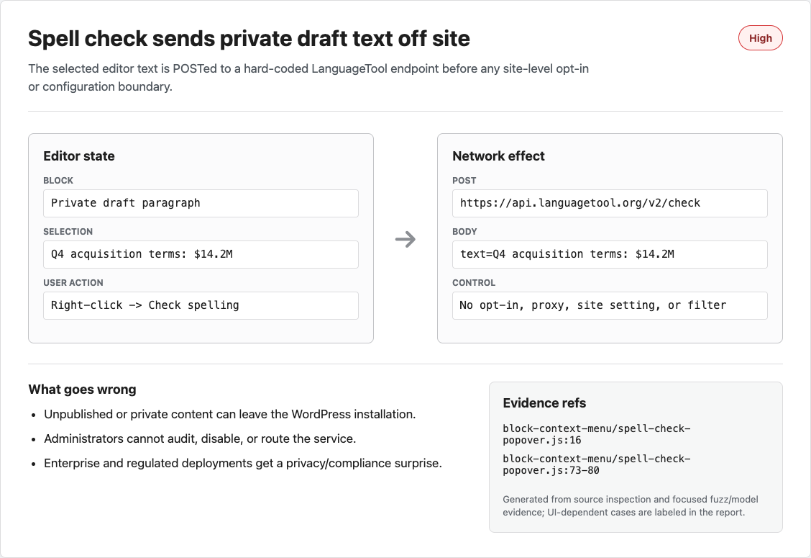
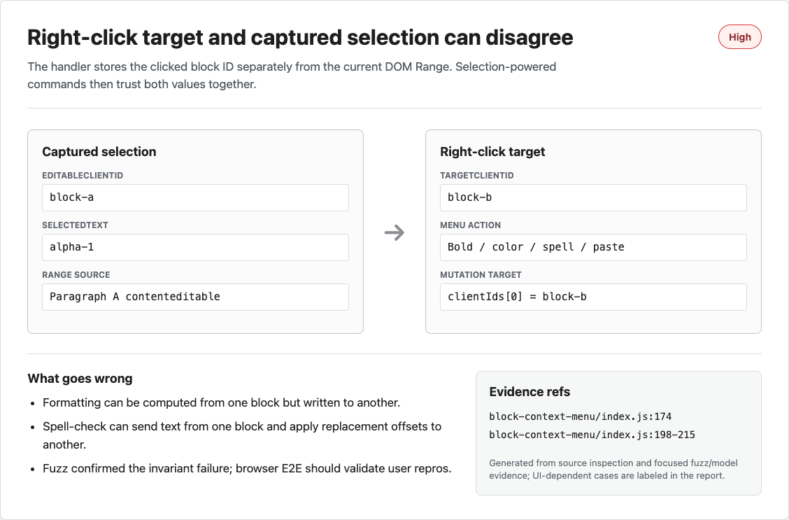
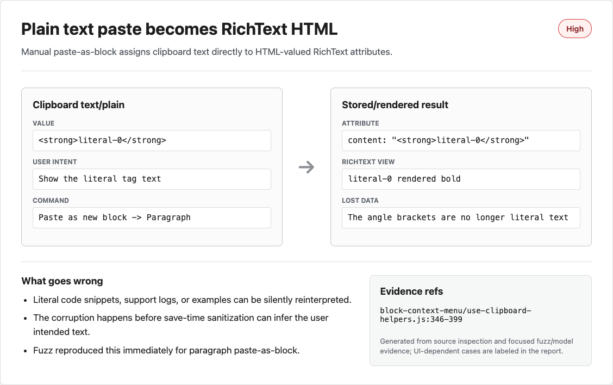
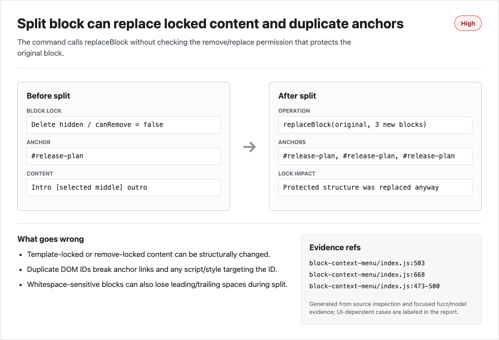
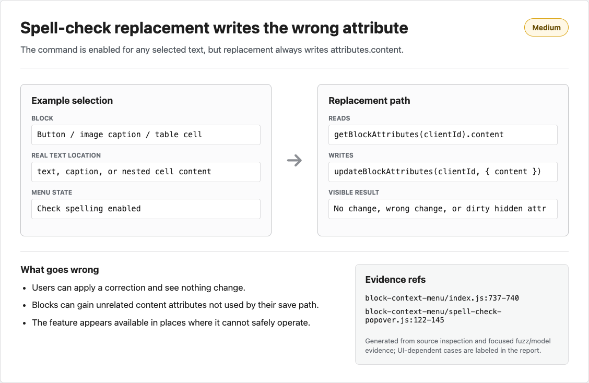
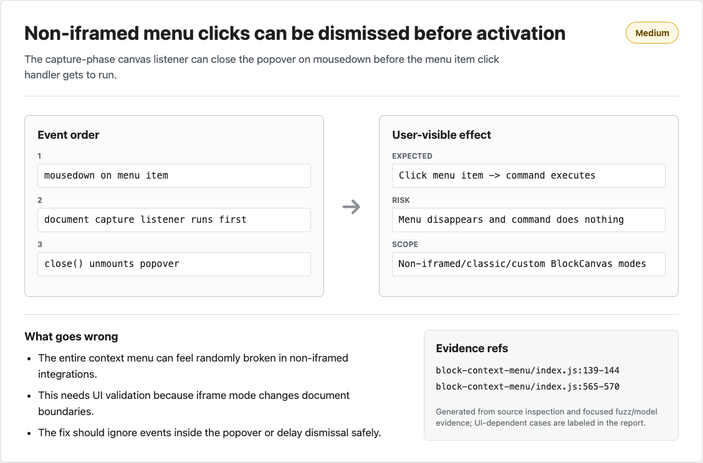
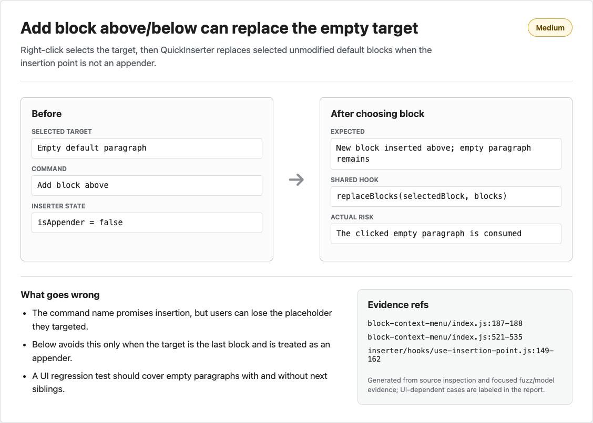
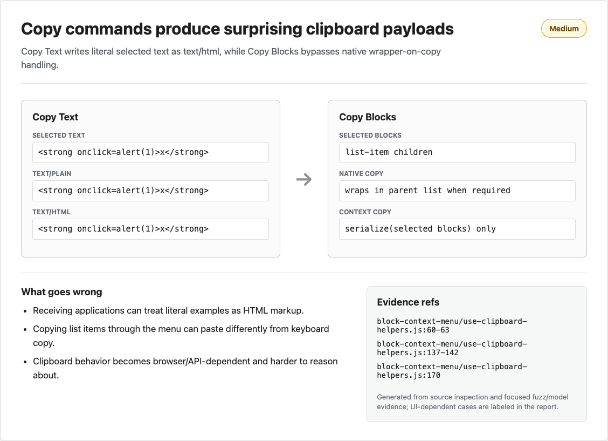
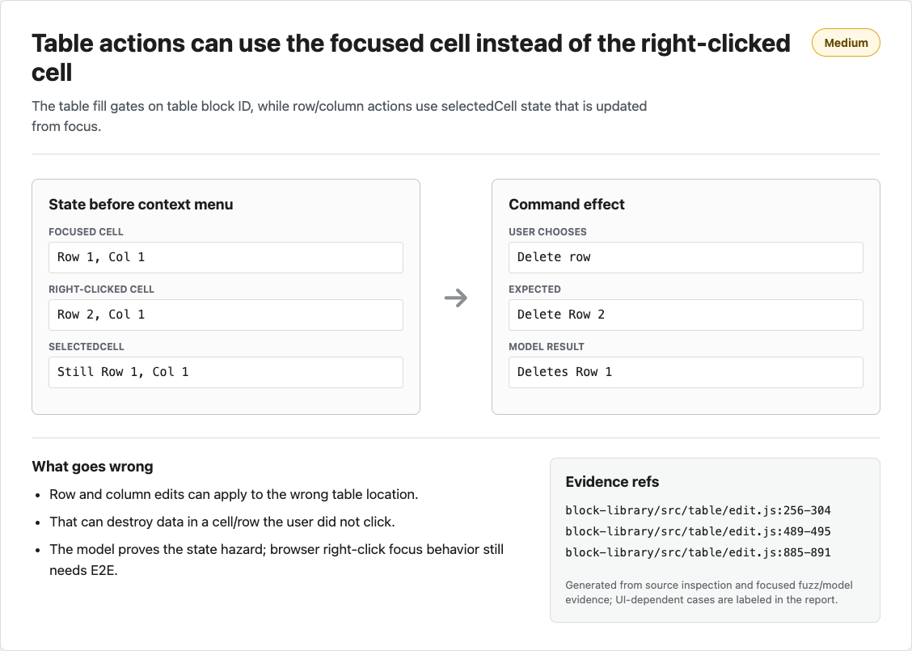
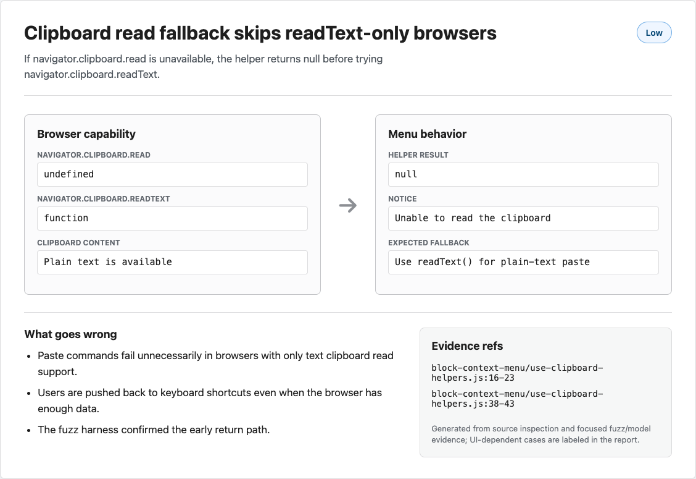

# Right-click Block Context Menu Review

Reviewed compare:
[`WordPress/gutenberg@trunk...s1sfa/gutenberg-right-click:add/block-context-right-click-menu`](https://github.com/WordPress/gutenberg/compare/trunk...s1sfa:gutenberg-right-click:add/block-context-right-click-menu)

Head checked:
[`da42e798c4514e3f76d9920e33bab155da060b1b`](https://github.com/s1sfa/gutenberg-right-click/commit/da42e798c4514e3f76d9920e33bab155da060b1b).

Code links below are SHA-pinned to the reviewed head. The report branch is [`try/claffin-right-click-review`](https://github.com/danluu/gutenberg/tree/try/claffin-right-click-review).

The change adds a custom block context menu, clipboard helpers, paste-as-block helpers, split-block behavior, paragraph formatting fills, a spell-check popover, and table context menu fills. The downloaded patch was 16 files and 2690 insertions.

The screenshots below are generated evidence cards from direct source inspection and focused fuzz/model results. They are not all full Gutenberg browser recordings. UI-dependent issues are explicitly labeled as needing browser E2E validation.

## Findings

### High: spell check sends selected editor text to a hard-coded third-party service

The new spell-check popover hard-codes LanguageTool and posts the selected text to it:

-   [`spell-check-popover.js:16`](https://github.com/s1sfa/gutenberg-right-click/blob/da42e798c4514e3f76d9920e33bab155da060b1b/packages/block-editor/src/components/block-context-menu/spell-check-popover.js#L16)
-   [`spell-check-popover.js:73-L80`](https://github.com/s1sfa/gutenberg-right-click/blob/da42e798c4514e3f76d9920e33bab155da060b1b/packages/block-editor/src/components/block-context-menu/spell-check-popover.js#L73-L80)



Impact:

-   Unpublished content can leave the WordPress installation. This can include private drafts, embargoed posts, internal notes, support logs, credentials pasted into a paragraph, legal text, or customer data.
-   Site owners and administrators get no policy control. There is no opt-in, site setting, proxy, self-hosted endpoint, filter, capability check, pre-action privacy disclosure, or clear way for locked-down deployments to disable the external call.
-   The request happens before a user can make an informed per-site decision. Any disclosure inside the popover is too late if the network request has already been sent.
-   The editor now depends on a third-party service for a core editing action. Outages, rate limits, network filtering, or privacy tooling can make the command fail unpredictably.

This should not ship as an unconditional editor feature. Remove it, make it explicitly opt-in and site-controlled, or route it through a configured service that installations can audit and disable.

### High: captured DOM selection is not tied to the block that was right-clicked

The context-menu handler derives the target block from the right-click target, then separately captures the current document selection:

-   target client ID: [`index.js:174`](https://github.com/s1sfa/gutenberg-right-click/blob/da42e798c4514e3f76d9920e33bab155da060b1b/packages/block-editor/src/components/block-context-menu/index.js#L174)
-   single-block selection: [`index.js:187-L188`](https://github.com/s1sfa/gutenberg-right-click/blob/da42e798c4514e3f76d9920e33bab155da060b1b/packages/block-editor/src/components/block-context-menu/index.js#L187-L188)
-   independent DOM range capture: [`index.js:198-L215`](https://github.com/s1sfa/gutenberg-right-click/blob/da42e798c4514e3f76d9920e33bab155da060b1b/packages/block-editor/src/components/block-context-menu/index.js#L198-L215)

Several later actions trust the range and the target client ID together:

-   paragraph inline formatting reads from the range and writes to `clientId`: [`paragraph-fills.js:75-L93`](https://github.com/s1sfa/gutenberg-right-click/blob/da42e798c4514e3f76d9920e33bab155da060b1b/packages/block-editor/src/components/block-context-menu/paragraph-fills.js#L75-L93)
-   color updates do the same: [`text-color-popover.js:169-L176`](https://github.com/s1sfa/gutenberg-right-click/blob/da42e798c4514e3f76d9920e33bab155da060b1b/packages/block-editor/src/components/block-context-menu/text-color-popover.js#L169-L176)
-   spell check sends and applies replacements from the captured range to `clientId`: [`spell-check-popover.js:62-L67`](https://github.com/s1sfa/gutenberg-right-click/blob/da42e798c4514e3f76d9920e33bab155da060b1b/packages/block-editor/src/components/block-context-menu/spell-check-popover.js#L62-L67), [`spell-check-popover.js:143-L145`](https://github.com/s1sfa/gutenberg-right-click/blob/da42e798c4514e3f76d9920e33bab155da060b1b/packages/block-editor/src/components/block-context-menu/spell-check-popover.js#L143-L145)
-   inline paste restores the captured range and executes DOM insertion: [`use-clipboard-helpers.js:263-L313`](https://github.com/s1sfa/gutenberg-right-click/blob/da42e798c4514e3f76d9920e33bab155da060b1b/packages/block-editor/src/components/block-context-menu/use-clipboard-helpers.js#L263-L313)



The focused fuzz harness reproduced the missing invariant:

```text
selection range is not validated against right-click target:
{"seed":1,"targetClientId":"b","editableClientId":"a","selectedText":"alpha-1"}
```

Impact:

-   Formatting can be computed from block A but written into block B. The user sees a context menu on one block, but the code can use selection state from a different contenteditable.
-   Spell check can send text from one block and apply replacement offsets against another block's `content` attribute. That can silently corrupt visible text or do nothing while still dirtying the post.
-   Paste-at-range can restore a stale range and insert into the old contenteditable, not the block under the context menu.
-   Third-party fills receive the same `range`, `selectionText`, and `clientIds` props, so the bug becomes an extensibility hazard as well as a core command hazard.

The implementation should disable selection-powered menu items unless the range's editable element belongs to the right-clicked block. Prefer carrying the editable's owning client ID through menu state and checking it before each action. This finding is source/fuzz confirmed, but a browser E2E pass should still pin down exact right-click selection behavior across browsers and editor modes.

### High: `Paste as new block` treats plain text as RichText HTML

The manual paste-as-block path reads clipboard plain text, then writes it directly into RichText-backed attributes:

-   clipboard text selection: [`use-clipboard-helpers.js:346-L352`](https://github.com/s1sfa/gutenberg-right-click/blob/da42e798c4514e3f76d9920e33bab155da060b1b/packages/block-editor/src/components/block-context-menu/use-clipboard-helpers.js#L346-L352)
-   paragraph/preformatted/list/table assignment: [`use-clipboard-helpers.js:371-L399`](https://github.com/s1sfa/gutenberg-right-click/blob/da42e798c4514e3f76d9920e33bab155da060b1b/packages/block-editor/src/components/block-context-menu/use-clipboard-helpers.js#L371-L399)



The fuzz harness found this immediately:

```text
plain text is stored as raw RichText HTML:
{"seed":0,"blockName":"core/paragraph","content":"<strong>literal-0</strong>"}
```

Impact:

-   A user who copies literal text such as `<strong>literal</strong>` expects those characters to appear. Instead, RichText interprets the value as markup-shaped content.
-   Code snippets, support logs, Markdown/HTML examples, security writeups, and customer-provided text can be silently changed as they enter the editor.
-   The same issue applies to list item content and table cell content, not just paragraphs.
-   Security impact depends on later sanitization and user capabilities, so "guaranteed XSS" is too strong. The confirmed bug is data corruption and unintended HTML interpretation before the save pipeline can infer the user's intent.

The fix should escape text or build RichText values from text instead of assigning raw text to HTML-valued attributes.

### High: `Split block` bypasses removal/template-lock checks

The menu enables split based on `canSplitBlock`, but not on whether the target can be removed or replaced:

-   menu gate: [`index.js:668-L675`](https://github.com/s1sfa/gutenberg-right-click/blob/da42e798c4514e3f76d9920e33bab155da060b1b/packages/block-editor/src/components/block-context-menu/index.js#L668-L675)
-   replacement call: [`index.js:503`](https://github.com/s1sfa/gutenberg-right-click/blob/da42e798c4514e3f76d9920e33bab155da060b1b/packages/block-editor/src/components/block-context-menu/index.js#L503)
-   action-level insertability check without a remove check: [`actions.js:379-L395`](https://github.com/s1sfa/gutenberg-right-click/blob/da42e798c4514e3f76d9920e33bab155da060b1b/packages/block-editor/src/store/actions.js#L379-L395)



Impact:

-   A block whose Delete action is unavailable through `canRemove` can still be replaced by split pieces if the replacement block types are insertable.
-   Remove-locked content can be structurally changed through a command that should be subject to the same constraints as replacement/removal.
-   This can break curated editor experiences where a theme, pattern, or template intentionally fixes required blocks in place.
-   Auditability suffers: the UI says removal is not allowed, but another nearby menu action performs a replacement that removes the original block identity.

Split is semantically a replace/remove operation and should honor the same block lock constraints. Remove locks are the strongest source-confirmed repro target. Template-lock variants should still get UI coverage because `replaceBlocks` checks insertability and can no-op under stricter template locks.

### Medium: spell-check replacements always write the top-level `content` attribute

The menu enables `Check spelling` for any highlighted text:

-   [`index.js:737-L740`](https://github.com/s1sfa/gutenberg-right-click/blob/da42e798c4514e3f76d9920e33bab155da060b1b/packages/block-editor/src/components/block-context-menu/index.js#L737-L740)

The replacement path always reads and writes the target block's top-level `content` attribute:

-   [`spell-check-popover.js:122-L145`](https://github.com/s1sfa/gutenberg-right-click/blob/da42e798c4514e3f76d9920e33bab155da060b1b/packages/block-editor/src/components/block-context-menu/spell-check-popover.js#L122-L145)



Impact:

-   This is only correct for blocks whose selected RichText is backed by `attributes.content`.
-   It is wrong for button text, image captions, table cells, and other blocks where the selected text lives in another attribute or nested structure.
-   Users can apply a correction and see no visible change, or the block can gain a dirty unrelated `content` attribute that its save path ignores.
-   The feature appears available in places where it cannot safely operate, which makes it hard for users to trust the menu.

The spell-check action needs to know which RichText field it is operating on, or it should be disabled outside supported fields.

### Medium: split duplicates whole-block attributes and trims whitespace-sensitive content

`splitBlockAs` spreads all original attributes into every resulting block:

-   [`index.js:473-L500`](https://github.com/s1sfa/gutenberg-right-click/blob/da42e798c4514e3f76d9920e33bab155da060b1b/packages/block-editor/src/components/block-context-menu/index.js#L473-L500)

The same code trims all split fragments:

-   trim helper: [`index.js:49-L62`](https://github.com/s1sfa/gutenberg-right-click/blob/da42e798c4514e3f76d9920e33bab155da060b1b/packages/block-editor/src/components/block-context-menu/index.js#L49-L62)
-   trim calls: [`index.js:465-L471`](https://github.com/s1sfa/gutenberg-right-click/blob/da42e798c4514e3f76d9920e33bab155da060b1b/packages/block-editor/src/components/block-context-menu/index.js#L465-L471)
-   generic enablement for any block with a `content` attribute and no inner blocks: [`index.js:311-L329`](https://github.com/s1sfa/gutenberg-right-click/blob/da42e798c4514e3f76d9920e33bab155da060b1b/packages/block-editor/src/components/block-context-menu/index.js#L311-L329)


Impact:

-   Blocks with an `anchor` can produce multiple blocks with the same DOM ID. Anchor navigation, table-of-contents links, CSS, and scripts that target that ID can go to or affect the wrong block.
-   Other per-block metadata can also be copied into fragments where it no longer makes sense. For transformed middle blocks, `switchToBlockType` may drop or normalize some attributes; the same-type/original fragments are the clearest source-confirmed duplication path.
-   Code, preformatted, and verse content can lose leading or trailing whitespace even though that whitespace is semantically meaningful.
-   The bug is easy to miss in ordinary paragraph testing because paragraph whitespace is often visually collapsed.

Split should copy only attributes that are semantically valid for each fragment, and it should preserve whitespace for block types that require it.

### Medium: non-iframed editors can close the menu before menu-item clicks fire

The menu installs capture-phase `mousedown` and `keydown` listeners on the canvas document:

-   [`index.js:139-L144`](https://github.com/s1sfa/gutenberg-right-click/blob/da42e798c4514e3f76d9920e33bab155da060b1b/packages/block-editor/src/components/block-context-menu/index.js#L139-L144)

The popover is rendered in the same document context for non-iframed editors:

-   [`index.js:565-L570`](https://github.com/s1sfa/gutenberg-right-click/blob/da42e798c4514e3f76d9920e33bab155da060b1b/packages/block-editor/src/components/block-context-menu/index.js#L565-L570)



Impact:

-   In non-iframed/classic/custom `BlockCanvas` integrations, a mousedown on a menu item can hit the capture listener first, call `close()`, unmount the menu, and prevent the later click handler from running.
-   To the user, the menu can appear to dismiss without doing anything. This is a high-friction failure because it affects basic commands like copy, paste, split, and delete.
-   The bug may not reproduce in the default iframed editor because document boundaries differ, so this needs a browser matrix test rather than only source inspection.

The dismiss handler should ignore events inside the popover, or otherwise avoid unmounting before menu item activation.

### Medium: Add block above/below can replace an empty default block instead of inserting

Right-clicking a single block selects that block:

-   [`index.js:187-L188`](https://github.com/s1sfa/gutenberg-right-click/blob/da42e798c4514e3f76d9920e33bab155da060b1b/packages/block-editor/src/components/block-context-menu/index.js#L187-L188)

The `Add block above` path passes the target as the inserter client ID with `isAppender = false`; `Add block below` also uses `isAppender = false` when there is a next sibling:

-   [`index.js:521-L542`](https://github.com/s1sfa/gutenberg-right-click/blob/da42e798c4514e3f76d9920e33bab155da060b1b/packages/block-editor/src/components/block-context-menu/index.js#L521-L542)

The shared QuickInserter insertion hook replaces the selected block when it is an unmodified default block and `isAppender` is false:

-   [`use-insertion-point.js:149-L162`](https://github.com/s1sfa/gutenberg-right-click/blob/da42e798c4514e3f76d9920e33bab155da060b1b/packages/block-editor/src/components/inserter/hooks/use-insertion-point.js#L149-L162)



Impact:

-   The commands are named "Add block above" and "Add block below", so users expect insertion, not replacement of the clicked block.
-   When the clicked target is an empty default paragraph, the inserter can consume that placeholder instead of preserving it.
-   `Add block below` has a sibling-dependent behavior: the last-block appender path avoids this, while the next-sibling path can hit the replacement logic.
-   This is not as severe as deleting user-authored text, but it is still a surprising workflow bug and can make block placement feel inconsistent. It can also discard intentional empty-block state or non-content attributes on a block that otherwise counts as an unmodified default block.

This needs a UI regression test with empty paragraph targets, both with and without a following sibling.

### Medium: `Copy Text` writes literal selected text as `text/html`

`writeSystemClipboard` always publishes both MIME types:

-   [`use-clipboard-helpers.js:50-L63`](https://github.com/s1sfa/gutenberg-right-click/blob/da42e798c4514e3f76d9920e33bab155da060b1b/packages/block-editor/src/components/block-context-menu/use-clipboard-helpers.js#L50-L63)

`useCopyTextToClipboard` passes the same selected text as both HTML and plain text:

-   [`use-clipboard-helpers.js:162-L170`](https://github.com/s1sfa/gutenberg-right-click/blob/da42e798c4514e3f76d9920e33bab155da060b1b/packages/block-editor/src/components/block-context-menu/use-clipboard-helpers.js#L162-L170)



The fuzz harness reproduced a literal selected string becoming an HTML clipboard payload:

```text
raw text/html from Copy Text:
{"seed":17,"text":"<strong onclick=alert(1)>x</strong>","html":"<strong onclick=alert(1)>x</strong>"}
```

Impact:

-   HTML-capable receiving applications can render, strip, sanitize, or transform literal examples as markup.
-   A user copying a code sample from the editor can paste a different representation into chat, documentation, email, or another editor.
-   The WordPress editor may sanitize dangerous payloads on paste, but clipboard data is shared with the operating system and other applications. The safe contract for plain-text copy is to omit `text/html` or HTML-escape it.

This is not proof that the example payload executes in WordPress. It is proof that the menu writes the wrong MIME payload.

### Medium: context-menu block copy bypasses native wrapper-on-copy behavior

The new copy path serializes selected blocks directly:

-   [`use-clipboard-helpers.js:131-L142`](https://github.com/s1sfa/gutenberg-right-click/blob/da42e798c4514e3f76d9920e33bab155da060b1b/packages/block-editor/src/components/block-context-menu/use-clipboard-helpers.js#L131-L142)

The native copy path has special handling for block types that require their parent wrapper on copy:

-   [`writing-flow/utils.js:30-L61`](https://github.com/s1sfa/gutenberg-right-click/blob/da42e798c4514e3f76d9920e33bab155da060b1b/packages/block-editor/src/components/writing-flow/utils.js#L30-L61)

`core/list-item` opts into that behavior:

-   [`list-item/index.js:36`](https://github.com/s1sfa/gutenberg-right-click/blob/da42e798c4514e3f76d9920e33bab155da060b1b/packages/block-library/src/list-item/index.js#L36)


Impact:

-   Copying list items through the context menu can produce different clipboard HTML from keyboard/native copy.
-   Pasted list items can lose their expected list wrapper, indentation, numbering, or surrounding list semantics.
-   The same user selection has two copy semantics depending on whether the keyboard shortcut or context menu was used.

The context-menu path should reuse the native block clipboard serialization helper instead of duplicating only part of it.

### Medium: table context-menu operations use the focused cell, not the clicked cell

The table fill only checks that the right-clicked block is the current table:

-   [`table/edit.js:489-L495`](https://github.com/s1sfa/gutenberg-right-click/blob/da42e798c4514e3f76d9920e33bab155da060b1b/packages/block-library/src/table/edit.js#L489-L495)

The row and column actions operate on `selectedCell`:

-   row operations: [`table/edit.js:256-L304`](https://github.com/s1sfa/gutenberg-right-click/blob/da42e798c4514e3f76d9920e33bab155da060b1b/packages/block-library/src/table/edit.js#L256-L304)
-   column operations: [`table/edit.js:312-L330`](https://github.com/s1sfa/gutenberg-right-click/blob/da42e798c4514e3f76d9920e33bab155da060b1b/packages/block-library/src/table/edit.js#L312-L330)
-   focus-derived state update: [`table/edit.js:885-L891`](https://github.com/s1sfa/gutenberg-right-click/blob/da42e798c4514e3f76d9920e33bab155da060b1b/packages/block-library/src/table/edit.js#L885-L891)



Impact:

-   If a user right-clicks a cell different from the one currently focused and the browser does not update focus before the context menu action runs, row and column operations can apply to the old cell.
-   A destructive command such as delete row can remove data from a row the user did not click.
-   Non-destructive commands such as insert row, insert column, or alignment can still modify the wrong table location and confuse the document structure.
-   The focused model harness reproduced the stale-state behavior, but this one should be validated with browser E2E because right-click focus behavior varies.

The table context menu should derive the target cell from the context-menu event target, not only from the last focused RichText state.

### Low: clipboard read fallback misses `readText`-only browsers

`readSystemClipboard` returns `null` when `navigator.clipboard.read` is absent:

-   [`use-clipboard-helpers.js:16-L23`](https://github.com/s1sfa/gutenberg-right-click/blob/da42e798c4514e3f76d9920e33bab155da060b1b/packages/block-editor/src/components/block-context-menu/use-clipboard-helpers.js#L16-L23)

The `readText` fallback only runs inside the `read()` catch path:

-   [`use-clipboard-helpers.js:38-L43`](https://github.com/s1sfa/gutenberg-right-click/blob/da42e798c4514e3f76d9920e33bab155da060b1b/packages/block-editor/src/components/block-context-menu/use-clipboard-helpers.js#L38-L43)



Impact:

-   Paste commands fail unnecessarily in browsers that expose `readText()` but not rich `read()`.
-   Users get an "Unable to read the clipboard" notice even when the browser has enough plain-text data for a useful paste.
-   This disproportionately affects fallback/browser-compatibility paths, which are exactly where graceful degradation matters.

The fallback should be attempted whenever `readText` exists and rich clipboard read is unavailable.

## Fuzz and Test Evidence

The review used an isolated patched worktree at:

`/tmp/gutenberg-right-click-fuzz-worktree-202605161246`

Focused fuzz harnesses were added under:

`/tmp/gutenberg-right-click-fuzz-worktree-202605161246/tools/right-click-fuzz/`

Harnesses and results:

-   `clipboard-fuzz.mjs`: failed on raw `text/html` from `Copy Text` and skipped `readText` fallback.
-   `paste-as-block-fuzz.cjs`: failed on raw RichText HTML storage for paragraph paste-as-block.
-   `range-target-fuzz.mjs`: failed on selection range not matching right-click target client ID.
-   `table-cell-target-fuzz.mjs`: failed on stale focused table cell model; treat as a UI-validation risk, not a full browser reproduction by itself.

The relevant logs are in:

`/tmp/gutenberg-context-menu-review-20260516122957/fuzz-results/`

Other validation:

-   The compare branch head was checked by remote ref lookup: `da42e798c4514e3f76d9920e33bab155da060b1b`.
-   The patch applied cleanly to the isolated worktree based on local `origin/trunk` at `8c11289526ef807331bea68fc18409ef7283573d`.
-   `npm run lint:js -- packages/block-editor/src/components/block-context-menu packages/block-editor/src/components/block-context-menu-controls packages/block-library/src/table/edit.js` did not run to a useful result because the isolated symlinked dependency setup reported a missing ESLint rule from `@wordpress/eslint-plugin`.
-   `npm run test:unit -- --runTestsByPath packages/block-editor/src/components/block-context-menu/index.js` found no matching tests for the new component path.

Discounted evidence:

-   Initial fuzz logs that failed with harness syntax/runtime bugs were not used as product evidence; only rerun logs were used.
-   "Guaranteed XSS" is too strong for the paste/copy findings. The supported claim is plain text being interpreted as HTML-shaped RichText or clipboard HTML, with exploitability dependent on sanitization and capabilities.
-   Hard-coded `core/*` paste submenu entries in [`paste-new-block-submenu.js:26-L31`](https://github.com/s1sfa/gutenberg-right-click/blob/da42e798c4514e3f76d9920e33bab155da060b1b/packages/block-editor/src/components/block-context-menu/paste-new-block-submenu.js#L26-L31) are layering and UX debt, but claims of guaranteed invalid insertion are weaker because insertion paths filter disallowed block types.

## Review Method

The review used independent `codex exec` runs in tmux with xhigh reasoning effort for five named review passes plus a contrarian pass, then two cross-analysis loops over the prior responses. A separate fuzz-target loop with the same names selected risky areas to exercise. A follow-up impact pass used eight more parallel `codex exec` tmux sessions for bug-impact detail, screenshot planning, and link hygiene.

The final report was written from the consensus issues, direct code inspection, focused fuzz harness results, and the impact-pass outputs.
