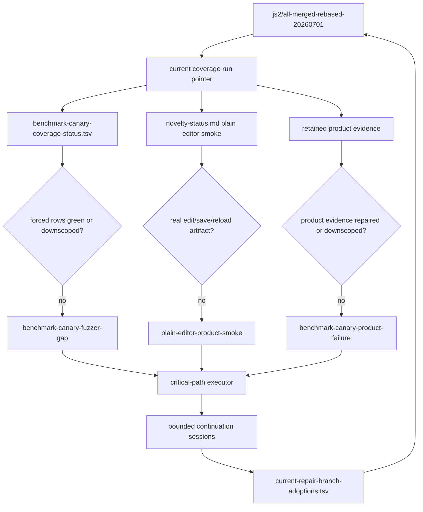
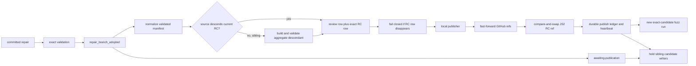

# RTC Browser Fuzzing Pipeline Runbook

This runbook captures the local long-running Gutenberg RTC browser fuzzing setup
used for the multi-day HTTP, WebSocket, multi-level triage, and monitoring
campaigns. It is intended to be enough for another agent or another machine to
start, stop, resume, monitor, and extend the same pipeline without relying on
chat history.

The pipeline has four durable parts:

-   A fixed fuzz base branch that contains trunk plus only intended RTC fixes.
-   A supervised browser fuzz campaign with HTTP, HTTP-persistence, and WebSocket groups.
-   A multi-level triage system that separates cheap Codex-only analysis from expensive browser repro work.
-   A periodic monitor that watches resources, queues, stale lanes, duplicate gating, and job recovery.

For a long run, treat each durable part as a service with a tmux owner. Do not
leave one-shot commands as the only copy of an important process.

## Current Operator Snapshot

Snapshot time: `2026-07-11T05:08Z`

The active all-merge candidate is `js2/all-merged-rebased-20260701` at
`a4bb48b9ad471000c7eaae4694c3310c15e43280`. This is the validated monotonic
aggregate of the previously bypassed `d065892a` repair line and the newer
`17c7e68f` candidate line. Coverage replacement is serialized behind
`start-v2.lock`; always read the pointer rather than relying on a snapshot run
name:

```bash
cat /media/volume/danluu-fuzz-data/rtc-coverage-guided-20260515/current-output-dir.txt
```

At this snapshot the pointer is `run-20260711T043332Z`, whose
`source-manifest.tsv` names exact candidate `a4bb48b9`. The serialized build and
pointer transition completed, five protected canary groups are running, and all
newly launched critical worktrees use the same head.

Every current run must contain `source-manifest.tsv` with mode
`exact-candidate-plus-harness-overlay`. The product tree comes from the named
candidate ref, not the mutable dirty checkout. The persistent candidate source
is `/media/volume/danluu-fuzz-data/rtc-coverage-guided-20260515/candidate-source`.
Its exact `npm ci` dependencies and production build are reused for the same
head; isolated group repos copy product/build files and symlink that dependency
set. The versioned harness comes from the validation repo and is frozen into
that worktree. Isolated group overlays include browser-runtime files only;
guard, scheduler, PR, and runbook controller scripts must not invalidate active
browser repos. The monitor and live-analysis processes must run from the frozen
worktree, and the manifest hashes for the monitor, runner,
supervisor, live-analysis monitor, and triage watcher must match its files. The
live-analysis coordinator may read the frozen tree, but every Codex child must
run from the matching generation's disposable isolated group repo. There is no
live-checkout write exception: in-generation coverage guidance is disabled.
Structural repair uses a disposable proposal workspace, and guard diagnostics
are read-only. Versioned harness changes are reviewed and deployed explicitly,
then a controlled generation restart records their new hashes.

Operational invariants added by the July 10 audit:

-   `rtc-fuzz` owns browser/core services; `rtc-analysis` owns live analysis.
-   Never run `capture-pane` on this host. A disposable-socket probe also crashed
    the installed tmux build, so the versioned wrapper and
    `/usr/local/bin/tmux` reject both `capture-pane` and `capturep` for every
    socket, including explicit `-L` and `-S` forms. Read status artifacts or use
    `list-*`, `show-*`, and `display-message` instead.
-   `RTC_COVERAGE_FORCE_RESTART=1` is one-shot. Child monitors and the permanent
    session watchdog must see zero or an unset value.
-   No Codex process may use the live validation checkout as a writable cwd. The
    guard terminates one if found; structural health reports it. A structural
    repair edits only its `runs/<timestamp>-<key>/workspace`, leaves
    `proposed.patch` and `proposal-status.tsv`, and cannot restart services.
-   Productive-analysis Codex uses its per-lane directory with
    `workspace-write`. Focused-gap reviews are off by default and read-only when
    enabled. PR-progress report/persona jobs use read-only or per-run workspace
    sandboxes; a branch-repair job must create a detached Git worktree under its
    run directory before using a writable sandbox.
-   Keep `RTC_JETSTREAM_ENABLE_DUPLICATE_NOISE_REVIEW=0` during normal fuzzing.
    Current-run duplicate/noise metrics and gate-only triage still run. An
    explicitly enabled persona round is read-only and must route a concrete
    proposal through an isolated structural/critical adoption path.
-   Do not remediate zero materialization during the first 900 seconds of a run.
-   Do not publish more groups than the active resource budget.
    `RTC_FUZZ_NOVELTY_MAX_ENABLED_GROUPS` is a hard ceiling during bootstrap and
    steady state. Coverage-gap reserves may reorder or replace budgeted groups;
    they may not add slots. Structural health compares both the current group
    file and recent monitor publication decisions with the locked maximum.
    `rtc-browser-fuzz-novelty-policy-check.mjs` is a fail-closed source admission
    check in both the launcher and guard. It protects the hard slot cap and the
    candidate/compatibility-scoped first-green carry. Coverage guidance must
    remain disabled. If the live control copy drifts from an aged active
    generation, the guard stops control-cwd writers and atomically restores the
    frozen validated file without replacing the current run.
-   Under a deadline or strict producer cap, only the final budgeted publication
    planner may rotate zero-coverage groups. Do not pause or terminate an
    incumbent in an earlier scheduling loop: the final planner may choose a
    different replacement, wasting the incumbent's `wp-env` and browser setup.
    The fail-closed novelty policy checker enforces this single-owner rule.
-   Isolated repo manifests include browser runner, triage/analysis helpers,
    collaboration tests/config, provider, and WebSocket test server. They exclude
    novelty/supervisor control scripts and every operational `rtc-*` controller.
    A control deployment must not terminate browser lanes unless it changes a
    browser-runtime file.
-   Snapshot `current-budget.env` while holding the serialized coverage-start
    lock and apply those concurrency/cap fields unchanged. Benchmark feedback may
    choose lanes, but the launcher must not recalculate concurrency after the
    snapshot. Autoscaler write/restart helpers likewise apply the main loop's
    decision without re-reading a mutable benchmark floor. Structural health
    compares the decision, global budget, generated run script, and startup
    snapshot so a split-brain budget fails visibly.
-   Do not rotate plain-editor or real-world product smoke before each has a
    successful current-run record.
-   First-green success is monotonic for one candidate head and
    `state_compatibility_sha256`. Record the evidence scope and satisfied groups
    in novelty state; do not republish the same gate because a producer directory
    or output root rotated and active-only counters returned to zero. Candidate
    or evidence-contract changes reset the gate and require a new green. Deadline
    benchmark closure must consume the same scoped marker; it must not pin the
    satisfied smoke lane merely because the operational output directory changed.
-   Human product smoke and every `wp-env`/Docker topology mutation share the
    root-local kernel lock `.network-topology.lock`. Classify a preflight from
    the full command output; `ERR_NETWORK_CHANGED` is an invalid environment
    run, not candidate product evidence. Match explicit harness/environment
    failures rather than command-line tokens such as `playwright.config.ts`, and
    retain an 80-line failure excerpt so the runtime error is not discarded.
-   Pass `RTC_FUZZ_SUPERVISOR_CURRENT_OUTPUT_POINTER` to every supervisor. A
    supervisor that no longer owns the path named by `current-output-dir.txt`
    must terminate its lanes and exit.
-   A stopped lane with failed behavioral product evidence is not an
    infrastructure restart. Quarantine the group as `paused-product-failure`
    until the candidate changes, remove it from the runnable producer budget,
    backfill the slot, and leave the durable failure to the critical repair
    controller.
-   `productFailureRunDirs` remain live analysis inputs after their producer is
    paused. The live monitor, first-level analysis tier, and deep-analysis tier
    must retain one owner through handoff instead of marking the source stale
    because it left `activeRunDirs`.
-   Candidate-keyed `likely_real` product failures remain open across unrelated
    descendant candidate advances. The critical executor scans the current head
    and ancestor-head JSON directories, dedupes group/signature pairs, and keeps
    one aggregate product-repair owner until a relevant fix has three exact
    same-head green repetitions or an explicit source-backed downscope.
-   Normalize both the frozen candidate repo and the derived isolated group repo
    to `<REPO_ROOT>` before hashing a failure. Two one-shot watchers must not
    launch duplicate analysis for the same summary record under different path
    spellings.
-   Exactly one novelty monitor may own a run root. Its
    `.novelty-monitor-process.json` lock prevents an orphan and a replacement from
    racing on scheduler state.
-   A missing novelty tmux session does not by itself justify replacing the run.
    The guard first validates source provenance and supervisor state, terminates a
    matching orphan, and runs `reattach-coverage-once` against the same root.
-   The generic session watchdog must use the same reattach-first command. A full
    launcher restart is the fallback only when reattach rejects the current root.
    `reattach-coverage-once` is safe to call when the session is already healthy.
-   Every novelty monitor receives the authoritative output pointer. The launcher
    and guard terminate monitors whose `RTC_FUZZ_NOVELTY_OUTPUT_DIR` no longer
    matches it, including the build-time race where the session watchdog
    reattached the previous root before the pointer moved.
-   Product-failure quarantine is candidate-and-evidence-contract scoped, not
    merely run-root-scoped. Preserve the carried list when a fresh supervisor has
    no rows, but reset scheduling state when either the candidate head or
    `state_compatibility_sha256` changes. The compatibility hash covers the
    runner, supervisor, human-smoke spec, and fuzz spec; historical roots may
    remain aggregate coverage inputs after this reset.
-   No Codex process may have a current directory inside `candidate-source`.
    Refuse live analysis when a disposable group repo is unavailable, and replace
    an existing analysis tmux session if its pane directory is not that repo.
-   A declared frozen harness hash mismatch does not require throwing away a run
    when the validation repo still has the exact manifest hash. Stop an offending
    candidate-rooted Codex process and atomically restore that one file in place;
    replace the run only when exact restoration or another source invariant
    fails.
-   If a critical harness file intentionally advances in the writable validation
    checkout, wait through the publication grace and perform one controlled run
    reload so the new frozen manifest adopts it. Do not copy it into a live
    candidate snapshot in place.
-   Versioned controller scripts in the validation repo take precedence over
    `/tmp/start_*` wrappers. The guard verifies that PR progress uses the installed
    runtime with `RTC_PR_PROGRESS_PERSONA_EVERY_CYCLES=0` unless personas were
    explicitly enabled.
-   Count critical continuations by the union of normalized tmux-session and
    worktree identities. Adding session and process counts double-counts normal
    jobs and can suppress forced repair work at the concurrency cap.
-   Count Codex workers by leaf worker processes. A timeout wrapper, Node launcher,
    and native Codex process are one worker, not three.
-   JS2 uses Codex CLI `0.144.1` or newer and model `gpt-5.6-sol` for every
    unattended agent. Use `high` for high-volume first-pass classification and
    persona review, `xhigh` for deep triage, synthesis, planning, and read-only
    diagnosis, and `max` for code-changing repair, adoption, deferred promotion,
    finalization, or coverage-harness work. Do not use `ultra` in controller-owned
    jobs: it enables automatic task delegation, which escapes the pipeline's leaf
    worker accounting and eight-worker cap. The global Codex default is `xhigh`;
    launchers must set `max` explicitly for repair roles.
-   The guard writes
    `/media/volume/danluu-fuzz-data/rtc-jetstream-guard-20260515/current-codex-model-policy.tsv`.
    It reports a CLI below `0.144.1`, pre-5.6 model references in canonical
    launchers, and active workers on another model. Model drift is visible but
    does not terminate an in-flight writable worker; repair work must reach a
    checkpoint before the owning controller is replaced.
-   Guard and structural supervision are reciprocal. The structural watchdog
    verifies the guard PID and exact `run-locked` command every cycle and starts
    it through the guard's stale-lock cleanup when absent. The guard removes
    optional analysis sessions on a non-policy model even below the worker cap,
    trims optional fanout above the cap, and refreshes stable optional launchers
    from their versioned sources before considering a pool restart.
-   PR finalization is a singleton service. Its generated runtime holds
    `pr-finalization-loop.lock`, records `pr-finalization-loop.pid`, and closes
    the lock descriptor in sleeps. The launcher and guard terminate exact-argv
    orphan controllers before starting or supervising the tmux owner; an old
    orphan must never keep launching jobs with stale model or branch policy.
-   Repair adoption is a commit-ancestry fact as well as a publish-manifest fact.
    If the repair commit is already an ancestor of the release candidate, report
    `adopted-to-release-candidate` and require replay; do not queue another merge.
-   A validated adoption is not complete until the release-candidate destination
    has a durable local-publisher receipt. A standalone review branch is not that
    receipt. While an adoption is `awaiting-publication`, exact-stack, product,
    focused, and aggregate candidate writers stay held so a sibling cannot move
    the release candidate around the validated head.
-   Preserve an explicit `js2/all-merged-rebased-20260701` row from the validated
    adoption manifest when its source is a strict descendant of the current
    candidate. Compute validation and diff statistics over the full current-RC to
    source range, not the continuation's narrow repair base. Manifest generation
    fails closed if normalization drops that destination. If the candidate has
    already moved to a sibling, mark the adoption stale and build one validated
    aggregate descendant; never force-push or silently publish only the side
    branch.
-   Every repair continuation starts from the exact release-candidate ref. Before
    accepting its output, invalidate it when the candidate moved and the repair is
    neither an ancestor nor a descendant of the new head. This prevents a stale
    worktree from winning a later fast-forward race.
-   A repeated plain-editor `blocked_specific` result must advance to server-side
    evidence. The follow-up writes `server-error.tsv` with the wp-sync response,
    callback, source location, and PHP stack before it may classify or repair.
-   A plain WordPress edit/save/reload pass is not proof for the RTC product-smoke
    gate. `smoke_green` and `harness_or_scheduler_repaired` require
    `rtc-save-proof.tsv` with a `wp-sync-save`, `success`, 2xx row for the exact
    release-candidate head. `server-error.tsv` with `result=not_reached`, or any
    retained plain-editor product-failure quarantine, keeps the gate open.
-   The generic zero-active/zero-record materialization heuristic must not open
    before the 900-second coverage startup grace. Explicit monitor crashes,
    oversized state, and stale first-pass/supervisor state remain immediate after
    their own bounded checks.
-   A continuation's `vendor` must be a real directory inside its worktree, not
    an absolute symlink to the source checkout. Use a hard-linked snapshot so the
    wp-env container can load `vendor/autoload.php` from the mounted plugin path.
-   Detached adoption-validation worktrees follow the same rule: symlink
    `node_modules`, but populate the tracked `vendor` directory with an
    in-worktree hard-linked snapshot. Bound isolated `wp-env start` to 300 seconds
    and cleanup to 120 seconds; structural health terminates a continuation-local
    startup still present after 600 seconds.
-   Escape Markdown backticks in any unquoted shell heredoc used to generate a
    Codex prompt. Otherwise example commands are executed by the controller while
    it writes the prompt.
-   Limit first- and second-level live analysis to one worker per admitted
    generation. Count leaf `codex` processes, not timeout/node wrappers. If total
    workers exceed eight, pause optional analysis launchers and terminate their
    owning tmux jobs before repair, adoption, or finalization workers. Do not
    restart optional analysis until the count is below four; browser fuzzing
    itself remains active.
-   Per-generation analysis tmux sessions are autonomous loops. When the global
    worker cap is exceeded, stop them by their exact optional session prefixes as
    well as through pane/cwd ownership. The guard writes
    `rtc-jetstream-guard-20260515/optional-analysis-cap-hold.tsv` and blocks
    optional launcher admission for 900 seconds after a trim. Without that hold,
    the launchers can recreate 8-10 workers between two-minute guard passes and
    turn the cap into a sawtooth instead of a bound.
-   Every gate-only triage caller must spawn the refresh in its own process group
    and escalate timeout cleanup from `SIGTERM` to `SIGKILL`. Health distinguishes
    a forbidden Codex descendant from a metadata-only refresh stalled for three
    minutes and calculates age from `/proc`, not an unchecked `ps etimes` value.
-   Apply that `/proc/<pid>/stat` and `/proc/uptime` rule to runaway scan
    detection as well. A wrapped `ps etimes` value once turned a seconds-old,
    bounded status probe into a false multi-year runaway and launched an
    unnecessary repair. If the PID exits between the process snapshot and the
    `/proc` read, skip it instead of manufacturing an age.
-   Never call a strict-mode cycle as `run_once || log ...` or directly from an
    `if` condition. Bash disables `errexit` inside a function used in those
    conditional positions, so failed commands can produce partial manifests or
    stale status while the loop appears healthy. Run each cycle in an explicit
    subshell with `set -e`, temporarily disable `errexit` only in the parent to
    collect `cycle_rc`, and log that exact status. Structural health statically
    checks this contract for the structural watchdog, PR controller, productive
    analysis, and local publisher.
-   Health checks that intentionally have nothing to inspect must use
    `return 0`. A bare `return` after a failed guard such as
    `[ "$age" -lt "$grace" ] || return` propagates status 1 and aborts a real
    strict pass. This was hidden by the conditional-`errexit` bug until the loop
    was corrected.
-   Forced current-run benchmark coverage owns the promotion gate while any
    required row is still open. Do not launch another exact-stack repair merely
    because historical feedback says `promotion_blocked`; that spends a Codex
    slot on a result coverage cannot yet accept. Keep the lane classified as
    `coverage-confidence`, let the coverage controller finish or explicitly
    downscope every forced row, and only then admit exact-stack repair work.
-   Isolated-repo overlay sync writes a short-lived
    `syncing:<expected-signature>` manifest sentinel before atomically publishing
    the final manifest. Structural health grants that exact sentinel at most 120
    seconds of grace, and only while every critical file hash already matches.
    A stale sentinel, a different expected signature, or any mismatched file is
    still harness drift. This prevents a normal sync transition from launching a
    structural repair without weakening stale-drift detection.
-   A `repair_branch_adopted` manifest is not trusted to choose its own final
    destination. The critical controller retargets only a strict descendant of
    the current candidate to `js2/all-merged-rebased-20260701`, removes no-op and
    stale/sibling rows, and records the decision in `manifest-normalization.tsv`.
-   Exact-stack, focused exact, and aggregate product-repair continuation dedupe
    keys include the current release-candidate head. Feedback/signature hashes
    alone are insufficient: an old-head completion must not impose its 30-minute
    cooldown on exact replay after an accepted candidate fast-forward. Structural
    health verifies the candidate-scoped key in all three executor copies.
-   Generated collaboration fuzz specs are harness overlays, not product fixes.
    Every continuation records `generated-harness-overlay-paths.txt`; the result
    guard strips those paths and amends the repair commit before adoption, while
    the adoption prompt and structural health reject any contaminated branch that
    survives. Agent prompts use path-scoped status and diff commands only.
-   The local publisher pushes from the operator machine and then compare-and-swap
    fast-forwards the JS2 candidate ref after GitHub confirms the exact commit.
    The guard checks candidate-head changes before applying control-harness grace,
    so coverage switches immediately instead of waiting for another repair job.
-   The local publisher writes
    `rtc-pr-progress-controller-20260518/local-publisher-status.tsv` after every
    cycle. Structural health requires a fresh healthy heartbeat and agreement
    among the manifest RC head, GitHub RC head, and JS2 RC head. A successful
    adoption without an RC row, a sibling candidate that bypasses it, or a stale
    publisher heartbeat is a high-severity structural finding.
-   The structural watchdog singleton must use `flock --close ... run-locked`.
    Only the dedicated `flock` parent may own `structural-watchdog.lock`; the
    guard, repair tmux sessions, and sleeps must not inherit it. Startup now waits
    for a live `run-locked` PID and fails visibly if the session exits.
-   Harness-overlay drift is actionable only for an active lane. Publication
    intentionally precedes asynchronous isolated-repo preparation, and the
    supervisor already blocks launch on the expected overlay signature.
-   A tmux session disappearing is not enough to declare a singleton stopped.
    Clear validated orphan lock holders for productive analysis, deferred work,
    and resource autoscaling before relaunch.
-   Deferred recovery must include PIDs returned by `fuser` on
    `deferred-work-promotion-loop.lock`. Killing only the controller shell can
    leave its reparented `sleep 900` child holding fd 9; terminate the validated
    process group, clear the stale PID file, and then create one tmux owner.
-   During a serialized coverage replacement, structural checks that depend on
    the new pointer skip while `start-v2.lock` is held. Planned candidate-head or
    versioned-harness transitions are excluded from repeated-restart alerts; real
    repeated restarts still fail health.

Quick provenance and health check:

```bash
OUT=$(cat /media/volume/danluu-fuzz-data/rtc-coverage-guided-20260515/current-output-dir.txt)
cat "$OUT/source-manifest.tsv"
sha256sum "$OUT"/../candidate-source/bin/rtc-browser-fuzz-{novelty-monitor,supervisor,triage-watcher}.mjs
grep -F 'state_compatibility_sha256' "$OUT/source-manifest.tsv"
lslocks -o PID,COMMAND,PATH | grep "$(basename "$OUT")/.network-topology" || true
grep -F 'RTC_FUZZ_NOVELTY_COVERAGE_CODEX_CWD' "$OUT/run-monitor.sh"
for pid in $(pgrep -x codex); do printf '%s ' "$pid"; readlink -f "/proc/$pid/cwd"; done
tmux -L rtc-fuzz list-sessions -F '#{session_name}'
tmux -L rtc-analysis list-sessions -F '#{session_name}'
node -e 'const fs=require("fs"); const x=JSON.parse(fs.readFileSync(process.argv[1])); console.log(x.map((g)=>g.name))' "$OUT/supervisor-groups.json"
```

The current publication blockers are intentionally concrete:

-   Clean roots `run-20260710T044632Z` and `run-20260710T045153Z` proved that
    the shared network lock works: their four human workflows passed in `1.2m`
    and `1.3m`, with zero `ERR_NETWORK_CHANGED` records. They are historical
    positive evidence, not sufficient release evidence by themselves.
-   Repetition in `run-20260710T050542Z` found an intermittent, user-visible
    failure in the recorded side-by-side workflow: three tests passed, but both
    editors received HTTP 403 from `/wp-json/wp-sync/v1/updates` and logged
    `Permission denied, unregistering room`. The analysis tier classified this
    as a high-confidence RTC product bug for a valid collaborator-authored
    draft, not a page-boot failure.
-   The runner initially wrote that failure as `infra` because full-output
    classification matched the literal `--config playwright.config.ts`
    invocation. That false-infra route, duplicate path hashes, and stale-source
    analysis handoff are fixed. Structural health now checks all three
    invariants.
-   Historical corrected root `run-20260710T053847Z` on exact candidate
    `7853d517` kept its locked startup budget, effective budget, generated
    monitor, and consecutive autoscaler decisions at `5/5`. All four human
    workflows, including the recorded side-by-side selection workflow, passed
    in `1.2m`; seeds `1255001` and `1255002` then passed. This is positive
    evidence, but it does not close the intermittent 403 because the failing
    `run-20260710T050542Z` behavior has not been repaired or explicitly
    downscoped.
-   The candidate then advanced to `7e9dbc66` (`Persist synced CRDT document
after entity save`). The clean product-only commit changes two core-data
    files with 71 insertions and one deletion. Its focused unit test passed
    (`1` passed, `48` skipped), and the producing repair also passed the
    production build and exact RTC save/reload smoke. The first proposed branch
    was rejected because it accidentally included a generated 14,170-line fuzz
    spec; deterministic overlay stripping and product-only extraction produced
    the accepted branch.
-   The aggregate product-repair lane then produced `352b0431` (`Fix RTC save
hydration dirty block edits`). It is a strict descendant of `7e9dbc66`,
    changes only `packages/core-data/src/utils/crdt.ts` and its focused test, and
    passed all 56 tests in that suite plus `git diff --check` in an isolated
    adoption worktree. The local publisher compare-and-swap fast-forwarded both
    GitHub and the JS2 candidate ref. Exact candidate replay in
    `run-20260710T092541Z` established first-green when seed `1255001` passed the
    real Save draft/reload/edit-URL workflow in 16.8 seconds. The formerly failing
    large-post seed `1140001` also passed once in 173 seconds, including three
    users, two injected 503s, four reloads, final persistence, and revision
    restore. Candidate-scoped repeated replay remains required to close or retain
    the prior dirty-save signatures; one green and unit success do not make the
    branch review-ready.
-   Discovery root `run-20260710T063249Z` tested exact candidate `7e9dbc66`.
    Its locked startup budget, effective budget, and current run script all
    agree on `5/5`, the deadline cap is one, and exactly
    five groups were published from startup. All four human workflows passed in
    `1.3m`, followed by eight passing edit/save/reload seeds (`1255001` through
    `1255008`). Retained first-green closed the plain-editor gate and rotated
    its slot to the forced canaries. The large-post completion variant produced
    two green records. The primary variant then found seed `1140001`, where a
    normal three-user HTTP collaboration converged but `savePost()` left blocks,
    content, title, and selection dirty for 15 seconds. First-level analysis
    classified canonical signature `14a056a2aa04` as `likely_real` and wrote an
    open current-candidate actionable JSON. Seed `1140002` separately failed
    60-second collaborative convergence and remains under analysis.
-   Active root `run-20260710T065736Z` is the one deliberate same-head
    replacement for the final hard-budget policy. Its manifest records monitor
    `b4576372`; locked, effective, and run budgets are `5/5`, exactly five groups
    are published, and retained first-green still satisfies the completed
    plain-editor gate. The discovery root remains an observed analysis input.
-   `benchmark-canary-fuzzer-gap` and retained title-reload product evidence
    remain open until current-root exact canaries finish or a same-head repair
    or explicit downscope is recorded. Old-head sibling rows are
    `stale-candidate-base`; incorporated commits must not be republished.
-   The 403 record is stored under ancestor head `7853d517`, signature
    `a107212124cc`, but is deliberately carried into current-head blocker
    `benchmark-canary-product-failure`. The aggregate repair lane has the exact
    JSON path and remains the owner; an unrelated candidate fast-forward or one
    green replay cannot clear it.
-   Critical reconcile now carries both actionable rows: the ancestor 403 and
    current-head large-post dirty-save signature `14a056a2aa04`. The latter has
    an exact seed/replay/trace and deep-triage handoff; it is not being collapsed
    into coverage-only status.
-   The producer's bounded REST proof for `7853d517` returned HTTP 200 and
    preserved the newer stored document. A fresh isolated focused PHPUnit
    startup did not complete, so that suite remains an explicit validation gap
    rather than a claimed pass.

Use this gate map for the current run:



## 2026-07-11 Monotonic Delivery Incident

The candidate pipeline had a last-mile correctness failure even though repair
generation and validation were working. Repair `d065892a` passed the focused
test set and production build, and its adoption continuation wrote an explicit
release-candidate destination. PR-progress normalization reconstructed that row
from the continuation's narrow base, however, instead of preserving the
validated destination. Because the live candidate was not equal to that narrow
base, normalization emitted only a standalone branch row and silently dropped
`js2/all-merged-rebased-20260701`.

This caused three secondary failures:

-   The local publisher correctly pushed what it received, but it had no RC row
    to consume and no heartbeat proving that the RC destination was absent.
-   The critical executor treated the successful adoption worker as available
    for relaunch and admitted more candidate-writing siblings while publication
    was unresolved. Siblings `938d54a` and then `17c7e68f` advanced the candidate
    without containing `d065892a`.
-   Structural health kept interpreting May 24 `current-feedback.tsv` as live
    even after the complete exact-green replacement was adopted, while its own
    singleton lock leaked into a guard process and prevented clean restart.

The repair makes delivery a monotonic, receipt-driven state machine:



Recovery merged both lines at
`a4bb48b9ad471000c7eaae4694c3310c15e43280`. The aggregate changes 16 files
relative to `17c7e68f`, passed seven focused suites with 237 tests, and passed a
full isolated `npm run build`. At `2026-07-11T04:33Z`, the local publisher
fast-forwarded both
`danluu/rtc-benchmark-canary-monotonic-aggregate-20260711T0415Z` and
`js2/all-merged-rebased-20260701` to that exact commit, synchronized the JS2
candidate ref, and wrote both receipt rows.

A bounded audit of the last 2,000 launch-ledger rows then found ten older
validated sibling heads. Seven were automatically proven patch-equivalent to
the candidate with `git cherry`. The remaining three behaviors were present in
stronger integrated replacements: non-forced retry warnings in `1582cdec`,
reload identity/connection-limit handling in `938d54a8`, and CRDT bootstrap,
entity refresh, and provider-state preservation through `37eb51f4`. Those
source-to-replacement decisions are recorded in
`rtc-critical-path-pr-executor-20260517/validated-adoption-dispositions.tsv`.
Structural health accepts a disposition only while its replacement is an
ancestor of the live candidate; it reports every other unresolved validated
head together so recovery produces one aggregate instead of one repair loop per
historical manifest.

The May 24 benchmark feedback had one more "latest file wins" failure. A new
in-progress continuation could hide the complete `d065892a` exact-green matrix
and reopen old promotion rows. The watchdog now searches the same bounded launch
ledger for complete exact-stack status artifacts whose single replacement head
is an ancestor of the candidate. Newer incomplete classifications cannot erase
that durable receipt.

Use these bounded checks when delivery appears stalled:

```bash
CANDIDATE_REPO=/media/volume/danluu-fuzz-data/rtc-all-merged-fuzz-20260526T195420Z/repo
PR_BASE=/media/volume/danluu-fuzz-data/rtc-pr-progress-controller-20260518
FINAL_BASE=/media/volume/danluu-fuzz-data/rtc-pr-finalization-20260516

git -C "$CANDIDATE_REPO" rev-parse js2/all-merged-rebased-20260701
cat "$PR_BASE/local-publisher-status.tsv"
tail -n 20 "$FINAL_BASE/latest-local-publish-manifest.tsv"
fuser /media/volume/danluu-fuzz-data/rtc-structural-watchdog-20260518/structural-watchdog.lock
```

For the structural lock, inspect each returned PID. The healthy owner is one
`flock -n --close ... run-locked` process. A guard, Codex worker, or `sleep`
holding that file descriptor is an inheritance regression.

## Blocker Age And Mitigation History

As of 2026-07-03 UTC, the pipeline has been affected by the same broad
blocker class for roughly six weeks. The durable JS2 fuzzing roots were created
around 2026-05-15 (`rtc-fuzz-validation-20260515` and
`rtc-coverage-guided-20260515`), the benchmark canary feedback root was created
on 2026-05-20, and the all-merge fuzz stack was created on
2026-05-26 (`rtc-all-merged-fuzz-20260526T195420Z`). The specific stale
benchmark feedback rows that most recently kept reopening fix work were last
written on 2026-05-24 in
`/media/volume/danluu-fuzz-data/rtc-benchmark-canary-feedback-20260520/current-feedback.tsv`,
so by 2026-07-03 those inputs were about 40 days old. They referred to the
older `2f8247258316bde60869c06c383090904e9426bd` candidate, not the current
rebased all-merge branch head.

The important operational lesson is that low CPU, repeated Codex analysis, or
a long-lived blocker row does not automatically mean the fuzzer found a current
product bug. It can also mean the control plane is recycling stale promotion or
benchmark evidence. Treat blocker age as a first-class signal: a blocker that
does not name a current run directory, current branch head, current failing log,
and current reproduction path is suspect until refreshed.

What was tried but was not sufficient:

-   Raising browser fuzzing caps and resuming more lanes did not fix the stall
    when controllers believed stale exact-stack or product blockers needed
    repair. More fuzz work increased activity, but it did not clear the false
    control-plane gate.
-   Scheduler tweaks did not help when active work was being suppressed by
    inherited benchmark feedback instead of live product failures. This is why
    CPU utilization could stay low even though the system looked blocked.
-   Rerunning exact-stack or benchmark canary checks alone did not resolve the
    loop. The monitor was still allowed to convert inherited
    `current-feedback.tsv` rows and coverage-status rows into exact-stack
    blockers.
-   Treating `exact_stack_green` as enough product confidence was wrong. An
    exact-stack green result is repair evidence for a known stack; it is not a
    substitute for current-run coverage or a current product workflow pass.
-   Product repair fanout and continuation jobs were not sufficient while they
    accepted stale, green, or non-promotion-blocking product rows. Those jobs
    burned Codex cycles on aggregate/focused blockers that no longer had live
    failing product evidence.
-   After the PR progress controller re-enabled the aggregate
    `benchmark-canary-product-failure` repair owner on 2026-07-07, the
    critical-path executor still suppressed it for about three hours behind
    stale focused benchmark-canary exact children and the aggregate
    productive-analysis row itself. That left the blocker runnable but not
    productively active until the executor started honoring the live controller
    decision at dispatch.
-   Killing tmux sessions alone did not clear the stall. Some Codex children had
    become orphaned process groups, and active-job detection continued to adopt
    them as live work.
-   Productive-analysis classifications alone did not make progress while
    feedback hashes and mtimes churned. The loop needed a live-status terminal
    predicate so a downscoped coverage-materialization row stayed terminal when
    the current benchmark canary had no effective promotion or product blocker.
-   Reusing a hardcoded monitor restart wrapper was unsafe because it could
    restart the novelty monitor against an old output directory.
-   Broad directory and artifact scans were too slow and noisy for health
    decisions. Use targeted status files, current run roots, and exact process
    groups instead.

The July 2026 fixes that are meant to prevent recurrence are:

-   The novelty monitor ignores stale or inherited current-feedback rows when
    they do not match the current branch head, and it no longer treats
    coverage-status rows as exact-stack blockers.
-   Exact-stack provenance now comes from structured fields, not human-readable
    `reason` prose.
-   Product-blocker predicates require open, non-green, `promotion_blocked=yes`
    product evidence. Green or retained product evidence can no longer launch a
    product-repair loop by itself.
-   The critical-path executor keeps `downscoped_to_coverage_materialization`
    terminal when the live benchmark canary has no effective promotion or
    product blocker, even if feedback mtime/hash inputs change.
-   Stale Codex process groups must be killed along with tmux sessions before a
    loop is declared idle or relaunched.
-   The novelty monitor restart wrapper reads the current output directory at
    restart time instead of embedding an old run path.
-   The novelty monitor bounds persisted state-change history and the serialized
    state body before every `novelty-state.json` write. If inherited state bloat
    or a JavaScript string/heap serialization failure is present, it writes an
    emergency-compacted state instead of leaving the first full pass permanently
    pending.
-   The critical-path executor treats coverage materialization as unhealthy when
    startup stays pending too long, monitor logs show repeated pass failures or
    `RangeError`/heap/string serialization failures, `supervisor-state.json` is
    missing after startup, or `novelty-state.json` exceeds the configured size
    guard. It emits one `coverage-materialization-liveness` blocker with direct
    artifacts instead of letting the system burn cycles on the same root.
-   The PR progress controller refreshes benchmark-canary publication gates from
    the current `benchmark-canary-coverage-status.tsv` every cycle. Zero open
    promotion gates must not render as a blocking `0 0` count, retained product
    evidence blocks publication until repaired or downscoped, and materialized
    retained product evidence re-enables the aggregate product-repair owner when
    the discovery reserve is healthy.
-   The critical-path executor honors the PR progress controller's live
    aggregate `benchmark-canary-product-failure` repair decision before applying
    focused exact-blocker suppression. Stale focused benchmark-canary children
    only veto the aggregate when the controller still allows that focused target,
    and the aggregate productive-analysis row must not suppress the aggregate
    product-repair lane itself.
-   A continuation may only report `repair_branch_created` when it created a
    committed branch whose head differs from the continuation start head.
    Alias-only branch labels, uncommitted worktree edits, missing source refs,
    or `repair-branch.txt` without a resolvable branch are rewritten to
    `repair_branch_invalid` by the critical-path executor. The guard writes
    `repair-branch-head.tsv` next to the continuation report so the failure is
    auditable.
-   Continuation repair branches now flow through
    `/media/volume/danluu-fuzz-data/rtc-critical-path-pr-executor-20260517/current-repair-branch-adoptions.tsv`.
    The executor imports source-only committed repair branches into the central
    validation repo without overwriting conflicting refs, exposes them as
    branch-validation lanes, and opens `benchmark-canary-repair-branch-adoption`
    until the branch is validated, merged into the current all-merge candidate,
    converted into a push manifest, or explicitly rejected.
-   Critical-path continuation classification fallback scans are disabled by
    default and, when explicitly enabled for one-off forensic work with
    `RTC_CRITICAL_PR_EXECUTOR_ENABLE_CLASSIFICATION_FALLBACK_SCAN=1`, bounded by
    `RTC_CRITICAL_PR_EXECUTOR_RECENT_RUN_SCAN_LIMIT` after checking the artifact
    index and launch ledger. A stale or missing index must not make every
    blocker/status cycle walk hundreds of historical continuation directories.
    The launch-ledger lookup itself is bounded by
    `RTC_CRITICAL_PR_EXECUTOR_RECENT_LAUNCH_SCAN_LINES`; full-ledger scans belong
    in one-off diagnosis, not the hot status loop. Each reconcile writes
    `current-continuation-classifications.tsv` once and hot blocker predicates
    read that cache instead of repeatedly scanning the launch ledger.
-   The plain editor product smoke profile is a publication gate, not a
    background liveness check. `plain-editor-product-smoke` blocks snapshot
    publication, exact-stack promotion, maintainer PR-set progress, and PR17
    proof while the current `novelty-status.md` row preserves product-evidence
    failures or lacks a successful real edit/save/reload record. `wp-env`
    start/status logs alone are not smoke evidence.
-   The PR progress controller reports an explicit "running without tmux" state
    when the singleton lock or pid file is live but the named tmux session is
    missing. Its `start` path clears only matching stale controller lock holders
    before relaunching the durable `rtc-pr-progress-controller-loop` session, so
    a parentless controller cannot make health checks falsely report either
    healthy supervision or a cleanly stopped loop.
-   Critical-path continuation prompts now include a shared
    "Repository and artifact search limits" block. Continuations must read the
    current output pointer, status files, and exact lane artifacts before
    inspecting source; broad `find`, repository-wide `rg`, large log dumps, and
    historical artifact walks are treated as infrastructure failures. A
    continuation that cannot proceed with bounded evidence should write
    `blocked_specific` instead of scanning.
-   The critical-path executor kills stale orphaned continuation Codex processes
    that have lost their tmux session, are parented by PID 1, and exceed the
    configured grace period
    `RTC_CRITICAL_PR_EXECUTOR_ORPHANED_CONTINUATION_GRACE_SECONDS` (default
    180 seconds). Cleanup writes `classification.tsv`, `validation.tsv`,
    `report.md`, `repair-branch.txt`, and `rc` with
    `stale_orphan_killed`, so the failed attempt is visible in the normal
    artifact stream instead of silently blocking the lane.
-   `stale_orphan_killed` is a relaunchable infrastructure failure. The normal
    `RTC_CRITICAL_PR_EXECUTOR_MIN_TASK_INTERVAL_SECONDS` dedupe delay is
    bypassed for a lane whose latest classification is `stale_orphan_killed`,
    allowing the same blocker to relaunch immediately with the current bounded
    prompt.
-   Detached tmux launches now go through a wrapper that closes reconcile fd 8
    and main-loop fd 9 before `tmux new-session`. This prevents long-lived
    validation, continuation, feedback-refresh, and controller sessions from
    inheriting the executor's locks. The live reconcile lock path moved to
    `critical-path-pr-executor-reconcile.v2.lock` so old tmux server file
    descriptors on `critical-path-pr-executor-reconcile.lock` cannot block new
    reconciles.

Use these checks when a blocker looks old or CPU is unexpectedly idle:

```bash
OUT=$( cat /media/volume/danluu-fuzz-data/rtc-coverage-guided-20260515/current-output-dir.txt )
stat -c '%y %n' /media/volume/danluu-fuzz-data/rtc-benchmark-canary-feedback-20260520/current-feedback.tsv
sed -n '1,12p' "$OUT/benchmark-canary-coverage-floor.tsv"
awk 'BEGIN { FS = "\\t" } NR==1 || $9=="yes" || $10=="yes" { print }' "$OUT/benchmark-canary-coverage-status.tsv"
sed -n '1,80p' /media/volume/danluu-fuzz-data/rtc-critical-path-pr-executor-20260517/current-repair-branch-adoptions.tsv
rg -n 'novelty-http-plain-editor-product-smoke|plain-editor-product-smoke' "$OUT/novelty-status.md"
/tmp/start_rtc_pr_progress_controller.sh status | sed -n '1,12p'
/tmp/start_rtc_critical_path_pr_executor_loop.sh status | sed -n '1,12p'
pgrep -af 'rtc-critical|productive-analysis|codex'
fuser /media/volume/danluu-fuzz-data/rtc-critical-path-pr-executor-20260517/critical-path-pr-executor-reconcile.v2.lock 2>/dev/null || true
tmux -L rtc-fuzz list-sessions | rg 'rtc-critical-continuation|rtc-coverage-guided'
```

A healthy current canary state has current-run green evidence for the required
primary groups, zero effective `promotion_blocked` rows, zero exact-stack
blockers, and no orphaned critical/productive-analysis Codex processes. Retained
product evidence is useful context, but it is not an open blocker unless the
current row is non-green and promotion-blocking.

If `current-critical-path-status.md` shows a critical continuation as active
but there is no corresponding `tmux -L rtc-fuzz` session, inspect the matching
worktree process before assuming useful work is still running:

```bash
BASE=/media/volume/danluu-fuzz-data/rtc-critical-path-pr-executor-20260517
for pid in $( pgrep -f 'codex .*exec --skip-git-repo-check' ); do
    cwd=$( readlink "/proc/$pid/cwd" 2>/dev/null || true )
    case "$cwd" in
        "$BASE"/worktrees/continuation-*)
            ps -p "$pid" -o pid,ppid,pgid,stat,etime,args
            echo "cwd=$cwd"
            ;;
    esac
done
```

The executor should clean stale orphaned continuations during the next
reconcile. If it does not, first check the v2 reconcile lock and the executor
syntax with `bash -n` before killing anything manually.

## Base Branch

Use a fuzz base that is close to trunk and auditable.

1. Fetch trunk and the remote used for handoffs.

```bash
git fetch origin
git fetch danluu
```

2. Start from current trunk unless the run is explicitly meant to compare an
   older base.

```bash
git switch -c try/fuzz-fixed-base-$( date -u +%Y%m%d ) origin/trunk
```

3. Add only fixes that are either already in trunk or are fixes being pushed to
   PRs for the tracked bug set. For the recent RTC campaign, this meant pulling
   newer fixes from `https://github.com/WordPress/gutenberg/issues/77716` and
   explicitly excluding commits that were neither in trunk nor part of the
   intended PR set.

4. Audit the base before fuzzing.

```bash
git log --oneline --decorate origin/trunk..HEAD
git branch --contains 7cbe36591fa2c2986693c9c90f2606e65b567aff
git diff --check HEAD
```

The excluded commit check should report that the fuzz base does not contain
`7cbe36591fa2c2986693c9c90f2606e65b567aff` unless that commit later lands in
trunk or becomes part of the intended PR set.

5. Push the fuzzer code and base metadata to `danluu` so the run can be
   reconstructed elsewhere.

```bash
git push danluu HEAD:try/jetstream-fuzz
```

Keep a short base note in the run root, for example `base-update.md`, with:

-   branch and remote ref
-   head commit
-   trunk base commit
-   included PRs
-   explicitly excluded commits
-   verification commands and results

## Required Local Services

Use separate `wp-env` instances for independent HTTP and WebSocket runs. Always
check status before starting.

```bash
WP_ENV_PORT=8950 npm run wp-env-test -- status
WP_ENV_PORT=8950 npm run wp-env-test -- start
```

For WebSocket runs, the supervisor can start the local test relay:

```bash
node bin/rtc-test-ws-sync-server.mjs --port 18991
```

The supervisor activates `gutenberg-test-plugins/rtc-websocket-provider` for WS
groups and deactivates it for HTTP groups. That lets one campaign test both
transport stacks without mixing them in the same `wp-env`.

Do not run `wp-env clean`, stop shared fuzz `wp-env`s, or restart shared services
while lanes or browser triage jobs are active.

## Process Ownership

Use separate long-running processes with clear ownership. This avoids monitors
fighting each other and makes recovery auditable.

-   `rtc-browser-fuzz-supervisor.mjs` owns active fuzz groups, lane replacement,
    shared `wp-env` health repair, WS relay startup, and per-group plugin
    activation. It also quarantines groups with failed product evidence so one
    candidate bug cannot consume repeated generations of the same seed.
-   `rtc-browser-fuzz-watchdog.mjs` owns supervisor liveness checks and stale
    stopped `wp-env` cleanup. It should restart a missing or stale supervisor,
    not run fuzz lanes itself.
-   `rtc-browser-fuzz-live-analysis-monitor.mjs` owns Codex-only first-level
    analysis for the currently active generation directories. It runs the
    triage watcher only in `--gate-only` mode.
-   `rtc-browser-fuzz-deep-analysis-tier.mjs` owns second-level Codex-only
    analysis for likely-real and uncertain candidates. Start it separately for
    generation dirs with a real backlog.
-   `rtc-browser-fuzz-triage-watcher.mjs` without `--gate-only` owns
    browser-heavy repro work. Keep its parallelism low.
-   `rtc-browser-fuzz-novelty-monitor.mjs` owns novelty-guided group generation
    and the novelty supervisor session. It has one process owner per run root;
    quarantined product failures remain gates but do not consume its runnable
    group budget.
-   A periodic Codex monitor owns human-readable status updates and bounded job
    adjustments. It should append every decision to `monitor-status.md`.

## Fuzzing Level Mix

Supervisor group JSON should include `fuzzLevel`. Existing browser campaigns use
`browser-e2e`, but the policy loop should reason about more than browser action
profiles. When coverage stalls or duplicate/noise dominates, ask whether the
next useful work belongs at one of these levels:

-   `browser-e2e`: Playwright RTC flows through the editor UI.
-   `transport-integration`: HTTP/WS persistence and sync probes that still
    exercise WordPress services but avoid full UI breadth.
-   `unit-property`: seeded Jest/property checks for CRDT, parser,
    serialization, rich-text, and selection logic.
-   `coverage-guided-lower-level`: libFuzzer/AFL-style in-process harnesses, or
    equivalent JS/PHP coverage-guided loops, for isolated parser,
    serialization, rich-text, CRDT, sync-message, or API codec logic.
-   `backend-api`: PHP or REST/API checks for post locks, autosaves,
    revisions, permissions, nonces, and entity persistence.
-   `protocol-server`: sync server, provider, and message-ordering checks.
-   `fuzz-assertion`: fuzz-only assertions and oracles added to surface latent
    invariants during any of the above runs.

The focused gap Codex loop is responsible for making this decision whenever it
runs. It should not automatically start a broad new campaign; the default
action is a bounded lower-level target with a clear oracle, or a group-policy
change that shifts a small amount of work from over-saturated levels to the
blocked one. When lower-level code can be isolated enough to run in process, the
loop should explicitly consider libFuzzer-style coverage guidance before
settling for random seed replay. The trend graph report includes the observed
level mix over time so reviewers can see whether all live work is still
concentrated in browser/e2e lanes.

The graph refresh watcher uses `bin/rtc-trend-collect-graph-inputs.sh` to copy
supervisor group history from Jetstream and write
`data/fuzz_level_mix.csv`. It also derives `data/fuzz_level_executions.csv`
from lane `events.ndjson` files. The execution metric is a level-specific
runner counter, not just a supervisor launch count: browser/e2e lanes count
completed seed attempts, unit/property lanes count generated unit/property
cases, coverage-guided lower-level lanes count covered inputs when emitted, and
backend/protocol lanes count emitted cases. Rechecks count as executions.
`bin/rtc-trend-run-codex-refresh.sh` tells the graph refresh Codex job to
preserve and interpret the level-mix and execution-rate plots, and
`bin/rtc-trend-generate-evidence.sh` includes the latest level-mix and
execution summaries in the persona-loop evidence packet.
Run the durable local publisher with `bin/rtc-trend-refresh-loop.sh start` on a
host that has GitHub access. That script installs the required `$OPS_DIR`
helpers, keeps a local checkout on
`explain/rtc-jetstream2-fuzz-progress-20260515`, invokes the graph refresh job
in a tmux session, and repeats after each completed refresh. The collector is
bounded to recent/current run roots by `RTC_TREND_MAX_RUN_ROOTS_PER_CAMPAIGN`
so a graph refresh does not stall on stale retained fuzz roots.
The collector also copies recent PR-split, duplicate/noise, level-mix,
native-harness, protocol-server, and fuzz-only-assertion synthesis/action
reports into the graph refresh persona-input directory. Graph interpretation
jobs should treat those reports as controller evidence and may reject the graph
summary if it disagrees with live loop state.
The collector also writes `data/bug_findings.csv`,
`data/bug_outputs.csv`, `data/bug_effectiveness_by_level.csv`,
`data/bug_effectiveness_by_profile.csv`,
`data/bug_output_effectiveness_by_level.csv`, and
`data/bug_output_effectiveness_by_profile.csv`. The likely-real graphs are
triage-output metrics only: they count non-duplicate `.triage-watcher`
`result.json` rows classified `likely_real` per 100 runner-hours. The unique
bug-output candidate graphs are broader and dedupe non-infra likely-real or
uncertain triage rows, untriaged raw browser/transport failure signatures, and
lower-level assertion failures by canonical output key. The report also keeps
the pre-triage failed-attempt graphs as lead indicators, but those are not
confirmed bug counts.

The lower-level rich-text/CRDT coverage-guided lane uses
`bin/rtc-coverage-guided-lower-level-runner.mjs` with V8 coverage and semantic
feature feedback from profile-specific unit/property harnesses such as
`packages/core-data/src/utils/test/rtc-rich-text-crdt-merge.coverage-fuzz.test.js`
and
`packages/core-data/src/utils/test/rtc-table-query-array-crdt.coverage-fuzz.test.js`.
The runner writes `GUTENBERG_RTC_CG_FEATURE_FILE` for each batch and retains
corpus inputs when they discover new V8 ranges, admitted domain features, or
new assertion families. For the HTTP polling manager target, raw feature-only
growth is admitted only when it is canary-relevant: title reload, existing-post
CRDT, restore-state storage, or large HTTP lifecycle. Its `events.ndjson` and
`status.tsv` rows include raw `featureKeys`/`newFeatureKeys`,
`admittedNewFeatureKeys`, coverage counters, and product-yield flags. The
unit/property default target is the rich-text CRDT merge harness; table
query-array CRDT runs remain available by explicit environment override, and
repeated remote-marker table failures are canonicalized into one family for
routing to PR14B repair/downscope instead of being counted as adjacent new
bugs.

`bin/rtc-fuzz-level-mix-persona-loop-remote.sh` starts the continuous
fuzz-level mix controller on Jetstream2. This loop must not wait for stalls,
errors, or harness-work candidates before reviewing the mix. Every cycle it:

-   builds context from the current coverage-guided, focused, strict-expansion,
    gap-booster, unit/property, coverage-guided lower-level, and native sidecar
    run roots;
-   performs a control-plane self-audit before making mix recommendations:
    expected controller tmux sessions must be exact matches, not prefix matches;
    an alive watchdog must not mask a missing main loop; coverage-guided novelty
    must not sit with an empty `supervisor-groups.json` or zero materialized
    supervisor groups when current-run duplicate/noise is clear; and historical
    known-noise holds must not starve current clean runs. The audit also checks
    whether the duplicate/noise singleton lock is held without a live controller
    PID, which usually means a long-running child inherited the lock and will
    block restart attempts. A stale duplicate/noise per-cycle `loop.lock` with
    no live owner is also an action item because it prevents review/action cycles
    from running even when the main tmux session exists;
-   reconciles root inventory against live tmux/process state and marks
    `TELEMETRY-INVARIANT-FAIL` when a live event-producing sidecar is not
    visible through `events.ndjson`;
-   records the active lane mix and current-root execution counters by fuzzing
    level;
-   includes coverage-guided lower-level quality counters such as recent
    `newCoverageKeys`, `newFeatureKeys`, input count, nonzero exits, and corpus
    growth so "lane is running" is not treated as sufficient progress;
-   includes a bug-finding yield gate that makes unique maintainer-relevant
    product bugs and triage-ready assertion families the primary optimization
    target. Raw execution count, semantic feature novelty, and lane diversity
    are supporting signals only. Infra/harness failures such as missing tests,
    module load failures, startup stalls, and wp-env/REST bootstrap failures are
    treated as blockers, not bug yield;
-   includes a lower-level output effectiveness gate that separates semantic
    feature outputs from bug/assertion outputs. High execution volume that
    produces feature novelty but no triage-ready bug/assertion families is
    marked `ACTION-NEEDED` even when the lane is alive and fast;
-   includes runner throughput diagnostics: recent batch duration, approximate
    milliseconds per individual execution/input, executions per hour per lane,
    fixed normal-path sleeps, and command shape. If the loop sees per-batch
    `npm run test:unit`/Jest startup dominating a lower-level runner, or a fixed
    sleep between useful batches, it marks that as `ACTION-NEEDED`;
-   launches one xhigh Codex tmux session per standard persona, with
    `RTC_FUZZ_LEVEL_MIX_MAX_PARALLEL=6` by default so all six personas think in
    parallel;
-   synthesizes the six reports;
-   after every two review cycles, launches one action Codex job that must make
    a concrete control decision.

The action job should first repair any telemetry invariant failure, then either
add or launch the smallest bounded lower-level target with a clear oracle, or
write the exact blocker and next command/code change needed. A mix with zero
active `unit-property`, `coverage-guided-lower-level`, `backend-api`,
`protocol-server`, and `fuzz-assertion` lanes is an actionable control-loop
input, not merely a graph annotation. A visible lower-level lane is necessary
but not sufficient: if novelty or useful execution quality stalls, the action
job should improve guidance, target shape, mutation, corpus selection, or
oracle coverage. If lower-level executions collapse to too few unique semantic
outputs, the action job should add or improve a bounded target/oracle, semantic
failure key, mutation strategy, or triage-ready failure artifact before
claiming the lower-level lane is productive. If runner throughput is
overhead-dominated, the action job
should remove unnecessary sleeps, amortize startup with larger useful batches,
or build a persistent/direct lower-level harness before claiming the lower-level
lane is productive. The browser/e2e fuzzers should continue running while
lower-level targets are added unless there is clear evidence that they are
blocking the lower-level work.

The launcher also starts `rtc-fuzz-level-mix-persona-loop-watchdog`, which
restarts `rtc-fuzz-level-mix-persona-loop` if the controller exits. A missing
level-mix tmux session is a service failure, not a state that should wait for a
human prompt. Watchdogs and guards must use exact session-name checks, because
`tmux has-session -t name` can prefix-match `name-watchdog` and falsely report
that the main session exists. Long-running child processes launched by singleton
controllers must close the controller lock file descriptor before running Codex
or tests; otherwise a killed parent can leave an orphan child holding the lock
and make every subsequent restart exit immediately.

`bin/rtc-native-assert-protocol-work-start-remote.sh` starts three additional
parallel Jetstream2 workstreams:

-   a native/coverage-guided lower-level harness loop using the standard six
    personas at `MAX_PARALLEL=6`; after every two review cycles it runs an
    action job to build a ready harness rather than treating missing native
    harness setup as a blocker;
-   a protocol/server fuzz loop using the same standard persona cadence; after
    two review cycles it builds the smallest ready protocol/server harness with
    concrete oracle and event accounting;
-   fuzz-only assertion unblock/repair Codex jobs, used for live blockage such
    as stale `rtc-fuzz-asserts-*` tmux sessions and loop timeout hardening.

These jobs write under
`/media/volume/danluu-fuzz-data/rtc-native-assert-protocol-20260516/`. They
should not stop productive browser fuzzing. Native and protocol harness action
jobs must write `supervisor-groups.json` and `events.ndjson` with the appropriate
fuzzing level so trend graphs can show the new executions.

## Jetstream Remote Scripts

The Jetstream2 run uses `/media/volume/danluu-fuzz-data` for the repository and
run roots. Keep deployable reusable scripts on `danluu/try/jetstream-fuzz`, and
mirror the audited scripts/runbook snapshot on
`danluu/explain/rtc-jetstream2-fuzz-progress-20260515`. Copy scripts from a
local checkout to the remote machine because the remote fuzz host is not expected
to have GitHub write access.

```bash
JETSTREAM=exouser@danluu-fuzzer.cis251402.projects.jetstream-cloud.org
REMOTE_REPO=/media/volume/danluu-fuzz-data/rtc-fuzz-validation-20260515/repo

git fetch danluu try/jetstream-fuzz
git archive --format=tar FETCH_HEAD \
	bin/rtc-*-remote.sh \
	bin/rtc-browser-*.schema.json \
	bin/rtc-browser-fuzz-analysis-guard-bin \
	bin/rtc-browser-fuzz-*.mjs \
	bin/rtc-docker-network-reaper-remote.mjs \
	bin/rtc-coverage-guided-lower-level-runner.mjs \
	bin/rtc-fuzz-*.mjs \
	bin/rtc-test-ws-sync-server.mjs \
	packages/blocks/src/api/parser/test/rtc-block-parser-serialization.coverage-fuzz.test.js \
	packages/core-data/src/utils/test/rtc-rich-text-crdt-merge.coverage-fuzz.test.js \
	test/e2e/playwright.rtc-websocket.config.ts \
	test/e2e/specs/editor/collaboration/collaboration-fuzz.spec.ts \
	test/e2e/specs/editor/collaboration/fixtures/collaboration-utils.ts \
	lib/compat/wordpress-7.0/class-wp-http-polling-sync-server.php \
	| ssh "$JETSTREAM" "cd '$REMOTE_REPO' && tar -xf -"
```

Install stable `/tmp` launchers after copying. The top-level guard script calls
these names directly when it detects a missing or stale service.

```bash
ssh "$JETSTREAM" "
REMOTE_REPO='$REMOTE_REPO'
mkdir -p \"\${HOME:-/home/exouser}/.local/bin\"
npm install -g --prefix \"\${HOME:-/home/exouser}/.local\" @openai/codex@0.130.0
install -m 755 \"\$REMOTE_REPO/bin/rtc-coverage-guided-start-remote.sh\" /tmp/start_rtc_coverage_guided_remote.sh
install -m 755 \"\$REMOTE_REPO/bin/rtc-coverage-guided-lower-level-start-remote.sh\" /tmp/start_rtc_coverage_guided_lower_level.sh
install -m 755 \"\$REMOTE_REPO/bin/rtc-coverage-guided-cleanup-remote.sh\" /tmp/cleanup_rtc_coverage_guided_remote.sh
install -m 755 \"\$REMOTE_REPO/bin/rtc-coverage-guided-watchdog-start-remote.sh\" /tmp/start_rtc_coverage_guided_watchdog_remote.sh
install -m 755 \"\$REMOTE_REPO/bin/rtc-resource-autoscaler-remote.sh\" /tmp/start_rtc_resource_autoscaler.sh
install -m 755 \"\$REMOTE_REPO/bin/rtc-disk-maintenance-remote.sh\" /tmp/start_rtc_disk_maintenance.sh
install -m 755 \"\$REMOTE_REPO/bin/rtc-strict-expansion-start-remote.sh\" /tmp/start_rtc_strict_expansion.sh
install -m 755 \"\$REMOTE_REPO/bin/rtc-focused-shards-start-remote.sh\" /tmp/start_rtc_focused_shards.sh
install -m 755 \"\$REMOTE_REPO/bin/rtc-focused-shards-cleanup-remote.sh\" /tmp/cleanup_rtc_focused_shards.sh
install -m 755 \"\$REMOTE_REPO/bin/rtc-focused-shards-gap-codex-loop-remote.sh\" /tmp/start_rtc_focused_gap_codex_loop.sh
install -m 755 \"\$REMOTE_REPO/bin/rtc-fuzz-only-asserts-loop-remote.sh\" /tmp/start_rtc_fuzz_only_asserts_loop.sh
install -m 755 \"\$REMOTE_REPO/bin/rtc-gap-booster-start-remote.sh\" /tmp/start_rtc_gap_booster.sh
install -m 755 \"\$REMOTE_REPO/bin/rtc-duplicate-noise-persona-loop-remote.sh\" /tmp/start_rtc_duplicate_noise_persona_loop.sh
install -m 755 \"\$REMOTE_REPO/bin/rtc-fuzz-level-mix-persona-loop-remote.sh\" /tmp/start_rtc_fuzz_level_mix_persona_loop.sh
install -m 755 \"\$REMOTE_REPO/bin/rtc-native-assert-protocol-work-start-remote.sh\" /tmp/start_rtc_native_assert_protocol_work.sh
install -m 755 \"\$REMOTE_REPO/bin/rtc-deferred-work-promotion-loop-remote.sh\" /tmp/start_rtc_deferred_work_promotion_loop.sh
install -m 755 \"\$REMOTE_REPO/bin/rtc-pr-progress-controller-remote.sh\" /tmp/start_rtc_pr_progress_controller.sh
install -m 755 \"\$REMOTE_REPO/bin/rtc-pr-finalization-loop-remote.sh\" /tmp/start_rtc_pr_finalization_loop.sh
install -m 755 \"\$REMOTE_REPO/bin/rtc-critical-path-pr-executor-loop-remote.sh\" /tmp/start_rtc_critical_path_pr_executor_loop.sh
install -m 755 \"\$REMOTE_REPO/bin/rtc-productive-analysis-loop-remote.sh\" /tmp/start_rtc_productive_analysis_loop.sh
install -m 755 \"\$REMOTE_REPO/bin/rtc-structural-issue-watchdog-remote.sh\" /tmp/start_rtc_structural_watchdog.sh
install -m 755 \"\$REMOTE_REPO/bin/rtc-jetstream-guard-remote.sh\" /tmp/start_rtc_jetstream_guard.sh
"
```

The remote scripts put `${HOME:-/home/exouser}/.local/bin` first in `PATH` and
also pass `RTC_FUZZ_CODEX_BIN` to Codex-owning monitors. If Codex is absent or
not on that path, analysis loops can appear to launch while producing empty
reports with `codex: command not found`.

The remote launchers are intentionally split by ownership:

-   `rtc-coverage-guided-start-remote.sh` starts the coverage-guided novelty
    monitor and its generated supervisor groups.
-   `rtc-coverage-guided-lower-level-start-remote.sh` starts the isolated
    rich-text/CRDT lower-level runner. It emits V8 coverage counters and
    semantic feature counters, and keeps corpus inputs for either kind of new
    feedback.
-   `rtc-coverage-guided-watchdog-start-remote.sh` runs
    `rtc-browser-fuzz-session-watchdog.mjs` and restarts the coverage-guided
    session through `rtc-jetstream-guard-remote.sh reattach-coverage-once`; only
    an invalid/missing current root falls back to a new coverage launch.
-   `rtc-resource-autoscaler-remote.sh` watches CPU, memory, requested
    coverage-guided budget, and browser/e2e materialization. It does not treat
    requested budget as success unless `supervisor-state.json` shows live run
    directories or running groups. If the novelty monitor is alive but the
    supervisor is stale, has zero active run dirs, or all groups are paused on
    infra startup, it writes
    `/media/volume/danluu-fuzz-data/rtc-resource-autoscaler-20260516/materialization/latest.md`
    and restarts the coverage-guided path after the remediation cooldown. If all
    enabled coverage groups are paused on wp-env infra startup and no browser
    runner is using the affected repo cwd, it can run
    `npm run wp-env-test -- destroy --force` before restarting. That reset is
    cooldown-limited and is intended for persistent test-environment corruption
    such as a MariaDB volume that repeatedly exits during `wp-env start`.
    Resource pressure decisions use 1-, 5-, and 15-minute load averages. Severe
    pressure drops the coverage-guided budget to the minimum browser/e2e floor,
    high pressure keeps it near that floor, and pressure keeps it below the
    steady-state budget. Scale-up is blocked while the 1-, 5-, or 15-minute load
    averages still show a backlog, so the controller cannot increase browser
    work merely because a severe spike decayed into a still-overloaded high
    pressure state. Budget and materialization restarts are deferred while the
    active coverage root is still waiting for its first full novelty pass, unless
    the monitor is missing, severe pressure requires action, or logs show a real
    `wp-env` infrastructure failure. This preserves current-root continuity and
    avoids losing the first-pass accumulation needed by the coverage, duplicate
    noise, and PR feedback loops. The browser/e2e floor is also a breadth floor,
    not only a
    lane-count floor: `RTC_RESOURCE_AUTOSCALER_MIN_COVERAGE_BREADTH_GROUPS`
    defaults to 10, and the autoscaler clamps coverage-guided target/max budgets
    to keep at least that many primary coverage groups enabled. If the current
    supervisor has fallen below the floor, it restarts the coverage-guided path
    immediately instead of waiting for ordinary load-driven scale-up.
    During severe pressure it can also stop optional browser/e2e supervisors
    (`gap-booster`, `focused-shards`, and `strict-expansion`) without stopping
    analysis-only loops. The Jetstream guard consults the autoscaler status and
    does not restart or reattach those optional browser pools while the
    autoscaler reports high/severe pressure or while primary coverage breadth is
    below the configured floor. This prevents optional browser pools from
    consuming the browser lane budget while the active coverage-guided run is
    too narrow.
    When a deliberate deadline policy sets a smaller positive desired budget,
    the guard clamps its optional-pool prerequisite to that desired target. A
    satisfied `5/5` cap therefore permits optional fuzz pools under headroom;
    pressure, a real primary materialization deficit, or a recent shed still
    blocks them. Structural health rejects guard source that loses this clamp.
    Optional-pool admission also refreshes missing or stale stable `/tmp`
    launchers from their versioned validation-repo scripts before execution;
    focused cleanup is covered by the same rule, and structural health compares
    all five script pairs.
    Guard-managed strict and focused starts each select three complementary
    profiles by default. Do not restore their unbounded legacy defaults: dozens
    of simultaneous `wp-env` starts create infrastructure backoff, exhaust
    Docker subnets, and reduce primary materialization. Override the profile lists explicitly only for a
    bounded experiment. Strict setup applies its filter before repo/dependency
    copying, not only when writing the final group file.
-   Docker subnet capacity is a producer resource. The guard runs
    `rtc-docker-network-reaper-remote.mjs` before optional admission and blocks
    optional starts above the network threshold. The reaper considers old
    `wp-env-*` Compose projects, protects active `WP_ENV_HOME`, process,
    run-root, and tmux owners, and removes at most four projects per pass.
    Attached projects have a 30-minute retention window; empty networks have a
    five-minute window. Each Compose down is bounded to 20 seconds before the
    container/network fallback, and status is checkpointed after every
    candidate so guard supervision cannot disappear behind a long cleanup. The
    guard tracks the reaper as a process group, bounds the whole pass to 90
    seconds, and terminates that group on `guard stop`.
    `docker network prune` alone is insufficient because leaked projects can
    still have running containers.
    Optional admission is pool-specific: gap booster requires substantial subnet
    headroom, strict/focused require a smaller reserve, and the global threshold
    denotes near-exhaustion. The cleanup trigger/target is `24/20`, matching the
    strict/focused block boundary; do not set cleanup above the admission limit.
    Completed projects without a live owner become eligible after retention.
    The autoscaler also checks Docker's daemon data root every cycle. The
    expected Jetstream2 value is
    `/media/volume/danluu-fuzz-data/docker-data-root`; if Docker reports a
    different non-empty path, the autoscaler stops known Docker-backed fuzzing
    sessions and reports `docker_root_misconfigured` instead of continuing to
    create `wp-env` volumes on `/`.
    The novelty monitor also has a required surface floor. By default it keeps
    representative active groups for real-user editing/save/reload/rich text,
    parser transform, block gauntlet, revision recovery, three-user late join,
    multi-reload lifecycle, async/server-backed blocks, media/cross-entity, and
    long-session/large-document coverage. Current coverage gaps can add or
    rotate other groups, but they should not silently evict these required
    surfaces under normal budget rotation.
    Coverage-guided historical duplicate/noise is advisory unless the
    current-run duplicate/noise gate is also active; otherwise the loop must keep
    at least one bounded browser/e2e lane materialized.
-   `rtc-strict-expansion-start-remote.sh`, `rtc-focused-shards-start-remote.sh`,
    and `rtc-gap-booster-start-remote.sh` start independent fuzz campaigns for
    high-value gaps.
-   `rtc-focused-shards-gap-codex-loop-remote.sh` keeps Codex analysis focused
    on deferred coverage gaps and feeds the results back into the focused shard
    setup.
-   `rtc-fuzz-only-asserts-loop-remote.sh` runs the high-parallel fuzz-only
    assertion analysis and critique loop. Only its final applier job should edit
    files or restart fuzzing. Timed-out round sessions are killed before the
    next cycle so stale assertion analysis cannot block the loop forever.
-   `rtc-duplicate-noise-persona-loop-remote.sh` runs the duplicate/noise
    remediation persona loop. It should run under the named
    `rtc-duplicate-noise-persona-loop` tmux session, takes a process singleton
    lock, and has bounded Codex action timeouts so one hung action cannot block
    the loop indefinitely.
-   `rtc-fuzz-level-mix-persona-loop-remote.sh` runs the level-mix controller
    and its watchdog. The top-level guard should restart the existing generated
    loop/watchdog scripts when possible instead of rerunning the destructive
    launcher while a review cycle is active. Its persona, synthesis, and action
    Codex jobs are bounded by timeout so a hung review cannot prevent the next
    control decision.
-   `rtc-native-assert-protocol-work-start-remote.sh` creates the native-harness
    and protocol-server persona loops. The top-level guard restarts the
    generated loop scripts if those controllers disappear. Generated native and
    protocol Codex jobs are also timeout-bounded.
-   `rtc-deferred-work-promotion-loop-remote.sh` turns deferred bug families
    into local candidate branches, targeted diagnostics, or explicit downscope
    reports. It installs
    `rtc-deferred-work-promotion-runtime-remote.sh` into the deferred-work base,
    reads current fuzz output and PR-split reports, creates one worktree per job,
    and keeps default Codex concurrency conservative. It writes
    `current-deferred-control.tsv` with per-family `eligible`,
    `single-flight-held`, `cooldown-held`, or `downscoped` state. Manifest-held
    or over-budget families must progress through manifest adoption,
    exact-stack replay, owner evidence, green stack adoption, or explicit
    downscope; interval relaunches are treated as churn. It does not apply an
    independent load-average launch gate; resource pressure is observed in
    status/context and handled by the shared scaling policy.
-   `rtc-pr-finalization-loop-remote.sh` audits candidate branches and produces
    branch-split corrections, diffstats, validation notes, and push commands for
    the local host. It does not push from Jetstream and does not independently
    throttle analysis jobs based on load average.
-   `rtc-critical-path-pr-executor-loop-remote.sh` consumes PR-split,
    finalization, deferred-work, coverage, resource, tmux, and guard artifacts
    into typed blocker/lane/queue state. It keeps branch audit and push-manifest
    export lanes parallel, adopts active blocker jobs before launching new ones,
    and can launch bounded continuation jobs for critical blockers such as
    PR17/seed `1020002`. It consumes `current-deferred-control.tsv` so a
    manifest-held deferred family stays held rather than reentering generic
    queued work. Continuation jobs write Codex output to a sidecar log first and
    publish a non-empty `report.md` only on completion, so zero-byte reports are
    stale execution failures rather than ambiguous in-progress artifacts. The
    no-progress scan also suppresses active continuation artifacts until the
    owning tmux session exits. It also opens `coverage-materialization-liveness`
    when the current coverage-guided root stays in first-pass startup too long,
    lacks `supervisor-state.json`, repeatedly fails novelty-monitor passes,
    grows an oversized `novelty-state.json`, or has zero materialized browser
    work after startup. The continuation prompt for that blocker names the exact
    run directory and includes novelty monitor, state, and supervisor artifacts.
    It writes local-host handoff artifacts only and never pushes from Jetstream.
-   `rtc-productive-analysis-loop-remote.sh` runs targeted analysis lanes for
    PR blocker routing, benchmark-to-fuzzer closure, deferred-family reduction,
    and lower-level fuzzing yield retargeting. Its output is not just prose:
    it writes `current-actions.tsv`, `critical-path-feedback.tsv`, and
    `critical-path-feedback.md` under
    `/media/volume/danluu-fuzz-data/rtc-productive-analysis-20260521/`.
    The critical-path executor converts non-empty high-priority feedback into
    a blocker and bounded continuation job; the PR-progress, deferred-work, and
    fuzz-level-mix loops read the same action feed in their controller context
    and must either act on targeted rows or reject them with evidence.
-   `rtc-pr-split-review-loop-remote.sh` runs bounded persona, synthesis,
    feedback, and progress-unblock Codex jobs. A single hung review or action
    must not pin the PR split loop indefinitely.
-   `rtc-structural-issue-watchdog-remote.sh` detects alive-but-wrong
    control-plane failures that ordinary process watchdogs miss: stale status
    with a live tmux session, recent reconcile/temp-file errors, prefix tmux
    session masking, repeated guard restarts, passive PR07C/runtime-readiness
    classifications, benchmark canary blockers that are modeled as coverage-only
    or lack an active exact-stack repair/feedback-refresh job,
    coverage-guided novelty runs whose full-pass timestamp is missing or stale,
    recent novelty-monitor heap-limit failures, and current-run duplicate/noise
    dominance that is still visible in `novelty-status.md`. It also snapshots
    runaway broad scan processes over `/media/volume/danluu-fuzz-data` or the
    Codex state directory, terminates stale read-only `rg`/`grep` scans by
    default, verifies the deployed critical-path script copies still contain the
    PR07C terminal and benchmark-refresh support paths, and records analysis-productivity
    signals such as high structural findings with no active repair worker or PR
    queues with low Codex fanout under low load. It writes
    `/media/volume/danluu-fuzz-data/rtc-structural-watchdog-20260518/current-structural-watchdog-status.md`
    and launches bounded `rtc-structural-repair-*` Codex jobs for high-severity
    findings. Those jobs run with `workspace-write` inside a per-run proposal
    directory populated from the versioned `bin/rtc-*` scripts. They must not
    patch the live validation checkout, deployed controller copies, status
    artifacts, or tmux sessions. The runner compares the proposal workspace with
    its immutable baseline, syntax-checks changed scripts, and writes
    `proposed.patch` plus `proposal-status.tsv` for explicit local review and
    persistence. Structural health flags any Codex cwd equal to the live control
    checkout and verifies this isolation contract in source.
-   `rtc-jetstream-guard-remote.sh` is the top-level guard. Run it in tmux and
    let it restart missing sessions instead of manually restarting individual
    fuzzers. The guard supervises coverage-guided, strict-expansion, focused
    shards, gap booster, lower-level unit/property and coverage-guided lanes,
    the focused gap Codex loop, duplicate/noise remediation, level-mix,
    native/protocol harness loops, the fuzz-only assertion loop, the
    deferred-work promotion loop, the PR progress controller, the
    PR-finalization loop, the critical-path PR executor, the productive
    analysis loop, the structural watchdog, and the resource autoscaler. It uses
    exact tmux session-name checks and treats a coverage-guided novelty run with
    an empty work queue and clear current-run noise as a materialization stall
    to restart and escalate. It also treats the active generation as immutable:
    in-generation coverage guidance is disabled, guard Codex diagnostics are
    read-only, aged harness-control drift is restored from the generation's
    frozen hash, and any Codex writing from the live control cwd is terminated.
    Optional analysis is paused by owning tmux session above the eight-leaf
    global cap and is not relaunched until fewer than four workers remain;
    browser fuzz supervisors continue while analysis waits. The legacy
    duplicate/noise persona loop defaults off. If explicitly enabled, its
    review, synthesis, and feedback-action Codex jobs are read-only and may
    propose but never apply live harness changes.
    Tmux pane ownership formats must use an actual tab (`$'...\t...'`), not a
    literal backslash-t; otherwise the session/path parser cannot terminate the
    owning job and leaf Codex processes immediately respawn.

Start or refresh the guard after installing the launchers. `stop` exits the
guard process after killing its sleeping child, so a refresh should not leave an
orphaned `sleep` process holding `guard.lock`. `start` also clears the known
stale-lock cases where an older guard left a parentless `sleep` or pid-file-less
guard `run` process holding the lock.

```bash
ssh "$JETSTREAM" "
/tmp/start_rtc_jetstream_guard.sh stop || true
/tmp/start_rtc_jetstream_guard.sh start
/tmp/start_rtc_jetstream_guard.sh status
"
```

## Deferred Work And PR Finalization Loops

`rtc-deferred-work-promotion-loop-remote.sh` owns the path from "deferred" to
"reviewable branch". It runs as `rtc-deferred-work-promotion-loop`, writes
status to
`/media/volume/danluu-fuzz-data/rtc-deferred-work-promotion-20260516/current-deferred-status.md`,
and launches bounded jobs named `rtc-deferred-job-*`.

Each deferred job gets a separate worktree under
`/media/volume/danluu-fuzz-data/rtc-deferred-work-promotion-20260516/worktrees/`
and a local branch named `deferred/rtc-<family>-<timestamp>`. Jobs must use that
worktree for code changes so the live fuzzer checkout is not disturbed. The
default families are:

-   `reload-hydration`
-   `pre-save-search-live-collapse`
-   `rich-text-suffix-corruption`
-   `malformed-save-payload`
-   `http-room-isolation`

The loop also writes
`/media/volume/danluu-fuzz-data/rtc-deferred-work-promotion-20260516/current-deferred-queue.tsv`.
That queue combines the fixed deferred families with current novelty, focused,
and strict-expansion fuzz output, so jobs see the latest fuzzing feedback instead
of only stale report text.

Useful controls:

-   `RTC_DEFERRED_WORK_MAX_ACTIVE_JOBS=2`: maximum concurrent deferred Codex jobs.
-   `RTC_DEFERRED_WORK_CYCLE_SLEEP_SECONDS=900`: delay between queue passes.
-   `RTC_DEFERRED_WORK_MIN_FAMILY_INTERVAL_SECONDS=1800`: per-family launch
    cooldown.
-   `RTC_DEFERRED_WORK_FAMILIES="..."`: override the family list.

`rtc-pr-finalization-loop-remote.sh` runs as `rtc-pr-finalization-loop`, writes
status to
`/media/volume/danluu-fuzz-data/rtc-pr-finalization-20260516/current-finalization-status.md`,
and launches one `rtc-pr-finalize-job-*` by default. Its job is branch hygiene:
detect branches that accidentally contain the whole stack, create or correct
local split branches when safe, record file counts and diffstats, and write exact
push commands for the local host. It should not push from Jetstream.

Useful controls:

-   `RTC_PR_FINALIZATION_MAX_ACTIVE_JOBS=1`: maximum concurrent finalization jobs.
-   `RTC_PR_FINALIZATION_CYCLE_SLEEP_SECONDS=1200`: delay between finalization
    passes.
-   `RTC_PR_FINALIZATION_MIN_INTERVAL_SECONDS=1800`: launch cooldown.

`rtc-critical-path-pr-executor-loop-remote.sh` runs as
`rtc-critical-path-pr-executor-loop`, writes status to
`/media/volume/danluu-fuzz-data/rtc-critical-path-pr-executor-20260517/current-critical-path-status.md`,
and writes machine-readable state next to it:

-   `inputs.tsv`: status/report/artifact inputs with size, mtime, hash, and
    present/zero/missing status.
-   `blockers.tsv`: typed blockers such as PR17/seed `1020002`, PR07C browser
    environment gating, residual reducers, and deferred-family blockers.
-   `lanes.tsv`: per-PR or per-seed lanes with resource class and publication
    class.
-   `queue.tsv`: runnable, active, gated, or adopted work items with dedupe keys.
-   `active-jobs.tsv`: exact tmux sessions adopted from the existing system.
-   `current-branch-audit.tsv`, `current-push-manifest.tsv`, and
    `current-validation-matrix.tsv`: local-host handoff artifacts generated by
    parallel branch validation/export lanes.
-   `no-progress.tsv`: zero-byte, temporary, or otherwise non-terminal artifacts
    that must not be counted as progress.

For benchmark canary feedback, the executor keeps two states separate:

-   `coverage_present`: equivalent fuzz coverage is scheduled or running.
-   `exact_stack_green`: the exact stack row from the benchmark feedback passes,
    or a smaller replacement stack with a product fix is explicitly green.

Rows with `promotion_blocked` in
`/media/volume/danluu-fuzz-data/rtc-benchmark-canary-feedback-20260520/current-feedback.tsv`
must be modeled as `exact-stack-promotion` blockers with
`exact-stack-repair` queue entries. `coverage_repaired` alone must not clear
them. The continuation output must include `exact-stack-status.tsv` and either
`exact_stack_green`, `fix_branch_created`, `coverage_present_exact_stack_red`,
or `exact_stack_blocked` in `classification.tsv`.

The feedback TSV parser must locate the `status` column by header and also
accept older files where status was in a fixed position. Benchmark feedback has
grown extra fields over time, so fixed-column status parsing can silently turn
`promotion_blocked` rows into coverage-only work. If a continuation writes a
bounded `refresh-current-feedback-command.sh`, the executor owns running that
handoff in a `rtc-benchmark-canary-feedback-refresh-*` tmux session and records
`feedback-refresh` in `logs/launches.tsv`. A failed refresh remains an
exact-stack blocker and should feed a new product-fix continuation; a successful
refresh is the only path that updates `current-feedback.tsv` to green.

The executor exists to turn blocker reports into continuation work and local-host
handoff artifacts. It must not become another passive report loop:

-   It adopts equivalent active jobs before launching anything.
-   It dedupes by blocker/action/ref/SHA/input fingerprint.
-   It serializes reconcile passes with a separate reconcile lock. Manual
    `reconcile-once` runs must not race the live loop and double-launch the same
    continuation.
-   It keeps branch audit/export moving even while PR17/seed `1020002` blocks
    final-stack validation, final fuzzing, or filing.
-   It runs each reconcile pass under a hard timeout, and the PR17 fresh
    evidence check uses a bounded scan over historical artifacts. A stale
    historical artifact walk must not prevent PR07C repair or branch validation
    scheduling.
-   It discovers recent run artifacts from timestamped run directory names, not
    mutable directory mtimes, and uses the artifact index to keep older terminal
    classifications visible. Broad historical `find` over `cycles/` or `runs/`
    is a structural bug because it can hold the controller lock and stop PR
    progress.
-   It gates browser/e2e work behind the resource autoscaler, but the PR07C
    browser lane is a repair lane, not a passive preflight. A
    `runtime-readiness-blocked` artifact, including `_wpCollaborationEnabled`
    remaining `null`, must be treated as the environment bug to repair before
    PR07C/seed `7510029` ownership evidence can be accepted.
-   It never pushes from Jetstream and must not mark raw `deferred/*`,
    `try/*`, `finalize/*`, `validation/*`, old polluted PR refs, or
    `candidate/*` refs as product-ready without classification.

Useful controls:

-   `RTC_CRITICAL_PR_EXECUTOR_MAX_ACTIVE_CONTINUATIONS=2`: maximum concurrent
    Codex continuation jobs.
-   `RTC_CRITICAL_PR_EXECUTOR_MAX_ACTIVE_VALIDATIONS=6`: maximum concurrent
    branch validation/export jobs.
-   `RTC_CRITICAL_PR_EXECUTOR_CYCLE_SLEEP_SECONDS=60`: delay between reconcile
    passes.
-   `RTC_CRITICAL_PR_EXECUTOR_RECONCILE_TIMEOUT_SECONDS=300`: upper bound for a
    single reconcile pass before the loop logs the stall and continues.
-   `RTC_CRITICAL_PR_EXECUTOR_FRESH_EVIDENCE_SCAN_TIMEOUT_SECONDS=12`: upper
    bound for historical fresh-evidence artifact scans.
-   `RTC_CRITICAL_PR_EXECUTOR_MIN_TASK_INTERVAL_SECONDS=900`: per-dedupe-key
    launch cooldown.
-   `RTC_CRITICAL_PR_EXECUTOR_ENABLE_BROWSER_PREFLIGHT=0`: browser preflight is
    represented as a gated lane by default; set to `1` only when the operator
    wants the executor to launch that named heavy lane under autoscaler headroom.

These Codex-heavy loops are intentionally not separately throttled by load
average. The standard policy is: decide the work mix first, keep analysis moving
unless it launches CPU-intensive tests, and let the resource autoscaler scale
browser/e2e materialization when the machine is under pressure.

## Stale wp-env Cleanup

Long fuzz and triage campaigns can leave old `wp-env` Docker Compose projects
behind. Stopped containers can keep old compose networks attached, which can
eventually exhaust Docker/OrbStack bridge network address space.

On Jetstream2, the guard's fast capacity path is
`rtc-docker-network-reaper-remote.mjs`: trigger at 24 networks, target 20,
maximum four projects per pass, 20-second Compose timeout, active-owner checks,
30-minute attached-project retention, and five-minute empty-network retention.
Inspect
`/media/volume/danluu-fuzz-data/rtc-docker-network-reaper-20260710/current-status.json`
before manual cleanup. The older utility below is the slower 24-hour
disk-hygiene path and has different safety rules.

The watchdog runs a conservative cleanup pass by default:

```bash
node bin/rtc-fuzz-cleanup-stale-wp-env.mjs --apply --json --min-age-hours=24
```

Safety properties:

-   only resources with Docker Compose labels whose working dir/config is under `~/.wp-env`, or whose compose project has a matching directory under `~/.wp-env`, are considered
-   running containers are never stopped or removed
-   a compose project is protected if any container in that project is running
-   only stopped containers older than the age threshold are removed
-   only unused wp-env compose networks older than the age threshold are removed
-   unused wp-env Docker volumes from inactive projects are reported by default
    and removed only when volume pruning is explicitly enabled
-   orphaned `~/.wp-env` directories with no Docker resources attached are
    reported by default and removed only when directory pruning is explicitly
    enabled

Useful manual dry run:

```bash
node bin/rtc-fuzz-cleanup-stale-wp-env.mjs --json --min-age-hours=24
```

Useful manual apply when disk pressure is from stale `wp-env` volumes:

```bash
node bin/rtc-fuzz-cleanup-stale-wp-env.mjs --apply --prune-volumes --json --min-age-hours=24
```

Useful manual apply when disk pressure is from orphaned generated `~/.wp-env`
directories:

```bash
node bin/rtc-fuzz-cleanup-stale-wp-env.mjs --apply --prune-directories --json --min-age-hours=24
```

### Docker data root on Jetstream2

`wp-env` stores MySQL volumes, images, and container state under Docker's daemon
data root. Moving `~/.wp-env`, npm caches, repo checkouts, and fuzzer output is
not sufficient if Docker still reports `/var/lib/docker`; large `wp-env` volume
churn will keep filling `/`.

On Jetstream2, Docker must report the mounted data volume:

```bash
docker info --format '{{.DockerRootDir}}'
# /media/volume/danluu-fuzz-data/docker-data-root
```

If it does not, stop Docker-backed fuzzing before starting new browser lanes and
repair `/etc/docker/daemon.json` so it contains:

```json
{
	"data-root": "/media/volume/danluu-fuzz-data/docker-data-root"
}
```

Preserve the existing runtime and address-pool settings when editing
`daemon.json`. After restarting Docker, verify both `docker info` and `df -h /`
before resuming fuzzing. The Jetstream2 resource autoscaler status includes
`docker_root_dir`, `expected_docker_root_dir`, and `docker_root_ok`; if Docker's
data root is misconfigured, the autoscaler stops known Docker-backed fuzzing
sessions rather than allowing `wp-env` volumes to grow on root.

Watchdog controls:

-   `RTC_FUZZ_WATCHDOG_CLEANUP_STALE_WP_ENV=0`: disable cleanup
-   `RTC_FUZZ_WATCHDOG_CLEANUP_STALE_WP_ENV_INTERVAL_MS=1800000`: cleanup interval
-   `RTC_FUZZ_WATCHDOG_CLEANUP_STALE_WP_ENV_MIN_AGE_HOURS=24`: minimum resource age
-   `RTC_FUZZ_WATCHDOG_CLEANUP_STALE_WP_ENV_VOLUMES=1`: also remove unused
    stale `wp-env` Docker volumes from inactive projects. Leave this disabled if
    you want the monitor to report volume candidates but require a manual prune.
-   `RTC_FUZZ_WATCHDOG_CLEANUP_STALE_WP_ENV_DIRECTORIES=1`: also remove
    orphaned generated `~/.wp-env` directories that have no Docker resources
    attached. Leave this disabled if you want a manual confirmation step.

## Low-Disk Fuzzing Mode

The default Gutenberg Playwright config keeps `trace.zip` for every failing
test. That is useful for one-off failures, but long fuzz runs intentionally
produce many candidates and traces can dominate disk usage. A broad discovery
generation can run in low-disk mode:

```bash
export RTC_FUZZ_LOW_DISK_MODE=1
export RTC_FUZZ_ANALYSIS_RECHECKS=1
```

`RTC_FUZZ_LOW_DISK_MODE=1` makes the runner pass `--trace off --video off` to
Playwright while keeping the default screenshot behavior. Use explicit
overrides when needed:

```bash
export RTC_FUZZ_PLAYWRIGHT_TRACE=retain-on-failure
export RTC_FUZZ_PLAYWRIGHT_SCREENSHOT=only-on-failure
export RTC_FUZZ_PLAYWRIGHT_VIDEO=off
```

Use low-disk mode for wide exploration when disk pressure matters. For a
canonical repro or report candidate, rerun the selected seed with
`RTC_FUZZ_PLAYWRIGHT_TRACE=retain-on-failure` or `--trace retain-on-failure` so
the report still has a trace when that trace is useful.

The long-running Jetstream2 strict-expansion, focused-shards, gap-booster, and
coverage-guided browser loops should all run broad discovery in low-disk mode.
If artifact growth accelerates, first verify the tmux pane environment for
`RTC_FUZZ_LOW_DISK_MODE=1` and `RTC_FUZZ_PLAYWRIGHT_VIDEO=off` before deleting
run outputs.

The remote script branch also includes `bin/rtc-disk-maintenance-remote.sh` for
continuous low-priority pruning of stale fuzz roots and old Playwright
trace/video artifacts. Run it in the shared tmux socket:

```bash
tmux -L rtc-fuzz new-session -d -s rtc-disk-maintenance \
  'bash -lc "cd /media/volume/danluu-fuzz-data/rtc-fuzz-validation-20260515/repo && bin/rtc-disk-maintenance-remote.sh"'
```

It keeps the current run root, skips paths still present in live process
command lines, and trims older coverage, strict-expansion, focused-shard, and
gap-booster roots. Under disk pressure it keeps fewer old roots; otherwise it
retains a wider recent history. The default pressure threshold is deliberately
above the last few hundred GiB of free space so the loop starts freeing space
before the project is close to running out. It also prunes large generated
`wp-env`, per-run repo, duplicated `external-imports`, Playwright report, blob
report, raw trace, zipped trace, and video payloads from older retained roots
while preserving summaries, logs, coverage metadata, and the newest roots.
For strict-expansion, focused-shard, gap-booster, and coverage-guided roots,
`RTC_DISK_MAINTENANCE_RUN_ROOT_BROWSER_PAYLOAD_KEEP` keeps the newest roots'
browser payloads intact and
`RTC_DISK_MAINTENANCE_RUN_ROOT_BROWSER_PAYLOAD_RETENTION_MINUTES` controls when
older roots lose trace/video/blob/playwright-report payloads. This is separate
from whole-run retention so old evidence summaries can stay available without
forcing browser coverage down due to raw artifact storage.
The same loop also compacts old, non-current `lane-*/seed-*` payload directories
after `RTC_DISK_MAINTENANCE_RUN_ROOT_SEED_PAYLOAD_RETENTION_MINUTES`, keeping
the newest `RTC_DISK_MAINTENANCE_RUN_ROOT_SEED_PAYLOAD_KEEP` run roots intact.
Those seed directories are reproducible browser execution payloads; top-level
run metadata, lane summaries, events, and logs stay in place for trend graphs
and triage history.
Some `wp-env` trees contain root-owned files from containers; the cleanup
script uses passwordless `sudo -n` when available, after live-path checks, so
those stale trees do not remain as undeletable disk pressure.

The disk-maintenance loop also owns three scratch areas that previously grew
outside the coverage-root retention rules:

-   PR finalization stack worktrees in
    `/media/volume/danluu-fuzz-data/rtc-pr-finalization-20260516/worktrees`.
    These are regenerable checked-out trees. The loop keeps the newest
    `RTC_DISK_MAINTENANCE_PR_FINALIZATION_WORKTREE_KEEP` entries and prunes
    older entries after
    `RTC_DISK_MAINTENANCE_PR_FINALIZATION_WORKTREE_RETENTION_MINUTES`.
-   PR finalization validation checkouts nested under
    `/media/volume/danluu-fuzz-data/rtc-pr-finalization-20260516/cycles`.
    Cycle reports, logs, TSVs, prompts, and context files stay in place; only
    nested `validation-*` checked-out source trees are removed after
    `RTC_DISK_MAINTENANCE_PR_FINALIZATION_VALIDATION_RETENTION_MINUTES`.
-   Spill-backed `wp-env-*` instance directories under `/home/exouser/wp-env`,
    which is symlinked to the mounted data volume. The loop only prunes
    directories under the mounted volume, checks whether the path is live, and
    applies `RTC_DISK_MAINTENANCE_STALE_WP_ENV_RETENTION_MINUTES` plus
    `RTC_DISK_MAINTENANCE_STALE_WP_ENV_MAX_DELETE_PER_PASS`.
-   Top-level `repos-*` scratch batches under focused-shard, strict-expansion,
    and gap-booster roots. These batches are cloned source trees used to launch
    lanes and can contain large duplicate Git packs. The loop keeps
    `RTC_DISK_MAINTENANCE_FUZZ_REPO_BATCH_KEEP` newest batches per root and
    removes older batches after
    `RTC_DISK_MAINTENANCE_FUZZ_REPO_BATCH_RETENTION_MINUTES`, after live-path
    checks. It deletes large `.git/objects/pack` files first so severe disk
    pressure is relieved before the slower full tree removal completes.
-   Top-level per-lane `wp-env` homes under focused-shard, strict-expansion,
    and gap-booster roots. These are isolated WordPress environments used by
    old fuzz launches. The loop keeps
    `RTC_DISK_MAINTENANCE_FUZZ_WP_ENV_BATCH_KEEP` newest entries per root and
    removes older entries after
    `RTC_DISK_MAINTENANCE_FUZZ_WP_ENV_BATCH_RETENTION_MINUTES`, after live-path
    checks.
-   Old maintainer-test scratch worktrees and `wp-env` homes under
    `/media/volume/danluu-fuzz-data/rtc-maintainer-tested-set-20260519`.
    Logs and artifacts are preserved; checked-out worktrees and isolated
    `wp-env` home directories are removed after
    `RTC_DISK_MAINTENANCE_MAINTAINER_TESTED_SCRATCH_RETENTION_MINUTES`.
-   Generated repo-local fuzz artifacts under
    `/media/volume/danluu-fuzz-data/rtc-fuzz-validation-20260515/repo/artifacts`.
    Old protocol/backend child run directories are bounded by
    `RTC_DISK_MAINTENANCE_REPO_ARTIFACT_CHILD_KEEP` and
    `RTC_DISK_MAINTENANCE_REPO_ARTIFACT_CHILD_RETENTION_MINUTES`. Old browser
    artifact trace/video payloads are removed after
    `RTC_DISK_MAINTENANCE_REPO_BROWSER_ARTIFACT_PAYLOAD_RETENTION_MINUTES`;
    compact summaries and logs remain.
-   The stale root archive
    `/media/volume/danluu-fuzz-data/stale-root-archive/wp-gym-continuous-runs-20260514-20260517T213328Z`
    and old top-level data-volume tmp entries. These are not active RTC fuzz
    roots and are removed only after live-path checks and their retention
    windows.

The artifact pruner is cursor-based. Each pass advances through long
`summary.ndjson` files instead of repeatedly rechecking the first batch of
artifact directories. When it reaches the end of a summary it wraps to the
beginning, so old traces/videos/tmp artifacts are revisited after they become
eligible for retention cleanup. Disk pressure also considers inode usage, not
just free GiB, because browser fuzzing produces many small artifacts. The loop
also removes old known-safe root `/tmp` fuzz leftovers such as old Playwright,
Jest, V8, `wp-env`, and `tmp.*` directories/files in capped batches.

The autoscaler and disk-maintenance pressure thresholds should stay aligned.
The current defaults treat the data disk as under pressure below 650 GiB free,
high pressure below 200 GiB, and emergency below 75 GiB. The maintenance loop
does not stop after deleting a fixed number of old run roots; while free space
is still below its target, it runs extra cleanup passes with tighter retention
against stale retained-root heavy directories, inactive current coverage repo
clones, and benchmark-canary feedback directories. Inactive benchmark cycles
can keep summaries and logs while dropping the nested worktree plus
heavyweight `wp-env`, `node_modules`, `.git`, Playwright report, blob report,
and test-result trees.

The maintenance loop also performs bounded Docker cleanup when Docker's daemon
root is the mounted data volume. It prunes unused containers and unused images
older than a tier-specific age, with a timeout and a minimum interval between
Docker prune attempts. This is intended to remove stale per-run `wp-env` images
and containers without letting Docker cleanup become the main workload.

The maintenance loop writes
`/media/volume/danluu-fuzz-data/rtc-disk-maintenance-20260520/current-status.md`
with current free space, running/done state, effective retention, run-root
counts, current roots, inode usage, artifact-prune cursor count, and recent log
lines. Treat a missing or stale status file as a monitoring problem: without
it, the graphs and control loops can see disk free space but not whether
retention is actually being applied. The resource autoscaler budgets against
both `/` and
`/media/volume/danluu-fuzz-data`, and writes
`rtc-resource-autoscaler-20260516/disk-samples.csv` for the trend graphs.

## Active wp-env And Docker Repair

The supervisor owns active shared `wp-env` repair. Humans and Codex analysis
jobs should not manually clean or restart active shared environments while lanes
are running.

The supervisor first tries normal `wp-env` commands. If `wp-env start` or the
REST health probe fails, it can parse the `install path:` from `wp-env status`
and use the generated Docker Compose file directly:

```bash
docker compose -f "$INSTALL_PATH/docker-compose.yml" -p "$( basename "$INSTALL_PATH" )" ...
```

The generated-compose fallback intentionally targets only the core services it
needs. It prefers `mysql`, `tests-mysql`, `wordpress`, `tests-wordpress`, `cli`,
and `tests-cli`; if those names are not present, it excludes phpMyAdmin when
selecting fallback services. This avoids failing a fuzz run because an optional
phpMyAdmin image cannot be pulled.

Repair controls:

-   `RTC_FUZZ_SUPERVISOR_AUTO_REPAIR_WP_ENV=0`: disable generated-compose
    active `wp-env` repair.
-   `RTC_FUZZ_SUPERVISOR_AUTO_REPAIR_ORBSTACK_DOCKER=0`: disable OrbStack Docker
    restart repair.
-   `RTC_FUZZ_SUPERVISOR_ORBSTACK_DOCKER_RESTART_COOLDOWN_MS=600000`: minimum
    delay between automatic `orb restart docker` attempts.

Repair actions are logged in `events.ndjson` with `kind=repair` and in
per-group files such as:

-   `<group>-wp-env-compose-services.log`
-   `<group>-wp-env-compose-up.log`
-   `<group>-wp-env-compose-restart.log`
-   `<group>-wp-env-compose-force-recreate.log`
-   `<group>-wp-env-compose-down-stale-endpoint.log`
-   `<group>-wp-env-compose-up-after-orbstack-restart.log`
-   `<group>-orbstack-docker-restart.log`

If Docker layer, volume, or WordPress database pressure is detected, the
supervisor may run safe Docker pruning commands:

-   `docker container prune -f`
-   `docker image prune -af`
-   `docker builder prune -af`
-   `docker volume prune -f`

Those logs are written as `<group>-docker-<container|image|builder|volume>-prune.log`.
This is intentionally narrower than deleting run artifacts or active compose
projects.

## Group Config

The supervisor reads `RTC_FUZZ_SUPERVISOR_GROUPS_PATH` or
`RTC_FUZZ_SUPERVISOR_GROUPS_JSON`. A typical mixed run uses three groups:

```json
[
	{
		"name": "http",
		"repoRoot": "/path/to/gutenberg-http-worktree",
		"transport": "http",
		"lanes": 1,
		"startSeed": 930866,
		"stepCount": 12,
		"env": {
			"WP_ENV_PORT": "8950",
			"WP_BASE_URL": "http://localhost:8950",
			"RTC_FUZZ_BASE_URL": "http://localhost:8950",
			"GUTENBERG_RTC_BROWSER_DISABLE_PARSER_STRESS": "1"
		}
	},
	{
		"name": "http-persistence",
		"repoRoot": "/path/to/gutenberg-http-worktree",
		"transport": "http",
		"lanes": 1,
		"startSeed": 931000,
		"stepCount": 12,
		"env": {
			"WP_ENV_PORT": "8950",
			"WP_BASE_URL": "http://localhost:8950",
			"RTC_FUZZ_BASE_URL": "http://localhost:8950",
			"GUTENBERG_RTC_BROWSER_ACTION_PROFILE": "persistence",
			"GUTENBERG_RTC_BROWSER_DISABLE_PARSER_STRESS": "1"
		}
	},
	{
		"name": "ws",
		"repoRoot": "/path/to/gutenberg-ws-worktree",
		"wsServerRepoRoot": "/path/to/gutenberg-with-ws-server",
		"transport": "ws",
		"lanes": 3,
		"startSeed": 950001,
		"stepCount": 12,
		"wsPort": 18991,
		"env": {
			"WP_ENV_PORT": "8889",
			"WP_BASE_URL": "http://localhost:8889",
			"RTC_FUZZ_BASE_URL": "http://localhost:8889",
			"GUTENBERG_RTC_BROWSER_DISABLE_PARSER_STRESS": "1",
			"GUTENBERG_RTC_TEST_WS_PROVIDER": "1",
			"GUTENBERG_RTC_TEST_WS_PORT": "18991",
			"GUTENBERG_RTC_TEST_WS_URL": "ws://127.0.0.1:18991"
		}
	}
]
```

Do not disable revision restore by default. Use
`RTC_FUZZ_DISABLE_REVISION_RESTORE=1` or
`GUTENBERG_RTC_BROWSER_DISABLE_REVISION_RESTORE=1` only for a documented known
bug or a temporary harness workaround, and record the reason in `monitor-status.md`.

## Start The Supervised Run

Create a durable run root and write the group config there.

```bash
export RUN_ROOT=/path/to/gutenberg/artifacts/rtc-browser-fuzz/mixed-http-ws-supervised-$( date -u +%Y%m%d-%H%M )
export RUN_POINTER="$( dirname "$RUN_ROOT" )/current-output-dir.txt"
mkdir -p "$RUN_ROOT"
printf '%s\n' "$RUN_ROOT" > "$RUN_POINTER"
$EDITOR "$RUN_ROOT/supervisor-groups.json"
```

Start the supervisor in a durable tmux loop. The loop matters: if the
supervisor exits after a recoverable local failure, tmux keeps the service owner
alive and the watchdog has a stable session to inspect.

```bash
tmux new-session -d -s rtc-fuzz-supervisor "bash -lc '
cd /path/to/gutenberg
export RTC_FUZZ_SUPERVISOR_OUTPUT_DIR=\"$RUN_ROOT\"
export RTC_FUZZ_SUPERVISOR_GROUPS_PATH=\"$RUN_ROOT/supervisor-groups.json\"
export RTC_FUZZ_SUPERVISOR_CURRENT_OUTPUT_POINTER=\"$RUN_POINTER\"
export RTC_FUZZ_SUPERVISOR_DURATION_HOURS=14
export RTC_FUZZ_SUPERVISOR_POLL_MS=60000
while true; do
	node bin/rtc-browser-fuzz-supervisor.mjs
	code=\$?
	echo SUPERVISOR_EXIT:\$code \$( date -u +%Y-%m-%dT%H:%M:%SZ )
	sleep 30
done
'"
```

Start the watchdog in a separate tmux session. It restarts the supervisor if the
tmux session disappears or `supervisor-state.json` stops updating.

```bash
tmux new-session -d -s rtc-fuzz-watchdog "bash -lc '
cd /path/to/gutenberg
while true; do
	RTC_FUZZ_WATCHDOG_OUTPUT_DIR=\"$RUN_ROOT\" \
	RTC_FUZZ_WATCHDOG_GROUPS_PATH=\"$RUN_ROOT/supervisor-groups.json\" \
	RTC_FUZZ_WATCHDOG_SESSION=rtc-fuzz-supervisor \
	RTC_FUZZ_WATCHDOG_DURATION_HOURS=14 \
	RTC_FUZZ_WATCHDOG_POLL_MS=60000 \
	node bin/rtc-browser-fuzz-watchdog.mjs
	code=\$?
	echo WATCHDOG_EXIT:\$code \$( date -u +%Y-%m-%dT%H:%M:%SZ )
	sleep 30
done
'"
```

The supervisor writes:

-   `supervisor-state.json`
-   `supervisor.log`
-   `events.ndjson`
-   `<group>-wp-env-status.log`
-   `<group>-wp-env-start.log`
-   `<group>-ws-relay.log` for WS groups
-   one generation directory per launched group, for example `ws-gen-20-...`

The supervisor is resumable. Reusing the same output dir and groups path causes
it to read `supervisor-state.json`, preserve active run dirs, and continue from
the next known seed.

## Raw Fuzzer Lanes

The supervisor launches `bin/rtc-browser-fuzz-launcher.mjs`, which creates one
detached lane process per lane. Each lane runs
`bin/rtc-browser-fuzz-runner.mjs`.

Important runner defaults and controls:

-   `RTC_FUZZ_INLINE_CODEX=0`: keep fuzzing lanes moving; triage is handled by watchers.
-   `RTC_FUZZ_SKIP_GLOBAL_POST_CLEANUP=1`: parallel lanes do not delete one another's posts.
-   `RTC_FUZZ_HEALTH_CHECK_INTERVAL_SEEDS=1`: probe HTTP health between seeds.
-   `RTC_FUZZ_STEP_COUNT=12`: current default action depth.
-   `RTC_FUZZ_ACTION_PROFILE` or `GUTENBERG_RTC_BROWSER_ACTION_PROFILE`: use `full`, `persistence`, `structure`, or `session-lifecycle`.
-   `GUTENBERG_RTC_BROWSER_COLLECT_CDP_COVERAGE=1`: collect Chrome coverage for novelty-guided runs.
-   `GUTENBERG_RTC_BROWSER_OPERATION_LEDGER_MODE=auto`: track semantic
    witness markers for low-noise operations. `auto` hard-fails only on
    low-noise/parser-stress-free profiles and records shadow-only observations
    elsewhere. Set `fail`, `shadow`, or `off` explicitly when comparing modes.
-   `GUTENBERG_RTC_BROWSER_OPERATION_LEDGER_MAX_LIVE=128`: cap the number of
    live witness markers checked after convergence, reload, save, and revision
    restore.
-   `GUTENBERG_RTC_BROWSER_FINAL_PERSISTENCE_ORACLE=off|shadow|fail`: after
    final convergence, explicitly save from one browser and compare canonical
    REST content, title, `_crdt_document` presence, and persisted live operation
    witnesses. Keep this off by default for broad/parser-stress runs; use `fail`
    in low-noise persistence/revision/same-user lanes.
-   `GUTENBERG_RTC_BROWSER_LATE_JOIN_POST_ACTION=1`: after a forced late join
    settles, make the late-joining browser append a witnessed paragraph and run
    the normal convergence/invariant path. This checks that late joiners can
    contribute new state, not just receive it.
-   `GUTENBERG_RTC_BROWSER_REAL_USER_TYPING_DELAY_MS=0`: do not add an
    artificial per-character delay to real-user keyboard actions. Raise this
    only for focused slow-typing coverage.
-   `GUTENBERG_RTC_BROWSER_PERSISTED_POST_MARKER_POLL_INTERVAL_MS=50`: poll
    REST persistence/revision marker checks quickly. This is a polling interval,
    not a required settle sleep.
-   `GUTENBERG_RTC_BROWSER_CONVERGENCE_STABLE_SAMPLES=1` and
    `GUTENBERG_RTC_BROWSER_CONVERGENCE_STABLE_INTERVAL_MS=250`: require
    multiple consecutive equal normalized editor samples before declaring
    convergence. Increase samples only for focused flake investigation because
    it adds latency to every convergence wait.

The operation ledger is deliberately narrow. It creates deterministic ASCII
witness markers for low-noise actions such as paragraph/heading insertion,
nested group insertion, paragraph/table edits, concurrent paragraph insertion,
title writes, late-join post actions, and save checkpoints. A marker is
acknowledged only after the user action returns,
collaboration convergence succeeds, and the normalized editor state contains
the marker. Later convergence, reload, save-persistence, late-join, final-state,
and revision-restore checks verify that still-live witnesses survive. Broad
parser, common-block, block-gauntlet, move, and delete actions invalidate the
relevant content scope instead of guessing causal targets. Title witnesses use a
last-writer-wins rule: a new witnessed title retires older live title witnesses.

Coverage output includes compact `operationLedger` summary fields and
`operationEvents` with marker hashes only. Do not add raw marker strings to
novelty keys; unique marker bodies would make novelty look better without
improving coverage.

Current focused action profiles:

-   `full`: default mixed editor actions.
-   `persistence`: save/reload persistence with title edits.
-   `persistence-no-title`: save/reload persistence without title edits.
-   `structure`: nested group, move, delete, and tree-shape actions.
-   `session-lifecycle`: late join, reload, and reconnect actions.
-   `three-user-late-join`: three-user coverage with a forced late join. Novelty
    runs should set `GUTENBERG_RTC_BROWSER_LATE_JOIN_POST_ACTION=1` so the late
    joiner also performs a witnessed mutation.
-   `multi-reload-lifecycle`: two browser reload checkpoints in one seed.
-   `many-user-lifecycle`: twelve-browser WS coverage by default, with a forced
    late join, save/reload milestones, final UI witnesses from every participant,
    and hard persistence witnesses.
-   `collaboration-ui-signals`: presence list, remote selection, and cursor
    overlay coverage, mixed with real typing and save/reload actions.
-   `RTC_FOCUSED_SHARDS_ENABLED_NAMES=name-a,name-b` can narrow a focused-shard
    restart to a small set, for example `ui-signals,many-user-scale`, when the
    goal is to validate a new coverage surface without replacing the whole
    focused fleet.
-   `common-blocks`: common block-library surfaces such as image, buttons,
    columns, code, and preformatted blocks.
-   `block-gauntlet`: broader block-library surfaces such as details, cover,
    media-text, gallery, file, social links, spacer, HTML, shortcode, more,
    quote, separator, and verse.
-   `parser-serialization`: parser and serialization stress mixed into normal
    actions.
-   `parser-transform`: focused load/reparse transform coverage. This heavily
    weights `append-parser-stress-content` and `reparse-edited-content`, and
    uses post contents with HTML character references, deprecated block forms,
    built-in validation fixes, equivalent HTML, and freeform parser content.

Each lane writes:

-   `lane-N/state.json`
-   `lane-N/runner.log`
-   `lane-N/summary.ndjson`
-   `lane-N/events.ndjson`
-   `lane-N/seed-<seed>/...`
-   `lane-N/seed-<seed>/<attempt>/replay.json`
-   `lane-N/seed-<seed>/<attempt>/artifacts/rtc-behavioral-coverage.ndjson` when behavioral coverage is enabled

`summary.ndjson` is the queue source for triage. It contains successful attempts,
infra failures, uncertain failures, real-bug records, and Codex classifications
when inline Codex is enabled.

`events.ndjson` is the durable event stream for the lane. It records runner
start/stop, seed start, attempt start/finish, infra failures, and classification
events. Prefer it over reverse-engineering progress from `runner.log`.

`replay.json` is the per-attempt handoff manifest. It captures the repo commit,
spec path, seed, action profile, transport, selected environment variables,
timeouts, artifact paths, behavioral coverage summary, and the recorded action
history when the test reached the browser.

## Multi-Level Triage

Run triage per active generation directory, not just per top-level run root. The
current generation dirs can be read from `supervisor-state.json`.

### Level 0: Signature Discovery And Browser Repro

`bin/rtc-browser-fuzz-triage-watcher.mjs` scans `summary.ndjson`, normalizes
failure text, groups distinct signatures, and launches lower-parallel Codex jobs
that may run browser repro attempts.

```bash
RTC_FUZZ_TRIAGE_MAX_PARALLEL=1 \
RTC_FUZZ_TRIAGE_REPRO_HOURS=3 \
node bin/rtc-browser-fuzz-triage-watcher.mjs "$RUN_DIR"
```

Use `--gate-only` when you only want the watcher to discover signatures and fold
completed analysis decisions without launching browser-heavy repro jobs:

```bash
node bin/rtc-browser-fuzz-triage-watcher.mjs "$RUN_DIR" --gate-only
```

The watcher writes:

-   `$RUN_DIR/.triage-watcher/state.json`
-   `$RUN_DIR/.triage-watcher/signatures/<hash>/failure.json`
-   `$RUN_DIR/.triage-watcher/signatures/<hash>/prompt.txt`
-   `$RUN_DIR/.triage-watcher/signatures/<hash>/STATUS.md`
-   `$RUN_DIR/.triage-watcher/signatures/<hash>/result.json`

Browser triage requirements are strict:

-   classify real, not real, infra, or uncertain
-   compare examples for duplicates and distinct root causes
-   attempt useful repro levels: unit, REST/API, manual browser, and Playwright
-   Playwright repros must use real user/editor actions and real sync behavior
-   do not use fault injection, artificial route blocking, direct store mutation, or artificial sleeps as the cause of a browser repro
-   if a realistic repro cannot be found within the time budget, mark that explicitly instead of pretending the issue is confirmed

Strict pre-action startup/discovery failures are control-plane telemetry, not
normal product-failure signatures. The triage watcher aggregates these under
`metrics.suppressedKnownNoise.strictPreActionStartup` and prunes any stale
strict-startup signatures from `.triage-watcher/state.json`. They should not
enter browser triage, first-level analysis, deep analysis, live-analysis
startup, or the current-run duplicate-share denominator. Product-evidence
failures after users/actions/reload/save/revision/fault operations must remain
visible.

Current-run duplicate dominance remains a structural signal. If
`novelty-status.md` reports top duplicate family share `>= 0.50` with at least
three current-run signatures, preserve at least one representative and route a
producer/consumer fix through the isolated structural or critical controller.
The optional duplicate/noise persona loop is disabled by default because its
legacy action pass wrote the live harness checkout and its persona fanout
competed with product repair. When explicitly enabled for diagnosis, it is
read-only and emits a proposal; it does not edit or restart the active
generation.

The PR split review loop has a separate parallel-progress gate. A final-stack
blocker such as seed `1020002` may stop filing, final-stack fuzz, and rebuilt
full-stack validation, but it must not stop independent branch audit/linking,
push-manifest generation, PR02A/PR5/PR11 branch shaping, deferred candidate
promotion, or loop self-repair. If the loop emits wait-only feedback while
`current-pr-split.md` still has `No verified branch link yet` rows or the
deferred promotion loop has validated candidates, the loop launches a bounded
progress-unblock job under the review run's `jobs/` directory. Jetstream jobs
write push manifests for the local machine instead of pushing to GitHub. The
PR split and deferred promotion controllers both take singleton locks before
entering their main loops, so persona/guard jobs can patch or restart a
controller but cannot accidentally leave competing controller copies running.

### Level 1: High-Parallel Codex-Only Analysis

`bin/rtc-browser-fuzz-analysis-tier.mjs` consumes the triage watcher state and
launches many cheap Codex-only analysis jobs. These jobs must not run browsers,
Playwright, `wp-env`, Docker, or tests. They inspect logs and source only.

```bash
RTC_FUZZ_ANALYSIS_MAX_PARALLEL=12 \
RTC_FUZZ_ANALYSIS_CODEX_TIMEOUT_MS=2700000 \
node bin/rtc-browser-fuzz-analysis-tier.mjs "$RUN_DIR"
```

Outputs are under:

-   `$RUN_DIR/.triage-watcher/analysis-tier/state.json`
-   `$RUN_DIR/.triage-watcher/analysis-tier/signatures/<hash>/result.json`
-   `$RUN_DIR/.triage-watcher/analysis-tier/signatures/<hash>/analysis.md`
-   `$RUN_DIR/.triage-watcher/analysis-tier/signatures/<hash>/handoff.md`

The first-level schema classifies signatures as:

-   `likely_real`
-   `likely_infra`
-   `likely_not_real`
-   `uncertain`

It also emits `shouldDeepTriage` and one of:

-   `prioritize_deep_triage`
-   `normal_deep_triage`
-   `suppress_as_infra`
-   `merge_with_duplicate`
-   `keep_collecting`

Every analysis result must also include `userHitLikelihoodScore` and
`userHitLikelihoodRationale`. The score is `0..5`: `0` means harness-only or
not user-visible, `1` means very rare or developer-only, `2` means an uncommon
edge workflow, `3` means a plausible normal collaborative editing workflow, `4`
means a common workflow or common content shape, and `5` means very likely in
default/common use. Deep-analysis jobs use this score as a tie-breaker so common
likely-real bugs are processed before rare likely-real bugs with the same
priority and confidence.

The triage watcher gates duplicate/noise decisions from this tier as
`analysis-gated`, so browser triage capacity is reserved for likely-real
signatures.

The analysis tier automatically prepends
`bin/rtc-browser-fuzz-analysis-guard-bin` to `PATH` for Codex jobs. The guard
wrappers refuse broad `find` or `rg` roots such as `artifacts`,
`artifacts/rtc-browser-fuzz`, and `test/e2e/artifacts`. Do not bypass this for
normal analysis jobs; inspect a specific seed, lane, signature, source file, or
small artifact subtree instead.

### Level 2: Deeper Codex-Only Analysis

`bin/rtc-browser-fuzz-deep-analysis-tier.mjs` consumes completed first-level
analysis results and performs a second, more skeptical Codex-only pass for
likely-real and uncertain candidates.

```bash
RTC_FUZZ_DEEP_ANALYSIS_MAX_PARALLEL=4 \
RTC_FUZZ_DEEP_ANALYSIS_CODEX_TIMEOUT_MS=5400000 \
RTC_FUZZ_DEEP_ANALYSIS_MODEL=gpt-5.4 \
RTC_FUZZ_DEEP_ANALYSIS_REASONING_EFFORT=xhigh \
node bin/rtc-browser-fuzz-deep-analysis-tier.mjs "$RUN_DIR"
```

Outputs are under:

-   `$RUN_DIR/.triage-watcher/deep-analysis-tier/state.json`
-   `$RUN_DIR/.triage-watcher/deep-analysis-tier/signatures/<hash>/result.json`
-   `$RUN_DIR/.triage-watcher/deep-analysis-tier/signatures/<hash>/deep-analysis.md`
-   `$RUN_DIR/.triage-watcher/deep-analysis-tier/signatures/<hash>/repro-handoff.md`

Candidate statuses:

-   `confirmed_likely_real`
-   `likely_duplicate`
-   `likely_false_positive`
-   `needs_more_evidence`
-   `needs_realistic_repro_search`

Deep-analysis duplicate and false-positive decisions are folded back by the
triage watcher. Confirmed likely-real and realistic-repro-search decisions stay
eligible for browser-heavy work.

If older result artifacts predate the likelihood fields, backfill them before
building handoff manifests or filing issues:

```bash
node bin/rtc-fuzz-backfill-user-hit-likelihood.mjs "$RUN_ROOT"
```

The backfill updates completed result JSON, visible `STATUS.md` files, embedded
triage watcher gate state, and writes
`$RUN_ROOT/user-hit-likelihood-backfill.json` grouped by distinct likely-real bug
type.

For long runs, keep deep analysis alive in tmux and point it at only the active
generation dirs that have likely-real or uncertain backlog:

```bash
tmux new-session -d -s rtc-deep-analysis-current "bash -lc '
cd /path/to/gutenberg
while true; do
	RTC_FUZZ_DEEP_ANALYSIS_MAX_PARALLEL=4 \
	RTC_FUZZ_DEEP_ANALYSIS_MAX_ATTEMPTS=2 \
	RTC_FUZZ_DEEP_ANALYSIS_INTERVAL_MS=45000 \
	RTC_FUZZ_DEEP_ANALYSIS_CODEX_TIMEOUT_MS=5400000 \
	RTC_FUZZ_DEEP_ANALYSIS_MODEL=gpt-5.4 \
	RTC_FUZZ_DEEP_ANALYSIS_REASONING_EFFORT=xhigh \
	node bin/rtc-browser-fuzz-deep-analysis-tier.mjs \"$RUN_DIR\"
	code=\$?
	echo DEEP_ANALYSIS_EXIT:\$code \$( date -u +%Y-%m-%dT%H:%M:%SZ )
	sleep 30
done
'"
```

### Job Startup Failures

The analysis tiers treat transient Codex startup/connectivity failures as
retryable. Examples include failed model refresh, websocket disconnects, DNS
lookup failures, and startup policy fetch failures. These are recorded as
`transientFailureReason=codex-startup-connectivity` with a backoff rather than
consuming the normal attempt budget.

### Active Generation Attachment

Use `bin/rtc-browser-fuzz-live-analysis-monitor.mjs` for supervised runs where
the current generation directories change over time. It reads
`supervisor-state.json`, discovers each active generation directory, runs
gate-only signature discovery, and keeps one Codex-only analysis-tier tmux
session attached to each active directory.

```bash
tmux new-session -d -s rtc-live-analysis-active "bash -lc '
cd /path/to/gutenberg
while true; do
	RTC_FUZZ_LIVE_ANALYSIS_INTERVAL_MS=120000 \
	RTC_FUZZ_LIVE_ANALYSIS_MAX_PARALLEL=4 \
	RTC_FUZZ_LIVE_ANALYSIS_MAX_ATTEMPTS=4 \
	RTC_FUZZ_LIVE_ANALYSIS_CODEX_TIMEOUT_MS=2700000 \
	node bin/rtc-browser-fuzz-live-analysis-monitor.mjs \"$RUN_ROOT\"
	code=\$?
	echo LIVE_ANALYSIS_EXIT:\$code \$( date -u +%Y-%m-%dT%H:%M:%SZ )
	sleep 30
done
'"
```

If a novelty supervisor writes into a subdirectory under the same run root,
start a second live-analysis monitor with a different tmux prefix so per-run
analysis session names cannot collide:

```bash
tmux new-session -d -s rtc-live-analysis-novelty "bash -lc '
cd /path/to/gutenberg
while true; do
	RTC_FUZZ_LIVE_ANALYSIS_INTERVAL_MS=120000 \
	RTC_FUZZ_LIVE_ANALYSIS_MAX_PARALLEL=2 \
	RTC_FUZZ_LIVE_ANALYSIS_MAX_ATTEMPTS=4 \
	RTC_FUZZ_LIVE_ANALYSIS_CODEX_TIMEOUT_MS=2700000 \
	RTC_FUZZ_LIVE_ANALYSIS_TMUX_PREFIX=rtc-analysis-live-novelty \
	node bin/rtc-browser-fuzz-live-analysis-monitor.mjs \"$RUN_ROOT/novelty-live\"
	code=\$?
	echo LIVE_ANALYSIS_NOVELTY_EXIT:\$code \$( date -u +%Y-%m-%dT%H:%M:%SZ )
	sleep 30
done
'"
```

The monitor writes:

-   `$RUN_ROOT/live-analysis-monitor.log`
-   `$RUN_ROOT/live-analysis-monitor-events.ndjson`
-   `$RUN_ROOT/live-analysis-monitor-state.json`
-   per-generation `$RUN_DIR/.triage-watcher/state.json`
-   per-generation `$RUN_DIR/.triage-watcher/analysis-tier/state.json`

This monitor is intentionally Codex-heavy and browser-light. It uses the triage
watcher only in `--gate-only` mode, so it does not start browser repro jobs. Run
browser-heavy triage separately after the analysis tiers identify high-value
likely-real candidates.

## Recommended Tmux Layout

For each current generation directory, use separate named sessions. Prefer the
live-analysis monitor for first-level analysis because it follows current
generation dirs automatically. Use direct per-generation sessions for deep
analysis and browser-heavy triage. Example ad hoc sessions:

```bash
tmux new-session -d -s rtc-analysis-ws-current \
	"cd /path/to/gutenberg; RTC_FUZZ_ANALYSIS_MAX_PARALLEL=12 node bin/rtc-browser-fuzz-analysis-tier.mjs '$RUN_DIR'"

tmux new-session -d -s rtc-deep-analysis-ws-current \
	"cd /path/to/gutenberg; RTC_FUZZ_DEEP_ANALYSIS_MAX_PARALLEL=4 node bin/rtc-browser-fuzz-deep-analysis-tier.mjs '$RUN_DIR'"

tmux new-session -d -s rtc-triage-ws-current \
	"cd /path/to/gutenberg; RTC_FUZZ_TRIAGE_MAX_PARALLEL=1 RTC_FUZZ_TRIAGE_REPRO_HOURS=3 node bin/rtc-browser-fuzz-triage-watcher.mjs '$RUN_DIR'"
```

Use lower browser triage parallelism than Codex-only analysis. Browser jobs are
expensive because each can spawn Playwright, Chrome, and shared `wp-env` load.

## Periodic Monitoring

The periodic monitor should append every pass to `monitor-status.md` in the run
root. It is the place to record human-readable health, queue state, and job
adjustments.

Create a run-specific prompt at `$RUN_ROOT/periodic-codex-monitor-prompt.md`.
Keep it concrete: list the repo path, run root, active service ports, current
baseline tmux sessions that must not be killed, hard safety constraints, and the
exact status file to append.

Minimum prompt requirements:

-   check machine health, service health, lane freshness, queue sizes, and
    analysis/deep-analysis state
-   kill only narrow pathological child searches or clearly failed one-shot
    boost wrappers
-   launch Codex-only work before browser-heavy work when the bottleneck is
    analysis
-   fold completed duplicate/noise decisions back into triage state
-   append a timestamped section to `monitor-status.md`
-   report actions taken, current bottleneck, and current policy

Start the periodic monitor in a durable tmux loop. This template stores each
Codex pass under `$RUN_ROOT/periodic-codex-monitor/<timestamp>/`.

```bash
tmux new-session -d -s rtc-periodic-codex-monitor "bash -lc '
set -u
REPO=/path/to/gutenberg
RUN_ROOT=/path/to/gutenberg/artifacts/rtc-browser-fuzz/current-run
PROMPT=\"\$RUN_ROOT/periodic-codex-monitor-prompt.md\"
LOG_ROOT=\"\$RUN_ROOT/periodic-codex-monitor\"
INTERVAL_SECONDS=\"\${RTC_PERIODIC_CODEX_MONITOR_INTERVAL_SECONDS:-900}\"
mkdir -p \"\$LOG_ROOT\"
while true; do
	ts=\$( date -u +%Y%m%dT%H%M%SZ )
	pass_dir=\"\$LOG_ROOT/\$ts\"
	mkdir -p \"\$pass_dir\"
	codex exec \
		-C \"\$REPO\" \
		-m gpt-5.4 \
		-c model_reasoning_effort=\\\"high\\\" \
		--dangerously-bypass-approvals-and-sandbox \
		--output-last-message \"\$pass_dir/final.md\" \
		--json \
		\"\$( cat \"\$PROMPT\" )\" \
		> \"\$pass_dir/events.jsonl\" \
		2> \"\$pass_dir/stderr.log\"
	code=\$?
	echo \"\$code\" > \"\$pass_dir/exit-code.txt\"
	echo PERIODIC_CODEX_MONITOR_EXIT:\$code \$( date -u +%Y-%m-%dT%H:%M:%SZ )
	sleep \"\$INTERVAL_SECONDS\"
done
'"
```

Each pass should include:

-   watchdog status and age
-   HTTP, WS, and relay reachability
-   lane state and stale lane ages
-   triage counts by status
-   analysis-tier counts by status
-   deep-analysis-tier counts by status
-   queued signatures split by no-analysis, analysis-running, analysis-failed, and analysis-completed
-   resource snapshot
-   actions taken
-   current policy

Minimum resource checks:

```bash
uptime
top -l 1 -n 15 -o cpu -stats pid,ppid,state,time,cpu,mem,command
memory_pressure
vm_stat -c 6 1
sysctl vm.swapusage
pgrep -af "codex exec" | wc -l
pgrep -af "chrome|headless|playwright" | wc -l
node bin/rtc-fuzz-cleanup-stale-wp-env.mjs --json --min-age-hours=24
node bin/rtc-fuzz-prune-completed-codex-events.mjs "$RUN_ROOT" --json --min-age-minutes=30
```

Minimum service checks:

```bash
cat "$RUN_ROOT/watchdog-state.json"
curl -fsS http://localhost:8950/wp-json/ >/dev/null
curl -fsS http://localhost:8889/wp-json/ >/dev/null
curl -fsS http://127.0.0.1:18991/health >/dev/null
```

Avoid broad scans over historical artifact trees. If a monitor or Codex worker
starts a long-lived broad `find` or `rg` over `artifacts/rtc-browser-fuzz`,
terminate that child process. If one analysis worker repeatedly respawns
pathological scans, mark only that job failed and leave the rest of the pipeline
running.

Completed Codex raw event streams can become large. It is safe to prune them
after durable outputs exist:

```bash
node bin/rtc-fuzz-prune-completed-codex-events.mjs "$RUN_ROOT" --apply --json --min-age-minutes=30
```

This removes only raw `events.jsonl` / monitor stderr files for completed
periodic monitor, analysis-tier, and deep-analysis-tier jobs. It keeps
`final.md`, `exit-code.txt`, `result.json`, `analysis.md`, `handoff.md`,
`deep-analysis.md`, and `repro-handoff.md`.

## Scaling Policy

Adjust work according to the bottleneck.

Prefer adding Codex-only analysis when:

-   CPU and memory have headroom
-   many signatures have no first-level analysis
-   browser/Playwright pressure is already high
-   it is unclear whether extra work should be browser-heavy

Prefer adding second-level analysis when:

-   first-level analysis is caught up
-   likely-real or uncertain candidates are accumulating
-   browser repro queue is deeper than browser capacity
-   candidate distinctness is unclear

Prefer adding browser-heavy triage when:

-   first-level or second-level analysis marked candidates `prioritize_deep_triage`
-   CPU idle and memory are healthy
-   Chrome/Playwright process counts are not already high
-   there is a concrete realistic repro strategy to try

Prefer adding raw fuzz lanes only when:

-   existing lanes are healthy
-   triage and analysis queues are not growing faster than they drain
-   the current failure distribution is not dominated by one known issue
-   there is a new action profile or transport surface worth exploring

Hold steady when:

-   CPU idle is below roughly 10%
-   macOS VM pressure shows active memory distress: `memory_pressure` free
    below roughly 30%, nonzero throttled pages, sustained swapout above roughly
    1 MB/s, pageout above roughly 5 MB/s, decompression churn above roughly
    250 MB/s, or active swapout while swap free is below roughly 0.5 GB
-   Chrome/Playwright process count is high
-   `wp-env` is unstable
-   queue growth is from analysis/repro backlog rather than lack of raw findings

Do not use macOS `unused` or `free` memory alone as the headroom signal. macOS
often runs with very low unused pages while memory pressure is still green. The
novelty monitor samples `memory_pressure`, `vm_stat -c 6 1`, and
`vm.swapusage`; it permits more work when unused RAM is low but swap/pageout
rates are quiet, and holds back when VM rates indicate the machine is moving
toward thrashing.

If one issue dominates:

-   confirm it is one distinct bug family, not several bugs with the same symptom
-   add temporary gating or suppression only if it is an infra/noise signature
-   if it is real and already understood, keep one canonical repro and gate
    duplicates so the run can find other classes
-   if a temporary product workaround is needed to keep fuzzing, keep it local,
    document it, and do not merge it into the base unless it is an intended fix

## Novelty-Guided Expansion

Use `bin/rtc-browser-fuzz-novelty-monitor.mjs` when raw fuzzing is returning
little new signal. It observes `rtc-behavioral-coverage.ndjson`, tracks action
profiles, block types, action pairs, lifecycle events, fault types, and CDP
coverage hashes, then can enable additional supervisor groups when novelty
stalls and resources permit.

Optional expansion controls:

-   `RTC_FUZZ_NOVELTY_ENABLE_SAME_USER=1`: after the forced three-user late-join
    lane reaches its lifecycle target, hand that browser slot to a same-user
    lifecycle lane. This exercises two browser contexts using the same WordPress
    account. Do not require distinct-user presence semantics in this lane.
-   `RTC_FUZZ_NOVELTY_ENABLE_HTTP_PROBE=1`: add a low-fault HTTP persistence
    probe only when there is spare browser budget.
-   `RTC_FUZZ_NOVELTY_COMMON_BLOCK_MIN_RECORDS=25` and
    `RTC_FUZZ_NOVELTY_BLOCK_GAUNTLET_MIN_RECORDS=20`: per-block coverage floors
    for spare-slot top-offs. The monitor should not treat aggregate block counts
    as complete if individual blocks such as `core/file`, `core/html`,
    `core/preformatted`, or `core/column` are still thin.
-   `RTC_FUZZ_NOVELTY_LATE_JOIN_MIN_RECORDS=300`: lifecycle-event target for
    forced three-user late joins. The policy uses the actual late-join lifecycle
    key, not just `users:3`.
-   `RTC_FUZZ_NOVELTY_AUTO_GOAL_EXPANSION=1` and
    `RTC_FUZZ_NOVELTY_AUTO_GOAL_EXPANSION_THRESHOLD=3`: keep the coverage queue
    from going empty. Each monitor pass checks the current unmet coverage-goal
    count after ingesting coverage. If the count is at or below the threshold,
    the monitor persists a bounded wave of new explicit goals in
    `novelty-state.json` and immediately includes those goals in
    `novelty-status.md`, `coverageGuidance`, and subsequent scheduling
    decisions. Codex coverage-guidance reports should recommend changing the
    threshold if the loop is either overfeeding low-value work or letting the
    queue drain.
-   `RTC_FUZZ_NOVELTY_AUTO_GOAL_EXPANSION_BATCH_SIZE=12` and
    `RTC_FUZZ_NOVELTY_AUTO_GOAL_EXPANSION_MAX_WAVES_PER_PASS=2`: bound how many
    automatic goals can be added in one monitor pass. The first automatic goals
    are high-risk combinations such as rich-text action pairs, parser-transform
    completed records, revision-restore history events, media/cross-entity
    history events, operation-ledger coverage, and very-large-document coverage.
    After those are exhausted, the monitor ratchets already-met goals to the
    next count tier instead of reporting zero unmet goals.
-   `RTC_FUZZ_NOVELTY_COVERAGE_QUALITY_ISSUE_PASSES=2`: run coverage-guidance
    Codex when completion or health quality issues persist, even if feature keys
    are still increasing. This catches the case where the fuzzer is broadening
    but not completing valuable profiles such as media/cross-entity,
    multi-reload lifecycle, parser serialization, or real-user editing.
-   `RTC_FUZZ_NOVELTY_COVERAGE_QUALITY_MAX_ENABLED_GROUPS=8`: when quality
    issues persist and the host has no headroom, keep the current gap groups
    running and rotate out extra canary/top-off groups so browser slots produce
    completed coverage records instead of startup stalls.
-   `RTC_FUZZ_NOVELTY_STATE_CHANGE_HISTORY_LIMIT=5000`: maximum retained
    `state.changes` entries. Set lower only for emergency recovery; large values
    can make state writes fail before a pass can complete.
-   `RTC_FUZZ_NOVELTY_STATE_JSON_SOFT_MAX_BYTES=67108864`: soft serialized-size
    guard for `novelty-state.json`. When exceeded, the monitor compacts
    change-history entries before writing state.
-   `RTC_CRITICAL_PR_EXECUTOR_COVERAGE_STARTUP_PENDING_MAX_SECONDS=900`:
    first-pass startup grace period before the critical-path executor may open a
    materialization-liveness blocker.
-   `RTC_CRITICAL_PR_EXECUTOR_COVERAGE_NOVELTY_STATE_MAX_BYTES=268435456`:
    hard operational size guard for `novelty-state.json` used by the
    critical-path executor health check.
-   `RTC_CRITICAL_PR_EXECUTOR_COVERAGE_MONITOR_FAILURE_SCAN_LINES=400`: number
    of recent novelty-monitor log lines scanned for pass-failure,
    `RangeError`, heap, or string-allocation signatures.

Example durable novelty monitor:

```bash
tmux new-session -d -s rtc-fuzz-novelty-monitor "bash -lc '
cd /path/to/gutenberg
while true; do
	RTC_FUZZ_NOVELTY_OUTPUT_DIR=\"$RUN_ROOT/novelty-live\" \
	RTC_FUZZ_NOVELTY_GROUPS_PATH=\"$RUN_ROOT/novelty-live/supervisor-groups.json\" \
	RTC_FUZZ_NOVELTY_OBSERVED_RUN_DIRS=\"$RUN_ROOT\" \
	RTC_FUZZ_NOVELTY_BASE_URL=http://localhost:8889 \
	RTC_FUZZ_NOVELTY_WP_ENV_PORT=8889 \
	RTC_FUZZ_NOVELTY_WS_PORT=18991 \
	RTC_FUZZ_NOVELTY_AUTO_GOAL_EXPANSION=1 \
	RTC_FUZZ_NOVELTY_AUTO_GOAL_EXPANSION_THRESHOLD=3 \
	RTC_FUZZ_NOVELTY_SUPERVISOR_SESSION=rtc-fuzz-novelty-supervisor \
	node bin/rtc-browser-fuzz-novelty-monitor.mjs
	code=\$?
	echo NOVELTY_MONITOR_EXIT:\$code \$( date -u +%Y-%m-%dT%H:%M:%SZ )
	sleep 30
done
'"
```

The novelty monitor writes `novelty-state.json`, `novelty-status.md`,
`novelty-monitor.log`, and a generated `supervisor-groups.json`. It starts or
keeps alive the tmux session named by `RTC_FUZZ_NOVELTY_SUPERVISOR_SESSION`.
That supervisor session then writes its own `supervisor-state.json` under the
novelty output directory. Attach a separate live-analysis monitor to that
novelty output directory if novelty groups are expected to produce triage
backlog.

For coverage-guided Jetstream2 runs, freshness means a completed novelty pass,
not just a live process, status heartbeat, or current-run triage refresh. The
monitor persists `novelty-state.json.lastCompletedFullPassAt` only after a full
pass has read coverage, applied policy, written status, and updated state. The
session watchdog treats that timestamp as the health heartbeat for
`rtc-coverage-guided-novelty`; the structural watchdog separately escalates
missing/stale full-pass timestamps and recent `JavaScript heap out of memory` /
`Reached heap limit` log signatures.

The critical-path executor is the second-line health check for this path. It
opens `coverage-materialization-liveness` when the current coverage-guided root
is older than the startup grace period and still lacks a completed pass, when the
novelty monitor has recent pass failures such as `RangeError: Invalid string
length`, when `novelty-state.json` is oversized, or when the generated
supervisor state is missing after startup. Use these targeted checks before
restarting or truncating anything:

```bash
OUT=$( cat /media/volume/danluu-fuzz-data/rtc-coverage-guided-20260515/current-output-dir.txt )
stat -c '%s %y %n' "$OUT/novelty-state.json" "$OUT/supervisor-state.json"
tail -200 "$OUT/novelty-monitor.log" | rg 'pass failed|RangeError|heap|Cannot create a string'
awk -F '\t' 'NR==1 || $1=="coverage-materialization-liveness"' \
	/media/volume/danluu-fuzz-data/rtc-critical-path-pr-executor-20260517/blockers.tsv \
	/media/volume/danluu-fuzz-data/rtc-critical-path-pr-executor-20260517/queue.tsv
```

Do not manually truncate `novelty-state.json` unless the monitor cannot start at
all. Prefer the built-in state compaction path so cumulative coverage counters,
auto goals, and restart provenance survive.

Automatic coverage-goal expansion is persisted in
`novelty-state.json.autoCoverageGoals` and
`novelty-state.json.autoCoverageGoalWaves`. Do not clear those fields during a
restart unless the goal wave itself was bad; clearing them makes trend graphs
look artificially complete again until the threshold is crossed on a later pass.
The coverage-guided remote starter copies the previous `novelty-state.json` into
the new output directory and carries a capped recent `observed-roots.txt` window
across restarts. The cumulative feature, hash, auto-goal, and `recordsSeen`
state lives in `novelty-state.json`; the root window is intentionally bounded so
the monitor does not rescan days of coverage files on every restart. The
`coverage files` line in `novelty-status.md` and `files=` field in monitor pass
logs are current-scan file counts, not cumulative coverage. Use
`recordsSeen`/`total records seen` for live monitor state. For trend graphs that
span logs from before `recordsSeen=` was emitted in pass lines, use monotonic
cumulative processed-record observations and keep the live state counter
separate in the CSV.

The novelty status also exposes document/user concurrency as first-class
coverage state. Use the `all-time records by user count`, `successful records by
user count`, `successful records by profile/user count`, `successful records by
action-user count`, current-run counterparts, and max-user/max-block lines when
checking whether coverage actually reached the intended RTC shape. Generic
feature keys such as `users:12` are only attempts; the controller has separate
goals such as `success-users:12`, `success-action-users:3`, and
`success-user-blocks:3:50` so many-user, same-user, and large-document coverage
must complete successfully in one document before the gap is considered closed.
Thirty-user stress coverage uses the dedicated
`novelty-ws-thirty-user-lifecycle` group with one lane, longer
discovery/convergence/run timeouts, a larger Node heap, and a raised WebSocket
relay listener limit. The relevant goals are `users:30`,
`lifecycle:late-join:users-30`, `success-users:30`,
`success-lifecycle:late-join:users-30`, and
`success-profile-users:many-user-lifecycle:30`.

The Jetstream coverage-guided starter also repairs a common browser-fuzz checkout
failure before launching: if the fuzz repo is missing `build/scripts` artifacts,
it links them from
`/media/volume/danluu-fuzz-data/rtc-e2e-setup-20260514/gutenberg/build/scripts`.
Without that repair, a source-only fuzz checkout can fail before collaboration is
ready even though the shared built Gutenberg checkout has the artifacts needed by
the browser tests.

## Fuzz-Only Assertion Loop

Use `bin/rtc-fuzz-only-asserts-loop-remote.sh` on Jetstream2 to continuously
look for assertions that can be added only to fuzzing. The loop writes cycles
under `/media/volume/danluu-fuzz-data/rtc-fuzz-only-asserts-20260515/cycles/`.
Each cycle:

-   collects current novelty status, recent assertion/invariant failures,
    existing assertion sites, git status, and prior assertion-loop reports;
-   launches one xhigh Codex analysis in tmux for each of `linus torvalds`,
    `kyle kingsbury`, `marc brooker`, `dan luu`, `tptacek`, and `contrarian`;
-   runs two review rounds over the responses. By default round two analyzes
    every round-one response, so the fan-out is intentionally large and should
    run only on Jetstream2;
-   launches one applier Codex job after the analysis rounds finish. That job is
    the only job allowed to edit files. It must add assertions only behind the
    RTC fuzzing harness or explicit fuzz-only guards, and it must remove or
    tighten noisy fuzz-only assertions when current logs show duplicate/noise
    dominated failures.

The loop session is `rtc-fuzz-only-asserts-loop`; per-cycle jobs use
`rtc-fuzz-asserts-*` tmux sessions. Reports are `round0/*.report.md`,
`round1/*.report.md`, `round2/*.report.md`, and `apply.report.md` inside each
cycle directory. If a cycle modifies active fuzzing behavior, the applier should
restart only the affected RTC fuzz loop with the existing `/tmp/start_*` scripts.

The implemented novelty profiles are:

-   `structure`: nested groups, nested edits, group moves, deletes, and other
    tree-shape operations.
-   `session-lifecycle`: late join, reload, and reconnect style coverage.
-   `persistence-no-title`: save/reload persistence without title edits, to
    avoid dominating on known title-only persistence noise.
-   `revision-persistence`: save/reload plus revision-restore coverage. This
    should stay enabled unless a real revision bug or a specific harness issue
    is documented.
-   `three-user-late-join`: a third collaborator joins after editing has
    started and then performs a witnessed post-join mutation.
-   `same-user-lifecycle`: optional same-account multi-tab lifecycle coverage.
    Enable with `RTC_FUZZ_NOVELTY_ENABLE_SAME_USER=1`; the monitor schedules it
    as a handoff after late-join coverage has reached the configured target.
-   `common-blocks`: focused coverage for common blocks that were under-sampled
    by the default action mix.
-   `block-gauntlet`: focused coverage for broader block-library surfaces,
    including details, cover, media-text, gallery, file, social links, spacer,
    HTML, shortcode, more, quote, separator, and verse.
-   `parser-serialization`: parser and serialization stress without sync fault
    injection.
-   `parser-transform`: focused coverage for editor load/reparse transforms.
    This is the lane to use for parser suggestions involving optional-semicolon
    HTML character references, entity references in attributes, deprecated block
    save forms, built-in validation fixes, equivalent HTML, freeform content,
    and code-editor-to-visual-editor transitions. Run it with sync faults
    disabled first so parser/RTC correctness bugs are not confused with
    injected transport failures.
-   `multi-reload-lifecycle`: more than one real browser reload during a seed.
-   `many-user-lifecycle`: many-participant WS browser coverage. The Jetstream
    lane uses 12 browsers as the expensive end-to-end scale canary; hundreds of
    peers are covered in cheaper HTTP polling state-machine fuzzing.
-   `collaboration-ui-signals`: user-visible presence, remote selection, and
    cursor-overlay coverage that content convergence alone cannot prove.
-   `novelty-http-persistence-probe`: optional HTTP probe. Enable it with
    `RTC_FUZZ_NOVELTY_ENABLE_HTTP_PROBE=1`, preferably in a separate HTTP-only
    supervisor/env so switching provider plugins does not disrupt active WS
    groups.

These profiles are meant to broaden surface area, not to replace the full or
persistence profiles.

The novelty policy uses one spare fourth browser slot, when VM/load headroom is
available, to top off under-covered common/block-gauntlet surfaces. It should
not rotate out currently useful parser-transform, late-join, or multi-reload
lanes just because a single block family is thin. Same-user coverage replaces a
completed late-join lane instead of competing with it from startup.

The novelty monitor tracks offsets per coverage file and skips triage/recheck
directories by default. This keeps deep-triage reruns from inflating exploration
coverage. Set `RTC_FUZZ_NOVELTY_INCLUDE_RECHECK_COVERAGE=1` only when you
explicitly want recheck/repro coverage to affect novelty scoring.

The novelty status file includes health warnings when enabled profiles do not
produce ingested coverage or when a profile requests CDP coverage but no CDP
hashes are observed. Treat those warnings as instrumentation failures before
making scheduling decisions from novelty counts. Also check the resource
autoscaler status before concluding that CPU headroom means usable browser/e2e
capacity. A live novelty monitor with `materialized_active_run_dirs: 0`, stale
`supervisor-state.json`, or nonzero `paused_infra_startup_groups` is a
materialization failure, not a successful high-level fuzzing run.

The parser-transform lane can produce a high volume of likely-real but
duplicative failures. In recent runs, the common families were:

-   HTML entity/reference normalization divergence after a parse/reset.
-   Deprecated `core/verse` line-break divergence (`\n` versus `<br>`).
-   Stale-prefix or stale-tail duplication after full-document parse/reset.
-   Top-level ordering/index drift after reparse/freeform boundaries.

When one of those dominates, keep one canonical signature for deep repro work
and gate duplicate signatures in the analysis tier so the lane can continue
exploring adjacent parser-transform cases.

The novelty monitor also tracks pre-action startup failures by profile. A
pre-action startup failure is a run that fails before any user action and before
any collaborator is recorded, usually while waiting for WS mutual discovery. By
default, `RTC_FUZZ_NOVELTY_PAUSE_ON_STARTUP_FAILURE=1` pauses a profile after
`RTC_FUZZ_NOVELTY_STARTUP_FAILURE_LIMIT=2` such failures, removes it from the
generated supervisor groups, and sends `SIGTERM` to its active lanes. When the
machine has no resource headroom and more than five novelty groups are enabled,
the monitor can also temporarily pause lower-priority profiles that have already
hit one startup failure. Paused groups are written to `novelty-status.md` and
`novelty-state.json`; clear the `pausedGroups` entry only after the startup
failure is understood or the resource mix has been reduced.

## Stop, Resume, And Handoff

To stop raw lanes safely, read PIDs from each generation `lanes.json`.

```bash
jq -r '.lanes[].pid' "$RUN_DIR/lanes.json" | xargs kill
```

To stop supervisor and watchdog:

```bash
tmux kill-session -t rtc-fuzz-supervisor
tmux kill-session -t rtc-fuzz-watchdog
```

To stop monitors and analysis services, kill their tmux sessions:

```bash
tmux kill-session -t rtc-live-analysis-active
tmux kill-session -t rtc-live-analysis-novelty
tmux kill-session -t rtc-fuzz-novelty-monitor
tmux kill-session -t rtc-fuzz-novelty-supervisor
tmux kill-session -t rtc-periodic-codex-monitor
```

To stop individual per-generation analysis or triage, kill those tmux sessions.
Do not delete `.triage-watcher`; it is the durable queue and result store.

To resume:

1. Restart the same supervisor/watchdog with the same `RUN_ROOT` and groups path.
2. Restart the live-analysis monitor for the supervised run root.
3. Restart the novelty monitor if novelty-guided expansion was enabled.
4. Read active/current generation dirs from `supervisor-state.json`.
5. Restart browser-heavy triage and deep-analysis sessions for active dirs that
   still have likely-real or uncertain backlog.
6. Restart the periodic Codex monitor.
7. Append a resume entry to `monitor-status.md`.

For another machine, hand off:

-   the base branch ref and head commit
-   `base-update.md`
-   `supervisor-groups.json`
-   `monitor-status.md`
-   current `supervisor-state.json`
-   all `.triage-watcher/**/result.json`, `analysis.md`, `deep-analysis.md`, `handoff.md`, and `repro-handoff.md`
-   one canonical seed/artifact directory per likely-real distinct bug family
-   a manifest mapping distinct bug type to canonical repro candidate and commands

## Remote Publishing

Keep the reproducible fuzzer code on `danluu/try/jetstream-fuzz`:

```bash
git push danluu HEAD:try/jetstream-fuzz
```

Run status and human-readable explanations should be published on a separate
explanation branch so they do not churn the fuzzer branch. Use a branch name
with a date and run id, for example:

```bash
git switch -c explain/rtc-fuzz-run-$( date -u +%Y%m%d )
git add docs/explanations/architecture/real-time-collaboration-fuzzing-pipeline-runbook.md
git add -f "$RUN_ROOT/monitor-status.md" "$RUN_ROOT/base-update.md"
git commit -m "Document RTC fuzz run status"
git push danluu HEAD
```

Do not add the full artifact tree to Git. Publish compact status, manifests,
handoff files, and canonical repro artifacts only when they are small enough to
review.

## Status Commands

Useful quick checks:

```bash
RUN_DIR=/path/to/current/generation-dir node - <<'NODE'
const fs = require('fs');
const run = process.env.RUN_DIR;
if (!run) throw new Error('Set RUN_DIR to a generation directory.');
for (const tier of ['', 'analysis-tier', 'deep-analysis-tier']) {
	const path = tier
		? `${run}/.triage-watcher/${tier}/state.json`
		: `${run}/.triage-watcher/state.json`;
	if (!fs.existsSync(path)) continue;
	const state = JSON.parse(fs.readFileSync(path, 'utf8'));
	const values = tier ? Object.values(state.jobs || {}) : Object.values(state.signatures || {});
	const counts = {};
	for (const item of values) counts[item.status] = (counts[item.status] || 0) + 1;
	console.log(tier || 'triage', counts);
}
NODE
```

```bash
node - "$RUN_ROOT/supervisor-state.json" <<'NODE'
const fs = require('fs');
const state = JSON.parse(fs.readFileSync(process.argv[2], 'utf8'));
for (const group of state.groups || []) {
	console.log(group.name, group.status, group.currentRunDir, group.nextStartSeed, group.lastReason);
}
NODE
```

## Fix-Progress Controllers

The Jetstream fix-progress loops are intentionally separate from the fuzzing
lanes, but they must share state. In particular:

-   `bin/rtc-critical-path-pr-executor-loop-remote.sh` consumes the local
    publication manifest at
    `/media/volume/danluu-fuzz-data/rtc-pr-finalization-20260516/latest-local-publish-manifest.tsv`.
    It enables the reserved `PR07C` browser readiness repair lane by default
    and only gates that reserved slot under severe or unknown resource pressure.
    The lane must produce `validation.tsv`, `classification.tsv`,
    `repair-branch.txt`, and `report.md`; it must not classify an existing
    `runtime-readiness-blocked` replay as completed progress.
-   `bin/rtc-pr-finalization-loop-remote.sh` runs two finalization jobs at most,
    checks every five minutes, and includes the local publication manifest in
    its context so GitHub publishing from the local host clears stale
    publication blockers.
-   `bin/rtc-deferred-work-promotion-loop-remote.sh` runs up to three deferred
    promotion jobs, rotates families every five minutes, and records loop pid
    and script mtime in status so a patched-but-not-restarted loop is visible.
-   `bin/rtc-pr-split-review-loop-remote.sh` includes the local publication
    manifest in review context. A feedback action that creates no independent
    progress now launches a bounded progress-unblock job, not only actions that
    contain obvious wait-only wording.
-   Local branch publication runs durably on the GitHub-capable operator machine
    through `bin/rtc-local-pr-branch-publisher-loop.sh start`. It reads the JS2
    manifest, validates refs, SHAs, ancestry, and `git diff --check`, pushes only
    fast-forwards to `danluu`, compare-and-swap updates the JS2 candidate, writes
    the receipt ledger, and uploads `local-publisher-status.tsv` every cycle.
    Use `plan` before a controlled recovery manifest and `once` to consume that
    exact manifest. Do not infer publication from a completed JS2 adoption worker
    or from a standalone review branch.
-   The maintainer snapshot and benchmark docs are protected by the local
    benchmark canary helper
    `bin/rtc-maintainer-snapshot-benchmark-gate-loop.sh`. Run it on a local
    host with GitHub write access, Docker, and enough disk for isolated
    worktrees:

    ```bash
    bin/rtc-maintainer-snapshot-benchmark-gate-loop.sh start
    ```

    The loop writes durable state under
    `/Users/danluu/dev/fuzz/rtc-maintainer-snapshot-benchmark-gate-20260520`.
    Each cycle polls published PR/finalization refs, gives Codex the current
    Jetstream finalization and coverage context, and runs the benchmark as a
    canary for the fuzzing and promotion process. If an ordinary benchmark row
    fails, the primary result is a fuzzer/promotion failure report under
    `/media/volume/danluu-fuzz-data/rtc-benchmark-canary-feedback-20260520`;
    the coverage and PR-refinement loops consume that feedback and add or
    prioritize the missing behavior. In particular,
    `bin/rtc-pr-progress-controller-remote.sh` includes
    `current-feedback.md`/`.tsv` in its persona context, and
    `bin/rtc-critical-path-pr-executor-loop-remote.sh` turns non-empty feedback
    into a high-priority `benchmark-canary-fuzzer-gap` blocker and bounded
    continuation job. If the TSV contains `promotion_blocked`, the blocker is an
    exact-stack promotion repair, not a coverage-only repair: equivalent fuzzing
    can prove the fuzzer is no longer blind, but maintainer publication remains
    blocked until the exact stack is green or a replacement fix branch is
    produced and validated. The benchmark is not the trust model for
    mergeability; the fuzzer must already be exercising user-hit RTC behavior.
    Existing canary failures, including the
    `large-post-three-user-http` failure on
    `rtc-pr-stack-20260519T214027Z-validated-no-harness`, remain active
    fuzzer-feedback items until equivalent fuzz coverage is running and a fixed
    stack passes.
    The helper only updates `rtc-jetstream2-maintainer-pr-snapshot-20260519.md`
    plus `rtc-local-benchmark-results-20260519.md` after the exact merged stack
    branch has a fresh canary run with all fixed-stack rows passing. The known
    failing branch
    `rtc-pr-stack-20260519T214027Z-validated-no-harness` must not be republished
    as a passing candidate.

After changing one of these scripts on Jetstream, restart the matching tmux
session on the `rtc-fuzz` socket and confirm that the status file shows the new
script behavior. Do not treat a script copy as deployed until the live status
shows the new pid, script mtime, or new setting.

## Safety Rules

-   Do not manually clean or restart shared `wp-env`s while lanes or browser
    triage are running. The supervisor's bounded active-environment repair is
    the exception and should be recorded through its repair logs/events.
-   Do not disable revision restore unless a documented known bug requires it.
-   Do not revert unrelated worktree changes while updating the fuzz base or scripts.
-   Do not let analysis-only tiers run Playwright, Chrome, Docker, `wp-env`, or tests.
-   Do not bypass the analysis guard-bin wrappers for normal Codex-only
    analysis. Broad artifact scans have previously starved useful work.
-   Do not file a bug from a candidate that only has a fault-injected or state-mutating repro.
-   Do not delete run dirs, lane dirs, or `.triage-watcher` while a run may be resumed.
-   Keep every monitor action durable in `monitor-status.md`.
