# RTC Fuzzer Process Diagrams

Snapshot date: 2026-05-14

This document explains the moving parts in the local Gutenberg RTC browser
fuzzing pipeline. It is intended for someone who needs to understand what is
running, what is monitored, what restarts what, and where durable state lives.

For commands and exact environment variables, use the companion runbook:
[real-time-collaboration-fuzzing-pipeline-runbook.md](./real-time-collaboration-fuzzing-pipeline-runbook.md).

## High-Level Topology

The pipeline is intentionally split into services. Browser lanes keep finding
failures. Codex-heavy tiers classify and deduplicate failures. Browser-heavy
triage is reserved for candidates that survive analysis. Monitors keep the
system healthy and write durable status.

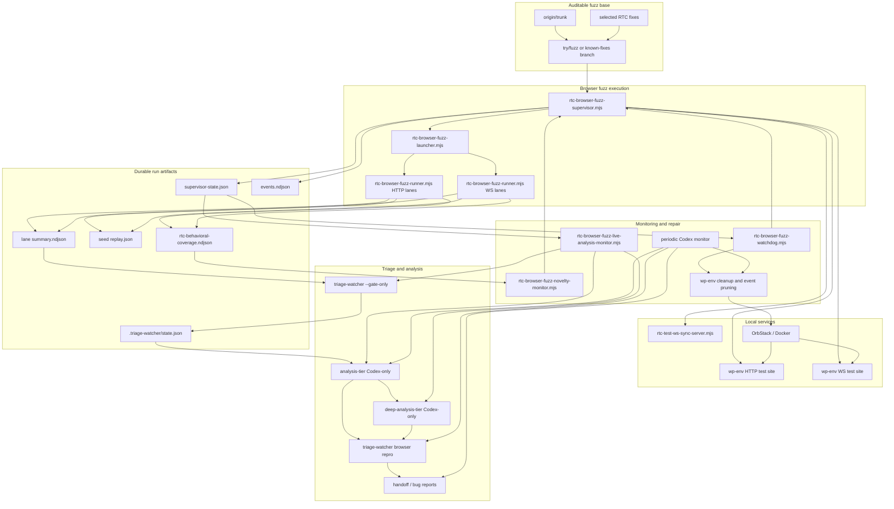

## Process Ownership

Every long-running service has one owner. This avoids two processes trying to
repair the same environment or consume the same queue.

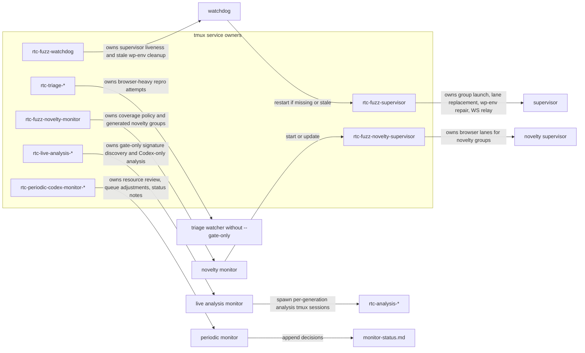

Example live sessions from the current campaign included:

- `rtc-known-fixes-fuzz-matrix-20260514`: known-fixes browser matrix.
- `rtc-known-fixes-matrix-codex-20260514`: 6 first-level analysis panes and 6 deep-analysis panes.
- `rtc-periodic-codex-monitor-mixed-20260502`: resource and queue monitor for the mixed long run.
- `rtc-known-fixes-ledger-refresh-20260514`: refreshes the known-fixes all-issue ledger.
- Older `rtc-analysis-*` and `rtc-live-analysis-*` sessions for historical mixed-run generations.

Treat those names as examples. The durable contract is the state files and run
roots, not the exact tmux session name.

## Browser Lane Loop

Each browser lane runs one seed at a time. The runner is designed to keep
fuzzing even when failures are found. Detailed analysis is normally disabled in
the runner with `RTC_FUZZ_INLINE_CODEX=0` so browser time is not blocked by
analysis.

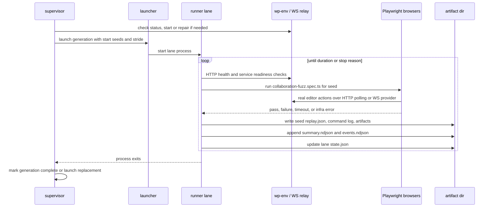

Important lane outputs:

- `state.json`: current seed, counters, last update, stop reason.
- `summary.ndjson`: compact queue source for triage.
- `events.ndjson`: durable event stream for progress and repair events.
- `seed-<seed>/<attempt>/replay.json`: exact replay manifest.
- `rtc-behavioral-coverage.ndjson`: behavioral and optional CDP coverage for novelty.

## Supervisor And Watchdog Loop

The supervisor owns active fuzz groups. The watchdog owns supervisor liveness
and conservative stale `wp-env` cleanup. Humans and Codex jobs should not run
`wp-env clean` or restart shared fuzz environments while lanes are active.

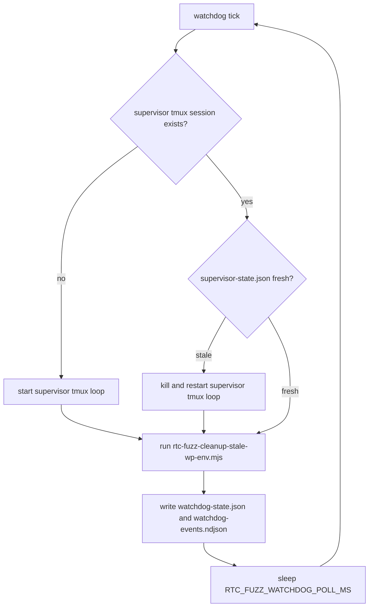

Supervisor repair is bounded and active-environment aware:

- It checks `wp-env status` before starting anything.
- It can use generated Docker Compose files for active `wp-env` repair.
- It may restart OrbStack Docker only with a cooldown and only for stale Docker endpoint cases.
- It writes repair events to `events.ndjson` and group-specific logs.

Watchdog cleanup is conservative:

- It never removes running containers.
- It protects a compose project if any container in that project is running.
- It removes stale stopped wp-env containers and networks older than the threshold.
- Volume and `~/.wp-env` directory pruning are opt-in.

## Multi-Level Triage Loop

The triage system separates cheap analysis from expensive browser repros. This
is the main reason the pipeline can use many Codex jobs without starting many
more Chrome instances.

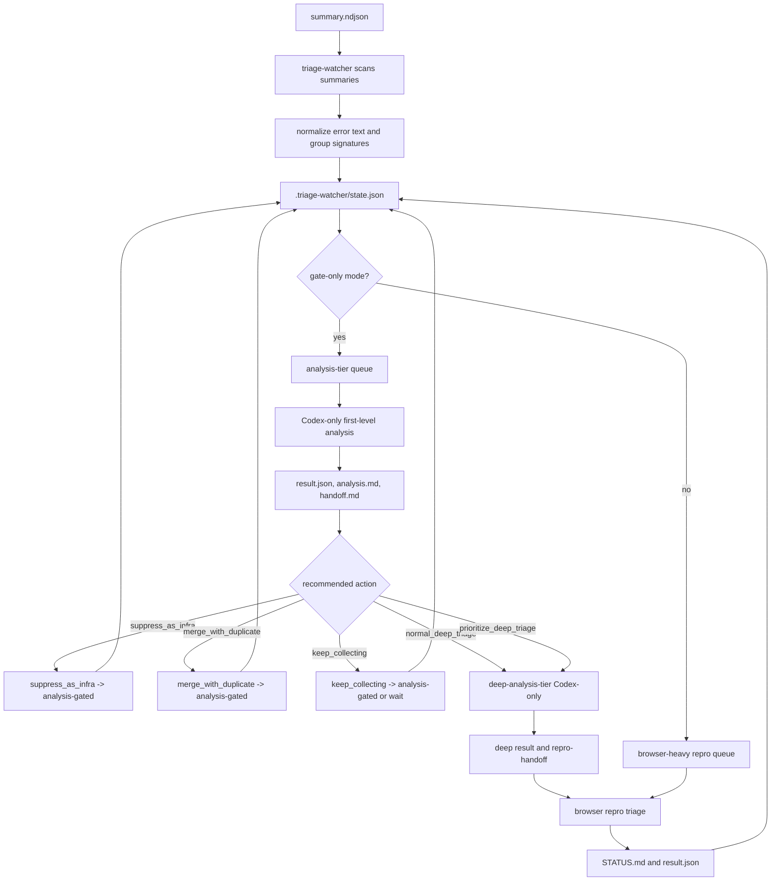

Level responsibilities:

- Level 0, signature discovery: `rtc-browser-fuzz-triage-watcher.mjs --gate-only`.
- Level 0, browser repro: `rtc-browser-fuzz-triage-watcher.mjs` without `--gate-only`.
- Level 1: `rtc-browser-fuzz-analysis-tier.mjs`, high-parallel Codex-only analysis.
- Level 2: `rtc-browser-fuzz-deep-analysis-tier.mjs`, slower skeptical Codex-only analysis.

The analysis tiers must not run browsers, Docker, `wp-env`, Playwright, or test
commands. They inspect compact context, bounded logs, source files, and existing
artifacts. Guard wrappers in `bin/rtc-browser-fuzz-analysis-guard-bin` block
broad artifact scans from normal analysis jobs.

## Live Analysis Monitor Loop

The live analysis monitor attaches analysis to whatever generations are active
in `supervisor-state.json`. It is browser-light: it runs the watcher in
`--gate-only` mode, then starts Codex-only tiers.

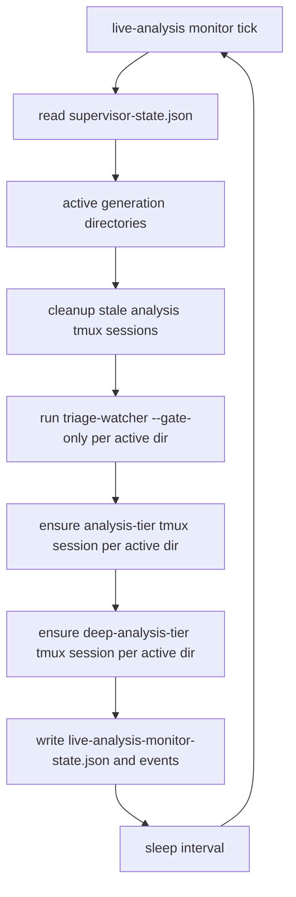

This monitor is the preferred way to add Codex work when the machine has
headroom but Chrome/Playwright pressure is already high.

## Periodic Monitor Decision Loop

The periodic Codex monitor is the human-readable control loop. It checks
resources, queue sizes, stale lanes, cleanup opportunities, and whether to
increase or decrease work. Every decision should be appended to
`monitor-status.md`.

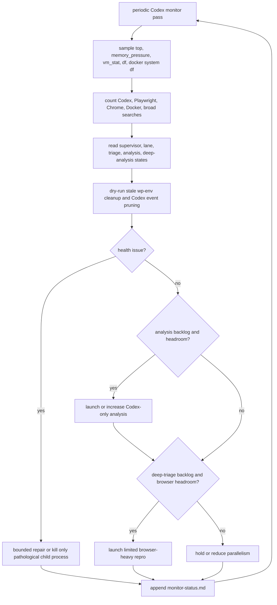

Resource policy:

- Prefer Codex-only analysis when CPU and memory have headroom but browser load is high.
- Prefer browser-heavy triage only after analysis marks candidates high value.
- Kill broad `find` or `rg` child processes that scan historical artifacts and
  saturate the machine.
- Do not kill baseline fuzz, supervisor, watchdog, or shared services unless
  their owner process says they are stale or unhealthy.
- Use macOS `memory_pressure` and `vm_stat` trends instead of free memory alone.

## Novelty-Guided Expansion Loop

When fuzzing keeps finding the same buckets, the novelty monitor looks at
behavioral coverage and starts focused groups that cover under-sampled surfaces.

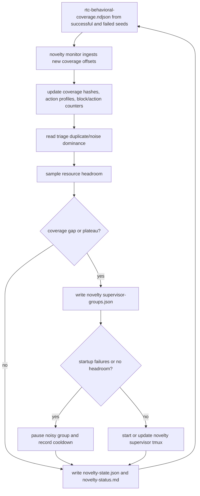

Current expansion targets include:

- `real-user-editing`: keyboard/UI-heavy ordinary editing.
- `persistence-no-title`: save/reload body persistence without title noise.
- `session-lifecycle`: late join, reload, reconnect.
- `three-user-late-join`: three participants with a forced late join.
- `multi-reload-lifecycle`: multiple reload checkpoints in one seed.
- `revision-persistence`: save/reload plus revision restore.
- `same-user-lifecycle`: two tabs under one account.
- `common-blocks`: common block-library surfaces.
- `block-gauntlet`: broader block-library surfaces.
- `parser-transform`: HTML references, deprecated blocks, validation fixes,
  equivalent HTML, and code-editor reparse.
- `http-persistence-probe`: HTTP transport canary.

The novelty loop should not treat every new marker string as novelty. It uses
coverage summaries and bounded hashes so unique fuzz data does not inflate the
coverage signal.

## Artifact And Resume Model

The pipeline is designed so it can be stopped and resumed from files on disk.

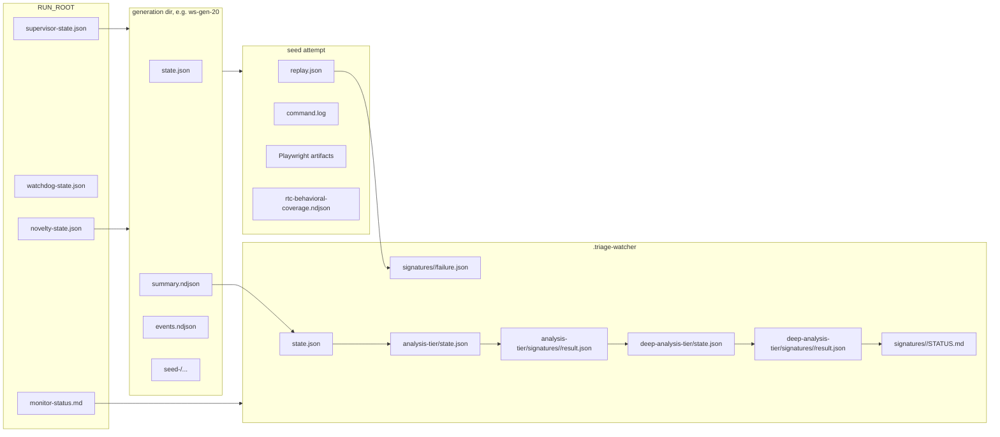

Resume checklist:

1. Restart supervisor and watchdog with the same `RUN_ROOT` and groups path.
2. Read active/current generation directories from `supervisor-state.json`.
3. Restart live-analysis monitor for the same `RUN_ROOT`.
4. Restart deep-analysis and browser triage for generation dirs with backlog.
5. Restart novelty monitor if novelty-guided expansion was enabled.
6. Append a resume note to `monitor-status.md`.

Do not delete `.triage-watcher`, lane dirs, seed dirs, or replay manifests while
the run may need to be resumed or handed off.

## Known-Fixes Revalidation Loop

The current known-fixes campaign runs a second loop on a clean integration
branch. Its purpose is to avoid filing bugs that are already fixed by the
current fix stack.

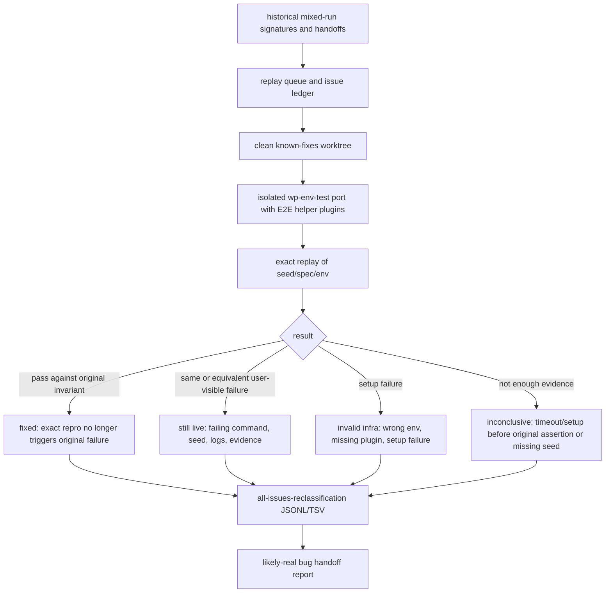

Rules:

- Do not count plugin-missing, wrong-port, or wrong-`wp-env` runs as live bugs.
- Mark fixed only when the exact repro no longer triggers the original failure.
- Mark live only with command, seed/spec, artifact path, logs/screenshots/traces,
  and a short explanation of real-user reachability.
- Deduplicate by canonical family/signature so old duplicates do not inflate the
  live count.

## What Another Team Should Monitor

For a running campaign, the minimum useful dashboard is:

| Area | Primary files or commands | Healthy signal |
| --- | --- | --- |
| Supervisor | `supervisor-state.json`, `events.ndjson`, tmux session | state updates within stale threshold; groups have active generation dirs |
| Watchdog | `watchdog-state.json`, `watchdog-events.ndjson` | supervisor not stale; cleanup removes only inactive wp-env resources |
| Lanes | `lane/state.json`, `summary.ndjson`, `events.ndjson` | current seed advances; failures are classified into useful buckets |
| Triage queue | `.triage-watcher/state.json` | duplicate/noise signatures become `analysis-gated`; high-value ones stay queued |
| First-level analysis | `.triage-watcher/analysis-tier/state.json` | completed count grows; failures are not dominated by schema/startup errors |
| Deep analysis | `.triage-watcher/deep-analysis-tier/state.json` | likely-real candidates get confirmed, deduped, or marked needing repro |
| Browser triage | `.triage-watcher/signatures/*/STATUS.md` | only high-value candidates spend Chrome time |
| Novelty | `novelty-state.json`, `novelty-status.md` | coverage gaps produce focused groups; noisy startup profiles get paused |
| Resources | `top`, `memory_pressure`, `vm_stat`, `df`, `docker system df` | enough memory headroom, no runaway broad artifact scans, disk not filling |
| Handoff | Markdown/TSV/JSONL reports under `docs/explanations/architecture` or run artifacts | live likely-real rows include evidence paths and grouping hints |

## Common Failure Modes

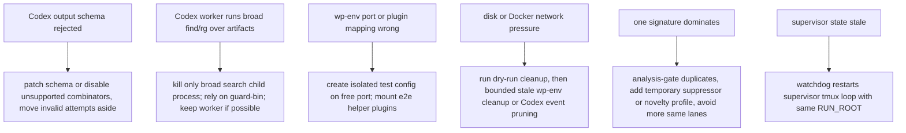

The important operational rule is to preserve durable artifacts before changing
the amount of work. If a process dies, restart from the same run root. If a
failure is invalid infrastructure, mark it that way and keep it out of live bug
counts.
