# RTC Jetstream2 fuzz trend analysis

Snapshot generated: `2026-05-22T00:23:06Z`

This report summarizes the Jetstream2 RTC fuzzing, coverage-guidance, resource,
and PR-progress logs. The plotting data is generated with R, ggplot2, tidyverse
packages, and ColorBrewer palettes. The summarized CSVs and plots are committed
under
[`rtc-jetstream2-fuzz-trends-20260515/`](rtc-jetstream2-fuzz-trends-20260515/);
raw inputs are copied into the refresh workspace for each run.

Source inputs include the coverage-guided run root, sysstat CPU/load samples,
the resource autoscaler disk samples, PR progress controller snapshots,
critical-path executor queues, artifact-index snapshots, and the latest copied
standard persona-loop outputs. The collector copies `raw/pr-focused/...` inputs
so PR-controller graphs track current raw state instead of stale local state.

## High-Level Readout

The monitor data is current through `2026-05-22T00:16:44Z`, and the latest
current-run accounting row was sampled at `2026-05-22T00:22:18Z` for
`run-20260522T001750Z` before the first full coverage pass completed.
The monitor has
`3,902` passes from `2026-05-15T01:21:42Z` onward. Cumulative coverage record
observations are `274,641`; current-scan coverage files are `1,075`. The monitor
reports `30` unmet target rows; the parsed coverage-goal table has `30` unmet
target rows out of `136`.

Current-run duplicate/noise accounting is incomplete for the newest active
root: `current_run_metrics_trusted` is `FALSE`,
`pending_until_first_pass` is `TRUE`, and `full_pass_pending` is `TRUE`. The
latest row carries latest-completed `duplicateShareCurrent` `1` and summary
startup failures `0`, but current-run signatures, actionable signatures,
product-evidence signatures, and top duplicate share are `NA` until this active
run completes a pass. The previous trusted row for `run-20260521T234503Z` had
one current-run signature, one actionable signature, one product-evidence
signature, and top duplicate share `1`, so the high completed duplicate share
is a one-signature denominator, not evidence of a broad product duplicate
storm. Historical duplicate share is `0.1923` for context only; it is not the
plotted live health signal. Until the active run completes a full pass, treat
the pending duplicate/noise state as a control-plane health issue. The latest
duplicate/noise synthesis rejects a product-bug interpretation and identifies
a control-plane leak: strict no-product startup failures are mostly suppressed
by triage/analysis consumers, but supervisor and novelty producer paths can
keep or re-materialize those groups into browser capacity and current-run
accounting.

Resource state is usable but pressure-affected. The latest monitor sample has
`413.9G` free memory; the latest disk sample has `91.9GiB` free on `/` and
`471.0GiB` free on `/media/volume/danluu-fuzz-data`. Latest CPU utilization is
`36.46%`. Latest load averages are `14.95`, `26.62`, and `39.55` on `64`
logical CPUs, with `3` blocked tasks in the same sample. Load is below core
count in the latest sample, but the run history includes severe pressure
spikes, so admission and session durability remain active risks.

The latest graph-counted fuzzing mix has `28` browser/e2e lanes across `28`
groups, plus one `unit-property` lane, one `coverage-guided-lower-level` lane,
and one `protocol-server` lane. Live graph-counted fuzzing is concentrated in
browser/e2e, with narrow lower-level sentinels. Current graph-counted browser
work now includes current coverage rows for title reload, existing-post CRDT
metadata, large HTTP lifecycle/completion, and WS collaboration UI; the focused
append root with title reload, existing-post CRDT, and large HTTP lifecycle
rows; HTTP persistence probe; plus gap-booster and strict-expansion browser
rows. Current graph-counted lower-level work is table-query-array CRDT,
rich-text CRDT, and HTTP polling protocol/server.
`transport-integration`, `backend-api`, and standalone `fuzz-assertion` have no
current graph-counted lane. The latest level-mix synthesis accepts a narrow
mix change but rejects generic lower-level expansion and raw lane totals as
trusted useful capacity until current roots, exact sessions, PIDs, events, and
summaries reconcile. It found `existing-post-crdt-http` live but no matching
fresh title continuation at the time of its check. The refreshed graph now
shows a title-reload HTTP row in publication telemetry; treat that as
contradicted by the stricter persona capacity-quality check until a fresh
reconciliation proves the exact title lane is live.

The execution counter has about `16.574M` estimated individual executions.
These are reconstructed from lane `events.ndjson`: browser seed attempts,
unit/property fixed tests plus generated cases, coverage-guided inputs, and
protocol/backend cases. Lower-level counts are approximate when reconstructed
from batch metadata or legacy batch-count fields. The latest partial
15-minute bucket at `2026-05-22T00:15:00Z` has `258` browser/e2e executions,
about `1,032`/hour, and `352` unit-property executions, about `1,408`/hour.
Protocol-server and coverage-guided lower-level have zero executions in that
partial bucket. The latest graph-counted nonzero protocol-server bucket is
`120` executions at `2026-05-22T00:00:00Z`, about `480`/hour. The latest
graph-counted nonzero coverage-guided lower-level bucket remains `2`
executions at `2026-05-21T11:00:00Z`.

The latest native-harness synthesis selects parser serialization as the first
isolated Node/V8 coverage-guided harness. The latest action implemented the
parser-only coverage-guided lower-level harness and passed syntax plus one
bounded smoke run, but the current graph-counted coverage-guided lower-level
row is still rich-text CRDT, not a continuous parser serialization lane. The
latest non-empty protocol synthesis selects HTTP polling REST as the ready v1
protocol/server harness. The latest non-empty protocol action
implemented/finalized that harness and passed syntax, `wp-env`, and a bounded
two-seed / 60-case validation with matching root and lane `events.ndjson`; the
graph now has fresh protocol-server execution events from that validation.

The PR-focused data is live. The controller table has `26` distinct work
items: `13` high-priority ready-product PR rows marked published, `5`
high-priority ready-product rows held by the controller, `1` high-priority
deferred-family product-decision row, `1` medium-priority deferred-family
diagnostic row, `1` high-priority exact-stack-needed deferred-manifest row, `2`
medium diagnostic-ready deferred-manifest rows, `2` low-priority downscoped
deferred-manifest rows, and `1` high-priority runtime-gated PR row held as
consumed. The current push manifest is empty. The critical-path executor has
`7` blockers: `3` runnable blockers, `2` queued blockers, and `2`
terminal/downscoped blockers. The latest PR-split feedback keeps the
fileable prefix through `PR15C` and rejects `PR16-RLH` as fileable until strict
seed `6000007` reaches the final persistence oracle and owner rows prove it.

## Coverage Intake

The current coverage-file value is a current-scan count, not a cumulative
total. It can fall when the active output root changes or when a cleanup pass
removes old per-run files. Cumulative coverage record observations are the
better long-term intake signal.

## Health And Resources

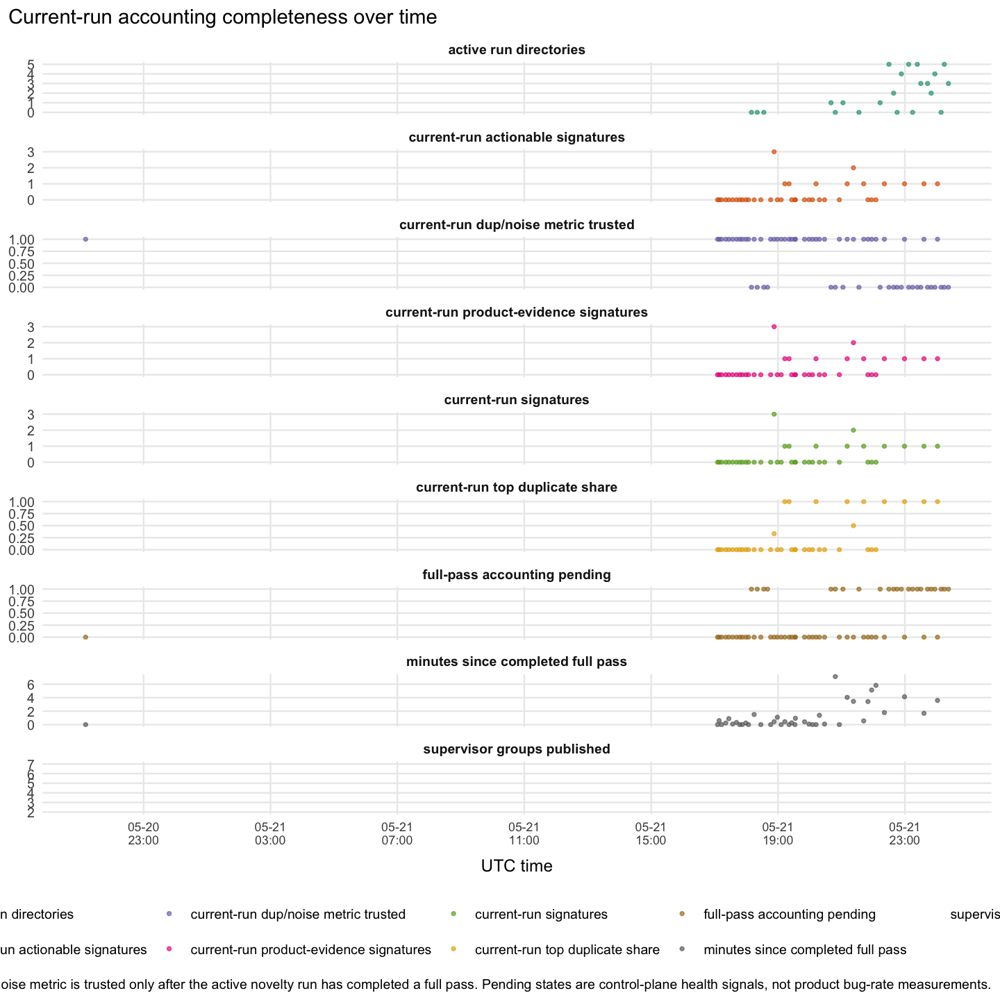

The duplicate/noise graph uses current-output-dir accounting for live status.
Pending/incomplete accounting is tracked as its own health signal and should
not be read as a measured product duplicate/noise rate. The latest sample for
`run-20260522T001750Z` was taken at `2026-05-22T00:22:18Z` with
`current_run_metrics_trusted` `FALSE`, `pending_until_first_pass` `TRUE`, and
`full_pass_pending` `TRUE`. The row carries latest-completed
`duplicateShareCurrent` `1` and summary startup failures `0`, but current-run
signature counts are not available yet: current-run signatures, actionable
signatures, product-evidence signatures, and top duplicate share are all `NA`.
The previous trusted current-output-dir row for `run-20260521T234503Z` had a
one-signature denominator: one current-run signature, one actionable signature,
one product-evidence signature, and top duplicate share `1`. Read the current
pending state as incomplete accounting and a control-plane health signal until
the active run completes a full pass, not as a measured product duplicate/noise
rate.

The latest duplicate/noise synthesis rejects a product-bug or broad product
duplicate-storm interpretation. It says strict `pre_action_bootstrap_stall`
noise is mostly suppressed by triage and analysis consumers, but producer and
scheduler paths can still keep or re-materialize no-product startup groups
through short supervisor cooldowns, novelty/materialization floors, forced
publication, and inconsistent current-run scoping. The recommended safe fix is
to make no-product strict startup noise a long/run-scoped producer hold while
preserving representatives for real product-evidence families.

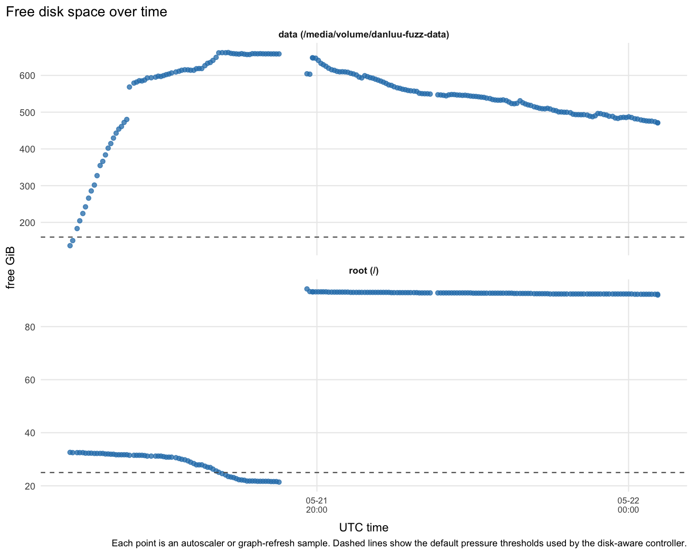

The disk graph tracks both root and the mounted data volume. The data volume is
around `86.7%` used and root is around `40.3%` used. Root pressure remains
stable, but output-size budgeting still matters on the data volume.

## Enabled Surfaces

The latest enabled-group event count is `1,626`. The summary's current enabled
groups are HTTP title reload convergence, HTTP existing-post CRDT metadata,
HTTP large-post lifecycle, HTTP large-post lifecycle completion, and WS
collaboration UI signals. Historical enabled events cover additional WS
multi-reload lifecycle, thirty-user and many-user lifecycle
variants, HTTP large-post lifecycle, real-user editing/rich-text/save-reload
bridges, async-server-blocks bridges, permissions/auth/locks, media
cross-entity, same-user lifecycle, HTTP table stale snapshots, block-gauntlet,
revision/autosave/recovery, parser transform, and same-user surfaces.

## Fuzzing Level Mix

The collector reads recent and current `supervisor-groups.json` files instead
of scanning unbounded history. The latest graph-counted mix is concentrated in
browser/e2e: `28` browser/e2e lanes across `28` groups, above the `24` lane
floor called out by earlier persona feedback. Lower-level work is active but
narrow: `unit-property`, `coverage-guided-lower-level`, and `protocol-server`
each have one current graph-counted lane. The graph-counted lower-level targets
are table-query-array CRDT, rich-text CRDT, and HTTP polling protocol/server.
`transport-integration`, `backend-api`, and standalone `fuzz-assertion` have no
current graph-counted lane in this snapshot.

Persona-loop evidence rejects the simple interpretation that graph-counted rows
equal trusted useful live capacity. The latest level-mix synthesis accepts a
narrow browser/e2e mix change, rejects generic lower-level expansion, and says
capacity should fail closed unless current roots, exact sessions, live PIDs,
fresh events, and summaries reconcile. It found `existing-post-crdt-http` live
but no matching fresh `title-reload-http` continuation at the time of its
read-only check. The refreshed graph-counted publication telemetry now shows
`28` browser/e2e lanes, including focused HTTP title reload, existing-post
CRDT, large HTTP lifecycle, HTTP persistence probe, and current coverage rows
for HTTP plus WS collaboration UI. It still shows no backend/API or standalone
fuzz-assertion lane. This report treats the graph as publication telemetry and
the persona evidence as the stricter capacity-quality check; the title row is
not trusted useful capacity until a fresh exact-session/PID/events/summary
reconciliation proves it. The latest level-mix action reports that a
lower-level HTTP polling manager was verified and a bounded protocol/server
sentinel was launched; the refreshed graph reflects protocol-server execution
events from validation, but the committed coverage-guided lower-level current
row is still rich-text CRDT with no current-bucket executions, so the HTTP
polling lower-level lane is not yet visible in this graph.

Duplicate/noise feedback points to the same control-plane class. The latest
synthesis says the current context is not a product-bug or broad product
duplicate storm: strict startup stalls are mostly suppressed by triage/analysis
consumers, but producer and scheduler paths can still re-materialize no-product
startup groups into browser capacity and current-run accounting. The newest
active run has untrusted pending current-run accounting, so its duplicate/noise
row is incomplete until the first full pass completes. The latest trusted
current-output-dir denominator is the prior one-signature row: one current-run
signature, one actionable signature, and one product-evidence signature. Treat
the live duplicate/noise value as incomplete current-output-dir accounting plus
control-plane feedback, not as a product-bug or broad duplicate-storm finding.

The latest native-harness synthesis selects parser serialization as the first
isolated Node/V8 coverage-guided harness, and the latest action implemented
and smoke-validated that parser-only lower-level harness. The current
graph-counted coverage-guided lower-level row remains rich-text CRDT, not a
continuous parser serialization lane. The latest non-empty protocol synthesis
selects HTTP polling REST over the WebSocket/Yjs relay as the ready v1
protocol/server harness. The latest non-empty protocol action
implemented/finalized that harness and validated two 60-case fuzz seeds,
matching root/lane `events.ndjson`, and nonzero REST, auth/schema/body,
persistence, awareness, compaction, cursor, convergence, and limit oracle
counts. Fuzz-only assertion work is not graph-counted as active;
the latest assertion action added two gated assertions, while level-mix
feedback says the fuzz-assertion loop remains held/stale.

## Fuzzing Level Executions

The execution metric estimates individual test/case executions from lane
`events.ndjson`: browser seed attempts, unit/property fixed tests plus
generated cases, coverage-guided inputs, and protocol/backend cases.
Lower-level rows are approximate when reconstructed from batch metadata or
legacy batch-count fields. The latest totals are approximately `52,319`
browser/e2e, `5,622,272` unit-property, `458,097` coverage-guided lower-level,
and `10,441,099` protocol-server executions. Transport-integration,
backend-api, fuzz-assertion, and other buckets are `0` in the current
reconstructed table. The current partial 15-minute bucket at
`2026-05-22T00:15:00Z` has `258` browser/e2e executions, about `1,032`/hour,
and `352` unit-property executions, about `1,408`/hour. Protocol-server and
coverage-guided lower-level are zero in that partial bucket. The latest
graph-counted nonzero protocol-server bucket is `2026-05-22T00:00:00Z` with
`120` executions, about `480`/hour. The latest graph-counted nonzero
coverage-guided lower-level bucket is `2026-05-21T11:00:00Z` with `2`
executions, about `8`/hour. Lower-level counts remain approximate when
reconstructed from batch metadata or legacy batch-count fields.

## Fuzz Output Effectiveness

The likely-real graph is a triage-output metric only. It counts non-duplicate
`.triage-watcher/**/result.json` rows classified `likely_real`, deduped by
canonical bug key and attributed to first-seen time. The latest collected
triaged likely-real output is still all browser/e2e: `195` likely-real findings
over about `814.6` runner-hours, or `23.94` per 100 runner-hours.

The broader unique-output graphs include untriaged raw signatures and
lower-level assertion failures. Current unique candidate output is `1,822`
browser/e2e candidates, `6` unit-property candidates, and `2`
coverage-guided-lower-level candidates. Transport-integration, backend-api,
protocol-server, standalone fuzz-assertion, and other buckets have no unique
candidates in the latest graph-counted data.

Failure-candidate rates are pre-triage lead indicators, not confirmed bug
counts. They remain useful for spotting whether a lane is producing work worth
triaging before duplicate/noise filtering catches up.

## Profile Completion

The latest weak-completion profiles have successful record counts at zero in
the current sample: table stale snapshot HTTP, common blocks, block-gauntlet,
parser serialization, and collaboration UI signals.
Media cross-entity has `1` successful record, revision persistence has `4`,
parser transform has `4`, multi-reload lifecycle has `8`, full-profile rows
have `16`, many-user lifecycle has `17`, three-user late join has `25`, large
HTTP lifecycle has `32`, long-session large docs have `32`,
permissions/auth/locks have `40`, async/server blocks have `74`, session
lifecycle has `109`, real-user editing has `111`, and persistence-no-title has
`224`. This argues for completion-depth repair in existing covered surfaces
before adding another broad surface class.

## Coverage Goals

Largest current unmet goal gaps:

| Goal | Current | Target |
| --- | ---: | ---: |
| same-user two-tab mode | 82 | 150 |
| successful parser-serialization records | 0 | 50 |
| successful multi-reload-lifecycle records | 8 | 50 |
| successful collaboration-ui-signals records | 0 | 25 |
| remote selection and cursor visible | 1 | 25 |
| successful media-cross-entity records | 1 | 25 |
| async/server block core/template-part | 0 | 20 |
| remote and local autosave checkpoints | 5 | 25 |
| local post recovery autosave | 5 | 25 |
| gauntlet block core/details | 3 | 20 |
| gauntlet block core/gallery | 4 | 20 |
| gauntlet block core/media-text | 5 | 20 |
| gauntlet block core/shortcode | 5 | 20 |
| gauntlet block core/file | 6 | 20 |
| gauntlet block core/more | 6 | 20 |
| gauntlet block core/social-link | 6 | 20 |
| gauntlet block core/social-links | 7 | 20 |
| gauntlet block core/html | 9 | 20 |
| table stale snapshot oracle | 0 | 10 |
| successful table-stale-snapshot-http records | 0 | 10 |
| action insert-media-cross-entity-block | 2 | 10 |
| real media upload | 2 | 10 |
| action table-stale-snapshot-html | 4 | 10 |
| table stale snapshot over HTTP | 4 | 10 |
| uploaded/cross-entity block core/block | 1 | 5 |
| uploaded/cross-entity block core/file | 1 | 5 |
| uploaded/cross-entity block core/media-text | 1 | 5 |
| uploaded/cross-entity block core/gallery | 2 | 5 |
| uploaded/cross-entity block core/image | 2 | 5 |
| real reusable block entity | 2 | 5 |

## Feature Mix

These plots separate breadth from repeated observations and focus action
completion on weak profiles so high-volume successful lanes do not hide stalled
profiles.

## PR Review Loop

The parsed suggested-PR split history has `457` snapshots. The latest parsed
proposed split totals `4,114` net LOC. These charts are size telemetry from
parsed status snapshots, not filing authority. The largest latest rows are
`PR 13B` at `1,668` net LOC, `PR 13A` at `1,126`, `PR 13C` at `294`, and
`PR 14` at `276`.

## PR-Focused Controller

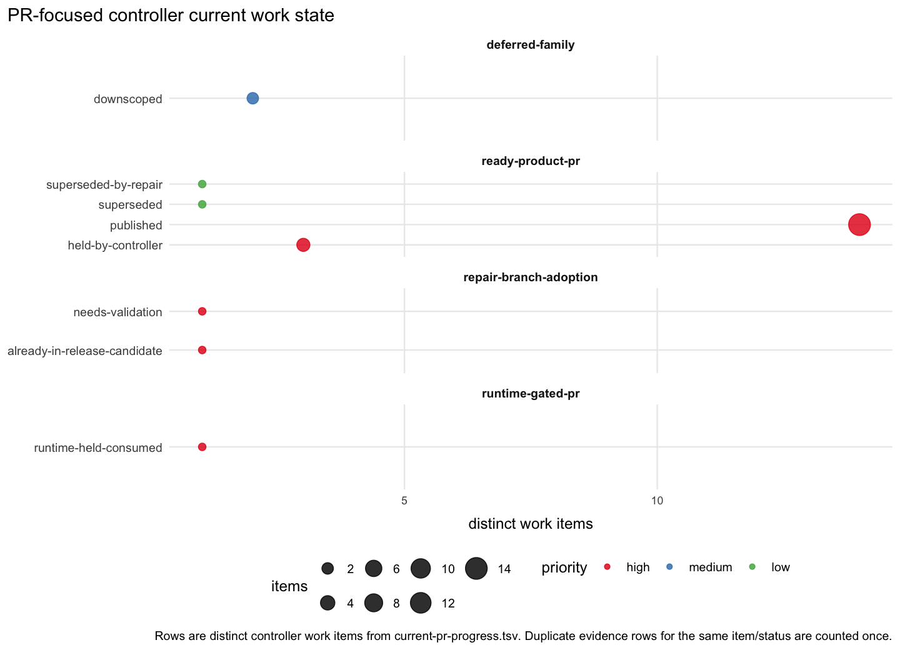

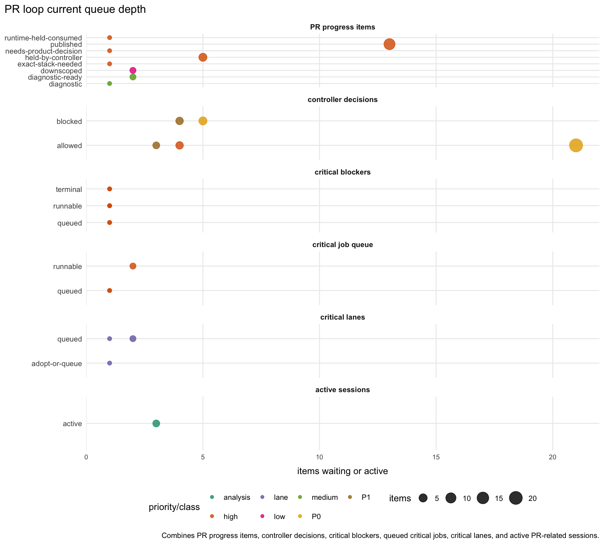

The current controller state has `26` distinct work items. The most important
live queue entries are `5` high-priority ready-product PR rows held by the
controller, `13` published ready-product rows still under validation, `1`
high-priority deferred-family product-decision row, `1` medium-priority
deferred-family diagnostic row, `1` high-priority exact-stack-needed deferred
manifest row, `2` medium diagnostic-ready deferred-manifest rows, `2`
low-priority downscoped deferred-manifest rows, and `1` high-priority
runtime-gated row held as consumed.

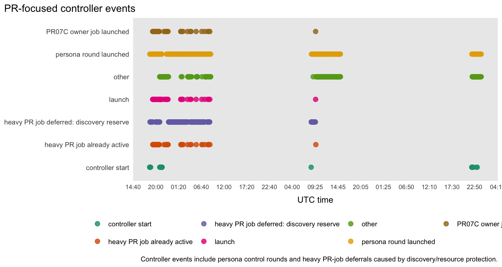

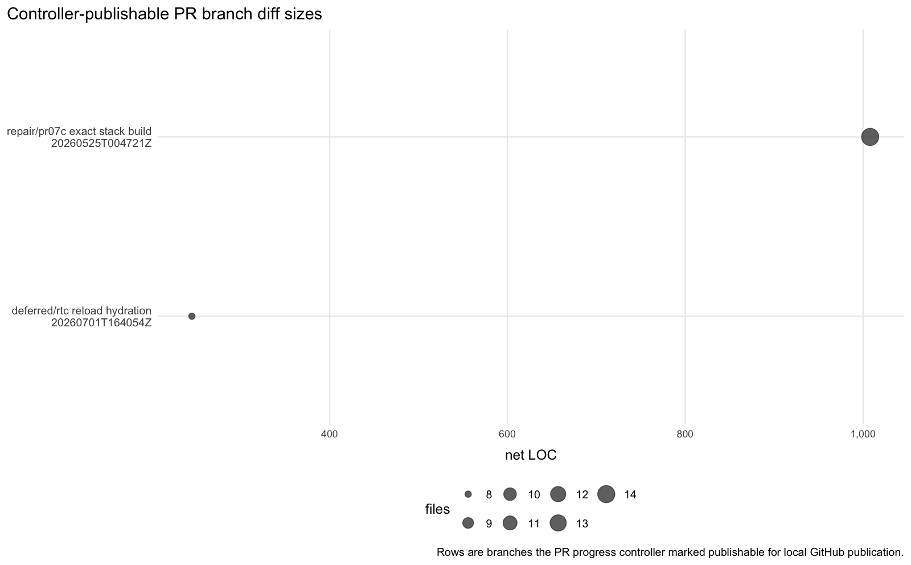

The current push manifest is empty, so there are no graph-counted publishable
branch rows in this snapshot. Published and held branches are still visible in
the progress table. The latest PR-split persona feedback rejects promoting
`PR16-RLH` as fileable: the ready prefix remains through `PR15C`, while
`RLH-6000007-candidate` is blocked pending strict seed `6000007` proof and
owner rows. Cycle 446 applied that split state and launched one bounded
strict-head repair job for `8fb598778357` / seed `6000007`; its report was
still pending in the copied persona evidence.

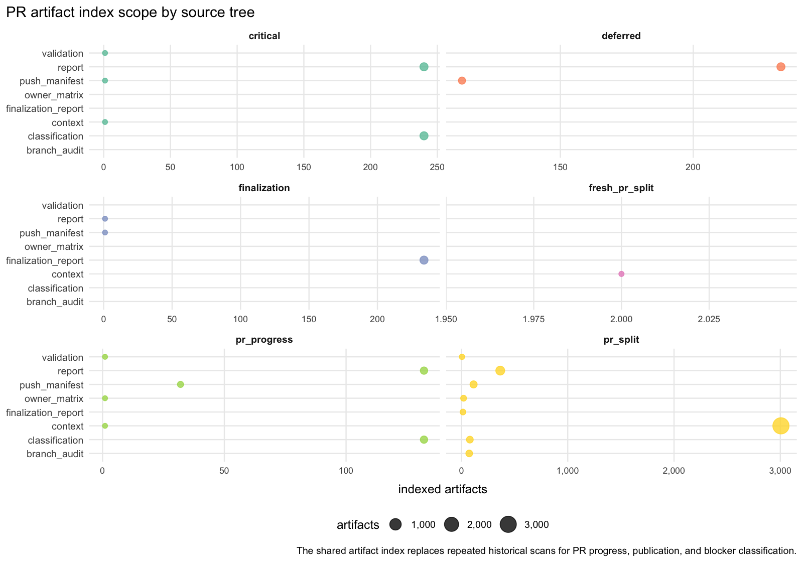

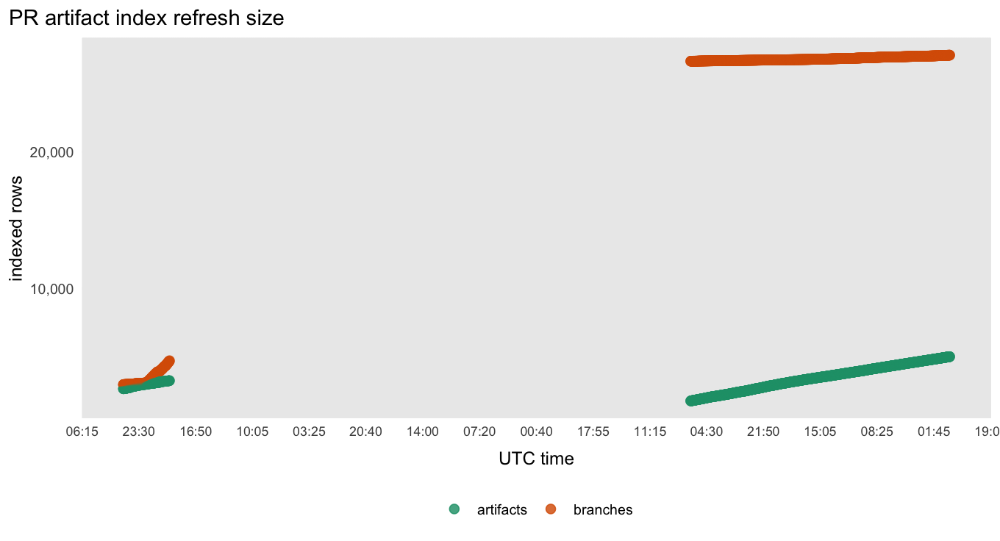

The artifact index has `3,291` current artifact rows across `23` root/kind
buckets.

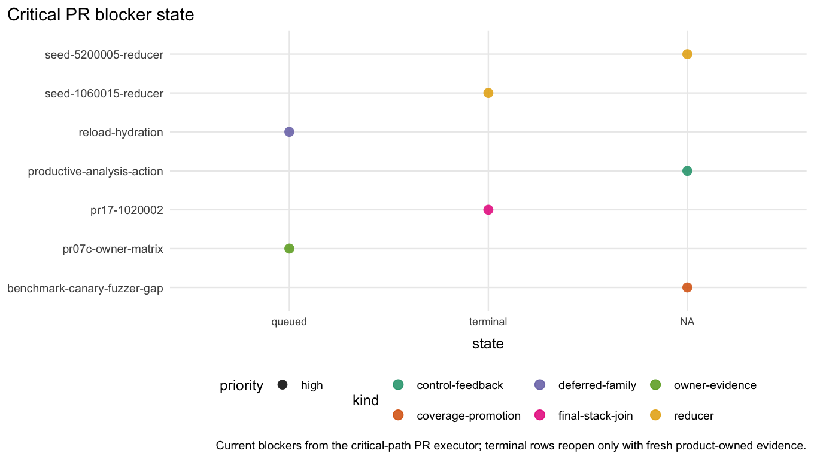

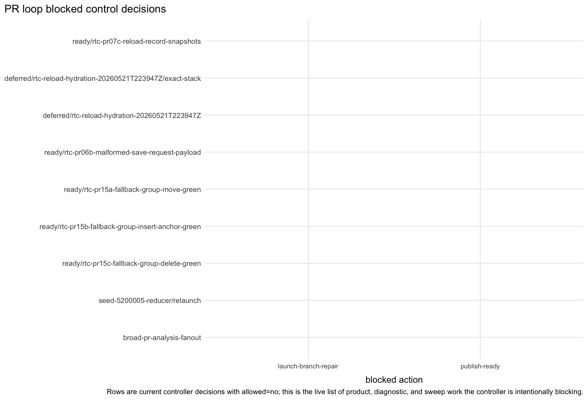

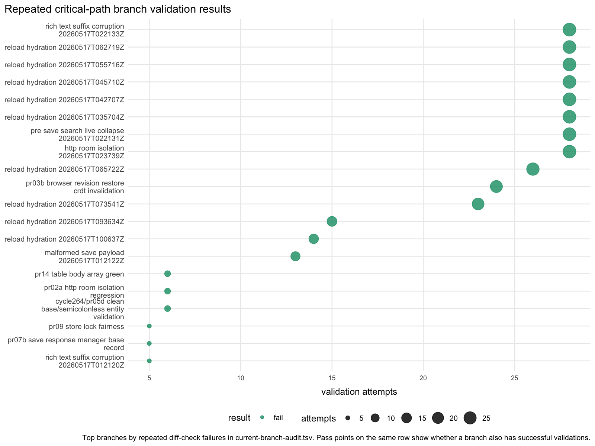

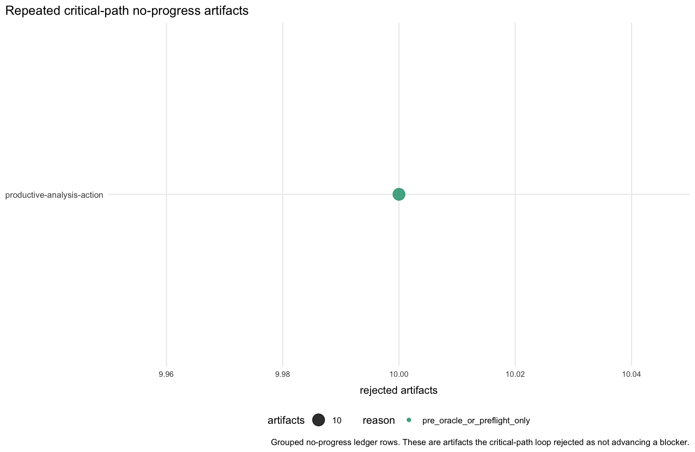

The critical-path executor has `7` blockers: three runnable blockers
(`productive-analysis-action`, `benchmark-canary-fuzzer-gap`, and
`seed-5200005-reducer`), two queued blockers (`reload-hydration` and `PR07C`
owner matrix), and two terminal/downscoped blockers (`PR17` seed `1020002` and
`seed-1060015-reducer`). The repeated no-progress table has one current row:
`benchmark-canary-fuzzer-gap/zero_executor_artifact`.

## Interpretation

The graph-refresh pipeline is current again: the collector brings in the
current coverage-guided root, resource samples, PR-focused raw inputs, and the
standard persona-loop outputs. The active coverage root is
`run-20260522T001750Z`, and its latest current-run duplicate/noise accounting is
not trusted yet because the first full pass is still pending. The live row has
`current_run_metrics_trusted` `FALSE`, `pending_until_first_pass` `TRUE`,
`full_pass_pending` `TRUE`, latest-completed `duplicateShareCurrent` `1`,
summary startup failures `0`, and `NA` current-run signature/actionable
signature/product-evidence/top-duplicate-share fields. The last trusted row,
from `run-20260521T234503Z`, had one current-run signature, one actionable
signature, one product-evidence signature, and top duplicate share `1`. Treat
the active-row duplicate/noise state as incomplete accounting and a
control-plane health signal until this run completes a full pass, not as a
broad measured duplicate storm.

The latest duplicate/noise synthesis rejects a product-bug or broad product
duplicate-storm reading. It says strict startup stalls are mostly suppressed
by triage/analysis consumers, but supervisor and novelty producer paths can
still keep or re-materialize no-product startup groups through cooldown,
materialization-floor, forced-publication, and current-run scoping gaps. The
small safe action is a long/run-scoped producer hold for no-product startup
noise while preserving one representative for real product-evidence failures.

The resource picture has cleared from the worst pressure state but is not clean.
Latest CPU utilization is `36.46%`; load is `14.95`, `26.62`, and `39.55` on
`64` logical CPUs, with `3` blocked tasks. The graph-counted fuzzing mix is
browser/e2e-heavy: `28` browser/e2e lanes, plus one lane each for
unit-property, coverage-guided lower-level, and protocol-server. Persona
evidence is stricter than the graph and rejects raw row counts as trusted useful
capacity unless roots, sessions, PIDs, events, and summaries reconcile. The
latest level-mix synthesis accepts a narrow browser/e2e change and rejects
generic lower-level expansion, but it found `existing-post-crdt-http` live and
`title-reload-http` not freshly reconciled at the time of the check. The
refreshed graph now shows a title HTTP row plus bounded protocol-server
activity, but still shows no backend/API or standalone fuzz-assertion lane.
Treat the title row and the claimed lower-level HTTP polling manager as
unresolved telemetry reconciliation until exact live sessions, PIDs, fresh
events, and summaries line up with the publication rows.

Browser/e2e remains the only level producing triaged likely-real findings in
the committed triage-output metric. The latest execution bucket is active but
partial: about `1,032` browser/e2e executions/hour and `1,408` unit-property
executions/hour in the `2026-05-22T00:15:00Z` bucket. Protocol-server and
coverage-guided lower-level are zero in that latest partial bucket. The latest
protocol-server nonzero bucket is `2026-05-22T00:00:00Z` with `120`
executions, from the successful bounded HTTP polling REST validation.
Coverage-guided lower-level's latest nonzero graph-counted bucket remains
`2026-05-21T11:00:00Z` with `2` executions. Lower-level counts remain
approximate where reconstructed from batch metadata or legacy batch-count
fields. Native parser serialization is implemented and smoke-validated by
persona action, but it is not active as a current graph-counted continuous
lane.

PR progress is visible again, but the controller is not advertising a non-empty
push manifest. The PR-split persona feedback keeps the fileable prefix through
`PR15C` and rejects `PR16-RLH` as fileable until strict seed `6000007` reaches
the final persistence oracle and owner rows prove it. Cycle 446 launched one
bounded repair job for that strict-head proof, but the copied evidence still
had the report pending. The PR loop still needs to convert held ready-product
rows, queued PR07C owner evidence, queued reload-hydration, runnable
seed-5200005, benchmark-canary, productive-analysis blockers, and the pending
strict seed proof into validated publishable branches rather than more blocked
or no-progress artifacts.
