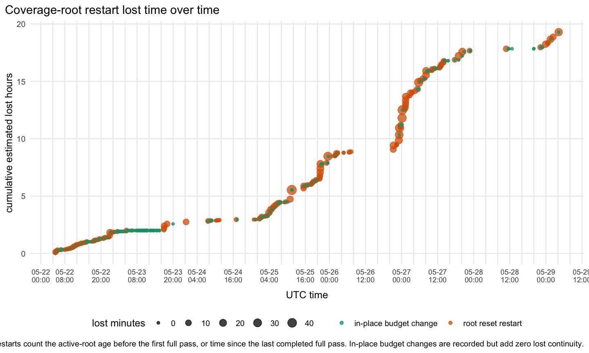
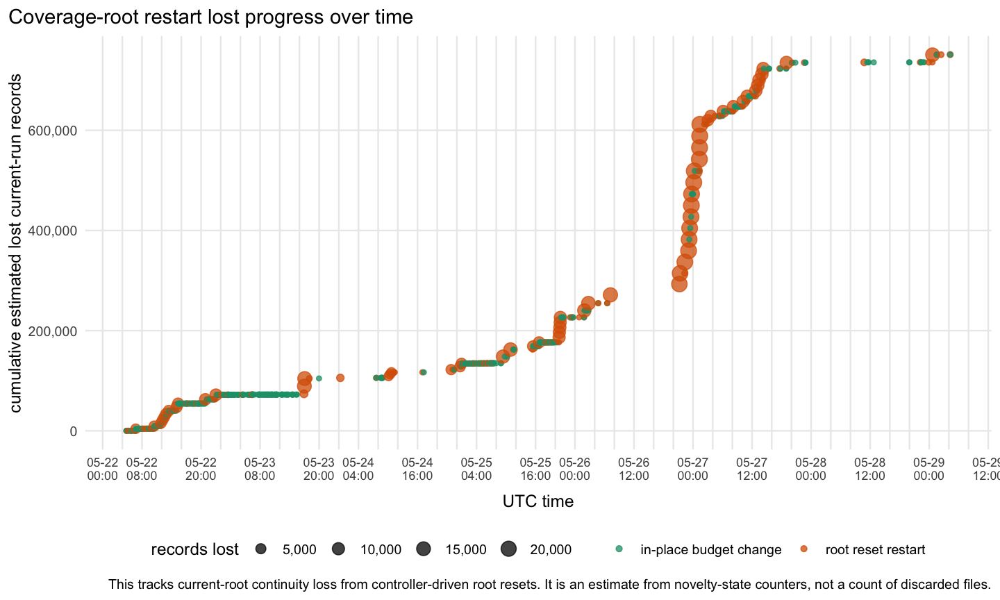

# RTC Jetstream2 fuzz trend analysis

Snapshot generated: `2026-05-29T08:56:24Z`

This report summarizes the Jetstream2 RTC fuzzing, coverage-guidance,
resource, and PR-progress logs. The refreshed CSVs and plots are committed
under
[`rtc-jetstream2-fuzz-trends-20260515/`](rtc-jetstream2-fuzz-trends-20260515/);
raw inputs are copied into the refresh workspace for each run.

Source inputs include the coverage-guided run root, sysstat CPU/load samples,
resource autoscaler disk samples, PR progress controller snapshots,
critical-path executor queues, artifact-index snapshots, and copied standard
persona-loop outputs. The collector copies `raw/pr-focused/...` inputs so
PR-controller graphs track current raw state instead of stale local state.

## High-Level Readout

The graph-refresh pipeline is current through the last completed monitor pass
at `2026-05-29T06:23:32Z`. There are `5,369` monitor passes from
`2026-05-15T01:21:42Z` onward, `362,409` cumulative coverage record
observations, `12,896` current-scan coverage files, and `8` unmet coverage
goals out of `137`.

Live health is not clear yet. The latest current-run accounting row is
`run-20260529T084333Z` at `2026-05-29T08:52:44Z` with
`full_pass_pending=TRUE`, `pending_until_first_pass=TRUE`, and
`current_run_metrics_trusted=FALSE`. Its `duplicateShareCurrent` is `0.5`,
summary startup failures are `0`, and the current-run
signature/actionable-signature/product-evidence denominators are
`NA`/`NA`/`NA`. Because the row is untrusted and pending first full pass, read
that duplicate/noise share as incomplete current-output-dir accounting and a
control-plane health issue until the active run completes a full pass. The
prior trusted `0.5` sample had only a `2`/`2`/`2` denominator, so it was not a
broad duplicate storm.

The duplicate/noise persona evidence rejects a product-bug or broad product
duplicate-storm interpretation. The latest synthesis identifies a
producer/scheduler leak around current-run product-evidence duplicate gates,
alias matching, and benchmark-canary bypasses. Older feedback says a bounded
benchmark-canary/product-evidence control-plane fix was applied, but raw
family-capped records could still keep the action gate active. The refreshed
graph is incomplete for the active run, so it supports "control-plane
accounting/pause still pending" more than "product duplicate storm."

CPU and load CSVs are present but empty in this refresh, so current CPU/load
values are unavailable. The disk sample is populated: at
`2026-05-29T08:53:43Z`, root has `123.6GiB` free and is `12.9%` used, while
the data volume has `520.8GiB` free and is `85.3%` used.

The latest graph-counted `is_latest` fuzzing mix has `30` lanes:
`27` browser/e2e lanes, `1` unit-property lane, `1`
coverage-guided-lower-level lane, and `1` protocol-server lane. The live
coverage-guided root itself is narrower: it has four current browser/e2e
groups, `novelty-http-self-presence-ui-signals`,
`novelty-http-large-post-lifecycle`, `novelty-http-persistence-probe`, and
`novelty-ws-parser-serialization`. Lower-level and protocol evidence exists,
but it is bounded: unit-property HTTP polling is current, protocol-server HTTP
polling has a fresh validation row, and coverage-guided-lower-level still
materializes only an older rich-text CRDT row. Transport-integration,
backend-api, and standalone fuzz-only assertion lanes are graph-inactive.

The execution counter has `18,465,876` estimated individual executions:
`6,512,630` browser/e2e, `14,943` unit-property, `458,625`
coverage-guided-lower-level, and `11,479,678` protocol-server. The latest
open bucket, `2026-05-29T08:45:00Z`, has `34` browser/e2e executions and zero
lower-level/protocol/backend/transport/fuzz-assertion executions. Recent
lower-level counts are sparse: the latest unit-property nonzero bucket is
`12` executions at `05:45`, the latest protocol-server bucket is `180`
executions at `05:30`, and the latest coverage-guided-lower-level bucket is
the older `2`-execution rich-text CRDT smoke at `2026-05-24T21:45:00Z`.

## Coverage Intake

The current coverage-file value is a current-scan count, not a cumulative
total. It can fall when the active output root changes or cleanup removes old
per-run files. Cumulative coverage record observations are the better
long-term intake signal.

## Health And Resources

The duplicate/noise graph uses current-output-dir accounting for live status.
Pending or incomplete accounting is tracked as its own health signal and
should not be read as a measured product duplicate/noise rate. Historical
aggregate duplicate/noise is not used as the live health signal.

The latest current-run accounting sample is `run-20260529T084333Z` at
`2026-05-29T08:52:44Z`. It has `status_available=TRUE`, startup status
`monitor started; full coverage pass pending`, `full_pass_pending=TRUE`,
`pending_until_first_pass=TRUE`, and `current_run_metrics_trusted=FALSE`.
The latest completed monitor pass was `149.21` minutes earlier, at
`2026-05-29T06:23:32Z`.

The latest row reports `duplicateShareCurrent=0.5` and summary startup
failures `0`, but current-run signatures, actionable signatures, product
evidence signatures, and top duplicate share are all `NA`. Treat that as
incomplete current-run accounting until a trusted full pass lands. The recent
trusted non-clear rows were all narrow: `1` over `1`/`1`/`1` on several
`2026-05-24` samples, and `0.5` over `2`/`2`/`2` at
`2026-05-24T17:39:48Z`.

Persona-loop evidence rejects a product-bug read here. It points to
producer/control-plane hardening: product-evidence duplicate gates must pause
or rotate contributing producers, benchmark-canary bypasses must not keep
duplicate siblings alive after a representative exists, and no-analysis
sentinels must be authoritative for active scheduling. The graph is currently
pending first-pass accounting, so the correct live interpretation is
"accounting/control-plane incomplete," not a measured broad product duplicate
rate.

CPU and load input CSVs have only headers in this refresh, so there is no
current CPU or load reading to interpret. Disk data is current: root has
`123.6GiB` free and the data volume has `520.8GiB` free while `85.3%` used.

## Coverage-Root Continuity

The coverage-root continuity table has `616` events: `151` restarts and
`465` in-place budget events. Estimated lost continuity is `19.292` hours and
`751,185` records, and that loss comes from restart rows. In-place budget
changes should be read as zero lost continuity unless the data says otherwise;
the latest in-place budget rows report `0` lost seconds and `0` lost records.

Recent restart reasons include `materialization_invariant_failed` and
`missing_monitor`. Those restarts can lose current-root continuity and
first-pass accumulation. The recent `deadline_benchmark_canary_cap` rows are
in-place budget changes and should not be interpreted as root-reset losses.

## Enabled Surfaces

The latest enabled-group event count is `4,559`. The current enabled groups
are `novelty-http-self-presence-ui-signals`,
`novelty-http-large-post-lifecycle`, `novelty-http-persistence-probe`, and
`novelty-ws-parser-serialization`. Current lane residency should be read from
the fuzzing-level mix table below and cross-checked against current-root
supervisor/session evidence.

## Fuzzing Level Mix

The collector reads recent and current `supervisor-groups.json` files instead
of scanning unbounded history. The latest graph-counted `is_latest` rows are
`30` lanes: `27` browser/e2e groups, `1` unit-property group, `1`
coverage-guided-lower-level group, and `1` protocol-server group.

Live coverage-guided fuzzing is concentrated in browser/e2e PR-evidence lanes:
the current root has four browser/e2e groups and no lower-level group inside
that root. Lower-level activity is present as side evidence, not broad live
throughput. `unit-property-http-polling-canary` is current at
`2026-05-29T05:46:29Z`; `protocol-server-http-polling` is current at
`2026-05-29T05:40:31Z`; the graph-counted coverage-guided-lower-level latest
row is still `coverage-guided-lower-level-rich-text-crdt` from
`2026-05-24T21:59:05Z`. Transport-integration, backend-api, and standalone
fuzz-only assertion work are not active in the graph.

The latest non-empty level-mix synthesis rejects broad 24-lane browser/e2e
backfill and rejects broad lower-level expansion. It says to keep a narrow
PR-evidence/canary-closure cap, protect self-presence, and target a bounded
awareness-to-overlay bridge before claiming lower-level health. Its feedback
implemented a bounded rendered-overlay diagnostic and expected fresh
lower-level evidence, but the refreshed graph does not materialize a
rendered-overlay lower-level row. This is a graph/evidence mismatch: do not
read the mix graph as showing rendered-overlay throughput.

The latest non-empty native-harness synthesis chooses rich-text CRDT as the
first ready isolated lower-level harness, with parser serialization second.
The latest action implemented/promoted the rich-text CRDT lower-level harness
and validated a bounded smoke with `coverageKeys=355`, `newCoverageKeys=355`,
and `productYield=false`. The graph agrees that the only current
coverage-guided-lower-level mix row is rich-text CRDT, but it also shows that
the row is old relative to the active browser root.

The latest protocol-server synthesis selects the HTTP polling REST sync-server
state-machine fuzzer. The latest non-empty protocol action implemented and
validated it with a 180-case foreground seed and required root/lane event
accounting. The graph has a protocol-server current row and a fresh `05:30`
execution bucket, so protocol-server evidence is present, although it is not
currently producing sustained high-rate execution buckets.

The latest fuzz-assertion apply note added a scoped fuzz-only
`publishPost()` UI-unreachable assertion for the benchmark-canary stress path,
but no standalone fuzz-assertion lane is graph-active.

## Fuzzing Level Executions

The execution metric estimates individual test/case executions from lane
`events.ndjson`: browser seed attempts, unit/property fixed tests plus
generated cases, coverage-guided inputs, or protocol/backend cases.
Lower-level counts are approximate when reconstructed from batch metadata or
legacy batch-count fields.

Latest cumulative totals are approximately `6,512,630` browser/e2e,
`14,943` unit-property, `458,625` coverage-guided lower-level, and
`11,479,678` protocol-server executions. Transport-integration, backend-api,
fuzz-assertion, and other buckets remain `0` in the reconstructed table.

The latest `2026-05-29T08:45:00Z` bucket has `34` browser/e2e executions
(`136`/hour) and no lower-level or protocol executions. The latest nonzero
unit-property bucket is `12` executions at `05:45`, the latest protocol-server
bucket is `180` executions at `05:30`, and the latest
coverage-guided-lower-level bucket is `2` executions at
`2026-05-24T21:45:00Z`. That supports a narrow browser/e2e live readout plus
bounded side evidence, not sustained lower-level throughput.

## Fuzz Output Effectiveness

The likely-real graph is a triage-output metric only. It counts non-duplicate
`.triage-watcher/**/result.json` rows classified `likely_real`, deduped by
canonical bug key and attributed to first-seen time. The latest collected
triaged likely-real output has `100` browser/e2e likely-real findings over
about `1,571.3` runner-hours. Protocol-server, unit-property,
coverage-guided-lower-level, backend-api, standalone fuzz-assertion, and other
buckets have `0` likely-real findings in the latest level table.

The broader unique-output graphs include untriaged raw signatures and
lower-level assertion failures. Current unique candidate output has `1,011`
unique candidates: `1,009` browser/e2e candidates and `2`
coverage-guided-lower-level candidates. Other levels have no current unique
candidate output in the latest graph-counted data.

Failure-candidate rates are pre-triage lead indicators, not confirmed bug
counts.

## Profile Completion

The refreshed active novelty state has `18` profile rows. The large-post
three-user HTTP lifecycle profile has `5,020` records, `27` successes, and
`0` profile-row startup failures. Collaboration UI signals has `2,147`
records and `165` successes; persistence-no-title has `3,704` records and
`2,197` successes; parser serialization has `445` records and `84` successes.
Async/server blocks still has `425` records and `0` successes. Live startup
health should continue to use current-run summary startup failures from the
health section; the latest current-run row reports `0` summary startup
failures but is not trusted yet.

## Coverage Goals

The refreshed `coverage_goals.csv` has `137` goals, with `8` unmet. The strict
combined-ingredient and many-user sections below preserve their generated goal
tables so critical coverage floors remain visible even when the generic table
changes shape.

The combined-ingredient graphs are generated by
`rtc-jetstream2-fuzz-trends-20260515/scripts/plot-rtc-jetstream2-fuzz-trends.R`
from the strict feature key
`cross-product:large-post-three-user-http-lifecycle`. They track the strict
conjunction: HTTP polling, large initial post, at least three browser users,
lifecycle reloads, save/autosave checkpoints, strict persistence oracles, and
a passed run. Separate ingredient-lane hits do not increment this
cross-product count.

Latest combined progress is `0`/`25` strict cross-product records.
`novelty-http-large-post-lifecycle` is marked enabled, and adjacent ingredient
counts are populated: HTTP lifecycle scale is `5,020`/`10`, successful profile
records are `27`/`10`, successful three-user HTTP records are `13`/`10`, and
successful three-user large documents are `25`/`5`. The strict
`cross-product:large-post-three-user-http-lifecycle` count remains `0`.

The many-user active-editing graphs track distinct users who edited, not just
users present in a room. Active-editor counts exclude final UI
witness-sweep-only edits. Latest many-user active-editing progress is `0`/`25`
records at six active editors, `0`/`10` at ten active editors, `0`/`10` at
twelve active editors, and `0`/`3` at thirty active editors. The active-editing
groups are not currently marked enabled in the active-editing progress table.

## Feature Mix

The refreshed active novelty state has feature and action rows again. Feature
and action plots are useful as breadth indicators, but strict coverage
decisions should still use the coverage-goal and cross-product sections above.

## PR Review Loop

The suggested-PR net LOC CSV is present but refreshed as an empty file in this
run, so there are `0` parsed snapshots and no refreshed latest total or largest
rows to report. These charts remain size telemetry from parsed status
snapshots, not filing authority.

## PR-Focused Controller

The current PR-progress controller snapshot has `22` items:
`13` published ready-product rows, `3` held-by-controller ready-product rows,
`1` superseded ready-product row, `1` superseded-by-repair ready-product row,
`1` runtime-held-consumed row, and `3` deferred-family rows. The current push
manifest has `0` graph-counted publishable branches and `0` publishable net
LOC.

Use the blocker/stall timeline when asking whether exact-stack gates,
deferred family budget gates, resource reserve, single-flight guards, or
repeated critical-path continuations are slowing progress.

The controller is populated, but its current rows do not produce a
graph-counted publishable filing surface.

The latest PR-split persona synthesis and feedback reject promoting
`PR16-RLH` as fileable. The ready prefix remains through `PR15C`, plus
`PR02A`, `PR06E`, and `HARNESS-WS-CONFIG-022004`; `RLH-6000007-candidate` is
blocked until strict seed `6000007` reaches the final persistence oracle and
owner rows prove it.

The artifact index has `5,042` current artifact rows across `25` root/kind
buckets.

The critical blocker table has `7` rows: `2` active, `1` held, and `4`
terminal. The graph supports "blocked on exact-stack/deferred gates" more than
"ready to publish."

## Interpretation

The active run is not yet a trusted health sample. Use
`run-20260529T084333Z` as pending current-output-dir accounting:
`duplicateShareCurrent=0.5`, startup failures `0`, denominators
`NA`/`NA`/`NA`, and `current_run_metrics_trusted=FALSE`. Do not read that as a
measured product duplicate/noise rate. It is a control-plane status signal
until the first full pass completes.

Persona-loop duplicate/noise evidence rejects a product-bug or broad duplicate
storm read and keeps the residual risk in producer/scheduler controls. The
right follow-up is to make current-run product-evidence duplicate holds,
no-analysis sentinels, and benchmark-canary bypass rules authoritative for
producer scheduling while preserving one real product-evidence representative.

The live fuzzing picture is narrow. Browser/e2e PR-evidence lanes are the
active center, with current self-presence, large-post lifecycle,
persistence-probe, and parser-serialization groups. Unit-property and
protocol-server side evidence is present; coverage-guided lower-level remains
represented by an older rich-text CRDT row and old execution bucket. The
level-mix feedback rejects reading stale or bounded lower-level rows as broad
useful capacity, and it also rejects broad browser/e2e backfill.

The refreshed graph contradicts part of the latest level-mix feedback: that
feedback expected the rendered-overlay lower-level diagnostic to appear as
fresh lower-level evidence, but the graph has no rendered-overlay row or
execution bucket. Treat that as a materialization gap, not current
rendered-overlay throughput. The native-harness and protocol-server actions
are evidence that those harnesses were implemented and validated; the graph
only shows protocol-server as fresh and graph-counted in this refresh.

Coverage pressure remains at strict cross-product edges.
`cross-product:large-post-three-user-http-lifecycle` is still `0`/`25` even
though nearby ingredients are populated, and many-user active editing remains
`0` at the 6/10/12/30 active-editor thresholds. PR progress is populated but
not fileable: there are no graph-counted publishable branches or publishable
net LOC, and persona feedback blocks `PR16-RLH` pending strict seed `6000007`
proof and owner rows.
