# RTC Jetstream2 fuzz trend analysis

Snapshot generated: `2026-05-17T14:19:00Z`

This report summarizes the Jetstream2 coverage-guided fuzzing and PR-review
loop logs using R, ggplot2, tidyverse data manipulation packages, and
ColorBrewer palettes. The plots prefer scatter/dot encodings over line plots;
dense time-series points use partial transparency.

Source inputs:

- coverage monitor log:
  `/media/volume/danluu-fuzz-data/rtc-coverage-guided-20260515/logs/monitor.log`
- latest copied novelty state:
  current coverage output-dir state through `2026-05-17T14:16:33Z`
- PR split review loop log:
  `/media/volume/danluu-fuzz-data/rtc-pr-split-review-20260515/logs/loop.log`
- CPU and load-average history:
  `/var/log/sysstat/sa15`, `/var/log/sysstat/sa16`, and `/var/log/sysstat/sa17`

The plotting script and summarized CSV inputs are committed under
[`rtc-jetstream2-fuzz-trends-20260515/`](rtc-jetstream2-fuzz-trends-20260515/).

## High-level readout

The coverage-guided loop is still expanding coverage, not merely cycling. Across
`1999` monitor passes from `2026-05-15T01:21:42Z` through
`2026-05-17T14:16:33Z`, coverage files grew from `272` to `45048`, a delta of
`44776`. The monitor's visible likely-real maximum reached `4`.

Coverage-goal pressure is down but not finished. The latest copied
coverage-guidance state has `131` total goals and `8` unmet goals. The remaining
goals are real-user save/reload depth, real-user editing completion, and action
depth.

The latest plotted current-output-dir duplicate/noise sample shows live duplicate
pressure but no current startup failure pressure: `duplicateShareCurrent` is
`0.5`, and current summary startup failures are `0`. The same monitor pass has
`0` quality issues, `0` warnings, a true headroom flag, and `439.5G` free memory.
This report treats current-output-dir duplicate/noise and summary startup
failure metrics as live graph status; historical aggregate duplicate/noise is
only context. The latest historical aggregate duplicate share is `0.3502`, but
it is not used as the plotted live health signal.

Persona-loop evidence rejects treating one current sample as resolved by itself.
The newest duplicate/noise synthesis, `20260517T134847Z`, converges on a
run-local novelty-monitor scoping leak: stale paused-drain or historical
startup-noise state can still affect scheduling and coverage-Codex holds outside
the active current output dir. It rejects broad product-evidence suppression.
The matching feedback-action implemented the narrow novelty-monitor cleanup,
restarted coverage-guided novelty, and reported active-current product evidence
without current startup/bootstrap noise; its remaining risk is that the runner
can still emit strict startup duplicates at source.

The newest PR-split synthesis, `20260517T135955Z`, rejects a filing-ready,
final-stack-fuzz, broad-fuzz, push, stale-`1020002`, or wait-only
interpretation. It says the Cycle 266/268/270/272 replacement topology remains
active but blocked: reload/rejoin awareness ownership is unresolved, the active
manifest still admits stale `PR06B` rows, and seed `1020002` stays
terminal/downscoped unless rebuilt validation produces newer product-owned
evidence. The latest substantive feedback-action, `20260517T132830Z`, proved
the stale `1020002` and raw reload rows dropped out of the runnable queue.

## Coverage Intake

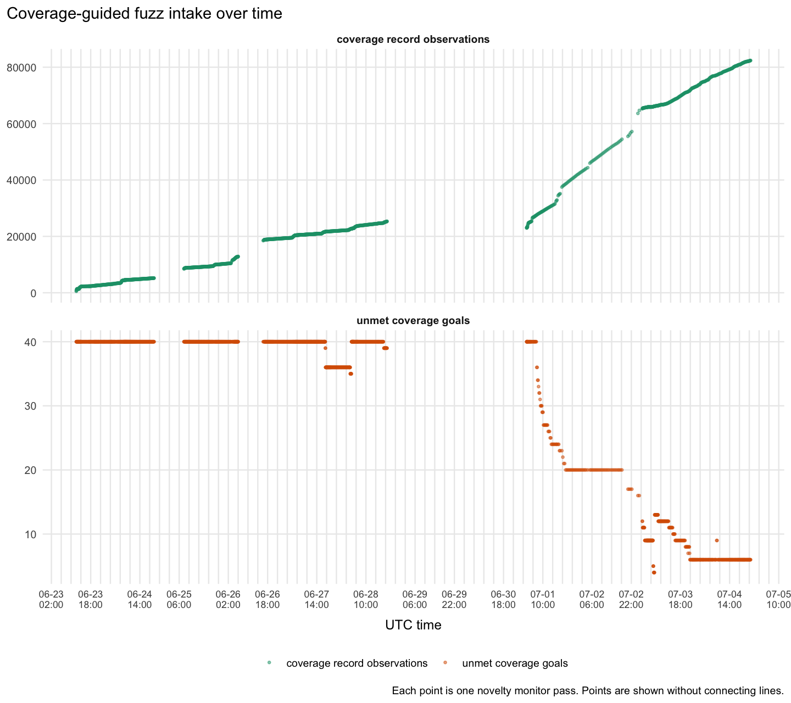

The bottom facet is the operational queue: unmet goals fell from `24` to `8`
after restarts, expansion, and auto-ratcheting. The top facet shows continued
coverage-file growth. Dense monitor-pass points are intentionally small and
partially transparent so repeated samples do not visually turn into a misleading
line.

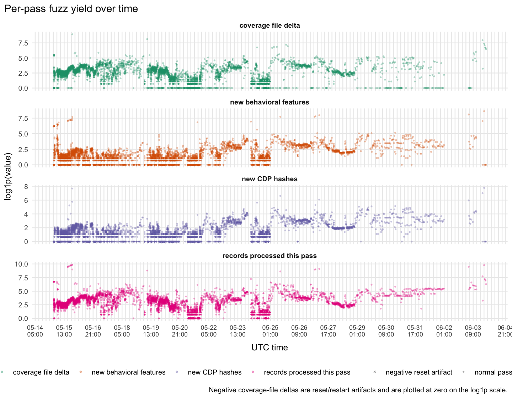

Per-pass yield is split out from cumulative state. `processed`, `new_features`,
`new_cdp`, and coverage-file deltas are shown on a `log1p` scale. Negative
coverage-file deltas are reset/restart artifacts and are marked separately.

## Health And Yield

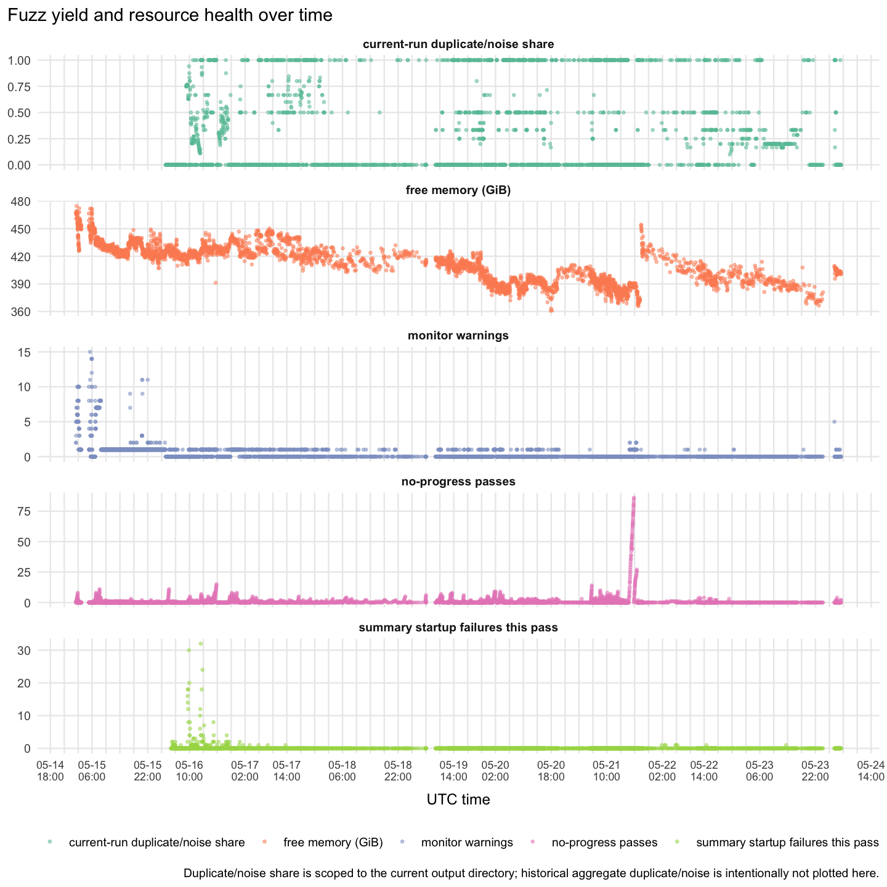

The latest plotted current-output-dir sample has `duplicateShareCurrent=0.5`
and current summary startup failures of `0`. It also has `0` quality issues,
`0` warnings, `439.5G` free memory, and a true monitor headroom flag. The plot
uses `duplicateShareCurrent` and current summary startup failures for the live
health view; it does not use historical aggregate duplicate/noise as the plotted
live signal.

The copied novelty state lists two enabled groups:
`novelty-ws-real-user-rich-text` and `novelty-ws-lifecycle`. The
latest duplicate/noise synthesis rejects a product-bug interpretation and broad
product-evidence suppression. It identifies a run-local novelty-monitor scoping
leak where stale paused-drain or historical startup-noise state can steer
scheduling and coverage-Codex holds outside the active current output dir. The
matching `20260517T134847Z` feedback-action implemented the run-local
startup-noise cleanup in the novelty monitor, restarted only coverage-guided
novelty, and reported active-current product evidence with no startup/bootstrap
noise. With the refreshed current duplicate share at `0.5`, the graph still
shows live duplicate pressure while startup failures are clean; the remaining
persona-loop risk is duplicate strict startup emission at the runner source.

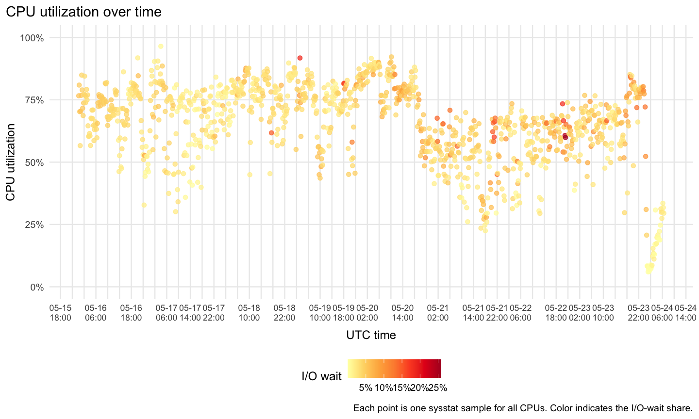

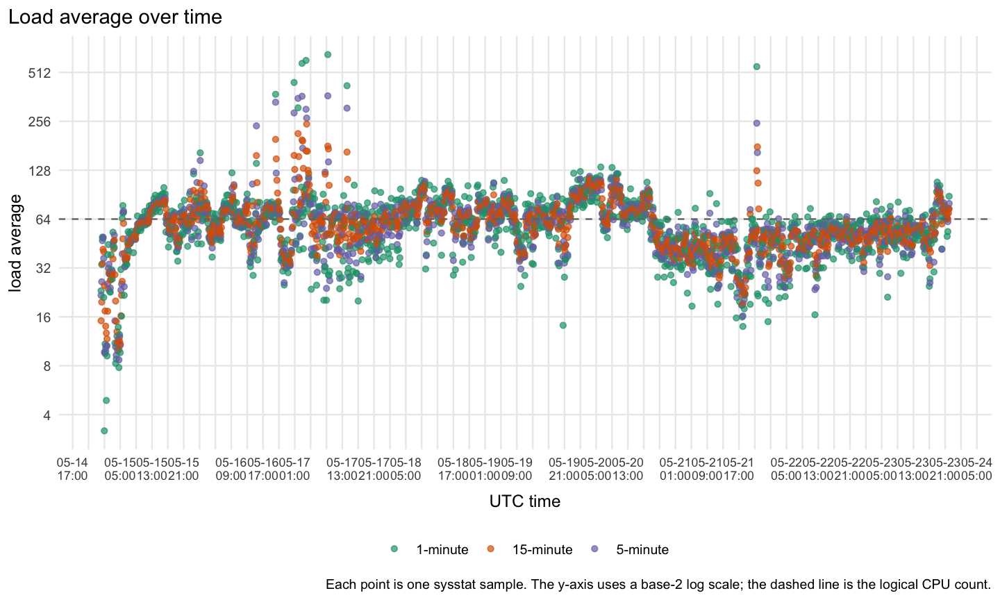

Recent sysstat samples through `2026-05-17T14:10:20Z` show bursty CPU and
intermittent load pressure above the `64` logical CPU count. The latest 25 CPU
samples range from `35.9%` to `78.6%` utilization, with the latest sample at
`73.0%`.
One-minute, five-minute, and 15-minute load all exceeded the logical CPU count
in `6` of those `25` sampled windows, and at least one of the three load windows
exceeded it in `14`. The latest sampled 1/5/15-minute load is `423.98`, `308.53`,
and `165.46` against `64` logical CPUs. Raw memory remains ample, the latest
monitor headroom flag is true, current duplicate share is `0.5`, current
startup failures are `0`, and the latest monitor sample has `0` warnings and
`0` quality issues.

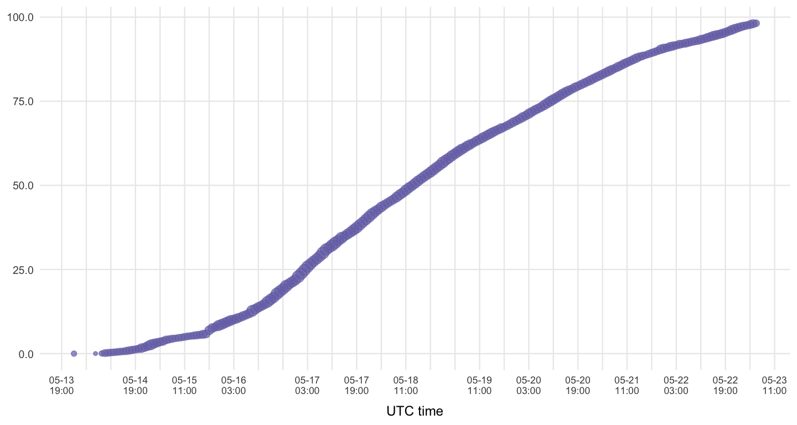

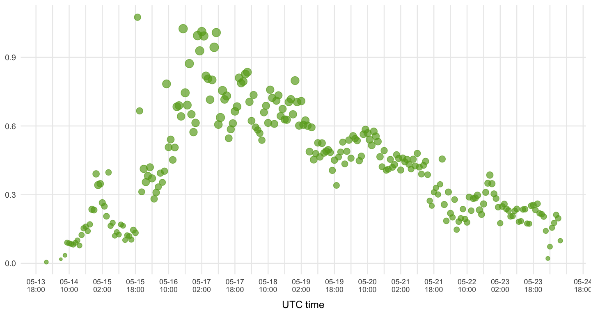

## Enabled Surfaces

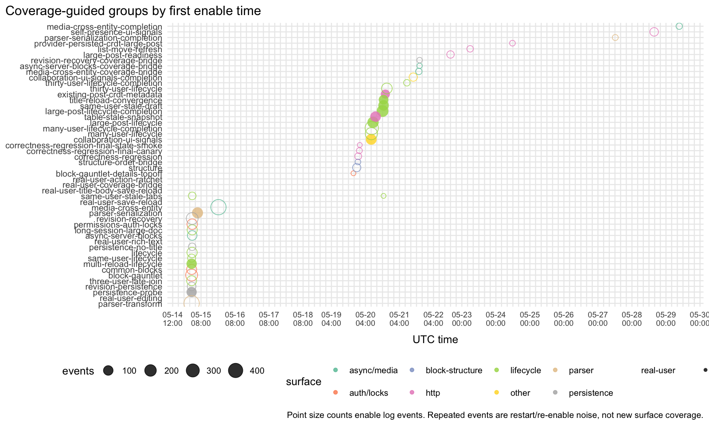

The historical enabled set still covers same-user/reload lifecycle,
revision/autosave/recovery, real UI rich text, parser/serialization transforms,
async/server-backed blocks, permissions/auth/locks, persistence, and long/large
sessions. The current copied novelty state has two enabled groups:
`novelty-ws-real-user-rich-text` and `novelty-ws-lifecycle`.

The duplicate/noise persona loop is stricter than a graph-only read. Current
live graph status comes from `duplicateShareCurrent=0.5` and current summary
startup failures of `0`; historical aggregate duplicate/noise remains context,
not the plotted live signal. The latest synthesis calls the remaining problem a
run-local novelty-monitor scoping leak, not a product bug and not a reason for
broad product-evidence suppression. The matching `20260517T134847Z`
feedback-action applied the narrow monitor cleanup and restarted only
coverage-guided novelty. The refreshed startup-failure, warning, and quality
counters are clean, while current duplicate share is not.

## Fuzzing Level Mix

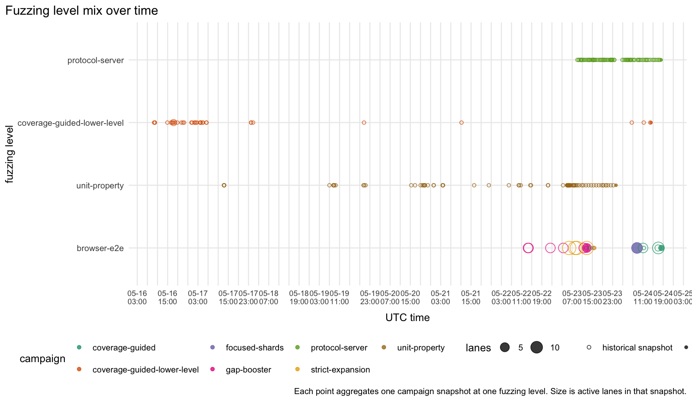

The level-mix plot reads supervisor group history, not just the novelty monitor
log. The latest copied snapshots cover `coverage-guided`,
`coverage-guided-lower-level`, `focused-shards`, `gap-booster`,
`strict-expansion`, and `unit-property`. Across the latest copied campaign
snapshots, the plot shows `30` browser/e2e lanes across `27` groups, plus `1`
`unit-property` lane and `1` `coverage-guided-lower-level` lane. The latest
browser/e2e lanes are `5` coverage-guided, `9` focused-shards, `6`
gap-booster, and `10` strict-expansion.

The graph says plotted fuzzing is still concentrated in browser/e2e lanes, with
counted lower-level activity in `unit-property` and one
`coverage-guided-lower-level` lane. The latest level-mix synthesis,
`20260517T133414Z`, rejects lane-count rebalance and lower-level expansion for
now. It says the next action is browser/e2e materialization plus accounting
repair, because reports disagreed on the live browser PID count and stale roots
or status strings can be miscounted as active work. It keeps browser/e2e
protected at `>=24` live lanes, `coverage-guided-lower-level=2`,
`unit-property=1`, and `backend-api=0`, `protocol-server=0`, and standalone
`fuzz-assertion=0` until audited root/status/event wiring exists. The matching
`20260517T133414Z` feedback-action file is empty; the latest substantive
feedback-action remains `20260517T130325Z`, which restored missing browser
materialization, retargeted the capped `unit-property` lane to the richer
rich-text CRDT oracle, and restarted only the lower-level loop.

Live plotted fuzzing is still concentrated in browser/e2e lanes. Lower-level
targets are active in the plotted mix through `unit-property` and one
`coverage-guided-lower-level` lane, and the latest execution bucket has current
rate only for browser/e2e and `unit-property`; the current unit/property profile
is `rtc-rich-text-crdt-merge`. `transport-integration` has historical activity
but no current counted rate. The production lower-level graph still has `0`
current counted `coverage-guided-lower-level` executions. The latest native
synthesis, `20260517T135702Z`, keeps rich-text CRDT merge as the first ready
isolated lower-level target and explicitly labels the engine
`v8-node-coverage-guided-mutator`, not AFL/libFuzzer. The latest substantive
native action, `20260517T134230Z`, validated direct and bounded tmux smoke event
accounting. The production lower-level lane is still held, so
the latest execution-rate bucket remains `0` for `coverage-guided-lower-level`.
The latest nonempty protocol-server synthesis, `20260517T135131Z`, names HTTP
polling REST as the first ready protocol/server harness; its matching
substantive protocol action validated that runner, emitted `protocol-server`
event metadata, and left the productive current-run root unchanged. The
refreshed execution graph still has `0` counted `protocol-server` executions.
`backend-api` remains blocked/`0`, and standalone fuzz-only assertion work
remains `0` in the graph even though the latest fuzz-only assertion action added
browser-gated diagnostics that can affect browser/e2e output.

## Fuzzing Level Executions

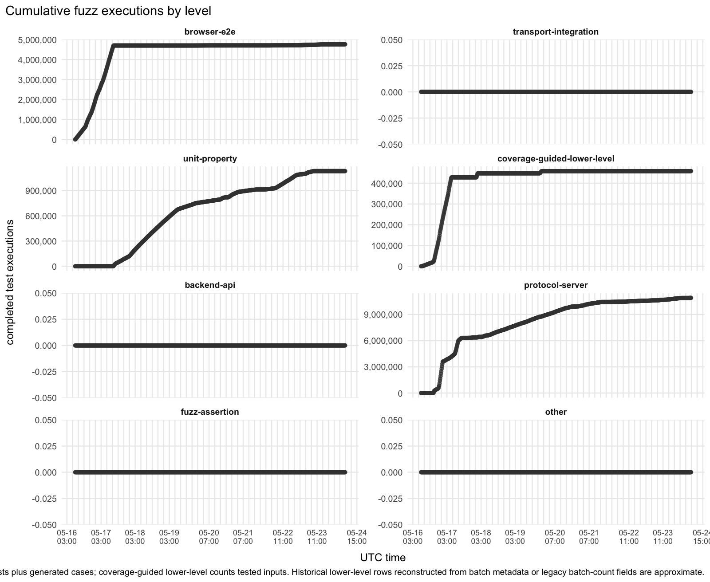

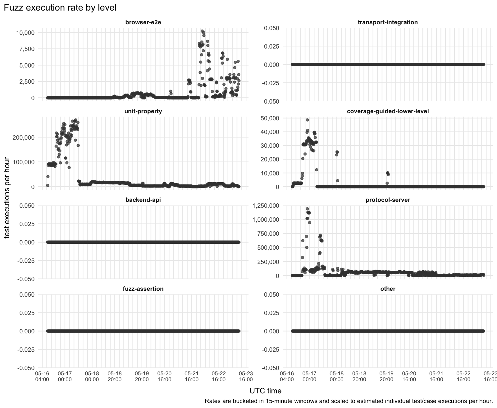

The current execution metric is estimated individual test/case executions
derived from lane `events.ndjson` files: browser seed attempts, unit/property
fixed tests plus generated fuzz cases, coverage-guided lower-level inputs, or
protocol/backend cases. Rechecks count as executions. This is more precise than
supervisor launches or lane counts, but it only covers fuzzers that emit these
lane events. Lower-level counts reconstructed from batch metadata or legacy
batch-count fields are approximate.

The latest collected execution data has about `5,278,301` completed test
executions: `104,016` browser/e2e, `3,006` transport/integration, `4,742,944`
unit-property, and `428,335` coverage-guided-lower-level. The latest
15-minute bucket, `2026-05-17T14:15:00Z`, reports about `44` browser/e2e test
executions/hour, `2,432` unit-property executions/hour, and `0` for
transport/integration, coverage-guided-lower-level, backend/API,
protocol-server, and standalone fuzz-assertion. `backend-api`,
`protocol-server`, and standalone `fuzz-assertion` levels remain at `0`
cumulative executions in this counter.
The summary still flags approximate execution rows somewhere in the history, so
lower-level totals reconstructed from batch metadata or legacy batch-count
fields should be read as approximate.

## Fuzz Output Effectiveness

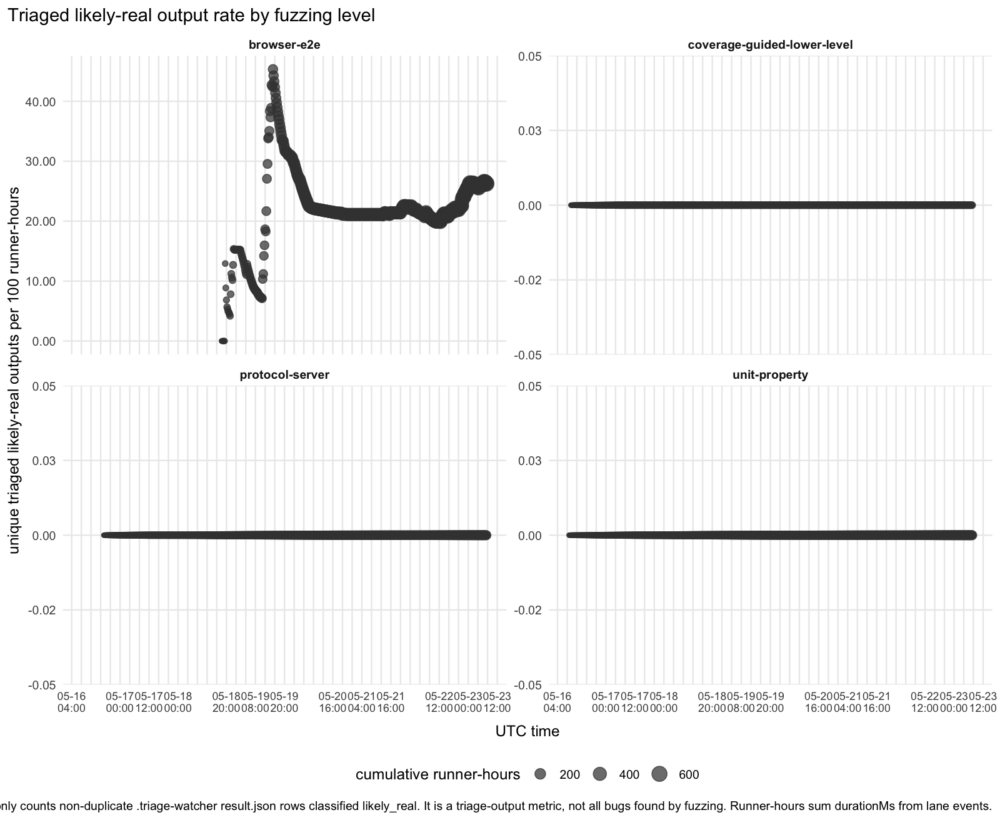

This graph has been relabeled because it is not a total bug-finding graph. It
counts only non-duplicate `.triage-watcher/**/result.json` rows classified
`likely_real` per 100 runner-hours, deduped by canonical bug key and attributed
to the failure first-seen time. The compute proxy is summed runner wall-clock
`durationMs` from lane `events.ndjson`, reported as runner-hours. This is best
interpreted as per-runner triage-output efficiency, not per-core efficiency and
not all bugs found by fuzzing.

On that triage-output metric, browser/e2e currently dominates:
`574` unique likely-real outputs over about `1,828.2` runner-hours, or `31.40`
likely-real outputs per 100 runner-hours. `transport-integration`,
`unit-property`, `coverage-guided-lower-level`, `backend-api`,
`protocol-server`, and standalone `fuzz-assertion` still have `0` triaged
likely-real outputs in the collected triage rows. That does not prove the
lower-level lanes are unproductive; it means their findings have not yet flowed
through the same non-duplicate likely-real triage result path.

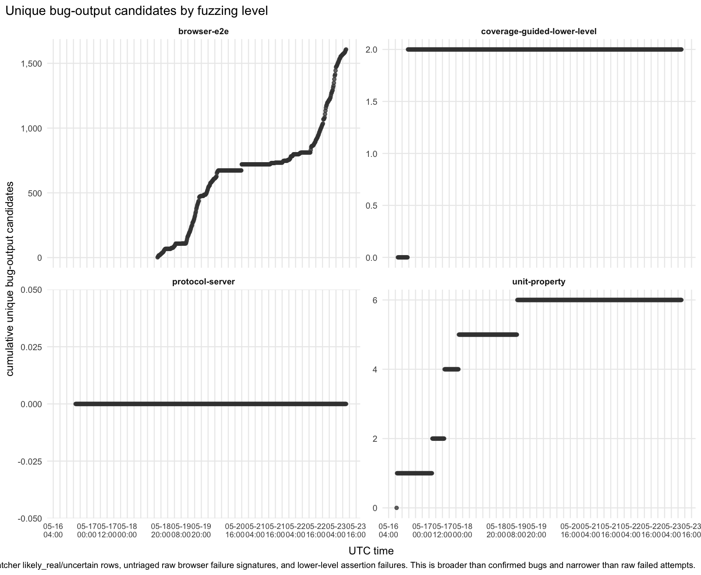

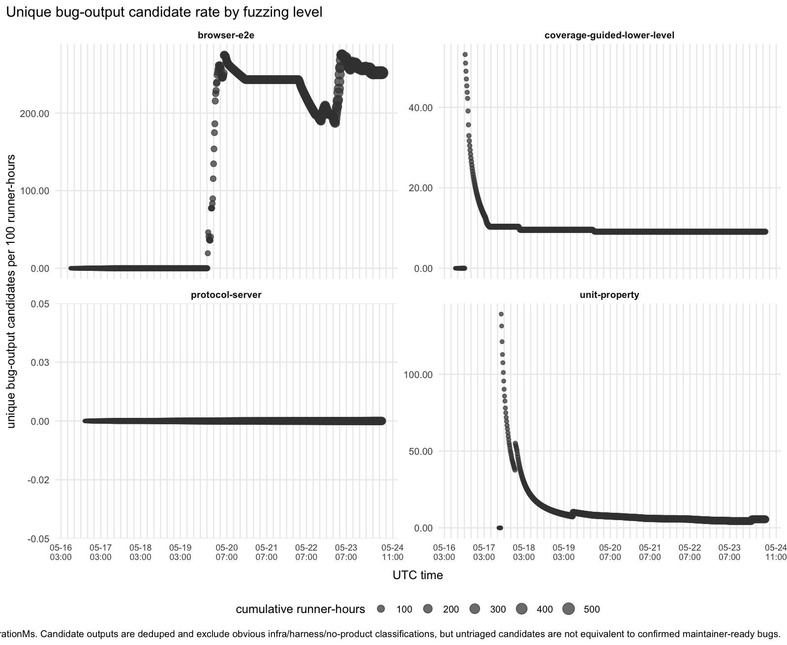

The two unique bug-output candidate plots are the broader effectiveness view.
They dedupe by canonical output key and include non-infra likely-real/uncertain
triage rows, untriaged raw browser or transport failure signatures, and
lower-level assertion failures. Obvious infra, harness, and no-product-output
classifications are excluded from the candidate count. This is intentionally
broader than confirmed bugs and narrower than raw failed attempts; untriaged
candidates are not confirmed bugs and still need follow-up before being treated
as maintainer-ready bugs.

Current unique bug-output candidate rates are: browser/e2e `5,026` candidates
over `1,828.2` runner-hours (`274.91` per 100 runner-hours),
transport/integration `106` over `59.5` runner-hours (`178.14` per 100
runner-hours), coverage-guided lower-level `2` over `19.4` runner-hours
(`10.32` per 100 runner-hours), and unit/property `4` over `21.7` runner-hours
(`18.40` per 100 runner-hours). `backend-api`, `protocol-server`, standalone
`fuzz-assertion`, and `other` remain at `0` in this candidate-output metric.

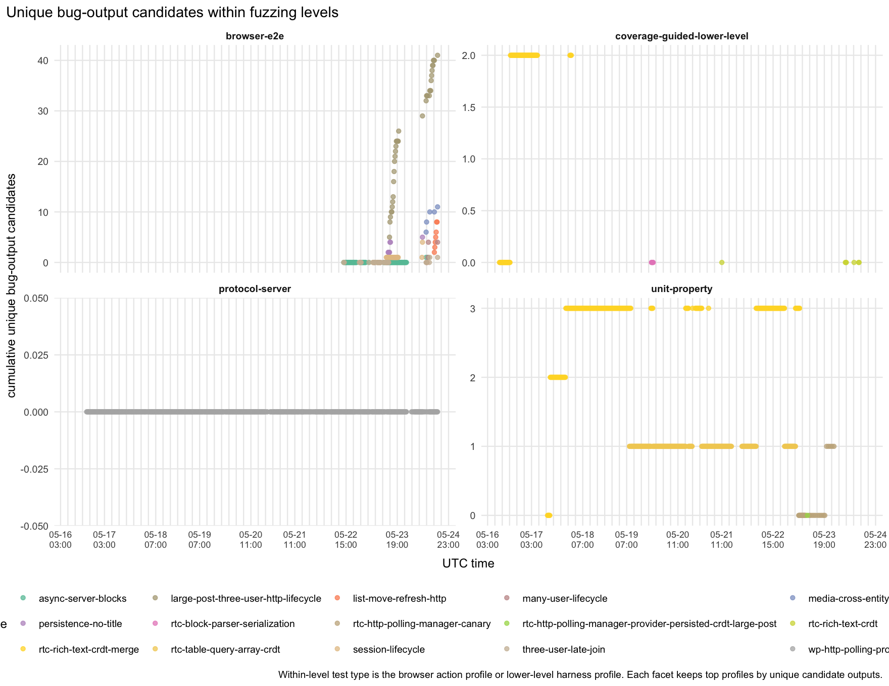

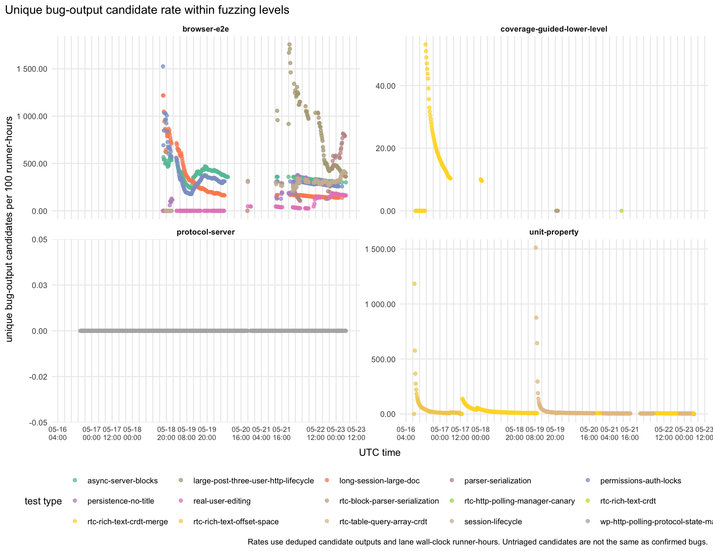

Within-level candidate output is still dominated by browser/e2e raw signatures,
with transport/integration also producing a visible raw-signature stream. The
lower-level lanes now show nonzero assertion-output candidates, but the counts
are small because those lanes are much newer and still lack the same mature
promotion path into `.triage-watcher` likely-real results.

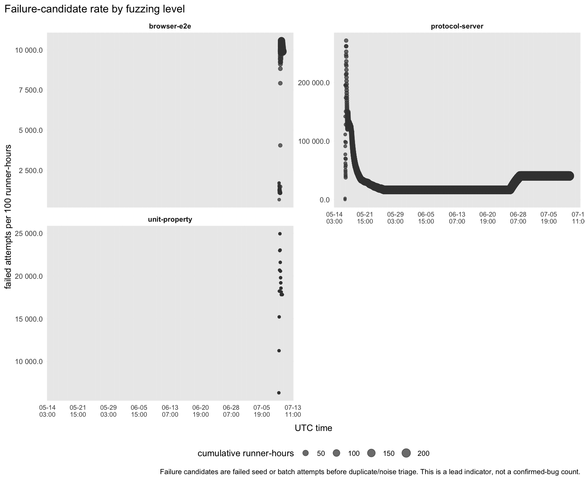

The failure-candidate plot is a pre-triage lead indicator: failed seed or batch
attempts per 100 runner-hours before duplicate/noise triage. It is useful for
comparing where the system is still producing interesting work before
duplicate/noise analysis, but it is not a confirmed bug count. Current rates
are about `4,511.7` for browser/e2e,
`4,537.5` for transport/integration, `820.3` for coverage-guided lower-level,
and `846.4` for unit/property.

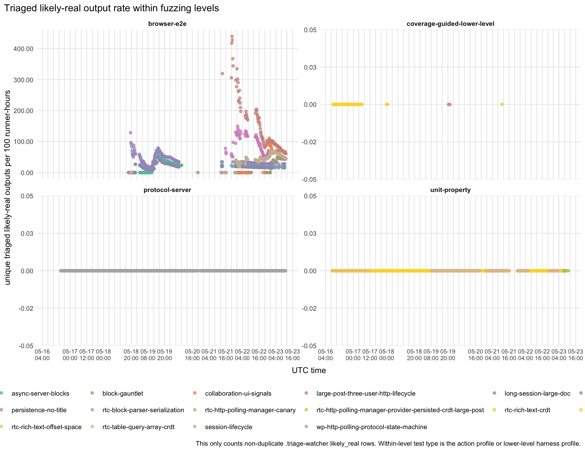

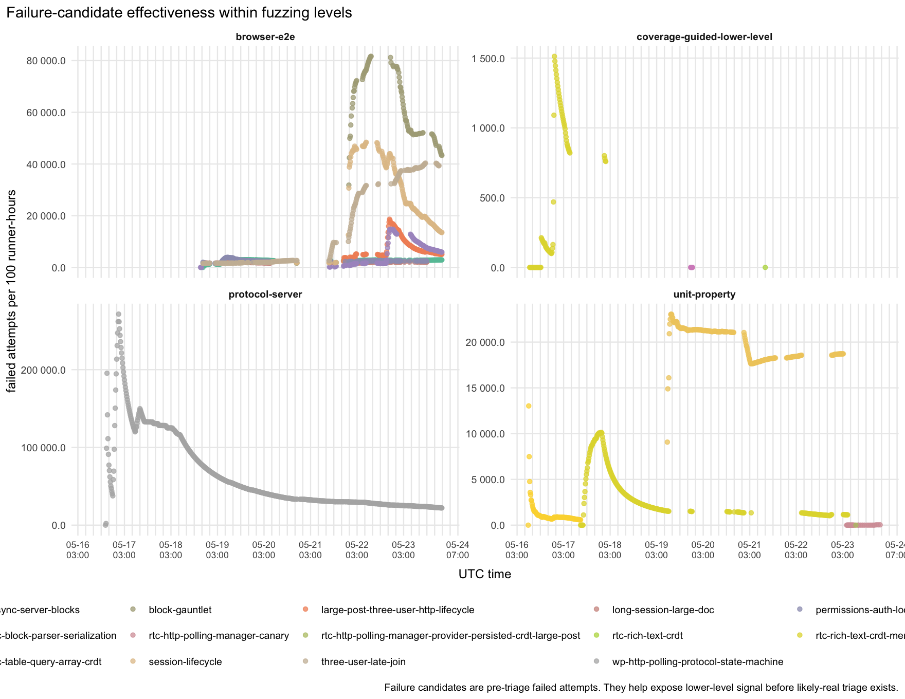

Within browser/e2e, cumulative likely-real triage output now spans multiple
profiles, led by session lifecycle, three-user late join, and
permissions/auth/locks. The broader unique-output candidate view is led by
three-user late join, session lifecycle, and real-user editing, with
coverage-guided lower-level and unit/property each showing small nonzero
candidate totals. Lower-level and transport lanes should continue to be judged
partly by the unique-output candidate graphs until their triage pipeline is
producing comparable likely-real and non-duplicate results.

## Profile Completion

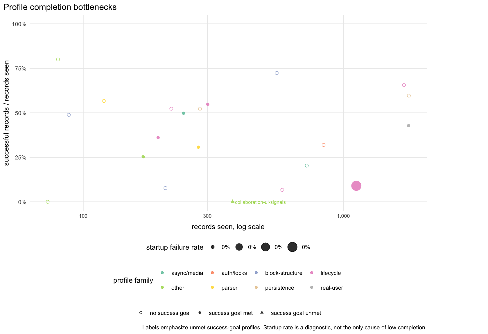

Profiles with high successful counts include async/server blocks,
permissions/auth/locks, same-user/session lifecycle, three-user late join, and
HTTP persistence. The scatter uses records seen on the x-axis, completion rate
on the y-axis, startup-failure rate as point size, and unmet success goals as
triangle markers. Low-completion profiles are the next depth targets:

| Profile | Seen | Successful | Startup failures | Success rate |
| --- | ---: | ---: | ---: | ---: |
| `full` | 840 | 18 | 0 | 2.1% |
| `multi-reload-lifecycle` | 3259 | 109 | 0 | 3.3% |
| `revision-persistence` | 4451 | 155 | 0 | 3.5% |
| `parser-serialization` | 3224 | 159 | 0 | 4.9% |
| `real-user-editing` | 6827 | 558 | 1 | 8.2% |
| `parser-transform` | 4175 | 415 | 0 | 9.9% |
| `common-blocks` | 3971 | 398 | 0 | 10.0% |
| `structure` | 536 | 95 | 0 | 17.7% |
| `block-gauntlet` | 6157 | 1136 | 0 | 18.5% |
| `long-session-large-doc` | 2751 | 532 | 0 | 19.3% |
| `persistence-no-title` | 3162 | 782 | 0 | 24.7% |
| `session-lifecycle` | 7961 | 2381 | 0 | 29.9% |

The data suggests the next productive improvement is less about adding brand-new
surface labels and more about increasing completed records for existing
expensive profiles.

## Coverage Goals

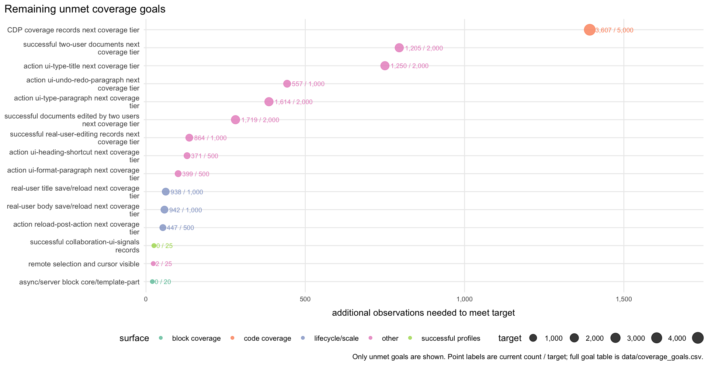

Current unmet goals from the latest state:

| Goal | Current | Target |
| --- | ---: | ---: |
| real-user title save/reload next 1000 tier | 462 | 1000 |
| action reload-post-action next 2000 tier | 986 | 2000 |
| real-user body save/reload next 1000 tier | 521 | 1000 |
| successful real-user-editing records next 1000 tier | 558 | 1000 |
| action ui-format-paragraph next 2000 tier | 1415 | 2000 |
| real-user title save/reload next 500 tier | 462 | 500 |
| action ui-heading-shortcut next 1000 tier | 969 | 1000 |
| action reload-post-action next 1000 tier | 986 | 1000 |

The remaining queue mixes real-user save/reload lifecycle depth, real-user
editing completion, and action depth.

## Feature Mix

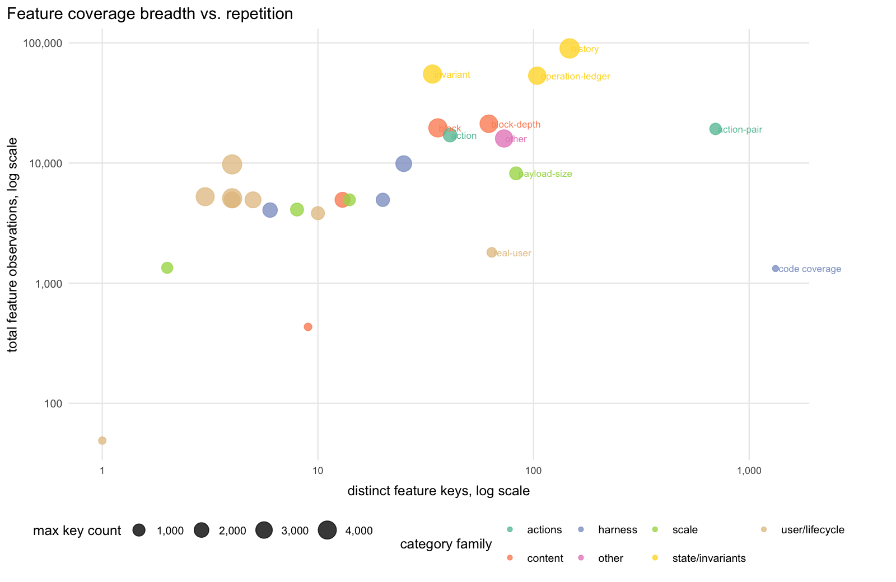

The feature-key breadth is now led by code coverage, action-pair, real-user,
history, operation-ledger, payload-size, block-depth, and other
observations. Raw volume is still heavy in history, operation-ledger, invariant,
and action-pair observations. That is the right shape for RTC data-loss work
because the harness observes both semantic state transitions and low-level
block/action combinations. The plot separates breadth (`keys`) from repeated
observations (`total_count`) so broad coverage is not hidden inside raw event
volume.

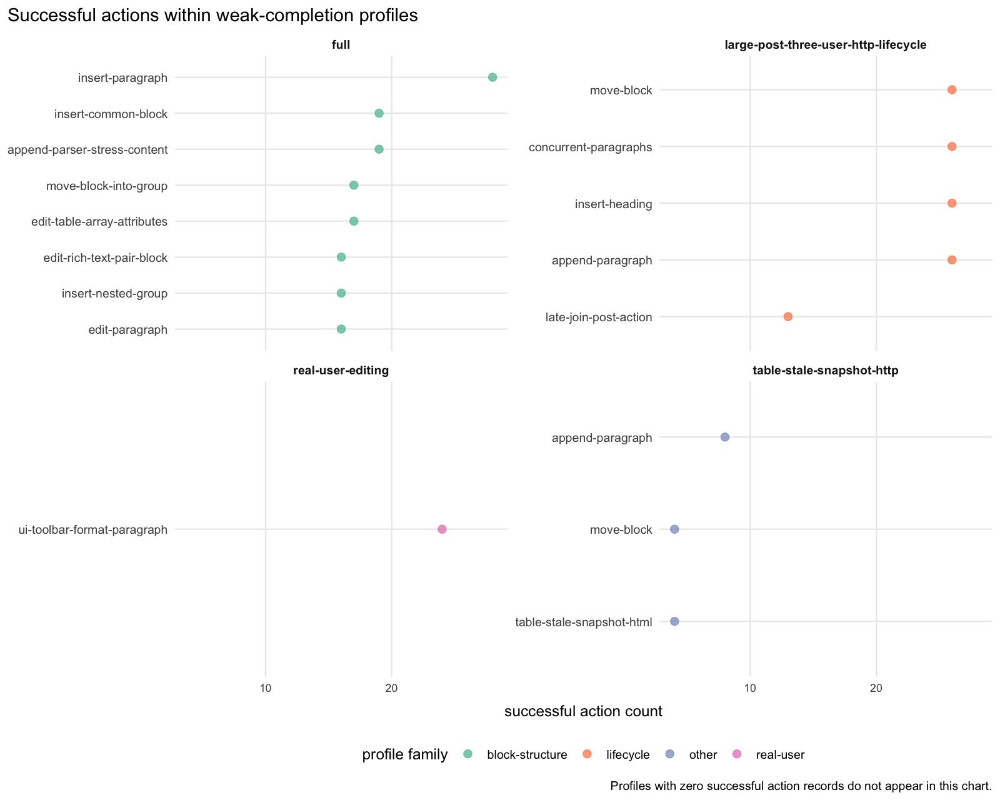

The successful-action plot is restricted to weak-completion profiles instead of
global top actions, so high-volume async and permissions lanes no longer hide
the profiles that still need more completed full records.

## PR Review Loop

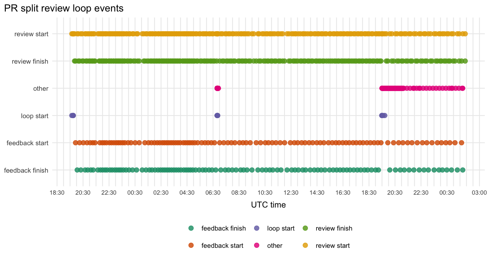

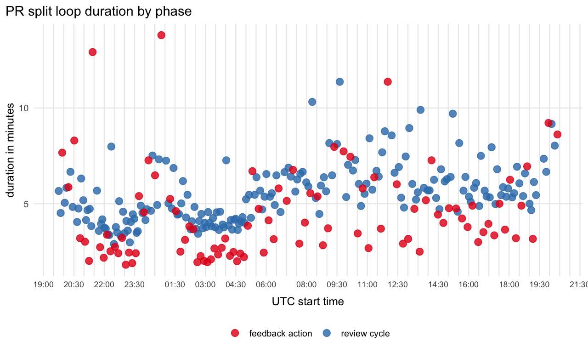

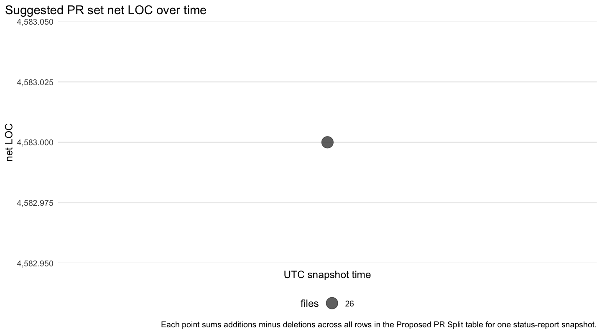

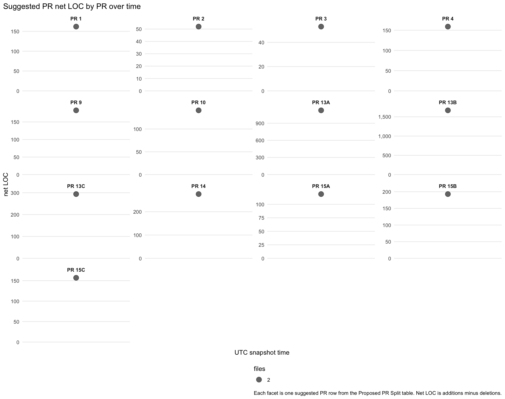

With the live loop at `max_parallel=6`, the last 20 completed review cycles
took roughly `6.9` to `12.2` minutes in this snapshot; the latest completed
review, `20260517T135955Z`, took `10.7` minutes. The newest completed window
includes `20260517T130206Z` from `2026-05-17T13:02:06Z` to
`2026-05-17T13:10:16Z`, `20260517T131937Z` from
`2026-05-17T13:19:38Z` to `2026-05-17T13:28:25Z`, `20260517T132830Z` from
`2026-05-17T13:28:30Z` to `2026-05-17T13:35:59Z`, `20260517T134933Z` from
`2026-05-17T13:49:33Z` to `2026-05-17T13:59:50Z`, and `20260517T135955Z` from
`2026-05-17T13:59:55Z` to `2026-05-17T14:10:35Z`.

The newest PR-split synthesis, `20260517T135955Z`, says the replacement split is
active but not filing-ready. The Cycle 266/268/270/272 topology remains the
current hypothesis: `PR05D` is real after `PR05C`,
`PR03B`/repaired `PR06B`/`PR07C` stay sidecars, and `PR17`, `PR18`, `PR18x`,
stale `1020002`, sync undo/redo, and raw reload work remain rejected from
current evidence. Its blockers are unresolved reload/rejoin awareness ownership
and active-manifest stale `PR06B` rows. The latest substantive
`20260517T132830Z` feedback-action applied the Cycle 272 active fence, consumed
the corrected executor filter, proved `job-pr17-1020002` went from one runnable
row to `0` and raw deferred reload rows went from `9` queued to `0`, generated
fresh queue proof artifacts, and launched the bounded `PR07B`/`PR07C`
reload-owner comparison. Filing, pushes, broad final-stack fuzzing, new
`1020002` repair jobs, and naming `PR07D` remain blocked.

The suggested-PR size charts are parsed from the status report's proposed PR
split history. The latest parsed snapshot, `2026-05-17T14:11:24Z`, has `15`
suggested rows totaling `8022` net LOC. The largest current rows by net LOC
are `PR 13B` (`1668`), `PR 12` (`1386`), `PR 7A` (`1331`), `PR 13A` (`1126`),
and `PR 6` (`732`). These charts remain size telemetry from parsed status
snapshots, not filing authority for split shape.

## Interpretation

The coverage graph is still positive on breadth and depth intake: files and
coverage observations continue to grow, visible likely-real failures reached
`4`, and unmet goals are down from the initial `24` to `8`. The latest plotted
current-output-dir duplicate/startup sample has live duplicate pressure but no
startup failure pressure: `duplicateShareCurrent=0.5` and current summary
startup failures are `0`. It has `0` quality issues, `0` warnings, a true
headroom flag, and `439.5G` free memory.
The copied novelty state has two enabled coverage-guided browser groups:
`novelty-ws-real-user-rich-text` and `novelty-ws-lifecycle`.
Historical aggregate duplicate/noise remains context; the live graph status
comes from current-output-dir duplicate share and current summary startup
failures.

The duplicate/noise persona loop rejects raw historical duplicate/noise as a
live health signal and rejects broad suppression of product-evidence failures.
The latest synthesis, `20260517T134847Z`, says stale paused-drain or historical
startup-noise state can still steer novelty-monitor scheduling and coverage-Codex
holds outside the active output dir. The matching feedback-action implemented
the run-local monitor cleanup and restarted only coverage-guided novelty. The
refreshed graph is clean on current startup pressure but not on current
duplicate share, and the persona loop still flags runner-source strict startup
duplicates as remaining risk.

The PR-split persona loop rejects a filing-ready read and a broad/final-stack
fuzz read. The newest synthesis, `20260517T135955Z`, says the Cycle
266/268/270/272 replacement topology is active but blocked: `PR05D` is clean
after `PR05C`, and `PR03B`, repaired `PR06B`, and `PR07C` remain sidecars, but
reload/rejoin awareness ownership and stale `PR06B` manifest admission are still
unresolved. It rejects `PR17`, `PR18`, `PR18x`, stale `1020002` revival, raw
reload work, sync undo/redo ownership, filing, pushes, and broad/final-stack
fuzz from current evidence. It also says `PR07D` should not be named unless
bounded `PR07B`/`PR07C` replay proves non-coverage for the reload/rejoin
awareness stall.

The remaining fuzzing weakness is completion depth and level diversity. The
graph's latest snapshots are still concentrated in browser/e2e (`30` lanes),
with `unit-property` and one `coverage-guided-lower-level` lane active as
lower-level targets. The latest level-mix synthesis, `20260517T133414Z`, rejects
adding lower-level capacity until browser materialization and current-root live
PID accounting are stable. Its matching feedback-action is empty; the latest
substantive feedback-action, `20260517T130325Z`, reports missing browser
materialization restored, the capped unit/property lane retargeted to a stronger
rich-text CRDT oracle, and new unit/property executions with one new rich-text
CRDT assertion family.

Backend/API remains inactive, transport-integration has historical but no
current counted rate, `coverage-guided-lower-level` has a plotted lane but `0`
current counted executions, protocol-server remains `0`, and standalone
fuzz-assertion remains `0` in the graph. The latest native synthesis,
`20260517T135702Z`, keeps the V8/Node rich-text CRDT harness as the first ready
isolated lower-level target, while the latest substantive native action,
`20260517T134230Z`, validated direct and bounded tmux smoke event accounting.
The production lane is still held. The latest protocol synthesis,
`20260517T135131Z`, names HTTP polling REST as the first ready protocol/server
harness, and the latest substantive protocol action validates the runner and
event metadata; the graph still counts `0` protocol-server executions because
that validation did not update the productive current-run root. The latest
execution bucket has about `44` browser/e2e test executions/hour, `2,432`
unit-property executions/hour, and `0` for transport,
coverage-guided lower-level, protocol-server, backend/API, and standalone
fuzz-assertion. The latest fuzz-only assertion action adds browser-gated
diagnostics, so it can affect browser/e2e output even though standalone
fuzz-assertion remains `0`. The next narrow operational checks are
novelty-monitor scheduling, browser
materialization/accounting, lower-level and protocol lanes appearing in
execution/output graphs, and PR split bounded reload-owner replay before any
final-stack fuzz or filing claim.
