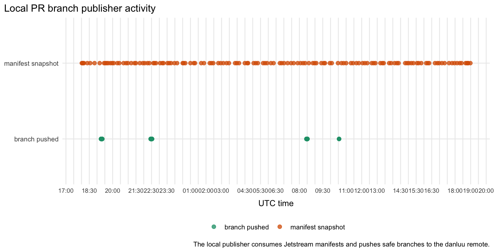

# RTC Jetstream2 fuzz trend analysis

Snapshot generated: `2026-05-19T15:08:00Z`

This report summarizes the Jetstream2 coverage-guided fuzzing and PR-review
loop logs using R, ggplot2, tidyverse data manipulation packages, and
ColorBrewer palettes. The plots prefer scatter/dot encodings over line plots;
dense time-series points use partial transparency.

Source inputs:

- coverage monitor log:
  `/media/volume/danluu-fuzz-data/rtc-coverage-guided-20260515/logs/monitor.log`
- latest copied novelty state:
  `rtc-jetstream2-fuzz-trends-20260515/raw/novelty-state.json`
- PR split review loop log:
  `/media/volume/danluu-fuzz-data/rtc-pr-split-review-20260515/logs/loop.log`
- PR-focused controller, critical-path executor, artifact index, and local
  publisher snapshots:
  `/media/volume/danluu-fuzz-data/rtc-pr-progress-controller-20260518/`,
  `/media/volume/danluu-fuzz-data/rtc-critical-path-pr-executor-20260517/`,
  `/media/volume/danluu-fuzz-data/rtc-artifact-index-20260518/`, and
  `/tmp/rtc-local-pr-branch-publisher-20260517/`
- CPU and load-average history:
  `/var/log/sysstat/sa15` through `/var/log/sysstat/sa19`, latest sysstat
  sample `2026-05-19T15:00:02Z`

The plotting script and summarized CSV inputs are committed under
[`rtc-jetstream2-fuzz-trends-20260515/`](rtc-jetstream2-fuzz-trends-20260515/).

## High-level readout

Coverage intake is still moving after the coverage-guided monitor restart. The
last completed monitor pass is rooted at `run-20260519T145026Z`, and the
repaired passes continue through `2026-05-19T15:05:40Z`. Across `2488` monitor
passes from `2026-05-15T01:21:42Z` through `2026-05-19T15:05:40Z`, cumulative
coverage record observations rose from `782` to `254859`. Coverage-file counts
are current-scan counts, not cumulative coverage; the latest current scan is
`2534` files after the latest root rollover. The monitor's visible likely-real
maximum remains `4`.

Coverage-goal pressure is lower but not finished. The latest copied
coverage-guidance state has `131` total goals and `4` unmet goals: real-user
save/reload depth, real-user editing completion, and reload-post action depth.

The latest plotted live health sample uses current-output-dir duplicate/noise
and monitor-pass summary startup failures: `duplicateShareCurrent=1`, current
summary startup failures `0`, quality issues `1`, warnings `0`,
`no_progress=0`, and `402G` free memory. The latest monitor pass has
`headroom=false`. The newest 1/5/15-minute load samples are all above the `64`
logical CPU count, and recent load exceeded it in `17` of the latest `25`
windows, so the current-output sample should not be read as a capacity claim.
Historical aggregate duplicate/noise is context only; its latest duplicate
share is `0.375` but is not the plotted live health signal.

The copied novelty state has advanced to `run-20260519T145026Z` with `2`
enabled groups, `4` paused groups, `2` active current run dirs, empty current
summary startup-failure maps, `11` current-run records for save/reload, and
`21` for title/body save/reload. The current-run and
paused/no-analysis-inclusive triage views each see `2` roots, `2` files, `3`
raw signatures, `1` deduped signature, `1` actionable signature, `0` visible
likely-real signatures, and `0` startup/bootstrap stalls. The current duplicate
share is `1`. The external-live view sees one
root, `10` files, `94` signatures, and `55` merged likely-real signatures, with
`5409` bootstrap stalls and `2706` known `pre_action_bootstrap_stall` noise
signatures. Current materialization has rolled again; current-output startup
noise is quiet, but the single current deduped signature is duplicate-share
concentrated while paused startup-noise and historical product-evidence
duplicate/family-cap pressure still need control-plane scrutiny.

Persona-loop evidence rejects several graph-only interpretations. The newest
duplicate/noise synthesis, `20260519T143930Z`, says strict no-product
`pre_action_bootstrap_stall` is mostly suppressed, but
`preserveProductEvidence` and no-analysis drain state can still be treated as
broad launch authority instead of visibility. It recommends one active
representative per product-evidence semantic family, preserving likely-real or
already-running representatives instead of blanket-suppressing product-evidence
failures. The latest feedback-action file from that cycle is empty; the latest
non-empty feedback-action, `20260519T135628Z`, implemented the earlier bounded
control-plane fix and observed a clean active run, but it also says the change
was not validated by a live dominant-family reproduction. The refreshed graph
now shows quiet current-output startup failures but duplicate-share
concentration in the one deduped current signature, so read it as an incomplete
live sample under high load, not as proof that the producer and
analysis-selection policy is durably fixed.

The PR-split persona loop rejects filing from the graph alone. The latest
synthesis, `20260519T082842Z`, keeps the ready main/CRDT split through `PR15C`
and keeps `PR16-RLH@0788a6e3713` as blocked, non-fileable
`RLH-6000007-candidate`. Cycle444 produced a fresh nonzero manifest/audit for
that clean candidate, but replay still stopped before the
`createPersistedCRDTDoc()` persistence parity oracle, so owner remains
undetermined. The latest feedback action, `20260519T082842Z`, kept the
candidate blocked and launched exactly one bounded strict `6000007`
head-reproduction repair. The strict owner gap remains open, so the graph still
does not justify raw reload/PR07D publication, PR16 filing, or broad final-stack
fuzzing.

The graph-visible fuzzing mix remains browser/e2e-heavy. The latest mix shows
`40` browser/e2e lanes across `26` groups, plus `1` `unit-property` lane and
`1` `coverage-guided-lower-level` lane. The latest level-mix synthesis,
`20260519T144202Z`, rejects reading those graph-visible lanes as healthy useful
capacity: useful browser/e2e capacity is below the `24`-lane floor, focused
exact sessions are missing, and many browser lanes are paused or stale. It
recommends admission-gated focused-shards backfill only when pressure allows and
explicitly rejects adding lower-level lanes now. The latest non-empty
feedback-action, `20260519T144202Z`, kept lower-level capacity capped and did
not force a restart because focused backfill was blocked by `high_pressure`.
It measured `22` PID-backed browser lanes against a `24` floor and found
focused exact sessions still missing.

Native/protocol persona evidence shows lower-level work exists and that some of
it is graph-visible. The latest non-empty native-harness synthesis,
`20260519T144741Z`, keeps
`coverage-guided-lower-level-block-parser-serialization` as the first ready
isolated coverage-guided lower-level harness and says the active parser lane is
already emitting coverage-guided lower-level events. The latest native action,
`20260519T142509Z`, implemented and validated that lane, passed an
action-local smoke with root/lane `events.ndjson`, and left the continuous
parser lane running. The latest protocol-server synthesis,
`20260519T145354Z`, keeps the production HTTP polling REST endpoint ahead of
WebSocket fuzzing and names `POST /wp-sync/v1/updates` as the first target. The
latest protocol action, `20260519T143643Z`, finished the REST protocol harness
and validated one passing seed, `20` individual protocol cases, and `23`
nonzero oracle counters without overwriting the active protocol current-run
root. The committed `backend-api`, `protocol-server`, and standalone
`fuzz-assertion` graph counters still remain at `0`, so these persona outputs
contradict a graph-only "no work exists" read without yet moving those
committed execution/output metrics.

The graph-visible controller state is narrower than the PR-split loop. Its
current table has `24` rows covering `22` distinct work items: `10`
high-priority publishable product branches, `8` medium-priority ready-product
branches needing repair, `1` runtime-gated PR07C owner-evidence item, and `3`
deduped deferred-family items. The controller decision queue has `14` allowed
rows and `11` blocked rows. The critical-path queue currently has one queued
browser/e2e owner-matrix job, one queued critical lane, three active analysis
sessions, and one active deferred session.

## Coverage Intake

The bottom facet is the operational queue: unmet goals fell from `24` to `4`.
The top facet shows cumulative coverage record observations increasing to
`254859`; coverage-file counts are tracked separately and reset when the active
output root rolls. The latest current-output sample is `2534` files from
`run-20260519T145026Z`. Dense monitor-pass points are intentionally small and
partially transparent so repeated samples do not visually turn into a
misleading line.

Per-pass yield is split out from cumulative state. `processed`, `new_features`,
`new_cdp`, and coverage-file deltas are shown on a `log1p` scale. Negative
coverage-file deltas are reset/restart artifacts and are marked separately.

## Health And Yield

The health graph uses current-output-dir duplicate/noise and monitor-pass
summary startup failures for live status. The latest plotted sample has
`duplicateShareCurrent=1`, current summary startup failures `0`, quality
issues `1`, warnings `0`, `no_progress=0`, `402G` free memory, and
`headroom=false`.
Historical aggregate duplicate/noise is not the plotted live health signal.

The copied current novelty state has `2` enabled groups,
`novelty-ws-real-user-title-body-save-reload` and
`novelty-ws-real-user-save-reload`, `4` paused groups, `2` active current run
dirs, empty current summary startup-failure maps, and current-run record counts
of `21` and `11` for those groups. The copied current-run and
paused/no-analysis-inclusive triage views each see `2` roots, `2` files, `3`
raw signatures, `1` deduped signature, `1` actionable signature, `0` visible
likely-real signatures, and `0` startup/bootstrap stalls. The current duplicate
share is `1`. The external-live triage view sees
one root, `10` files, `94` signatures, `55` merged likely-real signatures,
`5409` bootstrap stalls, and `2706` known `pre_action_bootstrap_stall` noise
signatures. Current materialization has rolled again; current-output startup
noise is quiet in this sample, while current duplicate concentration, paused
startup-noise, and historical product-evidence duplicate pressure still need
control-plane scrutiny.

Recent sysstat samples through `2026-05-19T15:00:02Z` show bursty CPU and load.
The latest 25 CPU samples range from `54.25%` to `82.46%` utilization, with the
latest sample at `78.59%`. Over those same 25 samples, one-minute load exceeded
the `64` logical CPU count in `12` windows, five-minute load in `12`,
15-minute load in `10`, and at least one load window exceeded it in `17`. The
newest 1/5/15-minute load sample is `66.45`, `69.84`, and `69.12`; all three
windows are above the `64` logical CPU count. The newest sample has `8`
blocked tasks.

## Enabled Surfaces

The historical enabled set still covers same-user/reload lifecycle,
revision/autosave/recovery, real UI rich text, parser/serialization transforms,
async/server-backed blocks, permissions/auth/locks, persistence, and long/large
sessions. Recent live state should be read from supervisor/group snapshots and
lane events rather than from the historical enable log alone. The latest copied
state has `2` enabled groups, `4` paused groups, empty current summary
startup-failure maps, `2` active current run dirs, and plotted current
duplicate share `1`.

## Fuzzing Level Mix

The level-mix plot reads supervisor group history, not just the novelty monitor
log. The copied snapshot history covers `coverage-guided`,
`coverage-guided-lower-level`, `focused-shards`, `gap-booster`,
`strict-expansion`, and `unit-property`. The latest plotted `is_latest` mix
shows `40` browser/e2e lanes across `26` groups, plus `1` `unit-property` lane
and `1` `coverage-guided-lower-level` lane.

Live graph-visible fuzzing is concentrated in browser/e2e lanes: `40` of the
latest `42` graph-visible lanes are browser/e2e. Lower-level work is active but
narrow: one `unit-property` lane and one `coverage-guided-lower-level` lane.
`transport-integration` has historical execution/output data but no current
counted rate. `backend-api`, `protocol-server`, and standalone
`fuzz-assertion` remain at `0` in the committed graph counters.

Persona-loop evidence adds caveats. The latest level-mix synthesis,
`20260519T144202Z`, says the intended mix should remain browser-heavy, but
useful browser/e2e capacity is below the `24`-lane floor, focused exact
sessions are missing, and stale/held `fuzz-assertion` should count as `0`
useful. It recommends admission-gated focused-shards backfill only after a
fresh PID-backed `<24` check and only if load pressure clears, and still keeps
lower-level lanes capped. The latest non-empty feedback-action,
`20260519T144202Z`, kept lower-level capacity capped, launched no new
lower-level target, and blocked focused backfill on `high_pressure` with `22`
PID-backed browser lanes against a `24` floor. This rejects both a graph-only
"add lower-level capacity now" interpretation and a graph-only "`40`
browser/e2e lanes means healthy useful capacity" interpretation.

Native/protocol actions show useful work beyond what all committed counters can
currently show. The latest non-empty native synthesis, `20260519T144741Z`,
chooses the block parser/serialization coverage-guided lower-level target as
the first ready isolated harness and says the active parser lane is emitting
coverage-guided lower-level events, even though the committed level-mix row
still shows an older lower-level profile. The latest native action,
`20260519T142509Z`, implemented and validated the lane, passed a smoke with
root/lane `events.ndjson`, and left the continuous parser lane running. The
latest protocol-server synthesis, `20260519T145354Z`, still chooses the HTTP
polling REST harness over WebSocket fuzzing. The latest protocol action,
`20260519T143643Z`, finished that harness and validated `20` individual
protocol cases with `23` nonzero oracle counters while leaving productive
browser fuzzing alone and not overwriting the active protocol current-run root.
The latest fuzz-only assertion action,
`20260519T034502Z`, added two gated browser/e2e assertions and restarted
affected loops, while the latest level-mix synthesis says stale/held
`fuzz-assertion` should count as `0` useful. These outputs are evidence,
but the committed `backend-api`, `protocol-server`, and standalone
`fuzz-assertion` execution counters still read zero.

## Fuzzing Level Executions

The current execution metric is estimated individual test/case executions
derived from lane `events.ndjson` files: browser seed attempts, unit/property
fixed tests plus generated fuzz cases, coverage-guided lower-level inputs, or
protocol/backend cases. Rechecks count as executions. This is more precise than
supervisor launches or lane counts, but it only covers fuzzers that emit lane
events. Lower-level counts are approximate when reconstructed from batch
metadata or legacy batch-count fields.

The latest collected execution data has about `6,250,729` completed test
executions: `384,796` browser/e2e, `3,006` transport/integration,
`5,415,104` unit-property, and `447,823` coverage-guided-lower-level. The
latest partial 15-minute bucket reports about `436` browser/e2e executions/hour
and `2432` unit-property executions/hour, with `0` current counted rate for
coverage-guided-lower-level, transport/integration, backend-api,
protocol-server, and standalone `fuzz-assertion`. `backend-api`,
`protocol-server`, and standalone `fuzz-assertion` remain at `0` cumulative
executions in this counter despite persona-loop evidence for backend/API,
protocol-server implementation, and assertion work.

## Fuzz Output Effectiveness

The likely-real graphs are triage-output metrics only. They count only
non-duplicate `.triage-watcher/**/result.json` rows classified `likely_real` per
100 runner-hours, deduped by canonical bug key and attributed to the failure
first-seen time. They are not total bug-finding graphs, not per-core
efficiency, and not a count of all bugs found by fuzzing.

On that triage-output metric, browser/e2e currently dominates: `848` unique
likely-real findings over about `2835.9` runner-hours, or `29.90` per 100
runner-hours. `transport-integration`, `unit-property`,
`coverage-guided-lower-level`, `backend-api`, `protocol-server`, and standalone
`fuzz-assertion` still have `0` triaged likely-real outputs in the collected
triage rows. That does not prove the lower-level lanes are unproductive; it
means their findings have not yet flowed through the same non-duplicate
likely-real triage result path.

The unique bug-output candidate graphs are broader. They dedupe non-infra
`likely_real` or `uncertain` triage rows, untriaged raw browser/transport
failure signatures, and lower-level assertion failures by canonical output key.
These graphs are intentionally broader than confirmed bugs and narrower than
raw failed attempts; untriaged candidates are not confirmed bugs.

Current unique bug-output candidate rates are: browser/e2e `6,481` candidates
over `2835.9` runner-hours (`228.53` per 100 runner-hours),
transport/integration `106` over `59.5` runner-hours (`178.14` per 100
runner-hours), coverage-guided lower-level `2` over `20.9` runner-hours
(`9.55` per 100 runner-hours), and unit/property `6` over `64.1` runner-hours
(`9.37` per 100 runner-hours). `backend-api`, `protocol-server`, standalone
`fuzz-assertion`, and `other` remain at `0` in this candidate-output metric.

Within the latest per-profile rows, browser/e2e still supplies nearly all
triaged likely-real output. Lower-level and transport lanes should continue to
be judged partly by the unique-output candidate graphs until their triage
pipeline is producing comparable likely-real and non-duplicate results.

The failure-candidate plot is a pre-triage lead indicator: failed seed or batch
attempts per 100 runner-hours before duplicate/noise triage. It is useful for
comparing where the system is still producing interesting work before
duplicate/noise analysis, but it is not a confirmed bug count. Current rates
are about `12581.0` for browser/e2e, `4537.5` for transport/integration,
`759.3` for coverage-guided lower-level, and `2619.3` for unit/property.

## Profile Completion

Low-completion profiles are still the next depth targets:

| Profile | Seen | Successful | Startup failures | Success rate |
| --- | ---: | ---: | ---: | ---: |
| `full` | 1047 | 34 | 0 | 3.2% |
| `multi-reload-lifecycle` | 4541 | 163 | 0 | 3.6% |
| `revision-persistence` | 7814 | 289 | 0 | 3.7% |
| `parser-serialization` | 4714 | 307 | 0 | 6.5% |
| `real-user-editing` | 10319 | 901 | 0 | 8.7% |
| `common-blocks` | 5383 | 512 | 0 | 9.5% |
| `parser-transform` | 6075 | 668 | 0 | 11.0% |
| `long-session-large-doc` | 5472 | 809 | 0 | 14.8% |
| `block-gauntlet` | 7787 | 1366 | 0 | 17.5% |
| `structure` | 541 | 96 | 0 | 17.7% |
| `session-lifecycle` | 10088 | 2791 | 0 | 27.7% |
| `media-cross-entity` | 566 | 171 | 0 | 30.2% |
| `three-user-late-join` | 12625 | 3961 | 0 | 31.4% |
| `permissions-auth-locks` | 10774 | 4653 | 0 | 43.2% |
| `async-server-blocks` | 12004 | 5259 | 0 | 43.8% |
| `persistence-no-title` | 4896 | 2152 | 0 | 44.0% |

## Coverage Goals

Current unmet goals from the latest state:

| Goal | Current | Target |
| --- | ---: | ---: |
| action reload-post-action next 2000 tier | 1450 | 2000 |
| successful real-user-editing records next 1000 tier | 901 | 1000 |
| real-user title save/reload next 1000 tier | 903 | 1000 |
| real-user body save/reload next 1000 tier | 962 | 1000 |

The remaining queue mixes real-user save/reload lifecycle depth, real-user
editing completion, and reload-post action depth.

## Feature Mix

The highest-volume feature categories are history, operation-ledger,
invariant, action-pair, block-depth, block, action, other, transport,
collaborator, revision, payload-size, autosave, initial-content, profile,
reload, save, step-count, users, and fault observations. The plot separates
breadth (`keys`)
from repeated observations (`total_count`) so broad coverage is not hidden
inside raw event volume.

The successful-action plot is restricted to weak-completion profiles instead of
global top actions, so high-volume async and permissions lanes do not hide the
profiles that still need more completed full records.

## PR Review Loop

With the live loop at `max_parallel=6`, the newest completed review cycle in
the collected graph data is `20260519T082842Z`; it took `9.98` minutes and
finished at `2026-05-19T08:38:41Z`. Feedback after cycle 446 then finished at
`2026-05-19T08:46:13Z`, and the next review cycle `20260519T084618Z` started
with no collected finish row yet.

The latest persona synthesis, `20260519T082842Z`, rejects a filing-ready
graph-only interpretation. It keeps the clean current split prefix through
`PR15C` and keeps blocked targeted-replay `PR16-RLH@0788a6e3713` as
non-fileable. Cycle444 produced a fresh, nonzero manifest/audit for that clean
candidate, but strict seed `6000007` still did not reach the persistence parity
oracle, so owner remains undetermined. The latest completed feedback action
updated the split and launched one bounded strict `6000007` head-reproduction
repair tmux job; the strict owner matrix remains open.

The suggested-PR size charts are parsed from the status report's proposed PR
split history. The latest parsed snapshot, `2026-05-19T02:28:28Z`, has `10`
suggested rows totaling `4,114` net LOC. The largest current rows by net LOC are
`PR 13B` (`1668`), `PR 13A` (`1126`), `PR 13C` (`294`), `PR 14` (`276`),
`PR 9` (`183`), `PR 1` (`162`), `PR 4` (`159`), `PR 10` (`141`), `PR 3`
(`53`), and `PR 2` (`52`). These charts remain size telemetry from parsed
status snapshots, not filing authority for split shape.

## PR-Focused Controller

The controller's current progress table has `24` rows covering `22` distinct
work items. The product-PR side is split between `10` high-priority publishable
branches and `8` medium-priority branches that still need repair before
publication. The remaining high-priority runtime-gated row is `PR07C/HOLD-07C`
owner evidence. The plotted state counts dedupe the deferred-family rows to
`1` high-priority product-decision item, `1` medium-priority diagnostic item,
and `1` low-priority cooldown item.

The queue-depth graph combines the PR progress table, current controller
decisions, critical blockers, critical job queue, critical lanes, and active
PR-related sessions. The live shape is `10` publishable PR items, `8`
needs-repair items, `1` PR07C owner-evidence item, `14` allowed controller
decisions, `11` blocked controller decisions, `1` queued critical job, `1`
queued critical lane, `3` active analysis sessions, and `1` active deferred
session.

The event plot comes from the controller's `events.ndjson` feed when the older
log file is absent. This snapshot shows `5` persona-control rounds and no fresh
heavy-job deferral events in that stream.

The current controller push manifest has `10` publishable branches totaling
`1,387` net LOC. The largest net additions are `PR07C` reload record snapshots
(`316` net LOC), the larger `PR06B` malformed-save-payload branch (`291`), and
the minimal `PR06B` sibling (`268`). Two fallback-group branches are net
negative because they remove more prior fallback code than they add.

The shared artifact index is graph-visible. This snapshot has `2,712` indexed
artifacts across critical-path, deferred, finalization, PR-split, and
PR-progress trees. The largest artifact classes are critical-path reports
(`861`), deferred reports (`449`), deferred push manifests (`334`), PR-split
reports (`271`), and finalization reports (`208`).

The critical-path executor currently has `5` blockers: `1` active, `1` queued,
and `3` terminal. The active row is `reload-hydration`; the queued row is
`PR07C/HOLD-07C` owner evidence. Terminal rows reopen only with fresh
product-owned evidence.

The blocked-decision graph shows the work the controller is deliberately
holding. The blocked rows are mostly high-priority publication gates: duplicate
PR06B sibling publication, PR07C owner/base gating, PR14 base repair, and PR15
stack selection. Diagnostic relaunches are also blocked for repeated
reload-hydration, pre-save-search-live-collapse, rich-text-suffix-corruption,
and old PR17/seed-reducer continuation artifacts.

The repeated-validation graph is the current way to see validation churn. The
largest repeated failures are deferred `http-room-isolation`,
`pre-save-search-live-collapse`, multiple `reload-hydration` heads, and
`rich-text-suffix-corruption`, each with `28` failed diff-check attempts in the
current audit. `ready/rtc-pr03b-browser-revision-restore-crdt-invalidation`
has `24` failed attempts.

The no-progress graph groups artifacts the critical-path loop rejected as not
advancing a blocker. The current ledger has `15` rows: `11` for `pr17-1020002`
and `4` for `seed-1060015-reducer`, all classified as
`pre_oracle_or_preflight_only`.

The local publisher graph shows `245` publication snapshots and branch pushes
from the local machine, with the latest snapshot at `2026-05-18T18:59:03Z`. It
consumes the artifact-index manifest-path list before falling back to
historical scans, keeping GitHub publication decoupled from Jetstream's lack of
GitHub access while reducing repeated manifest discovery work.

## Interpretation

The graph remains positive on coverage intake and goal reduction. The live
health graph has quiet current-output startup failures, but not a quiet
duplicate-share sample: `duplicateShareCurrent=1` while monitor-pass summary
startup failures are `0`. It also shows quality issues `1`, warnings `0`,
`no_progress=0`, and `402G` free memory. The same latest pass has
`headroom=false`. The newest 1/5/15-minute load samples are all above the `64`
logical CPU count, and recent load exceeded it in `17` of the latest `25`
windows. The current triage views see `2` files, `1` deduped signature, `1`
actionable signature, `0` visible likely-real signatures, and `0`
startup/bootstrap stalls. Historical aggregate duplicate/noise is `0.375`, but
it is context only and is not the live health signal.

The duplicate/noise persona loop rejects converting the quiet startup-failure
sample into a durable healthy-materialization claim. The latest synthesis,
`20260519T143930Z`, says the remaining issue is product-evidence/no-analysis
admission: preserved product evidence can still become broad launch authority
instead of one representative per semantic family. Its latest feedback-action
file is empty; the latest non-empty action, `20260519T135628Z`, implemented the
earlier bounded control-plane fix and observed a clean active run, but the
feedback also says the patch was not validated by a live dominant-family
reproduction. Read the refreshed graph as startup-noise improvement plus a
duplicate-concentrated current-output sample, not as proof that producer
selection is stable under load.

The PR-split persona loop rejects filing and broad final-stack fuzzing. The
latest synthesis keeps the usable prefix through `PR15C` and keeps
`PR16-RLH@0788a6e3713` blocked because seed `6000007` did not reach the
persistence parity oracle. The latest feedback action launched one bounded
strict repair; until that produces owner rows, the graph does not justify PR16
filing, raw reload promotion, rebuilt stack validation, or broad final-stack
fuzzing.

The committed fuzzing graph is browser/e2e-heavy: `40` current browser/e2e
lanes across `26` groups, `1` `unit-property` lane, and `1`
`coverage-guided-lower-level` lane. The latest level-mix persona synthesis,
`20260519T144202Z`, says useful browser/e2e capacity is still below the
`24`-lane floor despite the graph-visible lane count, focused exact sessions are
missing, and lower-level expansion should stay capped. The latest feedback kept
lower-level capacity capped and blocked focused backfill on `high_pressure`
with `22` PID-backed browser lanes against a `24` floor.
Lower-level work is real but narrow: unit-property and coverage-guided
lower-level have active graph counters; transport has historical output but no
current counted rate; backend-api, protocol-server, and standalone
`fuzz-assertion` counters remain zero. Persona evidence says native
coverage-guided lower-level, protocol-server, backend/API, and gated assertion
work exist. The latest non-empty native synthesis says the active parser lane
is emitting coverage-guided lower-level events, and the latest native action
implemented and validated the block-parser/serialization lower-level harness.
The latest protocol synthesis selects `POST /wp-sync/v1/updates`; the latest
protocol action finished the REST harness and validated `20` protocol cases
with `23` nonzero oracle counters without overwriting the active protocol
current-run root. The
graph-only "none exists" interpretation is also wrong.

The next browser-capacity check must show useful materialization above the
floor under load, not just startup cleanliness. The next duplicate/noise check
must drive current-output duplicate share back down while startup failures stay
quiet and the current groups produce useful product output, then validate the
product-evidence representative cap against a live dominant-family
reproduction. The next
narrow collector checks are backend-api, protocol-server, and fuzz-assertion
execution counts, continued lower-level output accounting, and final-stack
validation only after the PR split's owner-replay and gate-repair evidence is
accepted by the filing path.
