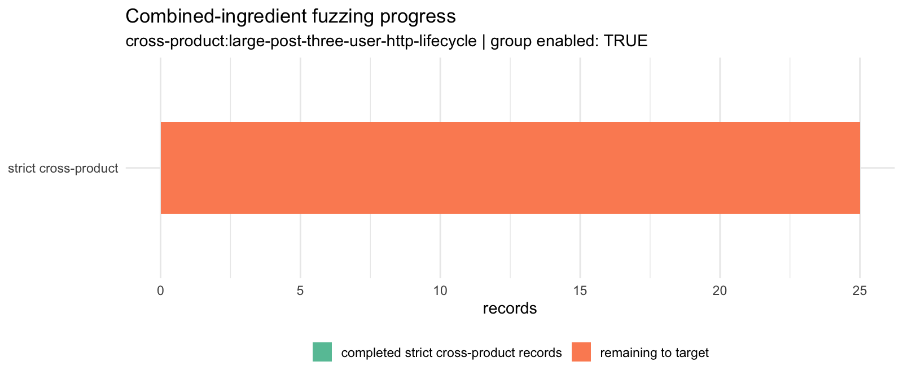
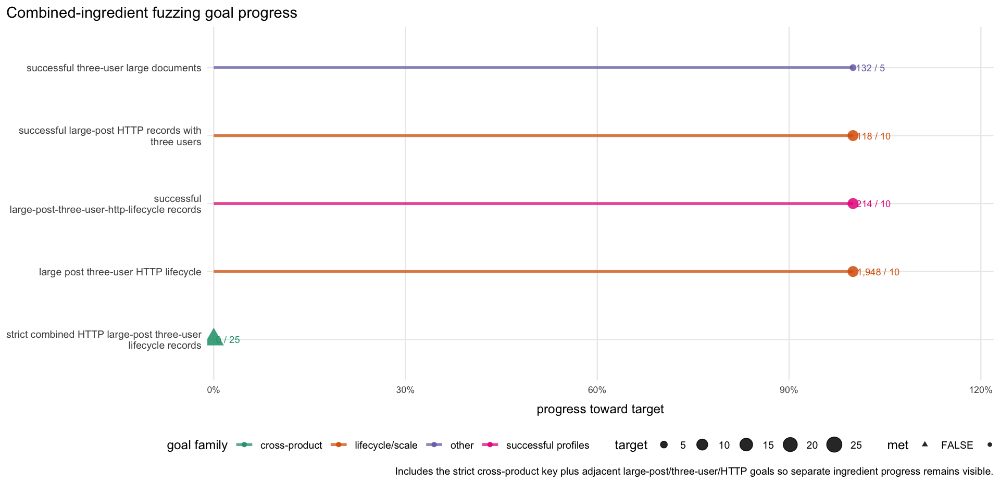
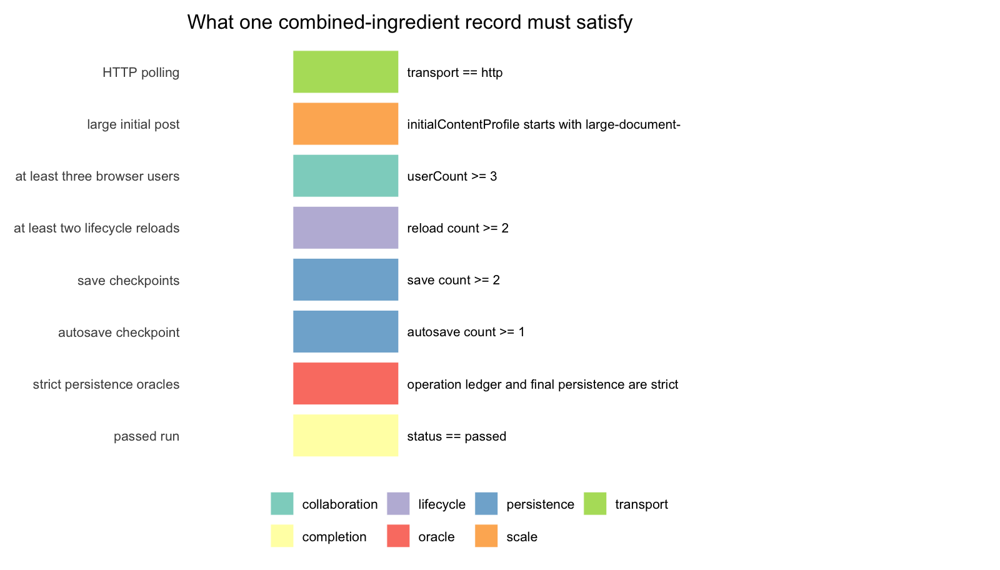
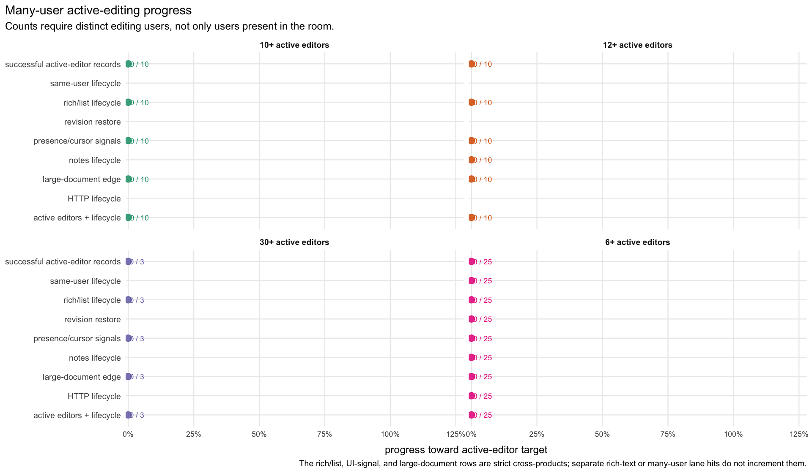
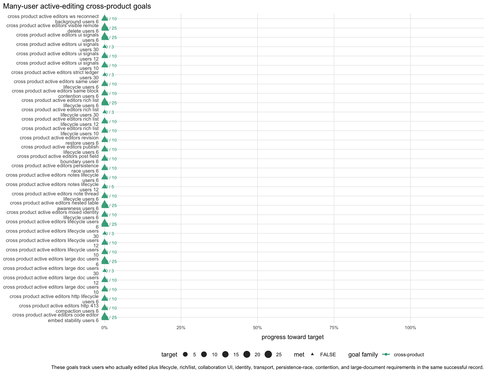
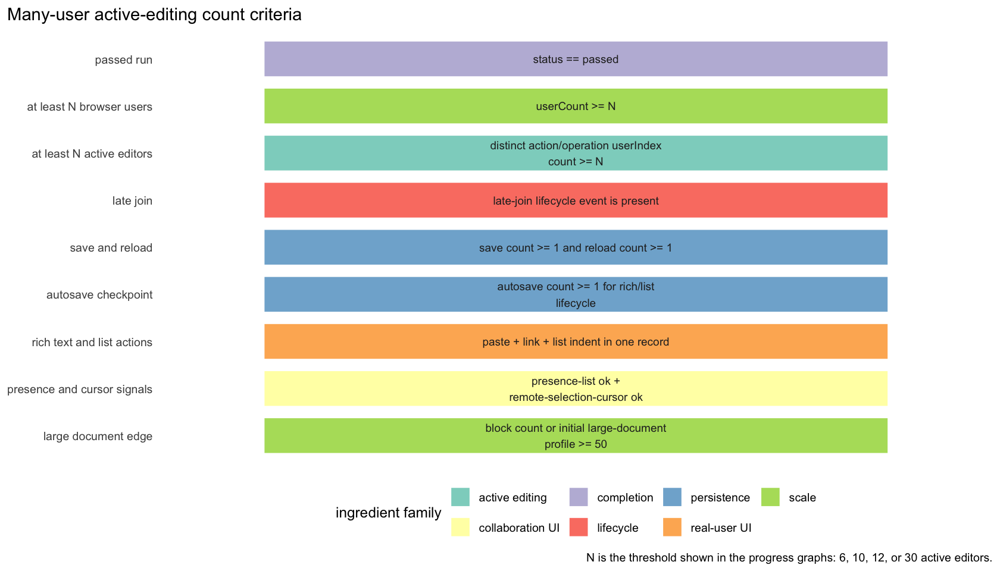
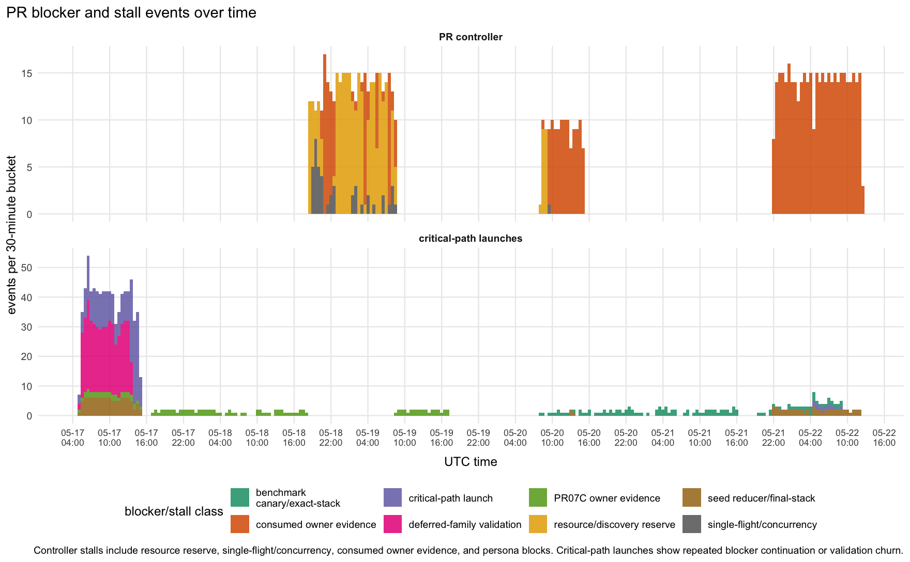

# RTC Jetstream2 fuzz trend analysis

Snapshot generated: `2026-05-22T12:35:43Z`

This report summarizes the Jetstream2 RTC fuzzing, coverage-guidance, resource,
and PR-progress logs. The plotting data is generated with R, ggplot2, tidyverse
packages, and ColorBrewer palettes. The summarized CSVs and plots are committed
under
[`rtc-jetstream2-fuzz-trends-20260515/`](rtc-jetstream2-fuzz-trends-20260515/);
raw inputs are copied into the refresh workspace for each run.

Source inputs include the coverage-guided run root, sysstat CPU/load samples,
the resource autoscaler disk samples, PR progress controller snapshots,
critical-path executor queues, artifact-index snapshots, and the latest copied
standard persona-loop outputs. The collector copies `raw/pr-focused/...` inputs
so PR-controller graphs track current raw state instead of stale local state.

## High-Level Readout

The monitor data is current through `2026-05-22T12:29:22Z`, and the latest
current-run accounting row was sampled at `2026-05-22T12:34:41Z` for
`run-20260522T123220Z`. That active-run row is not trusted yet:
`current_run_metrics_trusted` is `FALSE`, `pending_until_first_pass` is
`TRUE`, and `full_pass_pending` is `TRUE`. Treat the active row as incomplete
current-run accounting and a control-plane health signal until the run
completes a full pass. The monitor has `3,967` passes from
`2026-05-15T01:21:42Z` onward. Cumulative coverage record observations
are `277,874`; current-scan coverage files are `2,078`. The parsed
coverage-goal table still has `20` unmet target rows out of `137`.

The live duplicate/noise signal is current-output-dir accounting. The latest
completed current-output-dir row carries `duplicateShareCurrent` `0` and
summary startup failures `0`, but the active root's current-run signature
accounting is unavailable while first-pass accounting is pending. Current-run
signatures, actionable signatures, product-evidence signatures, and current-run
top duplicate share are all `NA` on the latest row. The prior trusted row at
`2026-05-22T12:26:46Z` for `run-20260522T121126Z` had `0` current-run
signatures, `0` actionable signatures, `0` product-evidence signatures, and
current-run top duplicate share `0`. Historical duplicate share is `0.1667`
for context; it is not the plotted live health signal.

The latest duplicate/noise synthesis rejects a product-bug or broad
product-duplicate-storm interpretation and identifies a producer/scheduler
control-plane leak: benchmark-canary/P0 groups can bypass duplicate/noise holds
after they already have a current-run product-evidence representative. The
newest duplicate/noise feedback-action says that bounded fix was applied: repo
artifact scans now ignore `repos`, and benchmark-canary duplicate-bypass stops
once current product evidence exists.

Resource state is usable in the latest sample. The latest monitor sample has
`408G` free memory; the latest disk sample has `90.9GiB` free on `/` and
`512.2GiB` free on `/media/volume/danluu-fuzz-data`. Latest CPU utilization is
`29.44%`, with `2.61%` iowait. Latest load averages are `28.87`, `24.27`, and
`28.41` on `64` logical CPUs, with `5` blocked tasks in the same sample.

The latest graph-counted fuzzing mix has `43` browser/e2e lanes across `39`
groups, plus one `unit-property` lane, one `coverage-guided-lower-level` lane,
and one `protocol-server` lane. Live graph-counted fuzzing remains
concentrated in browser/e2e. Current graph-counted lower-level work is narrow:
rich-text CRDT unit/property, a rich-text CRDT coverage-guided lower-level row,
and a protocol-server HTTP polling validation row. `transport-integration`,
`backend-api`, and standalone fuzz-only assertion work have no current
graph-counted lane.

The execution counter has `16,752,506` estimated individual executions. These
are reconstructed from lane `events.ndjson`: browser seed attempts,
unit/property fixed tests plus generated cases, coverage-guided inputs, and
protocol/backend cases. Lower-level counts are approximate when reconstructed
from batch metadata or legacy batch-count fields. The latest partial bucket at
`2026-05-22T12:30:00Z` has `29` browser/e2e executions, `1,024` unit-property
executions, and `900` protocol-server executions, about `116`/hour,
`4,096`/hour, and `3,600`/hour. The preceding bucket had `60` browser/e2e,
`3,040` unit-property, and `2,820` protocol-server executions.
The latest nonzero coverage-guided lower-level bucket remains
`2026-05-21T11:00:00Z` with `2` executions.

The PR-focused data is live. The controller table has `21` distinct work items
in `27` current rows: `13` high-priority ready-product PR rows marked
published, `5` high-priority ready-product rows held by the controller, `1`
runtime-held consumed row, and repeated deferred-family diagnostic plus
needs-product-decision rows. The current push manifest is empty. The
critical-path executor has `7` blockers: `2` runnable, `1` queued, `1` held,
and `3` terminal/downscoped. The latest PR-split feedback
keeps the fileable prefix through `PR15C` and rejects `PR16-RLH` as fileable
until strict seed `6000007` reaches the final persistence oracle and owner rows
prove it. Seed `5200005` reducer work and productive-analysis feedback are
runnable, the PR07C owner matrix is queued, and reload-hydration is held by a
single-flight manifest hold.

## Coverage Intake

The current coverage-file value is a current-scan count, not a cumulative
total. It can fall when the active output root changes or when a cleanup pass
removes old per-run files. Cumulative coverage record observations are the
better long-term intake signal.

## Health And Resources

The duplicate/noise graph uses current-output-dir accounting for live status.
Pending/incomplete accounting is tracked as its own health signal and should
not be read as a measured product duplicate/noise rate. If
`current_run_metrics_trusted` is `FALSE`, treat the duplicate/noise share as
incomplete current-run accounting and as a control-plane health issue until the
active run completes a full pass. The latest sample for
`run-20260522T123220Z` was taken at `2026-05-22T12:34:41Z` with
`current_run_metrics_trusted` `FALSE`, `pending_until_first_pass` `TRUE`, and
`full_pass_pending` `TRUE`. The collector's latest completed monitor pass is
`2026-05-22T12:29:22Z`, about `5.31` minutes before the current-run accounting
sample. The latest completed current-output-dir row still carries
`duplicateShareCurrent` `0` and summary startup failures `0`, but current-run
signatures, actionable signatures, product-evidence signatures, and top
duplicate share are `NA` while first-pass accounting is pending.

That pending state should not be read as a measured product duplicate/noise
rate. The prior trusted row at `2026-05-22T12:26:46Z` for
`run-20260522T121126Z` had `0` current-run signatures, `0` actionable
signatures, `0` product-evidence signatures, and current-run top duplicate
share `0`. An earlier trusted row at `2026-05-22T11:39:39Z` had `4`
current-run signatures, `4` actionable signatures, `4` product-evidence
signatures, and top duplicate share `0.25`. Those small, empty, or pending
denominators do not support a broad duplicate-storm interpretation. The
completeness graph tracks pending windows as their own control-plane health
signal.

The latest duplicate/noise synthesis rejects a product-bug or broad product
duplicate-storm interpretation. It says the stronger root cause is a
producer/scheduler leak in which benchmark-canary/P0 groups bypass duplicate
holds even after the current run already has a product-evidence representative,
so duplicate-heavy `assertion` product-evidence families can keep being
generated while downstream triage and analysis mostly cap siblings. The newest
duplicate/noise feedback-action reports that the bounded control-plane fix was
implemented: artifact scans now ignore `repos`, benchmark-canary duplicate
bypass stops once current product evidence exists, novelty was restarted, and
the post-start active-root checks saw `skipBenchmark=0`, `bypassBenchmark=0`,
and `blockBenchmark=4`. It also warns that the post-rotation sample is still a
small denominator: that feedback saw only `1` actionable signature out of `2`
raw current signatures, below the action gate minimum of `3`. The refreshed
graph has since rolled again to `run-20260522T123220Z`, whose first-pass
current-run accounting is pending. The right reading is a completed-row
duplicate/noise value of `0` plus an incomplete current-run
accounting/control-plane health state, with the recently fixed producer-side
bypass risk to recheck after the active run has trusted current-run signatures,
not a broad product duplicate/noise storm.

The disk graph tracks both root and the mounted data volume. The data volume is
around `85.5%` used and root is around `41.0%` used. Root pressure remains
stable, but output-size budgeting still matters on the data volume.

## Enabled Surfaces

The latest enabled-group event count is `1,701`. Recent enabled events include
`novelty-http-persistence-probe`, `novelty-ws-thirty-user-lifecycle`,
`novelty-ws-collaboration-ui-signals`,
`novelty-ws-real-user-coverage-bridge`,
`novelty-ws-real-user-save-reload`, and `novelty-ws-parser-transform`.

## Fuzzing Level Mix

The collector reads recent and current `supervisor-groups.json` files instead
of scanning unbounded history. The latest graph-counted mix is concentrated in
browser/e2e: `43` browser/e2e lanes across `39` groups. Lower-level work is
narrow: `unit-property`, `coverage-guided-lower-level`, and `protocol-server`
each have one current graph-counted lane. `transport-integration`,
`backend-api`, and standalone `fuzz-assertion` have no current graph-counted
lane in this snapshot.

The active coverage-guided root is `run-20260522T123220Z`, and its latest
current-run accounting row is first-pass-pending rather than trusted. The
latest graph-counted browser/e2e rows include five novelty coverage-guided
rows, including HTTP persistence, thirty-user lifecycle, collaboration UI
signals, real-user save/reload, and parser transform; three focused HTTP
backfill rows (`title-reload-http`, `existing-post-crdt-http`, and
`large-http-lifecycle`); six gap-booster rows; and focused/strict resident WS
and HTTP rows. Those rows cover persistence without title, title reload,
existing-post CRDT HTTP, large HTTP lifecycle, real-user editing, three-user
late join, revision, permissions/auth/locks, async/server, long-doc,
same-user lifecycle, parser transform/serialization, block-gauntlet, common
blocks, many-user lifecycle, collaboration UI, multi-reload, and same-user
stale draft coverage. Current graph-counted lower-level rows are the
rich-text CRDT unit/property lane, a rich-text CRDT coverage-guided lower-level
row whose current execution bucket is zero, and the HTTP polling
protocol-server validation row.

Persona-loop evidence rejects the simple interpretation that graph-counted rows
equal trusted useful live capacity. The newest level-mix synthesis says to
avoid broad generic lower-level expansion, keep backend/API and protocol/server
as one-lane sentinels, keep unit/property capped, keep coverage-guided
lower-level reducer-only, repair browser materialization/accounting before
trusting the mix totals, and count stale `fuzz-assertion` rows as zero useful
capacity. The latest level-mix feedback-action file is empty; the latest
non-empty feedback-action says the narrow mix change was applied: browser/e2e
was protected, backend/API and protocol/server stayed as one-lane sentinels,
unit/property stayed capped at one lane, fuzz-assertion stayed held, the
duplicate/no-yield parser lower-level lane was held, focused browser backfill
was launched, and coverage-guided browser materialization restarted.
The refreshed graph is above the synthesis floor, with `43` current
browser/e2e lanes against the `24`-lane target. The synthesis still rejects
treating all graph-counted rows as trusted useful capacity until roots,
sessions, PIDs, events, and summaries reconcile. The graph does not currently
show a Code Editor smoke lane, and `code-editor-smoke` still has only `5`
profile records and `0` successful records. The only current graph-counted
coverage-guided lower-level row remains rich-text CRDT, the current
coverage-guided lower-level execution bucket is zero, and the latest non-empty
level-mix feedback explicitly says no new lower-level executions should appear.
The refreshed graph accepts focused-browser, coverage-guided browser, and
protocol-server telemetry as present, but it rejects treating backend/API,
transport-integration, standalone fuzz-assertion, or continuous parser/block
parser lower-level serialization as current graph-counted residency.

The latest native-harness synthesis selects parser serialization as the first
isolated Node/V8 coverage-guided harness and cites a productive smoke artifact.
The latest native-harness action implemented and smoke-validated the parser
serialization harness, with one `seed-attempt-complete` and nonzero coverage
keys. That smoke artifact is not current graph-counted residency: the current
graph-counted coverage-guided lower-level row remains rich-text CRDT, and the
current coverage-guided lower-level execution bucket is zero. The latest
protocol-server synthesis selects the HTTP polling REST target first, with the
WS-only target deferred as a second surface. The newest protocol action
implemented and smoke-validated that HTTP polling harness, kept productive
browser fuzzing untouched, and produced a validation protocol-server row. The
graph shows that protocol-server HTTP polling validation row and protocol-server
executions in the latest buckets, including `900` executions in the partial
`2026-05-22T12:30:00Z` bucket, so protocol telemetry is present while
long-lived protocol residency remains admission- and pressure-sensitive.

Fuzz-only assertion work is not graph-counted as active. The latest assertion
action added two gated assertions; level-mix evidence still treats
`fuzz-assertion` as stale rather than current graph capacity.

## Fuzzing Level Executions

The execution metric estimates individual test/case executions from lane
`events.ndjson`: browser seed attempts, unit/property fixed tests plus
generated cases, coverage-guided inputs, and protocol/backend cases.
Lower-level rows are approximate when reconstructed from batch metadata or
legacy batch-count fields. The latest totals are approximately `78,686`
browser/e2e, `5,703,264` unit-property, `458,097` coverage-guided lower-level,
and `10,512,459` protocol-server executions. Transport-integration,
backend-api, fuzz-assertion, and other buckets are `0` in the current
reconstructed table.

The latest 15-minute bucket at `2026-05-22T12:30:00Z` is partial and has
`29` browser/e2e executions (`116`/hour), `1,024` unit-property executions
(`4,096`/hour), and `900` protocol-server executions (`3,600`/hour).
Coverage-guided lower-level, backend-api, transport-integration, and
fuzz-assertion are zero in that bucket. The preceding
`2026-05-22T12:15:00Z` bucket had `60` browser/e2e executions (`240`/hour),
`3,040` unit-property executions (`12,160`/hour), and `2,820`
protocol-server executions (`11,280`/hour). The
latest nonzero coverage-guided lower-level bucket remains
`2026-05-21T11:00:00Z` with `2` executions (`8`/hour).

## Fuzz Output Effectiveness

The likely-real graph is a triage-output metric only. It counts non-duplicate
`.triage-watcher/**/result.json` rows classified `likely_real`, deduped by
canonical bug key and attributed to first-seen time. The latest collected
triaged likely-real output is still all browser/e2e: `120` likely-real
findings over about `587.0` runner-hours, or `20.44` per 100 runner-hours.

The broader unique-output graphs include untriaged raw signatures and
lower-level assertion failures. Current unique candidate output has `1,301`
total candidates: `1,293` browser/e2e candidates, `6` unit-property
candidates, and `2` coverage-guided-lower-level candidates. Backend-api,
protocol-server, transport-integration, standalone fuzz-assertion, and other
buckets have no unique candidates in the latest graph-counted data.

Failure-candidate rates are pre-triage lead indicators, not confirmed bug
counts. They remain useful for spotting whether a lane is producing work worth
triaging before duplicate/noise filtering catches up.

## Profile Completion

The latest weak-completion profiles have successful record counts at zero in
the current sample: table stale snapshot HTTP (`4` records), code-editor smoke
(`5` records), and collaboration UI signals (`79` records).
Revision persistence has `4` successful records, parser serialization has `8`,
full-profile rows have `16`, many-user lifecycle has `17`, multi-reload
lifecycle has `37`, common blocks have `39`, long-session large-doc has `39`,
large-post three-user HTTP has `42`, three-user late join has `83`, parser
transform has `68`, media cross-entity has `93`, async/server blocks have
`96`, block-gauntlet has `105`, and permissions/auth/locks has `224`. This
still argues for completion-depth repair in existing covered
surfaces before adding another broad surface class.

## Coverage Goals

The combined-ingredient graphs are generated by
`rtc-jetstream2-fuzz-trends-20260515/scripts/plot-rtc-jetstream2-fuzz-trends.R`
from the novelty-state feature key
`cross-product:large-post-three-user-http-lifecycle`. They track the
benchmark-like conjunction: HTTP polling, large initial post, at least three
browser users, lifecycle reloads, save/autosave checkpoints, strict persistence
oracles, and a passed run. Separate ingredient-lane hits do not increment this
cross-product count. The goal-progress graph also includes nearby large-post,
HTTP, and three-user goals so already-running combined-ish lanes remain visible
while the stricter cross-product key ramps up.

Latest combined progress is `0`/`25` strict cross-product records. The
combined group is not currently marked enabled, and the adjacent large-post
three-user HTTP profile has `463` records seen with `42` successful records.
Those adjacent hits still do not count as completed combined coverage unless
the strict feature key records the whole conjunction.

The many-user active-editing graphs track a stricter scale dimension than the
older many-user document counts. A run only contributes to the active-user
series when distinct browser users actually perform successful editing actions,
not merely when those users are present in the room, and final UI witness-sweep
edits do not count as active-editor evidence. The cross-product rows then
require the same active-editor threshold together with realistic editing
ingredients: save/reload lifecycle, late join, autosave, rich text/list/table
editing, synced notes, collaboration UI signals, large-document setup, HTTP
polling with an explicit client-limit override, same-user tabs, revision
restore, publish transition, and a passed fuzz record.

Latest many-user active-editing progress is `0`/`25` records at six active
editors, `0`/`10` at ten active editors, `0`/`10` at twelve active editors,
and `0`/`3` at thirty active editors. Notes-lifecycle cross-products are also
`0` at the six- and twelve-active-editor thresholds. The refreshed lifecycle
(late-join plus save/reload/autosave), rich/list, UI-signal, and
large-document cross-product rows remain `0` at the 6/10/12/30 active-editor
thresholds, and the synced-notes rows remain `0` at the 6/12 thresholds. The
six-editor HTTP polling, HTTP client-limit override, same-user-tab,
revision-restore, and publish-transition cross-products are also `0`/`10`.
The new active-editing groups are not currently marked enabled in the sampled
state, so these graphs should remain red until the monitor admits the new six-,
twelve-, and thirty-active-editor lanes and they start producing passed
records.

Largest current unmet goal and active-editing gaps:

| Goal                                                   | Current | Target |
| ------------------------------------------------------ | ------: | -----: |
| successful parser-serialization records                |       8 |     50 |
| successful multi-reload-lifecycle records              |      37 |     50 |
| successful collaboration-ui-signals records            |       0 |     25 |
| strict combined HTTP large-post three-user lifecycle   |       0 |     25 |
| many-user active-editing records                       |       0 |     25 |
| six-active-editor lifecycle cross-product              |       0 |     25 |
| six-active-editor rich/list/lifecycle cross-product    |       0 |     25 |
| six-active-editor UI-signal cross-product              |       0 |     25 |
| six-active-editor large-document cross-product         |       0 |     25 |
| remote selection and cursor visible                    |       1 |     25 |
| remote and local autosave checkpoints                  |      11 |     25 |
| local post recovery autosave                           |      12 |     25 |
| async/server block core/template-part                  |       0 |     20 |
| twelve-active-editor progress                          |       0 |     10 |
| six-active-editor synced-notes/lifecycle cross-product |       0 |     10 |
| six-active-editor HTTP polling lifecycle cross-product |       0 |     10 |
| HTTP client-limit override for active editing          |       0 |     10 |
| six-active-editor same-user-tab lifecycle cross-product |       0 |     10 |
| six-active-editor revision-restore cross-product       |       0 |     10 |
| six-active-editor publish-transition cross-product     |       0 |     10 |
| table stale snapshot oracle                            |       0 |     10 |
| successful large-post HTTP records with three users    |       2 |     10 |
| action table-stale-snapshot-html                       |       4 |     10 |
| table stale snapshot over HTTP                         |       4 |     10 |
| action replace-code-editor-content                     |       6 |     10 |
| successful three-user large documents                  |       0 |      5 |
| thirty-active-editor progress                          |       0 |      3 |

## Feature Mix

These plots separate breadth from repeated observations and focus action
completion on weak profiles so high-volume successful lanes do not hide stalled
profiles.

## PR Review Loop

The parsed suggested-PR split history has `457` snapshots. The latest parsed
proposed split totals `4,114` net LOC. These charts are size telemetry from
parsed status snapshots, not filing authority. The largest latest rows are
`PR 13B` at `1,668` net LOC, `PR 13A` at `1,126`, `PR 13C` at `294`, and
`PR 14` at `276`.

## PR-Focused Controller

The current controller state has `21` distinct work items in `27` current rows.
The most important live queue entries are `5` high-priority ready-product PR
rows held by the controller, `13` published ready-product rows still under
validation, `1` high-priority runtime-held consumed row, and repeated
deferred-family diagnostic plus needs-product-decision rows.

Use the blocker/stall timeline when asking whether exact-stack gates, deferred
family budget gates, resource reserve, single-flight guards, or repeated
critical-path continuations are slowing progress. It buckets controller stalls
and critical-path blocker launches by 30-minute UTC windows. A spike is not
automatically bad, but repeated spikes for the same blocker class mean the loop
is spending capacity on a gate or relaunch pattern that should be consumed,
downscoped, or converted into exact evidence.

The current push manifest is empty, so there are no graph-counted publishable
branch rows in this snapshot. Published and held branches are still visible in
the progress table. The latest PR-split persona feedback rejects promoting
`PR16-RLH` as fileable: the ready prefix remains through `PR15C`, while
`RLH-6000007-candidate` is blocked pending strict seed `6000007` proof and
owner rows. Cycle 446 applied that split state and launched one bounded
strict-head repair job for `8fb598778357` / seed `6000007`; its report was
still pending in the copied persona evidence.

The artifact index has `3,291` current artifact rows across `23` root/kind
buckets.

The critical-path executor has `7` blockers: two runnable blockers
(`seed-5200005-reducer` and `productive-analysis-action`), one queued blocker
(`pr07c-owner-matrix`), one held blocker (`reload-hydration`), and three
terminal/downscoped blockers
(`benchmark-canary-fuzzer-gap`, `PR17` seed `1020002`, and
`seed-1060015-reducer`). The current job queue has seed `5200005` queued for
later, PR07C owner-matrix queued, reload-hydration gated by a single-flight
manifest, benchmark-canary terminal with fresh exact-stack green evidence, and
productive-analysis runnable. The repeated no-progress table currently
has two `benchmark-canary-fuzzer-gap` rows:
`zero_executor_artifact` and `pre_oracle_or_preflight_only`.

## Interpretation

The graph-refresh pipeline is current: the collector brings in the current
coverage-guided root, resource samples, PR-focused raw inputs, and the standard
persona-loop outputs. The active coverage root is `run-20260522T123220Z`, and
its latest accounting row is first-pass-pending rather than trusted. The live
row was sampled at `2026-05-22T12:34:41Z` with `full_pass_pending` `TRUE`,
`pending_until_first_pass` `TRUE`, and `current_run_metrics_trusted` `FALSE`.
The latest completed current-output-dir metrics are `duplicateShareCurrent`
`0` and summary startup failures `0`, but the active current-run denominator is
unavailable: signatures, actionable signatures, product-evidence signatures,
and top duplicate share are `NA`. This is an incomplete-accounting
control-plane health state until the active run completes a full pass.

The duplicate/noise persona synthesis still matters because it rejects a
product-bug reading and points at a plausible producer-side control-plane leak:
benchmark-canary/P0 producers can keep bypassing duplicate holds after a
current-run product-evidence representative exists. It recommends a narrow
one-function novelty-monitor fix. The latest duplicate/noise feedback-action
says that fix has now been applied, including `repos` scan pruning and a
benchmark-canary bypass stop once current product evidence exists. The graph
and persona evidence agree that the latest sample should not be interpreted as
a broad product duplicate storm. The latest graph row is not trusted because a
new active root is still pending first-pass accounting, and the feedback-action
explicitly warns that its post-rotation duplicate/noise sample had only `1`
actionable signature out of `2` raw current signatures. The synthesis remains
evidence of a recently fixed producer-side control-plane risk to recheck after
the active run accumulates trusted current-run signatures.

The resource picture is usable in the latest sample. Latest CPU utilization is
`29.44%`, with `2.61%` iowait; load is `28.87`, `24.27`, and `28.41` on `64`
logical CPUs, with `5` blocked tasks. The graph-counted fuzzing mix is
browser/e2e-heavy: `43` browser/e2e lanes, plus one lane each for
unit-property, coverage-guided lower-level, and protocol-server. Persona
evidence is stricter than the graph and rejects raw row counts as trusted
useful capacity unless roots, sessions, PIDs, events, and summaries reconcile.
The refreshed graph confirms current HTTP rows, a coverage-guided browser row,
and protocol-server telemetry. The newest level-mix synthesis says browser/e2e
capacity should stay at or above the `24`-lane floor; the refreshed graph is
above that floor with `43` current browser/e2e lanes.
It does not currently show a Code Editor smoke lane, and that profile still has
only `5` records and `0` successes. It has no backend/API lane, no
backend/API execution count, no transport-integration lane, no standalone
fuzz-assertion row, no continuous parser/block-parser lower-level row, and zero
current-bucket coverage-guided lower-level executions. The native-harness and
level-mix actions did implement and smoke-validate parser/block-parser
lower-level work, but those artifacts are not yet reflected as current
graph-counted lower-level residency.

Browser/e2e remains the only level producing triaged likely-real findings in
the committed triage-output metric. The latest execution bucket is partial: the
`2026-05-22T12:30:00Z` bucket has `29` browser/e2e executions, `1,024`
unit-property executions, and `900` protocol-server executions. The preceding
`2026-05-22T12:15:00Z` bucket shows `60` browser/e2e executions, `3,040`
unit-property executions, and `2,820` protocol-server executions. Lower-level
counts remain approximate where reconstructed from batch metadata or legacy
batch-count fields.

PR progress is visible again, but the controller is not advertising a non-empty
push manifest. The PR-split persona feedback keeps the fileable prefix through
`PR15C` and rejects `PR16-RLH` as fileable until strict seed `6000007` reaches
the final persistence oracle and owner rows prove it. The PR loop still needs
to convert held ready-product rows, queued seed `5200005` reducer work, queued
PR07C owner matrix, held reload-hydration work, and runnable productive-analysis
feedback into validated publishable branches rather than more blocked or
no-progress artifacts. Benchmark-canary is terminal for now because current
feedback has fresh exact-stack green evidence.
