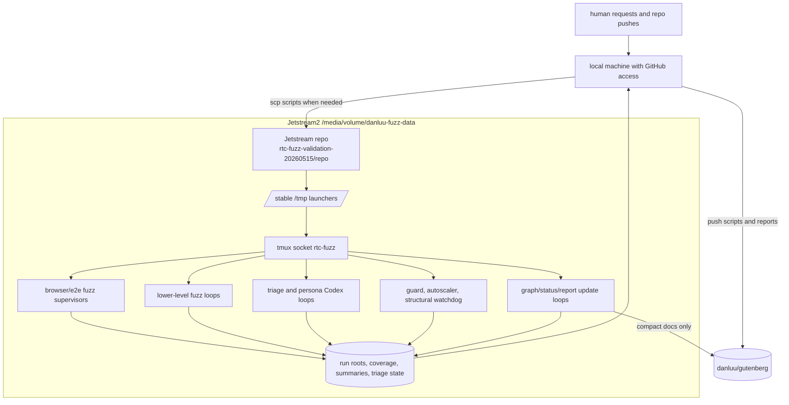
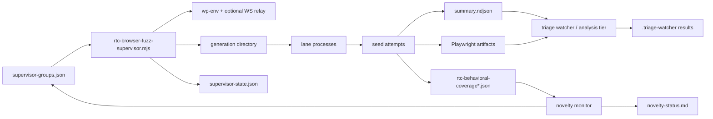
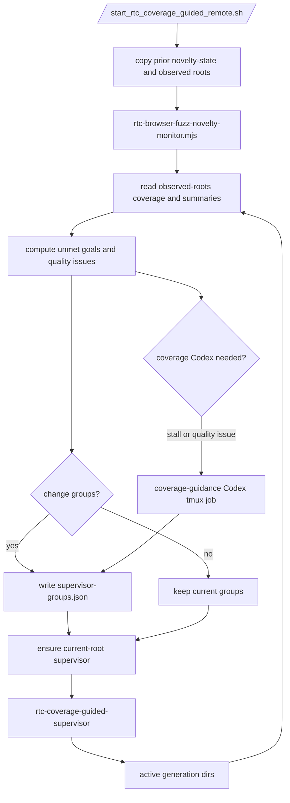
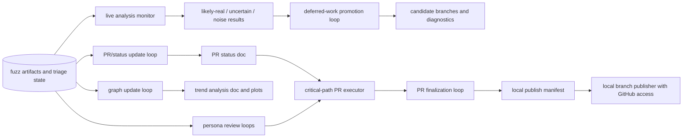
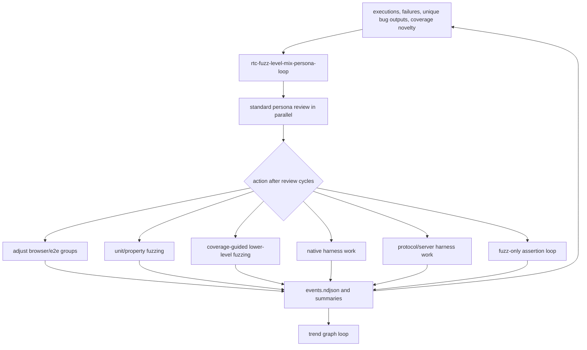

# RTC Jetstream2 fuzzing architecture and active loops

Snapshot time: `2026-05-18T02:09:24Z`

Remote host:
`exouser@danluu-fuzzer.cis251402.projects.jetstream-cloud.org`

Data root:
`/media/volume/danluu-fuzz-data`

Remote working repo used by most loops:
`/media/volume/danluu-fuzz-data/rtc-fuzz-validation-20260515/repo`

Current fuzz code under test in active lanes:
`try/rtc-fix-stack-validation` at
`72854f05ed20106daac3d125206f2643dac41677`.

Reusable Jetstream scripts and this runbook are kept on:
`try/jetstream-fuzz`.

## Short Version

Jetstream2 is running a set of tmux-owned services. Fuzzing, triage, graphing,
PR refinement, resource control, and structural self-repair are intentionally
separate loops that communicate through files under `/media/volume/danluu-fuzz-data`.
The top-level guard restarts missing owners; the structural watchdog catches
alive-but-wrong states; persona/Codex loops consume the same artifacts and write
bounded action reports or patches.

The core rule is: every loop owns one kind of decision, writes durable evidence,
and leaves enough state for another agent to reconstruct the system without chat
history.

## System Map



## Browser Fuzz Data Flow



Each browser fuzz family follows that shape, but the policy owner differs:

- `rtc-coverage-guided-*` is driven by coverage goals and novelty.
- `rtc-fuzz-strict-expansion` keeps broad strict RTC coverage running.
- `rtc-focused-shards` targets known high-value gaps.
- `rtc-gap-booster` boosts surfaces that were historically undercovered.

## Coverage-Guided Loop



Important current-root rules:

- `supervisor-state.json` is trusted only when its `outputDir` exactly matches
  the current novelty output root.
- A live default supervisor tmux session is not enough; it must write matching
  current-root state or be replaced after startup grace.
- Startup status must not overwrite a completed full `novelty-status.md` after
  a monitor restart. Full-status preservation is valid only for the same output
  root.
- Coverage-guided Codex is held when there are no active current-run dirs unless
  a policy action records an explicit reason.

Current coverage-guided root at the snapshot:

```text
/media/volume/danluu-fuzz-data/rtc-coverage-guided-20260515/run-20260518T020838Z
```

At snapshot time this root had just restarted and the first full novelty pass was
still pending:

```text
Updated: 2026-05-18T02:08:48.994Z
Output dir: /media/volume/danluu-fuzz-data/rtc-coverage-guided-20260515/run-20260518T020838Z
unmet goals: pending until first pass
signatures: pending until first pass
top duplicate family share: pending until first pass
running supervisor group: novelty-ws-parser-transform
```

## Supervision And Recovery

```mermaid
flowchart TB
    Guard[rtc-jetstream-guard-remote.sh] --> Exact[exact tmux session checks]
    Guard --> Restart[/stable /tmp start scripts/]
    Guard --> Cooldown[restart cooldowns and repeated-restart escalation]

    SessionWD[rtc-browser-fuzz-session-watchdog.mjs] --> TopSession[top-level tmux owner]
    SessionWD --> Restart

    SupervisorWD[rtc-browser-fuzz-watchdog.mjs] --> SupervisorSession[supervisor tmux session]
    SupervisorWD --> StaleState[stale supervisor-state or lanes]
    SupervisorWD --> Restart

    Autoscaler[rtc-resource-autoscaler-remote.sh] --> Load[CPU/load/memory]
    Autoscaler --> Budget[browser budget decisions]
    Autoscaler --> Materialization[materialization checks]
    Autoscaler --> Restart

    Structural[rtc-structural-issue-watchdog-remote.sh] --> AliveWrong[alive-but-wrong checks]
    AliveWrong --> RootAgreement[current root, status, supervisor outputDir, tmux agree]
    AliveWrong --> Prefix[prefix tmux masking]
    AliveWrong --> Duplicate[duplicate/noise dominance still visible]
    AliveWrong --> Repeated[historical repeated restarts only if current pool unsatisfied]
    Structural --> Repair[bounded rtc-structural-repair Codex jobs]
    Repair --> Restart
```



The guard is the top-level process recovery owner. The structural watchdog is the
control-plane sanity checker. The autoscaler decides scale, not fuzz mix; the
level-mix loop decides what kind of work should run, and the autoscaler decides
how much of that work can safely run.

Current structural watchdog state at the snapshot:

```text
updated: 2026-05-18T02:06:35Z
active repairs: 0
findings: none
```

## Analysis, Reports, And PR Work



Jetstream should not need GitHub credentials for PR branch publication. It writes
handoff artifacts and manifests; the local publisher can push branches to
`danluu`. Explanation docs are pushed from the local machine.

Key PR/progress loops currently visible in tmux:

```text
rtc-critical-path-pr-executor-loop
rtc-deferred-work-promotion-loop
rtc-pr-finalization-loop
rtc-pr-split-persona-review-loop
rtc-pr-split-persona-review-watchdog
```

## Fuzzing Level Mix



The level-mix loop is expected to look for problems proactively. It should not
wait for an error condition to fire before asking whether the mix is still
productive. If a lower-level lane is alive but producing no unique bug/assertion
families, that is an action item, not a success condition.

Lower-level and sidecar loops currently visible in tmux include:

```text
rtc-lower-level-fuzz-loop
rtc-coverage-guided-lower-level-parser
rtc-coverage-guided-lower-level-query-array
rtc-coverage-guided-lower-level-rich-text-multiblock
rtc-native-harness-persona-loop
rtc-protocol-server-persona-loop
rtc-fuzz-only-asserts-loop
```

## Active Loop Inventory

Current tmux sessions at the snapshot included:

```text
rtc-coverage-guided-analysis
rtc-coverage-guided-lower-level-parser
rtc-coverage-guided-lower-level-query-array
rtc-coverage-guided-lower-level-rich-text-multiblock
rtc-coverage-guided-novelty
rtc-coverage-guided-supervisor
rtc-critical-path-pr-executor-loop
rtc-deferred-work-promotion-loop
rtc-duplicate-noise-persona-loop
rtc-focused-shards
rtc-focused-shards-analysis
rtc-focused-shards-gap-codex-loop
rtc-focused-shards-watchdog
rtc-fuzz-level-mix-persona-loop
rtc-fuzz-level-mix-persona-loop-watchdog
rtc-fuzz-only-asserts-loop
rtc-fuzz-strict-expansion
rtc-fuzz-strict-expansion-analysis
rtc-fuzz-strict-expansion-watchdog
rtc-gap-booster
rtc-gap-booster-analysis
rtc-gap-booster-watchdog
rtc-lower-level-fuzz-loop
rtc-native-harness-persona-loop
rtc-pr-finalization-loop
rtc-pr-split-persona-review-loop
rtc-pr-split-persona-review-watchdog
rtc-protocol-server-persona-loop
rtc-resource-autoscaler
rtc-structural-issue-watchdog
```

Short-lived Codex worker sessions also appear during persona review, assertion
review, critical-path continuation work, native/protocol synthesis, and deferred
work jobs. Those are not durable owners; the owning loops above should either
adopt, time out, or replace them.

## Current Data Roots

Use pointer files instead of guessing the latest timestamp.

```text
/media/volume/danluu-fuzz-data/rtc-coverage-guided-20260515/current-output-dir.txt
  -> /media/volume/danluu-fuzz-data/rtc-coverage-guided-20260515/run-20260518T020838Z

/media/volume/danluu-fuzz-data/rtc-fuzz-focused-shards-20260515/current-run-root.txt
  -> /media/volume/danluu-fuzz-data/rtc-fuzz-focused-shards-20260515/runs/focused-shards-20260518T013125Z

/media/volume/danluu-fuzz-data/rtc-gap-booster-20260515/current-run-root.txt
  -> /media/volume/danluu-fuzz-data/rtc-gap-booster-20260515/runs/gap-booster-20260518T012743Z

/media/volume/danluu-fuzz-data/rtc-fuzz-strict-expansion-20260515/current-run-root.txt
  -> /media/volume/danluu-fuzz-data/rtc-fuzz-strict-expansion-20260515/runs/strict-expansion-20260518T012633Z
```

Important top-level roots:

```text
/media/volume/danluu-fuzz-data/rtc-coverage-guided-20260515
/media/volume/danluu-fuzz-data/rtc-fuzz-focused-shards-20260515
/media/volume/danluu-fuzz-data/rtc-gap-booster-20260515
/media/volume/danluu-fuzz-data/rtc-fuzz-strict-expansion-20260515
/media/volume/danluu-fuzz-data/rtc-resource-autoscaler-20260516
/media/volume/danluu-fuzz-data/rtc-structural-watchdog-20260518
/media/volume/danluu-fuzz-data/rtc-pr-finalization-20260516
/media/volume/danluu-fuzz-data/rtc-critical-path-pr-executor-20260518
/media/volume/danluu-fuzz-data/rtc-fuzz-only-asserts-20260515
/media/volume/danluu-fuzz-data/rtc-native-assert-protocol-20260516
```

## Durable State Contract

The durable state files are the API between loops:

```text
<campaign-root>/current-output-dir.txt or current-run-root.txt
<run-root>/supervisor-groups.json
<run-root>/supervisor-state.json
<run-root>/events.ndjson
<run-root>/novelty-status.md
<run-root>/novelty-state.json
<generation>/lanes.json
<generation>/lane-*/summary.ndjson
<generation>/lane-*/state.json
<generation>/lane-*/seed-*/primary/artifacts/rtc-behavioral-coverage*.json
<generation>/.triage-watcher/**/result.json
```

If a loop makes a decision from a graph, a status document, or a persona report,
it should also have enough raw state in these files to reject a stale or
incorrect interpretation.

## Operational Invariants

- Top-level loops must live in the `rtc-fuzz` tmux socket and use exact session
  name checks.
- A missing top-level novelty session is restarted by the session watchdog.
- A missing or stale supervisor is restarted by the per-run watchdog or guard.
- `supervisor-state.json.outputDir` must match the current root before a
  supervisor is considered healthy.
- A full `novelty-status.md` must not be overwritten by startup-only status on
  restart of the same output root.
- Historical duplicate/noise metrics can inform policy, but active health and
  restart decisions must use current-run scope.
- The structural watchdog should report alive-but-wrong controller states even
  when all tmux sessions exist.
- Autoscaling should change capacity, not decide that analysis should stop.
- Persona and analysis jobs are cheap on CPU unless they launch tests; they
  should not be throttled just because browser fuzzing is under load.
- Jetstream writes handoff artifacts for PR branches; the local machine pushes
  to GitHub.

## Inspection Commands

Check current coverage-guided status:

```bash
BASE=/media/volume/danluu-fuzz-data
COV=$(cat "$BASE/rtc-coverage-guided-20260515/current-output-dir.txt")
sed -n '1,180p' "$COV/novelty-status.md"
```

Check tmux loops:

```bash
tmux -L rtc-fuzz list-sessions | cut -d: -f1 | sort
```

Check root agreement for coverage-guided:

```bash
BASE=/media/volume/danluu-fuzz-data
COV=$(cat "$BASE/rtc-coverage-guided-20260515/current-output-dir.txt")
printf 'current=%s\n' "$COV"
jq -r '"supervisor=" + (.outputDir // "missing")' "$COV/supervisor-state.json"
grep -E '^(Updated:|Output dir:|- current-run dir source:|- current-run active dirs:)' \
  "$COV/novelty-status.md"
```

Check supervisor state summaries:

```bash
BASE=/media/volume/danluu-fuzz-data
for root in \
  "$(cat "$BASE/rtc-coverage-guided-20260515/current-output-dir.txt")" \
  "$(cat "$BASE/rtc-fuzz-focused-shards-20260515/current-run-root.txt")" \
  "$(cat "$BASE/rtc-gap-booster-20260515/current-run-root.txt")" \
  "$(cat "$BASE/rtc-fuzz-strict-expansion-20260515/current-run-root.txt")"
do
  echo "== $root =="
  jq -r '.groups[]? | [.name,.status,((.activeRunDirs//[])|length),(.lanes//""),(.lastReason//"")] | @tsv' \
    "$root/supervisor-state.json"
done
```

Check structural watchdog:

```bash
/tmp/start_rtc_structural_watchdog.sh status
```

Check autoscaler:

```bash
cat /media/volume/danluu-fuzz-data/rtc-resource-autoscaler-20260516/latest-status.md
```

Restart coverage-guided if both the session and watchdog fail:

```bash
/tmp/start_rtc_coverage_guided_remote.sh
```

Avoid running `wp-env clean` or global Docker cleanup while these loops are
active. Use the existing watchdog cleanup path or a targeted stale `wp-env`
cleanup script instead.
