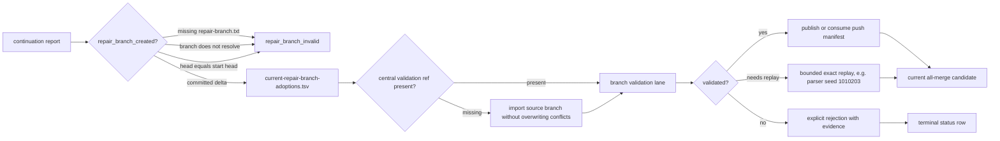
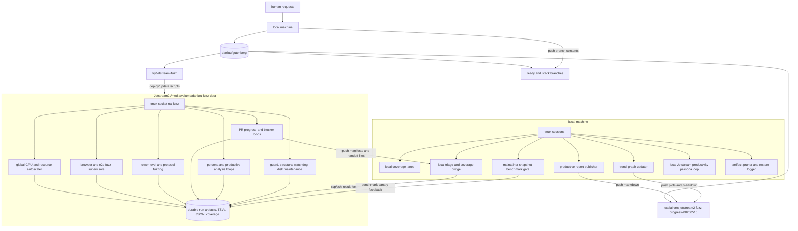
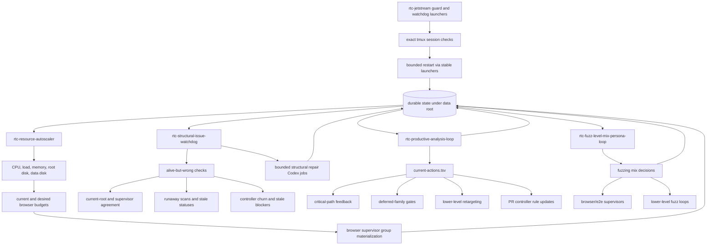
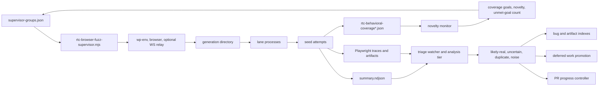
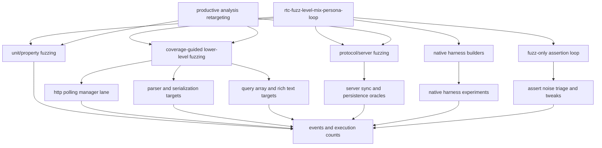
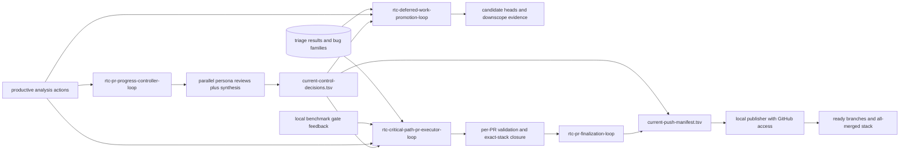
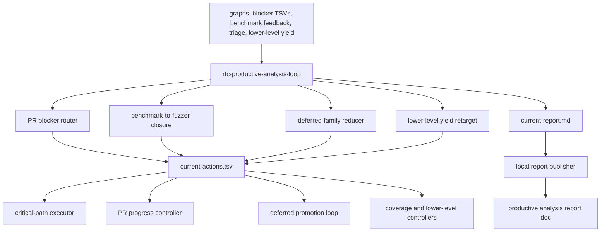

# RTC Jetstream2 fuzzing architecture and active loops

Snapshot time: `2026-07-08T03:49Z`

Blocker-history update: `2026-07-08T03:49Z`

Remote host:
`exouser@danluu-fuzzer.cis251402.projects.jetstream-cloud.org`

Jetstream data root:
`/media/volume/danluu-fuzz-data`

Remote working repo used by most loops:
`/media/volume/danluu-fuzz-data/rtc-fuzz-validation-20260515/repo`

Reusable Jetstream scripts, this runbook, and the published explanation docs are
kept on:
[`explain/rtc-jetstream2-fuzz-progress-20260515`](https://github.com/danluu/gutenberg/tree/explain/rtc-jetstream2-fuzz-progress-20260515)

Older fuzz-bootstrap scripts may still exist on
[`try/jetstream-fuzz`](https://github.com/danluu/gutenberg/tree/try/jetstream-fuzz),
but the `explain/*` branch is the current published runbook/status branch.

Primary progress and graph docs:

- [Trend analysis and graphs](https://github.com/danluu/gutenberg/blob/explain/rtc-jetstream2-fuzz-progress-20260515/docs/explanations/architecture/rtc-jetstream2-fuzz-trend-analysis-20260515.md)
- [PR status](https://github.com/danluu/gutenberg/blob/explain/rtc-jetstream2-fuzz-progress-20260515/docs/explanations/architecture/rtc-jetstream2-fix-pr-status-20260515.md)
- [Productive analysis loop](https://github.com/danluu/gutenberg/blob/explain/rtc-jetstream2-fuzz-progress-20260515/docs/explanations/architecture/rtc-jetstream2-productive-analysis-loop-20260521.md)

## Short Version

The project now runs as a two-host system.

Jetstream2 owns CPU-heavy fuzzing, durable artifact storage, PR blocker
continuation work, persona-guided control decisions, lower-level harness work,
and health monitoring. The local machine owns GitHub publication, some extra
coverage lanes, benchmark gating, report publication, and a bridge that feeds
local results back to Jetstream.

The important rule is unchanged: every loop owns one kind of decision, writes
durable evidence, and leaves enough state for another process to reject stale or
incorrect interpretations. Graphs and prose reports are not the API by
themselves; controller decisions must be traceable to TSV, JSON, or run
artifacts under the data root.

## 2026-07-08 Live Update

The current JS2 run is no longer just producing analysis loops. The control
plane now has an explicit repair-branch adoption path and fail-closed checks for
continuations that claim to have created a repair branch. At this snapshot:

- `rtc-critical-path-pr-executor-loop` is running in the `rtc-fuzz` tmux socket
  and refreshed `current-critical-path-status.md` at `2026-07-08T03:49:01Z`.
- `rtc-pr-progress-controller-loop` is running in the same tmux socket and
  refreshed `current-pr-progress-controller-status.md` at
  `2026-07-08T03:48:12Z`.
- The current coverage-guided run root is
  `/media/volume/danluu-fuzz-data/rtc-coverage-guided-20260515/run-20260708T033457Z`.
- The PR progress controller reports `active discovery sessions: 4`,
  `min discovery sessions: 3`, `max active PR jobs: 2`, and resource reason
  `deadline_benchmark_canary_finalization_ceiling`.
- The critical-path executor reports `max active continuations: 3`,
  `max active validations: 6`, `cycle sleep seconds: 60`, and
  `reconcile timeout seconds: 300`.
- `repair/benchmark-canary-richtext-entity-canonical-20260708T025216Z` is the
  current committed repair branch requiring validation/adoption. It resolves to
  `a51898eb5ee1d0f0cd009baebeb73f5e00558112`.
- Two earlier continuation claims are now explicitly marked
  `invalid-no-committed-delta` because their branch labels pointed at the
  continuation source head instead of a committed repair delta.
- The current benchmark canary product blocker is
  `novelty-ws-multi-reload-lifecycle`, with five retained product evidence
  records in `benchmark-canary-coverage-status.tsv`.

Current controller topology:

```mermaid
flowchart TB
    subgraph JS2["Jetstream2 rtc-fuzz tmux socket"]
        Coverage[rtc-coverage-guided-supervisor]
        Novelty[rtc-coverage-guided-novelty]
        Analysis[rtc-coverage-guided-analysis]
        Critical[rtc-critical-path-pr-executor-loop]
        PRProgress[rtc-pr-progress-controller-loop]
        Continuations[bounded critical continuation sessions]
    end

    RunRoot[(current coverage run root)]
    Status[(current status TSV/MD files)]
    Decisions[(current-control-decisions.tsv)]
    Adoptions[(current-repair-branch-adoptions.tsv)]
    PRTable[(current-pr-progress.tsv)]

    Coverage --> RunRoot
    Novelty --> RunRoot
    Analysis --> RunRoot
    RunRoot --> Critical
    RunRoot --> PRProgress
    PRProgress --> Decisions
    Decisions --> Critical
    Critical --> Continuations
    Continuations --> Adoptions
    Adoptions --> Critical
    Adoptions --> PRProgress
    Critical --> Status
    PRProgress --> PRTable
```



Repair branch adoption path:



Current feeds and speeds:

| Loop or feed | Current cadence / cap | Current state |
| --- | --- | --- |
| `rtc-critical-path-pr-executor-loop` | 60 second cycle, 300 second reconcile timeout | Running; opens/updates blockers and bounded continuation jobs |
| Critical continuations | Max 3 active | `pr07c-browser-env` and a fresh `pa-exact-benchmark-canary-product-failure` continuation were active around this snapshot |
| Critical validations | Max 6 active | Used for adopted repair branches and ready branch checks |
| `rtc-pr-progress-controller-loop` | 120 second cycle, max 2 active PR jobs | Running; reserves discovery and exposes repair-adoption rows |
| Discovery reserve | Minimum 3 active discovery sessions | Healthy at 4 active discovery sessions |
| Coverage-guided novelty | Current run root updates status every monitor pass | Running; current canary status had seven forced rows, five green/status-only rows, and one live product blocker |
| Repair adoption feed | Rewritten each critical reconcile | One valid committed branch, two invalid no-delta branch labels |

## Blocker Age And Failed Mitigations

As of 2026-07-08 UTC, the JS2 RTC fuzz pipeline has been dealing with the same
broad blocker class for roughly six weeks. The durable fuzzing roots started
around 2026-05-15, the benchmark canary feedback root started on 2026-05-20,
and the all-merge fuzz stack started on 2026-05-26. The specific stale feedback
that most recently kept reopening work was last written on 2026-05-24 in
`/media/volume/danluu-fuzz-data/rtc-benchmark-canary-feedback-20260520/current-feedback.tsv`,
so it was about 40 days old by 2026-07-03 and referred to the older
`2f8247258316bde60869c06c383090904e9426bd` candidate, not the current rebased
all-merge branch head.

The repeated failure mode was not simply lack of CPU or lack of fuzzing volume.
Several mitigations were tried and were insufficient:

- raising browser fuzz caps and resuming lanes, which increased activity but did
  not clear false control-plane gates;
- scheduler tweaks, which could not help while inherited benchmark feedback was
  being interpreted as live product failure evidence;
- exact-stack or benchmark reruns by themselves, because coverage-status rows
  and inherited `current-feedback.tsv` rows could still be converted into
  blockers;
- treating `exact_stack_green` as product confidence, which confused repair
  evidence for a known stack with current-run product coverage;
- product repair fanout, which wasted Codex cycles when stale, green, or
  non-promotion-blocking rows were accepted as open product blockers;
- killing tmux sessions only, which missed orphaned Codex process groups that
  active-job detection later adopted;
- productive-analysis classifications alone, which churned while feedback
  hashes and mtimes reopened rows;
- hardcoded monitor restart wrappers, which could restart a monitor against an
  old output directory;
- broad directory/artifact scans, which were too slow and noisy for health
  decisions.

The July 2026 recurrence guards are now: ignore stale or inherited feedback that
does not match the current branch head; never infer exact-stack blockers from
coverage-status rows or reason prose; require open, non-green,
`promotion_blocked=yes` product evidence before launching product repair; keep
`downscoped_to_coverage_materialization` terminal when the live canary has no
effective product blocker; kill orphaned process groups as well as tmux
sessions; and read the current output directory dynamically when restarting the
novelty monitor. The additional 2026-07-08 guards make
`repair_branch_created` fail closed unless a committed branch head differs from
the continuation start head, surface repair-branch adoption as first-class PR
progress rows, cache continuation classification lookups, and report
parentless PR-progress controllers as `running without tmux` until the `start`
path clears matching stale lock holders and relaunches the durable session.

When CPU is unexpectedly idle or a blocker looks old, check blocker age and live
evidence first. The detailed checklist and commands are in
[`real-time-collaboration-fuzzing-pipeline-runbook.md`](real-time-collaboration-fuzzing-pipeline-runbook.md).

## Two-Host System Map



## Jetstream Control Plane



Current autoscaler status at the snapshot:

```text
updated: 2026-07-08T03:49:29Z
cpu_percent: 50.4
load1: 47.36 / 64 cores
load5: 38.42 / 64 cores
load15: 32.39 / 64 cores
mem_available_gib: 196.2
root_disk_available_gib: 68.9
data_disk_available_gib: 280.3
docker_root_dir: /var/lib/docker
enabled_groups: 16
current_budget: target=16 max=16
desired_budget: target=16 max=16
materialized_active_run_dirs: 11
materialized_running_groups: 14
paused_infra_startup_groups: 0
supervisor_state_age_seconds: 25
supervisor_status_counts: disabled:6|recovering:3|running:11|waiting-repo-prep:2
last_action: observe
reason: deadline_benchmark_canary_finalization_ceiling
```

The resource controller is responsible for capacity and scale only. It should
not decide that analysis should stop. The mix loop decides what work is useful;
the autoscaler decides how much CPU-heavy work can run safely.

## Browser And Coverage Fuzz Data Flow



Current high-level browser and coverage families include:

- `rtc-coverage-guided-*`: coverage-goal and novelty guided browser fuzzing.
- `rtc-fuzz-strict-expansion`: broad strict RTC coverage.
- `rtc-focused-shards`: focused high-value product and benchmark-derived shards.
- `rtc-gap-booster`: targeted coverage gaps.
- `rtc-operator-correctness-fuzz-*`: operator correctness and regression probes.
- `rtc-backend-api-fuzz`: server/API-heavy coverage.
- local coverage lanes for same-user tabs, revisions/autosave, rich UI actions,
  block coverage, permissions/auth, async/server blocks, and three-user late
  joins.

## Lower-Level And Protocol Fuzzing



At this snapshot, lower-level work is primarily represented by productive
analysis action rows and controller retargeting, not by a single obvious
dedicated lower-level tmux session in the filtered live-session view. When a
lower-level lane is active, it should consume canary-derived reload,
parser/serialization, and persisted-CRDT oracles instead of allowing generic
exploration to count as progress for the benchmark canary gap.

Lower-level and protocol work should be evaluated by bug output and oracle
quality, not just by wrapper invocation counts.

## PR Progress And Promotion



Current PR progress controller status at the snapshot:

```text
updated: 2026-07-08T03:50:16Z
cycle sleep seconds: 120
max active PR jobs: 2
active PR jobs: 0
active discovery sessions: 4
min discovery sessions: 3
discovery protected: no
resource reason: deadline_benchmark_canary_finalization_ceiling
```

Important live PR/progress decisions:

- Reserve at least three discovery sessions; the reserve is currently healthy
  with four active discovery sessions.
- Treat
  `repair/benchmark-canary-richtext-entity-canonical-20260708T025216Z@a51898eb5ee1d0f0cd009baebeb73f5e00558112`
  as the next P0 product-progress repair branch to validate, adopt, publish, or
  explicitly reject.
- Keep the aggregate `benchmark-canary-product-failure` blocker open until live
  materialized canary evidence is repaired or explicitly downscoped.
- Block duplicate heavy benchmark-canary repair while the central-present
  repair branch and canary materialization are pending.
- Keep `benchmark-canary-fuzzer-gap` consuming protected capacity until every
  promotion-blocked or status-only primary canary row is current-run green or
  explicitly downscoped.
- Select at most one focused canary child after a materialized reread; otherwise
  keep the aggregate owner to avoid sibling fanout churn.

## Productive Analysis Loop



At the snapshot:

```text
updated: 2026-07-08T03:44:36Z
active lane jobs: 4
current action rows: 79
high-priority controller rows: 71
```

The loop currently emits actions for exact-stack benchmark-canary closure,
benchmark-canary product repair, deferred-family hard gates, PR07C
owner-evidence consumption, terminal reducer classification consumption,
publication holds, and lower-level oracle retargeting. Current P0 rows keep the
aggregate `benchmark-canary-product-failure` owner open until a live reread
shows no retained/nonzero/product-failure rows or a validated repair/downscope
clears them.

## Local Machine Loops

```mermaid
flowchart TB
    LocalTmux[local tmux sessions]

    LocalTmux --> SameUser[rtc-local-cov-same-user-stale-tabs]
    LocalTmux --> Revision[rtc-local-cov-revision-autosave]
    LocalTmux --> RealUI[rtc-local-cov-real-user-core-editing]
    LocalTmux --> Blocks[rtc-local-cov-block-gauntlet]
    LocalTmux --> Async[rtc-local-cov-async-server-blocks]
    LocalTmux --> Perms[rtc-local-cov-permissions-auth]
    LocalTmux --> ThreeUser[rtc-local-cov-three-user-late-join]

    SameUser --> LocalResults[(local fuzz and coverage results)]
    Revision --> LocalResults
    RealUI --> LocalResults
    Blocks --> LocalResults
    Async --> LocalResults
    Perms --> LocalResults
    ThreeUser --> LocalResults

    LocalTmux --> BenchmarkGate[rtc-maintainer-snapshot-benchmark-gate]
    LocalTmux --> Bridge[rtc-local-triage-jetstream-bridge]
    LocalTmux --> Trend[rtc-trend-autoupdate]
    LocalTmux --> ProductivePublisher[rtc-productive-analysis-report-publisher]
    LocalTmux --> Productivity[local-jetstream-productivity]
    LocalTmux --> RepairPersona[rtc-local-fuzz-repair-persona-loop]
    LocalTmux --> Pruner[rtc-local-artifact-pruner]
    LocalTmux --> RestoreLog[rtc-pr-fuzz-restore-logger]

    LocalResults --> Bridge
    BenchmarkGate --> Bridge
    Bridge --> JetstreamArtifacts[Jetstream durable artifacts]
    Trend --> ExplainBranch[explanation branch]
    ProductivePublisher --> ExplainBranch
    Productivity --> JetstreamArtifacts
    RepairPersona --> JetstreamArtifacts
```



Local coverage loops are intentionally not duplicates of Jetstream groups. They
cover cases that were missing or underrepresented in Jetstream scheduling, then
feed result summaries and triage back to Jetstream so the controllers see the
whole project state.

Current local tmux sessions at the snapshot:

```text
local-action-accelerator
local-jetstream-productivity
rtc-fuzz-handoff-1
rtc-local-artifact-pruner
rtc-local-cov-async-server-blocks
rtc-local-cov-block-gauntlet
rtc-local-cov-permissions-auth
rtc-local-cov-real-user-core-editing
rtc-local-cov-revision-autosave
rtc-local-cov-same-user-stale-tabs
rtc-local-cov-three-user-late-join
rtc-local-fuzz-repair-persona-loop
rtc-local-triage-jetstream-bridge
rtc-maintainer-snapshot-benchmark-gate
rtc-pr-fuzz-restore-logger
rtc-productive-analysis-report-publisher
rtc-trend-autoupdate
zendesk-rtc-bug-agents
```

The `rtc-maintainer-snapshot-benchmark-gate` loop publishes canary feedback to
Jetstream under `/media/volume/danluu-fuzz-data/rtc-benchmark-canary-feedback-20260520`.
The `rtc-local-triage-jetstream-bridge` loop is the main backfeed from local
coverage and local triage into the Jetstream control plane.

## Active Jetstream Loop Inventory

Current Jetstream tmux sessions at `2026-07-08T03:50Z`:

```text
rtc-cov-analysis-novelty-http-large-post-lifecycle-gen-1-20260708T033738Z
rtc-cov-analysis-novelty-http-title-reload-convergence-gen-1-20260708T033831Z
rtc-cov-analysis-novelty-ws-real-user-rich-text-gen-1-20260708T034551Z
rtc-coverage-guided-analysis
rtc-coverage-guided-novelty
rtc-coverage-guided-supervisor
rtc-coverage-guided-watchdog
rtc-critical-continuation-pa-exact-benchmark-canary-product-failure-20260708T034902Z
rtc-critical-continuation-pr07c-browser-env-20260708T034005Z
rtc-critical-path-pr-executor-loop
rtc-pr-finalize-job-20260708T035005Z
rtc-pr-progress-controller-loop
rtc-pr-progress-persona-marc-brooker-20260708T034809Z
rtc-pr-progress-synthesis-20260708T034809Z
```

Short-lived persona worker sessions also appear during PR progress, duplicate
noise review, deferred work, native/protocol work, and targeted repair. The
`rtc-cov-analysis-*` and `rtc-critical-continuation-*` rows above are short-lived
work sessions from the current cycle, not durable owners. The durable owner
loops must adopt, time out, or replace them.

## Current Data Roots

Use pointer files instead of guessing the latest timestamp.

```text
/media/volume/danluu-fuzz-data/rtc-coverage-guided-20260515/current-output-dir.txt
/media/volume/danluu-fuzz-data/rtc-fuzz-focused-shards-20260515/current-run-root.txt
/media/volume/danluu-fuzz-data/rtc-gap-booster-20260515/current-run-root.txt
/media/volume/danluu-fuzz-data/rtc-fuzz-strict-expansion-20260515/current-run-root.txt
```

Important top-level roots:

```text
/media/volume/danluu-fuzz-data/rtc-benchmark-canary-feedback-20260520
/media/volume/danluu-fuzz-data/rtc-coverage-guided-20260515
/media/volume/danluu-fuzz-data/rtc-coverage-guided-lower-level-http-polling-manager-20260520
/media/volume/danluu-fuzz-data/rtc-critical-path-pr-executor-20260517
/media/volume/danluu-fuzz-data/rtc-deferred-work-promotion-20260516
/media/volume/danluu-fuzz-data/rtc-fuzz-focused-shards-20260515
/media/volume/danluu-fuzz-data/rtc-fuzz-strict-expansion-20260515
/media/volume/danluu-fuzz-data/rtc-gap-booster-20260515
/media/volume/danluu-fuzz-data/rtc-native-assert-protocol-20260516
/media/volume/danluu-fuzz-data/rtc-pr-finalization-20260516
/media/volume/danluu-fuzz-data/rtc-pr-progress-controller-20260518
/media/volume/danluu-fuzz-data/rtc-productive-analysis-20260521
/media/volume/danluu-fuzz-data/rtc-resource-autoscaler-20260516
/media/volume/danluu-fuzz-data/rtc-structural-watchdog-20260518
```

## Durable State Contract

The durable state files are the API between loops:

```text
<campaign-root>/current-output-dir.txt or current-run-root.txt
<run-root>/supervisor-groups.json
<run-root>/supervisor-state.json
<run-root>/events.ndjson
<run-root>/novelty-status.md
<run-root>/novelty-state.json
<generation>/lanes.json
<generation>/lane-*/summary.ndjson
<generation>/lane-*/state.json
<generation>/lane-*/seed-*/primary/artifacts/rtc-behavioral-coverage*.json
<generation>/.triage-watcher/**/result.json
<controller-root>/current-*.tsv
<controller-root>/current-*.md
```

If a loop makes a decision from a graph, a status document, or a persona report,
it must also retain enough raw state in these files to reject stale or incorrect
interpretations.

## Operational Invariants

- Top-level Jetstream loops live in the `rtc-fuzz` tmux socket and use exact
  session name checks.
- Local loops live in the local tmux server and publish or bridge results instead
  of directly mutating Jetstream state without durable evidence.
- `supervisor-state.json.outputDir` must match the current root before a
  supervisor is considered healthy.
- Requested browser budget is not success unless the supervisor has live run
  directories or running groups.
- Startup-only status must not overwrite a completed full status for the same
  output root.
- Historical duplicate/noise metrics can inform policy, but active health and
  restart decisions must use current-run scope.
- Autoscaling changes capacity; fuzz-level mix changes what kinds of CPU-heavy
  work are useful.
- Analysis jobs are cheap on CPU unless they launch tests. They should not be
  throttled just because browser fuzzing is under load.
- Jetstream writes handoff artifacts and push manifests; the local machine pushes
  branches to GitHub.
- Local benchmark failures are not a quality gate in place of fuzzing. They are
  high-signal evidence that the fuzzer is missing coverage or oracle strength,
  and that evidence must feed back into Jetstream controllers.

## Inspection Commands

Check current Jetstream tmux loops:

```bash
ssh exouser@danluu-fuzzer.cis251402.projects.jetstream-cloud.org \
  'tmux -L rtc-fuzz list-sessions | cut -d: -f1 | sort'
```

Check local tmux loops:

```bash
tmux list-sessions | cut -d: -f1 | sort
```

Check autoscaler:

```bash
ssh exouser@danluu-fuzzer.cis251402.projects.jetstream-cloud.org \
  'cat /media/volume/danluu-fuzz-data/rtc-resource-autoscaler-20260516/resource-autoscaler-status.md'
```

Check PR progress controller:

```bash
ssh exouser@danluu-fuzzer.cis251402.projects.jetstream-cloud.org \
  'sed -n "1,120p" /media/volume/danluu-fuzz-data/rtc-pr-progress-controller-20260518/current-pr-progress-controller-status.md'
```

Check productive analysis:

```bash
ssh exouser@danluu-fuzzer.cis251402.projects.jetstream-cloud.org \
  'sed -n "1,120p" /media/volume/danluu-fuzz-data/rtc-productive-analysis-20260521/current-status.md'
```

Check structural watchdog:

```bash
ssh exouser@danluu-fuzzer.cis251402.projects.jetstream-cloud.org \
  'sed -n "1,140p" /media/volume/danluu-fuzz-data/rtc-structural-watchdog-20260518/current-structural-watchdog-status.md'
```

Avoid running `wp-env clean` or global Docker cleanup while these loops are
active. Use the existing watchdog cleanup path or a targeted stale `wp-env`
cleanup script instead.
