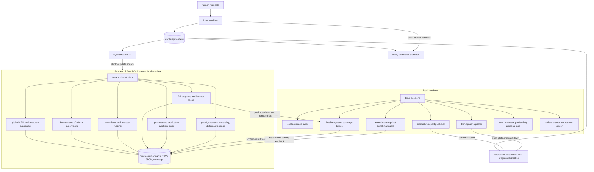
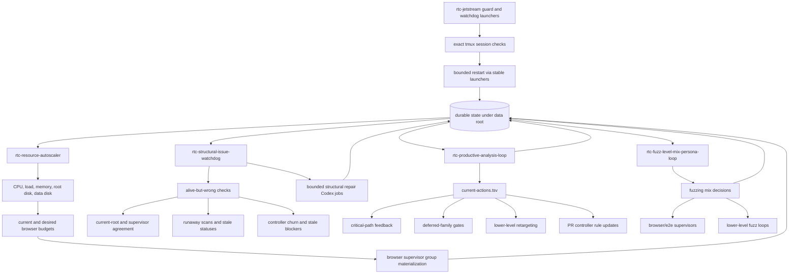
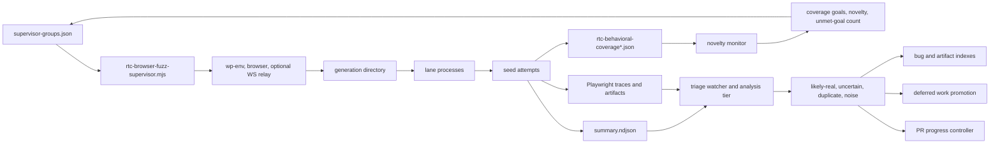
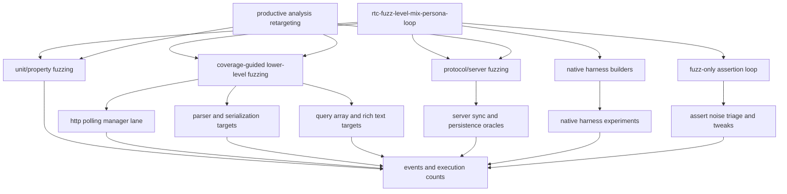
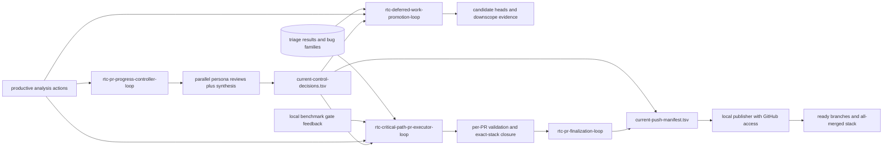
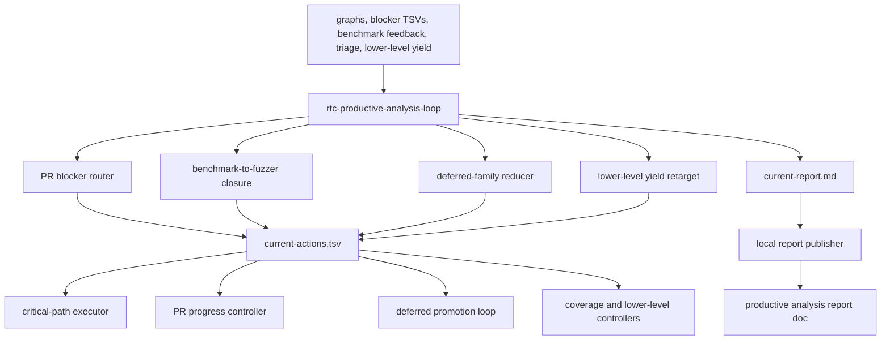

# RTC Jetstream2 fuzzing architecture and active loops

Snapshot time: `2026-05-21T23:03Z`

Remote host:
`exouser@danluu-fuzzer.cis251402.projects.jetstream-cloud.org`

Jetstream data root:
`/media/volume/danluu-fuzz-data`

Remote working repo used by most loops:
`/media/volume/danluu-fuzz-data/rtc-fuzz-validation-20260515/repo`

Reusable Jetstream scripts and this runbook are kept on:
[`try/jetstream-fuzz`](https://github.com/danluu/gutenberg/tree/try/jetstream-fuzz)

Primary progress and graph docs:

- [Trend analysis and graphs](https://github.com/danluu/gutenberg/blob/explain/rtc-jetstream2-fuzz-progress-20260515/docs/explanations/architecture/rtc-jetstream2-fuzz-trend-analysis-20260515.md)
- [PR status](https://github.com/danluu/gutenberg/blob/explain/rtc-jetstream2-fuzz-progress-20260515/docs/explanations/architecture/rtc-jetstream2-fix-pr-status-20260515.md)
- [Productive analysis loop](https://github.com/danluu/gutenberg/blob/explain/rtc-jetstream2-fuzz-progress-20260515/docs/explanations/architecture/rtc-jetstream2-productive-analysis-loop-20260521.md)

## Short Version

The project now runs as a two-host system.

Jetstream2 owns CPU-heavy fuzzing, durable artifact storage, PR blocker
continuation work, persona-guided control decisions, lower-level harness work,
and health monitoring. The local machine owns GitHub publication, some extra
coverage lanes, benchmark gating, report publication, and a bridge that feeds
local results back to Jetstream.

The important rule is unchanged: every loop owns one kind of decision, writes
durable evidence, and leaves enough state for another process to reject stale or
incorrect interpretations. Graphs and prose reports are not the API by
themselves; controller decisions must be traceable to TSV, JSON, or run
artifacts under the data root.

## Two-Host System Map



## Jetstream Control Plane



Current autoscaler status at the snapshot:

```text
updated: 2026-05-21T23:02:04Z
cpu_percent: 67.6
load1: 49.90 / 64 cores
load5: 48.40 / 64 cores
load15: 47.73 / 64 cores
mem_available_gib: 422.7
root_disk_available_gib: 92.3
data_disk_available_gib: 505.4
docker_root_dir: /media/volume/danluu-fuzz-data/docker-data-root
enabled_groups: 5
current_budget: target=3 max=4
desired_budget: target=5 max=6
materialized_running_groups: 1
supervisor_status_counts: running:1|starting:4
last_action: observe
reason: modest_headroom
```

The resource controller is responsible for capacity and scale only. It should
not decide that analysis should stop. The mix loop decides what work is useful;
the autoscaler decides how much CPU-heavy work can run safely.

## Browser And Coverage Fuzz Data Flow



Current high-level browser and coverage families include:

- `rtc-coverage-guided-*`: coverage-goal and novelty guided browser fuzzing.
- `rtc-fuzz-strict-expansion`: broad strict RTC coverage.
- `rtc-focused-shards`: focused high-value product and benchmark-derived shards.
- `rtc-gap-booster`: targeted coverage gaps.
- `rtc-operator-correctness-fuzz-*`: operator correctness and regression probes.
- `rtc-backend-api-fuzz`: server/API-heavy coverage.
- local coverage lanes for same-user tabs, revisions/autosave, rich UI actions,
  block coverage, permissions/auth, async/server blocks, and three-user late
  joins.

## Lower-Level And Protocol Fuzzing



At this snapshot, the active lower-level coverage-guided lane visible in tmux is
`rtc-coverage-guided-lower-level-http-polling-manager`. Productive analysis is
feeding it canary-derived reload and persisted-CRDT oracles instead of allowing
generic polling-manager exploration to count as progress for the benchmark
canary gap.

Lower-level and protocol work should be evaluated by bug output and oracle
quality, not just by wrapper invocation counts.

## PR Progress And Promotion



Current PR progress controller status at the snapshot:

```text
updated: 2026-05-21T23:02:19Z
cycle sleep seconds: 120
max active PR jobs: 2
active PR jobs: 0
active discovery sessions: 19
min discovery sessions: 3
resource reason: modest_headroom
```

Important live PR/progress decisions:

- Keep the maintainer snapshot blocked until exact-stack focused HTTP benchmark
  rows are green.
- Treat `benchmark-canary-fuzzer-gap` as exact-stack closure work, not generic
  coverage churn.
- Keep `PR07C` held unless newer product-owned owner evidence appears.
- Hard-gate over-budget deferred families unless the next job has a new product
  fix head, owner evidence, exact-stack green evidence, or explicit downscope.
- Bind productive-analysis P0 rows to controller TSV actions or explicit
  rejections.

## Productive Analysis Loop



At the snapshot:

```text
updated: 2026-05-21T23:03:10Z
active lane jobs: 4
current action rows: 16
high-priority controller rows: 13
```

The loop currently emits actions for exact-stack benchmark-canary closure,
deferred-family hard gates, PR07C owner-evidence consumption, terminal reducer
classification consumption, and lower-level oracle retargeting.

## Local Machine Loops

```mermaid
flowchart TB
    LocalTmux[local tmux sessions]

    LocalTmux --> SameUser[rtc-local-cov-same-user-stale-tabs]
    LocalTmux --> Revision[rtc-local-cov-revision-autosave]
    LocalTmux --> RealUI[rtc-local-cov-real-user-core-editing]
    LocalTmux --> Blocks[rtc-local-cov-block-gauntlet]
    LocalTmux --> Async[rtc-local-cov-async-server-blocks]
    LocalTmux --> Perms[rtc-local-cov-permissions-auth]
    LocalTmux --> ThreeUser[rtc-local-cov-three-user-late-join]

    SameUser --> LocalResults[(local fuzz and coverage results)]
    Revision --> LocalResults
    RealUI --> LocalResults
    Blocks --> LocalResults
    Async --> LocalResults
    Perms --> LocalResults
    ThreeUser --> LocalResults

    LocalTmux --> BenchmarkGate[rtc-maintainer-snapshot-benchmark-gate]
    LocalTmux --> Bridge[rtc-local-triage-jetstream-bridge]
    LocalTmux --> Trend[rtc-trend-autoupdate]
    LocalTmux --> ProductivePublisher[rtc-productive-analysis-report-publisher]
    LocalTmux --> Productivity[local-jetstream-productivity]
    LocalTmux --> RepairPersona[rtc-local-fuzz-repair-persona-loop]
    LocalTmux --> Pruner[rtc-local-artifact-pruner]
    LocalTmux --> RestoreLog[rtc-pr-fuzz-restore-logger]

    LocalResults --> Bridge
    BenchmarkGate --> Bridge
    Bridge --> JetstreamArtifacts[Jetstream durable artifacts]
    Trend --> ExplainBranch[explanation branch]
    ProductivePublisher --> ExplainBranch
    Productivity --> JetstreamArtifacts
    RepairPersona --> JetstreamArtifacts
```



Local coverage loops are intentionally not duplicates of Jetstream groups. They
cover cases that were missing or underrepresented in Jetstream scheduling, then
feed result summaries and triage back to Jetstream so the controllers see the
whole project state.

Current local tmux sessions at the snapshot:

```text
local-action-accelerator
local-jetstream-productivity
rtc-fuzz-handoff-1
rtc-local-artifact-pruner
rtc-local-cov-async-server-blocks
rtc-local-cov-block-gauntlet
rtc-local-cov-permissions-auth
rtc-local-cov-real-user-core-editing
rtc-local-cov-revision-autosave
rtc-local-cov-same-user-stale-tabs
rtc-local-cov-three-user-late-join
rtc-local-fuzz-repair-persona-loop
rtc-local-triage-jetstream-bridge
rtc-maintainer-snapshot-benchmark-gate
rtc-pr-fuzz-restore-logger
rtc-productive-analysis-report-publisher
rtc-trend-autoupdate
zendesk-rtc-bug-agents
```

The `rtc-maintainer-snapshot-benchmark-gate` loop publishes canary feedback to
Jetstream under `/media/volume/danluu-fuzz-data/rtc-benchmark-canary-feedback-20260520`.
The `rtc-local-triage-jetstream-bridge` loop is the main backfeed from local
coverage and local triage into the Jetstream control plane.

## Active Jetstream Loop Inventory

Current Jetstream tmux sessions at the snapshot included:

```text
rtc-backend-api-fuzz
rtc-coverage-guided-analysis
rtc-coverage-guided-lower-level-http-polling-manager
rtc-coverage-guided-novelty
rtc-coverage-guided-supervisor
rtc-coverage-guided-watchdog
rtc-critical-path-pr-executor-loop
rtc-deferred-job-rich-text-suffix-corruption-20260521T225501Z
rtc-deferred-work-promotion-loop
rtc-disk-maintenance
rtc-duplicate-noise-persona-loop
rtc-focused-shards-analysis
rtc-focused-shards-analysis-append-benchmark-canary-fuzzer-gap-20260521T2250Z
rtc-focused-shards-append-benchmark-canary-fuzzer-gap-20260521T2250Z
rtc-focused-shards-gap-codex-loop
rtc-focused-shards-watchdog-append-benchmark-canary-fuzzer-gap-20260521T2250Z
rtc-fuzz-level-mix-persona-loop
rtc-fuzz-level-mix-persona-loop-watchdog
rtc-fuzz-only-asserts-loop
rtc-fuzz-strict-expansion
rtc-fuzz-strict-expansion-analysis
rtc-fuzz-strict-expansion-watchdog
rtc-gap-booster
rtc-gap-booster-analysis
rtc-gap-booster-watchdog
rtc-lower-level-fuzz-loop
rtc-native-action-20260521T224354Z
rtc-native-harness-persona-loop
rtc-operator-correctness-fuzz-operator-correctness-20260519T214500Z
rtc-operator-correctness-watchdog-operator-correctness-20260519T214500Z
rtc-pr-finalization-loop
rtc-pr-progress-controller-loop
rtc-productive-analysis-loop
rtc-protocol-server-fuzz
rtc-protocol-server-persona-loop
rtc-resource-autoscaler
rtc-structural-issue-watchdog
```

Short-lived persona worker sessions also appear during PR progress, duplicate
noise review, deferred work, native/protocol work, and targeted repair. Those
are not durable owners; the durable owner loops above must adopt, time out, or
replace them.

## Current Data Roots

Use pointer files instead of guessing the latest timestamp.

```text
/media/volume/danluu-fuzz-data/rtc-coverage-guided-20260515/current-output-dir.txt
/media/volume/danluu-fuzz-data/rtc-fuzz-focused-shards-20260515/current-run-root.txt
/media/volume/danluu-fuzz-data/rtc-gap-booster-20260515/current-run-root.txt
/media/volume/danluu-fuzz-data/rtc-fuzz-strict-expansion-20260515/current-run-root.txt
```

Important top-level roots:

```text
/media/volume/danluu-fuzz-data/rtc-benchmark-canary-feedback-20260520
/media/volume/danluu-fuzz-data/rtc-coverage-guided-20260515
/media/volume/danluu-fuzz-data/rtc-coverage-guided-lower-level-http-polling-manager-20260520
/media/volume/danluu-fuzz-data/rtc-critical-path-pr-executor-20260517
/media/volume/danluu-fuzz-data/rtc-deferred-work-promotion-20260516
/media/volume/danluu-fuzz-data/rtc-fuzz-focused-shards-20260515
/media/volume/danluu-fuzz-data/rtc-fuzz-strict-expansion-20260515
/media/volume/danluu-fuzz-data/rtc-gap-booster-20260515
/media/volume/danluu-fuzz-data/rtc-native-assert-protocol-20260516
/media/volume/danluu-fuzz-data/rtc-pr-finalization-20260516
/media/volume/danluu-fuzz-data/rtc-pr-progress-controller-20260518
/media/volume/danluu-fuzz-data/rtc-productive-analysis-20260521
/media/volume/danluu-fuzz-data/rtc-resource-autoscaler-20260516
/media/volume/danluu-fuzz-data/rtc-structural-watchdog-20260518
```

## Durable State Contract

The durable state files are the API between loops:

```text
<campaign-root>/current-output-dir.txt or current-run-root.txt
<run-root>/supervisor-groups.json
<run-root>/supervisor-state.json
<run-root>/events.ndjson
<run-root>/novelty-status.md
<run-root>/novelty-state.json
<generation>/lanes.json
<generation>/lane-*/summary.ndjson
<generation>/lane-*/state.json
<generation>/lane-*/seed-*/primary/artifacts/rtc-behavioral-coverage*.json
<generation>/.triage-watcher/**/result.json
<controller-root>/current-*.tsv
<controller-root>/current-*.md
```

If a loop makes a decision from a graph, a status document, or a persona report,
it must also retain enough raw state in these files to reject stale or incorrect
interpretations.

## Operational Invariants

- Top-level Jetstream loops live in the `rtc-fuzz` tmux socket and use exact
  session name checks.
- Local loops live in the local tmux server and publish or bridge results instead
  of directly mutating Jetstream state without durable evidence.
- `supervisor-state.json.outputDir` must match the current root before a
  supervisor is considered healthy.
- Requested browser budget is not success unless the supervisor has live run
  directories or running groups.
- Startup-only status must not overwrite a completed full status for the same
  output root.
- Historical duplicate/noise metrics can inform policy, but active health and
  restart decisions must use current-run scope.
- Autoscaling changes capacity; fuzz-level mix changes what kinds of CPU-heavy
  work are useful.
- Analysis jobs are cheap on CPU unless they launch tests. They should not be
  throttled just because browser fuzzing is under load.
- Jetstream writes handoff artifacts and push manifests; the local machine pushes
  branches to GitHub.
- Local benchmark failures are not a quality gate in place of fuzzing. They are
  high-signal evidence that the fuzzer is missing coverage or oracle strength,
  and that evidence must feed back into Jetstream controllers.

## Inspection Commands

Check current Jetstream tmux loops:

```bash
ssh exouser@danluu-fuzzer.cis251402.projects.jetstream-cloud.org \
  'tmux -L rtc-fuzz list-sessions | cut -d: -f1 | sort'
```

Check local tmux loops:

```bash
tmux list-sessions | cut -d: -f1 | sort
```

Check autoscaler:

```bash
ssh exouser@danluu-fuzzer.cis251402.projects.jetstream-cloud.org \
  'cat /media/volume/danluu-fuzz-data/rtc-resource-autoscaler-20260516/resource-autoscaler-status.md'
```

Check PR progress controller:

```bash
ssh exouser@danluu-fuzzer.cis251402.projects.jetstream-cloud.org \
  'sed -n "1,120p" /media/volume/danluu-fuzz-data/rtc-pr-progress-controller-20260518/current-pr-progress-controller-status.md'
```

Check productive analysis:

```bash
ssh exouser@danluu-fuzzer.cis251402.projects.jetstream-cloud.org \
  'sed -n "1,120p" /media/volume/danluu-fuzz-data/rtc-productive-analysis-20260521/current-status.md'
```

Check structural watchdog:

```bash
ssh exouser@danluu-fuzzer.cis251402.projects.jetstream-cloud.org \
  'sed -n "1,140p" /media/volume/danluu-fuzz-data/rtc-structural-watchdog-20260518/current-structural-watchdog-status.md'
```

Avoid running `wp-env clean` or global Docker cleanup while these loops are
active. Use the existing watchdog cleanup path or a targeted stale `wp-env`
cleanup script instead.
