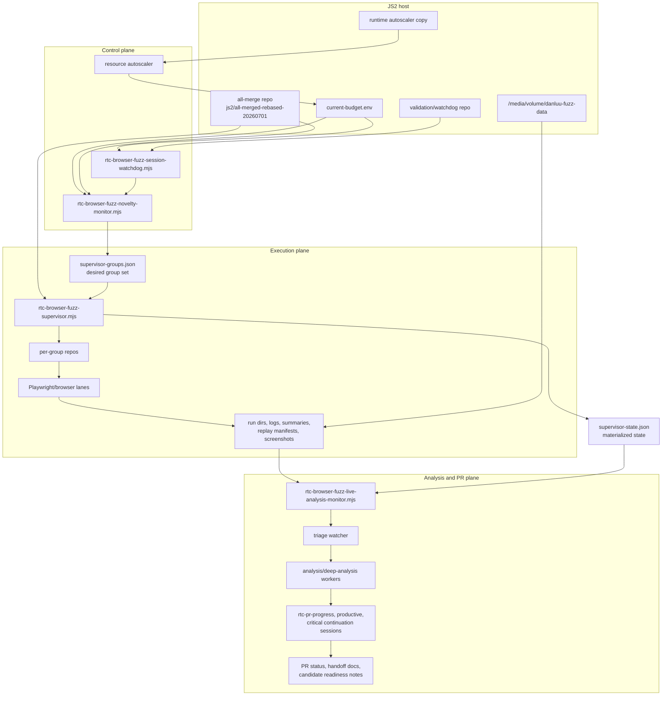
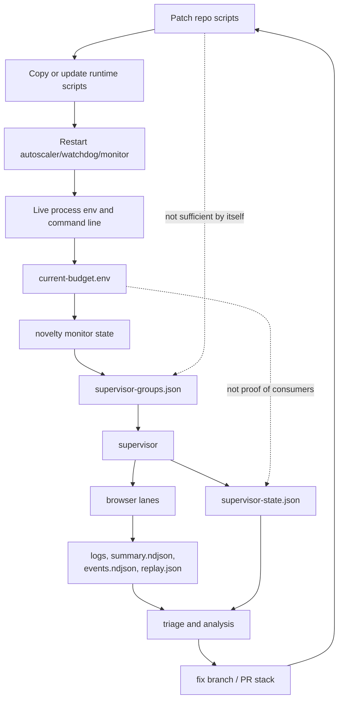
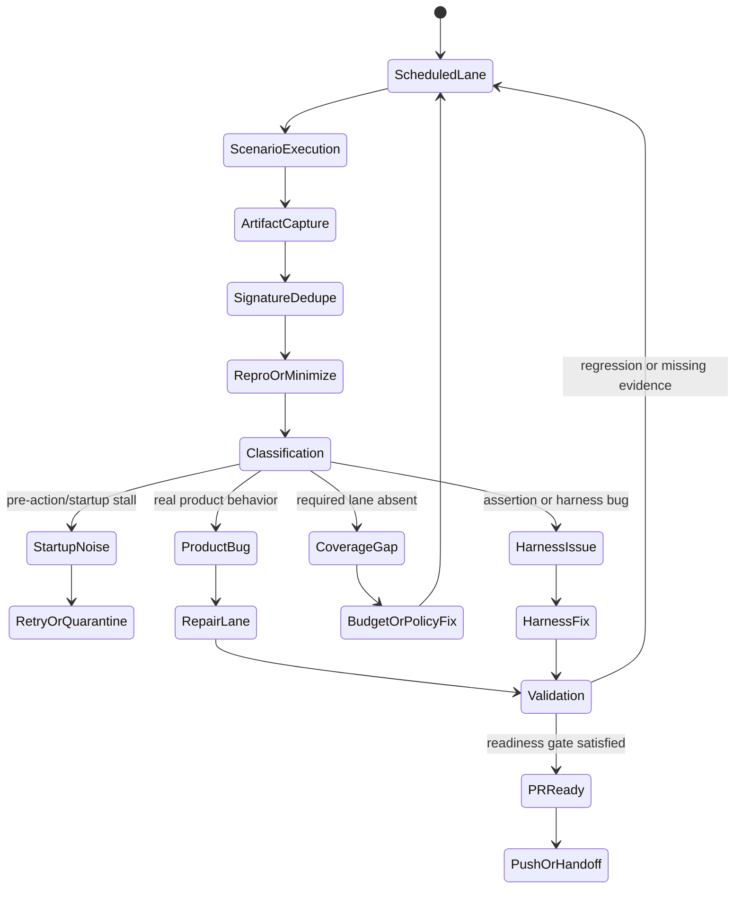
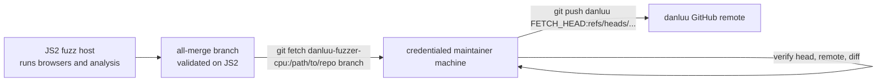

# Jetstream2 RTC Fuzzing Pipeline Explainer

Snapshot date: 2026-07-02.

This document explains the live Jetstream2 (`js2`) RTC fuzzing and PR-readiness
pipeline: what is running, which process owns which state, how failures move
through triage, what the current feeds and speeds look like, and where the
system tends to get blocked.

It complements these broader docs:

- [real-time-collaboration-fuzzing.md](./real-time-collaboration-fuzzing.md)
- [real-time-collaboration-fuzzing-strategies.md](./real-time-collaboration-fuzzing-strategies.md)
- [real-time-collaboration-fuzzing-pipeline-runbook.md](./real-time-collaboration-fuzzing-pipeline-runbook.md)
- [rtc-fuzzer-process-diagrams-20260514.md](./rtc-fuzzer-process-diagrams-20260514.md)

The paths below are JS2-internal operational examples. Treat live values as a
dated snapshot, not as durable configuration.

## Quick Read

JS2 is not just running browser fuzz tests. It is a capacity-managed control
system with five parts:

- **Control plane**: novelty monitor, resource autoscaler, watchdog.
- **Execution plane**: supervisor, per-group repos, Playwright/browser lanes,
  HTTP and WebSocket RTC profiles.
- **Analysis plane**: live analysis monitor, triage watcher, Codex analysis and
  deep-analysis workers.
- **State artifacts**: budget env, desired group file, materialized supervisor
  state, lane logs, failure signatures, triage results.
- **PR-readiness gate**: branch/head check, required lanes present and fresh,
  failures classified, validation current, and push/auth path known.

The most important operational lesson from the July 2 scheduler issue is:
repo patches alone do not prove the live system changed. Runtime copies,
watchdog restart commands, active process environments, and orphan writers can
continue to enforce stale assumptions.

## Current Snapshot

As of `2026-07-02T19:28Z`:

| Area | Value | Source / path | Meaning |
| --- | --- | --- | --- |
| All-merge branch under test | `js2/all-merged-rebased-20260701` | [danluu branch](https://github.com/danluu/gutenberg/tree/js2/all-merged-rebased-20260701) | Product/fuzzer branch currently being exercised |
| All-merge head | `6251321824b1f6dc1bfa4b756b80237ba1105aa9` | JS2 all-merge repo | Includes the scheduler budget-starvation fix |
| JS2 all-merge repo | `/media/volume/danluu-fuzz-data/rtc-all-merged-fuzz-20260526T195420Z/repo` | JS2 filesystem | Repo used by the novelty monitor and supervisor |
| Current run root | `/media/volume/danluu-fuzz-data/rtc-coverage-guided-20260515/run-20260702T185554Z` | JS2 filesystem | Active coverage-guided campaign artifacts |
| Watchdog repo | `/media/volume/danluu-fuzz-data/rtc-fuzz-validation-20260515/repo` | JS2 filesystem | Validation repo used by the watchdog wrapper |
| Autoscaler runtime copy | `/media/volume/danluu-fuzz-data/rtc-resource-autoscaler-20260516/rtc-resource-autoscaler.sh` | JS2 filesystem | Runtime script, not necessarily identical to repo copy |
| Budget env | `/media/volume/danluu-fuzz-data/rtc-resource-autoscaler-20260516/current-budget.env` | Autoscaler output | Intended budget input consumed by restarts |
| Group budget | target `19`, max `19` | `current-budget.env` and live process env | Current required floor after open benchmark blockers plus required editor/oracle lanes |
| Benchmark reserve | `10` slots | autoscaler/watchdog configuration | Reserve for benchmark-canary blockers; not the total slot floor |
| Supervisor state | `18 running`, `1 paused-startup-stall`, `5 disabled` | `supervisor-state.json` | Must be checked by group name before calling the run healthy |
| Data disk | `3.5T`, `2.8T used`, `776G free`, `79%` | `/media/volume/danluu-fuzz-data` | Main run/artifact capacity limit |
| Root disk | `142G`, `71G free` | root filesystem | OS/tooling capacity check |
| Load | about `38` on `64` CPUs | host load | Useful context, not proof of productive fuzzing |

The branch on the `danluu` remote matched the JS2 head at the time of this
snapshot. JS2 may not have GitHub push credentials; see
[Security And Push Boundary](#security-and-push-boundary).

## System Map



## Effective Authority

There is no single source of truth. A value is trustworthy only when its writer,
mtime, active process command line, and consumers agree.

| Actor or artifact | Writer of record | Read by | What it means | Stale or unsafe symptom |
| --- | --- | --- | --- | --- |
| All-merge branch/head | Git branch on JS2 and `danluu` remote | Operators, supervisors, PR handoff | Code under test and fuzzer scripts in repo | JS2 head differs from remote, or supervisor uses a different checkout |
| Runtime autoscaler copy | Copied shell script under `rtc-resource-autoscaler-20260516` | autoscaler process | Live budget adjustment logic | Repo script patched but budget behavior unchanged |
| `current-budget.env` | resource autoscaler | watchdog/start wrappers, novelty monitor | Intended budget and caps | File says `19`, but process env or restart command still uses old cap |
| Watchdog process command/env | tmux/process table | watchdog | Effective restart behavior for stale sessions | Restart brings back old budget or old script path |
| `supervisor-groups.json` | novelty monitor | supervisor, operators | Desired/policy group set | Required groups missing even though budget looks high enough |
| `supervisor-state.json` | supervisor | watchdog, live analysis, operators | Materialized runner state | Desired groups exist but required groups are disabled, stalled, or absent |
| Run artifacts and logs | browser runners | triage watcher, analysis workers | Evidence from actual executions | Green-looking state with no fresh evidence from required lanes |
| Analysis results | analysis/deep-analysis workers | productive lanes, maintainers | Classification and repro guidance | Same signature burns cycles repeatedly or backlog age grows |
| PR status docs | productive/PR lanes | maintainers | Candidate readiness and blocker summary | Not updated after branch/head or validation changes |

Use "effective authority" language when debugging. For example,
`current-budget.env` is necessary evidence, but it is not sufficient if the
watchdog is still restarting a monitor with stale embedded environment values.

## Data And Control Flow



The dashed edges are intentional warnings. A repo patch, a budget env file, or
a green-looking runner count can all be true while required product coverage is
still absent.

## Current Live Sessions

The current JS2 run uses these long-running process families:

| Session/process family | Main command | Primary output | Health signal |
| --- | --- | --- | --- |
| `rtc-coverage-guided-novelty` | `node bin/rtc-browser-fuzz-novelty-monitor.mjs` | `supervisor-groups.json` | Desired required/policy groups are present and file is fresh |
| `rtc-coverage-guided-supervisor` | `node bin/rtc-browser-fuzz-supervisor.mjs` | `supervisor-state.json`, group run dirs | Required groups are running or intentionally paused with clear reason |
| `rtc-coverage-guided-analysis` | `node bin/rtc-browser-fuzz-live-analysis-monitor.mjs <run>` | triage watcher and analysis worker state | Analysis queue is moving and not stuck on one family |
| `rtc-coverage-guided-watchdog` | `node bin/rtc-browser-fuzz-session-watchdog.mjs` | watchdog state/logs | Restarts stale/dead monitor from current budget |
| resource autoscaler process | runtime `rtc-resource-autoscaler.sh` | `current-budget.env` | target/max match required floor and disk modes |
| `rtc-pr-progress-synthesis-*` | PR synthesis loops | status/handoff artifacts | Candidate status updates after branch/fix changes |
| `rtc-productive-lane-*` | blocker repair lanes | fix attempts, reports | Actionable blockers move toward validation |
| `rtc-critical-continuation-*` | continuation lanes | focused reports/fixes | Critical blockers are not abandoned |

Exact tmux names can change. The durable contract is who writes which artifact,
not the literal session name.

## Feeds And Speeds

This table captures the important rates and capacities operators should watch.
When an exact cadence is not known, use file mtimes and logs rather than
inventing an interval.

| Feed or capacity | Current value / behavior | First check | What blocks it |
| --- | --- | --- | --- |
| Group budget | target/max `19/19` | `cat current-budget.env` and process env | low disk mode, stale watchdog env, old runtime copy |
| Benchmark reserve | `10` slots | autoscaler/watchdog config | mistaken as total group cap |
| Required floor | `open benchmark blockers + required editor/oracle lanes` | novelty monitor policy and open-blocker count | new blockers without raising floor |
| Desired groups | `19` groups in current `supervisor-groups.json` | group file name list | novelty policy state, budget eviction, orphan writer |
| Materialized groups | `18 running`, `1 paused-startup-stall`, `5 disabled` in snapshot | `supervisor-state.json` | startup stalls, disabled non-required groups, real product failures |
| Run duration | current run started `2026-07-02T18:55:54Z`; supervisor state ends around `2026-07-03T06:56Z` | `supervisor-state.json` | stale supervisor or expired run |
| Analysis throughput | live analysis plus deep triage workers | `.triage-watcher/*/state.json` | duplicate signature churn, one hot seed, broad artifact scans |
| Disk capacity | data disk `776G` free, `79%` used in snapshot | `df -h /media/volume/danluu-fuzz-data /` | low-disk producer caps, cleanup churn, browser artifact volume |
| CPU/load | load about `38` on `64` CPUs in snapshot | `uptime`, process table | I/O wait, browser stalls, low group cap, analysis backlog |
| Push path | JS2 may not push to GitHub directly | `git remote -v`, push dry run from credentialed machine | missing credentials or wrong remote |

## Coverage Gates And Active Groups

The current desired group file listed these `19` groups:

- `novelty-http-rtc-reference-oracle`
- `novelty-http-large-post-lifecycle`
- `novelty-http-title-reload-convergence`
- `novelty-http-same-user-stale-draft`
- `novelty-http-table-stale-snapshot`
- `novelty-http-existing-post-crdt-metadata`
- `novelty-http-large-post-lifecycle-completion`
- `novelty-http-persistence-probe`
- `novelty-ws-collaboration-ui-signals`
- `novelty-ws-parser-serialization`
- `novelty-ws-multi-reload-lifecycle`
- `novelty-http-plain-editor-product-smoke`
- `novelty-http-real-world-editor-usability`
- `novelty-ws-same-user-lifecycle`
- `novelty-ws-same-user-separate-context-lifecycle`
- `novelty-ws-thirty-user-lifecycle`
- `novelty-ws-real-user-rich-text`
- `novelty-ws-revision-recovery`
- `novelty-ws-real-user-editing`

Do not treat this list as a timeless allowlist. The durable requirement is that
the current policy-required editor, oracle, usability, lifecycle, and benchmark
blocker lanes must all fit in the active budget and must remain materialized in
`supervisor-groups.json` and `supervisor-state.json`.

The policy code currently computes broad coverage groups from
`DEFAULT_REQUIRED_COVERAGE_BREADTH_GROUPS`, optional
`RTC_FUZZ_NOVELTY_REQUIRED_COVERAGE_BREADTH_GROUPS`, and materialization floor
groups in `bin/rtc-browser-fuzz-novelty-monitor.mjs`. The generated group file
does not mark each group as required, so operators should verify both:

- the recomputed policy group set from the novelty monitor code/env; and
- the observed generated group set in the current run.

## Failure To PR Lifecycle



Important distinction: missing required lanes create absence of evidence. If a
required real-world or same-user lane is evicted, the system can look quieter
because it stopped exercising the behavior users hit.

## PR-Ready Gate

Do not call the branch PR-ready merely because the fuzzer is running or no new
failures are appearing. Before declaring readiness:

- Branch/head under test matches the intended all-merge branch and remote.
- Budget floor is at least `open benchmark blockers + required editor/oracle
  lanes`.
- Benchmark reserve is not being mistaken for the total group cap.
- Required groups are present in `supervisor-groups.json`.
- Required groups are not unexpectedly disabled, stale, or starved in
  `supervisor-state.json`.
- Exactly one current novelty monitor is writing the desired group file.
- Runtime autoscaler copy, watchdog restart env, and live process command lines
  agree with the intended budget.
- Startup stalls, harness false positives, and product bugs are classified
  separately.
- Analysis and deep triage are making forward progress and not burning cycles
  on one duplicate family.
- Disk is not forcing low-disk producer caps or cleanup churn that hides
  coverage.
- Human-usability lanes, especially plain editor smoke, real-world usability,
  same-user lifecycle, separate-context lifecycle, and RTC-reference oracle,
  have fresh evidence.
- Push/auth handoff is known if JS2 itself cannot publish to GitHub.

## Scheduler Starvation Case Study

On July 2, 2026, the candidate was not ready even though the pipeline was
running. Ten open benchmark blockers consumed a `12` group cap. Required
editor/oracle lanes were evicted from `supervisor-groups.json`, including:

- `novelty-http-real-world-editor-usability`
- `novelty-ws-same-user-lifecycle`
- `novelty-ws-same-user-separate-context-lifecycle`

The fix changed the floor calculation:

```text
required floor = open benchmark blockers + required editor/oracle lanes
2026-07-02 example = 10 + 9 = 19
benchmark reserve 10 != total group cap
```

The operational fix also required live-system work:

- patch the repo scripts;
- copy/update the runtime autoscaler script;
- restart autoscaler, watchdog, monitor, and supervisor owners as needed;
- kill orphan monitor processes that could rewrite stale group state; and
- verify the next generated `supervisor-groups.json` retained the required
  lanes.

Recurrence guard: any budget reduction or benchmark-blocker increase must be
checked against the required editor/oracle lane floor before it is allowed to
write a new desired group set.

## Common Blockers

| Blocker | Symptom | First diagnosis | Safe action | Recurrence guard |
| --- | --- | --- | --- | --- |
| Budget starvation | Required lanes missing from `supervisor-groups.json` | Compare budget with open benchmark blockers plus required lanes | Raise floor/budget and restart live control processes | Assert floor before writing desired groups |
| Policy lane eviction | Editor smoke or same-user lanes disappear | Inspect desired groups and disabled groups by name | Restore required groups and verify next monitor write | Track required lane presence as a readiness gate |
| Orphan monitor | Fixed state reverts | Multiple novelty monitor processes or old mtimes | Stop orphan writers, keep one canonical monitor | Process-count check before/after restarts |
| Runtime script drift | Repo patch has no live effect | Diff repo script against runtime copy | Update runtime copy and restart consumers | Document runtime-copy paths near patches |
| Stale watchdog env | Restart revives old cap | Inspect watchdog command/env and restart logs | Restart watchdog with current env | Watchdog restart command must load current budget env |
| Disk pressure | Low-disk mode, cleanup churn, capped producers | `df -h`, cleanup logs, autoscaler mode | Free space or reduce producers, then verify recovery | Disk thresholds visible in status |
| Startup stall noise | `paused-startup-stall` without product action evidence | Lane logs before first user action | Retry or quarantine separately | Separate startup failures from product failures |
| Harness false positive | Repro fails outside harness or assertion is wrong | Compare artifacts with product behavior | Fix/suppress harness signature | Require classification before consuming deep triage |
| Analysis bottleneck | Failure queue grows but no useful fixes | Analysis state, duplicate family counts, queue age | Cap noisy families or redirect workers | Backlog and duplicate caps in status |
| Coverage gap | Users hit bugs quickly while fuzz looks quiet | Check required real-world lanes were present/fresh | Add or restore workflow lane/oracle | "No failures" is not evidence if lane is absent |
| Push/auth split | JS2 cannot push branch | GitHub auth failure on JS2 | Fetch JS2 branch from credentialed machine and push to `danluu` | Keep fuzz host and publishing credentials separate |

## Operator Checks

Run these from a shell that can reach JS2. Replace the run root when the current
campaign changes.

```bash
ssh danluu-fuzzer-cpu 'tmux list-sessions -F "#{session_name}" | rg "rtc-coverage-guided|rtc-pr-progress|rtc-productive|rtc-critical"'
```

```bash
ssh danluu-fuzzer-cpu 'cat /media/volume/danluu-fuzz-data/rtc-resource-autoscaler-20260516/current-budget.env'
```

```bash
ssh danluu-fuzzer-cpu 'node -e '"'"'
const fs = require( "fs" );
const run = "/media/volume/danluu-fuzz-data/rtc-coverage-guided-20260515/run-20260702T185554Z";
const groups = JSON.parse( fs.readFileSync( `${ run }/supervisor-groups.json`, "utf8" ) );
for ( const group of groups ) console.log( group.name );
'"'"''
```

```bash
ssh danluu-fuzzer-cpu 'node -e '"'"'
const fs = require( "fs" );
const run = "/media/volume/danluu-fuzz-data/rtc-coverage-guided-20260515/run-20260702T185554Z";
const state = JSON.parse( fs.readFileSync( `${ run }/supervisor-state.json`, "utf8" ) );
const counts = {};
for ( const group of state.groups || [] ) counts[ group.status || "unknown" ] = ( counts[ group.status || "unknown" ] || 0 ) + 1;
console.log( counts );
for ( const group of state.groups || [] ) console.log( group.status, group.name, group.lastReason || "" );
'"'"''
```

```bash
ssh danluu-fuzzer-cpu 'ps -eo pid,ppid,etime,cmd | rg "rtc-browser-fuzz-novelty-monitor|rtc-browser-fuzz-supervisor|rtc-resource-autoscaler|rtc-browser-fuzz-session-watchdog" | rg -v rg'
```

```bash
ssh danluu-fuzzer-cpu 'df -h /media/volume/danluu-fuzz-data / && uptime'
```

## Security And Push Boundary

JS2 should be treated as a fuzz and analysis worker, not necessarily a
publishing host. Generated artifacts, logs, screenshots, repro bundles, and
triage outputs are untrusted input.



Avoid adding broad long-lived GitHub credentials to JS2 just to make pushes
convenient. Also avoid blindly executing repro commands copied from artifacts;
inspect them first in a disposable context.

Places secrets or sensitive data can leak:

- process command lines;
- tmux panes and scrollback;
- shell history;
- env files;
- logs and status docs;
- runtime scripts;
- repro bundles and screenshots.

## Glossary

- **Required lane**: a group that must be present and fresh before candidate
  readiness can be trusted.
- **Benchmark blocker**: an open benchmark-canary issue that requires reserved
  fuzz capacity until classified or fixed.
- **Benchmark reserve**: capacity reserved for benchmark blockers; it is not the
  same thing as total group capacity.
- **Policy lane**: a novelty monitor group selected to protect a behavior or
  oracle, not just to maximize novelty.
- **Desired state**: `supervisor-groups.json`, the group set the supervisor
  should materialize.
- **Materialized state**: `supervisor-state.json`, the groups and lanes the
  supervisor actually launched and their statuses.
- **Paused startup stall**: runner failed or stalled before useful product
  action evidence; classify separately from product bugs.
- **Harness false positive**: test or oracle problem, not a product bug.
- **Fuzz-green**: weak shorthand. It is only meaningful if required lanes were
  present, fresh, running, and their failures were classified.
- **PR-ready**: evidence-backed state where branch/head, required lanes,
  budget, validation, analysis, and push path have all been checked.

## Open Gaps

- The generated group file does not mark each group as required, benchmark,
  optional, or exploratory. Adding explicit metadata would make readiness checks
  less error-prone.
- Freshness thresholds for every state file are not centralized in this doc.
  Until measured and documented, use mtimes plus writer process logs.
- The runtime-copy and watchdog-env split is still easy to miss. Long term,
  prefer a single restart path that reads current config rather than embedding
  stale budget values.
- Capacity health should include group-slot pressure, analysis backlog age,
  duplicate-family cap hits, validation lane age, low-disk mode, and browser
  startup stall rates, not only CPU load.
