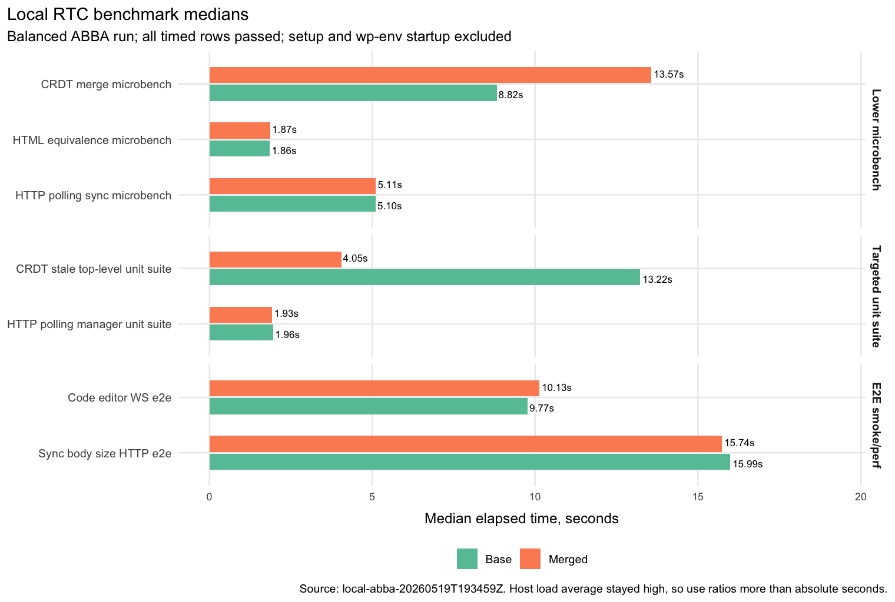
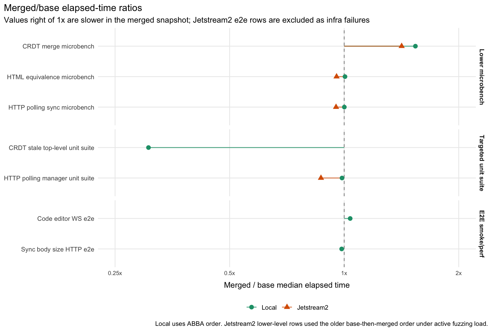
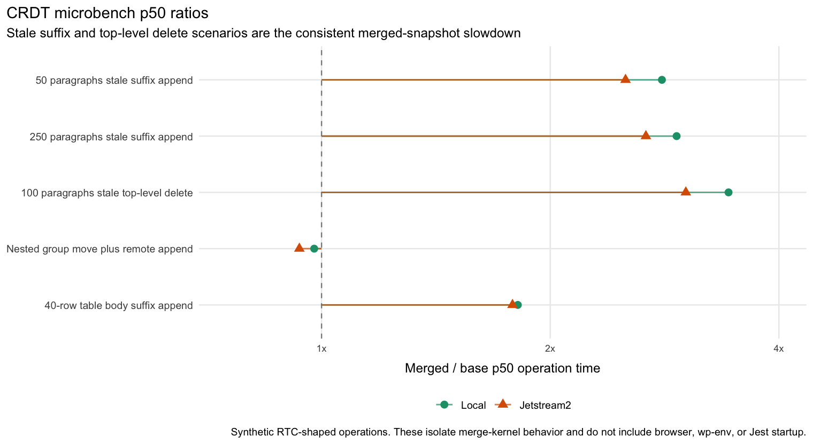

# RTC Local Benchmark Results, 2026-05-19

This follows `rtc-less-busy-benchmark-handoff-20260519.md`, but the local run does not preserve Jetstream2's weaker runner structure for comparability. The local runner used balanced ABBA ordering for both lower-level and e2e rows and fixed host-specific wp-env behavior on macOS.

## Inputs

Pinned refs from `danluu/gutenberg`:

| label | commit |
| --- | --- |
| base | `c173c18fbcd60eac93612f7f3d9550ca4975db8d` |
| all-ready-merged | `eae83fa6f594083c07bce4599a2a725704700e9b` |

Local setup excluded from timed rows: bundle fetch/clone, `npm install`, `composer install`, `npm run build -- --skip-types`, and wp-env startup. Both local worktrees built successfully before timings started.

## Benchmark Meanings

The timed rows use three levels:

| row | what it measures |
| --- | --- |
| `lower / micro-crdt` | A Jest-hosted microbenchmark for `mergeCrdtBlocks` on synthetic RTC-shaped stale snapshot conflicts. This isolates block reconciliation cost and excludes browser, wp-env, and e2e setup. |
| `lower / micro-html` | A Jest-hosted microbenchmark for `isEquivalentHTML` normalization over entity, rich text, attribute, boolean-attribute, and SVG-ish HTML pairs. |
| `lower / micro-sync` | A Jest-hosted microbenchmark for HTTP polling sync helpers: update encoding, queue take/restore, compaction filtering, payload serialization, and room-window rotation. |
| `unit-suite / crdt-stale-top-level` | Targeted CRDT unit tests for stale top-level block behavior. This is both correctness signal and CI-cost signal; it includes Jest startup and transform overhead. |
| `unit-suite / http-polling-manager` | Targeted HTTP polling manager unit tests. This is correctness plus CI-cost signal, not a pure kernel benchmark. |
| `e2e / collaboration-code-editor-performance-ws` | Playwright e2e coverage for the collaboration code-editor performance path using the WebSocket sync server. This includes browser, editor, WordPress, and test harness work. |
| `e2e / collaboration-sync-body-size-http` | Playwright e2e coverage for collaboration sync request body size using the HTTP polling path. This catches payload growth and sync-body behavior in the browser/editor stack. |

The raw microbenchmark scenarios mean:

| scenario | meaning |
| --- | --- |
| `small_stale_suffix_append_50` | Start from 50 paragraphs. The remote document has appended one paragraph; the incoming local snapshot is based on the stale base and appends a different paragraph. |
| `large_stale_suffix_append_250` | Same stale suffix append shape as above, scaled to 250 base paragraphs. |
| `stale_top_level_delete_100` | Start from 100 paragraphs. The remote document has appended a paragraph; the incoming stale local snapshot deletes one existing top-level paragraph. |
| `nested_group_move_with_remote_append` | Move a paragraph from one group into another while the remote side appends a different child to the destination group. |
| `table_body_suffix_append_40_rows` | Start with a 40-row table body. Remote and local stale snapshots each append a different row. |
| `entity_and_rich_text_equivalence` | Compare HTML pairs that differ by entity decoding, rich text spacing, attribute ordering, boolean attributes, and equivalent open/closed SVG-ish tags. |
| `base64_encode_1kb_update` | Encode 1 KiB binary sync updates to base64. |
| `queue_take_restore_1000_updates` | Build a 1000-update sync queue, take a batch of 250, restore that exact batch, then drain and validate the queue. |
| `queue_restore_filters_compactions` | Restore 1000 mixed updates where every tenth item is a compaction update, validating that compactions are filtered out. |
| `payload_json_20_rooms_200_updates` | Serialize an HTTP polling payload for 20 rooms with 10 updates per room, 200 updates total. |
| `rotate_window_75_rooms` | Repeatedly rotate a 10-room polling window across 75 rooms. |

## Local Run

Run id: `local-abba-20260519T193459Z`

Local artifact root:

```text
/Users/danluu/dev/fuzz/rtc-benchmark-20260519-local.noindex/results/local-abba-20260519T193459Z
```

Host and runner notes:

- macOS 26.5, Apple M3 Max, 14 logical CPUs, 38.65 GB RAM.
- Node `v20.20.2`, npm `10.8.2`, Docker server `29.4.0`.
- Lower-level order: base rep 1, merged rep 1, merged rep 2, base rep 2.
- E2E order: base rep 1, merged rep 1, merged rep 2, base rep 2, after prestarting both isolated wp-env instances.
- Local wp-env needed `WP_BASE_URL=http://localhost:<port>`; `127.0.0.1` caused login/REST auth churn on this machine. The WebSocket server stayed on `127.0.0.1`.
- `RTC_BENCH_LOAD_GATE=off`; macOS load average did not settle because of unrelated background indexing/media work. Per-row load samples were still recorded. Local 1-minute load samples ranged from 16.82 to 31.59, mean 23.39.

All 28 local timed rows exited zero.

| kind | case | base failures/reps | merged failures/reps | base median s | merged median s | merged/base |
| --- | --- | ---: | ---: | ---: | ---: | ---: |
| lower | micro-crdt | 0/2 | 0/2 | 8.82 | 13.57 | 1.539 |
| lower | micro-html | 0/2 | 0/2 | 1.86 | 1.87 | 1.005 |
| lower | micro-sync | 0/2 | 0/2 | 5.10 | 5.11 | 1.001 |
| unit-suite | crdt-stale-top-level | 0/2 | 0/2 | 13.22 | 4.05 | 0.306 |
| unit-suite | http-polling-manager | 0/2 | 0/2 | 1.96 | 1.93 | 0.987 |
| e2e | collaboration-code-editor-performance-ws | 0/2 | 0/2 | 9.77 | 10.13 | 1.037 |
| e2e | collaboration-sync-body-size-http | 0/2 | 0/2 | 15.99 | 15.74 | 0.985 |

Local CRDT microbench p50 ratios:

| scenario | base p50 ms | merged p50 ms | merged/base |
| --- | ---: | ---: | ---: |
| small_stale_suffix_append_50 | 0.2783 | 0.7811 | 2.806 |
| large_stale_suffix_append_250 | 1.5910 | 4.6671 | 2.934 |
| stale_top_level_delete_100 | 8.0966 | 27.8004 | 3.434 |
| nested_group_move_with_remote_append | 0.4133 | 0.4042 | 0.978 |
| table_body_suffix_append_40_rows | 0.3054 | 0.5535 | 1.813 |

## Graphs

The plotted data and generator are checked in under `docs/explanations/architecture/rtc-local-benchmark-results-20260519/`. The graphs use `ggplot2` with ColorBrewer scales and the same minimal RTC report style used by the Jetstream2 trend plots.







## Jetstream2 Run

Jetstream2 artifact root:

```text
/media/volume/danluu-fuzz-data/rtc-benchmark-20260519/results/refined2-20260519T184127Z
```

Jetstream2 host notes:

- 64 CPU AMD EPYC-Milan VM, 492 GB RAM.
- Run started with load average 64.48 / 71.71 / 70.63 and active fuzzing continued on the host.
- Runner used the earlier base-then-merged lower-level order, not the improved local ABBA order.
- Command prefix was `nice -n 10 ionice -c 2 -n 7`.

Comparable Jetstream2 lower-level rows:

| kind | case | base failures/reps | merged failures/reps | base median s | merged median s | merged/base |
| --- | --- | ---: | ---: | ---: | ---: | ---: |
| lower | micro-crdt | 0/3 | 0/3 | 20.87 | 29.55 | 1.416 |
| lower | micro-html | 0/3 | 0/3 | 5.08 | 4.85 | 0.955 |
| lower | micro-sync | 0/3 | 0/3 | 13.10 | 12.47 | 0.952 |
| unit-suite | http-polling-manager | 0/2 | 0/2 | 4.81 | 4.18 | 0.869 |

Jetstream2 rows not usable for performance comparison:

| row | result | reason |
| --- | --- | --- |
| base unit-suite crdt-stale-top-level | 2/2 failures | missing `framer-motion` in the base worktree dependency environment |
| base e2e WS | exit 1 after 4.71 s | `ws` CommonJS named export failure while starting the WS test server |
| merged e2e WS | exit 1 after 4.25 s | health port already in use |
| base e2e HTTP | exit 124 after 1800.03 s | timed out |
| merged e2e HTTP | exit 124 after 1800.02 s | timed out |

Jetstream2 CRDT microbench p50 ratios:

| scenario | base p50 ms | merged p50 ms | merged/base |
| --- | ---: | ---: | ---: |
| small_stale_suffix_append_50 | 0.7444 | 1.8710 | 2.513 |
| large_stale_suffix_append_250 | 4.0869 | 10.9234 | 2.673 |
| stale_top_level_delete_100 | 16.1081 | 48.5926 | 3.017 |
| nested_group_move_with_remote_append | 1.1875 | 1.1107 | 0.935 |
| table_body_suffix_append_40_rows | 0.7936 | 1.4154 | 1.784 |

## Readout

The local run is the cleaner run for end-to-end correctness and timing because it used balanced ABBA order and all rows passed. It shows no meaningful e2e regression: WS e2e was +3.7% and HTTP e2e was -1.5% for merged versus base. The synthetic CRDT stale/suffix scenarios are consistently slower in the merged snapshot, around 1.8x to 3.4x by p50 depending on scenario. HTML-equivalence and HTTP-polling microbenches were effectively neutral.

Jetstream2 lower-level microbench ratios agree with the local direction for CRDT-heavy scenarios, especially stale top-level delete and stale suffix append. Jetstream2 e2e rows should be treated as infrastructure failures, not benchmark evidence.
