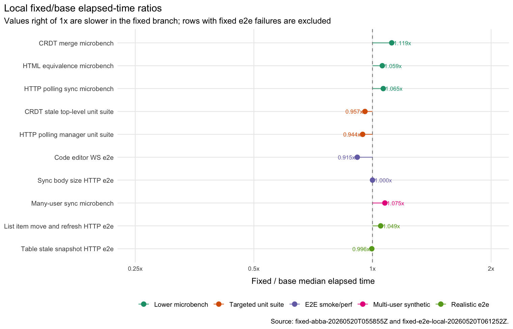
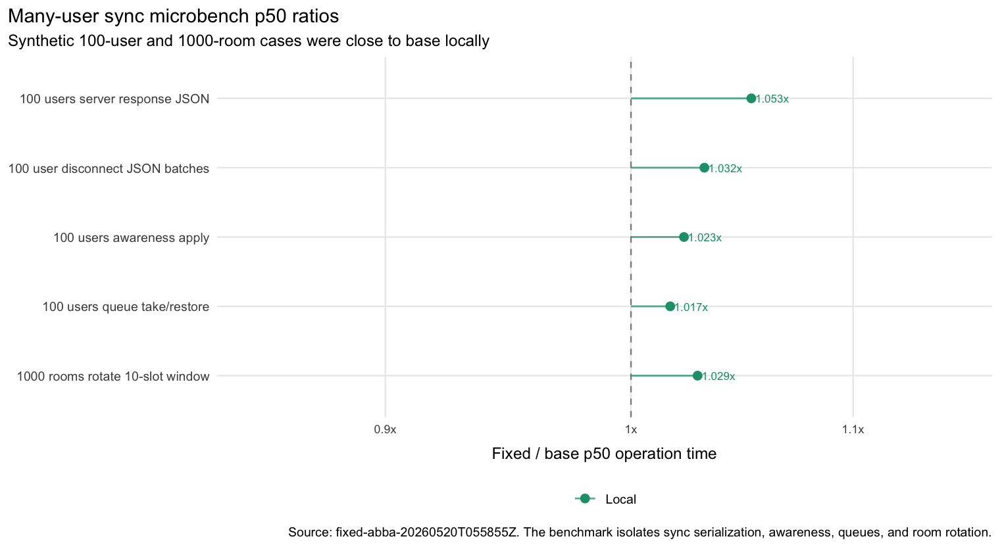
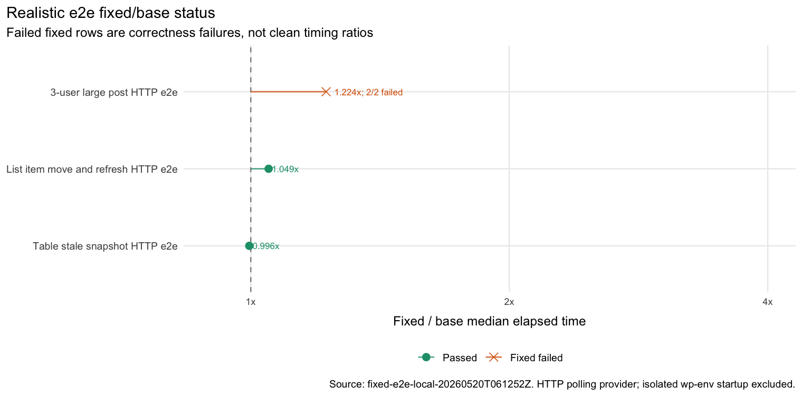

# RTC Fixed-Branch Local Benchmark Results, 2026-05-20

This updates the 2026-05-19 local benchmark readout with a rerun of the later branch that was intended to fix the failing RTC stress rows. The rerun used local Docker after repairing the local OrbStack backend, not the overloaded Jetstream2 host.

## Inputs

Pinned refs from `danluu/gutenberg`:

| label | branch | commit |
| --- | --- | --- |
| base | `rtc-pr-stack-20260519T214027Z-tested-base` | `c173c18fbcd60eac93612f7f3d9550ca4975db8d` |
| fixed | `rtc-pr-stack-20260519T214027Z-validated-no-harness` | `e922771984f5bd37a3d5e76dc246a8c5001675ff` |

Fixed branch URL:

```text
https://github.com/danluu/gutenberg/tree/rtc-pr-stack-20260519T214027Z-validated-no-harness
```

Local setup excluded from timed rows: bundle fetch/clone, `npm install`, `composer install`, `npm run build -- --skip-types`, Docker image pull/build, and wp-env startup.

## Benchmark Meanings

The timed rows use five levels:

| row | what it measures |
| --- | --- |
| `lower / micro-crdt` | A Jest-hosted microbenchmark for `mergeCrdtBlocks` on synthetic RTC-shaped stale snapshot conflicts. This isolates block reconciliation cost and excludes browser, wp-env, and e2e setup. |
| `lower / micro-html` | A Jest-hosted microbenchmark for `isEquivalentHTML` normalization over entity, rich text, attribute, boolean-attribute, and SVG-ish HTML pairs. |
| `lower / micro-sync` | A Jest-hosted microbenchmark for HTTP polling sync helpers: update encoding, queue take/restore, compaction filtering, payload serialization, and room-window rotation. |
| `unit-suite / crdt-stale-top-level` | Targeted CRDT unit tests for stale top-level block behavior. This is both correctness signal and CI-cost signal; it includes Jest startup and transform overhead. |
| `unit-suite / http-polling-manager` | Targeted HTTP polling manager unit tests. This is correctness plus CI-cost signal, not a pure kernel benchmark. |
| `e2e / collaboration-code-editor-performance-ws` | Playwright e2e coverage for the collaboration code-editor performance path using the WebSocket sync server. This includes browser, editor, WordPress, and test harness work. |
| `e2e / collaboration-sync-body-size-http` | Playwright e2e coverage for collaboration sync request body size using the HTTP polling path. This catches payload growth and sync-body behavior in the browser/editor stack. |
| `multi-user / many-users-sync` | A Jest-hosted synthetic many-user sync benchmark for 100-user payloads, 100-user update queues, and a 1000-room polling window. This isolates client-side sync fan-out work and excludes browser, wp-env, and e2e setup. |
| `realistic-e2e / large-post-three-user-http` | Playwright e2e coverage for the existing large-post collaboration stress flow over HTTP polling: three browser users edit a roughly 5000-word mixed-block post, save, refresh, move blocks, type concurrently, and publish. |
| `realistic-e2e / list-item-move-refresh-http` | Playwright e2e coverage for the existing two-user list-item movement flow over HTTP polling, including concurrent moves, save, and both users refreshing into the moved order. |
| `realistic-e2e / table-stale-snapshot-http` | Playwright e2e coverage for existing stale table snapshot flows over HTTP polling: stale HTML edit versus remote row insert, and stale row append versus another user's cell edit. |

The raw microbenchmark scenarios mean:

| scenario | meaning |
| --- | --- |
| `small_stale_suffix_append_50` | Start from 50 paragraphs. The remote document has appended one paragraph; the incoming local snapshot is based on the stale base and appends a different paragraph. |
| `large_stale_suffix_append_250` | Same stale suffix append shape as above, scaled to 250 base paragraphs. |
| `stale_top_level_delete_100` | Start from 100 paragraphs. The remote document has appended a paragraph; the incoming stale local snapshot deletes one existing top-level paragraph. |
| `nested_group_move_with_remote_append` | Move a paragraph from one group into another while the remote side appends a different child to the destination group. |
| `table_body_suffix_append_40_rows` | Start with a 40-row table body. Remote and local stale snapshots each append a different row. |
| `entity_and_rich_text_equivalence` | Compare HTML pairs that differ by entity decoding, rich text spacing, attribute ordering, boolean attributes, and equivalent open/closed SVG-ish tags. |
| `base64_encode_1kb_update` | Encode 1 KiB binary sync updates to base64. |
| `queue_take_restore_1000_updates` | Build a 1000-update sync queue, take a batch of 250, restore that exact batch, then drain and validate the queue. |
| `queue_restore_filters_compactions` | Restore 1000 mixed updates where every tenth item is a compaction update, validating that compactions are filtered out. |
| `payload_json_20_rooms_200_updates` | Serialize an HTTP polling payload for 20 rooms with 10 updates per room, 200 updates total. |
| `rotate_window_75_rooms` | Repeatedly rotate a 10-room polling window across 75 rooms. |
| `server_response_json_100_users_single_room` | Serialize and parse a server sync response for one room with 100 awareness entries and 20 updates. |
| `batched_disconnect_json_100_users_10_room_batches` | Serialize 100 disconnect room envelopes in 10-room batches, approximating many-user leave/disconnect churn. |
| `awareness_apply_100_users_10_changed` | Apply a 100-user awareness map with 10 changed users per iteration, including JSON comparison and add/delete map churn. |
| `queue_take_restore_100_users_100_updates_each` | Exercise 100 per-user update queues, each with 100 updates, by taking a batch, restoring it, then draining the queues. |
| `rotate_window_1000_rooms_10_slots` | Rotate a 10-slot polling window through 1000 rooms, stressing room-selection bookkeeping for high-room-count clients. |

## Local Runs

Run ids:

- Lower/unit/many-user run: `fixed-abba-20260520T055855Z`
- Docker-backed browser run: `fixed-e2e-local-20260520T061252Z`

Local artifact roots:

```text
/Users/danluu/dev/fuzz/rtc-benchmark-20260520-fixed.noindex/results/fixed-abba-20260520T055855Z
/Users/danluu/dev/fuzz/rtc-benchmark-20260520-fixed.noindex/results/fixed-e2e-local-20260520T061252Z
```

Host and runner notes:

- macOS 26.5, Apple M5 Max, 18 logical CPUs.
- Node `v20.20.2`, npm `10.8.2`, Docker client `29.4.0`, Docker server `29.4.0`.
- Local Docker initially failed because the OrbStack VM could not mount its `/data` BTRFS volume. The OrbStack log reported `DATA IS LIKELY CORRUPTED`; the corrupted 65 GB Docker/Linux data image was moved aside at `/Users/danluu/orbstack-corrupt-backup-20260520T061128Z`, after which OrbStack recreated a fresh VM and Docker became usable.
- The browser rerun used two isolated wp-env instances in parallel: base on `http://localhost:19681`, fixed on `http://localhost:19683`.
- The first local lower/unit run had invalid e2e rows from the broken Docker socket. Those rows are excluded. The e2e rows below come only from the Docker-backed `fixed-e2e-local-20260520T061252Z` run.

All lower-level, unit-suite, smoke e2e, many-user, list-item stress, and table stale-snapshot rows passed on the fixed branch. The fixed branch still failed both reps of the three-user large-post HTTP stress row.

| kind | case | base failures/reps | fixed failures/reps | base median s | fixed median s | fixed/base |
| --- | --- | ---: | ---: | ---: | ---: | ---: |
| lower | micro-crdt | 0/2 | 0/2 | 7.01 | 7.84 | 1.119 |
| lower | micro-html | 0/2 | 0/2 | 1.18 | 1.25 | 1.059 |
| lower | micro-sync | 0/2 | 0/2 | 1.39 | 1.48 | 1.065 |
| unit-suite | crdt-stale-top-level | 0/2 | 0/2 | 10.70 | 10.23 | 0.957 |
| unit-suite | http-polling-manager | 0/2 | 0/2 | 1.53 | 1.44 | 0.944 |
| e2e | collaboration-code-editor-performance-ws | 0/2 | 0/2 | 6.50 | 5.95 | 0.915 |
| e2e | collaboration-sync-body-size-http | 0/2 | 0/2 | 13.97 | 13.98 | 1.000 |
| multi-user | many-users-sync | 0/2 | 0/2 | 1.67 | 1.79 | 1.075 |
| realistic-e2e | large-post-three-user-http | 0/2 | 2/2 | 31.57 | 38.64 | n/a, fixed failed |
| realistic-e2e | list-item-move-refresh-http | 0/2 | 0/2 | 21.35 | 22.40 | 1.049 |
| realistic-e2e | table-stale-snapshot-http | 0/2 | 0/2 | 24.54 | 24.45 | 0.996 |

Local CRDT microbench p50 ratios:

| scenario | base p50 ms | fixed p50 ms | fixed/base |
| --- | ---: | ---: | ---: |
| small_stale_suffix_append_50 | 0.2139 | 0.2097 | 0.980 |
| large_stale_suffix_append_250 | 1.2140 | 1.2604 | 1.038 |
| stale_top_level_delete_100 | 6.0959 | 10.2969 | 1.689 |
| nested_group_move_with_remote_append | 0.3141 | 0.2364 | 0.753 |
| table_body_suffix_append_40_rows | 0.2473 | 0.2543 | 1.028 |

Local many-user sync microbench p50 ratios:

| scenario | base p50 ms | fixed p50 ms | fixed/base | base p95 ms | fixed p95 ms | p95 fixed/base |
| --- | ---: | ---: | ---: | ---: | ---: | ---: |
| server_response_json_100_users_single_room | 0.028687 | 0.030208 | 1.053 | 0.031834 | 0.035730 | 1.122 |
| batched_disconnect_json_100_users_10_room_batches | 0.014396 | 0.014855 | 1.032 | 0.015771 | 0.016542 | 1.049 |
| awareness_apply_100_users_10_changed | 0.026209 | 0.026813 | 1.023 | 0.029563 | 0.029417 | 0.995 |
| queue_take_restore_100_users_100_updates_each | 0.020021 | 0.020355 | 1.017 | 0.030916 | 0.031979 | 1.034 |
| rotate_window_1000_rooms_10_slots | 0.001417 | 0.001459 | 1.029 | 0.002396 | 0.002479 | 1.035 |

Realistic e2e status:

| row | base result | fixed result | observed fixed behavior |
| --- | ---: | ---: | --- |
| large-post-three-user-http | 0/2 failures | 2/2 failures | Both fixed reps timed out waiting for every participant to observe the final concurrent paragraphs. The fixed branch still failed to propagate `Final paragraph from Editor` to at least one participant within the convergence window. |
| list-item-move-refresh-http | 0/2 failures | 0/2 failures | The fixed branch passed the list-item movement row that failed in the earlier all-ready-merged snapshot. |
| table-stale-snapshot-http | 0/2 failures | 0/2 failures | No failure; fixed/base elapsed ratio was 0.996x. |

## Graphs

The plotted data and generator are checked in under `docs/explanations/architecture/rtc-local-benchmark-results-20260519/`. The graphs use `ggplot2` with ColorBrewer scales and the minimal RTC report style used by the existing benchmark trend plots.








## Readout

The fixed branch is not a clean maintainer candidate. It fixes or avoids several prior symptoms, including the list-item movement stress row, but it still fails the simple three-user large-post HTTP stress row in both local reps while base passes both reps.

This is also a fuzzer coverage and promotion failure. The missed case is not obscure from a product perspective: three users, HTTP polling, a large mixed-block document, concurrent final paragraph appends, and a convergence assertion that all participants observe the final text. A fuzzer that is meant to cover RTC product behavior should have a nearby randomized workflow, and a branch promotion gate for RTC fixes should run this row before calling a branch fixed.

The lower-level data is mixed but not the blocker. The fixed branch is close to base on HTML, sync helper, smoke e2e, list-item, table, and many-user rows. The remaining CRDT microbench concern is `stale_top_level_delete_100`, where fixed is still 1.689x base by p50. The correctness blocker is the large-post stress failure.
