# Typing Delay Benchmark Investigation

This report documents a local investigation of the typing-delay behavior discussed in
[WordPress/gutenberg#51383](https://github.com/WordPress/gutenberg/issues/51383)
and the related Playwright performance-test migration in
[WordPress/gutenberg#52022](https://github.com/WordPress/gutenberg/pull/52022).

The short version:

-   The `~1000ms` latency cliff is real.
-   It comes from the rich-text persistence timer in
    `packages/block-editor/src/components/rich-text/use-mark-persistent.js`.
-   The original benchmark's `1000ms` data point is not just a different delay; it
    crosses a different editor-state boundary.
-   The `2000ms` point is slower than the `1000-1110ms` fast band, but it is not
    uniquely slow. It is part of a later high-latency plateau.
-   The later high-latency plateau is mostly an artifact of how Playwright applies
    `keyboard.type(..., { delay })`: for US-keyboard characters it holds the key
    down for the delay, then sends `keyup`.
-   In paired traces, the extra measured latency is almost entirely `keypress`
    dispatch time. The distinguishing condition is not just "persistence already
    fired"; it is that persistence fired while the previous synthetic key was
    still held down.
-   The short-delay region is not irrelevant. A dense wait-after-keyup scan over
    `0..2000ms` shows that key-hold and wait-after-keyup are already different
    well before `990ms`; the `1000ms+` targeted traces explain the largest cliff,
    but they do not cover the whole delay-mode effect.
-   Waiting longer after editor setup before typing starts does not remove the
    retained delay regimes. The default is already `0ms`, so there is no smaller
    start wait to test. A corrected fresh-editor-per-delay scan shows `990ms`
    and `1300ms` stay slow, while `1010ms` stays in the low band. The main
    start-wait sensitivity is the first character after a fresh setup: in a
    focused `1300ms` first-character run, p50 rose from `15.9ms` at `0s` wait to
    `23.1ms` after `60s`, mostly in the `keypress` trace slice. Throwaway policy
    matters more than pre-run settling for the retained repeated-key
    measurements. A follow-up sample-index run confirms this: the first
    character moves from `16.3ms` to `22.0ms` when the start wait grows from
    `0s` to `60s`, while the next three `1300ms` held-key characters stay in the
    normal `24-27ms` slow band. Native `contenteditable` moves by only `0.27ms`,
    so the effect is not just browser/Playwright timing overhead. Source-level
    tracing shows the long-wait first input runs the same large Gutenberg fanout,
    but that fanout takes longer after idle: `RichText`/data `registry.batch`
    p50 rises by about `3.6-3.8ms`, while counted subscriber fanout sizes remain
    unchanged. A benchmark-only pre-typing warmup makes the causal picture
    sharper: after a `60s` start wait, a `1000ms` browser-main-thread warmup
    before tracing/typing lowers first-character p50 from `23.1ms` to `18.2ms`,
    essentially matching the `0s + 1000ms warmup` control at `18.5ms`. A
    follow-up dose-response run shows most of that recovery already happens with
    a `50ms` warmup.
-   A native `contenteditable` baseline with the same one-second input timer does
    not reproduce Gutenberg's key-hold plateau. That means "timer fired while key
    was held" is not sufficient by itself; Gutenberg editor work is required.
-   The large difference between a multi-character key-hold burst and per-key
    calls is not explained by DOM key event payloads, key repeat/composition,
    exact raw-CDP packet shape, or elapsed post-keyup time. Raw CDP stays slow
    even with long post-keyup gaps, while raw CDP plus a no-op `page.evaluate()`
    between keys flips to the fast path.
-   Event-listener timing narrows the visible Gutenberg work to editor-canvas
    input handling. The dominant measured callback is registered from
    `rich-text`; source-map lookup identifies it as the `onInput` path in
    `packages/rich-text/src/hook/event-listeners/input-and-selection.js`.
-   Marker interventions disconfirm "the timer callback alone causes the
    1000ms drop": a no-op callback does not reproduce the normal low band.
    They also disconfirm the stronger old claim that the real persistence marker
    is uniquely necessary. A timer callback that does `stopTyping(); startTyping()`
    also produces the low EventDispatch band at `1000ms` / `1010ms`.
-   Among the short synchronous action interventions, the common fast-case
    feature is timer-side `core/block-editor` subscriber fanout before the next
    key, not specifically `MARK_LAST_CHANGE_AS_PERSISTENT`, and not just any
    action. The `__unstableMarkNextChangeAsNotPersistent()` replacement is a
    real action but has near-zero callback cost and stays slow. Short pure timer
    work only partly lowers the `1000ms` event-only p50: `20ms` and `40ms`
    busy-wait callbacks land at `17.7ms` and `16.1ms`.
-   A raw-dispatch control makes that sharper. The benchmark exposed the
    registry's raw `store.dispatch()` in-page and dispatched an unknown
    `core/block-editor` action from the timer callback. That action left the
    block-editor snapshot unchanged, produced no listener fanout, and stayed in
    the no-op slow band in the all-data-span trace (`32.4ms` latency p50,
    `31.3ms` `keypress` p50). A raw dispatch/timer tick is therefore not
    sufficient; a zero-duration no-op-ish timer callback does not reproduce the
    low band.
-   A dense timer-to-key gap scan adds another constraint. In the normal-marker
    and `stopTyping(); startTyping()` runs, the following EventDispatch slice is
    low when the timer callback is roughly `40-100ms` before the next keydown,
    starts rising around `150ms`, and is back on the slow plateau around
    `200-300ms`. The no-op timer can fire only `3-30ms` before the next keydown
    and still does not reach the normal `~10-11ms` band. This disconfirms both
    "same state at keydown is enough" and "timer ordering alone is enough"; a
    short effective block-editor fanout is sufficient, while a short no-op timer
    callback is not.
-   A fixed-hold timer rewrite confirms that this is causal. With the key hold
    fixed at `1300ms`, moving the normal marker timer from `1000ms` / `1100ms`
    to `1200ms` / `1250ms` / `1270ms` moves the same long-held key from the slow
    plateau back into the low band. At the same `1250ms` rewritten timer, no-op
    remains slow and `stopTyping(); startTyping()` is fast.
-   A task-end proximity probe corrects the stronger "effective Gutenberg fanout
    is required" claim. A no-op callback that only busy-waits for `150ms`
    changes no Gutenberg selector snapshot, but it still makes the next
    EventDispatch slice fast if the long timer task ends about `51ms` before
    keydown (`11.3ms` p50). The same no-op busy wait ending about `151ms` before
    keydown is intermediate (`15.1ms` p50), and a zero-duration no-op ending
    about `53ms` before keydown is slow (`24.6ms` p50). A small duration sweep
    supports a duration/proximity effect: pure `20ms`, `40ms`, and `150ms`
    busy waits ending about `51ms` before keydown had event-only p50s of
    `21.0ms`, `14.1ms`, and `11.3ms`.
-   Web Worker controls push that further. A worker can spin for `150ms` and
    never post a completion message back to the main thread; when its expected
    finish is about `50ms` before keydown, the following Gutenberg EventDispatch
    is still low (`10.3ms` p50). A worker that only waits `150ms` and posts a
    message, with no CPU spin, stays slow (`24.7ms`), as does a main-thread
    delayed no-op (`24.4ms`). That disconfirms "long main-thread timer task is
    required", "worker message task is enough", and "any delayed task close to
    keydown is enough"; it points instead to recent CPU/scheduler state
    interacting with Gutenberg's input path.
-   A no-message worker duration sweep confirms a dose response. With the worker
    ending about `50ms` before keydown, `20ms`, `40ms`, `80ms`, and `150ms` of
    off-main-thread CPU work produce event-only p50s of `15.5ms`, `12.8ms`,
    `11.2ms`, and `10.3ms`. A no-message worker that merely waits `150ms`
    stays slow at `24.5ms`. That disconfirms "worker creation/lifetime is
    enough" and strengthens the CPU-work interpretation.
-   The same no-message `150ms` worker spin also decays with distance from the
    next key: ending about `50ms`, `150ms`, and `253ms` before keydown gives
    event-only p50s of `10.3ms`, `14.9ms`, and `24.6ms`. That disconfirms a
    long-lived "the browser is warmed for the rest of the run" version of the
    CPU theory. The effect is recent and proximity-sensitive.
-   A separate Node child process burning CPU for `150ms` reproduces the same
    proximity-sensitive shape: ending about `50ms`, `151ms`, and `253ms` before
    keydown gives event-only p50s of `8.9ms`, `12.6ms`, and `22.7ms`. That
    disconfirms "this requires browser-renderer-local worker scheduling"; the
    supported explanation is broader whole-machine CPU/scheduler/power-state
    sensitivity modulating Gutenberg's heavy input path.
-   A cleaner prestarted external child-process control removes process creation
    from the timer boundary and still shows a CPU-duration response. With the
    expected CPU burn ending about `50-52ms` before keydown, `20ms`, `40ms`,
    `80ms`, and `150ms` of external CPU give event-only p50s of `19.0ms`,
    `14.0ms`, `12.1ms`, and `11.3ms`. A prestarted external child that only
    waits `150ms`, with no intentional CPU burn, stays slow at `23.3ms`. That
    disconfirms "IPC/process lifetime is enough" and confirms that recent
    external CPU work can modulate the effect; renderer-local browser work is not
    required.
-   Continuous external background CPU makes an otherwise slow no-op timer case
    fast: with the no-op timer ending about `51ms` before keydown, event-only p50
    drops to `9.1ms`. An idle external child with the same no-op timer stays slow
    at `24.2ms`. That disconfirms "finite timer-side work ending near the key is
    required"; the finite-burst decay happens because the CPU activity stops, not
    because the browser needs a particular timer callback shape.
-   A background CPU count sweep keeps that result in the same band: one, two,
    four, and eight busy child processes give no-op timer event-only p50s of
    `9.1ms`, `10.0ms`, `10.3ms`, and `10.4ms`. One busy child is enough; more
    load adds mild contention rather than making the benchmark faster. That
    supports a CPU active-state explanation, not a need for many busy cores.
-   A priority-policy sweep narrows that explanation: a `nice +20` busy child
    still makes the no-op timer fast at `9.3ms`, but macOS `taskpolicy -b` busy
    children stay slow at `24.6ms`, `24.0ms`, and `24.2ms` for one, four, and
    eight children. I verified outside the benchmark that both `nice +20` and
    `taskpolicy -b` children really consume about one CPU. This disconfirms the
    overbroad theory that any CPU burn anywhere is sufficient; the supported
    theory is narrower and depends on the kind of CPU/QoS state the background
    work creates.
-   A QoS-clamp sweep sharpens that again. `taskpolicy -c utility` is fast at
    `9.4ms`, while `taskpolicy -c background` and
    `taskpolicy -c maintenance` are slow at `24.2ms` and `24.7ms`. So the split
    is not "taskpolicy versus not taskpolicy"; it is closer to
    "ordinary/utility CPU affects the benchmark, background/maintenance CPU
    does not."
-   A native `contenteditable` busy-timer control shows the browser-level effect
    exists but is tiny in absolute terms. With native timer work ending about
    `50ms` before keydown, p50 input duration moves from `1.20ms` with no busy
    wait to `0.49ms` with a `150ms` busy wait. That is the same direction, but
    it does not explain the Gutenberg-sized `~10-25ms` differences without
    Gutenberg's heavier editor input path.
-   Splitting the measured key into `keydown`, `keypress`, and `keyup` shows
    that the intervention gap is almost entirely in the measured `keypress`
    component.
    That disconfirms theories based on `keyup`, key release accounting, or
    Chrome-only `EventDispatch` bookkeeping.
-   A same-configuration event-listener probe refines that statement: the DOM
    `keypress` listeners themselves are not expensive. The expensive callback
    is the `input` listener, dominated by RichText's `onInput` handler. In
    Chrome's trace-derived metric that input-handling work is showing up in the
    measured keypress-driven character-insertion slice.
-   The `stopTyping()` / `startTyping()` probes show one concrete way to change
    that `keypress` slice. `startTyping()` alone is effectively a no-op when the
    editor is already typing and stays slow. `stopTyping()` alone leaves the
    editor in the non-typing state, so the next measured `keypress` runs
    `startTyping()` from `ObserveTyping` and stays slow. `stopTyping();
    startTyping()` does the timer-side fanout and restores the normal pre-key
    typing state; it reproduces the low EventDispatch band without using the
    persistence marker.
-   Three restored non-typing state toggles partially reproduce the drop:
    `toggleSelection( false ); toggleSelection( true )`,
    `setTemplateValidity( false ); setTemplateValidity( true )`, and
    `toggleBlockHighlight( clientId, true ); toggleBlockHighlight( clientId,
    false )` all lower the `1000ms` p50 to about `14-15ms`. That disconfirms
    "typing state is the only cause." The targeted low-overhead run still has
    a small gap from the `~11ms` stop/start and normal-marker band, but the
    later all-data-span microscope makes `toggleSelection()` and
    `stopTyping(); startTyping()` look nearly identical in shape. I would not
    claim that the remaining few milliseconds are proven to be typing-specific.
-   The normal marker action does about `16ms` of timer-side work at `1000ms` in
    the targeted run. The `stopTyping(); startTyping()` replacement does about
    `23ms`. That work is outside the next EventDispatch measurement. Adding the
    paired timer callback to the same retained key changes the normal `1000ms`
    p50 from `11.3ms` to `27.4ms`, and the stop/start `1000ms` p50 from
    `11.0ms` to `34.1ms`, so the low band is an accounting artifact for this
    metric.
-   The marker/no-op difference does change action ordering and the
    `useBlockSync()` parent path: normal marker goes through `onChange`, no-op
    stays on `onInput`. But `onChange` is not necessary or sufficient.
    `stopTyping(); startTyping()` keeps the following input on `onInput` and is
    still fast; `__unstableMarkNextChangeAsNotPersistent()` records `onChange`
    and remains slow.
-   A reducer/state-path audit confirms why the path changes: the normal marker
    becomes the reducer's `lastAction` boundary and makes the following
    `updateBlockAttributes` persistent; the no-op leaves the previous text edit
    as the comparison action, so the next same-attribute edit remains transient.
-   Source-level RichText spans put nearly all of that `onInput` time inside
    `registry.batch()`, not DOM parsing, format updating, DOM apply,
    serialization, or the direct `onSelectionChange` / `onChange` callbacks.
-   Source-level `@wordpress/data` spans put that batch remainder mostly in
    `core/block-editor` store-emitter resume and `useSelect` subscriber fanout.
    The expensive path is selector/subscriber invalidation, not the two direct
    RichText callbacks.
-   The next-input gap is not explained by different subscriber counts,
    selector-cache misses, or render-queue counts. In the all-data-span probe,
    the compared input batches all have two `core/block-editor` root
    subscriptions, about nine thousand Redux listener wrappers, `4544`
    `useSelect.onChange` callbacks, `716` `useSelect.updateValue` calls, `716`
    invalidated cached selector results, and `3828` render-queue adds. The
    movement is duration through the same fanout shape. The raw-unknown-action
    timer callback itself is the useful exception: it returns the same root
    state, so the marker callback has `0ms` listener fanout and the following
    input remains slow.
-   A deeper owner-attribution trace shows that both the direct `useSelect`
    callback cost and the enclosing listener-span cost are broad fanout, not one
    pathological selector. The largest source-mapped groups have hundreds or
    thousands of active hook/listener instances in the large-post fixture.
-   Drilling into the lower Redux listener wrappers also disconfirms a single
    heavy subscriber explanation. After propagating diagnostic `useSelectId`
    metadata down to `data.reduxStore.listener`, more than `99.93%` of
    `core/block-editor` listener-wrapper spans in the new traces have a
    source-mapped `useSelect` owner. The marker and next-input deltas are still
    distributed across high-fanout block-list / pattern override / inner-block
    subscribers; no source site moves by even `1ms` p50.
-   Extending the all-data-span extraction to include
    `useSelect.onStoreChange`, `useSelect.reactListener`, `updateValue`, and
    `renderQueue.add` disconfirms a React-listener, selector-recompute, or
    render-queue explanation for the residual input-side gap. The material
    movement is in `rootSubscribe` and Redux listener-wrapper accounting; the
    nested `useSelect` child spans are near zero or lower in the slow
    interventions.
-   Splitting the wrapper layer shows the shared residual movement is in the
    paused store-listener path: `rootSubscribe` runs `9002` Redux listener
    wrappers, each wrapper calls paused `emitter.emit()`, and the real
    `useSelect` callbacks run later during one emitter resume. The remaining
    wrapper-only movement is trace-heavy, mostly `~0.1ms` timing quanta, and
    should not be interpreted as a newly found expensive app callback.
-   A marker-plus-input cycle check in the trace-heavy run confirms the same
    accounting story: the normal marker has a lower next-input slice than no-op,
    but a higher marker-plus-input cycle cost.
-   A single average per delay is not enough for this benchmark. The latency curve
    has discrete regimes, and variance changes by delay.

The data and plots in this directory were generated with:

```sh
Rscript test/performance/scripts/plot-typing-delay-benchmark.R
```

The script uses `tidyverse`, `ggplot2`, `jsonlite`, and `scales`. It reads raw
benchmark JSON from `artifacts/` when present, merges available raw runs into the
derived CSVs in `data/`, and renders plots to `figures/`. If raw JSON is absent,
it can regenerate the plots from the committed CSVs.

## Source Context

Issue #51383 started from an inconsistency: the Site Editor performance test typed
many characters continuously, while the Post Editor tests waited before each
character. The historical Post Editor values included a `2000ms` delay for the
large-post typing test and `500ms` for typing in containers. The issue discussion
then explored whether arbitrary waits should be replaced by a more meaningful
condition.

The original exploratory benchmark used coarse delays:

```js
[ 0, 100, 200, 300, 400, 500, 600, 700, 800, 900, 1000, 2000, 5000 ];
```

with `10` retained samples plus one throwaway sample per delay. It reported
average input latency, using keyboard trace events. The resulting graphs showed a
surprisingly low `1000ms` sample and higher `2000ms` / `5000ms` samples.

That was a useful exploratory graph, but it had several design problems:

-   The delay grid was too sparse to reveal boundaries.
-   Ten samples per delay was too little to estimate variance.
-   Averages hid multimodal behavior and outliers.
-   The plot did not preserve time order, so it could not answer warmup or drift
    questions.
-   The metric was called "typing" even when one character was typed every second
    or every two seconds.
-   The selected delay may have changed editor behavior, not just measurement
    stability.

## Benchmark Changes

This branch adds `test/performance/specs/typing-delay-benchmark.spec.js`, a
dedicated benchmark for varying Playwright's `page.keyboard.type()` delay. It can
run:

-   dense delay sweeps, such as `0..1100ms` in `10ms` steps;
-   explicit delay sets, such as landmark points through `2000ms`;
-   more rounds and more retained samples per delay;
-   mixed, ascending, descending, or shuffled delay order;
-   fresh editor setup per delay;
-   configurable wait time after editor setup and before typing starts;
-   persistence-state tracing;
-   data-action tracing;
-   timer tracing and timer intervention.
-   event-listener invocation tracing;
-   source-level RichText span tracing;
-   source-level data registry / `useSelect` span tracing;
-   alternate delay modes:
    -   `keyboard`: the original Playwright `keyboard.type(..., { delay })` mode;
    -   `between-keys`: type a complete keypress, then wait;
    -   `after-persistence`: wait for `isLastBlockChangePersistent()`, then wait;
    -   `hold-then-keyup-gap`: hold a key, release it, then optionally wait;
    -   `type-one-char-hold`: run one Playwright `keyboard.type( 'x' )` action
        per character;
    -   `down-up-key-hold`: run explicit Playwright `keyboard.down()` /
        `keyboard.up()` calls per character;
    -   `cdp-key-hold`: send raw Chromium `Input.dispatchKeyEvent` events;
    -   `cdp-key-hold-page-evaluate`: send raw CDP key events plus a no-op
        `page.evaluate()` between characters;
    -   `cdp-key-hold-runtime-evaluate`: send raw CDP key events plus a direct
        CDP `Runtime.evaluate` between characters.
-   a native `contenteditable` scenario with a minimal one-second input timer.

The benchmark records every retained sample rather than only aggregate values.
The R script derives:

-   `data/typing-delay-records.csv`: one row per typed character;
-   `data/typing-delay-by-delay.csv`: per-delay summary stats;
-   `data/typing-delay-runs.csv`: one row per delay run;
-   `data/typing-delay-persistence-events.csv`: persistence-state transitions;
-   `data/typing-delay-action-events.csv`: instrumented data actions;
-   `data/typing-delay-timer-events.csv`: instrumented timers;
-   `data/typing-delay-browser-events.csv`: instrumented browser events.
-   `data/typing-delay-scheduler-events.csv`: instrumented timer/RAF/idle
    scheduler events;
-   `data/typing-delay-keyhold-mark-gap.csv`: derived timing from rich-text
    persistence marker to the next keydown in the key-hold trace.
-   `data/typing-delay-key-event-timing.csv`: paired trace timing for previous
    keyup, persistence marker, and next keydown.
-   `data/typing-delay-native-key-event-timing.csv`: the same timing for the
    native `contenteditable` comparison.
-   `data/typing-delay-event-listener-events.csv`: per-listener invocation timing;
-   `data/typing-delay-listener-input-summary.csv`: input-listener summaries by
    delay and registration script.
-   `data/typing-delay-listener-input-scenario-summary.csv`: RichText
    input-listener comparison between the large-post and empty-post scenarios.
-   `data/typing-delay-listener-action-summary.csv`: data-action summaries from
    the listener-traced runs.
-   `data/typing-delay-listener-source-map.csv`: source-map lookup for the
    minified RichText listener registration stack.
-   `data/typing-delay-browser-timeline-cycles.csv`: per-cycle cross-browser
    timer/input ordering for the Chrome, Firefox, and WebKit timeline check.
-   `data/typing-delay-browser-timeline-summary.csv`: p50 summary of that
    cross-browser timer/input ordering.
-   `data/typing-delay-rich-text-span-events.csv`: source-level RichText timing
    spans from targeted instrumented runs.
-   `data/typing-delay-rich-text-span-summary.csv`: per-delay summary of those
    spans.
-   `data/typing-delay-rich-text-batch-parts.csv`: per-input split of
    `registry.batch()` into direct callbacks and remaining synchronous work.
-   `data/typing-delay-rich-text-batch-summary.csv`: per-delay summary of the
    batch split.
-   `data/typing-delay-data-span-summary.csv`: source-level data registry and
    `useSelect` span summaries from targeted instrumented runs.
-   `data/typing-delay-data-batch-parts.csv`: per-input, RichText-matched
    breakdown of the `@wordpress/data` spans inside `registry.batch()`.
-   `data/typing-delay-data-batch-summary.csv`: per-delay summary of that data
    batch breakdown.
-   `data/typing-delay-data-store-resume-summary.csv`: per-store resume timing
    for input-matched data batches.
-   `data/typing-delay-use-select-owner-summary.csv`: source-mapped owner
    summary for the targeted `useSelect` attribution traces.
-   `data/typing-delay-causality-*.csv`: targeted traces that separate
    key-hold duration, persistence-marker timing, and the post-keyup gap before
    the next key.
-   `data/typing-delay-post-keyup-gap-*.csv`: follow-up traces checking whether
    timers, RAF, idle callbacks, data actions, raw DevTools timeline slices, or
    DOM key flags explain the post-keyup gap effect.
-   `data/typing-delay-input-path-*.csv`: raw-CDP follow-up traces separating the
    observed post-keyup gap from Playwright's higher-level keyboard helpers.
-   `data/typing-delay-marker-intervention-*.csv`: marker intervention samples,
    summaries, and timer/action counts.
-   `data/typing-delay-marker-action-*.csv`: marker intervention action-duration
    samples and summaries.
-   `data/typing-delay-marker-paired-*.csv`: per-sample marker-inclusive
    summaries that add the marker action before each retained key to that key's
    EventDispatch latency.
-   `data/typing-delay-marker-gap-dense-paired-*.csv`: dense
    `1000..1300ms` paired traces for timer-to-next-key gap analysis.
-   `data/typing-delay-fixed-hold-timer-rewrite-paired-*.csv`: fixed
    `1300ms` key-hold traces where the `1000ms` timer is rewritten to different
    values.
-   `data/typing-delay-task-end-proximity-paired-*.csv`: fixed `1300ms`
    key-hold traces that separate timer-task start, timer-task end, and
    following-key timing, including main-thread, worker, spawn-per-timer
    external child-process, and prestarted external child-process CPU controls.
-   `data/typing-delay-start-settle-*.csv`: targeted checks for changing the
    wait after editor setup and before typing starts.
-   `data/typing-delay-start-wait-first-char-*.csv`: focused first-character
    checks for changing the wait after a fresh editor setup.
-   `data/typing-delay-start-wait-sample-index-*.csv`: first-vs-next-character
    checks after changing the fresh-editor start wait.
-   `data/typing-delay-start-wait-empty-first-char-*.csv`,
    `data/typing-delay-start-wait-native-first-char-*.csv`, and
    `data/typing-delay-start-wait-scenario-first-char-summary.csv`: scenario
    controls for the first-character start-wait effect.
-   `data/typing-delay-start-wait-span-*.csv`: source-level attribution
    summaries for the large-post first-character start-wait effect.
-   `data/typing-delay-start-wait-pretype-warmup-*.csv`: causality checks that
    run a browser-main-thread warmup after the start wait but before the first
    measured input.
-   `data/typing-delay-native-busy-wait-control-*.csv`: native
    `contenteditable` controls with the same timer-end proximity but different
    timer busy-wait durations.
-   `data/typing-delay-timeout-970-marker-paired-*.csv`: the same paired
    accounting for a targeted run that rewrites Gutenberg's `1000ms` timers to
    `970ms`.
-   `data/typing-delay-marker-allspan-*.csv`: trace-all-data-spans summaries for
    a small `1000ms` marker-intervention run.
-   `data/typing-delay-marker-allspan-input-batch-*.csv`: retained-input
    timelines, action-phase splits, and batch decomposition from the same
    trace-all-data-spans run.
-   `data/typing-delay-marker-allspan-owner-*.csv`: source-map-backed owner
    summaries for `useSelect` fanout and attributed enclosing listener spans in
    the marker task and following input batch.
-   `data/typing-delay-redux-listener-owner-*.csv`: source-map-backed owner
    summaries for low-level `data.reduxStore.listener` spans after propagating
    diagnostic `useSelectId` metadata through the registry subscription wrapper.
-   `data/typing-delay-redux-listener-owner-accounting.csv`,
    `data/typing-delay-redux-listener-owner-concentration.csv`, and
    `data/typing-delay-redux-listener-owner-count-duration.csv`: aggregate
    accounting, owner concentration, and count-vs-duration summaries derived
    from the low-level Redux listener owner samples.
-   `data/typing-delay-redux-listener-owner-family-summary.csv`: owner-family
    grouping for the same low-level Redux listener owner data.
-   `data/typing-delay-use-select-phase-accounting.csv`: trace-all-data-spans
    comparison of rootSubscribe, Redux listener wrappers, `useSelect.onChange`,
    and `useSelect.mapSelect`.
-   `data/typing-delay-marker-richtext-summary.csv`: RichText span summaries for
    the marker-intervention span runs.
-   `data/typing-delay-marker-path-*.csv`: source-level `useBlockSync()` parent
    path samples and summaries for the marker intervention runs.

One subtle benchmark bug was fixed during the investigation: an earlier version
re-clicked the paragraph via an "Empty block" accessible name before each delay.
That locator is invalid after the paragraph has content. The benchmark now clicks
the paragraph once during setup and keeps focus across delay runs.

## Main Delay Curve

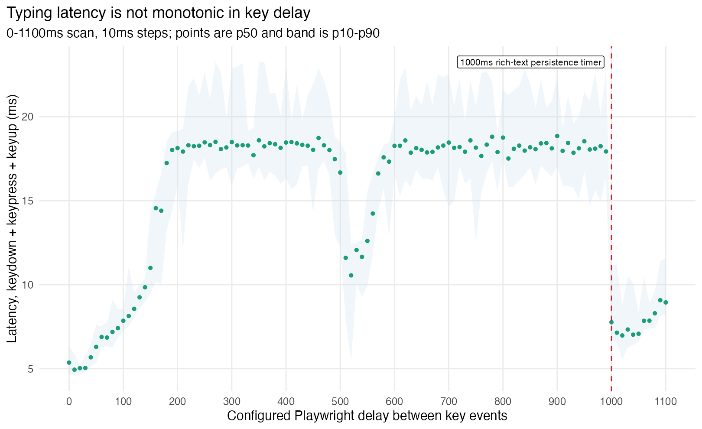

The dense `0..1100ms` run used `10ms` steps, 3 rounds, and 10 retained samples
per delay. The curve is not monotonic.

Approximate p50 regimes from the dense run:

|   Delay range | p50 regime |
| ------------: | ---------: |
|      `0-90ms` |   `~6.0ms` |
|   `100-150ms` |   `~8.9ms` |
|   `160-500ms` |  `~18.3ms` |
|   `510-560ms` |  `~11.9ms` |
|   `570-990ms` |  `~18.1ms` |
| `1000-1100ms` |   `~7.8ms` |

This alone makes the original coarse delay list risky. Sampling every `100ms`
misses most of the regime changes and makes `1000ms` look like a magic value.

## Extension To 2000ms

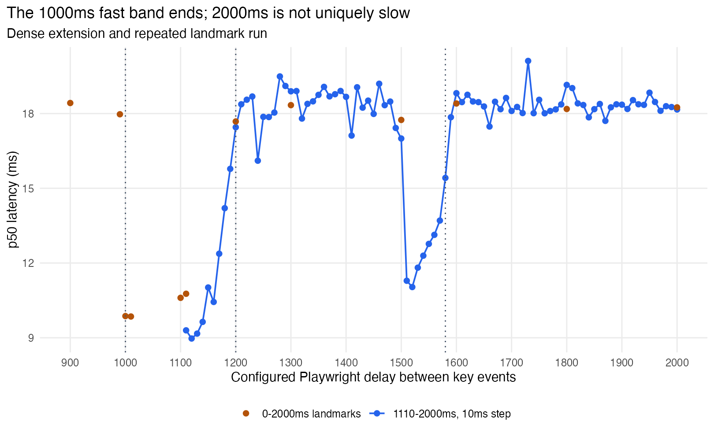

The `1000-1110ms` region is fast, but the fast behavior does not continue through
`2000ms`. A repeated landmark run gave:

|    Delay |   n |        p50 |       mean |      CV |
| -------: | --: | ---------: | ---------: | ------: |
|  `900ms` |  30 | `18.423ms` | `18.249ms` | `0.098` |
|  `990ms` |  30 | `17.972ms` | `17.555ms` | `0.129` |
| `1000ms` |  30 |  `9.871ms` | `10.222ms` | `0.111` |
| `1010ms` |  30 |  `9.854ms` | `10.020ms` | `0.161` |
| `1100ms` |  30 | `10.604ms` | `10.581ms` | `0.033` |
| `1110ms` |  30 | `10.767ms` | `10.254ms` | `0.135` |
| `1200ms` |  30 | `17.682ms` | `17.306ms` | `0.081` |
| `1300ms` |  30 | `18.338ms` | `18.114ms` | `0.072` |
| `1500ms` |  30 | `17.744ms` | `17.175ms` | `0.148` |
| `1600ms` |  30 | `18.404ms` | `18.329ms` | `0.057` |
| `1800ms` |  30 | `18.183ms` | `17.963ms` | `0.093` |
| `2000ms` |  30 | `18.248ms` | `18.068ms` | `0.114` |

So `2000ms` is slower than the `1000ms` fast band, but it is not slower than
`1200ms`, `1300ms`, `1600ms`, or `1800ms`. The original `2000ms` bump should be
read as "the benchmark left the fast band", not "longer idle time causes a
monotonic slowdown".

The dense `1110..2000ms` scan found another dip around `1510-1570ms`, then a
return to the same `~18ms` high plateau.

## Distributions, Not Just Averages

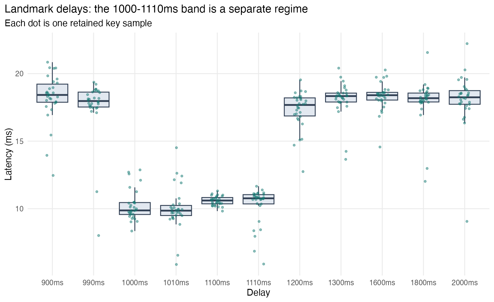

The landmark run shows why p50, p10/p90, and raw samples are more useful than a
single average. `1000ms` and `1010ms` are visibly in a different distribution
from `990ms` and `1200ms`. Some delays have low medians but high volatility.

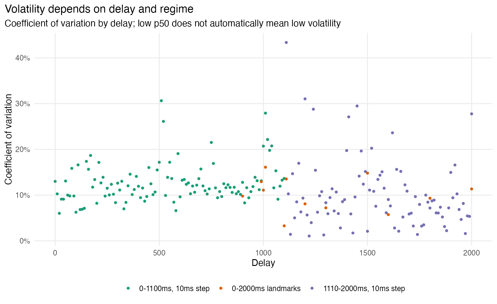

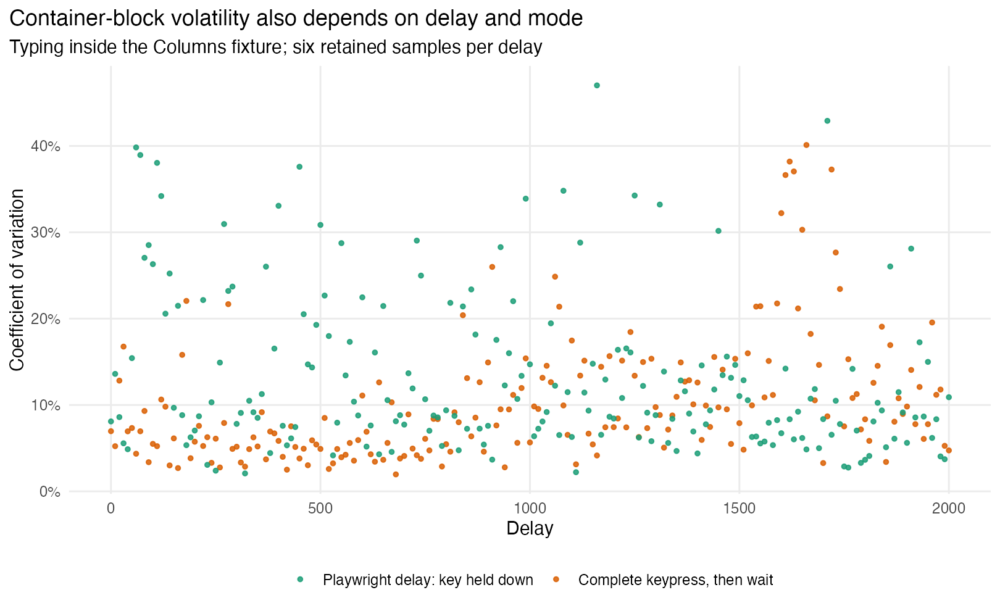

The "stable between 500 and 900ms" interpretation from the original exploration
does not survive a dense scan. Some delay values inside large ranges are stable,
but the adjacent values can be in different regimes.

The container-block rerun above measures typing into the first paragraph inside
the Columns fixture used by the original "Typing within containers" test. This
is not a Docker-vs-host comparison; the WordPress test environment was already
wp-env/Docker-backed. The container-block volatility curve is still delay- and
mode-dependent, so the variance problem is not an artifact of the large-post
non-container fixture.

## Time Order And Warmup

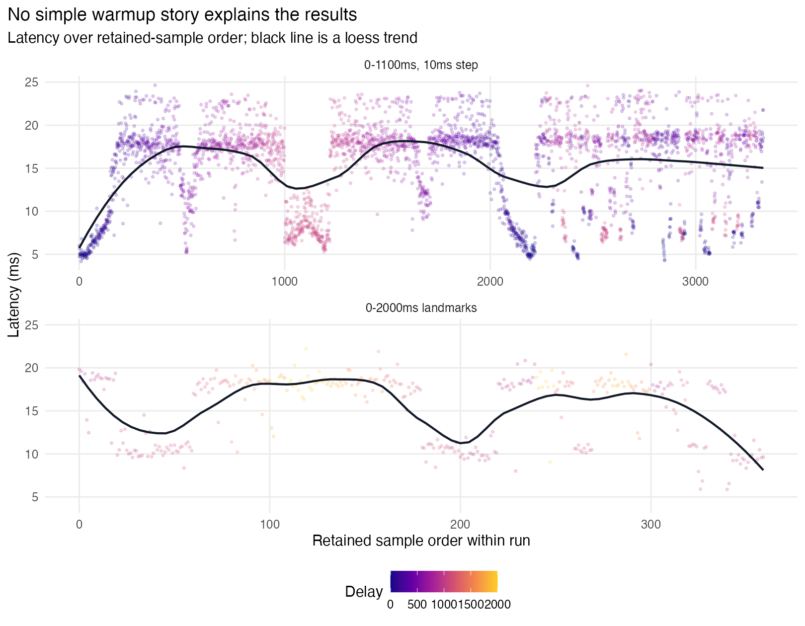

The Tratt VM-warmup articles linked in the original request are relevant because
they argue against assuming a benchmark reaches a simple, stable plateau. This
benchmark does not show a clean "warms up, then stays fast" story. Delay choice
explains much more than sample order.

The full run and the landmark run both preserve per-sample order. After accounting
for delay regimes, there was no convincing monotonic slowdown over time in these
runs. That is not proof that long editing sessions are safe; it only says these
short local runs did not reproduce a simple time-based degradation.

## Start Wait After Editor Setup

The benchmark now also tests the more direct "what if typing starts sooner or
later after editor setup?" question. The control knob is
`BENCHMARK_SETTLE_AFTER_EDITOR_SETUP_MS`: after Gutenberg has loaded the fixture,
inserted/focused the paragraph, and installed any tracing hooks, the benchmark can
wait before typing the first measured sequence.

The default value is `0ms`, so there is no smaller start wait to test. Reducing
the time before the benchmark starts means using the default. Increasing it means
adding a deliberate idle interval after setup and before typing.

I first compared that default against `10s` and `60s` waits using the large-post
key-hold path at the four delays that best expose the cliff: `990ms`, `1000ms`,
`1010ms`, and `1300ms`. Each wait setting used 3 rounds, 6 retained samples per
delay, and 1 throwaway sample per delay.

That first pass reused one editor setup across all delay groups. It is useful as
a whole-run check, but it is not the cleanest start-wait experiment because only
the first delay group is directly after the editor-setup wait. The corrected
experiment below uses `BENCHMARK_FRESH_EDITOR_PER_DELAY=1`, so every delay group
gets a fresh editor and the configured pre-typing wait.

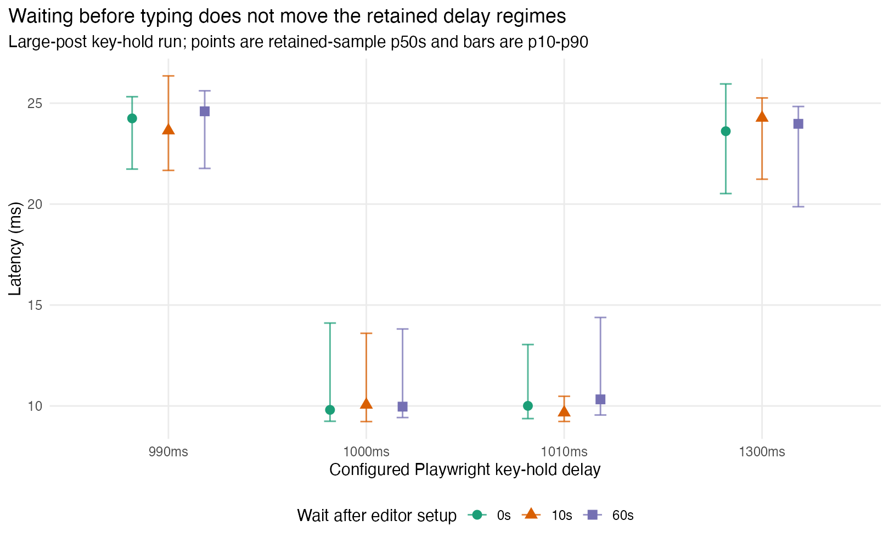

Selected retained p50s:

| Start wait |  990ms | 1000ms | 1010ms | 1300ms |
| ---------- | -----: | -----: | -----: | -----: |
| `0s`       | `24.2ms` |  `9.8ms` | `10.0ms` | `23.6ms` |
| `10s`      | `23.6ms` | `10.1ms` |  `9.7ms` | `24.3ms` |
| `60s`      | `24.6ms` | `10.0ms` | `10.3ms` | `24.0ms` |

That disconfirms a simple start-of-benchmark warmup or cool-down explanation for
the retained results. Waiting longer before the run does not move the
`990ms -> 1000ms` cliff, does not make the `1300ms` high plateau disappear, and
does not create a monotonic "more initial wait means slower/faster" trend. The
differences are roughly the normal run-to-run noise for this benchmark.

There is a separate first-sample issue, though:

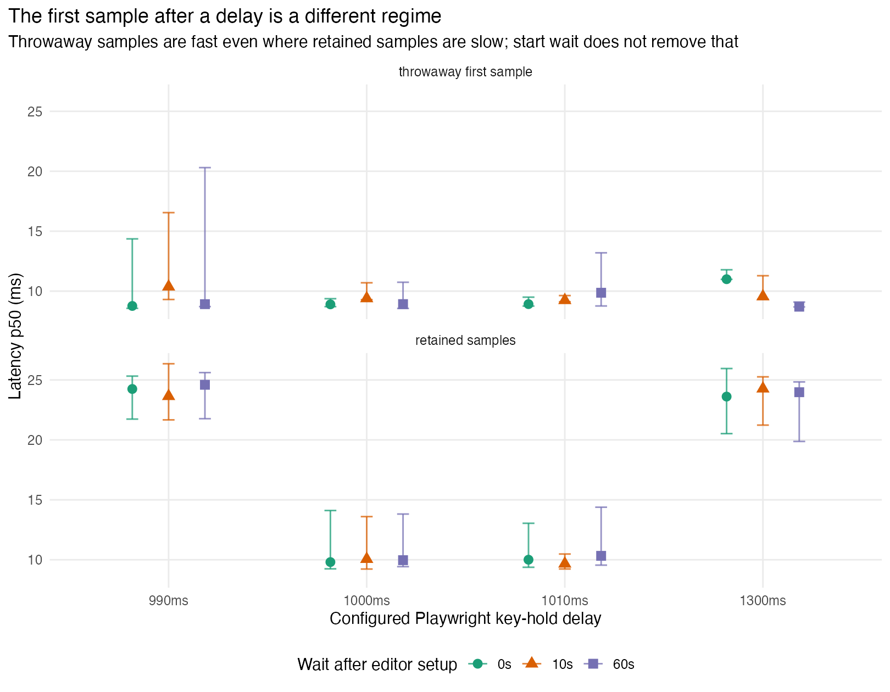

The throwaway sample after each delay is often fast even when the retained samples
for that same delay are slow. For example, the retained `1300ms` p50s are
`23.6ms`, `24.3ms`, and `24.0ms`, while the throwaway p50s are roughly
`11.0ms`, `9.6ms`, and `8.7ms`. The retained `990ms` rows show the same pattern.
That means changing the number of discarded startup samples can bias the slow
delay regimes much more than changing the pre-typing wait from `0s` to `60s`.

The corrected fresh-editor run is noisier because it creates a new large-post
editor repeatedly, but it answers the direct start-wait question better. Each
wait setting used 2 rounds, 4 retained samples per delay, and 1 throwaway sample
per delay.

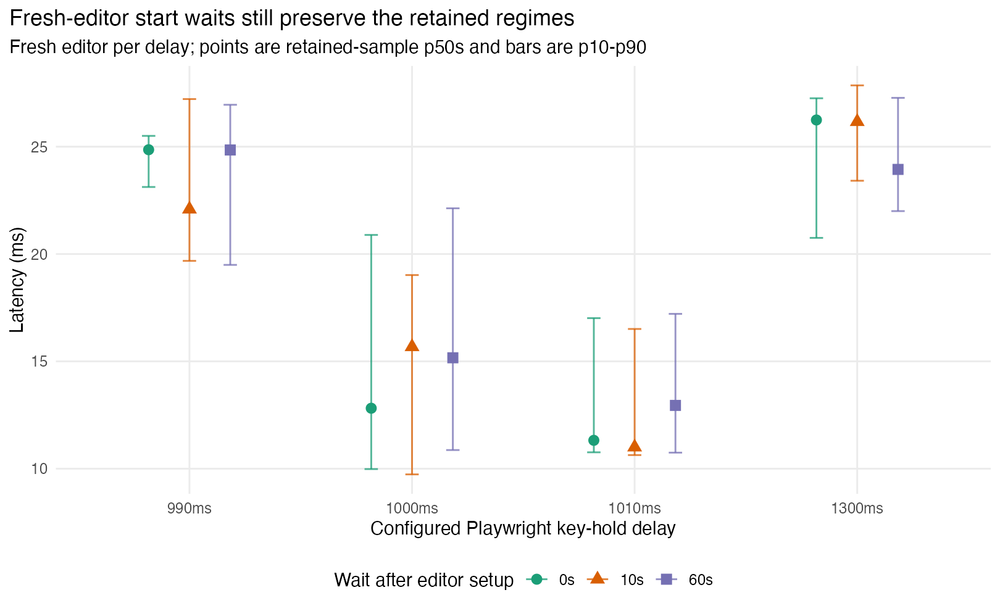

Fresh-editor retained p50s:

| Start wait |  990ms | 1000ms | 1010ms | 1300ms |
| ---------- | -----: | -----: | -----: | -----: |
| `0s`       | `24.9ms` | `12.8ms` | `11.3ms` | `26.2ms` |
| `10s`      | `22.1ms` | `15.7ms` | `11.0ms` | `26.2ms` |
| `60s`      | `24.8ms` | `15.2ms` | `12.9ms` | `23.9ms` |

This still disconfirms a simple "wait longer and the benchmark changes regime"
story. The `990ms` and `1300ms` rows remain slow, and `1010ms` remains in the
low band. The exact `1000ms` boundary is more mixed under fresh setup, which is
expected: it is the race point where the one-second timer, keyup, and next
keydown are closest together.

The fresh-editor first samples do change with start wait:

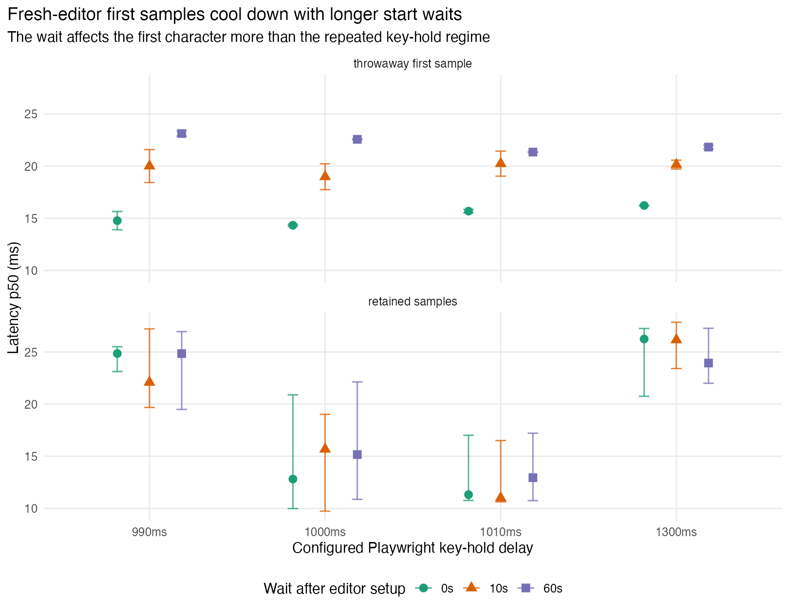

Fresh-editor throwaway p50s:

| Start wait |  990ms | 1000ms | 1010ms | 1300ms |
| ---------- | -----: | -----: | -----: | -----: |
| `0s`       | `14.8ms` | `14.3ms` | `15.7ms` | `16.2ms` |
| `10s`      | `20.0ms` | `19.0ms` | `20.2ms` | `20.2ms` |
| `60s`      | `23.1ms` | `22.6ms` | `21.4ms` | `21.8ms` |

A focused follow-up isolates just that first-character effect. This run used
`BENCHMARK_FRESH_EDITOR_PER_DELAY=1`, `BENCHMARK_DELAYS_MS=1300`,
`BENCHMARK_ROUNDS=6`, `BENCHMARK_SAMPLES_PER_DELAY=1`,
`BENCHMARK_THROWAWAY_PER_DELAY=0`, and start waits of `0s`, `1s`, `5s`, `10s`,
`30s`, and `60s`. Each sample creates a fresh editor, waits for the configured
post-setup interval, then measures exactly one held-key character.

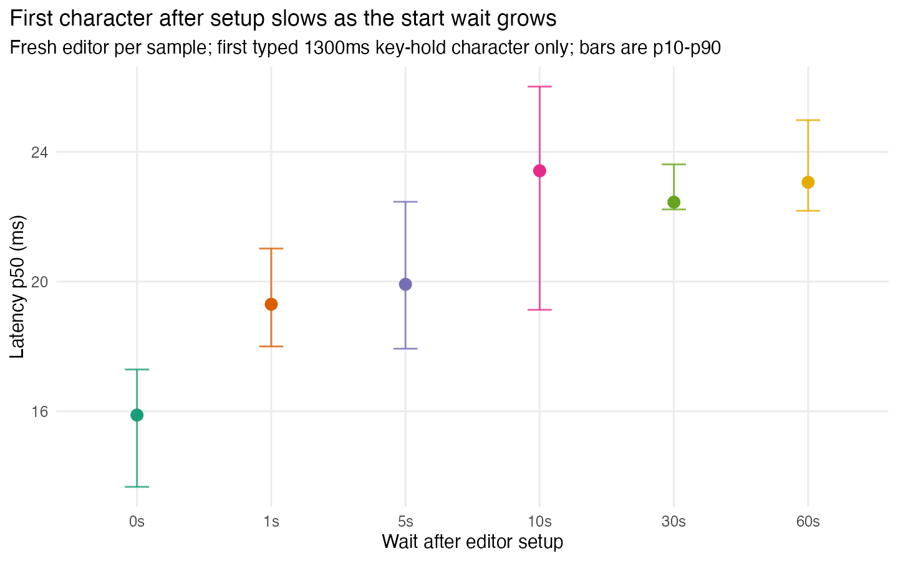

Focused first-character p50s at `1300ms`:

| Start wait | First-character p50 | p10-p90 |
| ---------- | ------------------: | ------: |
| `0s`       | `15.9ms` | `13.7-17.3ms` |
| `1s`       | `19.3ms` | `18.0-21.0ms` |
| `5s`       | `19.9ms` | `17.9-22.5ms` |
| `10s`      | `23.4ms` | `19.1-26.0ms` |
| `30s`      | `22.4ms` | `22.2-23.6ms` |
| `60s`      | `23.1ms` | `22.2-25.0ms` |

The `0s` and `60s` p10-p90 bands do not overlap in this run, so the effect is
large relative to the observed first-character volatility. The recorded setup
duration also tracks the configured wait plus about `1.6s` of editor setup work,
so this is the intended post-setup wait knob, not accidental extra time hidden
elsewhere in the harness.

That is the part of the benchmark that start wait really changes. With a fresh
editor, reducing an artificial wait from `60s` to the default `0s` makes the
first typed character faster. Increasing the wait moves the first character
toward a slower idle plateau. The benchmark does not prove the hardware-level
cause of that plateau, but the shape is consistent with recent setup activity
leaving the browser and machine in a more active state. After the first
character is discarded, the repeated key-hold samples return to the
delay-controlled regimes.

The component split is also useful:

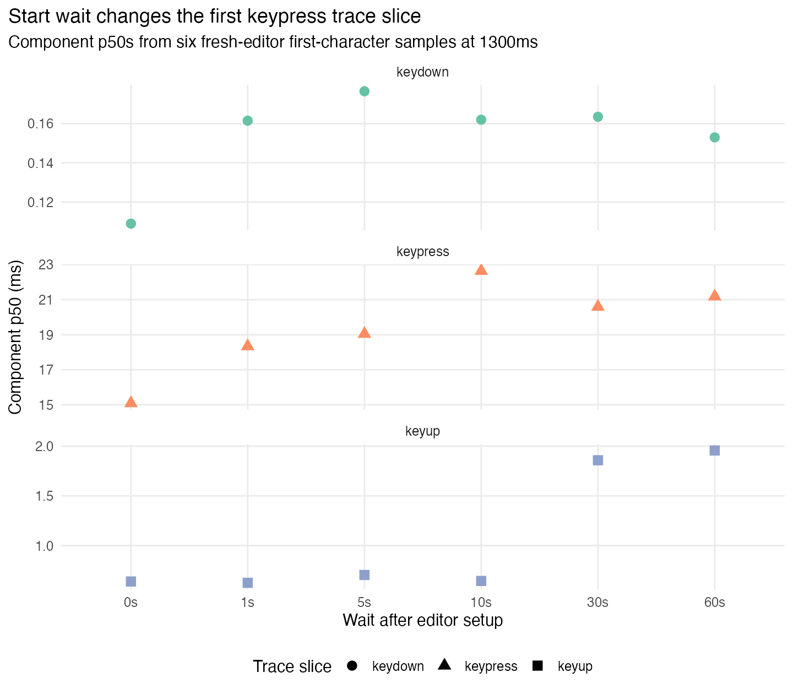

The `keydown` trace slice stays tiny, roughly `0.1-0.2ms`. The change is mostly
in the `keypress` slice: p50 goes from `15.1ms` at `0s` to roughly
`21-23ms` at the long waits. `keyup` is usually sub-millisecond, although it is
around `1.9ms` in the `30s` and `60s` rows. So the start-wait effect is not a
measurement bookkeeping artifact from waiting before the first `keydown`; it is
showing up inside the measured browser event work for the first input.

The stronger check is to type several characters after the same start wait and
summarize by character position. This run used a fresh large-post editor,
`BENCHMARK_DELAYS_MS=1300`, 8 rounds, 4 measured characters per fresh editor, no
throwaway sample, and start waits of `0s`, `10s`, and `60s`.

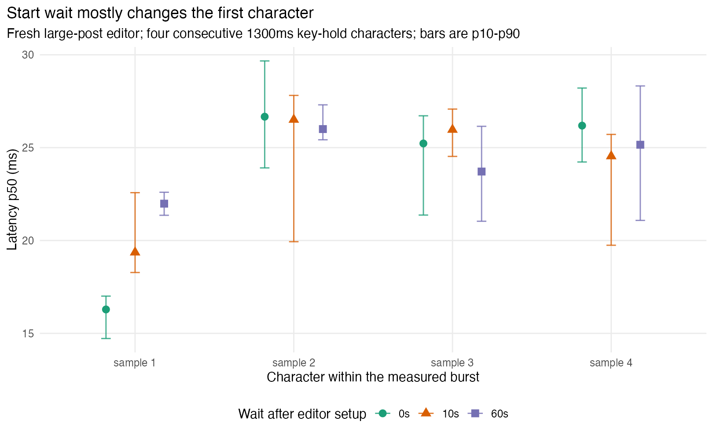

Large-post p50s by character position:

| Start wait | Sample 1 | Sample 2 | Sample 3 | Sample 4 |
| ---------- | -------: | -------: | -------: | -------: |
| `0s`       | `16.3ms` | `26.7ms` | `25.2ms` | `26.2ms` |
| `10s`      | `19.4ms` | `26.5ms` | `26.0ms` | `24.5ms` |
| `60s`      | `22.0ms` | `26.0ms` | `23.7ms` | `25.2ms` |

This rules out a broad "longer start wait changes the whole benchmark" story.
The first character is start-wait-sensitive. The next three characters are
already in the ordinary `1300ms` held-key slow regime regardless of whether the
run started immediately or after a minute. In other words, adding a long
pre-typing wait mainly changes what happens before the first measured input; it
does not change the repeated-key artifact that the main benchmark is measuring
after throwaways.

I also ran first-character controls for an empty Gutenberg editor and for the
native `contenteditable` timer page. These used the same `1300ms` held-key first
character, 8 fresh setups per setting, no throwaway, and start waits of `0s`,
`10s`, and `60s`.

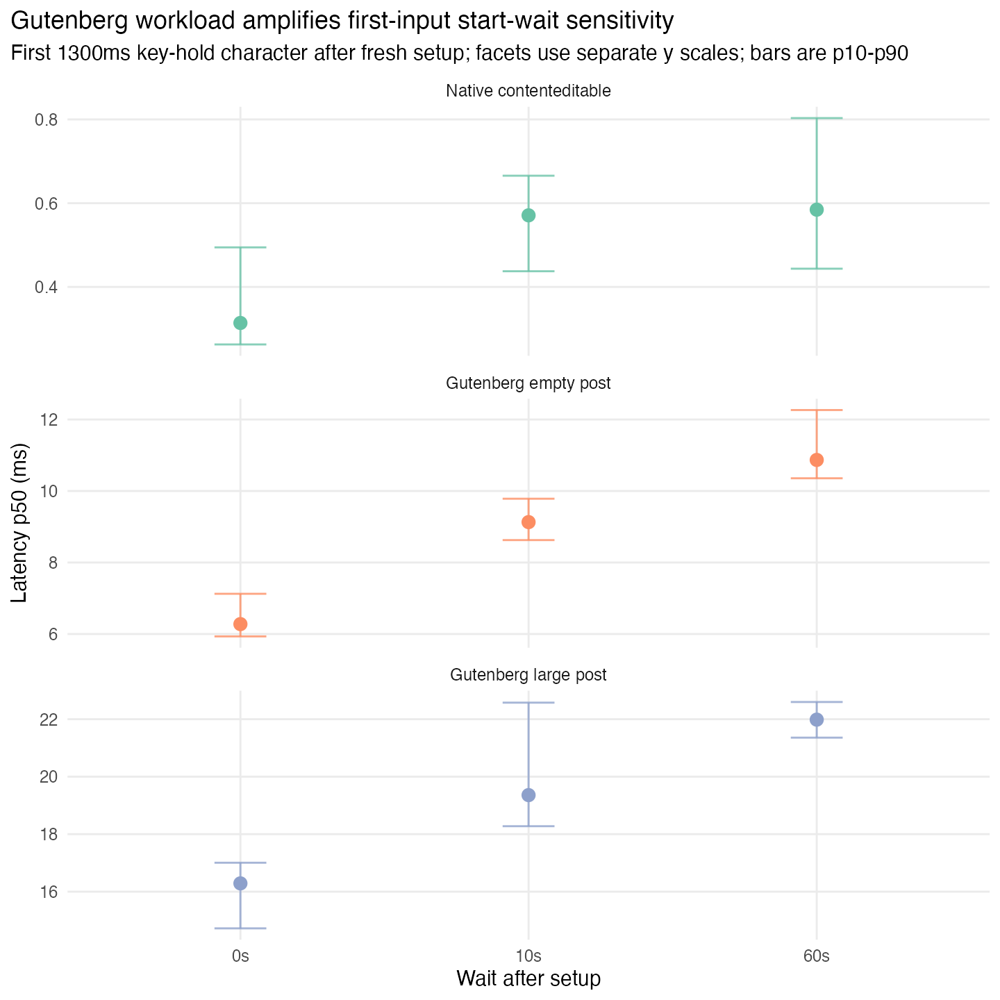

First-character p50s by scenario:

| Scenario | `0s` wait | `10s` wait | `60s` wait | `0s -> 60s` |
| -------- | --------: | ---------: | ---------: | ----------: |
| Native `contenteditable` | `0.31ms` | `0.57ms` | `0.58ms` | `+0.27ms` |
| Gutenberg empty post | `6.3ms` | `9.1ms` | `10.9ms` | `+4.6ms` |
| Gutenberg large post | `16.3ms` | `19.4ms` | `22.0ms` | `+5.7ms` |

That disconfirms a pure browser, Playwright, or trace-accounting explanation.
The trivial native page has a detectable but tiny idle-start effect. Gutenberg's
editor path amplifies it, and the large-post fixture starts from a much higher
absolute latency than the empty editor. The benchmark still does not isolate the
hardware/browser mechanism behind the idle slowdown; plausible contributors
include colder CPU state, browser scheduling state, JIT/cache state, or a mix of
those. The important benchmark conclusion is narrower and better supported: a
long pre-start wait changes first-input coldness in Gutenberg, while retained
repeated-key samples remain controlled mostly by the key-hold/timer interaction.

Finally, I traced the large-post first input at `0s` and `60s` with RichText,
data-store, and event-listener instrumentation enabled. This trace is deliberately
heavier than the normal benchmark, so the absolute latencies are not comparable
to the uninstrumented runs above. It is still useful for within-trace attribution:
both waits run through the same source-level path, but the long-wait path spends
more time in the same RichText/data batch.

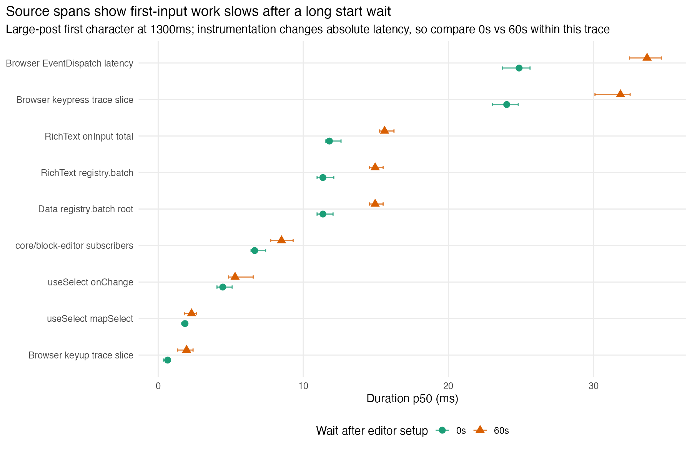

Selected large-post source-span p50s:

| Component | `0s` wait | `60s` wait | Delta | Count |
| --------- | --------: | ---------: | ----: | ----: |
| Browser EventDispatch latency | `24.9ms` | `33.7ms` | `+8.8ms` | |
| Browser `keypress` trace slice | `24.0ms` | `31.9ms` | `+7.8ms` | |
| `RichText` `onInput` total | `11.8ms` | `15.6ms` | `+3.8ms` | |
| `RichText` `registry.batch` | `11.4ms` | `14.9ms` | `+3.6ms` | |
| Data `registry.batch` root | `11.4ms` | `14.9ms` | `+3.6ms` | |
| `core/block-editor` subscribers | `6.7ms` | `8.5ms` | `+1.9ms` | `4497 -> 4497` |
| `useSelect.onChange` | `4.5ms` | `5.3ms` | `+0.9ms` | `4542 -> 4542` |
| `useSelect.mapSelect` | `1.9ms` | `2.3ms` | `+0.5ms` | `714 -> 714` |
| Browser `keyup` trace slice | `0.7ms` | `2.0ms` | `+1.3ms` | |

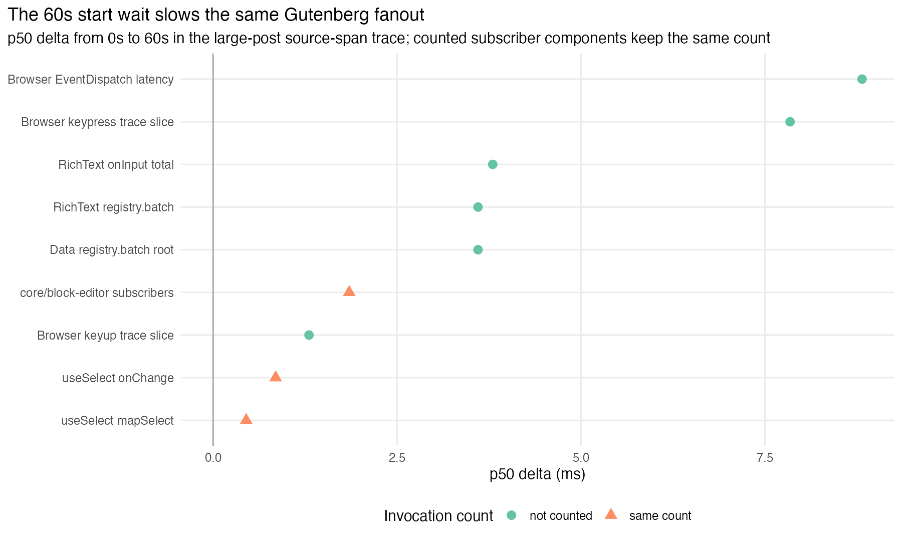

The counted fanout sizes are unchanged. The long wait does not create a new
class of work or cause thousands of extra `useSelect` callbacks. Instead, the
same thousands of callbacks and the same `registry.batch` path take longer after
the editor has been idle. The source spans account for a substantial part of the
extra measured `keypress` slice, but not all of it; the remainder is likely in
uninstrumented React/browser work plus the overhead of the tracing itself. That
is as far as this benchmark can go without hardware-level CPU frequency/cache
instrumentation or lower-overhead browser internals tracing.

To test whether that is really an idle-state effect, I added a benchmark-only
pre-typing warmup. It runs after the configured post-setup wait but before
browser tracing and before the measured keypress. The current warmup mode is a
browser-main-thread busy loop, controlled by
`BENCHMARK_PRE_TYPE_WARMUP_MODE=main-thread-busy-loop` and
`BENCHMARK_PRE_TYPE_WARMUP_MS`. This is not meant to model a user action; it is
a causality probe for the state of the browser/editor immediately before the
first input.

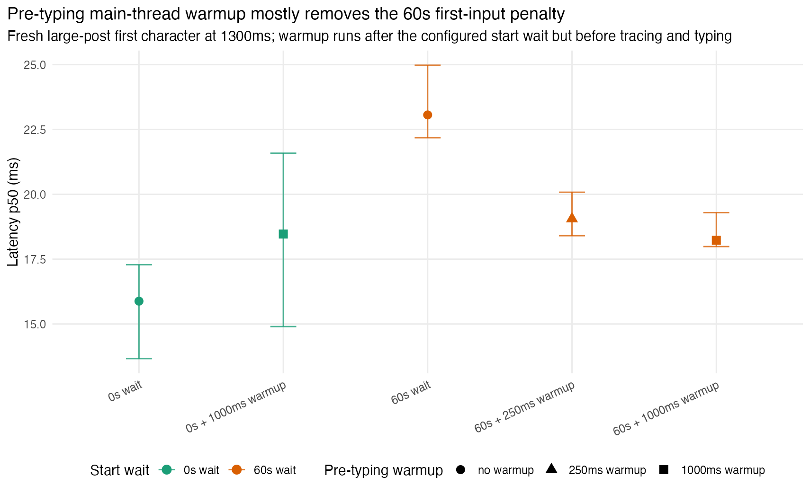

Pre-typing warmup p50s:

| Configuration | p50 | p10-p90 | `keypress` p50 |
| ------------- | --: | ------: | --------------: |
| `0s` wait | `15.9ms` | `13.7-17.3ms` | `15.1ms` |
| `0s + 1000ms` warmup | `18.5ms` | `14.9-21.6ms` | `17.6ms` |
| `60s` wait | `23.1ms` | `22.2-25.0ms` | `21.2ms` |
| `60s + 50ms` warmup | `18.3ms` | `18.0-20.2ms` | `16.6ms` |
| `60s + 100ms` warmup | `18.8ms` | `18.1-19.3ms` | `16.5ms` |
| `60s + 250ms` warmup | `19.1ms` | `18.4-20.1ms` | `17.0ms` |
| `60s + 500ms` warmup | `18.6ms` | `18.3-19.5ms` | `16.7ms` |
| `60s + 1000ms` warmup | `18.2ms` | `18.0-19.3ms` | `16.4ms` |

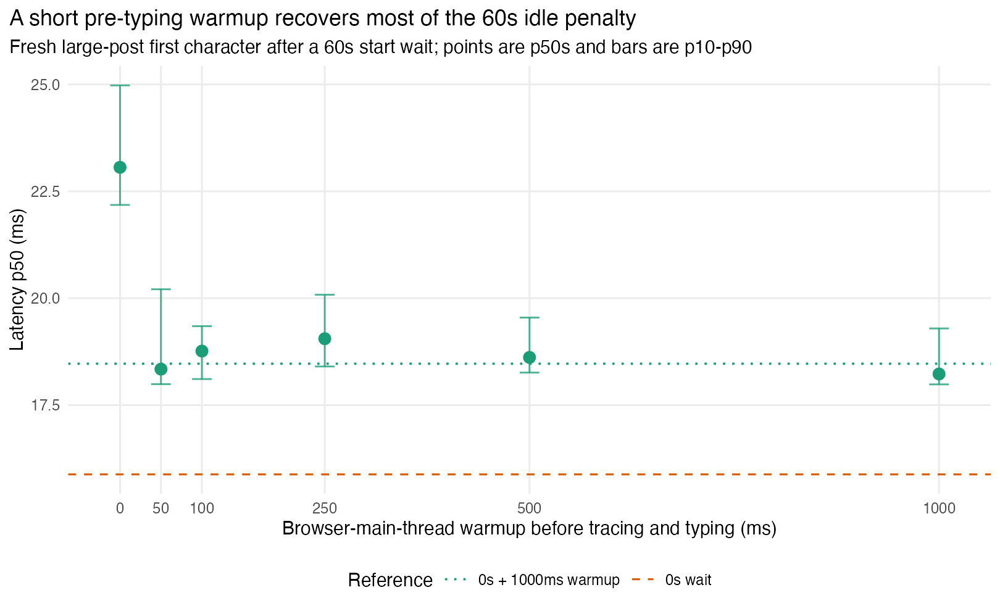

This does not say "busy-loop before typing is good"; the `0s + 1000ms` warmup
control is slower than the plain `0s` wait. The cleaner comparison is with equal
immediate pre-typing work: after a `1000ms` main-thread warmup, `0s` and `60s`
start waits are effectively the same (`18.5ms` vs. `18.2ms`). That strongly
supports the narrower causal claim: the first-character slowdown from increasing
start wait is mostly about the browser/editor state immediately before input,
not the absolute elapsed time since editor setup.

The dose-response shape is especially useful. The difference between `60s` with
no warmup and `60s + 50ms` has no p10-p90 overlap in this run: `22.2-25.0ms`
versus `18.0-20.2ms`. Additional warmup time from `100ms` to `1000ms` does not
produce a clear monotonic improvement; those p50s all sit in the `18.2-19.1ms`
band. That is more consistent with crossing out of an idle/cold state quickly
than with a proportional amount of useful work being done before typing. It also
disconfirms a story where the long start wait permanently changes Gutenberg
state: a tiny amount of immediate main-thread activity changes the result
without changing the document, block tree, or measured key sequence.

The interpretation is conservative: increasing the pre-run settle time is not a
fix for this benchmark's main artifacts. It mainly changes the first character
after a fresh setup. Keeping at least one throwaway sample per delay remains
important, and changing the throwaway policy can bias results more than changing
the pre-typing wait for the retained repeated-key measurements.

## Where The 1000ms Cliff Comes From

The cliff comes from this code:

```js
// packages/block-editor/src/components/rich-text/use-mark-persistent.js
if ( previousTextRef.current !== value.text ) {
	const timeout = window.setTimeout( () => {
		__unstableMarkLastChangeAsPersistent();
	}, 1000 );
	previousTextRef.current = value.text;
	return () => {
		window.clearTimeout( timeout );
	};
}
```

That hook is used by RichText. For text input, it delays creating a persistent
undo level until there has been one second without input. The relevant state then
flows through:

-   `MARK_LAST_CHANGE_AS_PERSISTENT` in
    `packages/block-editor/src/store/actions.js`;
-   `withPersistentBlockChange()` in
    `packages/block-editor/src/store/reducer.js`;
-   `isLastBlockChangePersistent()` in
    `packages/block-editor/src/store/selectors.js`;
-   `useBlockSync()` in
    `packages/block-editor/src/components/provider/use-block-sync.js`, which sends
    persistent changes through `onChange` and non-persistent changes through
    `onInput`.

The `1000ms` point is controlled by the timer, but the current traces do not
prove the full internal reason that the following input event becomes shorter.
Below the boundary, for example at `990ms`, each next character usually arrives
before the persistence timeout fires. The RichText effect cleanup cancels the
old timeout, so the action sequence stays as consecutive transient text input
updates.

At `1000ms`, Playwright's normal `keyboard.type( ..., { delay } )` has held the
previous key down for roughly one second before sending `keyup`, and the next
`keydown` follows almost immediately. That gives the RichText timeout just enough
room to fire between synthetic characters. The timeout dispatches
`MARK_LAST_CHANGE_AS_PERSISTENT`, so the action sequence becomes
`UPDATE_BLOCK_ATTRIBUTES -> MARK_LAST_CHANGE_AS_PERSISTENT -> UPDATE_BLOCK_ATTRIBUTES`
instead of `UPDATE_BLOCK_ATTRIBUTES -> UPDATE_BLOCK_ATTRIBUTES`.

So the drop is not evidence that the persistence timer makes Gutenberg
intrinsically faster. It is at least partly an accounting problem in an
event-only metric. The benchmark's latency value is the sum of Chromium
`EventDispatch` durations for the key's `keydown`, `keypress`, and `keyup`
events. A timer callback is a different browser task, so timer work is not
included in that key-event number even if the timer was scheduled by the
previous character.

That means the trace timestamps are not wrong. The measured key event really is
shorter at `1000ms`; the problem is interpreting that event-only slice as the
whole cost of the character cycle. In the focused action trace, the `1000ms`
row has an event-only p50 of `10.374ms`, but the persistence action that fired
inside the preceding key hold had median duration around `15.8ms`. Adding those
two pieces gives about `26.2ms`, which is essentially the same scale as the
event-only p50s at `970ms` (`26.252ms`) and `990ms` (`25.829ms`).

The normal timer callback does real work because it dispatches
`MARK_LAST_CHANGE_AS_PERSISTENT`. That wakes the block-editor data store and
subscribers, and `useBlockSync()` has explicit code for the case where the blocks
did not change in the current action but the previous block change has become
persistent. A later intervention shows that this explanation was too specific:
replacing the marker with `stopTyping(); startTyping()` also creates the
`1000ms` / `1010ms` low EventDispatch band. The common proven property is a
timer-side block-editor subscriber fanout before the next key, not the marker
action by itself.

Since that timer task happens before the next `keydown`, its own work is outside
the next key's `EventDispatch` slices. The later source-level traces are
consistent with a timer-side fanout/accounting split, but they do not prove the
lower-level cause of the smaller following input slice: in the large-post
key-held run, RichText `registry.batch()` median time drops from about `10.5ms`
at `990ms` to `6.5ms` at `1000ms`, and the input-matched data batch drops from
about `23.4ms` to `14.2ms`.

The action trace shows the boundary directly. This version of the graph is a
per-delay timing diagram, not an absolute wall-clock timeline:

-   the gray bar is the artificial Playwright key hold, from the previous
    `keydown` to its `keyup`;
-   the dashed vertical line is the `1000ms` RichText persistence timer;
-   the diamond is the next `keydown`, where the benchmark's next measured
    keypress dispatch begins;
-   the circle is the persistence timer callback;
-   the triangle is the text update action for the next input.

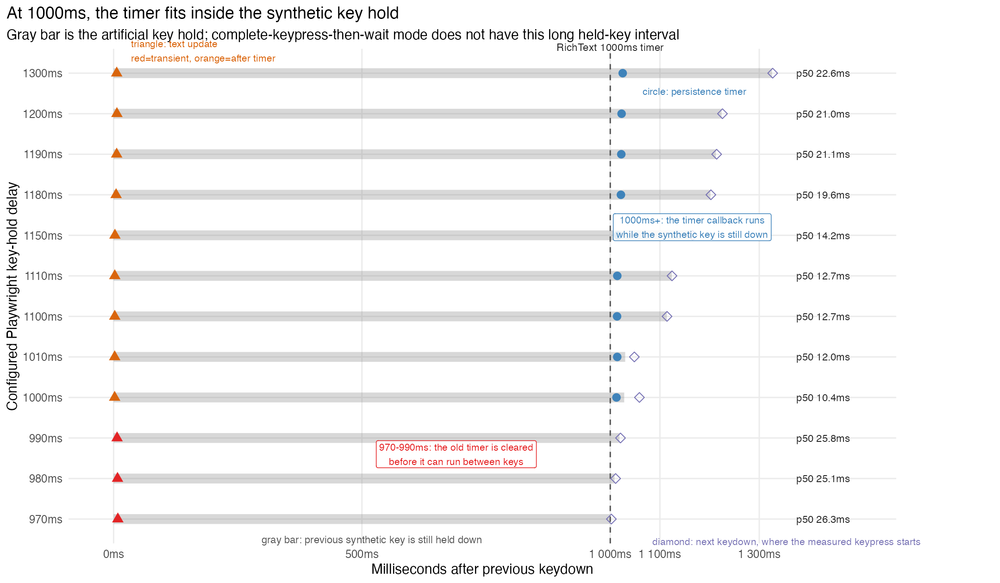

In the focused action run:

|    Delay |        p50 | What happened                                                          |
| -------: | ---------: | ---------------------------------------------------------------------- |
|  `970ms` | `26.252ms` | no between-key persistence marker; the next input clears the old timer |
|  `980ms` | `25.068ms` | no between-key persistence marker; the next input clears the old timer |
|  `990ms` | `25.829ms` | no between-key persistence marker; the next input clears the old timer |
| `1000ms` | `10.374ms` | the persistent marker fires during the held-key interval               |
| `1010ms` | `12.019ms` | the persistent marker fires during the held-key interval               |
| `1100ms` | `12.667ms` | persistent between keys                                                |
| `1110ms` | `12.660ms` | persistent between keys                                                |
| `1150ms` | `14.172ms` | persistent between keys, but latency begins climbing                   |
| `1180ms` | `19.570ms` | persistent between keys, high/transition                               |
| `1190ms` | `21.147ms` | persistent between keys, near high plateau                             |
| `1200ms` | `20.959ms` | persistent between keys, high/transition                               |
| `1300ms` | `22.628ms` | persistent between keys, high plateau                                  |

The important visual comparison is `990ms` versus `1000ms`. At `970-990ms`, the
next keydown arrives at about the timer boundary, but the next input clears the
previous timer before the callback has run between keys. The triangle is red:
the action trace observed the next text update before the persistence marker.

At `1000ms` and `1010ms`, the circle appears before the diamond. That means the
timer callback ran while Playwright was still holding the previous synthetic key,
before the next measured keypress began. The previous input has been marked
persistent before the next input starts. The next triangle is orange: the
following text update was observed after the timer marker. In these traces, that
ordering correlates with a much smaller measured event-only latency. The data
does not yet prove whether the following input is shorter because of persistent
classification itself, because the inserted marker changes subscriber state, or
because of some lower-level React/data scheduling consequence.

This only happens in the key-held benchmark because the gray bar is long. In the
complete-keypress-then-wait mode, `keyup` happens immediately and the wait occurs
after the key is no longer down. The same one-second timer can still fire, but it
fires after a completed keypress and ordinary idle wait, not inside a long
synthetic key hold immediately before the next keydown. That different event
ordering does not create the same measured cliff.

The same data can be reduced to three repeated p50 timelines:

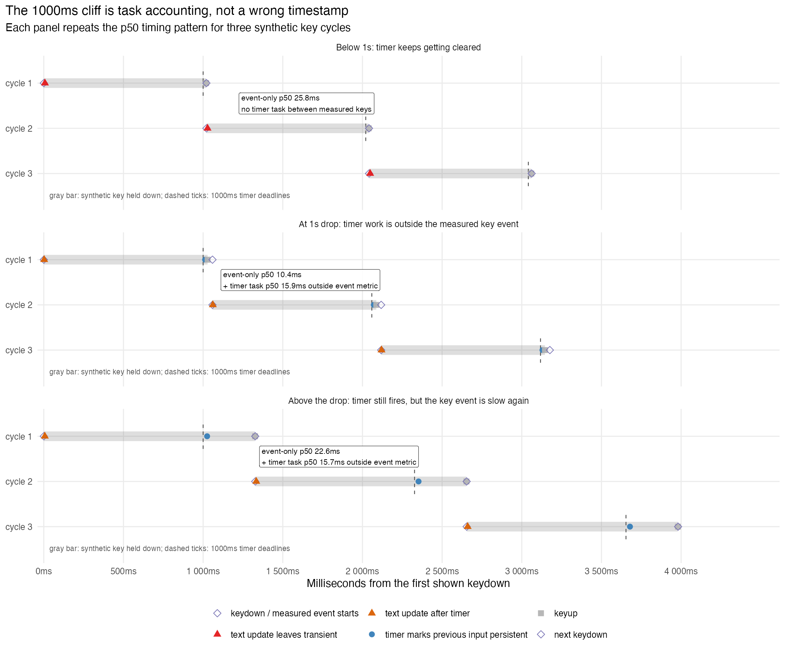

These timelines show three synthetic key cycles for each regime. They use p50
offsets, so each row is a typical repeated cycle rather than one noisy sample.
The gray bar is the wall-clock interval where Playwright is holding the key down,
but the reported benchmark value is not the length of that bar. The reported
value is the event-only p50: the sum of `keydown`, `keypress`, and `keyup`
`EventDispatch` durations for the key.

The three regimes are:

-   **Below 1s (`990ms`).** Each new input arrives before the RichText timer has
    run between measured keys. The text update leaves the change transient, and
    the benchmark reports the full slow event path: `25.8ms` p50.
-   **At the drop (`1000ms`).** The timer runs while the synthetic key is still
    held and before the next measured keydown. The key-event p50 is only
    `10.4ms`, but the timer task immediately before it is another `15.9ms` p50
    outside the event metric. This shows that the event-only number is not the
    whole character-cycle cost; it does not prove that identical work moved from
    one task to another.
-   **Above the drop (`1300ms`).** The timer still runs outside the measured key
    event, but the later key-held path is slow again: `22.6ms` event-only p50,
    plus a `15.7ms` timer task outside the metric. This is why the later plateau
    is a separate phenomenon from the first `990 -> 1000ms` accounting drop.

This establishes two separate facts and leaves one important mechanism open:

1. The one-second rich-text persistence timer controls the transition between
   `990ms` and `1000ms`: moving the timer moves the transition.
2. The later return to the high plateau is not caused by that same state
   transition, because the editor is already on the persistent path at `1150ms`,
   `1180ms`, `1190ms`, `1200ms`, and `1300ms`.
3. The current traces do not prove why the next input listener/dispatch span is
   smaller once the marker has run first.

## Timer Intervention

To test causality, the benchmark added a timer tracer/intervention mode. The
mode rewrites `setTimeout(..., 1000)` calls and records which callbacks were
rewritten. Source-map lookup for the repeated timer stack mapped the minified
frame back to
`packages/block-editor/src/components/rich-text/use-mark-persistent.js:29`.

I first rewrote the timer to `500ms`, then repeated the check at `230ms` and
`710ms`. The three runs rewrote 359 rich-text `1000ms` timers in total: 235 in
the dense `230ms` transition scan, 62 in the `500ms` run, and 62 in the `710ms`
run.

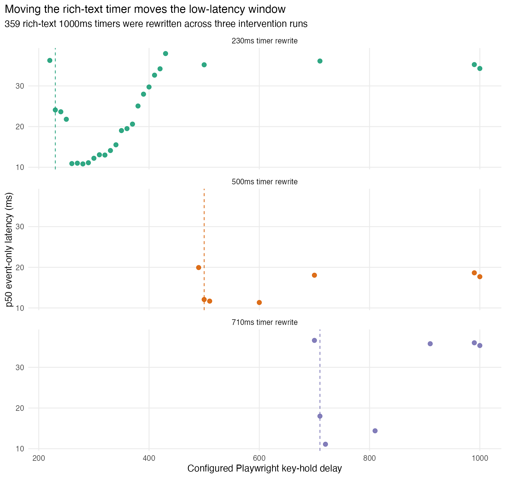

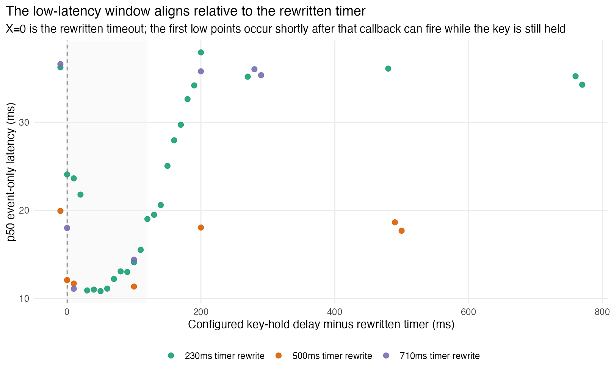

The low-latency band moved with the timer, and the original `1000ms` boundary
stopped being special in the intervention runs:

| Timer rewrite |    Delay |   n |        p50 |       mean |
| ------------: | -------: | --: | ---------: | ---------: |
|       `230ms` |  `220ms` |   8 | `36.268ms` | `34.812ms` |
|       `230ms` |  `230ms` |   8 | `24.091ms` | `23.876ms` |
|       `230ms` |  `260ms` |   8 | `10.902ms` | `11.188ms` |
|       `230ms` |  `280ms` |   8 | `10.821ms` | `10.820ms` |
|       `230ms` |  `330ms` |   8 | `14.110ms` | `14.209ms` |
|       `230ms` |  `430ms` |   8 | `37.959ms` | `37.294ms` |
|       `230ms` |  `990ms` |   8 | `35.248ms` | `33.889ms` |
|       `230ms` | `1000ms` |   8 | `34.287ms` | `31.301ms` |
|       `500ms` |  `490ms` |   8 | `19.939ms` | `19.323ms` |
|       `500ms` |  `500ms` |   8 | `12.077ms` | `12.105ms` |
|       `500ms` |  `510ms` |   8 | `11.686ms` | `11.904ms` |
|       `500ms` |  `600ms` |   8 | `11.345ms` | `11.292ms` |
|       `500ms` |  `700ms` |   8 | `18.052ms` | `18.022ms` |
|       `710ms` |  `700ms` |   8 | `36.629ms` | `36.090ms` |
|       `710ms` |  `710ms` |   8 | `18.005ms` | `18.323ms` |
|       `710ms` |  `720ms` |   8 | `11.096ms` | `11.266ms` |
|       `710ms` |  `810ms` |   8 | `14.397ms` | `13.966ms` |
|       `710ms` |  `910ms` |   8 | `35.809ms` | `34.766ms` |

This is the strongest evidence that the `~1000ms` cliff is not VM warmup or a
random browser scheduling artifact. Moving the timer moves the low-latency
window.

The exact transition is not a step function at the rewritten millisecond. The
timer callback has to fire, run the rich-text persistence work, and yield back
to the browser before the next measured keydown can start in the post-marker
ordering. That is why the `230ms` rewrite has mixed/partial points at
`230..250ms` and its cleanest low points at `260..330ms`, and why the `710ms`
rewrite has a mixed point at `710ms` followed by a clear low point at `720ms`.

The intervention runs should not be treated as production benchmarks. Wrapping
`setTimeout` can perturb scheduling. Their purpose is causal attribution.

## Firefox Check

Firefox cannot use the Chromium `EventDispatch` trace metric used for the main
Chrome plots. To check whether the same boundary exists there, I added a Firefox
project path and ran the benchmark with in-page event-listener timing. The graph
below measures the dispatch span of the editable element's `input` event
listeners, not Chromium trace slices.

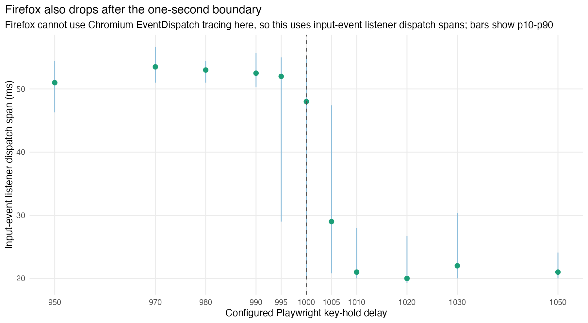

Firefox shows the same qualitative transition, but the exact `1000ms` point is
mixed. The high regime is clear through `990ms`; `1000ms` contains both high and
low samples; `1005ms` is mostly low; `1010ms` and later are consistently low in
these runs.

|    Delay |   n |      p50 |      p10 |      p90 |     mean |
| -------: | --: | -------: | -------: | -------: | -------: |
|  `950ms` |  14 | `51.0ms` | `46.3ms` | `54.4ms` | `49.9ms` |
|  `970ms` |  14 | `53.5ms` | `51.0ms` | `56.7ms` | `52.9ms` |
|  `980ms` |  14 | `53.0ms` | `51.0ms` | `54.4ms` | `52.6ms` |
|  `990ms` |  14 | `52.5ms` | `50.3ms` | `55.7ms` | `52.7ms` |
|  `995ms` |  19 | `52.0ms` | `29.0ms` | `55.0ms` | `45.8ms` |
| `1000ms` |  33 | `48.0ms` | `20.2ms` | `54.8ms` | `39.9ms` |
| `1005ms` |  19 | `29.0ms` | `20.8ms` | `47.4ms` | `30.5ms` |
| `1010ms` |  33 | `21.0ms` | `20.0ms` | `28.0ms` | `22.7ms` |
| `1020ms` |  14 | `20.0ms` | `19.3ms` | `26.7ms` | `21.8ms` |
| `1030ms` |  14 | `22.0ms` | `20.0ms` | `30.4ms` | `24.2ms` |
| `1050ms` |  14 | `21.0ms` | `20.0ms` | `24.1ms` | `21.6ms` |

So the answer is "yes, with a caveat": Firefox has the same one-second boundary
effect, but with this listener-based metric the clean low band starts just after
the one-second mark rather than being cleanly centered on the exact `1000ms`
sample.

## Safari/WebKit Check

This uses Playwright WebKit with the Desktop Safari device profile and Safari
user agent. It is a Safari-engine check, not a manually-driven run in the
system Safari.app. Like Firefox, it cannot use Chromium `EventDispatch` trace
slices, so the metric below is the same input-event listener dispatch span used
for the Firefox check.

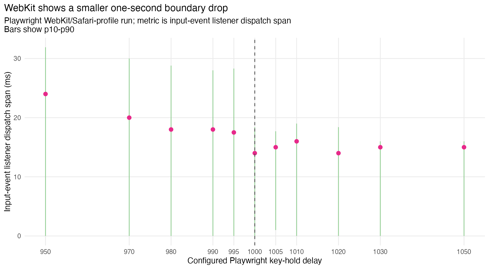

WebKit does show a drop at the one-second boundary, but it is much smaller than
Chrome's cliff and smaller than Firefox's transition. In these runs, the median
listener dispatch span is mostly `18..24ms` below `1000ms`, then mostly
`14..16ms` at and above `1000ms`. The WebKit listener timestamps also have more
near-zero dispatch spans than the Firefox run, so the p10 band is less
informative than the median.

|    Delay |   n |      p50 |     p10 |      p90 |     mean |
| -------: | --: | -------: | ------: | -------: | -------: |
|  `950ms` |  22 | `24.0ms` | `0.0ms` | `31.9ms` | `17.5ms` |
|  `970ms` |  25 | `20.0ms` | `0.0ms` | `30.0ms` | `14.8ms` |
|  `980ms` |  23 | `18.0ms` | `0.0ms` | `28.8ms` | `13.9ms` |
|  `990ms` |  21 | `18.0ms` | `0.0ms` | `28.0ms` | `15.4ms` |
|  `995ms` |  28 | `17.5ms` | `0.0ms` | `28.3ms` | `15.4ms` |
| `1000ms` |  47 | `14.0ms` | `0.0ms` | `18.4ms` | `11.3ms` |
| `1005ms` |  24 | `15.0ms` | `1.0ms` | `17.7ms` | `13.0ms` |
| `1010ms` |  39 | `16.0ms` | `0.0ms` | `19.0ms` | `13.7ms` |
| `1020ms` |  19 | `14.0ms` | `0.0ms` | `18.4ms` | `11.4ms` |
| `1030ms` |  17 | `15.0ms` | `0.0ms` | `16.0ms` | `12.2ms` |
| `1050ms` |  21 | `15.0ms` | `0.0ms` | `16.0ms` | `10.6ms` |

So the answer is "yes, but weakly": the one-second persistence boundary is
visible in WebKit/Safari-engine timing, but this run does not reproduce the
large Chrome drop. The likely interpretation is that the same Gutenberg
one-second timer boundary exists, while WebKit's dispatch/listener profile is
already relatively low before the boundary and therefore has less room to drop.

## Cross-Browser Timer Timeline

The Firefox and WebKit checks rule out the strongest "Chrome trace artifact"
interpretation. Chrome's `EventDispatch` slices are a Chrome-specific way to
account for the work, but the ordering problem is not Chrome-specific. It is a
Gutenberg timer race created by the benchmark's synthetic key hold.

I ran a fresh-editor diagnostic trace in Chrome/Chromium, Firefox, and
Playwright WebKit/Safari profile with in-page browser-event, listener, and timer
instrumentation. The plot below aligns each row to the previous input event. The
blue square is the `setTimeout( ..., 1000 )` scheduled by the block-editor
RichText persistence path. The blue tick is when that timer becomes eligible to
run. The green circle means the timer callback actually ran before the next
measured input; the red x means the next measured input cleared the timer before
the callback ran. The diamond and purple bar are the next measured input and its
input-listener dispatch span.

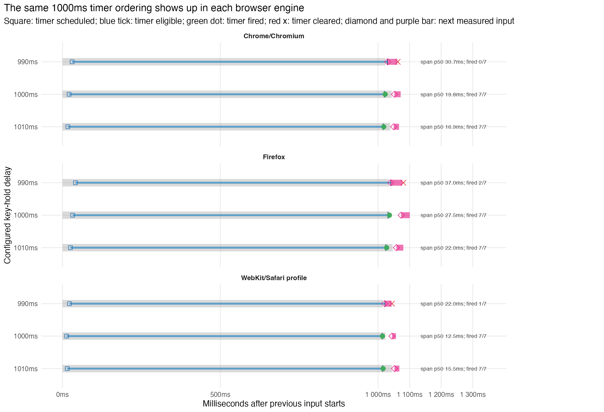

What the diagnostic trace proves:

1. A Gutenberg input schedules the rich-text persistence timer for `1000ms`
   later.
2. The benchmark is not doing "keypress, then wait"; it is holding the previous
   synthetic key down during the delay.
3. Near the one-second boundary, the browser event loop has two possible next
   tasks: the timer callback or the next keyboard/input work.
4. If the next input wins, Gutenberg clears and reschedules the timer before the
   callback runs.
5. If the timer wins, the callback dispatches
   `MARK_LAST_CHANGE_AS_PERSISTENT` before the current input begins.
6. In these traces, the timer-first rows have lower measured next-input listener
   spans.

What the diagnostic trace does not prove is just as important: it does not prove
that identical work moved from the input task into the timer task, and it does
not identify the exact lower-level callback, selector, React commit, or
subscriber state change that makes the following input span smaller.

The diagnostic run shows that ordering directly:

| Browser         |    Delay | Timer before input | Input span p50 |
| --------------- | -------: | -----------------: | -------------: |
| Chrome/Chromium |  `990ms` |              `0/7` |       `30.7ms` |
| Chrome/Chromium | `1000ms` |              `7/7` |       `19.8ms` |
| Chrome/Chromium | `1010ms` |              `7/7` |       `16.9ms` |
| Firefox         |  `990ms` |              `2/7` |       `37.0ms` |
| Firefox         | `1000ms` |              `7/7` |       `27.5ms` |
| Firefox         | `1010ms` |              `7/7` |       `22.0ms` |
| WebKit/Safari   |  `990ms` |              `1/7` |       `22.0ms` |
| WebKit/Safari   | `1000ms` |              `7/7` |       `12.5ms` |
| WebKit/Safari   | `1010ms` |              `7/7` |       `15.5ms` |

The `990ms` rows are not perfectly pure because the instrumentation itself adds
some overhead and jitter; Firefox had two of seven retained cycles where the
timer slipped in before the next input, and WebKit had one. But the median
ordering is still the same: below the boundary, the measured input usually
clears the timer; at and above the boundary, the timer callback runs first in
all retained cycles.

This explains how Firefox can show the same qualitative dip even though it has no
Chromium `EventDispatch` trace. The application-level ordering is shared:
Gutenberg's `1000ms` timer sometimes runs before the next measured input and
sometimes gets cleared by that input. Chrome `EventDispatch` measures one
accounting window around that ordering change; the Firefox/WebKit listener
traces measure another. Both metrics show a smaller next-input span when the
timer ran first, but that is still an observation, not a complete mechanism.

This diagnostic trace is for causality, not for absolute score comparison. The
in-page wrappers perturb timing, and the measured spans here should not replace
the lower-overhead sweep plots.

## Reasoning Audit

The conservative explanation is:

1. The code creates a `1000ms` RichText persistence timer after text input.
2. Playwright's delayed typing holds a key down during the delay instead of
   completing a keypress and then sleeping.
3. Around `1000ms`, the timer callback and the next input can race.
4. The traces show two orderings: input-first, where the input clears the timer,
   and timer-first, where `MARK_LAST_CHANGE_AS_PERSISTENT` runs before the next
   input.
5. The measured next-input/event span is smaller in timer-first rows.
6. Rewriting the timer to `230ms`, `500ms`, and `710ms` moves the low-latency
   band, so the timer controls the boundary.

The earlier stronger explanation failed this audit:

-   A Linus Torvalds-style code review would reject "the same work moved
    earlier" because the traces show separate tasks and action ordering, not
    identity of work.
-   A Kyle Kingsbury-style measurement review would reject "persistent state
    makes the next input faster" because that is a causal claim without an
    isolating intervention.
-   A Dan Luu-style benchmark review would reject treating the event-only value
    as user latency because timer tasks, key holds, browser scheduling, and
    subscriber fanout all sit outside or around that accounting window.

The useful falsification tests are narrower, and the later sections now include
several of them:

-   replace the timer callback with no-op, cheap action, pure busy-wait, one-sided
    typing-state changes, a raw unknown store action, and non-marker
    subscriber-fanout interventions;
-   trace high-fanout `useSelect` subscribers in both the timer task and the
    following input task;
-   compute a broader full-cycle wall-time metric, from one input start through
    the timer task and the next input end. The paired metric below already adds
    timer callback cost to each retained key, but it intentionally does not
    count idle waiting time.

## Marker Interventions

I then ran falsification tests against the timer explanation. The first two
kept the `1000ms` callback but replaced the bound
`__unstableMarkLastChangeAsPersistent()` function with either a no-op or
`__unstableMarkNextChangeAsNotPersistent()`. Later audits added sharper probes:

1. run the real marker, then immediately dispatch
   `__unstableMarkNextChangeAsNotPersistent()`;
2. replace the marker with a raw unknown `core/block-editor` action dispatched
   through the registry's underlying store, to test whether a dispatch with no
   state change and no semantic Gutenberg effect is enough;
3. replace the marker with `20ms` and `40ms` busy waits, to test whether merely
   occupying the timer task is enough;
4. replace the marker with restored non-typing state toggles:
   `toggleSelection( false ); toggleSelection( true )`,
   `setTemplateValidity( false ); setTemplateValidity( true )`, and
   `toggleBlockHighlight( clientId, true ); toggleBlockHighlight( clientId,
   false )`;
5. replace the marker with `startTyping()` alone, which is effectively a no-op
   if the editor is already typing;
6. replace the marker with `stopTyping()` alone, which creates a real
   `core/block-editor` state change but leaves the next input to restart typing;
7. replace the marker with `stopTyping(); startTyping()`, which creates real
   block-editor subscriber fanout and restores `isTyping()` to its original
   value before the next key.

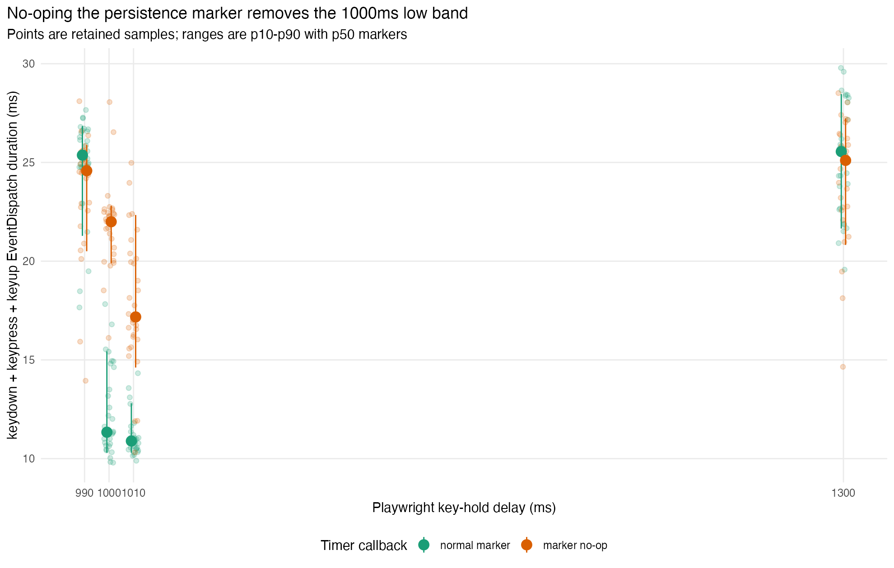

The targeted runs used the same delays, rounds, and sample counts.

| Timer callback                         |    Delay |   n | Latency p50 | `keypress` p50 |
| -------------------------------------- | -------: | --: | ----------: | -------------: |
| normal marker                          |  `990ms` |  30 |    `25.4ms` |       `24.3ms` |
| normal marker                          | `1000ms` |  30 |    `11.3ms` |       `11.0ms` |
| normal marker                          | `1010ms` |  30 |    `10.9ms` |       `10.4ms` |
| normal marker                          | `1300ms` |  30 |    `25.5ms` |       `24.5ms` |
| marker no-op                           | `1000ms` |  30 |    `22.0ms` |       `21.1ms` |
| marker no-op                           | `1010ms` |  30 |    `17.2ms` |       `16.6ms` |
| mark next not persistent               | `1000ms` |  30 |    `33.6ms` |       `32.7ms` |
| mark next not persistent               | `1010ms` |  30 |    `30.7ms` |       `29.7ms` |
| mark last, then force next transient   |  `990ms` |  30 |    `24.5ms` |       `23.5ms` |
| mark last, then force next transient   | `1000ms` |  30 |    `11.7ms` |       `11.1ms` |
| mark last, then force next transient   | `1010ms` |  30 |    `11.4ms` |       `11.0ms` |
| mark last, then force next transient   | `1300ms` |  30 |    `24.6ms` |       `23.4ms` |
| busy wait 20ms                         | `1000ms` |  30 |    `17.7ms` |       `17.1ms` |
| busy wait 20ms                         | `1010ms` |  30 |    `17.9ms` |       `17.3ms` |
| busy wait 40ms                         | `1000ms` |  30 |    `16.1ms` |       `15.7ms` |
| busy wait 40ms                         | `1010ms` |  30 |    `16.1ms` |       `15.6ms` |
| toggle selection                       | `1000ms` |  30 |    `14.6ms` |       `14.1ms` |
| toggle selection                       | `1010ms` |  30 |    `14.6ms` |       `14.2ms` |
| toggle template validity               | `1000ms` |  30 |    `14.6ms` |       `14.2ms` |
| toggle template validity               | `1010ms` |  30 |    `15.6ms` |       `15.2ms` |
| toggle block highlight                 | `1000ms` |  30 |    `14.4ms` |       `14.0ms` |
| toggle block highlight                 | `1010ms` |  30 |    `14.0ms` |       `13.7ms` |
| start typing                           | `1000ms` |  30 |    `24.4ms` |       `23.3ms` |
| start typing                           | `1010ms` |  30 |    `19.5ms` |       `18.8ms` |
| stop typing                            | `1000ms` |  30 |    `26.8ms` |       `26.5ms` |
| stop typing                            | `1010ms` |  30 |    `27.2ms` |       `26.7ms` |
| stop/start typing                      |  `990ms` |  30 |    `24.7ms` |       `23.6ms` |
| stop/start typing                      | `1000ms` |  30 |    `11.0ms` |       `10.6ms` |
| stop/start typing                      | `1010ms` |  30 |    `10.8ms` |       `10.5ms` |
| stop/start typing                      | `1300ms` |  30 |    `24.3ms` |       `23.2ms` |

Splitting the same `1000ms` retained samples by browser key event makes the
location of the intervention effect explicit:

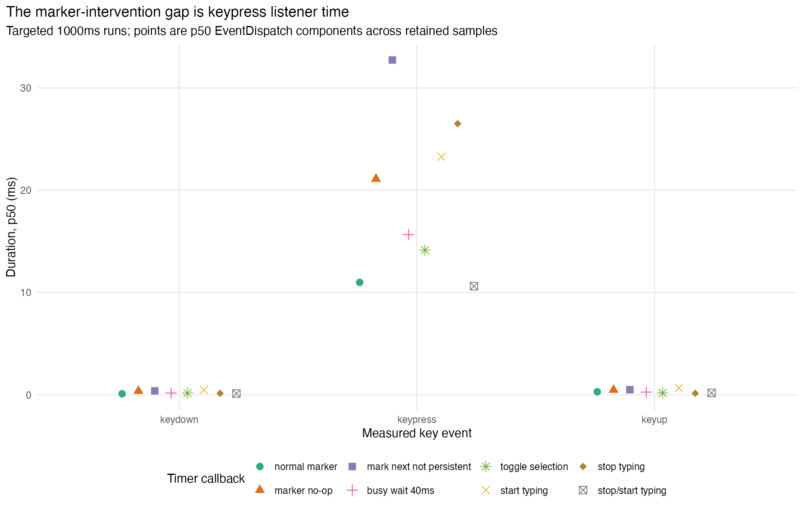

| Timer callback             |   n | Latency p50 | `keydown` p50 | `keypress` p50 | `keyup` p50 |
| -------------------------- | --: | ----------: | -------------: | --------------: | -----------: |
| normal marker              |  30 |    `11.3ms` |        `0.1ms` |        `11.0ms` |      `0.3ms` |
| marker no-op               |  30 |    `22.0ms` |        `0.4ms` |        `21.1ms` |      `0.5ms` |
| mark next not persistent   |  30 |    `33.6ms` |        `0.4ms` |        `32.7ms` |      `0.5ms` |
| busy wait 40ms             |  30 |    `16.1ms` |        `0.2ms` |        `15.7ms` |      `0.3ms` |
| toggle selection           |  30 |    `14.6ms` |        `0.2ms` |        `14.1ms` |      `0.2ms` |
| start typing               |  30 |    `24.4ms` |        `0.5ms` |        `23.3ms` |      `0.7ms` |
| stop typing                |  30 |    `26.8ms` |        `0.2ms` |        `26.5ms` |      `0.2ms` |
| stop/start typing          |  30 |    `11.0ms` |        `0.1ms` |        `10.6ms` |      `0.2ms` |

That disconfirms a large class of explanations. The difference is not
`keydown`, `keyup`, the release after the held key, or a missing key-release
measurement. The meaningful movement is in the measured `keypress` component.

I then reran a small `1000ms` probe with identical event-listener tracing for
normal marker, marker no-op, restored selection, and stop/start typing. This
corrects the wording above: the browser-trace component is labeled `keypress`,
but the DOM `keypress` listeners themselves are not where the time goes.

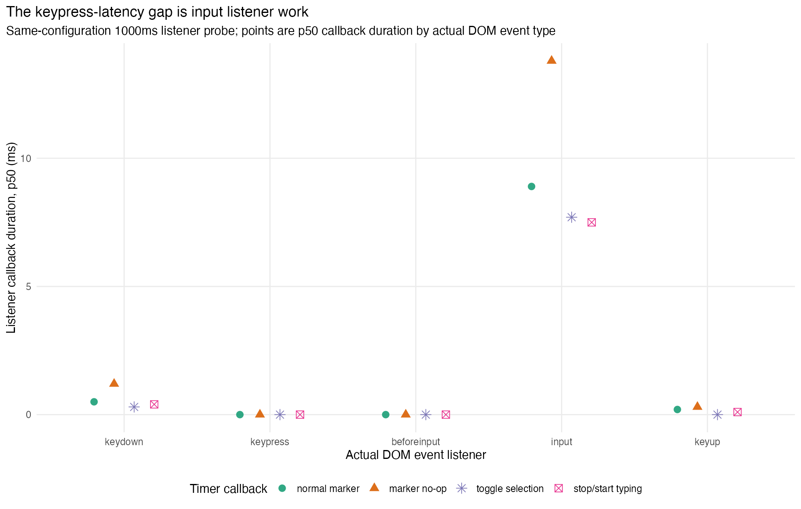

| Timer callback     | Benchmark `keypress` p50 | DOM `keypress` listeners | DOM `input` listeners | RichText `onInput` listener |
| ------------------ | -----------------------: | -----------------------: | --------------------: | --------------------------: |
| normal marker      |                 `12.1ms` |                  `0.0ms` |               `8.9ms` |                     `8.7ms` |
| marker no-op       |                 `19.8ms` |                  `0.0ms` |              `13.8ms` |                    `13.5ms` |
| toggle selection   |                  `9.7ms` |                  `0.0ms` |               `7.7ms` |                     `7.5ms` |
| stop/start typing  |                  `9.9ms` |                  `0.0ms` |               `7.5ms` |                     `7.4ms` |

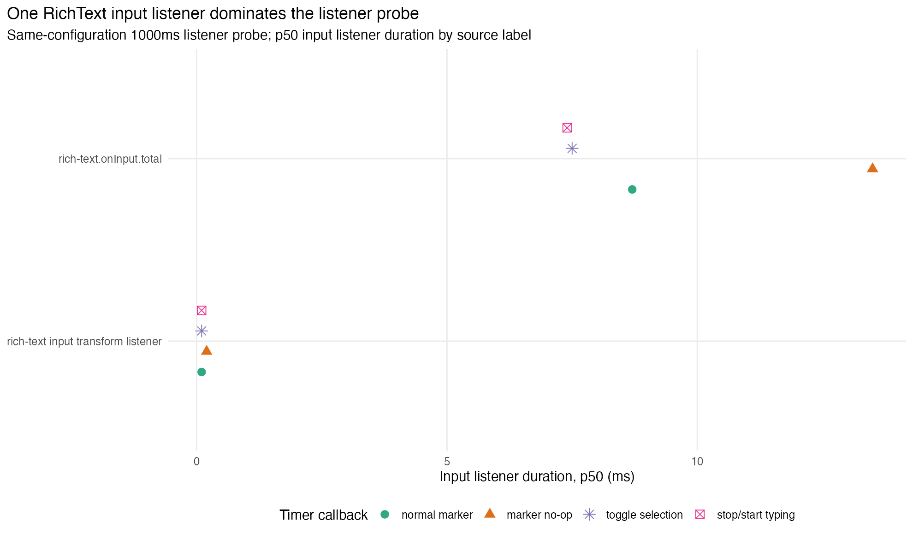

This confirms that "keypress" is an accounting label for the measured
character-insertion slice, not evidence that Gutenberg's `keypress` callbacks
are expensive. The expensive event-listener callback is the actual DOM `input`
listener, and within that listener the p50-visible work is overwhelmingly
RichText's `rich-text.onInput.total` path. The secondary RichText input
transform listener is `0.1-0.2ms` p50. This also explains why the Firefox/WebKit
results can have the same qualitative dip even though the original explanation
was phrased in terms of Chrome `EventDispatch`: Gutenberg's input handler and
state history are changing; Chrome's trace just labels the measured slice in a
particular way.

This disconfirms several simple theories:

-   "Timer callback alone" is false. In the no-op run, the `1000ms` timers still
    fired before the following input, but the following input did not enter the
    normal `~11ms` fast band.
-   "Any real timer-side action is enough" is false. Replacing the marker with
    `__unstableMarkNextChangeAsNotPersistent()` still ran a real action from
    the timer callback, but the action was near-zero-cost and the following
    input stayed slow.
-   "Any raw store dispatch is enough" is false. The `raw unknown action`
    diagnostic dispatches an unknown action directly to the `core/block-editor`
    Redux store from the timer callback. The reducer returns the same root state,
    `rootSubscribe` sees no effective state change, the callback records no
    listener fanout, and the following input stays with the no-op slow band in
    the trace-heavy run.
-   "Timer-task duration is enough" is false. A `20ms` busy wait drops the
    `1000ms` p50 from the no-op's `22.0ms` to `17.7ms`, and a `40ms` busy wait
    drops it to `16.1ms`, but neither reaches the normal marker or stop/start
    `~11ms` band. Timer duration and browser task scheduling appear to
    contribute, but they do not explain the full effect.
-   "Typing state is the only relevant state" is false. The restored selection,
    template-validity, and block-highlight toggles all leave `isTyping` and
    `isLastBlockChangePersistent()` unchanged at the callback boundary, but they
    still lower the `1000ms` p50 to about `14-15ms`.
-   "Any restored block-editor state toggle is enough for the full low band" is
    also false. Those generic toggles move most of the way from no-op to
    stop/start, but they do not match the `~11ms` band.
-   "`startTyping()` dispatch is enough" is false. In these runs the editor was
    already typing before the callback, so `startTyping()` did no meaningful
    state transition and the `1000ms` p50 stayed slow at `24.4ms`.
-   "One state-changing `core/block-editor` fanout is enough" is false.
    `stopTyping()` alone changes `isTyping` from true to false in the timer
    callback, but then the next measured input has to dispatch `startTyping()`
    to return to the normal typing state. That case stays slow at `26.8ms`.
-   "The real persistence marker is uniquely necessary" is false. Replacing it
    with `stopTyping(); startTyping()` also produced the `1000ms` / `1010ms`
    low EventDispatch band.
-   "`onChange` is necessary" is false. The stop/start run keeps the following
    retained input on the `onInput` path in the span trace and is still fast.

The action trace also corrects a subtler mistake. The normal marker action is
not important only when it visibly flips `isLastBlockChangePersistent()`. In the
normal targeted run, all retained `1000ms`, `1010ms`, and `1300ms` delay runs
had marker actions before the next input, but those marker actions usually did
not change the visible `isPersistent` / `isTyping` selector state. One proven
effect is that they create a real block-editor subscriber pass. The busy-wait
runs prove that wall-clock time spent in the timer task can only explain part of
the drop. The `startTyping()` run proves that dispatching a no-op-ish typing
action is not enough. The `stopTyping()` run proves that a single state-changing
fanout is not enough if it leaves the next input to repair the state. In the
stop/start run, the timer callback changes `isTyping` from true to false and
then back to true before the next key, with no persistent-marker state change,
and that is the non-marker probe that matches the full low band.

The dense timer-to-key gap probe makes that statement narrower. This run used
one diagnostic round with six retained samples per delay, delays
`1000..1100ms` in `10ms` steps plus `1150ms`, `1200ms`, and `1300ms`, and the
same timer/data tracing used by the paired action analysis.

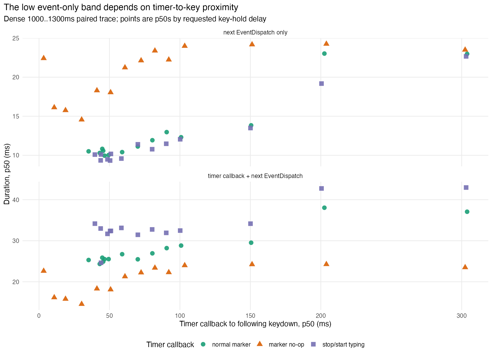

Selected p50s:

| Timer callback        |    Delay | Marker to keydown | Event-only p50 | Timer callback p50 | Timer-inclusive p50 | Keydown state       |
| --------------------- | -------: | ----------------: | -------------: | -----------------: | ------------------: | ------------------- |
| normal marker         | `1010ms` |          `35.2ms` |       `10.5ms` |           `14.6ms` |            `25.3ms` | persistent, typing  |
| normal marker         | `1100ms` |         `100.8ms` |       `12.3ms` |           `16.3ms` |            `28.8ms` | persistent, typing  |
| normal marker         | `1200ms` |         `202.5ms` |       `23.0ms` |           `14.6ms` |            `38.0ms` | persistent, typing  |
| normal marker         | `1300ms` |         `303.8ms` |       `23.0ms` |           `15.0ms` |            `37.1ms` | persistent, typing  |
| marker no-op          | `1000ms` |           `3.3ms` |       `22.4ms` |            `0.0ms` |            `22.6ms` | mostly transient    |
| marker no-op          | `1030ms` |          `30.2ms` |       `14.6ms` |            `0.0ms` |            `14.6ms` | transient, typing   |
| stop/start typing     | `1010ms` |          `43.8ms` |        `9.3ms` |           `20.8ms` |            `33.0ms` | transient, typing   |
| stop/start typing     | `1200ms` |         `200.5ms` |       `19.2ms` |           `22.7ms` |            `42.7ms` | transient, typing   |
| stop/start typing     | `1300ms` |         `303.1ms` |       `22.7ms` |           `20.4ms` |            `43.0ms` | transient, typing   |

This disconfirms two tempting explanations. First, the normal marker run is in
the same coarse selector state at keydown (`isLastBlockChangePersistent() ===
true` and `isTyping() === true`) at `1010ms`, `1200ms`, and `1300ms`, but the
next input is low only when the timer callback is close to that keydown. Coarse
state at keydown is therefore not sufficient. Second, persistence is not
necessary: `stopTyping(); startTyping()` has `isLastBlockChangePersistent() ===
false` at the following keydown for nearly all retained rows and still matches
the low band while the marker-to-key gap is short.

It also limits the timer-ordering theory. The no-op callback can run just a few
milliseconds before the next keydown and still does not reproduce the
normal-marker or stop/start `~10-11ms` band. There is some partial movement in
the no-op scan around `1010..1030ms`, which is consistent with the busy-wait
results: scheduling and nearby browser-task boundaries contribute. This scan
shows that a short zero-duration no-op is insufficient; the later task-end probe
shows that the stronger "effective block-editor state change is required" claim
is false.

This does not prove the lower-level reason for the decay. The honest statement is
that the event-only metric is sensitive to recent timer-side activity before
Gutenberg's input path, not that the same work literally moved from one key event
into the timer task. The timer-inclusive column stays high, and by
`1200..1300ms` it is much worse than the event-only low band.

I then ran a stronger causality check: keep the Playwright key hold fixed at
`1300ms`, but rewrite Gutenberg's `1000ms` timer to fire at different times
inside that same hold.

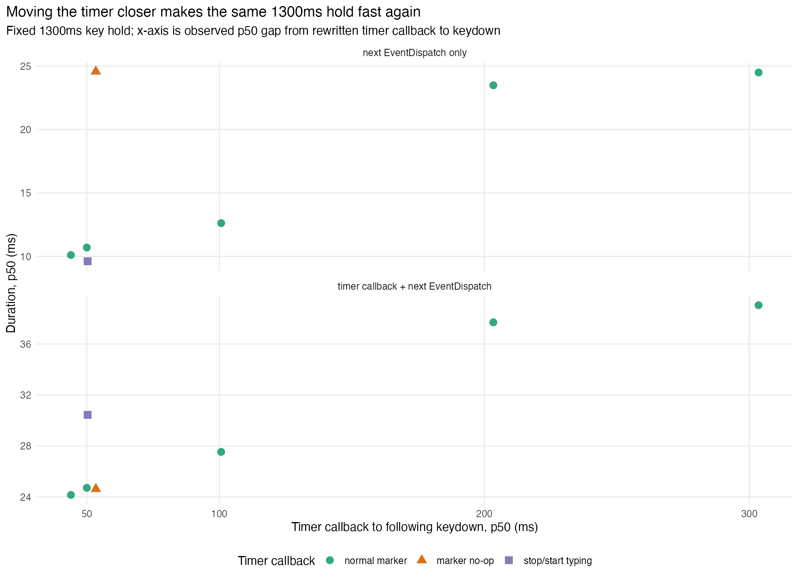

Selected p50s:

| Timer callback    | Timer setting | Marker to keydown | Event-only p50 | Timer callback p50 | Timer-inclusive p50 |
| ----------------- | ------------: | ----------------: | -------------: | -----------------: | ------------------: |
| normal marker     |      `1000ms` |         `303.5ms` |       `24.5ms` |           `14.3ms` |            `39.1ms` |
| normal marker     |      `1100ms` |         `203.4ms` |       `23.5ms` |           `14.0ms` |            `37.7ms` |
| normal marker     |      `1200ms` |         `100.7ms` |       `12.6ms` |           `14.5ms` |            `27.5ms` |
| normal marker     |      `1250ms` |          `50.0ms` |       `10.7ms` |           `14.6ms` |            `24.7ms` |
| normal marker     |      `1270ms` |          `44.0ms` |       `10.1ms` |           `11.9ms` |            `24.2ms` |
| marker no-op      |      `1250ms` |          `53.4ms` |       `24.6ms` |            `0.1ms` |            `24.6ms` |
| stop/start typing |      `1250ms` |          `50.3ms` |        `9.6ms` |           `20.7ms` |            `30.4ms` |

This confirms three things more cleanly than the gap scan alone:

1. The later `1300ms` high plateau is not caused by the key being held for
   `1300ms` by itself. The exact same requested key hold becomes fast again when
   the real marker is moved close to the next key.
2. The effect is not tied to the absolute `1000ms` timer value. Moving the timer
   moves the low band inside a fixed `1300ms` hold.
3. The close timer boundary is not sufficient by itself. The `1250ms` no-op
   callback fired about `53ms` before keydown and stayed slow; the `1250ms`
   stop/start callback fired about `50ms` before keydown and was fast.

At this point the strongest supported statement was that a short effective
block-editor fanout is sufficient, and that a short zero-duration no-op callback
is not.

I then tested whether "effective Gutenberg fanout" is actually required, or
whether a long timer task ending close to the next key can also perturb the
event-only measurement. The new intervention modes are deliberately artificial:

-   `noop-then-busy-wait-150`: do not dispatch a meaningful Gutenberg action;
    just hold the timer task open for `150ms`.
-   `busy-wait-20` and `busy-wait-40`: hold the timer task open for shorter
    pure-JS intervals and schedule them to end near the same following keydown.
-   `worker-busy-wait-150`: start a Web Worker from the timer callback and have
    the worker spin for `150ms`; the timer callback itself returns quickly and
    the worker completion is recorded separately.
-   `worker-busy-wait-150-no-message`: same worker CPU spin, but the worker
    closes itself without posting a completion message back to the main thread.
-   `worker-busy-wait-20-no-message`, `worker-busy-wait-40-no-message`, and
    `worker-busy-wait-80-no-message`: shorter no-message worker CPU spins, each
    scheduled to end about `50ms` before keydown.
-   `worker-delay-150`: worker waits for `150ms` and posts a message back, but
    does no CPU spin.
-   `worker-delay-150-no-message`: worker waits for `150ms` and closes itself
    without CPU spin or a main-thread completion message.
-   `external-cpu-150-no-message`: ask Playwright's Node process to spawn a
    short-lived child process that burns CPU for `150ms`; the page records the
    expected CPU window but receives no completion message.
-   `external-cpu-20-no-message`, `external-cpu-40-no-message`, and
    `external-cpu-80-no-message`: shorter spawn-per-timer external child-process
    CPU burns, scheduled to end about `50ms` before keydown by the page's
    expected-duration accounting.
-   `external-delay-150-no-message`: spawn the same kind of short-lived child
    process, but have it wait `150ms` and exit without intentional CPU work.
-   `external-persistent-cpu-20-no-message`,
    `external-persistent-cpu-40-no-message`,
    `external-persistent-cpu-80-no-message`, and
    `external-persistent-cpu-150-no-message`: keep a Node child process alive
    before typing starts, then send it a CPU-burn command from the timer
    callback. This removes child-process startup from the timer boundary.
-   `external-persistent-delay-150-no-message`: send a prestarted child process a
    no-CPU delay command, to test whether IPC and child lifetime are enough.
-   `external-background-cpu-noop`: keep a child process burning CPU continuously
    before typing starts; the rich-text timer callback itself is still a no-op.
-   `external-background-cpu-2-noop`, `external-background-cpu-4-noop`, and
    `external-background-cpu-8-noop`: keep two, four, or eight child processes
    burning CPU continuously before typing starts; the rich-text timer callback
    itself is still a no-op.
-   `external-background-nice-cpu-noop`: keep one `nice +20` child process
    burning CPU continuously before typing starts; the rich-text timer callback
    itself is still a no-op.
-   `external-background-taskpolicy-cpu-noop`,
    `external-background-taskpolicy-cpu-4-noop`, and
    `external-background-taskpolicy-cpu-8-noop`: keep one, four, or eight macOS
    `taskpolicy -b` child processes burning CPU continuously before typing
    starts; the rich-text timer callback itself is still a no-op.
-   `external-background-taskpolicy-utility-cpu-noop`,
    `external-background-taskpolicy-qos-background-cpu-noop`, and
    `external-background-taskpolicy-maintenance-cpu-noop`: keep one child
    process burning CPU continuously under macOS `taskpolicy -c utility`,
    `taskpolicy -c background`, or `taskpolicy -c maintenance` before typing
    starts; the rich-text timer callback itself is still a no-op.
-   `external-background-idle-noop`: keep an idle child process alive before
    typing starts; the rich-text timer callback itself is still a no-op.
-   `delayed-noop-150`: main thread schedules a delayed no-op task near the
    following keydown without doing CPU work.
-   `normal-then-busy-wait-150`: run the normal marker, then hold the timer task
    open for `150ms`.
-   `stop-start-typing-then-busy-wait-150`: run the stop/start typing
    intervention, then hold the timer task open for `150ms`.

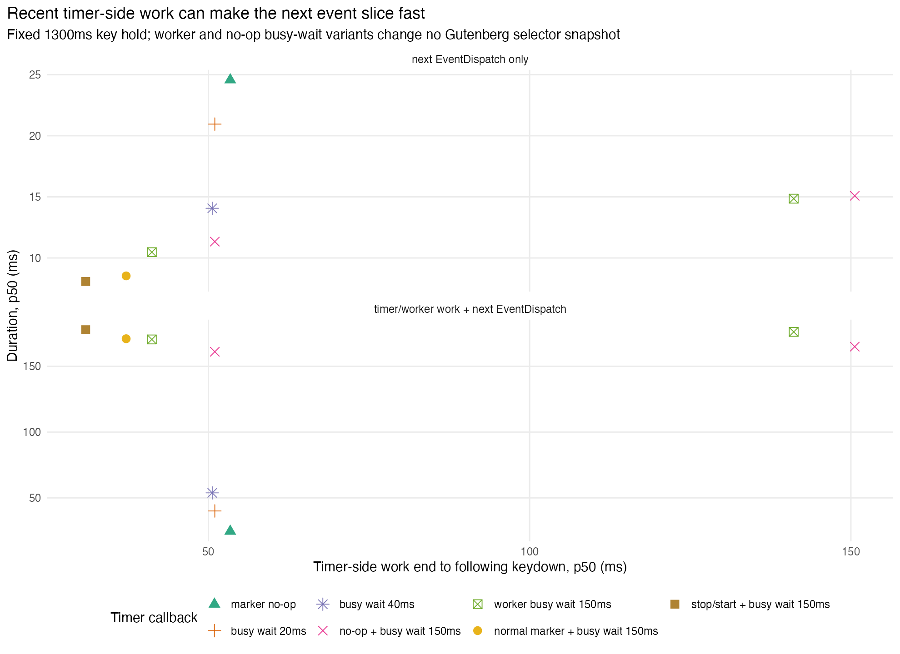

Selected p50s:

| Timer callback                 | Timer setting | Task end to keydown | Event-only p50 | Work p50 | Work-inclusive p50 |
| ------------------------------ | ------------: | ------------------: | -------------: | -------: | -----------------: |
| marker no-op                   |      `1250ms` |            `53.4ms` |       `24.6ms` |  `0.0ms` |           `24.6ms` |
| no-op + busy wait `150ms`      |      `1000ms` |           `150.6ms` |       `15.1ms` | `150.0ms` |          `164.9ms` |
| busy wait `20ms`               |      `1230ms` |            `51.0ms` |       `21.0ms` | `20.0ms` |           `40.1ms` |
| busy wait `40ms`               |      `1210ms` |            `50.6ms` |       `14.1ms` | `40.0ms` |           `53.8ms` |
| no-op + busy wait `150ms`      |      `1100ms` |            `51.0ms` |       `11.3ms` | `150.0ms` |          `161.0ms` |
| worker busy wait `150ms`       |      `1000ms` |           `141.1ms` |       `14.9ms` | `161.1ms` |          `176.1ms` |
| worker busy wait `150ms`       |      `1100ms` |            `41.2ms` |       `10.5ms` | `160.1ms` |          `170.4ms` |
| worker busy wait, no message   |      `1230ms` |            `50.7ms` |       `15.5ms` | `21.7ms` |           `37.3ms` |
| worker busy wait, no message   |      `1210ms` |            `50.4ms` |       `12.8ms` | `41.6ms` |           `54.3ms` |
| worker busy wait, no message   |      `1170ms` |            `50.5ms` |       `11.2ms` | `81.5ms` |           `92.7ms` |
| worker busy wait, no message   |      `1100ms` |            `50.1ms` |       `10.3ms` | `151.2ms` |          `161.6ms` |
| worker busy wait, no message   |      `1000ms` |           `150.4ms` |       `14.9ms` | `151.5ms` |          `166.4ms` |
| worker busy wait, no message   |       `900ms` |           `253.3ms` |       `24.6ms` | `151.6ms` |          `175.8ms` |
| external CPU, no message       |      `1100ms` |            `50.0ms` |        `8.9ms` | `150.2ms` |          `159.1ms` |
| external CPU, no message       |      `1000ms` |           `150.5ms` |       `12.6ms` | `150.2ms` |          `162.8ms` |
| external CPU, no message       |       `900ms` |           `252.9ms` |       `22.7ms` | `150.2ms` |          `172.6ms` |
| external CPU, no message       |      `1230ms` |            `50.2ms` |       `10.4ms` |  `20.3ms` |           `30.7ms` |
| external CPU, no message       |      `1210ms` |            `49.9ms` |        `9.8ms` |  `40.3ms` |           `50.0ms` |
| external CPU, no message       |      `1170ms` |            `50.0ms` |        `8.8ms` |  `80.3ms` |           `89.1ms` |
| external delay, no message     |      `1100ms` |            `52.5ms` |       `22.2ms` | `150.3ms` |          `172.5ms` |
| prestarted external CPU        |      `1230ms` |            `51.5ms` |       `19.0ms` |  `20.4ms` |           `39.0ms` |
| prestarted external CPU        |      `1210ms` |            `51.0ms` |       `14.0ms` |  `40.3ms` |           `54.2ms` |
| prestarted external CPU        |      `1170ms` |            `50.5ms` |       `12.1ms` |  `80.3ms` |           `92.3ms` |
| prestarted external CPU        |      `1100ms` |            `50.4ms` |       `11.3ms` | `150.3ms` |          `161.6ms` |
| prestarted external delay      |      `1100ms` |            `53.1ms` |       `23.3ms` | `150.3ms` |          `173.9ms` |
| background CPU x1 + no-op      |      `1250ms` |            `50.6ms` |        `9.1ms` |   `0.0ms` |            `9.1ms` |
| background CPU x2 + no-op      |      `1250ms` |            `50.4ms` |       `10.0ms` |   `0.0ms` |           `10.0ms` |
| background CPU x4 + no-op      |      `1250ms` |            `51.1ms` |       `10.3ms` |   `0.0ms` |           `10.3ms` |
| background CPU x8 + no-op      |      `1250ms` |            `51.4ms` |       `10.4ms` |   `0.0ms` |           `10.4ms` |
| nice +20 CPU x1 + no-op        |      `1250ms` |            `50.6ms` |        `9.3ms` |   `0.0ms` |            `9.3ms` |
| taskpolicy -b CPU x1 + no-op   |      `1250ms` |            `52.5ms` |       `24.6ms` |   `0.0ms` |           `24.7ms` |
| taskpolicy -b CPU x4 + no-op   |      `1250ms` |            `52.4ms` |       `24.0ms` |   `0.0ms` |           `24.1ms` |
| taskpolicy -b CPU x8 + no-op   |      `1250ms` |            `52.3ms` |       `24.2ms` |   `0.0ms` |           `24.2ms` |
| taskpolicy -c utility + no-op   |      `1250ms` |            `50.8ms` |        `9.4ms` |   `0.0ms` |            `9.4ms` |
| taskpolicy -c background + no-op |     `1250ms` |            `52.9ms` |       `24.2ms` |   `0.0ms` |           `24.2ms` |
| taskpolicy -c maintenance + no-op |    `1250ms` |            `52.4ms` |       `24.7ms` |   `0.0ms` |           `24.7ms` |
| background idle + no-op timer  |      `1250ms` |            `53.3ms` |       `24.2ms` |   `0.0ms` |           `24.3ms` |
| worker delay, no CPU           |      `1100ms` |            `34.9ms` |       `24.7ms` | `169.1ms` |          `193.8ms` |
| worker delay, no message       |      `1100ms` |            `52.6ms` |       `24.5ms` | `151.3ms` |          `175.1ms` |
| delayed no-op                  |      `1100ms` |            `50.5ms` |       `24.4ms` | `152.6ms` |          `176.6ms` |
| normal marker + busy wait      |      `1100ms` |            `37.2ms` |        `8.5ms` | `162.8ms` |          `170.9ms` |
| stop/start typing + busy wait  |      `1100ms` |            `30.9ms` |        `8.1ms` | `170.0ms` |          `177.7ms` |

The no-op busy-wait rows changed no coarse Gutenberg selector snapshot:
`isLastBlockChangePersistent()`, `isTyping()`, block count, and selected block
ID were unchanged before and after the callback in all retained intervention
events. That disconfirms the strong version of the "effective block-editor fanout
is required" theory.

The updated model is narrower and less semantic:

1. A zero-duration timer callback, even very close to keydown, is not enough.
2. A short effective block-editor fanout close to keydown is sufficient.
3. A long pure-JS timer task close to keydown is also sufficient, even with no
   Gutenberg state transition.
4. A long off-main-thread worker spin is also sufficient when it finishes close
   to keydown. It remains sufficient even when the worker never posts a
   completion message back to the main thread.
5. A short-lived external Node child-process CPU spin is also sufficient when it
   finishes close to keydown. That disconfirms "browser renderer-local work is
   required" and points to a broader CPU/scheduler state effect. Its
   duration-sweep points are not perfectly calibrated, because child-process
   startup CPU is not included in the page's expected-duration timestamp.
6. Duration matters as well as proximity. At a roughly `51ms` task-end gap,
   `20ms`, `40ms`, and `150ms` pure busy waits form a descending event-only
   sequence: `21.0ms`, `14.1ms`, and `11.3ms`.
7. Off-main-thread worker CPU has the same duration response without a main
   thread completion message: `20ms`, `40ms`, `80ms`, and `150ms` worker spins
   produce `15.5ms`, `12.8ms`, `11.2ms`, and `10.3ms` event-only p50s.
8. Prestarted external child-process CPU has the same cleaner dose response
   after process startup is removed from the timer boundary: `20ms`, `40ms`,
   `80ms`, and `150ms` produce `19.0ms`, `14.0ms`, `12.1ms`, and `11.3ms`
   event-only p50s. The prestarted no-CPU delay control stays slow at `23.3ms`,
   so IPC and child lifetime are not sufficient.
9. Continuous external background CPU is sufficient even when the timer callback
   is a zero-duration no-op. The paired timer/no-op event itself has `0ms` p50
   work, but the following event-only p50 is `9.1ms`. The idle-child control with
   the same no-op timer is `24.2ms`. One busy child is enough: two, four, and
   eight busy children stay low at `10.0ms`, `10.3ms`, and `10.4ms`, slightly
   slower than one child and consistent with mild contention rather than
   background CPU monotonically improving latency. But not all CPU-burning
   children are equivalent: a `nice +20` child stays fast at `9.3ms`, while
   `taskpolicy -b` children stay slow at `24.6ms`, `24.0ms`, and `24.2ms` for
   one, four, and eight children. That disconfirms the overbroad "any CPU burn
   anywhere is sufficient" theory. The QoS-clamp controls split the same way:
   `taskpolicy -c utility` is fast at `9.4ms`, while
   `taskpolicy -c background` and `taskpolicy -c maintenance` are slow at
   `24.2ms` and `24.7ms`.
10. The effect decays with distance from the following key after a finite CPU
   burst stops: no-op + `150ms` busy
   wait ending around `151ms` before keydown is only intermediate, while ending
   around `51ms` before keydown is in the low band. The worker control shows the
   same shape: a no-message `150ms` worker spin is `10.3ms` when it ends about
   `50ms` before keydown, `14.9ms` when it ends about `150ms` before keydown,
   and back on the slow plateau at `24.6ms` when it ends about `253ms` before
   keydown.
11. The external child-process control shows the same decay: `8.9ms`, `12.6ms`,
   and `22.7ms` when its expected CPU burn ends about `50ms`, `151ms`, and
   `253ms` before keydown.
12. The near-key main-thread task is not the mechanism by itself. The
   `worker-delay-150` and `delayed-noop-150` controls both create near-key tasks
   with no CPU spin, and both stay on the slow plateau.
13. Worker creation/lifetime and external child-process lifetime are not the
   mechanism by themselves. The `worker-delay-150-no-message`,
   `external-delay-150-no-message`, and
   `external-persistent-delay-150-no-message` controls keep the lifetime shape
   without intentional CPU spin, and they stay slow.

That points away from a purely Gutenberg-state explanation and toward
CPU/scheduler sensitivity around Gutenberg's input path. It still does not mean
the benchmarked character cycle got cheaper. The work-inclusive values add back
the explicit CPU/delay work; for `150ms` artificial controls they are roughly
`159-194ms`, not the low event-only values.

The duration sweep makes the CPU-work interpretation clearer:

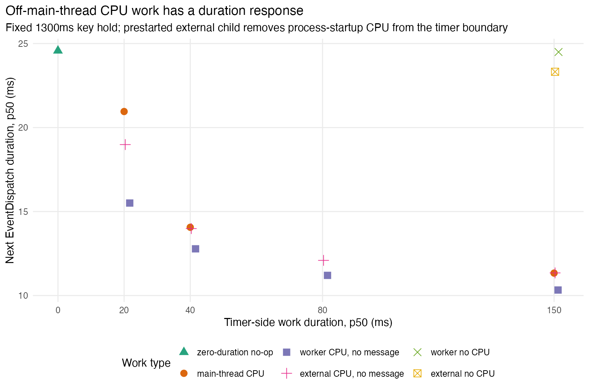

All points in that plot end about `50ms` before keydown. The zero-duration
no-op, no-CPU worker, and no-CPU prestarted external child are slow. Main-thread,
worker, and prestarted external CPU work all move the next event-only slice down
as duration increases. The curves are not identical, especially at `20ms`, but
the monotonic shape confirms that amount of recent CPU work matters even when
that work never posts a main-thread completion message to the page.

The background CPU control separates finite burst proximity from sustained CPU
state:

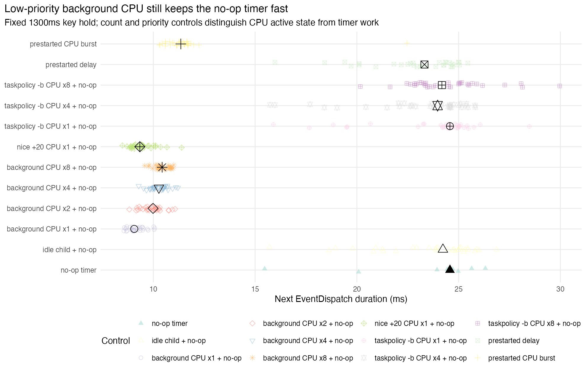

The no-op timer and the idle-child no-op timer are both slow. The same no-op
timer becomes fast when a separate child process is already burning CPU in the
background. This means the low event-only band does not require a timer task, a
worker message, IPC completion, or a finite burst ending just before keydown. The
finite-burst gap-decay results still matter: after CPU activity stops, the effect
decays within a few hundred milliseconds. But continuous CPU activity keeps the
system in the fast regime.

The count sweep makes the system-level interpretation harder to dismiss as an
artifact of one strange child process. On this Apple M3 Max run, one background
CPU child was enough to move the no-op timer case from `24.6ms` to `9.1ms`; two,
four, and eight busy children stayed in the same fast band at `10.0ms`,
`10.3ms`, and `10.4ms`. That does not look like "more work in the timer makes
the next input cheaper", because the timer still does no work. It also does not
look like a many-core saturation effect, because adding more busy children made
the result slightly slower, not faster.

The priority-policy controls make the CPU-state statement narrower. A
`nice +20` child process still reproduces the fast band (`9.3ms` p50), so the
effect does not require normal Unix priority. But macOS `taskpolicy -b` children
do not reproduce it: one, four, and eight busy children stay on the slow plateau
at `24.6ms`, `24.0ms`, and `24.2ms`. A standalone sanity check showed these were
not failed controls: `nice +20 node -e 'while (...)'` consumed about `97%` CPU,
and `taskpolicy -b node -e 'while (...)'` consumed about `94%` CPU. So the
supported claim is not "any external CPU activity makes Gutenberg fast." It is
that recent foreground/ordinary-policy CPU activity can put the browser/editor
path into a faster measured regime, while macOS background-policy CPU activity
does not do that on this machine. Without lower-level power counters I cannot
prove whether the boundary is P-core residency, cluster frequency, QoS, timer
coalescing, or a related scheduler policy; the benchmark now rules out the
broader versions of the theory.

The QoS-clamp controls separate `taskpolicy` itself from the policy being set.
The taskpolicy man page says `-b` uses Darwin background priority, while `-c`
sets a QoS clamp. In this benchmark, `taskpolicy -c utility` behaves like the
ordinary and `nice +20` CPU controls (`9.4ms` p50), while
`taskpolicy -c background` and `taskpolicy -c maintenance` behave like
`taskpolicy -b` (`24.2ms` and `24.7ms`). That disconfirms "`taskpolicy` process
launch changes the control" and "Unix nice level decides the result." The
stronger surviving hypothesis is that ordinary/utility-QoS CPU activity changes
the machine state visible to the foreground browser/editor input path, while
background/maintenance-QoS CPU activity is isolated or de-prioritized enough
that it does not.

The CPU gap-decay sweep confirms the "recent" part:

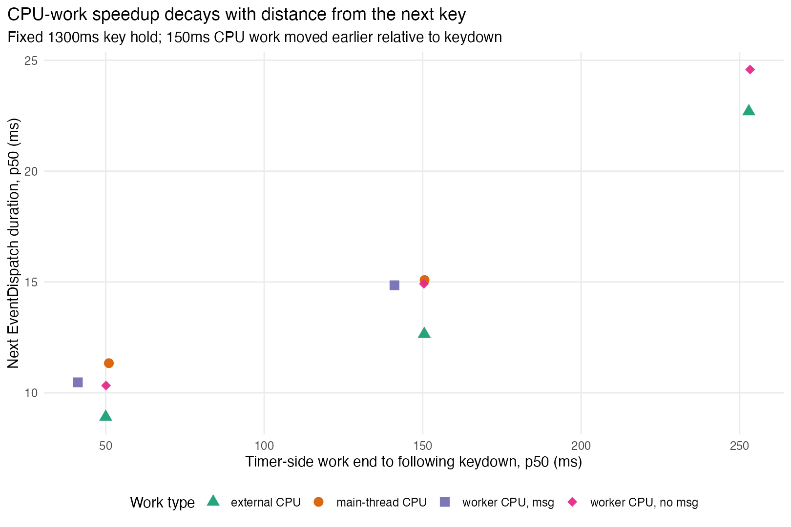

The same `150ms` no-message worker spin is fast only near the next key. Moving
it earlier makes it intermediate and then slow again. A separate Node child
process burning CPU shows the same proximity-sensitive shape, so the effect is
not confined to browser renderer-local worker scheduling. This matters because
it rules out a broad warmup explanation where one worker spin simply leaves the
browser fast for the rest of the delay run. I treat the spawn-per-timer external
process end gaps as approximate: process startup CPU is not timestamped by the
page's expected-duration event. The prestarted-child duration sweep above is the
cleaner evidence that external CPU itself is sufficient.

I also added a native `contenteditable` control with the same rewritten
one-second timer and the same `1300ms` key hold:

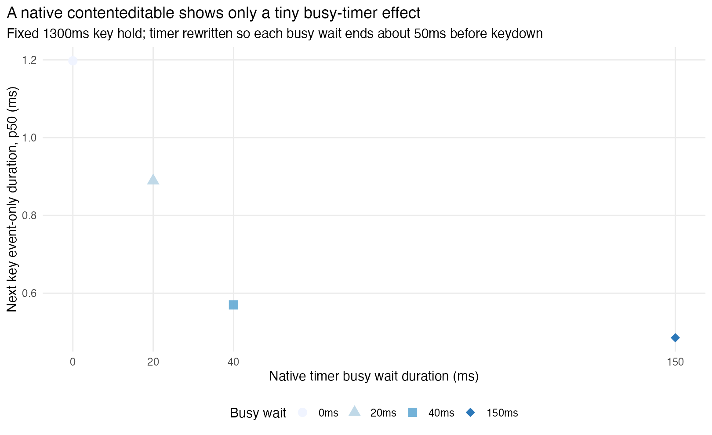

| Native timer work | Timer end to keydown | Event-only p50 |
| ----------------: | -------------------: | -------------: |
|              `0ms` |             `52.4ms` |        `1.20ms` |
|             `20ms` |             `51.3ms` |        `0.89ms` |
|             `40ms` |             `50.2ms` |        `0.57ms` |
|            `150ms` |             `49.8ms` |        `0.49ms` |

The native control moves in the same direction, but the absolute scale is tiny:
less than `1ms` separates the zero-work and `150ms` cases. This disconfirms a
purely native-browser explanation for the Gutenberg cliff. The browser/CPU
state appears to modulate the cost, but the large visible swing needs
Gutenberg's much heavier input path to amplify it.

The `stopTyping()` result has a direct code-level explanation. `ObserveTyping`
installs different DOM listeners depending on `isTyping`: when typing is true,
it installs listeners that can stop typing; when typing is false, it installs
`keypress` / `keydown` listeners that call `startTyping()` for text-field input.
So a timer callback that leaves `isTyping=false` changes the next measured key's
listener work. In the action trace, `stopTyping()` alone is followed by a
`startTyping()` action during the measured key. The `stopTyping(); startTyping()`
intervention runs both parts before the next key, so the next key starts from the
normal `isTyping=true` listener regime.

The raw `stopTyping()` trace shows the sequence, not just the summary statistic.
For one retained `1000ms` sample, the timer-side intervention ran at about
`14650.4ms` and changed `isTyping` from true to false. The next editor-canvas
`keydown` was at `14689.8ms` with `isTyping=false`; the editor-canvas
`keypress` was at `14690.3ms`, still with `isTyping=false`; the
`core/block-editor` `startTyping` action also began at `14690.3ms`, took
`7.9ms`, and changed `isTyping` from false to true. Only after that did
`beforeinput` and `input` arrive, both seeing `isTyping=true`. That matches the
source in
`packages/block-editor/src/components/observe-typing/index.js`: lines 127-129
select different listeners by `isTyping`, and lines 209-230 call
`startTyping()` from the text-field `keypress` / eligible `keydown` listener.

The restored non-typing toggles refine that again. They do not use the typing
observer path, but they still run a broad block-editor subscriber pass before
the next input and reduce the following input. That means the typing-listener
repair explains why `stopTyping()` alone is slow, but it is not the whole
explanation for why pre-key subscriber fanout lowers the next input slice.

That matters because `withPersistentBlockChange()` classifies a block attribute
update as transient only when the current action and previous action are both
`UPDATE_BLOCK_ATTRIBUTES` actions for the same block attributes:

```js
action.type === 'UPDATE_BLOCK_ATTRIBUTES' &&
	lastAction !== undefined &&
	lastAction.type === 'UPDATE_BLOCK_ATTRIBUTES' &&
	fastDeepEqual( action.clientIds, lastAction.clientIds ) &&
	hasSameKeys( action.attributes, lastAction.attributes );
```

The normal `1000ms` sequence is therefore:

```text
UPDATE_BLOCK_ATTRIBUTES
MARK_LAST_CHANGE_AS_PERSISTENT
UPDATE_BLOCK_ATTRIBUTES  -> persistent, because previous action is MARK
```

The marker no-op sequence is:

```text
UPDATE_BLOCK_ATTRIBUTES
timer callback, but no block-editor action
UPDATE_BLOCK_ATTRIBUTES  -> transient, because previous action is UPDATE
```

Source-level input-path tracing confirms that the normal marker and no-op take
different parent paths, but it also shows that the path split is not the cause
by itself:

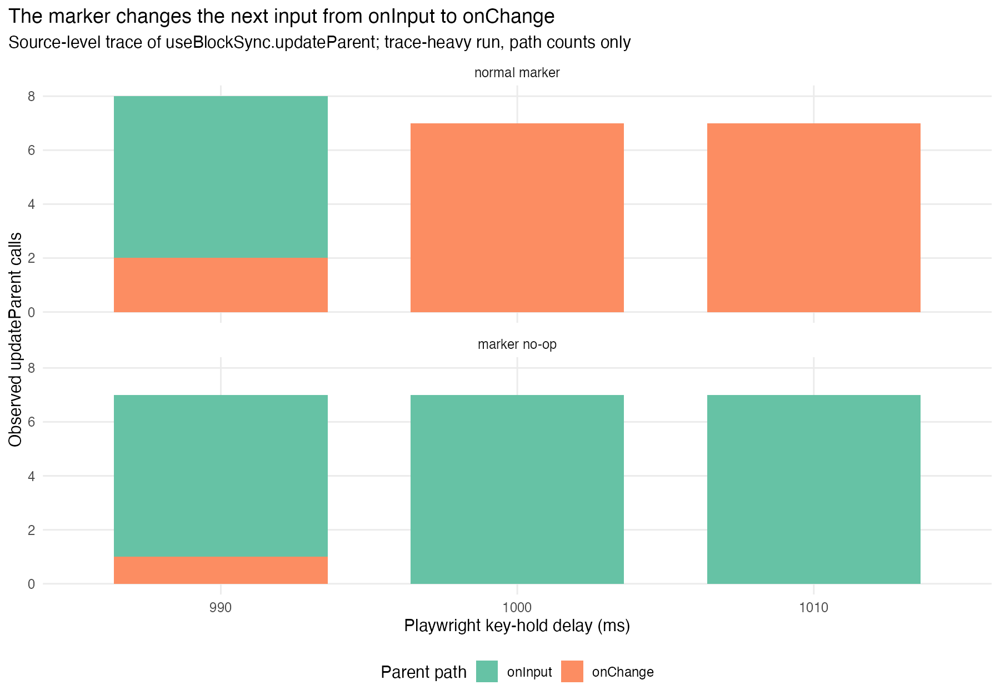

In the trace-heavy path runs, counting only `useBlockSync.updateParent` calls
inside the retained input batch:

| Timer callback                       |    Delay | Following input parent path |
| ------------------------------------ | -------: | --------------------------- |
| normal marker                        | `1000ms` | `6/6` `onChange`            |
| normal marker                        | `1010ms` | `6/6` `onChange`            |
| marker no-op                         | `1000ms` | `6/6` `onInput`             |
| marker no-op                         | `1010ms` | `6/6` `onInput`             |
| mark next not persistent             | `1000ms` | `6/6` `onChange`            |
| mark next not persistent             | `1010ms` | `6/6` `onChange`            |
| mark last, then force next transient | `1000ms` | `7/8` `onChange`            |
| busy wait 20ms                       | `1000ms` | `8/8` `onInput`             |
| busy wait 20ms                       | `1010ms` | `8/8` `onInput`             |
| toggle selection                     | `1000ms` | `8/8` `onInput`             |
| toggle selection                     | `1010ms` | `8/8` `onInput`             |
| toggle template validity             | `1000ms` | `8/8` `onInput`             |
| toggle template validity             | `1010ms` | `8/8` `onInput`             |
| toggle block highlight               | `1000ms` | `8/8` `onInput`             |
| toggle block highlight               | `1010ms` | `8/8` `onInput`             |
| start typing                         | `1000ms` | `8/8` `onInput`             |
| start typing                         | `1010ms` | `8/8` `onInput`             |
| stop typing                          | `1000ms` | `8/8` `onInput`             |
| stop typing                          | `1010ms` | `8/8` `onInput`             |
| stop/start typing                    | `1000ms` | `8/8` `onInput`             |
| stop/start typing                    | `1010ms` | `8/8` `onInput`             |

The `mark next not persistent` row shows that `onChange` is not sufficient: it
records `onChange` and remains slow. The stop/start row shows that `onChange` is
not necessary: it records `onInput` and is fast. The busy-wait, start-only, and
stop-only rows also record `onInput`; the three generic restored toggles record
`onInput` too. These cases have materially different event-only latencies, so
the parent path classification is an observable consequence, not a complete
mechanism. The attempted
mark-last-then-mark-next run is also a warning about reasoning from action names:
the "mark next" action was consumed before the content update in most samples,
so the following content update still became persistent.

The next plot shows the accounting problem directly:

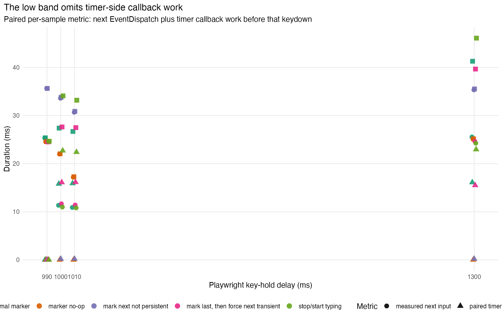

At `1000ms`, the normal marker's measured next-input p50 is only `11.3ms`.
Adding the timer callback that ran before each same retained key gives a paired
timer-inclusive p50 of `27.4ms`, not `11.3ms`. The stop/start intervention is
even more explicit: its measured next-input p50 is `11.0ms`, but adding the
paired timer callback gives `34.1ms`. Those callback durations are outside the
benchmark's next-input EventDispatch window.

| Timer callback                       |    Delay | Rows with callback | Event-only p50 | Timer callback p50 | Timer-inclusive p50 |
| ------------------------------------ | -------: | -----------------: | -------------: | -----------------: | ------------------: |
| normal marker                        |  `990ms` |                `0` |       `25.4ms` |            `0.0ms` |            `25.4ms` |
| normal marker                        | `1000ms` |               `30` |       `11.3ms` |           `15.8ms` |            `27.4ms` |
| normal marker                        | `1010ms` |               `30` |       `10.9ms` |           `15.9ms` |            `26.7ms` |
| normal marker                        | `1300ms` |               `30` |       `25.5ms` |           `16.1ms` |            `41.3ms` |
| marker no-op                         | `1000ms` |               `30` |       `22.0ms` |            `0.0ms` |            `22.0ms` |
| mark next not persistent             | `1000ms` |               `30` |       `33.6ms` |            `0.2ms` |            `33.8ms` |
| mark last, then force next transient | `1000ms` |               `30` |       `11.7ms` |           `16.1ms` |            `27.6ms` |
| busy wait 20ms                       | `1000ms` |               `30` |       `17.7ms` |           `20.0ms` |            `37.8ms` |
| busy wait 40ms                       | `1000ms` |               `29` |       `16.1ms` |           `40.0ms` |            `56.1ms` |
| toggle selection                     | `1000ms` |               `30` |       `14.6ms` |           `22.7ms` |            `37.4ms` |
| toggle template validity             | `1000ms` |               `30` |       `14.6ms` |           `23.8ms` |            `38.7ms` |
| toggle block highlight               | `1000ms` |               `30` |       `14.4ms` |           `22.2ms` |            `37.5ms` |
| start typing                         | `1000ms` |               `30` |       `24.4ms` |            `0.2ms` |            `24.6ms` |
| stop typing                          | `1000ms` |               `30` |       `26.8ms` |           `14.9ms` |            `41.6ms` |
| stop/start typing                    | `1000ms` |               `30` |       `11.0ms` |           `22.7ms` |            `34.1ms` |

This targeted `1000ms` table adds several constraints to the earlier
explanation:

1. The `1000ms` timer controls whether a callback can run between two text
   updates.
2. A zero-duration callback is not enough, and a cheap real action is not
   enough. The cheap `mark-next-not-persistent` replacement does not reproduce
   the low band; the `20ms` and `40ms` busy-wait callbacks only partially reduce
   the next EventDispatch slice. The later task-end and worker controls refine
   this: longer recent work can reproduce the low event-only band without a
   Gutenberg state transition.
3. A completed timer-side block-editor state transition with restored final
   state is sufficient, not necessary. Generic restored state toggles lower the
   `1000ms` event-only p50 to about `14-15ms` while staying on the `onInput`
   path.
4. Restoring the normal pre-key typing state explains the `stopTyping()` probe
   split: `stopTyping(); startTyping()` matches the low band, while
   `startTyping()` alone and `stopTyping()` alone do not. It does not prove
   that typing state is the unique cause of the remaining few milliseconds in
   the targeted run.
5. The benchmark's reported input latency omits that timer-side work. The paired
   timer-inclusive metric removes the apparent `1000ms` low band.
6. The parent `onInput` / `onChange` path and persistent-state classification
   are observable side effects, but they are not the root explanation by
   themselves.

This explains the "charged to the wrong place" issue without pretending the
total work got smaller. The normal marker can make the next EventDispatch slice
look faster because the measurement starts at the next input event and excludes
the marker task that just ran. Counting marker-plus-next-input makes the normal
`1000ms` case slower than the event-only graph suggests.

I also forced the boundary down by rewriting `1000ms` timers to `970ms` and
reran a targeted `960..1000ms` scan:

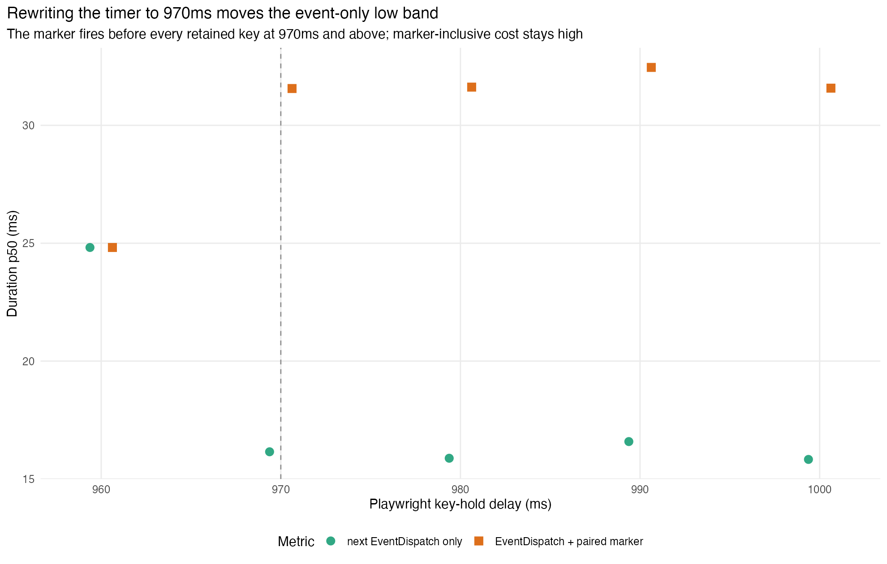

| Effective timer |    Delay | Rows with marker | Event-only p50 | Marker action p50 | Marker-inclusive p50 |
| --------------: | -------: | ---------------: | -------------: | ----------------: | -------------------: |
|         `970ms` |  `960ms` |              `0` |       `24.8ms` |           `0.0ms` |             `24.8ms` |
|         `970ms` |  `970ms` |             `30` |       `16.2ms` |          `15.5ms` |             `31.6ms` |
|         `970ms` |  `980ms` |             `30` |       `15.9ms` |          `15.3ms` |             `31.6ms` |
|         `970ms` |  `990ms` |             `30` |       `16.6ms` |          `15.6ms` |             `32.5ms` |
|         `970ms` | `1000ms` |             `30` |       `15.8ms` |          `15.8ms` |             `31.6ms` |

This confirms the timer-boundary part of the theory: when the effective timer is
`970ms`, the event-only low band starts at `970ms`, and all retained rows from
`970ms` upward have a marker before the next key. It also confirms the accounting
critique: the marker-inclusive p50s are around `32ms`, not `16ms`. The exact
event-only magnitude is not identical to the normal `1000ms` run, so this
supports "the timer moves the boundary" but not a claim that every low-band value
is determined by the timer alone.

I then reran a very small `1000ms` pass with
`BENCHMARK_TRACE_ALL_DATA_SPANS=1`. This mode is intentionally heavy; the
absolute timings are inflated by the tracing itself. The useful signal is the
shape of the work.

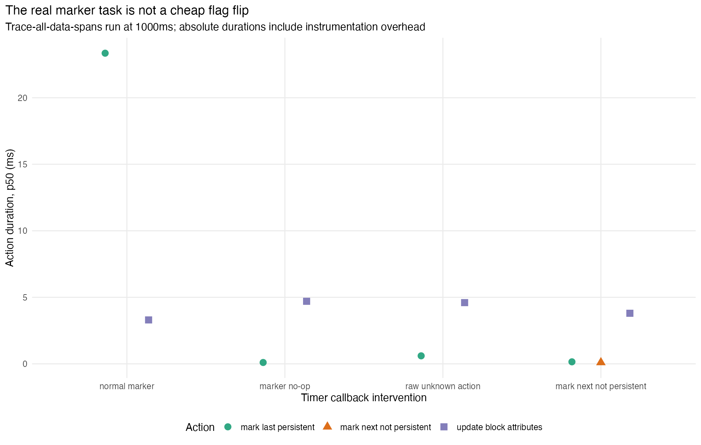

The real marker task is not a cheap flag flip:

| Intervention             | Action                   | p50 action | p50 spans in action | p50 listener spans | p50 `useSelect.onChange` calls |
| ------------------------ | ------------------------ | ---------: | ------------------: | -----------------: | -----------------------------: |
| normal marker            | mark last persistent     |   `23.4ms` |             `15511` |             `4501` |                         `4498` |
| marker no-op             | mark last persistent     |    `0.1ms` |                 `0` |                `0` |                            `0` |
| mark next not persistent | mark last persistent     |    `0.2ms` |                 `1` |                `0` |                            `0` |
| mark next not persistent | mark next not persistent |    `0.1ms` |                 `1` |                `0` |                            `0` |
| normal marker            | update block attributes  |    `3.3ms` |              `9028` |             `4501` |                            `0` |
| marker no-op             | update block attributes  |    `4.7ms` |              `9041` |             `4507` |                            `0` |
| mark next not persistent | update block attributes  |    `3.8ms` |              `9024` |             `4501` |                            `0` |

That confirms the marker-inclusive accounting: the omitted timer work is mostly
`core/block-editor` subscriber fanout, including thousands of `useSelect`
callbacks. It also disconfirms another too-simple theory: the marker is not just
changing one reducer flag and making the next key fast. In the normal-marker
case it runs a large subscriber pass before the next key. The no-op and
mark-next interventions do not. The mark-next marker rows do have one
`rootSubscribe` span with listener-count metadata, but they have zero listener
callback spans, zero `useSelect` callbacks, and `0ms` p50 root-subscribe
duration, so they are not doing the normal marker's subscriber fanout.

The remaining event-only input cost is still concentrated inside RichText's
`registry.batch()`:

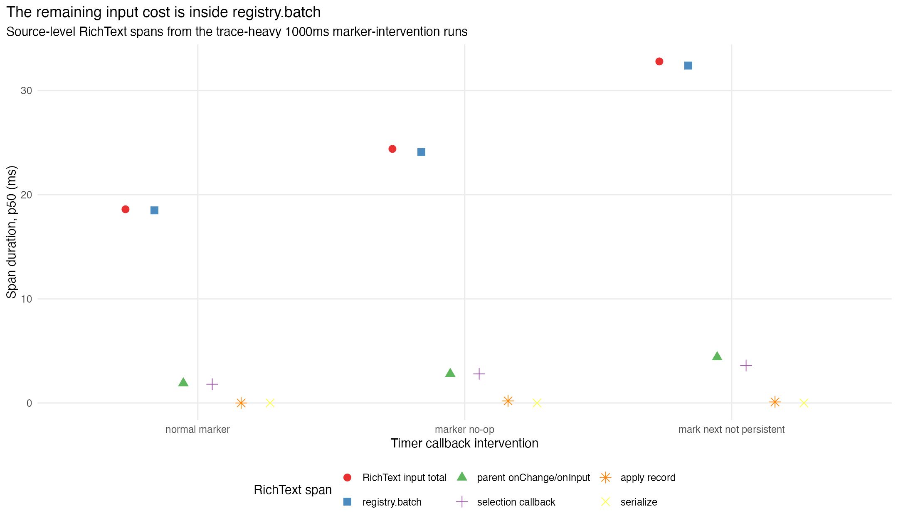

Selected `1000ms` p50 spans:

| Intervention             | RichText total | `registry.batch` | parent callback | selection callback | apply record | serialize |
| ------------------------ | -------------: | ---------------: | --------------: | -----------------: | -----------: | --------: |
| normal marker            |       `18.6ms` |         `18.5ms` |         `1.9ms` |            `1.8ms` |      `0.0ms` |   `0.0ms` |
| marker no-op             |       `24.4ms` |         `24.1ms` |         `2.8ms` |            `2.8ms` |      `0.2ms` |   `0.0ms` |
| mark next not persistent |       `32.8ms` |         `32.4ms` |         `4.4ms` |            `3.6ms` |      `0.1ms` |   `0.0ms` |
| busy wait 20ms           |       `22.5ms` |         `22.3ms` |         `2.4ms` |            `2.3ms` |      `0.1ms` |   `0.0ms` |
| toggle selection         |       `19.2ms` |         `19.0ms` |         `2.0ms` |            `1.8ms` |      `0.1ms` |   `0.0ms` |
| toggle template validity |       `19.5ms` |         `19.4ms` |         `1.9ms` |            `1.6ms` |      `0.1ms` |   `0.0ms` |
| toggle block highlight   |       `19.4ms` |         `19.1ms` |         `1.8ms` |            `1.6ms` |      `0.1ms` |   `0.0ms` |
| start typing             |       `24.6ms` |         `24.4ms` |         `2.8ms` |            `2.9ms` |      `0.1ms` |   `0.0ms` |
| stop typing              |       `17.1ms` |         `16.9ms` |         `1.5ms` |            `1.4ms` |      `0.0ms` |   `0.0ms` |
| stop/start typing        |       `15.3ms` |         `15.2ms` |         `1.9ms` |            `1.6ms` |      `0.1ms` |   `0.0ms` |

This confirms that the event-only difference is not DOM application,
serialization, or the direct `useEntityBlockEditor()` callback. It is the
batched data/subscriber work under RichText input handling. The generic restored
state toggles move that batch cost close to the normal marker even though they
do not change persistence or typing state. The `stopTyping()` row is the
exception that proves why a single RichText batch number is not enough: its
input batch is low, but its total key event remains high because the next
keypress/keydown has to run `startTyping()` before the input batch. The all-span
run shows the normal marker also pays a separate subscriber pass in the timer
task, which the event-only metric excludes.

The trace-all-data-spans run gives a more precise answer to the previous
"how can doing extra work be faster than doing no work?" objection. It is not
faster when the whole cycle is counted. The timer changes what state the next
input starts from, and the event-only metric excludes the timer task.

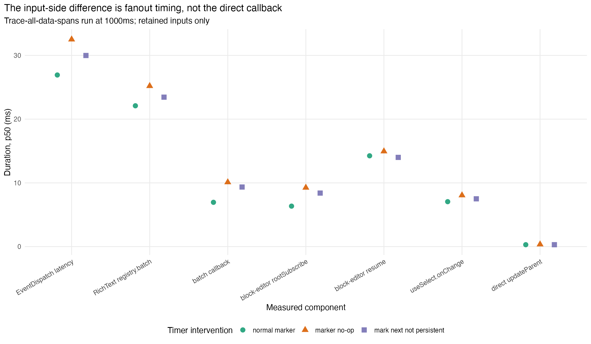

Retained-input p50s from the all-span run:

| Intervention             | Next input path         | Marker actions before retained inputs | Marker `didPersistenceChange` callbacks | Event-only latency | Input `registry.batch` | Batch callback | Block-editor `rootSubscribe` | Block-editor resume | `useSelect.onChange` | Direct `updateParent` |
| ------------------------ | ----------------------- | ------------------------------------: | --------------------------------------: | -----------------: | ---------------------: | -------------: | ---------------------------: | ------------------: | -------------------: | --------------------: |
| normal marker            | `onChange:3; onInput:1` |                                   `3` |                                     `1` |           `26.9ms` |               `22.1ms` |        `7.0ms` |                      `6.4ms` |            `14.2ms` |              `7.0ms` |               `0.3ms` |
| marker no-op             | `onInput:4`             |                                   `3` |                                     `0` |           `32.5ms` |               `25.2ms` |       `10.1ms` |                      `9.3ms` |            `15.0ms` |              `8.0ms` |               `0.4ms` |
| mark next not persistent | `onChange:3; onInput:1` |                                   `6` |                                     `0` |           `30.0ms` |               `23.4ms` |        `9.3ms` |                      `8.4ms` |            `14.0ms` |              `7.5ms` |               `0.3ms` |

This table confirms two things and rejects one tempting shortcut:

-   The normal marker's timer task can run a real `useBlockSync.updateParent`
    callback with `didPersistenceChange: true`. In the trace, this happens once:
    the marker action changes persistence from false to true, `useBlockSync`
    sees that the previous content change is now persistent even though the
    blocks did not change in the marker action itself, and it calls the parent
    `onChange` path for the previous blocks. That is the concrete work that
    happens in the timer callback.
-   The next input is still expensive. It has the same p50 listener counts as
    the no-op case: two block-editor root subscriptions, `9002` block-editor
    Redux listener spans, `4501` block-editor emitter listeners, and `4544`
    `useSelect.onChange` spans. The difference is a few milliseconds of fanout
    duration, not a missing class of listeners.
-   "The direct `onChange` callback is fast, so the cliff is because `onChange`
    is faster than `onInput`" is not supported. The direct `updateParent`,
    `onInput`, `onChange`, `editEntityRecord`, and serialization spans are all
    sub-millisecond at p50 in this run. The measured difference is around the
    block-editor data/subscriber fanout around those callbacks.

The `mark next not persistent` intervention is also not a clean substitute for
the normal marker. The reducer's `markNextChangeAsNotPersistent` flag applies to
the next state-changing block-editor action, not specifically to the next text
content update. In this benchmark, a `selectionChange` commonly runs before
`updateBlockAttributes`. The all-span samples show that `selectionChange` can
consume the mark-next flag and leave the following content update persistent
again. That is why the mark-next run has `onChange:3; onInput:1` rather than
`onInput:4`, and why it cannot be used as evidence that "any timer-side action"
reproduces the normal marker.

I then checked the reducer and synchronization code directly against the trace.
This gives a more precise statement than the earlier "work moves before the
input" shorthand:

-   `withPersistentBlockChange()` keeps both the current
    `isPersistentChange` flag and a `lastAction`. A repeated
    `updateBlockAttributes` on the same block attribute is classified as
    transient because it is a continuation of the previous text edit.
-   `MARK_LAST_CHANGE_AS_PERSISTENT` is an explicit persistent action. It sets
    the persistence flag and also becomes the reducer's `lastAction`, so the
    following `updateBlockAttributes` is no longer compared directly with the
    previous text update.
-   `useBlockSync()` turns that persistence flag into the parent callback path.
    A real marker action can also trigger `didPersistenceChange` when the blocks
    changed on the previous action, did not change on the marker action, and the
    state flips from transient to persistent.
-   `useEntityBlockEditor()` then maps persistent edits to `onChange` and
    transient edits to `onInput`. The direct `onChange`/`onInput` code is not
    where the milliseconds are; the trace puts the cost in subscriber fanout
    around those callbacks.

At `1000ms`, the targeted action summary matches that code-level state machine:

| Intervention             | `updateBlockAttributes` samples | before persistent | after persistent | p50 action duration |
| ------------------------ | ------------------------------: | ----------------: | ---------------: | ------------------: |
| normal marker            |                            `33` |              `33` |             `33` |             `0.8ms` |
| marker no-op             |                            `33` |               `0` |              `0` |             `1.7ms` |
| mark next not persistent |                            `33` |               `0` |             `33` |             `2.2ms` |

The trace-heavy state-path samples show the same split at the input-window
level:

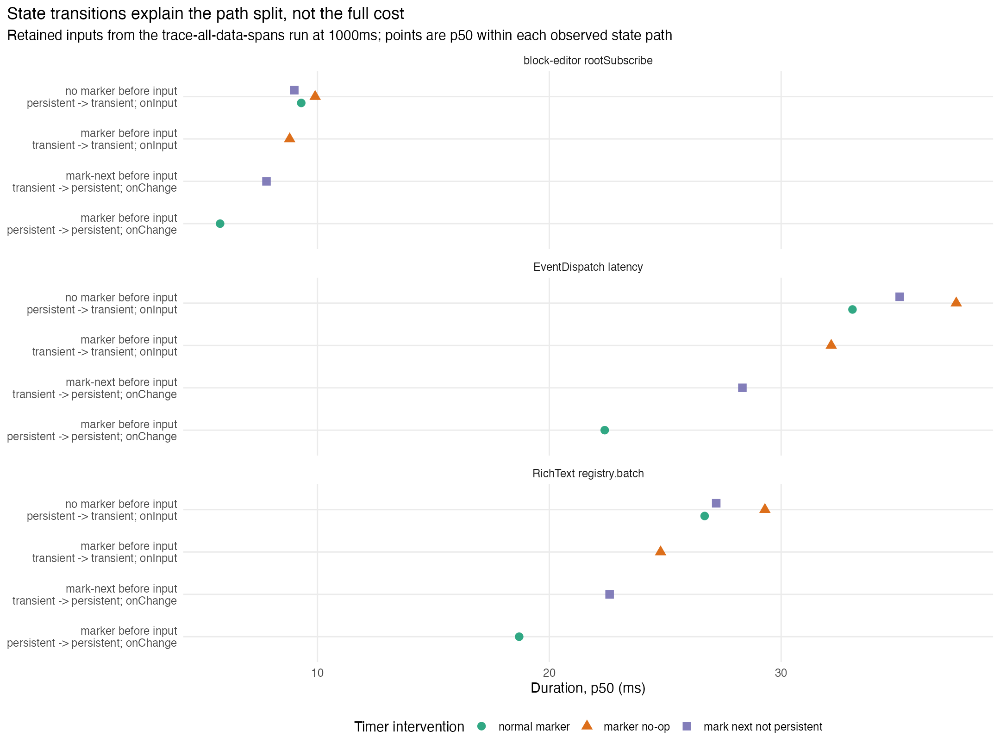

This confirms the path-classification theory: normal marker makes the following
content update start and end persistent, while marker no-op leaves it transient.
It also disconfirms two stronger theories. First, the marker did not simply
"move the same next-input work earlier"; the whole marker-inclusive cycle is
larger. Second, `onChange` is not intrinsically the measured win: mark-next also
produces `onChange` paths in this run but remains slower than normal marker.

I also split the following input batch by action phase. For this split, spans
are charged to an action only if the span starts before the action's recorded
end, so the deferred batch resume is not accidentally charged to
`updateBlockAttributes` when it starts at the same timestamp.

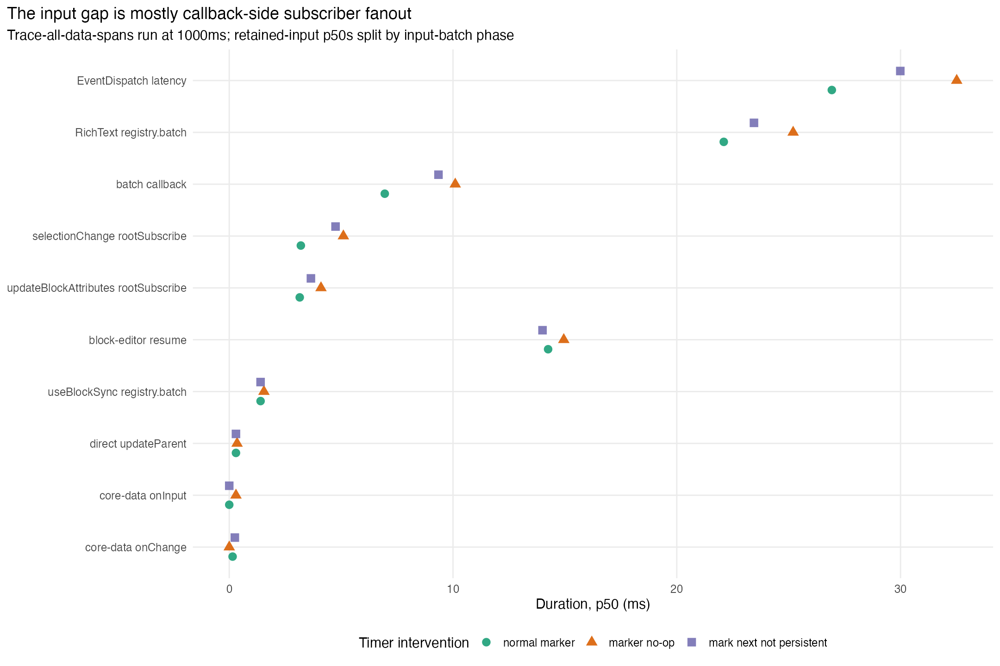

Retained-input p50s from this trace-heavy microscope run:

| Component                                   | normal marker | marker no-op | mark next | no-op minus normal |
| ------------------------------------------- | ------------: | -----------: | --------: | -----------------: |
| EventDispatch latency                       |      `26.9ms` |     `32.5ms` |  `30.0ms` |            `5.6ms` |
| RichText `registry.batch`                   |      `22.1ms` |     `25.2ms` |  `23.4ms` |            `3.1ms` |
| Batch callback                              |       `7.0ms` |     `10.1ms` |   `9.3ms` |            `3.2ms` |
| `selectionChange` block-editor fanout       |       `3.2ms` |      `5.1ms` |   `4.8ms` |            `1.9ms` |
| `updateBlockAttributes` block-editor fanout |       `3.2ms` |      `4.1ms` |   `3.7ms` |            `1.0ms` |
| Deferred block-editor resume                |      `14.2ms` |     `15.0ms` |  `14.0ms` |            `0.7ms` |
| `useBlockSync` nested `registry.batch`      |       `1.4ms` |      `1.6ms` |   `1.4ms` |            `0.2ms` |
| Direct `updateParent`                       |       `0.3ms` |      `0.4ms` |   `0.3ms` |            `0.1ms` |

This confirms a narrower location for the remaining input-window gap. The
absolute cost is still dominated by deferred block-editor resume, but the
normal-vs-no-op difference is mostly in callback-side subscriber fanout during
`selectionChange` and `updateBlockAttributes`. It disconfirms the theory that
the residual gap is mainly `useBlockSync`, core-data `onInput`/`onChange`, or
the deferred resume phase. The trace still does not prove which selector
dependency inside those thousands of subscribers accounts for the lower
callback-side fanout duration.

With those three original interventions, the narrower causal chain was:

1. Below the timer boundary, the next input usually runs while the previous text
   edit is still transient.
2. At or above the boundary, the normal marker can run in a separate timer task
   before the next input. That task dispatches
   `MARK_LAST_CHANGE_AS_PERSISTENT`, fans out through block-editor subscribers,
   and can make `useBlockSync` finalize the previous edit through `onChange`
   with `didPersistenceChange: true`.
3. The benchmark's event-only latency starts at the next input and does not
   include that timer task.
4. The next input then starts from a different persistence/previous-action
   state. Its direct callback is not the explanation; the remaining measured
   difference is in block-editor subscriber fanout inside the input's
   `registry.batch()`.

The later busy-wait, generic-toggle, and typing-state interventions correct that
again. The persistent state/previous-action path is not necessary for the
`1000ms` low EventDispatch band. It is one way to get there, and it explains the
normal marker path, but the broader confirmed condition is narrower than "some
callback ran" and broader than "the persistence marker ran." In these probes,
generic restored block-editor state toggles explain most of the drop. A busy
wait is only partial; restored selection/template/highlight toggles get to about
`14-15ms`; `startTyping()` alone is a no-op; `stopTyping()` alone creates work
but leaves the next input to restart typing; `stopTyping(); startTyping()` does
the fanout and restores the typing state before the measured input. The
low-overhead targeted run leaves a small gap between generic restored toggles
and stop/start, but the heavier all-data-span run does not justify a strong
claim about that gap's cause.

The important correction is that this does not mean "doing timer work is faster
than doing no timer work." The apparent speedup is for the next input's
event-only measurement window. In the targeted paired run at `1000ms`, the
normal marker's event-only p50 is `11.3ms`, but adding the marker task before
that input gives `27.4ms`; the marker no-op p50 is `22.0ms`. The stop/start
intervention is even stronger: its event-only p50 is `11.0ms`, but adding the
timer callback gives `34.1ms`. In the heavier trace-all-data-spans run, the
following input p50 is `26.9ms` for normal marker versus `32.5ms` for marker
no-op, but the normal marker also has a `23.4ms` p50 marker action before the
input. So the low band is not a total-work reduction. It is a measurement-window
result plus a timer-side subscriber pass that the EventDispatch metric omits.

I then grouped the trace-all-data-spans run by `useSelect` owner using the
generated source maps:

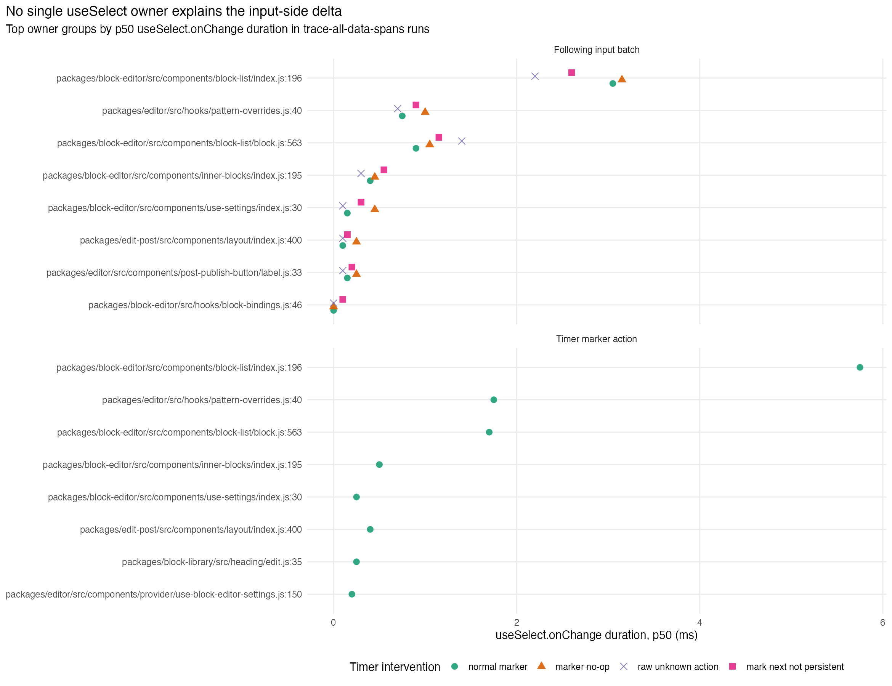

The marker timer task has clear hotspots:

| Marker task owner                                                | p50 `useSelect.onChange` | p50 calls |
| ---------------------------------------------------------------- | -----------------------: | --------: |
| `packages/block-editor/src/components/block-list/index.js:196`   |                  `5.8ms` |     `580` |
| `packages/editor/src/hooks/pattern-overrides.js:40`              |                  `1.8ms` |    `1437` |
| `packages/block-editor/src/components/block-list/block.js:563`   |                  `1.7ms` |    `1437` |
| `packages/block-editor/src/components/inner-blocks/index.js:195` |                  `0.5ms` |     `580` |
| `packages/edit-post/src/components/layout/index.js:400`          |                  `0.4ms` |       `1` |

That is another confirmation that the marker task is real subscriber work, not
a reducer-only flag flip.

For the following input batch, however, the owner-level deltas are small. The
largest positive p50 owner delta versus normal marker is only `0.3ms`:

| Comparison                                   | Owner                                                            | p50 delta |
| -------------------------------------------- | ---------------------------------------------------------------- | --------: |
| marker no-op minus normal marker             | `packages/block-editor/src/components/use-settings/index.js:30`  |  `0.30ms` |
| mark next not persistent minus normal marker | `packages/block-editor/src/components/block-list/block.js:563`   |  `0.25ms` |
| marker no-op minus normal marker             | `packages/editor/src/hooks/pattern-overrides.js:40`              |  `0.25ms` |
| mark next not persistent minus normal marker | `packages/block-editor/src/components/inner-blocks/index.js:195` |  `0.15ms` |
| mark next not persistent minus normal marker | `packages/editor/src/hooks/pattern-overrides.js:40`              |  `0.15ms` |
| marker no-op minus normal marker             | `packages/edit-post/src/components/layout/index.js:400`          |  `0.15ms` |
| marker no-op minus normal marker             | `packages/block-editor/src/components/block-list/block.js:563`   |  `0.15ms` |

Because the direct `useSelect.onChange` callback is only part of a subscriber's
cost, I also attributed the enclosing listener span to the first nested
`useSelect.onChange` owner. For the marker action this is the
`data.reduxStore.listener` span; for the following input batch this is the
resumed `data.emitter.listener` span:

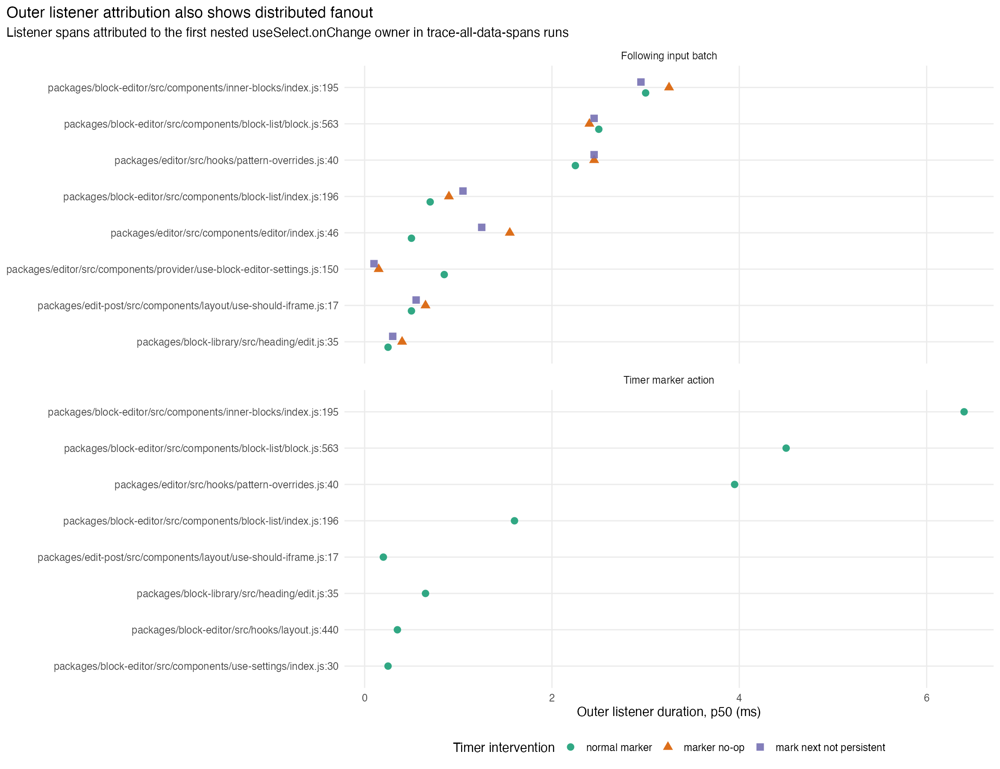

The marker task's outer-listener hotspots are still the same broad fanout
families: `inner-blocks/index.js:195` at `6.4ms`, `block-list/block.js:563` at
`4.5ms`, `pattern-overrides.js:40` at `4.0ms`, and
`block-list/index.js:196` at `1.6ms` p50. For the following input batch, the
largest positive outer-listener p50 deltas versus normal marker are:

| Comparison                                   | Owner                                                            | p50 delta |
| -------------------------------------------- | ---------------------------------------------------------------- | --------: |
| marker no-op minus normal marker             | `packages/editor/src/components/editor/index.js:46`              |  `1.05ms` |
| mark next not persistent minus normal marker | `packages/editor/src/components/editor/index.js:46`              |  `0.75ms` |
| mark next not persistent minus normal marker | `packages/block-editor/src/components/block-list/index.js:196`   |  `0.35ms` |
| marker no-op minus normal marker             | `packages/block-editor/src/components/inner-blocks/index.js:195` |  `0.25ms` |
| marker no-op minus normal marker             | `packages/block-editor/src/components/block-list/index.js:196`   |  `0.20ms` |
| marker no-op minus normal marker             | `packages/editor/src/hooks/pattern-overrides.js:40`              |  `0.20ms` |
| mark next not persistent minus normal marker | `packages/editor/src/hooks/pattern-overrides.js:40`              |  `0.20ms` |

This disconfirms the theory that one obvious source-mapped subscriber owner
explains the remaining input-side difference. The biggest owner-level
`useSelect.onChange` p50 delta is sub-millisecond, and the enclosing
listener-span attribution only raises the largest single-owner delta to about
`1ms`.

I also checked the lower `data.reduxStore.listener` wrapper spans that make up
the callback-side `rootSubscribe` fanout. In the first trace these spans were
below the source-mapped `useSelect` metadata: `packages/data/src/registry.ts`
installed a wrapper around each store subscriber, and
`data.reduxStore.listener` only recorded `storeName`, `listenerIndex`, and
`listenerCount`. That first trace could test the shape of the fanout, but it
could not honestly name a component owner for this lower layer.

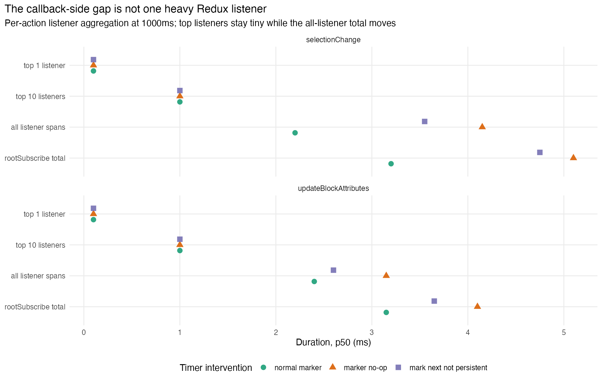

The shape is not what a single bad subscriber would produce:

| Action                  | Intervention             | `rootSubscribe` p50 | all listener spans p50 | nonzero listener spans p50 | top 1 p50 | top 10 p50 |
| ----------------------- | ------------------------ | ------------------: | ---------------------: | -------------------------: | --------: | ---------: |
| `selectionChange`       | normal marker            |             `3.2ms` |                `2.2ms` |                       `22` |   `0.1ms` |    `1.0ms` |
| `selectionChange`       | marker no-op             |             `5.1ms` |                `4.2ms` |                     `41.5` |   `0.1ms` |    `1.0ms` |
| `selectionChange`       | mark next not persistent |             `4.8ms` |                `3.5ms` |                     `35.5` |   `0.1ms` |    `1.0ms` |
| `updateBlockAttributes` | normal marker            |             `3.1ms` |                `2.4ms` |                       `24` |   `0.1ms` |    `1.0ms` |
| `updateBlockAttributes` | marker no-op             |             `4.1ms` |                `3.2ms` |                     `31.5` |   `0.1ms` |    `1.0ms` |
| `updateBlockAttributes` | mark next not persistent |             `3.6ms` |                `2.6ms` |                       `26` |   `0.1ms` |    `1.0ms` |

The largest individual listener wrapper is still around the trace's `0.1ms`
timing granularity, and the top ten wrappers are about `1ms` for every
intervention. What changes is the number of wrappers with measurable nonzero
time and the aggregate `rootSubscribe` total. A listener-index stability check
also found no `listenerIndex` that was nonzero in all four retained samples for
either action in the normal-marker or no-op run. That disconfirms a stable
single-listener explanation for the residual few milliseconds.

I then added that diagnostic metadata: `useSelect` marks its `onChange`
subscriber with a benchmark-only `useSelectId`, the registry wrapper preserves
that metadata, and `data.reduxStore.listener` records it. This is not a proposed
production behavior change; it is attribution plumbing for this benchmark.

The full 8-retained-sample action-plus-all-data-spans run with this metadata hit
Node's heap limit while serializing the JSON. That is itself a benchmark setup
warning: the "trace everything" mode can become the benchmark. I reduced the
owner-attribution pass to four retained samples and used
`NODE_OPTIONS=--max-old-space-size=8192`. The raw JSONs are still large
(`182..222MB` each), but the compact CSVs are small enough to audit.

Coverage in the reduced owner-attribution traces:

| Intervention             | `core/block-editor` listener spans | spans with `useSelectId` | coverage |
| ------------------------ | ---------------------------------: | -----------------------: | -------: |
| normal marker            |                           `89,941` |                 `89,881` | `99.93%` |
| marker no-op             |                           `71,937` |                 `71,889` | `99.93%` |
| mark next not persistent |                           `71,937` |                 `71,889` | `99.93%` |

That confirms the lower listener-wrapper fanout is overwhelmingly
`useSelect.onChange` subscriber fanout, not an unknown listener class.

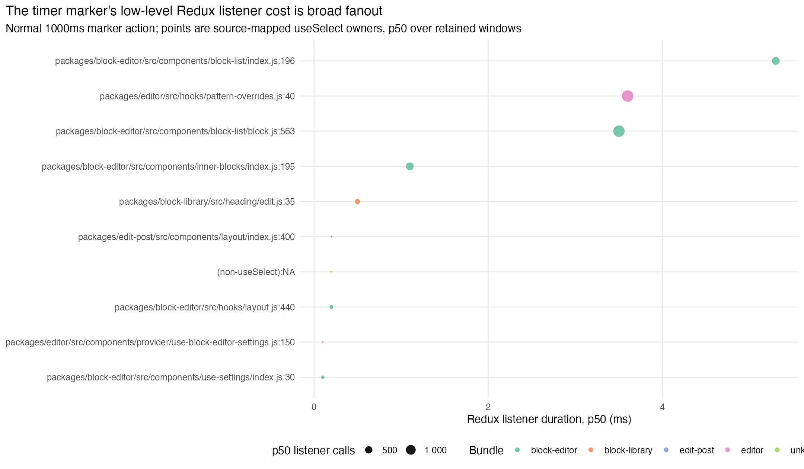

The normal marker task's largest low-level owner groups are the same
high-fanout editor subscriptions seen in the direct `useSelect` trace:

| Marker task owner                                                | p50 listener duration | p50 listener calls |
| ---------------------------------------------------------------- | --------------------: | -----------------: |
| `packages/block-editor/src/components/block-list/index.js:196`   |               `5.3ms` |              `580` |
| `packages/editor/src/hooks/pattern-overrides.js:40`              |               `3.6ms` |            `1,437` |
| `packages/block-editor/src/components/block-list/block.js:563`   |               `3.5ms` |            `1,437` |
| `packages/block-editor/src/components/inner-blocks/index.js:195` |               `1.1ms` |              `580` |
| `packages/block-library/src/heading/edit.js:35`                  |               `0.5ms` |              `202` |

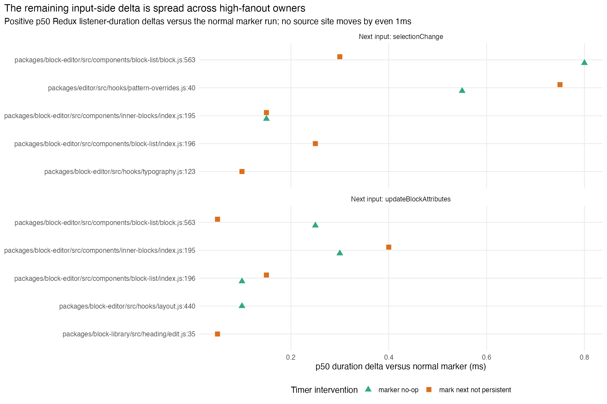

For the following input, the largest positive p50 deltas versus the normal
marker run remain small and distributed:

| Window                  | Intervention             | Owner                                                            | p50 delta |
| ----------------------- | ------------------------ | ---------------------------------------------------------------- | --------: |
| `selectionChange`       | marker no-op             | `packages/block-editor/src/components/block-list/block.js:563`   |  `0.80ms` |
| `selectionChange`       | mark next not persistent | `packages/editor/src/hooks/pattern-overrides.js:40`              |  `0.75ms` |
| `selectionChange`       | marker no-op             | `packages/editor/src/hooks/pattern-overrides.js:40`              |  `0.55ms` |
| `selectionChange`       | mark next not persistent | `packages/block-editor/src/components/block-list/block.js:563`   |  `0.30ms` |
| `updateBlockAttributes` | mark next not persistent | `packages/block-editor/src/components/inner-blocks/index.js:195` |  `0.40ms` |
| `updateBlockAttributes` | marker no-op             | `packages/block-editor/src/components/inner-blocks/index.js:195` |  `0.30ms` |
| `updateBlockAttributes` | marker no-op             | `packages/block-editor/src/components/block-list/block.js:563`   |  `0.25ms` |

This confirms the earlier fanout-shape result with source attribution at the
lower wrapper layer. It disconfirms the theory that a single named subscriber,
selector, or React component explains the residual input-side gap. The supported
statement is narrower: the normal marker puts the following input on a different
persistence/action path, and that changes callback-side block-editor store
fanout by a few milliseconds. The changed fanout is spread across thousands of
cheap subscribers, dominated by block-list, pattern-overrides, and inner-blocks
owner families.

I then checked whether the owner-attribution rows close the accounting at the
window level. Summing the per-owner listener-wrapper rows per retained window
gives:

| Window                       | Intervention             | p50 listener-wrapper total | p50 listener calls | p50 owner groups |
| ---------------------------- | ------------------------ | -------------------------: | -----------------: | ---------------: |
| marker before input          | normal marker            |                   `14.7ms` |            `4,498` |             `66` |
| next `selectionChange`       | normal marker            |                    `2.3ms` |            `4,460` |           `44.5` |
| next `selectionChange`       | marker no-op             |                    `4.4ms` |          `4,485.5` |           `56.5` |
| next `selectionChange`       | mark next not persistent |                    `4.3ms` |            `4,472` |             `47` |
| next `updateBlockAttributes` | normal marker            |                    `1.8ms` |          `4,463.5` |           `68.5` |
| next `updateBlockAttributes` | marker no-op             |                    `2.6ms` |          `4,479.5` |             `58` |
| next `updateBlockAttributes` | mark next not persistent |                    `2.3ms` |            `4,471` |             `66` |

This independently confirms the aggregate version of the input-side story: in
the following input, no-op and mark-next have about `2ms` more low-level
listener-wrapper time in `selectionChange`, plus less than `1ms` more in
`updateBlockAttributes`. The normal marker also has a much larger separate
marker-before-input listener-wrapper window. The numbers are not identical to
the earlier all-span run because this was a separate reduced run, but the shape
is the same.

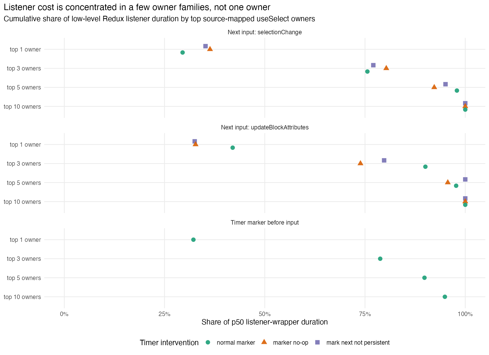

The concentration check refines the "distributed fanout" wording. A single owner
does not dominate: the largest source-mapped owner is only about `30..42%` of
the measured listener-wrapper time, depending on the window. But the work is
also not uniformly spread over thousands of unrelated sources. The top three
owner groups are typically about `74..90%` of the measured listener-wrapper
time, and the top five are about `90%+`. The right model is "a few high-instance
owner families", not "one pathological selector" and not "thousands of equal
anonymous callbacks."

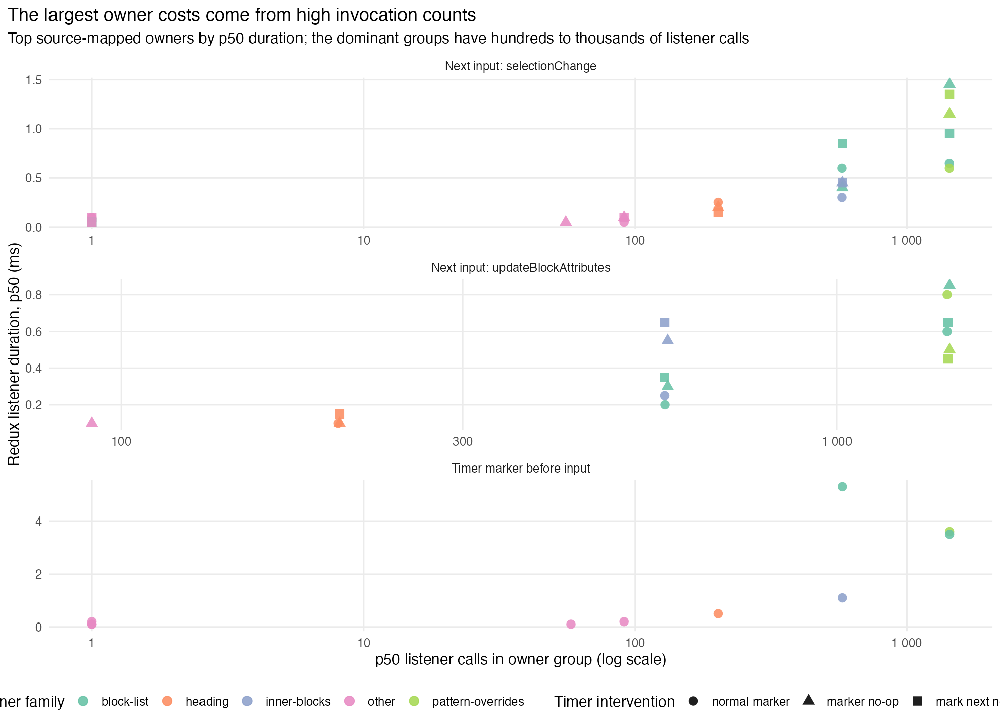

The count-vs-duration plot checks another plausible theory: maybe those owner
families are slow per listener. For the marker task's top source-mapped groups:

| Owner                                                            | p50 duration | p50 listener calls | p50 per listener |
| ---------------------------------------------------------------- | -----------: | -----------------: | ---------------: |
| `packages/block-editor/src/components/block-list/index.js:196`   |      `5.3ms` |              `580` |          `9.1us` |
| `packages/editor/src/hooks/pattern-overrides.js:40`              |      `3.6ms` |            `1,437` |          `2.5us` |
| `packages/block-editor/src/components/block-list/block.js:563`   |      `3.5ms` |            `1,437` |          `2.4us` |
| `packages/block-editor/src/components/inner-blocks/index.js:195` |      `1.1ms` |              `580` |          `1.9us` |
| `packages/block-library/src/heading/edit.js:35`                  |      `0.5ms` |              `202` |          `2.5us` |

This disconfirms the theory that the dominant source-mapped groups are
individually slow callbacks. The measurable cost is mostly multiplication:
hundreds or thousands of very cheap listener calls in block-tree-wide
subscriptions. The remaining open question is not "which one callback is slow?"
but "which invalidation boundaries make thousands of block-list and
pattern-override subscribers run on this input path?"

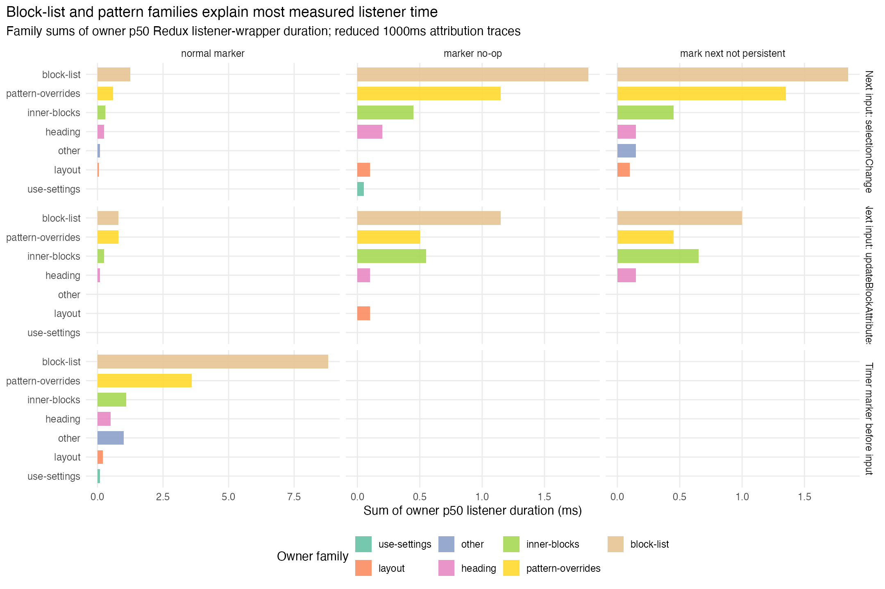

The family grouping makes the same point with less per-file noise. In the normal
marker task, the family p50 sums are:

| Family                  | p50 duration sum | p50 listener calls |
| ----------------------- | ---------------: | -----------------: |
| block-list              |          `8.8ms` |            `2,018` |
| pattern-overrides       |          `3.6ms` |            `1,437` |
| inner-blocks            |          `1.1ms` |              `580` |
| heading                 |          `0.5ms` |              `202` |
| layout                  |          `0.2ms` |               `91` |
| all other mapped owners |          `1.0ms` |              `111` |

This supports a code-level theory:

-   `useSelect` invalidates its cached value on store update before rerunning
    selectors (`packages/data/src/components/use-select/index.ts:162-168`).
-   The Redux store wrapper runs every subscribed listener when the store's root
    state object changes (`packages/data/src/redux-store/index.ts:535-559`).
-   The registry store wrapper preserves all store subscribers and routes them
    through the paused/resumed emitter path used by `registry.batch()`
    (`packages/data/src/registry.ts:239-274` and
    `packages/data/src/utils/emitter.ts:38-58`).
-   The top owner families are per-block or per-block-list subscriptions:
    `BlockListItems` reads block order, selected client IDs, visible blocks,
    zoom state, template lock, block editing mode, block name, and inserter
    capability (`packages/block-editor/src/components/block-list/index.js:195-259`);
    `BlockListBlockProvider` reads block identity, attributes, selection,
    movement/removal capability, editing mode, block index, block variations,
    same-name blocks, and section ancestry
    (`packages/block-editor/src/components/block-list/block.js:562-700`);
    `useInnerBlocksProps` reads block name, zoom state, template lock, root
    client ID, editing mode, block settings, and section root
    (`packages/block-editor/src/components/inner-blocks/index.js:194-248`);
    `withPatternOverrideControls` reads
    `getSettings().__experimentalBlockBindingsSupportedAttributes` for every
    block edit wrapper (`packages/editor/src/hooks/pattern-overrides.js:39-48`).
-   The persistence reducer explains why the marker changes the later input's
    path: consecutive same-attribute `UPDATE_BLOCK_ATTRIBUTES` actions are
    non-persistent, but `MARK_LAST_CHANGE_AS_PERSISTENT` is an explicit boundary
    (`packages/block-editor/src/store/reducer.js:166-173` and `421-480`).
    `useBlockSync()` then chooses `onChange` or `onInput` from
    `isLastBlockChangePersistent()` (`packages/block-editor/src/components/provider/use-block-sync.js:379-470`).

What this confirms: the timing difference is caused by Gutenberg state/action
ordering plus the data-layer subscription model. The marker changes the
persistence/action path, and any effective `core/block-editor` state change in
that path wakes thousands of `useSelect` listeners. The dominant cost is the
number of subscriptions reached by that invalidation. The later stop/start
intervention makes this broader: the persistence marker is one effective way to
create this timer-side fanout, but it is not the only one.

The raw-unknown-action probe confirms the "effective state change" part. It
uses the same timer slot and does call the underlying `core/block-editor`
`store.dispatch()`, but because the reducer returns the identical root state,
the store wrapper's `hasChanged` check does not call the subscriber set. Its
timer callback therefore has `0ms` `rootSubscribe` / Redux-listener fanout, and
the next input behaves like no-op rather than like normal marker or restored
state toggles.

What this disconfirms: the current evidence does not support a browser-only
timing explanation, a single pathological selector, or unusually slow callback
bodies. It also does not support "the marker makes the whole cycle cheaper";
the marker task itself is expensive and is outside the next input's event-only
metric.

I then split the all-data-span trace by data-layer phase to test whether the
input-side gap is mostly selector recomputation.

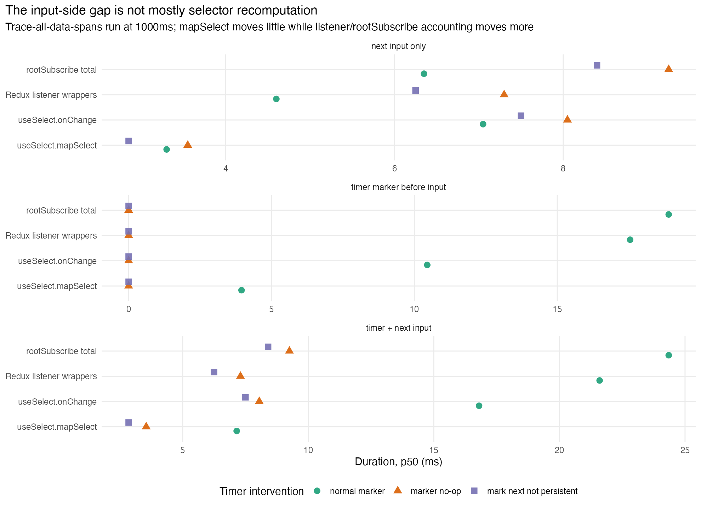

For the following input only:

| Metric                       | normal marker | marker no-op | raw unknown | mark next |
| ---------------------------- | ------------: | -----------: | ----------: | --------: |
| block-editor `rootSubscribe` |       `6.4ms` |      `9.3ms` |     `9.4ms` |   `8.4ms` |
| Redux listener wrappers      |       `4.6ms` |      `7.3ms` |     `7.6ms` |   `6.2ms` |
| `useSelect.onChange`         |       `7.0ms` |      `8.0ms` |     `6.9ms` |   `7.5ms` |
| `useSelect.mapSelect`        |       `3.3ms` |      `3.5ms` |     `2.8ms` |   `2.8ms` |
| `useSelect.onChange` calls   |       `4,544` |      `4,544` |     `4,544` |   `4,544` |
| `useSelect.mapSelect` calls  |         `716` |        `716` |       `716` |     `716` |

This disconfirms two more theories:

-   The slower input-side path is not caused by running many more `useSelect`
    callbacks. The `onChange` and `mapSelect` counts are identical across the
    compared interventions in this trace-heavy run.
-   The slower input-side path is not mostly selector-body recomputation. The
    no-op run's `mapSelect` p50 is only `0.2ms` higher than normal, and
    mark-next's is lower than normal. The larger movement is in
    `rootSubscribe` and Redux listener-wrapper accounting.

The more precise statement is: the same broad listener set is reached, but the
slower paths have more measurable work around the listener invalidation /
notification layer, while selector recomputation itself is a smaller and less
consistent contributor. That fits the owner-family results above: the problem is
not one slow selector body, and not a different number of hook instances, but the
cost of pushing a `core/block-editor` state transition through thousands of
subscribers on a path where more time is accounted at the wrapper/notification
level.

I then extended the compact extraction for the same raw all-data-span traces to
keep the nested `useSelect.onStoreChange`, `useSelect.reactListener`,
`useSelect.updateValue`, and `useSelect.renderQueueAdd` spans. That tests four
more explanations for the remaining input-side gap: React subscriber wakeup,
selector cache recomputation, selector body execution, and async render-queue
scheduling.

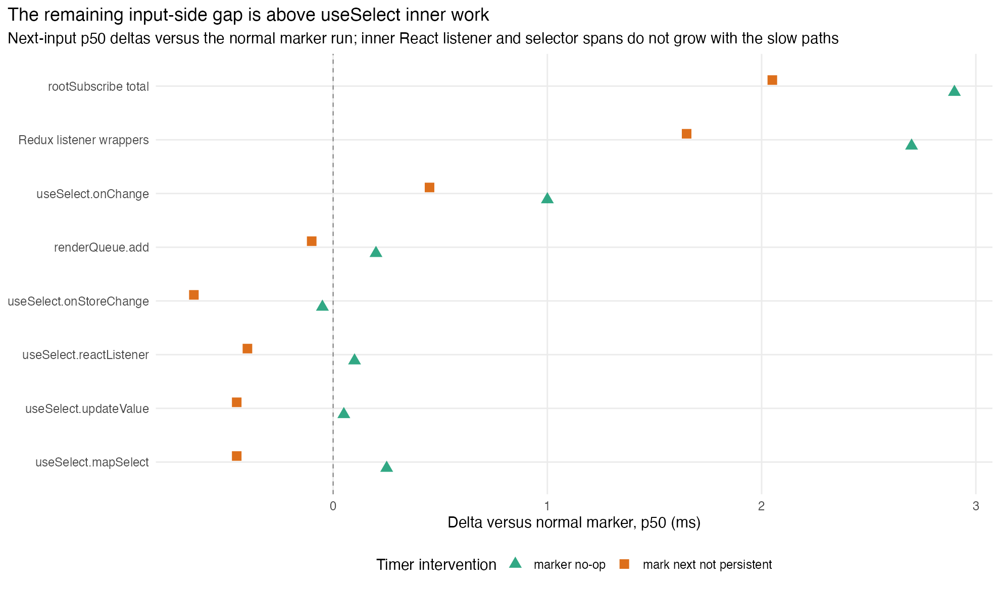

Next-input p50 deltas versus the normal-marker run:

| Metric                       | marker no-op | raw unknown | mark next |
| ---------------------------- | -----------: | ----------: | --------: |
| block-editor `rootSubscribe` |      `+2.9ms` |     `+3.1ms` |   `+2.0ms` |
| Redux listener wrappers      |      `+2.7ms` |     `+3.0ms` |   `+1.6ms` |
| `useSelect.onChange`         |      `+1.0ms` |     `-0.1ms` |   `+0.5ms` |
| `useSelect.renderQueueAdd`   |      `+0.2ms` |     `-0.1ms` |   `-0.1ms` |
| `useSelect.onStoreChange`    |      `-0.1ms` |     `-1.0ms` |   `-0.7ms` |
| `useSelect.reactListener`    |      `+0.1ms` |     `-1.0ms` |   `-0.4ms` |
| `useSelect.updateValue`      |      `+0.1ms` |     `-0.8ms` |   `-0.5ms` |
| `useSelect.mapSelect`        |      `+0.2ms` |     `-0.5ms` |   `-0.5ms` |

The callback counts are also identical in this run: `4,544`
`useSelect.onChange` callbacks, `3,828` render-queue adds, and `716` each of
`onStoreChange`, `reactListener`, `updateValue`, and `mapSelect` for all four
interventions.

This disconfirms the remaining tempting single-layer explanations. The no-op
and mark-next paths are not slower because they call more hook instances. They
are not slower because React's subscribed listener callback is materially more
expensive. They are not slower because `updateValue()` or `mapSelect()` does
more selector work. They are not slower because `renderQueue.add()` gets
materially more expensive. In the mark-next run, all of the nested child phases
below `useSelect.onChange` are lower than normal even though `rootSubscribe` and
Redux listener-wrapper time are higher.

I then split the wrapper layer itself. The relevant code path is:

1. `registry.batch()` pauses store emitters.
2. Dispatch still reaches the Redux store's `rootSubscribe` callback.
3. `rootSubscribe` loops every store listener and records a
   `data.reduxStore.listener` wrapper.
4. In `packages/data/src/registry.ts:260-266`, the wrapped listener sees
   `store.emitter.isPaused`, calls `store.emitter.emit()`, and returns without
   running the real listener body.
5. `emitter.emit()` just sets `isPending = true` while paused
   (`packages/data/src/utils/emitter.ts:98-103`).
6. The real callbacks run later, once, during `emitter.resume()` /
   `notifyListeners()`.

That means a `rootSubscribe` / Redux-listener delta during the input batch can be
paused wrapper fanout, not React listener execution or selector work.

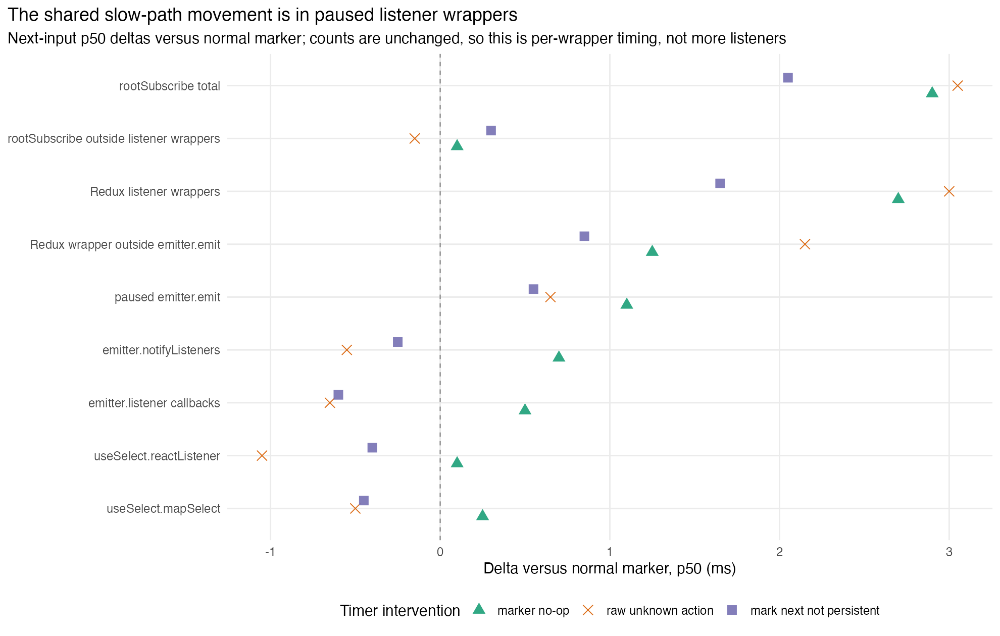

Next-input p50 deltas versus the normal-marker run:

| Metric                                  | marker no-op | raw unknown | mark next |
| --------------------------------------- | -----------: | ----------: | --------: |
| block-editor `rootSubscribe`            |      `+2.9ms` |     `+3.1ms` |   `+2.0ms` |
| `rootSubscribe` outside listener wraps  |      `+0.1ms` |     `-0.2ms` |   `+0.3ms` |
| Redux listener wrappers                 |      `+2.7ms` |     `+3.0ms` |   `+1.6ms` |
| Redux wrapper outside `emitter.emit()`  |      `+1.3ms` |     `+2.2ms` |   `+0.9ms` |
| paused `emitter.emit()`                 |      `+1.1ms` |     `+0.6ms` |   `+0.6ms` |
| `emitter.notifyListeners()`             |      `+0.7ms` |     `-0.5ms` |   `-0.3ms` |
| `emitter.listener` callbacks            |      `+0.5ms` |     `-0.6ms` |   `-0.6ms` |
| `useSelect.reactListener`               |      `+0.1ms` |     `-1.0ms` |   `-0.4ms` |
| `useSelect.mapSelect`                   |      `+0.2ms` |     `-0.5ms` |   `-0.5ms` |

The next-input counts are effectively unchanged: `2` `rootSubscribe` spans,
about `9000` Redux listener wrappers, the same number of paused
`emitter.emit()` spans, and about `4500` emitter listener callbacks. The raw
unknown-action run has `9000` wrappers instead of `9002` because it had one fewer
store subscriber in that small diagnostic run, not because it avoided the next
input fanout.

I then paired every `data.reduxStore.listener` wrapper span with its immediate
paused `data.emitter.emit` child. The coverage is complete:

| Metric                               | normal marker | marker no-op | raw unknown | mark next |
| ------------------------------------ | ------------: | -----------: | ----------: | --------: |
| Redux listener wrappers              |       `9,002` |      `9,002` |     `9,000` |   `9,002` |
| wrappers with paused `emitter.emit`  |       `9,002` |      `9,002` |     `9,000` |   `9,002` |
| child coverage                       |      `100.0%` |     `100.0%` |    `100.0%` |  `100.0%` |
| wrapper duration                     |       `4.6ms` |      `7.3ms` |     `7.6ms` |   `6.3ms` |
| paused `emitter.emit` child duration |       `1.3ms` |      `2.4ms` |     `1.9ms` |   `1.8ms` |
| wrapper outside child duration       |       `3.6ms` |      `4.8ms` |     `5.7ms` |   `4.4ms` |
| nonzero wrapper spans                |          `46` |         `73` |        `75` |  `62.5` |
| nonzero paused child spans           |        `12.5` |       `23.5` |        `19` |    `18` |
| nonzero wrapper-outside-child spans  |        `35.5` |       `47.5` |        `56` |    `44` |

This pairing disconfirms another possible theory: the wrapper delta is not
coming from hidden real subscriber bodies inside `data.reduxStore.listener`.
Every measured wrapper in this batch contains the paused-emitter fast path.

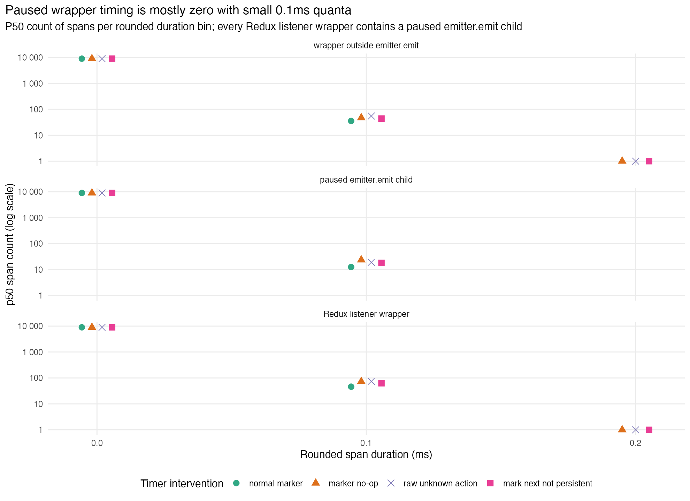

This confirms that the shared part of the residual gap is in the paused
dispatch-wrapper path. It disconfirms "the slow path is the resume callback" as
the common explanation: `emitter.notifyListeners()`, `emitter.listener`,
`reactListener`, and `mapSelect` all move down in the mark-next run while
`rootSubscribe` and Redux listener-wrapper time move up.

The remaining wrapper-only delta should be treated carefully. The duration-bin
plot shows that this is mostly `0.0ms` spans plus a small number of `0.1ms`
spans, with only one p50-visible `0.2ms` bin in the slow interventions. The
action-level listener distributions show the same thing in the two action
slices that make up the next input:

| Action                  | Metric                | normal marker | marker no-op | mark next |
| ----------------------- | --------------------- | ------------: | -----------: | --------: |
| `selectionChange`       | nonzero wrappers      |          `22` |       `41.5` |    `35.5` |
| `selectionChange`       | top 1 wrapper         |       `0.1ms` |      `0.1ms` |   `0.1ms` |
| `selectionChange`       | top 10 wrappers       |       `1.0ms` |      `1.0ms` |   `1.0ms` |
| `updateBlockAttributes` | nonzero wrappers      |          `24` |       `31.5` |      `26` |
| `updateBlockAttributes` | top 1 wrapper         |       `0.1ms` |      `0.1ms` |   `0.1ms` |
| `updateBlockAttributes` | top 10 wrappers       |       `1.0ms` |      `1.0ms` |   `1.0ms` |

So the deeper result is not "there is a hidden expensive subscriber." It is:
when these trace-heavy probes are enabled, the slow interventions spend more
time in thousands of paused listener-wrapper invocations, and that difference is
largely expressed as more `performance.now()` timing quanta across the wrapper
fanout. That is a useful diagnostic for where the accounting sits, but it is not
evidence of one additional expensive Gutenberg callback.

Finally, I paired the marker task before each retained input with that same
input in the trace-heavy run. This tests the most important accounting theory
directly: if the normal marker truly made the editor do less work overall, the
marker-plus-input cycle should be lower than the no-op cycle. It is not. The
later stop/start and selection-toggle probes give the same conclusion with
non-marker timer callbacks.

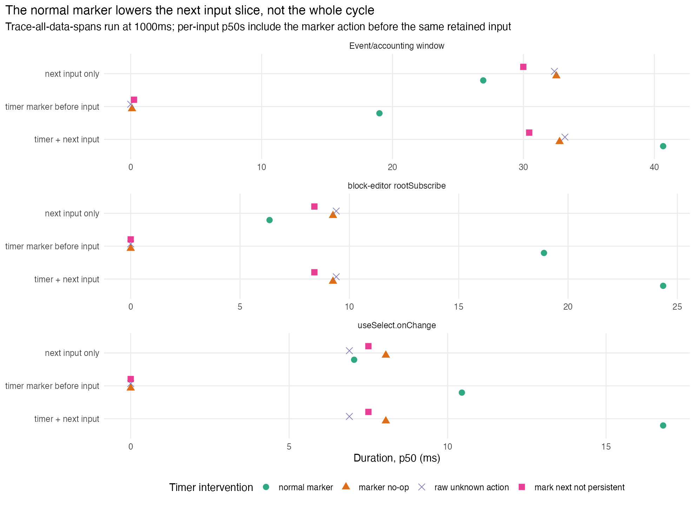

Selected p50s:

| Metric                     | normal marker | marker no-op | raw unknown | mark next |
| -------------------------- | ------------: | -----------: | ----------: | --------: |
| next input EventDispatch   |      `26.9ms` |     `32.5ms` |    `32.4ms` |  `30.0ms` |
| marker before that input   |      `19.0ms` |      `0.1ms` |     `0.0ms` |   `0.3ms` |
| marker plus next input     |      `40.7ms` |     `32.8ms` |    `33.2ms` |  `30.4ms` |
| next input `rootSubscribe` |       `6.4ms` |      `9.3ms` |     `9.4ms` |   `8.4ms` |
| marker `rootSubscribe`     |      `18.9ms` |      `0.0ms` |     `0.0ms` |   `0.0ms` |
| cycle `rootSubscribe`      |      `24.4ms` |      `9.3ms` |     `9.4ms` |   `8.4ms` |
| next input `useSelect`     |       `7.0ms` |      `8.0ms` |     `6.9ms` |   `7.5ms` |
| marker `useSelect`         |      `10.5ms` |      `0.0ms` |     `0.0ms` |   `0.0ms` |
| cycle `useSelect`          |      `16.8ms` |      `8.0ms` |     `6.9ms` |   `7.5ms` |

I then repeated the trace-all-data-spans microscope for `stopTyping();
startTyping()` and the restored `toggleSelection( false ); toggleSelection(
true )` probe. The absolute values are still inflated by tracing overhead, but
the comparison is useful because it uses the same instrumentation:

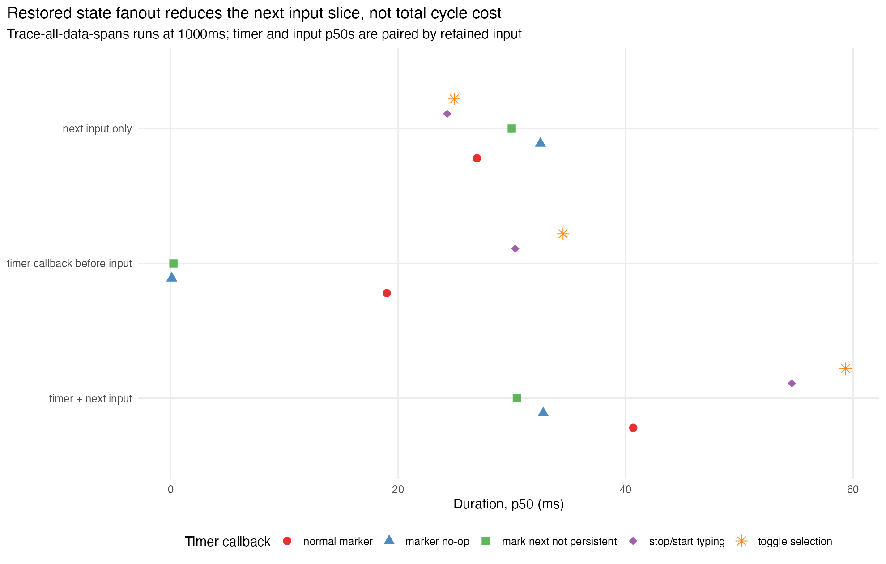

| Timer callback             | Next input path         | Timer callback p50 | Next input p50 | Timer plus input p50 | Next input `rootSubscribe` | Next input Redux listeners | Next input `useSelect` |
| -------------------------- | ----------------------- | -----------------: | -------------: | -------------------: | -------------------------: | -------------------------: | ---------------------: |
| normal marker              | `onChange:3; onInput:1` |           `19.0ms` |       `26.9ms` |             `40.7ms` |                    `6.4ms` |                    `4.6ms` |                `7.0ms` |
| marker no-op               | `onInput:4`             |            `0.1ms` |       `32.5ms` |             `32.8ms` |                    `9.3ms` |                    `7.3ms` |                `8.0ms` |
| raw unknown action         | `onInput:2; onChange:1` |            `0.0ms` |       `32.4ms` |             `33.2ms` |                    `9.4ms` |                    `7.6ms` |                `6.9ms` |
| mark next not persistent   | `onChange:3; onInput:1` |            `0.3ms` |       `30.0ms` |             `30.4ms` |                    `8.4ms` |                    `6.2ms` |                `7.5ms` |
| stop/start typing          | `onInput:6`             |           `30.3ms` |       `24.3ms` |             `54.6ms` |                    `5.2ms` |                    `3.9ms` |                `6.4ms` |
| toggle selection           | `onInput:6`             |           `34.5ms` |       `24.9ms` |             `59.3ms` |                    `5.4ms` |                    `3.2ms` |                `5.9ms` |

The raw-unknown-action row is a small `n=3` diagnostic, not a score run. Its
important result is not the exact p50; it is that a raw dispatch with no root
state change has no timer-side subscriber fanout and stays with the no-op
next-input band. This is the best current correction to the typing-state theory.
In the low-overhead targeted run, `toggleSelection()` lands at about `14-15ms` while
`stopTyping(); startTyping()` lands at about `11ms`. Under the heavier
all-data-span microscope, however, the restored selection toggle and stop/start
typing have very similar shape: both stay on `onInput`, both do a large
timer-side subscriber pass before the next key, both lower the following input's
`rootSubscribe` and Redux-listener durations, and both make the timer-plus-input
cycle much worse than the next-input-only metric. That disconfirms a strong
"typing state is the unique remaining cause" claim. The safe statement is that
restored block-editor fanout before the key is sufficient to get most of the
measured drop, while the exact low-overhead gap between `14-15ms` and `~11ms`
is not yet pinned to one source-level mechanism.

I also split the same input batch into `useSelect` subphases and added
cache-state counts:

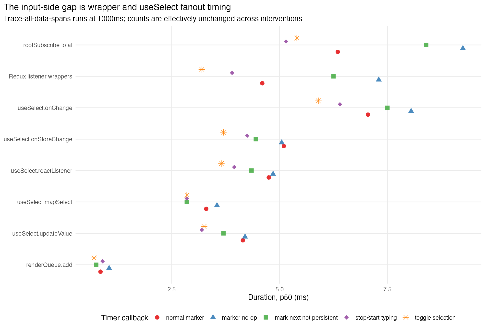

Selected p50 counts and durations:

| Metric                               | normal marker | marker no-op | raw unknown | stop/start | toggle selection |
| ------------------------------------ | ------------: | -----------: | ----------: | ---------: | ---------------: |
| `rootSubscribe` count                |           `2` |          `2` |         `2` |        `2` |              `2` |
| Redux listener wrappers              |        `9002` |       `9002` |      `9000` |     `9000` |           `9000` |
| `useSelect.onChange` callbacks       |        `4544` |       `4544` |      `4544` |     `4544` |           `4544` |
| `useSelect.updateValue` calls        |         `716` |        `716` |       `716` |      `716` |            `716` |
| invalidated cached selector results  |         `716` |        `716` |       `716` |      `716` |            `716` |
| cached `mapSelect` functions         |         `716` |        `716` |       `716` |      `716` |            `716` |
| `renderQueue.add` calls              |        `3828` |       `3828` |      `3828` |     `3828` |           `3828` |
| `rootSubscribe` duration             |       `6.4ms` |      `9.3ms` |     `9.4ms` |    `5.2ms` |          `5.4ms` |
| Redux listener-wrapper duration      |       `4.6ms` |      `7.3ms` |     `7.6ms` |    `3.9ms` |          `3.2ms` |
| `useSelect.onChange` duration        |       `7.0ms` |      `8.0ms` |     `6.9ms` |    `6.4ms` |          `5.9ms` |
| `useSelect.updateValue` duration     |       `4.2ms` |      `4.2ms` |     `3.4ms` |    `3.2ms` |          `3.3ms` |
| `useSelect.mapSelect` duration       |       `3.3ms` |      `3.6ms` |     `2.8ms` |    `2.9ms` |          `2.9ms` |
| `renderQueue.add` duration           |       `0.9ms` |      `1.1ms` |     `0.7ms` |    `0.9ms` |          `0.7ms` |

This disconfirms several narrower theories. The no-op path is not slower
because it has more subscribers, more selector recomputes, more selector-cache
misses, more `updateValue` calls, or more render-queue insertions. Those counts
are the same at p50 in the all-data-span probe. The difference is time spent
walking essentially the same listener/useSelect shape, with the largest visible
movement at the root-subscribe and Redux-listener-wrapper levels. That is also
why the owner-attribution tables do not find one pathological component.

This confirms the weak version of "work moves out of the next input slice" and
disconfirms the strong version. The weak version is: a real timer task runs
before the measured input and does subscriber fanout that the next input
measurement does not include. The strong version would be: the normal marker
makes the total marker-plus-input cycle cheaper than no marker work. The data
says the opposite. The normal marker's next-input slice is lower than no-op by
about `5.6ms`, but the marker-plus-input cycle is higher by about `7.9ms` in
this trace-heavy run.

One piece remains open, but it is now narrower. The traces identify timer-side
block-editor fanout and the following input's block-editor fanout, the owner
summary disconfirms a single-owner explanation, and the nested-span split
disconfirms selector-recompute and render-queue explanations for the residual
input-side delta. The listener probe also disconfirms expensive DOM `keypress`
callbacks: the p50-visible listener work is the actual DOM `input` listener,
dominated by RichText's `onInput` handler. The newest wrapper split puts the
shared data-layer remainder in the paused store-listener wrapper path, not in
the resumed listener bodies. The supported statement is that timer ordering plus
timer-side subscriber fanout explain the false event-only low band; attributing
the last few milliseconds to a single React commit, selector, render queue,
component, DOM `keypress` callback, or resumed callback body is not supported by
the current traces.

Reasoning audit:

-   Code-review standard: the reducer proves only the previous-action and
    explicit-marker logic above. It does not prove that `onChange` is inherently
    faster than `onInput`; the `mark next not persistent` run disconfirms
    "`onChange` is sufficient", and the stop/start run disconfirms "`onChange`
    is necessary".
-   Measurement standard: the low band is an EventDispatch accounting result,
    not a whole-cycle latency result. Timer callbacks are in different tasks and
    must be counted separately.
-   Benchmark standard: the benchmark is still useful for finding this ordering
    artifact, but the original graph should not be read as "a human who waits
    one second sees a faster next character."

## Deeper Pass: The Delay Is A Key Hold

The first report identified the `~1000ms` cliff but left the later `1200-2000ms`
plateau partly open. The deeper pass found a more fundamental benchmark issue:
Playwright's `keyboard.type( text, { delay } )` is not equivalent to "type a
complete character, wait, type the next complete character."

In the installed Playwright implementation, `keyboard.type()` loops over
characters and calls `press( char, { delay } )`. `press()` sends `keydown`, waits
for `delay`, then sends `keyup`. The browser event traces confirm this:
`keydown` / `keypress` / `input` happen near the start of each sample, then
`keyup` happens roughly `delay` milliseconds later, and the next `keydown`
follows almost immediately.

That means the original delay sweep is mostly a synthetic key-hold-duration
sweep. A person who types once every second is not normally holding each key down
for one second.

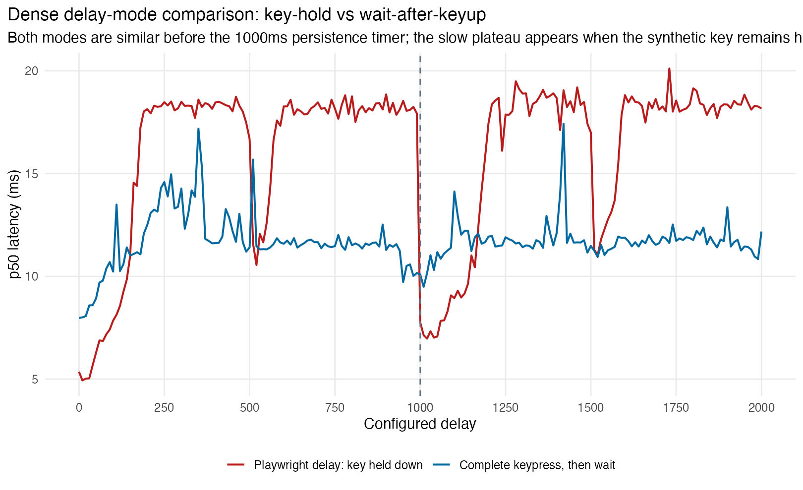

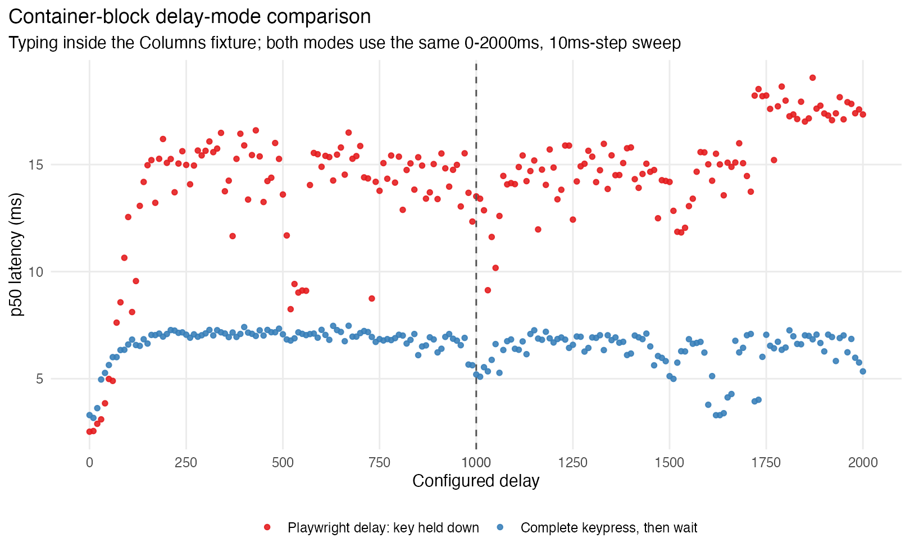

The first version of this comparison used landmark delays, mostly near and above
the `1000ms` timer boundary. I added dense complete-keypress-then-wait runs for
the full `0..2000ms` range, in `10ms` steps, and compare them with the existing
dense key-hold scan.

The container-block rerun repeats the full `0..2000ms`, `10ms`-step sweep in the
Columns fixture. Absolute latencies are lower because the fixture is smaller
than the large-post case, but the qualitative conclusion is stronger rather than
weaker: holding the key down is much slower than completing the keypress and then
waiting. The wait-after-keyup container run is mostly around `5..7ms`; the
key-hold container run is mostly around `14..16ms`, with a later high band near
`1800..2000ms`.

Two modes are compared:

1. Playwright's normal `keyboard.type(..., { delay })`: keydown/keypress/input
   happen, the key remains held for roughly `delay`, then keyup happens.
2. Complete keypress, then wait: keydown/keypress/input/keyup happen first, then
   the benchmark waits for `delay`.

Shorter delays are not irrelevant. The one-second rich-text persistence timer
cannot explain differences below `1000ms`, but the dense scan shows the two modes
are already different there. The key-hold run has a broad slower region before
the `1000ms` fast band; the wait-after-keyup run is flatter and does not
reproduce the high `1200..2000ms` plateau.

Selected p50s:

|    Delay | Key held | Wait after keyup |
| -------: | -------: | ---------------: |
|    `0ms` |  `5.4ms` |          `8.0ms` |
|  `100ms` |  `7.9ms` |         `10.2ms` |
|  `500ms` | `16.7ms` |         `11.4ms` |
|  `900ms` | `18.9ms` |         `11.3ms` |
|  `990ms` | `17.9ms` |         `10.2ms` |
| `1000ms` |  `7.8ms` |         `10.1ms` |
| `1100ms` |  `8.9ms` |         `14.1ms` |
| `1200ms` | `17.4ms` |         `11.9ms` |
| `1300ms` | `18.9ms` |         `11.4ms` |
| `1550ms` | `12.8ms` |         `11.3ms` |
| `2000ms` | `18.2ms` |         `12.2ms` |

Selected container-block p50s:

|    Delay | Key held | Wait after keyup |
| -------: | -------: | ---------------: |
|    `0ms` |  `2.5ms` |          `3.3ms` |
|  `100ms` | `12.6ms` |          `6.6ms` |
|  `500ms` | `13.6ms` |          `7.1ms` |
|  `900ms` | `13.4ms` |          `6.2ms` |
| `1000ms` | `13.5ms` |          `5.2ms` |
| `1030ms` |  `9.1ms` |          `5.3ms` |
| `1200ms` | `14.9ms` |          `6.7ms` |
| `1600ms` | `15.0ms` |          `3.8ms` |
| `1800ms` | `18.0ms` |          `6.5ms` |
| `2000ms` | `17.3ms` |          `5.3ms` |

This falsifies the simple "more idle time after persistence makes typing slow"
explanation. Waiting after the key has completed does not reproduce the slow
plateau. Earlier `after-persistence` landmark runs also showed that waiting
after the rich-text persistence marker does not reproduce it either.

The slow plateau appears when the rich-text persistence timer fires while the
previous synthetic key is still held down, and then the next key arrives after
some additional key-hold slack.

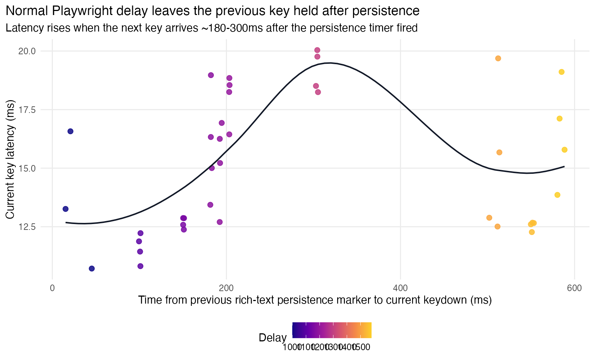

In the scheduler/action trace:

|    Delay | Median time from previous persistence marker to next keydown | Median latency |
| -------: | -----------------------------------------------------------: | -------------: |
| `1100ms` |                                                     `~101ms` |       `11.7ms` |
| `1150ms` |                                                     `~151ms` |       `12.7ms` |
| `1180ms` |                                                     `~182ms` |       `15.7ms` |
| `1200ms` |                                                     `~203ms` |       `18.4ms` |
| `1300ms` |                                                     `~304ms` |       `19.1ms` |
| `1510ms` |                                                     `~512ms` |       `14.3ms` |
| `1550ms` |                                                     `~551ms` |       `12.6ms` |
| `1580ms` |                                                     `~584ms` |       `16.5ms` |

The relationship is not perfectly monotonic; the `1510-1550ms` dip remains a
browser/event-loop phase effect rather than a clean editor-state transition. But
the comparison with `between-keys` and `after-persistence` is enough to say that
the `1200-2000ms` plateau is not a normal "pause between characters" effect. It
is tied to holding a synthetic key down while Gutenberg's one-second rich-text
timer fires.

### Paired Trace: Previous Key State

The next trace repeated the same delay list in two modes with browser, action,
timer, and scheduler tracing enabled:

1. Playwright key-hold delay.
2. Complete keypress, then explicit wait after `keyup`.

The component split shows that the extra measured latency is not primarily
`keydown` or `keyup`; it is almost all `keypress` `EventDispatch` duration.

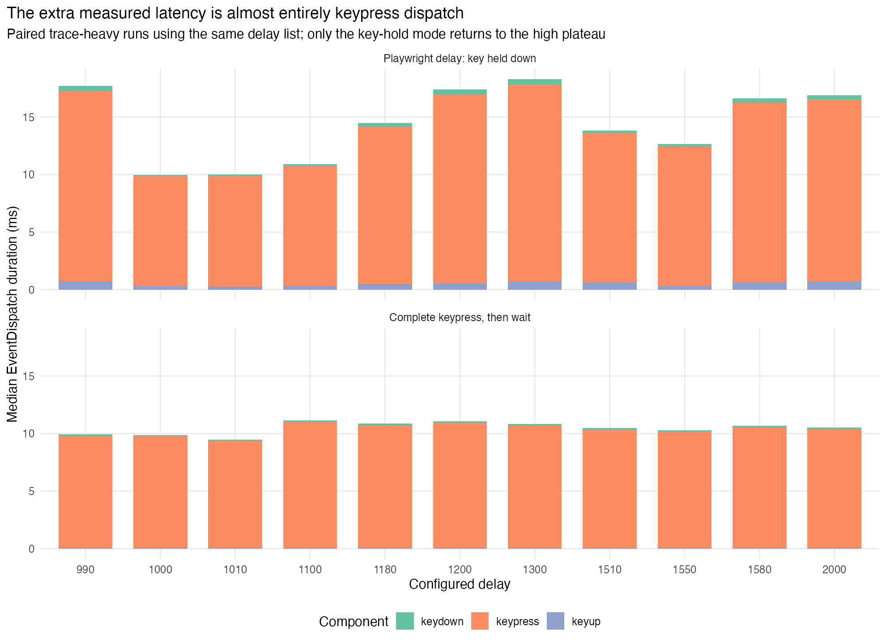

Selected p50s from the paired trace:

| Mode                         |    Delay | Latency p50 | `keypress` p50 |
| ---------------------------- | -------: | ----------: | -------------: |
| Key held during delay        | `1200ms` |    `17.4ms` |       `16.4ms` |
| Complete keypress, then wait | `1200ms` |    `11.1ms` |       `10.9ms` |
| Key held during delay        | `1300ms` |    `18.2ms` |       `17.2ms` |
| Complete keypress, then wait | `1300ms` |    `10.8ms` |       `10.6ms` |
| Key held during delay        | `2000ms` |    `16.9ms` |       `15.8ms` |
| Complete keypress, then wait | `2000ms` |    `10.6ms` |       `10.3ms` |

This paired trace also separates two timing variables that looked confounded in
the earlier scheduler trace:

-   time from the persistence marker to the next keydown;
-   whether that marker fired before the previous keyup.

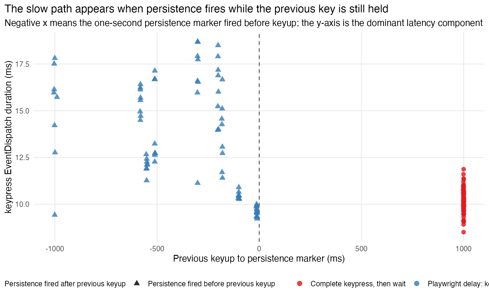

At `1200ms`, both modes have the persistence marker a few hundred milliseconds
before the next keydown. But only the key-hold mode has the marker before the
previous `keyup`.

| Mode                         |    Delay | Previous keyup to marker | Marker to next keydown | `keypress` p50 |
| ---------------------------- | -------: | -----------------------: | ---------------------: | -------------: |
| Key held during delay        | `1200ms` |                 `-201ms` |                `203ms` |       `16.4ms` |
| Complete keypress, then wait | `1200ms` |                 `1000ms` |                `263ms` |       `10.9ms` |
| Key held during delay        | `1300ms` |                 `-302ms` |                `303ms` |       `17.2ms` |
| Complete keypress, then wait | `1300ms` |                 `1000ms` |                `357ms` |       `10.6ms` |
| Key held during delay        | `2000ms` |                `-1001ms` |               `1004ms` |       `15.8ms` |
| Complete keypress, then wait | `2000ms` |                  `999ms` |               `1064ms` |       `10.3ms` |

Negative "previous keyup to marker" means the persistence marker fired while the
previous synthetic key was still down. That is the best current explanation for
why a `1200ms` Playwright delay is slow while a complete keypress followed by a
`1200ms` wait is not.

This still does not fully explain the `1510-1550ms` dip. It says what condition
is necessary for the slow plateau in these runs, and it narrows the visible cost
to `keypress` dispatch, but there is still browser/editor phase behavior inside
the key-hold condition.

### Causality Check: Keyup Gap

The paired trace still left two theories entangled:

1. the persistence timer fired while the previous synthetic key was held; and
2. the next synthetic key arrived almost immediately after the previous `keyup`.

I added a diagnostic delay mode, `hold-then-keyup-gap`, which performs one
`keyboard.press( 'x', { delay } )` per character and can add an explicit wait
after `keyup`. This is not a normal score mode. It is a causality probe for the
event ordering.

The useful surprise is that even with no explicit post-keyup gap, separate
manual `keyboard.press()` calls naturally leave about `40ms` between one `keyup`
and the next `keydown`. Normal Playwright `keyboard.type( 'xxxxx', { delay } )`
leaves only about `2.5ms` in the same trace-heavy setup.

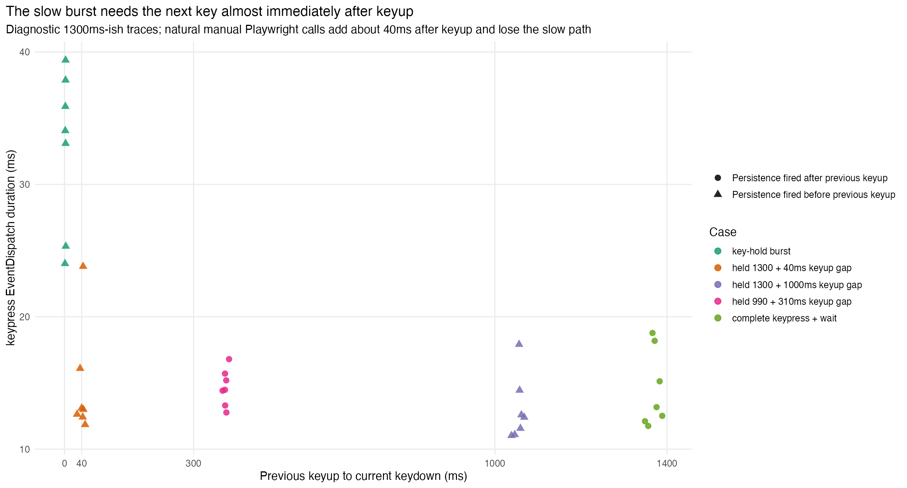

Selected medians from the large-post diagnostic runs:

| Case                                     | Previous keyup to marker | Marker to next keydown | Previous keyup to next keydown | `keypress` p50 |
| ---------------------------------------- | -----------------------: | ---------------------: | -----------------------------: | -------------: |
| Playwright key-hold burst, `1300ms`      |                 `-302ms` |                `304ms` |                        `2.5ms` |       `34.6ms` |
| Manual hold `1300ms`, natural keyup gap  |                 `-302ms` |                `344ms` |                         `41ms` |       `12.8ms` |
| Manual hold `1300ms`, `1000ms` keyup gap |                 `-301ms` |               `1359ms` |                       `1057ms` |       `12.0ms` |
| Manual hold `990ms`, `310ms` keyup gap   |                   `19ms` |                `355ms` |                        `373ms` |       `14.8ms` |
| Complete keypress, then wait `1300ms`    |                  `999ms` |                `372ms` |                       `1373ms` |       `14.1ms` |

This disconfirms the strongest version of the earlier theory. "Persistence fired
while the previous key was held" is not sufficient by itself. Both manual
`1300ms` hold cases have the marker before the previous `keyup`, but neither
reproduces the slow burst once there is even a modest post-keyup gap before the
next key.

It also disconfirms "time from marker to next keydown" as the sole explanation.
The manual `990ms + 310ms` case and complete-keypress `1300ms` case have
marker-to-next-keydown gaps similar to the normal key-hold burst, but they are
not in the same slow distribution. In all five diagnostic cases, the current
`keydown` sees the block editor in the same broad state: persistent and typing.
The discriminating variable in these runs is the previous `keyup` to current
`keydown` gap.

The refined statement is:

-   the normal slow burst needs the persistence marker to fire before the
    previous `keyup`;
-   it also needs the next key to arrive almost immediately after that `keyup`,
    as happens inside one Playwright `keyboard.type()` burst;
-   giving the browser/editor even about `40ms` after `keyup` moves the measured
    keypress back near the complete-keypress-then-wait cases.

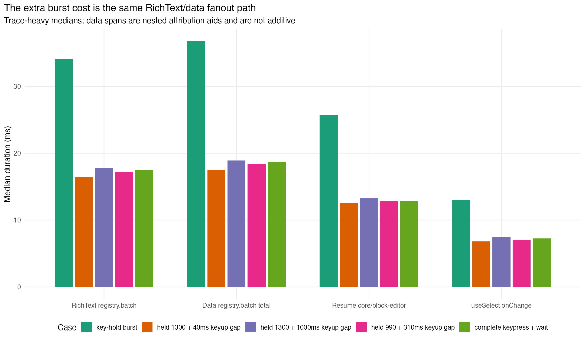

The cost path is the same as in the broader data-span investigation, only larger
in the normal burst:

| Case                                     | RichText `registry.batch` | Data batch | Resume `core/block-editor` | `useSelect.onChange` |
| ---------------------------------------- | ------------------------: | ---------: | -------------------------: | -------------------: |
| Playwright key-hold burst, `1300ms`      |                  `34.1ms` |   `36.8ms` |                   `25.7ms` |             `13.0ms` |
| Manual hold `1300ms`, natural keyup gap  |                  `16.5ms` |   `17.5ms` |                   `12.6ms` |              `6.8ms` |
| Manual hold `1300ms`, `1000ms` keyup gap |                  `17.8ms` |   `18.9ms` |                   `13.3ms` |              `7.4ms` |
| Manual hold `990ms`, `310ms` keyup gap   |                  `17.2ms` |   `18.4ms` |                   `12.9ms` |              `7.1ms` |
| Complete keypress, then wait `1300ms`    |                  `17.5ms` |   `18.7ms` |                   `12.9ms` |              `7.3ms` |

That confirms the attribution but narrows the cause. The extra latency is still
inside the RichText `registry.batch()` -> `core/block-editor` resume ->
`useSelect` fanout path. What changed is the trigger condition: the large burst
does not follow merely from persistent state, typing state, or a timer firing
while the key is held. It follows from the timer/key-hold condition combined
with an almost immediate next key after `keyup`.

The remaining unproven piece is the lower-level scheduling reason that a `2-3ms`
post-keyup gap is bad while a roughly `30-40ms` gap is enough to lose the slow
path.

### Post-Keyup Gap Follow-Up

I then tested the strongest concrete versions of "the gap lets queued work
drain." I reran the normal Playwright burst and the manual `1300ms` hold with:

-   browser/data event tracing;
-   timer, `requestAnimationFrame`, and `requestIdleCallback` tracing;
-   a raw DevTools-timeline gap extractor that records only trace slices between
    the end of the previous `keyup` dispatch and the next `keydown`;
-   DOM key flags: `repeat` and `isComposing`.

The result mostly disconfirms the "queued JS/rendering drains in the gap"
version of the theory.

| Case                                    | Previous keyup to next keydown | `keypress` p50 | Scheduler callbacks in gap | Data actions in gap | Non-key DevTools gap slices | Repeat/composing keys |
| --------------------------------------- | -----------------------------: | -------------: | -------------------------: | ------------------: | --------------------------: | --------------------: |
| Playwright key-hold burst, `1300ms`     |                        `1.7ms` |       `23.1ms` |                        `0` |                 `0` |               `1`, `0.06ms` |               `0 / 8` |
| Manual hold `1300ms`, natural keyup gap |                       `29.3ms` |       `11.7ms` |                        `0` |                 `0` |               `1`, `0.06ms` |               `0 / 8` |

The single median non-key DevTools slice is a tiny
`Responsiveness.Renderer.UserInteraction` bookkeeping event, not layout, paint,
script execution, a timer callback, a RAF callback, or an idle callback. The
manual-gap run had a few samples with small `TimerFire` / `FunctionCall` slices
in the gap, but the median case did not, and those slices are not present in the
normal burst. They do not explain why the manual-gap run is faster.

The DOM event flags also do not explain the difference. In both modes, retained
samples had:

-   `keydown.repeat === false`, `keypress.repeat === false`, and
    `keyup.repeat === false`;
-   `isComposing === false` on keydown, keypress, beforeinput, and input;
-   the same coarse block-editor state at keydown, keypress, beforeinput, and
    input: `isLastBlockChangePersistent() === true` and `isTyping() === true`.

This narrows the theory again. The visible extra cost still appears in the next
`keypress` / RichText / data fanout path, but it is not explained by observable
work draining during the post-keyup gap.

### Input-Path and Raw-CDP Gap Sweep

The next concrete theories were that either the elapsed post-keyup gap, the DOM
keyboard-event payload, or the Playwright `keyboard.press()` wrapper was
decisive. I tested these by adding raw-CDP input modes and by recording fuller
DOM event signatures:

-   `BENCHMARK_DELAY_MODE=cdp-key-hold`, which bypasses Playwright's high-level
    keyboard helpers and dispatches Chromium `Input.dispatchKeyEvent` calls
    directly.
-   `BENCHMARK_DELAY_MODE=type-one-char-hold`, which calls
    `page.keyboard.type( 'x', { delay: 1300 } )` once per character instead of
    one multi-character `keyboard.type()` call.
-   `BENCHMARK_DELAY_MODE=down-up-key-hold`, which calls
    `page.keyboard.down( 'x' )`, waits `1300ms`, then calls
    `page.keyboard.up( 'x' )` once per character.
-   `BENCHMARK_DELAY_MODE=cdp-key-hold-page-evaluate`, which uses raw CDP key
    events but runs a no-op `page.evaluate()` between characters.
-   `BENCHMARK_DELAY_MODE=cdp-key-hold-runtime-evaluate`, which uses raw CDP key
    events but runs a no-op `Runtime.evaluate` through the same CDP session
    between characters.

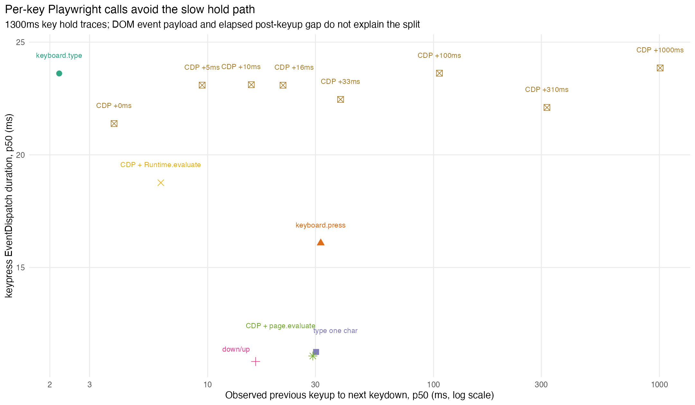

This disconfirms the simple versions of the gap, wrapper, and event-payload
theories. With 20 retained samples in the main comparison cases:

| Input path                                    | Retained samples | Requested post-keyup gap | Observed post-keyup gap p50 | `keypress` p50 |
| --------------------------------------------- | ---------------: | -----------------------: | --------------------------: | -------------: |
| Playwright `keyboard.type( 'x'.repeat( n ) )` |             `20` |                    `0ms` |                     `2.2ms` |       `23.6ms` |
| Playwright `keyboard.press( 'x' )` per key    |             `20` |                    `0ms` |                    `31.7ms` |       `16.1ms` |
| Playwright `keyboard.type( 'x' )` per key     |             `20` |                    `0ms` |                    `30.2ms` |       `11.3ms` |
| Playwright `keyboard.down/up( 'x' )` per key  |             `20` |                    `0ms` |                    `16.3ms` |       `10.8ms` |
| Raw CDP `Input.dispatchKeyEvent`              |             `20` |                    `0ms` |                     `3.9ms` |       `21.4ms` |
| Raw CDP `Input.dispatchKeyEvent`              |             `20` |                   `16ms` |                    `21.6ms` |       `23.1ms` |
| Raw CDP `Input.dispatchKeyEvent`              |             `20` |                 `1000ms` |                  `1007.8ms` |       `23.9ms` |
| Raw CDP plus `page.evaluate()`                |             `20` |                    `0ms` |                    `29.2ms` |       `11.1ms` |
| Raw CDP plus CDP `Runtime.evaluate`           |             `20` |                    `0ms` |                     `6.2ms` |       `18.8ms` |

The raw-CDP `keyUp` payload initially differed slightly from Playwright's
Chromium keyboard path. I checked the Playwright protocol log and then changed
the raw-CDP helper so `keyDown` carries `text`, `unmodifiedText`, `commands`,
`autoRepeat`, and `isKeypad`, while `keyUp` carries only the fields Playwright
sends for keyup. Raw CDP remained slow after that change, so the CDP packet shape
is not the explanation.

The browser events also match at the DOM level. In the fresh slow and fast runs,
the full event signatures were identical for `keydown`, `keypress`,
`beforeinput`, `input`, and `keyup`: trusted events, the same key/code/location,
the same keyCode/charCode/which values, no modifiers, no repeat, no composition,
and the same cancelable/default-prevented flags. The coarse editor state was
also the same at the key events: `isLastBlockChangePersistent() === true` and
`isTyping() === true`.

The matched-gap comparisons disconfirm elapsed post-keyup time as the primary
cause. Playwright `down/up` is fast at an observed `16.3ms` gap, while raw CDP
is slow at an observed `21.6ms` gap. Raw CDP is still slow after a `1007.8ms`
gap, so merely waiting longer after `keyup` does not produce the fast path.

The no-op evaluation probes add one more boundary:

-   Raw CDP plus `page.evaluate( () => undefined )` between keys becomes as fast
    as the per-key Playwright paths.
-   Raw CDP plus direct CDP `Runtime.evaluate` through the same session improves
    partway, but does not fully reach the `page.evaluate()` / Playwright
    per-key-call path.

That refines the previous "per-character Playwright action boundary" theory.
The boundary is real, but it is not specific to `keyboard.press()` and not
explained by a different DOM event sequence. A page-evaluation/action boundary
between raw CDP keys is also sufficient to flip the next Gutenberg input to the
fast distribution. A bare runtime evaluation on the same CDP session only
partially reproduces it.

The current model is therefore:

1. The slow path does not require the multi-character Playwright
   `keyboard.type()` helper. Raw CDP long-held key events reproduce most of it.
2. The fast path does not require the `keyboard.press()` wrapper specifically.
   One-character `keyboard.type()` calls, explicit `keyboard.down()` /
   `keyboard.up()` calls, and raw CDP plus `page.evaluate()` are all faster.
3. The fast path is not caused by the elapsed post-keyup gap, by DOM event
   payload differences, by key repeat/composition state, or by the exact CDP
   keyup packet shape.
4. The remaining boundary is below the ordinary JS scheduler/data-action traces:
   crossing a Playwright/page-evaluation boundary between keys appears to force a
   renderer or editor checkpoint that changes the next RichText/data fanout path.

That means the safe benchmark fix is unchanged: do not use a synthetic key-hold
delay as a proxy for typing pauses. Use a complete keypress and then wait, or
replay recorded human typing. For root cause, the next useful probe is below the
DOM event layer: compare the browser/renderer work and execution contexts used
by `page.evaluate()`, Playwright per-key actions, direct CDP `Runtime.evaluate`,
and raw `Input.dispatchKeyEvent`.

### Native Contenteditable Baseline

The key-state traces show conditions that separate slow and fast Gutenberg
traces, but they do not prove that the condition is a browser/Playwright effect
by itself. To test that, the benchmark now has `native-contenteditable-timer`: a
plain `contenteditable` node with an input listener that clears and reschedules a
`1000ms` timer. The timer records the same kind of marker, but it does not touch
Gutenberg, React, `@wordpress/data`, rich text, undo persistence, block
selection, or the iframe editor.

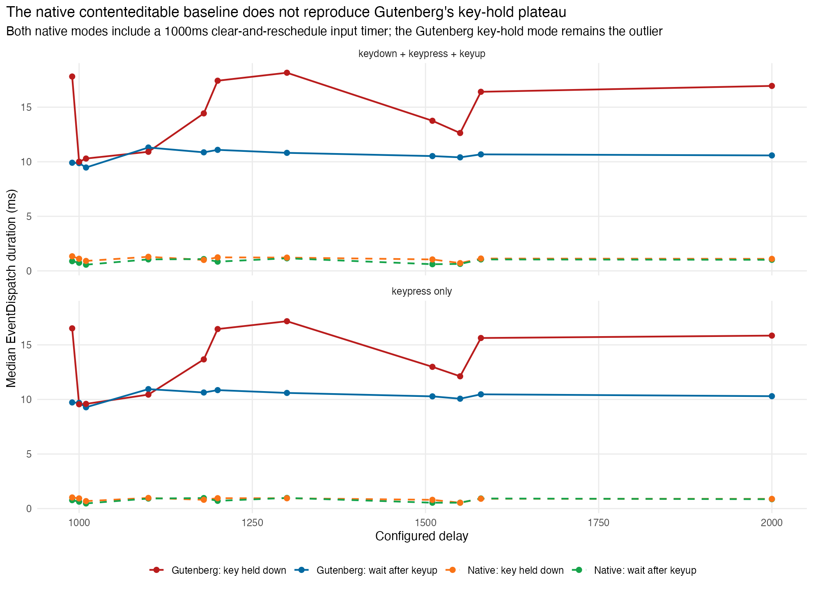

The native baseline does not reproduce the Gutenberg key-hold plateau:

| Scenario                 | Mode             |    Delay | Latency p50 | `keypress` p50 |
| ------------------------ | ---------------- | -------: | ----------: | -------------: |
| Gutenberg                | key held         | `1200ms` |    `17.4ms` |       `16.4ms` |
| Gutenberg                | wait after keyup | `1200ms` |    `11.1ms` |       `10.9ms` |
| Native `contenteditable` | key held         | `1200ms` |     `1.2ms` |        `1.0ms` |
| Native `contenteditable` | wait after keyup | `1200ms` |     `0.8ms` |        `0.7ms` |
| Gutenberg                | key held         | `2000ms` |    `16.9ms` |       `15.8ms` |
| Gutenberg                | wait after keyup | `2000ms` |    `10.6ms` |       `10.3ms` |
| Native `contenteditable` | key held         | `2000ms` |     `1.1ms` |        `0.9ms` |
| Native `contenteditable` | wait after keyup | `2000ms` |     `1.0ms` |        `0.9ms` |

The native timing data still has the marker before `keyup` in key-hold mode. For
example, at `1200ms`, the marker fired about `201ms` before the previous `keyup`;
at `2000ms`, it fired about `1001ms` before the previous `keyup`. Even so,
`keypress` dispatch stayed around `1ms`.

That rules out a pure Chromium/Playwright explanation for the Gutenberg plateau.
The current model is:

1. Playwright's delay creates an unrealistic long-held key.
2. Gutenberg's rich-text persistence timer fires while that key is still held.
3. The next synthetic keypress runs Gutenberg's heavier editor input path,
   visible mostly as `keypress` `EventDispatch` duration.
4. Recent CPU work near the next key modulates that measured path. Later
   task-end, worker, external child-process, and native busy-timer controls show
   this modulation is not purely semantic editor state, but Gutenberg's editor
   stack is needed for the large absolute swing.

This is narrower than the previous conclusion. The timer/key-hold timing is a
necessary diagnostic signal in the Gutenberg traces, but not sufficient without
Gutenberg's editor stack.

### Listener Trace: RichText Input

The next pass patched `EventTarget.prototype.addEventListener` before the editor
loaded and injected the same tracer into the editor canvas iframe. This is
diagnostic instrumentation, not a score run: wrapping listeners adds overhead and
the listener durations do not need to sum exactly to Chromium's `EventDispatch`
trace duration. It is still useful because it localizes where the measured
JavaScript callback time is going.

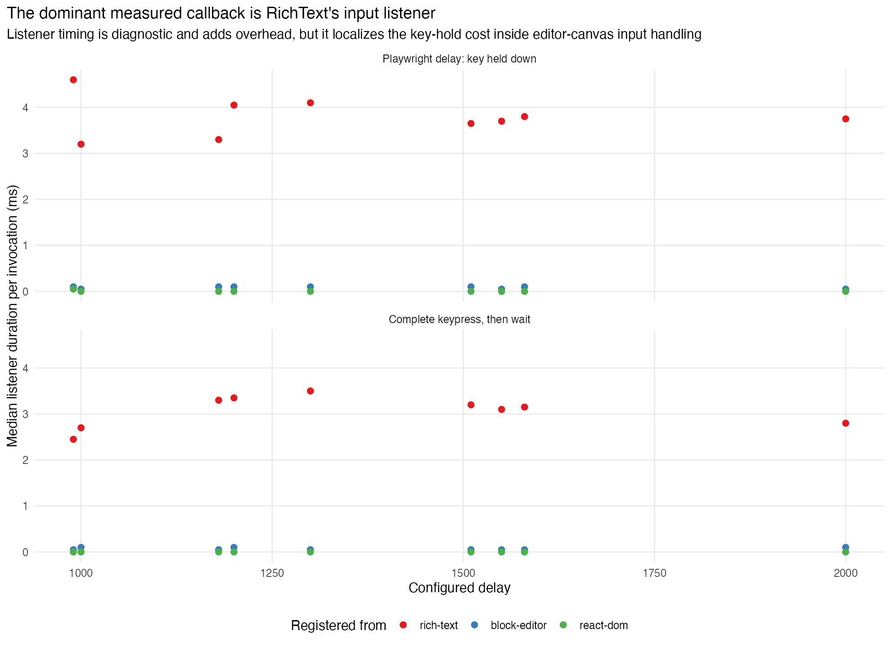

In the targeted listener trace, the dominant measured callback was an
editor-canvas `input` listener registered from `build/scripts/rich-text/`. Parent
frame keydown listeners, React delegation wrappers, keyboard-shortcut listeners,
and `block-editor` input listeners were small by comparison.

Selected values:

| Mode             |    Delay | Latency p50 | RichText input median | RichText input p90 |
| ---------------- | -------: | ----------: | --------------------: | -----------------: |
| key held         | `1200ms` |    `17.5ms` |               `4.1ms` |           `10.0ms` |
| wait after keyup | `1200ms` |    `11.0ms` |               `3.4ms` |            `7.0ms` |
| key held         | `1300ms` |    `18.7ms` |               `4.1ms` |           `10.5ms` |
| wait after keyup | `1300ms` |    `11.4ms` |               `3.5ms` |            `7.2ms` |
| key held         | `1550ms` |    `12.6ms` |               `3.7ms` |            `7.7ms` |
| wait after keyup | `1550ms` |    `10.5ms` |               `3.1ms` |            `6.5ms` |

This explains why the browser trace reports the cost as `keypress`
`EventDispatch` even though the largest explicit listener callback is on `input`:
for text entry, the key event causes the input path, and Chromium's dispatch
slice covers that induced work. The listener trace also sharpens the open
question about the `1510-1550ms` dip. The dip is visible inside the same
RichText-input path, not in parent-frame keyboard shortcuts or generic React
delegation.

Source-map lookup of the hot registration stack maps
`build/scripts/rich-text/index.min.js:4:19679` to
`packages/rich-text/src/hook/event-listeners/input-and-selection.js:255`, the
`element.addEventListener( 'input', onInput )` registration. That `onInput`
callback calls:

-   `createRecord()` in `packages/rich-text/src/hook/index.js`, which reads the
    selection/range and parses the editable DOM through
    `packages/rich-text/src/create.js`;
-   `updateFormats()` in `packages/rich-text/src/update-formats.js`;
-   `handleChange()` in `packages/rich-text/src/hook/index.js`, which applies the
    record, serializes it, batches `onSelectionChange` and `onChange`, then forces
    a render.

The listener wrapper measures the whole callback, so it does not prove which
sub-step dominates. It does rule out the parent frame, keyboard shortcuts, and
generic React delegation as the main visible callback cost.

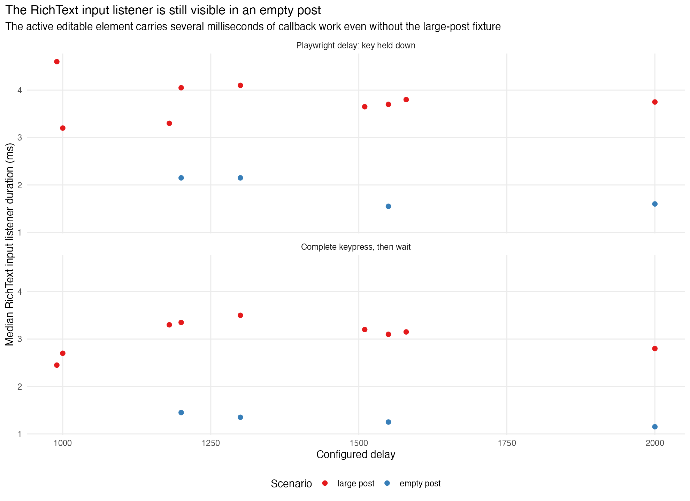

I also ran an empty-post listener trace at `1200ms`, `1300ms`, `1550ms`, and
`2000ms`. The same RichText input listener remains visible, but it is cheaper
than in the large-post fixture. That means the active RichText input path has a
baseline cost, while the larger editor/post state makes the path substantially
more expensive.

Selected values from the listener traces:

| Scenario   | Mode             |    Delay | Latency p50 | RichText input median | RichText input p90 |
| ---------- | ---------------- | -------: | ----------: | --------------------: | -----------------: |
| large post | key held         | `1200ms` |    `17.5ms` |               `4.1ms` |           `10.0ms` |
| empty post | key held         | `1200ms` |    `11.8ms` |               `2.2ms` |            `5.6ms` |
| large post | wait after keyup | `1200ms` |    `11.0ms` |               `3.4ms` |            `7.0ms` |
| empty post | wait after keyup | `1200ms` |     `7.1ms` |               `1.5ms` |            `3.2ms` |
| large post | key held         | `2000ms` |    `15.2ms` |               `3.7ms` |            `8.3ms` |
| empty post | key held         | `2000ms` |     `9.6ms` |               `1.6ms` |            `5.4ms` |

The data-action trace from the same runs is consistent with this. Ordinary input
actions such as `selectionChange` and `updateBlockAttributes` have sub-millisecond
median dispatch times in these traces. The heavier
`__unstableMarkLastChangeAsPersistent` action is a timer-side event, and its
median is much larger in the large-post listener run (`~12ms`) than in the
empty-post control (`~3ms`).

### Source-Level RichText Spans

The listener trace still treated `onInput` as one callback. I added opt-in
benchmark spans inside `@wordpress/rich-text` and reran targeted traces for the
large-post and empty-post scenarios, in both key-held and wait-after-keyup modes.
These runs used the same delay set: `990ms`, `1000ms`, `1200ms`, `1300ms`,
`1550ms`, and `2000ms`.

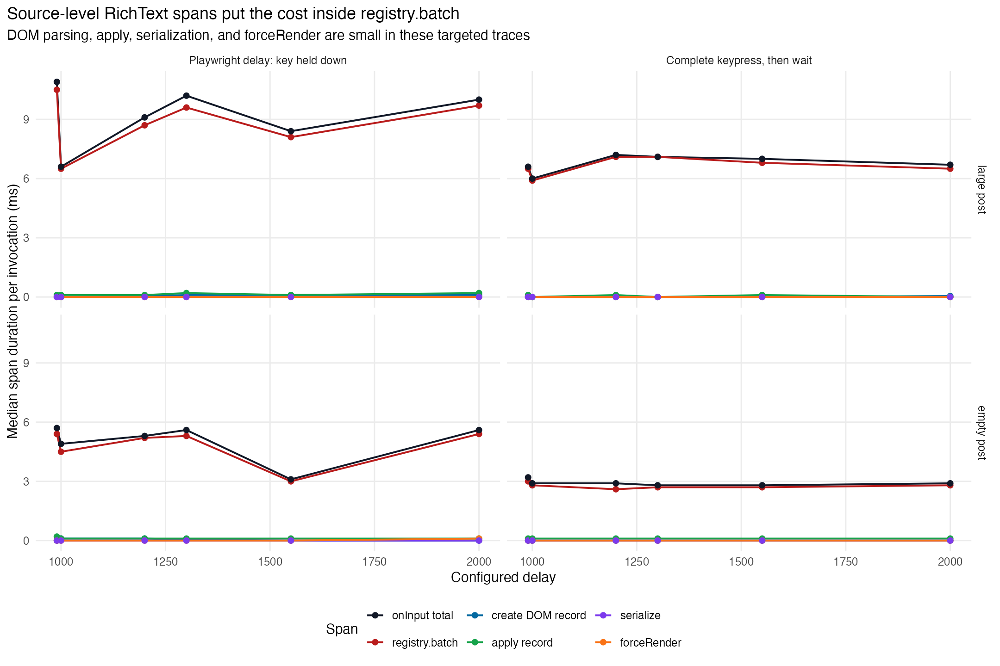

The split is sharp: `createRecord()`, `updateFormats()`, `applyRecord()`,
serialization, and `forceRender()` are all small at this timer resolution. The
dominant span is `registry.batch()` inside `handleChange()`.

Selected medians:

| Scenario   | Mode             |    Delay | `onInput` | `registry.batch` | Create DOM record | Apply record | Serialize |
| ---------- | ---------------- | -------: | --------: | ---------------: | ----------------: | -----------: | --------: |
| large post | key held         |  `990ms` |  `10.9ms` |         `10.5ms` |           `0.0ms` |      `0.1ms` |   `0.0ms` |
| large post | key held         | `1000ms` |   `6.6ms` |          `6.5ms` |           `0.0ms` |      `0.1ms` |   `0.0ms` |
| large post | key held         | `1300ms` |  `10.2ms` |          `9.6ms` |           `0.1ms` |      `0.2ms` |   `0.0ms` |
| large post | wait after keyup | `1300ms` |   `7.1ms` |          `7.1ms` |           `0.0ms` |      `0.0ms` |   `0.0ms` |
| empty post | key held         | `1300ms` |   `5.6ms` |          `5.3ms` |           `0.1ms` |      `0.1ms` |   `0.0ms` |
| empty post | wait after keyup | `1300ms` |   `2.8ms` |          `2.7ms` |           `0.0ms` |      `0.1ms` |   `0.0ms` |

That changes the next hypothesis. The expensive part is not DOM-to-RichText
record creation or HTML serialization. It is synchronous work hidden behind
`registry.batch()` after RichText calls into the block editor.

I then split the batch itself into direct `onSelectionChange`, direct `onChange`,
and the remaining time.

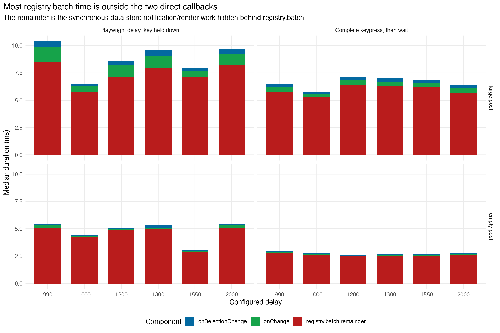

The direct callbacks are small. The large-post key-held `1300ms` case had median
`registry.batch()` time of `9.6ms`, but direct `onSelectionChange` was `0.5ms`
and direct `onChange` was `1.2ms`. The remaining `~7.9ms` is synchronous work
around the batch, most likely data-store notification/subscriber/render work
triggered when the batch completes. This is an inference from the span nesting,
not yet a direct subscriber-level attribution.

Selected batch split:

| Scenario   | Mode             |    Delay | `registry.batch` | Direct selection | Direct change | Batch remainder |
| ---------- | ---------------- | -------: | ---------------: | ---------------: | ------------: | --------------: |
| large post | key held         |  `990ms` |         `10.5ms` |          `0.5ms` |       `1.4ms` |         `8.5ms` |
| large post | key held         | `1000ms` |          `6.5ms` |          `0.2ms` |       `0.5ms` |         `5.8ms` |
| large post | key held         | `1300ms` |          `9.6ms` |          `0.5ms` |       `1.2ms` |         `7.9ms` |
| large post | wait after keyup | `1300ms` |          `7.1ms` |          `0.3ms` |       `0.4ms` |         `6.3ms` |
| empty post | key held         | `1300ms` |          `5.3ms` |          `0.2ms` |       `0.1ms` |         `5.0ms` |
| empty post | wait after keyup | `1300ms` |          `2.7ms` |          `0.1ms` |       `0.1ms` |         `2.5ms` |

This also explains why the large-post fixture matters. The same path exists in
the empty post, but the post/editor state makes the synchronous batch remainder
larger. The key-held mode makes it larger again, especially outside the `1000ms`
fast band.

### Data Registry And useSelect Spans

The RichText spans still could not say what happened inside `registry.batch()`.
I added opt-in source spans in `@wordpress/data` around registry batching,
emitter resume/notification, Redux-store subscriber loops, and `useSelect`
subscriber callbacks. To keep the diagnostic data tractable, the default data
span mode records only spans nested under an input-matched `registry.batch()`.

The four data-span runs used the same six delays as the RichText runs:
`990ms`, `1000ms`, `1200ms`, `1300ms`, `1550ms`, and `2000ms`, with large-post
and empty-post fixtures in key-held and wait-after-keyup modes.

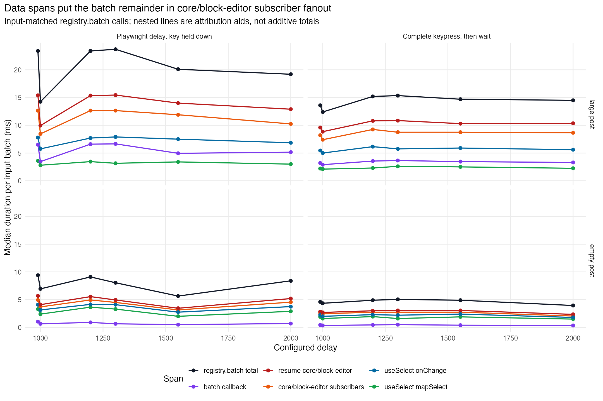

The next split is also sharp. For the large-post fixture, most of the batch time
is `core/block-editor` store-emitter resume. Inside that, the largest measured
piece is store-subscriber fanout, especially `useSelect` subscription callbacks.
`useSelect` then spends a material fraction of that time recomputing selector
results (`mapSelect`) before React's external-store listener returns.

Selected input-matched medians:

| Scenario   | Mode             |    Delay | Data batch | Callback | Resume `core/block-editor` | Block-editor subscribers | `useSelect` onChange | `mapSelect` |
| ---------- | ---------------- | -------: | ---------: | -------: | -------------------------: | -----------------------: | -------------------: | ----------: |
| large post | key held         |  `990ms` |   `23.4ms` |  `6.5ms` |                   `15.4ms` |                 `12.7ms` |              `7.8ms` |     `3.6ms` |
| large post | key held         | `1000ms` |   `14.2ms` |  `3.5ms` |                   `10.0ms` |                  `8.5ms` |              `5.8ms` |     `2.8ms` |
| large post | key held         | `1300ms` |   `23.7ms` |  `6.7ms` |                   `15.5ms` |                 `12.7ms` |              `7.9ms` |     `3.2ms` |
| large post | wait after keyup | `1300ms` |   `15.3ms` |  `3.7ms` |                   `10.9ms` |                  `8.8ms` |              `5.8ms` |     `2.6ms` |
| empty post | key held         | `1300ms` |    `8.1ms` |  `0.7ms` |                    `5.0ms` |                  `4.5ms` |              `4.1ms` |     `3.3ms` |
| empty post | wait after keyup | `1300ms` |    `5.1ms` |  `0.5ms` |                    `3.1ms` |                  `2.8ms` |              `2.2ms` |     `1.6ms` |

These spans are nested, so the columns should not be added together. For example,
`core/block-editor` subscribers are inside `core/block-editor` resume, and
`useSelect` work is inside the subscriber fanout.

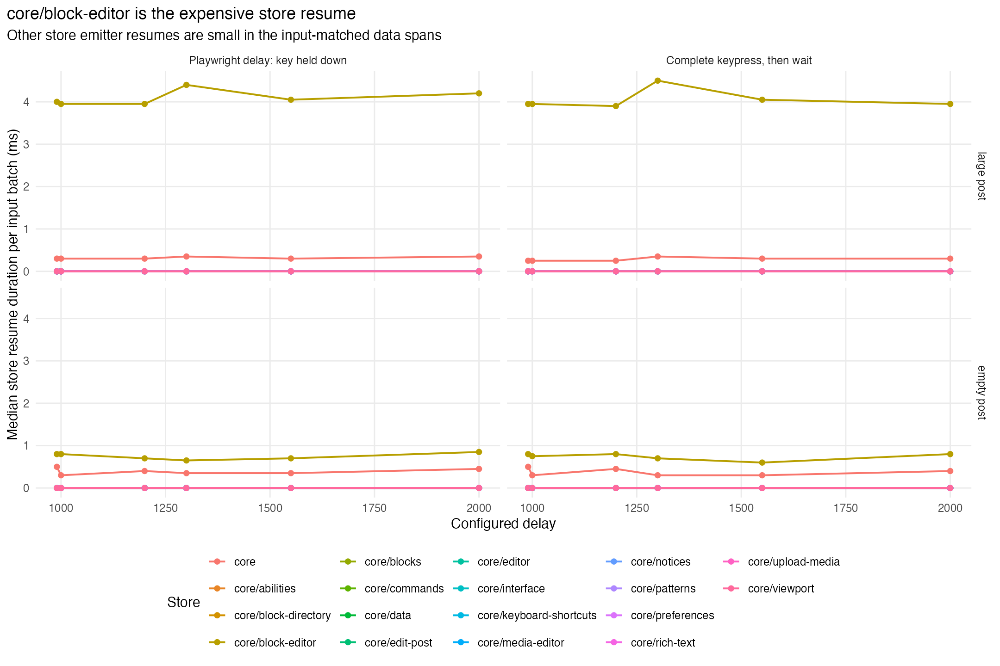

The store-resume plot shows why the earlier "data-store notification" inference
was too broad. The expensive store is not an even spread across the registry:
`core/block-editor` is the dominant resume in the input-matched batches. Other
stores are small in this workload.

### useSelect Owner Attribution

The previous data-span pass stopped at "subscriber fanout." I added one more
diagnostic layer: when data-span tracing is active, each `useSelect` hook instance
gets a stable ID, and the benchmark records the hook's call stack and
`mapSelect` source once. A compact extractor then joins those IDs back to the hot
`useSelect` spans and source-map-resolves the first non-`@wordpress/data`,
non-React frame.

This trace is intentionally small: large-post fixture only, key-held and
wait-after-keyup modes, delays `990ms`, `1000ms`, `1300ms`, `1550ms`, and
`2000ms`, one round, and four retained samples per delay. The raw JSON is large
because it carries per-subscriber span events; the committed CSV is the compact
derived form.

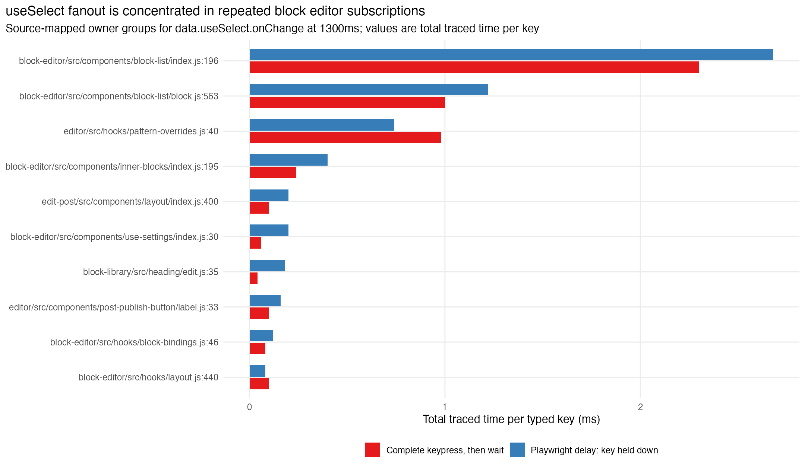

At `1300ms`, the dominant `useSelect` owner group is
`packages/block-editor/src/components/block-list/index.js:196`. In this large
fixture it had `580` active hook instances and `2900` `onChange` span events in
one delay run. That single source-mapped group accounts for about `2.7ms` of
traced `useSelect.onChange` time per key in the key-held trace and `2.3ms` per
key in the wait-after-keyup trace.

The next high-fanout groups are also block-tree/editor-wide subscriptions, not a
single isolated callback:

| Source                                                           | Instances | Events | Key-held `onChange` ms/key | Wait-after-keyup `onChange` ms/key |
| ---------------------------------------------------------------- | --------: | -----: | -------------------------: | ---------------------------------: |
| `packages/block-editor/src/components/block-list/index.js:196`   |     `580` | `2900` |                     `2.68` |                             `2.30` |
| `packages/block-editor/src/components/block-list/block.js:563`   |    `1437` | `7185` |                     `1.22` |                             `1.00` |
| `packages/editor/src/hooks/pattern-overrides.js:40`              |    `1437` | `7185` |                     `0.74` |                             `0.98` |
| `packages/block-editor/src/components/inner-blocks/index.js:195` |     `580` | `2900` |                     `0.40` |                             `0.24` |

The same ranking appears if we look specifically at `mapSelect` time, though
the per-instance medians are mostly below the timer resolution. The meaningful
signal is aggregate fanout: many cheap selectors running thousands of times per
delay run. At `1300ms`, the `block-list/index.js:196` group alone contributed
about `1.4ms` of traced `mapSelect` time per key in key-held mode and `1.2ms`
per key in wait-after-keyup mode.

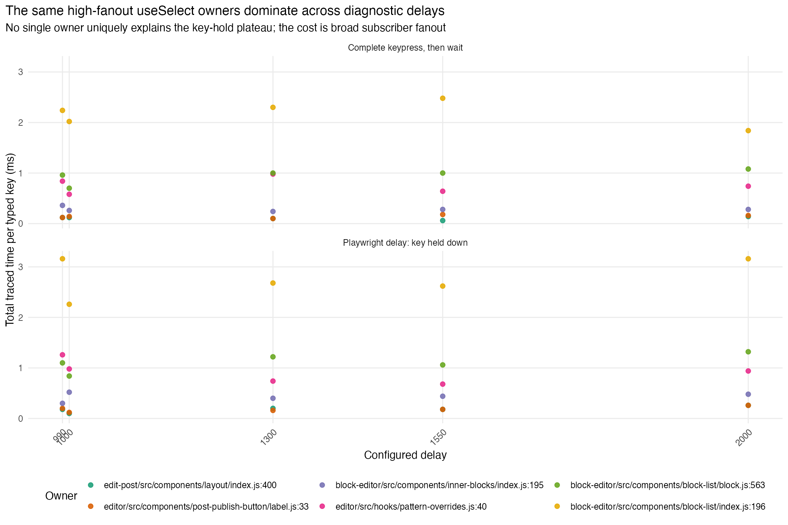

This does not overturn the earlier key-hold conclusion. The owner trace does not
find one selector that appears only in the slow key-held plateau. Instead, the
same high-fanout owners dominate both modes and all diagnostic delays. Key-held
mode is usually somewhat higher for the top block-list owners, but the delta is
spread across many subscriber callbacks. The mechanism is better described as
"large block editor subscriber fanout on the input path" than as "one bad
selector."

The remaining open question moved one level lower again: which of these
block-list subscriptions are necessary on every typed character, and which can be
made less sensitive to ordinary RichText text updates.

## Scenario Sensitivity

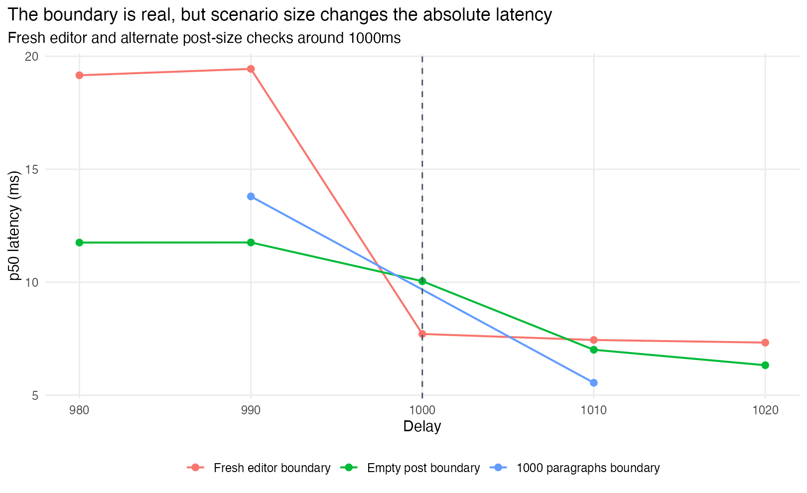

The boundary appears in multiple scenarios, but absolute latency changes with
post size and fixture shape. The large mixed post is slower than an empty post
near the boundary. A synthetic thousand-paragraph post does not reproduce all of
the large mixed fixture's cost, which suggests that block type mix and editor
state matter, not just block count.

Selected p50s:

| Scenario                 |    Delay |        p50 |
| ------------------------ | -------: | ---------: |
| large post, fresh editor |  `990ms` | `19.441ms` |
| large post, fresh editor | `1000ms` |  `7.710ms` |
| empty post               |  `990ms` | `11.761ms` |
| empty post               | `1010ms` |  `7.012ms` |
| thousand paragraphs      |  `990ms` | `13.798ms` |
| thousand paragraphs      | `1010ms` |  `5.551ms` |

## Trace Grouping Bug Avoided

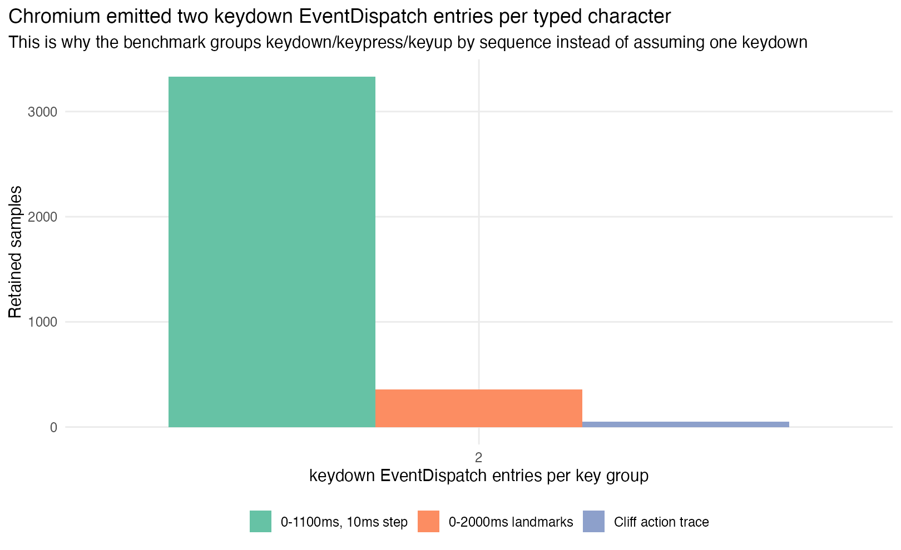

In the Gutenberg editor traces in this local Chromium environment, every retained
sample had two `keydown` `EventDispatch` entries. Across 7640 retained Gutenberg
samples in the committed derived data, zero had a `keydown` count other than two.
The native `contenteditable` baseline had one `keydown` per retained sample.

That means any parser that assumes exactly one `keydown` trace event per typed
character is fragile. This benchmark groups trace events into key sequences and
uses the final keydown event for `latency_ms`, while also preserving
`latency_all_keydowns_ms`.

## Issues In The Original Benchmark

The original exploration was valuable because it found the weird `1000ms` point,
but it should not be used as a tuning basis without caveats.

Problems:

-   **Sparse delay grid.** The important features are narrower than the original
    `100ms` spacing.
-   **Too few samples.** Ten retained samples per delay is not enough to estimate
    variance or detect mixed distributions.
-   **Averages hide structure.** p50/p10/p90 and raw distributions show regime
    changes that averages flatten.
-   **No time-order analysis.** Without per-sample order, warmup, drift, GC,
    scheduled work, and long-session degradation are mostly invisible.
-   **One scalar conflates workloads.** Continuous typing, idle-then-key latency,
    and persistent-undo-path latency are different workloads.
-   **Delay changes editor semantics.** At `1000ms`, the rich-text persistence
    timer fires between keys, so the benchmark changes the state path it measures.
-   **Playwright's delay is a key-hold delay.** For US-keyboard characters, the
    delay is applied between `keydown` and `keyup`, so large values do not model a
    user pausing between completed keystrokes.
-   **`1000ms` was selected because it looked stable.** It is stable partly because
    it enters a special path. That makes it a poor representative of normal typing.
-   **Long delays are unrealistic as typing.** A one-second or two-second gap may be
    a useful idle-input latency test, but it should not be called typing throughput.

## Issues In The New Benchmark

The new benchmark fixes several measurement problems, but it is not a final CI
metric.

Known problems:

-   **It still measures trace-event handler duration, not input-to-paint.** The
    user-visible latency question needs a DOM/layout/paint or screen-observation
    endpoint.
-   **Synthetic keyboard input is not real keyboard input.** Playwright's
    `page.keyboard.type()` is useful, but it is not a hardware-to-screen pipeline.
-   **There are now multiple delay modes.** This is useful for diagnosis, but any
    CI metric has to choose one deliberately and name it according to what it
    actually measures.
-   **The local machine is uncontrolled.** CPU governor, thermal state, background
    processes, browser version, and OS scheduling were not isolated in a Krun-like
    environment.
-   **Dense long-delay scans are expensive.** The `1110..2000ms` dense extension
    used one round, so it is a shape-finding run, not a high-confidence estimate.
-   **Instrumentation perturbs behavior.** Action tracing and timer rewriting add
    overhead; they should be used to explain behavior, not to report benchmark
    scores.
-   **Listener tracing perturbs behavior even more.** It monkey-patches
    `addEventListener`, so use it only to localize costs, not to report latency
    scores.
-   **Source-level RichText span tracing also perturbs behavior.** It adds timing
    calls inside hot input code and requires rebuilding the package scripts. It is
    diagnostic attribution, not a benchmark score.
-   **Source-level data span tracing is heavier still.** Even after filtering to
    input-matched batch spans, it instruments hot emitter and `useSelect` paths.
    Treat it as attribution, not latency scoring.
-   **`useSelect` owner attribution is heavier again.** It records source stacks
    once per hook instance and joins hundreds of thousands of subscriber-span
    events. It is useful for ranking owners, not for reporting latency scores.
-   **The paired trace is diagnostic, not a score run.** It uses only 8 retained
    samples per delay and heavy instrumentation. Its value is in comparing modes
    under similar tracing overhead.
-   **The keyup-gap causality traces are also diagnostic.** The manual
    `hold-then-keyup-gap` mode uses separate Playwright `keyboard.press()` calls,
    which naturally add about `40ms` between `keyup` and the next `keydown` even
    when no explicit gap is requested. That is useful for causality, but it is not
    a replacement score mode.
-   **The raw-CDP input-path traces are diagnostic.** They bypass Playwright's
    public keyboard API and then add artificial page/runtime evaluation
    boundaries. They are useful for falsifying gap and event-payload theories,
    not for defining a user-facing benchmark.
-   **The native baseline is intentionally too small.** It is useful as a browser
    and Playwright control, not as a model of real editor work.
-   **Chromium-heavy source tracing.** The cross-browser listener/timer checks
    cover Firefox and WebKit, but the source-level RichText/data/useSelect
    attribution is still Chromium-only.
-   **Single local setup.** More process executions and fresh browser contexts are
    needed before treating absolute numbers as portable.
-   **No real typing distribution.** Real users type with bursts, corrections,
    pauses, navigation, composition, and selection changes. Fixed-delay `x`
    insertion is an artificial stressor.
-   **No plugin/theme cofactor coverage.** The issue discussion mentioned lag that
    appeared outside vanilla Core. This benchmark does not cover plugin-heavy or
    P2-like editor setups.

## Audit Lenses

These are not endorsements or actual reviews by these people. They are different
failure-oriented ways to read the data.

### Linus Torvalds-style audit

-   Do not name the metric "typing performance" if it types one character every
    `1000ms` or `2000ms`.
-   Do not tune CI around a magic constant that is also a code path boundary.
-   Assert invariants in the benchmark. The duplicate-keydown finding is exactly
    the kind of trace-parser assumption that should fail loudly.
-   Keep the benchmark small enough to understand. A single scalar from a
    complicated browser/editor trace is not self-explanatory.
-   Separate product behavior from measurement behavior. `1000ms` is not just a
    wait; it causes `MARK_LAST_CHANGE_AS_PERSISTENT`.

### Kyle Kingsbury-style audit

-   Preserve histories. The derived CSVs keep per-sample order, delay, round,
    editor setup, and state transitions.
-   Prefer distributions over means. The benchmark has partitions: `990ms` and
    `1000ms` are different histories, not nearby samples from one population.
-   Do interventions when possible. Rewriting the `1000ms` timer to `500ms` is a
    causal test, and the cliff moved with it.
-   Randomize and repeat. Mixed order and fresh-editor checks are necessary because
    deterministic order can alias with periodic work.
-   State the model being tested. This test is not a linear latency function of
    delay; it is a state machine plus browser scheduling plus editor work.

### Dan Luu-style audit

-   The strange data point is the result, not noise. The `1000ms` dip identified a
    real editor timer.
-   Look at time. The time-order plot does not support a simple warmup story, but
    the runs are still too short to clear long-session concerns.
-   Make the benchmark adversarial. Try alternate delays, longer wall-clock runs,
    fresh editors, randomized order, and timer interventions.
-   Measure the thing users see. Trace-event latency is useful for diagnosis, but
    input-to-paint or high-speed-camera calibration would answer a different and
    more user-facing question.
-   Do not assume representativeness. Vanilla Core, a large fixture, a synthetic
    thousand-paragraph post, and plugin-heavy editors can all expose different
    behavior.

## Recommendations

For CI:

-   Keep separate metrics for continuous typing and idle-input latency.
-   Rename the long-wait metric to something like `inputLatencyAfterIdle`, not
    "typing".
-   Do not choose `1000ms` as a generic stable delay. It crosses the rich-text
    persistence boundary.
-   Do not use `keyboard.type(..., { delay: 1000 })` or `2000` to mean "wait
    after typing a character." It holds the key down. Use an explicit wait after a
    complete keypress if that is the intended workload.
-   If the goal is "after rich text has persisted", wait on
    `isLastBlockChangePersistent()` explicitly and name the metric that way.
-   Store per-sample results and at least p50/p90/CV, not only averages.
-   Keep trace-parser invariants: expected key groups, keydown count distribution,
    and event ordering.

For investigation:

-   Run wall-clock-equalized benchmarks, e.g. 60 seconds per delay, instead of a
    fixed number of samples per delay.
-   Run fresh browser contexts and fresh posts for each delay when comparing delay
    values.
-   Split the RichText `onInput` callback into source-level timing spans for
    `createRecord`, `applyRecord`, serialization, data dispatch, and render.
-   Extend the `useSelect` owner traces from source-mapped hook callbacks to
    React render ownership, so the components woken by the `core/block-editor`
    fanout are identifiable.
-   For the block-list owner groups identified here, separate necessary
    text-input invalidations from broad block-tree invalidations.
-   Keep instrumenting around the post-keyup interval, but focus below ordinary
    JS callbacks. Timer, RAF, idle, data-action, key-flag, and DevTools timeline
    checks did not explain why a roughly `30-40ms` gap changes the next input
    path.
-   Compare the browser/renderer boundary crossed by Playwright per-key actions
    and `page.evaluate()` against direct `Input.dispatchKeyEvent`. Raw CDP stays
    slow even with long post-keyup gaps and DOM-equivalent events, while raw CDP
    plus `page.evaluate()` is fast. The remaining difference is below the DOM
    event sequence and ordinary JS callback traces.
-   Replay recorded human typing sessions, including pauses, selection, deletion,
    undo, and block insertion.
-   Keep the native baseline and add more minimal editor-like baselines to
    estimate browser/editor overhead.
-   Add input-to-paint instrumentation, or calibrate with high-speed camera data
    for bench runs.
-   Repeat source-level attribution on Safari and Firefox if comparable tooling
    is available.
-   Repeat with plugin-heavy editor setups if long-session lag is suspected there.

## Reproduction Notes

The key runs used in this report were:

-   `full_0_1100`: dense `0..1100ms`, `10ms` step, 3 rounds, 10 retained samples
    per delay.
-   `targeted_randomized`: targeted randomized confirmation around suspicious
    ranges.
-   `fresh_boundary`: fresh editor per delay around `980..1020ms`.
-   `state_actions`: action/browser tracing around the persistence boundary.
-   `state_wait`: explicit wait for `isLastBlockChangePersistent()`.
-   `empty_boundary`: empty-post scenario around the boundary.
-   `thousand_boundary`: synthetic 1000-paragraph scenario around the boundary.
-   `dense_1110_2000`: dense extension to `2000ms`.
-   `landmarks_0_2000`: repeated landmark run through `2000ms`.
-   `cliff_actions`: action trace from `970ms` through `1300ms`.
-   `timeout_230_rewrite`: timer intervention rewriting `1000ms` timers to
    `230ms`, with dense `220..430ms` transition coverage.
-   `timeout_500_rewrite`: timer intervention rewriting `1000ms` timers to
    `500ms`.
-   `timeout_710_rewrite`: timer intervention rewriting `1000ms` timers to
    `710ms`.
-   `after_persistence_scan`: wait for persistence, then wait `0..400ms`.
-   `keyhold_schedulers`: normal Playwright key-hold delay with scheduler/action
    tracing.
-   `between_keys`: complete keypress, then wait through `2000ms`.
-   `between_keys_0_1100_dense`: complete keypress, then wait `0..1100ms` with a
    `10ms` step.
-   `between_keys_1110_2000_dense`: complete keypress, then wait `1110..2000ms`
    with a `10ms` step.
-   `container_keyhold_0_2000_dense`: typing inside the Columns container
    fixture, normal Playwright key-hold delay, `0..2000ms` with a `10ms` step.
-   `container_between_keys_0_2000_dense`: typing inside the Columns container
    fixture, complete keypress then wait, `0..2000ms` with a `10ms` step.
-   `firefox_boundary_listeners`: Firefox listener-timing check around
    `1000ms`, with ascending and descending orderings.
-   `firefox_1000_narrow_listeners`: Firefox listener-timing check at
    `995ms`, `1000ms`, `1005ms`, and `1010ms`.
-   `webkit_boundary_listeners`: Playwright WebKit/Safari-profile
    listener-timing check around `1000ms`, with ascending and descending
    orderings.
-   `webkit_1000_narrow_listeners`: Playwright WebKit/Safari-profile
    listener-timing check at `995ms`, `1000ms`, `1005ms`, and `1010ms`.
-   `chrome_browser_timeline`: Chrome/Chromium fresh-editor browser, timer, and
    listener trace at `990ms`, `1000ms`, and `1010ms`.
-   `firefox_browser_timeline`: Firefox fresh-editor browser, timer, and
    listener trace at `990ms`, `1000ms`, and `1010ms`.
-   `webkit_browser_timeline`: Playwright WebKit/Safari-profile fresh-editor
    browser, timer, and listener trace at `990ms`, `1000ms`, and `1010ms`.
-   `mode_trace_keyhold`: paired trace for normal Playwright key-hold delay.
-   `mode_trace_between_keys`: paired trace for complete keypress, then wait.
-   `native_keyhold_timer`: native `contenteditable` with a `1000ms` input timer
    and normal Playwright key-hold delay.
-   `native_between_keys_timer`: native `contenteditable` with a `1000ms` input
    timer and delay after a complete keypress.
-   `listener_keyhold`: Gutenberg key-hold trace with event-listener timing.
-   `listener_between_keys`: Gutenberg complete-keypress-then-wait trace with
    event-listener timing.
-   `listener_empty_keyhold`: empty-post key-hold trace with event-listener
    timing.
-   `listener_empty_between_keys`: empty-post complete-keypress-then-wait trace
    with event-listener timing.
-   `rich_text_spans_large_keyhold`: large-post key-hold trace with source-level
    RichText spans.
-   `rich_text_spans_large_between_keys`: large-post complete-keypress-then-wait
    trace with source-level RichText spans.
-   `rich_text_spans_empty_keyhold`: empty-post key-hold trace with source-level
    RichText spans.
-   `rich_text_spans_empty_between_keys`: empty-post complete-keypress-then-wait
    trace with source-level RichText spans.
-   `data_spans_large_keyhold`: large-post key-hold trace with source-level data
    registry and `useSelect` spans.
-   `data_spans_large_between_keys`: large-post complete-keypress-then-wait trace
    with source-level data registry and `useSelect` spans.
-   `data_spans_empty_keyhold`: empty-post key-hold trace with source-level data
    registry and `useSelect` spans.
-   `data_spans_empty_between_keys`: empty-post complete-keypress-then-wait trace
    with source-level data registry and `useSelect` spans.
-   `use_select_owners_large_keyhold`: large-post key-hold trace with
    `useSelect` owner metadata.
-   `use_select_owners_large_between_keys`: large-post complete-keypress-then-wait
    trace with `useSelect` owner metadata.
-   `causality_keyboard_1300`: large-post normal Playwright key-hold burst at
    `1300ms`, with timeline and span traces.
-   `causality_between_1300`: large-post complete-keypress-then-wait at
    `1300ms`, with timeline and span traces.
-   `causality_hold_1300_gap_0`: large-post manual hold for `1300ms`, with no
    explicit post-keyup gap.
-   `causality_hold_990_gap_310`: large-post manual hold for `990ms`, then
    `310ms` after keyup.
-   `causality_hold_1300_gap_1000`: large-post manual hold for `1300ms`, then
    `1000ms` after keyup.
-   `post_keyup_keyboard_1300`: normal Playwright key-hold burst at `1300ms`,
    with scheduler, raw-gap, and DOM key-flag follow-up traces.
-   `post_keyup_hold_1300_gap_0`: manual hold for `1300ms`, with no explicit
    post-keyup gap, with scheduler, raw-gap, and DOM key-flag follow-up traces.
-   `current_keyboard_1300`: same-session normal Playwright key-hold burst at
    `1300ms`, with raw-gap and DOM key-flag traces.
-   `current_hold_press_1300_gap_0`: same-session Playwright
    `keyboard.press()` key hold at `1300ms`, with raw-gap and DOM key-flag
    traces.
-   `current_type_one_char_1300`: same-session Playwright
    `keyboard.type( 'x' )` per character, with raw-gap and DOM key-flag traces.
-   `current_down_up_1300`: same-session Playwright `keyboard.down()` /
    `keyboard.up()` per character, with raw-gap and DOM key-flag traces.
-   `cdp_gap_0`, `cdp_gap_5`, `cdp_gap_10`, `cdp_gap_16`, `cdp_gap_33`,
    `cdp_gap_100`, `cdp_gap_310`, `cdp_gap_1000`: direct
    `Input.dispatchKeyEvent` key-hold traces at `1300ms` with controlled
    post-keyup gaps.
-   `cdp_page_evaluate_gap_0`: direct `Input.dispatchKeyEvent` key-hold trace at
    `1300ms` with a no-op Playwright `page.evaluate()` between characters.
-   `cdp_runtime_evaluate_gap_0`: direct `Input.dispatchKeyEvent` key-hold trace
    at `1300ms` with a no-op CDP `Runtime.evaluate` between characters.
-   `marker_normal_targeted`: normal marker action at `990ms`, `1000ms`,
    `1010ms`, and `1300ms`, with timer/action tracing.
-   `marker_noop_targeted`: same delays and counts, but the bound
    `__unstableMarkLastChangeAsPersistent()` action is a benchmark-only no-op.
-   `marker_next_not_persistent_targeted`: same delays and counts, but the bound
    marker action dispatches `__unstableMarkNextChangeAsNotPersistent()`
    instead.
-   `marker_last_then_next_not_persistent_targeted`: same delays and counts,
    but the bound marker action runs the real marker and then dispatches
    `__unstableMarkNextChangeAsNotPersistent()`.
-   `marker_busy_wait_20_targeted`: same delays and counts, but the bound marker
    action is replaced by a `20ms` busy wait.
-   `marker_busy_wait_40_targeted`: targeted `1000ms` / `1010ms` run where the
    bound marker action is replaced by a `40ms` busy wait.
-   `marker_toggle_selection_targeted`: same delays and counts, but the bound
    marker action dispatches `toggleSelection( false )` and
    `toggleSelection( true )`.
-   `marker_toggle_template_validity_targeted`: same delays and counts, but the
    bound marker action dispatches `setTemplateValidity( false )` and
    `setTemplateValidity( true )`.
-   `marker_toggle_block_highlight_targeted`: same delays and counts, but the
    bound marker action dispatches `toggleBlockHighlight( clientId, true )` and
    `toggleBlockHighlight( clientId, false )`.
-   `marker_stop_typing_targeted`: same delays and counts, but the bound marker
    action dispatches `stopTyping()` instead of the persistent marker.
-   `marker_start_typing_targeted`: same delays and counts, but the bound marker
    action dispatches `startTyping()` instead of the persistent marker.
-   `marker_stop_start_typing_targeted`: same delays and counts, but the bound
    marker action dispatches `stopTyping()` and `startTyping()` instead of the
    persistent marker.
-   `timeout_970_marker_targeted`: normal marker action with `1000ms` timers
    rewritten to `970ms`, scanning `960ms`, `970ms`, `980ms`, `990ms`, and
    `1000ms`.
-   `marker_normal_spans`: normal marker action at `990ms`, `1000ms`, and
    `1010ms`, with source-level `useBlockSync()` / `useEntityBlockEditor()`
    path tracing.
-   `marker_noop_spans`: same span trace with the marker action no-opped.
-   `marker_next_not_persistent_spans`: same span trace with the
    `mark next not persistent` intervention.
-   `marker_last_then_next_not_persistent_spans`: span trace for the real marker
    followed by `mark next not persistent`.
-   `marker_busy_wait_20_spans`: span trace for the `20ms` busy-wait
    intervention.
-   `marker_toggle_selection_spans`: span trace for the restored selection
    toggle intervention.
-   `marker_toggle_template_validity_spans`: span trace for the restored
    template-validity toggle intervention.
-   `marker_toggle_block_highlight_spans`: span trace for the restored block
    highlight toggle intervention.
-   `marker_stop_typing_spans`: span trace for the `stopTyping()` intervention.
-   `marker_start_typing_spans`: span trace for the `startTyping()` intervention.
-   `marker_stop_start_typing_spans`: span trace for the stop/start typing
    intervention.
-   `marker_normal_allspans_1000`, `marker_noop_allspans_1000`,
    `marker_raw_unknown_action_allspans_1000`, and
    `marker_next_not_persistent_allspans_1000`: small `1000ms` runs with
    `BENCHMARK_TRACE_ALL_DATA_SPANS=1` to expose non-batch data spans inside the
    marker task.
-   `marker_stop_start_typing_allspans_1000`,
    `marker_toggle_selection_allspans_1000`: additional small `1000ms`
    all-data-span runs comparing a typing-state restored fanout against a
    generic restored selection-toggle fanout.
-   `marker_normal_listener_1000`, `marker_noop_listener_1000`,
    `marker_toggle_selection_listener_1000`,
    `marker_stop_start_typing_listener_1000`: same-configuration `1000ms`
    event-listener probes used to distinguish the browser-trace `keypress`
    slice from actual DOM `keypress` and `input` listener callbacks.
-   `marker_normal_gap_dense`, `marker_noop_gap_dense`, and
    `marker_stop_start_typing_gap_dense`: one-round diagnostic scans over
    `1000..1100ms`, `1150ms`, `1200ms`, and `1300ms`, used to compare the
    following input slice against the timer-callback-to-keydown gap.
-   `fixed_hold_normal_timeout_1000_delay_1300`,
    `fixed_hold_normal_timeout_1100_delay_1300`,
    `fixed_hold_normal_timeout_1200_delay_1300`,
    `fixed_hold_normal_timeout_1250_delay_1300`,
    `fixed_hold_normal_timeout_1270_delay_1300`,
    `fixed_hold_noop_timeout_1250_delay_1300`, and
    `fixed_hold_stop_start_timeout_1250_delay_1300`: one-round fixed
    `1300ms` key-hold traces that rewrite Gutenberg's `1000ms` timer and test
    whether moving the timer close to the next key is causal.
-   `task_end_noop_timeout_1250_delay_1300`,
    `task_end_noop_busy_150_timeout_1000_delay_1300`,
    `task_end_busy_20_timeout_1230_delay_1300`,
    `task_end_busy_40_timeout_1210_delay_1300`,
    `task_end_noop_busy_150_timeout_1100_delay_1300`,
    `task_end_worker_busy_150_timeout_1000_delay_1300`,
    `task_end_worker_busy_150_timeout_1100_delay_1300`,
    `task_end_worker_busy_no_message_20_timeout_1230_delay_1300`,
    `task_end_worker_busy_no_message_40_timeout_1210_delay_1300`,
    `task_end_worker_busy_no_message_80_timeout_1170_delay_1300`,
    `task_end_worker_busy_no_message_150_timeout_1100_delay_1300`,
    `task_end_worker_busy_no_message_150_timeout_1000_delay_1300`,
    `task_end_worker_busy_no_message_150_timeout_900_delay_1300`,
    `task_end_external_cpu_no_message_150_timeout_1100_delay_1300`,
    `task_end_external_cpu_no_message_150_timeout_1000_delay_1300`,
    `task_end_external_cpu_no_message_150_timeout_900_delay_1300`,
    `task_end_external_cpu_no_message_20_timeout_1230_delay_1300`,
    `task_end_external_cpu_no_message_40_timeout_1210_delay_1300`,
    `task_end_external_cpu_no_message_80_timeout_1170_delay_1300`,
    `task_end_external_delay_no_message_150_timeout_1100_delay_1300`,
    `task_end_external_persistent_cpu_no_message_20_timeout_1230_delay_1300`,
    `task_end_external_persistent_cpu_no_message_40_timeout_1210_delay_1300`,
    `task_end_external_persistent_cpu_no_message_80_timeout_1170_delay_1300`,
    `task_end_external_persistent_cpu_no_message_150_timeout_1100_delay_1300`,
    `task_end_external_persistent_delay_no_message_150_timeout_1100_delay_1300`,
    `task_end_external_background_cpu_noop_timeout_1250_delay_1300`,
    `task_end_external_background_cpu_2_noop_timeout_1250_delay_1300`,
    `task_end_external_background_cpu_4_noop_timeout_1250_delay_1300`,
    `task_end_external_background_cpu_8_noop_timeout_1250_delay_1300`,
    `task_end_external_background_nice_cpu_noop_timeout_1250_delay_1300`,
    `task_end_external_background_taskpolicy_cpu_noop_timeout_1250_delay_1300`,
    `task_end_external_background_taskpolicy_cpu_4_noop_timeout_1250_delay_1300`,
    `task_end_external_background_taskpolicy_cpu_8_noop_timeout_1250_delay_1300`,
    `task_end_external_background_taskpolicy_utility_cpu_noop_timeout_1250_delay_1300`,
    `task_end_external_background_taskpolicy_qos_background_cpu_noop_timeout_1250_delay_1300`,
    `task_end_external_background_taskpolicy_maintenance_cpu_noop_timeout_1250_delay_1300`,
    `task_end_external_background_idle_noop_timeout_1250_delay_1300`,
    `start_settle_0`, `start_settle_10000`, `start_settle_60000`,
    `start_settle_fresh_0`, `start_settle_fresh_10000`,
    `start_settle_fresh_60000`, `start_wait_first_char_0`,
    `start_wait_first_char_1000`, `start_wait_first_char_5000`,
    `start_wait_first_char_10000`, `start_wait_first_char_30000`,
    `start_wait_first_char_60000`, `start_wait_sample_index_0`,
    `start_wait_sample_index_10000`, `start_wait_sample_index_60000`,
    `start_wait_empty_first_char_0`, `start_wait_empty_first_char_10000`,
    `start_wait_empty_first_char_60000`, `start_wait_native_first_char_0`,
    `start_wait_native_first_char_10000`,
    `start_wait_native_first_char_60000`, `start_wait_spans_large_0`,
    `start_wait_spans_large_60000`,
    `start_wait_warmup_large_0_warmup_1000`,
    `start_wait_warmup_large_60000_warmup_50`,
    `start_wait_warmup_large_60000_warmup_100`,
    `start_wait_warmup_large_60000_warmup_250`,
    `start_wait_warmup_large_60000_warmup_500`,
    `start_wait_warmup_large_60000_warmup_1000`,
    `task_end_worker_delay_no_message_150_timeout_1100_delay_1300`,
    `task_end_worker_delay_150_timeout_1100_delay_1300`,
    `task_end_delayed_noop_150_timeout_1100_delay_1300`,
    `task_end_normal_busy_150_timeout_1100_delay_1300`, and
    `task_end_stop_start_busy_150_timeout_1100_delay_1300`: fixed `1300ms`
    key-hold traces that test whether recent timer-side work ending close to the
    next key can reproduce the low event-only slice without changing Gutenberg
    state.
-   `native_busy_0_timeout_1250_delay_1300`,
    `native_busy_20_timeout_1230_delay_1300`,
    `native_busy_40_timeout_1210_delay_1300`, and
    `native_busy_150_timeout_1100_delay_1300`: native `contenteditable`
    controls with a rewritten one-second timer and fixed `1300ms` key hold.
-   `redux_listener_owner_normal_1000`, `redux_listener_owner_noop_1000`,
    `redux_listener_owner_next_not_persistent_1000`: reduced `1000ms`
    owner-attribution runs with diagnostic `useSelectId` metadata propagated to
    low-level `data.reduxStore.listener` spans.

The local environment used `nvm` default Node `v20.20.2`.

The source-level RichText and data span runs require rebuilding the browser
scripts after the probe changes:

```sh
npm run build -- --skip-types
```

The compact `useSelect` owner CSV was extracted from the raw owner-trace JSON
with:

```sh
node test/performance/scripts/extract-typing-delay-use-select-owners.js
```

The marker-intervention and low-level Redux listener owner CSVs were extracted
with:

```sh
NODE_OPTIONS=--max-old-space-size=8192 node test/performance/scripts/extract-typing-delay-marker-intervention.js
```

The compact keyup-gap causality CSVs were extracted with:

```sh
node test/performance/scripts/extract-typing-delay-causality.js
```

The compact post-keyup follow-up CSVs were extracted with:

```sh
node test/performance/scripts/extract-typing-delay-post-keyup-gap.js
```

The compact input-path CSVs were extracted with:

```sh
node test/performance/scripts/extract-typing-delay-input-path.js
```

The compact marker-intervention CSVs were extracted with:

```sh
node test/performance/scripts/extract-typing-delay-marker-intervention.js
```

## References

-   [Issue #51383: Perf Testing: Inconsistent methodology for testing typing performance](https://github.com/WordPress/gutenberg/issues/51383)
-   [PR #52022: Switch performance tests to Playwright](https://github.com/WordPress/gutenberg/pull/52022)
-   [Laurence Tratt, Why Aren't More Users More Happy With Our VMs? Part 1](https://tratt.net/laurie/blog/2018/why_arent_more_users_more_happy_with_our_vms_part_1.html)
-   [Laurence Tratt, Why Aren't More Users More Happy With Our VMs? Part 2](https://tratt.net/laurie/blog/2018/why_arent_more_users_more_happy_with_our_vms_part_2.html)
-   [Laurence Tratt, More Evidence for Problems in VM Warmup](https://tratt.net/laurie/blog/2022/more_evidence_for_problems_in_vm_warmup.html)
