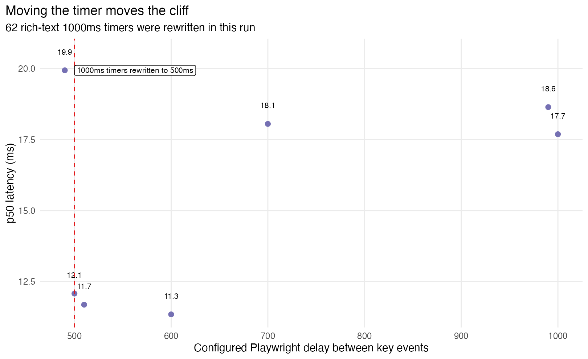

# Typing Delay Benchmark Investigation

This report documents a local investigation of the typing-delay behavior discussed in
[WordPress/gutenberg#51383](https://github.com/WordPress/gutenberg/issues/51383)
and the related Playwright performance-test migration in
[WordPress/gutenberg#52022](https://github.com/WordPress/gutenberg/pull/52022).

The short version:

-   The `~1000ms` latency cliff is real.
-   It comes from the rich-text persistence timer in
    `packages/block-editor/src/components/rich-text/use-mark-persistent.js`.
-   The original benchmark's `1000ms` data point is not just a different delay; it
    crosses a different editor-state boundary.
-   The `2000ms` point is slower than the `1000-1110ms` fast band, but it is not
    uniquely slow. It is part of a later high-latency plateau.
-   The later high-latency plateau is mostly an artifact of how Playwright applies
    `keyboard.type(..., { delay })`: for US-keyboard characters it holds the key
    down for the delay, then sends `keyup`.
-   A single average per delay is not enough for this benchmark. The latency curve
    has discrete regimes, and variance changes by delay.

The data and plots in this directory were generated with:

```sh
Rscript test/performance/scripts/plot-typing-delay-benchmark.R
```

The script uses `tidyverse`, `ggplot2`, `jsonlite`, and `scales`. It reads raw
benchmark JSON from `artifacts/` when present, writes derived CSVs to `data/`,
and renders plots to `figures/`. If raw JSON is absent, it can regenerate the
plots from the committed CSVs.

## Source Context

Issue #51383 started from an inconsistency: the Site Editor performance test typed
many characters continuously, while the Post Editor tests waited before each
character. The historical Post Editor values included a `2000ms` delay for the
large-post typing test and `500ms` for typing in containers. The issue discussion
then explored whether arbitrary waits should be replaced by a more meaningful
condition.

The original exploratory benchmark used coarse delays:

```js
[ 0, 100, 200, 300, 400, 500, 600, 700, 800, 900, 1000, 2000, 5000 ];
```

with `10` retained samples plus one throwaway sample per delay. It reported
average input latency, using keyboard trace events. The resulting graphs showed a
surprisingly low `1000ms` sample and higher `2000ms` / `5000ms` samples.

That was a useful exploratory graph, but it had several design problems:

-   The delay grid was too sparse to reveal boundaries.
-   Ten samples per delay was too little to estimate variance.
-   Averages hid multimodal behavior and outliers.
-   The plot did not preserve time order, so it could not answer warmup or drift
    questions.
-   The metric was called "typing" even when one character was typed every second
    or every two seconds.
-   The selected delay may have changed editor behavior, not just measurement
    stability.

## Benchmark Changes

This branch adds `test/performance/specs/typing-delay-benchmark.spec.js`, a
dedicated benchmark for varying Playwright's `page.keyboard.type()` delay. It can
run:

-   dense delay sweeps, such as `0..1100ms` in `10ms` steps;
-   explicit delay sets, such as landmark points through `2000ms`;
-   more rounds and more retained samples per delay;
-   mixed, ascending, descending, or shuffled delay order;
-   fresh editor setup per delay;
-   persistence-state tracing;
-   data-action tracing;
-   timer tracing and timer intervention.
-   alternate delay modes:
    -   `keyboard`: the original Playwright `keyboard.type(..., { delay })` mode;
    -   `between-keys`: type a complete keypress, then wait;
    -   `after-persistence`: wait for `isLastBlockChangePersistent()`, then wait.

The benchmark records every retained sample rather than only aggregate values.
The R script derives:

-   `data/typing-delay-records.csv`: one row per typed character;
-   `data/typing-delay-by-delay.csv`: per-delay summary stats;
-   `data/typing-delay-runs.csv`: one row per delay run;
-   `data/typing-delay-persistence-events.csv`: persistence-state transitions;
-   `data/typing-delay-action-events.csv`: instrumented data actions;
-   `data/typing-delay-timer-events.csv`: instrumented timers;
-   `data/typing-delay-browser-events.csv`: instrumented browser events.
-   `data/typing-delay-scheduler-events.csv`: instrumented timer/RAF/idle
    scheduler events;
-   `data/typing-delay-keyhold-mark-gap.csv`: derived timing from rich-text
    persistence marker to the next keydown in the key-hold trace.

One subtle benchmark bug was fixed during the investigation: an earlier version
re-clicked the paragraph via an "Empty block" accessible name before each delay.
That locator is invalid after the paragraph has content. The benchmark now clicks
the paragraph once during setup and keeps focus across delay runs.

## Main Delay Curve


The dense `0..1100ms` run used `10ms` steps, 3 rounds, and 10 retained samples
per delay. The curve is not monotonic.

Approximate p50 regimes from the dense run:

|   Delay range | p50 regime |
| ------------: | ---------: |
|      `0-90ms` |   `~6.0ms` |
|   `100-150ms` |   `~8.9ms` |
|   `160-500ms` |  `~18.3ms` |
|   `510-560ms` |  `~11.9ms` |
|   `570-990ms` |  `~18.1ms` |
| `1000-1100ms` |   `~7.8ms` |

This alone makes the original coarse delay list risky. Sampling every `100ms`
misses most of the regime changes and makes `1000ms` look like a magic value.

## Extension To 2000ms


The `1000-1110ms` region is fast, but the fast behavior does not continue through
`2000ms`. A repeated landmark run gave:

|    Delay |   n |        p50 |       mean |      CV |
| -------: | --: | ---------: | ---------: | ------: |
|  `900ms` |  30 | `18.423ms` | `18.249ms` | `0.098` |
|  `990ms` |  30 | `17.972ms` | `17.555ms` | `0.129` |
| `1000ms` |  30 |  `9.871ms` | `10.222ms` | `0.111` |
| `1010ms` |  30 |  `9.854ms` | `10.020ms` | `0.161` |
| `1100ms` |  30 | `10.604ms` | `10.581ms` | `0.033` |
| `1110ms` |  30 | `10.767ms` | `10.254ms` | `0.135` |
| `1200ms` |  30 | `17.682ms` | `17.306ms` | `0.081` |
| `1300ms` |  30 | `18.338ms` | `18.114ms` | `0.072` |
| `1500ms` |  30 | `17.744ms` | `17.175ms` | `0.148` |
| `1600ms` |  30 | `18.404ms` | `18.329ms` | `0.057` |
| `1800ms` |  30 | `18.183ms` | `17.963ms` | `0.093` |
| `2000ms` |  30 | `18.248ms` | `18.068ms` | `0.114` |

So `2000ms` is slower than the `1000ms` fast band, but it is not slower than
`1200ms`, `1300ms`, `1600ms`, or `1800ms`. The original `2000ms` bump should be
read as "the benchmark left the fast band", not "longer idle time causes a
monotonic slowdown".

The dense `1110..2000ms` scan found another dip around `1510-1570ms`, then a
return to the same `~18ms` high plateau.

## Distributions, Not Just Averages


The landmark run shows why p50, p10/p90, and raw samples are more useful than a
single average. `1000ms` and `1010ms` are visibly in a different distribution
from `990ms` and `1200ms`. Some delays have low medians but high volatility.


The "stable between 500 and 900ms" interpretation from the original exploration
does not survive a dense scan. Some delay values inside large ranges are stable,
but the adjacent values can be in different regimes.

## Time Order And Warmup


The Tratt VM-warmup articles linked in the original request are relevant because
they argue against assuming a benchmark reaches a simple, stable plateau. This
benchmark does not show a clean "warms up, then stays fast" story. Delay choice
explains much more than sample order.

The full run and the landmark run both preserve per-sample order. After accounting
for delay regimes, there was no convincing monotonic slowdown over time in these
runs. That is not proof that long editing sessions are safe; it only says these
short local runs did not reproduce a simple time-based degradation.

## Where The 1000ms Cliff Comes From

The cliff comes from this code:

```js
// packages/block-editor/src/components/rich-text/use-mark-persistent.js
if ( previousTextRef.current !== value.text ) {
	const timeout = window.setTimeout( () => {
		__unstableMarkLastChangeAsPersistent();
	}, 1000 );
	previousTextRef.current = value.text;
	return () => {
		window.clearTimeout( timeout );
	};
}
```

That hook is used by RichText. For text input, it delays creating a persistent
undo level until there has been one second without input. The relevant state then
flows through:

-   `MARK_LAST_CHANGE_AS_PERSISTENT` in
    `packages/block-editor/src/store/actions.js`;
-   `withPersistentBlockChange()` in
    `packages/block-editor/src/store/reducer.js`;
-   `isLastBlockChangePersistent()` in
    `packages/block-editor/src/store/selectors.js`;
-   `useBlockSync()` in
    `packages/block-editor/src/components/provider/use-block-sync.js`, which sends
    persistent changes through `onChange` and non-persistent changes through
    `onInput`.

The action trace shows the boundary directly:


In the focused action run:

|    Delay |        p50 | What happened                                                              |
| -------: | ---------: | -------------------------------------------------------------------------- |
|  `990ms` | `19.878ms` | the persistent timer was repeatedly cancelled and only fired after the run |
| `1000ms` | `10.384ms` | the persistent marker fired between keys                                   |
| `1010ms` | `10.182ms` | the persistent marker fired between keys                                   |
| `1100ms` | `10.967ms` | the persistent marker fired between keys                                   |
| `1110ms` | `10.871ms` | the persistent marker fired between keys                                   |
| `1150ms` | `12.541ms` | persistent between keys, but latency begins climbing                       |
| `1180ms` | `14.355ms` | persistent between keys, transitional                                      |
| `1190ms` | `16.985ms` | persistent between keys, near high plateau                                 |
| `1200ms` | `15.621ms` | persistent between keys, high/transition                                   |
| `1300ms` | `18.524ms` | persistent between keys, high plateau                                      |

This establishes two separate facts:

1. The sharp `990 -> 1000ms` drop is caused by the one-second rich-text
   persistence timer.
2. The later return to the high plateau is not caused by that same state
   transition, because the editor is already on the persistent path at `1150ms`,
   `1180ms`, `1190ms`, `1200ms`, and `1300ms`.

## Timer Intervention

To test causality, the benchmark added a timer tracer/intervention mode. In one
run, `setTimeout(..., 1000)` calls were rewritten to `500ms`. Source-map lookup
for the repeated timer stack mapped the minified frame back to
`packages/block-editor/src/components/rich-text/use-mark-persistent.js:29`.



The low-latency band moved with the timer:

|    Delay |   n |        p50 |       mean |
| -------: | --: | ---------: | ---------: |
|  `490ms` |   8 | `19.940ms` | `19.323ms` |
|  `500ms` |   8 | `12.077ms` | `12.105ms` |
|  `510ms` |   8 | `11.686ms` | `11.904ms` |
|  `600ms` |   8 | `11.345ms` | `11.292ms` |
|  `700ms` |   8 | `18.053ms` | `18.022ms` |
|  `990ms` |   8 | `18.643ms` | `18.648ms` |
| `1000ms` |   8 | `17.690ms` | `17.074ms` |

This is the strongest evidence that the `~1000ms` cliff is not VM warmup or a
random browser scheduling artifact. Moving the timer moves the first cliff.

The intervention run should not be treated as a production benchmark. Wrapping
`setTimeout` can perturb scheduling. Its purpose is causal attribution.

## Deeper Pass: The Delay Is A Key Hold

The first report explained the `~1000ms` cliff but left the later `1200-2000ms`
plateau partly open. The deeper pass found a more fundamental benchmark issue:
Playwright's `keyboard.type( text, { delay } )` is not equivalent to "type a
complete character, wait, type the next complete character."

In the installed Playwright implementation, `keyboard.type()` loops over
characters and calls `press( char, { delay } )`. `press()` sends `keydown`, waits
for `delay`, then sends `keyup`. The browser event traces confirm this:
`keydown` / `keypress` / `input` happen near the start of each sample, then
`keyup` happens roughly `delay` milliseconds later, and the next `keydown`
follows almost immediately.

That means the original delay sweep is mostly a synthetic key-hold-duration
sweep. A person who types once every second is not normally holding each key down
for one second.


Two additional runs separate these cases:

1. `between-keys`: type `x` with no Playwright delay, then wait after `keyup`.
2. `after-persistence`: wait for `isLastBlockChangePersistent()`, then wait, then
   type `x`.

Selected p50s:

| Mode                            |    Delay |        p50 |
| ------------------------------- | -------: | ---------: |
| Playwright key-hold delay       | `1200ms` | `17.682ms` |
| Playwright key-hold delay       | `2000ms` | `18.248ms` |
| Complete keypress, then wait    | `1200ms` |   `10.7ms` |
| Complete keypress, then wait    | `2000ms` |   `10.3ms` |
| Wait for persistence, then wait |  `200ms` |   `10.5ms` |
| Wait for persistence, then wait |  `400ms` |   `10.7ms` |

This falsifies the simple "more idle time after persistence makes typing slow"
explanation. Waiting after the key has completed does not reproduce the slow
plateau. Waiting after the rich-text persistence marker does not reproduce it
either.

The slow plateau appears when the rich-text persistence timer fires while the
previous synthetic key is still held down, and then the next key arrives after
some additional key-hold slack.


In the scheduler/action trace:

|    Delay | Median time from previous persistence marker to next keydown | Median latency |
| -------: | -----------------------------------------------------------: | -------------: |
| `1100ms` |                                                     `~101ms` |       `11.7ms` |
| `1150ms` |                                                     `~151ms` |       `12.7ms` |
| `1180ms` |                                                     `~182ms` |       `15.7ms` |
| `1200ms` |                                                     `~203ms` |       `18.4ms` |
| `1300ms` |                                                     `~304ms` |       `19.1ms` |
| `1510ms` |                                                     `~512ms` |       `14.3ms` |
| `1550ms` |                                                     `~551ms` |       `12.6ms` |
| `1580ms` |                                                     `~584ms` |       `16.5ms` |

The relationship is not perfectly monotonic; the `1510-1550ms` dip remains a
browser/event-loop phase effect rather than a clean editor-state transition. But
the comparison with `between-keys` and `after-persistence` is enough to say that
the `1200-2000ms` plateau is not a normal "pause between characters" effect. It
is tied to holding a synthetic key down while Gutenberg's one-second rich-text
timer fires.

## Scenario Sensitivity


The boundary appears in multiple scenarios, but absolute latency changes with
post size and fixture shape. The large mixed post is slower than an empty post
near the boundary. A synthetic thousand-paragraph post does not reproduce all of
the large mixed fixture's cost, which suggests that block type mix and editor
state matter, not just block count.

Selected p50s:

| Scenario                 |    Delay |        p50 |
| ------------------------ | -------: | ---------: |
| large post, fresh editor |  `990ms` | `19.441ms` |
| large post, fresh editor | `1000ms` |  `7.710ms` |
| empty post               |  `990ms` | `11.761ms` |
| empty post               | `1010ms` |  `7.012ms` |
| thousand paragraphs      |  `990ms` | `13.798ms` |
| thousand paragraphs      | `1010ms` |  `5.551ms` |

## Trace Grouping Bug Avoided


In this local Chromium environment, every retained sample had two `keydown`
`EventDispatch` entries. Across 7164 retained samples in the committed derived
data, zero had a `keydown` count other than two.

That means any parser that assumes exactly one `keydown` trace event per typed
character is fragile. This benchmark groups trace events into key sequences and
uses the final keydown event for `latency_ms`, while also preserving
`latency_all_keydowns_ms`.

## Issues In The Original Benchmark

The original exploration was valuable because it found the weird `1000ms` point,
but it should not be used as a tuning basis without caveats.

Problems:

-   **Sparse delay grid.** The important features are narrower than the original
    `100ms` spacing.
-   **Too few samples.** Ten retained samples per delay is not enough to estimate
    variance or detect mixed distributions.
-   **Averages hide structure.** p50/p10/p90 and raw distributions show regime
    changes that averages flatten.
-   **No time-order analysis.** Without per-sample order, warmup, drift, GC,
    scheduled work, and long-session degradation are mostly invisible.
-   **One scalar conflates workloads.** Continuous typing, idle-then-key latency,
    and persistent-undo-path latency are different workloads.
-   **Delay changes editor semantics.** At `1000ms`, the rich-text persistence
    timer fires between keys, so the benchmark changes the state path it measures.
-   **Playwright's delay is a key-hold delay.** For US-keyboard characters, the
    delay is applied between `keydown` and `keyup`, so large values do not model a
    user pausing between completed keystrokes.
-   **`1000ms` was selected because it looked stable.** It is stable partly because
    it enters a special path. That makes it a poor representative of normal typing.
-   **Long delays are unrealistic as typing.** A one-second or two-second gap may be
    a useful idle-input latency test, but it should not be called typing throughput.

## Issues In The New Benchmark

The new benchmark fixes several measurement problems, but it is not a final CI
metric.

Known problems:

-   **It still measures trace-event handler duration, not input-to-paint.** The
    user-visible latency question needs a DOM/layout/paint or screen-observation
    endpoint.
-   **Synthetic keyboard input is not real keyboard input.** Playwright's
    `page.keyboard.type()` is useful, but it is not a hardware-to-screen pipeline.
-   **There are now multiple delay modes.** This is useful for diagnosis, but any
    CI metric has to choose one deliberately and name it according to what it
    actually measures.
-   **The local machine is uncontrolled.** CPU governor, thermal state, background
    processes, browser version, and OS scheduling were not isolated in a Krun-like
    environment.
-   **Dense long-delay scans are expensive.** The `1110..2000ms` dense extension
    used one round, so it is a shape-finding run, not a high-confidence estimate.
-   **Instrumentation perturbs behavior.** Action tracing and timer rewriting add
    overhead; they should be used to explain behavior, not to report benchmark
    scores.
-   **Single browser.** These results are from Chromium. They do not prove that
    Safari or Firefox will have the same timer/event behavior.
-   **Single local setup.** More process executions and fresh browser contexts are
    needed before treating absolute numbers as portable.
-   **No real typing distribution.** Real users type with bursts, corrections,
    pauses, navigation, composition, and selection changes. Fixed-delay `x`
    insertion is an artificial stressor.
-   **No plugin/theme cofactor coverage.** The issue discussion mentioned lag that
    appeared outside vanilla Core. This benchmark does not cover plugin-heavy or
    P2-like editor setups.

## Audit Lenses

These are not endorsements or actual reviews by these people. They are different
failure-oriented ways to read the data.

### Linus Torvalds-style audit

-   Do not name the metric "typing performance" if it types one character every
    `1000ms` or `2000ms`.
-   Do not tune CI around a magic constant that is also a code path boundary.
-   Assert invariants in the benchmark. The duplicate-keydown finding is exactly
    the kind of trace-parser assumption that should fail loudly.
-   Keep the benchmark small enough to understand. A single scalar from a
    complicated browser/editor trace is not self-explanatory.
-   Separate product behavior from measurement behavior. `1000ms` is not just a
    wait; it causes `MARK_LAST_CHANGE_AS_PERSISTENT`.

### Kyle Kingsbury-style audit

-   Preserve histories. The derived CSVs keep per-sample order, delay, round,
    editor setup, and state transitions.
-   Prefer distributions over means. The benchmark has partitions: `990ms` and
    `1000ms` are different histories, not nearby samples from one population.
-   Do interventions when possible. Rewriting the `1000ms` timer to `500ms` is a
    causal test, and the cliff moved with it.
-   Randomize and repeat. Mixed order and fresh-editor checks are necessary because
    deterministic order can alias with periodic work.
-   State the model being tested. This test is not a linear latency function of
    delay; it is a state machine plus browser scheduling plus editor work.

### Dan Luu-style audit

-   The strange data point is the result, not noise. The `1000ms` dip identified a
    real editor timer.
-   Look at time. The time-order plot does not support a simple warmup story, but
    the runs are still too short to clear long-session concerns.
-   Make the benchmark adversarial. Try alternate delays, longer wall-clock runs,
    fresh editors, randomized order, and timer interventions.
-   Measure the thing users see. Trace-event latency is useful for diagnosis, but
    input-to-paint or high-speed-camera calibration would answer a different and
    more user-facing question.
-   Do not assume representativeness. Vanilla Core, a large fixture, a synthetic
    thousand-paragraph post, and plugin-heavy editors can all expose different
    behavior.

## Recommendations

For CI:

-   Keep separate metrics for continuous typing and idle-input latency.
-   Rename the long-wait metric to something like `inputLatencyAfterIdle`, not
    "typing".
-   Do not choose `1000ms` as a generic stable delay. It crosses the rich-text
    persistence boundary.
-   Do not use `keyboard.type(..., { delay: 1000 })` or `2000` to mean "wait
    after typing a character." It holds the key down. Use an explicit wait after a
    complete keypress if that is the intended workload.
-   If the goal is "after rich text has persisted", wait on
    `isLastBlockChangePersistent()` explicitly and name the metric that way.
-   Store per-sample results and at least p50/p90/CV, not only averages.
-   Keep trace-parser invariants: expected key groups, keydown count distribution,
    and event ordering.

For investigation:

-   Run wall-clock-equalized benchmarks, e.g. 60 seconds per delay, instead of a
    fixed number of samples per delay.
-   Run fresh browser contexts and fresh posts for each delay when comparing delay
    values.
-   Replay recorded human typing sessions, including pauses, selection, deletion,
    undo, and block insertion.
-   Add a textarea/native baseline to estimate browser/editor overhead.
-   Add input-to-paint instrumentation, or calibrate with high-speed camera data
    for bench runs.
-   Repeat on Safari and Firefox.
-   Repeat with plugin-heavy editor setups if long-session lag is suspected there.

## Reproduction Notes

The key runs used in this report were:

-   `full_0_1100`: dense `0..1100ms`, `10ms` step, 3 rounds, 10 retained samples
    per delay.
-   `targeted_randomized`: targeted randomized confirmation around suspicious
    ranges.
-   `fresh_boundary`: fresh editor per delay around `980..1020ms`.
-   `state_actions`: action/browser tracing around the persistence boundary.
-   `state_wait`: explicit wait for `isLastBlockChangePersistent()`.
-   `empty_boundary`: empty-post scenario around the boundary.
-   `thousand_boundary`: synthetic 1000-paragraph scenario around the boundary.
-   `dense_1110_2000`: dense extension to `2000ms`.
-   `landmarks_0_2000`: repeated landmark run through `2000ms`.
-   `cliff_actions`: action trace from `990ms` through `1300ms`.
-   `timeout_500_rewrite`: timer intervention rewriting `1000ms` timers to
    `500ms`.
-   `after_persistence_scan`: wait for persistence, then wait `0..400ms`.
-   `keyhold_schedulers`: normal Playwright key-hold delay with scheduler/action
    tracing.
-   `between_keys`: complete keypress, then wait through `2000ms`.

The local environment used `nvm` default Node `v20.20.2`.

## References

-   [Issue #51383: Perf Testing: Inconsistent methodology for testing typing performance](https://github.com/WordPress/gutenberg/issues/51383)
-   [PR #52022: Switch performance tests to Playwright](https://github.com/WordPress/gutenberg/pull/52022)
-   [Laurence Tratt, Why Aren't More Users More Happy With Our VMs? Part 1](https://tratt.net/laurie/blog/2018/why_arent_more_users_more_happy_with_our_vms_part_1.html)
-   [Laurence Tratt, Why Aren't More Users More Happy With Our VMs? Part 2](https://tratt.net/laurie/blog/2018/why_arent_more_users_more_happy_with_our_vms_part_2.html)
-   [Laurence Tratt, More Evidence for Problems in VM Warmup](https://tratt.net/laurie/blog/2022/more_evidence_for_problems_in_vm_warmup.html)
