# Typing Delay Benchmark Investigation

This report documents a local investigation of the typing-delay behavior discussed in
[WordPress/gutenberg#51383](https://github.com/WordPress/gutenberg/issues/51383)
and the related Playwright performance-test migration in
[WordPress/gutenberg#52022](https://github.com/WordPress/gutenberg/pull/52022).

The short version:

-   The `~1000ms` latency cliff is real.
-   It comes from the rich-text persistence timer in
    `packages/block-editor/src/components/rich-text/use-mark-persistent.js`.
-   The original benchmark's `1000ms` data point is not just a different delay; it
    crosses a different editor-state boundary.
-   The `2000ms` point is slower than the `1000-1110ms` fast band, but it is not
    uniquely slow. It is part of a later high-latency plateau.
-   The old dense extension's `1510-1550ms` trough did not reproduce in a focused
    recheck. A `1450..1600ms` n=16 Gutenberg rerun stayed near `24ms`, a
    same-shape n=5 rerun also stayed near `24ms`, and a native-contenteditable
    rerun stayed near `1ms`. Treat the old trough as volatile run-specific
    browser/editor phase behavior, not as a stable delay regime.
-   The later high-latency plateau is mostly an artifact of how Playwright applies
    `keyboard.type(..., { delay })`: for US-keyboard characters it holds the key
    down for the delay, then sends `keyup`.
-   In paired traces, the extra measured latency is almost entirely `keypress`
    dispatch time. The distinguishing condition is not just "persistence already
    fired"; it is that persistence fired while the previous synthetic key was
    still held down.
-   The short-delay region is not irrelevant. A dense wait-after-keyup scan over
    `0..2000ms` shows that key-hold and wait-after-keyup are already different
    well before `990ms`; the `1000ms+` targeted traces explain the largest cliff,
    but they do not cover the whole delay-mode effect.
-   Waiting longer after editor setup before typing starts does not remove the
    retained delay regimes. The default is already `0ms`, so there is no smaller
    start wait to test. A corrected fresh-editor-per-delay scan shows `990ms`
    and `1300ms` stay slow, while `1010ms` stays in the low band. The main
    start-wait sensitivity is the first character after a fresh setup: in a
    focused `1300ms` first-character run, p50 rose from `15.9ms` at `0s` wait to
    `23.1ms` after `60s`, mostly in the `keypress` trace slice. Throwaway policy
    matters more than pre-run settling for the retained repeated-key
    measurements. A follow-up sample-index run confirms this: the first
    character moves from `16.3ms` to `22.0ms` when the start wait grows from
    `0s` to `60s`, while the next three `1300ms` held-key characters stay in the
    normal `24-27ms` slow band. Native `contenteditable` moves by only `0.27ms`,
    so the effect is not just browser/Playwright timing overhead. Source-level
    tracing shows the long-wait first input runs the same large Gutenberg fanout,
    but that fanout takes longer after idle: `RichText`/data `registry.batch`
    p50 rises by about `3.6-3.8ms`, while counted subscriber fanout sizes remain
    unchanged. A benchmark-only pre-typing warmup makes the causal picture
    sharper: after a `60s` start wait, a `1000ms` browser-main-thread warmup
    before tracing/typing lowers first-character p50 from `23.1ms` to `18.2ms`,
    essentially matching the `0s + 1000ms warmup` control at `18.5ms`. A
    follow-up dose-response run shows most of that recovery already happens with
    a `50ms` warmup. Moving the same `60s` idle interval before editor setup
    instead of after setup removes the slowdown: first-character p50 is `15.2ms`,
    essentially the same as the `0s` control at `15.9ms`. So the causal variable
    is not absolute elapsed time since the test began; it is whether the browser
    and editor have been idle immediately before the measured input. A denser
    `0..30s` onset scan shows that `50ms` after setup is still indistinguishable
    from `0ms`, `100ms` starts to separate, `250ms-1s` is consistently slower,
    and `30s` reaches the long-idle plateau. A timestamp audit now records
    `setupWorkStarted`, `setupReady`, and `setupStopped` separately; it confirms
    that a `1000ms` wait before setup is not equivalent to a `1000ms` wait after
    the editor is ready.
-   In the CI-comparable saved/reopened-post Typing setup, extending the
    post-setup wait from `0ms` to `60s` still does not move the retained p50:
    all 11 wait settings land between `16.0ms` and `17.5ms`. Starting later
    mostly costs wall time before tracing; it does not buy a more stable retained
    Typing metric. The beginning of the sequence is the sensitive part: the
    discarded first character and the first retained character are slow, while
    retained characters 2-10 are already in the ordinary low band. A blocked
    `60s`, `0ms`, `60s`, `0ms` order-control run confirms this is not just
    monotonic run-order drift. Recomputing the CI-comparable metric after
    discarding `0..4` initial keypresses shows that the current q50 is robust to
    the slow first retained key: dropping that key too changes the median q50 by
    only `-0.16ms` across startup waits, while the median mean and p90 move by
    `-0.85ms` and `-1.51ms`.
-   I also ran the actual `post-editor.spec.js` Typing setup/run tests with a
    default-off env-controlled start wait. The exact CI test shape agrees with
    the custom CI-comparable benchmark: blocked `60s`, `0ms`, `60s`, `0ms`
    before-trace runs landed at `11.60ms`, `11.61ms`, `10.82ms`, and `11.57ms`
    p50. Starting the trace before a `60s` wait also stayed in-band at
    `10.21ms`, so the EventDispatch-derived Typing metric is not sensitive to
    whether the trace starts before or after the idle interval. A randomized
    exact-spec follow-up with four runs each at `0ms`, `1000ms`, and `60000ms`
    found the same thing: condition medians of per-run p50 were `13.19ms`,
    `12.63ms`, and `13.07ms`, while median suite elapsed time was `17.3s`,
    `18.3s`, and `78.0s`. The local evidence says a `60s` pre-typing wait costs
    about a minute per Typing invocation and does not buy a more stable retained
    Typing result.
-   The historical `BROWSER_IDLE_WAIT = 1000` constant is overloaded. In the
    current post/site editor performance specs it controls both explicit
    pre-measurement sleeps in non-Typing tests and the inter-key delay inside
    Typing tests. Those must be analyzed separately. I split the knobs and ran
    an exact `post-editor.spec.js` Typing grid over typing delays of `100ms`,
    `200ms`, `400ms`, `600ms`, and `1000ms`, crossed with startup waits from
    `0ms` through `5000ms`. Typing delay dominates; startup wait has no single
    direction once typing delay is held fixed.
-   The deeper CI-runtime/reliability pass keeps those knobs separate. Current
    Typing has `0ms` extra post-setup start wait, so reducing that knob cannot
    speed up today's Typing metric. The broader post/site performance comparison
    still pays about `152s` of explicit pre-measurement sleeps across two
    compared branches, but the local repeated Typing anchor does not show a
    stability gain from waiting: eight saved/reopened drafts per wait setting
    put the reported q50 in a `15.5-17.3ms` band, with run-to-run q50 sd between
    `0.5ms` and `1.7ms`. A new exact Selecting-blocks pilot, with eight runs at
    `0ms` and eight at `1000ms`, found the `0ms` pre-measurement wait faster
    (`19.8ms` vs. `25.2ms` q50) and less variable (`0.44ms` vs. `1.35ms`
    run-to-run q50 sd). A broader four-run screen over all seven explicit-wait
    non-Typing metrics splits by metric class: the interactive post-editor
    metrics favor `0ms`, while pattern loading does not. An alternating exact
    site-editor pattern run confirmed the exception: `1000ms` reported
    `728.8ms` q50 versus `871.2ms` at `0ms`, because readiness requests/resource
    work move before the measured interval. A new exact short-wait sweep closes
    the obvious follow-up: `500ms` matches or slightly beats `1000ms` locally
    (`720.0ms` vs. `730.3ms` median reported q50) while saving `10s` for this
    metric in a two-branch comparison. `250ms` also lands in the same q50 band
    (`731.2ms`) but has higher run-to-run q50 sd.
-   Changing the current held-key Typing delay is a larger metric change than
    the name suggests. At `500ms`, the two-branch job saves about `55s`, but the
    CI-comparable held-key q50 is `24.5ms`, not halfway between the `0ms` and
    `1000ms` cases. A tap-then-wait implementation is a different metric again:
    in the same saved/reopened large-post setup, `1000ms` tap-then-wait costs
    `100s` instead of `110s` over two branches and reports `11.0ms` q50 with
    `0.42ms` run-to-run q50 sd, versus `17.3ms` q50 and `3.01ms` run-to-run q50
    sd for the held-key run in this paired check.
-   Realistic fixed key holds remain much closer to tap mode than to the current
    full-delay hold, but the exact `50ms` versus `100ms` ranking is still a
    harness/code-path question. A completed fresh-editor code-path matrix shows
    different boundaries by API: page-keyboard `50ms` is tap-like while
    page-keyboard `75ms` / `100ms` are slow; `locator.type()` `50ms` / `75ms`
    are slow; `locator.press()` `50ms` / `75ms` / `100ms` are tap-like.
    Turning off `locator.press()`'s `waitForSignalsCreatedBy` epilogue with
    `noWaitAfter` moves `50ms` and `75ms` rows toward `locator.type()`, which
    supports the checkpoint/epilogue explanation for why ordinary
    `locator.press()` is tap-like. Because `locator.pressSequentially()`
    delegates to `locator.type()`, it should be treated as the `locator.type()`
    family, not the ordinary `locator.press()` family.
-   A native `contenteditable` baseline with the same one-second input timer does
    not reproduce Gutenberg's key-hold plateau. That means "timer fired while key
    was held" is not sufficient by itself; Gutenberg editor work is required.
-   The large difference between a multi-character key-hold burst and per-key
    calls is not explained by DOM key event payloads, key repeat/composition,
    exact raw-CDP packet shape, or elapsed post-keyup time. Raw CDP stays slow
    even with long post-keyup gaps, while raw CDP plus a no-op `page.evaluate()`
    between keys flips to the fast path under the default Playwright trace
    setting. A follow-up with `--trace=off` shows that the full fast path is
    mostly a Playwright trace-snapshot artifact: per-key `keyboard.press()`
    becomes slow again when trace snapshots are disabled, and protocol logs show
    `captureSnapshot` evaluations between keys when tracing is enabled.
-   The remaining trace-off gap also has a dose-response control now. Repeating
    direct no-op CDP runtime calls between raw key events shrinks the next
    `keypress` span from `21.5ms` raw CDP to `19.7-19.9ms` with one checkpoint,
    `15.3-15.4ms` with eleven checkpoints, and `13.2-13.4ms` with seventeen
    checkpoints. That means the trace-off residual is not evidence for a hidden
    Gutenberg semantic state change caused by Playwright evaluation; enough
    browser/runtime checkpoints between keys can reproduce and exceed it. A
    combined decoupling plot makes the important negative control explicit:
    raw CDP plus ordinary post-keyup waits stays slow from about `4ms` through
    `5008ms`, while runtime checkpoints become fast at much shorter observed
    gaps. A `5s` ordinary sleep is still not equivalent to crossing the
    renderer/runtime checkpoints inserted by the automation path.
-   A native `contenteditable` control has the same direction but not the same
    scale. Repeating the same runtime checkpoints moves native `keypress` p50 by
    only about `0.3-0.4ms`, while the Gutenberg large-post path moves by multiple
    milliseconds. So the checkpoint effect is a real browser/runtime measurement
    perturbation, but the large absolute swing needs Gutenberg's heavier input
    path.
-   Event-listener timing narrows the visible Gutenberg work to editor-canvas
    input handling. The dominant measured callback is registered from
    `rich-text`; source-map lookup identifies it as the `onInput` path in
    `packages/rich-text/src/hook/event-listeners/input-and-selection.js`.
-   Marker interventions disconfirm "the timer callback alone causes the
    1000ms drop": a no-op callback does not reproduce the normal low band.
    They also disconfirm the stronger old claim that the real persistence marker
    is uniquely necessary. A timer callback that does `stopTyping(); startTyping()`
    also produces the low EventDispatch band at `1000ms` / `1010ms`.
-   Among the short synchronous action interventions, the common fast-case
    feature is timer-side `core/block-editor` subscriber fanout before the next
    key, not specifically `MARK_LAST_CHANGE_AS_PERSISTENT`, and not just any
    action. The `__unstableMarkNextChangeAsNotPersistent()` replacement is a
    real action but has near-zero callback cost and stays slow. Short pure timer
    work only partly lowers the `1000ms` event-only p50: `20ms` and `40ms`
    busy-wait callbacks land at `17.7ms` and `16.1ms`.
-   A raw-dispatch control makes that sharper. The benchmark exposed the
    registry's raw `store.dispatch()` in-page and dispatched an unknown
    `core/block-editor` action from the timer callback. That action left the
    block-editor snapshot unchanged, produced no listener fanout, and stayed in
    the no-op slow band in the all-data-span trace (`32.4ms` latency p50,
    `31.3ms` `keypress` p50). A raw dispatch/timer tick is therefore not
    sufficient; a zero-duration no-op-ish timer callback does not reproduce the
    low band.
-   A source audit of the low-level Redux listener owners confirms that the
    Gutenberg-side cost is broad invalidation, not a single slow callback. The
    top audited marker-window sites are per-rendered-block, per-`BlockEdit`,
    per-block-list, per-inner-blocks, and per-heading subscriptions. Together
    they account for `14.0ms` of `15.3ms` source-mapped listener time, but each
    callback is only `~2-9us`. A follow-up selector-dependency matrix shows why
    this is an invalidation-surface problem: most of the hot subscribed reads are
    block order/tree, global settings, block type/count, or selection state that
    either should not change on a one-character paragraph text insertion or is
    only indirectly related. The only direct text-attribute read is the
    `BlockListBlockProvider` instance for the edited paragraph; the other
    `~1436` block instances are still woken. The next source-level check makes
    the invalidation boundary exact: the normal marker action changes
    `blocks.isPersistentChange`, but none of the audited hot owner sites read
    that flag. They wake because the store root changed, not because their
    selected state depends on the changed branch. The subscriber-outcome funnel
    then shows what "wake" means in the next input: all compared interventions
    wake `4544` `useSelect.onChange` callbacks, but `3828` of those go only to
    async `renderQueue.add`; `716` synchronously run `onStoreChange`,
    `updateValue`, and `mapSelect`. A priority-queue idle probe closes one more
    version of that open question: the `renderQueue.add` work is really
    scheduled through `requestIdleCallback`, but whether that idle queue drains
    before the next RichText input does not predict the low band. In the probe,
    all three retained `1000ms` intervals with a following input had an idle
    flush finish after that following input started, while all three `1300ms`
    intervals drained before the following input and were still in the slower
    retained-p50 band.
-   A React/render-boundary audit now bounds that remaining caveat. The smallest
    key-held visual endpoint drop is `11.2ms`. The largest post-EventDispatch
    visual/render-tail movement is `2.3ms`, the Chrome render-event tail is
    `0.8ms`, `renderQueue.add` moves by `0.2ms`, and the React external-store
    listener moves by only `0.1ms` in the slow-control comparison. A React
    profiler may still identify component ownership of after-input work, but it
    is no longer a plausible primary explanation for the `1000ms` cliff.
-   A dense timer-to-key gap scan adds another constraint. In the normal-marker
    and `stopTyping(); startTyping()` runs, the following EventDispatch slice is
    low when the timer callback is roughly `40-100ms` before the next keydown,
    starts rising around `150ms`, and is back on the slow plateau around
    `200-300ms`. The no-op timer can fire only `3-30ms` before the next keydown
    and still does not reach the normal `~10-11ms` band. This disconfirms both
    "same state at keydown is enough" and "timer ordering alone is enough"; a
    short effective block-editor fanout is sufficient, while a short no-op timer
    callback is not.
-   A fixed-hold timer rewrite confirms that this is causal. With the key hold
    fixed at `1300ms`, moving the normal marker timer from `1000ms` / `1100ms`
    to `1200ms` / `1250ms` / `1270ms` moves the same long-held key from the slow
    plateau back into the low band. At the same `1250ms` rewritten timer, no-op
    remains slow and `stopTyping(); startTyping()` is fast.
-   A task-end proximity probe corrects the stronger "effective Gutenberg fanout
    is required" claim. A no-op callback that only busy-waits for `150ms`
    changes no Gutenberg selector snapshot, but it still makes the next
    EventDispatch slice fast if the long timer task ends about `51ms` before
    keydown (`11.3ms` p50). The same no-op busy wait ending about `151ms` before
    keydown is intermediate (`15.1ms` p50), and a zero-duration no-op ending
    about `53ms` before keydown is slow (`24.6ms` p50). A small duration sweep
    supports a duration/proximity effect: pure `20ms`, `40ms`, and `150ms`
    busy waits ending about `51ms` before keydown had event-only p50s of
    `21.0ms`, `14.1ms`, and `11.3ms`.
-   Web Worker controls push that further. A worker can spin for `150ms` and
    never post a completion message back to the main thread; when its expected
    finish is about `50ms` before keydown, the following Gutenberg EventDispatch
    is still low (`10.3ms` p50). A worker that only waits `150ms` and posts a
    message, with no CPU spin, stays slow (`24.7ms`), as does a main-thread
    delayed no-op (`24.4ms`). That disconfirms "long main-thread timer task is
    required", "worker message task is enough", and "any delayed task close to
    keydown is enough"; it points instead to recent CPU/scheduler state
    interacting with Gutenberg's input path.
-   A no-message worker duration sweep confirms a dose response. With the worker
    ending about `50ms` before keydown, `20ms`, `40ms`, `80ms`, and `150ms` of
    off-main-thread CPU work produce event-only p50s of `15.5ms`, `12.8ms`,
    `11.2ms`, and `10.3ms`. A no-message worker that merely waits `150ms`
    stays slow at `24.5ms`. That disconfirms "worker creation/lifetime is
    enough" and strengthens the CPU-work interpretation.
-   The same no-message `150ms` worker spin also decays with distance from the
    next key: ending about `50ms`, `150ms`, and `253ms` before keydown gives
    event-only p50s of `10.3ms`, `14.9ms`, and `24.6ms`. That disconfirms a
    long-lived "the browser is warmed for the rest of the run" version of the
    CPU theory. The effect is recent and proximity-sensitive.
-   A separate Node child process burning CPU for `150ms` reproduces the same
    proximity-sensitive shape: ending about `50ms`, `151ms`, and `253ms` before
    keydown gives event-only p50s of `8.9ms`, `12.6ms`, and `22.7ms`. That
    disconfirms "this requires browser-renderer-local worker scheduling"; the
    supported explanation is broader whole-machine CPU/scheduler/power-state
    sensitivity modulating Gutenberg's heavy input path.
-   A cleaner prestarted external child-process control removes process creation
    from the timer boundary and still shows a CPU-duration response. With the
    expected CPU burn ending about `50-52ms` before keydown, `20ms`, `40ms`,
    `80ms`, and `150ms` of external CPU give event-only p50s of `19.0ms`,
    `14.0ms`, `12.1ms`, and `11.3ms`. A prestarted external child that only
    waits `150ms`, with no intentional CPU burn, stays slow at `23.3ms`. That
    disconfirms "IPC/process lifetime is enough" and confirms that recent
    external CPU work can modulate the effect; renderer-local browser work is not
    required.
-   Continuous external background CPU makes an otherwise slow no-op timer case
    fast: with the no-op timer ending about `51ms` before keydown, event-only p50
    drops to `9.1ms`. An idle external child with the same no-op timer stays slow
    at `24.2ms`. That disconfirms "finite timer-side work ending near the key is
    required"; the finite-burst decay happens because the CPU activity stops, not
    because the browser needs a particular timer callback shape.
-   A background CPU count sweep keeps that result in the same band: one, two,
    four, and eight busy child processes give no-op timer event-only p50s of
    `9.1ms`, `10.0ms`, `10.3ms`, and `10.4ms`. One busy child is enough; more
    load adds mild contention rather than making the benchmark faster. That
    supports a CPU active-state explanation, not a need for many busy cores.
-   A priority-policy sweep narrows that explanation: a `nice +20` busy child
    still makes the no-op timer fast at `9.3ms`, but macOS `taskpolicy -b` busy
    children stay slow at `24.6ms`, `24.0ms`, and `24.2ms` for one, four, and
    eight children. I verified outside the benchmark that both `nice +20` and
    `taskpolicy -b` children really consume about one CPU. This disconfirms the
    overbroad theory that any CPU burn anywhere is sufficient; the supported
    theory is narrower and depends on the kind of CPU/QoS state the background
    work creates.
-   A QoS-clamp sweep sharpens that again. `taskpolicy -c utility` is fast at
    `9.4ms`, while `taskpolicy -c background` and
    `taskpolicy -c maintenance` are slow at `24.2ms` and `24.7ms`. So the split
    is not "taskpolicy versus not taskpolicy"; it is closer to
    "ordinary/utility CPU affects the benchmark, background/maintenance CPU
    does not."
-   A new `taskpolicy` tier sweep sharpens the negative side of that claim.
    `taskpolicy -l 0..5` and `taskpolicy -t 0..5` background CPU children all
    keep the no-op timer fast at `9.2-9.7ms`. That means the earlier slow rows
    are not caused by taskpolicy tiering in general; the slow split is specific
    to Darwin background priority and QoS background/maintenance clamps.
-   A derived CPU/QoS audit puts the remaining controls on one scale. Near-key
    no-CPU tasks stay slow (`24.3ms` median control p50), near-key finite CPU
    bursts move low (`11.3ms`), continuous ordinary/utility CPU is also low
    (`9.7ms`), and continuous background/maintenance-QoS CPU stays slow
    (`24.2ms`). A simple descriptive model over the finite CPU-burst rows,
    `latency ~ log1p(duration) + end-to-keydown gap`, has `R^2 = 0.71`. That is
    not a hardware proof, but it quantifies the current boundary: CPU duration,
    recency, and policy explain much more than timer ordering or Gutenberg
    selector state alone.
-   A native `contenteditable` busy-timer control shows the browser-level effect
    exists but is tiny in absolute terms. With native timer work ending about
    `50ms` before keydown, p50 input duration moves from `1.20ms` with no busy
    wait to `0.49ms` with a `150ms` busy wait. That is the same direction, but
    it does not explain the Gutenberg-sized `~10-25ms` differences without
    Gutenberg's heavier editor input path.
-   Splitting the measured key into `keydown`, `keypress`, and `keyup` shows
    that the intervention gap is almost entirely in the measured `keypress`
    component.
    That disconfirms theories based on `keyup`, key release accounting, or
    Chrome-only `EventDispatch` bookkeeping.
-   A same-configuration event-listener probe refines that statement: the DOM
    `keypress` listeners themselves are not expensive. The expensive callback
    is the `input` listener, dominated by RichText's `onInput` handler. In
    Chrome's trace-derived metric that input-handling work is showing up in the
    measured keypress-driven character-insertion slice.
-   The `stopTyping()` / `startTyping()` probes show one concrete way to change
    that `keypress` slice. `startTyping()` alone is effectively a no-op when the
    editor is already typing and stays slow. `stopTyping()` alone leaves the
    editor in the non-typing state, so the next measured `keypress` runs
    `startTyping()` from `ObserveTyping` and stays slow. `stopTyping();
    startTyping()` does the timer-side fanout and restores the normal pre-key
    typing state; it reproduces the low EventDispatch band without using the
    persistence marker.
-   Three restored non-typing state toggles partially reproduce the drop:
    `toggleSelection( false ); toggleSelection( true )`,
    `setTemplateValidity( false ); setTemplateValidity( true )`, and
    `toggleBlockHighlight( clientId, true ); toggleBlockHighlight( clientId,
    false )` all lower the `1000ms` p50 to about `14-15ms`. That disconfirms
    "typing state is the only cause." The targeted low-overhead run still has
    a small gap from the `~11ms` stop/start and normal-marker band, but the
    later all-data-span microscope makes `toggleSelection()` and
    `stopTyping(); startTyping()` look nearly identical in shape. I would not
    claim that the remaining few milliseconds are proven to be typing-specific.
-   The normal marker action does about `16ms` of timer-side work at `1000ms` in
    the targeted run. The `stopTyping(); startTyping()` replacement does about
    `23ms`. That work is outside the next EventDispatch measurement. Adding the
    paired timer callback to the same retained key changes the normal `1000ms`
    p50 from `11.3ms` to `27.4ms`, and the stop/start `1000ms` p50 from
    `11.0ms` to `34.1ms`, so the low band is an accounting artifact for this
    metric.
-   The marker/no-op difference does change action ordering and the
    `useBlockSync()` parent path: normal marker goes through `onChange`, no-op
    stays on `onInput`. But `onChange` is not necessary or sufficient.
    `stopTyping(); startTyping()` keeps the following input on `onInput` and is
    still fast; `__unstableMarkNextChangeAsNotPersistent()` records `onChange`
    and remains slow.
-   A reducer/state-path audit confirms why the path changes: the normal marker
    becomes the reducer's `lastAction` boundary and makes the following
    `updateBlockAttributes` persistent; the no-op leaves the previous text edit
    as the comparison action, so the next same-attribute edit remains transient.
-   Source-level RichText spans put nearly all of that `onInput` time inside
    `registry.batch()`, not DOM parsing, format updating, DOM apply,
    serialization, or the direct `onSelectionChange` / `onChange` callbacks.
-   Source-level `@wordpress/data` spans put that batch remainder mostly in
    `core/block-editor` store-emitter resume and `useSelect` subscriber fanout.
    The expensive path is selector/subscriber invalidation, not the two direct
    RichText callbacks.
-   The next-input gap is not explained by different subscriber counts,
    selector-cache misses, or render-queue counts. In the all-data-span probe,
    the compared input batches all have two `core/block-editor` root
    subscriptions, about nine thousand Redux listener wrappers, `4544`
    `useSelect.onChange` callbacks, `716` `useSelect.updateValue` calls, `716`
    invalidated cached selector results, and `3828` render-queue adds. The
    movement is duration through the same fanout shape. The raw-unknown-action
    timer callback itself is the useful exception: it returns the same root
    state, so the marker callback has `0ms` listener fanout and the following
    input remains slow.
-   A deeper owner-attribution trace shows that both the direct `useSelect`
    callback cost and the enclosing listener-span cost are broad fanout, not one
    pathological selector. The largest source-mapped groups have hundreds or
    thousands of active hook/listener instances in the large-post fixture.
-   Drilling into the lower Redux listener wrappers also disconfirms a single
    heavy subscriber explanation. After propagating diagnostic `useSelectId`
    metadata down to `data.reduxStore.listener`, more than `99.93%` of
    `core/block-editor` listener-wrapper spans in the new traces have a
    source-mapped `useSelect` owner. The marker and next-input deltas are still
    distributed across high-fanout block-list / pattern override / inner-block
    subscribers; no source site moves by even `1ms` p50.
-   Extending the all-data-span extraction to include
    `useSelect.onStoreChange`, `useSelect.reactListener`, `updateValue`, and
    `renderQueue.add` disconfirms a React-listener, selector-recompute, or
    render-queue explanation for the residual input-side gap. The material
    movement is in `rootSubscribe` and Redux listener-wrapper accounting; the
    nested `useSelect` child spans are near zero or lower in the slow
    interventions.
-   Splitting the wrapper layer shows the shared residual movement is in the
    paused store-listener path: `rootSubscribe` runs `9002` Redux listener
    wrappers, each wrapper calls paused `emitter.emit()`, and the real
    `useSelect` callbacks run later during one emitter resume. The remaining
    wrapper-only movement is trace-heavy, mostly `~0.1ms` timing quanta, and
    should not be interpreted as a newly found expensive app callback.
-   A marker-plus-input cycle check in the trace-heavy run confirms the same
    accounting story: the normal marker has a lower next-input slice than no-op,
    but a higher marker-plus-input cycle cost.
-   A new opt-in visual proxy records keydown, `input`, mutation, next RAF, and
    second RAF in the editor canvas. It is not a calibrated paint timestamp, but
    it answers whether the cliff is purely a trace-slice artifact. It is not:
    key-held `1000ms` drops from `33.0ms` / `31.9ms` keydown-to-second-RAF at
    `990ms` / `1300ms` to `20.4ms`, while complete-keypress-then-wait stays low
    at `11.9-13.5ms`.
-   A new Chromium render-trace probe pushes that one step farther. With heavier
    `Paint` / `DrawFrame` tracing, key-held `1000ms` drops from `25.8ms` /
    `24.9ms` keydown-to-`Paint` at `990ms` / `1300ms` to `13.1ms`; the matching
    complete-keypress-then-wait values stay flat at `10.7-11.3ms`. This is still
    not a calibrated screen-presentation timestamp, but it disconfirms "JS/RAF
    bookkeeping only."
-   A new Chromium trace-screenshot probe pushes closer to observed pixels. It
    stores only per-frame hashes/timestamps, not images. Key-held `1000ms` drops
    from `34.8ms` / `33.7ms` keydown-to-first-changed-screenshot at `990ms` /
    `1300ms` to `18.4ms`; complete-keypress-then-wait stays in the
    `16.9-19.9ms` band. This is still not high-speed-camera calibration, but it
    disconfirms "render trace bookkeeping only."
-   A combined endpoint-drop analysis makes the visual-path evidence easier to
    audit: in key-hold mode, the `1000ms` point is `~11-16ms` faster than the
    mean of the `990ms` and `1300ms` slow neighbors across EventDispatch,
    second RAF, `Paint`, `DrawFrame`, and first changed trace screenshot. In
    complete-keypress-then-wait mode, the same calculation is roughly flat
    (`~0-2ms`). This still does not calibrate display presentation.
-   A follow-up trace-screenshot pixel localization check decodes the previous
    and first changed trace screenshots, diffs the pixels, and checks whether the
    changed-pixel box overlaps the target text box and the DOM range for the
    exact typed `x`. Across 48 retained samples at `990ms`, `1000ms`, and
    `1300ms`, every decoded changed screenshot overlapped the target and every
    changed-pixel box overlapped the exact typed-character range. This does not
    OCR the character or calibrate presentation, but it rules out the
    changed-screenshot endpoint being unrelated viewport activity.
-   A single average per delay is not enough for this benchmark. The latency curve
    has discrete regimes, and variance changes by delay.

The data and plots in this directory were generated with:

```sh
Rscript test/performance/scripts/plot-typing-delay-benchmark.R
```

The script uses `tidyverse`, `ggplot2`, `jsonlite`, and `scales`. It reads raw
benchmark JSON from `artifacts/` when present, merges available raw runs into the
derived CSVs in `data/`, and renders plots to `figures/`. If raw JSON is absent,
it can regenerate the plots from the committed CSVs.

## Source Context

Issue #51383 started from an inconsistency: the Site Editor performance test typed
many characters continuously, while the Post Editor tests waited before each
character. The historical Post Editor values included a `2000ms` delay for the
large-post typing test and `500ms` for typing in containers. The issue discussion
then explored whether arbitrary waits should be replaced by a more meaningful
condition.

The original exploratory benchmark used coarse delays:

```js
[ 0, 100, 200, 300, 400, 500, 600, 700, 800, 900, 1000, 2000, 5000 ];
```

with `10` retained samples plus one throwaway sample per delay. It reported
average input latency, using keyboard trace events. The resulting graphs showed a
surprisingly low `1000ms` sample and higher `2000ms` / `5000ms` samples.

That was a useful exploratory graph, but it had several design problems:

-   The delay grid was too sparse to reveal boundaries.
-   Ten samples per delay was too little to estimate variance.
-   Averages hid multimodal behavior and outliers.
-   The plot did not preserve time order, so it could not answer warmup or drift
    questions.
-   The metric was called "typing" even when one character was typed every second
    or every two seconds.
-   The selected delay may have changed editor behavior, not just measurement
    stability.

## Benchmark Changes

This branch adds `test/performance/specs/typing-delay-benchmark.spec.js`, a
dedicated benchmark for varying Playwright's `page.keyboard.type()` delay. It can
run:

-   dense delay sweeps, such as `0..1100ms` in `10ms` steps;
-   explicit delay sets, such as landmark points through `2000ms`;
-   more rounds and more retained samples per delay;
-   mixed, ascending, descending, or shuffled delay order;
-   fresh editor setup per delay;
-   configurable wait time before editor setup and after editor setup before
    typing starts;
-   persistence-state tracing;
-   data-action tracing;
-   timer tracing and timer intervention.
-   event-listener invocation tracing;
-   source-level RichText span tracing;
-   source-level data registry / `useSelect` span tracing;
-   opt-in visual-latency proxy tracing for keydown, `input`, mutation, next RAF,
    and second RAF in the editor canvas;
-   opt-in Chromium render-event tracing for keydown-to-`Layout`, `PrePaint`,
    `Paint`, `Layerize`, and `DrawFrame` timing;
-   opt-in Chromium trace-screenshot timing for first changed screenshot after
    keydown;
-   background CPU controls using `taskpolicy` QoS clamps, latency tiers, and
    throughput tiers;
-   alternate delay modes:
    -   `keyboard`: the original Playwright `keyboard.type(..., { delay })` mode;
    -   `between-keys`: type a complete keypress, then wait;
    -   `fixed-hold-then-wait`: hold the key for up to
        `BENCHMARK_KEY_HOLD_MS`, release it, then wait for the rest of the
        configured delay;
    -   `after-persistence`: wait for `isLastBlockChangePersistent()`, then wait;
    -   `hold-then-keyup-gap`: hold a key, release it, then optionally wait;
    -   `type-one-char-hold`: run one Playwright `keyboard.type( 'x' )` action
        per character;
    -   `down-up-key-hold`: run explicit Playwright `keyboard.down()` /
        `keyboard.up()` calls per character;
    -   `cdp-key-hold`: send raw Chromium `Input.dispatchKeyEvent` events;
    -   `cdp-key-hold-page-evaluate`: send raw CDP key events plus a no-op
        `page.evaluate()` between characters;
    -   `cdp-key-hold-page-evaluate-handle`: send raw CDP key events plus
        `page.evaluateHandle()` between characters;
    -   `cdp-key-hold-main-locator-evaluate`: send raw CDP key events plus a
        main-frame locator evaluation between characters;
    -   `cdp-key-hold-frame-locator-evaluate`: send raw CDP key events plus an
        editor-frame locator evaluation between characters;
    -   `cdp-key-hold-runtime-evaluate`: send raw CDP key events plus a direct
        CDP `Runtime.evaluate` between characters;
    -   `cdp-key-hold-runtime-evaluate-full`: same, but with `awaitPromise`,
        `returnByValue`, and `userGesture`;
    -   `cdp-key-hold-runtime-evaluate-repeat`: same direct CDP
        `Runtime.evaluate` checkpoint repeated
        `BENCHMARK_RUNTIME_REPEAT_COUNT` times between characters;
    -   `cdp-key-hold-runtime-call-function-on`: send raw CDP key events plus a
        direct CDP `Runtime.callFunctionOn` against `globalThis`;
    -   `cdp-key-hold-runtime-call-function-on-repeat`: same direct CDP
        `Runtime.callFunctionOn` checkpoint repeated
        `BENCHMARK_RUNTIME_REPEAT_COUNT` times between characters;
    -   `cdp-key-hold-runtime-timeout`: send raw CDP key events plus an awaited
        CDP `Runtime.evaluate` `setTimeout( 0 )` between characters;
    -   `cdp-key-hold-runtime-raf`: send raw CDP key events plus an awaited CDP
        `Runtime.evaluate` `requestAnimationFrame` between characters.
-   a native `contenteditable` scenario with a minimal one-second input timer.

The benchmark records every retained sample rather than only aggregate values.
The R script derives:

-   `data/typing-delay-records.csv`: one row per typed character;
-   `data/typing-delay-by-delay.csv`: per-delay summary stats;
-   `data/typing-delay-runs.csv`: one row per delay run;
-   `data/typing-delay-persistence-events.csv`: persistence-state transitions;
-   `data/typing-delay-action-events.csv`: instrumented data actions;
-   `data/typing-delay-timer-events.csv`: instrumented timers;
-   `data/typing-delay-browser-events.csv`: instrumented browser events.
-   `data/typing-delay-scheduler-events.csv`: instrumented timer/RAF/idle
    scheduler events;
-   `data/typing-delay-keyhold-mark-gap.csv`: derived timing from rich-text
    persistence marker to the next keydown in the key-hold trace.
-   `data/typing-delay-key-event-timing.csv`: paired trace timing for previous
    keyup, persistence marker, and next keydown.
-   `data/typing-delay-native-key-event-timing.csv`: the same timing for the
    native `contenteditable` comparison.
-   `data/typing-delay-event-listener-events.csv`: per-listener invocation timing;
-   `data/typing-delay-listener-input-summary.csv`: input-listener summaries by
    delay and registration script.
-   `data/typing-delay-listener-input-scenario-summary.csv`: RichText
    input-listener comparison between the large-post and empty-post scenarios.
-   `data/typing-delay-listener-action-summary.csv`: data-action summaries from
    the listener-traced runs.
-   `data/typing-delay-listener-source-map.csv`: source-map lookup for the
    minified RichText listener registration stack.
-   `data/typing-delay-browser-timeline-cycles.csv`: per-cycle cross-browser
    timer/input ordering for the Chrome, Firefox, and WebKit timeline check.
-   `data/typing-delay-browser-timeline-summary.csv`: p50 summary of that
    cross-browser timer/input ordering.
-   `data/typing-delay-rich-text-span-events.csv`: source-level RichText timing
    spans from targeted instrumented runs.
-   `data/typing-delay-rich-text-span-summary.csv`: per-delay summary of those
    spans.
-   `data/typing-delay-rich-text-batch-parts.csv`: per-input split of
    `registry.batch()` into direct callbacks and remaining synchronous work.
-   `data/typing-delay-rich-text-batch-summary.csv`: per-delay summary of the
    batch split.
-   `data/typing-delay-data-span-summary.csv`: source-level data registry and
    `useSelect` span summaries from targeted instrumented runs.
-   `data/typing-delay-data-batch-parts.csv`: per-input, RichText-matched
    breakdown of the `@wordpress/data` spans inside `registry.batch()`.
-   `data/typing-delay-data-batch-summary.csv`: per-delay summary of that data
    batch breakdown.
-   `data/typing-delay-data-store-resume-summary.csv`: per-store resume timing
    for input-matched data batches.
-   `data/typing-delay-input-attribution-funnel.csv`: compact RichText-to-data
    attribution funnel for the already split input path.
-   `data/typing-delay-use-select-owner-summary.csv`: source-mapped owner
    summary for the targeted `useSelect` attribution traces.
-   `data/typing-delay-causality-*.csv`: targeted traces that separate
    key-hold duration, persistence-marker timing, and the post-keyup gap before
    the next key.
-   `data/typing-delay-post-keyup-gap-*.csv`: follow-up traces checking whether
    timers, RAF, idle callbacks, data actions, raw DevTools timeline slices, or
    DOM key flags explain the post-keyup gap effect.
-   `data/typing-delay-input-path-*.csv`: raw-CDP follow-up traces separating the
    observed post-keyup gap from Playwright's higher-level keyboard helpers.
-   `data/typing-delay-cdp-checkpoint-*.csv`: raw-CDP follow-up traces comparing
    direct `Runtime.evaluate` checkpoints with Playwright `page.evaluate()`.
-   `data/typing-delay-playwright-trace-mode-*.csv`: follow-up traces comparing
    per-key Playwright calls and `page.evaluate()` with Playwright tracing on and
    off.
-   `data/typing-delay-eval-path-*.csv`: trace-off follow-up traces comparing
    direct CDP runtime calls, Playwright page evaluation, and locator evaluation.
-   `data/typing-delay-runtime-repeat-*.csv`: trace-off dose-response follow-up
    traces that repeat direct CDP runtime checkpoints between raw CDP key events.
-   `data/typing-delay-native-runtime-repeat-*.csv`: the same runtime-repeat
    trace-off dose-response in the native `contenteditable` scenario.
-   `data/typing-delay-cdp-boundary-*.csv`: consolidated CDP boundary evidence
    matrix across ordinary waits, runtime checkpoints, Playwright evaluation
    paths, trace snapshots, and the native control.
-   `data/typing-delay-chromium-runtime-next-probe-audit.csv`: decision audit for
    the remaining Chromium runtime checkpoint question and the next
    browser-level probe that would resolve it.
-   `data/typing-delay-chromium-runtime-trace-contract-audit.csv`: required
    browser/runtime trace contrasts for the remaining Chromium checkpoint
    mechanism.
-   `data/typing-delay-chromium-runtime-trace-runbook-audit.csv`: concrete
    Chromium runtime trace rows, trace channels, alignment points, and acceptance
    gates for naming the lower-level browser mechanism.
-   `data/typing-delay-chromium-runtime-current-harness-gap-audit.csv`: source
    audit of which existing benchmark surfaces can already support the Chromium
    runtime checkpoint question, and which fields are missing.
-   `data/typing-delay-chromium-runtime-falsification-gate-audit.csv`: theory
    audit that separates falsified controls from open runtime/scheduler/V8/OS
    mechanism gates.
-   `data/typing-delay-chromium-runtime-protocol-sidecar-contract.csv`: required
    per-retained-key protocol, timebase, trace, OS-counter, and scale joins for
    naming the remaining Chromium runtime mechanism.
-   `data/typing-delay-chromium-runtime-mechanism-decision-tree.csv`: staged
    runtime mechanism ladder: trace-off protocol sidecar, scheduler/V8 trace,
    snapshot observer split, OS-counter alignment, scale gate, and report gate.
-   `data/typing-delay-chromium-runtime-sidecar-mvp-plan.csv`: concrete
    implementation and acceptance plan for the first trace-off protocol sidecar
    dry run before heavier scheduler/V8 tracing.
-   `data/typing-delay-chromium-runtime-claim-ladder-audit.csv`: claim-boundary
    audit for Chromium runtime findings, separating closed benchmark semantics,
    falsified wait/DOM theories, supported automation artifacts, open browser
    state mechanisms, OS-counter confounds, Gutenberg scale amplification, and
    product-workload relevance.
-   `data/typing-delay-marker-intervention-*.csv`: marker intervention samples,
    summaries, and timer/action counts.
-   `data/typing-delay-marker-action-*.csv`: marker intervention action-duration
    samples and summaries.
-   `data/typing-delay-marker-paired-*.csv`: per-sample marker-inclusive
    summaries that add the marker action before each retained key to that key's
    EventDispatch latency.
-   `data/typing-delay-marker-gap-dense-paired-*.csv`: dense
    `1000..1300ms` paired traces for timer-to-next-key gap analysis.
-   `data/typing-delay-fixed-hold-timer-rewrite-paired-*.csv`: fixed
    `1300ms` key-hold traces where the `1000ms` timer is rewritten to different
    values.
-   `data/typing-delay-task-end-proximity-paired-*.csv`: fixed `1300ms`
    key-hold traces that separate timer-task start, timer-task end, and
    following-key timing, including main-thread, worker, spawn-per-timer
    external child-process, and prestarted external child-process CPU controls.
-   `data/typing-delay-start-settle-*.csv`: targeted checks for changing the
    wait after editor setup and before typing starts.
-   `data/typing-delay-start-wait-first-char-*.csv`: focused first-character
    checks for changing the wait after a fresh editor setup.
-   `data/typing-delay-start-wait-sample-index-*.csv`: first-vs-next-character
    checks after changing the fresh-editor start wait.
-   `data/typing-delay-start-wait-empty-first-char-*.csv`,
    `data/typing-delay-start-wait-native-first-char-*.csv`, and
    `data/typing-delay-start-wait-scenario-first-char-summary.csv`: scenario
    controls for the first-character start-wait effect.
-   `data/typing-delay-start-wait-span-*.csv`: source-level attribution
    summaries for the large-post first-character start-wait effect.
-   `data/typing-delay-start-wait-pretype-warmup-*.csv`: causality checks that
    run a browser-main-thread warmup after the start wait but before the first
    measured input.
-   `data/typing-delay-start-wait-placement-*.csv`: checks that move the same
    `60s` idle interval before editor setup versus after editor setup.
-   `data/typing-delay-start-wait-onset-*.csv`: denser first-character checks
    from `0ms` through `30s` after editor setup.
-   `data/typing-delay-start-wait-timestamp-audit-*.csv`: explicit phase
    accounting for pre-setup idle, active editor setup, post-setup idle, and
    run-start timing.
-   `data/typing-delay-ci-comparable-start-wait-*.csv`: a CI-comparable
    post-editor typing anchor using the same large-post saved-draft setup,
    `target.type()` entry point, `1000ms` key delay, 10 retained samples, and 1
    throwaway sample as the Performance Tests `post-editor` Typing metric.
-   `data/typing-delay-ci-comparable-start-wait-curve-*.csv`: a deeper
    CI-comparable start-wait curve from `0ms` through `60s`, with the same
    saved/reopened large-post draft setup, `target.type()` entry point, `1000ms`
    key delay, 8 fresh drafts per wait setting, 10 retained samples, and 1
    throwaway sample.
-   `data/typing-delay-ci-comparable-start-wait-blocked-*.csv`: an order-control
    rerun of the CI-comparable start-wait extremes in `60s`, `0ms`, `60s`,
    `0ms` order, with 4 fresh saved/reopened drafts per block.
-   `data/typing-delay-post-editor-ci-start-wait-exact-*.csv`: actual
    `post-editor.spec.js` Typing setup/run tests with a default-off
    env-controlled start wait before or after `metrics.startTracing()`.
-   `data/typing-delay-post-editor-ci-start-wait-randomized-exact-*.csv`: a
    randomized exact `post-editor.spec.js` Typing follow-up with four
    before-trace runs each at `0ms`, `1000ms`, and `60000ms`.
-   `data/typing-delay-post-editor-typing-delay-startup-grid-*.csv`: exact
    `post-editor.spec.js` Typing runs with independent inter-key typing delay
    and pre-typing startup wait controls.
-   `data/typing-delay-ci-startup-wait-runtime-model.csv`: deterministic
    wall-clock model for changing the explicit post/site editor
    pre-measurement startup wait, including the normal two-branch CI comparison
    multiplier.
-   `data/typing-delay-ci-startup-wait-runtime-reliability.csv`: the same
    runtime model joined to exact Typing q50/mean/CV data, plus the repeated
    exact-run variance estimates available at `0ms`, `1000ms`, and `60000ms`.
-   `data/typing-delay-ci-startup-wait-run-reliability.csv`: the
    CI-comparable start-wait curve summarized as the CI-reported per-run Typing
    q50, with run-to-run q50 variance and two-branch runtime deltas.
-   `data/typing-delay-startup-wait-change-trigger-contract-audit.csv`:
    operational contract for when the locally closed Typing startup-wait answer
    should be reopened, including statistic, helper, trace-placement,
    portability, and non-Typing metric triggers.
-   `data/typing-delay-pattern-readiness-boundary-summary.csv`: joined
    site-editor pattern readiness-probe and exact short-wait summary that marks
    where the local readiness boundary appears.
-   `data/typing-delay-pattern-readiness-decision-audit.csv`: fixed-wait
    replacement decision audit for site-editor pattern loading, joining exact
    short-wait q50s with the readiness probe.
-   `data/typing-delay-pattern-readiness-predicate-candidates.csv`: predicate
    candidate matrix for replacing the blind pattern-loading sleep.
-   `data/typing-delay-pattern-readiness-source-predicate-audit.csv`: source-audited
    readiness predicate matrix for the site-editor pattern-loading metric.
-   `data/typing-delay-pattern-readiness-prototype-audit.csv`: implementation
    audit for a `getBlockPatterns` readiness prototype, including resolver,
    compatibility-list, timeout, and measurement-boundary checks.
-   `data/typing-delay-pattern-readiness-predicate-validation-*.csv`: full
    `site-editor` Loading Patterns validation runs for fixed waits, a pure
    `getBlockPatterns` predicate, and `getBlockPatterns` plus a resource-quiet
    guard; includes per-sample resource movement and a resource-endpoint detail
    audit.
-   `data/typing-delay-pattern-readiness-risk-audit.csv`: per-run q50 range,
    bootstrap, and probe-hit risk audit for the remaining site-editor
    pattern-loading wait choices.
-   `data/typing-delay-pattern-readiness-ci-validation-contract-audit.csv`:
    validation contract for deciding whether `getBlockPatterns` plus resource
    quiet or fixed `500ms` can replace the current fixed pattern-loading wait in
    CI/mac/container lanes.
-   `data/typing-delay-pattern-readiness-claim-ladder-audit.csv`: claim-boundary
    audit for the remaining pattern-readiness question, separating supported
    fixed fallbacks, semantic checks, broad guardrails, source-signal research,
    split reporting, and invalid metric redefinitions.
-   `data/typing-delay-pattern-readiness-residual-*.csv`: residual audit of the
    still-open Site Editor readiness signal question, separating semantic pattern
    signals from broad REST setup endpoints and measured preview work.
-   `data/typing-delay-pattern-loading-wait-scope-split-*.csv`: source-level
    split between Site Editor `loadPatterns`, Post Editor `loadPatterns`, and
    other non-Typing fixed sleeps that must not inherit the same predicate
    claim.
-   `data/typing-delay-post-pattern-wait-matrix-*.csv`: focused Post Editor
    `loadPatterns` wait matrix at `0ms`, `250ms`, `500ms`, and `1000ms`, using
    the exact spec path with 8 runs per wait and 10 retained samples per run.
-   `data/typing-delay-post-interaction-wait-matrix-*.csv`: interaction-only
    Post Editor wait matrix for focus, List View open, inserter open/search,
    and inserter hover, combining the original four-run screen with four fresh
    grouped runs per wait.
-   `data/typing-delay-open-question-wait-removal-*.csv`: decision ledger and
    rollup for the remaining non-Typing fixed waits, separating local `0ms`
    candidates, the Site Editor fixed-`500ms` fallback, and the Site Editor
    predicate candidate.
-   `data/typing-delay-ci-comparable-0-1400-dense-*.csv`: CI-comparable dense
    delay sweep from `0ms` to `1400ms` in `10ms` steps, using a fresh
    saved/reopened large-post draft per delay and 10 retained samples plus 1
    throwaway sample per delay.
-   `data/typing-delay-ci-comparable-0-1400-dense-n50-*.csv`: same
    CI-comparable dense delay sweep, but with 50 retained samples plus 1
    throwaway sample per delay to estimate volatility with less sensitivity to
    individual outliers.
-   `data/typing-delay-ci-held-key-delay-runtime-reliability.csv`: deterministic
    two-branch Typing-delay runtime deltas joined to the n=50 CI-comparable
    held-key delay sweep.
-   `data/typing-delay-ci-key-mode-reliability-*.csv` and
    `data/typing-delay-ci-key-mode-runtime-reliability.csv`: paired
    CI-comparable held-key versus tap-then-wait runs at `0ms`, `100ms`,
    `250ms`, `500ms`, and `1000ms`, with reported-q50 run-to-run variance and
    runtime deltas.
-   `data/typing-delay-ci-hold-duration-*.csv`: same paired CI-comparable
    settings, adding fixed `50ms` and `100ms` key holds followed by the
    remaining post-keyup wait, plus event-shape, sample-position,
    paired-difference, keydown-sensitivity, throwaway-sensitivity,
    pooled-versus-run, order-diagnostic, sign-check, and leave-one-round
    summaries.
-   `data/typing-delay-ci-code-path-*.csv`: reused-editor stable-target controls
    comparing tap, page-keyboard fixed hold, locator `type()`, and locator
    `press()` input paths at `50ms`, `75ms`, and `100ms` requested holds.
-   `data/typing-delay-ci-fresh-code-path-*.csv`: matched fresh-editor
    stable-target controls for current CI held key, tap-then-wait,
    page-keyboard fixed hold, locator `type()`, locator `press()`, and
    locator `press()` with `noWaitAfter` input paths at `50ms`, `75ms`, and
    `100ms` requested holds, including paired-differences and tap-relative API
    delta tables. The predictor-audit table records which simple explanations
    still fail after the clean noWaitAfter rerun; the boundary-next-control
    audit turns those failures into the remaining compact control.
-   `data/typing-delay-ci-keyboard-prelude-control-*.csv`: follow-up
    CI-comparable fresh-editor controls for `page.keyboard.press()` and explicit
    page-keyboard `down()` / `up()` with a per-key locator `focus()` prelude.
-   `data/typing-delay-input-api-ci-helper-decision-contract-audit.csv`: CI
    helper decision contract that separates `type()` / `pressSequentially()`
    equivalence, ordinary `locator.press()` checkpoint controls, exact-helper
    validation, and Playwright-version drift.
-   `data/typing-delay-input-api-helper-claim-ladder-audit.csv`: claim ladder
    separating same-family helper spelling changes, rejected proxy controls,
    API-family metric-definition changes, scoped hold-duration claims, optional
    browser mechanism work, upgrade guards, and threshold continuity blockers.
-   `data/typing-delay-1500-dip-*.csv`: historical and focused recheck samples
    and summaries for the old `1510-1550ms` held-key trough.
-   `data/typing-delay-wait-vs-checkpoint-summary.csv`: derived comparison
    that joins raw-CDP explicit post-keyup waits with the runtime-checkpoint
    dose response.
-   `data/typing-delay-cdp-long-gap-*.csv`: focused raw-CDP ordinary-wait
    controls at `2000ms` and `5000ms` post-keyup gaps.
-   `data/typing-delay-native-busy-wait-control-*.csv`: native
    `contenteditable` controls with the same timer-end proximity but different
    timer busy-wait durations.
-   `data/typing-delay-timeout-970-marker-paired-*.csv`: the same paired
    accounting for a targeted run that rewrites Gutenberg's `1000ms` timers to
    `970ms`.
-   `data/typing-delay-marker-allspan-*.csv`: trace-all-data-spans summaries for
    a small `1000ms` marker-intervention run.
-   `data/typing-delay-marker-allspan-input-batch-*.csv`: retained-input
    timelines, action-phase splits, and batch decomposition from the same
    trace-all-data-spans run.
-   `data/typing-delay-marker-allspan-owner-*.csv`: source-map-backed owner
    summaries for `useSelect` fanout and attributed enclosing listener spans in
    the marker task and following input batch.
-   `data/typing-delay-redux-listener-owner-*.csv`: source-map-backed owner
    summaries for low-level `data.reduxStore.listener` spans after propagating
    diagnostic `useSelectId` metadata through the registry subscription wrapper.
-   `data/typing-delay-redux-listener-owner-accounting.csv`,
    `data/typing-delay-redux-listener-owner-concentration.csv`, and
    `data/typing-delay-redux-listener-owner-count-duration.csv`: aggregate
    accounting, owner concentration, and count-vs-duration summaries derived
    from the low-level Redux listener owner samples.
-   `data/typing-delay-redux-listener-owner-family-summary.csv`: owner-family
    grouping for the same low-level Redux listener owner data.
-   `data/typing-delay-redux-listener-source-audit.csv`: code-audited source
    scope summary for the dominant low-level Redux listener owner sites.
-   `data/typing-delay-redux-listener-invalidation-matrix.csv`: manual
    source-audit matrix classifying whether each hot subscribed state category
    is directly relevant, indirectly relevant, probably unchanged, or not read
    during ordinary paragraph text insertion.
-   `data/typing-delay-redux-listener-text-update-opportunity*.csv`: source
    triage estimating which audited Redux-listener fanout is likely skippable
    for ordinary text-only updates, versus selection/tree state that still needs
    validation.
-   `data/typing-delay-redux-listener-guard-candidates.csv`: risk-ranked
    concrete guard/prototype candidates for the audited text-update fanout.
-   `data/typing-delay-redux-listener-guard-validation-matrix.csv`:
    validation-burden matrix for those concrete guard/prototype candidates.
-   `data/typing-delay-selector-guard-implementation-frontier.csv` and
    `data/typing-delay-selector-guard-frontier-summary.csv`: cumulative
    risk/benefit frontier for implementing selector guards in the audited
    marker fanout.
-   `data/typing-delay-selector-guard-source-feasibility*.csv`: source-level
    feasibility correction for those selector guards, separating locally
    removable subscriptions from guards that need shared signals or broader
    invalidation support.
-   `data/typing-delay-selector-guard-current-action-stack.csv`: current
    source-feasibility-adjusted selector-guard action order, including which
    p50 scope is counted now versus held for shared-signal or validation work.
-   `data/typing-delay-first-patch-test-readiness*.csv`: source/test readiness
    matrix for the first local selector-guard patch candidates.
-   `data/typing-delay-selector-guard-prototype-contract-audit.csv`: exact
    source, invalidation, and behavior-test contract for the selector-guard
    first patch and later prototypes.
-   `data/typing-delay-blocklistitems-invalidation-*.csv`: source-level
    invalidation-key audit for the large but not-yet-counted `BlockListItems`
    selector guard candidate.
-   `data/typing-delay-redux-listener-other-owner-*.csv`: residual breakdown
    of the `Other mapped owners` bucket from the source audit.
-   `data/typing-delay-marker-state-fanout-summary.csv`: derived marker-action
    control joining the action summaries with the exact store-root state effect
    for normal marker, raw unknown action, and mark-next controls.
-   `data/typing-delay-store-invalidation-contract-candidates.csv`: source-audit
    design matrix for narrowing store notifications while preserving the
    persistence signal.
-   `data/typing-delay-store-boundary-source-feasibility*.csv`: source-level
    feasibility audit for store-boundary designs after accounting for
    `registry.subscribe`, store-specific `useSelect` subscriptions, and the
    corrected local selector-guard envelope.
-   `data/typing-delay-store-boundary-contract-risk-audit.csv`: corrected
    source/contract audit for the persistence side-channel idea, including the
    public `isLastBlockChangePersistent()` selector compatibility risk.
-   `data/typing-delay-store-boundary-side-channel-decision-audit.csv`: deeper
    decision audit for which side-channel steps are migration seams, which can
    reduce fanout, and which require public data-subscription compatibility work.
-   `data/typing-delay-public-selector-notification-contract-audit.csv`:
    public-selector compatibility contract for the remaining
    `isLastBlockChangePersistent()` notification blocker.
-   `data/typing-delay-public-selector-notification-design-runbook-audit.csv`:
    compatibility and fanout gates for any public-selector notification design.
-   `data/typing-delay-branch-aware-use-select-compatibility-*.csv`: source
    and test-contract audit for the `@wordpress/data` selector/branch-aware
    subscription path that would be needed to keep public selector notification
    compatibility while reducing persistence-marker fanout.
-   `data/typing-delay-store-subscriber-partition-*.csv`: deeper lane split audit
    for the store-subscriber partition question, separating public root
    `registry.subscribe` semantics from a possible internal dependency-filtered
    `useSelect` lane.
-   `data/typing-delay-store-subscriber-partition-prototype-gate-audit.csv`:
    acceptance gates for a store-partition fanout claim, separating public
    subscribe compatibility, the `useBlockSync` behavior-only path, filtered
    `useSelect` fixtures, and marker-only listener-collapse evidence.
-   `data/typing-delay-pattern-override-first-patch-implementation-audit.csv`:
    exact implementation and test contract for the first selector-guard patch.
-   `data/typing-delay-pattern-override-postpatch-source-span-*.csv`:
    post-patch all-data-spans microscope showing the pattern-override support
    HOC collapsed to selected-block scale after rebuilt assets.
-   `data/typing-delay-postpatch-residual-owner-*.csv`: source-map-resolved
    residual `useSelect` owner audit from the post-patch all-data-spans
    microscope, separating hot block-list owners from cold high-mount rows.
-   `data/typing-delay-next-local-selector-prototype-*.csv`: invalidation
    contract for the next local selector prototypes,
    `BlockListBlockProvider` and `useInnerBlocksProps`.
-   `data/typing-delay-selector-prototype-store-signal-*.csv`: audit of
    existing block-editor store signals and whether they are sufficient for the
    next selector prototypes' skip decisions.
-   `data/typing-delay-selector-prototype-source-blueprint*.csv` and
    `data/typing-delay-selector-prototype-acceptance-gate*.csv`: deeper
    source-level blueprint for the next `BlockListBlockProvider` and
    `useInnerBlocksProps` prototypes, including the behavior gates that must pass
    before any p50 win is counted.
-   `data/typing-delay-selector-guard-behavior-gate-*.csv`: current proof-status
    audit for those selector guards, separating behavior-covered gates from
    source-only evidence, partial action hints, prototype-required gates, and
    split-key blockers.
-   `data/typing-delay-use-select-subscriber-outcome-summary.csv`: next-input
    `useSelect` wakeup funnel splitting woken subscribers into async queued
    updates and synchronous `onStoreChange` / `updateValue` / `mapSelect` work.
-   `data/typing-delay-priority-queue-idle-events.csv` and
    `data/typing-delay-priority-queue-idle-summary.csv`: targeted early
    `requestIdleCallback` probe for the `@wordpress/priority-queue` idle flushes
    created by `useSelect`'s async `renderQueue.add` path.
-   `data/typing-delay-use-select-phase-accounting.csv`: trace-all-data-spans
    comparison of rootSubscribe, Redux listener wrappers, `useSelect.onChange`,
    and `useSelect.mapSelect`.
-   `data/typing-delay-marker-richtext-summary.csv`: RichText span summaries for
    the marker-intervention span runs.
-   `data/typing-delay-marker-path-*.csv`: source-level `useBlockSync()` parent
    path samples and summaries for the marker intervention runs.
-   `data/typing-delay-visual-latency-*.csv`: opt-in visual proxy samples and
    summaries for keydown-to-input and keydown/input-to-RAF timing in the editor
    canvas.
-   `data/typing-delay-render-trace-*.csv`: opt-in Chromium render-trace samples
    and summaries for keydown-to-`Layout`, `PrePaint`, `Paint`, `Layerize`, and
    `DrawFrame` timing.
-   `data/typing-delay-screenshot-trace-*.csv`: opt-in Chromium trace-screenshot
    samples and summaries for first changed screenshot after keydown.
-   `data/typing-delay-screenshot-pixel-*.csv`: opt-in pixel localization
    samples and summaries for changed trace screenshots, target-box overlap, and
    typed-character DOM range overlap.
-   `data/typing-delay-visual-endpoint-drop-summary.csv`: derived
    `1000ms`-versus-slow-neighbor drop summary across EventDispatch, RAF,
    render-trace, and trace-screenshot endpoints.
-   `data/typing-delay-visual-endpoint-alignment-*.csv`: per-sample alignment
    and correlation between EventDispatch latency and RAF/render/screenshot
    endpoints in the Chromium visual probes.
-   `data/typing-delay-visual-endpoint-decomposition-summary.csv`: derived
    split of the `1000ms` visual-endpoint drop into the EventDispatch slice and
    the post-EventDispatch visual/render tail.
-   `data/typing-delay-presentation-calibration-contract-audit.csv`: decision
    contract for the remaining compositor/display/OCR calibration caveat after
    localized changed trace screenshots.
-   `data/typing-delay-presentation-external-calibration-runbook-audit.csv`:
    concrete runbook for widening the claim from Chromium internal visual
    endpoints to compositor/display, semantic glyph, or camera-visible timing.
-   `data/typing-delay-presentation-claim-ladder-audit.csv`: claim ladder
    separating supported Chromium-internal visual propagation from semantic glyph,
    presented-frame, camera-visible, and report-widening gates.
-   `data/typing-delay-react-render-boundary-audit.csv`: derived join that
    bounds the remaining React/render caveat using visual endpoint
    decomposition, `useSelect` subphase deltas, paused listener-wrapper deltas,
    and priority-queue idle timing.
-   `data/typing-delay-react-profiler-decision-audit.csv`: decision audit for
    the React-profiler open question, separating closed cliff-causality claims
    from later after-input ownership work.
-   `data/typing-delay-react-residual-profiler-plan-audit.csv`: measurement
    contract for the only remaining useful React-profiler work: residual
    after-input and whole-cycle ownership after selector/subscriber changes.
-   `data/typing-delay-react-profiler-claim-ladder-audit.csv`: claim ladder
    separating profiler uses that are closed for cliff causality from profiler
    uses that remain valid only after source patches, store-notification
    prototypes, or representative replay workloads.
-   `data/typing-delay-open-question-next-instrumentation-matrix.csv`: ranked
    matrix of remaining questions, current answer strength, next-work cost, and
    recommended next instrumentation or prototype.
-   `data/typing-delay-open-question-evidence-blockers.csv`: stop-rule audit
    separating questions that can still benefit from local resampling from
    questions blocked by topology validation, source prototypes, sidecars,
    privileged counters, external endpoints, or workload replay.
-   `data/typing-delay-open-question-falsification-runbook.csv`: cross-question
    falsification gate showing the observation, artifact, and decision change
    required to overturn each remaining recommendation.
-   `data/typing-delay-open-question-dependency-map.csv`: critical-path map for
    remaining work, separating trigger-only checks, work that can start now,
    sidecar-gated mechanism claims, claim-expansion lanes, and external policy
    joins.
-   `data/typing-delay-open-question-priority-scorecard.csv`: next-action
    scorecard ranking remaining work by information gain, decision urgency,
    execution cost, prerequisite state, and risk of acting prematurely.
-   `data/typing-delay-open-question-priority-sensitivity.csv`: alternate
    scoring scenarios for the next-action priority scorecard.
-   `data/typing-delay-open-question-priority-sensitivity-summary.csv`: rank
    stability summary across priority scoring scenarios.
-   `data/typing-delay-open-question-execution-runbook.csv`: executable
    runbook for the highest-priority remaining open questions, with artifact
    shape, acceptance gate, stop/expand rule, and premature-work guard.
-   `data/typing-delay-open-question-residual-risk-ledger.csv`: residual-risk
    ledger for remaining questions, mapping each unknown to the likely wrong
    conclusion if acted on prematurely.
-   `data/typing-delay-open-question-value-of-information.csv`: value-of-
    information ranking for remaining unknowns, combining residual risk, impact
    if wrong, cost to close, and whether the answer can change a near-term
    decision.
-   `data/typing-delay-open-question-stop-rules.csv`: stop-rule matrix for the
    remaining open questions, mapping each one to the minimum closing evidence
    and the result that should force broader instrumentation.
-   `data/typing-delay-open-question-outcome-interpretation.csv`: predeclared
    outcome interpretation matrix for the remaining open questions, covering
    pass, mixed, and fail cases for each artifact gate.
-   `data/typing-delay-open-question-claim-sensitivity.csv`: claim-sensitivity
    matrix showing which current conclusions can be overturned by remaining
    open questions, which can only be narrowed, and which require new claim
    scope.
-   `data/typing-delay-open-question-instrumentation-portfolio.csv`: portfolio
    view that groups remaining open questions into shared artifacts and
    separates decision-changing bundles from claim-expansion-only bundles.
-   `data/typing-delay-open-question-critical-path.csv`: critical-path schedule
    for the shared open-question artifacts, including blockers, parallel work,
    stop conditions, and work to avoid before prerequisites pass.
-   `data/typing-delay-open-question-artifact-requirements.csv`: requirements
    matrix for the shared open-question artifacts, showing which raw fields,
    gates, joins, and controls are required or conditional before interpreting a
    result.
-   `data/typing-delay-open-question-evidence-readiness.csv`: readiness audit
    mapping the current report evidence onto those required and conditional
    fields, so missing observers are not mistaken for low sample count.
-   `data/typing-delay-open-question-evidence-readiness-summary.csv`: rollup of
    missing, partial, and present required fields for each open-question artifact
    bundle.
-   `data/typing-delay-open-question-evidence-debt.csv`: blocker-family view of
    the remaining open-question evidence debt, separating sample/topology work
    from behavior gates, sidecars, system counters, and claim-expansion
    endpoints.
-   `data/typing-delay-open-question-evidence-debt-summary.csv`: rollup of the
    weighted blocker count by evidence family and closure mode.
-   `data/typing-delay-open-question-closure-manifests.csv`: concrete closure
    manifests for each remaining artifact family, including required archives,
    close/expand conditions, dependencies, and claims unlocked.
-   `data/typing-delay-open-question-closure-manifest-families.csv`: mapping
    from closure manifests to the evidence-debt families each one covers.
-   `data/typing-delay-open-question-claim-gate-ledger.csv`: claim gate ledger
    mapping each supported, conditional, or blocked claim to the minimum artifact
    needed before making it.
-   `data/typing-delay-open-question-claim-gate-summary.csv`: rollup of claim
    gates by claim scope and current support level.
-   `data/typing-delay-open-question-failure-triage.csv`: failure-triage ledger
    for each closure manifest, listing what to inspect first, what narrower
    rerun to use, and what conclusion not to draw.
-   `data/typing-delay-open-question-failure-triage-summary.csv`: rollup of
    failure modes by closure manifest and failure class.
-   `data/typing-delay-open-question-escalation-ladder.csv`: outcome ladder for
    open-question gates, showing what claim is allowed, what remains blocked,
    and which narrower artifact is next after each pass/fail/mixed result.
-   `data/typing-delay-open-question-escalation-summary.csv`: rollup of
    escalation outcomes by claim lane and outcome class.
-   `data/typing-delay-open-question-gate-quality.csv`: false-pass, false-fail,
    and ambiguous-result audit for the gates that close or narrow remaining
    open-question claims.
-   `data/typing-delay-open-question-gate-quality-long.csv`: long-form risk
    table used for plotting gate-quality risk by failure mode.
-   `data/typing-delay-open-question-decision-binding.csv`: audit of which
    remaining open questions can still change recommendations, which only block
    broader claims, and which should reopen only after a measurement-trigger
    change.
-   `data/typing-delay-open-question-decision-binding-summary.csv`: rollup of
    decision-binding rows by binding state and credible next artifact.
-   `data/typing-delay-open-question-reopen-triggers.csv`: per-claim trigger
    audit showing which future changes can invalidate or narrow current
    conclusions.
-   `data/typing-delay-open-question-reopen-trigger-long.csv`: long-form trigger
    scores used for the reopen-trigger heatmap.
-   `data/typing-delay-open-question-reopen-trigger-summary.csv`: rollup of
    primary reopen-trigger classes by current claim status.
-   `data/typing-delay-open-question-outcome-decision-matrix.csv`: pass/fail/mixed
    outcome rules for the remaining open-question artifacts.
-   `data/typing-delay-open-question-outcome-decision-long.csv`: long-form
    decision-impact, artifact-burden, and ambiguity-risk scores used for the
    outcome-decision heatmap.
-   `data/typing-delay-open-question-outcome-decision-summary.csv`: rollup of
    outcome-decision artifacts by claim lane and artifact class.
-   `data/typing-delay-open-question-assumption-ledger.csv`: assumption ledger
    for the remaining conclusions, including support, fragility, blast radius,
    validation burden, invalidating observations, and safe wording.
-   `data/typing-delay-open-question-assumption-ledger-long.csv`: long-form
    support, fragility, blast-radius, and validation-burden scores used for the
    assumption heatmap.
-   `data/typing-delay-open-question-assumption-ledger-summary.csv`: rollup of
    assumption actions by claim lane.
-   `data/typing-delay-open-question-action-risk.csv`: action-risk ledger
    comparing the cost of acting on incomplete evidence with the cost of waiting
    for each remaining decision.
-   `data/typing-delay-open-question-action-risk-summary.csv`: rollup of
    action-risk regions by claim lane.
-   `data/typing-delay-open-question-conflict-resolution.csv`: conflict-resolution
    ledger for cases where two artifacts point to different claims or actions.
-   `data/typing-delay-open-question-conflict-resolution-long.csv`: long-form
    severity, likelihood, and resolution-burden scores used for the conflict
    heatmap.
-   `data/typing-delay-open-question-conflict-resolution-summary.csv`: rollup of
    conflict-resolution actions by claim lane.
-   `data/typing-delay-open-question-falsification-matrix.csv`: falsifiability
    ledger for remaining claims, including the observation that would retract or
    narrow each claim and the negative control that should catch it.
-   `data/typing-delay-open-question-falsification-long.csv`: long-form
    diagnostic-power, false-negative-risk, and test-cost scores used for the
    falsification heatmap.
-   `data/typing-delay-open-question-falsification-summary.csv`: rollup of
    falsification responses by claim lane.
-   `data/typing-delay-open-question-marginal-evidence-value.csv`: marginal
    evidence-value audit for remaining open claims, comparing more same-harness
    samples with changed controls, CI topology, source prototypes, sidecars, and
    external/replay/policy artifacts.
-   `data/typing-delay-open-question-marginal-evidence-long.csv`: long-form
    evidence-type scores used for the marginal-evidence heatmap.
-   `data/typing-delay-open-question-marginal-evidence-summary.csv`: rollup of
    recommended next evidence by claim lane.
-   `data/typing-delay-open-question-experiment-budget.csv`: execution-budget
    audit for remaining open-question artifacts, including engineering/runtime/
    environment burden, observer risk, decision leverage, claim expansion, stop
    rules, and deferral rules.
-   `data/typing-delay-open-question-experiment-budget-long.csv`: long-form
    budget-dimension scores used for the experiment-budget heatmap.
-   `data/typing-delay-open-question-experiment-budget-summary.csv`: rollup of
    frontier, conditional, and deferred artifacts by claim lane.
-   `data/typing-delay-open-question-preregistration-protocol.csv`: protocol
    audit for remaining open-question artifacts, including primary questions,
    primary metrics, inclusion rules, required controls, stop rules, forbidden
    interpretations, and analysis-drift risk.
-   `data/typing-delay-open-question-preregistration-protocol-long.csv`: long-form
    outcome-flexibility, exclusion-flexibility, interpretation-drift,
    multiplicity, and protocol-burden scores used for the protocol heatmap.
-   `data/typing-delay-open-question-preregistration-protocol-summary.csv`:
    rollup of protocol actions by claim lane.
-   `data/typing-delay-open-question-frontier-handoff-contract.csv`: handoff
    contract for the next frontier and conditional artifacts, including required
    outputs, minimum units, accepting/rejecting decisions, and ambiguous-result
    rules.
-   `data/typing-delay-open-question-frontier-handoff-long.csv`: long-form
    handoff requirement scores for raw rows, metadata, failure retention,
    controls, joins, and decision rules.
-   `data/typing-delay-open-question-frontier-handoff-summary.csv`: rollup of
    handoff actions by claim lane.
-   `data/typing-delay-open-question-claim-proof-chain.csv`: proof-boundary
    audit for remaining claims, separating direct observations, allowed
    inferences, blocked overclaims, and next evidence required if the claim
    expands.
-   `data/typing-delay-open-question-claim-proof-chain-long.csv`: long-form
    proof-dimension scores for direct observation, artifact strength, mechanism
    gap, and decision risk.
-   `data/typing-delay-open-question-claim-proof-chain-summary.csv`: rollup of
    proof status and next action by claim lane.
-   `data/typing-delay-open-question-theory-triage.csv`: theory-level triage of
    proposed explanations, including supporting evidence, disconfirming evidence,
    surviving claim, next decisive observation, and current action.
-   `data/typing-delay-open-question-theory-triage-long.csv`: long-form theory
    scores for support, falsification, residual uncertainty, decision impact, and
    overclaim risk.
-   `data/typing-delay-open-question-theory-triage-summary.csv`: rollup of theory
    disposition and current action by claim lane.
-   `data/typing-delay-open-question-discriminating-fields.csv`: field-level
    audit for the remaining open questions, mapping each required field bundle
    to the theories it can separate, the theories it cannot separate, acceptance
    rules, and ambiguity if missing.
-   `data/typing-delay-open-question-discriminating-fields-long.csv`: long-form
    discriminating-field scores for decision value, collection burden, ambiguity
    if missing, and overclaim risk.
-   `data/typing-delay-open-question-discriminating-fields-summary.csv`: rollup
    of field actions by claim lane.
-   `data/typing-delay-open-question-theory-prediction-matrix.csv`: prediction
    matrix for candidate explanations, scoring how each theory matches or fails
    current observations and storing the full prediction and observed-result
    text.
-   `data/typing-delay-open-question-theory-prediction-summary.csv`: per-theory
    prediction balance, strong matches, falsifiers, weakening observations, and
    survivor/rejection status.
-   `data/typing-delay-open-question-observation-leverage.csv`: observation-level
    inversion of the prediction matrix, including support/rejection weights,
    falsifier counts, leverage class, theories supported or weakened, and next
    use for each observation.
-   `data/typing-delay-open-question-observation-leverage-long.csv`: long-form
    observation-leverage scores used for the support/rejection and leverage
    plots.
-   `data/typing-delay-open-question-consensus-roadmap.csv`: cross-audit
    consensus roadmap that groups remaining question families by current
    conclusion, next action, decisive artifact, closure/reopen condition, and
    action-versus-observer scores.
-   `data/typing-delay-open-question-consensus-roadmap-long.csv`: long-form
    consensus-roadmap scores used for the closure/action/observer heatmap.
-   `data/typing-delay-open-question-convergence-audit.csv`: cross-audit
    convergence audit for remaining question families, including direct evidence,
    negative-control support, same-harness saturation, decision specificity,
    external dependency, and the wrong next analysis to avoid.
-   `data/typing-delay-open-question-convergence-audit-long.csv`: long-form
    convergence scores used for the convergence heatmap.
-   `data/typing-delay-open-question-counterfactual-impact.csv`: counterfactual
    decision-impact audit for remaining question families, including current
    position, pass/fail consequence, decision owner, evidence cost, wrong-action
    risk, blocker strength, and same-harness waste.
-   `data/typing-delay-open-question-counterfactual-impact-long.csv`: long-form
    counterfactual impact scores used for the action/wording heatmap.
-   `data/typing-delay-open-question-escape-hatches.csv`: contradiction and
    escape-hatch audit for remaining question families, listing what observation
    would overturn or narrow the current recommendation, the immediate
    consequence, existing signal, minimum next check, and blind-spot scores.
-   `data/typing-delay-open-question-escape-hatches-long.csv`: long-form
    escape-hatch scores used for the contradiction/impact and blind-spot plots.
-   `data/typing-delay-open-question-adversarial-review.csv`: skeptical
    code/measurement/benchmark review audit for remaining question families,
    including the strongest objection, current answer status, minimum rebuttal,
    risk scores, rebuttal strength, and action safety.
-   `data/typing-delay-open-question-adversarial-review-long.csv`: long-form
    adversarial-review scores used for the review-dimension heatmap.
-   `data/typing-delay-open-question-finality-audit.csv`: terminal-state audit
    for remaining open question families, including why more same-harness rows
    are not decisive, the next allowed artifact, stop condition, reopen trigger,
    risk owner, finality class, next-work pressure, and stop strength.
-   `data/typing-delay-open-question-finality-audit-long.csv`: long-form
    finality scores used for the stop-state and next-work-pressure plots.
-   `data/typing-delay-open-question-action-contract.csv`: safe-action contract
    for remaining open question families, including what can be said now, what
    can be done now, the blocked action, artifact that would unblock it, pass/fail
    decisions, owner, safe-action class, and implementation/rollout risk scores.
-   `data/typing-delay-open-question-action-contract-long.csv`: long-form
    safe-action scores used for the action-contract heatmap.
-   `data/typing-delay-open-question-minimum-decisive-artifact.csv`: minimum
    decisive-artifact audit for remaining open question families, including the
    first missing field to check, pass/fail condition, wasted work to avoid,
    mixed-result action, owner, artifact lane, and readiness/futility scores.
-   `data/typing-delay-open-question-minimum-decisive-artifact-long.csv`:
    long-form minimum-artifact scores used for the decisive-artifact heatmap.
-   `data/typing-delay-open-question-residual-uncertainty-budget.csv`: residual
    uncertainty budget for remaining question families, including local versus
    external reducibility, claim-boundary score, decision urgency, evidence cost,
    wrong-action risk, stop confidence, recommended spend, and spend to avoid.
-   `data/typing-delay-open-question-residual-uncertainty-budget-long.csv`:
    long-form uncertainty-budget scores used for the residual-budget heatmap.
-   `data/typing-delay-open-question-startup-wait-bootstrap.csv`: bootstrap
    check for the local startup-wait gate, comparing retained CI-comparable
    Typing q50 at each extra startup wait against the `1000ms` reference wait.
-   `data/typing-delay-open-question-pattern-wait-bootstrap.csv`: bootstrap
    check for the local pattern-wait gate, joining run-median q50 movement to
    readiness and resource-boundary rates.
-   `data/typing-delay-open-question-local-decision-robustness.csv`: focused
    decision-robustness table for the locally reducible open-question rows:
    startup wait, pattern wait, and selector/source guard.
-   `data/typing-delay-open-question-local-decision-robustness-long.csv`:
    long-form local-gate robustness scores used for the robustness heatmap.
-   `data/typing-delay-open-question-startup-wait-tail-audit.csv`: non-q50
    startup-wait audit comparing retained q50, mean, p90, CV, and first retained
    key shape against the `1000ms` reference.
-   `data/typing-delay-open-question-startup-wait-tail-long.csv`: long-form
    startup-wait q50/mean/p90 deltas used for the tail-sensitivity scatter plot.
-   `data/typing-delay-open-question-pattern-wait-tail-audit.csv`: non-q50
    pattern-wait audit comparing q50, mean, p90, run-to-run q50 sd, readiness,
    and resource-plateau fields against the `1000ms` reference.
-   `data/typing-delay-open-question-pattern-wait-tail-long.csv`: long-form
    pattern-wait q50/mean/p90 deltas used for the tail-sensitivity scatter plot.
-   `data/typing-delay-open-question-local-gate-tail-veto.csv`: summary of
    non-q50 vetoes for startup wait, pattern wait, and selector/source guard.
-   `data/typing-delay-open-question-local-gate-tail-veto-long.csv`: long-form
    q50, mean, p90, and non-q50 blocker scores used for the local-gate veto
    heatmap.
-   `data/typing-delay-open-question-startup-sequence-summary.csv`: sequence
    position breakdown for startup-wait rows, separating the discarded first
    key, the first retained key, and steady retained keys.
-   `data/typing-delay-open-question-startup-sequence-wide.csv`: wide startup
    sequence-position table with first-retained-vs-steady gaps and p90 fields.
-   `data/typing-delay-open-question-pattern-p90-tradeoff.csv`: pattern-wait
    p90 tradeoff summary, including q50/p90 deltas, readiness/resource gates,
    and counts of candidate runs above the `1000ms` p90 reference.
-   `data/typing-delay-open-question-pattern-p90-tradeoff-runs.csv`: run-level
    pattern-wait q50/p90 rows used for the p50-vs-p90 tradeoff scatter plot.
-   `data/typing-delay-open-question-caveat-disposition.csv`: disposition table
    for the remaining local caveats, separating metric-reporting caveats from
    rollout-gate caveats.
-   `data/typing-delay-open-question-caveat-disposition-long.csv`: long-form
    caveat pressure scores used for the caveat-disposition heatmap.
-   `data/typing-delay-open-question-100-pass-saturation-audit.csv`: forced
    100-pass audit over the remaining question families and adversarial pressure
    axes, recording whether each pass adds a new evidence requirement, evidence
    lane, or decision value.
-   `data/typing-delay-open-question-100-pass-saturation-summary.csv`: rollup of
    disposition counts and marginal decision value from the 100-pass audit.
-   `data/typing-delay-open-question-100-pass-saturation-checkpoints.csv`: pass
    checkpoints showing when the forced audit saturates.
-   `data/typing-delay-open-question-action-frontier.csv`: action-frontier ledger
    for the remaining open questions, separating target-topology, source,
    compatibility, observer, replay, display, input-mode, and policy gates.
-   `data/typing-delay-open-question-action-frontier-100-pass-audit.csv`: second
    forced 100-pass audit that asks whether each pass creates a new
    action-changing artifact requirement or only repeats the same frontier.
-   `data/typing-delay-open-question-action-frontier-100-pass-summary.csv`: rollup
    of the second 100-pass audit by frontier class and pass result.
-   `data/typing-delay-open-question-action-frontier-100-pass-checkpoints.csv`:
    checkpoints for frontier-question, artifact-bundle, and action-value saturation.
-   `data/typing-delay-open-question-artifact-decomposition.csv`: smallest-packet
    decomposition for the remaining action-frontier questions, including the
    first verification field and what cannot answer the question.
-   `data/typing-delay-open-question-artifact-decomposition-100-pass-audit.csv`:
    third forced 100-pass audit that checks whether the remaining work can be
    split into smaller analysis-only tasks or requires the named artifact packet.
-   `data/typing-delay-open-question-artifact-decomposition-100-pass-summary.csv`:
    rollup of packet kinds, pass results, and positive packet priority.
-   `data/typing-delay-open-question-artifact-decomposition-100-pass-checkpoints.csv`:
    checkpoints for packet, packet-kind, packet-priority, and analysis-only-value
    saturation.
-   `data/typing-delay-open-question-packet-execution-contract.csv`: execution
    contract for the remaining artifact packets, including required raw fields,
    pre-run gates, invalidating omissions, and local versus blocked execution
    value.
-   `data/typing-delay-open-question-packet-execution-100-pass-audit.csv`:
    fourth forced 100-pass audit over execution-readiness lenses: contract,
    raw fields, pre-run gates, veto fields, baseline reproduction,
    randomization, consumer, archive, perturbation, and stop rule.
-   `data/typing-delay-open-question-packet-execution-100-pass-summary.csv`:
    rollup of execution-readiness pass results by packet kind and execution band.
-   `data/typing-delay-open-question-packet-execution-100-pass-checkpoints.csv`:
    checkpoints for execution-unit, raw-field-bundle, local-value,
    blocked-value, and analysis-only-value saturation.
-   `data/typing-delay-open-question-packet-outcome-matrix.csv`: pass/mixed/fail
    interpretation matrix for the nine packet contracts, including allowed
    actions, retirement conditions, and reopen triggers.
-   `data/typing-delay-open-question-packet-outcome-100-pass-audit.csv`: fifth
    forced 100-pass audit over packet outcome rules, checking pass, mixed, fail,
    false-pass, false-fail, scope, rollback, archive, reopen, and stop-rule
    lenses.
-   `data/typing-delay-open-question-packet-outcome-100-pass-summary.csv`:
    rollup of packet outcome rules by outcome case and pass result.
-   `data/typing-delay-open-question-packet-outcome-100-pass-checkpoints.csv`:
    checkpoints for outcome-rule, packet, outcome-case, retirement-value, and
    analysis-only-value saturation.
-   `data/typing-delay-open-question-packet-invariant-gate.csv`: invariant gate
    table for the packet contracts, including invariant statements, break
    signals, recovery actions, and local versus blocked scope.
-   `data/typing-delay-open-question-packet-invariant-100-pass-audit.csv`: sixth
    forced 100-pass audit over packet invariants and pressure axes: completeness,
    joinability, baseline, perturbation, stratification, threshold,
    negative-control, archive, ownership, and reopen.
-   `data/typing-delay-open-question-packet-invariant-100-pass-summary.csv`:
    rollup of invariant gates by scope, family, pass result, and coverage value.
-   `data/typing-delay-open-question-packet-invariant-100-pass-checkpoints.csv`:
    checkpoints for invariant, invariant-axis, invariant-family, gate-value,
    axis-coverage, and analysis-only-value saturation.
-   `data/typing-delay-open-question-packet-retirement-monitor.csv`: retirement
    monitor table for the nine packet contracts, including retirement decisions,
    monitor signals, monitor artifacts, owners, false-retire risk, and false-
    reopen risk.
-   `data/typing-delay-open-question-packet-retirement-100-pass-audit.csv`:
    seventh forced 100-pass audit over packet retirement monitors and pressure
    axes: retire, monitor, reopen, owner, false-retire, false-reopen, artifact,
    scope, cadence, and stop-rule.
-   `data/typing-delay-open-question-packet-retirement-100-pass-summary.csv`:
    rollup of retirement monitor coverage by retirement state and pass result.
-   `data/typing-delay-open-question-packet-retirement-100-pass-checkpoints.csv`:
    checkpoints for retirement-monitor, retirement-axis, owner, monitor-value,
    axis-value, and analysis-only-value saturation.
-   `data/typing-delay-open-question-decision-readiness.csv`: decision surface
    table for the nine packet contracts, separating CI/runtime action,
    source-prototype action, benchmark-method wording, and broader blocked
    claims.
-   `data/typing-delay-open-question-decision-readiness-100-pass-audit.csv`:
    eighth forced 100-pass audit over decision-readiness axes: decision,
    artifact, veto, owner, consumer, metric, scope, compatibility, cost, and
    stop-rule.
-   `data/typing-delay-open-question-decision-readiness-100-pass-summary.csv`:
    rollup of decision-readiness coverage by decision status, local decision
    state, pass result, and action-change value.
-   `data/typing-delay-open-question-decision-readiness-100-pass-checkpoints.csv`:
    checkpoints for decision, decision-axis, decision-surface, decision-value,
    action-change, same-harness-repeat, and analysis-only-value saturation.
-   `data/typing-delay-open-question-execution-readiness.csv`: execution packet
    table for the nine decision surfaces, including start conditions,
    completion artifacts, vetoes, non-substitutability reasons, and owner or
    observer handoffs.
-   `data/typing-delay-open-question-execution-readiness-100-pass-audit.csv`:
    ninth forced 100-pass audit over execution-readiness axes: start, command,
    fields, join, negative-control, veto, artifact, substitute, owner, and
    stop-rule.
-   `data/typing-delay-open-question-execution-readiness-100-pass-summary.csv`:
    rollup of execution-readiness coverage by execution mode and pass result.
-   `data/typing-delay-open-question-execution-readiness-100-pass-checkpoints.csv`:
    checkpoints for execution-packet, execution-axis, execution-mode,
    execution-value, run-now, handoff, same-harness-substitute, and
    analysis-only-value saturation.
-   `data/typing-delay-open-question-critical-path-queue.csv`: critical-path queue for
    the nine execution packets, including suggested order, parallel group,
    dependency, blocker, action, and repeat-substitution value.
-   `data/typing-delay-open-question-critical-path-queue-100-pass-audit.csv`: tenth
    forced 100-pass audit over critical-path axes: order, dependency,
    parallelism, owner, artifact, veto, risk, cost, substitute, and stop-rule.
-   `data/typing-delay-open-question-critical-path-queue-100-pass-summary.csv`:
    rollup of critical-path coverage by lane, parallel group, and pass result.
-   `data/typing-delay-open-question-critical-path-queue-100-pass-checkpoints.csv`:
    checkpoints for critical-path packet, axis, lane, value, queue-priority,
    parallelism, local-repeat-shortening, and analysis-only saturation.
-   `data/typing-delay-open-question-acceptance-gate.csv`: acceptance-gate table
    for the nine critical-path packets, including pass, reject, mixed-result,
    review-owner, closure-record, and close-scope rules.
-   `data/typing-delay-open-question-acceptance-gate-100-pass-audit.csv`:
    eleventh forced 100-pass audit over acceptance axes: pass, reject, mixed,
    reviewer, archive, scope, rollback, stale, substitute, and stop-rule.
-   `data/typing-delay-open-question-acceptance-gate-100-pass-summary.csv`:
    rollup of acceptance coverage by review mode, close scope, and pass result.
-   `data/typing-delay-open-question-acceptance-gate-100-pass-checkpoints.csv`:
    checkpoints for acceptance-gate, acceptance-axis, review-owner,
    acceptance-value, closure-value, local-repeat-resolution, and
    analysis-only saturation.
-   `data/typing-delay-open-question-handoff-contract.csv`: handoff contract
    table for the nine acceptance gates, including issue title, required
    fields, artifact bundle, reviewer decision, escalation trigger, and stale
    trigger.
-   `data/typing-delay-open-question-handoff-contract-100-pass-audit.csv`:
    twelfth forced 100-pass audit over handoff axes: title, owner, fields,
    artifact, decision, mixed, escalation, stale, substitute, and stop-rule.
-   `data/typing-delay-open-question-handoff-contract-100-pass-summary.csv`:
    rollup of handoff coverage by handoff state, review mode, and pass result.
-   `data/typing-delay-open-question-handoff-contract-100-pass-checkpoints.csv`:
    checkpoints for handoff-contract, handoff-axis, handoff-state,
    contract-value, local-execution, owner/observer-handoff,
    timing-only-substitute, and analysis-only saturation.
-   `data/typing-delay-open-question-residual-risk-register.csv`: residual-risk
    and claim-wording table for the nine handoff contracts, including allowed
    wording, forbidden wording, residual risk, retraction trigger, and pass/fail
    wording.
-   `data/typing-delay-open-question-residual-risk-100-pass-audit.csv`:
    thirteenth forced 100-pass audit over residual-risk axes: allowed,
    forbidden, risk, retract, pass-wording, fail-wording, mixed, owner,
    substitute, and stop-rule.
-   `data/typing-delay-open-question-residual-risk-100-pass-summary.csv`:
    rollup of residual-risk coverage by residual claim state, close scope, and
    pass result.
-   `data/typing-delay-open-question-residual-risk-100-pass-checkpoints.csv`:
    checkpoints for residual-risk, residual-axis, residual-claim-state,
    residual-risk-value, claim-safety, local-repeat-reduction, and
    analysis-only saturation.
-   `data/typing-delay-open-question-freshness-monitor.csv`: freshness monitor
    table for the nine residual-risk entries, including stale trigger, cadence,
    revalidation packet, acceptance rule, archive, and false-stale/false-fresh
    risk.
-   `data/typing-delay-open-question-freshness-100-pass-audit.csv`: fourteenth
    forced 100-pass audit over freshness axes: trigger, cadence, owner, packet,
    acceptance, archive, false-stale, false-fresh, substitute, and stop-rule.
-   `data/typing-delay-open-question-freshness-100-pass-summary.csv`: rollup of
    freshness coverage by freshness state, residual claim state, and pass
    result.
-   `data/typing-delay-open-question-freshness-100-pass-checkpoints.csv`:
    checkpoints for freshness-monitor, freshness-axis, freshness-state,
    freshness-value, revalidation-value, timing-only-refresh, and analysis-only
    saturation.
-   `data/typing-delay-open-question-maintenance-policy.csv`: maintenance
    policy table for the nine freshness monitors, including actionable signal,
    maintenance action, ignore signal, escalation policy, archive, and owner.
-   `data/typing-delay-open-question-maintenance-policy-100-pass-audit.csv`:
    fifteenth forced 100-pass audit over maintenance axes: detect, triage,
    ignore, owner, packet, archive, escalate, cost, substitute, and stop-rule.
-   `data/typing-delay-open-question-maintenance-policy-100-pass-summary.csv`:
    rollup of maintenance coverage by maintenance mode, freshness state, and
    pass result.
-   `data/typing-delay-open-question-maintenance-policy-100-pass-checkpoints.csv`:
    checkpoints for maintenance-policy, maintenance-axis, maintenance-mode,
    maintenance-value, triage-value, routine-timing-maintenance, and
    analysis-only saturation.
-   `data/typing-delay-open-question-closure-governance.csv`: closure
    governance table for the nine maintenance policies, including required
    closure record, signoff owner, wording rule, rollback trigger, audit trail,
    and stop rule.
-   `data/typing-delay-open-question-closure-governance-100-pass-audit.csv`:
    sixteenth forced 100-pass audit over closure axes: record, signoff, wording,
    rollback, archive, owner, stale, mixed, substitute, and stop-rule.
-   `data/typing-delay-open-question-closure-governance-100-pass-summary.csv`:
    rollup of closure coverage by governance state, audit trail, and pass
    result.
-   `data/typing-delay-open-question-closure-governance-100-pass-checkpoints.csv`:
    checkpoints for closure-record, closure-axis, closure-governance-state,
    governance-value, wording-change-value, timing-only-governance, and
    analysis-only saturation.
-   `data/typing-delay-open-question-closure-falsification.csv`: falsification
    protocol for the nine closure records, including decisive falsifier,
    negative control, conflict rule, non-falsifier, reopen action, and archive.
-   `data/typing-delay-open-question-closure-falsification-100-pass-audit.csv`:
    seventeenth forced 100-pass audit over falsification axes: falsifier,
    control, conflict, non-falsifier, reopen, owner, archive, wording,
    substitute, and stop-rule.
-   `data/typing-delay-open-question-closure-falsification-100-pass-summary.csv`:
    rollup of falsification coverage by falsifier state, closure governance
    state, and pass result.
-   `data/typing-delay-open-question-closure-falsification-100-pass-checkpoints.csv`:
    checkpoints for falsification-record, falsification-axis,
    falsification-state, falsification-value, reopen-value,
    timing-only-falsification, and analysis-only saturation.
-   `data/typing-delay-open-question-evidence-ledger.csv`: claim-to-evidence
    ledger for the nine falsification records, including authoritative
    artifact, supported claim, blocked claim, required fields, consumer,
    traceability rule, archive, and linked falsifier.
-   `data/typing-delay-open-question-evidence-ledger-100-pass-audit.csv`:
    eighteenth forced 100-pass audit over evidence-ledger axes: claim,
    evidence, fields, owner, consumer, archive, falsifier, blocked,
    substitute, and stop-rule.
-   `data/typing-delay-open-question-evidence-ledger-100-pass-summary.csv`:
    rollup of evidence-ledger coverage by ledger state, close scope, and pass
    result.
-   `data/typing-delay-open-question-evidence-ledger-100-pass-checkpoints.csv`:
    checkpoints for ledger-record, ledger-axis, ledger-state, ledger-value,
    traceability-value, timing-only-ledger, and analysis-only saturation.
-   `data/typing-delay-open-question-provenance-register.csv`: provenance
    register for the nine evidence-ledger rows, including source authority,
    version pins, integrity checks, reproduction path, chain of custody,
    provenance gap, and independent audit rule.
-   `data/typing-delay-open-question-provenance-100-pass-audit.csv`:
    nineteenth forced 100-pass audit over provenance axes: source, version,
    integrity, reproduce, custody, reviewer, schema, gap, substitute, and
    stop-rule.
-   `data/typing-delay-open-question-provenance-100-pass-summary.csv`: rollup
    of provenance coverage by provenance state, ledger state, and pass result.
-   `data/typing-delay-open-question-provenance-100-pass-checkpoints.csv`:
    checkpoints for provenance-record, provenance-axis, provenance-state,
    provenance-value, reproducibility-value, timing-only-provenance, and
    analysis-only saturation.
-   `data/typing-delay-open-question-retention-register.csv`: retention
    register for the nine provenance records, including archive location,
    retrieval contract, integrity rule, supersession rule, retirement rule,
    orphan-claim guard, retrieval test, and retention owner.
-   `data/typing-delay-open-question-retention-100-pass-audit.csv`: twentieth
    forced 100-pass audit over retention axes: locate, index, retrieve,
    integrity, supersede, retire, owner, orphan, substitute, and stop-rule.
-   `data/typing-delay-open-question-retention-100-pass-summary.csv`: rollup of
    retention coverage by retention state, provenance state, and pass result.
-   `data/typing-delay-open-question-retention-100-pass-checkpoints.csv`:
    checkpoints for retention-record, retention-axis, retention-state,
    retention-value, retrieval-value, timing-only-retention, and analysis-only
    saturation.
-   `data/typing-delay-open-question-access-control-register.csv`: access
    control register for the nine retention records, including read access,
    write access, mutation gate, deletion guard, tamper signal, discovery
    policy, escalation path, and permission owner.
-   `data/typing-delay-open-question-access-control-100-pass-audit.csv`:
    twenty-first forced 100-pass audit over access-control axes: read, write,
    mutate, delete, tamper, discover, owner, escalate, substitute, and
    stop-rule.
-   `data/typing-delay-open-question-access-control-100-pass-summary.csv`:
    rollup of access-control coverage by access state, retention state, and
    pass result.
-   `data/typing-delay-open-question-access-control-100-pass-checkpoints.csv`:
    checkpoints for access-record, access-axis, access-state, access-value,
    permission-value, timing-only-access, and analysis-only saturation.
-   `data/typing-delay-open-question-audit-log-register.csv`: audit-log
    register for the nine access-control records, including logged events,
    creation/read/mutation/deletion records, supersession and dispute records,
    log integrity, missing-log effect, and owner.
-   `data/typing-delay-open-question-audit-log-100-pass-audit.csv`:
    twenty-second forced 100-pass audit over audit-log axes: create, read,
    mutate, delete, supersede, dispute, integrity, owner, substitute, and
    stop-rule.
-   `data/typing-delay-open-question-audit-log-100-pass-summary.csv`: rollup of
    audit-log coverage by audit-log state, access state, and pass result.
-   `data/typing-delay-open-question-audit-log-100-pass-checkpoints.csv`:
    checkpoints for audit-log-record, audit-log-axis, audit-log-state,
    audit-log-value, event-trace-value, timing-only-audit-log, and analysis-only
    saturation.
-   `data/typing-delay-open-question-incident-response-register.csv`: incident
    response register for the nine audit-log records, including trigger,
    severity rule, containment action, recovery action, notification target,
    rollback scope, postmortem record, reopen condition, and owner.
-   `data/typing-delay-open-question-incident-response-100-pass-audit.csv`:
    twenty-third forced 100-pass audit over incident-response axes: detect,
    severity, contain, recover, notify, owner, rollback, postmortem,
    substitute, and stop-rule.
-   `data/typing-delay-open-question-incident-response-100-pass-summary.csv`:
    rollup of incident-response coverage by incident state, audit-log state,
    and pass result.
-   `data/typing-delay-open-question-incident-response-100-pass-checkpoints.csv`:
    checkpoints for incident-record, incident-axis, incident-state,
    incident-response-value, recovery-value, timing-only-incident, and
    analysis-only saturation.
-   `data/typing-delay-open-question-corrective-action-register.csv`:
    corrective-action register for the nine incident-response records,
    including permanent fix, prevention gate, verification test, rollout owner,
    recurrence monitor, rollback prevention, review cadence, and effectiveness
    metric.
-   `data/typing-delay-open-question-corrective-action-100-pass-audit.csv`:
    twenty-fourth forced 100-pass audit over corrective-action axes: fix, gate,
    verify, rollout, monitor, rollback, cadence, metric, substitute, and
    stop-rule.
-   `data/typing-delay-open-question-corrective-action-100-pass-summary.csv`:
    rollup of corrective-action coverage by corrective-action state, incident
    state, and pass result.
-   `data/typing-delay-open-question-corrective-action-100-pass-checkpoints.csv`:
    checkpoints for corrective-action-record, corrective-action-axis,
    corrective-action-state, corrective-action-value, prevention-value,
    timing-only-corrective-action, and analysis-only saturation.
-   `data/typing-delay-open-question-control-effectiveness-register.csv`:
    control-effectiveness register for the nine corrective-action records,
    including control objective, control test, sampling cadence, failure
    threshold, required evidence, drift signal, owner review, renewal rule, and
    sunset rule.
-   `data/typing-delay-open-question-control-effectiveness-100-pass-audit.csv`:
    twenty-fifth forced 100-pass audit over control-effectiveness axes:
    objective, test, cadence, threshold, evidence, drift, owner, renew,
    substitute, and stop-rule.
-   `data/typing-delay-open-question-control-effectiveness-100-pass-summary.csv`:
    rollup of control-effectiveness coverage by control-effectiveness state,
    corrective-action state, and pass result.
-   `data/typing-delay-open-question-control-effectiveness-100-pass-checkpoints.csv`:
    checkpoints for control-effectiveness-record, control-effectiveness-axis,
    control-effectiveness-state, control-effectiveness-value, assurance-value,
    timing-only-control-effectiveness, and analysis-only saturation.
-   `data/typing-delay-open-question-exception-management-register.csv`:
    exception-management register for the nine control-effectiveness records,
    including exception trigger, allowed temporary wording, forbidden waiver,
    approver, compensating control, expiration rule, revocation trigger, and
    risk-acceptance record.
-   `data/typing-delay-open-question-exception-management-100-pass-audit.csv`:
    twenty-sixth forced 100-pass audit over exception-management axes: trigger,
    scope, forbidden waiver, approve, compensate, expire, revoke, record,
    substitute, and stop-rule.
-   `data/typing-delay-open-question-exception-management-100-pass-summary.csv`:
    rollup of exception-management coverage by exception state,
    control-effectiveness state, and pass result.
-   `data/typing-delay-open-question-exception-management-100-pass-checkpoints.csv`:
    checkpoints for exception-record, exception-axis, exception-state,
    exception-owner, ledger-consumer, exception-value, risk-acceptance-value,
    timing-only-exception, and analysis-only saturation.
-   `data/typing-delay-open-question-exception-monitoring-register.csv`:
    exception-monitoring register for the nine exception-management records,
    including stale signal, review clock, stale condition, escalation route,
    evidence to check, closure condition, reopen condition, dashboard consumer,
    and permanent-exception guard.
-   `data/typing-delay-open-question-exception-monitoring-100-pass-audit.csv`:
    twenty-seventh forced 100-pass audit over exception-monitoring axes:
    signal, clock, stale condition, escalate, evidence, close, reopen,
    dashboard, substitute, and stop-rule.
-   `data/typing-delay-open-question-exception-monitoring-100-pass-summary.csv`:
    rollup of exception-monitoring coverage by monitoring state,
    exception-management state, and pass result.
-   `data/typing-delay-open-question-exception-monitoring-100-pass-checkpoints.csv`:
    checkpoints for monitoring-record, monitoring-axis, monitoring-state,
    monitoring-owner, dashboard-consumer, monitoring-value,
    stale-exception-risk-value, timing-only-monitoring, and analysis-only
    saturation.
-   `data/typing-delay-open-question-exception-retirement-register.csv`:
    exception-retirement register for the nine exception-monitoring records,
    including retirement trigger, report action, archive record, successor
    requirement, removal check, notification target, revival barrier, and
    residual-risk statement.
-   `data/typing-delay-open-question-exception-retirement-100-pass-audit.csv`:
    twenty-eighth forced 100-pass audit over exception-retirement axes:
    trigger, action, archive, successor, remove, notify, barrier, risk,
    substitute, and stop-rule.
-   `data/typing-delay-open-question-exception-retirement-100-pass-summary.csv`:
    rollup of exception-retirement coverage by retirement state,
    exception-monitoring state, and pass result.
-   `data/typing-delay-open-question-exception-retirement-100-pass-checkpoints.csv`:
    checkpoints for retirement-record, retirement-axis, retirement-state,
    retirement-owner, notification-target, retirement-value,
    stale-wording-prevention-value, timing-only-retirement, and analysis-only
    saturation.
-   `data/typing-delay-open-question-retirement-enforcement-register.csv`:
    retirement-enforcement register for the nine exception-retirement records,
    including resurrection attempt, enforcement gate, prohibited reuse, allowed
    historical reference, scan surface, enforcement response, proof of
    enforcement, owner, and consumer.
-   `data/typing-delay-open-question-retirement-enforcement-100-pass-audit.csv`:
    twenty-ninth forced 100-pass audit over retirement-enforcement axes:
    attempt, gate, prohibited reuse, allowed history, scan, response, proof,
    notify, substitute, and stop-rule.
-   `data/typing-delay-open-question-retirement-enforcement-100-pass-summary.csv`:
    rollup of retirement-enforcement coverage by enforcement state,
    exception-retirement state, and pass result.
-   `data/typing-delay-open-question-retirement-enforcement-100-pass-checkpoints.csv`:
    checkpoints for enforcement-record, enforcement-axis, enforcement-state,
    enforcement-owner, enforcement-consumer, enforcement-value,
    resurrection-risk-value, timing-only-enforcement, and analysis-only
    saturation.
-   `data/typing-delay-open-question-active-claim-reconciliation-register.csv`:
    active-claim reconciliation register for the nine retirement-enforcement
    records, including active claim inventory, required current evidence,
    retired-evidence exclusion, reconciliation surface, mismatch condition,
    reconciliation action, ledger update, owner, and consumer.
-   `data/typing-delay-open-question-active-claim-reconciliation-100-pass-audit.csv`:
    thirtieth forced 100-pass audit over active-claim reconciliation axes:
    inventory, evidence, exclude, surface, mismatch, action, ledger, consumer,
    substitute, and stop-rule.
-   `data/typing-delay-open-question-active-claim-reconciliation-100-pass-summary.csv`:
    rollup of active-claim reconciliation coverage by reconciliation state,
    retirement-enforcement state, and pass result.
-   `data/typing-delay-open-question-active-claim-reconciliation-100-pass-checkpoints.csv`:
    checkpoints for reconciliation-record, reconciliation-axis,
    reconciliation-state, reconciliation-owner, reconciliation-consumer,
    reconciliation-value, active-claim-integrity-value,
    timing-only-reconciliation, and analysis-only saturation.
-   `data/typing-delay-open-question-active-claim-renewal-register.csv`:
    active-claim renewal register for the nine active-claim reconciliation
    records, including renewal clock, drift signal, renewal test, expiry rule,
    stale-claim response, downgrade path, renewal evidence, consumer notice,
    owner, and consumer.
-   `data/typing-delay-open-question-active-claim-renewal-100-pass-audit.csv`:
    thirty-first forced 100-pass audit over active-claim renewal axes: clock,
    drift, test, expire, response, downgrade, evidence, consumer, substitute,
    and stop-rule.
-   `data/typing-delay-open-question-active-claim-renewal-100-pass-summary.csv`:
    rollup of active-claim renewal coverage by renewal state,
    active-claim reconciliation state, and pass result.
-   `data/typing-delay-open-question-active-claim-renewal-100-pass-checkpoints.csv`:
    checkpoints for renewal-record, renewal-axis, renewal-state, renewal-owner,
    renewal-consumer, renewal-value, freshness-value, timing-only-renewal, and
    analysis-only saturation.
-   `data/typing-delay-open-question-active-claim-expiry-enforcement-register.csv`:
    active-claim expiry-enforcement register for the nine active-claim renewal
    records, including expiry violation, expiry gate, blocked current use, scan
    surface, expiry response, downgrade enforcement, proof of enforcement,
    reinstatement rule, owner, and consumer.
-   `data/typing-delay-open-question-active-claim-expiry-enforcement-100-pass-audit.csv`:
    thirty-second forced 100-pass audit over active-claim expiry-enforcement
    axes: violation, gate, block, scan, response, downgrade, proof, reinstate,
    substitute, and stop-rule.
-   `data/typing-delay-open-question-active-claim-expiry-enforcement-100-pass-summary.csv`:
    rollup of active-claim expiry-enforcement coverage by expiry-enforcement
    state, active-claim renewal state, and pass result.
-   `data/typing-delay-open-question-active-claim-expiry-enforcement-100-pass-checkpoints.csv`:
    checkpoints for expiry-record, expiry-axis, expiry-state, expiry-owner,
    expiry-consumer, expiry-enforcement-value, stale-active-claim-risk-value,
    timing-only-expiry-enforcement, and analysis-only saturation.
-   `data/typing-delay-open-question-consumer-use-gate-register.csv`:
    consumer-use gate register for the nine active-claim expiry-enforcement
    records, including downstream use request, pre-use check, allowed use,
    blocked use, failure response, proof of gate, owner, and consumer.
-   `data/typing-delay-open-question-consumer-use-gate-100-pass-audit.csv`:
    thirty-third forced 100-pass audit over consumer-use gate axes: request,
    precheck, allow, block, response, proof, owner, consumer, substitute, and
    stop-rule.
-   `data/typing-delay-open-question-consumer-use-gate-100-pass-summary.csv`:
    rollup of consumer-use gate coverage by consumer gate state,
    active-claim expiry-enforcement state, and pass result.
-   `data/typing-delay-open-question-consumer-use-gate-100-pass-checkpoints.csv`:
    checkpoints for consumer-gate-record, consumer-gate-axis,
    consumer-gate-state, consumer-gate-owner, consumer-gate-consumer,
    consumer-gate-value, consumer-misuse-risk-value,
    timing-only-consumer-gate, and analysis-only saturation.
-   `data/typing-delay-open-question-consumer-decision-register.csv`:
    consumer-decision register for the nine consumer-use gate records,
    including downstream decision request, evidence precondition, permitted
    decision, rejected decision, evidence bundle, fail-closed response,
    rollback path, owner, and consumer.
-   `data/typing-delay-open-question-consumer-decision-100-pass-audit.csv`:
    thirty-fourth forced 100-pass audit over consumer-decision axes: request,
    precondition, permit, reject, bundle, failure, rollback, owner, substitute,
    and stop-rule.
-   `data/typing-delay-open-question-consumer-decision-100-pass-summary.csv`:
    rollup of consumer-decision coverage by consumer decision state,
    consumer-use gate state, and pass result.
-   `data/typing-delay-open-question-consumer-decision-100-pass-checkpoints.csv`:
    checkpoints for consumer-decision-record, consumer-decision-axis,
    consumer-decision-state, consumer-decision-owner,
    consumer-decision-consumer, consumer-decision-value,
    consumer-decision-error-risk-value, timing-only-consumer-decision, and
    analysis-only saturation.
-   `data/typing-delay-open-question-decision-execution-register.csv`:
    decision-execution register for the nine consumer-decision records,
    including execution request, start gate, changed surface, verification,
    monitoring, backout, failed-execution record, owner, and consumer.
-   `data/typing-delay-open-question-decision-execution-100-pass-audit.csv`:
    thirty-fifth forced 100-pass audit over decision-execution axes: request,
    start-gate, surface, verify, monitor, backout, failure-record, owner,
    substitute, and stop-rule.
-   `data/typing-delay-open-question-decision-execution-100-pass-summary.csv`:
    rollup of decision-execution coverage by decision execution state,
    consumer-decision state, and pass result.
-   `data/typing-delay-open-question-decision-execution-100-pass-checkpoints.csv`:
    checkpoints for decision-execution-record, decision-execution-axis,
    decision-execution-state, decision-execution-owner,
    decision-execution-consumer, decision-execution-value,
    decision-execution-escape-risk-value, timing-only-decision-execution, and
    analysis-only saturation.
-   `data/typing-delay-open-question-post-execution-monitoring-register.csv`:
    post-execution monitoring register for the nine decision-execution records,
    including monitored signal, baseline, cadence, drift trigger, escalation,
    backout packet, owner, and consumer.
-   `data/typing-delay-open-question-post-execution-monitoring-100-pass-audit.csv`:
    thirty-sixth forced 100-pass audit over post-execution monitoring axes:
    signal, baseline, cadence, drift, escalation, backout-packet, owner,
    consumer, substitute, and stop-rule.
-   `data/typing-delay-open-question-post-execution-monitoring-100-pass-summary.csv`:
    rollup of post-execution monitoring coverage by post-execution monitoring
    state, decision-execution state, and pass result.
-   `data/typing-delay-open-question-post-execution-monitoring-100-pass-checkpoints.csv`:
    checkpoints for post-execution-monitoring-record,
    post-execution-monitoring-axis, post-execution-monitoring-state,
    post-execution-monitoring-owner, post-execution-monitoring-consumer,
    post-execution-monitoring-value,
    post-execution-monitoring-escape-risk-value,
    timing-only-post-execution-monitoring, and analysis-only saturation.
-   `data/typing-delay-open-question-monitoring-failure-triage-register.csv`:
    monitoring-failure triage register for the nine post-execution monitoring
    records, including failure signal, classification, containment, decisive
    check, escalation, rollback packet, reopen rule, owner, and consumer.
-   `data/typing-delay-open-question-monitoring-failure-triage-100-pass-audit.csv`:
    thirty-seventh forced 100-pass audit over monitoring-failure triage axes:
    signal, classify, contain, decisive-check, escalate, rollback, reopen,
    owner, substitute, and stop-rule.
-   `data/typing-delay-open-question-monitoring-failure-triage-100-pass-summary.csv`:
    rollup of monitoring-failure triage coverage by monitoring-failure triage
    state, post-execution monitoring state, and pass result.
-   `data/typing-delay-open-question-monitoring-failure-triage-100-pass-checkpoints.csv`:
    checkpoints for monitoring-failure-triage-record,
    monitoring-failure-triage-axis, monitoring-failure-triage-state,
    monitoring-failure-triage-owner, monitoring-failure-triage-consumer,
    monitoring-failure-triage-value,
    monitoring-failure-misroute-risk-value,
    timing-only-monitoring-failure-triage, and analysis-only saturation.
-   `data/typing-delay-open-question-triage-resolution-register.csv`:
    triage-resolution register for the nine monitoring-failure triage records,
    including allowed outcome, accept evidence, reject evidence, renewal path,
    closure rule, blocked shortcut, owner, and consumer.
-   `data/typing-delay-open-question-triage-resolution-100-pass-audit.csv`:
    thirty-eighth forced 100-pass audit over triage-resolution axes: outcome,
    accept, reject, renewal, closure, shortcut, owner, consumer, substitute,
    and stop-rule.
-   `data/typing-delay-open-question-triage-resolution-100-pass-summary.csv`:
    rollup of triage-resolution coverage by triage-resolution state,
    monitoring-failure triage state, and pass result.
-   `data/typing-delay-open-question-triage-resolution-100-pass-checkpoints.csv`:
    checkpoints for triage-resolution-record, triage-resolution-axis,
    triage-resolution-state, triage-resolution-owner,
    triage-resolution-consumer, triage-resolution-value,
    triage-resolution-shortcut-risk-value, timing-only-triage-resolution, and
    analysis-only saturation.
-   `data/typing-delay-open-question-resolution-ledger-register.csv`:
    resolution-ledger register for the nine triage-resolution records,
    including ledger update, invalidated stale rows, consumer notice, report
    diff, reopen trigger, audit packet, owner, and consumer.
-   `data/typing-delay-open-question-resolution-ledger-100-pass-audit.csv`:
    thirty-ninth forced 100-pass audit over resolution-ledger axes: update,
    invalidate, notice, report-diff, reopen, audit-packet, owner, consumer,
    substitute, and stop-rule.
-   `data/typing-delay-open-question-resolution-ledger-100-pass-summary.csv`:
    rollup of resolution-ledger coverage by resolution-ledger state,
    triage-resolution state, and pass result.
-   `data/typing-delay-open-question-resolution-ledger-100-pass-checkpoints.csv`:
    checkpoints for resolution-ledger-record, resolution-ledger-axis,
    resolution-ledger-state, resolution-ledger-owner,
    resolution-ledger-consumer, resolution-ledger-value,
    resolution-ledger-stale-row-risk-value, timing-only-resolution-ledger, and
    analysis-only saturation.
-   `data/typing-delay-open-question-ledger-consistency-register.csv`:
    ledger-consistency register for the nine resolution-ledger records,
    including row linkage, invalidated rows, consumer notice, report diff,
    artifact state, reopen trigger, failure response, owner, and consumer.
-   `data/typing-delay-open-question-ledger-consistency-100-pass-audit.csv`:
    fortieth forced 100-pass audit over ledger-consistency axes: row,
    invalidate, notice, report-diff, artifact, reopen, failure, owner,
    substitute, and stop-rule.
-   `data/typing-delay-open-question-ledger-consistency-100-pass-summary.csv`:
    rollup of ledger-consistency coverage by ledger-consistency state,
    resolution-ledger state, and pass result.
-   `data/typing-delay-open-question-ledger-consistency-100-pass-checkpoints.csv`:
    checkpoints for ledger-consistency-record, ledger-consistency-axis,
    ledger-consistency-state, ledger-consistency-owner,
    ledger-consistency-consumer, ledger-consistency-value,
    ledger-consistency-drift-risk-value, timing-only-ledger-consistency, and
    analysis-only saturation.
-   `data/typing-delay-open-question-reopen-drill-register.csv`:
    reopen-drill register for the nine ledger-consistency records, including
    trigger, contradiction packet, evidence packet, invalidations, consumer
    notice, artifact refresh, failure response, owner, and consumer.
-   `data/typing-delay-open-question-reopen-drill-100-pass-audit.csv`:
    forty-first forced 100-pass audit over reopen-drill axes: trigger,
    contradiction, evidence, invalidate, notice, refresh, failure, owner,
    substitute, and stop-rule.
-   `data/typing-delay-open-question-reopen-drill-100-pass-summary.csv`:
    rollup of reopen-drill coverage by reopen-drill state,
    ledger-consistency state, and pass result.
-   `data/typing-delay-open-question-reopen-drill-100-pass-checkpoints.csv`:
    checkpoints for reopen-drill-record, reopen-drill-axis,
    reopen-drill-state, reopen-drill-owner, reopen-drill-consumer,
    reopen-drill-value, reopen-drill-missed-reopen-risk-value,
    timing-only-reopen-drill, and analysis-only saturation.
-   `data/typing-delay-human-plugin-workload-contract-audit.csv`: decision
    contract for representative workload replay, including human/plugin-heavy
    histories and strata missing from the fixed-character stressor.
-   `data/typing-delay-workload-replay-schema-contract-audit.csv`: concrete
    recording, replay, stratum, instrumentation, and acceptance schema for
    representative workload replay.
-   `data/typing-delay-workload-replay-strata-coverage-audit.csv`: workload
    strata gate showing which histories are covered by the fixed-`x` stressor,
    which can start synthetically, and which require recorded sessions before
    product-latency claims.
-   `data/typing-delay-workload-replay-claim-ladder-audit.csv`: claim-boundary
    ladder separating fixed-`x` artifact/source evidence, synthetic replay
    gates, recorded/specialized workload requirements, and product-ranking
    blockers.
-   `data/typing-delay-workload-replay-implementation-*.csv` and
    `data/typing-delay-workload-replay-mvp-plan.csv`: source-level audit of how
    representative replay should plug into the current Playwright performance
    harness, plus a phased MVP plan.
-   `data/typing-delay-portability-validation-contract-audit.csv`: decision
    contract for validating absolute p50/CV portability before threshold or
    absolute-latency changes.
-   `data/typing-delay-portability-validation-runbook-audit.csv`: concrete
    portability validation lanes, compact row families, metadata, expansion
    triggers, and claim boundaries.
-   `data/typing-delay-portability-compact-validation-*.csv`: executable
    compact-validation manifest and rollup, joining the runbook to local effect
    sizes and known two-branch intentional-wait costs.
-   `data/typing-delay-portability-ci-workflow-boundary-audit.csv`: source-level
    audit of the actual Performance Tests workflow boundary: runner, branch
    topology, round aggregation, typing metric definition, artifact publishing,
    and pass/fail semantics.
-   `data/typing-delay-portability-threshold-semantics-audit.csv`: decision audit
    separating local measurement-semantics claims from CI threshold readiness,
    q50-only dashboard limits, and external pass/fail policy.
-   `data/typing-delay-ci-q50-consumer-claim-ladder-audit.csv`: source-backed
    ladder of every q50 consumer found in the repository workflow, separating
    artifact production, display/upload consumers, actual workflow pass/fail,
    and still-external threshold policy.
-   `data/typing-delay-taskpolicy-tier-*.csv`: `taskpolicy -l` latency-tier and
    `taskpolicy -t` throughput-tier background CPU controls.
-   `data/typing-delay-cpu-qos-control-*.csv`: derived near-key CPU/QoS control
    summary for the remaining system-level open question.
-   `data/typing-delay-finite-cpu-model-*.csv`: descriptive finite-CPU-burst
    duration/proximity model coefficients and predictions.
-   `data/typing-delay-system-mechanism-falsification-matrix.csv`: compact
    evidence matrix for the remaining system-level mechanism theories.
-   `data/typing-delay-cpu-qos-next-probe-audit.csv`: decision audit for the
    remaining CPU/QoS question, separating closed benchmark explanations from
    OS/hardware counter work.
-   `data/typing-delay-cpu-qos-counter-contract-audit.csv`: counter/trace
    contract for discriminating P-core/frequency, scheduler/QoS, cache,
    timer-wakeup, and browser-scheduler explanations.
-   `data/typing-delay-cpu-qos-counter-runset-contract-audit.csv`: exact
    CPU/QoS counter row set, required per-sample counters, and acceptance gates
    for the remaining hardware/scheduler mechanism.
-   `data/typing-delay-cpu-qos-local-counter-feasibility-audit.csv`: local
    availability audit for `powermetrics`, `trace`, `xctrace`, stack samplers,
    browser traces, and the missing benchmark sidecar.
-   `data/typing-delay-cpu-qos-counter-first-run-plan.csv`: compact execution
    ladder for the first counter-backed CPU/QoS run.
-   `data/typing-delay-cpu-qos-counter-join-contract.csv`: per-retained-key
    join contract for helper, renderer, collector, and counter windows.
-   `data/typing-delay-cpu-qos-sidecar-mvp-plan.csv`: concrete implementation
    and acceptance plan for the unprivileged CPU/QoS sidecar dry run that must
    pass before root `powermetrics` or `trace` collection.
-   `data/typing-delay-cpu-qos-counter-decision-tree.csv`: staged decision
    tree for sidecar, root `powermetrics`, root `trace`, browser trace, and
    fallback counter work.
-   `data/typing-delay-cpu-qos-claim-ladder-audit.csv`: claim-boundary audit
    for the CPU/QoS result, separating locally proved timing boundaries from
    privileged counter claims and product-mitigation claims.
-   `data/typing-delay-wall-clock-fixed-sample-*.csv`: audit of fixed-sample
    delay sweeps versus equal wall-clock sampling budgets.

One subtle benchmark bug was fixed during the investigation: an earlier version
re-clicked the paragraph via an "Empty block" accessible name before each delay.
That locator is invalid after the paragraph has content. The benchmark now clicks
the paragraph once during setup and keeps focus across delay runs.

## Main Delay Curve


The dense `0..1100ms` run used `10ms` steps, 3 rounds, and 10 retained samples
per delay. The curve is not monotonic.

Approximate p50 regimes from the dense run:

|   Delay range | p50 regime |
| ------------: | ---------: |
|      `0-90ms` |   `~6.0ms` |
|   `100-150ms` |   `~8.9ms` |
|   `160-500ms` |  `~18.3ms` |
|   `510-560ms` |  `~11.9ms` |
|   `570-990ms` |  `~18.1ms` |
| `1000-1100ms` |   `~7.8ms` |

This alone makes the original coarse delay list risky. Sampling every `100ms`
misses most of the regime changes and makes `1000ms` look like a magic value.

## Extension To 2000ms


The `1000-1110ms` region is fast, but the fast behavior does not continue through
`2000ms`. A repeated landmark run gave:

|    Delay |   n |        p50 |       mean |      CV |
| -------: | --: | ---------: | ---------: | ------: |
|  `900ms` |  30 | `18.423ms` | `18.249ms` | `0.098` |
|  `990ms` |  30 | `17.972ms` | `17.555ms` | `0.129` |
| `1000ms` |  30 |  `9.871ms` | `10.222ms` | `0.111` |
| `1010ms` |  30 |  `9.854ms` | `10.020ms` | `0.161` |
| `1100ms` |  30 | `10.604ms` | `10.581ms` | `0.033` |
| `1110ms` |  30 | `10.767ms` | `10.254ms` | `0.135` |
| `1200ms` |  30 | `17.682ms` | `17.306ms` | `0.081` |
| `1300ms` |  30 | `18.338ms` | `18.114ms` | `0.072` |
| `1500ms` |  30 | `17.744ms` | `17.175ms` | `0.148` |
| `1600ms` |  30 | `18.404ms` | `18.329ms` | `0.057` |
| `1800ms` |  30 | `18.183ms` | `17.963ms` | `0.093` |
| `2000ms` |  30 | `18.248ms` | `18.068ms` | `0.114` |

So `2000ms` is slower than the `1000ms` fast band, but it is not slower than
`1200ms`, `1300ms`, `1600ms`, or `1800ms`. The original `2000ms` bump should be
read as "the benchmark left the fast band", not "longer idle time causes a
monotonic slowdown".

The dense `1110..2000ms` scan found another dip around `1510-1570ms`, then a
return to the same `~18ms` high plateau.

## Distributions, Not Just Averages


The landmark run shows why p50, p10/p90, and raw samples are more useful than a
single average. `1000ms` and `1010ms` are visibly in a different distribution
from `990ms` and `1200ms`. Some delays have low medians but high volatility.


The "stable between 500 and 900ms" interpretation from the original exploration
does not survive a dense scan. Some delay values inside large ranges are stable,
but the adjacent values can be in different regimes.

The container-block rerun above measures typing into the first paragraph inside
the Columns fixture used by the original "Typing within containers" test. This
is not a Docker-vs-host comparison; the WordPress test environment was already
wp-env/Docker-backed. The container-block volatility curve is still delay- and
mode-dependent, so the variance problem is not an artifact of the large-post
non-container fixture.

## Time Order And Warmup


The Tratt VM-warmup articles linked in the original request are relevant because
they argue against assuming a benchmark reaches a simple, stable plateau. This
benchmark does not show a clean "warms up, then stays fast" story. Delay choice
explains much more than sample order.

The full run and the landmark run both preserve per-sample order. After accounting
for delay regimes, there was no convincing monotonic slowdown over time in these
runs. That is not proof that long editing sessions are safe; it only says these
short local runs did not reproduce a simple time-based degradation.

## Start Wait Placement

The benchmark now also tests the more direct "what if typing starts sooner or
later after editor setup?" question. The control knob is
`BENCHMARK_SETTLE_AFTER_EDITOR_SETUP_MS`: after Gutenberg has loaded the fixture,
inserted/focused the paragraph, and installed any tracing hooks, the benchmark can
wait before typing the first measured sequence. A second control knob,
`BENCHMARK_SETTLE_BEFORE_EDITOR_SETUP_MS`, waits before creating/loading the
editor fixture, which separates "the whole test has been idle" from "the editor
was idle immediately before typing".

The default value is `0ms`, so there is no smaller start wait to test. Reducing
the time before the benchmark starts means using the default. Increasing it means
adding a deliberate idle interval before setup or after setup. Those placements
are not equivalent: editor setup itself is enough activity to erase the long-idle
first-input slowdown.

I first compared that default against `10s` and `60s` waits using the large-post
key-hold path at the four delays that best expose the cliff: `990ms`, `1000ms`,
`1010ms`, and `1300ms`. Each wait setting used 3 rounds, 6 retained samples per
delay, and 1 throwaway sample per delay.

That first pass reused one editor setup across all delay groups. It is useful as
a whole-run check, but it is not the cleanest start-wait experiment because only
the first delay group is directly after the editor-setup wait. The corrected
experiment below uses `BENCHMARK_FRESH_EDITOR_PER_DELAY=1`, so every delay group
gets a fresh editor and the configured pre-typing wait.


Selected retained p50s:

| Start wait |  990ms | 1000ms | 1010ms | 1300ms |
| ---------- | -----: | -----: | -----: | -----: |
| `0s`       | `24.2ms` |  `9.8ms` | `10.0ms` | `23.6ms` |
| `10s`      | `23.6ms` | `10.1ms` |  `9.7ms` | `24.3ms` |
| `60s`      | `24.6ms` | `10.0ms` | `10.3ms` | `24.0ms` |

That disconfirms a simple start-of-benchmark warmup or cool-down explanation for
the retained results. Waiting longer before the run does not move the
`990ms -> 1000ms` cliff, does not make the `1300ms` high plateau disappear, and
does not create a monotonic "more initial wait means slower/faster" trend. The
differences are roughly the normal run-to-run noise for this benchmark.

There is a separate first-sample issue, though:


The throwaway sample after each delay is often fast even when the retained samples
for that same delay are slow. For example, the retained `1300ms` p50s are
`23.6ms`, `24.3ms`, and `24.0ms`, while the throwaway p50s are roughly
`11.0ms`, `9.6ms`, and `8.7ms`. The retained `990ms` rows show the same pattern.
That means changing the number of discarded startup samples can bias the slow
delay regimes much more than changing the pre-typing wait from `0s` to `60s`.

The corrected fresh-editor run is noisier because it creates a new large-post
editor repeatedly, but it answers the direct start-wait question better. Each
wait setting used 2 rounds, 4 retained samples per delay, and 1 throwaway sample
per delay.


Fresh-editor retained p50s:

| Start wait |  990ms | 1000ms | 1010ms | 1300ms |
| ---------- | -----: | -----: | -----: | -----: |
| `0s`       | `24.9ms` | `12.8ms` | `11.3ms` | `26.2ms` |
| `10s`      | `22.1ms` | `15.7ms` | `11.0ms` | `26.2ms` |
| `60s`      | `24.8ms` | `15.2ms` | `12.9ms` | `23.9ms` |

This still disconfirms a simple "wait longer and the benchmark changes regime"
story. The `990ms` and `1300ms` rows remain slow, and `1010ms` remains in the
low band. The exact `1000ms` boundary is more mixed under fresh setup, which is
expected: it is the race point where the one-second timer, keyup, and next
keydown are closest together.

The fresh-editor first samples do change with start wait:


Fresh-editor throwaway p50s:

| Start wait |  990ms | 1000ms | 1010ms | 1300ms |
| ---------- | -----: | -----: | -----: | -----: |
| `0s`       | `14.8ms` | `14.3ms` | `15.7ms` | `16.2ms` |
| `10s`      | `20.0ms` | `19.0ms` | `20.2ms` | `20.2ms` |
| `60s`      | `23.1ms` | `22.6ms` | `21.4ms` | `21.8ms` |

A focused follow-up isolates just that first-character effect. This run used
`BENCHMARK_FRESH_EDITOR_PER_DELAY=1`, `BENCHMARK_DELAYS_MS=1300`,
`BENCHMARK_ROUNDS=6`, `BENCHMARK_SAMPLES_PER_DELAY=1`,
`BENCHMARK_THROWAWAY_PER_DELAY=0`, and start waits of `0s`, `1s`, `5s`, `10s`,
`30s`, and `60s`. Each sample creates a fresh editor, waits for the configured
post-setup interval, then measures exactly one held-key character.


Focused first-character p50s at `1300ms`:

| Start wait | First-character p50 | p10-p90 |
| ---------- | ------------------: | ------: |
| `0s`       | `15.9ms` | `13.7-17.3ms` |
| `1s`       | `19.3ms` | `18.0-21.0ms` |
| `5s`       | `19.9ms` | `17.9-22.5ms` |
| `10s`      | `23.4ms` | `19.1-26.0ms` |
| `30s`      | `22.4ms` | `22.2-23.6ms` |
| `60s`      | `23.1ms` | `22.2-25.0ms` |

A denser follow-up puts more resolution near the default. It used the same
fresh-editor, first-character-only shape, but 12 samples per setting and waits
of `0ms`, `50ms`, `100ms`, `250ms`, `500ms`, `750ms`, `1s`, `1.5s`, `2s`,
`5s`, `10s`, and `30s`.

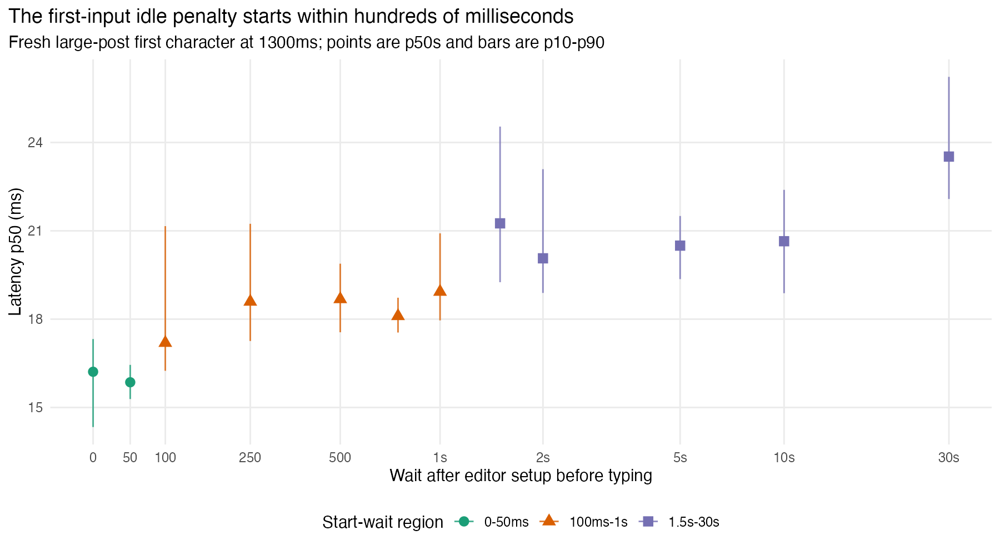

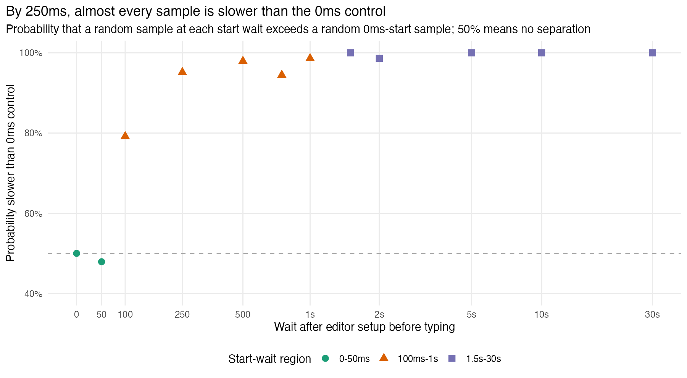

Dense onset p50s:

| Start wait | p50 | p10-p90 | p50 delta vs `0ms` | P(sample > `0ms` sample) |
| ---------- | --: | ------: | -----------------: | -----------------------: |
| `0ms`      | `16.2ms` | `14.3-17.3ms` | `+0.0ms` | `50%` |
| `50ms`     | `15.9ms` | `15.3-16.4ms` | `-0.4ms` | `48%` |
| `100ms`    | `17.2ms` | `16.2-21.2ms` | `+1.0ms` | `79%` |
| `250ms`    | `18.6ms` | `17.3-21.2ms` | `+2.4ms` | `95%` |
| `500ms`    | `18.7ms` | `17.6-19.9ms` | `+2.5ms` | `98%` |
| `750ms`    | `18.1ms` | `17.5-18.7ms` | `+1.9ms` | `94%` |
| `1s`       | `18.9ms` | `18.0-20.9ms` | `+2.7ms` | `99%` |
| `1.5s`     | `21.3ms` | `19.3-24.5ms` | `+5.0ms` | `100%` |
| `2s`       | `20.1ms` | `18.9-23.1ms` | `+3.9ms` | `99%` |
| `5s`       | `20.5ms` | `19.4-21.5ms` | `+4.3ms` | `100%` |
| `10s`      | `20.6ms` | `18.9-22.4ms` | `+4.4ms` | `100%` |
| `30s`      | `23.5ms` | `22.1-26.2ms` | `+7.3ms` | `100%` |

This sharpens the answer to "what happens if the benchmark starts sooner or
later?" Starting immediately is the fastest case this harness can test. Adding
only `50ms` after editor setup does not matter in this run. By `100ms`, the
distribution starts to separate from the `0ms` control, although the p10-p90
band still overlaps. By `250ms`, almost every pairwise comparison against a
`0ms` sample is slower. The exact p50s are not monotonic, so it would be wrong
to read `500ms` as meaningfully worse than `750ms` or `2s` as meaningfully
better than `1.5s`; the robust result is the regime split: `0-50ms` looks hot,
`100ms-1s` is already cooler, and tens of seconds reaches the long-idle plateau.

This also separates the first-character start-wait effect from the rich-text
`1000ms` persistence-timer cliff discussed later. The first-character slowdown
starts before a one-second timer could be the direct boundary. The extra latency
again sits mostly in the `keypress` trace slice.

I then added explicit setup-phase timestamps to remove an ambiguity in the raw
accounting. Earlier runs recorded `editorSetupStoppedAtEpochMs` after the
configured post-setup wait, so the old `setup_to_run_gap` was `0ms` by
construction. The new fields separate:

-   `setupStarted`: entry to the setup helper;
-   `setupWorkStarted`: after any configured pre-setup wait;
-   `setupReady`: after the editor is loaded, focused, and tracing hooks are
    reset;
-   `setupStopped`: after any configured post-setup wait.

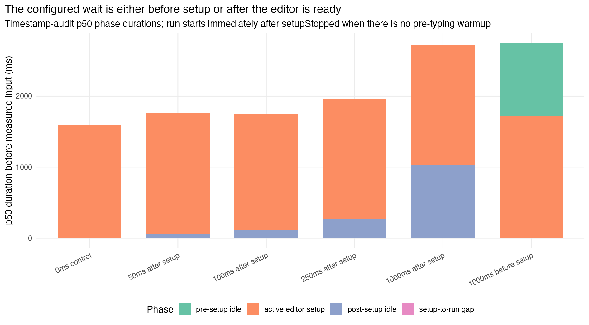

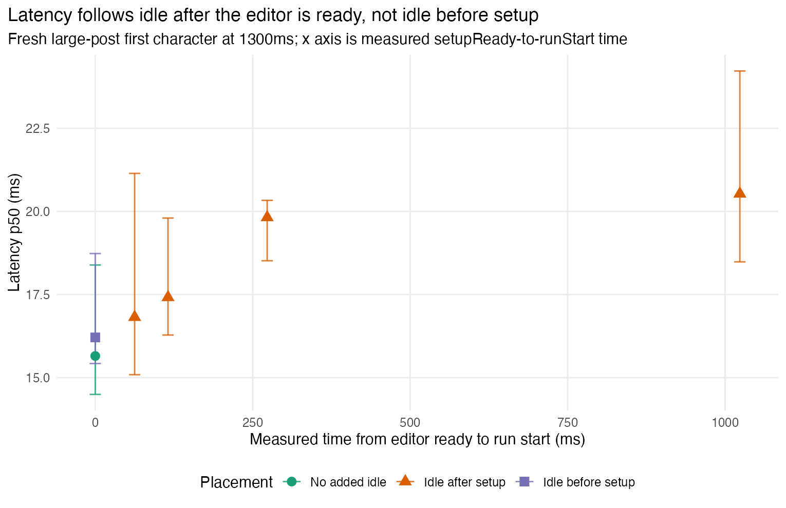

Timestamp-audit p50s:

| Placement | Latency p50 | Pre-setup idle p50 | Active setup p50 | Post-setup idle p50 |
| --------- | ----------: | -----------------: | ---------------: | ------------------: |
| `0ms` control | `15.7ms` | `0ms` | `1590ms` | `0ms` |
| `50ms` after setup | `16.8ms` | `0ms` | `1703ms` | `63ms` |
| `100ms` after setup | `17.4ms` | `0ms` | `1635ms` | `116ms` |
| `250ms` after setup | `19.8ms` | `0ms` | `1691ms` | `273ms` |
| `1000ms` after setup | `20.5ms` | `0ms` | `1687ms` | `1024ms` |
| `1000ms` before setup | `16.2ms` | `1027ms` | `1719ms` | `0ms` |

This is a timestamp audit, not a replacement for the larger onset scan above:
it has 6 samples per setting, so its latency p50s are noisier. Its job is to
prove placement. It shows that the post-setup knob really creates editor-ready
idle time immediately before the run, and that moving the same `1000ms` idle
before setup leaves `setupReady -> runStart` at `0ms` and returns to the hot
first-input distribution. That closes the loophole where "time before the
benchmark starts" might have meant total wall-clock time inside the setup helper
rather than idle time after the editor is ready.

### CI-Comparable Typing Anchor

The Performance Tests CI job's post-editor Typing metric is not the same as the
default custom benchmark setup above. In
`test/performance/specs/post-editor.spec.js`, the Typing setup creates a new
post, loads the large-post fixture, inserts an empty paragraph, saves a draft,
reopens that draft, disables autosave, and then traces one
`target.type( 'x'.repeat( 11 ), { delay: 1000 } )` call. It discards the first
character and keeps the next 10 samples.

I added an explicit `BENCHMARK_SETUP_STYLE=ci-post-editor-typing` mode for that
shape. The `0ms` row below is the comparable anchor: same saved/reopened
large-post draft setup, same `target.type()` path, same `1000ms` key delay, same
10 retained plus 1 throwaway policy. I repeated it for 4 fresh drafts to get
volatility data. The `250ms` and `1000ms` rows are variants that add an extra
post-setup wait before `target.type()`; those variants answer the fixed-wait
question on the same setup, but they are not exact CI Typing runs.

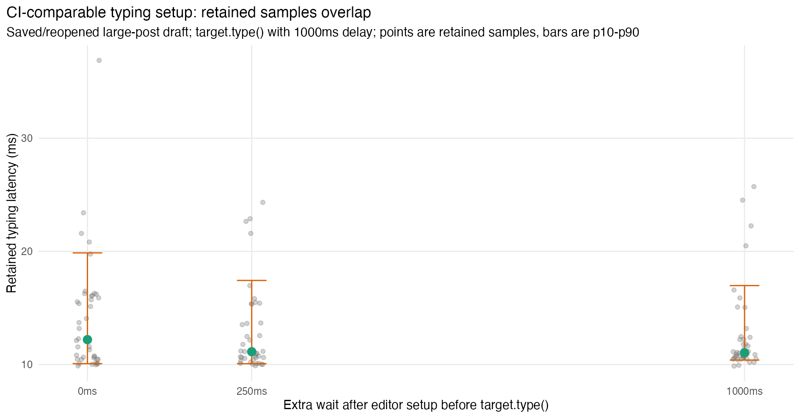

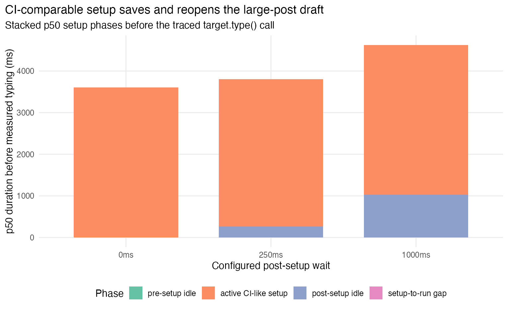

CI-comparable retained typing p50s:

| Extra wait after setup | Retained p50 | p10-p90 | sd | Throwaway p50 | Active setup p50 | Post-setup idle p50 |
| ---------------------- | -----------: | ------: | -: | ------------: | ---------------: | ------------------: |
| `0ms`                  | `12.2ms` | `10.1-19.9ms` | `5.1ms` | `22.0ms` | `3603ms` | `0ms` |
| `250ms`                | `11.1ms` | `10.1-17.4ms` | `3.9ms` | `20.4ms` | `3538ms` | `266ms` |
| `1000ms`               | `11.0ms` | `10.4-17.0ms` | `3.9ms` | `22.3ms` | `3600ms` | `1025ms` |

This local run is comparable to the CI `post-editor` Typing test shape, not to
the full GitHub Actions machine image and scheduler environment. Within that
limit, the result is important: the retained CI-style typing samples are in the
same low-latency band with or without an extra fixed post-setup wait. The first
character is still slower, but CI intentionally discards it. That means the
default CI Typing metric is much less sensitive to the start-wait issue than a
first-character benchmark would be.

For a deeper CI-comparable check, I reran the same setup as a start-wait curve:
`0ms`, `50ms`, `100ms`, `250ms`, `500ms`, `1s`, `2s`, `5s`, `10s`, `30s`, and
`60s` after editor setup; 8 fresh saved/reopened drafts per wait; 10 retained
samples plus 1 throwaway sample per draft; `target.type()` with the same
`1000ms` key delay; 0 missing key groups. This keeps the CI Typing setup fixed
and varies only when tracing and typing begin after the editor is ready. The
absolute latency level in this later run is higher than the earlier three-point
anchor, so the useful comparison is the within-run wait curve, not the
cross-run p50 difference.

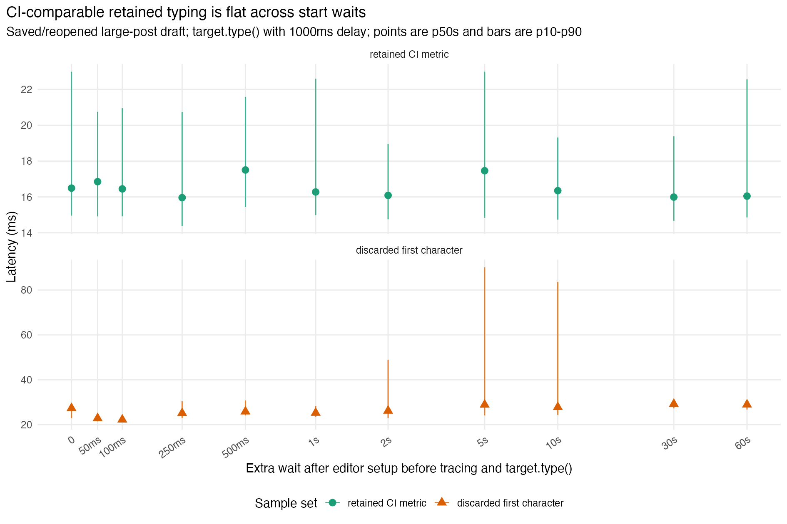

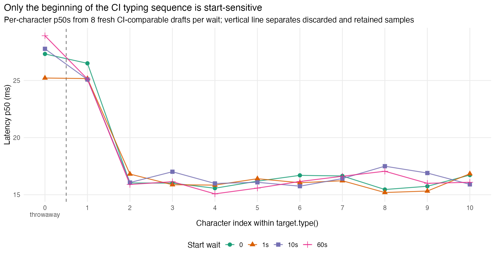

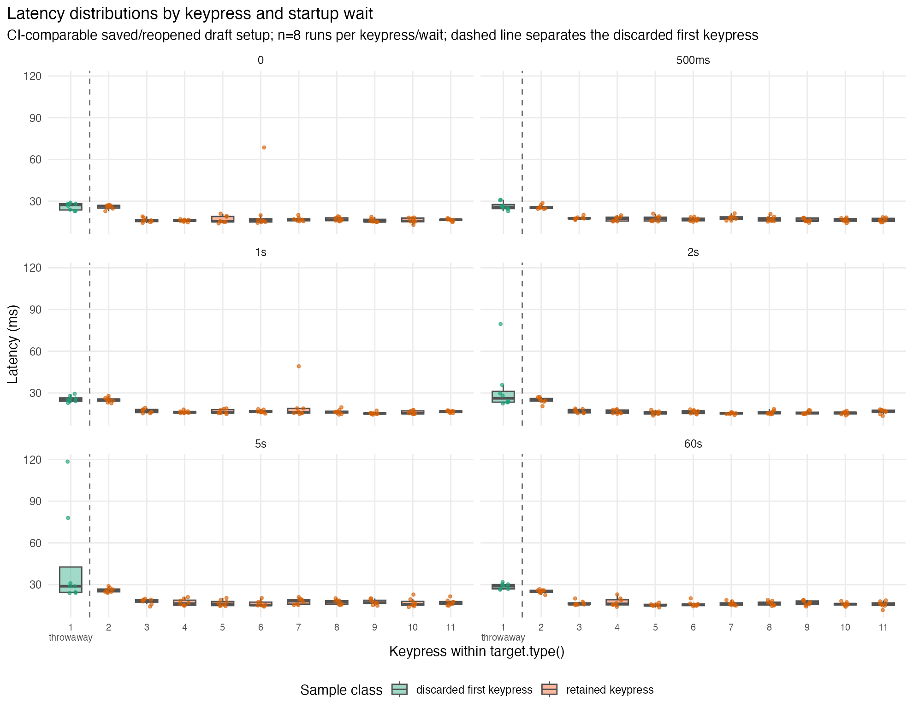

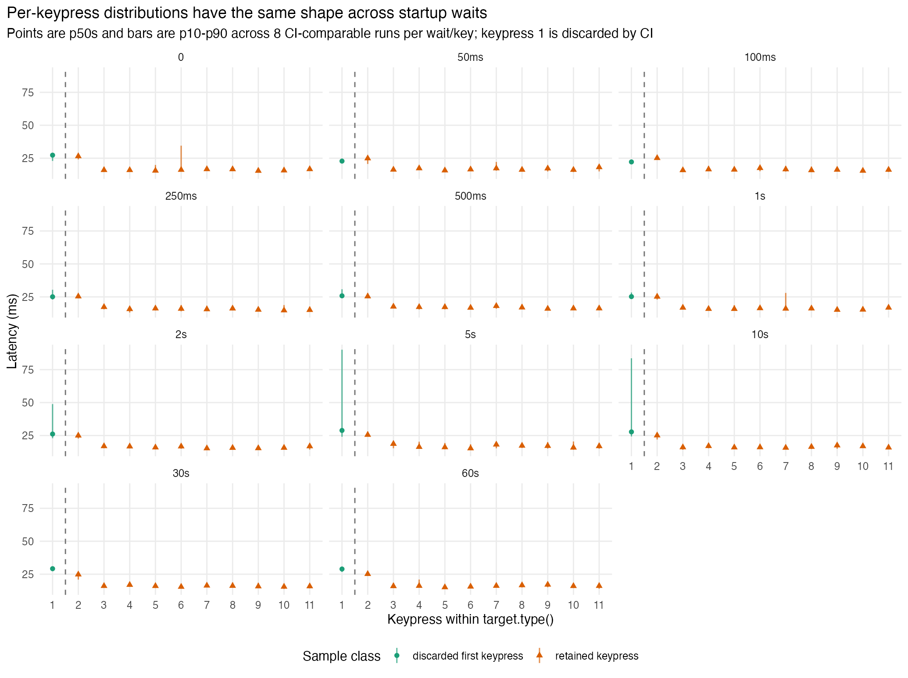

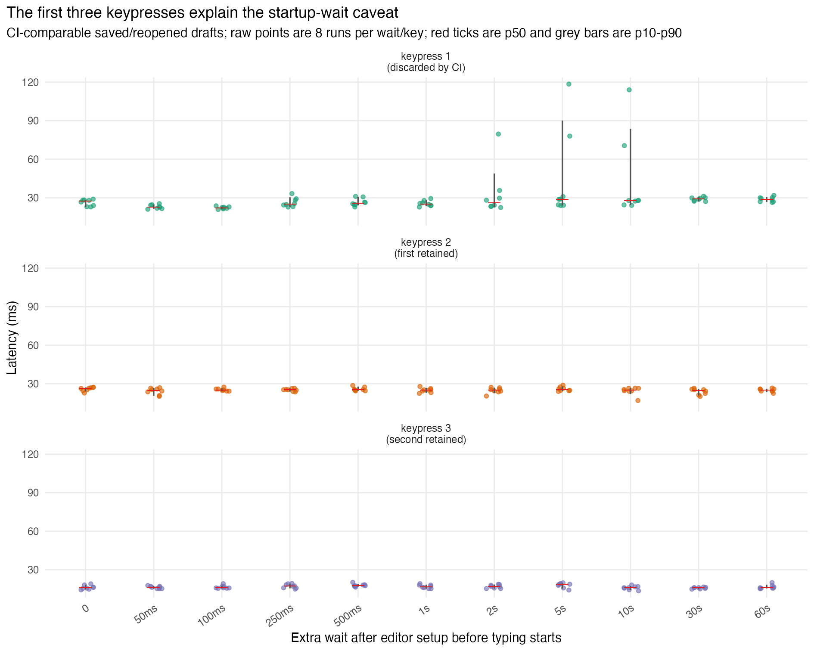

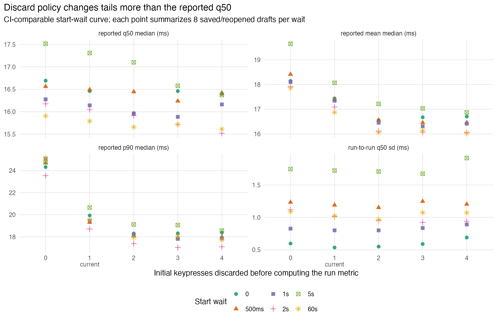

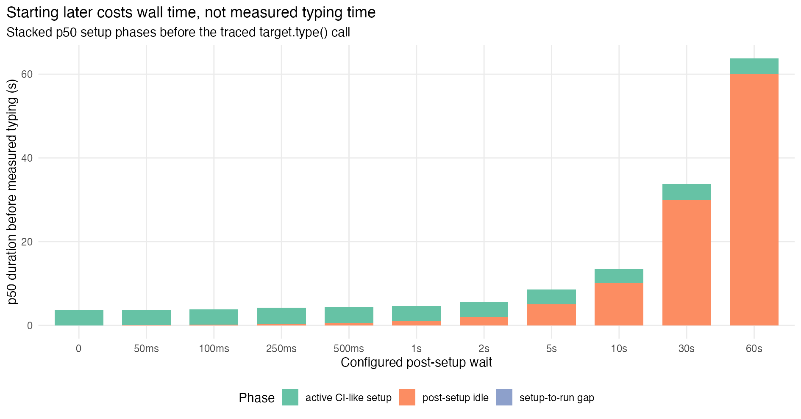

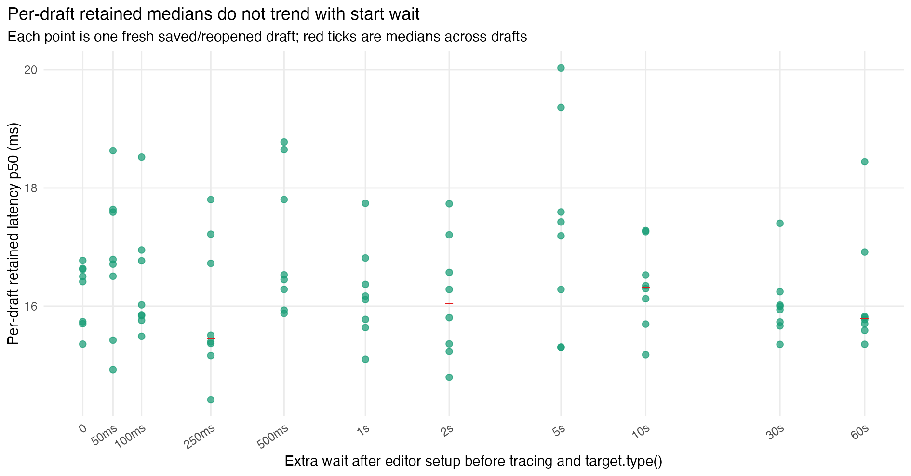

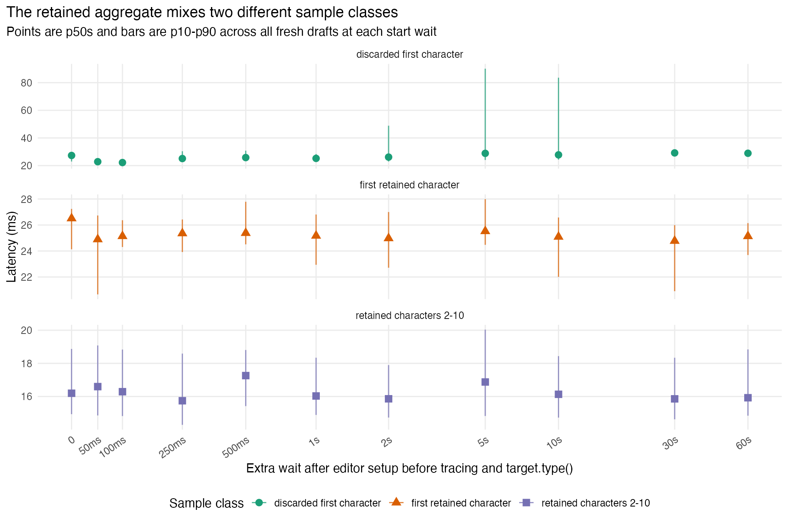

Selected deeper CI-comparable start-wait rows:

| Extra wait after setup | Retained p50 | Retained p10-p90 | Retained mean | Discarded first-char p50 | First retained-char p50 | Post-setup idle p50 |
| ---------------------- | -----------: | ---------------: | ------------: | -----------------------: | ----------------------: | ------------------: |
| `0ms` | `16.5ms` | `15.0-23.0ms` | `18.1ms` | `27.3ms` | `26.5ms` | `0ms` |
| `1s` | `16.3ms` | `15.0-22.6ms` | `17.6ms` | `25.2ms` | `25.2ms` | `1026ms` |
| `10s` | `16.3ms` | `14.7-19.3ms` | `17.2ms` | `27.8ms` | `25.1ms` | `10026ms` |
| `60s` | `16.0ms` | `14.9-22.6ms` | `17.2ms` | `28.9ms` | `25.1ms` | `60030ms` |

This disconfirms the theory that starting the CI Typing benchmark later makes
the retained typing metric meaningfully slower or more stable. Across all 11
wait settings, retained p50 stays in a narrow `16.0-17.5ms` band, and the
p10-p90 intervals overlap. The cost of starting later is therefore mostly
literal wall-clock time before tracing starts. In this run, adding a `60s`
post-setup wait added about `60s` per fresh draft before typing, but did not
move the retained p50.

The per-keypress distribution is the important caveat. The beginning of the
sequence is not the same as the retained aggregate: keypress 1 is the discarded
throwaway and is slow, and keypress 2, the first retained keypress, is also slow
at about `25ms` across the selected waits. By keypress 3, the sequence has fallen
into the ordinary `~16-17ms` low band. So CI's current one-character throwaway
removes the coldest first input, but it still retains one early slow sample. That
early retained sample affects means and p90s more than p50s. Changing the start
wait does not remove that shape; it just moves idle time before the sequence.
The raw box/point plot also shows the few large outliers: they are isolated and
mostly on the discarded first keypress, not a monotonic startup-wait effect.

Focused first-three-keypress p50s:

| Extra wait after setup | Keypress 1 p50 | Keypress 2 p50 | Keypress 3 p50 |
| ---------------------- | -------------: | -------------: | -------------: |
| `0ms` | `27.3ms` | `26.5ms` | `16.0ms` |
| `50ms` | `22.8ms` | `24.9ms` | `16.3ms` |
| `100ms` | `22.2ms` | `25.1ms` | `15.9ms` |
| `250ms` | `25.1ms` | `25.4ms` | `17.3ms` |
| `500ms` | `25.8ms` | `25.4ms` | `17.6ms` |
| `1s` | `25.2ms` | `25.2ms` | `16.8ms` |
| `2s` | `26.1ms` | `25.0ms` | `16.9ms` |
| `5s` | `28.9ms` | `25.5ms` | `18.7ms` |
| `10s` | `27.8ms` | `25.1ms` | `16.1ms` |
| `30s` | `29.2ms` | `24.8ms` | `16.1ms` |
| `60s` | `28.9ms` | `25.1ms` | `15.9ms` |

I then recomputed the same CI-comparable per-run metrics under alternate
throwaway policies. The current Typing metric discards one keypress and reports
the q50 of the remaining 10. If it also discarded keypress 2, the median q50
across startup waits would move by only `-0.16ms`; the median run-to-run q50 sd
would move by only `-0.04ms`. The mean and p90 are more sensitive: the same
extra discard lowers the median mean by `0.85ms` and the median p90 by `1.51ms`.
So the slow first retained key is mostly hidden from the reported q50 comparison
but still visible in tail/mean views. That answers the CI-statistic question; it
does not make the first input after idle unimportant for user experience.

Per-draft summaries also show no monotonic start-wait effect hiding under the
aggregate p50. Fitting per-draft retained p50 against `log10(wait + 100ms)` gives
a slope of `-0.06ms` per log10 unit with `R^2 = 0.003`; Spearman correlation
between wait and per-draft retained p50 is `rho = -0.09`. Comparing the two
extremes in the curve, the `60s` wait's median per-draft p50 is `0.67ms` lower
than the `0ms` wait, while the mean per-draft p50 differs by only `-0.04ms`.
That is smaller than ordinary draft-to-draft spread.

To check whether the monotonic wait order created a false negative, I ran a
blocked extreme check in this order: `60s`, `0ms`, `60s`, `0ms`, with 4 fresh
saved/reopened drafts per block and the same CI Typing shape. The retained p50s
were `15.67ms`, `15.70ms`, `16.32ms`, and `16.31ms` respectively:

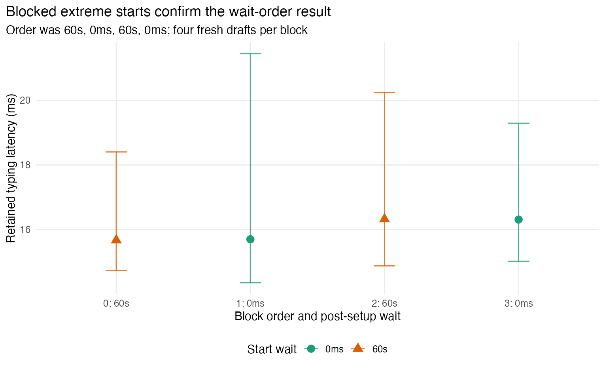

That order-control run supports the same conclusion as the full curve. Starting
later is a wall-clock cost, not a retained Typing-latency improvement. Starting
earlier, down to the current `0ms` post-setup wait, does not hurt the retained
CI Typing metric in these local runs.

I then moved the check into the actual `post-editor.spec.js` Typing test. I
added default-off env controls:
`POST_EDITOR_TYPING_START_WAIT_MS`,
`POST_EDITOR_TYPING_START_WAIT_PHASE=before-trace|after-trace`, and
`POST_EDITOR_RESULTS_OUTPUT_DIR`. With all env vars unset, the spec's behavior
is unchanged. For the exact check I ran only the plain
`Post Editor Performance > Typing` setup/run tests, not the custom
`typing-delay-benchmark.spec.js` harness.

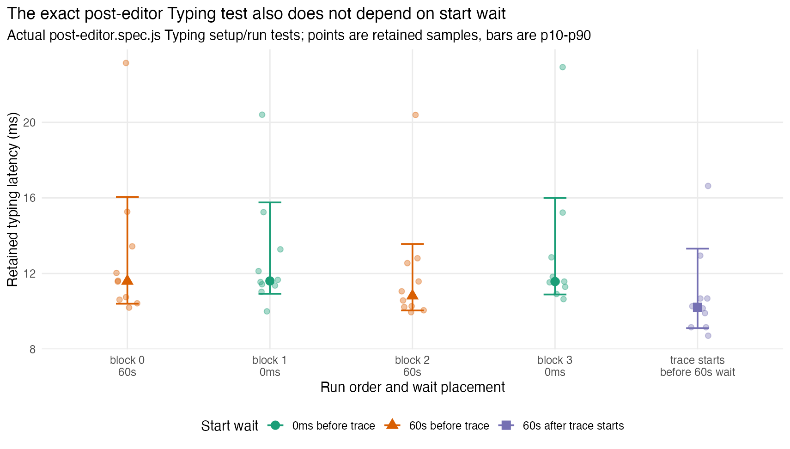

Exact `post-editor.spec.js` Typing rows:

| Run | Wait placement | Retained p50 | p10-p90 | Mean | Reporter summary |
| --- | -------------- | -----------: | ------: | ---: | ---------------- |
| `block 0` | `60s before trace` | `11.60ms` | `10.4-16.1ms` | `12.90ms` | `11.6 ms +15.86% -8.53%` |
| `block 1` | `0ms before trace` | `11.61ms` | `10.9-15.8ms` | `12.81ms` | `11.61 ms +14.38% -2.15%` |
| `block 2` | `60s before trace` | `10.82ms` | `10.0-13.6ms` | `11.95ms` | `10.82 ms +15.99% -5.45%` |
| `block 3` | `0ms before trace` | `11.57ms` | `10.9-16.0ms` | `13.04ms` | `11.57 ms +11.15% -2.42%` |
| `trace before wait` | `60s after trace starts` | `10.21ms` | `9.1-13.3ms` | `10.83ms` | `10.21 ms +4.6% -10.28%` |

This exact-spec check is the strongest local evidence for the CI-comparable
question. It avoids the custom benchmark's extra instrumentation and uses the
real `post-editor.spec.js` `type()` helper, the real retained-results array, and
the same reporter summary that the performance test prints. It still shows no
penalty from starting typing later, and no penalty from starting tracing before
the idle interval. The absolute values are lower than the custom
CI-comparable-harness values because the exact spec does less benchmark-side
instrumentation, but the conclusion is the same.

To reduce the chance that the exact-spec result was just the small blocked
sample, I then ran a randomized exact-spec follow-up: four before-trace runs at
`0ms`, four at `1000ms`, and four at `60000ms`, in mixed order. Each run was
the actual `Post Editor Performance > Typing` setup/run pair with the same
retained-results array and reporter summary.

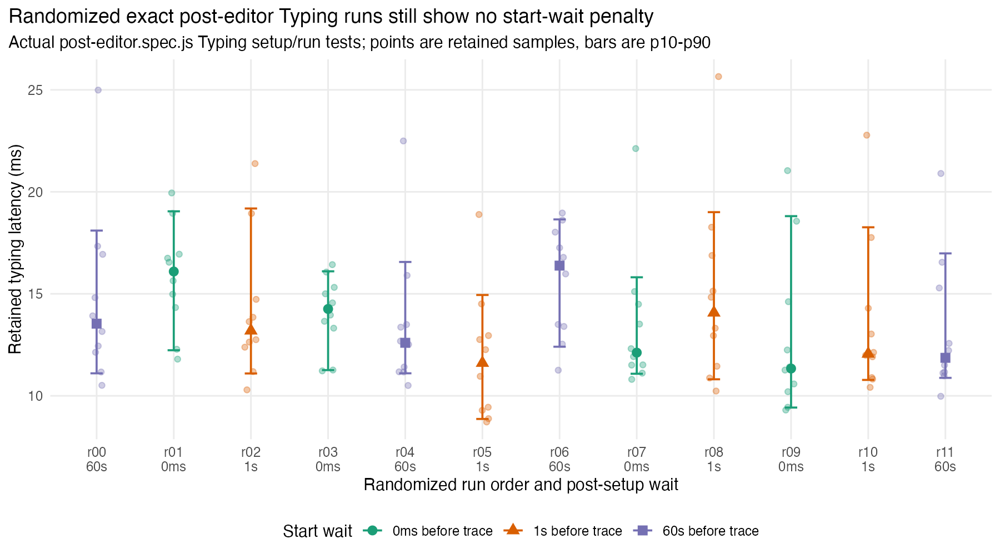

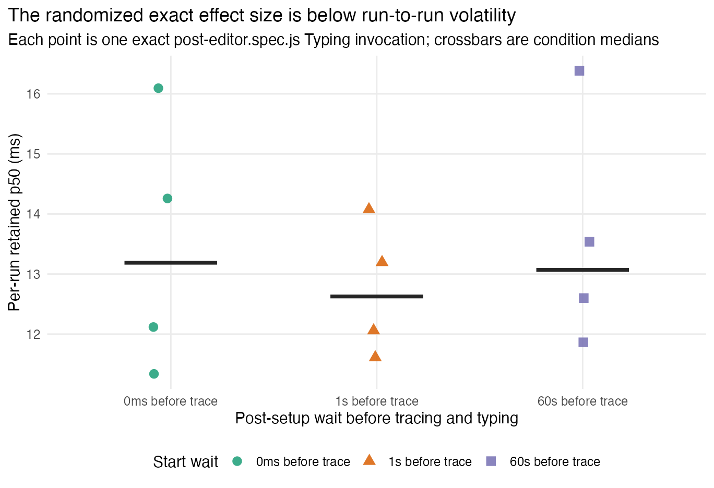

Randomized exact-spec rows, summarized by wait:

| Wait before trace | Runs | Median per-run p50 | Per-run p50 range | Per-run p50 sd | Median suite elapsed |
| ----------------: | ---: | -----------------: | ----------------: | -------------: | -------------------: |
|             `0ms` |  `4` |          `13.19ms` |  `11.34-16.09ms` |       `2.15ms` |              `17.3s` |
|          `1000ms` |  `4` |          `12.63ms` |  `11.61-14.07ms` |       `1.11ms` |              `18.3s` |
|         `60000ms` |  `4` |          `13.07ms` |  `11.86-16.38ms` |       `1.98ms` |              `78.0s` |

The grouped exact run does not show a latency or stability win from delaying
the start. A linear model of per-run p50 against `log10(wait + 100)` gives a
slope of `0.10ms` per log10 unit with `R^2 = 0.005` and `p = 0.83`; Spearman
`rho = 0.06`, and Kruskal-Wallis over the three wait groups gives `p = 0.78`.
With only four runs per condition these are not proof of zero effect, but they
bound the effect against the observed local volatility: the condition medians
differ by at most `0.56ms`, while individual exact-spec run p50s range from
`11.34ms` to `16.38ms`. The only large effect is wall time. The `60s` wait
changes the median exact Typing invocation from about `17-18s` to `78s`, so
removing it would save roughly one minute per invocation in this setup without a
detectable hit to the retained Typing metric.

### Independent Typing Delay And Startup Wait

The wording around `BROWSER_IDLE_WAIT` is a trap. In the current performance
specs it is not one thing:

-   In Typing tests, it is the delay between typed characters inside
    `target.type( ..., { delay } )`.
-   In several non-Typing tests, it is an explicit
    `page.waitForTimeout( BROWSER_IDLE_WAIT )` before tracing/measurement.

Those are independent variables. By static count in the current post/site editor
performance specs, one branch/environment run at the fixed `1000ms` constant
accounts for about `76s` of explicit pre-measurement sleeps (`66s` in
`post-editor.spec.js`, `10s` in `site-editor.spec.js`) plus about `55s` of
inter-key Typing delay (`44s` in post-editor Typing variants, `11s` in
site-editor Typing). So one post/site editor performance pass contains roughly
`131s` of fixed time from this one constant. A normal pull-request or trunk CI
comparison runs two branches, so the job-level total is roughly `152s` of
explicit pre-measurement sleeps and `110s` of Typing delay, or about `262s` in
this fixed-wait bucket. Workflow-dispatch and release comparisons multiply by
the number of compared branches. Removing only startup/pre-measurement waits is
not the same as reducing the Typing delay.

The CI result is not an average. The Playwright reporter writes raw sample
arrays and curated quartiles; `stats()` computes `q25`, `q50`, `q75`, and
`cnt`. The local table prints `q50` with `+q75/-q25` percentage deltas, the
plugin performance command recomputes the same quartiles from the raw result
files across rounds, and the CodeVitals logger uploads `q50`. For Typing with
the default one round, the main CI number is therefore the median of the 10
retained event-latency samples, not their arithmetic mean. I still compute the
mean below because it is useful for outlier sensitivity, but it is not the
metric CI displays/uploads. The workflow does not use either q50 or mean as an
automatic regression threshold.

### What CI Passes Or Fails On

The Performance Tests workflow does not currently have a metric-regression gate
in this repo. The job passes if setup, build, `wp-env`, and the Playwright
performance command succeed and the workflow reaches the end. It fails on normal
command failures: dependency/build failure, `wp-env` failure, Playwright test
failure or timeout, missing/empty performance-result attachments, or the
workflow's 60-minute job timeout.

The metric comparison is reporting, not gating:

-   `.github/workflows/performance.yml` runs `./bin/plugin/cli.js perf ...`.
-   `bin/plugin/commands/performance.js` runs each performance spec on each
    compared branch, reads `*.performance-results.raw.json`, recomputes `q25`,
    `q50`, `q75`, and `cnt`, and writes `*.performance-results.json`.
-   For two-branch comparisons it computes `% Change` as
    `(branch1.q50 - branch2.q50) / branch2.q50 * 100` and writes that into
    `summary.md`.
-   There is no threshold check that throws or sets a nonzero exit status from
    that `% Change`.
-   `bin/log-performance-results.js` uploads q50 values to CodeVitals on trunk
    pushes, but that runs after the comparison step succeeds and is not the PR
    pass/fail gate.

So, when this report says "CI reports q50", read that literally: q50 is the
displayed/uploaded comparison metric. It is not currently an automatic
pass/fail threshold. The automatic pass/fail mechanism is command success or
failure and the 60-minute job timeout.

To measure the independent variables, I split the default-off controls:

-   `PERFORMANCE_TYPING_DELAY_MS`: delay between typed characters.
-   `POST_EDITOR_TYPING_START_WAIT_MS`: wait after the Typing setup and before
    tracing/typing.
-   `PERFORMANCE_MEASUREMENT_IDLE_WAIT_MS`: explicit pre-measurement wait for
    non-Typing measurements.

Defaults preserve the current `1000ms` behavior. The grid below is the exact
plain `Post Editor Performance > Typing` setup/run pair. It crosses typing
delays of `100ms`, `200ms`, `400ms`, `600ms`, and `1000ms` with startup waits of
`0ms`, `50ms`, `100ms`, `250ms`, `500ms`, `750ms`, `1000ms`, `1500ms`,
`2000ms`, and `5000ms`. Each cell is one exact run with 10 retained samples and
one discarded first character.

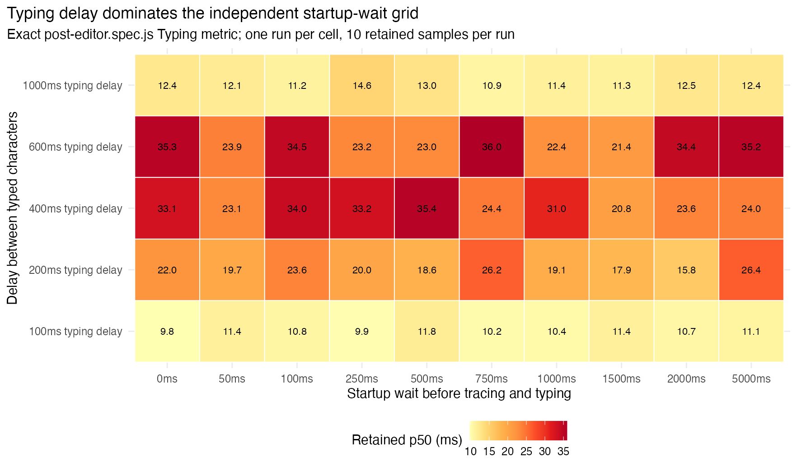

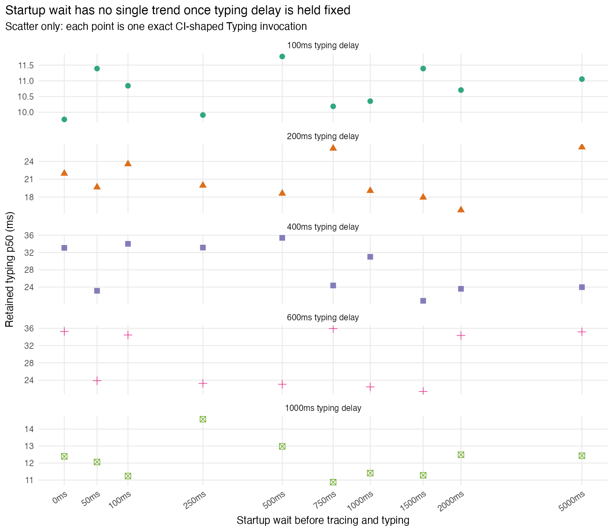

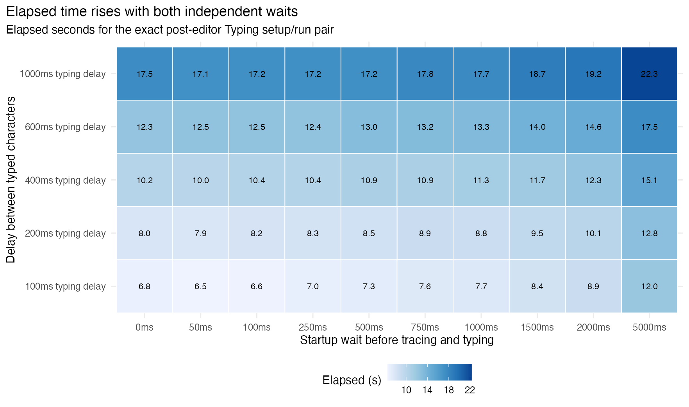

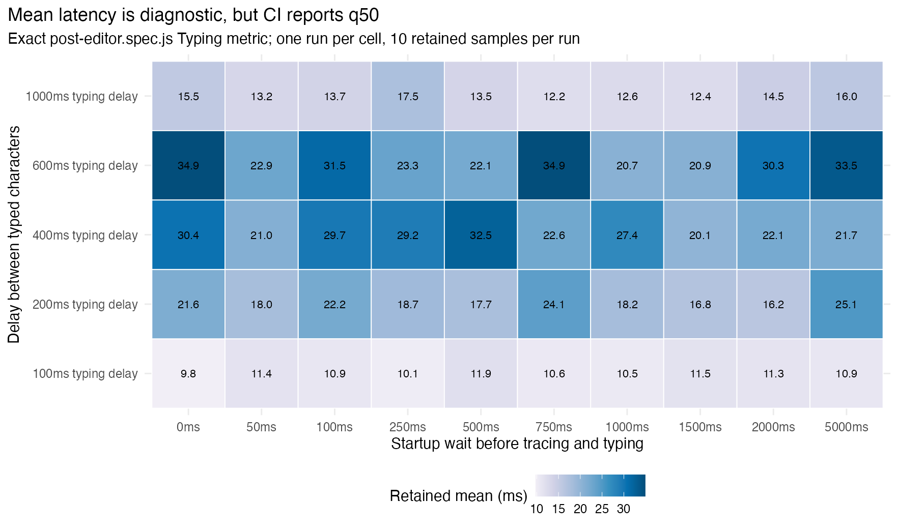

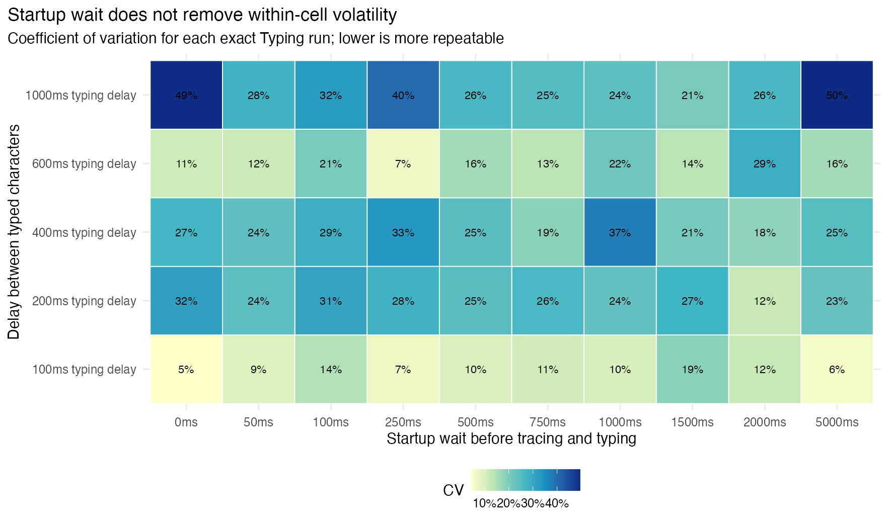

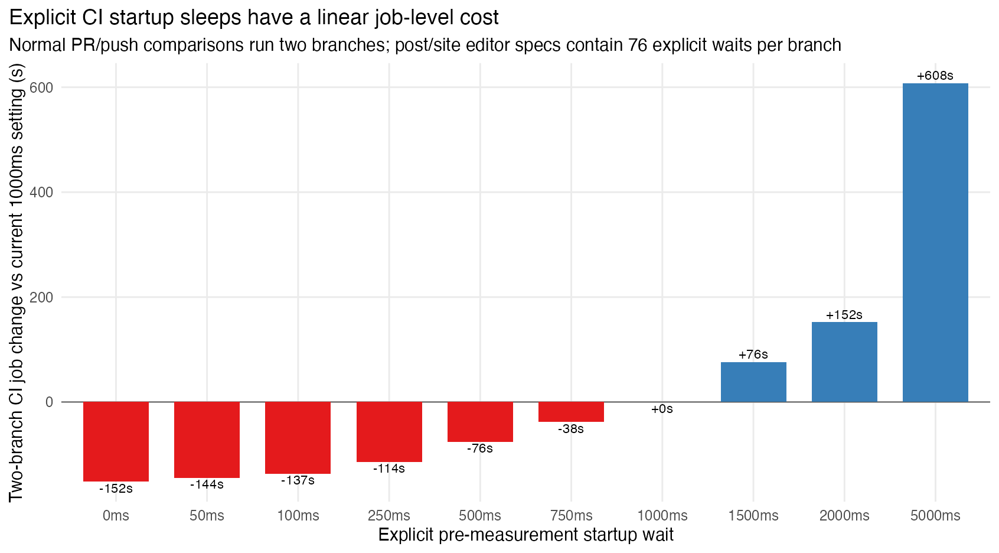

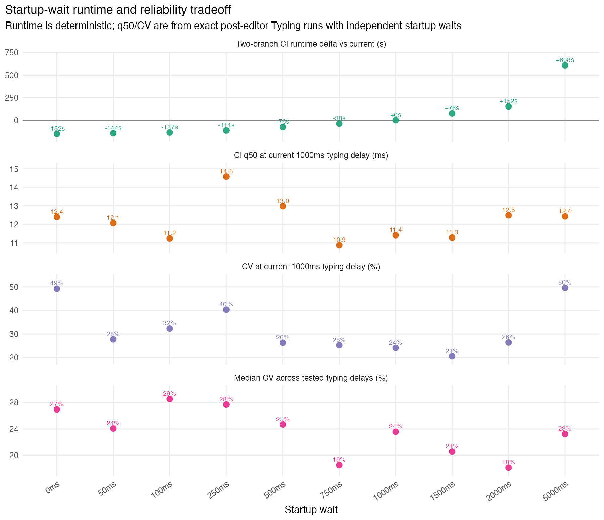

Summary by typing delay:

| Typing delay | Startup waits | Median p50 | p50 range | `0ms` startup | `1000ms` startup | `2000ms` startup |
| -----------: | ------------: | ---------: | --------: | ------------: | ----------------: | ----------------: |
|      `100ms` |          `10` |   `10.8ms` | `9.8-11.8ms` |       `9.8ms` |          `10.4ms` |          `10.7ms` |
|      `200ms` |          `10` |   `19.8ms` | `15.8-26.4ms` |      `22.0ms` |          `19.1ms` |          `15.8ms` |
|      `400ms` |          `10` |   `27.7ms` | `20.8-35.4ms` |      `33.1ms` |          `31.0ms` |          `23.6ms` |
|      `600ms` |          `10` |   `29.1ms` | `21.4-36.0ms` |      `35.3ms` |          `22.4ms` |          `34.4ms` |
|     `1000ms` |          `10` |   `12.2ms` | `10.9-14.6ms` |      `12.4ms` |          `11.4ms` |          `12.5ms` |

The heatmap's p50 is the same statistic CI reports. The grid disconfirms a
simple "wait `1000ms` before Typing or the metric gets worse" story. At `100ms`
typing delay, changing startup wait from `0ms` to `1000ms` moves p50 by only
`+0.6ms`. At the current `1000ms` typing delay, `0ms`, `1000ms`, and `2000ms`
startup waits are all in the same low band (`12.4ms`, `11.4ms`, and `12.5ms`).
The corresponding means are `15.5ms`, `12.6ms`, and `14.5ms`; the mean moves
more because it charges isolated slow samples more heavily than q50. The large
differences come from typing delay itself: `400ms` and `600ms` typing delays can
be around `20-36ms`, while `100ms` and `1000ms` are around `10-14ms` in this
run. The `1000ms` typing delay is not a neutral "longer sleep"; it is the
previously analyzed one-second timer-boundary regime.

The runtime plot is deterministic, not a statistical estimate. If the explicit
pre-measurement startup wait changed for the post/site editor performance specs
and nothing else changed, the normal two-branch CI job would move like this:

| Explicit wait | Two-branch explicit wait total | CI job change vs current |
| ------------: | -----------------------------: | -----------------------: |
|         `0ms` |                           `0s` |       `-152s` / `-2.5m` |
|       `250ms` |                          `38s` |       `-114s` / `-1.9m` |
|       `500ms` |                          `76s` |        `-76s` / `-1.3m` |
|      `1000ms` |                         `152s` |           `0s` / `0.0m` |
|      `1500ms` |                         `228s` |        `+76s` / `+1.3m` |
|      `2000ms` |                         `304s` |       `+152s` / `+2.5m` |
|      `5000ms` |                         `760s` |      `+608s` / `+10.1m` |

That table is only the explicit startup/pre-measurement part. The `55s` per
branch of Typing delay remains unless `PERFORMANCE_TYPING_DELAY_MS` changes, and
changing that knob changes the benchmark's behavior.

Another way to read the runtime numbers is:

```
new total CI job runtime = current total CI job runtime + shown delta
```

The full workflow also includes checkout, install/build, wp-env setup/teardown,
server work, and the metrics themselves, so the only exact total I can give from
the benchmark files is the wait-controlled delta. A `60000ms` explicit startup
wait would add `8968s` (`149.5m`) to a normal two-branch post/site editor
comparison, before counting any other work, so it would not fit the current
`60m` job timeout.

The volatility heatmap gives the within-run reliability view: the coefficient of
variation is not monotonic in startup wait. For the current `1000ms` typing
delay, the startup-wait q50 range is `10.9-14.6ms` and CV ranges from `20.5%` to
`49.6%`; the worst CV cells are `0ms` and `5000ms`, not a clean "less wait is
less stable" pattern. Grouping all typing delays together is confounded, but it
shows the same shape: median CV by startup wait ranges from `18.1%` to `28.5%`
with no monotonic trend. The randomized exact runs above are one run-to-run view:
four runs each at `0ms`, `1000ms`, and `60000ms` had per-run p50 standard
deviations of `2.15ms`, `1.11ms`, and `1.98ms`. The selected rows below use the
newer CI-comparable saved/reopened draft startup-wait curve instead, because that
run has eight repeated drafts at every listed startup wait.

Selected tradeoff rows:

| Explicit wait | Two-branch runtime delta | CI-comparable reported q50 | Run-to-run q50 sd | Run-to-run q50 range | Repeated runs |
| ------------: | -----------------------: | -------------------------: | ----------------: | -------------------: | ------------: |
|         `0ms` |       `-152s` / `-2.5m` |                  `16.46ms` |          `0.53ms` |             `1.41ms` |           `8` |
|       `500ms` |        `-76s` / `-1.3m` |                  `16.49ms` |          `1.19ms` |             `2.90ms` |           `8` |
|      `1000ms` |           `0s` / `0.0m` |                  `16.14ms` |          `0.80ms` |             `2.64ms` |           `8` |
|      `2000ms` |       `+152s` / `+2.5m` |                  `16.05ms` |          `1.02ms` |             `2.93ms` |           `8` |
|      `5000ms` |      `+608s` / `+10.1m` |                  `17.31ms` |          `1.72ms` |             `4.72ms` |           `8` |
|     `60000ms` |    `+8968s` / `+149.5m` |                  `15.79ms` |          `1.02ms` |             `3.09ms` |           `8` |

No new benchmark run was necessary for these cells; they were already present in
the repeated CI-comparable startup-wait curve. The runtime conclusion is still
stronger than the reliability ranking: lowering the explicit startup wait saves
wall time linearly, while the repeated-run measurements do not show a monotonic
reliability benefit from waiting longer. This does not answer whether every
non-Typing metric in the performance suite would be equally stable; that needs
metric-specific repeated runs.

For the non-Typing side, I first audited the current explicit
`page.waitForTimeout( BROWSER_IDLE_WAIT )` sites. The sleep is paid by several
post-editor measurements and by the site-editor pattern load measurement.

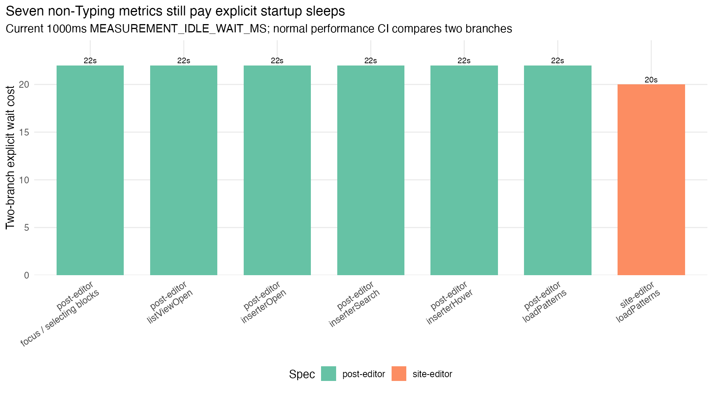

| Spec | Metric | Sleeps per branch | Two-branch cost |
| ---- | ------ | ----------------: | --------------: |
| `post-editor` | focus / selecting blocks | `11` | `22s` |
| `post-editor` | listViewOpen | `11` | `22s` |
| `post-editor` | inserterOpen | `11` | `22s` |
| `post-editor` | inserterSearch | `11` | `22s` |
| `post-editor` | inserterHover | `11` | `22s` |
| `post-editor` | loadPatterns | `11` | `22s` |
| `site-editor` | loadPatterns | `10` | `20s` |

I then ran one exact non-Typing pilot: `Post Editor Performance > Selecting
blocks`, eight independent runs with `PERFORMANCE_MEASUREMENT_IDLE_WAIT_MS=0`
and eight independent runs with `PERFORMANCE_MEASUREMENT_IDLE_WAIT_MS=1000`.

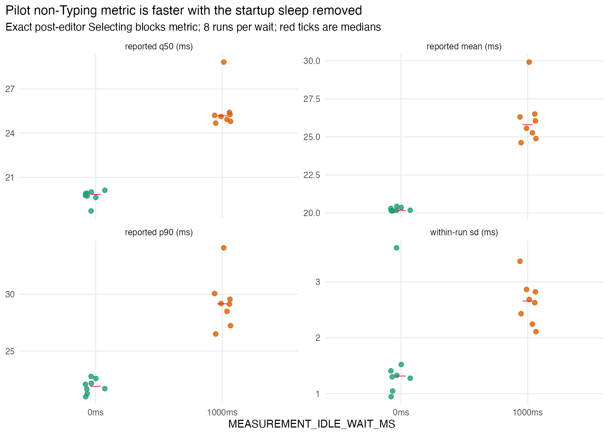

| `PERFORMANCE_MEASUREMENT_IDLE_WAIT_MS` | Runs | Median per-run q50 | Run-to-run q50 sd | Median mean | Median p90 |
| -------------------------------------: | ---: | -----------------: | ----------------: | ----------: | ---------: |
|                                  `0ms` |  `8` |           `19.8ms` |          `0.44ms` |    `20.2ms` |   `21.9ms` |
|                               `1000ms` |  `8` |           `25.2ms` |          `1.35ms` |    `25.8ms` |   `29.2ms` |

This falsifies the narrow claim that the explicit pre-measurement wait is
obviously stabilizing, at least for this metric on this machine. Removing it
saved `11s` per branch for Selecting blocks and moved the per-run q50 median
down by `5.33ms`; the run-to-run q50 sd also fell by `0.92ms`.

To check whether Selecting blocks was special, I ran a broader screen over all
seven sleep-using non-Typing measurements: four exact runs at `0ms` and four at
`1000ms` for the six post-editor metrics, plus four exact runs at each wait for
the site-editor pattern-load metric.

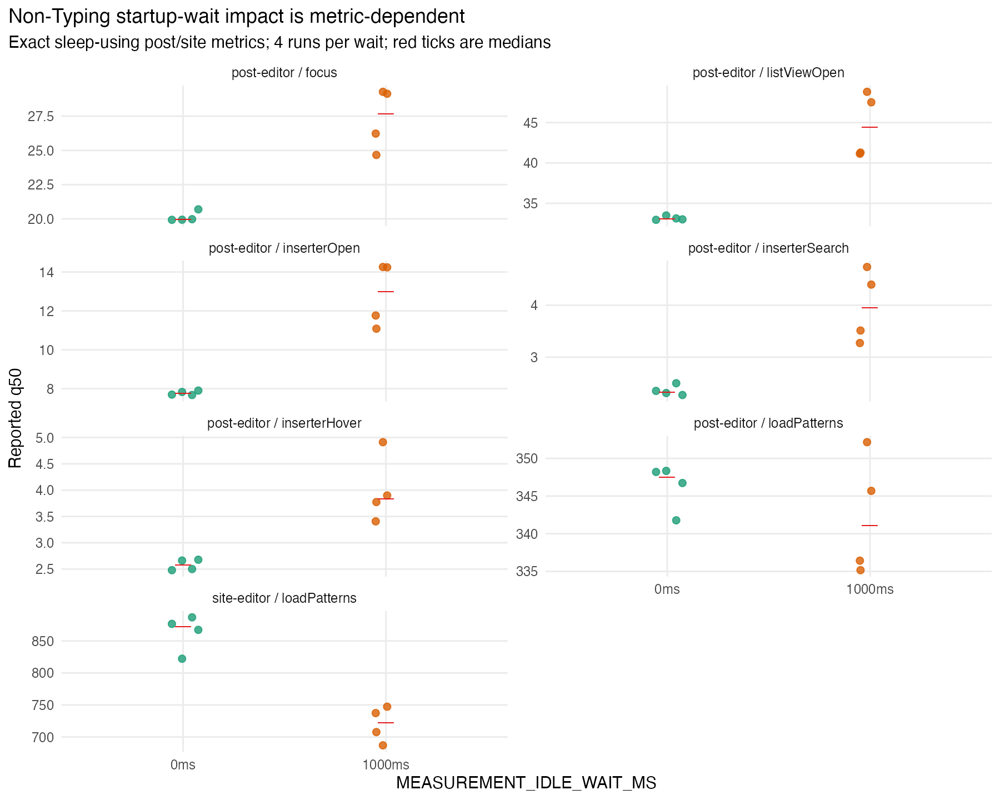

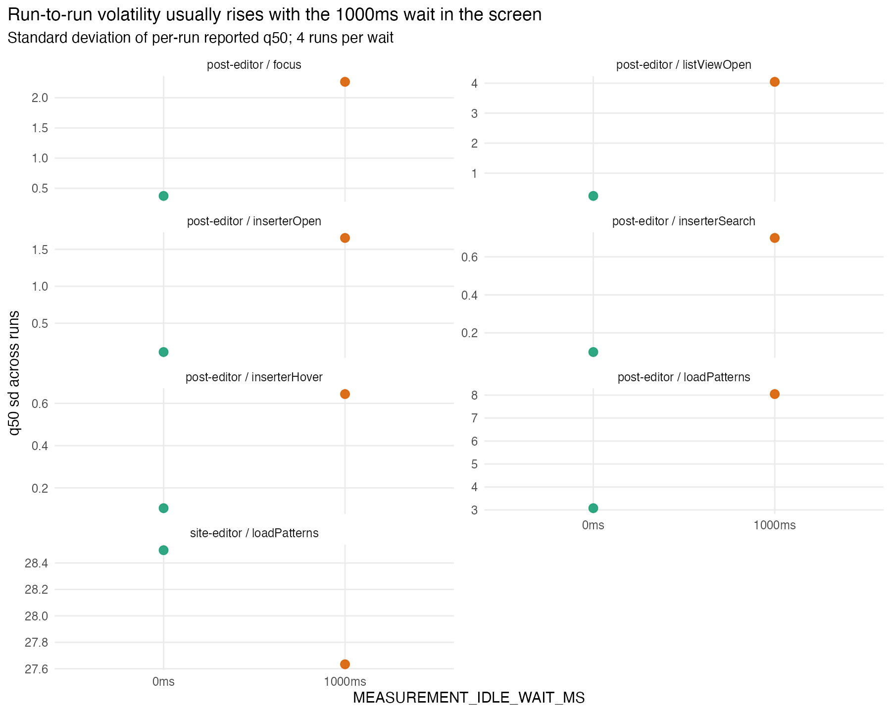

Negative q50 deltas mean `0ms` was faster than `1000ms`:

| Metric | `0ms` q50 | `1000ms` q50 | q50 delta | `0ms` q50 sd | `1000ms` q50 sd |
| ------ | --------: | -----------: | --------: | -----------: | --------------: |
| post-editor focus | `20.0ms` | `27.7ms` | `-7.7ms` | `0.37ms` | `2.26ms` |
| post-editor listViewOpen | `33.1ms` | `44.4ms` | `-11.3ms` | `0.24ms` | `4.04ms` |
| post-editor inserterOpen | `7.8ms` | `13.0ms` | `-5.2ms` | `0.11ms` | `1.65ms` |
| post-editor inserterSearch | `2.3ms` | `4.0ms` | `-1.6ms` | `0.10ms` | `0.70ms` |
| post-editor inserterHover | `2.6ms` | `3.8ms` | `-1.3ms` | `0.10ms` | `0.64ms` |
| post-editor loadPatterns | `347.5ms` | `341.1ms` | `+6.4ms` | `3.08ms` | `8.05ms` |
| site-editor loadPatterns | `872.0ms` | `722.5ms` | `+149.4ms` | `28.50ms` | `27.63ms` |

The interaction metrics are one-sided in this screen: removing the wait made all
five faster and less volatile. Pattern loading is different. The post-editor
pattern-load q50 was close and noisy, while the site-editor pattern-load q50 was
substantially faster after the `1000ms` wait. That makes a global zero-wait
change riskier than an interaction-only change. The next useful experiment is no
longer "does any non-Typing metric care?" but "are pattern-load metrics measuring
real readiness work that the explicit wait hides, and what failure/regression
rate does CI see if only interaction metrics remove the wait?"

I then made the interaction-only answer less dependent on the original four-run
screen. I ran four fresh grouped `post-editor.spec.js` invocations at `0ms` and
four at `1000ms`, covering only Selecting blocks, persistent List View open,
Inserter open, Inserter search, and Inserter hover. Combining those with the
original screen gives eight runs per wait for each of the five interaction
metrics. All 8 grouped invocations passed.

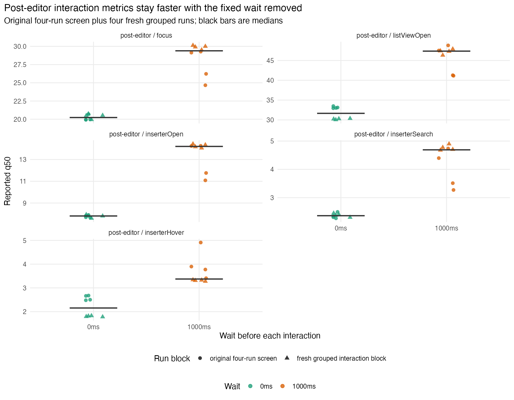

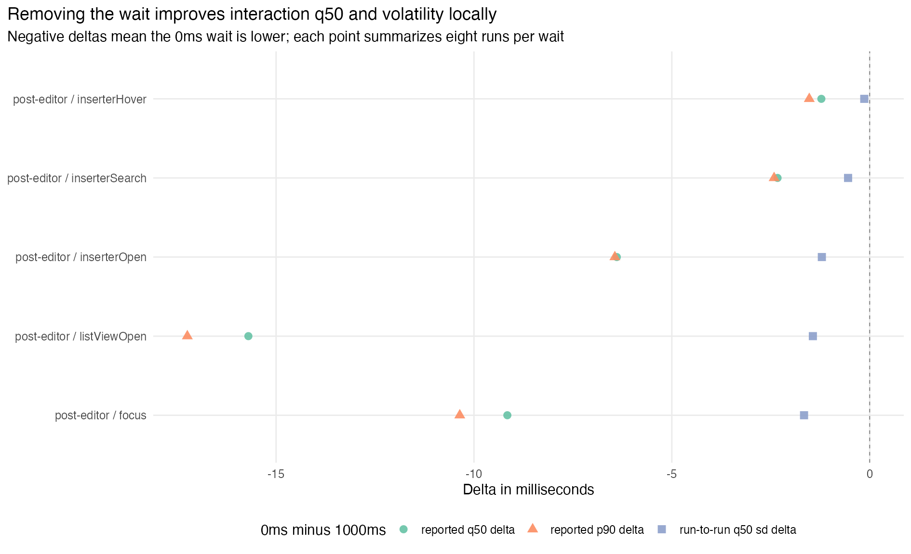

| Metric | `0ms` q50 | `1000ms` q50 | q50 delta | `0ms` q50 sd | `1000ms` q50 sd | Two-branch wait saved |
| ------ | --------: | -----------: | --------: | -----------: | --------------: | --------------------: |
| focus | `20.2ms` | `29.4ms` | `-9.2ms` | `0.37ms` | `2.03ms` | `22s` |
| listViewOpen | `31.7ms` | `47.4ms` | `-15.7ms` | `1.57ms` | `3.01ms` | `22s` |
| inserterOpen | `7.8ms` | `14.2ms` | `-6.4ms` | `0.12ms` | `1.32ms` | `22s` |
| inserterSearch | `2.4ms` | `4.7ms` | `-2.3ms` | `0.08ms` | `0.62ms` | `22s` |
| inserterHover | `2.2ms` | `3.4ms` | `-1.2ms` | `0.42ms` | `0.56ms` | `22s` |

That closes the local interaction-metric part of the non-Typing wait question.
For these five metrics, `0ms` is the local candidate: it is lower on q50, mean,
p90, and run-to-run q50 sd. The remaining gate is portability and failures, not
local diagnosis. Before changing CI, run the same `0ms` versus `1000ms`
interaction matrix on CI/mac/container lanes and check retained counts,
timeouts, missing UI/actionability failures, q50/mean/p90, and total elapsed
suite time. Pattern loading should stay on the separate readiness path.

I followed that with three checks on the site-editor pattern-load exception. First,
I ran the exact existing `Site Editor Performance > Loading Patterns` spec in
alternating order: `0ms`, `1000ms`, repeated six times. This keeps the real spec
shape, including ten retained samples per run and a fresh site-editor visit for
each sample.

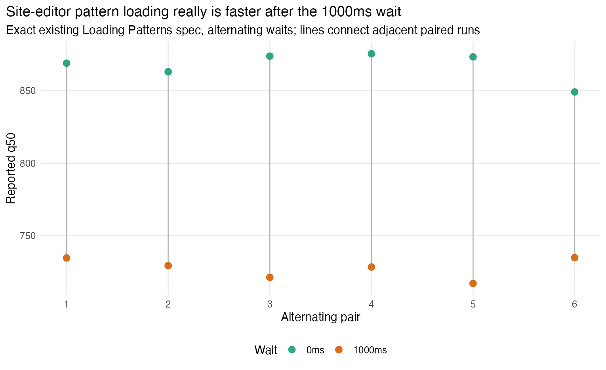

| Wait | Exact runs | Median reported q50 | Run-to-run q50 sd | Median mean | Median p90 |
| ---: | ---------: | ------------------: | ----------------: | ----------: | ---------: |
| `0ms` | `6` | `871.2ms` | `10.0ms` | `899.0ms` | `993.5ms` |
| `1000ms` | `6` | `728.8ms` | `7.2ms` | `737.2ms` | `777.0ms` |

Every adjacent pair favored the `1000ms` wait. The paired q50 deltas were
`114-156ms`, with a mean of `139.8ms` and a small-sample paired t-test
`p = 3.6e-6`. So the site-editor pattern result is not just an artifact of the
earlier grouped order where all `0ms` runs happened before all `1000ms` runs.

Second, I ran a site-editor pattern readiness probe across `0ms`, `100ms`,
`250ms`, `500ms`, `750ms`, `1000ms`, `1500ms`, and `2000ms`, four randomized
samples per wait. The probe deliberately adds observer overhead, so I do not use
its q50 values as the benchmark result. I use it to answer where the work moves:
requests and resource entries that happen during the explicit wait are not
inside the measured pattern-load interval.

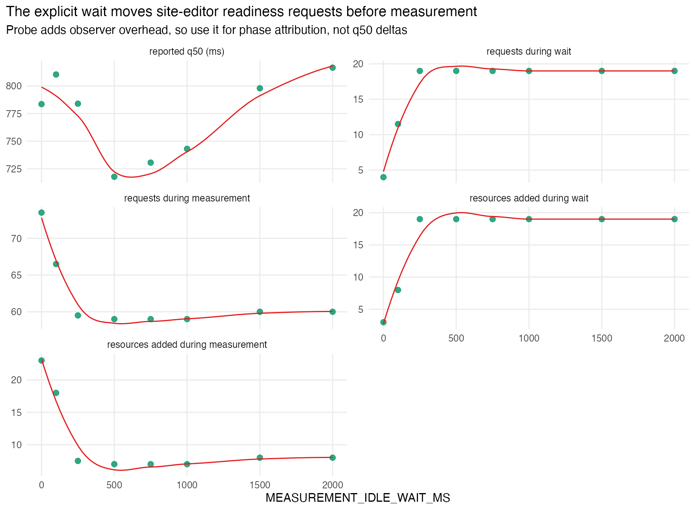

Selected probe rows:

| Wait | Probe samples | Median requests during wait | Median requests during measurement | Median resources added during wait | Median resources added during measurement |
| ---: | ------------: | --------------------------: | ---------------------------------: | ---------------------------------: | ----------------------------------------: |
| `0ms` | `4` | `4.0` | `73.5` | `3.0` | `23.0` |
| `100ms` | `4` | `11.5` | `66.5` | `8.0` | `18.0` |
| `250ms` | `4` | `19.0` | `59.5` | `19.0` | `7.5` |
| `500ms` | `4` | `19.0` | `59.0` | `19.0` | `7.0` |
| `1000ms` | `4` | `19.0` | `59.0` | `19.0` | `7.0` |
| `2000ms` | `4` | `19.0` | `60.0` | `19.0` | `8.0` |

I then ran exact existing `Site Editor Performance > Loading Patterns` sweeps to
confirm the useful shorter waits in the real spec shape. The first randomized
pass covered `0ms`, `100ms`, `250ms`, `500ms`, `750ms`, and `1000ms`, four runs
per wait. A follow-up added six more exact runs each for `250ms`, `500ms`, and
`1000ms`, so the decision-relevant cells have ten runs each.

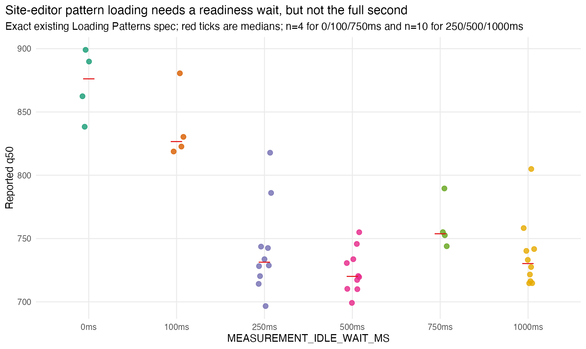

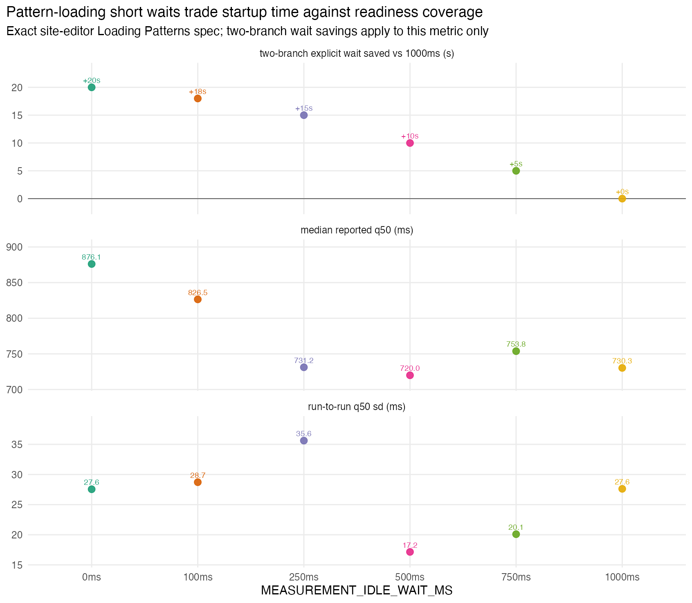

| Wait | Exact runs | Median reported q50 | Run-to-run q50 sd | Two-branch wait saved vs. `1000ms` |
| ---: | ---------: | ------------------: | ----------------: | ---------------------------------: |
| `0ms` | `4` | `876.1ms` | `27.6ms` | `20s` |
| `100ms` | `4` | `826.5ms` | `28.7ms` | `18s` |
| `250ms` | `10` | `731.2ms` | `35.6ms` | `15s` |
| `500ms` | `10` | `720.0ms` | `17.2ms` | `10s` |
| `750ms` | `4` | `753.8ms` | `20.1ms` | `5s` |
| `1000ms` | `10` | `730.3ms` | `27.6ms` | `0s` |

That closes the main pattern-load question. The fixed sleep is acting as a
hidden readiness wait for site-editor pattern loading. With `0ms`, the benchmark
opens the design/pattern UI while site-editor readiness requests and resource
work are still close to the measurement boundary; by `250ms` in the probe, the
same class of work has mostly moved before the measurement start. In the exact
spec, `250ms`, `500ms`, and `1000ms` report the same q50 band because that
readiness work is mostly no longer part of the measured interval. This is not a
sign that the page gets faster in wall-clock terms; the run still pays the sleep.
It means the metric definition changes depending on whether the pre-measurement
wait is present.

The practical conclusion is split. The interaction metrics have evidence for
removing or shrinking the explicit wait. Site-editor pattern loading should not
blindly drop to `0ms`; it should either keep a readiness wait or, better, replace
the blind sleep with an explicit readiness condition for the site editor and
pattern previews. If this stays a fixed sleep, `500ms` is the best local
candidate from this exact run: it saves `10s` for this metric in a two-branch
comparison and had lower run-to-run q50 sd than `1000ms`. `250ms` saved `15s`
and matched the `1000ms` median, but it had higher q50 volatility in this sample.

I then joined the exact short-wait sweep to the readiness-probe samples to make
that engineering decision more concrete. The probe boundary is deliberately
count-based and diagnostic: it marks a sample as "settled" when the pre-measure
wait has reached the resource plateau, active requests at measurement start are
zero, and the number of resources added during measurement has dropped to the
low plateau. That is not a production predicate, but it tests whether the
short-wait q50 boundary lines up with readiness work moving out of the measured
interval.

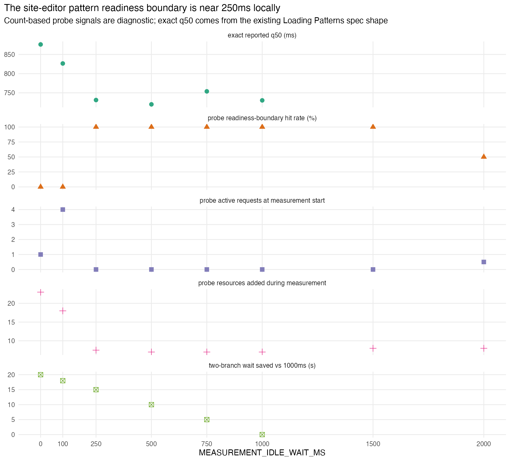

| Wait | Probe boundary hit rate | Median active requests at start | Median resources during measurement | Exact median q50 | Exact q50 sd | Two-branch saved vs `1000ms` |
| ---: | ----------------------: | ------------------------------: | ----------------------------------: | ---------------: | -----------: | ---------------------------: |
| `0ms` | `0%` | `1.0` | `23.0` | `876.1ms` | `27.6ms` | `20s` |
| `100ms` | `0%` | `4.0` | `18.0` | `826.5ms` | `28.7ms` | `18s` |
| `250ms` | `100%` | `0.0` | `7.5` | `731.2ms` | `35.6ms` | `15s` |
| `500ms` | `100%` | `0.0` | `7.0` | `720.0ms` | `17.2ms` | `10s` |
| `1000ms` | `100%` | `0.0` | `7.0` | `730.3ms` | `27.6ms` | `0s` |

That lines up with the exact metric: `0ms` and `100ms` do not hit the readiness
boundary and report slower q50s; `250ms`, `500ms`, and `1000ms` hit it and report
the same q50 band. The remaining design choice is therefore not "is `1000ms`
necessary locally?" It is not. The choice is whether to replace the blind sleep
with an explicit state predicate, or accept a shorter fixed sleep with validation
outside this machine.

The spec detail matters. In the current site-editor `Loading Patterns` test,
`MEASUREMENT_IDLE_WAIT_MS` happens before clicking the Design / Transform action
(`test/performance/specs/site-editor.spec.js`). The measured interval then waits
for the named pattern preview canvases to render and for `core/pattern`
placeholders to be replaced. A replacement predicate should preserve that
measurement boundary: wait for background pattern data/readiness before the user
action, but do not pre-wait for the four preview canvases, because those previews
are the measured workload. The source-side predicate should be based primarily
on Gutenberg's `core` block-pattern resolution: `getBlockPatterns` resolves
`/wp/v2/block-patterns/patterns`, and `PostTransformPanel`'s
`useAvailablePatterns` reads those resolved patterns before the Design panel is
opened. Pattern categories are background editor setup, but this audited
Transform/Design template path does not use them to build the measured template
list, so category readiness is an optional guardrail, not the primary predicate.
A short resource-quiet window can be kept as validation telemetry if CI needs to
preserve the current "after background readiness" semantics. The probe's "19
resources" threshold is evidence for the local boundary, not a value to bake
into the benchmark.

I then turned that into an explicit fixed-wait decision audit. This graph joins
the exact short-wait spec result to the diagnostic readiness probe and plots the
two-branch runtime saved against the reported q50. Point size is run-to-run q50
sd, so a large point means a more volatile local estimate.

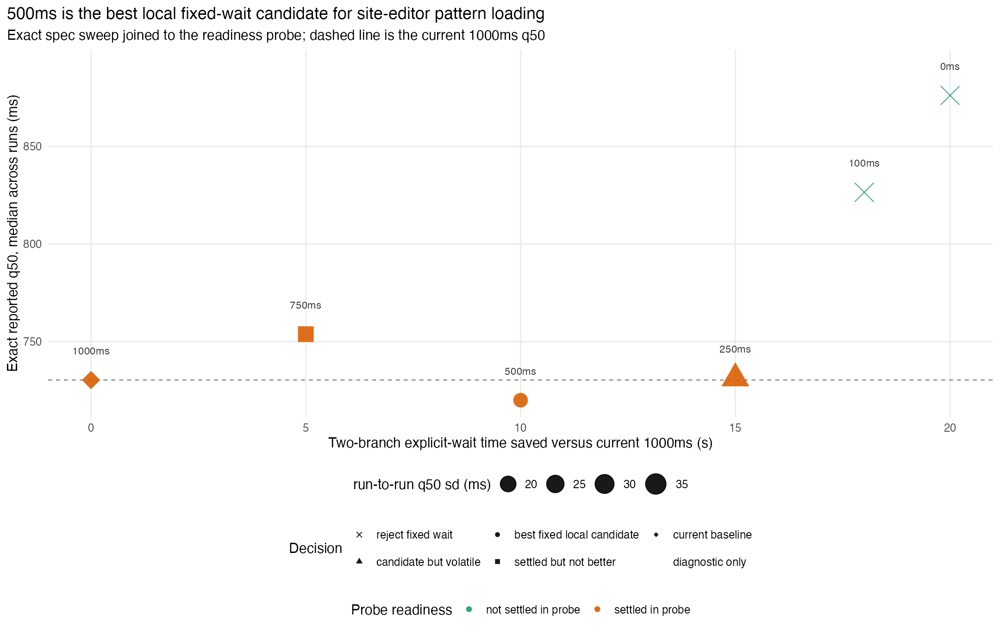

| Wait | Probe readiness | Exact median q50 | Exact q50 sd | Two-branch saved vs `1000ms` | Decision |
| ---: | --------------- | ---------------: | -----------: | ---------------------------: | -------- |
| `0ms` | not settled | `876.1ms` | `27.6ms` | `20s` | reject fixed wait |
| `100ms` | not settled | `826.5ms` | `28.7ms` | `18s` | reject fixed wait |
| `250ms` | settled | `731.2ms` | `35.6ms` | `15s` | candidate but volatile |
| `500ms` | settled | `720.0ms` | `17.2ms` | `10s` | best fixed local candidate |
| `750ms` | settled | `753.8ms` | `20.1ms` | `5s` | settled but not better |
| `1000ms` | settled | `730.3ms` | `27.6ms` | `0s` | current baseline |

The per-run risk audit keeps the variance visible instead of deciding from
medians alone (`data/typing-delay-pattern-readiness-risk-audit.csv`). `0ms` and
`100ms` are not borderline: every exact run is slower than the `1000ms`
empirical range and every probe sample misses the readiness boundary. `250ms`
hits the probe boundary, but one exact run is above the `1000ms` max and its
q50 sd is the highest settled value. `500ms` is the only shorter fixed wait
where all exact q50s stay inside or below the `1000ms` range while also having
the lowest settled q50 sd.

The stricter predicate audit is:

| Candidate | Classification | Reason |
| --------- | -------------- | ------ |
| Fixed `0ms` or `100ms` wait | reject | The readiness probe misses the boundary and exact q50 remains `96-146ms` slower than the `1000ms` baseline. |
| Fixed `250ms` wait | possible but volatile | It reaches the local readiness boundary, but q50 sd was `35.6ms`, the highest of the settled fixed waits. |
| Fixed `500ms` wait | best fixed local candidate | It reaches the local readiness boundary, matches the `1000ms` q50 band, saves `10s` in the two-branch pattern metric, and had lower local q50 sd than `1000ms`. |
| Current fixed `1000ms` wait | safe baseline | It preserves the current metric boundary but pays the full fixed sleep. |
| State predicate before Design / Transform click | necessary but insufficient alone | The source-level hypothesis was valid to test, but the validation below shows `getBlockPatterns` readiness is already true and does not move the broader setup resources. |
| Resource quiet window only | diagnostic support | Resource counts explain this local boundary, but are not a product contract. |
| Wait for preview canvases | invalid predicate | The current benchmark measures the preview canvases rendering after the click, so waiting for them first would remove the measured workload. |

I then audited that predicate against the current source path. `PanelBody`
renders children only after it is opened, so the pattern preview canvases stay
inside the measured interval. `PostTransformPanel` calls `useAvailablePatterns`
before the panel opens; that hook reads `coreStore.getBlockPatterns()`, filters
compatible theme/template patterns, and parses their `content` into blocks. The
source-audited predicate is therefore: before clicking Design / Transform, wait
for `core.hasFinishedResolution( 'getBlockPatterns' )` and for a compatible
non-empty pattern list. Do not wait for preview canvases or for
`core/pattern` placeholder replacement, because those are the work the metric is
currently measuring.

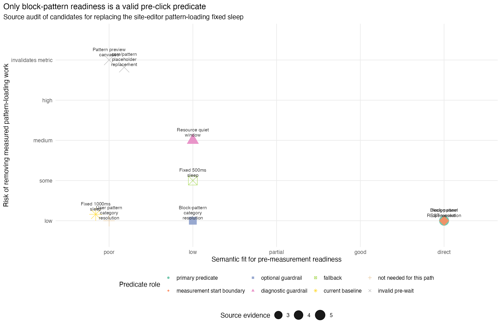

| Component | Role | Why |
| --------- | ---- | --- |
| `getBlockPatterns` resolution | primary data predicate | It is the data dependency used by `useAvailablePatterns` before the Design panel opens, but the validation below shows it is not the full timing boundary. |
| Design / Transform click | measurement start boundary | The spec starts timing before this click. |
| Preview canvases and `core/pattern` replacement | invalid pre-waits | The spec waits for them after the click, so pre-waiting them would remove the measured workload. |
| Pattern categories | optional guardrail | They are resolved for broader editor settings, but this path does not use them to build the measured template list. |
| Resource quiet window | diagnostic guardrail | It explains the local boundary but is not a stable product contract. |
| Fixed `500ms` | fallback | Best local fixed wait if the suite keeps a sleep, but still needs CI/mac/container validation. |

The implementation-level open question is narrower than the fixed-wait table
implies. A correct predicate should do more than poll a boolean:

| Prototype step | Status | Reason |
| -------------- | ------ | ------ |
| Trigger the `core` resolver | required | `getBlockPatterns` has a resolver that fetches `/wp/v2/block-patterns/patterns`; a fresh editor sample may not have requested it yet. |
| Use the no-argument resolution key | required | The provider-side block-pattern setting checks `hasFinishedResolution( 'getBlockPatterns' )` with no args, so the spec should check the same resolution key. |
| Require a compatible non-empty pattern list | primary predicate | `useAvailablePatterns` merges editor settings patterns with REST patterns and filters by `templateTypes` or `core/template-part/${ area }`, while excluding core/directory sources. |
| Keep `startTime` immediately before the click | required | Moving timing after the Design / Transform click would redefine the metric. |
| Do not pre-wait preview canvases or `core/pattern` replacement | invalid | Those waits are the measured workload today. |
| Add timeout and telemetry | required guardrail | The fallback choice should be visible in the result instead of being folded into q50 noise. |
| Treat pattern categories as optional | optional guardrail | Broader editor settings resolve them, but this measured Transform/Design template list is built from patterns and current template fields. |

That was the source-level hypothesis, so I implemented it as an opt-in
measurement mode and ran the full `site-editor` Loading Patterns test. The
validation used three 10-sample runs each for fixed `0ms`, fixed `500ms`, fixed
`1000ms`, a pure `getBlockPatterns` predicate with a `1000ms` cap, and
`getBlockPatterns` plus a `100ms` resource-quiet guard with the same cap.

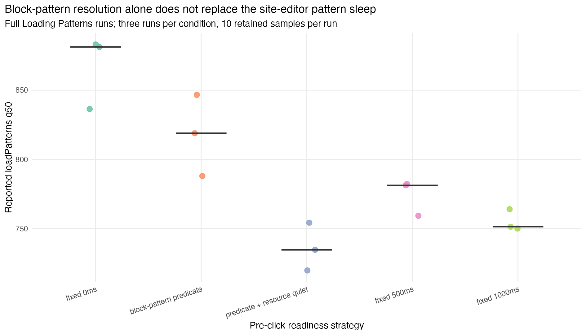

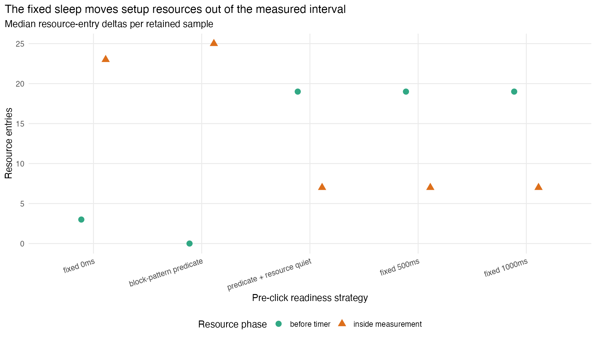

The pure `getBlockPatterns` predicate is not sufficient. It was already true in
every retained sample: median predicate wait was only `0.15ms`, no sample timed
out, and the compatible pattern count was `4`. But its median run q50 was
`818.8ms`, much closer to fixed `0ms` (`881.1ms`) than to fixed `1000ms`
(`751.3ms`) or fixed `500ms` (`781.2ms`). The resource counters explain why:
the pure predicate moved `0` resource entries before the timer and left about
`25` resource entries inside the measured interval. Fixed `500ms` and `1000ms`
both moved about `19` entries before the timer and left about `7` inside the
measurement.

Adding a resource-quiet guard after the block-pattern predicate reproduced the
fixed-wait boundary with much less waiting. The `getBlockPatterns` plus
`100ms` quiet-window mode waited about `301ms` at the median, moved the same
`19` resource entries before the timer, left the same `7` inside measurement,
and reported a median run q50 of `734.6ms`. That disconfirms the earlier
"block-pattern data readiness is the whole boundary" theory. The fixed sleep is
not primarily waiting for the block-pattern REST resolver by the time the
measured click is about to happen; it is giving broader editor REST setup work
time to finish before the Design / Transform measurement starts.

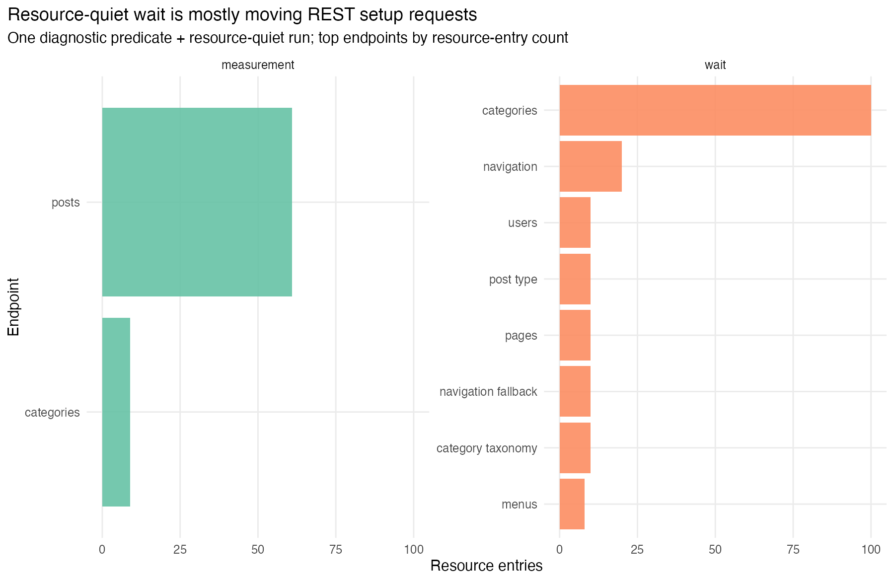

The URL-level diagnostic run makes the moved work concrete. The resource-quiet
wait mostly moved REST setup requests: categories (`100` entries across the ten
samples), navigation (`20`), post type, users, category taxonomy, navigation
fallback, pages, template parts, and menus. The measured interval still contains
the preview-driven work: mostly posts (`61` entries) and a few category requests.
So a resource-quiet guard is a good local diagnostic and a plausible CI
engineering replacement for the blind sleep, but it is not a clean semantic
product predicate. If the benchmark replaces the fixed sleep, the honest next
validation is `getBlockPatterns` plus resource quiet with timeout/fallback
telemetry on CI/mac/container, not a pure `getBlockPatterns` wait.

One more pass over the run-level q50s sharpens what is still open. The bootstrap
intervals below resample reported run q50s, not individual retained samples, so
they are a small-sample stability check rather than a host-portability proof.

| Choice | Deeper evidence | Status |
| ------ | --------------- | ------ |
| Fixed `0ms` / `100ms` | Their exact q50 ranges, `838.3-899.1ms` and `818.8-880.5ms`, are disjoint above the `1000ms` range (`714.7-805.0ms`); bootstrap median deltas are positive (`+105..+175ms` and `+79..+150ms`), and both miss the probe boundary `4/4` times. | closed: do not use as a fixed wait |
| Fixed `250ms` | The probe boundary is hit `4/4` times and the median matches `1000ms`, but the exact q50 range is wide (`696.6-817.8ms`), one run is above the `1000ms` max, the bootstrap delta spans `-19.5..+28.3ms`, and q50 sd is `1.29x` the `1000ms` baseline. | open only as a predicate lower-bound signal |
| Fixed `500ms` | All exact q50s stay inside or below the `1000ms` range (`699.2-755.0ms`), no run is above the `1000ms` max, the bootstrap delta spans `-29.6..+12.1ms`, and q50 sd is `0.62x` the baseline. | best local fixed fallback, still needs CI/mac/container validation |
| Fixed `750ms` | It is locally settled, but the bootstrap delta is positive (`+5.1..+59.2ms`) and it saves only `5s` versus `10s` for `500ms`. | closed: no advantage over `500ms` |
| Resource quietness | The `2000ms` probe still has active requests at measurement start in `2/4` samples even though wait-side resources are at the plateau. | telemetry/guardrail only, not the primary predicate |

This narrows the site-editor action item. `500ms` is the best local fixed-wait
candidate if the benchmark keeps a sleep, but the better change is a semantic
`getBlockPatterns` readiness predicate before the Design / Transform click.
`250ms` is useful as a lower-bound signal for such a predicate, not as a
recommended blind replacement without CI/mac/container validation.

### Pattern Readiness CI Validation Contract

The remaining pattern-loading question is no longer whether the fixed `1000ms`
sleep is doing work locally. It is. The unresolved decision is whether the suite
can replace it without changing what the Loading Patterns metric measures on CI.
The validation contract is in
`data/typing-delay-pattern-readiness-ci-validation-contract-audit.csv`.

| Validation question | Current local evidence | Pass condition | Fail action |
| ------------------- | ---------------------- | -------------- | ----------- |
| Can pure `getBlockPatterns` replace the fixed wait? | rejected locally: median predicate wait is `0.15ms`, moves `0` resources before the timer, leaves about `25` resources inside measurement, and stays close to fixed `0ms` | only reconsider if it reaches the settled q50 band and moves setup resources before the timer on another host | do not use pure `getBlockPatterns`; keep it only as the semantic first step before a guardrail |
| Can `getBlockPatterns` plus resource quiet replace the sleep? | best predicate-shaped local candidate: waits about `301ms`, satisfies quiet in all `30` retained samples, moves `19` resources before the timer, leaves `7` inside measurement, and reports `734.6ms` median run q50 | CI/mac/container lanes overlap the fixed `1000ms` q50 band, do not increase run-to-run q50 sd, rarely fall back, and keep preview work inside measurement | use fixed `500ms` if it validates, otherwise keep fixed `1000ms` |
| Is fixed `500ms` an acceptable fallback? | all exact q50s stay inside or below the `1000ms` empirical range, no run is above the `1000ms` max, bootstrap delta is `-29.6ms..+12.1ms`, and q50 sd is `0.62x` the baseline | every validation lane keeps fixed `500ms` inside the fixed `1000ms` q50 band with no preview/canvas misses and no extra variance warning | keep fixed `1000ms` as the conservative baseline |
| Can resource quiet be the product predicate? | no; it mostly moves broader REST setup work: categories, navigation, post type, users, taxonomies, navigation fallback, pages, template parts, and menus | allowed only as an engineering guardrail after the semantic pattern predicate, with endpoint details reported | do not replace the fixed sleep with an opaque resource-count threshold |
| Is a source-specific readiness signal available? | not from the current local evidence; the pure block-pattern predicate does not move the broader setup work that the fixed wait excludes | a source-level signal predicts the same resource-drain and q50 boundary as fixed `500ms` / `1000ms` without waiting for preview canvases | keep `getBlockPatterns` plus quiet as the candidate guardrail, or keep a fixed wait |
| Does the validation preserve the metric definition? | the metric starts immediately before the Design / Transform click and measures preview canvases plus `core/pattern` replacement after that click | predicate completion happens before `startTime`, while preview-canvas and `core/pattern` waits remain after the click inside the measured interval | reject the replacement because it redefines the metric |

The important telemetry is per-run and per-sample, not only the final p50:
predicate wait time, `hasFinishedResolution` status, compatible pattern count,
quiet elapsed time, timeout/fallback flag, active requests at measurement start,
resources moved before the timer, resources left inside measurement, endpoint
groups, retained counts, preview/canvas misses, browser revision, and wp-env or
container metadata. Without that telemetry, a predicate miss would look like
ordinary q50 noise.

This also clarifies the fallback order. The first candidate is
`getBlockPatterns` plus a short resource-quiet guard with visible timeout
telemetry. Fixed `500ms` is the fallback only if it validates in the same
lanes. Fixed `1000ms` remains the conservative baseline if either replacement
changes the q50 band, increases variance, times out often, or pre-waits the
preview work that the metric is supposed to measure.

### Pattern Readiness Claim Ladder

The remaining open question is easy to overstate, so I split it into claims. The
local evidence does not support "we found the source-specific pattern readiness
signal." It supports a narrower ladder:

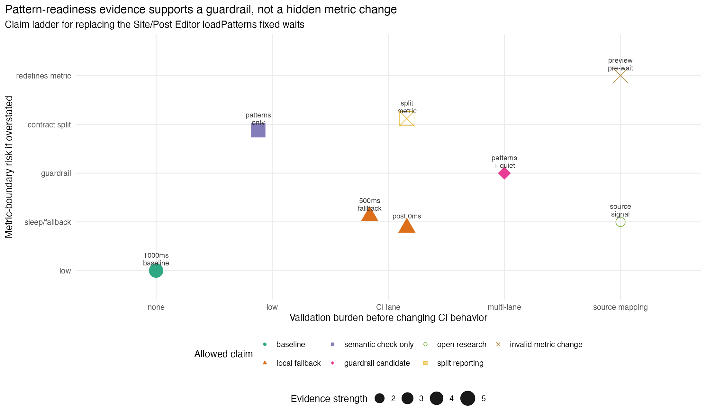

| Claim | What is supported now | Boundary |
| ----- | --------------------- | -------- |
| Fixed `1000ms` | conservative compatibility baseline | safe but expensive |
| Fixed `500ms` | best local fixed fallback | needs CI/mac/container validation; still a sleep |
| Pure `getBlockPatterns` | semantic first check only | rejected as a complete timing replacement |
| `getBlockPatterns` plus resource quiet | best predicate-shaped guardrail | must report timeout/fallback, endpoint groups, resources before/during timing, q50 band, and preview-work preservation |
| Source-specific readiness signal | still open | only valid after mapping moved endpoint groups to source-level resolvers/actions |
| Preview canvas or `core/pattern` pre-wait | invalid under the current metric | removes work currently measured after the Design / Transform click |
| Post Editor `0ms` | separate local candidate for the Post Editor path | do not merge with the Site Editor readiness claim |
| Shared `loadPatterns` metric key | reporting risk | split Site Editor, Post Editor, and combined rows before making wait-savings claims |

This is the stricter answer to the pattern-loading question. The valid
near-term CI experiment is either fixed `500ms` as a local fixed fallback, or
`getBlockPatterns` followed by a resource-quiet guard as an explicitly
instrumented benchmark guardrail. The invalid shortcut is to wait for preview
canvases or `core/pattern` replacement before starting the timer, because that
would move current measured work out of the metric. The unsupported shortcut is
to call broad resource quiet a source-specific product predicate.

I did one more source-signal audit because this is the part most likely to be
misstated. `getBlockPatterns` is the semantic dependency for the Transform /
Design template list, but the local validation shows it is not the timing
boundary. The pure predicate was already resolved, moved `0` resource entries
before timing, left about `25` inside the measurement, and reported `818.8ms`
q50. The resource-quiet guard moved the timing boundary by waiting for broader
editor REST setup to drain.

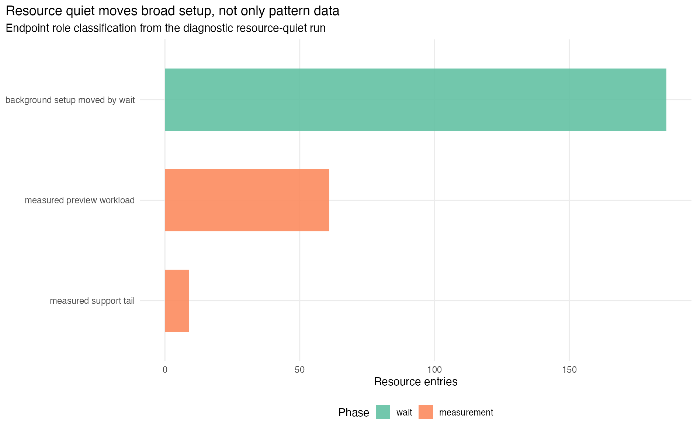

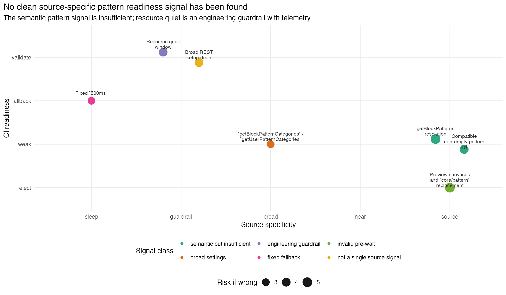

The endpoint split is the important caveat. The resource-quiet diagnostic moved
`186` wait-side resource entries, dominated by categories, navigation, post
type, users, taxonomies, navigation fallback, pages, template parts, and menus.
The measured interval still had `70` entries, mostly posts, which is consistent
with preview rendering after the Design / Transform click. That means resource
quiet is an engineering guardrail with useful telemetry, not a clean product
predicate. The honest implementation contract is:

| Candidate signal | Source specificity | Decision |
| ---------------- | ------------------ | -------- |
| `getBlockPatterns` resolution plus compatible non-empty list | source-specific, but insufficient | keep as the semantic first check; not enough to replace the sleep alone |
| Pattern category readiness | broad editor settings | optional telemetry only unless CI proves it predicts the same boundary |
| Resource quiet window | broad guardrail | validate only with timeout/fallback, endpoint groups, and preview-work checks |
| Fixed `500ms` | fixed fallback | best local sleep fallback if the predicate-shaped guard fails validation |
| Preview canvases / `core/pattern` replacement | measured workload | never pre-wait these unless the metric is intentionally redefined |

So the open Site Editor question is now narrower: there is no clean
source-specific readiness signal in the evidence so far. Either validate
`getBlockPatterns` plus resource quiet as an explicitly instrumented guardrail,
or use fixed `500ms` as the local fixed fallback, or keep fixed `1000ms` as the
compatibility baseline. Do not describe resource quiet as "the pattern predicate"
without the endpoint and fallback telemetry.

I then checked whether this conclusion applies to all `loadPatterns` results.
It does not. The reporter uses the same metric name for Post Editor and Site
Editor, but the setup paths are different. Site Editor now has
`waitForPatternReadiness()` with opt-in `block-patterns` and
`block-patterns-resource-quiet` modes. Post Editor still has a plain fixed
`MEASUREMENT_IDLE_WAIT_MS` before opening the inserter; it injects local
`__experimentalAdditionalBlockPatterns` into editor settings and then measures
clicking the local `Test` pattern category.

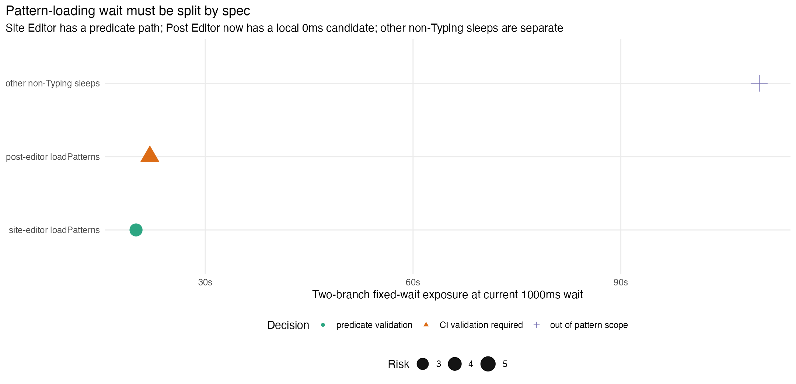

| Row | Two-branch fixed-wait exposure | Current conclusion |
| --- | -----------------------------: | ------------------ |
| Site Editor `loadPatterns` | `20s` | predicate path exists; validate `getBlockPatterns` plus resource quiet and fixed `500ms` against fixed `1000ms` |
| Post Editor `loadPatterns` | `22s` | local matrix favors `0ms`; validate against fixed `1000ms` in CI/mac/container lanes before removing the wait |
| Combined `loadPatterns` name | `42s` | split reporting required; one metric name hides two readiness contracts |
| Other non-Typing sleeps | `110s` | out of pattern scope; pattern-readiness evidence should not be used to remove these waits |

That makes the open CI action more precise. Do not claim the full `42s`
two-branch `loadPatterns` wait saving from the Site Editor predicate alone. The
Site Editor candidate should be validated with readiness telemetry as above.
I then ran the separate Post Editor matrix using the exact
`post-editor.spec.js` Loading Patterns path. The test injects local
`__experimentalAdditionalBlockPatterns`, waits before opening the global
inserter, starts the timer only after the Patterns tab is open, clicks the local
`Test` category, and waits for each preview canvas' first block. That is why the
Site Editor REST-pattern predicate is not the right model for this path.

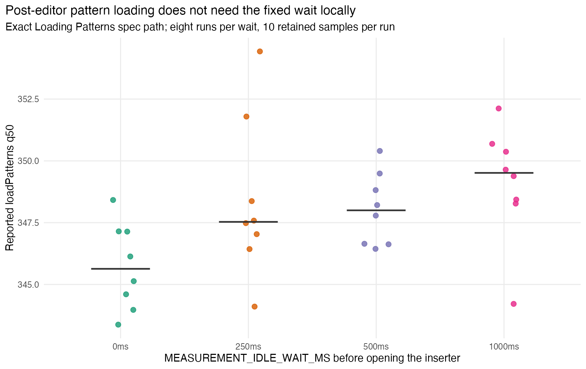

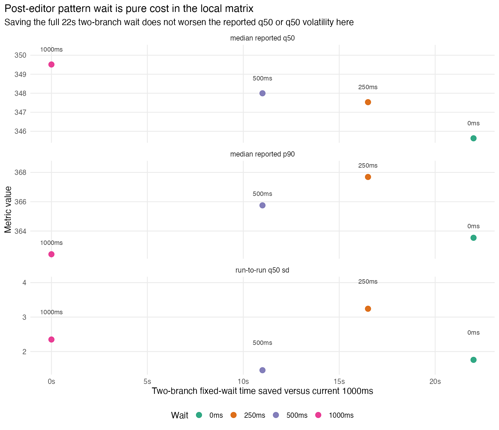

| Wait | Runs | Retained samples | Median run q50 | Run-to-run q50 sd | Median run p90 | Two-branch wait saved vs `1000ms` |
| ---: | ---: | ---------------: | -------------: | ----------------: | -------------: | -------------------------------: |
| `0ms` | `8` | `80` | `345.6ms` | `1.8ms` | `363.5ms` | `22.0s` |
| `250ms` | `8` | `80` | `347.5ms` | `3.2ms` | `367.7ms` | `16.5s` |
| `500ms` | `8` | `80` | `348.0ms` | `1.5ms` | `365.8ms` | `11.0s` |
| `1000ms` | `8` | `80` | `349.5ms` | `2.3ms` | `362.4ms` | `0.0s` |

Locally, Post Editor `loadPatterns` is the opposite of the Site Editor pattern
case: the fixed wait is pure wall-clock cost in the measured q50 view. Removing
it saves `22s` in the normal two-branch comparison and does not increase the
reported q50 or q50 volatility in these 32 focused runs. The deployment gate is
now portability, not diagnosis: validate `0ms` versus fixed `1000ms` on the
same CI/mac/container lanes with retained q50, q50 sd, p90/mean, first-iteration
behavior, preview/canvas misses, and source/resource telemetry. The other
non-Typing sleeps are a third bucket and need metric-specific repeated runs.

I then rolled the remaining non-Typing fixed waits into one decision ledger. The
important accounting rule is not to double-count Site Editor alternatives:
fixed `500ms` is the conservative local fallback, while `getBlockPatterns` plus
resource quiet is the higher-upside predicate path with less validation so far.

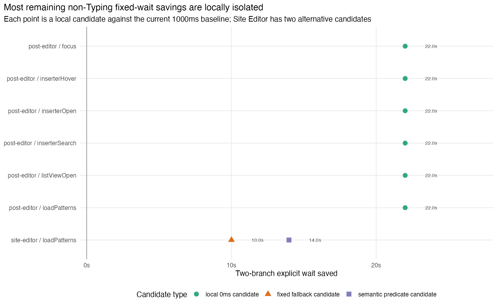

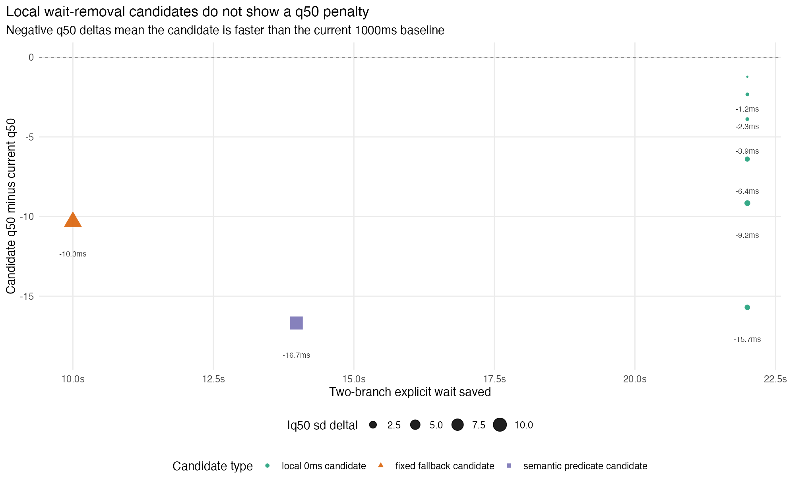

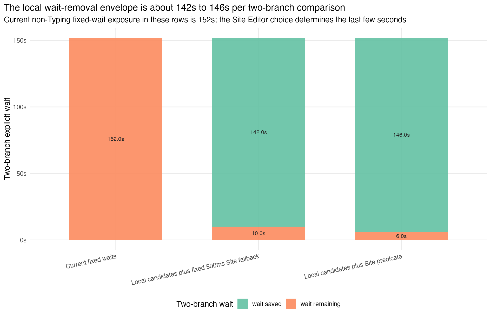

| Scenario | Current two-branch wait | Candidate wait remaining | Wait saved | Removed |
| -------- | ----------------------: | -----------------------: | ---------: | ------: |
| Current fixed waits | `152.0s` | `152.0s` | `0.0s` | `0.0%` |
| Local candidates plus fixed `500ms` Site fallback | `152.0s` | `10.0s` | `142.0s` | `93.4%` |
| Local candidates plus Site predicate | `152.0s` | `6.0s` | `146.0s` | `96.0%` |

The conservative local candidate set is: remove the wait from the five
Post Editor interaction metrics, remove the Post Editor `loadPatterns` wait, and
cut Site Editor `loadPatterns` from `1000ms` to `500ms`. That saves `142s` out
of the `152s` current two-branch fixed-wait exposure in these rows, and every
candidate has a negative local q50 delta versus the current `1000ms` baseline.
The predicate path saves another `~4s`, but that estimate comes from the smaller
three-run predicate-validation block and should be treated as a separate
engineering validation target, not as part of the conservative local fixed-wait
answer.

One naming trap in the plain Typing helper: `BROWSER_IDLE_WAIT = 1000` is the
delay passed to `target.type()`, not a separate wait before that Typing benchmark
starts. Reducing that value changes the key-delay benchmark itself and crosses
the one-second timer behavior analyzed above. That is different from reducing
an extra post-setup start wait. Elsewhere in the performance specs the same
constant is also used for explicit pre-measurement sleeps, which is why the
independent grid above separates the knobs.

I then made CI-comparable copies of the main dense delay and volatility plots.
This run used `BENCHMARK_SETUP_STYLE=ci-post-editor-typing`,
`BENCHMARK_FRESH_EDITOR_PER_DELAY=1`, `0..1400ms` in `10ms` steps, one round,
10 retained samples per delay, and 1 throwaway sample per delay. It creates a
fresh large-post draft, saves it, reopens it, disables autosave, and calls
`target.type()` for every delay setting. The run produced 141 delay rows, 1410
retained samples, and no missing key groups.

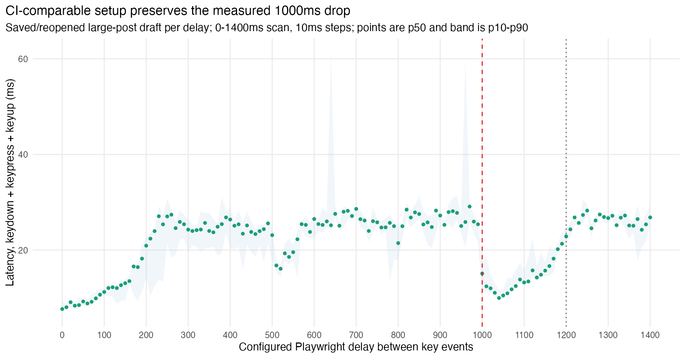

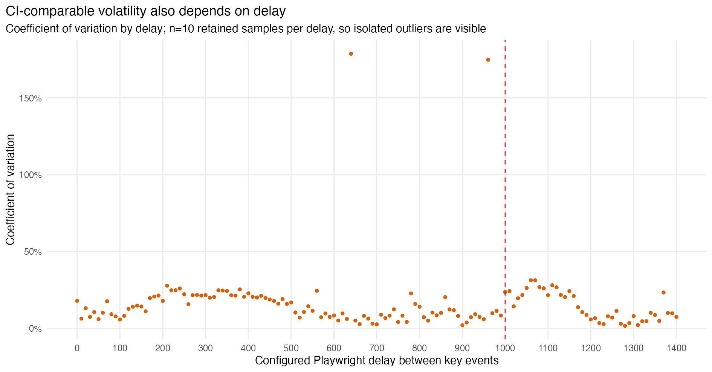

Selected CI-comparable dense p50s:

| Delay | p50 | p10-p90 | CV |
| ----: | --: | ------: | -: |
|  `990ms` | `25.4ms` | `21.7-26.1ms` | `0.08` |
| `1000ms` | `15.1ms` | `11.2-17.4ms` | `0.24` |
| `1010ms` | `12.4ms` | `11.5-18.7ms` | `0.24` |
| `1100ms` | `13.2ms` | `12.8-15.8ms` | `0.22` |
| `1200ms` | `22.9ms` | `21.6-24.5ms` | `0.06` |
| `1300ms` | `26.7ms` | `25.6-27.3ms` | `0.08` |
| `1400ms` | `26.8ms` | `25.1-29.5ms` | `0.07` |

The CI-comparable sweep preserves the same qualitative artifact: `990ms` is
slow, the measured event-only latency drops at the one-second boundary, and the
curve climbs back to a high plateau by roughly `1200ms`. The absolute numbers
are higher than the earlier live-editor dense sweep because this run recreates
the CI saved/reopened draft setup for each delay. The volatility graph also
shows why n=10 per delay is only a CI-shape copy, not a high-confidence
variance estimate: a single retained outlier at `640ms` and another at `960ms`
dominate CV at those delays.

I made an additional volatility copy with the same CI-comparable setup and
delay grid, but with 50 retained samples per delay. It produced 7050 retained
samples, 7191 total typed characters including throwaways, and no missing key
groups. The larger sample count removes the giant isolated CV spikes from the
n=10 plot: the old maximum CV was `1.79` at `640ms`, while the n=50 maximum is
`0.20` at `270ms`; median CV stays almost the same (`0.118` to `0.114`). That
means the n=10 graph was good enough to show that volatility depends on delay,
but not good enough to rank individual delay buckets by volatility.

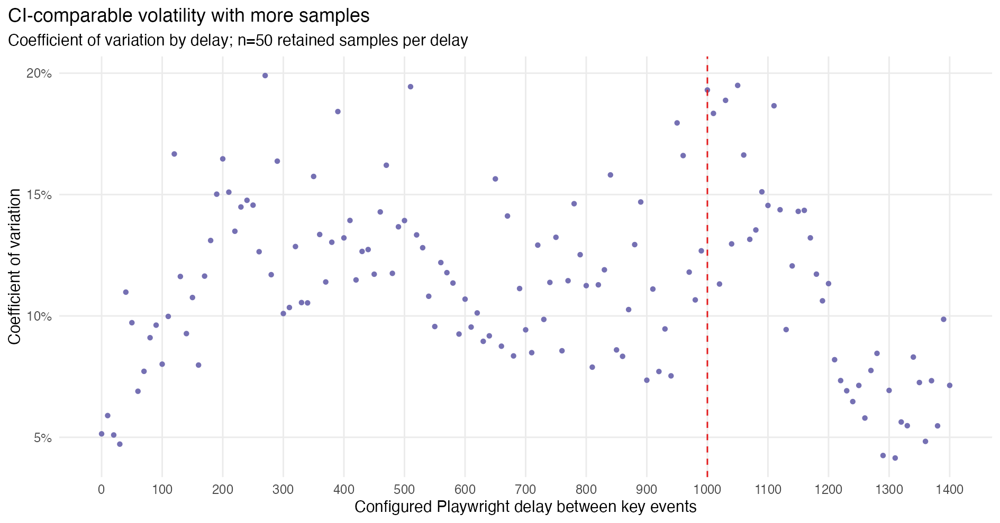

#### Wall-Clock Budget Audit For Fixed-Sample Sweeps

One remaining methodology caveat was whether the dense delay scans should be
run with an equal wall-clock budget per delay instead of a fixed sample count.
The existing full `0..1100ms` sweep has enough run-duration metadata to quantify
that tradeoff without rerunning the browser.

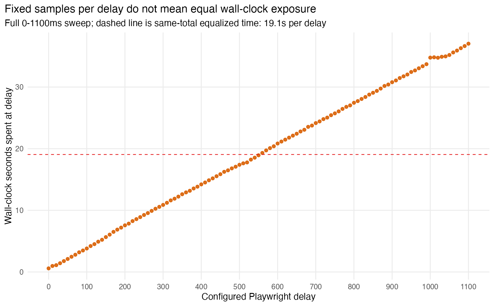

The current run used 3 rounds and 10 retained samples per round, so each delay
got 30 retained samples. But wall-clock exposure was not remotely equal: `0ms`
used `0.58s`, `500ms` used `17.4s`, `1000ms` used `34.8s`, and `1100ms` used
`37.0s`. The whole sweep took `35.3m`, which averages to `19.1s` per delay if
the same total time were redistributed evenly.

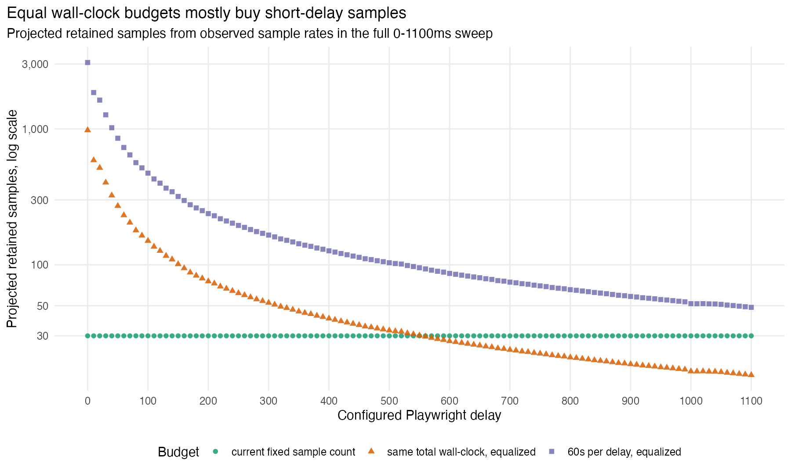

Selected projected retained sample counts, using the observed per-delay sample
rates:

| Delay | Current wall-clock | Current retained samples | Same-total equalized retained samples | `60s` equalized retained samples |
| ----: | -----------------: | -----------------------: | ------------------------------------: | -------------------------------: |
|   `0ms` |  `0.58s` | `30` | `977` | `3077` |
| `100ms` |  `3.81s` | `30` | `150` |  `472` |
| `500ms` | `17.4s` | `30` |  `33` |  `104` |
| `990ms` | `33.7s` | `30` |  `17` |   `53` |
| `1000ms` | `34.8s` | `30` |  `16` |   `52` |
| `1100ms` | `37.0s` | `30` |  `15` |   `49` |

So "equal wall-clock" is not automatically better. If the budget is held to the
same total `35.3m`, equalization buys many more short-delay samples but reduces
the high-delay buckets near the `1000ms` boundary below the current `n=30`. A
`60s`-per-delay design gives at least about `49` retained samples even at
`1100ms`, but costs `111m` for the `0..1100ms` sweep alone. The better future
design is hybrid: set a minimum retained sample count for each delay, then add
an equal or capped wall-clock budget if warmup/drift exposure is the specific
question. A pure fixed-sample design is good for equal quantile sample count; a
pure equal-time design is good for equal exposure, but it can weaken the slowest
delay buckets unless total runtime increases.

#### CI Reliability If Waits Are Reduced

For the CI job as it works today, there are two separate fixed-time buckets in
the post/site editor performance comparison:

-   explicit pre-measurement sleeps in non-Typing tests:
    `76s` per branch, `152s` for the normal two-branch comparison;
-   held-key Typing delay: 5 Typing metrics per branch, 11 typed characters per
    metric, `1000ms` held-key delay, so `55s` per branch and `110s` for the
    normal two-branch comparison.

The current Typing test does not have an extra post-setup start wait by default:
`POST_EDITOR_TYPING_START_WAIT_MS` is `0`. The deeper CI-comparable start-wait
curve therefore asks a narrower question: if we add or remove extra post-setup
wait around the Typing setup, does the CI-reported retained Typing median become
more reliable? With eight fresh saved/reopened large-post drafts per wait, the
answer is no in this local run. `0ms` extra wait had `16.46ms` median reported
q50 and `0.53ms` run-to-run q50 sd. The current `1000ms` comparison point had
`16.14ms` median reported q50 and `0.80ms` sd. `5000ms` was worse on both
runtime and variance: `17.31ms` median reported q50 and `1.72ms` sd.

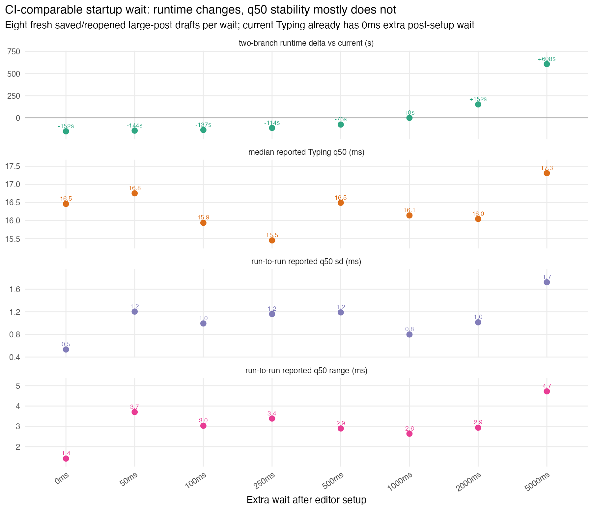

Selected CI-comparable startup-wait rows:

| Extra post-setup wait | Two-branch explicit-wait delta | Median reported q50 | Run-to-run q50 sd | Run-to-run q50 range |
| --------------------: | -----------------------------: | ------------------: | ----------------: | -------------------: |
|                 `0ms` |        `-152s` / `-2.5m` |            `16.46ms` |          `0.53ms` |             `1.41ms` |
|               `500ms` |         `-76s` / `-1.3m` |            `16.49ms` |          `1.19ms` |             `2.90ms` |
|              `1000ms` |            `0s` / `0.0m` |            `16.14ms` |          `0.80ms` |             `2.64ms` |
|              `2000ms` |        `+152s` / `+2.5m` |            `16.05ms` |          `1.02ms` |             `2.93ms` |
|              `5000ms` |       `+608s` / `+10.1m` |            `17.31ms` |          `1.72ms` |             `4.72ms` |
|             `60000ms` |     `+8968s` / `+149.5m` |            `15.79ms` |          `1.02ms` |             `3.09ms` |

This is strong evidence for Typing, but it should not be overgeneralized to the
non-Typing metrics that also use `PERFORMANCE_MEASUREMENT_IDLE_WAIT_MS`. The
runtime math for those explicit sleeps is exact from the spec counts; their
metric reliability still needs metric-specific repeated runs before changing the
shared default.

### Typing Startup-Wait Change Trigger Contract

The Typing startup-wait result is locally closed, but not timeless. The useful
follow-up is to define when that answer expires. The contract is in
`data/typing-delay-startup-wait-change-trigger-contract-audit.csv`.

| Trigger question | Current answer | Reopen trigger | Decision rule |
| ---------------- | -------------- | -------------- | ------------- |
| Should the current Typing metric add a post-setup wait? | no; current Typing has `0ms` extra post-setup wait, and CI-comparable plus exact post-editor runs show no retained-q50 stability win from `1s` or `60s` waits | Typing setup, helper family, trace placement, retained/throwaway policy, browser revision, or CI runner class changes enough to invalidate the exact-spec anchor | keep `0ms` unless the added wait improves retained-q50 stability or tail behavior by more than ordinary run-to-run spread while paying an acceptable runtime cost |
| Does the first-character start-wait effect require changing retained q50? | no for the current statistic; first character and first retained key are slower, but startup wait does not remove that sequence shape | reported statistic changes from retained q50 to first-input, mean, p90/p95, or no-throwaway policy | do not use startup wait to hide first-input cost; report a first-input or tail metric if that is the product question |
| Can Typing evidence remove waits from non-Typing metrics? | no; Typing uses `target.type()` / `paragraph.type()` and has no extra post-setup wait by default, while seven non-Typing metrics still pay explicit sleeps | a non-Typing sleep is being changed | require metric-specific 0ms-versus-current comparisons with retained counts, p50/mean/p90, failures, setup-resource movement, and two-branch runtime savings |
| Does a CI image or runner change reopen the question? | only for absolute thresholds or when ordering changes; local wait curves and blocked order controls show no monotonic retained-q50 wait effect | compact CI lane changes retained-q50 ordering, run-to-run sd, first-key behavior, or timeout/failure shape with startup wait | do not add wait for absolute p50 drift alone; handle drift through threshold portability |
| Does tracing placement change the decision? | no for the tested exact-spec placement; `60s` before trace, `0ms` before trace, and `60s` after tracing starts stayed in the same low band | `metrics.startTracing()`, trace categories, trace snapshots, or reporter extraction move relative to idle wait or `type()` | repeat before-trace and after-trace placements with the exact spec |
| What is the fallback if a startup wait is reintroduced? | it is a metric-definition change with explicit runtime cost | reopened exact-spec validation shows a clear reliability win under a new setup | prefer a semantic readiness predicate or metric-specific fix over a blind fixed sleep |

This keeps the earlier negative result from being overused. It is valid for the
current retained Typing q50 and current helper shape. It is not a product
first-input claim, it is not a non-Typing metric claim, and it is not a license
to change thresholds on a new CI image without portability evidence.

For the held-key Typing delay itself, reducing the delay saves wall time
linearly but does not move the measurement monotonically. The graph below joins
the deterministic runtime model to the n=50 CI-comparable held-key sweep.

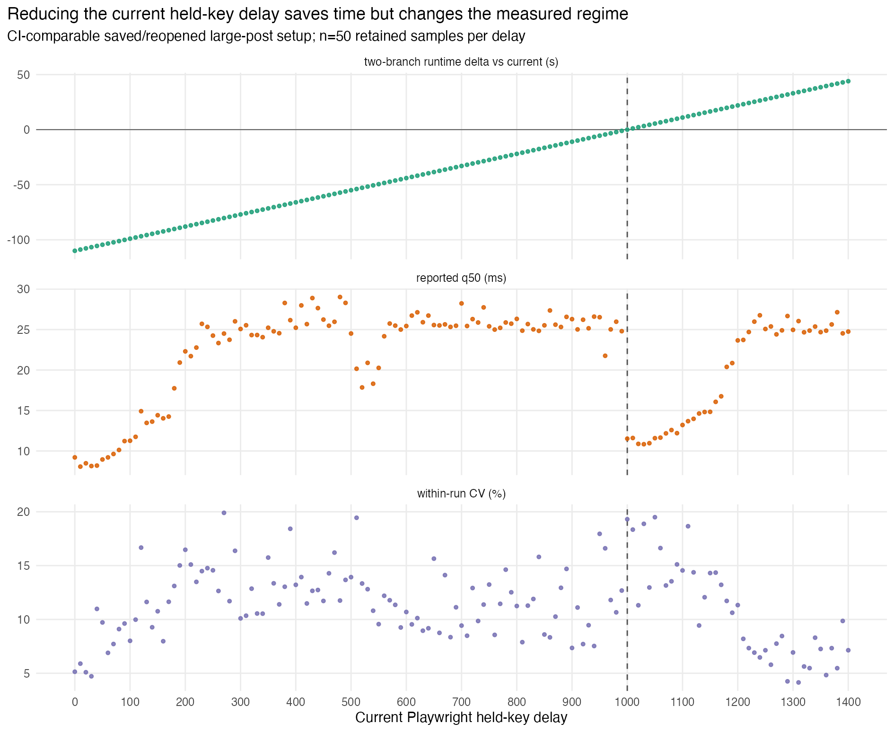

Selected held-key delay rows:

| Held-key delay | Two-branch Typing wait | CI job change vs current | Reported q50 | Within-run CV |
| -------------: | ---------------------: | -----------------------: | -----------: | ------------: |
|          `0ms` |                   `0s` |       `-110s` / `-1.8m` |      `9.21ms` |          `5%` |
|        `100ms` |                  `11s` |        `-99s` / `-1.7m` |     `11.27ms` |          `8%` |
|        `200ms` |                  `22s` |        `-88s` / `-1.5m` |     `22.26ms` |         `16%` |
|        `500ms` |                  `55s` |        `-55s` / `-0.9m` |     `24.48ms` |         `14%` |
|       `1000ms` |                 `110s` |           `0s` / `0.0m` |     `11.47ms` |         `19%` |

The `500ms` row is the important trap: it would save `55s` in a two-branch job,
but it measures the slow held-key/timer regime, not a smaller version of the
current `1000ms` metric. The current setting is fast because it sits on the
one-second Gutenberg timer boundary that this report analyzes elsewhere.

I also added a CI-comparable tap mode to the benchmark harness. In this mode the
large-post saved draft setup is the same, but the input sequence is complete
keypress, keyup, wait, next complete keypress. That is different from current CI,
where Playwright holds each key down for the configured delay before keyup.

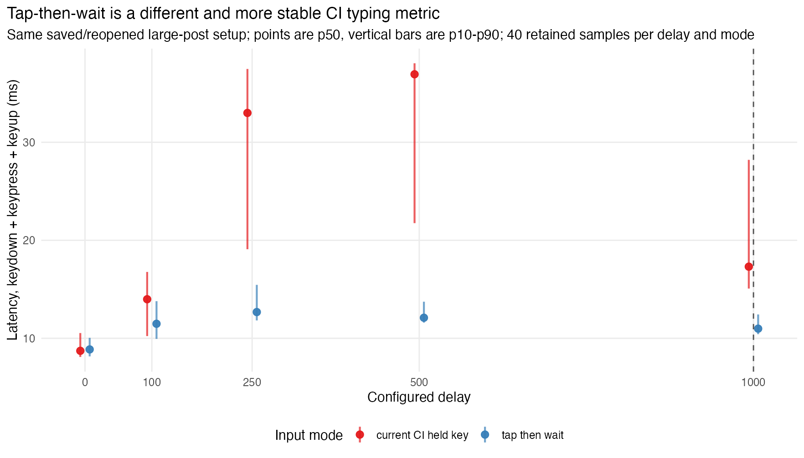

The next run keeps the same saved/reopened large-post setup and delay points, but
adds two realistic fixed key holds. A `50ms` or `100ms` hold is still not the same
metric as tap-then-wait because the key is down for part of each interval, but it
also avoids the current full-delay synthetic hold.

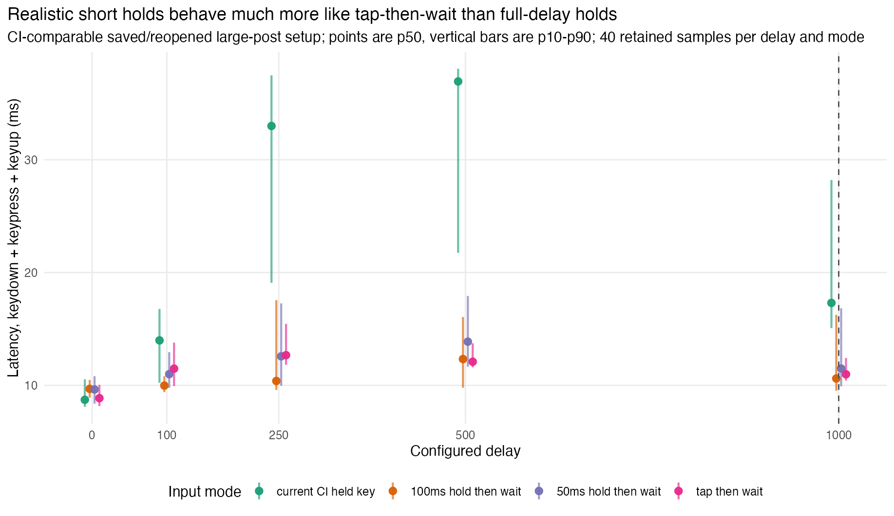

The fixed-hold run closes the realistic-hold subquestion: a short physical hold
does not reproduce the full-delay held-key slow band. In the fresh four-mode
rerun, the current full-hold mode is clearly above tap-then-wait at `250ms` and
`500ms`, while `50ms` / `100ms` holds followed by post-keyup waits stay much
closer to tap mode. So the problem is not "the key is down briefly"; it is the
synthetic benchmark holding the key down for the whole configured delay.

Selected fixed-hold rows from the fresh four-mode rerun:

| Input mode | `100ms` p50 / q50 sd | `250ms` p50 / q50 sd | `500ms` p50 / q50 sd | `1000ms` p50 / q50 sd |
| ---------- | -------------------: | -------------------: | -------------------: | --------------------: |
| current CI held key | `11.2ms` / `1.16ms` | `18.7ms` / `6.25ms` | `18.0ms` / `5.42ms` | `13.5ms` / `3.24ms` |
| `100ms` hold then wait | `12.2ms` / `0.58ms` | `14.5ms` / `1.03ms` | `14.6ms` / `0.69ms` | `11.2ms` / `0.81ms` |
| `50ms` hold then wait | `11.2ms` / `0.98ms` | `12.4ms` / `2.66ms` | `12.8ms` / `1.95ms` | `12.4ms` / `0.53ms` |
| tap then wait | `9.8ms` / `0.29ms` | `11.5ms` / `2.41ms` | `11.8ms` / `2.03ms` | `10.9ms` / `1.53ms` |

There are two remaining cautions. First, the short-hold choice is not stable
enough to rank `50ms` versus `100ms`: `100ms` is slower at `250ms` and `500ms`,
but faster at `1000ms`. Treat both as "short hold, mostly tap-like" unless a
repeat sweep shows a consistent ordering. Second, changing from full hold to a
short hold at the same `1000ms` key-to-key delay only saves `9-9.5s` in the
two-branch Typing runtime model; the large runtime savings come from reducing
the configured key-to-key delay, not from making the physical hold realistic.

Looking at per-round q50s makes the remaining open questions clearer. The
`250ms` / `500ms` full-hold points are not a single stable slow regime in this
rerun: round 2 was low (`9.75ms` and `9.77ms`) while the other rounds were much
higher. Dropping that shuffled round leaves full hold at `19.1ms` for `250ms`
and `19.7ms` for `500ms`, still above the short-hold and tap modes, but with
less apparent drama than the aggregate graph. So the robust conclusion is the
ordering by regime, not the exact p50 height of a single point.

| Open question | Current evidence | What would settle it |
| ------------- | ---------------- | -------------------- |
| Does a realistic short hold reproduce the full-hold artifact? | No. `50ms` / `100ms` holds are much closer to tap mode than to full hold at `250ms` and `500ms`. | A repeat blocked sweep would tighten the size estimate, but is unlikely to reverse the regime conclusion. |
| Is `50ms` better than `100ms`? | Not settled globally. The answer now depends on the Playwright entry point: in the matched fresh matrix, page-keyboard `50ms` is tap-like and below page-keyboard `100ms`, `locator.type()` `50ms` is above `locator.type()` `100ms` at `500ms` / `1000ms`, and `locator.press()` has no meaningful `50ms` / `100ms` split. | Interleave hold durations within each API/delay, and treat the result as API-specific rather than one human-hold-duration ranking. |
| Is fixed `100ms` hold identical to current CI at `100ms` delay? | No. Both have a nominal `100ms` hold and no explicit post-keyup wait at `100ms` delay, but the code paths differ: current CI uses one-call `page.keyboard.type()`, page fixed hold uses explicit `keyboard.down()` / wait / `keyboard.up()`, locator type uses `locator.type()`, and locator press uses `locator.press()`. The matched fresh matrix shows these families separate by multiple milliseconds under the same requested holds. | A Playwright-level helper that preserves the one-call `type()` path while separately controlling hold and post-keyup wait would be needed for a true decomposition. |
| Are setup/order effects contaminating the graph? | Yes enough to be visible, but they do not create the full-hold conclusion. Round 2 was low for several `250ms` / `500ms` points, and full-hold `1000ms` had one retained `303ms` outlier. P50 survives better than CV, but the run-to-run q50 sd should be read alongside p50. | Interleave modes, clean posts between delay runs, or report median-of-run-medians with more rounds. |
| Does realistic hold materially reduce CI runtime at `1000ms`? | Only modestly. At `1000ms`, tap is `100s`, `50ms` hold is `100.5s`, `100ms` hold is `101s`, and current full hold is `110s` in the two-branch Typing model. | Runtime savings require reducing the configured key-to-key delay; hold realism mostly changes the measured regime. |

The round-level sign test is a better stress check than the aggregate graph.
Across the two clearest delay points, `250ms` and `500ms`, full hold is above tap
in `7/8` round-level comparisons, above `50ms` hold in `7/8`, and above `100ms`
hold in `6/8`. The exception is concentrated in the low shuffled round, not
spread evenly across the run.

A rank-based paired check says the same thing with an uncertainty range. Across
the `250ms` / `500ms` round-paired q50s, the Hodges-Lehmann full-minus-tap
estimate is `5.9ms` with an approximate `0.02-10.3ms` confidence interval;
full-minus-`50ms` is `4.9ms` with `1.5-8.0ms`; full-minus-`100ms` is only
`3.3ms` with `-1.6..7.7ms`. Dropping the low shuffled round makes all six
remaining `250ms` / `500ms` comparisons positive, with median deltas of `8.5ms`
versus tap, `7.0ms` versus `50ms`, and `5.1ms` versus `100ms`. So round 2 is
mainly weakening the full-hold result, not creating it.

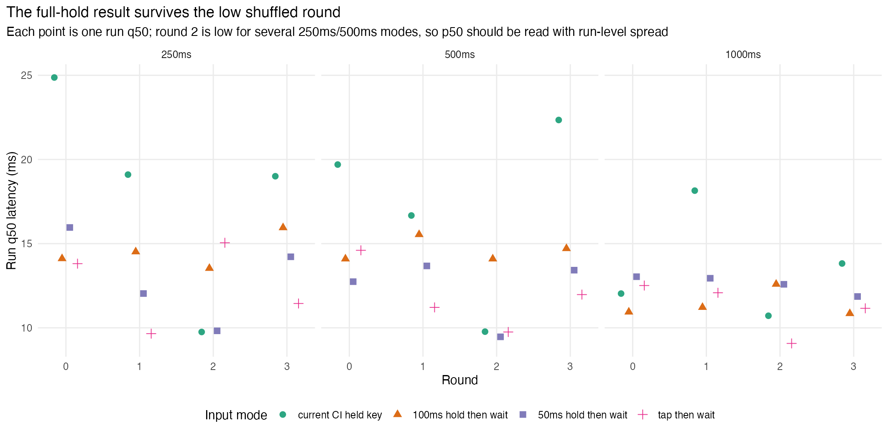

Alternative summaries tell the same story:

| Delay | Summary | tap | `50ms` hold | `100ms` hold | full hold |
| ----: | ------- | --: | ----------: | -----------: | --------: |
| `250ms` | median of run q50s | `12.6ms` | `13.1ms` | `14.3ms` | `19.0ms` |
| `250ms` | drop shuffled round 2 | `11.4ms` | `14.2ms` | `14.5ms` | `19.1ms` |
| `500ms` | median of run q50s | `11.6ms` | `13.1ms` | `14.4ms` | `18.2ms` |
| `500ms` | drop shuffled round 2 | `12.0ms` | `13.4ms` | `14.7ms` | `19.7ms` |
| `1000ms` | median of run q50s | `11.6ms` | `12.8ms` | `11.1ms` | `12.9ms` |
| `1000ms` | drop shuffled round 2 | `12.1ms` | `12.9ms` | `10.9ms` | `13.8ms` |

That makes `250ms` / `500ms` the useful discriminator. At `1000ms`, the modes are
closer and the full-hold run has a retained `303ms` keypress outlier, so p90 and
CV are contaminated even though the p50 remains usable. Also, the current-CI
`100ms` row and the fixed-`100ms` row should not be treated as a precise A/B
test: both have a `100ms` effective hold and no post-keyup wait, but the current
CI path uses the `type()` entry point while fixed hold uses explicit
`keyboard.down()` / wait / `keyboard.up()`. The observed `~1ms` difference is
small relative to run variance and far smaller than the `250ms` / `500ms`
full-hold uplift.

The leave-one-round sensitivity check sets the confidence boundary. At `250ms`,
dropping any single round leaves full hold `5.2-7.7ms` above tap, `4.8-7.1ms`
above `50ms` hold, and `4.5-5.0ms` above `100ms` hold. At `500ms`, the
corresponding ranges are `5.5-7.7ms`, `3.3-7.0ms`, and `2.0-5.6ms`. At
`1000ms`, the ranges are much weaker: full-minus-tap is `-0.1..2.7ms` and
full-minus-`50ms` is `-0.9..1.2ms`. That is why the realistic-hold conclusion
should be based on the `250ms` / `500ms` rows, not on `1000ms`.

The lower-level event checks narrow the remaining explanations. All four modes
produced the same high-level event shape at every delay: `11` expected key
groups, `11` observed key groups, `22` keydown events, `11` keypress events, and
`11` keyup events. So the short-hold and tap runs are not faster because they
skip a DOM event. The difference is also not mainly keydown / keyup bookkeeping:
at `250ms`, the total p50 / keypress p50 pairs were `11.5ms` / `11.4ms` for
tap, `12.5ms` / `12.2ms` for `50ms` hold, `14.5ms` / `14.2ms` for `100ms`
hold, and `18.7ms` / `18.3ms` for current CI full hold. At `500ms`, the same
pairs were `11.8ms` / `11.6ms`, `12.8ms` / `12.6ms`, `14.6ms` / `14.3ms`, and
`17.9ms` / `17.1ms`. The full-hold uplift is therefore showing up in the
measured keypress interval itself.

The doubled keydown count also does not explain the result. Every retained sample
in this sweep had exactly two traced keydown dispatches; the benchmark metric
uses the last keydown dispatch plus keypress plus keyup. If we instead sum both
keydown dispatch durations, the aggregate p50 rises by only `0.35-1.05ms`
depending on mode and delay. The full-hold deltas remain large: using the
all-keydown metric, full hold is `7.3ms` above tap, `6.4ms` above `50ms` hold,
and `4.2ms` above `100ms` hold at `250ms`; at `500ms`, the corresponding deltas
are `6.9ms`, `5.8ms`, and `3.9ms`. So the double-keydown trace shape is worth
documenting, but it is not the source of the full-hold/short-hold split.

Sample position explains part of why a single p50 point should not be
overinterpreted. In the current-CI full-hold run, the first retained sample was
still low at both discriminator delays: `10.3ms` at `250ms` and `10.8ms` at
`500ms`. Later retained samples moved into the slower regime, for example sample
10 was `20.9ms` at `250ms` and `18.4ms` at `500ms`. This makes the throwaway and
sample-position policy relevant to the exact p50, but it does not remove the
full-hold effect: the slower retained samples are what push the `250ms` /
`500ms` full-hold medians above tap and short-hold modes.

Recomputing the aggregate p50 with different throwaway policies gives a stronger
version of that statement. Using `0`, `1`, `2`, `3`, or `5` thrown-away samples
per delay, the `250ms` full-hold point stays `6.8-7.5ms` above tap,
`5.7-7.0ms` above `50ms` hold, and `4.2-4.9ms` above `100ms` hold. At `500ms`,
the corresponding ranges are `6.0-6.7ms`, `5.1-5.9ms`, and `3.3-4.0ms`. So the
current one-throwaway policy affects the exact p50, but the `250ms` / `500ms`
full-hold conclusion does not depend on that one-sample cutoff.

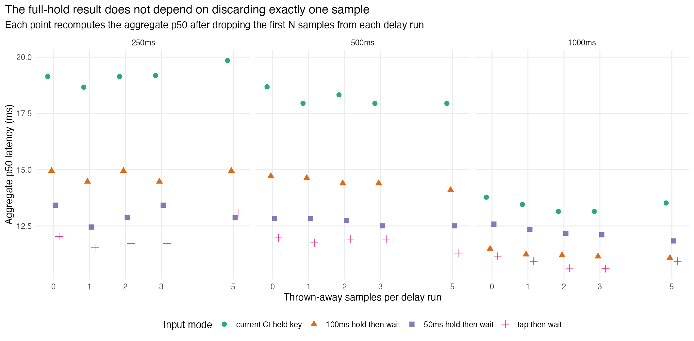

The `50ms` versus `100ms` question is the part that remains genuinely weak.
Across the `250ms` and `500ms` run-paired q50s, `100ms` hold is above `50ms`
hold in `7/8` comparisons with a median difference of `1.8ms`. That is
directionally suggestive, but with only eight paired comparisons the two-sided
sign-test p-value is `0.070`, and a rank-based paired estimate is `1.9ms` with
an approximate `-0.06..3.6ms` confidence interval. It also reverses at `1000ms`:
across the throwaway sensitivity table, `100ms` hold is `0.8-1.1ms` below `50ms`
hold, and the round-paired median difference is `-1.4ms`. This supports
"full-delay hold is a different regime" more strongly than "100ms is reliably
slower than 50ms".

The older hold-duration artifacts make that caution stronger, not weaker. They
have the same `fixed-hold-then-wait`, fresh-editor, CI setup, mixed-order, seed,
round, sample, and throwaway metadata as the current plotted fixed-hold artifacts,
but they are not part of the plotted four-mode sweep and should not be treated as
a clean independent repeat. Their timeline shows why: the older `100ms` run
overlapped the newer tap run by `160.6s`, nearly the whole run. As a sanity
check, substituting the older short-hold and tap artifacts still leaves current
full hold above every short/tap artifact at both discriminator delays:
the smallest full-minus-short/tap gap is `4.1ms` at `500ms`. Combining the old
and current compatible short/tap artifacts gives the same broad regime result:
at `250ms`, current full hold is `6.3ms` above combined `100ms`, `6.2ms` above
combined `50ms`, and `6.1ms` above combined tap; at `500ms`, the gaps are
`4.4ms`, `5.0ms`, and `5.8ms`. But this repeat check does not rank `50ms` and
`100ms`: the older `100ms` run was `4.1ms` lower than the current `100ms` run at
`250ms` and `2.3ms` lower at `500ms`, while the two `50ms` runs differed by only
`0.1ms` and `1.1ms` at those delays.

The old/current `100ms` disagreement is not a single-round artifact. At the
`250ms` / `500ms` discriminator delays, current `100ms` is above old `100ms` in
all eight round-paired q50 comparisons; the median round-paired gaps are
`3.7ms` at `250ms` and `2.1ms` at `500ms`. The difference is again in the
keypress interval rather than event count: at `250ms`, retained sample 1 is
essentially tied, but retained sample positions 2-10 are `2.2-7.2ms` higher in
the current run; at `500ms`, 8 of the 10 retained sample-position medians are
higher in the current run. The old/current `50ms` and tap comparisons have mixed
signs, so this is not a simple "later artifacts are globally slower" drift. It
looks like a `100ms`-specific run-condition interaction, which is why the
existing data should not choose between `50ms` and `100ms`.

A reused-editor code-path control makes the short-hold ranking even less
settled. The patch changes the CI-style `between-keys` and
`fixed-hold-then-wait` setup to click the stable contenteditable target before
page-keyboard actions instead of clicking the paragraph document locator. It did
not set `BENCHMARK_FRESH_EDITOR_PER_DELAY=1`, so it is a code-path control, not
a CI-comparable replacement for the four-mode sweep. Under that reused-editor
setup, patched `100ms` hold is tap-like: its p50s are `12.2ms` at `250ms`,
`12.3ms` at `500ms`, and `10.6ms` at `1000ms`, versus patched tap at `12.5ms`,
`12.6ms`, and `10.7ms`. But patched `50ms` hold moves the other way: `16.4ms`,
`16.5ms`, and `14.5ms`, about `4ms` above patched tap and about `4.3ms` above
patched `100ms` at `250ms` / `500ms`.

The available locator `50ms` controls narrow that surprise. They are also
reused-editor, but they avoid page-level `keyboard.down()` / `keyboard.up()` by
using element-targeted Playwright actions once per key. `locator.type( 'x', {
delay: 50 } )` still comes in above tap: `15.3ms` at `250ms`, `15.3ms` at
`500ms`, and `14.6ms` at `1000ms`. `locator.press( 'x', { delay: 50 } )` is
also above tap at the discriminator delays, but noisier: `15.1ms` at `250ms`,
`15.2ms` at `500ms`, and `13.6ms` at `1000ms`. That means the `50ms` slow band
is not only a page-keyboard down/up artifact. The page-keyboard path adds about
`1.1ms` over locator type at `250ms` / `500ms`, but essentially nothing at
`1000ms`; locator press is close to locator type at `250ms` / `500ms` and about
`1ms` lower at `1000ms`. On its own, the reused-editor control says that
`50ms` / `100ms` ordering is a harness/phase question, not a stable
human-hold-duration result.

Normalizing the same controls by API makes the remaining split more precise.
Holding the input API fixed, the reused-editor `50ms`-minus-`100ms` gap at
`250ms` / `500ms` / `1000ms` is tightly clustered: `3.4-4.0ms` for
`locator.press`, `3.8-4.2ms` for `locator.type`, and `3.9-4.2ms` for
page-keyboard. The matching `keypress` gaps are essentially the same
(`3.4-4.1ms`). Holding the requested hold fixed and changing APIs is smaller and
less stable. For requested `50ms`, page-keyboard is `1.2ms` above locator type
at `250ms` / `500ms`, `3.3ms` above it at `100ms`, and slightly below it at
`1000ms`; locator type is within `0.1ms` of locator press at `250ms` / `500ms`
and about `1.0ms` above it at `1000ms`. For requested `100ms`, page-keyboard is
only `0.8-1.0ms` above locator type at `250ms` / `500ms` and essentially tied at
`100ms`. So the best current decomposition is "a shared requested-`50ms` phase
visible across APIs, plus a smaller API-specific offset that determines how soon
that phase appears on the delay axis." It is not just a fixed page-keyboard tax,
and it is not just locator `type()` versus `press()`.

A `75ms` locator-press probe makes that phase reading sharper, with the usual
caveat that it is another separate reused-editor run rather than an interleaved
fresh-editor comparison. It uses the same stable-target setup as the `50ms`
locator-press probe, but its p50s are tap-like: `11.9ms` at `250ms`, `11.7ms`
at `500ms`, and `10.3ms` at `1000ms`, which are `0.6ms`, `0.9ms`, and `0.4ms`
below patched tap. Within the `250ms` / `500ms` / `1000ms` rows, locator-press
`50ms` is above locator-press `75ms` in `8/12` round-paired q50 comparisons,
with a median gap of `3.5ms`; by retained sample position, `50ms` is above
`75ms` in `9/10`, `10/10`, and `10/10` positions at those delays. Locator-press
`75ms` is slightly above locator-press `100ms` in `10/12` round-paired q50s, but
the median gap is only `0.5ms`. That is not a monotonic hold-duration curve. It
looks more like a narrow requested-hold/code-path phase where `50ms` is bad and
`75-100ms` has already crossed back into the tap-like band.

The exact `75ms` boundary is still not settled, though. Its aggregate p50 is
tap-like, but at `250ms` it has one high round (`15.5ms`) and a wide p10-p90
range (`11.0-16.1ms`). The `50ms` locator-press run has the mirror-image
problem: it is high in most rounds, but its last round is low at all three
`250ms` / `500ms` / `1000ms` delays (`11.5ms`, `11.5ms`, and `9.9ms`). The
stronger statement is cross-API: at those three delays, `50ms` is above `100ms`
in `12/12` page-keyboard round comparisons, `12/12` locator-type comparisons,
and `11/12` locator-press comparisons, with median gaps of `4.2ms`, `4.0ms`,
and `3.8ms`. That makes the reused-editor `50ms` band hard to dismiss as one
bad artifact, but the exact transition between `50ms` and `75ms` still needs an
interleaved run.

The artifact chronology also rules out the simplest time-drift explanation. The
tap run started after the `100ms` locator and page-keyboard controls, then the
three `50ms` controls ran, and the `75ms` locator-press control ran later still.
If the machine or browser were just monotonically warming up or slowing down,
the latest `75ms` run should not have returned to the tap-like band. A
time-local slowdown across the consecutive `50ms` block is still possible; the
matched fresh-editor matrix below checks that concern directly.

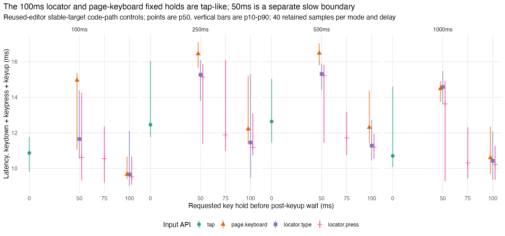

The reused-editor `50ms` effect is real within those probes, though. It is not a
missing-event or keydown-accounting issue: all reused-editor code-path controls
have two keydown dispatches per retained key, and replacing the benchmark metric
with the all-keydown metric changes p50 by only `0.34-0.64ms`. The slow band is
in `keypress`: page-keyboard `50ms` reports keypress p50s of `16.1ms`, `16.2ms`,
and `14.3ms` at `250ms` / `500ms` / `1000ms`; locator-type `50ms` reports
`14.9ms`, `15.0ms`, and `14.3ms`; patched tap reports `12.3ms`, `12.5ms`, and
`10.6ms`. The sign is also consistent. Page-keyboard `50ms` is above tap in
`12/12` round-paired q50 comparisons and in all `30/30` retained sample-position
medians across `250ms`, `500ms`, and `1000ms`. Locator-type `50ms` is above tap
in `12/12` round-paired q50 comparisons and `29/30` sample-position medians.
Locator-press `50ms` is above tap in `9/12` round-paired q50 comparisons, with
median round-paired deltas of `2.2ms`, `2.3ms`, and `2.8ms` at `250ms`,
`500ms`, and `1000ms`. Patched `100ms` has mixed signs (`4/12` round-paired q50s
above tap). This makes the reused-editor question more precise: not "is the
`50ms` bump just noise?", but "does that bump survive the fresh-editor CI
setup?"

Splitting the doubled-keydown shape gives one more boundary. The slow phase is
visible in the keydown metadata, but it is far too small to explain the result.
For locator-press `50ms` minus `100ms` at `250ms` / `500ms` / `1000ms`, the
latency gaps are `4.0ms`, `4.0ms`, and `3.4ms`; the `keypress` gaps are
`3.9ms`, `3.9ms`, and `3.4ms`. The first keydown dispatch is only
`0.12-0.19ms` higher, the last keydown dispatch only `0.02ms` higher, and the
gap between the two keydown dispatch starts only `0.11-0.16ms` higher. Locator
type and page keyboard show the same scale: first-keydown deltas of about
`0.18-0.22ms` and last-keydown deltas of about `0.03-0.04ms`, versus
`3.8-4.2ms` total latency gaps. That means the doubled-keydown artifact is a
useful marker of the same phase, but it is not the mechanism producing the slow
band.

The distribution shape differs by input API. At `250ms` / `500ms` / `1000ms`,
page-keyboard `50ms` is almost a full distribution shift: `115/120` retained
samples are above the same-API `100ms` p90. Locator type is also mostly shifted
(`96/120` above the `100ms` p90), though with more overlap at `250ms`.
Locator press is the mixed case: only `91/120` retained samples are above the
same-API `100ms` p90 and `29/120` remain in the fast band. That overlap is not
randomly sprinkled; in the locator-press `50ms` run, rounds 0-2 are mostly slow
while round 3 is mostly fast (`250ms`: `1/10` above the `100ms` p90; `500ms`:
`3/10`; `1000ms`: `2/10`). This explains why locator press has low p10s and
high p50s, while page keyboard and locator type look more like stable shifted
distributions. The safest interpretation is that locator press is the noisiest
probe of the phase, not that the broader `50ms` band is only a tail artifact.

The timestamp data also show why these should be read as requested-mode labels,
not literal physical hold durations. In the reused-editor controls, requested
page-keyboard `50ms` hold produced observed keydown-to-keyup medians of about
`101-108ms`; locator `50ms` produced about `65-67ms`; locator `75ms` produced
about `87-88ms`; locator `100ms` produced about `111-113ms`; page-keyboard
`100ms` produced about `143-149ms`; tap mode produced only `12-15ms`. That
means the open question is really about an observed-hold/phase/code-path band,
not a clean human `50ms` versus `100ms` physical-hold comparison. The observed
post-keyup gap alone also does not explain it: tap mode has larger post-keyup
gaps than `50ms` hold at the same requested key-to-key delays and remains lower,
while locator `75ms` and `100ms` have shorter post-keyup gaps than locator
`50ms` and are also lower. The fresh-editor matrix below therefore records
observed down-to-up duration and observed post-keyup gap alongside the requested
hold setting.

The observed-hold bands make the requested-versus-realized distinction concrete.
Requested `50ms` does not mean the same physical hold across APIs: locator
actions realize about `63-67ms`, while page-keyboard realizes about
`101-108ms`. But realized hold still does not rank the rows. The `60-70ms`
observed-hold band contains both fast locator rows (`10.6-11.6ms` at `100ms`
delay) and slow locator rows (`13.6-15.3ms` at longer delays). The
`100-115ms` band is even more direct: page-keyboard `50ms` at `100ms` /
`250ms` / `500ms` has observed holds of `103-109ms` and p50s of
`15.0-16.5ms`, while locator `100ms` has observed holds of `111-113ms` and p50s
of only `9.5-11.5ms`. So future runs should treat "requested hold" and
"observed hold" as separate factors. A physically realistic target should be
reported by observed hold, but the current artifact is not explained by observed
hold alone.

A single timestamp-threshold model does not fit the reused-editor code-path
controls either. At `250ms` / `500ms` / `1000ms`, locator-press `50ms` is slow
with a `51ms` keypress-to-keyup gap, but locator-press `75ms` is tap-like with a
`76-77ms` gap. Page-keyboard `50ms` is still slow with an even larger
`86-92ms` keypress-to-keyup gap, while page-keyboard `100ms` is tap-like with a
`132-137ms` gap. Across non-tap code-path controls, round-level Spearman
correlations go the opposite direction from a simple "longer hold is slower"
story: latency versus requested hold is `-0.73`, latency versus observed
keydown-to-keyup is `-0.36`, and latency versus keypress-to-keyup gap is
`-0.46`. Those negative correlations mainly reflect the `50ms` / `100ms` split,
not a causal model, but they do rule out treating observed physical hold length
as the direct predictor. The live question is a narrower input-API/phase
interaction after `keypress`, not just "how many milliseconds was the key held?"

The delay axis narrows it again. `50ms` locator press is not broadly slow at
every key-to-key delay: at the `100ms` delay point it is `0.25ms` below tap, with
only `2/4` round-paired q50s above tap. It becomes the slow band only at the
discriminator delays, where the tap-relative p50 deltas are `+2.7ms`, `+2.6ms`,
and `+2.9ms` at `250ms` / `500ms` / `1000ms`. Locator type has the same shape
but less cleanly: it is only `+0.8ms` at `100ms`, then `+2.8ms`, `+2.7ms`, and
`+3.9ms`. Page keyboard is different: it is already `+4.1ms` at `100ms` and
stays around `+3.8-4.0ms` at the longer delays. So the current open question is
not just "why is requested `50ms` slow?" It is "why do locator actions need a
longer configured key-to-key delay before the `50ms` phase becomes slow, while
page-keyboard actions hit the slow phase by `100ms`?"

That delay-axis split is not a retained-sample-position artifact. For
locator-press `50ms`, the `100ms` delay row is split almost evenly by retained
position: only `5/10` sample-position medians are above tap, with a median
tap-relative delta of `+0.02ms`. At `250ms`, `500ms`, and `1000ms`, the same
comparison is positive in `9/10`, `10/10`, and `9/10` sample positions, with
median deltas of `+2.5ms`, `+2.0ms`, and `+2.7ms`. Splitting each delay run
into retained positions `1-3` versus `4-10` gives the same answer: at `100ms`
the medians are only `+0.34ms` and `-0.00ms`, while at `250ms+` both bands stay
around `+1.9ms` to `+3.0ms`. So the locator delay threshold is not because only
the first retained keys or only the later retained keys are slow. It affects the
whole retained run once the configured delay is long enough.

Observed key-to-key timing gives a more precise version of that threshold, but
still not a universal one. For locator-press `50ms`, the observed
keydown-to-keyup duration is essentially the same at `100ms` and longer delays
(`63-67ms`), but the following key arrives much later once the configured delay
reaches `250ms`: observed keyup-to-next-keydown is `86ms` at the `100ms` delay
point, then `251ms`, `500ms`, and `1017ms` at `250ms` / `500ms` / `1000ms`.
Locator type shows the same pattern (`87ms`, then `253ms`, `498ms`, `1022ms`).
That explains why the locator split tracks configured delay even though the
observed hold itself does not change. But it is not a standalone
post-keyup-gap threshold: page-keyboard `50ms` is already slow at `100ms` delay
with a shorter observed keyup-to-next-keydown gap (`77ms`), while page-keyboard
`100ms` is tap-like at the same configured delay with only a `12ms` gap. The
surviving model therefore has to include both the input API and the cycle shape:
locator actions need the longer post-keyup idle before the `50ms` phase appears,
whereas page-keyboard actions can enter that phase much earlier.

Even keydown-to-next-keydown cycle time is not the direct predictor. Within the
same locator-press API and the same configured delay, the cycle times are nearly
identical across requested holds while latency changes sharply: at `250ms`, the
`50ms` / `75ms` / `100ms` locator-press cycles are `315ms`, `313ms`, and
`314ms`, but their p50s are `15.1ms`, `11.9ms`, and `11.2ms`; at `500ms`, the
cycles are `565ms`, `558ms`, and `557ms`, but p50s are `15.2ms`, `11.7ms`, and
`11.2ms`; at `1000ms`, cycles are `1083ms`, `1081ms`, and `1079ms`, but p50s
are `13.6ms`, `10.3ms`, and `10.2ms`. Page keyboard has the same kind of
counterexample: at `250ms`, `50ms` and `100ms` page-keyboard cycles differ by
only `12ms` (`349ms` versus `337ms`), while latency differs by `4.3ms`. The
cycle needs to be long enough for the locator `50ms` band to show up, but once
inside a given cycle band, requested hold/API still determines whether the slow
path is taken.

Comparing these reused-editor controls to the plotted fresh-editor sweep shows
why that matched rerun matters. This is not a clean fresh-versus-reused A/B: the
fresh sweep used the earlier paragraph-locator click path, while the reused
controls use the stable contenteditable target. Still, the common observables do
not explain the disagreement. Tap is close in both shapes: fresh-minus-reused is
`-1.1ms` at `250ms`, `-0.7ms` at `500ms`, and `+0.0ms` at `1000ms`, with nearly
identical observed hold and post-keyup gap medians. Page-keyboard `50ms` goes
the other direction, with fresh below reused by `4.1ms`, `3.7ms`, and `2.0ms`.
Page-keyboard `100ms` flips in the opposite direction, with fresh above reused
by `2.8ms`, `2.3ms`, and `0.5ms`. Within each family, the tap-relative behavior
also changes: fresh `100ms` is above tap by `3.4ms`, `2.7ms`, and `0.5ms`, while
reused `100ms` is tap-like/slightly below tap; fresh `50ms` is only
`0.8-1.8ms` above tap, while reused `50ms` is `3.8ms` above tap at all three
delays. The requested-mode observed hold/gap bands are similar enough across
fresh and reused runs that they do not predict this family-level flip on their
own. The remaining variable is some setup-state, target, refocus, or
instrumentation interaction rather than the measured down/up/gap medians alone.

A completed fresh-editor stable-target matrix now sharpens that into an API
boundary rather than a generic fresh/reused boundary. This matrix uses the same
fresh saved/reopened Typing setup as the CI-comparable runs
(`BENCHMARK_FRESH_EDITOR_PER_DELAY=1`), the stable contenteditable target, four
rounds, ten retained samples plus one throwaway per delay, and the
`250ms` / `500ms` / `1000ms` discriminator delays. I then added a second
locator-press variant with `noWaitAfter: true`, which disables Playwright's
per-press wait-for-signals epilogue. The p50 matrix is:

| Fresh code path | `250ms` | `500ms` | `1000ms` |
| --------------- | ------: | ------: | -------: |
| tap then wait | `12.6ms` | `13.1ms` | `11.9ms` |
| current CI held key | `17.5ms` | `20.0ms` | `12.0ms` |
| page-keyboard `50ms` hold | `12.6ms` | `12.7ms` | `13.0ms` |
| page-keyboard `75ms` hold | `17.0ms` | `16.9ms` | `15.7ms` |
| page-keyboard `100ms` hold | `17.1ms` | `17.3ms` | `15.6ms` |
| `locator.type()` `50ms` hold | `16.0ms` | `15.9ms` | `15.9ms` |
| `locator.type()` `75ms` hold | `15.9ms` | `15.7ms` | `15.2ms` |
| `locator.type()` `100ms` hold | `15.9ms` | `12.0ms` | `12.0ms` |
| `locator.press()` `50ms` hold | `11.5ms` | `12.3ms` | `10.8ms` |
| `locator.press()` `75ms` hold | `12.9ms` | `11.9ms` | `11.1ms` |
| `locator.press()` `100ms` hold | `13.1ms` | `12.0ms` | `10.5ms` |
| `locator.press(noWaitAfter)` `50ms` hold | `16.0ms` | `15.6ms` | `15.1ms` |
| `locator.press(noWaitAfter)` `75ms` hold | `16.1ms` | `16.2ms` | `15.2ms` |
| `locator.press(noWaitAfter)` `100ms` hold | `14.3ms` | `11.3ms` | `11.1ms` |

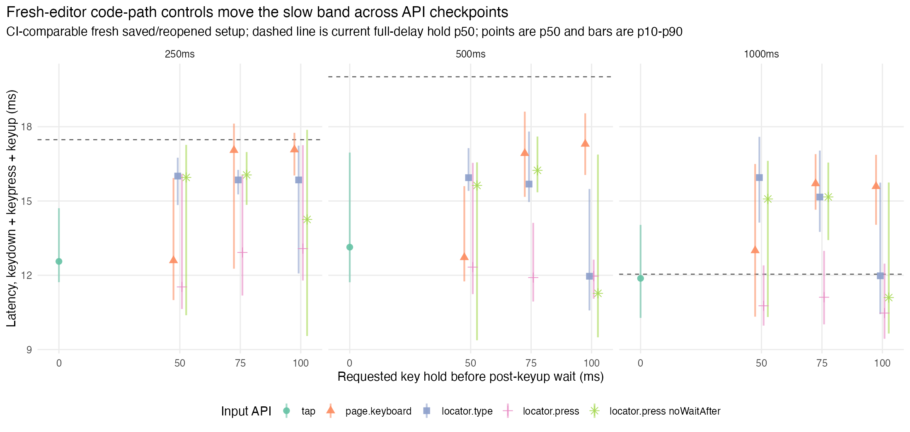

The tap-relative phase map makes the remaining split easier to audit than the
raw p50 table. Each cell below subtracts the same-delay tap p50, so a dark
positive cell means "this API/hold combination is slow relative to a completed
keypress followed by the same configured wait".

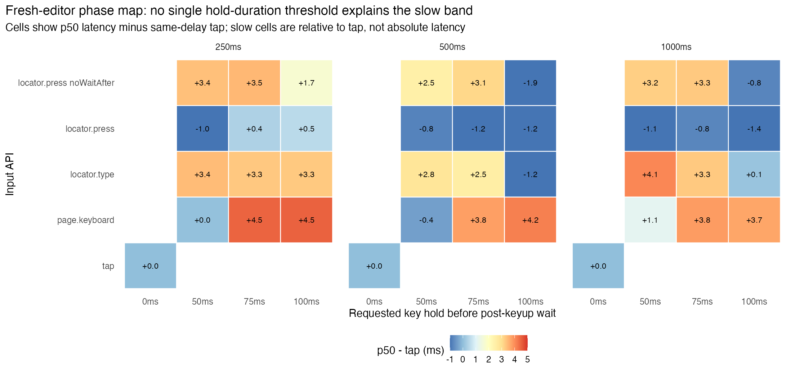

This plot rules out a single hold-duration threshold. At the same requested
`50ms` hold, page-keyboard is tap-like while `locator.type()` and
`locator.press(noWaitAfter)` are slow. At the same requested `100ms` hold,
page-keyboard is slow while `locator.type()` and `locator.press(noWaitAfter)`
are mostly tap-like at `500ms` / `1000ms`. Ordinary `locator.press()` remains
tap-like across the matrix, and the noWaitAfter variant moves its `50ms` and
`75ms` cells into the `locator.type()` band. That gives one proved answer and
one remaining open question: the ordinary `locator.press()` result is mostly the
per-key Playwright wait-for-signals checkpoint, but the page-keyboard versus
`locator.type()` boundary is still an API/order interaction, not a physical
hold-length threshold.

This closes one open question and opens a narrower one. The reused-editor
page-keyboard `50ms` slow band does not survive the matched fresh page-keyboard
setup: fresh page-keyboard `50ms` is tap-like at `250ms` / `500ms` and only
`1.1ms` above tap at `1000ms`. But the fresh sweep does not make the whole
`50ms` question disappear. Fresh `locator.type()` `50ms` is still `2.8-4.1ms`
above tap, and fresh `locator.type()` `75ms` is also `2.5-3.3ms` above tap.
Fresh `locator.press()` is the opposite: `50ms`, `75ms`, and `100ms` are all
tap-like, with aggregate p50s at or below tap except for `75ms` / `100ms` at
`250ms`, where they are only `0.4-0.5ms` above tap. The `noWaitAfter` variant
mostly removes that special tap-like behavior. At `50ms`, it reports
`15.1-16.0ms`, essentially the `locator.type()` band. At `75ms`, it is slow at
all three discriminator delays (`16.1ms`, `16.2ms`, and `15.2ms`), again close
to `locator.type()`. At `100ms`, it remains mostly tap-like, matching the fact
that `locator.type()` `100ms` is also tap-like at `500ms` / `1000ms`.

The sign checks match the aggregate split. Across the three discriminator delays
and four rounds, page-keyboard `50ms` is below page-keyboard `100ms` in `11/12`
round-paired comparisons and in all `30/30` retained sample-position medians.
For `locator.type()`, `50ms` is above `100ms` in `11/12` round comparisons and
`26/30` sample-position medians. For ordinary `locator.press()`, the same
comparison is mixed (`7/12` rounds and `18/30` sample-position medians above
`100ms`), with a median round-paired gap of only `0.15ms`. For
`locator.press(noWaitAfter)`, the strongest check is against ordinary
`locator.press()`: `50ms` noWaitAfter is higher in `9/12` paired rounds with a
median `+3.4ms` gap, while its median gap versus `locator.type()` is only
`-0.3ms`. At `75ms`, noWaitAfter is higher than ordinary press in `12/12`
paired rounds with a median `+3.9ms` gap, and is again close to `locator.type()`
overall (`+0.1ms` median). All modes still have the same event shape: `11` key
groups, `22` keydown dispatches, `11` keypress dispatches, and `11` keyup
dispatches per run. The movement is again in the `keypress` slice.

Observed physical hold still does not explain the boundary. Fresh page-keyboard
`50ms` realizes about `95-98ms` down-to-up and is tap-like, while fresh
`locator.type()` `50ms` realizes only `67-68ms` and is slow. Fresh
`locator.press()` `100ms` realizes `113-116ms` and is tap-like, while
page-keyboard `75ms` realizes `132-138ms` and is slow. The simple predictor is
therefore not requested hold, observed hold, or post-keyup wait. It is the
Playwright entry point plus where that entry point lands relative to the
editor/browser phase.

The fresh chronology weakens a simple time-drift explanation. The run order was
current held key, tap, page-keyboard `50ms` / `75ms` / `100ms`,
`locator.type()` `50ms` / `75ms` / `100ms`, and then `locator.press()`
`50ms` / `75ms` / `100ms`. If later runs were just globally slower, the final
`locator.press()` block should not have returned to the tap-like band. If
earlier runs were just globally faster, the initial current-CI held-key run
should not have been slow at `250ms` / `500ms`. The clean noWaitAfter artifacts
then ran sequentially as `50ms`, `75ms`, and `100ms`, and the `50ms` / `75ms`
rows went back to the slow `locator.type()` band. That is the important
direction: the
tap-like ordinary `locator.press()` result is not a generic "latest run was
fast" artifact. The CSVs and plot use that non-overlapping sequence; I excluded
a later duplicate `75ms` noWaitAfter artifact that overlapped the existing
`100ms` artifact.

The remaining open question is therefore specifically why `locator.type()` and
page-keyboard fixed hold cross different phase boundaries, while ordinary
`locator.press()` stays tap-like under the same fresh setup. Because Playwright's
`pressSequentially()` delegates to `type()`, the fresh data says it belongs with
the `locator.type()` family, not with the ordinary `locator.press()` family.

Reading the local Playwright implementation explains why `locator.press()` should
not be used as a stand-in for `pressSequentially()`. On the client side,
`Locator.pressSequentially()` is literally `return await this.type(text,
options)`, while `Locator.press()` calls `frame.press(...)`. On the server side,
`elementHandle._type()` focuses the target and calls `page.keyboard.type(...)`;
for a US-keyboard character such as `x`, `keyboard.type()` immediately delegates
to `keyboard.press(char, { delay })`. So `locator.type('x', { delay })` and
`locator.press('x', { delay })` share the same low-level keydown / delay / keyup
routine for the character itself.

The difference is around that routine. `elementHandle._press()` wraps focus plus
`keyboard.press()` in `frameManager.waitForSignalsCreatedBy(...)`, while
`elementHandle._type()` does not. With Chromium, that wrapper runs
`inputActionEpilogue()`, which sends a `Page.enable` CDP command, waits for
signal barriers, and then waits for the next task before returning. That is
therefore an automation checkpoint after each key, before the benchmark's
explicit post-keyup wait. The fresh data fit that code-path split: the
`locator.press()` family is tap-like even at `50ms`, while `locator.type()` /
`pressSequentially()` is not. The noWaitAfter control confirms that this wrapper
is the main reason ordinary `locator.press()` is tap-like. Removing the
wait-for-signals epilogue moves `50ms` `locator.press()` from the ordinary press
band (`11.5ms`, `12.3ms`, `10.8ms`) to the type-like band (`16.0ms`, `15.6ms`,
`15.1ms`). The `75ms` row moves the same way at all three discriminator delays
(`16.1ms`, `16.2ms`, `15.2ms`). The `100ms` row stays mostly tap-like, which is
not a contradiction: `locator.type()` `100ms` is also tap-like at `500ms` /
`1000ms`. So the
automation-checkpoint answer is narrow but useful: ordinary `locator.press()` is
not a valid model for CI's `pressSequentially()` / `type()` path because it adds
a per-key checkpoint that can hide the slow phase.

A predictor audit makes the remaining open question smaller. The derived table
is in `data/typing-delay-ci-fresh-code-path-predictor-audit.csv`; the important
rows are:

| Candidate predictor | Current answer | Counterexample or support |
| ------------------- | -------------- | ------------------------- |
| Requested hold duration | rejected globally | At requested `50ms`, page-keyboard is tap-like at `250ms` (`+0.0ms` versus tap), while `locator.type()` and `locator.press(noWaitAfter)` are both slow (`+3.4ms`). |
| Observed down-to-up hold | rejected as one threshold | page-keyboard `50ms` is tap-like with a realized `97.7ms` hold at `500ms`, while `locator.type()` `75ms` is slow with a nearby `93.5ms` realized hold; ordinary `locator.press()` `100ms` is tap-like at `114.3ms`. |
| Configured post-keyup wait | rejected | At `500ms` delay and requested `50ms` hold, page-keyboard and `locator.type()` both have a configured `450ms` post-keyup wait; page-keyboard is `-0.4ms` versus tap while `locator.type()` is `+2.8ms`. |
| One-call `keyboard.press()` routine | not sufficient | `locator.type()` and `locator.press(noWaitAfter)` both use `keyboard.press()` internally and match at `50ms` / `75ms`, but ordinary `locator.press()` uses the same routine plus the press epilogue and stays tap-like. |
| Locator focus/check path without press epilogue | best current local rule for locator APIs | `locator.type()` and `locator.press(noWaitAfter)` are within `0.0ms` at `75ms` / `1000ms` and within `0.1ms` at `50ms` / `250ms`. |
| `locator.press()` wait-for-signals epilogue | supported | Removing it raises ordinary `locator.press()` by median `+3.4ms` at `50ms` and `+3.9ms` at `75ms` in round-paired q50s. |
| Chronological drift | rejected as primary cause | Ordinary `locator.press()` ran late and returned to the tap-like band; the later clean noWaitAfter sequence moved `50ms` / `75ms` back into the slow `locator.type()` band. |

That leaves one genuinely local harness question, not a general benchmark
question: why does page-keyboard fixed hold have its own `75ms` / `100ms` slow
band while `locator.type()` / `locator.press(noWaitAfter)` have a `50ms` /
`75ms` slow band? The next cheap control, if this boundary matters for a CI
change, is not another full sweep. It is a compact split: page-level
`page.keyboard.press( 'x', { delay: hold } )` plus the same post-keyup wait,
crossed with a page-keyboard mode that performs a per-key locator
`focus()`/utility evaluation before the explicit `down()` / `up()`. That would
separate explicit down/up timing from Playwright's per-key locator focus/check
work. Until that control exists, the practical conclusion is to treat
`pressSequentially()` as the `locator.type()` family and ordinary
`locator.press()` as a checkpoint control only.

The remaining-decision audit is now narrow enough to avoid another broad sweep.
The derived table is in
`data/typing-delay-input-api-boundary-next-control-audit.csv`; the important
decisions are:

| Open question | Current answer | Decision |
| ------------- | -------------- | -------- |
| Does ordinary `locator.press()` model `pressSequentially()`? | No. `pressSequentially()` delegates to `type()`, while ordinary `locator.press()` adds the wait-for-signals epilogue; removing that epilogue raises ordinary press by median `+3.4ms` at `50ms` and `+3.9ms` at `75ms`. | Use `locator.press()` only as a checkpoint control; compare `pressSequentially()` against `locator.type()`. |
| Can one realistic hold duration be chosen globally? | No. At requested `50ms`, page-keyboard is tap-like at `250ms` while `locator.type()` is slow; at requested `100ms`, page-keyboard is slow at `500ms` while `locator.type()` is tap-like. | Pick the input API first, then interleave realistic holds inside that API family. |
| Does observed physical hold close the split? | No. page-keyboard `50ms` is tap-like with a realized `97.7ms` hold at `500ms`, while `locator.type()` `75ms` is slow with a nearby `93.5ms` realized hold. | Treat measured hold as a descriptor, not the causal variable. |
| Does configured post-keyup wait close the split? | No. At `500ms` delay and requested `50ms` hold, page-keyboard and `locator.type()` both wait `450.0ms` after keyup, but land in different phases. | Keep post-keyup timing separate from Chromium-runtime checkpoint experiments. |
| What still separates page-keyboard from `locator.type()`? | Only this narrower boundary remains open: explicit down/up timing, one-call `page.keyboard.press()`, per-key locator focus/check work, or their interaction with the editor phase. | Run the compact `page.keyboard.press()` plus per-key locator-focus/evaluate split only if the CI implementation choice depends on this equivalence. |
| What would a CI switch to `pressSequentially()` mean? | It would switch the benchmark to the `locator.type()` family, not to ordinary `locator.press()` or explicit page-keyboard down/up. | Run the exact CI settings once after choosing the final helper; do not proxy through `locator.press()`. |

I then ran that compact control in the same CI-comparable fresh-editor setup:
`BENCHMARK_SETUP_STYLE=ci-post-editor-typing`,
`BENCHMARK_FRESH_EDITOR_PER_DELAY=1`, delays `250ms`, `500ms`, and `1000ms`, four
rounds, 10 retained samples, and one throwaway sample per delay. The two new
paths were:

-   `page.keyboard.press( 'x', { delay: hold } )`, then wait for the remaining
    post-keyup delay.
-   `locator.focus()` before every explicit `page.keyboard.down()` /
    `sleep( hold )` / `page.keyboard.up()`, then wait for the remaining
    post-keyup delay.

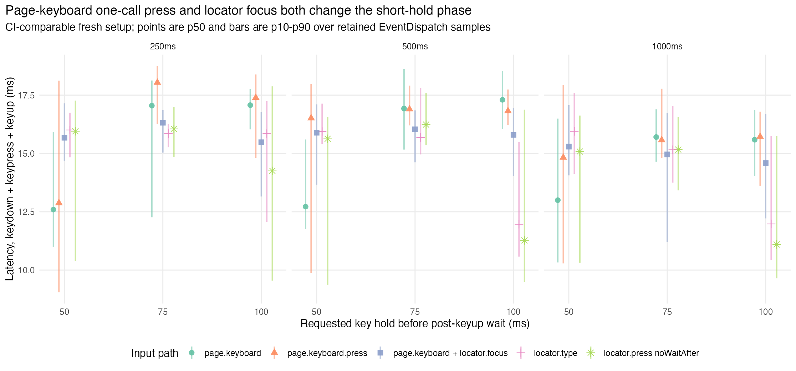

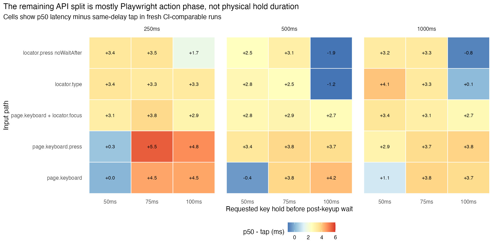

The compact result closes the broad version of the question. `page.keyboard.press`
is not equivalent to the explicit `down()` / `sleep()` / `up()` helper at short
holds: at `50ms` it is tap-like at `250ms` (`+0.3ms` versus tap), but slow at
`500ms` (`+3.4ms`) and `1000ms` (`+2.9ms`). At `75ms` and `100ms`, it is slow at
all three delays (`+3.7ms` to `+5.5ms`). Adding a per-key locator `focus()` before
explicit page-keyboard `down()` / `up()` also moves the path into the slow band:
all nine `50ms` / `75ms` / `100ms` by delay cells are `+2.7ms` to `+3.8ms`
versus tap.

That means the remaining split is not physical hold duration, and it is not just
"page keyboard" versus "locator" as a name. It is an action-order/runtime-state
effect. Playwright's source lines up with the result: `keyboard.press()` does
`down()`, then `progress.wait( delay )`, then `up()`, while the explicit benchmark
helper uses a harness `setTimeout` between separate `down()` and `up()` calls.
`locator.type()` does an element focus via Playwright's utility world and then
calls `page.keyboard.type()`. A separate `locator.focus()` before each explicit
page-keyboard keypress is enough to move the measured key event into the slow
band, but it over-shoots `locator.type()` at `100ms` / `500ms` and `100ms` /
`1000ms`, where `locator.type()` is tap-like. So the exact lower-level mechanism
is still a Playwright/Chromium runtime scheduling detail, but the CI decision is
no longer blocked on it: `pressSequentially()` delegates to `locator.type()`,
ordinary `locator.press()` remains only a checkpoint control, and explicit
page-keyboard `down()` / `up()` is a separate helper family.

### Input API CI Helper Decision Contract

The remaining input-API question is now a decision-boundary issue, not a reason
to keep sweeping mixed helper families. The contract is in
`data/typing-delay-input-api-ci-helper-decision-contract-audit.csv`.

| Decision question | Current evidence | Required validation | Claim scope |
| ----------------- | ---------------- | ------------------- | ----------- |
| What is the current CI helper family? | the real post-editor and site-editor Typing metrics call `target.type()` / `paragraph.type()` with the configured delay; `pressSequentially()` delegates to the same `type()` path, while `locator.press()` uses a different action wrapper | record exact helper name, Playwright version, delay option, retained/throwaway policy, fixture setup, and whether the target is a Locator or ElementHandle | CI helper identity |
| Can ordinary `locator.press()` proxy for `pressSequentially()` or `target.type()`? | no; source inspection and `noWaitAfter` data both show ordinary `locator.press()` adds the wait-for-signals epilogue, and removing it raises `50ms` / `75ms` rows into the `locator.type()` band | label ordinary `locator.press()` only as checkpoint/control evidence | proxy rejected |
| What validates a spelling switch from `type()` to `pressSequentially()`? | current Playwright aliases `pressSequentially()` to `type()`, so behavior should be unchanged when options and target objects are unchanged | one exact CI-settings comparison after the final helper spelling is chosen: same fixture, delay, retained/throwaway count, trace settings, browser revision, and start boundary | spelling-only change if passed |
| What validates switching from page keyboard or explicit `down()` / `up()` to locator `type()` / `pressSequentially()`? | compact controls show page-keyboard, `page.keyboard.press()`, locator focus prelude, and `locator.type()` occupy different phase bands under the same requested holds | rerun the exact CI metric with the final helper, not a proxy; treat old/new as an API-family comparison | metric-definition change |
| Can realistic hold duration be selected first? | no; `50ms` / `75ms` / `100ms` rows are API-family-specific | choose the helper first, then interleave `50ms`, `100ms`, and optionally `75ms` only inside that helper family | hold choice scoped |
| What lower-level mechanism remains open? | `progress.wait()` versus harness `setTimeout`, utility-world focus/checkpoint work, trace snapshot/runtime state, and Chromium scheduler interaction | use the runtime trace runbook only if the browser mechanism matters; do not require it for the CI helper choice | mechanism optional |
| What guards against Playwright version drift? | the conclusion depends on current Playwright source: `pressSequentially()` delegates to `type()`, and `locator.press()` uses the wait-for-signals action path | on Playwright upgrades, re-check source and rerun compact discriminator rows only if the implementation changed | upgrade guard |

This gives a concrete answer for a future CI helper change. If the code is only
rewritten from `type()` to `pressSequentially()` with the same target and
options, the expected change is spelling-level, but it still deserves one exact
CI-settings check. If the change moves between page-keyboard, explicit
`down()` / `up()`, locator `type()`, or ordinary `locator.press()`, it is a
metric-definition change. Ordinary `locator.press()` should not be used as a
shortcut for either `type()` or `pressSequentially()`.

### Input API Helper Claim Ladder

The helper question is now a claim-boundary problem. The same local data can
support a spelling-level `type()` / `pressSequentially()` equivalence claim, a
rejection of ordinary `locator.press()` as a proxy, and a metric-definition
warning for page-keyboard or explicit `down()` / `up()` switches. It cannot
support one universal human-hold threshold or threshold continuity across helper
families.

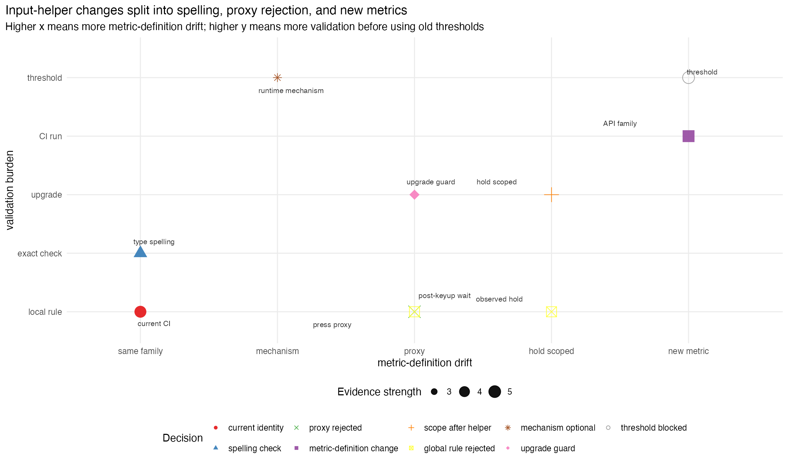

| Claim | Current evidence | Boundary |
| ----- | ---------------- | -------- |
| Current CI helper identity | Typing uses `target.type()` / `paragraph.type()` with full-delay held-key semantics and one discarded sample | classify current CI as the `type()` / `pressSequentially()` family |
| `type()` to `pressSequentially()` spelling | Playwright currently aliases `pressSequentially()` to `type()` | spelling-level only if the exact CI-settings check stays in band |
| ordinary `locator.press()` proxy | rejected: `locator.press()` adds the wait-for-signals epilogue, and `noWaitAfter` moves `50ms` / `75ms` rows into the `locator.type()` band | use ordinary `locator.press()` only as a checkpoint/control row |
| page-keyboard or explicit `down()` / `up()` switch | compact controls put these families in different phase bands under similar holds | metric-definition change; do not merge into old thresholds without the portability runbook |
| realistic hold duration | `50ms` / `75ms` / `100ms` rows are API-family-specific | choose helper first, then interleave short holds inside that helper family |
| observed hold or post-keyup wait | rejected as global causes: similar measured holds and identical post-keyup waits can land in different phases | use them as descriptors, not causal thresholds |
| lower-level Playwright/Chromium mechanism | still open: `progress.wait()`, utility-world focus/checkpoint work, trace/runtime state, and scheduler effects | optional for mechanism naming; not required for the CI helper decision |
| Playwright upgrade drift | conclusion depends on current source paths | re-check source and compact discriminator rows after helper internals change |
| threshold continuity | only same-family changes that pass exact validation preserve threshold continuity | helper-family switches are new-metric events for dashboards |

The operational rule is: pick the helper family first. A same-target,
same-options `type()` to `pressSequentially()` rewrite gets one exact
CI-settings confirmation. A switch to page-keyboard, explicit `down()` / `up()`,
or ordinary `locator.press()` is a new benchmark definition. Only after that
helper choice should realistic short holds be compared.

The reused-editor result is also not explained by text accumulation or
within-round placement. These code-path probes reuse one editor, so each later
delay run starts with more typed characters, but the delay order and global typed
character positions are the same across tap, page-keyboard `50ms`, page-keyboard
`100ms`, and locator `50ms` modes. After subtracting each mode/delay median, the
median residual by within-round position is near zero (`+0.06ms`, `+0.07ms`,
`-0.02ms`, `-0.05ms`, `-0.12ms`). Binning by global typed-character index is
similarly small, with median residuals within about `0.25ms` of zero. The
page-keyboard `50ms` bump stays positive for every round at `250ms`, `500ms`,
and `1000ms`; locator-type `50ms` also stays positive for every round at those
delays. So accumulation may affect absolute p50s, but it does not explain the
reused-editor `50ms`-versus-tap split.

A small traced locator-press control adds a separate caution. With
`traceData=true`, `traceTimers=true`, only the `250ms` / `500ms` / `1000ms`
delay set, two rounds, and five retained samples per delay, locator-press `50ms`
and `100ms` are essentially tied: `50ms` reports `11.6ms`, `11.9ms`, and
`10.9ms`; `100ms` reports `11.7ms`, `11.4ms`, and `10.9ms`. That does not
disprove the larger reused-editor `50ms` bump, because this traced control also
removes the preceding `0ms` / `100ms` delay runs and halves the per-delay sample
count. In the non-traced locator-press run, the same first two rounds at
`250ms` / `500ms` / `1000ms` are still high (`15.2ms`, `15.6ms`, `14.0ms` in
round 0 and `15.1ms`, `15.3ms`, `14.0ms` in round 1). It does show that the
code-path probe is sensitive to surrounding benchmark shape and/or tracing. The
fresh-editor matrix above answers the untraced setup question; the traced
locator-press question would need its own matched trace on/off matrix rather
than stitching together controls with different delay sets and instrumentation.

Matching the non-traced run down to the traced run's sample shape sharpens that
caution. If the non-traced locator-press runs are restricted to the first two
rounds and first five retained samples per delay, `50ms` still reports
`15.1ms`, `15.4ms`, and `14.2ms` at `250ms` / `500ms` / `1000ms`, while traced
`50ms` reports `11.6ms`, `11.9ms`, and `10.9ms`. The same matched comparison for
`100ms` barely moves: non-traced `100ms` is `11.6ms`, `11.4ms`, and `10.2ms`,
versus traced `100ms` at `11.7ms`, `11.4ms`, and `10.9ms`. So the traced
contradiction is not caused by using five retained samples instead of ten. It is
specifically a `50ms` collapse under the traced/reduced-delay-set shape: trace
minus non-trace is about `-3.6ms`, `-3.5ms`, and `-3.2ms` for `50ms`, but only
`+0.1ms`, `-0.0ms`, and `+0.7ms` for `100ms`. The remaining split is therefore
between tracing itself, removing the `0ms` / `100ms` delay prelude, or their
interaction. A cheap isolating control would be a `2 x 2` locator-press `50ms`
matrix: trace on/off crossed with the full five-delay set versus the reduced
three-delay set, keeping rounds and retained sample count fixed.

The non-traced run's own order weakens the simplest "removed `0ms` / `100ms`
prelude" explanation. In the full five-delay locator-press `50ms` run, the
shuffled round starts with `250ms` and `500ms`, and both are still high
(`15.6ms` and `15.4ms`); its later `1000ms` row, after a `0ms` run, is also
still above tap (`13.2ms`). The final ascending round has the `0ms` / `100ms`
prelude again, but it is the low round (`11.5ms`, `11.5ms`, and `9.9ms` at
`250ms` / `500ms` / `1000ms`). That late-run recovery is also not a generic
`50ms` warmup effect: locator-type `50ms` remains high in the final round
(`15.7ms`, `15.2ms`, `14.2ms`), and page-keyboard `50ms` remains high too
(`16.6ms`, `16.5ms`, `14.8ms`). Within the non-traced `50ms` controls, q50
versus elapsed time has Spearman `-0.61` for locator press, but only `-0.11` for
locator type and `+0.07` for page keyboard. So the remaining trace/open-order
question is locator-press-specific; it is not explained by ordinary run position
or by simply having typed through the `0ms` and `100ms` delay runs first.

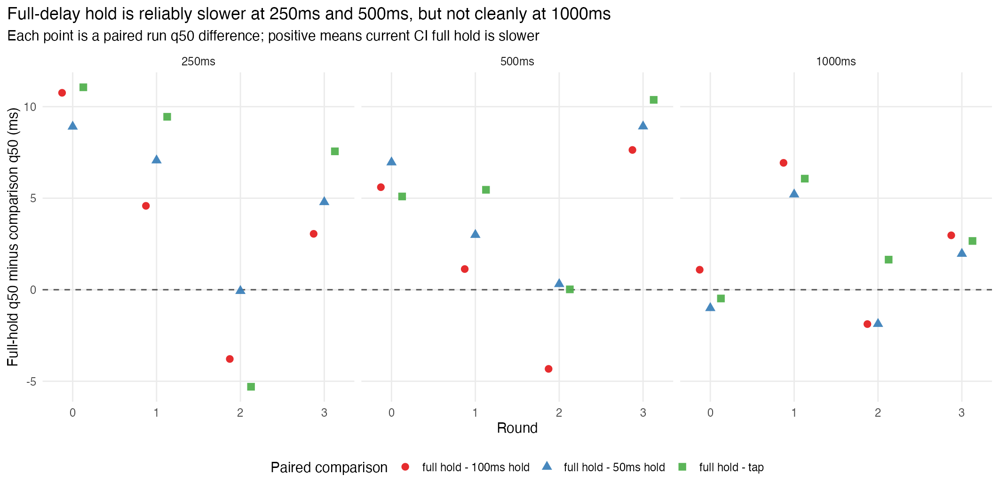

The low shuffled round looks like a shared run-condition problem, not a missing
event or an ordinary setup-duration effect. For the `250ms` / `500ms`
discriminator rows, round 2 has negative mode-delay residuals in `7/8`
mode/delay cells and an average residual of about `-3.1ms`. But setup duration
does not explain it cleanly: the round-2 current-CI `250ms` / `500ms` setups were
the fastest in their mode/delay groups, the `100ms` fixed-hold `250ms` /
`500ms` setups were also the fastest while their q50s stayed near normal, and
the `50ms` fixed-hold `250ms` setup was the slowest while its q50 was the
lowest. The remaining explanation is some unmeasured environmental or ordering
state, which is why the blocked rerun should be read with paired differences and
sensitivity checks rather than a single plotted point.

The exact order makes that narrower. With `BENCHMARK_ORDER_MODE=mixed`, round 0
is ascending, round 1 is descending, round 2 is shuffled, and round 3 is
ascending again. For this seed, the shuffled round order was `250`, `500`, `0`,
`1000`, `100`, so the low `250ms` / `500ms` points were the first two runs in
that round. But position alone is not a good explanation: across modes and
delays, the median residual by within-round position is near zero
(`+0.08ms`, `-0.19ms`, `+0.07ms`, `+0.02ms`, `-0.09ms`). Round 2 is generally a
little low, with an all-delay median residual of `-0.31ms`, but the effect is
concentrated in the `250ms` / `500ms` discriminator rows. This points at an
unmeasured run-condition-by-delay interaction more than a simple ordering bug.

An additive model on the `250ms` / `500ms` rows gives the same diagnosis. After
accounting for input mode and delay, round 2 is estimated `4.8ms` below the
baseline round. Adding within-round position barely changes that estimate, while
the position coefficient is only `-0.7ms`. Setup duration also does not line up
as the cause: the setup-duration residual has only a weak Spearman correlation
with q50 residual (`0.21`). The stronger run-duration correlation is expected in
the other direction because slower keypresses make the run longer; it is not a
setup explanation.

Pooling samples across rounds is also not driving the conclusion. At `250ms`,
the median-of-run-q50 full-minus-tap, full-minus-`50ms`, and
full-minus-`100ms` deltas are `6.4ms`, `5.9ms`, and `4.7ms`; at `500ms`, they
are `6.6ms`, `5.1ms`, and `3.8ms`. Those are a little smaller than the pooled
sample p50 deltas, but they preserve the same regime ordering.

The remaining experimental gap is code-path equivalence, not hold realism. The
follow-up patch adds two closer modes:
`locator-type-fixed-hold-then-wait` and `locator-press-fixed-hold-then-wait`
([spec](../../specs/typing-delay-benchmark.spec.js#L3850-L3892)). These improve
on the explicit `page.keyboard.down()` / `up()` fixed-hold implementation by
keeping the action element-targeted while still separating hold time from
post-keyup wait. Local Playwright `1.58.2` source shows why they are relevant:
`locator.pressSequentially()` delegates to
`type()` ([locator.ts](https://github.com/microsoft/playwright/blob/v1.58.2/packages/playwright-core/src/client/locator.ts#L354-L360));
element `type()` focuses the element and calls `page.keyboard.type()`, element
`press()` focuses the element and calls `page.keyboard.press()`
([dom.ts](https://github.com/microsoft/playwright/blob/v1.58.2/packages/playwright-core/src/server/dom.ts#L694-L723));
and keyboard `type()` loops through US-keyboard characters by calling
`keyboard.press(char, { delay })`
([input.ts](https://github.com/microsoft/playwright/blob/v1.58.2/packages/playwright-core/src/server/input.ts#L91-L105)).
The locator modes therefore test whether the remaining difference is caused by
using a page-level keyboard action rather than an element-targeted action.

Two locator probes are already available, but both should be treated as
informative rather than CI-comparable. They used `BENCHMARK_KEY_HOLD_MS=100` and
the new locator modes, but both have `freshEditorPerDelay=false`, whereas the
four-mode comparison above used a fresh saved/reopened editor for each delay.
Under this reused-editor setup, both are tap-like: locator type reports
`11.5ms` / `11.3ms` / `10.4ms` at `250ms` / `500ms` / `1000ms`, and locator
press reports `11.2ms` / `11.2ms` / `10.2ms`. The aggregate type-minus-press gap
is only `0.3ms` at `250ms`, `0.1ms` at `500ms`, and `0.2ms` at `1000ms`. That
reduces concern that Playwright's element `press()` wrapper alone creates the
slow band. It still cannot close the code-path question because editor reuse
changes setup/order state and because current CI uses one `type()` call for the
whole delay run.

There is one more nuance in that follow-up. `locator.press()` is closer than
explicit `page.keyboard.down()` / `up()` because it keeps the action
element-targeted, but it is not identical to current CI `type()`: Playwright
wraps element `press()` in `waitForSignalsCreatedBy()`, while element `type()`
does not. The closest implementable no-Playwright-patch check is probably
`paragraph.type( 'x', { delay: holdMs } )` once per character, followed by the
post-keyup wait. That preserves the locator `type()` entry point, but still
differs from current CI because current CI makes one
`paragraph.type( 'x'.repeat( sampleCount ), { delay: delayMs } )` call for the
whole delay run
([spec](../../specs/typing-delay-benchmark.spec.js#L4103-L4110)). A truly exact
A/B would need a Playwright-level helper that uses the same one-call `type()`
path while separating down-to-up hold time from keyup-to-next-key wait.

The matched rerun above is now complete. It answers the fresh/reused concern but
does not give an exact code-path decomposition of current CI, because the
families still differ under the same setup: current CI uses one `type()` call,
page fixed hold uses explicit keyboard down/up, locator type uses element
`type()`, and locator press uses element `press()`. The remaining exact A/B is a
Playwright-helper problem: keep the one-call `type()` path, but separately
control down-to-up hold time and keyup-to-next-key wait.

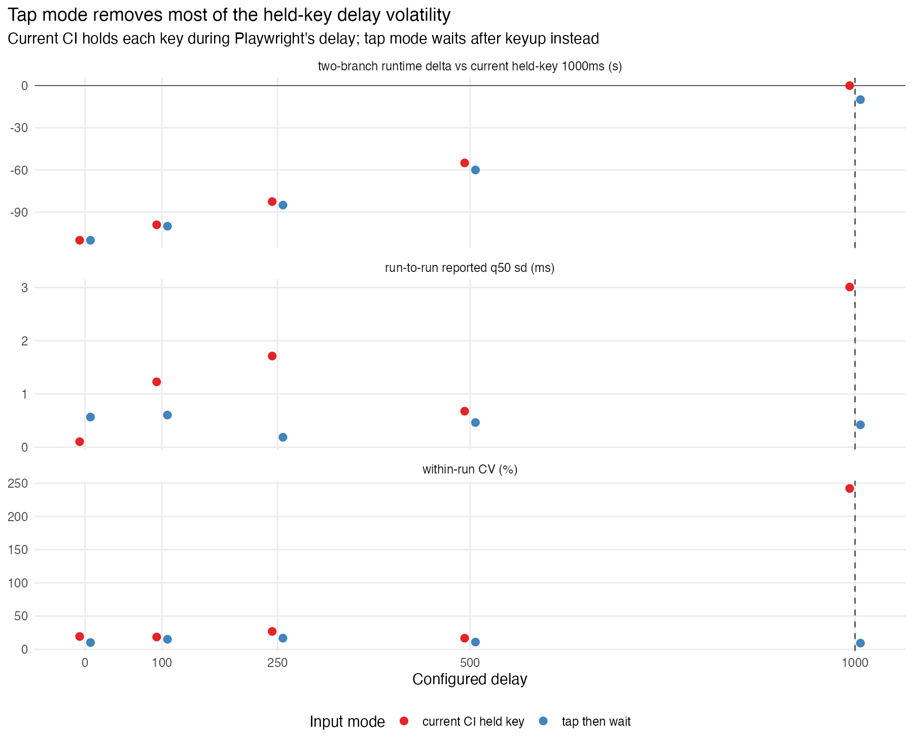

Selected held-key versus tap rows from the paired run:

| Input mode | Delay | Two-branch Typing wait | Reported q50 | Run-to-run q50 sd | Within-run CV |
| ---------- | ----: | ---------------------: | -----------: | ----------------: | ------------: |
| held key |   `0ms` |                   `0s` |      `8.72ms` |          `0.10ms` |         `19%` |
| tap then wait |   `0ms` |                   `0s` |      `8.87ms` |          `0.57ms` |         `10%` |
| held key | `250ms` |                  `28s` |     `32.99ms` |          `1.71ms` |         `27%` |
| tap then wait | `250ms` |                  `25s` |     `12.68ms` |          `0.19ms` |         `17%` |
| held key | `500ms` |                  `55s` |     `36.94ms` |          `0.68ms` |         `17%` |
| tap then wait | `500ms` |                  `50s` |     `12.10ms` |          `0.46ms` |         `11%` |
| held key | `1000ms` |                 `110s` |     `17.31ms` |          `3.01ms` |        `242%` |
| tap then wait | `1000ms` |                 `100s` |     `10.98ms` |          `0.42ms` |          `9%` |

The giant held-key `1000ms` CV comes from one retained `512ms` outlier in this
40-sample paired run. That outlier is exactly why the CI metric should be judged
by the reported q50 and repeated-run q50 variance, not only by the sample mean
or CV. Even by the reported-q50 view, tap mode is a material metric change: it
removes most of the held-key/timer interaction and would need a baseline reset.
It is probably the better implementation if the intended benchmark is "pause
between human keypresses", but it should not be presented as a drop-in speedup
of the current held-key Typing metric.

In the original six-sample first-character run, the `0s` and `60s` p10-p90
bands do not overlap, so the effect is large relative to the observed
first-character volatility. The recorded setup duration also tracks the
configured wait plus about `1.6s` of editor setup work, so this is the intended
post-setup wait knob, not accidental extra time hidden elsewhere in the harness.

That is the part of the benchmark that start wait really changes. With a fresh
editor, reducing an artificial wait from `60s` to the default `0s` makes the
first typed character faster. Increasing the wait moves the first character
toward a slower idle plateau. The benchmark does not prove the hardware-level
cause of that plateau, but the shape is consistent with recent setup activity
leaving the browser and machine in a more active state. After the first
character is discarded, the repeated key-hold samples return to the
delay-controlled regimes.

The component split is also useful:


The `keydown` trace slice stays tiny, roughly `0.1-0.2ms`. The change is mostly
in the `keypress` slice: p50 goes from `15.1ms` at `0s` to roughly
`21-23ms` at the long waits. `keyup` is usually sub-millisecond, although it is
around `1.9ms` in the `30s` and `60s` rows. So the start-wait effect is not a
measurement bookkeeping artifact from waiting before the first `keydown`; it is
showing up inside the measured browser event work for the first input.

The stronger check is to type several characters after the same start wait and
summarize by character position. This run used a fresh large-post editor,
`BENCHMARK_DELAYS_MS=1300`, 8 rounds, 4 measured characters per fresh editor, no
throwaway sample, and start waits of `0s`, `10s`, and `60s`.


Large-post p50s by character position:

| Start wait | Sample 1 | Sample 2 | Sample 3 | Sample 4 |
| ---------- | -------: | -------: | -------: | -------: |
| `0s`       | `16.3ms` | `26.7ms` | `25.2ms` | `26.2ms` |
| `10s`      | `19.4ms` | `26.5ms` | `26.0ms` | `24.5ms` |
| `60s`      | `22.0ms` | `26.0ms` | `23.7ms` | `25.2ms` |

This rules out a broad "longer start wait changes the whole benchmark" story.
The first character is start-wait-sensitive. The next three characters are
already in the ordinary `1300ms` held-key slow regime regardless of whether the
run started immediately or after a minute. In other words, adding a long
pre-typing wait mainly changes what happens before the first measured input; it
does not change the repeated-key artifact that the main benchmark is measuring
after throwaways.

I also ran first-character controls for an empty Gutenberg editor and for the
native `contenteditable` timer page. These used the same `1300ms` held-key first
character, 8 fresh setups per setting, no throwaway, and start waits of `0s`,
`10s`, and `60s`.


First-character p50s by scenario:

| Scenario | `0s` wait | `10s` wait | `60s` wait | `0s -> 60s` |
| -------- | --------: | ---------: | ---------: | ----------: |
| Native `contenteditable` | `0.31ms` | `0.57ms` | `0.58ms` | `+0.27ms` |
| Gutenberg empty post | `6.3ms` | `9.1ms` | `10.9ms` | `+4.6ms` |
| Gutenberg large post | `16.3ms` | `19.4ms` | `22.0ms` | `+5.7ms` |

That disconfirms a pure browser, Playwright, or trace-accounting explanation.
The trivial native page has a detectable but tiny idle-start effect. Gutenberg's
editor path amplifies it, and the large-post fixture starts from a much higher
absolute latency than the empty editor. The benchmark still does not isolate the
hardware/browser mechanism behind the idle slowdown; plausible contributors
include colder CPU state, browser scheduling state, JIT/cache state, or a mix of
those. The important benchmark conclusion is narrower and better supported: a
long pre-start wait changes first-input coldness in Gutenberg, while retained
repeated-key samples remain controlled mostly by the key-hold/timer interaction.

Finally, I traced the large-post first input at `0s` and `60s` with RichText,
data-store, and event-listener instrumentation enabled. This trace is deliberately
heavier than the normal benchmark, so the absolute latencies are not comparable
to the uninstrumented runs above. It is still useful for within-trace attribution:
both waits run through the same source-level path, but the long-wait path spends
more time in the same RichText/data batch.


Selected large-post source-span p50s:

| Component | `0s` wait | `60s` wait | Delta | Count |
| --------- | --------: | ---------: | ----: | ----: |
| Browser EventDispatch latency | `24.9ms` | `33.7ms` | `+8.8ms` | |
| Browser `keypress` trace slice | `24.0ms` | `31.9ms` | `+7.8ms` | |
| `RichText` `onInput` total | `11.8ms` | `15.6ms` | `+3.8ms` | |
| `RichText` `registry.batch` | `11.4ms` | `14.9ms` | `+3.6ms` | |
| Data `registry.batch` root | `11.4ms` | `14.9ms` | `+3.6ms` | |
| `core/block-editor` subscribers | `6.7ms` | `8.5ms` | `+1.9ms` | `4497 -> 4497` |
| `useSelect.onChange` | `4.5ms` | `5.3ms` | `+0.9ms` | `4542 -> 4542` |
| `useSelect.mapSelect` | `1.9ms` | `2.3ms` | `+0.5ms` | `714 -> 714` |
| Browser `keyup` trace slice | `0.7ms` | `2.0ms` | `+1.3ms` | |


The counted fanout sizes are unchanged. The long wait does not create a new
class of work or cause thousands of extra `useSelect` callbacks. Instead, the
same thousands of callbacks and the same `registry.batch` path take longer after
the editor has been idle. The source spans account for a substantial part of the
extra measured `keypress` slice, but not all of it; the remainder is likely in
uninstrumented React/browser work plus the overhead of the tracing itself. That
is as far as this benchmark can go without hardware-level CPU frequency/cache
instrumentation or lower-overhead browser internals tracing.

To test whether that is really an idle-state effect, I added a benchmark-only
pre-typing warmup. It runs after the configured post-setup wait but before
browser tracing and before the measured keypress. The current warmup mode is a
browser-main-thread busy loop, controlled by
`BENCHMARK_PRE_TYPE_WARMUP_MODE=main-thread-busy-loop` and
`BENCHMARK_PRE_TYPE_WARMUP_MS`. This is not meant to model a user action; it is
a causality probe for the state of the browser/editor immediately before the
first input.


Pre-typing warmup p50s:

| Configuration | p50 | p10-p90 | `keypress` p50 |
| ------------- | --: | ------: | --------------: |
| `0s` wait | `15.9ms` | `13.7-17.3ms` | `15.1ms` |
| `0s + 1000ms` warmup | `18.5ms` | `14.9-21.6ms` | `17.6ms` |
| `60s` wait | `23.1ms` | `22.2-25.0ms` | `21.2ms` |
| `60s + 50ms` warmup | `18.3ms` | `18.0-20.2ms` | `16.6ms` |
| `60s + 100ms` warmup | `18.8ms` | `18.1-19.3ms` | `16.5ms` |
| `60s + 250ms` warmup | `19.1ms` | `18.4-20.1ms` | `17.0ms` |
| `60s + 500ms` warmup | `18.6ms` | `18.3-19.5ms` | `16.7ms` |
| `60s + 1000ms` warmup | `18.2ms` | `18.0-19.3ms` | `16.4ms` |


This does not say "busy-loop before typing is good"; the `0s + 1000ms` warmup
control is slower than the plain `0s` wait. The cleaner comparison is with equal
immediate pre-typing work: after a `1000ms` main-thread warmup, `0s` and `60s`
start waits are effectively the same (`18.5ms` vs. `18.2ms`). That strongly
supports the narrower causal claim: the first-character slowdown from increasing
start wait is mostly about the browser/editor state immediately before input,
not the absolute elapsed time since editor setup.

The dose-response shape is especially useful. The difference between `60s` with
no warmup and `60s + 50ms` has no p10-p90 overlap in this run: `22.2-25.0ms`
versus `18.0-20.2ms`. Additional warmup time from `100ms` to `1000ms` does not
produce a clear monotonic improvement; those p50s all sit in the `18.2-19.1ms`
band. That is more consistent with crossing out of an idle/cold state quickly
than with a proportional amount of useful work being done before typing. It also
disconfirms a story where the long start wait permanently changes Gutenberg
state: a tiny amount of immediate main-thread activity changes the result
without changing the document, block tree, or measured key sequence.

A placement check is the cleanest falsification of an "absolute elapsed time"
story. I added `BENCHMARK_SETTLE_BEFORE_EDITOR_SETUP_MS` and ran the same fresh
large-post first-character check with a `60s` wait before editor setup, then no
post-setup wait. That means the wall-clock time from the run starting to the
first measured key is still long, but the editor setup activity happens after
the idle interval and immediately before typing.

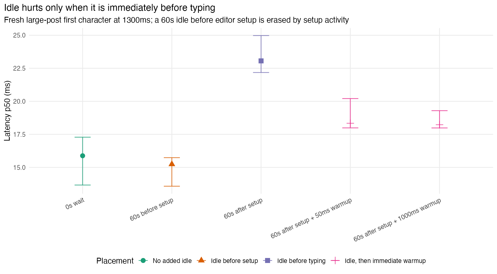

Start-wait placement p50s:

| Placement | p50 | p10-p90 | `keypress` p50 |
| --------- | --: | ------: | --------------: |
| `0s` wait | `15.9ms` | `13.7-17.3ms` | `15.1ms` |
| `60s` before setup | `15.2ms` | `13.6-15.7ms` | `14.6ms` |
| `60s` after setup | `23.1ms` | `22.2-25.0ms` | `21.2ms` |
| `60s` after setup + `50ms` warmup | `18.3ms` | `18.0-20.2ms` | `16.6ms` |
| `60s` after setup + `1000ms` warmup | `18.2ms` | `18.0-19.3ms` | `16.4ms` |

This disconfirms the idea that the first-character slowdown comes from total
elapsed time since the benchmark process, test, or setup sequence began. A `60s`
idle before editor setup lands on the same distribution as the `0s` control.
The slowdown appears only when the editor/browser sit idle immediately before
the first measured input. A short main-thread warmup after that idle interval
partially recovers the result, and a full editor setup after that idle interval
recovers it completely in this run.

The interpretation is conservative: increasing the pre-run settle time is not a
fix for this benchmark's main artifacts. It mainly changes the first character
after a fresh setup. Keeping at least one throwaway sample per delay remains
important, and changing the throwaway policy can bias results more than changing
the pre-typing wait for the retained repeated-key measurements.

## Where The 1000ms Cliff Comes From

The cliff comes from this code:

```js
// packages/block-editor/src/components/rich-text/use-mark-persistent.js
if ( previousTextRef.current !== value.text ) {
	const timeout = window.setTimeout( () => {
		__unstableMarkLastChangeAsPersistent();
	}, 1000 );
	previousTextRef.current = value.text;
	return () => {
		window.clearTimeout( timeout );
	};
}
```

That hook is used by RichText. For text input, it delays creating a persistent
undo level until there has been one second without input. The relevant state then
flows through:

-   `MARK_LAST_CHANGE_AS_PERSISTENT` in
    `packages/block-editor/src/store/actions.js`;
-   `withPersistentBlockChange()` in
    `packages/block-editor/src/store/reducer.js`;
-   `isLastBlockChangePersistent()` in
    `packages/block-editor/src/store/selectors.js`;
-   `useBlockSync()` in
    `packages/block-editor/src/components/provider/use-block-sync.js`, which sends
    persistent changes through `onChange` and non-persistent changes through
    `onInput`.

The `1000ms` point is controlled by the timer, but the current traces do not
prove the full internal reason that the following input event becomes shorter.
Below the boundary, for example at `990ms`, each next character usually arrives
before the persistence timeout fires. The RichText effect cleanup cancels the
old timeout, so the action sequence stays as consecutive transient text input
updates.

At `1000ms`, Playwright's normal `keyboard.type( ..., { delay } )` has held the
previous key down for roughly one second before sending `keyup`, and the next
`keydown` follows almost immediately. That gives the RichText timeout just enough
room to fire between synthetic characters. The timeout dispatches
`MARK_LAST_CHANGE_AS_PERSISTENT`, so the action sequence becomes
`UPDATE_BLOCK_ATTRIBUTES -> MARK_LAST_CHANGE_AS_PERSISTENT -> UPDATE_BLOCK_ATTRIBUTES`
instead of `UPDATE_BLOCK_ATTRIBUTES -> UPDATE_BLOCK_ATTRIBUTES`.

So the drop is not evidence that the persistence timer makes Gutenberg
intrinsically faster. It is at least partly an accounting problem in an
event-only metric. The benchmark's latency value is the sum of Chromium
`EventDispatch` durations for the key's `keydown`, `keypress`, and `keyup`
events. A timer callback is a different browser task, so timer work is not
included in that key-event number even if the timer was scheduled by the
previous character.

That means the trace timestamps are not wrong. The measured key event really is
shorter at `1000ms`; the problem is interpreting that event-only slice as the
whole cost of the character cycle. In the focused action trace, the `1000ms`
row has an event-only p50 of `10.374ms`, but the persistence action that fired
inside the preceding key hold had median duration around `15.8ms`. Adding those
two pieces gives about `26.2ms`, which is essentially the same scale as the
event-only p50s at `970ms` (`26.252ms`) and `990ms` (`25.829ms`).

The normal timer callback does real work because it dispatches
`MARK_LAST_CHANGE_AS_PERSISTENT`. That wakes the block-editor data store and
subscribers, and `useBlockSync()` has explicit code for the case where the blocks
did not change in the current action but the previous block change has become
persistent. A later intervention shows that this explanation was too specific:
replacing the marker with `stopTyping(); startTyping()` also creates the
`1000ms` / `1010ms` low EventDispatch band. The common proven property is a
timer-side block-editor subscriber fanout before the next key, not the marker
action by itself.

Since that timer task happens before the next `keydown`, its own work is outside
the next key's `EventDispatch` slices. The later source-level traces are
consistent with a timer-side fanout/accounting split, but they do not prove the
lower-level cause of the smaller following input slice: in the large-post
key-held run, RichText `registry.batch()` median time drops from about `10.5ms`
at `990ms` to `6.5ms` at `1000ms`, and the input-matched data batch drops from
about `23.4ms` to `14.2ms`.

The action trace shows the boundary directly. This version of the graph is a
per-delay timing diagram, not an absolute wall-clock timeline:

-   the gray bar is the artificial Playwright key hold, from the previous
    `keydown` to its `keyup`;
-   the dashed vertical line is the `1000ms` RichText persistence timer;
-   the diamond is the next `keydown`, where the benchmark's next measured
    keypress dispatch begins;
-   the circle is the persistence timer callback;
-   the triangle is the text update action for the next input.


In the focused action run:

|    Delay |        p50 | What happened                                                          |
| -------: | ---------: | ---------------------------------------------------------------------- |
|  `970ms` | `26.252ms` | no between-key persistence marker; the next input clears the old timer |
|  `980ms` | `25.068ms` | no between-key persistence marker; the next input clears the old timer |
|  `990ms` | `25.829ms` | no between-key persistence marker; the next input clears the old timer |
| `1000ms` | `10.374ms` | the persistent marker fires during the held-key interval               |
| `1010ms` | `12.019ms` | the persistent marker fires during the held-key interval               |
| `1100ms` | `12.667ms` | persistent between keys                                                |
| `1110ms` | `12.660ms` | persistent between keys                                                |
| `1150ms` | `14.172ms` | persistent between keys, but latency begins climbing                   |
| `1180ms` | `19.570ms` | persistent between keys, high/transition                               |
| `1190ms` | `21.147ms` | persistent between keys, near high plateau                             |
| `1200ms` | `20.959ms` | persistent between keys, high/transition                               |
| `1300ms` | `22.628ms` | persistent between keys, high plateau                                  |

The important visual comparison is `990ms` versus `1000ms`. At `970-990ms`, the
next keydown arrives at about the timer boundary, but the next input clears the
previous timer before the callback has run between keys. The triangle is red:
the action trace observed the next text update before the persistence marker.

At `1000ms` and `1010ms`, the circle appears before the diamond. That means the
timer callback ran while Playwright was still holding the previous synthetic key,
before the next measured keypress began. The previous input has been marked
persistent before the next input starts. The next triangle is orange: the
following text update was observed after the timer marker. In these traces, that
ordering correlates with a much smaller measured event-only latency. The data
does not yet prove whether the following input is shorter because of persistent
classification itself, because the inserted marker changes subscriber state, or
because of some lower-level React/data scheduling consequence.

This only happens in the key-held benchmark because the gray bar is long. In the
complete-keypress-then-wait mode, `keyup` happens immediately and the wait occurs
after the key is no longer down. The same one-second timer can still fire, but it
fires after a completed keypress and ordinary idle wait, not inside a long
synthetic key hold immediately before the next keydown. That different event
ordering does not create the same measured cliff.

The same data can be reduced to three repeated p50 timelines:


These timelines show three synthetic key cycles for each regime. They use p50
offsets, so each row is a typical repeated cycle rather than one noisy sample.
The gray bar is the wall-clock interval where Playwright is holding the key down,
but the reported benchmark value is not the length of that bar. The reported
value is the event-only p50: the sum of `keydown`, `keypress`, and `keyup`
`EventDispatch` durations for the key.

The three regimes are:

-   **Below 1s (`990ms`).** Each new input arrives before the RichText timer has
    run between measured keys. The text update leaves the change transient, and
    the benchmark reports the full slow event path: `25.8ms` p50.
-   **At the drop (`1000ms`).** The timer runs while the synthetic key is still
    held and before the next measured keydown. The key-event p50 is only
    `10.4ms`, but the timer task immediately before it is another `15.9ms` p50
    outside the event metric. This shows that the event-only number is not the
    whole character-cycle cost; it does not prove that identical work moved from
    one task to another.
-   **Above the drop (`1300ms`).** The timer still runs outside the measured key
    event, but the later key-held path is slow again: `22.6ms` event-only p50,
    plus a `15.7ms` timer task outside the metric. This is why the later plateau
    is a separate phenomenon from the first `990 -> 1000ms` accounting drop.

This establishes two separate facts and leaves one important mechanism open:

1. The one-second rich-text persistence timer controls the transition between
   `990ms` and `1000ms`: moving the timer moves the transition.
2. The later return to the high plateau is not caused by that same state
   transition, because the editor is already on the persistent path at `1150ms`,
   `1180ms`, `1190ms`, `1200ms`, and `1300ms`.
3. The current traces do not prove why the next input listener/dispatch span is
   smaller once the marker has run first.

## Timer Intervention

To test causality, the benchmark added a timer tracer/intervention mode. The
mode rewrites `setTimeout(..., 1000)` calls and records which callbacks were
rewritten. Source-map lookup for the repeated timer stack mapped the minified
frame back to
`packages/block-editor/src/components/rich-text/use-mark-persistent.js:29`.

I first rewrote the timer to `500ms`, then repeated the check at `230ms` and
`710ms`. The three runs rewrote 359 rich-text `1000ms` timers in total: 235 in
the dense `230ms` transition scan, 62 in the `500ms` run, and 62 in the `710ms`
run.


The low-latency band moved with the timer, and the original `1000ms` boundary
stopped being special in the intervention runs:

| Timer rewrite |    Delay |   n |        p50 |       mean |
| ------------: | -------: | --: | ---------: | ---------: |
|       `230ms` |  `220ms` |   8 | `36.268ms` | `34.812ms` |
|       `230ms` |  `230ms` |   8 | `24.091ms` | `23.876ms` |
|       `230ms` |  `260ms` |   8 | `10.902ms` | `11.188ms` |
|       `230ms` |  `280ms` |   8 | `10.821ms` | `10.820ms` |
|       `230ms` |  `330ms` |   8 | `14.110ms` | `14.209ms` |
|       `230ms` |  `430ms` |   8 | `37.959ms` | `37.294ms` |
|       `230ms` |  `990ms` |   8 | `35.248ms` | `33.889ms` |
|       `230ms` | `1000ms` |   8 | `34.287ms` | `31.301ms` |
|       `500ms` |  `490ms` |   8 | `19.939ms` | `19.323ms` |
|       `500ms` |  `500ms` |   8 | `12.077ms` | `12.105ms` |
|       `500ms` |  `510ms` |   8 | `11.686ms` | `11.904ms` |
|       `500ms` |  `600ms` |   8 | `11.345ms` | `11.292ms` |
|       `500ms` |  `700ms` |   8 | `18.052ms` | `18.022ms` |
|       `710ms` |  `700ms` |   8 | `36.629ms` | `36.090ms` |
|       `710ms` |  `710ms` |   8 | `18.005ms` | `18.323ms` |
|       `710ms` |  `720ms` |   8 | `11.096ms` | `11.266ms` |
|       `710ms` |  `810ms` |   8 | `14.397ms` | `13.966ms` |
|       `710ms` |  `910ms` |   8 | `35.809ms` | `34.766ms` |

This is the strongest evidence that the `~1000ms` cliff is not VM warmup or a
random browser scheduling artifact. Moving the timer moves the low-latency
window.

The exact transition is not a step function at the rewritten millisecond. The
timer callback has to fire, run the rich-text persistence work, and yield back
to the browser before the next measured keydown can start in the post-marker
ordering. That is why the `230ms` rewrite has mixed/partial points at
`230..250ms` and its cleanest low points at `260..330ms`, and why the `710ms`
rewrite has a mixed point at `710ms` followed by a clear low point at `720ms`.

The intervention runs should not be treated as production benchmarks. Wrapping
`setTimeout` can perturb scheduling. Their purpose is causal attribution.

## Firefox Check

Firefox cannot use the Chromium `EventDispatch` trace metric used for the main
Chrome plots. To check whether the same boundary exists there, I added a Firefox
project path and ran the benchmark with in-page event-listener timing. The graph
below measures the dispatch span of the editable element's `input` event
listeners, not Chromium trace slices.


Firefox shows the same qualitative transition, but the exact `1000ms` point is
mixed. The high regime is clear through `990ms`; `1000ms` contains both high and
low samples; `1005ms` is mostly low; `1010ms` and later are consistently low in
these runs.

|    Delay |   n |      p50 |      p10 |      p90 |     mean |
| -------: | --: | -------: | -------: | -------: | -------: |
|  `950ms` |  14 | `51.0ms` | `46.3ms` | `54.4ms` | `49.9ms` |
|  `970ms` |  14 | `53.5ms` | `51.0ms` | `56.7ms` | `52.9ms` |
|  `980ms` |  14 | `53.0ms` | `51.0ms` | `54.4ms` | `52.6ms` |
|  `990ms` |  14 | `52.5ms` | `50.3ms` | `55.7ms` | `52.7ms` |
|  `995ms` |  19 | `52.0ms` | `29.0ms` | `55.0ms` | `45.8ms` |
| `1000ms` |  33 | `48.0ms` | `20.2ms` | `54.8ms` | `39.9ms` |
| `1005ms` |  19 | `29.0ms` | `20.8ms` | `47.4ms` | `30.5ms` |
| `1010ms` |  33 | `21.0ms` | `20.0ms` | `28.0ms` | `22.7ms` |
| `1020ms` |  14 | `20.0ms` | `19.3ms` | `26.7ms` | `21.8ms` |
| `1030ms` |  14 | `22.0ms` | `20.0ms` | `30.4ms` | `24.2ms` |
| `1050ms` |  14 | `21.0ms` | `20.0ms` | `24.1ms` | `21.6ms` |

So the answer is "yes, with a caveat": Firefox has the same one-second boundary
effect, but with this listener-based metric the clean low band starts just after
the one-second mark rather than being cleanly centered on the exact `1000ms`
sample.

## Safari/WebKit Check

This uses Playwright WebKit with the Desktop Safari device profile and Safari
user agent. It is a Safari-engine check, not a manually-driven run in the
system Safari.app. Like Firefox, it cannot use Chromium `EventDispatch` trace
slices, so the metric below is the same input-event listener dispatch span used
for the Firefox check.


WebKit does show a drop at the one-second boundary, but it is much smaller than
Chrome's cliff and smaller than Firefox's transition. In these runs, the median
listener dispatch span is mostly `18..24ms` below `1000ms`, then mostly
`14..16ms` at and above `1000ms`. The WebKit listener timestamps also have more
near-zero dispatch spans than the Firefox run, so the p10 band is less
informative than the median.

|    Delay |   n |      p50 |     p10 |      p90 |     mean |
| -------: | --: | -------: | ------: | -------: | -------: |
|  `950ms` |  22 | `24.0ms` | `0.0ms` | `31.9ms` | `17.5ms` |
|  `970ms` |  25 | `20.0ms` | `0.0ms` | `30.0ms` | `14.8ms` |
|  `980ms` |  23 | `18.0ms` | `0.0ms` | `28.8ms` | `13.9ms` |
|  `990ms` |  21 | `18.0ms` | `0.0ms` | `28.0ms` | `15.4ms` |
|  `995ms` |  28 | `17.5ms` | `0.0ms` | `28.3ms` | `15.4ms` |
| `1000ms` |  47 | `14.0ms` | `0.0ms` | `18.4ms` | `11.3ms` |
| `1005ms` |  24 | `15.0ms` | `1.0ms` | `17.7ms` | `13.0ms` |
| `1010ms` |  39 | `16.0ms` | `0.0ms` | `19.0ms` | `13.7ms` |
| `1020ms` |  19 | `14.0ms` | `0.0ms` | `18.4ms` | `11.4ms` |
| `1030ms` |  17 | `15.0ms` | `0.0ms` | `16.0ms` | `12.2ms` |
| `1050ms` |  21 | `15.0ms` | `0.0ms` | `16.0ms` | `10.6ms` |

So the answer is "yes, but weakly": the one-second persistence boundary is
visible in WebKit/Safari-engine timing, but this run does not reproduce the
large Chrome drop. The likely interpretation is that the same Gutenberg
one-second timer boundary exists, while WebKit's dispatch/listener profile is
already relatively low before the boundary and therefore has less room to drop.

## Cross-Browser Timer Timeline

The Firefox and WebKit checks rule out the strongest "Chrome trace artifact"
interpretation. Chrome's `EventDispatch` slices are a Chrome-specific way to
account for the work, but the ordering problem is not Chrome-specific. It is a
Gutenberg timer race created by the benchmark's synthetic key hold.

I ran a fresh-editor diagnostic trace in Chrome/Chromium, Firefox, and
Playwright WebKit/Safari profile with in-page browser-event, listener, and timer
instrumentation. The plot below aligns each row to the previous input event. The
blue square is the `setTimeout( ..., 1000 )` scheduled by the block-editor
RichText persistence path. The blue tick is when that timer becomes eligible to
run. The green circle means the timer callback actually ran before the next
measured input; the red x means the next measured input cleared the timer before
the callback ran. The diamond and purple bar are the next measured input and its
input-listener dispatch span.


What the diagnostic trace proves:

1. A Gutenberg input schedules the rich-text persistence timer for `1000ms`
   later.
2. The benchmark is not doing "keypress, then wait"; it is holding the previous
   synthetic key down during the delay.
3. Near the one-second boundary, the browser event loop has two possible next
   tasks: the timer callback or the next keyboard/input work.
4. If the next input wins, Gutenberg clears and reschedules the timer before the
   callback runs.
5. If the timer wins, the callback dispatches
   `MARK_LAST_CHANGE_AS_PERSISTENT` before the current input begins.
6. In these traces, the timer-first rows have lower measured next-input listener
   spans.

What the diagnostic trace does not prove is just as important: it does not prove
that identical work moved from the input task into the timer task, and it does
not identify the exact lower-level callback, selector, React commit, or
subscriber state change that makes the following input span smaller.

The diagnostic run shows that ordering directly:

| Browser         |    Delay | Timer before input | Input span p50 |
| --------------- | -------: | -----------------: | -------------: |
| Chrome/Chromium |  `990ms` |              `0/7` |       `30.7ms` |
| Chrome/Chromium | `1000ms` |              `7/7` |       `19.8ms` |
| Chrome/Chromium | `1010ms` |              `7/7` |       `16.9ms` |
| Firefox         |  `990ms` |              `2/7` |       `37.0ms` |
| Firefox         | `1000ms` |              `7/7` |       `27.5ms` |
| Firefox         | `1010ms` |              `7/7` |       `22.0ms` |
| WebKit/Safari   |  `990ms` |              `1/7` |       `22.0ms` |
| WebKit/Safari   | `1000ms` |              `7/7` |       `12.5ms` |
| WebKit/Safari   | `1010ms` |              `7/7` |       `15.5ms` |

The `990ms` rows are not perfectly pure because the instrumentation itself adds
some overhead and jitter; Firefox had two of seven retained cycles where the
timer slipped in before the next input, and WebKit had one. But the median
ordering is still the same: below the boundary, the measured input usually
clears the timer; at and above the boundary, the timer callback runs first in
all retained cycles.

This explains how Firefox can show the same qualitative dip even though it has no
Chromium `EventDispatch` trace. The application-level ordering is shared:
Gutenberg's `1000ms` timer sometimes runs before the next measured input and
sometimes gets cleared by that input. Chrome `EventDispatch` measures one
accounting window around that ordering change; the Firefox/WebKit listener
traces measure another. Both metrics show a smaller next-input span when the
timer ran first, but that is still an observation, not a complete mechanism.

This diagnostic trace is for causality, not for absolute score comparison. The
in-page wrappers perturb timing, and the measured spans here should not replace
the lower-overhead sweep plots.

## Reasoning Audit

The conservative explanation is:

1. The code creates a `1000ms` RichText persistence timer after text input.
2. Playwright's delayed typing holds a key down during the delay instead of
   completing a keypress and then sleeping.
3. Around `1000ms`, the timer callback and the next input can race.
4. The traces show two orderings: input-first, where the input clears the timer,
   and timer-first, where `MARK_LAST_CHANGE_AS_PERSISTENT` runs before the next
   input.
5. The measured next-input/event span is smaller in timer-first rows.
6. Rewriting the timer to `230ms`, `500ms`, and `710ms` moves the low-latency
   band, so the timer controls the boundary.

The earlier stronger explanation failed this audit:

-   A Linus Torvalds-style code review would reject "the same work moved
    earlier" because the traces show separate tasks and action ordering, not
    identity of work.
-   A Kyle Kingsbury-style measurement review would reject "persistent state
    makes the next input faster" because that is a causal claim without an
    isolating intervention.
-   A Dan Luu-style benchmark review would reject treating the event-only value
    as user latency because timer tasks, key holds, browser scheduling, and
    subscriber fanout all sit outside or around that accounting window.

The useful falsification tests are narrower, and the later sections now include
several of them:

-   replace the timer callback with no-op, cheap action, pure busy-wait, one-sided
    typing-state changes, a raw unknown store action, and non-marker
    subscriber-fanout interventions;
-   trace high-fanout `useSelect` subscribers in both the timer task and the
    following input task;
-   compute a broader full-cycle wall-time metric, from one input start through
    the timer task and the next input end. The paired metric below already adds
    timer callback cost to each retained key, but it intentionally does not
    count idle waiting time.

## Marker Interventions

I then ran falsification tests against the timer explanation. The first two
kept the `1000ms` callback but replaced the bound
`__unstableMarkLastChangeAsPersistent()` function with either a no-op or
`__unstableMarkNextChangeAsNotPersistent()`. Later audits added sharper probes:

1. run the real marker, then immediately dispatch
   `__unstableMarkNextChangeAsNotPersistent()`;
2. replace the marker with a raw unknown `core/block-editor` action dispatched
   through the registry's underlying store, to test whether a dispatch with no
   state change and no semantic Gutenberg effect is enough;
3. replace the marker with `20ms` and `40ms` busy waits, to test whether merely
   occupying the timer task is enough;
4. replace the marker with restored non-typing state toggles:
   `toggleSelection( false ); toggleSelection( true )`,
   `setTemplateValidity( false ); setTemplateValidity( true )`, and
   `toggleBlockHighlight( clientId, true ); toggleBlockHighlight( clientId,
   false )`;
5. replace the marker with `startTyping()` alone, which is effectively a no-op
   if the editor is already typing;
6. replace the marker with `stopTyping()` alone, which creates a real
   `core/block-editor` state change but leaves the next input to restart typing;
7. replace the marker with `stopTyping(); startTyping()`, which creates real
   block-editor subscriber fanout and restores `isTyping()` to its original
   value before the next key.


The targeted runs used the same delays, rounds, and sample counts.

| Timer callback                         |    Delay |   n | Latency p50 | `keypress` p50 |
| -------------------------------------- | -------: | --: | ----------: | -------------: |
| normal marker                          |  `990ms` |  30 |    `25.4ms` |       `24.3ms` |
| normal marker                          | `1000ms` |  30 |    `11.3ms` |       `11.0ms` |
| normal marker                          | `1010ms` |  30 |    `10.9ms` |       `10.4ms` |
| normal marker                          | `1300ms` |  30 |    `25.5ms` |       `24.5ms` |
| marker no-op                           | `1000ms` |  30 |    `22.0ms` |       `21.1ms` |
| marker no-op                           | `1010ms` |  30 |    `17.2ms` |       `16.6ms` |
| mark next not persistent               | `1000ms` |  30 |    `33.6ms` |       `32.7ms` |
| mark next not persistent               | `1010ms` |  30 |    `30.7ms` |       `29.7ms` |
| mark last, then force next transient   |  `990ms` |  30 |    `24.5ms` |       `23.5ms` |
| mark last, then force next transient   | `1000ms` |  30 |    `11.7ms` |       `11.1ms` |
| mark last, then force next transient   | `1010ms` |  30 |    `11.4ms` |       `11.0ms` |
| mark last, then force next transient   | `1300ms` |  30 |    `24.6ms` |       `23.4ms` |
| busy wait 20ms                         | `1000ms` |  30 |    `17.7ms` |       `17.1ms` |
| busy wait 20ms                         | `1010ms` |  30 |    `17.9ms` |       `17.3ms` |
| busy wait 40ms                         | `1000ms` |  30 |    `16.1ms` |       `15.7ms` |
| busy wait 40ms                         | `1010ms` |  30 |    `16.1ms` |       `15.6ms` |
| toggle selection                       | `1000ms` |  30 |    `14.6ms` |       `14.1ms` |
| toggle selection                       | `1010ms` |  30 |    `14.6ms` |       `14.2ms` |
| toggle template validity               | `1000ms` |  30 |    `14.6ms` |       `14.2ms` |
| toggle template validity               | `1010ms` |  30 |    `15.6ms` |       `15.2ms` |
| toggle block highlight                 | `1000ms` |  30 |    `14.4ms` |       `14.0ms` |
| toggle block highlight                 | `1010ms` |  30 |    `14.0ms` |       `13.7ms` |
| start typing                           | `1000ms` |  30 |    `24.4ms` |       `23.3ms` |
| start typing                           | `1010ms` |  30 |    `19.5ms` |       `18.8ms` |
| stop typing                            | `1000ms` |  30 |    `26.8ms` |       `26.5ms` |
| stop typing                            | `1010ms` |  30 |    `27.2ms` |       `26.7ms` |
| stop/start typing                      |  `990ms` |  30 |    `24.7ms` |       `23.6ms` |
| stop/start typing                      | `1000ms` |  30 |    `11.0ms` |       `10.6ms` |
| stop/start typing                      | `1010ms` |  30 |    `10.8ms` |       `10.5ms` |
| stop/start typing                      | `1300ms` |  30 |    `24.3ms` |       `23.2ms` |

Splitting the same `1000ms` retained samples by browser key event makes the
location of the intervention effect explicit:


| Timer callback             |   n | Latency p50 | `keydown` p50 | `keypress` p50 | `keyup` p50 |
| -------------------------- | --: | ----------: | -------------: | --------------: | -----------: |
| normal marker              |  30 |    `11.3ms` |        `0.1ms` |        `11.0ms` |      `0.3ms` |
| marker no-op               |  30 |    `22.0ms` |        `0.4ms` |        `21.1ms` |      `0.5ms` |
| mark next not persistent   |  30 |    `33.6ms` |        `0.4ms` |        `32.7ms` |      `0.5ms` |
| busy wait 40ms             |  30 |    `16.1ms` |        `0.2ms` |        `15.7ms` |      `0.3ms` |
| toggle selection           |  30 |    `14.6ms` |        `0.2ms` |        `14.1ms` |      `0.2ms` |
| start typing               |  30 |    `24.4ms` |        `0.5ms` |        `23.3ms` |      `0.7ms` |
| stop typing                |  30 |    `26.8ms` |        `0.2ms` |        `26.5ms` |      `0.2ms` |
| stop/start typing          |  30 |    `11.0ms` |        `0.1ms` |        `10.6ms` |      `0.2ms` |

That disconfirms a large class of explanations. The difference is not
`keydown`, `keyup`, the release after the held key, or a missing key-release
measurement. The meaningful movement is in the measured `keypress` component.

I then reran a small `1000ms` probe with identical event-listener tracing for
normal marker, marker no-op, restored selection, and stop/start typing. This
corrects the wording above: the browser-trace component is labeled `keypress`,
but the DOM `keypress` listeners themselves are not where the time goes.


| Timer callback     | Benchmark `keypress` p50 | DOM `keypress` listeners | DOM `input` listeners | RichText `onInput` listener |
| ------------------ | -----------------------: | -----------------------: | --------------------: | --------------------------: |
| normal marker      |                 `12.1ms` |                  `0.0ms` |               `8.9ms` |                     `8.7ms` |
| marker no-op       |                 `19.8ms` |                  `0.0ms` |              `13.8ms` |                    `13.5ms` |
| toggle selection   |                  `9.7ms` |                  `0.0ms` |               `7.7ms` |                     `7.5ms` |
| stop/start typing  |                  `9.9ms` |                  `0.0ms` |               `7.5ms` |                     `7.4ms` |


This confirms that "keypress" is an accounting label for the measured
character-insertion slice, not evidence that Gutenberg's `keypress` callbacks
are expensive. The expensive event-listener callback is the actual DOM `input`
listener, and within that listener the p50-visible work is overwhelmingly
RichText's `rich-text.onInput.total` path. The secondary RichText input
transform listener is `0.1-0.2ms` p50. This also explains why the Firefox/WebKit
results can have the same qualitative dip even though the original explanation
was phrased in terms of Chrome `EventDispatch`: Gutenberg's input handler and
state history are changing; Chrome's trace just labels the measured slice in a
particular way.

This disconfirms several simple theories:

-   "Timer callback alone" is false. In the no-op run, the `1000ms` timers still
    fired before the following input, but the following input did not enter the
    normal `~11ms` fast band.
-   "Any real timer-side action is enough" is false. Replacing the marker with
    `__unstableMarkNextChangeAsNotPersistent()` still ran a real action from
    the timer callback, but the action was near-zero-cost and the following
    input stayed slow.
-   "Any raw store dispatch is enough" is false. The `raw unknown action`
    diagnostic dispatches an unknown action directly to the `core/block-editor`
    Redux store from the timer callback. The reducer returns the same root state,
    `rootSubscribe` sees no effective state change, the callback records no
    listener fanout, and the following input stays with the no-op slow band in
    the trace-heavy run.
-   "Timer-task duration is enough" is false. A `20ms` busy wait drops the
    `1000ms` p50 from the no-op's `22.0ms` to `17.7ms`, and a `40ms` busy wait
    drops it to `16.1ms`, but neither reaches the normal marker or stop/start
    `~11ms` band. Timer duration and browser task scheduling appear to
    contribute, but they do not explain the full effect.
-   "Typing state is the only relevant state" is false. The restored selection,
    template-validity, and block-highlight toggles all leave `isTyping` and
    `isLastBlockChangePersistent()` unchanged at the callback boundary, but they
    still lower the `1000ms` p50 to about `14-15ms`.
-   "Any restored block-editor state toggle is enough for the full low band" is
    also false. Those generic toggles move most of the way from no-op to
    stop/start, but they do not match the `~11ms` band.
-   "`startTyping()` dispatch is enough" is false. In these runs the editor was
    already typing before the callback, so `startTyping()` did no meaningful
    state transition and the `1000ms` p50 stayed slow at `24.4ms`.
-   "One state-changing `core/block-editor` fanout is enough" is false.
    `stopTyping()` alone changes `isTyping` from true to false in the timer
    callback, but then the next measured input has to dispatch `startTyping()`
    to return to the normal typing state. That case stays slow at `26.8ms`.
-   "The real persistence marker is uniquely necessary" is false. Replacing it
    with `stopTyping(); startTyping()` also produced the `1000ms` / `1010ms`
    low EventDispatch band.
-   "`onChange` is necessary" is false. The stop/start run keeps the following
    retained input on the `onInput` path in the span trace and is still fast.

The action trace also corrects a subtler mistake. The normal marker action is
not important only when it visibly flips `isLastBlockChangePersistent()`. In the
normal targeted run, all retained `1000ms`, `1010ms`, and `1300ms` delay runs
had marker actions before the next input, but those marker actions usually did
not change the visible `isPersistent` / `isTyping` selector state. One proven
effect is that they create a real block-editor subscriber pass. The busy-wait
runs prove that wall-clock time spent in the timer task can only explain part of
the drop. The `startTyping()` run proves that dispatching a no-op-ish typing
action is not enough. The `stopTyping()` run proves that a single state-changing
fanout is not enough if it leaves the next input to repair the state. In the
stop/start run, the timer callback changes `isTyping` from true to false and
then back to true before the next key, with no persistent-marker state change,
and that is the non-marker probe that matches the full low band.

The dense timer-to-key gap probe makes that statement narrower. This run used
one diagnostic round with six retained samples per delay, delays
`1000..1100ms` in `10ms` steps plus `1150ms`, `1200ms`, and `1300ms`, and the
same timer/data tracing used by the paired action analysis.


Selected p50s:

| Timer callback        |    Delay | Marker to keydown | Event-only p50 | Timer callback p50 | Timer-inclusive p50 | Keydown state       |
| --------------------- | -------: | ----------------: | -------------: | -----------------: | ------------------: | ------------------- |
| normal marker         | `1010ms` |          `35.2ms` |       `10.5ms` |           `14.6ms` |            `25.3ms` | persistent, typing  |
| normal marker         | `1100ms` |         `100.8ms` |       `12.3ms` |           `16.3ms` |            `28.8ms` | persistent, typing  |
| normal marker         | `1200ms` |         `202.5ms` |       `23.0ms` |           `14.6ms` |            `38.0ms` | persistent, typing  |
| normal marker         | `1300ms` |         `303.8ms` |       `23.0ms` |           `15.0ms` |            `37.1ms` | persistent, typing  |
| marker no-op          | `1000ms` |           `3.3ms` |       `22.4ms` |            `0.0ms` |            `22.6ms` | mostly transient    |
| marker no-op          | `1030ms` |          `30.2ms` |       `14.6ms` |            `0.0ms` |            `14.6ms` | transient, typing   |
| stop/start typing     | `1010ms` |          `43.8ms` |        `9.3ms` |           `20.8ms` |            `33.0ms` | transient, typing   |
| stop/start typing     | `1200ms` |         `200.5ms` |       `19.2ms` |           `22.7ms` |            `42.7ms` | transient, typing   |
| stop/start typing     | `1300ms` |         `303.1ms` |       `22.7ms` |           `20.4ms` |            `43.0ms` | transient, typing   |

This disconfirms two tempting explanations. First, the normal marker run is in
the same coarse selector state at keydown (`isLastBlockChangePersistent() ===
true` and `isTyping() === true`) at `1010ms`, `1200ms`, and `1300ms`, but the
next input is low only when the timer callback is close to that keydown. Coarse
state at keydown is therefore not sufficient. Second, persistence is not
necessary: `stopTyping(); startTyping()` has `isLastBlockChangePersistent() ===
false` at the following keydown for nearly all retained rows and still matches
the low band while the marker-to-key gap is short.

It also limits the timer-ordering theory. The no-op callback can run just a few
milliseconds before the next keydown and still does not reproduce the
normal-marker or stop/start `~10-11ms` band. There is some partial movement in
the no-op scan around `1010..1030ms`, which is consistent with the busy-wait
results: scheduling and nearby browser-task boundaries contribute. This scan
shows that a short zero-duration no-op is insufficient; the later task-end probe
shows that the stronger "effective block-editor state change is required" claim
is false.

This does not prove the lower-level reason for the decay. The honest statement is
that the event-only metric is sensitive to recent timer-side activity before
Gutenberg's input path, not that the same work literally moved from one key event
into the timer task. The timer-inclusive column stays high, and by
`1200..1300ms` it is much worse than the event-only low band.

I then ran a stronger causality check: keep the Playwright key hold fixed at
`1300ms`, but rewrite Gutenberg's `1000ms` timer to fire at different times
inside that same hold.


Selected p50s:

| Timer callback    | Timer setting | Marker to keydown | Event-only p50 | Timer callback p50 | Timer-inclusive p50 |
| ----------------- | ------------: | ----------------: | -------------: | -----------------: | ------------------: |
| normal marker     |      `1000ms` |         `303.5ms` |       `24.5ms` |           `14.3ms` |            `39.1ms` |
| normal marker     |      `1100ms` |         `203.4ms` |       `23.5ms` |           `14.0ms` |            `37.7ms` |
| normal marker     |      `1200ms` |         `100.7ms` |       `12.6ms` |           `14.5ms` |            `27.5ms` |
| normal marker     |      `1250ms` |          `50.0ms` |       `10.7ms` |           `14.6ms` |            `24.7ms` |
| normal marker     |      `1270ms` |          `44.0ms` |       `10.1ms` |           `11.9ms` |            `24.2ms` |
| marker no-op      |      `1250ms` |          `53.4ms` |       `24.6ms` |            `0.1ms` |            `24.6ms` |
| stop/start typing |      `1250ms` |          `50.3ms` |        `9.6ms` |           `20.7ms` |            `30.4ms` |

This confirms three things more cleanly than the gap scan alone:

1. The later `1300ms` high plateau is not caused by the key being held for
   `1300ms` by itself. The exact same requested key hold becomes fast again when
   the real marker is moved close to the next key.
2. The effect is not tied to the absolute `1000ms` timer value. Moving the timer
   moves the low band inside a fixed `1300ms` hold.
3. The close timer boundary is not sufficient by itself. The `1250ms` no-op
   callback fired about `53ms` before keydown and stayed slow; the `1250ms`
   stop/start callback fired about `50ms` before keydown and was fast.

At this point the strongest supported statement was that a short effective
block-editor fanout is sufficient, and that a short zero-duration no-op callback
is not.

I then tested whether "effective Gutenberg fanout" is actually required, or
whether a long timer task ending close to the next key can also perturb the
event-only measurement. The new intervention modes are deliberately artificial:

-   `noop-then-busy-wait-150`: do not dispatch a meaningful Gutenberg action;
    just hold the timer task open for `150ms`.
-   `busy-wait-20` and `busy-wait-40`: hold the timer task open for shorter
    pure-JS intervals and schedule them to end near the same following keydown.
-   `worker-busy-wait-150`: start a Web Worker from the timer callback and have
    the worker spin for `150ms`; the timer callback itself returns quickly and
    the worker completion is recorded separately.
-   `worker-busy-wait-150-no-message`: same worker CPU spin, but the worker
    closes itself without posting a completion message back to the main thread.
-   `worker-busy-wait-20-no-message`, `worker-busy-wait-40-no-message`, and
    `worker-busy-wait-80-no-message`: shorter no-message worker CPU spins, each
    scheduled to end about `50ms` before keydown.
-   `worker-delay-150`: worker waits for `150ms` and posts a message back, but
    does no CPU spin.
-   `worker-delay-150-no-message`: worker waits for `150ms` and closes itself
    without CPU spin or a main-thread completion message.
-   `external-cpu-150-no-message`: ask Playwright's Node process to spawn a
    short-lived child process that burns CPU for `150ms`; the page records the
    expected CPU window but receives no completion message.
-   `external-cpu-20-no-message`, `external-cpu-40-no-message`, and
    `external-cpu-80-no-message`: shorter spawn-per-timer external child-process
    CPU burns, scheduled to end about `50ms` before keydown by the page's
    expected-duration accounting.
-   `external-delay-150-no-message`: spawn the same kind of short-lived child
    process, but have it wait `150ms` and exit without intentional CPU work.
-   `external-persistent-cpu-20-no-message`,
    `external-persistent-cpu-40-no-message`,
    `external-persistent-cpu-80-no-message`, and
    `external-persistent-cpu-150-no-message`: keep a Node child process alive
    before typing starts, then send it a CPU-burn command from the timer
    callback. This removes child-process startup from the timer boundary.
-   `external-persistent-delay-150-no-message`: send a prestarted child process a
    no-CPU delay command, to test whether IPC and child lifetime are enough.
-   `external-background-cpu-noop`: keep a child process burning CPU continuously
    before typing starts; the rich-text timer callback itself is still a no-op.
-   `external-background-cpu-2-noop`, `external-background-cpu-4-noop`, and
    `external-background-cpu-8-noop`: keep two, four, or eight child processes
    burning CPU continuously before typing starts; the rich-text timer callback
    itself is still a no-op.
-   `external-background-nice-cpu-noop`: keep one `nice +20` child process
    burning CPU continuously before typing starts; the rich-text timer callback
    itself is still a no-op.
-   `external-background-taskpolicy-cpu-noop`,
    `external-background-taskpolicy-cpu-4-noop`, and
    `external-background-taskpolicy-cpu-8-noop`: keep one, four, or eight macOS
    `taskpolicy -b` child processes burning CPU continuously before typing
    starts; the rich-text timer callback itself is still a no-op.
-   `external-background-taskpolicy-utility-cpu-noop`,
    `external-background-taskpolicy-qos-background-cpu-noop`, and
    `external-background-taskpolicy-maintenance-cpu-noop`: keep one child
    process burning CPU continuously under macOS `taskpolicy -c utility`,
    `taskpolicy -c background`, or `taskpolicy -c maintenance` before typing
    starts; the rich-text timer callback itself is still a no-op.
-   `external-background-idle-noop`: keep an idle child process alive before
    typing starts; the rich-text timer callback itself is still a no-op.
-   `delayed-noop-150`: main thread schedules a delayed no-op task near the
    following keydown without doing CPU work.
-   `normal-then-busy-wait-150`: run the normal marker, then hold the timer task
    open for `150ms`.
-   `stop-start-typing-then-busy-wait-150`: run the stop/start typing
    intervention, then hold the timer task open for `150ms`.


Selected p50s:

| Timer callback                 | Timer setting | Task end to keydown | Event-only p50 | Work p50 | Work-inclusive p50 |
| ------------------------------ | ------------: | ------------------: | -------------: | -------: | -----------------: |
| marker no-op                   |      `1250ms` |            `53.4ms` |       `24.6ms` |  `0.0ms` |           `24.6ms` |
| no-op + busy wait `150ms`      |      `1000ms` |           `150.6ms` |       `15.1ms` | `150.0ms` |          `164.9ms` |
| busy wait `20ms`               |      `1230ms` |            `51.0ms` |       `21.0ms` | `20.0ms` |           `40.1ms` |
| busy wait `40ms`               |      `1210ms` |            `50.6ms` |       `14.1ms` | `40.0ms` |           `53.8ms` |
| no-op + busy wait `150ms`      |      `1100ms` |            `51.0ms` |       `11.3ms` | `150.0ms` |          `161.0ms` |
| worker busy wait `150ms`       |      `1000ms` |           `141.1ms` |       `14.9ms` | `161.1ms` |          `176.1ms` |
| worker busy wait `150ms`       |      `1100ms` |            `41.2ms` |       `10.5ms` | `160.1ms` |          `170.4ms` |
| worker busy wait, no message   |      `1230ms` |            `50.7ms` |       `15.5ms` | `21.7ms` |           `37.3ms` |
| worker busy wait, no message   |      `1210ms` |            `50.4ms` |       `12.8ms` | `41.6ms` |           `54.3ms` |
| worker busy wait, no message   |      `1170ms` |            `50.5ms` |       `11.2ms` | `81.5ms` |           `92.7ms` |
| worker busy wait, no message   |      `1100ms` |            `50.1ms` |       `10.3ms` | `151.2ms` |          `161.6ms` |
| worker busy wait, no message   |      `1000ms` |           `150.4ms` |       `14.9ms` | `151.5ms` |          `166.4ms` |
| worker busy wait, no message   |       `900ms` |           `253.3ms` |       `24.6ms` | `151.6ms` |          `175.8ms` |
| external CPU, no message       |      `1100ms` |            `50.0ms` |        `8.9ms` | `150.2ms` |          `159.1ms` |
| external CPU, no message       |      `1000ms` |           `150.5ms` |       `12.6ms` | `150.2ms` |          `162.8ms` |
| external CPU, no message       |       `900ms` |           `252.9ms` |       `22.7ms` | `150.2ms` |          `172.6ms` |
| external CPU, no message       |      `1230ms` |            `50.2ms` |       `10.4ms` |  `20.3ms` |           `30.7ms` |
| external CPU, no message       |      `1210ms` |            `49.9ms` |        `9.8ms` |  `40.3ms` |           `50.0ms` |
| external CPU, no message       |      `1170ms` |            `50.0ms` |        `8.8ms` |  `80.3ms` |           `89.1ms` |
| external delay, no message     |      `1100ms` |            `52.5ms` |       `22.2ms` | `150.3ms` |          `172.5ms` |
| prestarted external CPU        |      `1230ms` |            `51.5ms` |       `19.0ms` |  `20.4ms` |           `39.0ms` |
| prestarted external CPU        |      `1210ms` |            `51.0ms` |       `14.0ms` |  `40.3ms` |           `54.2ms` |
| prestarted external CPU        |      `1170ms` |            `50.5ms` |       `12.1ms` |  `80.3ms` |           `92.3ms` |
| prestarted external CPU        |      `1100ms` |            `50.4ms` |       `11.3ms` | `150.3ms` |          `161.6ms` |
| prestarted external delay      |      `1100ms` |            `53.1ms` |       `23.3ms` | `150.3ms` |          `173.9ms` |
| background CPU x1 + no-op      |      `1250ms` |            `50.6ms` |        `9.1ms` |   `0.0ms` |            `9.1ms` |
| background CPU x2 + no-op      |      `1250ms` |            `50.4ms` |       `10.0ms` |   `0.0ms` |           `10.0ms` |
| background CPU x4 + no-op      |      `1250ms` |            `51.1ms` |       `10.3ms` |   `0.0ms` |           `10.3ms` |
| background CPU x8 + no-op      |      `1250ms` |            `51.4ms` |       `10.4ms` |   `0.0ms` |           `10.4ms` |
| nice +20 CPU x1 + no-op        |      `1250ms` |            `50.6ms` |        `9.3ms` |   `0.0ms` |            `9.3ms` |
| taskpolicy -b CPU x1 + no-op   |      `1250ms` |            `52.5ms` |       `24.6ms` |   `0.0ms` |           `24.7ms` |
| taskpolicy -b CPU x4 + no-op   |      `1250ms` |            `52.4ms` |       `24.0ms` |   `0.0ms` |           `24.1ms` |
| taskpolicy -b CPU x8 + no-op   |      `1250ms` |            `52.3ms` |       `24.2ms` |   `0.0ms` |           `24.2ms` |
| taskpolicy -c utility + no-op   |      `1250ms` |            `50.8ms` |        `9.4ms` |   `0.0ms` |            `9.4ms` |
| taskpolicy -c background + no-op |     `1250ms` |            `52.9ms` |       `24.2ms` |   `0.0ms` |           `24.2ms` |
| taskpolicy -c maintenance + no-op |    `1250ms` |            `52.4ms` |       `24.7ms` |   `0.0ms` |           `24.7ms` |
| background idle + no-op timer  |      `1250ms` |            `53.3ms` |       `24.2ms` |   `0.0ms` |           `24.3ms` |
| worker delay, no CPU           |      `1100ms` |            `34.9ms` |       `24.7ms` | `169.1ms` |          `193.8ms` |
| worker delay, no message       |      `1100ms` |            `52.6ms` |       `24.5ms` | `151.3ms` |          `175.1ms` |
| delayed no-op                  |      `1100ms` |            `50.5ms` |       `24.4ms` | `152.6ms` |          `176.6ms` |
| normal marker + busy wait      |      `1100ms` |            `37.2ms` |        `8.5ms` | `162.8ms` |          `170.9ms` |
| stop/start typing + busy wait  |      `1100ms` |            `30.9ms` |        `8.1ms` | `170.0ms` |          `177.7ms` |

The no-op busy-wait rows changed no coarse Gutenberg selector snapshot:
`isLastBlockChangePersistent()`, `isTyping()`, block count, and selected block
ID were unchanged before and after the callback in all retained intervention
events. That disconfirms the strong version of the "effective block-editor fanout
is required" theory.

The updated model is narrower and less semantic:

1. A zero-duration timer callback, even very close to keydown, is not enough.
2. A short effective block-editor fanout close to keydown is sufficient.
3. A long pure-JS timer task close to keydown is also sufficient, even with no
   Gutenberg state transition.
4. A long off-main-thread worker spin is also sufficient when it finishes close
   to keydown. It remains sufficient even when the worker never posts a
   completion message back to the main thread.
5. A short-lived external Node child-process CPU spin is also sufficient when it
   finishes close to keydown. That disconfirms "browser renderer-local work is
   required" and points to a broader CPU/scheduler state effect. Its
   duration-sweep points are not perfectly calibrated, because child-process
   startup CPU is not included in the page's expected-duration timestamp.
6. Duration matters as well as proximity. At a roughly `51ms` task-end gap,
   `20ms`, `40ms`, and `150ms` pure busy waits form a descending event-only
   sequence: `21.0ms`, `14.1ms`, and `11.3ms`.
7. Off-main-thread worker CPU has the same duration response without a main
   thread completion message: `20ms`, `40ms`, `80ms`, and `150ms` worker spins
   produce `15.5ms`, `12.8ms`, `11.2ms`, and `10.3ms` event-only p50s.
8. Prestarted external child-process CPU has the same cleaner dose response
   after process startup is removed from the timer boundary: `20ms`, `40ms`,
   `80ms`, and `150ms` produce `19.0ms`, `14.0ms`, `12.1ms`, and `11.3ms`
   event-only p50s. The prestarted no-CPU delay control stays slow at `23.3ms`,
   so IPC and child lifetime are not sufficient.
9. Continuous external background CPU is sufficient even when the timer callback
   is a zero-duration no-op. The paired timer/no-op event itself has `0ms` p50
   work, but the following event-only p50 is `9.1ms`. The idle-child control with
   the same no-op timer is `24.2ms`. One busy child is enough: two, four, and
   eight busy children stay low at `10.0ms`, `10.3ms`, and `10.4ms`, slightly
   slower than one child and consistent with mild contention rather than
   background CPU monotonically improving latency. But not all CPU-burning
   children are equivalent: a `nice +20` child stays fast at `9.3ms`, while
   `taskpolicy -b` children stay slow at `24.6ms`, `24.0ms`, and `24.2ms` for
   one, four, and eight children. That disconfirms the overbroad "any CPU burn
   anywhere is sufficient" theory. The QoS-clamp controls split the same way:
   `taskpolicy -c utility` is fast at `9.4ms`, while
   `taskpolicy -c background` and `taskpolicy -c maintenance` are slow at
   `24.2ms` and `24.7ms`.
10. The effect decays with distance from the following key after a finite CPU
   burst stops: no-op + `150ms` busy
   wait ending around `151ms` before keydown is only intermediate, while ending
   around `51ms` before keydown is in the low band. The worker control shows the
   same shape: a no-message `150ms` worker spin is `10.3ms` when it ends about
   `50ms` before keydown, `14.9ms` when it ends about `150ms` before keydown,
   and back on the slow plateau at `24.6ms` when it ends about `253ms` before
   keydown.
11. The external child-process control shows the same decay: `8.9ms`, `12.6ms`,
   and `22.7ms` when its expected CPU burn ends about `50ms`, `151ms`, and
   `253ms` before keydown.
12. The near-key main-thread task is not the mechanism by itself. The
   `worker-delay-150` and `delayed-noop-150` controls both create near-key tasks
   with no CPU spin, and both stay on the slow plateau.
13. Worker creation/lifetime and external child-process lifetime are not the
   mechanism by themselves. The `worker-delay-150-no-message`,
   `external-delay-150-no-message`, and
   `external-persistent-delay-150-no-message` controls keep the lifetime shape
   without intentional CPU spin, and they stay slow.

That points away from a purely Gutenberg-state explanation and toward
CPU/scheduler sensitivity around Gutenberg's input path. It still does not mean
the benchmarked character cycle got cheaper. The work-inclusive values add back
the explicit CPU/delay work; for `150ms` artificial controls they are roughly
`159-194ms`, not the low event-only values.

The duration sweep makes the CPU-work interpretation clearer:


All points in that plot end about `50ms` before keydown. The zero-duration
no-op, no-CPU worker, and no-CPU prestarted external child are slow. Main-thread,
worker, and prestarted external CPU work all move the next event-only slice down
as duration increases. The curves are not identical, especially at `20ms`, but
the monotonic shape confirms that amount of recent CPU work matters even when
that work never posts a main-thread completion message to the page.

The background CPU control separates finite burst proximity from sustained CPU
state:


The no-op timer and the idle-child no-op timer are both slow. The same no-op
timer becomes fast when a separate child process is already burning CPU in the
background. This means the low event-only band does not require a timer task, a
worker message, IPC completion, or a finite burst ending just before keydown. The
finite-burst gap-decay results still matter: after CPU activity stops, the effect
decays within a few hundred milliseconds. But continuous CPU activity keeps the
system in the fast regime.

The count sweep makes the system-level interpretation harder to dismiss as an
artifact of one strange child process. On this Apple M3 Max run, one background
CPU child was enough to move the no-op timer case from `24.6ms` to `9.1ms`; two,
four, and eight busy children stayed in the same fast band at `10.0ms`,
`10.3ms`, and `10.4ms`. That does not look like "more work in the timer makes
the next input cheaper", because the timer still does no work. It also does not
look like a many-core saturation effect, because adding more busy children made
the result slightly slower, not faster.

The priority-policy controls make the CPU-state statement narrower. A
`nice +20` child process still reproduces the fast band (`9.3ms` p50), so the
effect does not require normal Unix priority. But macOS `taskpolicy -b` children
do not reproduce it: one, four, and eight busy children stay on the slow plateau
at `24.6ms`, `24.0ms`, and `24.2ms`. A standalone sanity check showed these were
not failed controls: `nice +20 node -e 'while (...)'` consumed about `97%` CPU,
and `taskpolicy -b node -e 'while (...)'` consumed about `94%` CPU. So the
supported claim is not "any external CPU activity makes Gutenberg fast." It is
that recent foreground/ordinary-policy CPU activity can put the browser/editor
path into a faster measured regime, while macOS background-policy CPU activity
does not do that on this machine. Without lower-level power counters I cannot
prove whether the boundary is P-core residency, cluster frequency, QoS, timer
coalescing, or a related scheduler policy; the benchmark now rules out the
broader versions of the theory.

The QoS-clamp controls separate `taskpolicy` itself from the policy being set.
The taskpolicy man page says `-b` uses Darwin background priority, while `-c`
sets a QoS clamp. In this benchmark, `taskpolicy -c utility` behaves like the
ordinary and `nice +20` CPU controls (`9.4ms` p50), while
`taskpolicy -c background` and `taskpolicy -c maintenance` behave like
`taskpolicy -b` (`24.2ms` and `24.7ms`). That disconfirms "`taskpolicy` process
launch changes the control" and "Unix nice level decides the result." The
stronger surviving hypothesis is that ordinary/utility-QoS CPU activity changes
the machine state visible to the foreground browser/editor input path, while
background/maintenance-QoS CPU activity is isolated or de-prioritized enough
that it does not.

I also swept the other `taskpolicy` scheduler knobs exposed by the local man
page: latency tiers with `taskpolicy -l 0..5` and throughput tiers with
`taskpolicy -t 0..5`. The setup is the same as the background CPU control: one
busy child process runs continuously, Gutenberg's `1000ms` timer is rewritten to
fire at `1250ms`, the timer callback is a zero-duration no-op, and the following
key is held for `1300ms`.

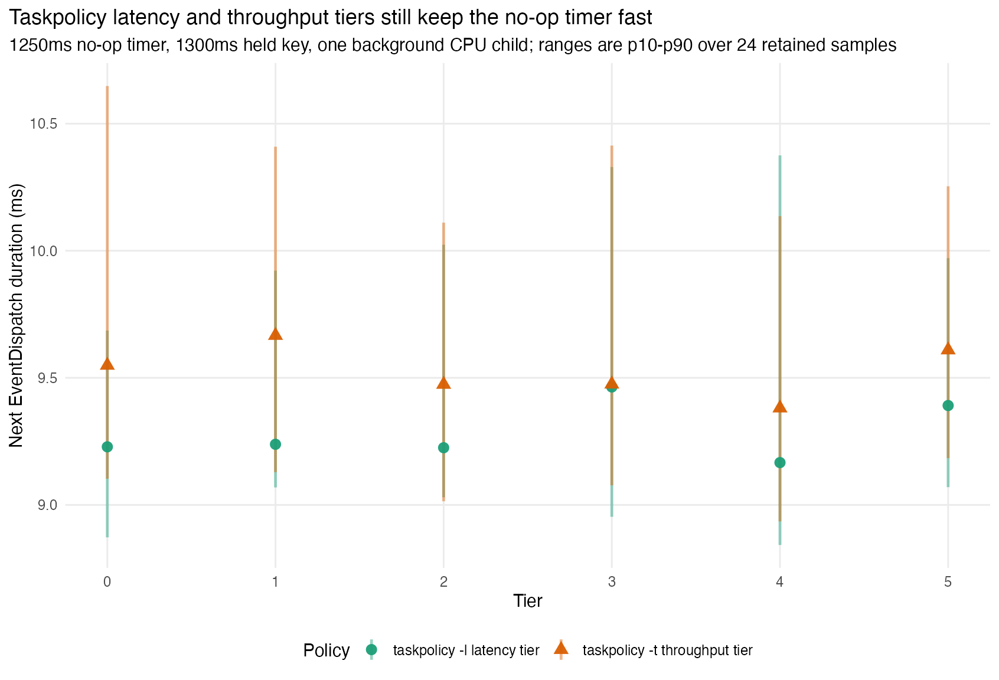

| Policy | Tier | p50 | p10-p90 |
| ------ | ---: | --: | ------: |
| `taskpolicy -l` | `0` | `9.23ms` | `8.87-9.69ms` |
| `taskpolicy -l` | `1` | `9.24ms` | `9.07-9.92ms` |
| `taskpolicy -l` | `2` | `9.23ms` | `9.03-10.02ms` |
| `taskpolicy -l` | `3` | `9.46ms` | `8.95-10.33ms` |
| `taskpolicy -l` | `4` | `9.17ms` | `8.84-10.38ms` |
| `taskpolicy -l` | `5` | `9.39ms` | `9.07-9.97ms` |
| `taskpolicy -t` | `0` | `9.55ms` | `9.10-10.65ms` |
| `taskpolicy -t` | `1` | `9.67ms` | `9.13-10.41ms` |
| `taskpolicy -t` | `2` | `9.47ms` | `9.01-10.11ms` |
| `taskpolicy -t` | `3` | `9.48ms` | `9.08-10.41ms` |
| `taskpolicy -t` | `4` | `9.38ms` | `8.94-10.14ms` |
| `taskpolicy -t` | `5` | `9.61ms` | `9.18-10.25ms` |

All 12 tier settings are in the same fast band as ordinary CPU, `nice +20`, and
`taskpolicy -c utility`. None behave like `taskpolicy -b`,
`taskpolicy -c background`, or `taskpolicy -c maintenance`. That rules out a
broader "taskpolicy latency/throughput tiering makes the CPU control slow"
explanation. The supported statement is now narrower: on this machine, the slow
background-CPU controls are specifically Darwin background priority and QoS
background/maintenance clamps, not taskpolicy policy machinery in general.

### Quantifying The CPU/QoS Boundary

I then collapsed the CPU controls into a smaller falsification table, keeping
only cases where the timer/control end is roughly `40-65ms` before the next
keydown. That removes the obvious "the task was too far away" confound and puts
the remaining open question on one scale.

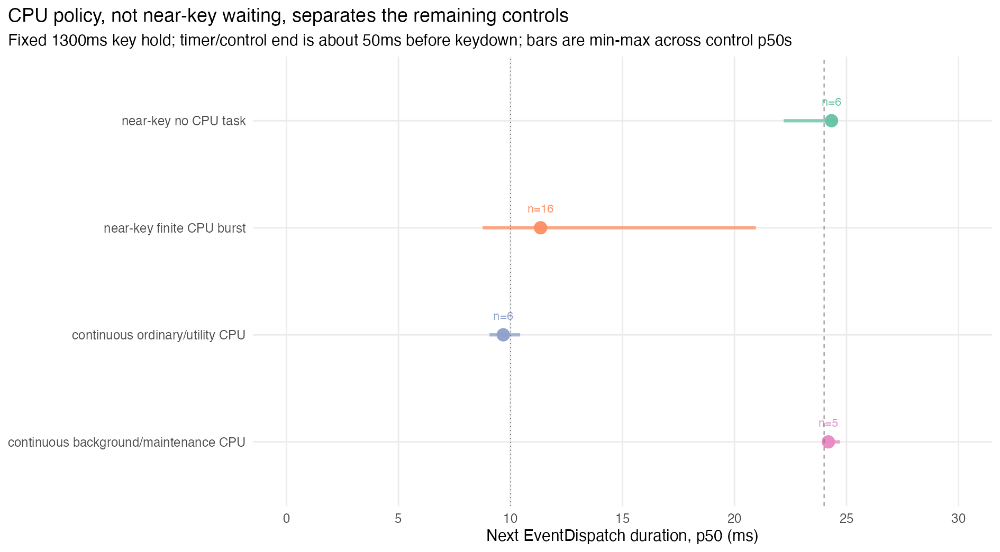

| Control class | Controls | Median control p50 | Min-max control p50 |
| ------------- | -------: | -----------------: | ------------------: |
| near-key no CPU task | `6` | `24.3ms` | `22.2-24.6ms` |
| near-key finite CPU burst | `16` | `11.3ms` | `8.8-21.0ms` |
| continuous ordinary/utility CPU | `6` | `9.7ms` | `9.1-10.4ms` |
| continuous background/maintenance CPU | `5` | `24.2ms` | `24.0-24.7ms` |

That table is the most compact current answer to the remaining mechanism
question. A near-key timer callback, worker lifetime, delayed task, IPC command,
or idle child is not enough; the no-CPU controls stay in the slow band. CPU work
near the key is usually enough; continuous ordinary, `nice +20`, or utility-QoS
CPU is enough even when the timer callback is a zero-duration no-op.
Background/maintenance-QoS CPU is not enough despite consuming CPU.

I also fit a deliberately simple descriptive model to the finite CPU-burst rows:
`latency_p50 ~ log1p(work_duration) + work_end_to_keydown_gap`. This is not a
claim about the hardware mechanism; it is a check that the two variables the
probes were designed to vary, duration and recency, explain a meaningful share
of the remaining control results.

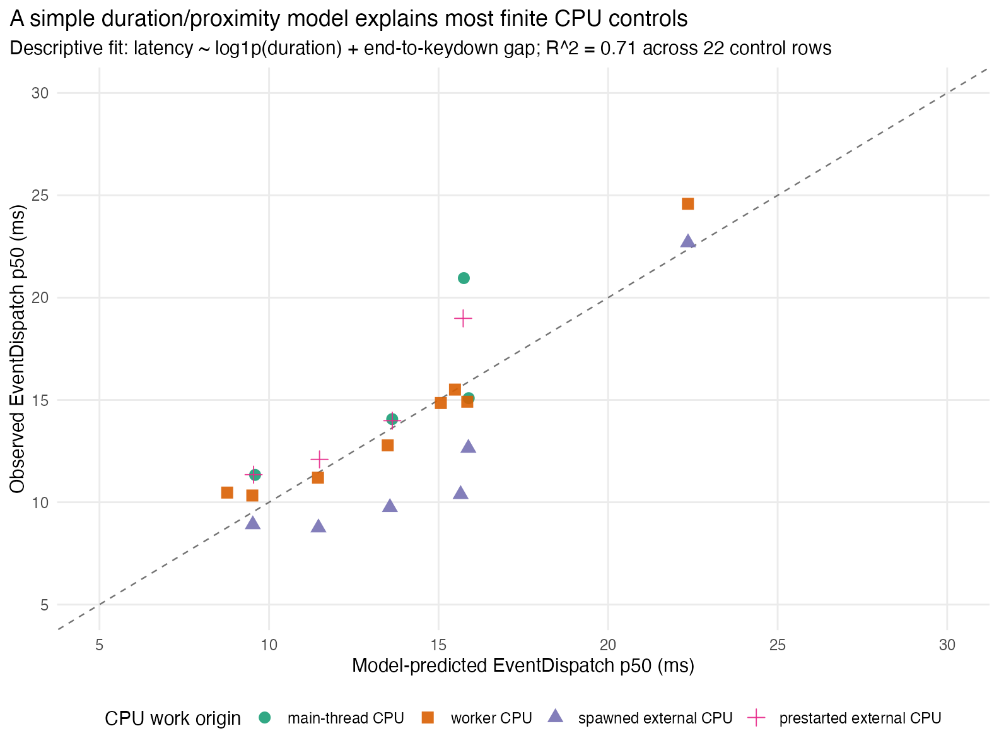

The model has `R^2 = 0.71` over `22` finite CPU-control rows. The coefficients
have the expected signs: longer CPU work predicts a lower next EventDispatch
p50, and a larger gap from CPU-work end to keydown predicts a higher p50. The
residuals also matter. Spawned external CPU is often faster than this two-term
model predicts, probably because process-startup CPU is not captured in the
page's expected-duration timestamp. Prestarted external CPU is the cleaner
external-process control and still follows the same duration/proximity shape.

This is as far as the current browser/JS benchmark can honestly go. It can prove
that the `1000ms` cliff is not just a Chrome EventDispatch accounting issue and
not just a Gutenberg persistence-state branch. It can also prove that recent
ordinary/utility CPU activity changes the measured Gutenberg input path, while
background/maintenance-QoS CPU does not. It cannot identify the hardware layer:
P-core residency, cluster frequency, power management, timer coalescing, and
Darwin scheduler/QoS policy remain below this trace setup.

### System Mechanism Falsification Matrix

I turned the remaining system-level question into a small evidence matrix. This
does not make the last hardware/scheduler layer disappear; it says which broad
explanations are already incompatible with the controls above and which narrower
claim still survives.

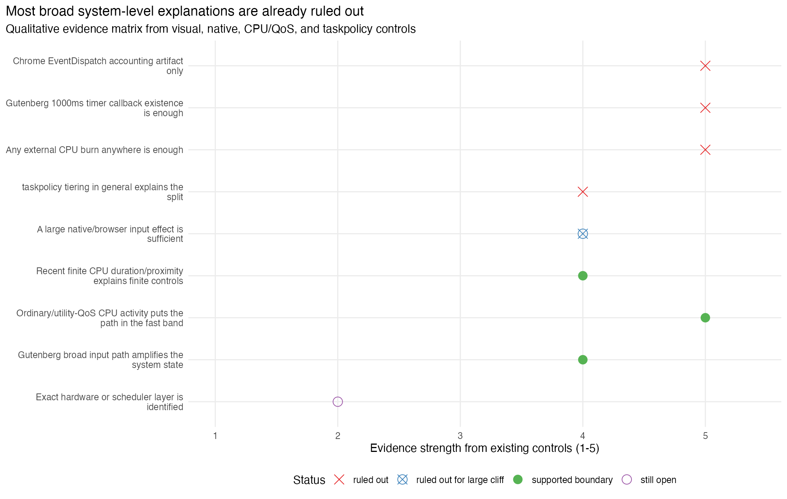

| Candidate theory | Current status | Strongest current measurement |
| ---------------- | -------------- | ----------------------------- |
| Chrome `EventDispatch` accounting artifact only | ruled out | Key-held RAF, render-trace, and changed-screenshot endpoints all move with `EventDispatch`. |
| The `1000ms` timer callback existing is enough | ruled out | Near-key no-CPU task controls stay slow: median control p50 `24.3ms`. |
| Any external CPU burn anywhere is enough | ruled out | Background/maintenance-QoS CPU controls stay slow: median control p50 `24.2ms`. |
| `taskpolicy` tiering in general explains the split | ruled out | `taskpolicy -l 0..5` and `taskpolicy -t 0..5` all stay fast in the `9.2-9.7ms` band. |
| A large native/browser input effect is sufficient | ruled out for the large cliff | Native `contenteditable` moves in the same direction, but only from `1.20ms` to `0.49ms`. |
| Recent finite CPU duration/proximity explains finite controls | supported boundary | The two-variable finite-burst model explains `71%` of finite-control p50 variation. |
| Ordinary/utility-QoS CPU activity puts the path in the fast band | supported boundary | Continuous ordinary, `nice +20`, and utility-QoS CPU controls are low: median control p50 `9.7ms`. |
| Gutenberg broad input path amplifies the system state | supported boundary | Native controls show only a sub-`1ms` effect; Gutenberg source traces show thousands of small RichText/data listener calls. |
| Exact hardware or scheduler layer is identified | still open | The current trace setup has no per-core residency, frequency, cache, or scheduler/QoS transition counters. |

That is the narrower current answer: the large cliff requires Gutenberg's broad
input path and is modulated by recent ordinary/utility-QoS CPU state. It is not
generic timer ordering, generic callback existence, generic CPU load, generic
`taskpolicy` behavior, or a trace-only Chrome artifact. Closing the final layer
would need measurements outside this JS/browser harness: hardware counters,
Darwin scheduler/QoS traces, or browser traces that include OS scheduling and
power-state categories.

The next-probe audit for this open question is:

| CPU/QoS question | Current answer | What is closed | Remaining unknown | Next useful probe |
| ---------------- | -------------- | -------------- | ----------------- | ----------------- |
| Is the `1000ms` timer callback or a nearby no-op task sufficient? | no | near-key no-CPU controls stay slow at median p50 `24.3ms` | none for this system claim | stop adding no-CPU task variants unless they target a new concrete browser subsystem |
| Is any external CPU burn sufficient? | no | background/maintenance-QoS CPU stays slow at median p50 `24.2ms` despite consuming CPU | which policy or hardware state makes ordinary/utility CPU visible to the foreground browser path | measure ordinary, utility, background, and maintenance controls with scheduler/QoS and power counters |
| Is ordinary/utility-QoS CPU activity sufficient locally? | yes, as a boundary result | ordinary/nice/utility controls are low at median p50 `9.7ms`; utility is `9.4ms`; `taskpolicy -l/-t` tiers stay `9.2-9.7ms` | P-core residency, cluster frequency, cache warmth, scheduler priority, timer coalescing, or a mix | run finite and continuous CPU controls with `powermetrics`, Instruments, and browser scheduling traces |
| Do finite CPU duration and recency matter? | yes, descriptively | two-term finite-burst model has `R^2 = 0.71` with the expected signs | model does not identify the hardware mechanism or cover continuous QoS-clamped controls | pair finite-burst grid with per-core residency/frequency counters and process QoS state |
| Is the exact hardware or scheduler layer identified? | no | current JS/browser traces can only name the narrowed boundary | exact split between core residency, frequency, cache, QoS scheduling, timer coalescing, and browser scheduler state | use OS/hardware counters first; add JS rows only to test a counter-backed hypothesis |
| What should product optimization do with this? | keep it separate from source-level mitigations | native/browser controls move less than `1ms`; Gutenberg fanout supplies the scale | how real plugin/human workloads interact with this system state | use workload replay for product lag and selector/subscriber prototypes for source mitigation |

### CPU/QoS Counter Contract

The CPU/QoS mechanism is now bounded enough that the next experiment should be
counter-driven. The local benchmark should not keep adding new no-op callbacks,
external delay variants, or taskpolicy tier rows until an OS/browser trace points
at a more specific mechanism. The rows already separate the important classes:
near-key no-CPU tasks are slow (`24.3ms` median p50), finite CPU bursts are
usually fast (`11.3ms` median p50), continuous ordinary/utility CPU is fast
(`9.7ms` median p50), and continuous background/maintenance CPU is slow
(`24.2ms` median p50).

The remaining layers need different evidence:

| Candidate layer | Why it remains plausible | What would support it | What would weaken it |
| --------------- | ------------------------ | --------------------- | -------------------- |
| P-core or cluster frequency/residency | one ordinary or utility-QoS busy child is enough, while background/maintenance CPU remains slow despite consuming CPU | fast rows share higher performance-cluster residency or frequency during keydown / `EventDispatch`, and finite-burst rows decay as that state decays | fast and slow QoS rows have the same frequency, residency, and renderer core placement |
| Darwin scheduler or QoS placement | the split follows ordinary/utility versus background/maintenance policy more closely than Unix nice or taskpolicy latency/throughput tiers | fast rows show lower renderer runnable-to-running latency, different core placement, or different effective QoS/priority during key dispatch | renderer scheduling latency and effective QoS are indistinguishable across ordinary/utility and background/maintenance controls |
| Cache or memory hierarchy state | Gutenberg's broad JS/data/RichText path could be sensitive to memory stalls | fast rows show lower renderer stall or miss rate during `EventDispatch` without a matching scheduler/frequency difference | renderer counter ratios are the same across fast and slow rows, or differences track frequency/scheduling instead |
| Timer coalescing or wakeup latency | finite CPU recency matters and OS policy can change wakeup behavior | fast rows primarily reduce key enqueue-to-`EventDispatch` start or renderer wakeup latency | `EventDispatch` starts at comparable times but its internal JS/data/RichText work duration changes |
| Chromium/browser scheduler state | runtime checkpoints and CPU/QoS controls both show state below Gutenberg selectors | fast rows show different input-task priority, queueing, or task splitting after OS counters are controlled | browser scheduler traces are identical once OS frequency/residency/QoS counters are controlled |

That gives a concrete trace contract. Run the same small set of discriminating
rows, not a broad new sweep: the no-op timer, continuous ordinary CPU,
`nice +20`, `taskpolicy -c utility`, `taskpolicy -b`, QoS background, QoS
maintenance, and the finite-burst gap-decay rows. For each retained sample,
align helper work start/end, next keydown enqueue, `EventDispatch` start/end,
renderer thread wakeups, process QoS, core IDs, frequency/residency, and the
existing Gutenberg source spans. A positive result should explain both the
continuous QoS split and the finite-burst decay; explaining only one of those is
not enough to close the mechanism.

The deeper runset contract makes that small set explicit:

| Counter row set | Required role | Current local result | Acceptance gate |
| --------------- | ------------- | -------------------- | --------------- |
| Near-key no-CPU tasks | slow negative control for callback, delayed-task, worker-lifetime, IPC-shape, and idle-child explanations | median p50 `24.3ms`, min-max `22.2-24.6ms` | must stay slow while fast CPU rows show a counter delta; if these become fast with the same counters, the CPU-state explanation is too narrow |
| Continuous ordinary/utility CPU | fast policy-visible CPU control | ordinary/utility median p50 `9.7ms`; `taskpolicy -c utility` `9.4ms`; `taskpolicy -l/-t` tiers `9.2-9.7ms` | must share a measurable OS or browser-scheduler state not present in slow no-CPU and background/maintenance rows |
| Continuous background/maintenance CPU | slow policy contrast despite real CPU consumption | median p50 `24.2ms`, min-max `24.0-24.7ms` | if CPU is consumed but the fast rows' residency, frequency, scheduler, or browser-task state is absent, the policy-sensitive mechanism is supported |
| Finite CPU duration/proximity rows | decay check for power, scheduler, cache, or wakeup state | two-term finite-burst model has `R^2 = 0.71` | a mechanism must explain both the continuous QoS split and finite-burst decay, not just one side |
| Matched Chromium scheduler trace rows | OS-vs-browser split | current visual traces do not include this scheduler/runtime state | claim a browser-scheduler mechanism only if OS frequency/residency/QoS counters do not explain the split and Chromium queue/priority/task boundaries do |

Each retained sample in that runset needs per-sample alignment, not only class
medians: run id, sample index, throwaway/retained status, key timing,
`EventDispatch` timing, helper work timing, helper and renderer QoS, core IDs,
frequency/residency, power or thermal metadata, browser scheduler slices, source
span ids, and environment metadata. Without that per-sample record, the honest
claim remains the current one: the benchmark has a narrowed CPU/QoS boundary, not
an identified hardware or scheduler cause.

The practical decision is unchanged but sharper. The system artifact should be
studied with OS counters first. Product optimization should continue through
selector/subscriber prototypes and workload replay, because the system state
modulates the path but Gutenberg's broad input fanout supplies the user-visible
scale.

### CPU/QoS Local Counter Feasibility Audit

I also checked whether the remaining CPU/QoS mechanism can be resolved from this
Codex session without changing privileges. The local machine is Apple Silicon
(`Apple M3 Max`) on macOS `26.4.1` / Darwin `25.4.0`, with `10` performance and
`4` efficiency cores reported by `hw.perflevel0.physicalcpu` and
`hw.perflevel1.physicalcpu`. That is exactly the kind of host where
cluster-residency, frequency, effective QoS, and scheduler-placement hypotheses
are plausible. But the decisive observers are privileged.

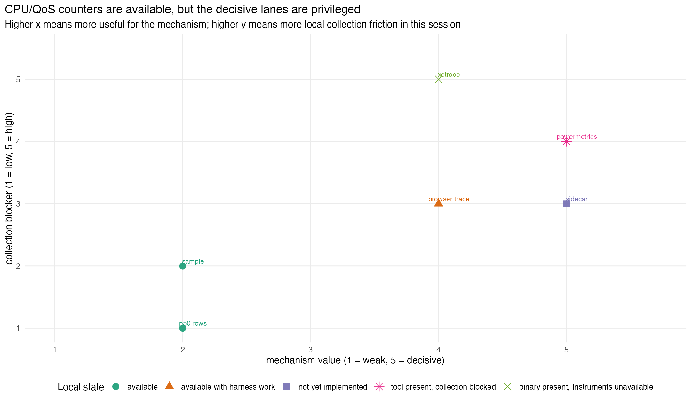

The local tool audit is:

| Counter surface | Local result | What it can decide | Blocker |
| --------------- | ------------ | ------------------ | ------- |
| `powermetrics` tasks / `cpu_power` | `/usr/bin/powermetrics` is present and exposes `tasks`, `cpu_power`, `thermal`, `sfi`, `--show-pstates`, `--show-cpu-qos`, `--show-process-qos`, `--show-process-qos-tiers`, `--show-process-amp`, `--show-process-ipc`, process wait times, and plist output. A direct sample failed with `powermetrics must be invoked as the superuser`. | Performance-cluster residency/frequency, process QoS, AMP cluster stats, ARM cycles/instructions, power/thermal metadata. | Requires root; noninteractive `sudo` is not available in this session. |
| `trace record` system trace | `/usr/bin/trace` is present. Plans expose `scheduling`, `cswitch-cycles-instrs`, `qos`, `sched-processor-selection`, and `thread-wakeup-sampling`. A one-second recording failed with `must be running as root (or under sudo) for system visibility`. | Runnable-to-running latency, scheduler placement, QoS, thread wakeups, context switches, processor selection. | Requires root for system visibility. |
| `xctrace` / Instruments | `/usr/bin/xctrace` is present, but `xctrace list instruments` fails because the active developer directory is Command Line Tools, not full Xcode. | Interactive Instruments analysis of System Trace files. | Needs full Xcode configured with `xcode-select`; not a good unattended collector here. |
| `sample` / `spindump` | Both tools are present. | Stack attribution and coarse CPU sanity checks. | Not decisive for cluster residency, effective QoS transitions, or per-key scheduler decisions. |
| Browser trace categories | The benchmark can already start tracing with custom options, but current typing traces are render/screenshot oriented. | Browser input queue, V8, runtime, and task-boundary state after OS counters are controlled. | Needs a new runtime/scheduler category mode and observer-effect checks. |
| Benchmark key-window sidecar | Current artifacts record key timing and helper modes, but not helper PID lifetimes, collector filenames, notification IDs, or OS-counter sample IDs. | Per-retained-key joins between benchmark events and OS/browser counters. | Requires a harness change before privileged counters are useful. |

This changes the next step from "run more CPU controls" to "make the counter
run joinable." The compact rows are already selected. What is missing is a
sidecar that gives every retained key a stable join key across benchmark output,
helper process lifetime, `powermetrics` samples, and `trace` events.

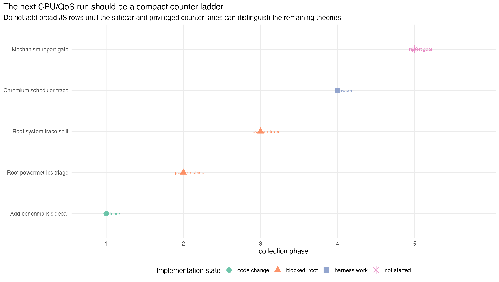

The first executable counter ladder should be:

| Phase | Purpose | Minimum rows | Collector | Gate |
| ----- | ------- | ------------ | --------- | ---- |
| Add benchmark sidecar | Join OS/browser samples to retained keys. | all compact rows | benchmark JSON/CSV sidecar | each retained key has run id, sample id, helper PID, helper start/end, key timing, `EventDispatch` timing, and collector filenames |
| Root `powermetrics` triage | Test whether frequency, cluster residency, process QoS, AMP counters, or thermal/power state separates rows. | near-key no-CPU slow; ordinary/utility fast; background/maintenance slow; fresh finite; stale finite | `sudo powermetrics -i 100 -f plist --samplers tasks,cpu_power,thermal,sfi --show-pstates --show-cpu-qos --show-process-qos --show-process-qos-tiers --show-process-amp --show-process-ipc --show-process-wait-times` | one per-sample counter state predicts fast ordinary/utility rows and finite decay while absent from no-CPU and background/maintenance slow rows |
| Root system trace split | Discriminate Darwin scheduler/QoS placement and wakeup latency from frequency/residency explanations. | same compact rows plus one confirmation run | `sudo trace record --plan default --add qos --add sched-processor-selection --add thread-wakeup-sampling` | runnable latency, processor selection, QoS, or wakeup timing explains the split after matching `powermetrics` state |
| Chromium scheduler trace | Check browser input queues only after OS counters do not explain the split. | one no-CPU slow; one ordinary/utility fast; one background/maintenance slow; one finite fresh/stale pair | CDP trace categories for scheduler/task queues, V8, runtime, and Gutenberg source spans | browser queue/priority/task-boundary state predicts residual latency after OS counters are controlled |
| Mechanism report gate | Change the report only when one state variable predicts every discriminating row. | all successful compact rows | joined per-key table | no-CPU slow, ordinary/utility fast, background/maintenance slow, and finite decay all follow the same recorded state |

The deeper practical issue is not just that `powermetrics` and `trace` need
root. It is joinability. A privileged run that only produces class-level
counter medians can still line up with the existing p50 classes by coincidence.
The first implementation gate is a sidecar that lets every retained key be
joined to the helper process, renderer process, input/EventDispatch window, and
counter samples.

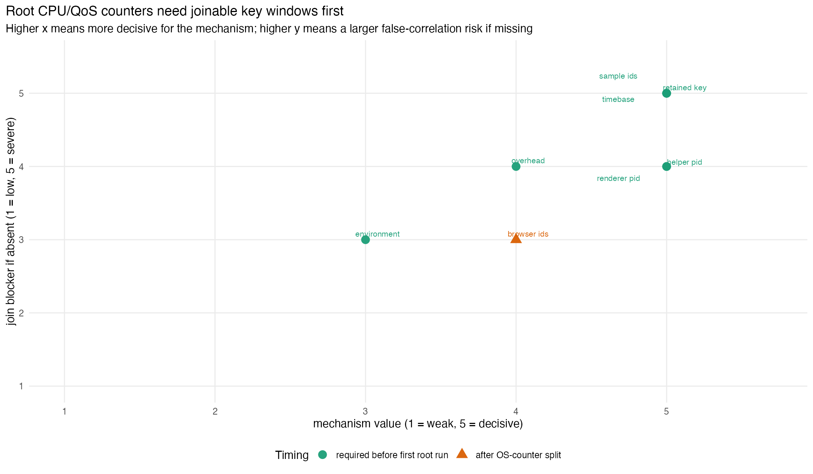

The join fields that have to exist before the first root run are:

| Join surface | Required fields | Why it matters |
| ------------ | --------------- | -------------- |
| Retained key window identity | run id, branch, delay, delay mode, sample index, retained/throwaway status, q50 inclusion, typed character | anchors every counter sample to the same key that contributes to the benchmark q50 |
| Input and `EventDispatch` timebase | keydown/keypress/keyup enqueue times, `EventDispatch` start/end, browser monotonic clock, host wall-clock mapping | separates input queueing or wakeup movement from listener-duration movement |
| Helper process lifetime and policy | helper pid, process group, launch/start/end, command, nice/taskpolicy/QoS policy, CPU duration, exit status | the local split is policy-sensitive CPU, so the helper policy window must be audited per key |
| Renderer and browser process identity | renderer pid, browser pid, main thread id if available, target/frame id, browser revision | process-level counters must describe the renderer that handled the measured input |
| Collector sample join | collector run id, `powermetrics` plist path, trace path, sample begin/end, sample id, notification ids, sample interval | converts privileged samples from run-level correlations into per-key evidence |
| Observer overhead sentinels | with/without collector rows, collector pid, collector CPU, dropped samples, class-order preservation | root collectors and tracing can perturb the scheduler and power state under test |
| Environment and power metadata | AC/battery state, low-power mode, thermal pressure, OS build, core counts, container state, browser build | prevents pooling runs from different host states as if they were equivalent |

The sidecar MVP makes "add the sidecar" concrete. The first run is deliberately
unprivileged: prove that the benchmark can attach helper, renderer, collector,
and retained-key windows without changing the already-known class ordering.
Only then should a root `powermetrics` or `trace` collector be added.

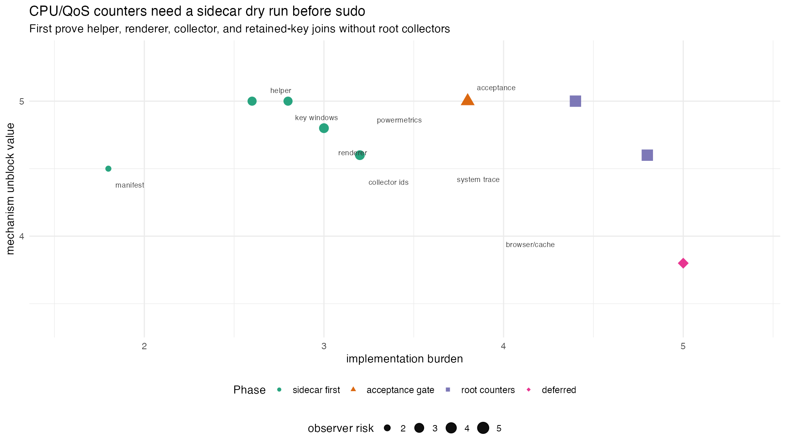

| Implementation piece | First change | Acceptance gate | Stop condition |
| -------------------- | ------------ | --------------- | -------------- |
| Compact row manifest lock | Freeze the first sidecar manifest to no-CPU slow, ordinary/utility fast, background/maintenance slow, fresh finite, stale finite, and one matched no-helper control. | The sidecar dry run reproduces the known class ordering before any privileged collector is attached. | Stop if the manifest no longer separates the known fast and slow classes before counters are added. |
| Helper process wrapper | Log helper pid, process group, command, nice/taskpolicy/QoS policy, launch/start/end timestamps, CPU duration, exit status, and output paths. | Every helper-backed retained key joins to exactly one helper lifetime and policy row; no-helper rows explicitly record no helper. | Stop if helper policy or lifetime can only be inferred from the run label. |
| Retained key-window sidecar | Emit a stable window id with run id, delay, mode, sample index, retained/throwaway status, q50 inclusion, key timings, `EventDispatch`, and browser/host clock sync. | `100%` of retained q50-contributing keys match existing latency records. | Stop before root collectors if retained-key joins are missing or alter q50 output. |
| Renderer/browser identity | Record browser pid, renderer pid, main thread id if available, target id, frame id, browser revision, and fixture metadata. | Each retained key can be attributed to the foreground renderer that handled the input. | Stop if counters would describe only browser-wide or wrong-process state. |
| Collector placeholder schema | Add collector run id placeholders, intended plist/trace paths, sample interval, notification labels, and observer configuration. | Sidecar-only artifacts contain all join columns that later root collector files will fill. | Stop if collector fields change the artifact schema in a way that affects curated metrics. |
| Sidecar-only acceptance run | Run the compact manifest with sidecar enabled and privileged collectors disabled. | Class ordering survives, all retained windows join to helper and renderer fields, and overhead is bounded by matched no-sidecar rows. | Do not run root `powermetrics` if the sidecar alone perturbs the benchmark. |
| Root `powermetrics` triage | After the sidecar passes, collect `100ms` plist samples with tasks, cpu_power, thermal, sfi, pstates, process QoS/tier/AMP/IPC/wait-time fields. | One sampled OS state predicts ordinary/utility fast rows and finite decay while absent from no-CPU and background/maintenance slow rows. | Escalate to root `trace` if frequency/residency/QoS counters do not separate rows or miss key windows. |
| Root system trace escalation | Only after `powermetrics` is insufficient, record scheduler/QoS trace rows with the same sidecar windows and notification labels. | Runnable latency, processor selection, wakeup, or effective QoS explains the residual after matching `powermetrics` state. | Do not claim Darwin scheduler/QoS placement if trace overhead changes class ordering or counters still do not join per key. |
| Browser/cache fallback | Only after OS counters fail, add browser scheduler/task-queue traces or lower-level renderer counters joined to the same key windows. | Browser queue/cache/stall state predicts residual latency after OS frequency, residency, and scheduler state are controlled. | Keep the mechanism unnamed if browser/cache rows need unrelated explanations or observer controls fail. |

That produces a stricter decision tree:

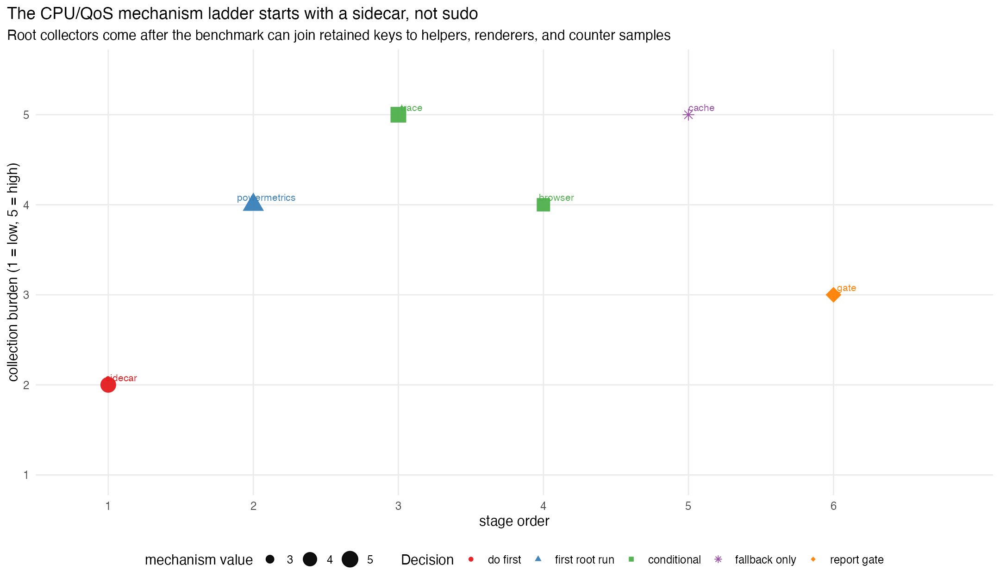

1. First run the sidecar without privileged counters and verify that the compact
   q50 class ordering stays the same.
2. Then run the compact row set under root `powermetrics`. If frequency,
   cluster residency, process QoS, AMP counters, or thermal/power state explains
   the no-CPU slow / ordinary-utility fast / background-maintenance slow /
   finite-decay split, stop there.
3. Add root `trace` only if `powermetrics` cannot separate frequency/residency
   from runnable latency, QoS placement, wakeup timing, or processor selection.
4. Add Chromium scheduler traces only if OS counters do not explain the split.
5. Treat cache or memory hierarchy as a fallback that needs lower-level counters;
   do not claim it from JS timing or aggregate medians alone.

### CPU/QoS Claim Ladder

The CPU/QoS controls now prove a useful benchmark boundary, but they do not name
the exact hardware or scheduler mechanism. This matters because several tempting
statements sound close to the data but require different observers. The local
tables support "ordinary/utility CPU state is sufficient locally"; they do not
support "P-core residency caused it", "Darwin QoS placement caused it",
"Chromium scheduler state caused it", or "cache warmth caused it".

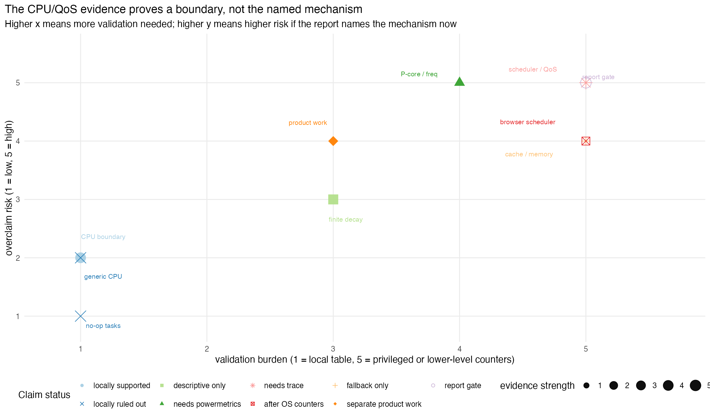

| Claim | What the current data supports | What is blocked |
| ----- | ------------------------------ | --------------- |
| Benchmark boundary | Ordinary/utility CPU state modulates the measured Gutenberg input path, while background/maintenance CPU does not. | Naming the lower-level mechanism from aggregate p50 rows. |
| No-op or timer callback explanation | Ruled out: near-key no-CPU controls remain slow at median p50 `24.3ms`. | Treating the `1000ms` timer callback merely existing as sufficient. |
| Generic CPU burn explanation | Ruled out: background/maintenance CPU consumes CPU but remains slow at median p50 `24.2ms`. | Claiming any load, process activity, or warm CPU is enough. |
| Finite duration/proximity | Descriptive only: a two-variable finite-burst model explains `71%` of finite-control p50 variation. | Treating the regression as proof of frequency, scheduler, cache, or browser queue state. |
| P-core / frequency / residency | Open candidate. | Needs sidecar validation plus root `powermetrics` joined to retained key windows. |
| Darwin scheduler / QoS placement | Open candidate. | Needs root trace only after `powermetrics` cannot explain the split. |
| Cache / memory hierarchy | Fallback candidate. | Needs lower-level renderer counters after OS and browser scheduling are controlled. |
| Chromium scheduler state | Open only after OS counters fail. | Needs trace-off protocol sidecar first, then scheduler/task-queue traces aligned with OS counters. |
| Product optimization | Separate track. Gutenberg fanout supplies the user-visible scale, but that is not the same as the system mechanism. | Needs selector/subscriber prototypes and workload replay, not a stronger CPU/QoS mechanism claim. |
| Mechanism report update | Blocked until one recorded state predicts every discriminating row. | Needs a joined per-key table covering no-CPU slow, ordinary/utility fast, background/maintenance slow, finite fresh/stale, and observer controls. |

This is the point where a Linus-style audit says "stop guessing": the boundary is
real, the controls are strong, but the exact cause is below the current
instrumentation. A Kingsbury-style audit says the next run needs join keys before
privilege: otherwise root counters only create a prettier class-level
correlation. A Dan-Luu-style audit says product claims and benchmark-mechanism
claims must stay separate: source fanout explains the large Gutenberg scale,
while CPU/QoS counters are needed to explain the system-state cliff.

That is the deepest current answer I can support locally. The CPU/QoS boundary is
real and already useful as a benchmark-methodology warning, but the exact
hardware/scheduler mechanism cannot be named from the current unprivileged
session. The next credible run starts with an unprivileged sidecar validation;
only after that should root `powermetrics` be run. If that fails to separate the
rows, add root `trace`; only then should browser scheduler traces or
cache/memory explanations be elevated.

The CPU gap-decay sweep confirms the "recent" part:


The same `150ms` no-message worker spin is fast only near the next key. Moving
it earlier makes it intermediate and then slow again. A separate Node child
process burning CPU shows the same proximity-sensitive shape, so the effect is
not confined to browser renderer-local worker scheduling. This matters because
it rules out a broad warmup explanation where one worker spin simply leaves the
browser fast for the rest of the delay run. I treat the spawn-per-timer external
process end gaps as approximate: process startup CPU is not timestamped by the
page's expected-duration event. The prestarted-child duration sweep above is the
cleaner evidence that external CPU itself is sufficient.

I also added a native `contenteditable` control with the same rewritten
one-second timer and the same `1300ms` key hold:


| Native timer work | Timer end to keydown | Event-only p50 |
| ----------------: | -------------------: | -------------: |
|              `0ms` |             `52.4ms` |        `1.20ms` |
|             `20ms` |             `51.3ms` |        `0.89ms` |
|             `40ms` |             `50.2ms` |        `0.57ms` |
|            `150ms` |             `49.8ms` |        `0.49ms` |

The native control moves in the same direction, but the absolute scale is tiny:
less than `1ms` separates the zero-work and `150ms` cases. This disconfirms a
purely native-browser explanation for the Gutenberg cliff. The browser/CPU
state appears to modulate the cost, but the large visible swing needs
Gutenberg's much heavier input path to amplify it.

The `stopTyping()` result has a direct code-level explanation. `ObserveTyping`
installs different DOM listeners depending on `isTyping`: when typing is true,
it installs listeners that can stop typing; when typing is false, it installs
`keypress` / `keydown` listeners that call `startTyping()` for text-field input.
So a timer callback that leaves `isTyping=false` changes the next measured key's
listener work. In the action trace, `stopTyping()` alone is followed by a
`startTyping()` action during the measured key. The `stopTyping(); startTyping()`
intervention runs both parts before the next key, so the next key starts from the
normal `isTyping=true` listener regime.

The raw `stopTyping()` trace shows the sequence, not just the summary statistic.
For one retained `1000ms` sample, the timer-side intervention ran at about
`14650.4ms` and changed `isTyping` from true to false. The next editor-canvas
`keydown` was at `14689.8ms` with `isTyping=false`; the editor-canvas
`keypress` was at `14690.3ms`, still with `isTyping=false`; the
`core/block-editor` `startTyping` action also began at `14690.3ms`, took
`7.9ms`, and changed `isTyping` from false to true. Only after that did
`beforeinput` and `input` arrive, both seeing `isTyping=true`. That matches the
source in
`packages/block-editor/src/components/observe-typing/index.js`: lines 127-129
select different listeners by `isTyping`, and lines 209-230 call
`startTyping()` from the text-field `keypress` / eligible `keydown` listener.

The restored non-typing toggles refine that again. They do not use the typing
observer path, but they still run a broad block-editor subscriber pass before
the next input and reduce the following input. That means the typing-listener
repair explains why `stopTyping()` alone is slow, but it is not the whole
explanation for why pre-key subscriber fanout lowers the next input slice.

That matters because `withPersistentBlockChange()` classifies a block attribute
update as transient only when the current action and previous action are both
`UPDATE_BLOCK_ATTRIBUTES` actions for the same block attributes:

```js
action.type === 'UPDATE_BLOCK_ATTRIBUTES' &&
	lastAction !== undefined &&
	lastAction.type === 'UPDATE_BLOCK_ATTRIBUTES' &&
	fastDeepEqual( action.clientIds, lastAction.clientIds ) &&
	hasSameKeys( action.attributes, lastAction.attributes );
```

The normal `1000ms` sequence is therefore:

```text
UPDATE_BLOCK_ATTRIBUTES
MARK_LAST_CHANGE_AS_PERSISTENT
UPDATE_BLOCK_ATTRIBUTES  -> persistent, because previous action is MARK
```

The marker no-op sequence is:

```text
UPDATE_BLOCK_ATTRIBUTES
timer callback, but no block-editor action
UPDATE_BLOCK_ATTRIBUTES  -> transient, because previous action is UPDATE
```

Source-level input-path tracing confirms that the normal marker and no-op take
different parent paths, but it also shows that the path split is not the cause
by itself:


In the trace-heavy path runs, counting only `useBlockSync.updateParent` calls
inside the retained input batch:

| Timer callback                       |    Delay | Following input parent path |
| ------------------------------------ | -------: | --------------------------- |
| normal marker                        | `1000ms` | `6/6` `onChange`            |
| normal marker                        | `1010ms` | `6/6` `onChange`            |
| marker no-op                         | `1000ms` | `6/6` `onInput`             |
| marker no-op                         | `1010ms` | `6/6` `onInput`             |
| mark next not persistent             | `1000ms` | `6/6` `onChange`            |
| mark next not persistent             | `1010ms` | `6/6` `onChange`            |
| mark last, then force next transient | `1000ms` | `7/8` `onChange`            |
| busy wait 20ms                       | `1000ms` | `8/8` `onInput`             |
| busy wait 20ms                       | `1010ms` | `8/8` `onInput`             |
| toggle selection                     | `1000ms` | `8/8` `onInput`             |
| toggle selection                     | `1010ms` | `8/8` `onInput`             |
| toggle template validity             | `1000ms` | `8/8` `onInput`             |
| toggle template validity             | `1010ms` | `8/8` `onInput`             |
| toggle block highlight               | `1000ms` | `8/8` `onInput`             |
| toggle block highlight               | `1010ms` | `8/8` `onInput`             |
| start typing                         | `1000ms` | `8/8` `onInput`             |
| start typing                         | `1010ms` | `8/8` `onInput`             |
| stop typing                          | `1000ms` | `8/8` `onInput`             |
| stop typing                          | `1010ms` | `8/8` `onInput`             |
| stop/start typing                    | `1000ms` | `8/8` `onInput`             |
| stop/start typing                    | `1010ms` | `8/8` `onInput`             |

The `mark next not persistent` row shows that `onChange` is not sufficient: it
records `onChange` and remains slow. The stop/start row shows that `onChange` is
not necessary: it records `onInput` and is fast. The busy-wait, start-only, and
stop-only rows also record `onInput`; the three generic restored toggles record
`onInput` too. These cases have materially different event-only latencies, so
the parent path classification is an observable consequence, not a complete
mechanism. The attempted
mark-last-then-mark-next run is also a warning about reasoning from action names:
the "mark next" action was consumed before the content update in most samples,
so the following content update still became persistent.

The next plot shows the accounting problem directly:


At `1000ms`, the normal marker's measured next-input p50 is only `11.3ms`.
Adding the timer callback that ran before each same retained key gives a paired
timer-inclusive p50 of `27.4ms`, not `11.3ms`. The stop/start intervention is
even more explicit: its measured next-input p50 is `11.0ms`, but adding the
paired timer callback gives `34.1ms`. Those callback durations are outside the
benchmark's next-input EventDispatch window.

| Timer callback                       |    Delay | Rows with callback | Event-only p50 | Timer callback p50 | Timer-inclusive p50 |
| ------------------------------------ | -------: | -----------------: | -------------: | -----------------: | ------------------: |
| normal marker                        |  `990ms` |                `0` |       `25.4ms` |            `0.0ms` |            `25.4ms` |
| normal marker                        | `1000ms` |               `30` |       `11.3ms` |           `15.8ms` |            `27.4ms` |
| normal marker                        | `1010ms` |               `30` |       `10.9ms` |           `15.9ms` |            `26.7ms` |
| normal marker                        | `1300ms` |               `30` |       `25.5ms` |           `16.1ms` |            `41.3ms` |
| marker no-op                         | `1000ms` |               `30` |       `22.0ms` |            `0.0ms` |            `22.0ms` |
| mark next not persistent             | `1000ms` |               `30` |       `33.6ms` |            `0.2ms` |            `33.8ms` |
| mark last, then force next transient | `1000ms` |               `30` |       `11.7ms` |           `16.1ms` |            `27.6ms` |
| busy wait 20ms                       | `1000ms` |               `30` |       `17.7ms` |           `20.0ms` |            `37.8ms` |
| busy wait 40ms                       | `1000ms` |               `29` |       `16.1ms` |           `40.0ms` |            `56.1ms` |
| toggle selection                     | `1000ms` |               `30` |       `14.6ms` |           `22.7ms` |            `37.4ms` |
| toggle template validity             | `1000ms` |               `30` |       `14.6ms` |           `23.8ms` |            `38.7ms` |
| toggle block highlight               | `1000ms` |               `30` |       `14.4ms` |           `22.2ms` |            `37.5ms` |
| start typing                         | `1000ms` |               `30` |       `24.4ms` |            `0.2ms` |            `24.6ms` |
| stop typing                          | `1000ms` |               `30` |       `26.8ms` |           `14.9ms` |            `41.6ms` |
| stop/start typing                    | `1000ms` |               `30` |       `11.0ms` |           `22.7ms` |            `34.1ms` |

This targeted `1000ms` table adds several constraints to the earlier
explanation:

1. The `1000ms` timer controls whether a callback can run between two text
   updates.
2. A zero-duration callback is not enough, and a cheap real action is not
   enough. The cheap `mark-next-not-persistent` replacement does not reproduce
   the low band; the `20ms` and `40ms` busy-wait callbacks only partially reduce
   the next EventDispatch slice. The later task-end and worker controls refine
   this: longer recent work can reproduce the low event-only band without a
   Gutenberg state transition.
3. A completed timer-side block-editor state transition with restored final
   state is sufficient, not necessary. Generic restored state toggles lower the
   `1000ms` event-only p50 to about `14-15ms` while staying on the `onInput`
   path.
4. Restoring the normal pre-key typing state explains the `stopTyping()` probe
   split: `stopTyping(); startTyping()` matches the low band, while
   `startTyping()` alone and `stopTyping()` alone do not. It does not prove
   that typing state is the unique cause of the remaining few milliseconds in
   the targeted run.
5. The benchmark's reported input latency omits that timer-side work. The paired
   timer-inclusive metric removes the apparent `1000ms` low band.
6. The parent `onInput` / `onChange` path and persistent-state classification
   are observable side effects, but they are not the root explanation by
   themselves.

This explains the "charged to the wrong place" issue without pretending the
total work got smaller. The normal marker can make the next EventDispatch slice
look faster because the measurement starts at the next input event and excludes
the marker task that just ran. Counting marker-plus-next-input makes the normal
`1000ms` case slower than the event-only graph suggests.

I also forced the boundary down by rewriting `1000ms` timers to `970ms` and
reran a targeted `960..1000ms` scan:


| Effective timer |    Delay | Rows with marker | Event-only p50 | Marker action p50 | Marker-inclusive p50 |
| --------------: | -------: | ---------------: | -------------: | ----------------: | -------------------: |
|         `970ms` |  `960ms` |              `0` |       `24.8ms` |           `0.0ms` |             `24.8ms` |
|         `970ms` |  `970ms` |             `30` |       `16.2ms` |          `15.5ms` |             `31.6ms` |
|         `970ms` |  `980ms` |             `30` |       `15.9ms` |          `15.3ms` |             `31.6ms` |
|         `970ms` |  `990ms` |             `30` |       `16.6ms` |          `15.6ms` |             `32.5ms` |
|         `970ms` | `1000ms` |             `30` |       `15.8ms` |          `15.8ms` |             `31.6ms` |

This confirms the timer-boundary part of the theory: when the effective timer is
`970ms`, the event-only low band starts at `970ms`, and all retained rows from
`970ms` upward have a marker before the next key. It also confirms the accounting
critique: the marker-inclusive p50s are around `32ms`, not `16ms`. The exact
event-only magnitude is not identical to the normal `1000ms` run, so this
supports "the timer moves the boundary" but not a claim that every low-band value
is determined by the timer alone.

I then reran a very small `1000ms` pass with
`BENCHMARK_TRACE_ALL_DATA_SPANS=1`. This mode is intentionally heavy; the
absolute timings are inflated by the tracing itself. The useful signal is the
shape of the work.


The real marker task is not a cheap flag flip:

| Intervention             | Action                   | p50 action | p50 spans in action | p50 listener spans | p50 `useSelect.onChange` calls |
| ------------------------ | ------------------------ | ---------: | ------------------: | -----------------: | -----------------------------: |
| normal marker            | mark last persistent     |   `23.4ms` |             `15511` |             `4501` |                         `4498` |
| marker no-op             | mark last persistent     |    `0.1ms` |                 `0` |                `0` |                            `0` |
| mark next not persistent | mark last persistent     |    `0.2ms` |                 `1` |                `0` |                            `0` |
| mark next not persistent | mark next not persistent |    `0.1ms` |                 `1` |                `0` |                            `0` |
| normal marker            | update block attributes  |    `3.3ms` |              `9028` |             `4501` |                            `0` |
| marker no-op             | update block attributes  |    `4.7ms` |              `9041` |             `4507` |                            `0` |
| mark next not persistent | update block attributes  |    `3.8ms` |              `9024` |             `4501` |                            `0` |

That confirms the marker-inclusive accounting: the omitted timer work is mostly
`core/block-editor` subscriber fanout, including thousands of `useSelect`
callbacks. It also disconfirms another too-simple theory: the marker is not just
changing one reducer flag and making the next key fast. In the normal-marker
case it runs a large subscriber pass before the next key. The no-op and
mark-next interventions do not. The mark-next marker rows do have one
`rootSubscribe` span with listener-count metadata, but they have zero listener
callback spans, zero `useSelect` callbacks, and `0ms` p50 root-subscribe
duration, so they are not doing the normal marker's subscriber fanout.

The remaining event-only input cost is still concentrated inside RichText's
`registry.batch()`:


Selected `1000ms` p50 spans:

| Intervention             | RichText total | `registry.batch` | parent callback | selection callback | apply record | serialize |
| ------------------------ | -------------: | ---------------: | --------------: | -----------------: | -----------: | --------: |
| normal marker            |       `18.6ms` |         `18.5ms` |         `1.9ms` |            `1.8ms` |      `0.0ms` |   `0.0ms` |
| marker no-op             |       `24.4ms` |         `24.1ms` |         `2.8ms` |            `2.8ms` |      `0.2ms` |   `0.0ms` |
| mark next not persistent |       `32.8ms` |         `32.4ms` |         `4.4ms` |            `3.6ms` |      `0.1ms` |   `0.0ms` |
| busy wait 20ms           |       `22.5ms` |         `22.3ms` |         `2.4ms` |            `2.3ms` |      `0.1ms` |   `0.0ms` |
| toggle selection         |       `19.2ms` |         `19.0ms` |         `2.0ms` |            `1.8ms` |      `0.1ms` |   `0.0ms` |
| toggle template validity |       `19.5ms` |         `19.4ms` |         `1.9ms` |            `1.6ms` |      `0.1ms` |   `0.0ms` |
| toggle block highlight   |       `19.4ms` |         `19.1ms` |         `1.8ms` |            `1.6ms` |      `0.1ms` |   `0.0ms` |
| start typing             |       `24.6ms` |         `24.4ms` |         `2.8ms` |            `2.9ms` |      `0.1ms` |   `0.0ms` |
| stop typing              |       `17.1ms` |         `16.9ms` |         `1.5ms` |            `1.4ms` |      `0.0ms` |   `0.0ms` |
| stop/start typing        |       `15.3ms` |         `15.2ms` |         `1.9ms` |            `1.6ms` |      `0.1ms` |   `0.0ms` |

This confirms that the event-only difference is not DOM application,
serialization, or the direct `useEntityBlockEditor()` callback. It is the
batched data/subscriber work under RichText input handling. The generic restored
state toggles move that batch cost close to the normal marker even though they
do not change persistence or typing state. The `stopTyping()` row is the
exception that proves why a single RichText batch number is not enough: its
input batch is low, but its total key event remains high because the next
keypress/keydown has to run `startTyping()` before the input batch. The all-span
run shows the normal marker also pays a separate subscriber pass in the timer
task, which the event-only metric excludes.

The trace-all-data-spans run gives a more precise answer to the previous
"how can doing extra work be faster than doing no work?" objection. It is not
faster when the whole cycle is counted. The timer changes what state the next
input starts from, and the event-only metric excludes the timer task.


Retained-input p50s from the all-span run:

| Intervention             | Next input path         | Marker actions before retained inputs | Marker `didPersistenceChange` callbacks | Event-only latency | Input `registry.batch` | Batch callback | Block-editor `rootSubscribe` | Block-editor resume | `useSelect.onChange` | Direct `updateParent` |
| ------------------------ | ----------------------- | ------------------------------------: | --------------------------------------: | -----------------: | ---------------------: | -------------: | ---------------------------: | ------------------: | -------------------: | --------------------: |
| normal marker            | `onChange:3; onInput:1` |                                   `3` |                                     `1` |           `26.9ms` |               `22.1ms` |        `7.0ms` |                      `6.4ms` |            `14.2ms` |              `7.0ms` |               `0.3ms` |
| marker no-op             | `onInput:4`             |                                   `3` |                                     `0` |           `32.5ms` |               `25.2ms` |       `10.1ms` |                      `9.3ms` |            `15.0ms` |              `8.0ms` |               `0.4ms` |
| mark next not persistent | `onChange:3; onInput:1` |                                   `6` |                                     `0` |           `30.0ms` |               `23.4ms` |        `9.3ms` |                      `8.4ms` |            `14.0ms` |              `7.5ms` |               `0.3ms` |

This table confirms two things and rejects one tempting shortcut:

-   The normal marker's timer task can run a real `useBlockSync.updateParent`
    callback with `didPersistenceChange: true`. In the trace, this happens once:
    the marker action changes persistence from false to true, `useBlockSync`
    sees that the previous content change is now persistent even though the
    blocks did not change in the marker action itself, and it calls the parent
    `onChange` path for the previous blocks. That is the concrete work that
    happens in the timer callback.
-   The next input is still expensive. It has the same p50 listener counts as
    the no-op case: two block-editor root subscriptions, `9002` block-editor
    Redux listener spans, `4501` block-editor emitter listeners, and `4544`
    `useSelect.onChange` spans. The difference is a few milliseconds of fanout
    duration, not a missing class of listeners.
-   "The direct `onChange` callback is fast, so the cliff is because `onChange`
    is faster than `onInput`" is not supported. The direct `updateParent`,
    `onInput`, `onChange`, `editEntityRecord`, and serialization spans are all
    sub-millisecond at p50 in this run. The measured difference is around the
    block-editor data/subscriber fanout around those callbacks.

The `mark next not persistent` intervention is also not a clean substitute for
the normal marker. The reducer's `markNextChangeAsNotPersistent` flag applies to
the next state-changing block-editor action, not specifically to the next text
content update. In this benchmark, a `selectionChange` commonly runs before
`updateBlockAttributes`. The all-span samples show that `selectionChange` can
consume the mark-next flag and leave the following content update persistent
again. That is why the mark-next run has `onChange:3; onInput:1` rather than
`onInput:4`, and why it cannot be used as evidence that "any timer-side action"
reproduces the normal marker.

I then checked the reducer and synchronization code directly against the trace.
This gives a more precise statement than the earlier "work moves before the
input" shorthand:

-   `withPersistentBlockChange()` keeps both the current
    `isPersistentChange` flag and a `lastAction`. A repeated
    `updateBlockAttributes` on the same block attribute is classified as
    transient because it is a continuation of the previous text edit.
-   `MARK_LAST_CHANGE_AS_PERSISTENT` is an explicit persistent action. It sets
    the persistence flag and also becomes the reducer's `lastAction`, so the
    following `updateBlockAttributes` is no longer compared directly with the
    previous text update.
-   `useBlockSync()` turns that persistence flag into the parent callback path.
    A real marker action can also trigger `didPersistenceChange` when the blocks
    changed on the previous action, did not change on the marker action, and the
    state flips from transient to persistent.
-   `useEntityBlockEditor()` then maps persistent edits to `onChange` and
    transient edits to `onInput`. The direct `onChange`/`onInput` code is not
    where the milliseconds are; the trace puts the cost in subscriber fanout
    around those callbacks.

At `1000ms`, the targeted action summary matches that code-level state machine:

| Intervention             | `updateBlockAttributes` samples | before persistent | after persistent | p50 action duration |
| ------------------------ | ------------------------------: | ----------------: | ---------------: | ------------------: |
| normal marker            |                            `33` |              `33` |             `33` |             `0.8ms` |
| marker no-op             |                            `33` |               `0` |              `0` |             `1.7ms` |
| mark next not persistent |                            `33` |               `0` |             `33` |             `2.2ms` |

The trace-heavy state-path samples show the same split at the input-window
level:


This confirms the path-classification theory: normal marker makes the following
content update start and end persistent, while marker no-op leaves it transient.
It also disconfirms two stronger theories. First, the marker did not simply
"move the same next-input work earlier"; the whole marker-inclusive cycle is
larger. Second, `onChange` is not intrinsically the measured win: mark-next also
produces `onChange` paths in this run but remains slower than normal marker.

I also split the following input batch by action phase. For this split, spans
are charged to an action only if the span starts before the action's recorded
end, so the deferred batch resume is not accidentally charged to
`updateBlockAttributes` when it starts at the same timestamp.


Retained-input p50s from this trace-heavy microscope run:

| Component                                   | normal marker | marker no-op | mark next | no-op minus normal |
| ------------------------------------------- | ------------: | -----------: | --------: | -----------------: |
| EventDispatch latency                       |      `26.9ms` |     `32.5ms` |  `30.0ms` |            `5.6ms` |
| RichText `registry.batch`                   |      `22.1ms` |     `25.2ms` |  `23.4ms` |            `3.1ms` |
| Batch callback                              |       `7.0ms` |     `10.1ms` |   `9.3ms` |            `3.2ms` |
| `selectionChange` block-editor fanout       |       `3.2ms` |      `5.1ms` |   `4.8ms` |            `1.9ms` |
| `updateBlockAttributes` block-editor fanout |       `3.2ms` |      `4.1ms` |   `3.7ms` |            `1.0ms` |
| Deferred block-editor resume                |      `14.2ms` |     `15.0ms` |  `14.0ms` |            `0.7ms` |
| `useBlockSync` nested `registry.batch`      |       `1.4ms` |      `1.6ms` |   `1.4ms` |            `0.2ms` |
| Direct `updateParent`                       |       `0.3ms` |      `0.4ms` |   `0.3ms` |            `0.1ms` |

This confirms a narrower location for the remaining input-window gap. The
absolute cost is still dominated by deferred block-editor resume, but the
normal-vs-no-op difference is mostly in callback-side subscriber fanout during
`selectionChange` and `updateBlockAttributes`. It disconfirms the theory that
the residual gap is mainly `useBlockSync`, core-data `onInput`/`onChange`, or
the deferred resume phase. The trace still does not prove which selector
dependency inside those thousands of subscribers accounts for the lower
callback-side fanout duration.

With those three original interventions, the narrower causal chain was:

1. Below the timer boundary, the next input usually runs while the previous text
   edit is still transient.
2. At or above the boundary, the normal marker can run in a separate timer task
   before the next input. That task dispatches
   `MARK_LAST_CHANGE_AS_PERSISTENT`, fans out through block-editor subscribers,
   and can make `useBlockSync` finalize the previous edit through `onChange`
   with `didPersistenceChange: true`.
3. The benchmark's event-only latency starts at the next input and does not
   include that timer task.
4. The next input then starts from a different persistence/previous-action
   state. Its direct callback is not the explanation; the remaining measured
   difference is in block-editor subscriber fanout inside the input's
   `registry.batch()`.

The later busy-wait, generic-toggle, and typing-state interventions correct that
again. The persistent state/previous-action path is not necessary for the
`1000ms` low EventDispatch band. It is one way to get there, and it explains the
normal marker path, but the broader confirmed condition is narrower than "some
callback ran" and broader than "the persistence marker ran." In these probes,
generic restored block-editor state toggles explain most of the drop. A busy
wait is only partial; restored selection/template/highlight toggles get to about
`14-15ms`; `startTyping()` alone is a no-op; `stopTyping()` alone creates work
but leaves the next input to restart typing; `stopTyping(); startTyping()` does
the fanout and restores the typing state before the measured input. The
low-overhead targeted run leaves a small gap between generic restored toggles
and stop/start, but the heavier all-data-span run does not justify a strong
claim about that gap's cause.

The important correction is that this does not mean "doing timer work is faster
than doing no timer work." The apparent speedup is for the next input's
event-only measurement window. In the targeted paired run at `1000ms`, the
normal marker's event-only p50 is `11.3ms`, but adding the marker task before
that input gives `27.4ms`; the marker no-op p50 is `22.0ms`. The stop/start
intervention is even stronger: its event-only p50 is `11.0ms`, but adding the
timer callback gives `34.1ms`. In the heavier trace-all-data-spans run, the
following input p50 is `26.9ms` for normal marker versus `32.5ms` for marker
no-op, but the normal marker also has a `23.4ms` p50 marker action before the
input. So the low band is not a total-work reduction. It is a measurement-window
result plus a timer-side subscriber pass that the EventDispatch metric omits.

I then grouped the trace-all-data-spans run by `useSelect` owner using the
generated source maps:


The marker timer task has clear hotspots:

| Marker task owner                                                | p50 `useSelect.onChange` | p50 calls |
| ---------------------------------------------------------------- | -----------------------: | --------: |
| `packages/block-editor/src/components/block-list/index.js:196`   |                  `5.8ms` |     `580` |
| `packages/editor/src/hooks/pattern-overrides.js:40`              |                  `1.8ms` |    `1437` |
| `packages/block-editor/src/components/block-list/block.js:563`   |                  `1.7ms` |    `1437` |
| `packages/block-editor/src/components/inner-blocks/index.js:195` |                  `0.5ms` |     `580` |
| `packages/edit-post/src/components/layout/index.js:400`          |                  `0.4ms` |       `1` |

That is another confirmation that the marker task is real subscriber work, not
a reducer-only flag flip.

For the following input batch, however, the owner-level deltas are small. The
largest positive p50 owner delta versus normal marker is only `0.3ms`:

| Comparison                                   | Owner                                                            | p50 delta |
| -------------------------------------------- | ---------------------------------------------------------------- | --------: |
| marker no-op minus normal marker             | `packages/block-editor/src/components/use-settings/index.js:30`  |  `0.30ms` |
| mark next not persistent minus normal marker | `packages/block-editor/src/components/block-list/block.js:563`   |  `0.25ms` |
| marker no-op minus normal marker             | `packages/editor/src/hooks/pattern-overrides.js:40`              |  `0.25ms` |
| mark next not persistent minus normal marker | `packages/block-editor/src/components/inner-blocks/index.js:195` |  `0.15ms` |
| mark next not persistent minus normal marker | `packages/editor/src/hooks/pattern-overrides.js:40`              |  `0.15ms` |
| marker no-op minus normal marker             | `packages/edit-post/src/components/layout/index.js:400`          |  `0.15ms` |
| marker no-op minus normal marker             | `packages/block-editor/src/components/block-list/block.js:563`   |  `0.15ms` |

Because the direct `useSelect.onChange` callback is only part of a subscriber's
cost, I also attributed the enclosing listener span to the first nested
`useSelect.onChange` owner. For the marker action this is the
`data.reduxStore.listener` span; for the following input batch this is the
resumed `data.emitter.listener` span:


The marker task's outer-listener hotspots are still the same broad fanout
families: `inner-blocks/index.js:195` at `6.4ms`, `block-list/block.js:563` at
`4.5ms`, `pattern-overrides.js:40` at `4.0ms`, and
`block-list/index.js:196` at `1.6ms` p50. For the following input batch, the
largest positive outer-listener p50 deltas versus normal marker are:

| Comparison                                   | Owner                                                            | p50 delta |
| -------------------------------------------- | ---------------------------------------------------------------- | --------: |
| marker no-op minus normal marker             | `packages/editor/src/components/editor/index.js:46`              |  `1.05ms` |
| mark next not persistent minus normal marker | `packages/editor/src/components/editor/index.js:46`              |  `0.75ms` |
| mark next not persistent minus normal marker | `packages/block-editor/src/components/block-list/index.js:196`   |  `0.35ms` |
| marker no-op minus normal marker             | `packages/block-editor/src/components/inner-blocks/index.js:195` |  `0.25ms` |
| marker no-op minus normal marker             | `packages/block-editor/src/components/block-list/index.js:196`   |  `0.20ms` |
| marker no-op minus normal marker             | `packages/editor/src/hooks/pattern-overrides.js:40`              |  `0.20ms` |
| mark next not persistent minus normal marker | `packages/editor/src/hooks/pattern-overrides.js:40`              |  `0.20ms` |

This disconfirms the theory that one obvious source-mapped subscriber owner
explains the remaining input-side difference. The biggest owner-level
`useSelect.onChange` p50 delta is sub-millisecond, and the enclosing
listener-span attribution only raises the largest single-owner delta to about
`1ms`.

I also checked the lower `data.reduxStore.listener` wrapper spans that make up
the callback-side `rootSubscribe` fanout. In the first trace these spans were
below the source-mapped `useSelect` metadata: `packages/data/src/registry.ts`
installed a wrapper around each store subscriber, and
`data.reduxStore.listener` only recorded `storeName`, `listenerIndex`, and
`listenerCount`. That first trace could test the shape of the fanout, but it
could not honestly name a component owner for this lower layer.


The shape is not what a single bad subscriber would produce:

| Action                  | Intervention             | `rootSubscribe` p50 | all listener spans p50 | nonzero listener spans p50 | top 1 p50 | top 10 p50 |
| ----------------------- | ------------------------ | ------------------: | ---------------------: | -------------------------: | --------: | ---------: |
| `selectionChange`       | normal marker            |             `3.2ms` |                `2.2ms` |                       `22` |   `0.1ms` |    `1.0ms` |
| `selectionChange`       | marker no-op             |             `5.1ms` |                `4.2ms` |                     `41.5` |   `0.1ms` |    `1.0ms` |
| `selectionChange`       | mark next not persistent |             `4.8ms` |                `3.5ms` |                     `35.5` |   `0.1ms` |    `1.0ms` |
| `updateBlockAttributes` | normal marker            |             `3.1ms` |                `2.4ms` |                       `24` |   `0.1ms` |    `1.0ms` |
| `updateBlockAttributes` | marker no-op             |             `4.1ms` |                `3.2ms` |                     `31.5` |   `0.1ms` |    `1.0ms` |
| `updateBlockAttributes` | mark next not persistent |             `3.6ms` |                `2.6ms` |                       `26` |   `0.1ms` |    `1.0ms` |

The largest individual listener wrapper is still around the trace's `0.1ms`
timing granularity, and the top ten wrappers are about `1ms` for every
intervention. What changes is the number of wrappers with measurable nonzero
time and the aggregate `rootSubscribe` total. A listener-index stability check
also found no `listenerIndex` that was nonzero in all four retained samples for
either action in the normal-marker or no-op run. That disconfirms a stable
single-listener explanation for the residual few milliseconds.

I then added that diagnostic metadata: `useSelect` marks its `onChange`
subscriber with a benchmark-only `useSelectId`, the registry wrapper preserves
that metadata, and `data.reduxStore.listener` records it. This is not a proposed
production behavior change; it is attribution plumbing for this benchmark.

The full 8-retained-sample action-plus-all-data-spans run with this metadata hit
Node's heap limit while serializing the JSON. That is itself a benchmark setup
warning: the "trace everything" mode can become the benchmark. I reduced the
owner-attribution pass to four retained samples and used
`NODE_OPTIONS=--max-old-space-size=8192`. The raw JSONs are still large
(`182..222MB` each), but the compact CSVs are small enough to audit.

Coverage in the reduced owner-attribution traces:

| Intervention             | `core/block-editor` listener spans | spans with `useSelectId` | coverage |
| ------------------------ | ---------------------------------: | -----------------------: | -------: |
| normal marker            |                           `89,941` |                 `89,881` | `99.93%` |
| marker no-op             |                           `71,937` |                 `71,889` | `99.93%` |
| mark next not persistent |                           `71,937` |                 `71,889` | `99.93%` |

That confirms the lower listener-wrapper fanout is overwhelmingly
`useSelect.onChange` subscriber fanout, not an unknown listener class.


The normal marker task's largest low-level owner groups are the same
high-fanout editor subscriptions seen in the direct `useSelect` trace:

| Marker task owner                                                | p50 listener duration | p50 listener calls |
| ---------------------------------------------------------------- | --------------------: | -----------------: |
| `packages/block-editor/src/components/block-list/index.js:196`   |               `5.3ms` |              `580` |
| `packages/editor/src/hooks/pattern-overrides.js:40`              |               `3.6ms` |            `1,437` |
| `packages/block-editor/src/components/block-list/block.js:563`   |               `3.5ms` |            `1,437` |
| `packages/block-editor/src/components/inner-blocks/index.js:195` |               `1.1ms` |              `580` |
| `packages/block-library/src/heading/edit.js:35`                  |               `0.5ms` |              `202` |


For the following input, the largest positive p50 deltas versus the normal
marker run remain small and distributed:

| Window                  | Intervention             | Owner                                                            | p50 delta |
| ----------------------- | ------------------------ | ---------------------------------------------------------------- | --------: |
| `selectionChange`       | marker no-op             | `packages/block-editor/src/components/block-list/block.js:563`   |  `0.80ms` |
| `selectionChange`       | mark next not persistent | `packages/editor/src/hooks/pattern-overrides.js:40`              |  `0.75ms` |
| `selectionChange`       | marker no-op             | `packages/editor/src/hooks/pattern-overrides.js:40`              |  `0.55ms` |
| `selectionChange`       | mark next not persistent | `packages/block-editor/src/components/block-list/block.js:563`   |  `0.30ms` |
| `updateBlockAttributes` | mark next not persistent | `packages/block-editor/src/components/inner-blocks/index.js:195` |  `0.40ms` |
| `updateBlockAttributes` | marker no-op             | `packages/block-editor/src/components/inner-blocks/index.js:195` |  `0.30ms` |
| `updateBlockAttributes` | marker no-op             | `packages/block-editor/src/components/block-list/block.js:563`   |  `0.25ms` |

This confirms the earlier fanout-shape result with source attribution at the
lower wrapper layer. It disconfirms the theory that a single named subscriber,
selector, or React component explains the residual input-side gap. The supported
statement is narrower: the normal marker puts the following input on a different
persistence/action path, and that changes callback-side block-editor store
fanout by a few milliseconds. The changed fanout is spread across thousands of
cheap subscribers, dominated by block-list, pattern-overrides, and inner-blocks
owner families.

I then checked whether the owner-attribution rows close the accounting at the
window level. Summing the per-owner listener-wrapper rows per retained window
gives:

| Window                       | Intervention             | p50 listener-wrapper total | p50 listener calls | p50 owner groups |
| ---------------------------- | ------------------------ | -------------------------: | -----------------: | ---------------: |
| marker before input          | normal marker            |                   `14.7ms` |            `4,498` |             `66` |
| next `selectionChange`       | normal marker            |                    `2.3ms` |            `4,460` |           `44.5` |
| next `selectionChange`       | marker no-op             |                    `4.4ms` |          `4,485.5` |           `56.5` |
| next `selectionChange`       | mark next not persistent |                    `4.3ms` |            `4,472` |             `47` |
| next `updateBlockAttributes` | normal marker            |                    `1.8ms` |          `4,463.5` |           `68.5` |
| next `updateBlockAttributes` | marker no-op             |                    `2.6ms` |          `4,479.5` |             `58` |
| next `updateBlockAttributes` | mark next not persistent |                    `2.3ms` |            `4,471` |             `66` |

This independently confirms the aggregate version of the input-side story: in
the following input, no-op and mark-next have about `2ms` more low-level
listener-wrapper time in `selectionChange`, plus less than `1ms` more in
`updateBlockAttributes`. The normal marker also has a much larger separate
marker-before-input listener-wrapper window. The numbers are not identical to
the earlier all-span run because this was a separate reduced run, but the shape
is the same.


The concentration check refines the "distributed fanout" wording. A single owner
does not dominate: the largest source-mapped owner is only about `30..42%` of
the measured listener-wrapper time, depending on the window. But the work is
also not uniformly spread over thousands of unrelated sources. The top three
owner groups are typically about `74..90%` of the measured listener-wrapper
time, and the top five are about `90%+`. The right model is "a few high-instance
owner families", not "one pathological selector" and not "thousands of equal
anonymous callbacks."


The count-vs-duration plot checks another plausible theory: maybe those owner
families are slow per listener. For the marker task's top source-mapped groups:

| Owner                                                            | p50 duration | p50 listener calls | p50 per listener |
| ---------------------------------------------------------------- | -----------: | -----------------: | ---------------: |
| `packages/block-editor/src/components/block-list/index.js:196`   |      `5.3ms` |              `580` |          `9.1us` |
| `packages/editor/src/hooks/pattern-overrides.js:40`              |      `3.6ms` |            `1,437` |          `2.5us` |
| `packages/block-editor/src/components/block-list/block.js:563`   |      `3.5ms` |            `1,437` |          `2.4us` |
| `packages/block-editor/src/components/inner-blocks/index.js:195` |      `1.1ms` |              `580` |          `1.9us` |
| `packages/block-library/src/heading/edit.js:35`                  |      `0.5ms` |              `202` |          `2.5us` |

This disconfirms the theory that the dominant source-mapped groups are
individually slow callbacks. The measurable cost is mostly multiplication:
hundreds or thousands of very cheap listener calls in block-tree-wide
subscriptions. The remaining open question is not "which one callback is slow?"
but "which invalidation boundaries make thousands of block-list and
pattern-override subscribers run on this input path?"


The family grouping makes the same point with less per-file noise. In the normal
marker task, the family p50 sums are:

| Family                  | p50 duration sum | p50 listener calls |
| ----------------------- | ---------------: | -----------------: |
| block-list              |          `8.8ms` |            `2,018` |
| pattern-overrides       |          `3.6ms` |            `1,437` |
| inner-blocks            |          `1.1ms` |              `580` |
| heading                 |          `0.5ms` |              `202` |
| layout                  |          `0.2ms` |               `91` |
| all other mapped owners |          `1.0ms` |              `111` |

I then audited those top source sites against the current source instead of
stopping at source-map labels.

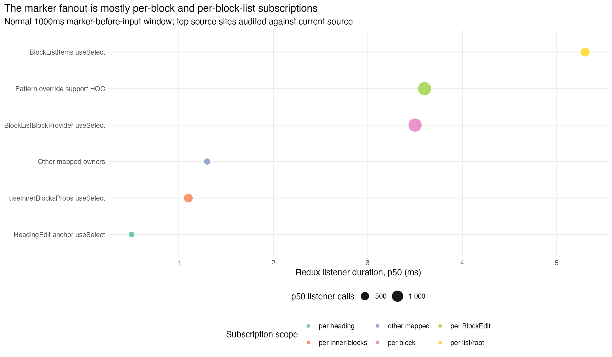

| Source site | Scope | Main selector reads | Marker p50 | Calls |
| ----------- | ----- | ------------------- | ---------: | ----: |
| `block-list/index.js:196` `BlockListItems` | per block list/root | order, selected IDs, visible blocks, zoom, template lock, editing mode, appender eligibility | `5.3ms` | `580` |
| `pattern-overrides.js:40` HOC | per `BlockEdit` wrapper | block-editor settings and supported binding attributes for this block name | `3.6ms` | `1,437` |
| `block-list/block.js:563` `BlockListBlockProvider` | per rendered block | block record/attributes, selection, mode, movement/removal, variation, section, overlay, same-name blocks | `3.5ms` | `1,437` |
| `inner-blocks/index.js:195` `useInnerBlocksProps` | per inner-blocks wrapper | block name/type, zoom, template lock, root/parent IDs, editing mode, layout/settings, section root | `1.1ms` | `580` |
| `heading/edit.js:35` `HeadingEdit` | per heading block | global anchor setting and global table-of-contents block count | `0.5ms` | `202` |
| other mapped owners | mixed | aggregate of the remaining source-mapped `useSelect` owners | `1.3ms` | `261` |

This narrows the invalidation-boundary question. The big sites are not
expensive individual callbacks. They are subscriptions mounted once per rendered
block, once per `BlockEdit` wrapper, or once per block list / inner-blocks
wrapper. A paragraph text update therefore reaches a large subscription surface:
`core/block-editor` has an effective state change, the store wrapper calls every
subscriber for that store, and these broad per-block/list selectors then decide
whether their own mapped value changed. For most blocks, the semantic answer is
probably "no"; the measured cost is paying to ask that question thousands of
times.

The fixture count lines up with that interpretation. The large-post asset has
`1,436` existing blocks (`638` paragraphs, `393` list items, `202` headings,
`95` lists, `91` quotes, and `17` images), and the benchmark inserts one more
paragraph before typing. The per-`BlockEdit` and per-rendered-block listener
counts are therefore `1,437`, which is one wakeup per block in the fixture even
though the typed character changes only the inserted paragraph.

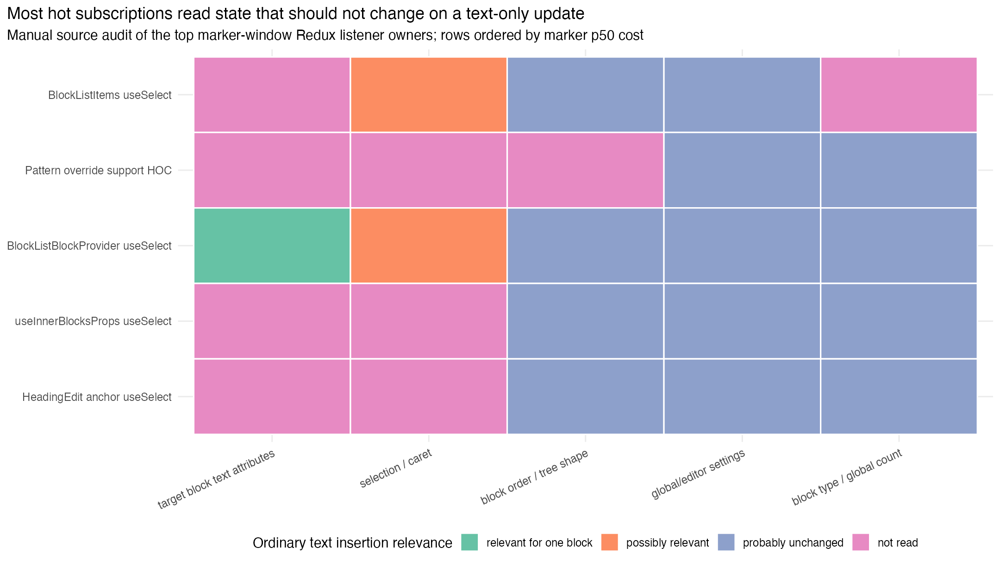

The selector-dependency audit makes the optimization target more specific:

-   `BlockListBlockProvider` is the only top site with a direct text-attribute
    dependency, and that is direct only for the one edited paragraph. The other
    `~1436` instances are woken to check block identity, selection, block type,
    order, section ancestry, and capability state.
-   `BlockListItems` and `useInnerBlocksProps` are mostly block-list, layout,
    order, visibility, zoom, and editing-mode subscriptions. Those are important
    for structural editor changes, but an ordinary character inserted into an
    existing paragraph should not change the block tree.
-   `Pattern override support HOC` is mounted per `BlockEdit` wrapper but reads
    global block-editor settings plus `props.name`; it does not read content.
    Waking this once per block on every text input looks like avoidable broad
    invalidation unless those settings or block names are changing.
-   `HeadingEdit`'s hot `useSelect` reads anchor settings and the global
    table-of-contents block count. The `202` heading instances are woken when
    typing in a paragraph even though neither heading count nor global settings
    should change.

That disconfirms a stronger "these are all necessary per-character checks"
reading. Some subscription wakeups are plausibly necessary because selection and
caret state can move on input. But most of the measured hot surface is either
global, block-tree structural, or block-identity work. The likely product
direction is not to micro-optimize these callbacks; it is to avoid waking
thousands of store-level subscribers whose selected state cannot change for a
text-only attribute update, or to split text-update-sensitive state from
block-tree/global invalidations.

I then turned that source audit into a conservative opportunity estimate. This
is not a projected benchmark win; it is a triage of the normal marker-before-input
fanout by whether an ordinary paragraph text update should be able to affect the
selector's result.

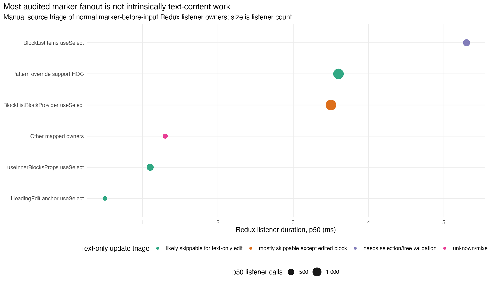

The audited top owner rows sum to `15.3ms` p50 and `4,497` listener calls in the
normal marker-before-input window. Of that, `8.7ms` and `3,655` listener calls
are in rows that are either clearly not text-content work or are
`BlockListBlockProvider` instances other than the edited block. The large
remaining validation bucket is `BlockListItems` at `5.3ms` / `580` calls: it does
not read content attributes, but it does read selection, visible block list, and
block-tree/editor state, so it needs a more careful prototype before calling it
avoidable.

| Triage bucket | p50 duration | Listener calls | Estimated skippable p50 |
| ------------- | -----------: | -------------: | ----------------------: |
| likely skippable for text-only edit | `5.2ms` | `2,219` | `5.2ms` |
| mostly skippable except edited block | `3.5ms` | `1,437` | `3.5ms` |
| needs selection/tree validation | `5.3ms` | `580` | `0.0ms` |
| unknown/mixed | `1.3ms` | `261` | `0.0ms` |

The practical next prototype is therefore sharper than "make useSelect faster":
avoid waking per-`BlockEdit` pattern-override subscriptions on text edits; avoid
waking non-edited `BlockListBlockProvider` instances for attribute-only changes;
then separately test whether `BlockListItems` can be guarded by block-order and
selection-version checks.

I made that prototype order explicit in a guard-candidate matrix. The point is
to separate "large possible exposure" from "safe first patch." The broad
store-partition / branch-aware notification idea has the largest possible upside
because it could avoid waking block-tree subscribers for persistence-only root
changes, but it also changes subscription semantics. The first local prototypes
should be narrower: cache or guard the pattern-override HOC by block name plus
settings version, and guard `HeadingEdit`'s anchor selector by anchor settings
plus table-of-contents block-count version.

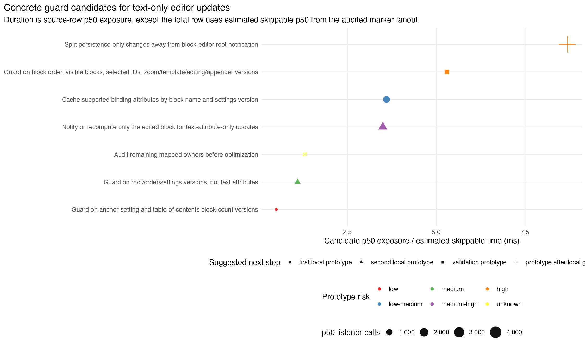

| Candidate | Exposure | Calls | Risk | Suggested next step |
| --------- | -------: | ----: | ---- | ------------------- |
| Split persistence-only changes away from block-editor root notification | `8.7ms` skippable of `15.3ms` audited | `3,655` skippable of `4,497` | high | prototype after local guards |
| Cache supported binding attributes by block name and settings version | `3.6ms` | `1,437` | low-medium | first local prototype |
| Guard on anchor-setting and table-of-contents block-count versions | `0.5ms` | `202` | low | first local prototype |
| Notify or recompute only the edited block for text-attribute-only updates | `3.5ms` | `1,437` | medium-high | second local prototype |
| Guard on root/order/settings versions, not text attributes | `1.1ms` | `580` | medium | second local prototype |
| Guard on block order, visible blocks, selected IDs, zoom/template/editing/appender versions | `5.3ms` | `580` | high | validation prototype |
| Audit remaining mapped owners before optimization | `1.3ms` | `261` | unknown | defer |

That audit ranking changes the engineering recommendation. Do not start by
removing `BlockListItems` wakeups just because they are large: that selector is
selection/tree/appender-sensitive and needs behavior tests around selection,
visibility, insertion, template lock, zoom, and content-only editing. A safer
sequence is: first prototype the settings/name guards, then a clientId-specific
attribute guard for non-edited `BlockListBlockProvider` instances, then validate
a `BlockListItems` structural-version guard. Only after those local guards are
understood should the broader store-partition or branch-aware subscriber
notification design be considered.

I added one more validation-burden view because exposure alone is the wrong
optimization order. The question is not just "how many milliseconds are in this
bucket?" It is also "what user-visible state can go stale if the guard is
wrong?"

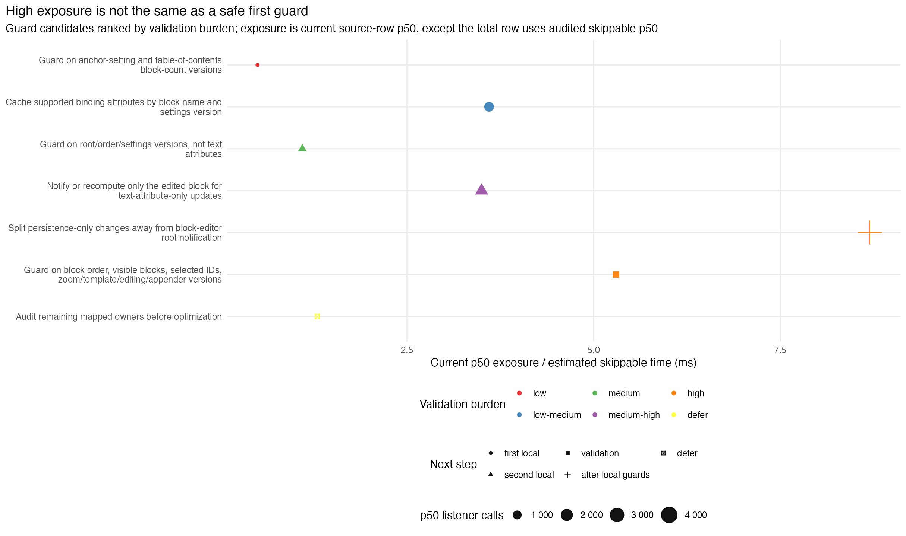

| Candidate | Exposure | Validation burden | Required behavior checks | Stale-state failure mode |
| --------- | -------: | ----------------- | ------------------------ | ------------------------ |
| Cache supported binding attributes by block name and settings version | `3.6ms` | low-medium | text insertion; binding-support settings change; block-name variation; pattern override behavior | block binding UI/support state goes stale after settings or block-name changes |
| Guard heading anchor selector by anchor-setting and TOC-count versions | `0.5ms` | low | text insertion outside headings; `generateAnchors` toggle; table-of-contents block insertion/removal | heading anchor affordance or table-of-contents-dependent behavior goes stale |
| Recompute only the edited `BlockListBlockProvider` for text-attribute updates | `3.5ms` | medium-high | edited block updates; non-edited blocks stay fresh after selection, variation, movement/removal, overlay, and template-mode changes | non-edited block identity, selection, movement/removal, variation, or overlay UI goes stale |
| Guard `useInnerBlocksProps` by root/order/settings versions | `1.1ms` | medium | text insertion; child insertion/removal/reorder; zoom, template-lock, editing-mode, and layout changes | inner-block layout, root, lock, zoom, or editing-mode state goes stale |
| Guard `BlockListItems` by structural/selection versions | `5.3ms` | high | text insertion plus selection, visible block list, appender, template lock, zoom, insert/remove/reorder, and multi-select flows | block list selection, visibility, appender, template, zoom, or structural UI goes stale |
| Split persistence-only changes away from block-editor root notification | `8.7ms` skippable | high | all local-guard checks plus `useBlockSync` persistence-transition behavior and direct `isLastBlockChangePersistent` consumers | persistence marker stops driving the correct `onInput`/`onChange` transition, or external consumers miss the signal |

This closes the next planning gap. The first patches should be the
settings/name guards even though `BlockListItems` and the store-partition idea
have larger headline exposure. `BlockListItems` needs to prove selection,
visible-list, appender, zoom, template-lock, and structural behavior first. The
store-partition idea needs to preserve the persistence signal used by
`useBlockSync`, so it is not a first patch unless the local guards fail to
produce the expected shape.

I then converted the guard matrix into a cumulative implementation frontier.
This treats validation burden as a cost score and only counts p50 as
"conservatively skippable" when the source audit says an ordinary paragraph
text update should not affect that selector's result. `BlockListItems` is shown
as unvalidated potential because it is large but selection/tree sensitive.

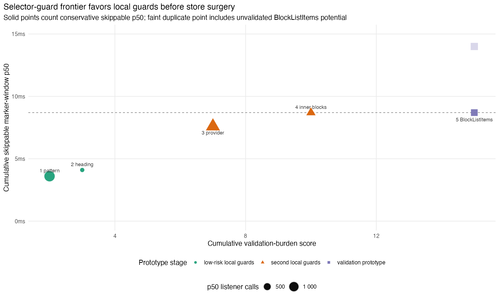

| Stage | Candidates | Cumulative burden score | Conservative skippable p50 | Share of audited marker fanout | Share of conservative skippable p50 |
| ----- | ---------- | ----------------------: | -------------------------: | -----------------------------: | ----------------------------------: |
| low-risk local guards | pattern override settings/name; heading anchor setting/count | `3` | `4.1ms` | `26.8%` | `47.1%` |
| second local guards | non-edited block provider; inner-blocks root/order | `10` | `8.7ms` | `56.8%` | `100.0%` |
| validation prototype | block-list structural/selection | `15` | `8.7ms` conservative; `14.0ms` if validated | `56.8%` conservative; `91.5%` if validated | `100.0%` |

That makes the next engineering decision more concrete. The low-risk local
guards alone cover almost half of the conservative skippable marker-window p50.
Adding the non-edited block-provider and inner-block guards covers all of the
currently conservative skippable p50 in the audited top rows. `BlockListItems`
should not be counted as a win until a structural/selection-version prototype
survives behavior tests; if it does, the reachable local-guard envelope rises
from `8.7ms` to about `14.0ms` of the `15.3ms` audited marker-window p50. That
still does not make store-partition work a first patch: store partition overlaps
the local-guard envelope and has to preserve the `useBlockSync` persistence
contract.

I then audited the source shape of those "first local" guards. That changed the
first-patch recommendation. The pattern-override row is cleaner than the earlier
cache wording: the visible controls are already selected-only, but the support
check is still subscribed once per `BlockEdit` wrapper
(`packages/editor/src/hooks/pattern-overrides.js`). The HOC computes
`isSupportedBlock` for every block, then only renders
`ControlsWithStoreSubscription` when `props.isSelected && isSupportedBlock`. A
selected-only child component would preserve that visible condition while
reducing the support-check subscription from every rendered block to the
selected block.

The heading row goes the other way. `HeadingEdit` reads
`settings.generateAnchors || getGlobalBlockCount( 'core/table-of-contents' ) >
0` and uses that result both in the anchor-generation effect and in
`onContentChange` (`packages/block-library/src/heading/edit.js`). Existing
headings need to react when the global setting changes or a table-of-contents
block appears. A component-local memo does not remove the per-heading store
subscription; this needs a shared/global capability signal or broader
invalidation support before its `0.5ms` can be counted as a local guard win.

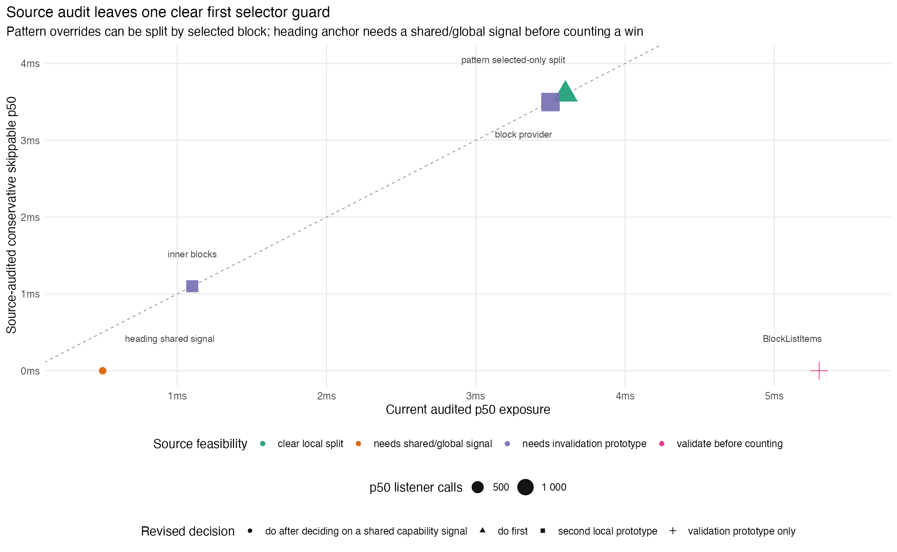

| Source site | Current p50 | Source-audited conservative skippable p50 | Source finding | Revised decision |
| ----------- | ----------: | ----------------------------------------: | -------------- | ---------------- |
| Pattern override support HOC | `3.6ms` / `1,437` calls | `3.6ms` / `1,436` calls | Controls are already selected-only; only the support-check subscription is mounted per block. | Do first as a selected-only split. |
| `HeadingEdit` anchor selector | `0.5ms` / `202` calls | `0.0ms` counted | Existing headings must observe global anchor capability and table-of-contents count changes. | Do only after deciding on a shared/global signal. |
| `BlockListBlockProvider` | `3.5ms` / `1,437` calls | `3.5ms` / `1,436` calls | Only the edited paragraph needs changed text attributes, but the selector also carries selection, movement, overlay, variation, and identity state. | Second local prototype. |
| `useInnerBlocksProps` | `1.1ms` / `580` calls | `1.1ms` / `580` calls | Structural/root/settings selector; needs a versioned root/order/settings boundary. | Second local prototype. |
| `BlockListItems` | `5.3ms` / `580` calls | `0.0ms` counted | Large and not content-attribute work, but it owns block-list selection, appender, and visibility state. | Validation prototype only. |

That corrects the source-feasible local envelope. The clearly local first patch
is the pattern-override selected-only split, worth about `3.6ms` p50 in the
audited marker window. Heading remains semantically low risk, but it is not a
simple local selector guard. After this source audit, the conservative
source-feasible envelope is `8.2ms`, or `94.2%` of the earlier `8.7ms`
conservative estimate; the missing `0.5ms` is the heading selector until a
shared/global anchor-capability signal exists. At the time of that audit there
was no focused web unit test for either source-site behavior. The
pattern-override patch now adds the focused HOC coverage; the heading path still
needs web coverage for `generateAnchors` plus table-of-contents
insertion/removal before it should change.

I then re-ranked the current selector-guard action stack after that source
feasibility correction. This is the current implementation order, not the older
"low-risk guards" shorthand:

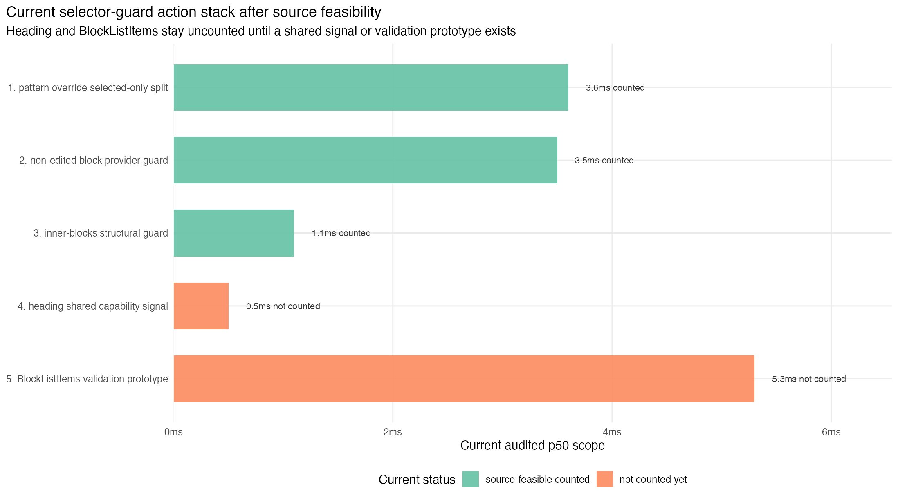

| Action | Current p50 scope | Counted source-feasible p50 | Current status |
| ------ | ----------------: | --------------------------: | -------------- |
| Pattern override selected-only split | `3.6ms` | `3.6ms` | implemented locally; source-span collapse confirmed |
| Non-edited `BlockListBlockProvider` guard | `3.5ms` | `3.5ms` | prototype local invalidation |
| `useInnerBlocksProps` structural guard | `1.1ms` | `1.1ms` | prototype local invalidation |
| Heading shared capability signal | `0.5ms` | `0.0ms` | not counted until a shared/global signal exists |
| `BlockListItems` structural/selection guard | `5.3ms` | `0.0ms` | not counted until behavior validation passes |

This closes a small but important recommendation gap. The first local patch is
not "pattern override plus heading"; it is the pattern-override selected-only
split. That patch is now implemented locally with a focused test seam. The local
guard envelope then comes from non-edited block-provider and inner-blocks
invalidation prototypes. Heading is a shared-signal design problem, and
`BlockListItems` is still a validation prototype even though both are real
ordinary-text opportunities.

I then made the first-patch test gap explicit. Before this change, the
pattern-override HOC was registered as a side-effect-only filter from
`packages/editor/src/hooks/index.js`; `withPatternOverrideControls` itself was
not exported. The patch adds the small test seam by exporting the HOC while
leaving the same filter registration in place. The existing reducer tests cover
pattern override editing modes, and there are toolbar/dropdown-adjacent tests;
the new focused web unit test now asserts the pattern-override BlockEdit filter
behavior directly.

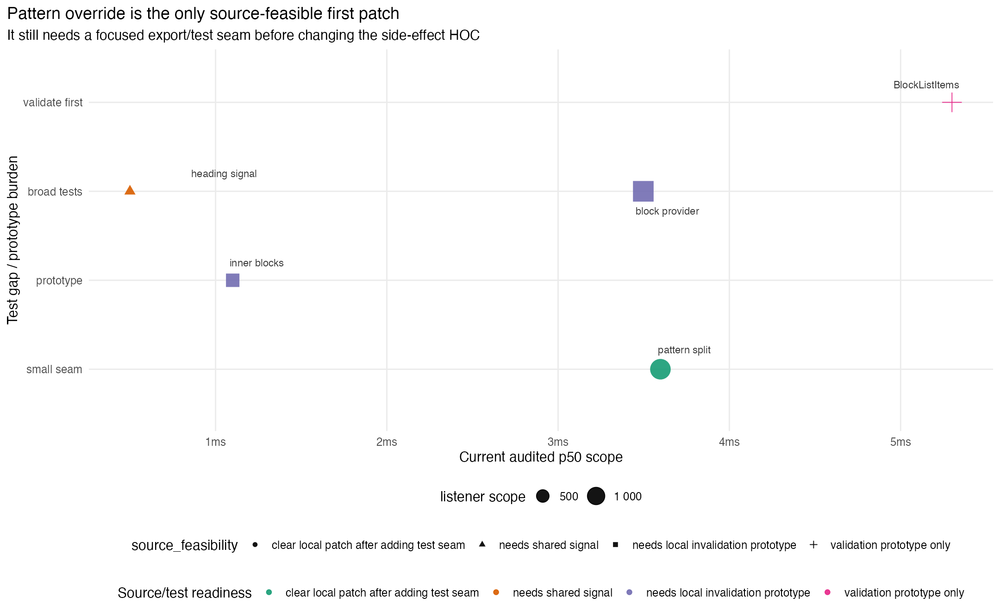

| Candidate | Current p50 scope | Test/prototype burden | Missing test surface | Recommended next |
| --------- | ----------------: | --------------------- | -------------------- | ---------------- |
| Pattern override selected-only split | `3.6ms` / `1,436` listeners | export/test seam added | selected supported block, selected unsupported block, unselected supported block, selection transition, selected settings support change, unsynced reset control | Source-span collapse confirmed; move to provider and inner-block prototypes. |
| Heading shared anchor capability | `0.5ms` / `202` listeners | broad tests plus shared signal design | web tests for `generateAnchors` setting changes and table-of-contents insertion/removal | Design signal before optimizing. |
| Non-edited `BlockListBlockProvider` guard | `3.5ms` / `1,436` listeners | local invalidation prototype | edited block update; non-edited selection, variation, movement/removal, overlay, template mode, block identity | Prototype after pattern override. |
| `useInnerBlocksProps` structural guard | `1.1ms` / `580` listeners | local invalidation prototype | text insertion; child insert/remove/reorder; zoom; template lock; editing mode; layout/root changes | Prototype after pattern override. |
| `BlockListItems` structural/selection guard | `5.3ms` / `580` listeners | validate before counting | selection, visible list, appender, template lock, zoom, insert/remove/reorder, multi-select | Validate before counting a win. |

This closes the immediate "is the first patch actually ready?" question. It is
ready as a small patch because it now includes its own test seam and focused
behavior coverage. The expected local scope is `3.6ms`, which is `43.9%` of the
`8.2ms` source-feasible local guard envelope. That is smaller than the whole
persistence marker fanout, but it is the only high-impact row that is both
source-feasible and does not require a new invalidation contract.

The source-level patch contract is now explicit. The derived audit is in
`data/typing-delay-selector-guard-prototype-contract-audit.csv`; the important
engineering split is:

| Candidate | Why it can or cannot skip ordinary text updates | Required contract | Decision |
| --------- | ----------------------------------------------- | ----------------- | -------- |
| Pattern override selected-only split | `pattern-overrides.js` already rendered controls only when `props.isSelected`, but the support-check `useSelect` ran before that gate for every `BlockEdit` wrapper. A newly selected block can read current settings on mount. | The patch moves the support-check `useSelect` into a selected-only child, then mounts `ControlsWithStoreSubscription` only for selected supported blocks; the HOC is exported for focused tests. | Implemented locally; post-patch source-span microscope confirms selected-block-scale mount count. |
| Heading shared anchor capability | The selector reads global `generateAnchors` settings and `core/table-of-contents` count; every heading must react to those global changes. | Add or reuse a shared capability signal before removing per-heading subscriptions, with web tests for setting toggles and table-of-contents insertion/removal. | Do not include in the first patch. |
| Non-edited `BlockListBlockProvider` guard | Only the edited block needs the changed text attributes, but the selector also owns selection, variation, movement, overlay, section, settings, and identity props. | Prototype a memoized/block-scoped selected-props boundary; component memo alone is not enough because `useSelect` still wakes on the store-root change. | Prototype after pattern override. |
| `useInnerBlocksProps` structural guard | Text attributes do not affect root/drop-zone/layout props unless block name, editing mode, parent/root, template lock, section root, block settings, layout, or zoom changes. | Prototype a root/order/settings version boundary or memoized selector output. | Prototype after pattern override. |
| `BlockListItems` structural/selection guard | Paragraph content attributes are not read, but this selector owns row order, selected ids, visible blocks, zoom state, preview mode, and appender eligibility. | Prototype a structural/selection/appender render key and behavior tests before counting the `5.3ms` opportunity. | Validation prototype only. |

This turns the selector-guard open question from "which low-risk guards?" into a
patch sequence. The first patch is just the pattern override support check. The
acceptance test is not a lower p50 by itself; it is that selected supported and
unsupported blocks behave correctly, unselected blocks do not mount the support
subscription, settings changes still update while selected, and synced/unsynced
pattern controls keep their current behavior. The patch now satisfies that
behavior contract locally; the measured p50/source-span win should be checked
after rebuilding the performance assets.

The first-patch implementation audit makes the split exact. Before this patch,
`packages/editor/src/hooks/pattern-overrides.js` had
`withPatternOverrideControls` run the support-check `useSelect` for every
`BlockEdit` wrapper:
`getSettings().__experimentalBlockBindingsSupportedAttributes[ props.name ]`.
Only after that check did it apply the already-selected visible condition,
`props.isSelected && isSupportedBlock`. `ControlsWithStoreSubscription` was
already behind that visible condition and already existed to avoid mounting its
editor-store subscription on every block.

I implemented that first patch locally. `withPatternOverrideControls` is now a
named export for testing, and the outer HOC renders the support-check child only
when `props.isSelected`. The selected-only child reads the current
`__experimentalBlockBindingsSupportedAttributes` setting, returns `null` for
unsupported selected blocks, and mounts `ControlsWithStoreSubscription` only for
selected supported blocks.

The patch contract is therefore narrow:

| Implementation question | Answer | Required contract |
| ----------------------- | ------ | ----------------- |
| What exactly moved? | only the support-check `useSelect` | the outer HOC mounts a selected-only child only when `props.isSelected`; that child runs the support check and returns `ControlsWithStoreSubscription` only for supported selected blocks |
| What stayed gated? | `ControlsWithStoreSubscription` | editor-store, block-editing-mode, pattern-source, synced/unsynced pattern, and metadata-binding reads remain inside the selected/supported path |
| Why is this safe for unselected blocks? | unselected blocks already render no pattern override UI | when a block later becomes selected, it mounts the child and reads current settings then; there is no unselected subscription just to precompute support |
| How are settings changes handled? | live only while selected | while selected, the support-check `useSelect` remains subscribed and dependent on `props.name`; settings or block-name changes recompute the support result |
| What is the least invasive test seam? | named export without changing filter registration | export the HOC for `packages/editor/src/hooks/test/pattern-overrides.js`, while keeping the existing `addFilter( 'editor.BlockEdit', ... )` side effect |
| What is not part of this patch? | every other selector row | do not bundle heading, `BlockListBlockProvider`, `useInnerBlocksProps`, `BlockListItems`, or store-partition changes |
| How should success be measured? | behavior first, then source spans | unit coverage now passes; after rebuilding performance assets, rerun the compact source-span measurement and require the pattern-override support-HOC listener count to collapse to selected-block scale; use aggregate p50 as confirmation |

This removes the last ambiguity from the "low-risk selector guards" row. It is
not a cache-by-block-name patch and not a settings-version invalidation design.
It is a mount-boundary patch: do not mount the support-check selector until the
block is selected. The focused unit test now covers six cases: unselected blocks
do not call `useSelect`, selected unsupported blocks do not mount the
store-backed controls path, selected supported blocks still show pattern
override controls, selection transition reads current settings, selected support
settings can update, and the unsynced reset control still stays behind the
selected supported path. The remaining uncertainty is empirical, not
architectural: the rebuilt source-span microscope shows the support-check mount
fanout collapsed. Aggregate before/after p50 remains a separate confirmation
run if the patch needs a production magnitude claim.

### Pattern Override Post-Patch Source-Span Check

I rebuilt the performance assets with `npm run build -- --skip-types` and ran a
compact all-data-spans microscope on the large-post paragraph workload at the
`1000ms` keyboard delay. The successful run used
`BENCHMARK_SETUP_STYLE=benchmark-live-editor`,
`BENCHMARK_TRACE_DATA_SPANS=1`, `BENCHMARK_TRACE_ALL_DATA_SPANS=1`,
`BENCHMARK_USE_BROWSER_TRACE=0`, one round, and three typed samples. The raw
artifact is `87MB`, so this is a source-span fanout check, not an aggregate p50
replacement.

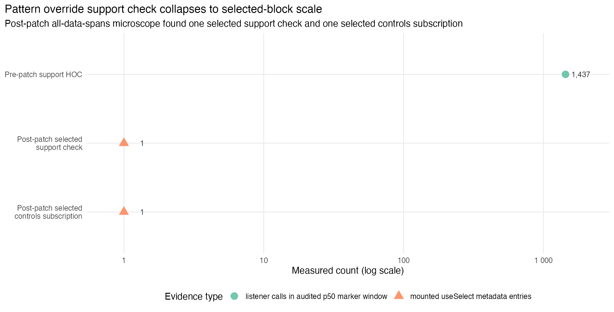

| Row | Evidence | Count | Source-span detail |
| --- | -------- | ----: | ------------------ |
| Pre-patch support HOC | audited marker-window listener calls | `1,437` | `packages/editor/src/hooks/pattern-overrides.js:40`, about `3.6ms` p50 scope |
| Post-patch selected support check | mounted `useSelect` metadata entries | `1` | `useSelectId=14695`, `6` `useSelect.onChange` events and `0.60ms` total span time over the three-sample microscope |
| Post-patch selected controls subscription | mounted `useSelect` metadata entries | `1` | `useSelectId=14697`, `9` `useSelect.updateValue` events and no measured listener fanout in the microscope |

This confirms the source-level fanout claim for the first selector-guard patch:
the editor-side `__experimentalBlockBindingsSupportedAttributes` support check
is no longer mounted for every `BlockEdit` wrapper. The broader block-editor
binding UI still has many support-attribute selectors; those are separate
`block-editor` owners and are not the pattern-override HOC row.

Two harness caveats are worth keeping in the report. A CI-style
`BENCHMARK_SETUP_STYLE=ci-post-editor-typing` run with `locator.type()` failed
after text entry because the target locator was
`getByRole( 'document', { name: /Empty block/i } )`; once text is typed, that
accessible name changes and the delayed locator target can go stale. A larger
33-key all-data-spans run reached the typing step but failed at JSON
serialization with `RangeError: Invalid string length`. All-spans diagnostics
therefore need microscope-sized runs or a streaming/summarized output path.

I also used the same artifact plus source maps to ask the next question: after
the pattern-override row collapses, what is still hot? The answer is not "all
per-block selectors". Several rows are mounted at per-block scale but are cold
in this typed window. The hot residual rows are still the block-list owners.

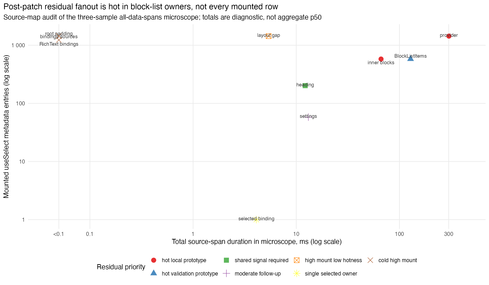

| Residual owner | Metadata entries | Source-span events | Total span time | Interpretation |
| -------------- | ---------------: | -----------------: | --------------: | -------------- |
| `BlockListBlockProvider` selected props | `1,437` | `59,467` | `301.5ms` | largest residual post-patch owner; still mixes text attributes with selection, movement, overlay, variation, section, settings, and identity state |
| `BlockListItems` structural list | `580` | `24,363` | `128.1ms` | hot structural owner; content attributes are not read, but it owns row order, selected ids, visible blocks, zoom, preview mode, and appender eligibility |
| `useInnerBlocksProps` structural props | `580` | `23,973` | `66.3ms` | hot structural owner; ordinary text updates should not need root/drop-zone/layout props unless root, order, settings, editing mode, layout, or zoom changes |
| `useSettings` block settings | `58` | `2,418` | `13.1ms` | moderate residual owner; defer until larger boundaries are understood |
| `HeadingEdit` anchor capability | `202` | `8,340` | `12.2ms` | real but not a local memo row; headings must observe global `generateAnchors` and table-of-contents capability |
| Layout block-gap hook | `1,437` | `3,813` | `5.4ms` | high mount count, low typed-window hotness |
| Layout root-padding hook | `1,438` | `12` | `0.0ms` | cold high-mount row; mount count alone is not enough to rank it |
| BlockEdit binding sources | `1,437` | `9` | `0.0ms` | cold high-mount row in this ordinary text microscope |
| RichText binding UI support | `1,234` | `12` | `0.0ms` | separate from the pattern-override HOC and cold in this run |

This makes the next selector-guard step stricter. The next local prototype
should be `BlockListBlockProvider`, followed by `useInnerBlocksProps`.
`BlockListItems` is still a validation prototype because stale row order,
selection, visibility, zoom, preview, or appender state would be user-visible.
The cold high-mount rows should not be prioritized just because they have large
mount counts; they need a benchmark window where they are actually hot.

I then expanded that into the concrete prototype contract. The main correction:
`BlockListBlockProvider` cannot be optimized as "only selected blocks matter".
It passes public `editor.BlockListBlock` filter props, including `block`,
`attributes`, `name`, `isValid`, `canMove`, `canRemove`, and selection state.
That means the edited block must still update on ordinary typing, and any block
whose own attributes, identity, selection, structure, editability, or settings
changed must update. The skippable path is unrelated blocks whose selected-prop
dependencies did not change.

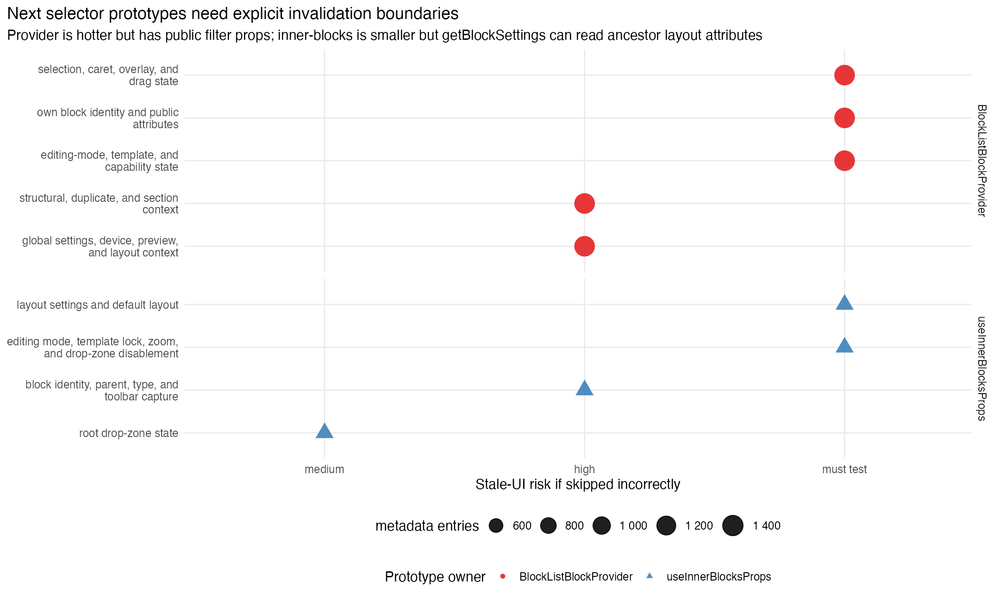

| Prototype | Hot residual scope | Why a naive skip is unsafe | Required boundary |
| --------- | -----------------: | -------------------------- | ----------------- |
| `BlockListBlockProvider` | `301.5ms` / `1,437` metadata entries | public filter props expose own `block` and `attributes`; private context owns selection, drag/overlay, editability, section, binding, visibility, and device state | per-`clientId` own-block dependency plus separate selection/interaction, structure/root, editability/capability, and settings/device invalidation keys |
| `useInnerBlocksProps` | `66.3ms` / `580` metadata entries | `getBlockSettings( clientId, 'layout' )` can read layout settings from the current block or ancestors, so an attributes-blind skip can stale layout/default-layout output | root/order/settings/editability boundary covering block identity, parent/root, template lock, zoom/section root, block support, and layout/settings changes |

The test gap is also different for the two rows. A provider prototype must cover
ordinary typing in the edited block, ordinary typing in unrelated blocks,
selection and multi-selection, child selection, block move/remove/replace,
variation/title changes, block visibility metadata, content-only/template modes,
drag/overlay/highlight, and at least one `editor.BlockListBlock` filter fixture
that observes public props. An inner-blocks prototype must cover root and nested
drop zones, zoom out, section root, parent template lock, editing mode, child
insert/remove/reorder, block type/support changes, and layout settings inherited
from the block or an ancestor. Component-only memoization is not the interesting
prototype for either row; the measured cost is the per-store-change selector
work, so the prototype needs a dependency boundary that lets unrelated text
updates reuse prior selected output.

I then checked whether the block-editor store already exposes the right version
signals for those boundaries. It mostly does not. The reducers already maintain
the underlying state slices: `blocks.attributes`, `blocks.byClientId`,
`blocks.order`, `blocks.parents`, `blocks.tree`, `selection`, `initialPosition`,
`highlightedBlock`, `draggedBlocks`, `blockVisibility`, `settings`,
`blockListSettings`, `blocks.blockEditingModes`, and
`derivedBlockEditingModes`. But those are not exposed as stable per-client or
per-root revision keys for skip decisions. The only obvious revision-like public
counter I found is the list-view expand revision, and that is unrelated to these
typed-window selectors.

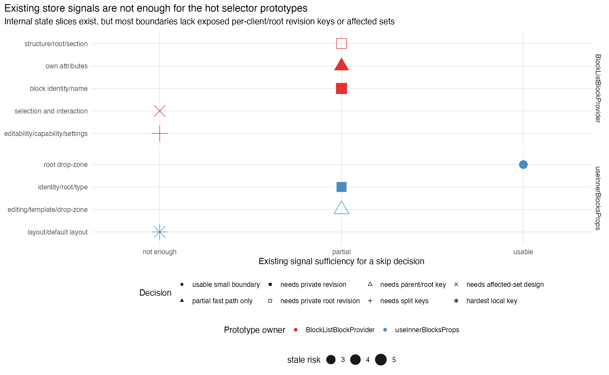

| Boundary | Existing signal | Why it is not enough |
| -------- | --------------- | -------------------- |
| Provider own attributes | `blocks.attributes` plus `lastBlockAttributesChange` | useful fast path for the latest attribute action, but not a full contract; it resets on non-attribute actions and does not cover identity, structure, settings, or selection |
| Provider identity/structure | `blocks.byClientId`, `blocks.order`, `blocks.parents`, `blocks.tree` | internal maps change on the right action families, but there is no exposed per-client/per-root revision key or affected set |
| Provider selection/interaction | `selection`, `initialPosition`, highlighted/drag state, selection-enabled state | the prototype must invalidate selected blocks, ancestors, drag/overlay/highlight participants, and roots; no single existing signal encodes that set |
| Provider editability/settings | block editing modes, derived modes, block-list settings, visibility, global settings | too many mixed client/root/global dependencies to collapse safely without split keys |
| Inner blocks root drop-zone | `isZoomOut()` and `getSectionRootClientId()` | small enough to read directly, but still not a named ordinary-text skip key |
| Inner blocks layout | `getBlockSettings( clientId, 'layout' )` | hardest local key: it can read current or ancestor attributes, global settings, and runtime filters, so an attributes-blind skip is unsafe |

The practical result is that `lastBlockAttributesChange` can help identify the
ordinary text-update case, but it is not the invalidation contract. A serious
provider prototype either needs private revision/affected-set selectors or must
keep a conservative recompute path for anything outside a tightly proven
attribute-only action. For `useInnerBlocksProps`, the root drop-zone and
identity/root pieces are smaller, but layout/default-layout cannot be skipped
until inherited layout settings and filters are accounted for.

I then pushed the next-prototype source audit down to the level of concrete
implementation gates. The useful result is a veto against another tempting
shortcut: neither hot row should be implemented as "if this block is not selected,
skip it." `BlockListBlockProvider` exposes public
`editor.BlockListBlock` filter props and builds `PrivateBlockContext` for
`useBlockProps`. A wrong skip can stale `block`, `attributes`, `name`, validity,
selection classes, drag/focus handlers, visibility classes, or wrapper props. The
only plausible cheap provider fast path is narrower: use the latest attribute
action as a hint for unrelated non-edited blocks, and disable that path for every
selection, structure, editability, settings, visibility, or non-attribute action.

`useInnerBlocksProps` has one clean slice, the root drop-zone check keyed by zoom
and section root. The full row is not that clean. The client path reads block
identity, parent/root, block type, capture-toolbar support, editing mode, parent
template lock, and `getBlockSettings( clientId, 'layout' )`. That last selector
walks the current block and ancestors, reads their `attributes.settings`, falls
back to global `__experimentalFeatures`, and allows runtime filters. The
component also drives `useNestedSettingsUpdate`, which writes
`blockListSettings` in a queued microtask. So an inner-blocks prototype must
preserve layout/settings inheritance and side effects, not just return the same
React children for ordinary text.

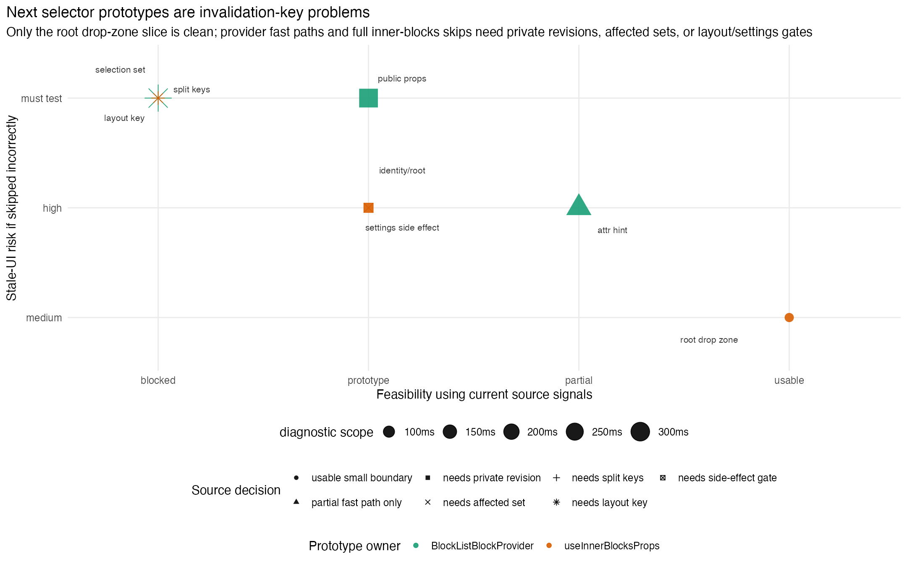

| Prototype step | Source conclusion | Decision |
| -------------- | ----------------- | -------- |
| Provider own-block public props | public filter props and private context share the selected-props object | needs private per-client revision |
| Provider last-attribute-change fast path | useful for other-client attribute-only actions, but only as an action hint | partial fast path only |
| Provider selection/interaction | selected, ancestor-selected, drag, overlay, highlight, and caret state need affected sets | needs affected set |
| Provider structure/editability/settings | index, section, template, capability, device, preview, visibility, and settings are mixed client/root/global state | needs split keys |
| Inner blocks root drop zone | root path only reads zoom and section root | usable small boundary |
| Inner blocks identity/root/type | name/root/type/support/template/editing reads lack cheap revision keys | needs private revision |
| Inner blocks layout/default layout | current/ancestor settings attributes, global settings, and filters can change layout | needs layout key |
| Inner blocks nested settings side effect | render changes drive queued `updateBlockListSettings` writes | needs side-effect gate |

I also turned that into an acceptance-gate list before any later patch claims a
p50 win. This is the audit style that avoids the previous bad reasoning: name the
state that can go stale, name the user-visible output, and require a behavior
probe before trusting a source-span reduction.

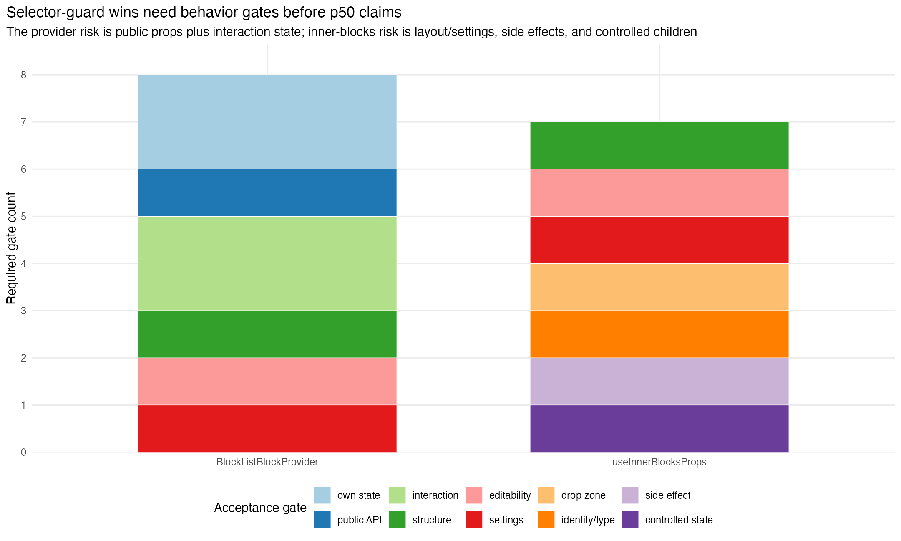

The gate count is intentionally high. For the provider, the must-pass set covers
edited content, unrelated text-only skips, public filter compatibility, selection,
child selection, multi-selection, drag/overlay/highlight, structure, duplicate
warnings, editing modes, capabilities, settings, device, visibility, and binding
affordances. For inner blocks, it covers root and nested drop zones, child
insert/remove/reorder, parent template lock, editing mode, block type/support,
toolbar capture, layout/default-layout inheritance, nested settings side effects,
and controlled inner blocks. The next credible implementation step is therefore a
small provider prototype with those gates, not another broad benchmark sweep.

I then audited the current proof level for those gates. This is the part that
keeps the selector-guard recommendation honest: a source read is not behavior
proof, and a lower source-span count is not enough if the skipped selector owns
public props or side effects.

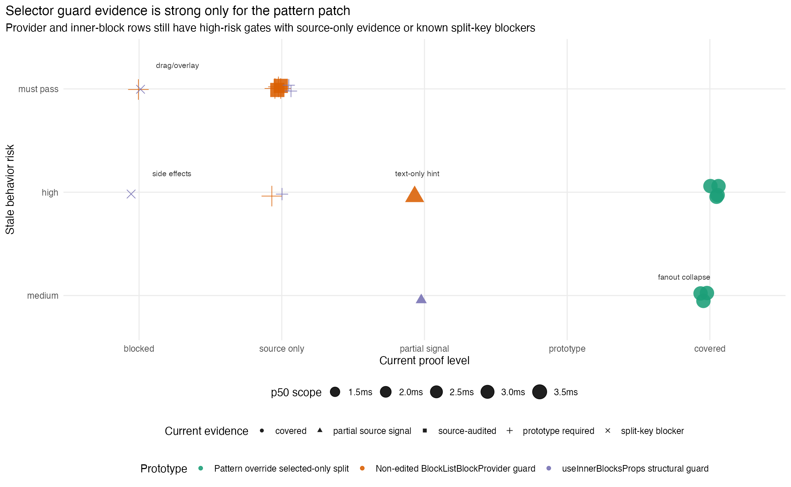

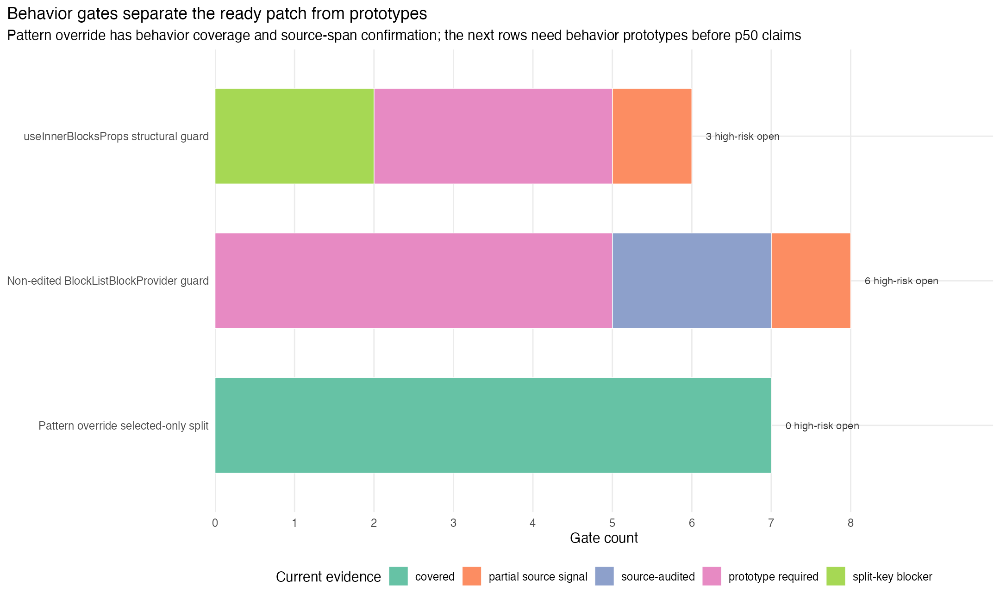

| Candidate | What is proven now | What is still open | Decision |
| --------- | ------------------ | ------------------ | -------- |
| Pattern override selected-only split | seven gates are behavior-covered or source-span-confirmed: unselected blocks do not subscribe, selected unsupported blocks avoid the store-backed controls, selected supported blocks still show controls, selection transition reads current settings, selected settings changes update, unsynced reset stays gated, and the post-patch microscope sees one selected support-check entry | aggregate before/after p50 is optional confirmation for a production magnitude claim | ready as the first patch |
| Non-edited `BlockListBlockProvider` guard | the source shape is known, and `lastBlockAttributesChange` can identify the latest attribute-action case | edited-block public props, `editor.BlockListBlock` filter compatibility, selection/child-selection/caret, drag/overlay/highlight, structure, editability, settings/device/visibility/bindings all need behavior gates | prototype a narrow latest-attribute-action fast path only; do not claim the `3.5ms` win from source evidence alone |
| `useInnerBlocksProps` structural guard | the root drop-zone slice is small and source-clean: zoom plus section root | child order, parent lock/editing mode, identity/type/support, inherited layout/default layout, `useNestedSettingsUpdate`, and controlled `useBlockSync` behavior remain unproven | split the root/drop-zone slice from the full hook; do not claim the full `1.1ms` row until layout and side effects are gated |

This answers the remaining "low-risk selector guards" open question more
precisely than the earlier risk labels. The pattern override change is low risk
because the visible UI was already selected-only and the tests now cover the
mount-boundary behavior. The provider row is not low risk in that sense:
`BlockListBlockProvider` builds the public `editor.BlockListBlock` prop surface
and the private block context. The only low-risk-looking part is the unrelated
non-edited block during an attribute-only action, and even that is only a hint
unless the prototype disables the fast path for selection, structure,
editability, settings, visibility, binding, and non-attribute actions.

The inner-blocks row has a different failure mode. The root drop-zone check can
probably be split out, but the full hook also feeds layout/default-layout props,
queued `updateBlockListSettings` writes in `useNestedSettingsUpdate`, and
controlled inner-block synchronization through `useBlockSync`. A source-span drop
that skips any of those updates would be a stale-UI bug, not a performance win.

I then pushed on the largest uncounted selector row: `BlockListItems`. The source
audit makes the split sharper. `BlockListItems` does not read paragraph content
attributes at all. Its `Items` selector in
`packages/block-editor/src/components/block-list/index.js` reads child order,
selected block ids, visible blocks, preview mode, zoom state, template/editing
mode, section status, selected block name, and appender eligibility. An ordinary
paragraph `UPDATE_BLOCK_ATTRIBUTES` changes the typed block's content attribute,
but not those block-list signals. That means the `5.3ms` / `580` listener row is
a real text-update opportunity in principle.

The same source audit also explains why I still do not count it in the
source-feasible local envelope. A bad guard would stale real UI, not just a
hidden cache: block rows and placeholders depend on order, sync/async rendering
depends on selection and visibility, zoom separators depend on zoom state, and
`BlockListAppender` visibility depends on template lock, editing mode, section
rules, selected block name, and insertion capability. I also did not find a
focused web component test for `BlockListItems`; the nearby web test coverage is
mostly `InnerBlocks` serialization, while block-list component tests here are
native or selector-level.

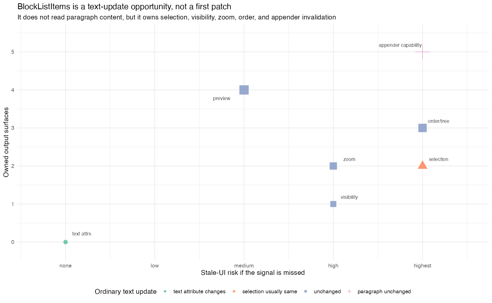

| Signal group | Read by `BlockListItems` | Ordinary paragraph text effect | Owned output / failure mode | Guard role |
| ------------ | ------------------------ | ------------------------------ | --------------------------- | ---------- |
| Paragraph content attributes | no | changed by the benchmark | no owned output; this is the avoidable wakeup | exclude from render key |
| Child order / root tree | `getBlockOrder( rootClientId )` | unchanged | block rows, placeholder, default-appender condition; stale rows if missed | root structural version |
| Selected block ids | `getSelectedBlockClientIds()` | usually unchanged after the first typed key | sync/async mode and root appender; stale selected rendering if missed | selection version |
| Visible block set | `__unstableGetVisibleBlocks()` | unchanged | async scheduling for row rendering; visible rows can be queued incorrectly | visibility version |
| Zoom state | `isZoomOut()` | unchanged | zoom separators and appender suppression | zoom version |
| Preview mode | `getSettings().isPreviewMode` | unchanged | preview short-circuit for editing affordances | settings preview version |
| Template/editing/section/appender capability | `getTemplateLock`, `getBlockEditingMode`, `isSectionBlock`, `isContainerInsertableToInContentOnlyMode`, `canInsertBlockType` | unchanged for ordinary paragraph text | appender visibility can become wrong | root/appender capability version |

This closes a narrower `BlockListItems` question: the row is not bogus, and it is
not content-dependent. It should stay out of the first-patch envelope because a
correct optimization needs a structural/selection/appender render key and web
behavior tests for selection, visibility, zoom, insertion/removal/reorder,
template/content-only sections, and appender eligibility. If that prototype is
validated, it can add the currently uncounted `5.3ms` / `580` listener calls to
the local-guard envelope; until then, treating it as a free `5.3ms` win would be
overclaiming.

I also broke down the residual `Other mapped owners` row so that it is not a
black box. That row is small: `1.3ms` p50 across `62` source-mapped sites and
`261` p50 listener calls. The nonzero p50 cost is split between
settings/block-support checks and editor chrome / selection validators. The
block-attribute style-hook rows that could plausibly depend on a block's
attributes are singleton or low-count rows with `0.0ms` p50 in this trace, so the
tail does not hide another large text-specific fanout.

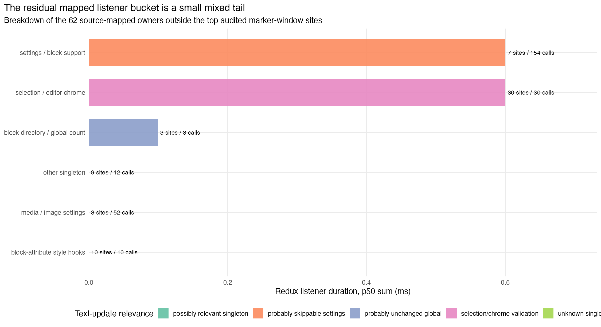

| Residual bucket | p50 duration | Calls | Source sites | Interpretation |
| --------------- | -----------: | ----: | -----------: | -------------- |
| settings / block support | `0.6ms` | `154` | `7` | mostly settings, block support, block name, or block-settings checks |
| selection / editor chrome | `0.6ms` | `30` | `30` | singleton selection, sidebar, iframe, layout, and editor UI validators |
| block directory / global count | `0.1ms` | `3` | `3` | global block-directory or block-count checks |
| media / image settings | `0.0ms` | `52` | `3` | image/media settings checks with only p90 blips |
| other singleton | `0.0ms` | `12` | `9` | long-tail singleton callbacks |
| block-attribute style hooks | `0.0ms` | `10` | `10` | possible attribute readers, but not a high-fanout p50 contributor here |

This closes the useful part of the residual-owner question. The first
optimization pass should not chase the long tail. If a later pass revisits it,
the only plausible groups are settings/block-support selectors and
selection/editor-chrome validators, and both are smaller than the already
identified pattern-override, non-edited block-provider, and `BlockListItems`
buckets.

The next source check makes the mismatch exact. The marker action itself is just
`{ type: 'MARK_LAST_CHANGE_AS_PERSISTENT' }`
(`packages/block-editor/src/store/actions.js:1638-1640`). In
`withPersistentBlockChange()`, that action returns a new block-editor state by
setting `isPersistentChange` (`packages/block-editor/src/store/reducer.js:445-471`).
It does not touch the block `attributes` map, block order, block names, block
settings, selection, or visibility. The data store then decides whether to wake
subscribers with a root object identity check: if `state !== lastState`, it
iterates every listener (`packages/data/src/redux-store/index.ts:534-559`).

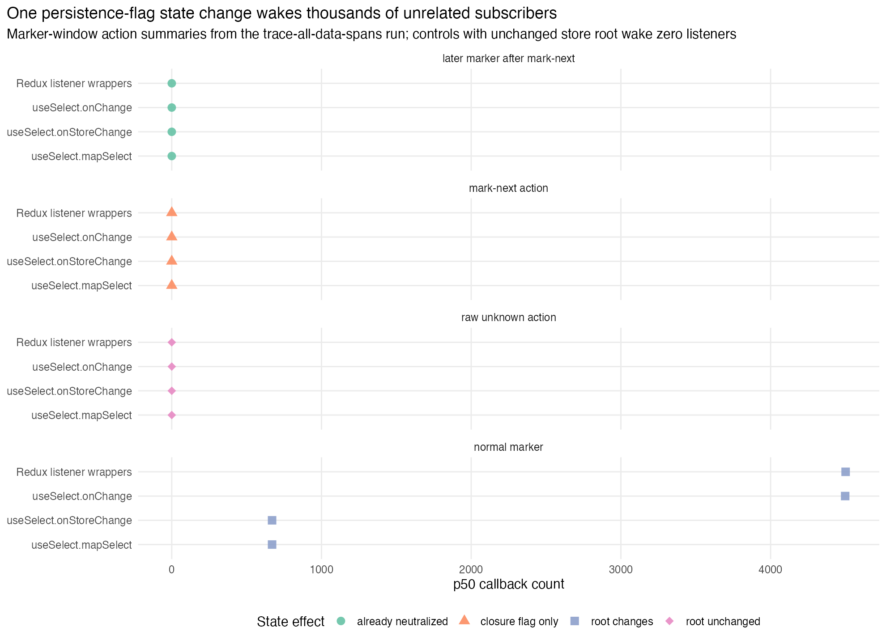

Selected marker-window control rows:

| Control | Store-root effect | Marker p50 | Redux listeners | `useSelect.onChange` |
| ------- | ----------------- | ---------: | --------------: | -------------------: |
| normal marker | root changes: `blocks.isPersistentChange` | `23.4ms` | `4,501` | `4,498` |
| raw unknown action | root unchanged: action ignored | `0.6ms` | `0` | `0` |
| mark-next action | root unchanged: closure flag only | `0.1ms` | `0` | `0` |
| later marker after mark-next | root unchanged: persistence already neutralized | `0.2ms` | `0` | `0` |

This answers the immediate "what branch causes the fanout?" question: a single
persistence flag under `blocks` is enough to change the store root and wake the
whole `core/block-editor` subscriber set. The audited hot subscribers do not
read `blocks.isPersistentChange`; they are woken because `@wordpress/data` is
coarse at the store-subscription boundary. The raw unknown action and mark-next
controls are useful because they occupy the same timer slot but do not change the
store root, and they wake zero subscribers.

This also corrects the optimization target. It is not enough to say "make
`BlockListBlockProvider` faster." The sharp mismatch is that a persistence-only
state change fans out through subscriptions whose selected values are mostly
about block tree, settings, selection, and block identity. Avoiding that requires
finer-grained invalidation, store partitioning, or a way for `useSelect`
subscribers to avoid invalidation when the changed state branch cannot affect
their selected value.

I then audited the subscription contract itself to avoid an invalid "fix." The
marker cannot simply be silenced. `useBlockSync` subscribes to the
`core/block-editor` store and reads `isLastBlockChangePersistent()`;
when a previous block edit becomes persistent without a block-array identity
change, it uses that transition to send the parent `onChange` instead of
`onInput` (`packages/block-editor/src/components/provider/use-block-sync.js`).
So a correct store-boundary fix must keep a persistence notification for
persistence-aware subscribers while avoiding ordinary `useSelect` invalidation
for selectors that do not read that branch.

The current `useSelect` mechanics explain why this is not a one-line local
change. `useSelect` records which store names were read, not which selectors or
state branches were read. When the block-editor store root changes, the
subscription wrapper invalidates every `useSelect` value subscribed to that
store before any selector can prove its selected value stayed the same
(`packages/data/src/components/use-select/index.ts`). The registry emitter can
pause/resume notifications, but resume still notifies all pending listeners for
the store; it does not filter by branch.

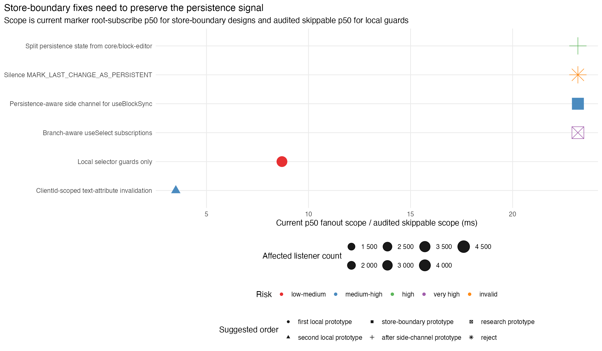

| Design | Preserves persistence semantics? | Avoids ordinary `useSelect` fanout? | Risk | Suggested order |
| ------ | -------------------------------- | ---------------------------------- | ---- | --------------- |
| Local selector guards only | yes | partial | low-medium | first local prototype |
| ClientId-scoped text-attribute invalidation | yes | partial for text updates | medium-high | second local prototype |
| Persistence-aware side channel for `useBlockSync` | yes | yes for persistence-only markers | medium-high | store-boundary prototype |
| Split persistence state from `core/block-editor` | yes if public selector compatibility is addressed | yes for persistence-only markers | high | after side-channel prototype |
| Branch-aware `useSelect` subscriptions | yes | yes if dependencies are correct | very high | research prototype |
| Silence `MARK_LAST_CHANGE_AS_PERSISTENT` | no | yes | invalid | reject |

This narrows the store-boundary open question. The right target is not "avoid
the marker action"; that would break the persistence transition used by
`useBlockSync`. The plausible target is a two-channel notification path: keep a
small persistence-aware signal for `useBlockSync` and any direct consumers of
`isLastBlockChangePersistent()`, but stop waking the thousands of ordinary
block-editor `useSelect` subscribers whose selected values cannot depend on
`blocks.isPersistentChange`. Local guards are still the safer first prototypes,
but the store-boundary prototype should be evaluated as a subscriber-partition
problem, not as a marker-removal problem.

I then re-audited that subscriber-partition idea against the current registry
source. This corrects one earlier concern and exposes a sharper compatibility
constraint. `useSelect` subscribes to specific stores through
`registry.subscribe( onChange, storeName )`, so it is on the store emitter path.
`useBlockSync` also subscribes to the block-editor store, not to the no-store
global registry emitter: it calls `registry.subscribe( listener,
blockEditorStore )`. That makes an explicit `useBlockSync` side channel more
local than a global-registry migration would be. The hard part is now the public
selector contract: `isLastBlockChangePersistent()` is documented on the
`core/block-editor` selector surface, while `useSelect` currently knows only
active store names, not selector names or state branches.

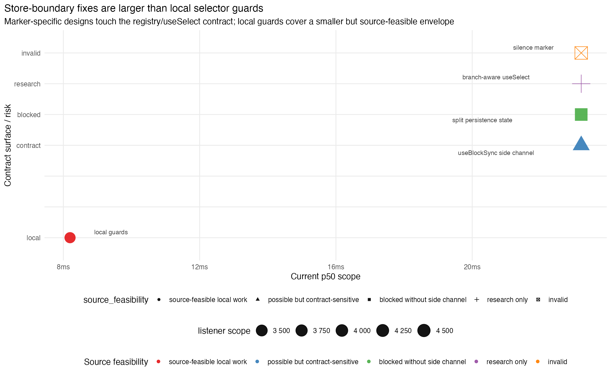

| Design | Current p50 scope | Source finding | Compatibility risk | Revised recommendation |
| ------ | ----------------: | -------------- | ------------------ | ---------------------- |
| Source-feasible local selector guards | `8.2ms` / `3,452` listeners | Pattern override can be split by selected block; block-provider and inner-blocks need local invalidation prototypes; no data subscription contract change. | Local stale UI risk only; covered by component behavior tests. | Do before store-boundary work. |
| Persistence-aware `useBlockSync` side channel | `23.2ms` / `4,498` `useSelect` listeners | `useBlockSync` is a store-specific block-editor subscriber, so it can be migrated to an explicit persistence-aware path more locally than a global-registry subscriber could. | The side channel can preserve `useBlockSync`, but not public `isLastBlockChangePersistent()` `useSelect` consumers by itself. | Research after local guards; prototype the side channel before changing public notification semantics. |
| Split persistence state out of block-editor root | `23.2ms` / `4,498` listeners | Moving the flag avoids the block-editor root change only if selector and notification semantics are replaced. | `isLastBlockChangePersistent()` is documented as a public selector; external consumers can observe stale state or miss the transition unless compatibility is explicitly handled. | Do only after a side-channel design and public-selector compatibility decision. |
| Branch-aware `useSelect` dependencies | `23.2ms` / `4,498` listeners | `useSelect` records store names, not selector names, state branches, or dynamic selector dependencies. | Broad data contract change; selectors can read conditionally and across stores. | Treat as a separate data-layer research project. |
| Silence `MARK_LAST_CHANGE_AS_PERSISTENT` | `23.2ms` / `4,501` listeners | Removes the persistence transition that `useBlockSync` uses to convert a previous transient edit into parent `onChange`. | Breaks editor semantics to make the benchmark faster. | Reject. |

This tightens the ordering again. The store-boundary problem is real and larger
than the source-feasible local guard envelope (`23.2ms` marker fanout versus
`8.2ms` source-feasible local guards), but it is not the next patch. The corrected
source audit makes the side-channel prototype more plausible for Gutenberg's
known in-tree semantic consumer: `useBlockSync` can move from a store-wide
subscription to a persistence-specific one. It does not by itself solve the
documented public selector contract. Splitting the persistence flag out of the
block-editor root could preserve `isLastBlockChangePersistent()` as a value while
making existing public `useSelect` consumers miss the transition. So the current
engineering order is: local selected-only / local invalidation guards first;
validate a `useBlockSync` persistence side channel second; decide the public
selector notification contract before using that split for a performance win;
branch-aware `useSelect` only as broader data-layer research.

The corrected contract-risk audit is:

| Contract surface | Deeper conclusion | Prototype implication |
| ---------------- | ----------------- | --------------------- |
| Persistent-change reducer branch | The measured fanout is a real store-root invalidation: `MARK_LAST_CHANGE_AS_PERSISTENT` changes `blocks.isPersistentChange`. | Do not tune the timer slot; change the notification boundary or local subscribers. |
| `useBlockSync` subscription | The side-channel target is narrower than previously stated because `useBlockSync` is a store-specific subscriber and the only production in-tree direct consumer found. | Prototype a private persistence-change subscription for `useBlockSync` while keeping the existing root notification at first to validate behavior. |
| Documented public selector | `isLastBlockChangePersistent()` is documented and exported from the public `core/block-editor` selector surface. | Do not split the state branch for performance until the public-selector compatibility policy is explicit. |
| `useSelect` subscription model | `useSelect` tracks active store names, not selector names or state branches. | Keep branch-aware `useSelect` as data-layer research, not the near-term benchmark patch. |
| Redux store listener fanout | The wrapped Redux store calls every registered listener whenever root state identity changes. | Prefer a narrow persistence side channel over changing `createReduxStore` subscription semantics first. |

The side-channel decision audit makes the remaining compatibility issue
explicit. The derived table is in
`data/typing-delay-store-boundary-side-channel-decision-audit.csv`; the important
rows are:

| Proposal | What it solves | What it does not solve | Decision |
| -------- | -------------- | ---------------------- | -------- |
| Add a private persistence-change side channel while keeping the root state update | Creates a migration seam for `useBlockSync`, the known in-tree semantic consumer, and lets tests prove that the `onInput` / `onChange` handoff still works. | It does not reduce ordinary `useSelect` fanout because `MARK_LAST_CHANGE_AS_PERSISTENT` still changes `blocks.isPersistentChange` and the block-editor root state. | Useful prototype seam, not a performance win by itself. |
| Move `useBlockSync` to the side channel and stop changing the block-editor root for persistence-only markers | Would preserve the known in-tree `useBlockSync` path and avoid waking thousands of ordinary block-editor `useSelect` subscribers. | It breaks public subscription semantics for `isLastBlockChangePersistent()` consumers because `useSelect` and `registry.subscribe` are store-level, not selector-level. | Blocked for a production performance change until the public selector contract is resolved. |
| Keep the selector value correct from an external persistence slot | Could preserve imperative `select( blockEditorStore ).isLastBlockChangePersistent()` reads. | It would not notify existing `useSelect` or store subscribers when only that external slot changes, and it weakens the current pure state-selector contract. | Do not use as the compatibility answer. |
| Add selector-aware or branch-aware subscriptions to `@wordpress/data` | Could preserve public `isLastBlockChangePersistent()` `useSelect` notifications while letting unrelated block-editor selectors skip persistence-only changes. | This is a broad data-layer contract change involving dynamic selector dependencies, cross-store reads, conditional selectors, and plugin compatibility. | Only complete compatibility route found, but not a near-term typing benchmark patch. |
| Do local selector guards before store partitioning | Reduces a source-feasible local envelope without changing public data subscription semantics. | It does not remove the full persistence-marker fanout. | Recommended near-term order. |

That closes the tempting but invalid shortcut: a private `useBlockSync` side
channel is not enough to claim the `23.2ms` marker-fanout win. It is only the
first half of the migration. Under the current one-lane subscription path, the
performance win needs either no block-editor root change or a listener-routing
change that can keep unrelated `useSelect` listeners asleep when only the
persistence branch changes. The second option is the better target because it can
preserve the pure `isLastBlockChangePersistent( state )` selector and public root
subscribe behavior while routing internal `useSelect` subscribers through a
filtered lane. The current `@wordpress/data` subscription model cannot yet express
"notify this selector but not unrelated block-editor selectors." So the
store-boundary row remains research after local guards, with a precise blocker:
public selector notification compatibility and `useSelect` dependency routing, not
`useBlockSync` itself.

The public-selector notification audit makes that last blocker more concrete.
The public selector is not just an in-tree implementation detail:
`isLastBlockChangePersistent()` is documented in the `core/block-editor` data
reference, returns `state.blocks.isPersistentChange`, and is selected by
`useBlockSync` through a store-specific block-editor subscription. Source search
finds no other production in-tree direct consumer, which makes a private
`useBlockSync` side channel plausible as a behavior seam. It does not make the
performance split safe.

The reason is the notification contract. `useSelect` records active store names,
then subscribes to each store through `registry.subscribe( onChange, storeName )`.
When the wrapped Redux store root identity changes, it calls every registered
store listener. There is no selector name, state branch, or dependency key in
that path that can say "notify `isLastBlockChangePersistent()` consumers, but do
not notify unrelated block-editor selectors." Moving persistence to an external
slot can keep an imperative
`select( blockEditorStore ).isLastBlockChangePersistent()` read correct, but it
would not wake existing `useSelect` or store subscribers when only that slot
changes.

The compatibility contract is therefore:

| Contract question | Current answer | Required contract |
| ----------------- | -------------- | ----------------- |
| What is the exact blocker? | public notification semantics for `isLastBlockChangePersistent()`, not the in-tree `useBlockSync` consumer | either keep root notification, introduce selector/branch-aware public notifications, or explicitly change/deprecate the public notification contract with compatibility tests |
| Can `useBlockSync` be migrated safely by itself? | probably, as a behavior-preserving seam | prototype a private persistence-change subscription while still changing the root state; cover `onInput` / `onChange`, persistence flip after a previous block change, selection payloads, controlled inner blocks, fresh callbacks, and cleanup |
| Can an external persistence slot preserve compatibility? | only for direct reads | subscribed `useSelect` / `registry.subscribe` consumers need an explicit notification answer, not just a correct selector return value |
| Can `@wordpress/data` currently notify only this selector? | no | a complete compatibility route requires selector-aware or branch-aware subscriptions, with tests for dynamic selector dependencies, conditional reads, cross-store reads, and plugin compatibility |
| What is the near-term product order? | local guards first | patch and measure pattern override first; prototype non-edited block-provider and inner-block invalidation next; use the side channel only after those prove the source-level shape |

That changes the store-partition row from "maybe migrate `useBlockSync`" to a
stricter conclusion: a private side channel is a useful migration seam but not a
performance win. The fanout win starts only when the marker no longer wakes the
ordinary `useSelect` listener set. That can be done by stopping the root change,
which creates public-notification problems, or by adding branch/selector-aware
listener routing for `useSelect`, which keeps the root state model but requires a
data-layer prototype.

The deeper design runbook separates the possible compatibility answers:

| Design path | Compatibility result | Fanout result | Decision |
| ----------- | -------------------- | ------------- | -------- |
| Keep the root state update and root notification | existing `useSelect` and `registry.subscribe` consumers keep waking correctly | ordinary `useSelect` fanout remains in the high-fanout band | compatible no-win path |
| Add a private `useBlockSync` persistence side channel while keeping the root update | validates the known in-tree `onInput` / `onChange` handoff, selection payloads, controlled inner blocks, fresh callbacks, and cleanup | no fanout claim, because the root still changes | behavior seam only |
| Move persistence to an external slot | imperative `select( blockEditorStore ).isLastBlockChangePersistent()` can be made correct | subscribed consumers miss the transition unless another notification path exists | reject as complete answer |
| Stop the root update after only migrating `useBlockSync` | preserves the known in-tree consumer | breaks public subscribed selector semantics | unsafe performance shortcut |
| Add selector-aware or branch-aware data subscriptions | can wake `isLastBlockChangePersistent()` consumers while skipping unrelated block-editor selectors | only compatibility-preserving route found for the `23.2ms` fanout win | data-layer prototype, not a near-term benchmark patch |

That makes the acceptance gate stricter than "does `useBlockSync` still work?"
A store-partition performance claim needs both sides: subscribed public selector
fixtures must observe the same persistence-only transition as today, and the
marker-only source-span run must show rootSubscribe / `useSelect.onChange`
fanout collapsing for unrelated selectors while persistence-specific subscribers
still wake. If public `registry.subscribe( listener, blockEditorStore )`
semantics are narrowed, that is a separate API/deprecation decision; it should
not be hidden inside a typing benchmark patch.

I then audited the existing `useSelect` and registry tests to turn
"selector-aware or branch-aware data subscriptions" into a concrete compatibility
surface. This is not a small optimization knob. The current implementation
records store names with `registry.__unstableMarkListeningStores()`, subscribes
with `registry.subscribe( onChange, storeName )`, and invalidates the cached
selected value on a subscribed store change. The tests deliberately cover dynamic
store sets, conditional reads, registry selectors that read other stores, parent
registries, late store registration, render-to-subscription races, async queue
cancellation, no-deps `withSelect` closures, generic stores, static selector
mode, and shallow-equality behavior.

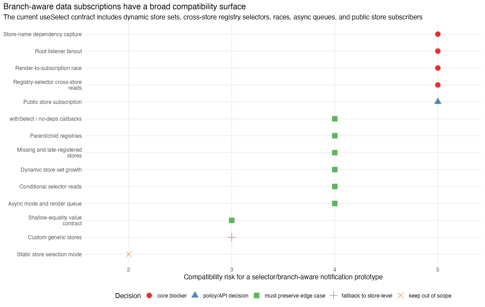

| Contract surface | Why it matters for branch-aware notification |
| ---------------- | -------------------------------------------- |
| Store-name dependency capture | current `useSelect` has store names only, so selector ids, selector args, branch keys, or reducer paths would be new dependency metadata |
| Root listener fanout | `createReduxStore` still calls every registered listener on root identity change; the performance win needs listener counts to collapse, not just selector values to compare equal later |
| Public store subscription | `registry.subscribe( listener, storeName )` has no selected value to filter, so narrowing it is an API policy decision unless root notification remains |
| Dynamic and conditional reads | selected stores can expand or change with state/props; old stores may remain subscribed and still rerun `mapSelect` without rerendering |
| Registry-selector cross-store reads | an outer selector for one store can read another store through `createRegistrySelector()`, so dependency capture must see nested registry reads |
| Parent registries and late stores | dependency metadata must work across parent/child registries and the backward-compatible missing-store fallback path |
| Render/subscription races | current code checks whether a store changed between render and subscription install; a filtered path must not miss that race |
| Async queue cancellation | async `useSelect` must still cancel queued updates on unmount, mapSelect change, registry change, and async-to-sync transition |
| Generic and static stores | generic stores may not expose reducer branches, while static store-selector mode is intentionally non-reactive |

This makes the remaining store-partition question sharper. A branch-aware
prototype is not blocked because it is theoretically impossible; it is blocked
because its acceptance test is broad. It has to pass the existing `useSelect` /
`withSelect` / registry semantics above, add a subscribed
`isLastBlockChangePersistent()` compatibility fixture, and still show the
marker-only source-span win: unrelated block-editor `rootSubscribe`,
`data.reduxStore.listener`, and `useSelect.onChange` fanout must collapse while
persistence-specific subscribers still wake. Anything weaker is either the
compatible no-win path or an API semantics change.

I then refined the subscriber-partition design one more step. The earlier wording
made the root-state change sound like the only performance boundary. The source
code shows a better split: the public store subscription contract and the
internal `useSelect` listener lane can be separated. Today they are not separate:
`useSelect` records active store names and calls
`registry.subscribe( onChange, storeName )`, and the Redux wrapper calls every
registered store listener when the root state identity changes. But a prototype
does not have to narrow public `registry.subscribe` to reduce the benchmark
fanout. It can keep public root notifications and move `useSelect` onto an
internal dependency-filtered lane.

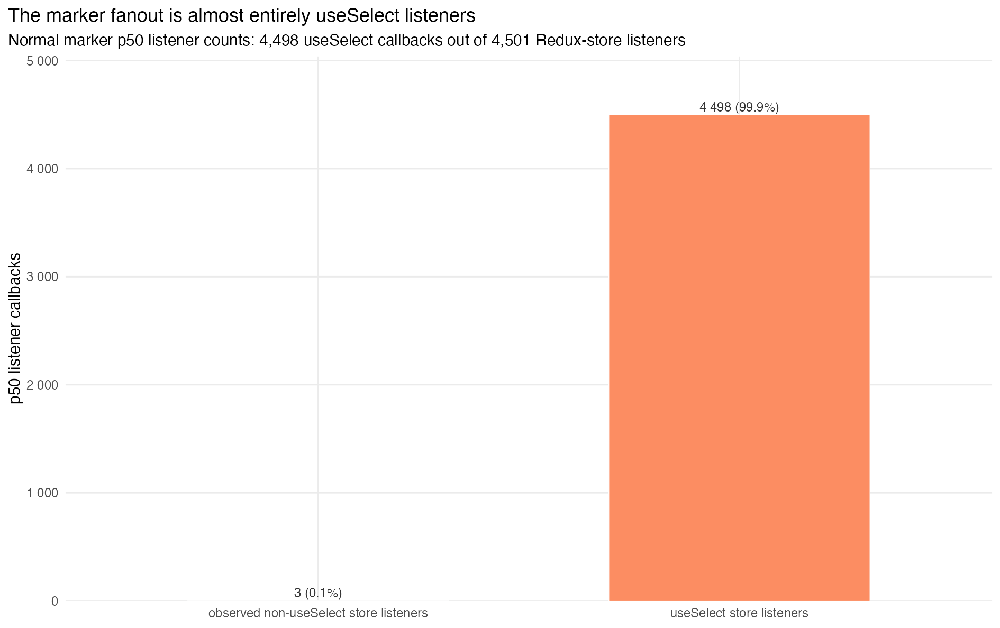

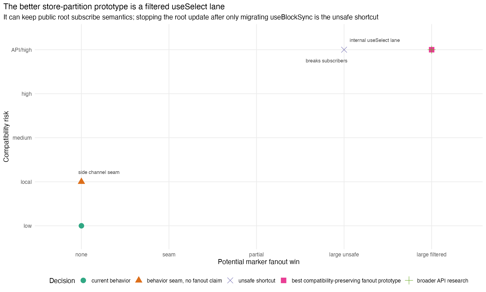

The current marker-window counts make that split worth considering: the normal
marker wakes `4,501` Redux-store listeners at p50, and `4,498` of those are
`useSelect.onChange` callbacks. Only `3` observed store listeners are not
`useSelect` in this workload. That does not prove there are no external public
subscribers in a plugin environment; it does show that the local benchmark's
fanout is almost entirely the `useSelect` lane.

| Lane design | Public root `registry.subscribe` semantics | `useSelect` behavior | Fanout result | Decision |
| ----------- | ------------------------------------------ | -------------------- | ------------- | -------- |
| Current one-lane store notification | preserved | every `useSelect` subscribed to `core/block-editor` invalidates on the marker root change | current `4,501` listener p50 | baseline |
| Private `useBlockSync` side channel while root update remains | preserved | unchanged | no fanout win | behavior seam only |
| Stop root update after only migrating `useBlockSync` | broken unless API policy changes | public persistence `useSelect` consumers miss the marker transition | large win by breaking subscribers | reject as shortcut |
| Filtered internal `useSelect` lane plus public root lane | preserved for plain `registry.subscribe` | `useSelect` wakes only when captured selector/branch dependencies can change; persistence-specific `useSelect` consumers still wake | compatibility-preserving route to skip the `4,498` unrelated `useSelect` callbacks in this workload | best fanout prototype, but broad data-layer work |
| Public branch-aware `registry.subscribe` semantics | changed or option-scoped | could share the same filtered API | also large, but now an API policy change | broader API research |

This changes the precise next experiment. A store-partition performance prototype
should not start by moving `isPersistentChange` to an external slot. It should
start by proving an internal filtered `useSelect` lane can coexist with public
root store subscriptions. The minimum gate is: a public
`registry.subscribe( listener, blockEditorStore )` fixture still fires on
`MARK_LAST_CHANGE_AS_PERSISTENT`; a `useSelect` fixture that selects
`isLastBlockChangePersistent()` still wakes; an unrelated block-editor
`useSelect` fixture does not wake or recompute for the marker; and the marker-only
source-span run shows `data.reduxStore.listener` and `useSelect.onChange` counts
collapse for unrelated selectors. That is the compatibility-preserving version of
the `23.2ms` fanout claim.

I turned that into an explicit prototype gate because this is where an easy
mistake would make the benchmark faster by breaking notification semantics. The
derived audit is in
`data/typing-delay-store-subscriber-partition-prototype-gate-audit.csv`.

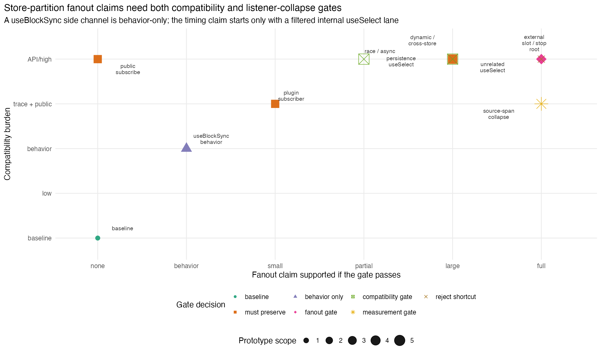

| Gate | Required pass condition | Why it matters |
| ---- | ----------------------- | -------------- |
| Public `registry.subscribe` fixture | a plain `registry.subscribe( listener, blockEditorStore )` subscriber still fires on `MARK_LAST_CHANGE_AS_PERSISTENT` | keeps public root-store subscription semantics separate from the internal `useSelect` lane |
| `useBlockSync` side-channel behavior | private persistence subscription preserves the current `onInput` / `onChange` handoff, selected-block payloads, controlled inner blocks, fresh callbacks, and cleanup while the root update remains enabled | validates the behavior-only path, but still makes no fanout claim |
| Persistence `useSelect` fixture | a `useSelect` consumer of `isLastBlockChangePersistent()` still wakes and observes the same transition | preserves the documented public selector notification behavior |
| Unrelated `useSelect` skip fixture | a block-editor `useSelect` consumer that reads unrelated block tree or selection data does not wake or recompute for the marker | this is where the `23.2ms` fanout win can start |
| Dynamic / cross-store fixtures | conditional store reads, `createRegistrySelector()` cross-store reads, parent registries, and late stores keep current semantics | prevents a simple marker-only optimization from breaking the existing `useSelect` contract |
| Race / async fixtures | render-to-subscription races, async queue cancellation, unmount, `mapSelect` changes, registry changes, and async-to-sync transitions keep working | covers the non-happy-path behavior already tested in `@wordpress/data` |
| Marker-only source-span collapse | unrelated `useSelect.onChange` and Redux listener counts collapse while public subscribers and persistence-specific `useSelect` consumers still fire | converts compatibility fixtures into an actual timing claim |
| Plugin/public subscriber smoke | a plugin-like public root-store subscriber still fires while unrelated internal `useSelect` stays filtered | avoids assuming the local benchmark's three non-`useSelect` listeners are the whole ecosystem |

This narrows the store-subscriber open question. The next credible performance
prototype is not "move the persistence flag somewhere else" and not "migrate
`useBlockSync` and stop." It is an internal filtered `useSelect` lane that leaves
plain public store subscribers alone, wakes persistence-specific `useSelect`
consumers, and skips unrelated block-editor `useSelect` consumers. Anything
short of the source-span collapse is a behavior-only prototype; anything that
passes the collapse by dropping public notifications is an API change, not a
benchmark fix.

The next split answers what "woken subscriber" means in the measured input
slice. In `useSelect`, `onChange` either queues an async update through
`renderQueue.add()` or synchronously calls `onStoreChange()`
(`packages/data/src/components/use-select/index.ts:186-212`). A synchronous
`onStoreChange()` invalidates the current value and invokes React's external
store listener, which calls `updateValue()` / `mapSelect()` on demand
(`packages/data/src/components/use-select/index.ts:162-184` and `276-362`).

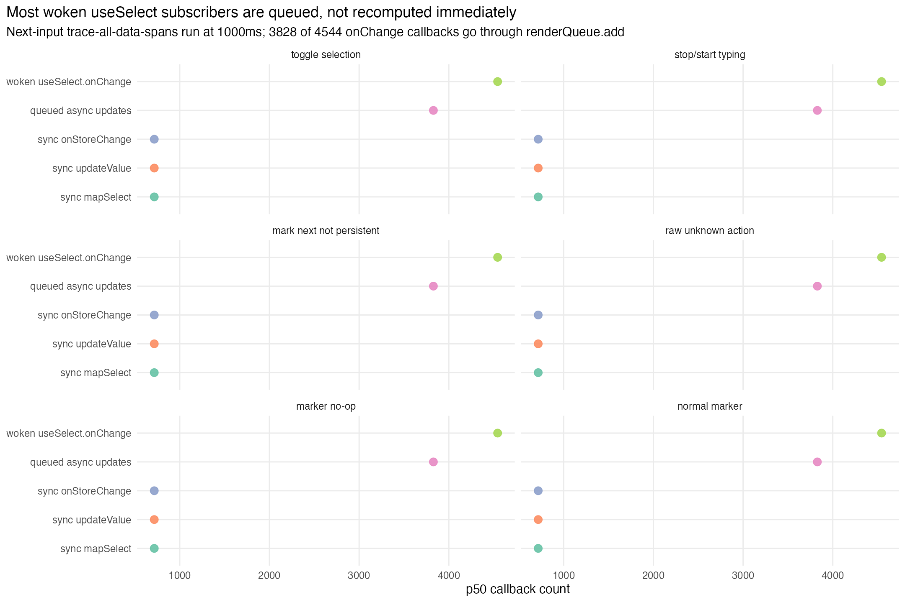

Across all six marker interventions in this all-data-span run, the next-input
counts are identical:

| Outcome | p50 count | Share of `onChange` callbacks |
| ------- | --------: | ----------------------------: |
| woken `useSelect.onChange` | `4,544` | `100.0%` |
| queued async updates via `renderQueue.add` | `3,828` | `84.2%` |
| synchronous `onStoreChange` | `716` | `15.8%` |
| synchronous `updateValue` | `716` | `15.8%` |
| synchronous `mapSelect` | `716` | `15.8%` |

That disconfirms a remaining count-based explanation for the next-input
differences. The faster normal marker, `stopTyping(); startTyping()`, and
selection-toggle cases are not faster because they wake fewer `useSelect`
callbacks, queue fewer async updates, or run fewer synchronous selector
recomputations. Those counts are fixed in this trace. The differences are in
how long the same callback population takes in this input slice, plus the
separate timer-side fanout that normal marker / stop-start / toggle-selection
can run before the next key.

The open question moves again: this trace can say the measured slice is not
dominated by more `mapSelect` calls or more render-queue insertions, but it does
not yet identify the React component render owners for the async queued work
after the input slice. That remains a React-render attribution question, not a
selector-count question.

I then checked a narrower version of that render-queue caveat: maybe the low
band appears when the async `renderQueue.add` work has drained before the next
input. This needed an instrumentation fix. The older scheduler trace reported
zero `requestIdleCallback` events, not because the priority queue never uses
idle callbacks, but because `@wordpress/priority-queue` captures
`window.requestIdleCallback` at module import time
(`packages/priority-queue/src/request-idle-callback.ts:17-21` and
`packages/priority-queue/src/index.ts:91-130`). The benchmark's previous
scheduler wrapper was installed after the editor scripts had loaded, so it
missed the function reference already held by the priority queue. I added an
init-script idle wrapper for scheduler-traced runs, then ran a small targeted
probe at `1000ms` and `1300ms` with scheduler, RichText, and all-data-span
tracing.

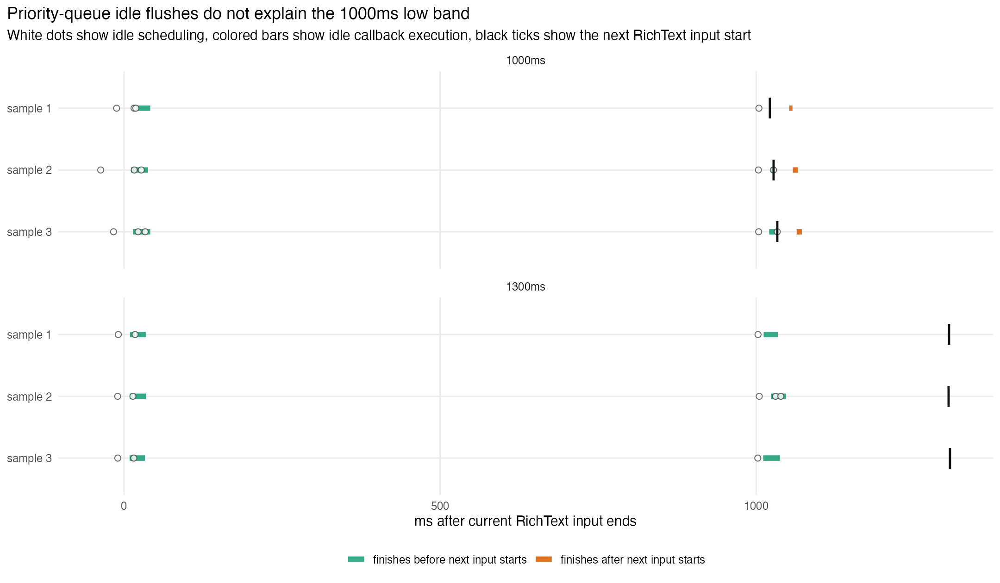

The probe sees the expected priority-queue stack:
`wp-priority-queue`'s `runWaitingList` callback is scheduled from
`wp-data`'s `renderQueue.add` path. But the result disconfirms the simple
"idle queue drained before the next input, therefore the next input is faster"
theory:

| Delay | Retained intervals with following input | Intervals with idle flush crossing following input | Priority idle callbacks | callbacks crossing following input | full retained latency p50 |
| -----: | --------------------------------------: | -------------------------------------------------: | ----------------------: | --------------------------------: | ------------------------: |
| `1000ms` | `3` | `3` | `14` | `3` | `19.8ms` |
| `1300ms` | `3` | `0` | `11` | `0` | `24.4ms` |

In this trace-heavy probe, the `1000ms` retained p50 is still lower than
`1300ms`, but every retained `1000ms` interval that has a following input has a
priority-queue idle callback scheduled before that following input and finishing
after that following RichText input has already started. At `1300ms`, the idle
flushes finish before the following input. So "the async render queue drained
before the next input" is not the cause of the `1000ms` low band. It is actually
more true for the slower `1300ms` case.

This also tightens what remains open. The current data can prove that
`renderQueue.add` enqueues idle work and that idle work is real, but the
fast/slow decision is not explained by the idle queue merely having drained
before the next RichText input. React render ownership may still matter for
whole-cycle cost after the measured input, but it is no longer a plausible
standalone explanation for why the `1000ms` EventDispatch/RichText path is in
the low band.

This supports a code-level theory:

-   `useSelect` invalidates its cached value on store update before rerunning
    selectors (`packages/data/src/components/use-select/index.ts:162-168`).
-   The Redux store wrapper runs every subscribed listener when the store's root
    state object changes (`packages/data/src/redux-store/index.ts:535-559`).
-   The registry store wrapper preserves all store subscribers and routes them
    through the paused/resumed emitter path used by `registry.batch()`
    (`packages/data/src/registry.ts:239-274` and
    `packages/data/src/utils/emitter.ts:38-58`).
-   The top owner families are per-block or per-block-list subscriptions:
    `BlockListItems` reads block order, selected client IDs, visible blocks,
    zoom state, template lock, block editing mode, block name, and inserter
    capability (`packages/block-editor/src/components/block-list/index.js:195-259`);
    `BlockListBlockProvider` reads block identity, attributes, selection,
    movement/removal capability, editing mode, block index, block variations,
    same-name blocks, and section ancestry
    (`packages/block-editor/src/components/block-list/block.js:562-700`);
    `useInnerBlocksProps` reads block name, zoom state, template lock, root
    client ID, editing mode, block settings, and section root
    (`packages/block-editor/src/components/inner-blocks/index.js:194-248`);
    `withPatternOverrideControls` reads
    `getSettings().__experimentalBlockBindingsSupportedAttributes` for every
    block edit wrapper (`packages/editor/src/hooks/pattern-overrides.js:39-48`).
-   The persistence reducer explains why the marker changes the later input's
    path: consecutive same-attribute `UPDATE_BLOCK_ATTRIBUTES` actions are
    non-persistent, but `MARK_LAST_CHANGE_AS_PERSISTENT` is an explicit boundary
    (`packages/block-editor/src/store/reducer.js:166-173` and `421-480`).
    `useBlockSync()` then chooses `onChange` or `onInput` from
    `isLastBlockChangePersistent()` (`packages/block-editor/src/components/provider/use-block-sync.js:379-470`).

What this confirms: the timing difference is caused by Gutenberg state/action
ordering plus the data-layer subscription model. The marker changes the
persistence/action path, and any effective `core/block-editor` state change in
that path wakes thousands of `useSelect` listeners. The dominant cost is the
number of subscriptions reached by that invalidation. The later stop/start
intervention makes this broader: the persistence marker is one effective way to
create this timer-side fanout, but it is not the only one.

The raw-unknown-action probe confirms the "effective state change" part. It
uses the same timer slot and does call the underlying `core/block-editor`
`store.dispatch()`, but because the reducer returns the identical root state,
the store wrapper's `hasChanged` check does not call the subscriber set. Its
timer callback therefore has `0ms` `rootSubscribe` / Redux-listener fanout, and
the next input behaves like no-op rather than like normal marker or restored
state toggles.

What this disconfirms: the current evidence does not support a browser-only
timing explanation, a single pathological selector, or unusually slow callback
bodies. It also does not support "the marker makes the whole cycle cheaper";
the marker task itself is expensive and is outside the next input's event-only
metric.

I then split the all-data-span trace by data-layer phase to test whether the
input-side gap is mostly selector recomputation.


For the following input only:

| Metric                       | normal marker | marker no-op | raw unknown | mark next |
| ---------------------------- | ------------: | -----------: | ----------: | --------: |
| block-editor `rootSubscribe` |       `6.4ms` |      `9.3ms` |     `9.4ms` |   `8.4ms` |
| Redux listener wrappers      |       `4.6ms` |      `7.3ms` |     `7.6ms` |   `6.2ms` |
| `useSelect.onChange`         |       `7.0ms` |      `8.0ms` |     `6.9ms` |   `7.5ms` |
| `useSelect.mapSelect`        |       `3.3ms` |      `3.5ms` |     `2.8ms` |   `2.8ms` |
| `useSelect.onChange` calls   |       `4,544` |      `4,544` |     `4,544` |   `4,544` |
| `useSelect.mapSelect` calls  |         `716` |        `716` |       `716` |     `716` |

This disconfirms two more theories:

-   The slower input-side path is not caused by running many more `useSelect`
    callbacks. The `onChange` and `mapSelect` counts are identical across the
    compared interventions in this trace-heavy run.
-   The slower input-side path is not mostly selector-body recomputation. The
    no-op run's `mapSelect` p50 is only `0.2ms` higher than normal, and
    mark-next's is lower than normal. The larger movement is in
    `rootSubscribe` and Redux listener-wrapper accounting.

The more precise statement is: the same broad listener set is reached, but the
slower paths have more measurable work around the listener invalidation /
notification layer, while selector recomputation itself is a smaller and less
consistent contributor. That fits the owner-family results above: the problem is
not one slow selector body, and not a different number of hook instances, but the
cost of pushing a `core/block-editor` state transition through thousands of
subscribers on a path where more time is accounted at the wrapper/notification
level.

I then extended the compact extraction for the same raw all-data-span traces to
keep the nested `useSelect.onStoreChange`, `useSelect.reactListener`,
`useSelect.updateValue`, and `useSelect.renderQueueAdd` spans. That tests four
more explanations for the remaining input-side gap: React subscriber wakeup,
selector cache recomputation, selector body execution, and async render-queue
scheduling.


Next-input p50 deltas versus the normal-marker run:

| Metric                       | marker no-op | raw unknown | mark next |
| ---------------------------- | -----------: | ----------: | --------: |
| block-editor `rootSubscribe` |      `+2.9ms` |     `+3.1ms` |   `+2.0ms` |
| Redux listener wrappers      |      `+2.7ms` |     `+3.0ms` |   `+1.6ms` |
| `useSelect.onChange`         |      `+1.0ms` |     `-0.1ms` |   `+0.5ms` |
| `useSelect.renderQueueAdd`   |      `+0.2ms` |     `-0.1ms` |   `-0.1ms` |
| `useSelect.onStoreChange`    |      `-0.1ms` |     `-1.0ms` |   `-0.7ms` |
| `useSelect.reactListener`    |      `+0.1ms` |     `-1.0ms` |   `-0.4ms` |
| `useSelect.updateValue`      |      `+0.1ms` |     `-0.8ms` |   `-0.5ms` |
| `useSelect.mapSelect`        |      `+0.2ms` |     `-0.5ms` |   `-0.5ms` |

The callback counts are also identical in this run: `4,544`
`useSelect.onChange` callbacks, `3,828` render-queue adds, and `716` each of
`onStoreChange`, `reactListener`, `updateValue`, and `mapSelect` for all four
interventions.

This disconfirms the remaining tempting single-layer explanations. The no-op
and mark-next paths are not slower because they call more hook instances. They
are not slower because React's subscribed listener callback is materially more
expensive. They are not slower because `updateValue()` or `mapSelect()` does
more selector work. They are not slower because `renderQueue.add()` gets
materially more expensive. In the mark-next run, all of the nested child phases
below `useSelect.onChange` are lower than normal even though `rootSubscribe` and
Redux listener-wrapper time are higher.

I then split the wrapper layer itself. The relevant code path is:

1. `registry.batch()` pauses store emitters.
2. Dispatch still reaches the Redux store's `rootSubscribe` callback.
3. `rootSubscribe` loops every store listener and records a
   `data.reduxStore.listener` wrapper.
4. In `packages/data/src/registry.ts:260-266`, the wrapped listener sees
   `store.emitter.isPaused`, calls `store.emitter.emit()`, and returns without
   running the real listener body.
5. `emitter.emit()` just sets `isPending = true` while paused
   (`packages/data/src/utils/emitter.ts:98-103`).
6. The real callbacks run later, once, during `emitter.resume()` /
   `notifyListeners()`.

That means a `rootSubscribe` / Redux-listener delta during the input batch can be
paused wrapper fanout, not React listener execution or selector work.


Next-input p50 deltas versus the normal-marker run:

| Metric                                  | marker no-op | raw unknown | mark next |
| --------------------------------------- | -----------: | ----------: | --------: |
| block-editor `rootSubscribe`            |      `+2.9ms` |     `+3.1ms` |   `+2.0ms` |
| `rootSubscribe` outside listener wraps  |      `+0.1ms` |     `-0.2ms` |   `+0.3ms` |
| Redux listener wrappers                 |      `+2.7ms` |     `+3.0ms` |   `+1.6ms` |
| Redux wrapper outside `emitter.emit()`  |      `+1.3ms` |     `+2.2ms` |   `+0.9ms` |
| paused `emitter.emit()`                 |      `+1.1ms` |     `+0.6ms` |   `+0.6ms` |
| `emitter.notifyListeners()`             |      `+0.7ms` |     `-0.5ms` |   `-0.3ms` |
| `emitter.listener` callbacks            |      `+0.5ms` |     `-0.6ms` |   `-0.6ms` |
| `useSelect.reactListener`               |      `+0.1ms` |     `-1.0ms` |   `-0.4ms` |
| `useSelect.mapSelect`                   |      `+0.2ms` |     `-0.5ms` |   `-0.5ms` |

The next-input counts are effectively unchanged: `2` `rootSubscribe` spans,
about `9000` Redux listener wrappers, the same number of paused
`emitter.emit()` spans, and about `4500` emitter listener callbacks. The raw
unknown-action run has `9000` wrappers instead of `9002` because it had one fewer
store subscriber in that small diagnostic run, not because it avoided the next
input fanout.

I then paired every `data.reduxStore.listener` wrapper span with its immediate
paused `data.emitter.emit` child. The coverage is complete:

| Metric                               | normal marker | marker no-op | raw unknown | mark next |
| ------------------------------------ | ------------: | -----------: | ----------: | --------: |
| Redux listener wrappers              |       `9,002` |      `9,002` |     `9,000` |   `9,002` |
| wrappers with paused `emitter.emit`  |       `9,002` |      `9,002` |     `9,000` |   `9,002` |
| child coverage                       |      `100.0%` |     `100.0%` |    `100.0%` |  `100.0%` |
| wrapper duration                     |       `4.6ms` |      `7.3ms` |     `7.6ms` |   `6.3ms` |
| paused `emitter.emit` child duration |       `1.3ms` |      `2.4ms` |     `1.9ms` |   `1.8ms` |
| wrapper outside child duration       |       `3.6ms` |      `4.8ms` |     `5.7ms` |   `4.4ms` |
| nonzero wrapper spans                |          `46` |         `73` |        `75` |  `62.5` |
| nonzero paused child spans           |        `12.5` |       `23.5` |        `19` |    `18` |
| nonzero wrapper-outside-child spans  |        `35.5` |       `47.5` |        `56` |    `44` |

This pairing disconfirms another possible theory: the wrapper delta is not
coming from hidden real subscriber bodies inside `data.reduxStore.listener`.
Every measured wrapper in this batch contains the paused-emitter fast path.


This confirms that the shared part of the residual gap is in the paused
dispatch-wrapper path. It disconfirms "the slow path is the resume callback" as
the common explanation: `emitter.notifyListeners()`, `emitter.listener`,
`reactListener`, and `mapSelect` all move down in the mark-next run while
`rootSubscribe` and Redux listener-wrapper time move up.

The remaining wrapper-only delta should be treated carefully. The duration-bin
plot shows that this is mostly `0.0ms` spans plus a small number of `0.1ms`
spans, with only one p50-visible `0.2ms` bin in the slow interventions. The
action-level listener distributions show the same thing in the two action
slices that make up the next input:

| Action                  | Metric                | normal marker | marker no-op | mark next |
| ----------------------- | --------------------- | ------------: | -----------: | --------: |
| `selectionChange`       | nonzero wrappers      |          `22` |       `41.5` |    `35.5` |
| `selectionChange`       | top 1 wrapper         |       `0.1ms` |      `0.1ms` |   `0.1ms` |
| `selectionChange`       | top 10 wrappers       |       `1.0ms` |      `1.0ms` |   `1.0ms` |
| `updateBlockAttributes` | nonzero wrappers      |          `24` |       `31.5` |      `26` |
| `updateBlockAttributes` | top 1 wrapper         |       `0.1ms` |      `0.1ms` |   `0.1ms` |
| `updateBlockAttributes` | top 10 wrappers       |       `1.0ms` |      `1.0ms` |   `1.0ms` |

So the deeper result is not "there is a hidden expensive subscriber." It is:
when these trace-heavy probes are enabled, the slow interventions spend more
time in thousands of paused listener-wrapper invocations, and that difference is
largely expressed as more `performance.now()` timing quanta across the wrapper
fanout. That is a useful diagnostic for where the accounting sits, but it is not
evidence of one additional expensive Gutenberg callback.

Finally, I paired the marker task before each retained input with that same
input in the trace-heavy run. This tests the most important accounting theory
directly: if the normal marker truly made the editor do less work overall, the
marker-plus-input cycle should be lower than the no-op cycle. It is not. The
later stop/start and selection-toggle probes give the same conclusion with
non-marker timer callbacks.


Selected p50s:

| Metric                     | normal marker | marker no-op | raw unknown | mark next |
| -------------------------- | ------------: | -----------: | ----------: | --------: |
| next input EventDispatch   |      `26.9ms` |     `32.5ms` |    `32.4ms` |  `30.0ms` |
| marker before that input   |      `19.0ms` |      `0.1ms` |     `0.0ms` |   `0.3ms` |
| marker plus next input     |      `40.7ms` |     `32.8ms` |    `33.2ms` |  `30.4ms` |
| next input `rootSubscribe` |       `6.4ms` |      `9.3ms` |     `9.4ms` |   `8.4ms` |
| marker `rootSubscribe`     |      `18.9ms` |      `0.0ms` |     `0.0ms` |   `0.0ms` |
| cycle `rootSubscribe`      |      `24.4ms` |      `9.3ms` |     `9.4ms` |   `8.4ms` |
| next input `useSelect`     |       `7.0ms` |      `8.0ms` |     `6.9ms` |   `7.5ms` |
| marker `useSelect`         |      `10.5ms` |      `0.0ms` |     `0.0ms` |   `0.0ms` |
| cycle `useSelect`          |      `16.8ms` |      `8.0ms` |     `6.9ms` |   `7.5ms` |

I then repeated the trace-all-data-spans microscope for `stopTyping();
startTyping()` and the restored `toggleSelection( false ); toggleSelection(
true )` probe. The absolute values are still inflated by tracing overhead, but
the comparison is useful because it uses the same instrumentation:


| Timer callback             | Next input path         | Timer callback p50 | Next input p50 | Timer plus input p50 | Next input `rootSubscribe` | Next input Redux listeners | Next input `useSelect` |
| -------------------------- | ----------------------- | -----------------: | -------------: | -------------------: | -------------------------: | -------------------------: | ---------------------: |
| normal marker              | `onChange:3; onInput:1` |           `19.0ms` |       `26.9ms` |             `40.7ms` |                    `6.4ms` |                    `4.6ms` |                `7.0ms` |
| marker no-op               | `onInput:4`             |            `0.1ms` |       `32.5ms` |             `32.8ms` |                    `9.3ms` |                    `7.3ms` |                `8.0ms` |
| raw unknown action         | `onInput:2; onChange:1` |            `0.0ms` |       `32.4ms` |             `33.2ms` |                    `9.4ms` |                    `7.6ms` |                `6.9ms` |
| mark next not persistent   | `onChange:3; onInput:1` |            `0.3ms` |       `30.0ms` |             `30.4ms` |                    `8.4ms` |                    `6.2ms` |                `7.5ms` |
| stop/start typing          | `onInput:6`             |           `30.3ms` |       `24.3ms` |             `54.6ms` |                    `5.2ms` |                    `3.9ms` |                `6.4ms` |
| toggle selection           | `onInput:6`             |           `34.5ms` |       `24.9ms` |             `59.3ms` |                    `5.4ms` |                    `3.2ms` |                `5.9ms` |

The raw-unknown-action row is a small `n=3` diagnostic, not a score run. Its
important result is not the exact p50; it is that a raw dispatch with no root
state change has no timer-side subscriber fanout and stays with the no-op
next-input band. This is the best current correction to the typing-state theory.
In the low-overhead targeted run, `toggleSelection()` lands at about `14-15ms` while
`stopTyping(); startTyping()` lands at about `11ms`. Under the heavier
all-data-span microscope, however, the restored selection toggle and stop/start
typing have very similar shape: both stay on `onInput`, both do a large
timer-side subscriber pass before the next key, both lower the following input's
`rootSubscribe` and Redux-listener durations, and both make the timer-plus-input
cycle much worse than the next-input-only metric. That disconfirms a strong
"typing state is the unique remaining cause" claim. The safe statement is that
restored block-editor fanout before the key is sufficient to get most of the
measured drop, while the exact low-overhead gap between `14-15ms` and `~11ms`
is not yet pinned to one source-level mechanism.

I also split the same input batch into `useSelect` subphases and added
cache-state counts:


Selected p50 counts and durations:

| Metric                               | normal marker | marker no-op | raw unknown | stop/start | toggle selection |
| ------------------------------------ | ------------: | -----------: | ----------: | ---------: | ---------------: |
| `rootSubscribe` count                |           `2` |          `2` |         `2` |        `2` |              `2` |
| Redux listener wrappers              |        `9002` |       `9002` |      `9000` |     `9000` |           `9000` |
| `useSelect.onChange` callbacks       |        `4544` |       `4544` |      `4544` |     `4544` |           `4544` |
| `useSelect.updateValue` calls        |         `716` |        `716` |       `716` |      `716` |            `716` |
| invalidated cached selector results  |         `716` |        `716` |       `716` |      `716` |            `716` |
| cached `mapSelect` functions         |         `716` |        `716` |       `716` |      `716` |            `716` |
| `renderQueue.add` calls              |        `3828` |       `3828` |      `3828` |     `3828` |           `3828` |
| `rootSubscribe` duration             |       `6.4ms` |      `9.3ms` |     `9.4ms` |    `5.2ms` |          `5.4ms` |
| Redux listener-wrapper duration      |       `4.6ms` |      `7.3ms` |     `7.6ms` |    `3.9ms` |          `3.2ms` |
| `useSelect.onChange` duration        |       `7.0ms` |      `8.0ms` |     `6.9ms` |    `6.4ms` |          `5.9ms` |
| `useSelect.updateValue` duration     |       `4.2ms` |      `4.2ms` |     `3.4ms` |    `3.2ms` |          `3.3ms` |
| `useSelect.mapSelect` duration       |       `3.3ms` |      `3.6ms` |     `2.8ms` |    `2.9ms` |          `2.9ms` |
| `renderQueue.add` duration           |       `0.9ms` |      `1.1ms` |     `0.7ms` |    `0.9ms` |          `0.7ms` |

This disconfirms several narrower theories. The no-op path is not slower
because it has more subscribers, more selector recomputes, more selector-cache
misses, more `updateValue` calls, or more render-queue insertions. Those counts
are the same at p50 in the all-data-span probe. The difference is time spent
walking essentially the same listener/useSelect shape, with the largest visible
movement at the root-subscribe and Redux-listener-wrapper levels. That is also
why the owner-attribution tables do not find one pathological component.

This confirms the weak version of "work moves out of the next input slice" and
disconfirms the strong version. The weak version is: a real timer task runs
before the measured input and does subscriber fanout that the next input
measurement does not include. The strong version would be: the normal marker
makes the total marker-plus-input cycle cheaper than no marker work. The data
says the opposite. The normal marker's next-input slice is lower than no-op by
about `5.6ms`, but the marker-plus-input cycle is higher by about `7.9ms` in
this trace-heavy run.

One piece remains open, but it is now narrower. The traces identify timer-side
block-editor fanout and the following input's block-editor fanout, the owner
summary disconfirms a single-owner explanation, and the nested-span split
disconfirms selector-recompute and render-queue explanations for the residual
input-side delta. The listener probe also disconfirms expensive DOM `keypress`
callbacks: the p50-visible listener work is the actual DOM `input` listener,
dominated by RichText's `onInput` handler. The newest wrapper split puts the
shared data-layer remainder in the paused store-listener wrapper path, not in
the resumed listener bodies. The supported statement is that timer ordering plus
timer-side subscriber fanout explain the false event-only low band; attributing
the last few milliseconds to a single React commit, selector, render queue,
component, DOM `keypress` callback, or resumed callback body is not supported by
the current traces.

Reasoning audit:

-   Code-review standard: the reducer proves only the previous-action and
    explicit-marker logic above. It does not prove that `onChange` is inherently
    faster than `onInput`; the `mark next not persistent` run disconfirms
    "`onChange` is sufficient", and the stop/start run disconfirms "`onChange`
    is necessary".
-   Measurement standard: the low band is an EventDispatch accounting result,
    not a whole-cycle latency result. Timer callbacks are in different tasks and
    must be counted separately.
-   Benchmark standard: the benchmark is still useful for finding this ordering
    artifact, but the original graph should not be read as "a human who waits
    one second sees a faster next character."

## Deeper Pass: The Delay Is A Key Hold

The first report identified the `~1000ms` cliff but left the later `1200-2000ms`
plateau partly open. The deeper pass found a more fundamental benchmark issue:
Playwright's `keyboard.type( text, { delay } )` is not equivalent to "type a
complete character, wait, type the next complete character."

In the installed Playwright implementation, `keyboard.type()` loops over
characters and calls `press( char, { delay } )`. `press()` sends `keydown`, waits
for `delay`, then sends `keyup`. The browser event traces confirm this:
`keydown` / `keypress` / `input` happen near the start of each sample, then
`keyup` happens roughly `delay` milliseconds later, and the next `keydown`
follows almost immediately.

That means the original delay sweep is mostly a synthetic key-hold-duration
sweep. A person who types once every second is not normally holding each key down
for one second.


The first version of this comparison used landmark delays, mostly near and above
the `1000ms` timer boundary. I added dense complete-keypress-then-wait runs for
the full `0..2000ms` range, in `10ms` steps, and compare them with the existing
dense key-hold scan.

The container-block rerun repeats the full `0..2000ms`, `10ms`-step sweep in the
Columns fixture. Absolute latencies are lower because the fixture is smaller
than the large-post case, but the qualitative conclusion is stronger rather than
weaker: holding the key down is much slower than completing the keypress and then
waiting. The wait-after-keyup container run is mostly around `5..7ms`; the
key-hold container run is mostly around `14..16ms`, with a later high band near
`1800..2000ms`.

Two modes are compared:

1. Playwright's normal `keyboard.type(..., { delay })`: keydown/keypress/input
   happen, the key remains held for roughly `delay`, then keyup happens.
2. Complete keypress, then wait: keydown/keypress/input/keyup happen first, then
   the benchmark waits for `delay`.

Shorter delays are not irrelevant. The one-second rich-text persistence timer
cannot explain differences below `1000ms`, but the dense scan shows the two modes
are already different there. The key-hold run has a broad slower region before
the `1000ms` fast band; the wait-after-keyup run is flatter and does not
reproduce the high `1200..2000ms` plateau.

Selected p50s:

|    Delay | Key held | Wait after keyup |
| -------: | -------: | ---------------: |
|    `0ms` |  `5.4ms` |          `8.0ms` |
|  `100ms` |  `7.9ms` |         `10.2ms` |
|  `500ms` | `16.7ms` |         `11.4ms` |
|  `900ms` | `18.9ms` |         `11.3ms` |
|  `990ms` | `17.9ms` |         `10.2ms` |
| `1000ms` |  `7.8ms` |         `10.1ms` |
| `1100ms` |  `8.9ms` |         `14.1ms` |
| `1200ms` | `17.4ms` |         `11.9ms` |
| `1300ms` | `18.9ms` |         `11.4ms` |
| `1550ms` | `12.8ms` |         `11.3ms` |
| `2000ms` | `18.2ms` |         `12.2ms` |

Selected container-block p50s:

|    Delay | Key held | Wait after keyup |
| -------: | -------: | ---------------: |
|    `0ms` |  `2.5ms` |          `3.3ms` |
|  `100ms` | `12.6ms` |          `6.6ms` |
|  `500ms` | `13.6ms` |          `7.1ms` |
|  `900ms` | `13.4ms` |          `6.2ms` |
| `1000ms` | `13.5ms` |          `5.2ms` |
| `1030ms` |  `9.1ms` |          `5.3ms` |
| `1200ms` | `14.9ms` |          `6.7ms` |
| `1600ms` | `15.0ms` |          `3.8ms` |
| `1800ms` | `18.0ms` |          `6.5ms` |
| `2000ms` | `17.3ms` |          `5.3ms` |

This falsifies the simple "more idle time after persistence makes typing slow"
explanation. Waiting after the key has completed does not reproduce the slow
plateau. Earlier `after-persistence` landmark runs also showed that waiting
after the rich-text persistence marker does not reproduce it either.

The slow plateau appears when the rich-text persistence timer fires while the
previous synthetic key is still held down, and then the next key arrives after
some additional key-hold slack.


In the scheduler/action trace:

|    Delay | Median time from previous persistence marker to next keydown | Median latency |
| -------: | -----------------------------------------------------------: | -------------: |
| `1100ms` |                                                     `~101ms` |       `11.7ms` |
| `1150ms` |                                                     `~151ms` |       `12.7ms` |
| `1180ms` |                                                     `~182ms` |       `15.7ms` |
| `1200ms` |                                                     `~203ms` |       `18.4ms` |
| `1300ms` |                                                     `~304ms` |       `19.1ms` |
| `1510ms` |                                                     `~512ms` |       `14.3ms` |
| `1550ms` |                                                     `~551ms` |       `12.6ms` |
| `1580ms` |                                                     `~584ms` |       `16.5ms` |

The relationship in that historical run was not perfectly monotonic; it had a
`1510-1550ms` dip that did not fit the simple timer-to-keydown-gap story. A
later focused recheck below did not reproduce that trough, so it should be
treated as volatile rather than as a stable delay regime. The comparison with
`between-keys` and `after-persistence` is still enough to say that the
`1200-2000ms` plateau is not a normal "pause between characters" effect. It is
tied to holding a synthetic key down while Gutenberg's one-second rich-text timer
fires.

### Paired Trace: Previous Key State

The next trace repeated the same delay list in two modes with browser, action,
timer, and scheduler tracing enabled:

1. Playwright key-hold delay.
2. Complete keypress, then explicit wait after `keyup`.

The component split shows that the extra measured latency is not primarily
`keydown` or `keyup`; it is almost all `keypress` `EventDispatch` duration.


Selected p50s from the paired trace:

| Mode                         |    Delay | Latency p50 | `keypress` p50 |
| ---------------------------- | -------: | ----------: | -------------: |
| Key held during delay        | `1200ms` |    `17.4ms` |       `16.4ms` |
| Complete keypress, then wait | `1200ms` |    `11.1ms` |       `10.9ms` |
| Key held during delay        | `1300ms` |    `18.2ms` |       `17.2ms` |
| Complete keypress, then wait | `1300ms` |    `10.8ms` |       `10.6ms` |
| Key held during delay        | `2000ms` |    `16.9ms` |       `15.8ms` |
| Complete keypress, then wait | `2000ms` |    `10.6ms` |       `10.3ms` |

This paired trace also separates two timing variables that looked confounded in
the earlier scheduler trace:

-   time from the persistence marker to the next keydown;
-   whether that marker fired before the previous keyup.


At `1200ms`, both modes have the persistence marker a few hundred milliseconds
before the next keydown. But only the key-hold mode has the marker before the
previous `keyup`.

| Mode                         |    Delay | Previous keyup to marker | Marker to next keydown | `keypress` p50 |
| ---------------------------- | -------: | -----------------------: | ---------------------: | -------------: |
| Key held during delay        | `1200ms` |                 `-201ms` |                `203ms` |       `16.4ms` |
| Complete keypress, then wait | `1200ms` |                 `1000ms` |                `263ms` |       `10.9ms` |
| Key held during delay        | `1300ms` |                 `-302ms` |                `303ms` |       `17.2ms` |
| Complete keypress, then wait | `1300ms` |                 `1000ms` |                `357ms` |       `10.6ms` |
| Key held during delay        | `2000ms` |                `-1001ms` |               `1004ms` |       `15.8ms` |
| Complete keypress, then wait | `2000ms` |                  `999ms` |               `1064ms` |       `10.3ms` |

Negative "previous keyup to marker" means the persistence marker fired while the
previous synthetic key was still down. That is the best current explanation for
why a `1200ms` Playwright delay is slow while a complete keypress followed by a
`1200ms` wait is not.

This does not make the old `1510-1550ms` dip causal. It says what condition is
necessary for the slow plateau in these runs, and it narrows the visible cost to
`keypress` dispatch. The focused recheck in the next section found that the dip
itself was not stable.

### Rechecking The 1510-1550ms Trough

The old dense extension and paired trace both had a low band around
`1510-1550ms`. I reran that region three ways:

1. focused Gutenberg key-hold, `1450..1600ms` every `10ms`, 16 retained samples
   plus 1 throwaway, with timer/gap tracing;
2. same-shape Gutenberg key-hold, `1110..1600ms` every `10ms`, 5 retained
   samples plus 1 throwaway, to match the old dense extension's low-sample shape
   and run-up;
3. focused native `contenteditable` key-hold, `1450..1600ms` every `10ms`, 16
   retained samples plus 1 throwaway.

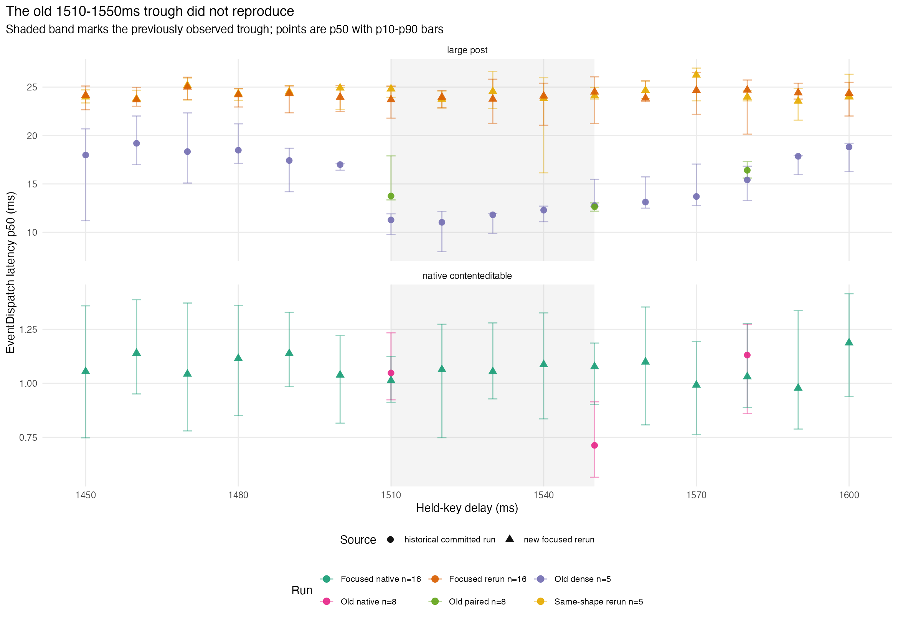

Selected latency p50s:

| Run | Scenario | 1500 | 1510 | 1520 | 1550 | 1580 | 1600 |
| --- | --- | ---: | ---: | ---: | ---: | ---: | ---: |
| Old dense n=5 | Gutenberg | `17.0ms` | `11.3ms` | `11.0ms` | `12.8ms` | `15.4ms` | `18.8ms` |
| Old paired n=8 | Gutenberg | - | `13.8ms` | - | `12.6ms` | `16.4ms` | - |
| Same-shape rerun n=5 | Gutenberg | `24.9ms` | `24.8ms` | `23.7ms` | `24.1ms` | `24.0ms` | `24.0ms` |
| Focused rerun n=16 | Gutenberg | `24.0ms` | `23.7ms` | `24.0ms` | `24.5ms` | `24.7ms` | `24.4ms` |
| Old native n=8 | native | - | `1.05ms` | - | `0.71ms` | `1.13ms` | - |
| Focused native n=16 | native | `1.04ms` | `1.01ms` | `1.06ms` | `1.08ms` | `1.03ms` | `1.19ms` |

The trough did not survive either Gutenberg recheck. It was present in two old
historical traces, and the old native control had a small low point at `1550ms`,
but neither a more-sampled focused run nor a same-shape low-sample replication
reproduced it. The safest statement is that `1510-1550ms` was a run-specific
volatile browser/editor phase sample, not a stable timing boundary like the
`990ms -> 1000ms` transition. It should not be used to infer a separate editor
state transition.

### Causality Check: Keyup Gap

The paired trace still left two theories entangled:

1. the persistence timer fired while the previous synthetic key was held; and
2. the next synthetic key arrived almost immediately after the previous `keyup`.

I added a diagnostic delay mode, `hold-then-keyup-gap`, which performs one
`keyboard.press( 'x', { delay } )` per character and can add an explicit wait
after `keyup`. This is not a normal score mode. It is a causality probe for the
event ordering.

The useful surprise is that even with no explicit post-keyup gap, separate
manual `keyboard.press()` calls naturally leave about `40ms` between one `keyup`
and the next `keydown`. Normal Playwright `keyboard.type( 'xxxxx', { delay } )`
leaves only about `2.5ms` in the same trace-heavy setup.


Selected medians from the large-post diagnostic runs:

| Case                                     | Previous keyup to marker | Marker to next keydown | Previous keyup to next keydown | `keypress` p50 |
| ---------------------------------------- | -----------------------: | ---------------------: | -----------------------------: | -------------: |
| Playwright key-hold burst, `1300ms`      |                 `-302ms` |                `304ms` |                        `2.5ms` |       `34.6ms` |
| Manual hold `1300ms`, natural keyup gap  |                 `-302ms` |                `344ms` |                         `41ms` |       `12.8ms` |
| Manual hold `1300ms`, `1000ms` keyup gap |                 `-301ms` |               `1359ms` |                       `1057ms` |       `12.0ms` |
| Manual hold `990ms`, `310ms` keyup gap   |                   `19ms` |                `355ms` |                        `373ms` |       `14.8ms` |
| Complete keypress, then wait `1300ms`    |                  `999ms` |                `372ms` |                       `1373ms` |       `14.1ms` |

This disconfirms the strongest version of the earlier theory. "Persistence fired
while the previous key was held" is not sufficient by itself. Both manual
`1300ms` hold cases have the marker before the previous `keyup`, but neither
reproduces the slow burst once there is even a modest post-keyup gap before the
next key.

It also disconfirms "time from marker to next keydown" as the sole explanation.
The manual `990ms + 310ms` case and complete-keypress `1300ms` case have
marker-to-next-keydown gaps similar to the normal key-hold burst, but they are
not in the same slow distribution. In all five diagnostic cases, the current
`keydown` sees the block editor in the same broad state: persistent and typing.
The discriminating variable in these runs is the previous `keyup` to current
`keydown` gap.

The refined statement is:

-   the normal slow burst needs the persistence marker to fire before the
    previous `keyup`;
-   it also needs the next key to arrive almost immediately after that `keyup`,
    as happens inside one Playwright `keyboard.type()` burst;
-   giving the browser/editor even about `40ms` after `keyup` moves the measured
    keypress back near the complete-keypress-then-wait cases.


The cost path is the same as in the broader data-span investigation, only larger
in the normal burst:

| Case                                     | RichText `registry.batch` | Data batch | Resume `core/block-editor` | `useSelect.onChange` |
| ---------------------------------------- | ------------------------: | ---------: | -------------------------: | -------------------: |
| Playwright key-hold burst, `1300ms`      |                  `34.1ms` |   `36.8ms` |                   `25.7ms` |             `13.0ms` |
| Manual hold `1300ms`, natural keyup gap  |                  `16.5ms` |   `17.5ms` |                   `12.6ms` |              `6.8ms` |
| Manual hold `1300ms`, `1000ms` keyup gap |                  `17.8ms` |   `18.9ms` |                   `13.3ms` |              `7.4ms` |
| Manual hold `990ms`, `310ms` keyup gap   |                  `17.2ms` |   `18.4ms` |                   `12.9ms` |              `7.1ms` |
| Complete keypress, then wait `1300ms`    |                  `17.5ms` |   `18.7ms` |                   `12.9ms` |              `7.3ms` |

That confirms the attribution but narrows the cause. The extra latency is still
inside the RichText `registry.batch()` -> `core/block-editor` resume ->
`useSelect` fanout path. What changed is the trigger condition: the large burst
does not follow merely from persistent state, typing state, or a timer firing
while the key is held. It follows from the timer/key-hold condition combined
with an almost immediate next key after `keyup`.

The remaining unproven piece is the lower-level scheduling reason that a `2-3ms`
post-keyup gap is bad while a roughly `30-40ms` gap is enough to lose the slow
path.

### Post-Keyup Gap Follow-Up

I then tested the strongest concrete versions of "the gap lets queued work
drain." I reran the normal Playwright burst and the manual `1300ms` hold with:

-   browser/data event tracing;
-   timer, `requestAnimationFrame`, and `requestIdleCallback` tracing;
-   a raw DevTools-timeline gap extractor that records only trace slices between
    the end of the previous `keyup` dispatch and the next `keydown`;
-   DOM key flags: `repeat` and `isComposing`.

The result mostly disconfirms the "queued JS/rendering drains in the gap"
version of the theory.

| Case                                    | Previous keyup to next keydown | `keypress` p50 | Scheduler callbacks in gap | Data actions in gap | Non-key DevTools gap slices | Repeat/composing keys |
| --------------------------------------- | -----------------------------: | -------------: | -------------------------: | ------------------: | --------------------------: | --------------------: |
| Playwright key-hold burst, `1300ms`     |                        `1.7ms` |       `23.1ms` |                        `0` |                 `0` |               `1`, `0.06ms` |               `0 / 8` |
| Manual hold `1300ms`, natural keyup gap |                       `29.3ms` |       `11.7ms` |                        `0` |                 `0` |               `1`, `0.06ms` |               `0 / 8` |

The single median non-key DevTools slice is a tiny
`Responsiveness.Renderer.UserInteraction` bookkeeping event, not layout, paint,
script execution, a timer callback, a RAF callback, or an idle callback. The
manual-gap run had a few samples with small `TimerFire` / `FunctionCall` slices
in the gap, but the median case did not, and those slices are not present in the
normal burst. They do not explain why the manual-gap run is faster.

The DOM event flags also do not explain the difference. In both modes, retained
samples had:

-   `keydown.repeat === false`, `keypress.repeat === false`, and
    `keyup.repeat === false`;
-   `isComposing === false` on keydown, keypress, beforeinput, and input;
-   the same coarse block-editor state at keydown, keypress, beforeinput, and
    input: `isLastBlockChangePersistent() === true` and `isTyping() === true`.

This narrows the theory again. The visible extra cost still appears in the next
`keypress` / RichText / data fanout path, but it is not explained by observable
work draining during the post-keyup gap.

### Input-Path and Raw-CDP Gap Sweep

The next concrete theories were that either the elapsed post-keyup gap, the DOM
keyboard-event payload, or the Playwright `keyboard.press()` wrapper was
decisive. I tested these by adding raw-CDP input modes and by recording fuller
DOM event signatures:

-   `BENCHMARK_DELAY_MODE=cdp-key-hold`, which bypasses Playwright's high-level
    keyboard helpers and dispatches Chromium `Input.dispatchKeyEvent` calls
    directly.
-   `BENCHMARK_DELAY_MODE=type-one-char-hold`, which calls
    `page.keyboard.type( 'x', { delay: 1300 } )` once per character instead of
    one multi-character `keyboard.type()` call.
-   `BENCHMARK_DELAY_MODE=down-up-key-hold`, which calls
    `page.keyboard.down( 'x' )`, waits `1300ms`, then calls
    `page.keyboard.up( 'x' )` once per character.
-   `BENCHMARK_DELAY_MODE=cdp-key-hold-page-evaluate`, which uses raw CDP key
    events but runs a no-op `page.evaluate()` between characters.
-   `BENCHMARK_DELAY_MODE=cdp-key-hold-runtime-evaluate`, which uses raw CDP key
    events but runs a no-op `Runtime.evaluate` through the same CDP session
    between characters.


This disconfirms the simple versions of the gap, wrapper, and event-payload
theories. With 20 retained samples in the main comparison cases:

| Input path                                    | Retained samples | Requested post-keyup gap | Observed post-keyup gap p50 | `keypress` p50 |
| --------------------------------------------- | ---------------: | -----------------------: | --------------------------: | -------------: |
| Playwright `keyboard.type( 'x'.repeat( n ) )` |             `20` |                    `0ms` |                     `2.2ms` |       `23.6ms` |
| Playwright `keyboard.press( 'x' )` per key    |             `20` |                    `0ms` |                    `31.7ms` |       `16.1ms` |
| Playwright `keyboard.type( 'x' )` per key     |             `20` |                    `0ms` |                    `30.2ms` |       `11.3ms` |
| Playwright `keyboard.down/up( 'x' )` per key  |             `20` |                    `0ms` |                    `16.3ms` |       `10.8ms` |
| Raw CDP `Input.dispatchKeyEvent`              |             `20` |                    `0ms` |                     `3.9ms` |       `21.4ms` |
| Raw CDP `Input.dispatchKeyEvent`              |             `20` |                   `16ms` |                    `21.6ms` |       `23.1ms` |
| Raw CDP `Input.dispatchKeyEvent`              |             `20` |                 `1000ms` |                  `1007.8ms` |       `23.9ms` |
| Raw CDP plus `page.evaluate()`                |             `20` |                    `0ms` |                    `29.2ms` |       `11.1ms` |
| Raw CDP plus CDP `Runtime.evaluate`           |             `20` |                    `0ms` |                     `6.2ms` |       `18.8ms` |

The raw-CDP `keyUp` payload initially differed slightly from Playwright's
Chromium keyboard path. I checked the Playwright protocol log and then changed
the raw-CDP helper so `keyDown` carries `text`, `unmodifiedText`, `commands`,
`autoRepeat`, and `isKeypad`, while `keyUp` carries only the fields Playwright
sends for keyup. Raw CDP remained slow after that change, so the CDP packet shape
is not the explanation.

The browser events also match at the DOM level. In the fresh slow and fast runs,
the full event signatures were identical for `keydown`, `keypress`,
`beforeinput`, `input`, and `keyup`: trusted events, the same key/code/location,
the same keyCode/charCode/which values, no modifiers, no repeat, no composition,
and the same cancelable/default-prevented flags. The coarse editor state was
also the same at the key events: `isLastBlockChangePersistent() === true` and
`isTyping() === true`.

The matched-gap comparisons disconfirm elapsed post-keyup time as the primary
cause. Playwright `down/up` is fast at an observed `16.3ms` gap, while raw CDP
is slow at an observed `21.6ms` gap. Raw CDP is still slow after a `1007.8ms`
gap, so merely waiting longer after `keyup` does not produce the fast path.

The no-op evaluation probes initially appeared to add one more boundary under
the default Playwright trace setting:

-   Raw CDP plus `page.evaluate( () => undefined )` between keys becomes as fast
    as the per-key Playwright paths.
-   Raw CDP plus direct CDP `Runtime.evaluate` through the same session improves
    partway, but does not fully reach the `page.evaluate()` / Playwright
    per-key-call path.

That refines the previous "per-character Playwright action boundary" theory.
The boundary is real, but it is not specific to `keyboard.press()` and not
explained by a different DOM event sequence. A page-evaluation/action boundary
between raw CDP keys is also sufficient to flip the next Gutenberg input to the
fast distribution. A bare runtime evaluation on the same CDP session only
partially reproduces it.

The trace-mode follow-up below refines this: the full fast path is mostly from
Playwright's trace snapshotter, not from `page.evaluate()` alone. The current
model is therefore:

1. The slow path does not require the multi-character Playwright
   `keyboard.type()` helper. Raw CDP long-held key events reproduce most of it.
2. The previously observed per-key fast path is not intrinsic to
   `keyboard.press()`. With Playwright tracing disabled, per-key
   `keyboard.press()` becomes slow again; with tracing enabled, Playwright's
   snapshotter inserts extra page evaluations between characters.
3. `page.evaluate()` alone still improves raw CDP partway when tracing is
   disabled, but it does not reproduce the full low-latency band.
4. The fast path is not caused by the elapsed post-keyup gap, by DOM event
   payload differences, by key repeat/composition state, or by the exact CDP
   keyup packet shape.
5. The remaining boundary is below the ordinary JS scheduler/data-action traces:
   Playwright trace snapshots and, to a smaller extent, Playwright's page
   evaluation/action path change the next RichText/data fanout measurement.

### Raw-CDP Checkpoint Follow-Up

The previous result still left a concrete ambiguity: maybe `page.evaluate()` was
fast only because it forced any renderer task, timer, or frame checkpoint between
keys. I added three direct-CDP checkpoints between raw `Input.dispatchKeyEvent`
key holds:

-   synchronous `Runtime.evaluate( 'undefined' )`;
-   awaited `Runtime.evaluate( 'new Promise( resolve => setTimeout( resolve, 0 ) )' )`;
-   awaited `Runtime.evaluate( 'new Promise( resolve => requestAnimationFrame( () => resolve() ) )' )`.

These were compared with raw CDP alone and raw CDP plus Playwright
`page.evaluate( () => undefined )`, all at `1300ms`, with 12 retained samples.

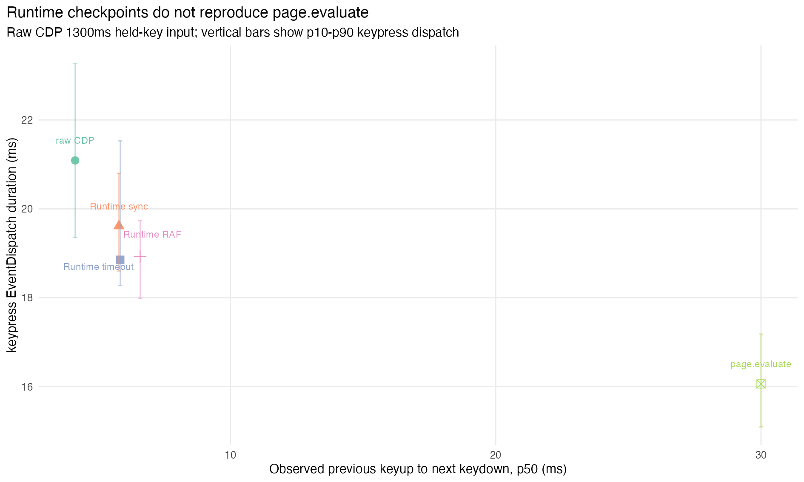

| Checkpoint | Retained samples | Observed post-keyup gap p50 | `keypress` p50 | `keypress` p10-p90 |
| ---------- | ---------------: | --------------------------: | -------------: | ------------------: |
| Raw CDP only | `12` |  `4.2ms` | `21.1ms` | `19.4-23.3ms` |
| CDP `Runtime.evaluate`, sync | `12` |  `5.8ms` | `19.6ms` | `18.6-20.8ms` |
| CDP `Runtime.evaluate`, `setTimeout( 0 )` | `12` |  `5.8ms` | `18.9ms` | `18.3-21.5ms` |
| CDP `Runtime.evaluate`, RAF | `12` |  `6.6ms` | `18.9ms` | `18.0-19.7ms` |
| Playwright `page.evaluate()` | `12` | `30.0ms` | `16.1ms` | `15.1-17.2ms` |

This disconfirms a broad "any renderer checkpoint is enough" explanation. A
direct CDP runtime evaluation, an awaited zero-delay timer, and an awaited RAF
all move raw CDP slightly downward, but none reaches the `page.evaluate()` fast
band. The RAF result is especially useful: a frame checkpoint alone is not the
missing boundary.

The remaining boundary is now more specific than "task/frame checkpoint": it is
something about Playwright's page action/evaluation path, its execution context
selection, or the protocol scheduling around that path. The benchmark-level
recommendation is unchanged, because all of these are synthetic-input
implementation details rather than user typing behavior.

### Playwright Trace Snapshot Follow-Up

The CDP checkpoint result still left one concrete open question: why did
Playwright `page.evaluate()` and per-key Playwright calls look so much faster
than raw CDP? The protocol logs show a concrete difference that was not part of
Gutenberg at all.

With the performance config's default Playwright setting
`trace: 'retain-on-failure'`, protocol logging shows Playwright trace snapshots
between one keyup and the next keydown:

| Mode | Protocol commands between previous `keyup` and next `keydown` |
| ---- | ------------------------------------------------------------- |
| multi-character `keyboard.type()`, trace on | no command between `keyup` and next `keydown` |
| per-key `keyboard.press()`, trace on | `captureSnapshot`, `captureSnapshot`, `captureSnapshot`, `captureSnapshot` |
| per-key `keyboard.press()`, `--trace=off` | no command between `keyup` and next `keydown` |
| raw CDP plus `page.evaluate()`, trace on | `captureSnapshot`, `captureSnapshot`, `Runtime.callFunctionOn( () => undefined )`, `captureSnapshot`, `captureSnapshot` |
| raw CDP plus `page.evaluate()`, `--trace=off` | `Runtime.callFunctionOn( () => undefined )` |

The timing follows that protocol difference:

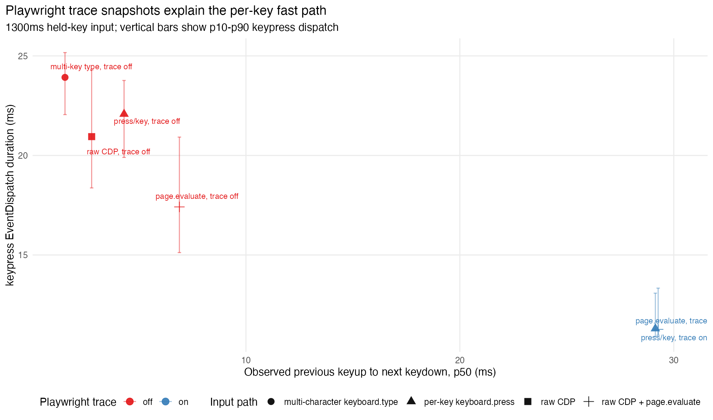

| Input path | Playwright trace | Retained samples | Observed post-keyup gap p50 | `keypress` p50 | `keypress` p10-p90 |
| ---------- | ---------------- | ---------------: | --------------------------: | -------------: | ------------------: |
| multi-character `keyboard.type()` | off | `12` |  `1.5ms` | `23.9ms` | `22.1-25.2ms` |
| per-key `keyboard.press()` | on | `12` | `29.1ms` | `11.3ms` | `10.9-13.1ms` |
| per-key `keyboard.press()` | off | `12` |  `4.3ms` | `22.1ms` | `19.9-23.8ms` |
| raw CDP | off | `12` |  `2.8ms` | `20.9ms` | `18.4-24.3ms` |
| raw CDP plus `page.evaluate()` | on | `12` | `29.3ms` | `11.3ms` | `11.0-13.3ms` |
| raw CDP plus `page.evaluate()` | off | `12` |  `6.9ms` | `17.4ms` | `15.1-20.9ms` |

This changes the interpretation of the earlier per-key-call and
`page.evaluate()` diagnostics. The full low-latency band is not evidence that a
human-like per-key action is inherently cheaper, and it is not evidence that a
plain `page.evaluate()` boundary is sufficient. It is mostly a Playwright trace
snapshot effect. The remaining trace-off `page.evaluate()` improvement
(`20.9ms` raw CDP to roughly `17-18.5ms` across the trace-off runs) is real but
smaller; that is the part still attributable to Playwright's page
evaluation/action path rather than the trace snapshotter.

This also explains why changing the benchmark input method can accidentally
change what is being measured. A single multi-character `keyboard.type()` call
does not insert Playwright trace snapshots between characters. Per-key
Playwright actions do. With trace snapshots enabled, a per-key rewrite can move
work/checkpoints between characters and make the next `EventDispatch` slice look
much faster for reasons unrelated to user typing.

### Trace-Off Evaluation-Path Follow-Up

The next open question was the smaller trace-off gap: why does raw CDP plus
Playwright evaluation remain faster than raw CDP alone even when Playwright trace
snapshots are disabled? I added trace-off modes that keep the raw
`Input.dispatchKeyEvent` input path fixed and vary only the checkpoint between
keys:

-   direct CDP `Runtime.evaluate( 'undefined' )`;
-   direct CDP `Runtime.evaluate( 'undefined' )` with `awaitPromise`,
    `returnByValue`, and `userGesture`;
-   direct CDP `Runtime.callFunctionOn` against `globalThis`;
-   Playwright `page.evaluate()`;
-   Playwright `page.evaluateHandle()`;
-   Playwright main-frame `locator.evaluate()`;
-   Playwright editor-frame `locator.evaluate()`.

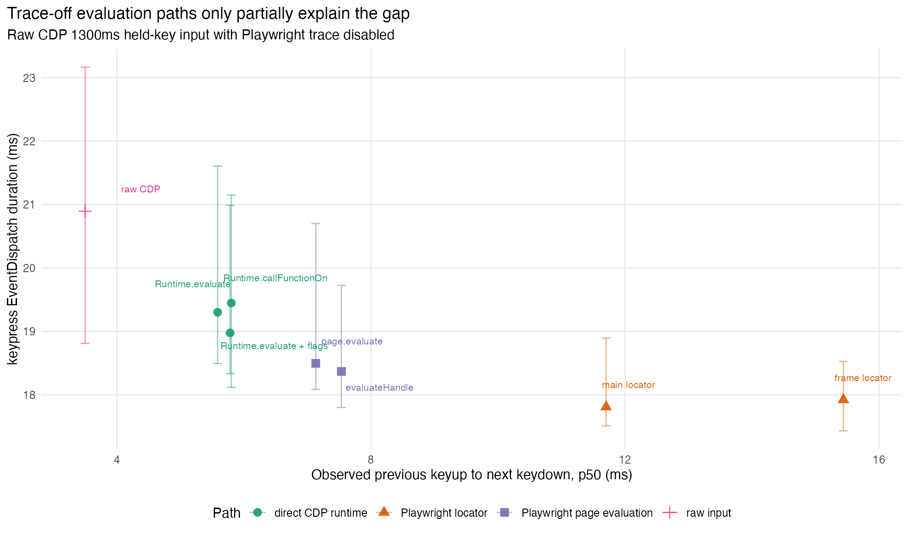

| Evaluation path | Retained samples | Observed post-keyup gap p50 | `keypress` p50 | `keypress` p10-p90 |
| --------------- | ---------------: | --------------------------: | -------------: | ------------------: |
| raw CDP only | `12` |  `3.5ms` | `20.9ms` | `18.8-23.2ms` |
| CDP `Runtime.evaluate` | `12` |  `5.6ms` | `19.3ms` | `18.5-21.6ms` |
| CDP `Runtime.evaluate` plus flags | `12` |  `5.8ms` | `19.0ms` | `18.3-21.0ms` |
| CDP `Runtime.callFunctionOn` against `globalThis` | `12` |  `5.8ms` | `19.4ms` | `18.1-21.1ms` |
| Playwright `page.evaluate()` | `12` |  `7.1ms` | `18.5ms` | `18.1-20.7ms` |
| Playwright `page.evaluateHandle()` | `12` |  `7.5ms` | `18.4ms` | `17.8-19.7ms` |
| Playwright main-frame `locator.evaluate()` | `12` | `11.7ms` | `17.8ms` | `17.5-18.9ms` |
| Playwright editor-frame `locator.evaluate()` | `12` | `15.4ms` | `17.9ms` | `17.4-18.5ms` |

The protocol windows explain the shape of this result:

| Mode | Protocol commands between previous `keyup` and next `keydown` |
| ---- | ------------------------------------------------------------- |
| direct `Runtime.evaluate` | one `Runtime.evaluate` |
| direct `Runtime.callFunctionOn` | one `Runtime.callFunctionOn` |
| Playwright `page.evaluate()` | one Playwright utility-script `Runtime.callFunctionOn` |
| main-frame `locator.evaluate()` | eleven selector/handle/DOM/evaluation commands |
| editor-frame `locator.evaluate()` | seventeen iframe/selector/handle/DOM/evaluation commands |

This disconfirms several narrower explanations:

1. The difference is not simply that direct `Runtime.evaluate` omitted
   `awaitPromise`, `returnByValue`, or `userGesture`; adding those only moved
   `keypress` p50 from `19.3ms` to `19.0ms`.
2. The difference is not simply the CDP method name; direct
   `Runtime.callFunctionOn` against `globalThis` was `19.4ms`, not the
   Playwright evaluation band.
3. The difference is not that evaluation must target the editor iframe; main
   locator and editor-frame locator evaluation were essentially tied.

The trace-off residual is therefore not a Gutenberg semantic state change that
the benchmark has identified. The best supported statement is narrower:
Playwright's page/locator evaluation machinery creates additional protocol
round trips and renderer checkpoints between raw CDP key events, and those
checkpoints partially reduce the next measured `EventDispatch` slice. The
locator path reduces it most, but that path also inserts much more automation
work between keys, so it is not a model of user typing.

That means the safe benchmark fix is unchanged: do not use a synthetic key-hold
delay as a proxy for typing pauses. Use a complete keypress and then wait, or
replay recorded human typing, and disable or account for Playwright trace
snapshots when comparing per-key Playwright calls with one multi-character
Playwright action.

### Runtime Repeat Dose-Response

The prior trace-off result still left a plausible narrower theory: perhaps
Playwright's utility-script or locator evaluation does something special that a
plain CDP runtime call does not. I added two repeat modes to test that directly.
Both keep the input path as raw `Input.dispatchKeyEvent` held-key events at
`1300ms`, run with Playwright `--trace=off`, and vary only how many no-op direct
CDP runtime calls happen after each `keyup` and before the next `keydown`:

-   `Runtime.evaluate( 'undefined' )` with `awaitPromise`, `returnByValue`, and
    `userGesture`;
-   `Runtime.callFunctionOn` against `globalThis`, with the same flags.

Each point below uses `36` retained samples plus one throwaway. The result is a
dose response.

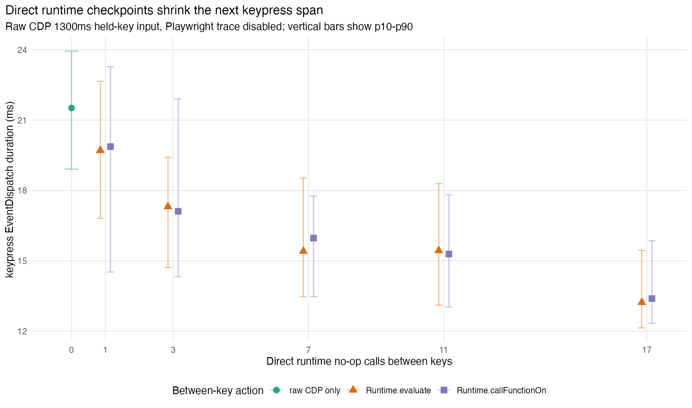

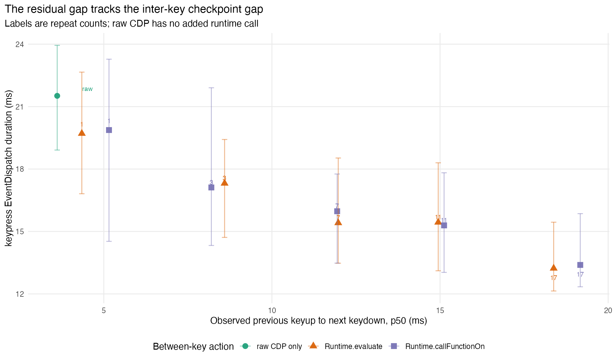

| Between-key checkpoint | Repeat count | Observed post-keyup gap p50 | `keypress` p50 | `keypress` p10-p90 |
| ---------------------- | -----------: | --------------------------: | -------------: | ------------------: |
| raw CDP only | `0` |  `3.6ms` | `21.5ms` | `18.9-23.9ms` |
| `Runtime.evaluate` | `1` |  `4.3ms` | `19.7ms` | `16.8-22.7ms` |
| `Runtime.evaluate` | `3` |  `8.6ms` | `17.3ms` | `14.7-19.4ms` |
| `Runtime.evaluate` | `7` | `12.0ms` | `15.4ms` | `13.5-18.5ms` |
| `Runtime.evaluate` | `11` | `14.9ms` | `15.4ms` | `13.1-18.3ms` |
| `Runtime.evaluate` | `17` | `18.4ms` | `13.2ms` | `12.1-15.4ms` |
| `Runtime.callFunctionOn` | `1` |  `5.2ms` | `19.9ms` | `14.5-23.3ms` |
| `Runtime.callFunctionOn` | `3` |  `8.2ms` | `17.1ms` | `14.3-21.9ms` |
| `Runtime.callFunctionOn` | `7` | `11.9ms` | `16.0ms` | `13.5-17.8ms` |
| `Runtime.callFunctionOn` | `11` | `15.1ms` | `15.3ms` | `13.0-17.8ms` |
| `Runtime.callFunctionOn` | `17` | `19.2ms` | `13.4ms` | `12.3-15.9ms` |

This disconfirms the utility-script-specific version of the trace-off theory.
One direct runtime checkpoint gives only a small improvement, matching the
earlier `Runtime.evaluate` and `Runtime.callFunctionOn` rows. But enough direct
runtime checkpoints reproduce and then exceed the trace-off Playwright
evaluation/locator improvement. The measured `keypress` slice tracks the
between-key protocol/checkpoint gap, not a unique Gutenberg semantic transition
introduced by `page.evaluate()`.

The exact browser-internal mechanism is still below this benchmark's
Gutenberg/DOM-level instrumentation. The evidence-supported statement is now
narrower and stronger: renderer/runtime checkpoints inserted by the automation
layer can change the amount of Gutenberg input work charged to the next
`EventDispatch` slice. Playwright trace snapshots are the largest version of
that in the default performance-test configuration; even with trace disabled,
additional runtime checkpoints remain a smaller measurement perturbation.

### Decoupling Wait Time From Runtime Checkpoints

The remaining ambiguity in the runtime-repeat result was whether the checkpoint
effect was just another way to create a longer post-keyup gap. The existing raw
CDP explicit-gap controls answer that. They keep the same raw
`Input.dispatchKeyEvent` path and add ordinary post-keyup waits, without any
between-key runtime evaluation. I combined those controls with the runtime-repeat
grid in one plot.

I then extended the ordinary-wait side of this comparison with two focused raw
CDP runs at `2000ms` and `5000ms` post-keyup waits. They use the same
`1300ms` held-key input path, 12 retained samples plus one throwaway, and
Playwright trace snapshots disabled. This tests the stronger "maybe the browser
just needs longer to rest" version of the theory.

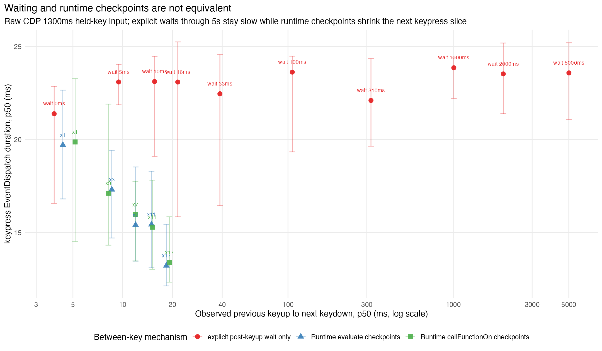

Selected p50s:

| Between-key mechanism | Point | Observed previous keyup to next keydown | `keypress` p50 |
| --------------------- | ----: | --------------------------------------: | -------------: |
| explicit post-keyup wait only | `wait 0ms` | `3.9ms` | `21.4ms` |
| explicit post-keyup wait only | `wait 16ms` | `21.5ms` | `23.1ms` |
| explicit post-keyup wait only | `wait 33ms` | `38.8ms` | `22.5ms` |
| explicit post-keyup wait only | `wait 1000ms` | `1007.8ms` | `23.9ms` |
| explicit post-keyup wait only | `wait 2000ms` | `2007.6ms` | `23.5ms` |
| explicit post-keyup wait only | `wait 5000ms` | `5008.5ms` | `23.6ms` |
| `Runtime.evaluate` checkpoints | `x1` | `4.3ms` | `19.7ms` |
| `Runtime.evaluate` checkpoints | `x7` | `12.0ms` | `15.4ms` |
| `Runtime.evaluate` checkpoints | `x17` | `18.4ms` | `13.2ms` |
| `Runtime.callFunctionOn` checkpoints | `x1` | `5.2ms` | `19.9ms` |
| `Runtime.callFunctionOn` checkpoints | `x7` | `11.9ms` | `16.0ms` |
| `Runtime.callFunctionOn` checkpoints | `x17` | `19.2ms` | `13.4ms` |

This is the cleanest negative control for the "post-keyup gap" explanation. If
elapsed gap were sufficient, raw CDP plus `16ms`, `33ms`, `1000ms`, `2000ms`,
or `5000ms` of ordinary waiting would move toward the low band. It does not;
those rows stay around `22-24ms`. Runtime checkpoints move the next keypress
lower at comparable or much shorter observed gaps. The difference is therefore
not elapsed time after `keyup`; it is crossing renderer/runtime/protocol
checkpoints inserted by the automation path.

That does not identify the exact Chromium internal state that changes at those
checkpoints. It does remove a class of bad explanations: no amount of ordinary
sleep in this raw-CDP path reproduced the fast path, even after `5s`, so the fast
path is not "the browser had time to rest" or "queued JavaScript drained during
the gap." The remaining mechanism is browser/runtime scheduling below this
benchmark's ordinary DOM and Gutenberg instrumentation.

### Native Runtime Repeat Control

That still left a browser-vs-Gutenberg scale question: do the same direct runtime
checkpoints shrink any `contenteditable` keypress, or only Gutenberg's editor?
I reran the same raw-CDP held-key runtime-repeat grid in the
`native-contenteditable-timer` scenario. This scenario is a plain
`contenteditable` node with the same one-second input timer shape, but without
Gutenberg, React, data subscriptions, rich text, undo persistence, or iframe
editor work.

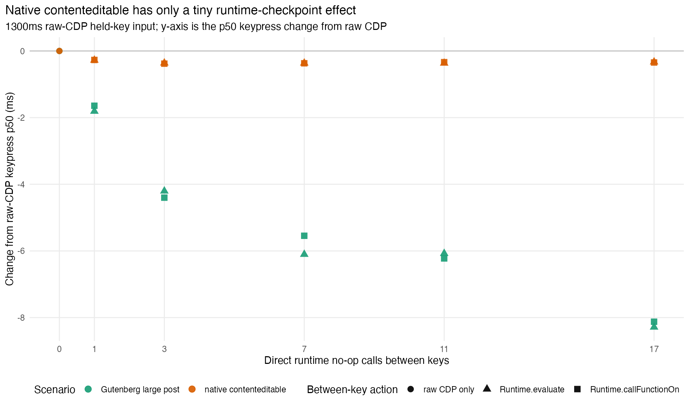

| Scenario | Between-key checkpoint | Repeat count | Observed post-keyup gap p50 | `keypress` p50 | Change from raw |
| -------- | ---------------------- | -----------: | --------------------------: | -------------: | --------------: |
| native `contenteditable` | raw CDP only | `0` |  `4.1ms` | `0.802ms` |  `0.000ms` |
| native `contenteditable` | `Runtime.evaluate` | `1` |  `6.5ms` | `0.525ms` | `-0.277ms` |
| native `contenteditable` | `Runtime.evaluate` | `3` |  `9.4ms` | `0.440ms` | `-0.362ms` |
| native `contenteditable` | `Runtime.evaluate` | `7` | `11.9ms` | `0.438ms` | `-0.364ms` |
| native `contenteditable` | `Runtime.evaluate` | `11` | `15.3ms` | `0.436ms` | `-0.367ms` |
| native `contenteditable` | `Runtime.evaluate` | `17` | `18.8ms` | `0.472ms` | `-0.330ms` |
| native `contenteditable` | `Runtime.callFunctionOn` | `1` |  `6.3ms` | `0.533ms` | `-0.269ms` |
| native `contenteditable` | `Runtime.callFunctionOn` | `3` |  `9.0ms` | `0.422ms` | `-0.381ms` |
| native `contenteditable` | `Runtime.callFunctionOn` | `7` | `12.8ms` | `0.433ms` | `-0.370ms` |
| native `contenteditable` | `Runtime.callFunctionOn` | `11` | `15.2ms` | `0.466ms` | `-0.336ms` |
| native `contenteditable` | `Runtime.callFunctionOn` | `17` | `19.3ms` | `0.457ms` | `-0.346ms` |

This confirms the checkpoint effect is not purely a Gutenberg semantic-state
transition. The plain native editor also gets slightly faster after one or more
runtime checkpoints. But it disconfirms the opposite overbroad explanation too:
the native absolute movement is only about `0.3-0.4ms`, while the Gutenberg
large-post run moves by about `2ms` with one checkpoint and roughly `8ms` at the
largest repeat count. The automation/browser checkpoint is real, but Gutenberg's
heavy input path amplifies it into the multi-millisecond benchmark artifact.

### CDP Boundary Consolidation

The raw-CDP and Playwright-evaluation checks were useful individually, but the
open question is easier to see when they are put on one scale. The consolidated
view keeps the held-key `1300ms` workload fixed and compares four between-key
families: ordinary raw-CDP sleeps, direct runtime checkpoints, trace-off
Playwright evaluation paths, and the default Playwright trace-snapshot path.

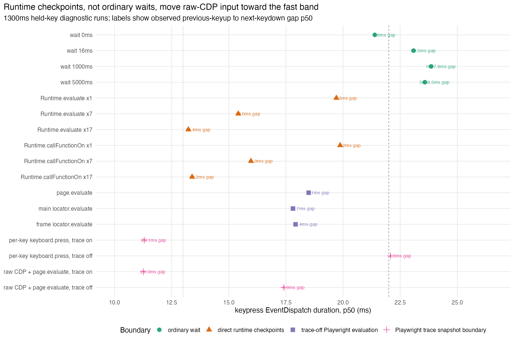

The result closes the broad "maybe it is just a longer gap" explanation.
Ordinary raw-CDP waiting stays slow: `wait 0ms`, `16ms`, `1000ms`, and `5000ms`
have `keypress` p50s of `21.4ms`, `23.1ms`, `23.9ms`, and `23.6ms`. Direct
runtime checkpoints move the next input in a dose response: `Runtime.evaluate`
`x1`, `x7`, and `x17` are `19.7ms`, `15.4ms`, and `13.2ms`. Playwright trace
snapshots are the largest automation boundary: per-key `keyboard.press()` is
`22.1ms` with trace off and `11.3ms` with trace on; raw CDP plus
`page.evaluate()` is `17.4ms` with trace off and `11.3ms` with trace on.

The theory matrix is now:

| Candidate theory | Current status | Strongest measurement |
| ---------------- | -------------- | --------------------- |
| Elapsed post-keyup time creates the fast path | ruled out | Ordinary raw-CDP waits from `4ms` through `5008ms` stay around `21-24ms`. |
| DOM event payload or raw-CDP packet shape explains the slow path | ruled out | Corrected raw-CDP packets and matched DOM key/input signatures still stay slow. |
| One generic renderer checkpoint is enough | ruled out | A single `Runtime.evaluate`, `setTimeout(0)`, or RAF checkpoint improves only partway. |
| Playwright trace snapshots explain the full per-key fast path | supported | Trace-on per-key press and trace-on `page.evaluate()` are both about `11.3ms`; trace-off versions are much slower. |
| Runtime checkpoint count changes the measured Gutenberg input slice | supported | Direct runtime calls form a dose response down to about `13ms` at `x17`. |
| Native/browser-only checkpoint effects explain the Gutenberg-scale artifact | ruled out for scale | Native `contenteditable` moves only `0.3-0.4ms`; Gutenberg moves by several milliseconds. |
| Exact Chromium internal mechanism is identified | still open | Current traces do not include the renderer scheduler/runtime state that changes across checkpoints. |

So the remaining CDP boundary is not a Gutenberg semantic state transition and
not ordinary elapsed time. It is a browser/runtime/protocol checkpoint effect
introduced by the automation layer, amplified by Gutenberg's heavy input path.
The exact Chromium internal state is still below this benchmark's DOM,
Gutenberg, and Playwright-protocol instrumentation.

The next-step audit is therefore much narrower than "run more Playwright
typing":

| Runtime checkpoint question | Current answer | What is closed | Remaining unknown | Next useful probe |
| --------------------------- | -------------- | -------------- | ----------------- | ----------------- |
| Is the per-key fast path just elapsed post-keyup time? | no | ordinary waits from about `4ms` through `5008ms` stay around `21-24ms` `keypress` p50 | none for this benchmark decision | stop extending ordinary-wait controls unless a new browser build changes the result |
| Is one generic task, timer, or frame checkpoint enough? | no | one `Runtime.evaluate`, `setTimeout(0)`, or RAF checkpoint improves only partway | which runtime/protocol side effect accumulates when checkpoints repeat | trace direct `Runtime.evaluate` and `Runtime.callFunctionOn` repeat grids with Chromium scheduler/runtime categories |
| Do Playwright trace snapshots explain the full per-key fast path? | yes for the default trace-on configuration | trace-on per-key Playwright actions are a measurement perturbation, not a human-typing model | which snapshot subcommand or renderer state transition causes the speedup | compare trace-on `captureSnapshot` windows with trace-off repeated runtime-call windows in the same browser trace |
| Can direct runtime checkpoints reproduce the trace-off residual? | yes, by dose response | a unique Playwright utility-script or locator semantic action is not required | V8 microtask state, renderer scheduler priority, input queue state, cache/frequency side effects, or a mix | hold raw CDP input fixed, vary checkpoint count, and trace around prior `keyup` / next `keydown` |
| Is the browser checkpoint enough to explain Gutenberg-scale movement by itself? | no | native `contenteditable` moves only `0.3-0.4ms` while Gutenberg moves by several milliseconds | how much survives real plugin/human workloads | split artifact mechanism from product-lag work: Chromium tracing for the former, replayed workload traces for the latter |

### Chromium Runtime Trace Contract

The Chromium/runtime question is now narrow enough that another row in the
JS-level delay sweep would not add much. The current harness already has the
decisive negative controls: ordinary sleeps through `5008ms` stay slow, while
shorter windows containing repeated runtime protocol work move the next
`EventDispatch` slice substantially. The missing information is not "how many
milliseconds passed after `keyup`"; it is which browser/runtime state differs
after protocol runtime work but not after an ordinary wait.

The existing browser-trace mode in this benchmark is render/screenshot oriented:
it captures `devtools.timeline`, render pipeline events, and optional trace
screenshots. That is enough for Paint/DrawFrame/screenshot endpoint alignment,
but it is not a scheduler/runtime-state trace. The next useful probe therefore
has a different contract:

| Contrast | Current local answer | Required trace contract |
| -------- | -------------------- | ----------------------- |
| Ordinary wait versus runtime checkpoint | elapsed post-keyup time, queued-JS drain, and browser rest are ruled out; waits through `5008ms` stay around `21-24ms`, while runtime checkpoints reach about `13ms` at `x17` | trace the same raw-CDP held-key path for wait `16ms`, wait `1000ms`, wait `5000ms`, `Runtime.evaluate` `x7/x17`, and `Runtime.callFunctionOn` `x7/x17`; align prior `keyup` end, protocol command start/end, next `keydown`, and `EventDispatch` start/end |
| Single checkpoint versus repeated checkpoint | one task/timer/frame checkpoint is not enough; the repeated direct runtime calls are the thing that produces the dose response | keep command payloads identical and vary only repeat count `x0/x1/x3/x7/x17`; record renderer main-thread tasks, V8 execution slices, microtask checkpoints if exposed, scheduler priority/queue slices if exposed, and next `EventDispatch` duration |
| Direct CDP call versus Playwright utility path | the trace-off residual is not explained by CDP method name, `awaitPromise`/`returnByValue`/`userGesture`, or editor-frame targeting | trace direct `Runtime.callFunctionOn`, Playwright `page.evaluate()`, `page.evaluateHandle()`, and `locator.evaluate()` with protocol-command markers, execution-context IDs, and object-lifecycle markers in the same keyup-to-keydown window |
| Trace snapshot boundary | the full trace-on per-key fast path is a Playwright trace-snapshot perturbation, not a human-typing model | compare trace-on `captureSnapshot` windows against trace-off runtime-repeat windows with a separate low-overhead protocol log; control for using the same Playwright trace facility as both perturbation and observer |
| Native scale control | the browser checkpoint is real but too small to explain Gutenberg-scale movement by itself | use browser tracing to identify the artifact trigger; use recorded workload replay to decide product-lag relevance |

That makes the decision boundary sharper. For choosing or explaining the CI
typing helper, the Chromium row is closed: do not model human typing with a
held-key delay or trace-on per-key Playwright action. For explaining the exact
browser state, the next work is below this benchmark's DOM/React/data
instrumentation. It needs browser/runtime tracing around the already-identified
contrasts, not more Gutenberg delay points.

The deeper runtime trace runbook makes the lower-level work falsifiable:

| Runtime trace surface | Required rows | Acceptance gate |
| --------------------- | ------------- | --------------- |
| Wait versus checkpoint | raw CDP held-key `wait 16ms`, `1000ms`, `5000ms`, `Runtime.evaluate` `x7/x17`, `Runtime.callFunctionOn` `x7/x17`, and raw `x0` | runtime rows must share a scheduler, V8, microtask, queue, or input-priority state absent from ordinary waits and tracking the lower `EventDispatch` duration |
| Checkpoint dose response | `Runtime.evaluate` and `Runtime.callFunctionOn` `x0/x1/x3/x7/x17` with identical payloads and input path | a trace-state metric should move monotonically or stepwise with repeat count and match the p50 dose response |
| Trace snapshot perturbation | trace-on `keyboard.press()` and raw CDP plus `page.evaluate()`, matched against trace-off runtime-repeat rows and a separate low-overhead protocol log | the fast trace-on band should align with `captureSnapshot` or related snapshot protocol work; otherwise the observer setup is not isolated |
| Playwright utility residual | direct `Runtime.callFunctionOn`, `page.evaluate()`, `page.evaluateHandle()`, `locator.evaluate()`, and editor-frame locator evaluation under trace off | only explain the residual if extra command, utility-script, execution-context, handle-lifecycle, or scheduler-state markers account for the p50 gap |
| Native scale control | the same wait/checkpoint subset in Gutenberg large-post and native `contenteditable` timer scenarios | browser state may match, but Gutenberg source spans must account for the multi-millisecond scale difference |

Each retained sample needs the browser trace state aligned with the existing key
and source spans: run id, sample index, retained/throwaway flag, browser
revision, trace categories, protocol commands, task/queue/V8 slices,
`EventDispatch` timing, source-span ids, environment metadata, and observer
configuration. Until the same trace-state variable predicts the primary
wait/checkpoint contrast, the dose response, the trace-snapshot perturbation, and
the native scale control, the exact Chromium mechanism remains unnamed even
though the benchmark-level CI decision is closed.

### Chromium Runtime Harness Gap Audit

I re-audited this as a falsification problem rather than a story-fitting problem.
The source-level check says the existing benchmark can already vary the input
path and runtime checkpoint shape, but it cannot yet name the Chromium internal
state. The missing piece is not another Gutenberg delay point; it is a
per-retained-key observer that aligns protocol commands, scheduler/runtime trace
state, V8 or microtask slices if exposed, OS counters if needed, and the existing
`EventDispatch` and Gutenberg source spans.

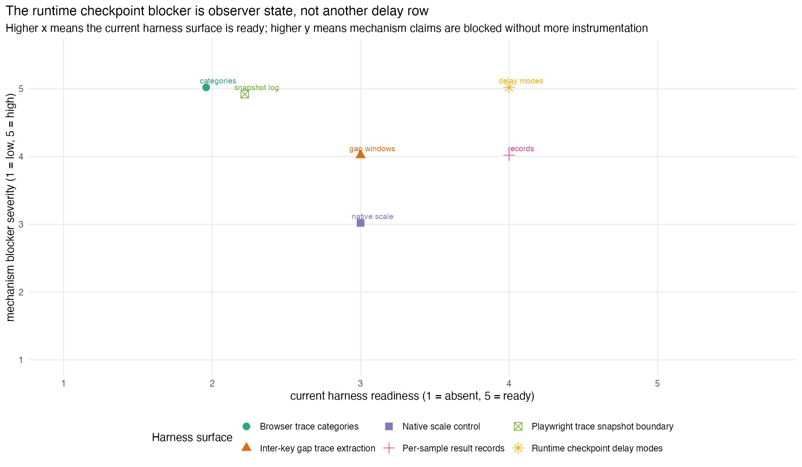

The practical split is:

| Harness surface | Source evidence | Current capability | Mechanism blocker |
| --------------- | --------------- | ------------------ | ----------------- |
| Browser trace categories | `packages/e2e-test-utils-playwright/src/metrics/index.ts:214-219`; `test/performance/specs/typing-delay-benchmark.spec.js:1128-1144` | `Metrics.startTracing()` accepts options, but this benchmark currently wires `devtools.timeline`, render, and screenshot-oriented categories. | No runtime-checkpoint trace bundle for scheduler queues, V8 execution, microtasks, input priority, or task attribution. |
| Inter-key gap trace extraction | `test/performance/specs/typing-delay-benchmark.spec.js:1370-1408`; `4356-4358` | The harness can retain events overlapping the previous-keyup to next-keydown gap. | It does not yet retain enough process/thread/flow/task fields or protocol-command alignment to identify the browser state change. |
| Runtime checkpoint delay modes | `test/performance/specs/typing-delay-benchmark.spec.js:3980-4160` | Raw CDP input is held fixed while direct `Runtime.evaluate`, `Runtime.callFunctionOn`, timeout, RAF, page/locator evaluation, and repeat counts vary. | Per-key CDP command start/end times, execution contexts, object lifecycle, and command counts are not stored beside the retained samples. |
| Per-sample records | `test/performance/specs/typing-delay-benchmark.spec.js:4211-4360`; `extract-typing-delay-runtime-repeat.js:99-134` | Records already carry retained sample index, latency/key durations, observed gap, browser events, data spans, and optional gap events. | Current extraction summarizes p50s and gaps, not per-sample runtime/scheduler predictors. |
| Trace snapshot boundary | protocol-log audit around `captureSnapshot` | Existing protocol logs line up trace-on `captureSnapshot` calls with the full fast band. | The Playwright trace facility cannot be both the perturbation and the only observer of the perturbing commands. |
| Native scale control | native runtime-repeat extractor and summary CSV | Native `contenteditable` repeats the same raw-CDP/runtime grid and shows only a sub-millisecond movement. | Native rows still need the same runtime/scheduler sidecar if the final claim names Chromium internals. |

The deeper audit splits "add Chromium tracing" into separate failure modes. The
current `browserTraceOptions()` path is aimed at render/screenshot evidence, and
the runtime delay modes already vary raw CDP input, `Runtime.evaluate`,
`Runtime.callFunctionOn`, Playwright evaluation, timeout, RAF, and repeat counts.
What is missing is not another mode; it is a trace-off protocol sidecar that can
say exactly which commands happened inside each retained previous-keyup to
next-keydown window before any heavier browser trace observer is added.

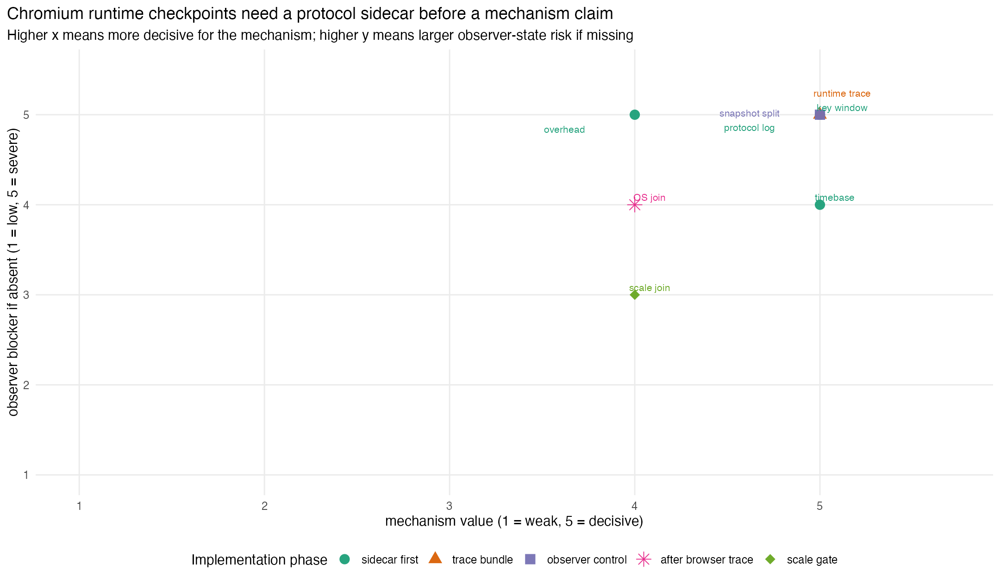

The sidecar contract is:

| Sidecar surface | Required fields | Why it matters |
| --------------- | --------------- | -------------- |
| Retained key and gap identity | run id, sample index, retained/throwaway flag, delay mode, repeat count, prior keyup end, next keydown enqueue, `EventDispatch` start/end | ties runtime commands and trace state to the same inter-key window that contributes to p50 |
| Low-overhead protocol command log | command id, method, parameter fingerprint, start/end driver timestamps, result/error, execution context id, object id/group, release timing | separates command-count, command-duration, context-resolution, and handle-lifecycle effects from trace-category effects |
| Browser and driver timebase | browser monotonic timestamps, driver monotonic timestamps, before/after sync points, browser revision, trace timebase | prevents short repeated checkpoint loops from being joined to the wrong key window |
| Runtime trace category bundle | task queue, scheduler priority, input task state, V8 execution, microtask checkpoints if exposed, process/thread ids, flow ids | names the browser/runtime state that differs after checkpoints but not after ordinary waits |
| Trace snapshot observer split | external protocol log, trace-on/off flag, `captureSnapshot`/DOMSnapshot command windows, observer configuration, disabled-snapshot control if available | avoids using the perturbing Playwright trace facility as the only observer of that perturbation |
| OS counter join | optional `powermetrics`/`trace` sample ids, renderer pid/thread id, frequency/residency/QoS state, CPU collector configuration | checks whether runtime checkpoints are only a proxy for OS power, scheduler, QoS, or cache state |
| Native and Gutenberg scale join | scenario id, native listener spans, Gutenberg source-span ids, fixture metadata, same runtime rows and trace categories | separates the browser trigger from Gutenberg's multi-millisecond fanout amplification |
| Observer overhead sentinels | trace-off protocol-only control, trace-on runtime-bundle control, command-count no-op control, class-order preservation, dropped event counts | detects the observer changing the scheduler/runtime state under test |

The MVP for that sidecar is now explicit. The first run should be trace-off and
protocol-only; it should answer whether the benchmark can record command windows
without changing the row ordering. It should not try to name V8, scheduler, or
OS state yet.

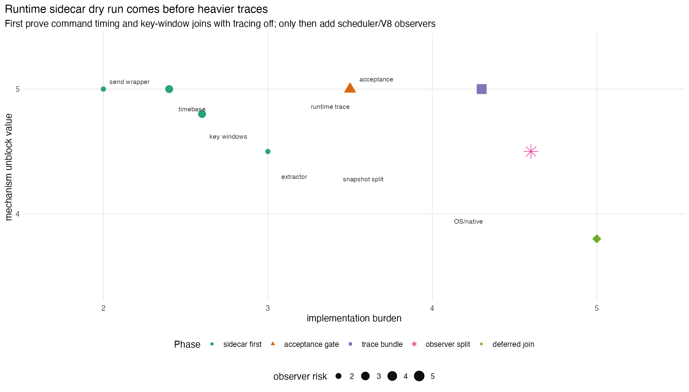

| Implementation piece | First change | Acceptance gate | Stop condition |
| -------------------- | ------------ | --------------- | -------------- |
| Protocol send wrapper | Wrap each direct CDP checkpoint command in the runtime checkpoint branch and log command id, method, repeat/sample/window id, parameter fingerprint, timestamps, result/error, execution context, and object id/group. | Trace-off wait, `Runtime.evaluate`, `Runtime.callFunctionOn`, and `page.evaluate` rows produce expected command counts without changing retained p50 class ordering. | Stop before scheduler/V8 tracing if command logging changes ordering or drops commands. |
| Browser/driver timebase sync | Record browser `performance.now()` sync points and driver monotonic timestamps around command windows. | Every command maps to the previous-keyup-to-next-keydown gap used by `EventDispatch`. | Stop if short repeat loops cannot be aligned to the browser key-gap timebase. |
| Key-gap window join | Assign a stable inter-key window id after each sample and join protocol commands, observed gap, delay mode, repeat count, retained/throwaway status, `EventDispatch`, and source-span ids. | The extractor emits one row per retained key window and command counts match existing latency records. | Stop if commands can only be joined at aggregate-run level. |
| Raw artifact and extractor schema | Add protocol-command events to raw JSON and a sidecar extractor while leaving existing q50 output unchanged. | Existing runtime-repeat latency summaries remain equivalent; new CSVs expose command ids/counts/durations/context/window joins. | Stop if the sidecar changes the metric output. |
| Trace-off acceptance matrix | Run `x0/x1/x3/x7/x17` runtime-repeat rows plus ordinary waits and trace-off `page.evaluate`. | Class ordering survives, command duration/count scales with repeat count, no retained windows are missing, and overhead is bounded by matched no-sidecar rows. | Do not enable heavier trace categories until this passes. |
| Runtime trace category bundle | Only after the trace-off sidecar passes, add scheduler/task-queue, input-priority, V8, microtask-if-exposed, pid/tid, and flow-id categories, recording the exact category list. | A per-window trace-state metric separates waits from runtime repeats and tracks the repeat-count dose response. | Reject named V8/scheduler/input-priority mechanisms if the observer perturbs ordering or exposes no predictive state. |
| Trace-snapshot observer split | Use the sidecar or a separate low-overhead protocol log around trace-on `captureSnapshot` / DOMSnapshot windows. | Trace-on fast rows align with snapshot protocol windows and share the same state as high-repeat trace-off runtime checkpoints. | Do not generalize trace-on fast rows if the observer creates the state or cannot be joined per retained key. |
| OS/native scale joins | Add renderer pid/tid, optional OS-counter ids, native scenario ids, Gutenberg fixture/source-span ids, and collector metadata after browser-side joins are stable. | Browser state remains predictive after matching OS counters; native rows stay browser-scale while Gutenberg spans explain amplification. | Keep the exact mechanism at OS/QoS or workload scope if browser state does not survive these joins. |

That yields a stricter mechanism ladder:

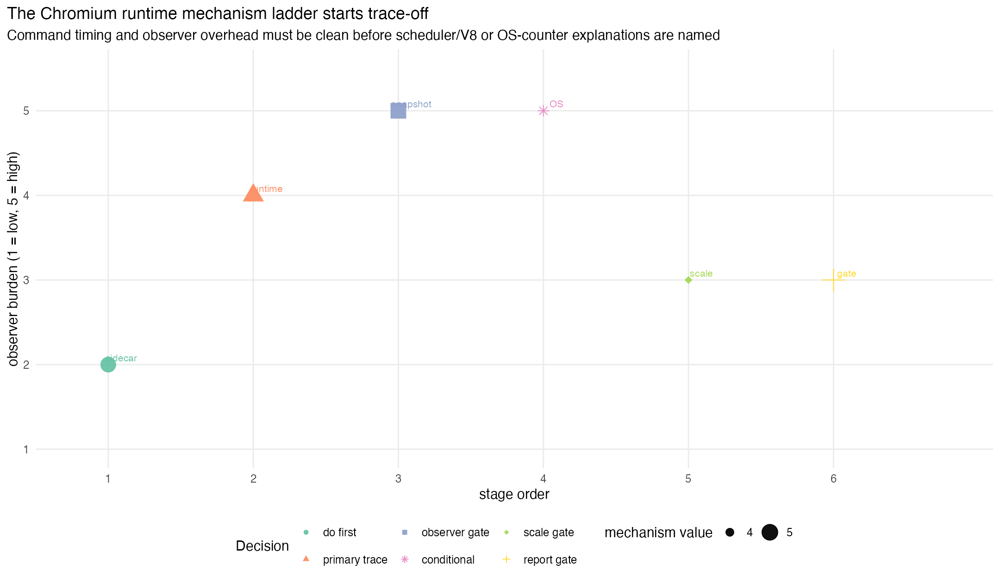

1. First add the protocol sidecar with tracing off. The wait/checkpoint class
   ordering must survive with command timing recorded.
2. Then add the runtime scheduler/V8 trace bundle. A candidate trace-state metric
   should separate ordinary waits from repeated checkpoints and track the
   `x0/x1/x3/x7/x17` dose response per retained key.
3. Then split the trace snapshot perturbation with an external protocol log. A
   trace-on `captureSnapshot` fast band should line up with the same state as
   high-repeat runtime checkpoints before the report names that state.
4. Add OS counter alignment only if browser trace state does not cleanly explain
   the split, or if CPU/QoS state appears to dominate the runtime rows.
5. Keep the native/Gutenberg scale gate separate: a Chromium state can be real
   while still being too small to explain product latency without Gutenberg
   source-span amplification.

That audit gives the stricter rule I should have used earlier: if a theory says
"some work moved" or "some state was already finalized," it has to identify a
recorded event, command, trace state, or source span that moved. For the
Chromium checkpoint question, the current data proves the boundary but not the
internal browser mechanism. The next credible implementation starts trace-off
with protocol-command timing; a heavier scheduler/V8 trace comes only after that
observer is shown not to change the row ordering.

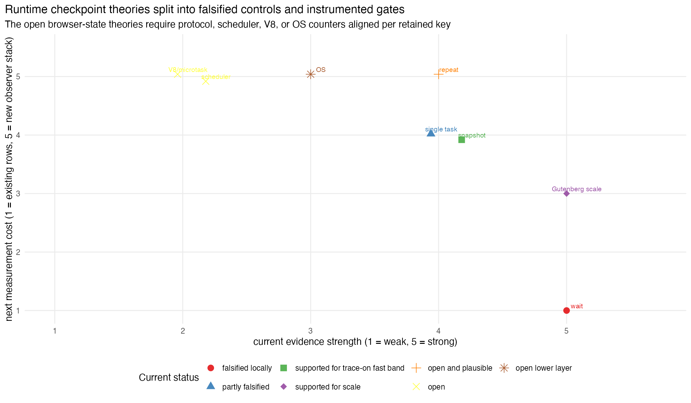

The remaining theory matrix is:

| Candidate mechanism | Current status | Current evidence | Required next evidence |
| ------------------- | -------------- | ---------------- | ---------------------- |
| Elapsed post-keyup time / browser rest | falsified locally | Ordinary raw-CDP waits through about `5008ms` stay near the slow `21-24ms` keypress band. | None for the current benchmark decision; reopen only if a new browser build changes ordinary-wait behavior. |
| Single task, timer, or frame checkpoint | partly falsified | One sync `Runtime.evaluate`, `setTimeout(0)`, or RAF checkpoint improves only partway. | Runtime/scheduler trace showing why repeated checkpoints differ from one-shot task/frame checkpoints. |
| Runtime command count / execution checkpoint | open and plausible | `Runtime.evaluate` and `Runtime.callFunctionOn` form a repeat-count dose response down to about `13ms` at x17. | A per-sample trace-state metric that changes with x0/x1/x3/x7/x11/x17 and predicts `EventDispatch` duration. |
| V8 or microtask state | open | Runtime commands are sufficient to move the path, but current artifacts do not expose V8 or microtask slices. | V8 execution, microtask checkpoint, or execution-context state differing between waits and repeated runtime calls. |
| Renderer scheduler / input task priority | open | Runtime and CPU/QoS controls both show state below Gutenberg selectors, but current categories are render/screenshot oriented. | Task queue, priority, or main-thread scheduling state differing after checkpoints and predicting the lower input span. |
| Trace snapshot perturbation | supported for trace-on fast band | Trace-on per-key `keyboard.press()` and trace-on raw CDP plus `page.evaluate()` both hit the fast band. | Separate low-overhead protocol log showing whether `captureSnapshot` or related snapshot work creates the same state as high-repeat runtime checkpoints. |
| OS power/QoS/cache state | open lower layer | CPU/QoS controls can put the same broad Gutenberg path into different latency bands. | OS counters showing whether runtime checkpoints still predict latency after matching frequency, residency, QoS, and scheduler state. |
| Gutenberg fanout amplification | supported for scale | Native contenteditable moves only about `0.3-0.4ms`; Gutenberg moves by several milliseconds. | Matched browser trace plus Gutenberg source spans showing where the browser-level state is amplified into editor work. |

So the best current answer to the open runtime question is deliberately modest:
the low-latency band around runtime checkpoints is real, not an elapsed-time
artifact, not a DOM event-payload artifact, and not big enough in native editing
to explain Gutenberg-scale latency by itself. The exact Chromium state remains
open until the benchmark records the per-key protocol and runtime/scheduler
sidecar above.

### Chromium Runtime Claim Ladder

The runtime-checkpoint row now has enough negative controls that the remaining
risk is overclaiming. The valid claim is not "we found the Chromium scheduler
state." The valid claim is "automation-inserted runtime checkpoints change the
measured Gutenberg input slice, and the exact lower-level browser state remains
unnamed." The derived claim audit is in
`data/typing-delay-chromium-runtime-claim-ladder-audit.csv`.

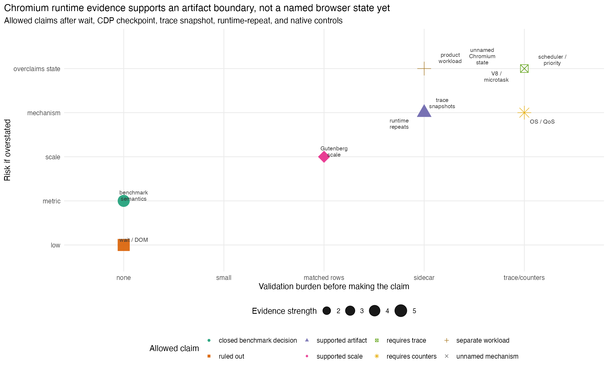

| Claim | Current status | Boundary |
| ----- | -------------- | -------- |
| Benchmark input semantics | closed locally | held-key delay and trace-on per-key Playwright actions are automation stressors, not human typing models |
| Elapsed wait / DOM payload | ruled out | corrected CDP packets, matched DOM signatures, and ordinary waits through about `5008ms` stay slow |
| Runtime checkpoint dose response | supported artifact | repeated direct runtime calls move the measured slice, but do not name V8, microtasks, scheduler, or OS state |
| Trace snapshot perturbation | supported artifact | trace-on `captureSnapshot` explains the full per-key fast band, but needs an external protocol log before naming the snapshot subcommand/state |
| Exact Chromium runtime state | still unnamed | requires trace-off protocol sidecar plus scheduler/V8/microtask/input-priority state per retained key |
| OS power/QoS/cache layer | open confound | requires OS-counter joins before claiming the mechanism is purely Chromium-internal |
| Gutenberg scale amplification | supported for scale | native moves only sub-millisecond; Gutenberg source fanout supplies the multi-millisecond scale |
| Product-latency relevance | separate workload question | needs workload replay before ranking real user/plugin editing latency |

This tightens the next-step rule. More JS-level delay rows are not useful for
the runtime mechanism. The first needed implementation is a trace-off protocol
sidecar that records command timing, command count, context/object lifecycle, and
timebase alignment without changing row ordering. Only after that should a
scheduler/V8/microtask trace or OS-counter join be used to name the state. Until
then, the report should keep the Chromium row at the artifact-boundary level.

### Native Contenteditable Baseline

The key-state traces show conditions that separate slow and fast Gutenberg
traces, but they do not prove that the condition is a browser/Playwright effect
by itself. To test that, the benchmark now has `native-contenteditable-timer`: a
plain `contenteditable` node with an input listener that clears and reschedules a
`1000ms` timer. The timer records the same kind of marker, but it does not touch
Gutenberg, React, `@wordpress/data`, rich text, undo persistence, block
selection, or the iframe editor.


The native baseline does not reproduce the Gutenberg key-hold plateau:

| Scenario                 | Mode             |    Delay | Latency p50 | `keypress` p50 |
| ------------------------ | ---------------- | -------: | ----------: | -------------: |
| Gutenberg                | key held         | `1200ms` |    `17.4ms` |       `16.4ms` |
| Gutenberg                | wait after keyup | `1200ms` |    `11.1ms` |       `10.9ms` |
| Native `contenteditable` | key held         | `1200ms` |     `1.2ms` |        `1.0ms` |
| Native `contenteditable` | wait after keyup | `1200ms` |     `0.8ms` |        `0.7ms` |
| Gutenberg                | key held         | `2000ms` |    `16.9ms` |       `15.8ms` |
| Gutenberg                | wait after keyup | `2000ms` |    `10.6ms` |       `10.3ms` |
| Native `contenteditable` | key held         | `2000ms` |     `1.1ms` |        `0.9ms` |
| Native `contenteditable` | wait after keyup | `2000ms` |     `1.0ms` |        `0.9ms` |

The native timing data still has the marker before `keyup` in key-hold mode. For
example, at `1200ms`, the marker fired about `201ms` before the previous `keyup`;
at `2000ms`, it fired about `1001ms` before the previous `keyup`. Even so,
`keypress` dispatch stayed around `1ms`.

That rules out a pure Chromium/Playwright explanation for the Gutenberg plateau.
The current model is:

1. Playwright's delay creates an unrealistic long-held key.
2. Gutenberg's rich-text persistence timer fires while that key is still held.
3. The next synthetic keypress runs Gutenberg's heavier editor input path,
   visible mostly as `keypress` `EventDispatch` duration.
4. Recent CPU work near the next key modulates that measured path. Later
   task-end, worker, external child-process, and native busy-timer controls show
   this modulation is not purely semantic editor state, but Gutenberg's editor
   stack is needed for the large absolute swing.

This is narrower than the previous conclusion. The timer/key-hold timing is a
necessary diagnostic signal in the Gutenberg traces, but not sufficient without
Gutenberg's editor stack.

### Listener Trace: RichText Input

The next pass patched `EventTarget.prototype.addEventListener` before the editor
loaded and injected the same tracer into the editor canvas iframe. This is
diagnostic instrumentation, not a score run: wrapping listeners adds overhead and
the listener durations do not need to sum exactly to Chromium's `EventDispatch`
trace duration. It is still useful because it localizes where the measured
JavaScript callback time is going.


In the targeted listener trace, the dominant measured callback was an
editor-canvas `input` listener registered from `build/scripts/rich-text/`. Parent
frame keydown listeners, React delegation wrappers, keyboard-shortcut listeners,
and `block-editor` input listeners were small by comparison.

Selected values:

| Mode             |    Delay | Latency p50 | RichText input median | RichText input p90 |
| ---------------- | -------: | ----------: | --------------------: | -----------------: |
| key held         | `1200ms` |    `17.5ms` |               `4.1ms` |           `10.0ms` |
| wait after keyup | `1200ms` |    `11.0ms` |               `3.4ms` |            `7.0ms` |
| key held         | `1300ms` |    `18.7ms` |               `4.1ms` |           `10.5ms` |
| wait after keyup | `1300ms` |    `11.4ms` |               `3.5ms` |            `7.2ms` |
| key held         | `1550ms` |    `12.6ms` |               `3.7ms` |            `7.7ms` |
| wait after keyup | `1550ms` |    `10.5ms` |               `3.1ms` |            `6.5ms` |

This explains why the browser trace reports the cost as `keypress`
`EventDispatch` even though the largest explicit listener callback is on `input`:
for text entry, the key event causes the input path, and Chromium's dispatch
slice covers that induced work. The listener trace also sharpens the open
question about the `1510-1550ms` dip. The dip is visible inside the same
RichText-input path, not in parent-frame keyboard shortcuts or generic React
delegation.

Source-map lookup of the hot registration stack maps
`build/scripts/rich-text/index.min.js:4:19679` to
`packages/rich-text/src/hook/event-listeners/input-and-selection.js:255`, the
`element.addEventListener( 'input', onInput )` registration. That `onInput`
callback calls:

-   `createRecord()` in `packages/rich-text/src/hook/index.js`, which reads the
    selection/range and parses the editable DOM through
    `packages/rich-text/src/create.js`;
-   `updateFormats()` in `packages/rich-text/src/update-formats.js`;
-   `handleChange()` in `packages/rich-text/src/hook/index.js`, which applies the
    record, serializes it, batches `onSelectionChange` and `onChange`, then forces
    a render.

The listener wrapper measures the whole callback, so it does not prove which
sub-step dominates. It does rule out the parent frame, keyboard shortcuts, and
generic React delegation as the main visible callback cost.


I also ran an empty-post listener trace at `1200ms`, `1300ms`, `1550ms`, and
`2000ms`. The same RichText input listener remains visible, but it is cheaper
than in the large-post fixture. That means the active RichText input path has a
baseline cost, while the larger editor/post state makes the path substantially
more expensive.

Selected values from the listener traces:

| Scenario   | Mode             |    Delay | Latency p50 | RichText input median | RichText input p90 |
| ---------- | ---------------- | -------: | ----------: | --------------------: | -----------------: |
| large post | key held         | `1200ms` |    `17.5ms` |               `4.1ms` |           `10.0ms` |
| empty post | key held         | `1200ms` |    `11.8ms` |               `2.2ms` |            `5.6ms` |
| large post | wait after keyup | `1200ms` |    `11.0ms` |               `3.4ms` |            `7.0ms` |
| empty post | wait after keyup | `1200ms` |     `7.1ms` |               `1.5ms` |            `3.2ms` |
| large post | key held         | `2000ms` |    `15.2ms` |               `3.7ms` |            `8.3ms` |
| empty post | key held         | `2000ms` |     `9.6ms` |               `1.6ms` |            `5.4ms` |

The data-action trace from the same runs is consistent with this. Ordinary input
actions such as `selectionChange` and `updateBlockAttributes` have sub-millisecond
median dispatch times in these traces. The heavier
`__unstableMarkLastChangeAsPersistent` action is a timer-side event, and its
median is much larger in the large-post listener run (`~12ms`) than in the
empty-post control (`~3ms`).

### Source-Level RichText Spans

The listener trace still treated `onInput` as one callback. I added opt-in
benchmark spans inside `@wordpress/rich-text` and reran targeted traces for the
large-post and empty-post scenarios, in both key-held and wait-after-keyup modes.
These runs used the same delay set: `990ms`, `1000ms`, `1200ms`, `1300ms`,
`1550ms`, and `2000ms`.


The split is sharp: `createRecord()`, `updateFormats()`, `applyRecord()`,
serialization, and `forceRender()` are all small at this timer resolution. The
dominant span is `registry.batch()` inside `handleChange()`.

Selected medians:

| Scenario   | Mode             |    Delay | `onInput` | `registry.batch` | Create DOM record | Apply record | Serialize |
| ---------- | ---------------- | -------: | --------: | ---------------: | ----------------: | -----------: | --------: |
| large post | key held         |  `990ms` |  `10.9ms` |         `10.5ms` |           `0.0ms` |      `0.1ms` |   `0.0ms` |
| large post | key held         | `1000ms` |   `6.6ms` |          `6.5ms` |           `0.0ms` |      `0.1ms` |   `0.0ms` |
| large post | key held         | `1300ms` |  `10.2ms` |          `9.6ms` |           `0.1ms` |      `0.2ms` |   `0.0ms` |
| large post | wait after keyup | `1300ms` |   `7.1ms` |          `7.1ms` |           `0.0ms` |      `0.0ms` |   `0.0ms` |
| empty post | key held         | `1300ms` |   `5.6ms` |          `5.3ms` |           `0.1ms` |      `0.1ms` |   `0.0ms` |
| empty post | wait after keyup | `1300ms` |   `2.8ms` |          `2.7ms` |           `0.0ms` |      `0.1ms` |   `0.0ms` |

That changes the next hypothesis. The expensive part is not DOM-to-RichText
record creation or HTML serialization. It is synchronous work hidden behind
`registry.batch()` after RichText calls into the block editor.

I then split the batch itself into direct `onSelectionChange`, direct `onChange`,
and the remaining time.


The direct callbacks are small. The large-post key-held `1300ms` case had median
`registry.batch()` time of `9.6ms`, but direct `onSelectionChange` was `0.5ms`
and direct `onChange` was `1.2ms`. The remaining `~7.9ms` is synchronous work
around the batch, most likely data-store notification/subscriber/render work
triggered when the batch completes. This is an inference from the span nesting,
not yet a direct subscriber-level attribution.

Selected batch split:

| Scenario   | Mode             |    Delay | `registry.batch` | Direct selection | Direct change | Batch remainder |
| ---------- | ---------------- | -------: | ---------------: | ---------------: | ------------: | --------------: |
| large post | key held         |  `990ms` |         `10.5ms` |          `0.5ms` |       `1.4ms` |         `8.5ms` |
| large post | key held         | `1000ms` |          `6.5ms` |          `0.2ms` |       `0.5ms` |         `5.8ms` |
| large post | key held         | `1300ms` |          `9.6ms` |          `0.5ms` |       `1.2ms` |         `7.9ms` |
| large post | wait after keyup | `1300ms` |          `7.1ms` |          `0.3ms` |       `0.4ms` |         `6.3ms` |
| empty post | key held         | `1300ms` |          `5.3ms` |          `0.2ms` |       `0.1ms` |         `5.0ms` |
| empty post | wait after keyup | `1300ms` |          `2.7ms` |          `0.1ms` |       `0.1ms` |         `2.5ms` |

This also explains why the large-post fixture matters. The same path exists in
the empty post, but the post/editor state makes the synchronous batch remainder
larger. The key-held mode makes it larger again, especially outside the `1000ms`
fast band.

### Data Registry And useSelect Spans

The RichText spans still could not say what happened inside `registry.batch()`.
I added opt-in source spans in `@wordpress/data` around registry batching,
emitter resume/notification, Redux-store subscriber loops, and `useSelect`
subscriber callbacks. To keep the diagnostic data tractable, the default data
span mode records only spans nested under an input-matched `registry.batch()`.

The four data-span runs used the same six delays as the RichText runs:
`990ms`, `1000ms`, `1200ms`, `1300ms`, `1550ms`, and `2000ms`, with large-post
and empty-post fixtures in key-held and wait-after-keyup modes.


The next split is also sharp. For the large-post fixture, most of the batch time
is `core/block-editor` store-emitter resume. Inside that, the largest measured
piece is store-subscriber fanout, especially `useSelect` subscription callbacks.
`useSelect` then spends a material fraction of that time recomputing selector
results (`mapSelect`) before React's external-store listener returns.

Selected input-matched medians:

| Scenario   | Mode             |    Delay | Data batch | Callback | Resume `core/block-editor` | Block-editor subscribers | `useSelect` onChange | `mapSelect` |
| ---------- | ---------------- | -------: | ---------: | -------: | -------------------------: | -----------------------: | -------------------: | ----------: |
| large post | key held         |  `990ms` |   `23.4ms` |  `6.5ms` |                   `15.4ms` |                 `12.7ms` |              `7.8ms` |     `3.6ms` |
| large post | key held         | `1000ms` |   `14.2ms` |  `3.5ms` |                   `10.0ms` |                  `8.5ms` |              `5.8ms` |     `2.8ms` |
| large post | key held         | `1300ms` |   `23.7ms` |  `6.7ms` |                   `15.5ms` |                 `12.7ms` |              `7.9ms` |     `3.2ms` |
| large post | wait after keyup | `1300ms` |   `15.3ms` |  `3.7ms` |                   `10.9ms` |                  `8.8ms` |              `5.8ms` |     `2.6ms` |
| empty post | key held         | `1300ms` |    `8.1ms` |  `0.7ms` |                    `5.0ms` |                  `4.5ms` |              `4.1ms` |     `3.3ms` |
| empty post | wait after keyup | `1300ms` |    `5.1ms` |  `0.5ms` |                    `3.1ms` |                  `2.8ms` |              `2.2ms` |     `1.6ms` |

These spans are nested, so the columns should not be added together. For example,
`core/block-editor` subscribers are inside `core/block-editor` resume, and
`useSelect` work is inside the subscriber fanout.


The store-resume plot shows why the earlier "data-store notification" inference
was too broad. The expensive store is not an even spread across the registry:
`core/block-editor` is the dominant resume in the input-matched batches. Other
stores are small in this workload.

### Input Attribution Funnel

The old open item "split `RichText` `onInput`" is now closed for the current
instrumented runs. The useful remaining caveat is that the RichText and data
spans come from separate instrumentation passes, so the absolute values should
be read as an attribution funnel, not as additive parts from one identical run.

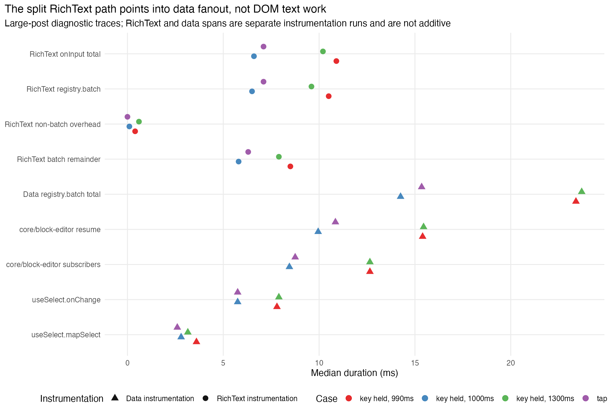

For the large-post key-held `1300ms` case, direct non-batch RichText overhead is
only `0.6ms`: `onInput` is `10.2ms` and `registry.batch` is `9.6ms`. The direct
RichText callbacks are also small; the RichText batch remainder is `7.9ms`. The
separate data-span run points into the same lower layer: data `registry.batch`
is `23.7ms`, `core/block-editor` resume is `15.5ms`, block-editor subscriber
fanout is `12.7ms`, and `useSelect.onChange` is `7.9ms`.

Selected large-post medians:

| Case | RichText `onInput` | RichText batch remainder | Data batch | `core/block-editor` resume | `useSelect.onChange` | `mapSelect` |
| ---- | -----------------: | -----------------------: | ---------: | -------------------------: | -------------------: | ----------: |
| key held, `990ms` | `10.9ms` | `8.5ms` | `23.4ms` | `15.4ms` | `7.8ms` | `3.6ms` |
| key held, `1000ms` | `6.6ms` | `5.8ms` | `14.2ms` | `10.0ms` | `5.8ms` | `2.8ms` |
| key held, `1300ms` | `10.2ms` | `7.9ms` | `23.7ms` | `15.5ms` | `7.9ms` | `3.2ms` |
| tap then wait, `1300ms` | `7.1ms` | `6.3ms` | `15.3ms` | `10.9ms` | `5.8ms` | `2.6ms` |

This refines the recommendation. There is no longer much value in further
splitting DOM record creation, apply-record, serialization, or direct
`onChange`/`onInput` callbacks for this artifact. The next unexplained layer is
React/render ownership after the `useSelect` and external-store listener path,
plus product work on which block-list subscriptions need to wake for an ordinary
text-only attribute update.

### useSelect Owner Attribution

The previous data-span pass stopped at "subscriber fanout." I added one more
diagnostic layer: when data-span tracing is active, each `useSelect` hook instance
gets a stable ID, and the benchmark records the hook's call stack and
`mapSelect` source once. A compact extractor then joins those IDs back to the hot
`useSelect` spans and source-map-resolves the first non-`@wordpress/data`,
non-React frame.

This trace is intentionally small: large-post fixture only, key-held and
wait-after-keyup modes, delays `990ms`, `1000ms`, `1300ms`, `1550ms`, and
`2000ms`, one round, and four retained samples per delay. The raw JSON is large
because it carries per-subscriber span events; the committed CSV is the compact
derived form.


At `1300ms`, the dominant `useSelect` owner group is
`packages/block-editor/src/components/block-list/index.js:196`. In this large
fixture it had `580` active hook instances and `2900` `onChange` span events in
one delay run. That single source-mapped group accounts for about `2.7ms` of
traced `useSelect.onChange` time per key in the key-held trace and `2.3ms` per
key in the wait-after-keyup trace.

The next high-fanout groups are also block-tree/editor-wide subscriptions, not a
single isolated callback:

| Source                                                           | Instances | Events | Key-held `onChange` ms/key | Wait-after-keyup `onChange` ms/key |
| ---------------------------------------------------------------- | --------: | -----: | -------------------------: | ---------------------------------: |
| `packages/block-editor/src/components/block-list/index.js:196`   |     `580` | `2900` |                     `2.68` |                             `2.30` |
| `packages/block-editor/src/components/block-list/block.js:563`   |    `1437` | `7185` |                     `1.22` |                             `1.00` |
| `packages/editor/src/hooks/pattern-overrides.js:40`              |    `1437` | `7185` |                     `0.74` |                             `0.98` |
| `packages/block-editor/src/components/inner-blocks/index.js:195` |     `580` | `2900` |                     `0.40` |                             `0.24` |

The same ranking appears if we look specifically at `mapSelect` time, though
the per-instance medians are mostly below the timer resolution. The meaningful
signal is aggregate fanout: many cheap selectors running thousands of times per
delay run. At `1300ms`, the `block-list/index.js:196` group alone contributed
about `1.4ms` of traced `mapSelect` time per key in key-held mode and `1.2ms`
per key in wait-after-keyup mode.


This does not overturn the earlier key-hold conclusion. The owner trace does not
find one selector that appears only in the slow key-held plateau. Instead, the
same high-fanout owners dominate both modes and all diagnostic delays. Key-held
mode is usually somewhat higher for the top block-list owners, but the delta is
spread across many subscriber callbacks. The mechanism is better described as
"large block editor subscriber fanout on the input path" than as "one bad
selector."

The remaining open question moved one level lower again: which of these
block-list subscriptions are necessary on every typed character, and which can be
made less sensitive to ordinary RichText text updates.

## Scenario Sensitivity


The boundary appears in multiple scenarios, but absolute latency changes with
post size and fixture shape. The large mixed post is slower than an empty post
near the boundary. A synthetic thousand-paragraph post does not reproduce all of
the large mixed fixture's cost, which suggests that block type mix and editor
state matter, not just block count.

Selected p50s:

| Scenario                 |    Delay |        p50 |
| ------------------------ | -------: | ---------: |
| large post, fresh editor |  `990ms` | `19.441ms` |
| large post, fresh editor | `1000ms` |  `7.710ms` |
| empty post               |  `990ms` | `11.761ms` |
| empty post               | `1010ms` |  `7.012ms` |
| thousand paragraphs      |  `990ms` | `13.798ms` |
| thousand paragraphs      | `1010ms` |  `5.551ms` |

## Input-To-Frame Proxy

The most user-facing open question was whether the trace/listener/EventDispatch
shape says anything about the visual path. I added an opt-in
`BENCHMARK_TRACE_VISUAL_LATENCY=1` probe that records, per synthetic key:

-   parent-frame keydown on the editor iframe;
-   editor-canvas `input`;
-   first DOM mutation observed in the editor canvas;
-   the next `requestAnimationFrame` after input; and
-   the second `requestAnimationFrame` after input.

This is still not a calibrated paint timestamp. RAF callbacks run before a
browser paint, and the second RAF is only a practical browser-frame proxy. It is
also still synthetic Playwright input. But it is a better endpoint than
EventDispatch alone because it crosses the editor-canvas input and frame
scheduling boundary.

I ran the visual proxy on the same large-post setup for the two important input
modes, using `990ms`, `1000ms`, and `1300ms`, with 3 rounds and 8 retained
samples per delay.

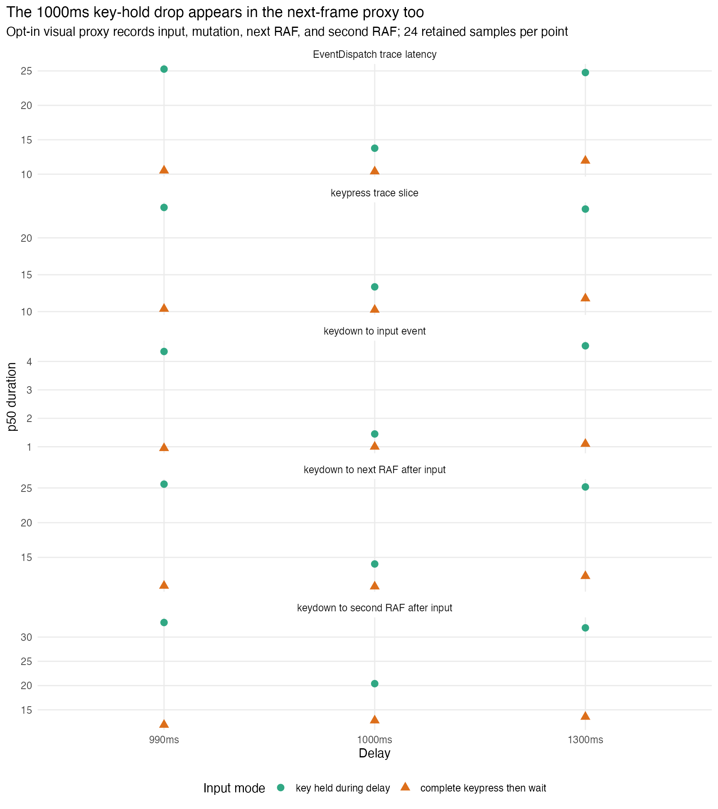

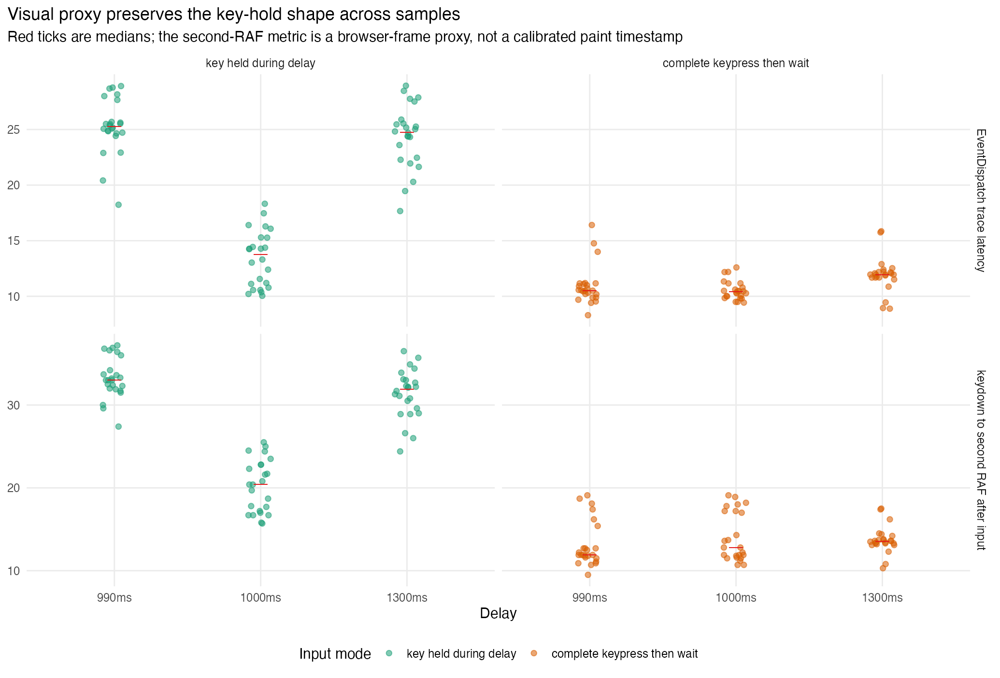

| Input mode | Delay | EventDispatch p50 | keydown-to-input p50 | keydown-to-second-RAF p50 |
| ---------- | ----: | ----------------: | -------------------: | ------------------------: |
| key held during delay | `990ms` | `25.3ms` | `4.4ms` | `33.0ms` |
| key held during delay | `1000ms` | `13.8ms` | `1.5ms` | `20.4ms` |
| key held during delay | `1300ms` | `24.8ms` | `4.5ms` | `31.9ms` |
| complete keypress then wait | `990ms` | `10.5ms` | `1.0ms` | `11.9ms` |
| complete keypress then wait | `1000ms` | `10.4ms` | `1.0ms` | `12.8ms` |
| complete keypress then wait | `1300ms` | `12.0ms` | `1.1ms` | `13.5ms` |

This disconfirms the strongest "Chrome EventDispatch accounting only" reading.
The `1000ms` key-hold drop is visible not only in the trace slice, but also in
the editor-canvas input-to-frame proxy: keydown-to-second-RAF drops by about
`12-13ms` at `1000ms` compared with `990ms` and `1300ms`. The complete-keypress
then wait mode does not show that cliff and stays close to `12-14ms` in the
same proxy.

The honest caveat is that this still does not prove what a user sees on screen.
It narrows the gap: the anomaly reaches the browser-frame scheduling boundary,
but a real input-to-paint metric would need Chrome paint/compositor events,
DOM/layout/paint instrumentation, screenshots/pixel observation, or camera-style
calibration.

## Chromium Render Trace Probe

I then pushed the same open question one level closer to Chromium's rendering
pipeline with `BENCHMARK_TRACE_RENDER_EVENTS=1`. This starts Chrome tracing with
extra render categories and records the first `Layout`, `PrePaint`, `Paint`,
`Layerize`, and `DrawFrame` trace event in the first `150ms` after each keydown.

This is deliberately described as a render trace probe, not input-to-screen.
Chrome's `Paint` trace event is not a calibrated compositor presentation or pixel
timestamp, and the heavier trace categories perturb the absolute numbers. The
question it can answer is narrower: does the key-hold-only `1000ms` shape survive
when the endpoint is a Chromium render event instead of a JS listener slice or
RAF callback?

I ran the same large-post `990ms`, `1000ms`, and `1300ms` comparison with 3
rounds and 8 retained samples per delay.

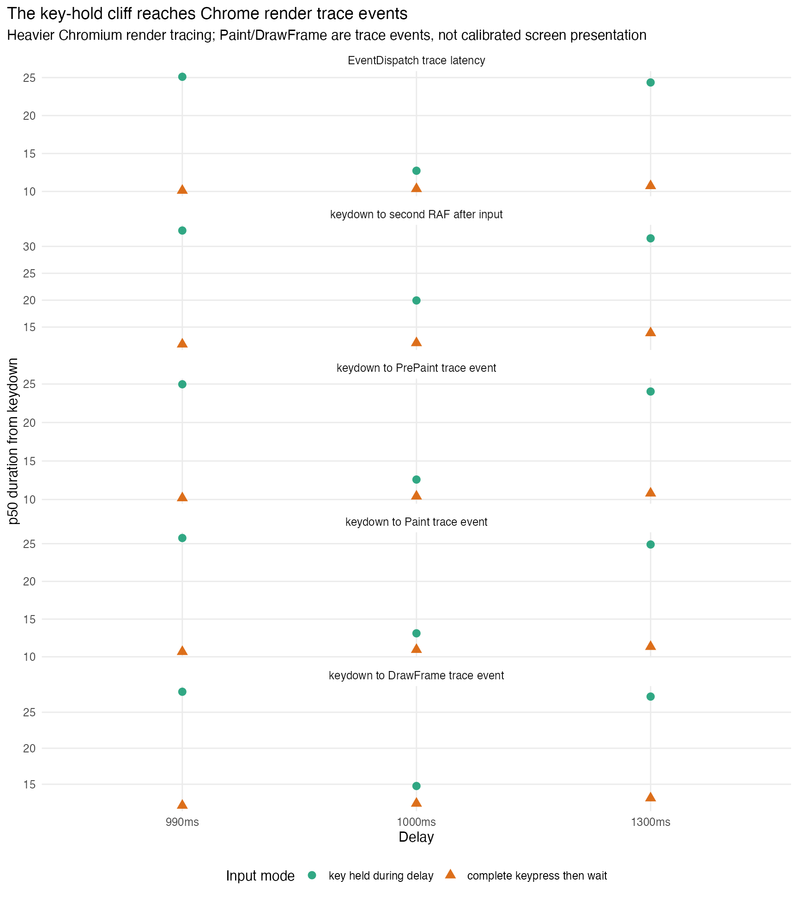

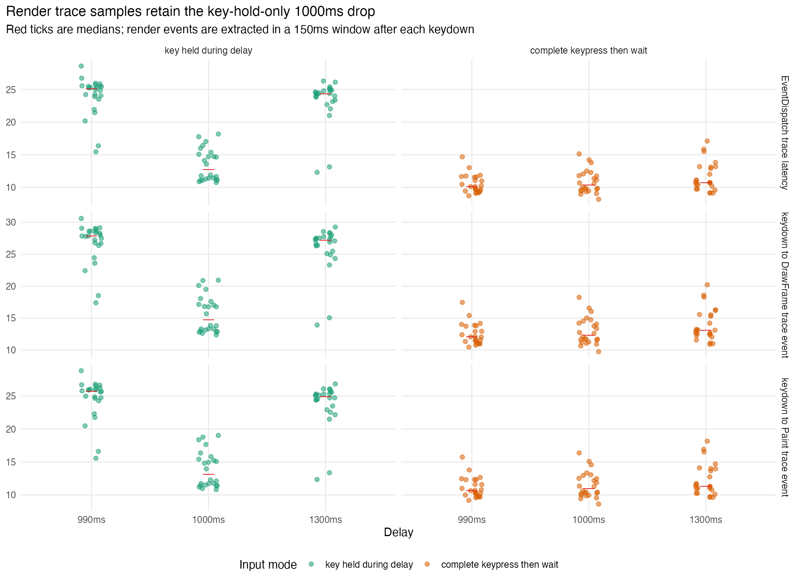

| Input mode | Delay | EventDispatch p50 | keydown-to-second-RAF p50 | keydown-to-Paint p50 | keydown-to-DrawFrame p50 |
| ---------- | ----: | ----------------: | ------------------------: | -------------------: | -----------------------: |
| key held during delay | `990ms` | `25.1ms` | `32.9ms` | `25.8ms` | `27.8ms` |
| key held during delay | `1000ms` | `12.7ms` | `19.9ms` | `13.1ms` | `14.8ms` |
| key held during delay | `1300ms` | `24.4ms` | `31.5ms` | `24.9ms` | `27.2ms` |
| complete keypress then wait | `990ms` | `10.1ms` | `11.8ms` | `10.7ms` | `12.0ms` |
| complete keypress then wait | `1000ms` | `10.3ms` | `12.1ms` | `10.9ms` | `12.3ms` |
| complete keypress then wait | `1300ms` | `10.7ms` | `13.9ms` | `11.3ms` | `13.1ms` |

Every retained sample had a `Paint` and `DrawFrame` event in the `150ms` window.
The key-hold drop is still present at those endpoints: keydown-to-`Paint` falls
by about `12ms` at `1000ms` compared with `990ms` and `1300ms`, while
complete-keypress-then-wait stays in the `10.7-11.3ms` band. `DrawFrame` shows
the same key-hold-only shape.

This closes a more precise version of the visual open question: the cliff is not
only Chrome `EventDispatch` accounting, and it is not only an artifact of the JS
RAF proxy. It reaches Chromium render trace events. What this still does not
close is actual presentation latency: the remaining measurement gap is
compositor/presentation/pixels, not "does the effect survive past JS?"

## Chromium Trace Screenshot Probe

The next test moves from render-event timestamps to Chromium's trace screenshot
stream. With `BENCHMARK_TRACE_SCREENSHOTS=1`, the benchmark enables trace
screenshots and records, per key, the first screenshot after keydown and the first
screenshot whose trace snapshot hash differs from the previous screenshot. The
committed data stores only timestamps, byte counts, and hashes, not the images.

This is closer to the screen than `Paint` / `DrawFrame`, but it is still not a
calibrated input-to-screen measurement. Trace screenshots are sampled Chromium
snapshots, not display presentation timestamps or camera-observed pixels. Hash
difference is also a coarse "something in the screenshot changed" test, not a
semantic OCR check that the newly typed character is visible. For this benchmark,
though, it answers one useful question: does the `1000ms` key-hold drop survive
when the endpoint is a changed screenshot frame?

I ran the same large-post `990ms`, `1000ms`, and `1300ms` comparison with 3
rounds and 8 retained samples per delay. Every retained sample had a first
screenshot and first changed screenshot in the `250ms` post-keydown window; the
median count was one screenshot per key in that window.

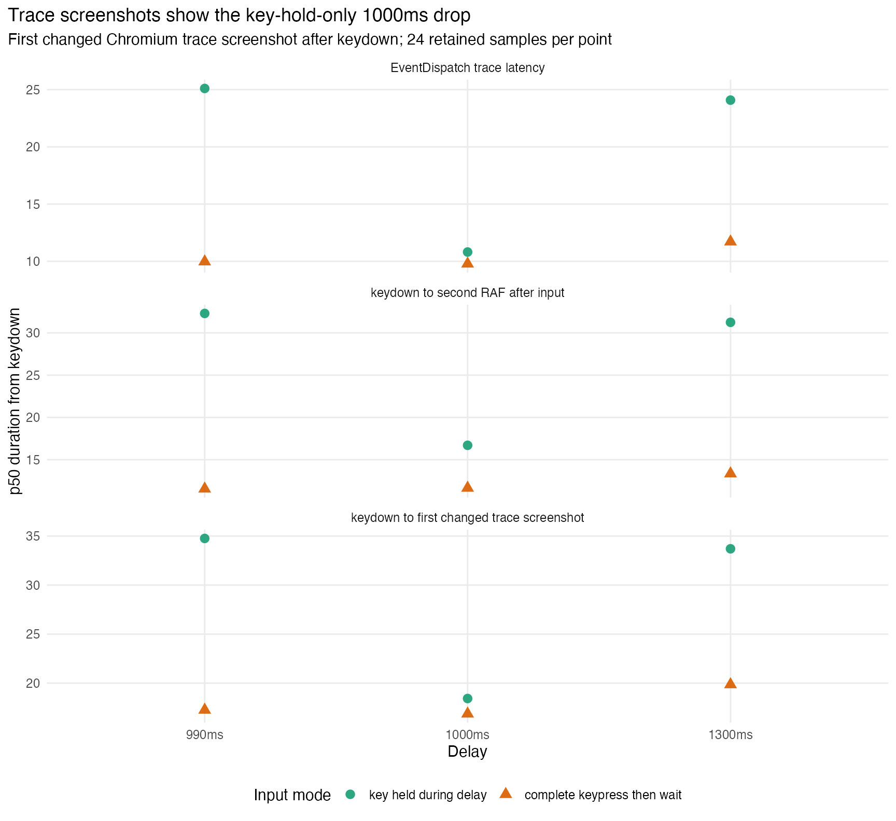

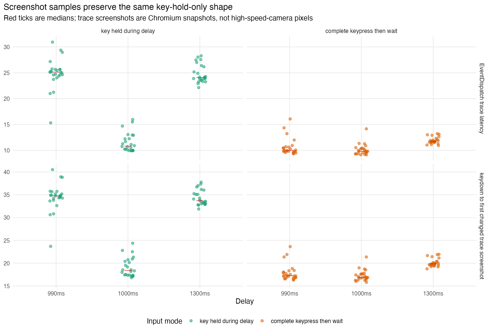

| Input mode | Delay | EventDispatch p50 | keydown-to-second-RAF p50 | keydown-to-first-changed-screenshot p50 |
| ---------- | ----: | ----------------: | ------------------------: | --------------------------------------: |
| key held during delay |  `990ms` | `25.1ms` | `32.3ms` | `34.8ms` |
| key held during delay | `1000ms` | `10.8ms` | `16.7ms` | `18.4ms` |
| key held during delay | `1300ms` | `24.1ms` | `31.3ms` | `33.7ms` |
| complete keypress then wait |  `990ms` |  `10.0ms` | `11.5ms` | `17.3ms` |
| complete keypress then wait | `1000ms` |  `9.8ms` | `11.6ms` | `16.9ms` |
| complete keypress then wait | `1300ms` | `11.7ms` | `13.4ms` | `19.9ms` |

The shape survives again. In key-hold mode, `1000ms` is about `15-16ms` faster
than `990ms` and `1300ms` at the first changed trace-screenshot endpoint. In
complete-keypress-then-wait mode, the screenshot endpoint stays in the same
`17-20ms` band and does not show a cliff at `1000ms`.

That closes another possible escape hatch. The key-hold-only speedup is not only
`EventDispatch`, not only JS/RAF, and not only Chrome render-event bookkeeping.
It is visible in Chromium's changed trace-screenshot stream. The remaining
user-facing caveat is now specifically calibrated presentation: trace screenshots
are closer to pixels, but they are not display presentation timestamps or an
external screen observation.

## Trace Screenshot Pixel Localization

The screenshot-trace result above still had one avoidable ambiguity: a changed
trace screenshot hash proves that Chromium's screenshot stream changed, but does
not prove that the changed pixels are in the edited paragraph or near the typed
character. I added an opt-in `BENCHMARK_TRACE_SCREENSHOT_PIXELS=1` check for that
narrower question. For each retained key, it decodes the previous trace
screenshot and the first changed trace screenshot, computes a simple RGB pixel
diff, finds the changed-pixel bounding box, and maps the editor target textbox
into screenshot coordinates. The benchmark still writes only derived numbers,
not raw screenshot images.

One setup bug fell out of this check. The original target locator matched the
inserted block by its "Empty block" accessible name. After the first delay group
typed into that block, later delay groups no longer had that accessible name, so
the pixel check had no target box. The benchmark now falls back to the last
`contenteditable` box in the editor canvas when the original locator no longer
matches; in this setup, that is the inserted benchmark paragraph.

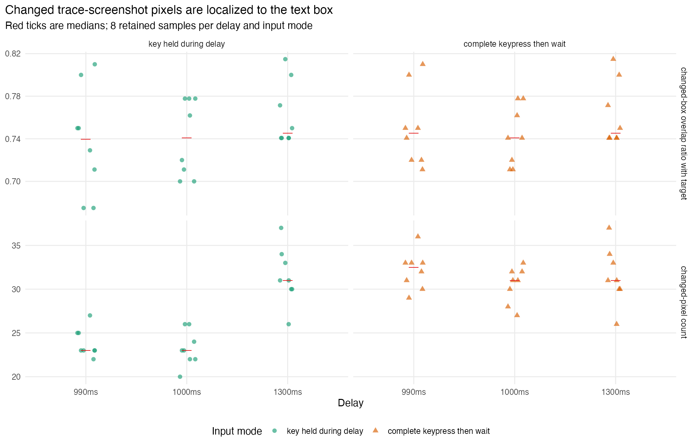

The next check maps each retained key to the DOM `Range` for the exact inserted
`x` character. The first physical key in the run is still the throwaway sample;
that matters because the first insertion also removes placeholder/sentinel text.
The retained samples below are the steady-state inserted `x` characters.

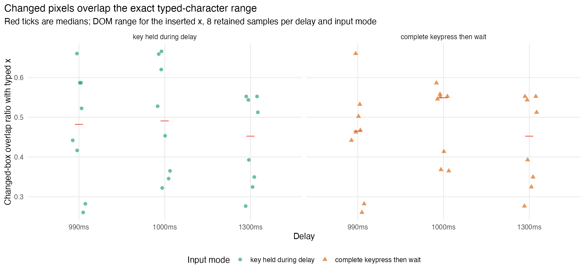

| Input mode | Delay | Decoded | Target overlap | Typed `x` overlap | Typed `x` center | Changed pixels p50 | Typed `x` overlap ratio p50 |
| ---------- | ----: | ------: | -------------: | ----------------: | ---------------: | -----------------: | --------------------------: |
| key held during delay |  `990ms` | `8/8` | `8/8` | `8/8` | `6/8` | `23` | `0.482` |
| key held during delay | `1000ms` | `8/8` | `8/8` | `8/8` | `5/8` | `23` | `0.491` |
| key held during delay | `1300ms` | `8/8` | `8/8` | `8/8` | `6/8` | `31` | `0.452` |
| complete keypress then wait |  `990ms` | `8/8` | `8/8` | `8/8` | `6/8` | `32.5` | `0.465` |
| complete keypress then wait | `1000ms` | `8/8` | `8/8` | `8/8` | `6/8` | `31` | `0.549` |
| complete keypress then wait | `1300ms` | `8/8` | `8/8` | `8/8` | `6/8` | `31` | `0.452` |

This closes the "unrelated screenshot hash" caveat for these Chromium runs and
tightens the previous target-box check. The first changed screenshot after
keydown is localized to the edited text box and overlaps the exact typed `x`
range in both input modes and at the relevant delays. The center of the changed
box is less robust because the diff box can include caret and antialiasing
movement as well as glyph pixels, so the safer assertion is overlap, not center.
This is still not OCR, compositor presentation timing, or high-speed-camera
validation; the remaining caveat is calibrated presentation and semantic
recognition, not whether the trace screenshot change is in the editor target or
near the typed character.

### Visual Endpoint Drop Accounting

The visual/render/screenshot probes above were run separately, and each tracing
mode has different absolute overhead. The safer cross-probe comparison is
therefore within each probe: compare the `1000ms` p50 with the mean of the two
slow neighbors, `990ms` and `1300ms`.

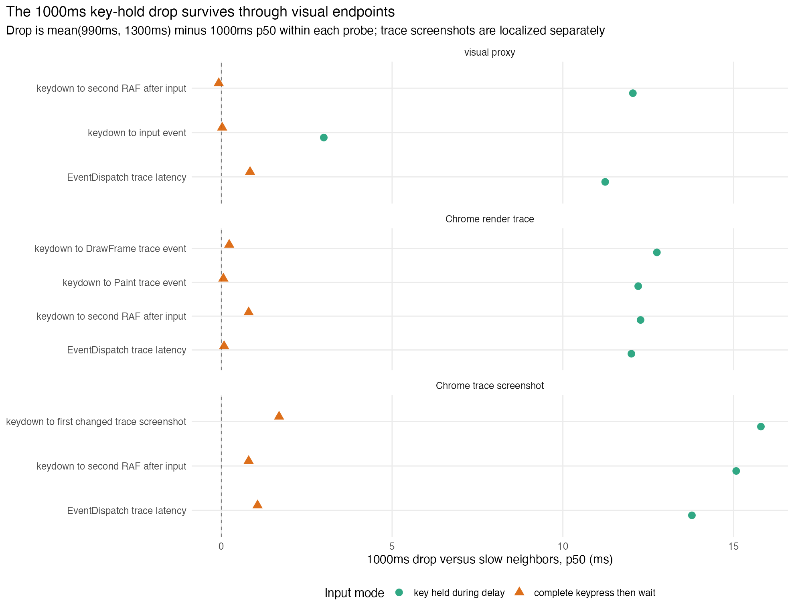

Selected `1000ms` drops versus the `990ms` / `1300ms` neighbor mean:

| Probe | Endpoint | Key held | Complete keypress then wait |
| ----- | -------- | -------: | --------------------------: |
| visual proxy | EventDispatch | `11.2ms` | `0.8ms` |
| visual proxy | keydown-to-input | `3.0ms` | `0.0ms` |
| visual proxy | keydown-to-second-RAF | `12.1ms` | `-0.1ms` |
| Chrome render trace | EventDispatch | `12.0ms` | `0.1ms` |
| Chrome render trace | keydown-to-Paint | `12.2ms` | `0.1ms` |
| Chrome render trace | keydown-to-DrawFrame | `12.8ms` | `0.2ms` |
| Chrome trace screenshot | EventDispatch | `13.8ms` | `1.1ms` |
| Chrome trace screenshot | keydown-to-second-RAF | `15.1ms` | `0.8ms` |
| Chrome trace screenshot | keydown-to-first-changed-screenshot | `15.8ms` | `1.7ms` |

I also checked that the endpoint agreement is not just a median artifact. Within
the render and screenshot probes, each retained key has both the EventDispatch
latency and the downstream endpoint timestamp, so we can compare them per sample.

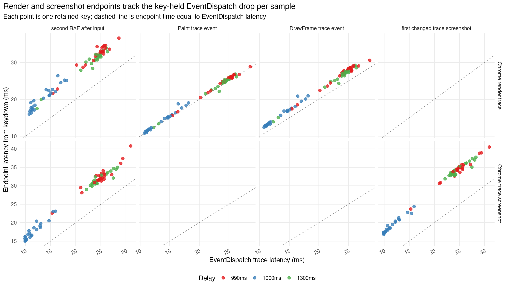

For key-held samples, the downstream endpoints track the EventDispatch movement
strongly:

| Probe | Endpoint | Delay | Correlation with EventDispatch | Median endpoint minus EventDispatch |
| ----- | -------- | ----: | -----------------------------: | ----------------------------------: |
| Chrome render trace | Paint | `990ms` | `0.996` | `+0.7ms` |
| Chrome render trace | Paint | `1000ms` | `0.990` | `+0.4ms` |
| Chrome render trace | Paint | `1300ms` | `0.993` | `+0.5ms` |
| Chrome render trace | DrawFrame | `990ms` | `0.989` | `+2.7ms` |
| Chrome render trace | DrawFrame | `1000ms` | `0.987` | `+2.1ms` |
| Chrome trace screenshot | first changed screenshot | `990ms` | `0.986` | `+9.6ms` |
| Chrome trace screenshot | first changed screenshot | `1000ms` | `0.981` | `+7.4ms` |
| Chrome trace screenshot | first changed screenshot | `1300ms` | `0.939` | `+9.8ms` |

Every retained key-held render/screenshot endpoint was at or after the
EventDispatch slice for the same key. The offsets are endpoint-specific, but
within each endpoint they are narrow enough that the `1000ms` low band remains
visible per sample, not only after aggregating medians. The complete-keypress
control is less informative for RAF because frame scheduling adds quantization,
but Paint and changed-screenshot endpoints still track EventDispatch closely.

I then decomposed the downstream endpoint drops into the EventDispatch slice and
the post-EventDispatch visual/render tail. This is a median diagnostic, not exact
algebra: the component p50s are computed separately, so they need not add to the
endpoint p50 exactly. It still answers the open "is the visual speedup mostly
after EventDispatch?" question.

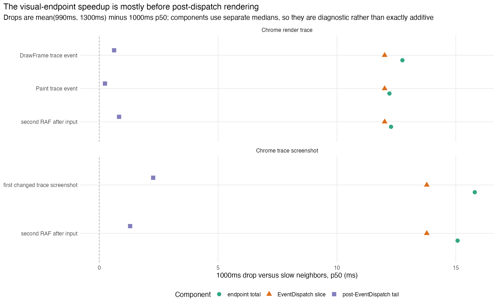

For key-held samples:

| Probe | Endpoint | Endpoint drop | EventDispatch slice drop | Post-EventDispatch tail drop |
| ----- | -------- | ------------: | -----------------------: | ---------------------------: |
| Chrome render trace | Paint | `12.2ms` | `12.0ms` | `0.2ms` |
| Chrome render trace | DrawFrame | `12.8ms` | `12.0ms` | `0.6ms` |
| Chrome render trace | second RAF | `12.3ms` | `12.0ms` | `0.8ms` |
| Chrome trace screenshot | first changed screenshot | `15.8ms` | `13.8ms` | `2.3ms` |
| Chrome trace screenshot | second RAF | `15.1ms` | `13.8ms` | `1.3ms` |

That makes the React/render caveat narrower. The post-dispatch tail is real and
can move by `~0.2-2.3ms`, especially for trace screenshots, but it is not the
main reason the visual endpoints are faster at `1000ms`. The main movement is
already in the measured input/EventDispatch span. A React profiler or component
commit attribution could still explain who owns the after-input tail, but it
would not explain the `~12-16ms` endpoint cliff by itself.

This is the most compact current answer to the visual-path open question. The
`1000ms` effect is not confined to Chrome's `EventDispatch` slice: in key-hold
mode it survives as the endpoint moves through editor input, frame scheduling,
Chrome render trace events, and the first changed trace screenshot. The
complete-keypress-then-wait control stays roughly flat on the same calculation.

The remaining caveat is now narrower, but still real. These probes do not
calibrate compositor presentation or an external display; they show that the
synthetic key-hold artifact propagates coherently, per retained key, to
Chromium's internal visual/render endpoints and to localized changed trace
screenshots.

### Presentation Calibration Contract

The presentation question is now narrow enough to separate into closed internal
browser claims and still-open external display claims. The derived contract is
in `data/typing-delay-presentation-calibration-contract-audit.csv`.

| Presentation question | Current answer | Remaining caveat | Calibration contract |
| --------------------- | -------------- | ---------------- | -------------------- |
| Is the cliff only a Chrome `EventDispatch` accounting artifact? | no | endpoints are still browser-derived | no extra calibration is needed for the internal-browser claim; keep the wording scoped to Chromium visual/render endpoints |
| Is the changed trace screenshot unrelated to the typed character? | no for these runs | pixel overlap is not OCR | crop the DOM `Range`, require recognition of the newly inserted glyph, and report first recognized-glyph timestamp against the same keydown / `EventDispatch` window |
| Is post-`EventDispatch` rendering the main visual cliff? | no | a calibrated pipeline could add compositor/display tail | decompose keydown to `EventDispatch`, `Paint` / `DrawFrame`, compositor submit, swap/present, and screenshot/camera-visible glyph for the same retained samples |
| Can trace screenshots be treated as screen presentation timestamps? | no | display presentation, scanout, compositor buffering, and panel timing are unmeasured | run compositor presentation traces or high-speed camera capture on the same `990ms`, `1000ms`, and `1300ms` key-held and complete-keypress controls |
| What can CI claim without external calibration? | internal visual propagation, not exact user-visible glyph time | hardware-to-screen latency and first-visible-glyph timing remain outside the evidence | keep report language scoped unless external presentation/OCR calibration is added |

This closes the common weak interpretations while preserving the real caveat.
The current data is enough to say the held-key artifact reaches localized
Chromium trace screenshots and that the endpoint movement is mostly already in
the input/`EventDispatch` span. It is not enough to claim calibrated
hardware-to-screen latency or semantic first-visible-glyph time.

### External Presentation Calibration Runbook

The external-calibration follow-up should not be another free-form visual probe.
The current internal endpoint stack already answers whether the `1000ms`
held-key shape survives past JavaScript and Chromium render bookkeeping. The
deeper open question is narrower: what evidence would be needed before the
report can claim presented-frame, recognized-glyph, or camera-visible timing?

The runbook is in
`data/typing-delay-presentation-external-calibration-runbook-audit.csv`.

| Validation lane | Endpoint measured | Required controls | Success gate | Claim boundary |
| --------------- | ----------------- | ----------------- | ------------ | -------------- |
| Compositor/presentation trace | keydown through `EventDispatch`, `Paint` / `DrawFrame`, compositor submit, swap/present, and any available displayed-frame timestamp | same `990ms`, `1000ms`, and `1300ms` key-held rows plus matching complete-keypress rows, with browser revision, trace categories, refresh rate, and retained-sample IDs | the presented-frame endpoint preserves the key-held `1000ms` drop while complete-keypress stays flat; any added compositor/display tail is reported separately | needed only before claiming compositor/display presentation timing |
| Semantic glyph recognition | first frame where OCR, template match, or image recognition identifies the newly inserted glyph in a DOM-range or textbox crop | same retained samples as the screenshot-pixel probe; require target-box and typed-range overlap | recognized-glyph timing keeps the key-held `1000ms` drop and matches localized changed-pixel ordering within the declared tolerance | needed only before claiming semantic first-visible-glyph timing |
| Trace observer control | visual endpoint rows with and without trace screenshots, heavy render categories, and external instrumentation | pair observer-on and observer-off rows at the same delay/mode and compare p50 ordering, retained counts, and first-key behavior | the drop persists without relying on the observer that supplies the endpoint; observer overhead is reported as a separate offset | required before using trace screenshots or external capture as causal evidence |
| High-speed camera/display lane | camera-visible glyph or display transition timestamp aligned to keydown or a visual trigger | same delay/mode rows plus a calibration flash or equivalent marker; record camera fps, shutter/exposure, display refresh, and panel mode | camera-visible glyph timing preserves the key-held `1000ms` drop and gives a stable additive display tail relative to compositor/presented-frame timing | needed only before claiming hardware/display timing |
| Decision gate | joined per-sample table across keydown, `EventDispatch`, RAF, `Paint` / `DrawFrame`, changed screenshot, localized pixels, and any external endpoint | retain the CI p50 discard/window rules, input-mode controls, and per-sample source IDs | the external endpoint confirms the same qualitative shape as the internal endpoint stack, with any extra tail smaller than or clearly separable from the `EventDispatch`-driven drop | defines when the report may widen beyond Chromium internal visual propagation |

The claim ladder is now explicit:

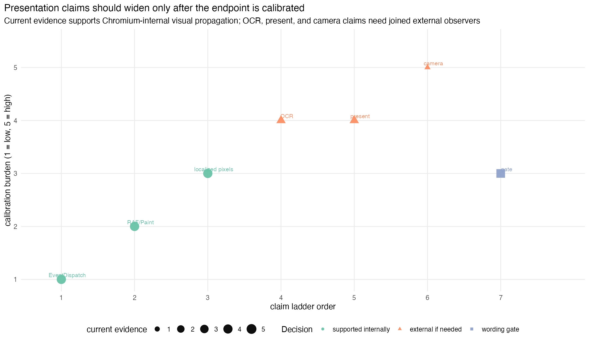

| Claim level | Current status | Boundary |
| ----------- | -------------- | -------- |
| `EventDispatch` input latency | supported internally | input/event trace metric, not visual presentation |
| Chromium visual/render propagation | supported internally | RAF, `Paint`, `DrawFrame`, and changed trace screenshots are browser-internal or trace-derived endpoints |
| Localized changed screenshot pixels | supported internally | changed pixels overlap the target and typed range, but this is not OCR or external screen observation |
| Semantic first-visible glyph | external if needed | requires per-retained-key OCR or template matching in a DOM-range/textbox crop |
| Compositor or presented frame | external if needed | requires compositor submit, swap/present, or displayed-frame timestamps joined to the same keys |
| Camera-visible display timing | external if needed | requires timebase alignment, display metadata, camera settings, and frame joins |
| Report widening gate | wording gate | widen language only when the external endpoint preserves the same key-held shape and complete-keypress control |

That prevents two overclaims. First, the current data can say the held-key
artifact reaches Chromium-internal visual/render endpoints and localized changed
trace-screenshot pixels. Second, it cannot yet say the exact time a user saw the
typed glyph, because semantic recognition, compositor presentation, scanout, and
camera/display timing are unmeasured. If those external endpoints disagree with
the internal stack, the right conclusion is not "the internal result was false";
it is that the claim boundary stops at the deepest endpoint that passed.

If the external endpoint disagrees, that does not invalidate the current
internal-browser result. It narrows the wording to the deepest endpoint that
passed and makes the disagreement the next open question. The important guard is
that the endpoint must be joined per sample; comparing a camera/OCR run against a
separate internal trace run would not decompose the `EventDispatch` slice from
the presentation tail.

### React/Render Boundary Audit

I then joined the visual endpoint decomposition with the nested `useSelect`
subphase deltas, paused listener-wrapper deltas, and priority-queue idle probe.
This answers a narrower version of the React-profiler open question: how much
room is left for React/render child work to explain the `1000ms` cliff?

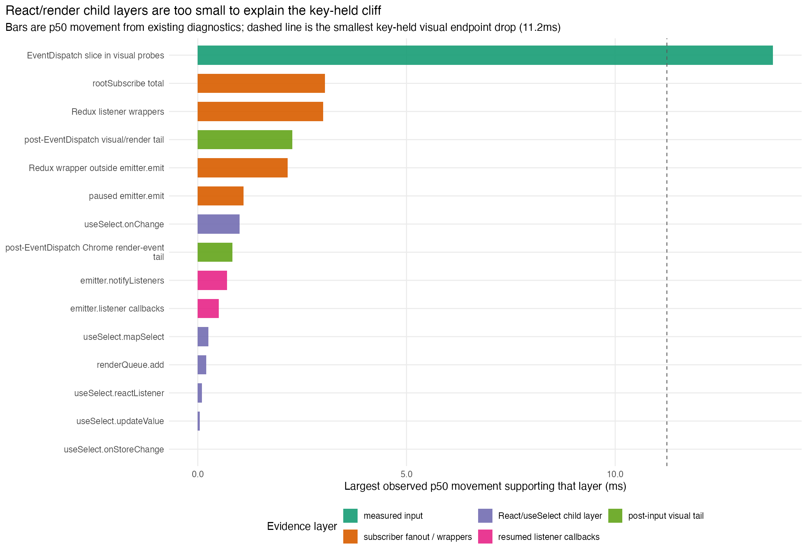

The dashed line is the smallest key-held visual endpoint drop in the joined
endpoint probes: `11.2ms`. Against that scale:

| Layer or theory | Largest supporting p50 movement | Interpretation |
| --------------- | ------------------------------: | -------------- |
| EventDispatch slice in visual probes | `13.8ms` | the main endpoint movement is already in the measured input slice |
| `rootSubscribe` / Redux listener wrappers | `3.1ms` / `3.0ms` | the remaining input-side accounting is mostly broad subscriber fanout |
| post-EventDispatch visual/render tail | `2.3ms` | real, but too small to explain the endpoint cliff |
| Chrome render-event tail only | `0.8ms` | Paint/DrawFrame/RAF tail movement is sub-millisecond in the render-trace probe |
| `useSelect.onChange` wrapper | `1.0ms` | wrapper-level movement exists, but child phases below it do not grow enough |
| `useSelect.reactListener` / `renderQueue.add` / `mapSelect` | `0.1ms` / `0.2ms` / `0.25ms` | too small for the primary cause |
| priority queue drained before next input | wrong direction | the faster `1000ms` probe had idle flushes crossing the next input; the slower `1300ms` probe drained before input |

That closes most of the React/render ambiguity for the cliff mechanism. A React
profiler could still identify component owners for after-input work and would be
useful for product optimization, but the current traces already rule out
`renderQueue.add`, React's external-store listener, selector recomputation, or
post-dispatch rendering as the primary reason the key-held `1000ms` point is
`~11-16ms` faster than its slow neighbors. The remaining React question is
ownership of secondary whole-cycle cost, not causality for the low-band
EventDispatch/input result.

The source boundary lines up with that measurement. `useSelect()` returns the
`subscribe` / `getValue` pair that React consumes through `useSyncExternalStore`
after subscribing only to the stores used by the selector; async subscribers go
through `renderQueue.add()`, which is backed by the priority queue's idle
callback path. The Redux store wrapper then fans out every effective store-root
change to its listener set. In other words, a profiler can name the components
that eventually commit, but it cannot turn the already-measured store-root
notification fanout into post-input React rendering.

| React-profiler question | Current answer | Evidence | Next useful use |
| ----------------------- | -------------- | -------- | --------------- |
| Can React rendering explain the key-held `1000ms` cliff? | no | the EventDispatch/input slice moves `13.8ms` against an `11.2ms` minimum visual endpoint drop; the largest post-EventDispatch visual/render tail is `2.3ms` | do not use profiler as the next cliff-causality test |
| Can `renderQueue.add()` or idle draining explain it? | no | `renderQueue.add()` moves by at most `0.2ms`, and the faster `1000ms` probe had idle callbacks crossing the next input while the slower `1300ms` probe drained before input | profile async commits only for real after-input/product workloads |
| Can `useSelect` selector work or React's external-store listener explain it? | no | `useSelect.reactListener` moves by `0.1ms`, `mapSelect` by `0.25ms`, and the outer `onChange` wrapper by `1.0ms` | after a guard patch, use profiler to rank the selectors/components still recomputing |
| Where is the remaining input-side React/data work? | broad subscriber fanout | `rootSubscribe` moves by `3.1ms` and Redux listener wrappers by `3.0ms`; resumed listener callbacks are not a common slow-path cause | collect subscriber-owner counts before changing data notification semantics |
| What should a profiler run answer? | ownership of smaller residual work | Chrome render-event tail is at most `0.8ms`; trace-screenshot tail is `2.3ms` | capture production-like commit owners after RichText input and after async queue flushes |

The residual-profiler plan is now narrow enough to state as a measurement
contract. The derived audit is in
`data/typing-delay-react-residual-profiler-plan-audit.csv`; the useful profiler
work is:

| Profiler question | Current answer | Measurement contract | Invalid conclusion |
| ----------------- | -------------- | -------------------- | ------------------ |
| Should a React profiler run be used for cliff causality? | No. EventDispatch already moves by `13.8ms`; the largest post-EventDispatch visual/render tail is `2.3ms`. | No new profiler run for this claim; use the existing input, visual endpoint, `useSelect` subphase, and idle-queue evidence. | A large commit in a profiled run would not move the already-observed EventDispatch boundary backward in time. |
| When should profiler be used after selector guards? | After a concrete selector/subscriber patch changes the fanout shape. | Run before/after the exact patch, keep source-level subscriber-owner spans enabled, and attribute commits that start after the input EventDispatch/RichText span or after the async queue flush. | Reduced commit time is not proof that a selector guard is semantically safe; behavior tests and owner spans still decide that. |
| What should async render-queue profiling measure? | Residual commit ownership after input, not the low-band cause. | Capture queue insertion, idle callback start/end, commit start/end, and whether each idle flush crosses the following input. | Do not conclude that draining the queue before input explains the fast band; the measured probe already contradicts that. |
| What should whole-cycle profiling use as workload? | Representative editing histories, not fixed-`x` cliff reproduction alone. | Profile replayed human/plugin-heavy sessions and compare whole-cycle commits against source-level data spans and visual endpoints. | Do not use fixed-`x` insertion to rank real plugin, composition, correction, or navigation workloads. |
| Can profiler answer the public data-subscription question? | No. Branch-aware or selector-aware notification is a data-layer contract question. | Use profiler only after a data notification prototype exists, to check residual component owners and regressions. | Do not use profiler output to justify breaking `isLastBlockChangePersistent()` `useSelect` notification semantics. |
| What is the acceptable profiler claim? | Component ownership of secondary after-input or whole-cycle cost. | Report commit owners with input-window boundaries, async-queue boundaries, build/profiling mode, and matched source-span IDs. | Do not report profiler commit ownership as the primary cause of the `11-16ms` endpoint drop. |

This closes the remaining "should we profile React next?" question for the
current benchmark. A profiler run can be useful, but only after a selector guard,
store-notification prototype, or workload replay creates a new residual
ownership question. Running it before that would mostly relabel already-measured
store-root fanout as downstream component work.

## Trace Grouping Bug Avoided


In the Gutenberg editor traces in this local Chromium environment, every retained
sample had two `keydown` `EventDispatch` entries. Across 7640 retained Gutenberg
samples in the committed derived data, zero had a `keydown` count other than two.
The native `contenteditable` baseline had one `keydown` per retained sample.

That means any parser that assumes exactly one `keydown` trace event per typed
character is fragile. This benchmark groups trace events into key sequences and
uses the final keydown event for `latency_ms`, while also preserving
`latency_all_keydowns_ms`.

## Issues In The Original Benchmark

The original exploration was valuable because it found the weird `1000ms` point,
but it should not be used as a tuning basis without caveats.

Problems:

-   **Sparse delay grid.** The important features are narrower than the original
    `100ms` spacing.
-   **Too few samples.** Ten retained samples per delay is not enough to estimate
    variance or detect mixed distributions.
-   **Averages hide structure.** p50/p10/p90 and raw distributions show regime
    changes that averages flatten.
-   **No time-order analysis.** Without per-sample order, warmup, drift, GC,
    scheduled work, and long-session degradation are mostly invisible.
-   **One scalar conflates workloads.** Continuous typing, idle-then-key latency,
    and persistent-undo-path latency are different workloads.
-   **Delay changes editor semantics.** At `1000ms`, the rich-text persistence
    timer fires between keys, so the benchmark changes the state path it measures.
-   **Playwright's delay is a key-hold delay.** For US-keyboard characters, the
    delay is applied between `keydown` and `keyup`, so large values do not model a
    user pausing between completed keystrokes.
-   **`1000ms` was selected because it looked stable.** It is stable partly because
    it enters a special path. That makes it a poor representative of normal typing.
-   **Long delays are unrealistic as typing.** A one-second or two-second gap may be
    a useful idle-input latency test, but it should not be called typing throughput.

## Issues In The New Benchmark

The new benchmark fixes several measurement problems, but it is not a final CI
metric.

Known problems:

-   **It still does not have a calibrated input-to-screen endpoint.** The visual
    proxy reaches editor-canvas input, mutation, and RAF boundaries, and the
    render trace probe reaches Chromium `Paint` / `DrawFrame` trace events. The
    screenshot trace probe reaches changed Chromium trace snapshots. The pixel
    localization check confirms those changed screenshots change inside the
    target textbox and overlap the DOM range for the exact typed `x`, but they
    are still not compositor presentation timestamps, high-speed-camera pixels,
    or OCR-level proof that the exact glyph was presented to the user.
-   **Synthetic keyboard input is not real keyboard input.** Playwright's
    `page.keyboard.type()` is useful, but it is not a hardware-to-screen pipeline.
-   **There are now multiple delay modes.** This is useful for diagnosis, but any
    CI metric has to choose one deliberately and name it according to what it
    actually measures.
-   **The local machine is uncontrolled.** CPU governor, thermal state, background
    processes, browser version, and OS scheduling were not isolated in a Krun-like
    environment.
-   **Dense long-delay scans are expensive.** The `1110..2000ms` dense extension
    used one round, so it is a shape-finding run, not a high-confidence estimate.
-   **Instrumentation perturbs behavior.** Action tracing and timer rewriting add
    overhead; they should be used to explain behavior, not to report benchmark
    scores.
-   **Listener tracing perturbs behavior even more.** It monkey-patches
    `addEventListener`, so use it only to localize costs, not to report latency
    scores.
-   **Source-level RichText span tracing also perturbs behavior.** It adds timing
    calls inside hot input code and requires rebuilding the package scripts. It is
    diagnostic attribution, not a benchmark score.
-   **Source-level data span tracing is heavier still.** Even after filtering to
    input-matched batch spans, it instruments hot emitter and `useSelect` paths.
    Treat it as attribution, not latency scoring.
-   **`useSelect` owner attribution is heavier again.** It records source stacks
    once per hook instance and joins hundreds of thousands of subscriber-span
    events. It is useful for ranking owners, not for reporting latency scores.
-   **The paired trace is diagnostic, not a score run.** It uses only 8 retained
    samples per delay and heavy instrumentation. Its value is in comparing modes
    under similar tracing overhead.
-   **The keyup-gap causality traces are also diagnostic.** The manual
    `hold-then-keyup-gap` mode uses separate Playwright `keyboard.press()` calls,
    which naturally add about `40ms` between `keyup` and the next `keydown` even
    when no explicit gap is requested. That is useful for causality, but it is not
    a replacement score mode.
-   **The raw-CDP input-path traces are diagnostic.** They bypass Playwright's
    public keyboard API and then add artificial page/runtime evaluation
    boundaries. They are useful for falsifying gap and event-payload theories,
    not for defining a user-facing benchmark.
-   **The native baseline is intentionally too small.** It is useful as a browser
    and Playwright control, not as a model of real editor work.
-   **Chromium-heavy source tracing.** The cross-browser listener/timer checks
    cover Firefox and WebKit, but the source-level RichText/data/useSelect
    attribution is still Chromium-only.
-   **Single local setup.** More process executions and fresh browser contexts are
    needed before treating absolute numbers as portable.
-   **No real typing distribution.** Real users type with bursts, corrections,
    pauses, navigation, composition, and selection changes. Fixed-delay `x`
    insertion is an artificial stressor.
-   **No plugin/theme cofactor coverage.** The issue discussion mentioned lag that
    appeared outside vanilla Core. This benchmark does not cover plugin-heavy or
    P2-like editor setups.

## Audit Lenses

These are not endorsements or actual reviews by these people. They are different
failure-oriented ways to read the data.

### Linus Torvalds-style audit

-   Do not name the metric "typing performance" if it types one character every
    `1000ms` or `2000ms`.
-   Do not tune CI around a magic constant that is also a code path boundary.
-   Assert invariants in the benchmark. The duplicate-keydown finding is exactly
    the kind of trace-parser assumption that should fail loudly.
-   Keep the benchmark small enough to understand. A single scalar from a
    complicated browser/editor trace is not self-explanatory.
-   Separate product behavior from measurement behavior. `1000ms` is not just a
    wait; it causes `MARK_LAST_CHANGE_AS_PERSISTENT`.

### Kyle Kingsbury-style audit

-   Preserve histories. The derived CSVs keep per-sample order, delay, round,
    editor setup, and state transitions.
-   Prefer distributions over means. The benchmark has partitions: `990ms` and
    `1000ms` are different histories, not nearby samples from one population.
-   Do interventions when possible. Rewriting the `1000ms` timer to `500ms` is a
    causal test, and the cliff moved with it.
-   Randomize and repeat. Mixed order and fresh-editor checks are necessary because
    deterministic order can alias with periodic work.
-   State the model being tested. This test is not a linear latency function of
    delay; it is a state machine plus browser scheduling plus editor work.

### Dan Luu-style audit

-   The strange data point is the result, not noise. The `1000ms` dip identified a
    real editor timer.
-   Look at time. The time-order plot does not support a simple warmup story, but
    the runs are still too short to clear long-session concerns.
-   Make the benchmark adversarial. Try alternate delays, longer wall-clock runs,
    fresh editors, randomized order, and timer interventions.
-   Measure the thing users see. Trace-event latency is useful for diagnosis, but
    calibrated input-to-screen or high-speed-camera measurement would answer a
    different and more user-facing question.
-   Do not assume representativeness. Vanilla Core, a large fixture, a synthetic
    thousand-paragraph post, and plugin-heavy editors can all expose different
    behavior.

## Open Questions Status

The latest pass closes one small but important CI question: the slow first
retained keypress does not materially drive the reported q50 in the
CI-comparable Typing curve. It does affect tail/mean views, which is why the
per-keypress distribution and discard-policy sensitivity plots should stay in
the report. The current q50 can therefore look stable even though the beginning
of the input sequence is not representative of steady repeated typing.

The fixed-sample methodology caveat is also now quantified. In the full
`0..1100ms` sweep, every delay got 30 retained samples, but that meant only
`0.58s` of wall-clock exposure at `0ms` and `37.0s` at `1100ms`. Equalizing to
the same total `35.3m` sweep time would greatly increase short-delay samples but
drop the `990ms..1100ms` buckets to only about `15-17` retained samples. A
`60s`-per-delay run would keep at least about `49` samples at the slowest delay,
but would cost `111m` for that one sweep. The next benchmark design should
therefore be hybrid: minimum retained samples per delay plus an equal or capped
wall-clock budget when drift/warmup exposure is the target.

The startup-wait result is now strong for Typing and has a complete small
non-Typing screen plus targeted follow-ups for the pattern-load exception. The
exact and CI-comparable Typing runs say that adding post-setup wait does not buy
retained Typing stability, and reducing the current extra post-setup wait cannot
speed up Typing because that knob is already `0ms`. The exact Selecting blocks
pilot says one explicit non-Typing pre-measurement sleep can be removed on this
machine without hurting that metric: `0ms` was both faster and less variable than
`1000ms`. The broader four-run screen says this likely generalizes to
interactive post-editor measurements, but not to pattern loading: site-editor
patterns were much faster after the `1000ms` wait. The alternating exact run
confirmed that this was a real metric effect, and the readiness probe showed why:
site-editor requests/resources move from the measured interval into the
pre-measurement wait. The new exact short-wait sweep closes the immediate
replacement question locally: `500ms` matched `1000ms` while saving half of this
metric's explicit wait, and `250ms` also matched the q50 band but with higher
run-to-run q50 sd. The remaining question is now an engineering change, not a
diagnosis question: replace the blind sleep with an explicit readiness predicate
for pattern loading, or validate a fixed `500ms` wait in CI/mac/container runs
before changing the shared constant. The readiness-boundary join makes that
engineering choice sharper: the local diagnostic boundary is crossed by `250ms`
and not by `0ms` or `100ms`; exact q50 follows the same split. The predicate
should not be the probe's resource count. It should preserve the current
measurement boundary by waiting for background pattern data/readiness before the
Design / Transform click, while leaving the preview-canvas rendering inside the
measured interval. The decision audit makes the fixed-wait recommendation more
precise: `500ms` is the best local fixed-wait candidate, `250ms` is a possible
lower bound for a predicate but is too volatile to recommend as a blind
replacement without CI validation, and waiting for preview canvases is an
invalid predicate because it would remove the measured workload.

The latest runtime-checkpoint audit tightens the most important remaining causal
boundary. The benchmark has enough evidence to reject elapsed wait, DOM key
payload, single generic task/frame checkpoint, and native browser-only scale
theories. It does not have enough browser-side observer data to name the exact
Chromium state. The remaining credible theories require per-retained-key
protocol-command timing plus scheduler/runtime/V8 or OS-counter state aligned to
the existing `EventDispatch` and Gutenberg source spans. The sidecar analysis
makes the order stricter: record trace-off protocol command timing first, verify
the wait/checkpoint class ordering is unchanged, then add runtime scheduler/V8
categories and only later OS counters or scale gates.

The CPU/QoS open item now has the same kind of executable boundary. The compact
counter row set was already identified; the new feasibility audit shows the
decisive local observers are `powermetrics` and `trace`, both present but blocked
without root in this session. The next useful work is therefore a benchmark
sidecar plus privileged counter collection, not another unprivileged JS delay or
CPU-control sweep.

The Post Editor `loadPatterns` follow-up splits that exception in two. The Site
Editor result does not apply directly because Post Editor injects local patterns
into editor settings and measures the local `Test` category. In the focused Post
Editor matrix, `0ms` had a lower median run q50 than `1000ms` (`345.6ms` versus
`349.5ms`) and lower run-to-run q50 sd (`1.8ms` versus `2.3ms`). That makes
Post Editor `0ms` the local candidate, while Site Editor still needs the
predicate or fixed-`500ms` validation path.

The latest interaction-only follow-up closes the remaining local piece of the
non-Typing wait question. Combining the original four-run screen with four fresh
grouped runs gives eight runs per wait for focus, list view open, inserter open,
inserter search, and inserter hover. Every one of those metrics is lower at
`0ms` on q50, mean, p90, and run-to-run q50 sd. The open part is now
portability/failure validation for those five interaction metrics, not another
local diagnosis run.

The wait-removal ledger turns that into a bounded CI-time decision. Across the
five interaction metrics, Post Editor `loadPatterns`, and Site Editor
`loadPatterns`, the current fixed-wait exposure covered by local evidence is
`152s` in a two-branch comparison. The conservative local candidate set removes
`142s` of that: five interaction waits to `0ms`, Post Editor `loadPatterns` to
`0ms`, and Site Editor `loadPatterns` to fixed `500ms`. The predicate-shaped
Site Editor path raises the local envelope to about `146s`, but it rests on the
smaller three-run predicate-validation block and therefore remains a separate
engineering validation target. The open question is now deployment validation
and failure rate, not local q50 direction.

The key-hold `1000ms` / `1300ms` explanation is narrower than the original
Chrome/EventDispatch story. The visible cost is Gutenberg RichText/data fanout,
but recent ordinary/utility CPU activity can move that measured path between
slow and fast bands without changing the DOM event payload or Gutenberg's coarse
state at keydown. The fixed-hold CI pass closes another benchmark-shape question:
`50ms` and `100ms` holds followed by post-keyup wait behave much more like
tap-then-wait than like the current full-delay synthetic hold, so a brief
realistic key hold is not enough to reproduce the slow `250ms` / `500ms` CI
held-key band. The new `taskpolicy` tier sweep narrows the system side: all
`-l 0..5` latency tiers and all `-t 0..5` throughput tiers stay fast, while
Darwin background priority and QoS background/maintenance clamps stay slow. The
new CPU/QoS audit quantifies the split: near-key no-CPU tasks stay slow
(`24.3ms` median control p50), near-key finite CPU bursts are usually low
(`11.3ms`), continuous ordinary/utility CPU is low (`9.7ms`), and continuous
background/maintenance CPU stays slow (`24.2ms`). A two-variable finite-burst
model using CPU duration and end-to-keydown gap explains `71%` of the p50
variation in those controls. The remaining mechanism is therefore below this
benchmark's normal JS instrumentation. The new falsification matrix makes the
remaining claim more precise: the surviving explanation is ordinary/utility-QoS
CPU state interacting with Gutenberg's broad input path. It is not one bad
selector, one browser trace accounting quirk, timer callback existence, generic
CPU load, taskpolicy tiering in general, or timer ordering alone. Proving the
final layer would need hardware/browser-level instrumentation below this JS
harness.

The CDP/input-method boundary is also narrower now. Ordinary raw-CDP waits do
not produce the fast path, even at a `5008ms` observed previous-keyup to
next-keydown gap. Direct runtime checkpoints do produce a dose response, and
Playwright trace snapshots explain the full fast per-key path in the default
trace-enabled setup. The remaining CDP question is therefore below DOM event
payloads and Gutenberg semantic state: which Chromium runtime/scheduler state is
changed by those automation checkpoints. That is a measurement-boundary question,
not a reason to treat per-key Playwright trace-on input as user typing.

The source-audited owner pass closes a smaller open question about the broad
Gutenberg side of that path. The dominant low-level Redux listener rows are
per-rendered-block, per-`BlockEdit`, per-block-list, and per-inner-blocks
subscriptions. In the normal marker-before-input window, the top audited sites
account for `14.0ms` of `15.3ms` source-mapped listener time and thousands of
listener calls, but their per-listener cost is only `~2-9us`. That means the
Gutenberg part of the artifact is a coarse invalidation surface, not a single
slow selector body. The new text-update opportunity triage quantifies the next
product question: in the audited marker fanout, `8.7ms` p50 / `3,655` listener
calls are likely skippable for ordinary text-only edits, while `5.3ms` /
`580` `BlockListItems` calls remain a selection/tree-validation target rather
than an obvious removal. The latest `BlockListItems` invalidation audit sharpens
that target: the selector has zero paragraph-content dependencies, so it is a
real ordinary-text opportunity, but it owns six non-text invalidation groups and
`17` output surfaces. Count it only after a structural/selection/appender render
key proves that selection, visibility, zoom, order, template/content-only
sections, and appender eligibility stay fresh.

The older RichText-split open item is closed by the existing instrumented runs
and the new funnel view. Direct non-batch RichText work is sub-millisecond in
the large-post key-held cases (`0.1-0.6ms` at `990ms`, `1000ms`, and `1300ms`).
The cost sits behind `registry.batch`, then inside `core/block-editor` resume,
block-editor subscriber fanout, and `useSelect.onChange`. The remaining
React-side question is not DOM record creation, apply-record, serialization, or
the direct parent callback; it is render ownership after the external-store /
`useSelect` path and which subscriptions can avoid waking on ordinary text-only
updates.

The new selector-dependency matrix and guard-candidate pass answer that one
level deeper. The hottest per-`BlockEdit` and per-rendered-block rows line up
with the fixture's `1,437` blocks, while the actual typed character changes one
inserted paragraph. Most hot subscribed reads are not content reads at all: they
are global settings, block-tree/order, block type/count, visibility/layout, or
selection/caret state. The one direct content read is the edited paragraph's own
`BlockListBlockProvider`; the thousands of other block instances are woken to
prove their selected values did not change. The credible optimization target is
therefore selective invalidation / subscription partitioning for text-only
attribute updates, not callback-body tuning.

The remaining product question is no longer just "which invalidation guard?"
The source-feasibility-adjusted answer is: the pattern-override selected-only
split is done locally; next prototype a small non-edited
`BlockListBlockProvider` fast path using latest-attribute-action information only
as a hint, while preserving public filter props and separate
selection/structure/editability/settings invalidation; then prototype the clean
pieces of `useInnerBlocksProps` without skipping layout/default-layout
inheritance or `useNestedSettingsUpdate` side effects. Treat `HeadingEdit` as a
shared-signal design problem, treat `BlockListItems` as a high-risk validation
prototype because it is selection/tree/appender-sensitive, and leave the broader
store-partition or branch-aware notification design until after local guards
prove the shape of the win.

The validation-burden matrix makes that ordering less hand-wavy. The largest
single local bucket, `BlockListItems`, is not the first patch because a stale
selector there can affect selection, appender, template-lock, zoom, and visible
block-list behavior. The source-feasibility audit supersedes the earlier
"pattern override plus heading" shorthand: the pattern-override selected-only
split is the clear first patch (`~3.6ms`), while the heading selector should not
be counted until there is a shared/global anchor-capability signal. The
source-feasible local stack then adds non-edited `BlockListBlockProvider` and
`useInnerBlocksProps` invalidation prototypes for a conservative `8.2ms` local
envelope before validating `BlockListItems`. The first-patch test readiness audit
adds one practical requirement: the pattern-override patch should export or split
a focused test seam for the side-effect HOC, then cover selected
supported/unsupported blocks, unselected supported blocks, settings support
changes, synced controls, and unsynced reset controls.
The broad store-partition design remains plausible but high risk because it
overlaps that local-guard envelope and must keep the persistence transition
visible to `useBlockSync` and direct `isLastBlockChangePersistent` consumers.

The residual-owner follow-up closes the suspicion that the `unknown/mixed` tail
might hide another large text-specific path. It does not. The tail is `1.3ms`
p50 total; `0.6ms` is settings/block-support work, `0.6ms` is editor chrome or
selection-validation work, and the possible block-attribute style-hook rows are
`0.0ms` p50 here. That makes the prototype order more robust: optimize the
already identified high-fanout rows first, not the residual source-mapped tail.

The marker-state fanout control makes the store boundary even clearer. The
normal marker changes only `blocks.isPersistentChange`; the audited hot owner
sites do not read that flag. They wake because the `core/block-editor` store root
object changed, and the Redux-store wrapper fans out to every listener on any
effective root change. Controls that occupy the same timer slot but leave the
root state unchanged wake zero Redux listeners. The remaining open question is
therefore no longer "which hot selector reads the persistence flag?" None of the
audited hot selectors does. The harder engineering question is whether
`@wordpress/data` / `core/block-editor` can expose a narrower invalidation path
for persistence-only or text-only changes.

The store-contract audit narrows that engineering question. Silencing
`MARK_LAST_CHANGE_AS_PERSISTENT` is not valid because `useBlockSync` consumes the
persistence transition to turn a previous transient block edit into the parent
`onChange` path. Current `useSelect` subscribers also cannot opt out by branch:
they subscribe to store names, and any block-editor root identity change
invalidates the cached selected value. The corrected source-feasibility follow-up
removes one overstatement: `useBlockSync` is a store-specific block-editor
subscriber, not a no-store global registry subscriber. That makes a private
`useBlockSync` persistence side channel more plausible, but it leaves the public
selector contract open because `isLastBlockChangePersistent()` is documented and
external `useSelect` consumers would otherwise miss a persistence-only
transition. Local selector guards remain the next patch class; the side-channel
prototype comes after that; a full branch-aware `useSelect` dependency system is
broader data-layer research.

The subscriber-outcome funnel closes another tempting explanation. The next
input wakes the same `4544` `useSelect.onChange` callbacks across normal marker,
no-op, raw-unknown, mark-next, stop/start, and selection-toggle controls. In each
case `3828` callbacks only queue async work and `716` synchronously run
`onStoreChange`, `updateValue`, and `mapSelect`. The faster paths are therefore
not faster because they do less selector-count work in the measured input. The
priority-queue idle probe closes the next simple render-queue version: the
`renderQueue.add` callbacks are real `requestIdleCallback` work, but the `1000ms`
low band is not caused by that idle work having drained before the next input.
In the probe, the lower full retained-p50 `1000ms` run had priority-queue idle
callbacks crossing the following RichText input in all three retained intervals
with a following input; the slower `1300ms` run drained them before the following
input. The remaining React-side open question is therefore about whole-cycle
render ownership/cost after the measured input, not about selector counts,
enqueue counts, or a drained-before-input idle queue.

The React/render-boundary audit makes that sharper. The current evidence already
bounds `renderQueue.add`, React's external-store listener, selector recompute,
and post-EventDispatch rendering as secondary contributors. The useful remaining
profiler question is "which components own the smaller after-input tail or
secondary whole-cycle cost?", not "does React rendering explain the `1000ms`
cliff?"

The React-profiler claim ladder turns that boundary into a falsifiable work
rule:

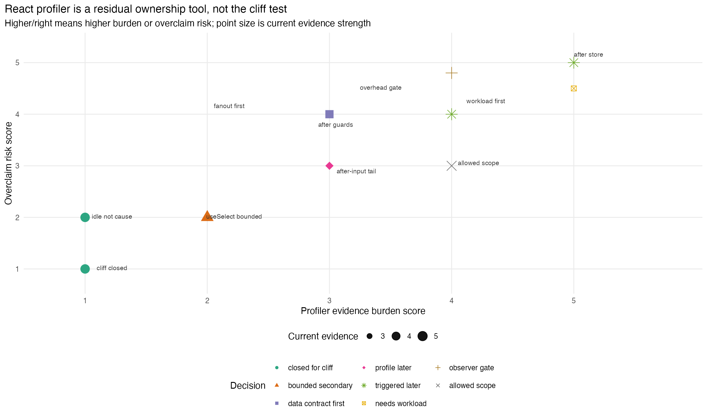

| Profiler claim | Current decision | Boundary |
| -------------- | ---------------- | -------- |
| Cliff causality | closed for the `1000ms` key-held cliff | The main movement is already inside the measured EventDispatch/input slice; a later React commit owner cannot move that observed boundary earlier in time. |
| `renderQueue.add` / idle drain | closed for the cliff | The async queue insertion movement is sub-millisecond and the idle-drain chronology points the wrong way for the fast band. |
| `useSelect` child phases | bounded secondary | Selector bodies and React external-store listener spans are too small to explain the endpoint drop, but still matter when sizing a concrete selector guard. |
| Broad store-root fanout | data-contract first | React profiler output can show symptoms after a prototype, but public subscriber semantics, persistence-selector fixtures, listener counts, and source spans decide whether a data-layer change is valid. |
| After-input visual/render tail | profile later | Profiling is useful for ranking smaller residual component owners after a patch or replay workload, not for explaining the primary cliff. |
| Selector/store/workload follow-ups | triggered later | Run profiler only after a selector guard, notification prototype, or representative replay workload changes the attribution question. |
| Profiler build and observer overhead | observer gate | Any profiled timing claim must report build/profiling mode, matched unprofiled rows, source-span joins, input-window boundaries, and async-queue boundaries. |
| Acceptable claim | residual ownership only | The valid future claim is component ownership of secondary after-input or whole-cycle cost; it is not primary cliff causality, semantic safety, CI threshold portability, or product-wide ranking. |

The most user-facing open question is narrower again. The visual proxy shows
that the key-hold `1000ms` drop reaches editor-canvas input and next-frame timing:
keydown-to-second-RAF falls from about `33ms` / `32ms` at `990ms` / `1300ms` to
`20ms` at `1000ms`. The Chromium render trace probe then shows the same shape in
`Paint` and `DrawFrame` trace events: keydown-to-`Paint` falls from about `26ms`
/ `25ms` at `990ms` / `1300ms` to `13ms` at `1000ms`. The screenshot trace probe
pushes closer to observed pixels: keydown-to-first-changed-screenshot falls from
about `35ms` / `34ms` to `18ms`. That disconfirms "EventDispatch trace
accounting only", "JS/RAF proxy only", and "render-event bookkeeping only"
theories. What remains open is calibrated input-to-screen: Chrome trace
screenshots are not compositor presentation timestamps, high-speed-camera
pixels, or OCR. The follow-up pixel localization check narrows that caveat: the
changed trace screenshot pixels are in the target textbox and overlap the DOM
range for the exact typed `x` for every decoded retained sample, so the remaining
gap is presentation calibration and glyph recognition, not unrelated screenshot
noise. The new per-sample endpoint alignment check strengthens that: for
key-held samples, Paint, DrawFrame, and first-changed-screenshot endpoints
correlate with EventDispatch at about `0.94-0.996`, and every retained endpoint
is at or after its same-key EventDispatch slice. The combined endpoint-drop
accounting makes the same point in one view: the key-hold `1000ms` point is
`~11-16ms` faster than its `990ms` / `1300ms` neighbors across EventDispatch,
second RAF, `Paint`, `DrawFrame`, and changed trace screenshot endpoints, while
complete-keypress-then-wait is roughly flat. The new endpoint decomposition
narrows the React-side caveat too: for key-held `Paint` and `DrawFrame`, only
`0.2-0.6ms` of the `~12ms` endpoint drop is in the post-EventDispatch
visual/render tail; for first changed trace screenshot, the tail contributes
`2.3ms` of a `15.8ms` drop. So after-input rendering can still matter for
whole-cycle attribution, but it is too small to be the primary cause of the
`1000ms` cliff.

### Human/Plugin Workload Contract

The remaining workload question is not whether the current harness found a real
artifact. It did. The held-key `1000ms` shape survives across visual endpoints,
source traces, CPU/QoS controls, and CDP boundary checks in the vanilla
large-post fixture. The narrower question is whether that fixed-character,
large-post stressor is representative enough to rank product latency work.

The current controls say no. They do show why Gutenberg matters: native
`contenteditable` controls move in the same direction but by less than `1ms`,
while Gutenberg empty and large-post first-input controls amplify idle/system
effects by about `4.6ms` and `5.7ms`. The listener scenario controls also show
that the large post carries more input-listener work than the empty post. That is
enough to say the large visible swing needs Gutenberg-scale work; it is not
enough to say which plugin, theme, document, or editing-history features dominate
real user sessions.

The workload replay contract is therefore:

| Workload question | Current answer | Replay contract |
| ----------------- | -------------- | --------------- |
| Can the fixed-character large-post stressor explain the benchmark artifact? | yes, for artifact and source-boundary investigation | keep it as a diagnostic harness, but do not use it alone to rank plugin-heavy or realistic editing latency |
| Does the large cliff require Gutenberg-scale work? | yes | replay empty, large mixed, long text-only, media/pattern-heavy, and plugin-heavy/P2-like documents with the same source spans |
| Can source prototypes be judged on fixed-character insertion alone? | no | include behavior assertions and source spans for text input, selection/caret changes, structural edits, async queue work, and visual endpoints before/after patches |
| What should be recorded from human/plugin-heavy sessions? | per-sample histories, not only aggregate delay buckets | record event type, text delta, inter-event gap, hold time if available, selection/caret state, block/clientId context, composition state, document shape, plugin/theme set, session age, async markers, and source-span/visual endpoint IDs |
| How should replay decide whether findings generalize? | by strata | report ordinary text bursts, correction/backspace, IME/composition, selection/navigation, block operations, paste/transform, long-session idle return, and plugin-heavy side effects separately |

That constrains what can change before workload replay exists. The fixed
stressor is enough to choose measurement semantics, explain the CI artifact, and
start low-risk selector/subscriber patches that have focused behavior tests. It
is not enough to claim that a fixed-character win ranks real typing, P2-like
editing, composition, correction, selection, navigation, or plugin-heavy
workloads. Those need recorded histories and replayed samples, not another
single averaged fixed-delay curve.

The deeper replay-schema contract turns that into an implementation requirement.
The unit of replay must be the editing event, not a delay bucket. Each event
needs chronology and context: event type, key or text delta, input type,
composition state, repeat state, inter-event gap, hold time if available, target
role, clientId, block name, selection state, and pre/post text or structural
delta hashes. The document and session are also part of the sample: editor kind,
post type, block count and block-type histogram, nested depth, media/pattern
counts, selected-block context, plugin/theme set, viewport, browser revision,
session age, autosave/REST markers, and host/container metadata.

The minimum useful strata are no longer ambiguous:

| Replay surface | Required contract |
| -------------- | ----------------- |
| Ordinary text bursts | replay human-like complete keypress/input semantics by default; keep held-key delay only as an artifact control |
| Correction/backspace | preserve text delta, selection/caret before and after, undo-level behavior, and source spans |
| IME/composition | record composition boundaries and inputType; report separately from ordinary key bursts |
| Selection/navigation | assert caret, selected block ids, focus, and visible block-list state |
| Paste/transform | record structural deltas, inserted block types, transformed block ids, and resource/network side effects |
| Block insert/remove/reorder | assert serialized block-tree hash, appender visibility, template lock, and selection recovery |
| Media/pattern-heavy editing | record media/pattern counts, REST/resource markers, and preview/render endpoints |
| Long-session idle return | preserve session age, idle gap, autosave state, and pending async work markers |
| Plugin-heavy/P2-like side effects | record plugin/theme set, plugin-visible state changes, network/resource markers, and owner spans |

I also split those strata by what the current fixed-`x` benchmark actually
covers. This is the important product-claim gate: the fixed stressor is useful
for ordinary text insertion source attribution, and it has partial first-input
idle coverage, but most real editing strata are missing.

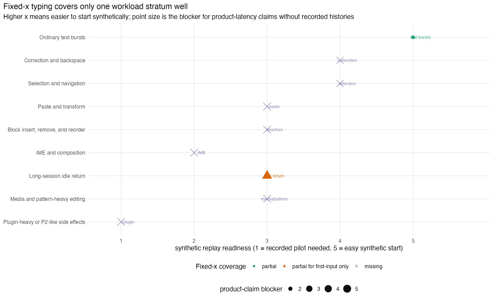

| Workload stratum | Fixed-`x` coverage | First useful claim |
| ---------------- | ------------------ | ------------------ |
| Ordinary text bursts | partial | synthetic source attribution, recorded validation for product ranking |
| Correction/backspace | missing | covered-stratum patch acceptance after behavior gates |
| Selection/navigation | missing | covered-stratum patch acceptance after behavior gates |
| Paste/transform | missing | synthetic first, recorded before product ranking |
| Block insert/remove/reorder | missing | synthetic behavior gate before broad selector claims |
| IME/composition | missing | recorded or browser-native pilot required |
| Long-session idle return | partial for first input only | recorded or long synthetic session before product claim |
| Media/pattern-heavy editing | missing | synthetic first, CI/container validation before wait or product claims |
| Plugin-heavy/P2-like side effects | missing | recorded plugin pilot required for product ranking |

That closes a common shortcut. A selector or subscriber patch can be evaluated
against fixed-`x` insertion as an artifact/source-boundary patch, but it cannot be
called a general product-latency win until the affected strata either improve or
stay neutral with passing behavior assertions. The first synthetic replay should
start with ordinary text, correction, selection, paste, and block-structure
strata because they are implementable with current helpers. IME, long-session
idle return, and plugin-heavy/P2-like rows need recorded or much more specialized
pilots before they can support product-ranking language.

Every replay sample should attach the same source attribution that made the
fixed stressor useful: RichText spans, Redux/useSelect owner metadata,
EventDispatch slices, async queue markers, and at least one visual or behavior
endpoint. A replay result is invalid if behavior assertions fail, even if
latency improves. A product claim also has to be per-stratum: a selector patch
that improves fixed-character insertion but regresses selection, paste,
composition, or plugin side effects is not a product-latency win that can be
hidden by a single averaged p50.

This raises the workload row from "unknown representative workload" to a
specific schema. The remaining missing evidence is actual recorded or generated
histories that satisfy the schema, plus before/after replay results for the
strata relevant to a given patch.

### Workload Replay Claim Ladder

The fixed-`x` benchmark is strong evidence for the artifact and for source-path
triage, but weak evidence for product ranking. That distinction is the important
workload boundary. More fixed-`x` samples can improve the artifact statistics;
they cannot turn a vanilla large-post held-key stressor into a representative
plugin or human editing workload.

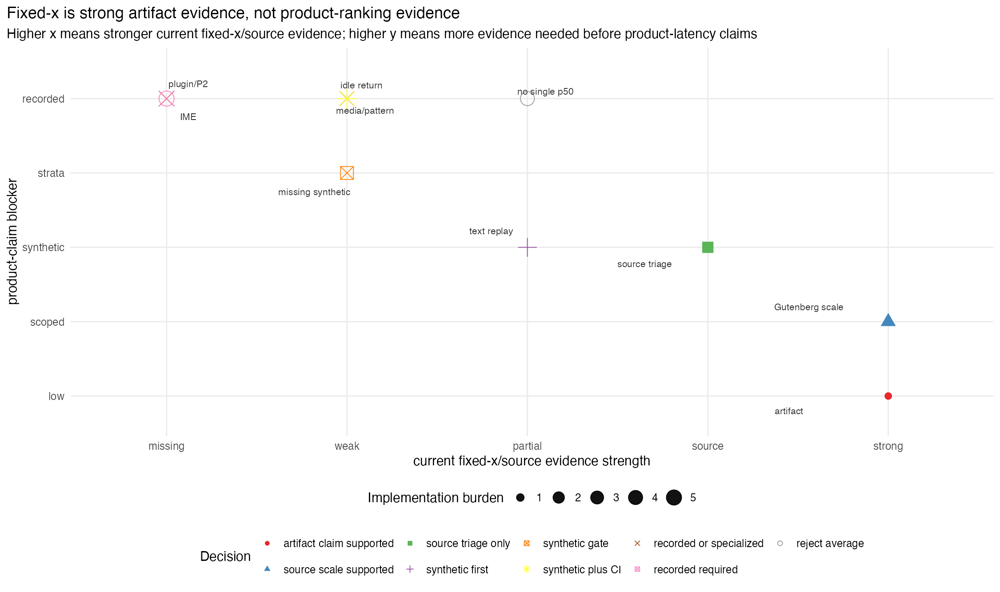

| Claim | Current evidence | Boundary |
| ----- | ---------------- | -------- |
| Fixed-character artifact reproduction | strong: the `1000ms` shape survives visual endpoints, source traces, CPU/QoS controls, and CDP boundary checks | valid diagnostic harness; not human typing or plugin-heavy editing |
| Gutenberg-scale amplification | strong: native controls move less than `1ms`, while Gutenberg-scale work amplifies the swing | source-scale claim only; does not rank real plugin/theme/session features |
| Low-risk source patch triage | useful: fixed-`x` plus behavior tests can validate narrow selector/subscriber patches in the covered insertion path | not a general product-latency claim |
| Ordinary text replay | partial: fixed-`x` covers insertion shape but uses held-key semantics | start synthetic complete-keypress replay; recorded ordinary typing needed for product ranking |
| Correction, selection, paste, structure | missing in fixed-`x` | use synthetic strata as behavior gates before broad patch claims |
| IME/composition | missing and event-order-specific | needs recorded or browser-native composition pilot |
| Long-session idle return | only partially covered by first-input/startup controls | needs long synthetic sessions or recorded idle-return histories |
| Media/pattern-heavy editing | missing and readiness/resource-sensitive | needs synthetic pattern/media manifests plus CI/container/resource telemetry |
| Plugin-heavy/P2-like side effects | missing from the vanilla fixture | needs recorded plugin pilot before product-ranking language |
| Single headline product p50 | unsafe while coverage is uneven | report per-stratum p50/p90, owner deltas, visual endpoints, assertion failures, and sample counts |

This makes the next useful work more precise. Synthetic replay is enough for
behavior gates and source-patch acceptance in ordinary text, correction,
selection, paste, and structure strata. Recorded or specialized histories are
required for IME/composition, long-session idle return, media/pattern-heavy
editing, and plugin-heavy/P2-like side effects. A patch can be called a
fixed-`x` artifact win before those histories exist; it should not be called a
product-latency win unless the relevant strata improve or stay neutral with
passing behavior assertions.

I then audited where that schema would plug into the current Playwright
performance harness. The useful conclusion is that this is not mostly a reporter
change. The harness already has raw result attachments, a custom reporter,
Chromium trace collection, fixed-fixture setup, editor helpers, and `pressKeys`
for shortcuts and clipboard emulation. The missing layers are an event-record
sidecar, a manifest-driven executor for heterogeneous events, assertion packs,
and an opt-in recorder for real/plugin-heavy histories.

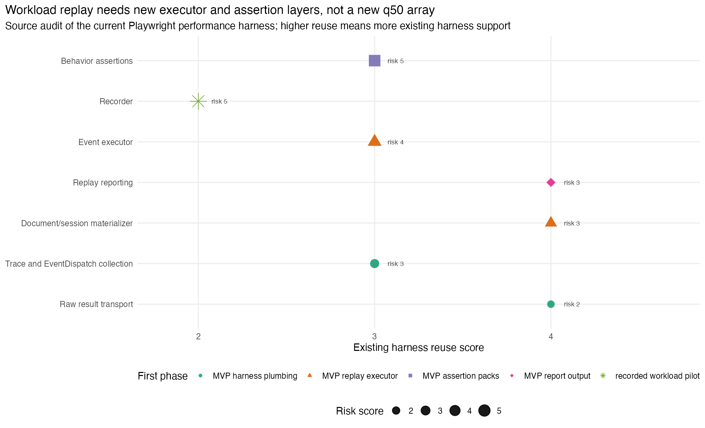

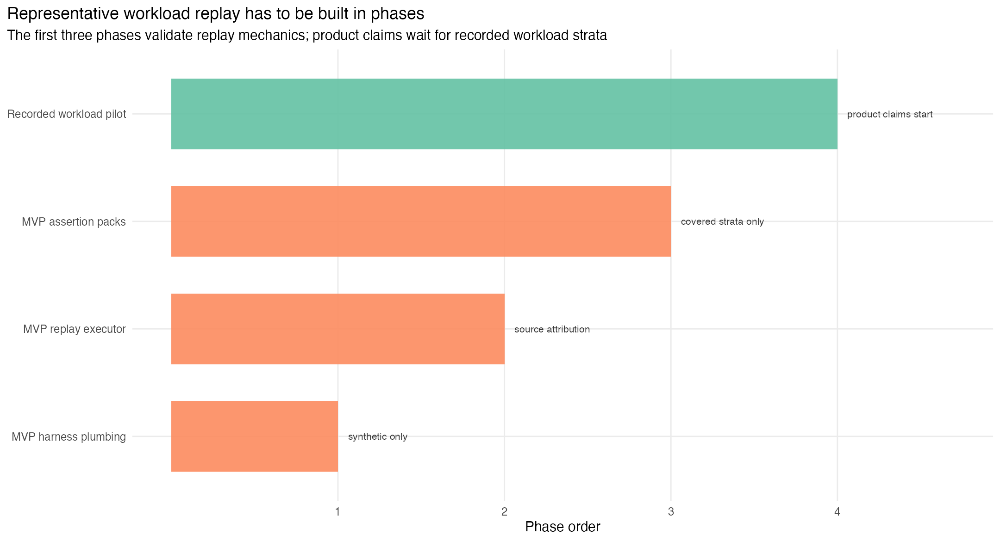

| Phase | Goal | Claim boundary |
| ----- | ---- | -------------- |
| MVP harness plumbing | store event-level records without breaking current q50 reporter output | synthetic replay development only |
| MVP replay executor | replay deterministic synthetic manifests across ordinary text, shortcut/paste, selection, and block-operation strata | source attribution on synthetic strata |
| MVP assertion packs | reject latency samples that do not reproduce the intended editor state | low-risk patch evaluation only within covered strata |
| Recorded workload pilot | collect redacted real or plugin-heavy histories and replay them by stratum | product-latency owner rankings can start here |

The source audit also closes one tempting shortcut. Current `post-editor.spec.js`
typing uses `target.type( 'x'.repeat( iterations ), { delay } )`, throws away the
first character, and stores metric arrays through the performance reporter. That
is the right shape for the existing fixed-character stressor, but it is the wrong
shape for representative replay. Replay needs per-event records joined to trace
windows, behavior assertions, source-span owner IDs, visual or behavior
endpoints, document/session metadata, and stratum labels. A single extra q50
array would preserve neither event ordering nor correctness.

### Portability Validation Contract

The remaining portability question is not whether the local runs found the
right causal shape. They did. The open question is whether the absolute p50/CV
numbers are portable enough to set thresholds or make absolute latency claims.

The local checks bound setup and ordering confounds. Randomized exact Typing
runs put the retained run-p50 medians at `13.19ms`, `12.63ms`, and `13.07ms`
for `0ms`, `1000ms`, and `60000ms` start waits, which is inside the observed
local run-to-run spread. Fresh-editor start-settle runs preserve the important
`990ms` / `1000ms` / `1010ms` / `1300ms` shape across `0s`, `10s`, and `60s`
post-setup waits. Cross-browser timeline runs preserve timer ordering
qualitatively: Chrome, Firefox, and WebKit clear the `990ms` timer before input
often enough to keep it in the slow band, and fire the timer before input at
`1000ms` / `1010ms`, but their input-span magnitudes differ. That makes the
browser checks causal-portability evidence, not Chrome threshold evidence.

The validation contract is:

| Portability question | Current answer | Validation contract |
| -------------------- | -------------- | ------------------- |
| Are absolute p50 values portable enough for thresholds? | no; the current report is still one local machine family | rerun a compact score set and diagnostics on CI plus at least one comparable local/container variant, reporting absolute p50 movement and qualitative ordering preservation |
| Which rows should be portable-validation minimum? | discriminating rows, not the full dense sweep | include tap/complete-keypress, current CI held key, the `990ms` / `1000ms` / `1010ms` / `1300ms` boundary, `50ms` / `100ms` hold controls, pattern `500ms` / `1000ms` readiness rows, runtime checkpoint controls, CPU/QoS controls, and visual endpoint controls |
| Do fresh/randomized/exact local runs close setup confounds? | mostly for local methodology, not host portability | repeat exact-spec randomized blocks on CI with fresh saved/reopened drafts, per-run p50/CV, first-three-key distribution, throwaway policy, and suite elapsed time |
| Do Firefox/WebKit make Chrome numbers portable? | no; they preserve timer ordering but not equivalent metrics | validate thresholds only on the exact Playwright-bundled Chromium used by CI; use other engines as causal checks |
| Do container/fixture controls close environment portability? | no; the Columns fixture is not host-vs-container isolation | run the compact set inside the same wp-env/container shape used by CI and a local-host variant when possible |
| How should power and scheduler sensitivity be handled? | as threshold-critical metadata | record CPU model, core count, OS version, browser revision, container limits, power mode, thermal pressure if available, process QoS, and background load |

The practical split is that local evidence can justify measurement semantics,
artifact scoping, prototype order, and low-risk patches with behavior tests. It
does not justify moving CI thresholds or making absolute latency claims until
the compact validation set has run across CI/mac/container/browser variants with
environment metadata.

The deeper validation runbook turns that into a threshold gate rather than a
generic warning:

| Validation surface | Required contract | Claim boundary |
| ------------------ | ----------------- | -------------- |
| Threshold lanes | run exact Playwright-bundled Chromium on CI plus at least one comparable local host or CI-like wp-env/container lane; Firefox/WebKit are causal lanes, not threshold lanes | absolute thresholds can move only after CI Chromium and a comparable lane preserve qualitative ordering and bound p50/CV movement |
| Compact score rows | include current CI held key, tap/complete-keypress, `990ms` / `1000ms` / `1010ms` / `1300ms` held-key boundary, `50ms` / `100ms` hold controls, pattern `500ms` / `1000ms` readiness rows, runtime checkpoint controls, CPU/QoS controls, and visual endpoint controls | qualitative portability requires matching row ordering and regime labels; threshold portability needs the lane comparison too |
| Startup/setup confounds | repeat exact-spec randomized blocks on CI with fresh saved/reopened drafts, first-three-key distributions, throwaway policy, resource counts moved before first key, and suite elapsed time | local no-extra-wait semantics can stand if ordering holds; local absolute p50 cannot become a CI threshold |
| Browser coverage | validate threshold numbers on Playwright-bundled Chromium; use Firefox/WebKit timer-timeline diagnostics only for timer ordering and broad mechanism direction | cross-engine agreement is causal evidence, not Chrome threshold equivalence |
| Container/wp-env coverage | run the same fixture and input helper inside the CI-like wp-env/container and, when possible, on a comparable host lane | host/container differences require environment-specific threshold or product claims |
| Power and scheduler state | record power mode, thermal pressure if available, process QoS, background load, and suspicious-row OS/browser counters | p50 movement tied to power/QoS state must be stratified or rerun under controlled state, not averaged into one threshold |

The expansion rule is also explicit. Start with the compact rows. Expand to a
dense sweep only when a compact row changes qualitative band, variance class,
timer ordering, or visual-endpoint direction. Before that runbook exists, the
report can make local causal, source-path, and artifact-scope claims; it still
cannot make portable p50/CV claims or move CI thresholds.

I then turned the runbook into an executable compact-validation manifest by
joining each row to the local discriminator it is supposed to preserve. This is
not a new local benchmark result. It is a stricter answer to the portability
open question: run the rows that can falsify the local conclusions, and expand
only when one of those rows changes class.

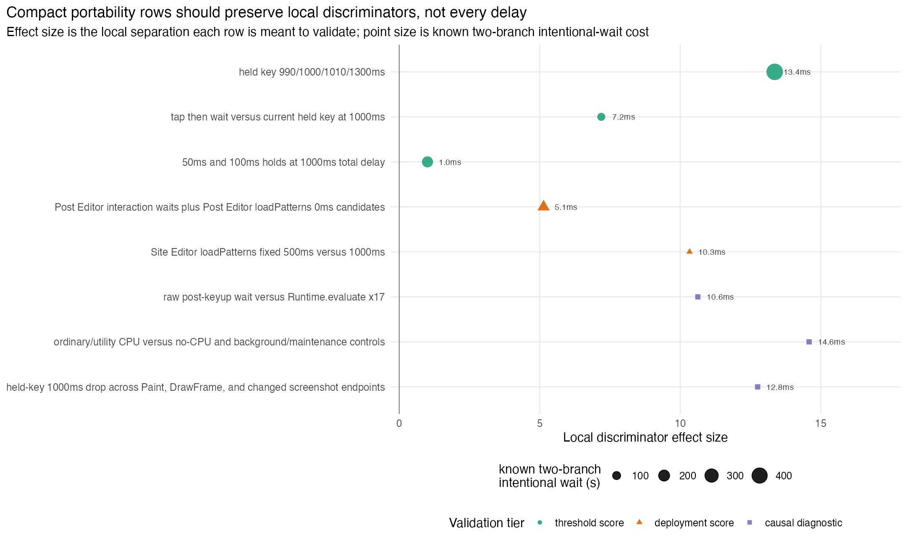

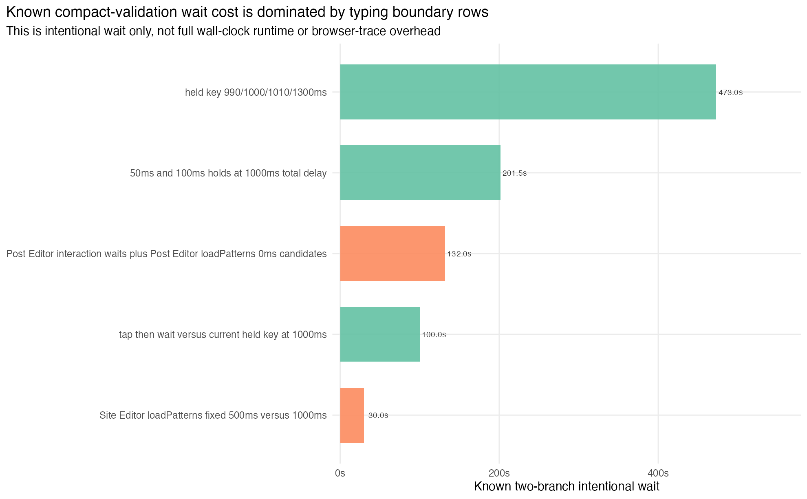

| Validation tier | Rows | Rows with known wait cost | Known two-branch intentional wait | Median local effect | Max local effect |
| --------------- | ---: | ------------------------: | --------------------------------: | ------------------: | ---------------: |
| Threshold score | `3` | `3` | `774.5s` (`12.9m`) | `7.2ms` | `13.4ms` |
| Deployment score | `2` | `2` | `162.0s` (`2.7m`) | `7.7ms` | `10.3ms` |
| Causal diagnostic | `3` | `0` | instrumentation-specific | `12.8ms` | `14.6ms` |

The threshold-score wait cost is dominated by the held-key boundary bundle:
`990ms`, `1000ms`, `1010ms`, and `1300ms` cost `473s` of intentional typing wait
in a two-branch-style comparison. That cost is still far smaller than rerunning a
full dense sweep, and it directly tests the row that would invalidate the local
`1000ms`-cliff story if it moved. The deployment-score rows are cheaper: the
Post Editor wait-removal candidates and the Site Editor fixed-`500ms` fallback
cover `162s` of known intentional wait. The causal diagnostics have no stable
CI-style wait-cost estimate because browser tracing, OS counters, or external
calibration overhead will dominate their wall-clock time.

The manifest also makes the pass/fail boundary more concrete. CI threshold work
must preserve the held-key boundary ordering, tap-versus-held helper split, and
short-hold controls. Deployment work must preserve the Post Editor `0ms`
candidates and the Site Editor `500ms` readiness band without misses or variance
class changes. Runtime checkpoint, CPU/QoS, and visual endpoint rows are causal
diagnostics; they can explain portability failures, but they should not set
absolute thresholds by themselves.

### CI Workflow Portability Boundary

I also audited the actual `Performance Tests` workflow and the scripts it calls.
This tightens the portability open question. The threshold lane is not "whatever
local Chromium reports"; it is the Ubuntu 24.04 GitHub Actions job running
`bin/plugin/cli.js perf` with Playwright-bundled Chromium, wp-env, per-branch
builds, and archived raw/curated JSON artifacts.

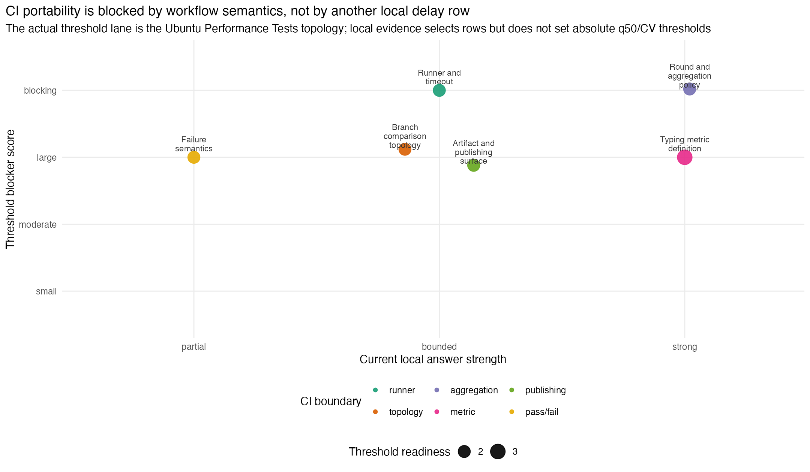

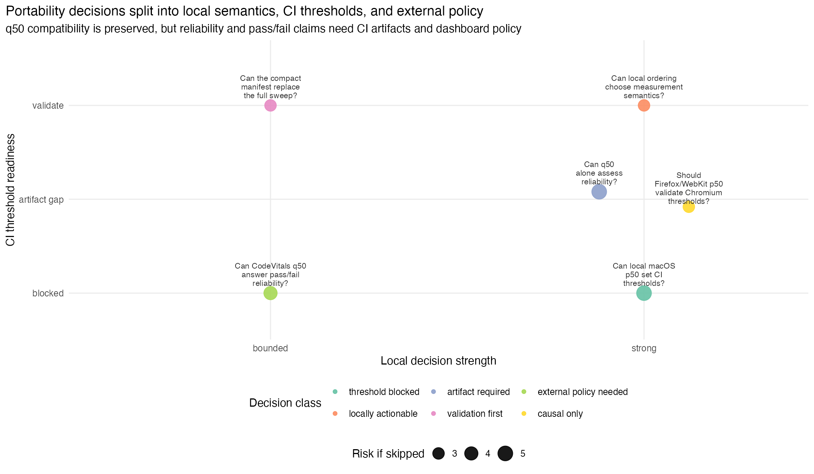

| CI surface | What the repository does | Portability consequence |
| ---------- | ------------------------ | ----------------------- |
| Runner | `.github/workflows/performance.yml` runs one 60 minute `ubuntu-24.04` job and stores artifacts under `WP_ARTIFACTS_PATH` | local macOS p50/CV cannot set CI thresholds without an Ubuntu lane |
| Branch topology | PRs compare `GITHUB_SHA` with `GITHUB_BASE_REF`; push compares against a fixed reference commit; each branch environment is built and tested sequentially | compact validation has to preserve branch order, tests branch, wp-env lifecycle, WP version, and build metadata |
| Aggregation | `TEST_ROUNDS` defaults to `1`; additional rounds are flattened before q25/q50/q75/cnt are computed | the default CI score is a small retained-sample q50, so volatility needs raw/per-run artifacts |
| Typing metric | Typing sends 11 characters with `type()`, discards the first, and stores 10 retained sums of keydown+keypress+keyup EventDispatch durations | portability lanes must keep that held-key/throwaway definition or explicitly declare a new metric |
| Publishing | curated artifacts store q25/q50/q75/cnt, the summary prints q50 with quartile percentages, and `bin/log-performance-results.js` publishes q50/base q50 | q50 compatibility is required, but q50 alone cannot answer reliability or variance |
| Failure semantics | the repo script computes percent change for display, but I found no in-repo numeric performance fail threshold | GitHub pass/fail is test/script success here; any numeric pass/fail claim needs the external dashboard or reviewer policy |

### CI q50 Consumer Claim Ladder

The remaining ambiguity is not whether q50 is used. It is. The repo has several
q50 consumers: the Playwright performance reporter curates q50, the plugin
performance command prints q50 and branch percent change, workflow artifacts
archive q50 plus raw arrays, and the trunk publisher sends q50/base-q50 values
to CodeVitals. The audit did not find a repository path where a q50 delta becomes
an automatic numeric failure.

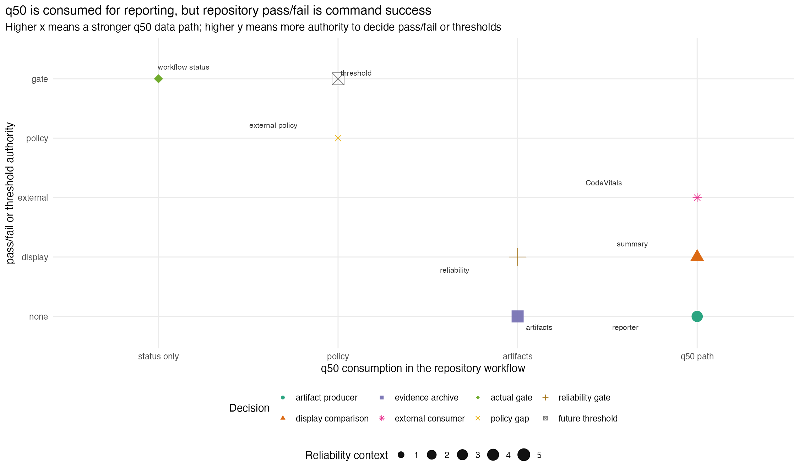

| Surface | q50 role | Pass/fail role |
| ------- | -------- | -------------- |
| Playwright performance reporter | computes `q25`, `q50`, `q75`, and `cnt`; writes raw and curated per-suite artifacts | artifact producer, not a branch comparison or gate |
| Plugin performance command | recomputes quartiles from raw round files, prints q50, and computes `% Change` from branch q50s | display comparison; no q50 threshold throws or exits nonzero |
| GitHub artifact upload | archives raw and curated performance results after a successful comparison step | evidence archive; it preserves volatility inputs but does not evaluate them |
| CodeVitals publisher | on trunk pushes, sends q50 and base q50 for each metric to `codevitals.run` | external consumer; repository code does not show dashboard threshold rules |
| GitHub workflow status | setup/build/wp-env/Playwright success, artifact steps, publisher step, and the 60-minute timeout determine the visible Actions result | actual in-repo pass/fail path; no numeric q50 gate found |
| External reviewer/dashboard policy | may consume summary, CodeVitals, or artifacts | not inferable from the repo; must be documented before predicting pass/fail from q50 |
| Reliability analysis | needs raw samples, q25/q75/cnt, per-run grouping, first-key distributions, elapsed time, and environment metadata | cannot be reconstructed from CodeVitals q50 alone |
| Future numeric threshold | would need q50 deltas plus volatility and environment metadata | requires a new repo gate or a documented external policy |

So the precise answer is: q50 determines the displayed and uploaded performance
number, and it is the compatibility target for dashboards. It does not currently
determine repository pass/fail by itself. A reliability claim needs the archived
raw/curated artifacts and per-run sidecars; a pass/fail prediction additionally
needs the external dashboard or reviewer threshold policy.

That changes the next useful portability run. The compact manifest should be run
through the real Performance Tests topology, or an equivalent reusable workflow,
and it should archive raw and curated artifacts with environment metadata. The
required output is not just `q50`: it is q50/q25/q75/cnt, per-run grouping,
first-key distributions, sample order, CV, elapsed time, branch order, browser
revision, runner image, CPU/core count, wp-env/container metadata, and git/WP
identifiers.

The local report can therefore make strong claims about measurement semantics:
held-key delay is a separate stressor, tap/complete-keypress is a different
metric family, the `1000ms` cliff is a boundary artifact of the benchmark path,
and startup waits do not improve the retained Typing q50 locally. It still cannot
claim that a local absolute p50 is the CI threshold value. If q50 movement is
used to decide pass/fail outside this repository, that policy has to be joined to
the artifact-backed volatility summary before the report can predict CI
reliability.

### Remaining Open Questions Matrix

At this point, more runs of the same JS-level benchmark are not all equally
useful. I converted the remaining questions into a decision matrix: current
answer strength, cost of the next credible measurement or prototype, and the
decision that should follow from the current evidence.

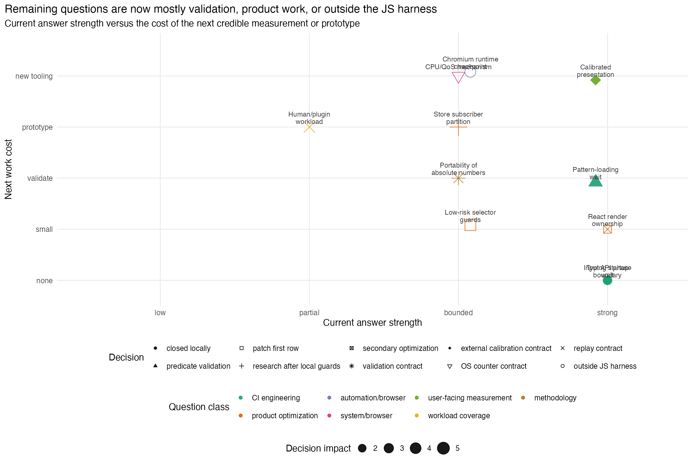

The high-level split is:

| Question | Current answer | Next useful work |
| -------- | -------------- | ---------------- |
| Typing startup wait | change-trigger contract closes the operational question: current Typing has `0ms` extra post-setup wait, added waits do not improve retained-q50 stability, first-input/tail questions need a separate statistic, and the five interactive non-Typing sleeps now have their own local `0ms` candidate matrix | do not add a Typing startup wait under the current metric; reopen only on a trigger change; validate the five interactive non-Typing `0ms` candidates on CI/mac/container lanes before changing those sleeps; the wait-removal ledger counts these five rows as `110s` of the conservative `142s` local candidate saving |
| Pattern-loading wait | CI validation contract has to stay split by spec and by claim: Site Editor pure `getBlockPatterns` is rejected as a complete replacement, resource quiet is only an instrumented broad-REST guardrail, fixed `500ms` is the best local sleep fallback, source-specific readiness is still open, and preview/canvas pre-waits would redefine the metric; the focused Post Editor matrix separately favors `0ms`; combined with the interaction rows, the conservative local wait-removal envelope is `142s` per two-branch comparison and the predicate envelope is about `146s` | validate Site Editor `getBlockPatterns` plus resource quiet with timeout/fallback, endpoint groups, preview-work preservation, retained-count, q50 range, and environment telemetry; validate fixed `500ms` as fallback; keep Site Editor/Post Editor/combined `loadPatterns` rows split; validate Post Editor `0ms` against `1000ms` with retained q50, q50 sd, p90/mean, first-iteration behavior, and source/resource telemetry before claiming full wait savings |
| Input API phase boundary | CI helper decision contract plus helper claim ladder close the practical boundary: `type()` and `pressSequentially()` are the same helper family when target/options match and exact validation stays in band, ordinary `locator.press()` is only a rejected proxy/checkpoint control, helper-family switches are metric-definition changes, realistic hold choices must be scoped inside the selected helper, and lower-level Playwright/Chromium mechanism work is optional for CI helper choice | no more broad API-boundary sweeps; if the suite changes helper spelling, run one exact CI-settings check, and if it changes helper family, treat it as a new metric definition with threshold-portability validation; compare `50ms` / `75ms` / `100ms` holds only after the final helper family is chosen |
| Low-risk selector guards | behavior-gate audit closes the first-patch question: the pattern-override selected-only patch is implemented locally, covered by focused unit tests, and the rebuilt all-data-spans microscope confirms the support-check `useSelect` now appears as one selected metadata entry; the provider row has only source evidence plus a partial `lastBlockAttributesChange` hint, and the inner-blocks row has one clean root/drop-zone slice but known layout/default-layout and side-effect blockers | prototype `BlockListBlockProvider` first as a narrow latest-attribute-action fast path with public-filter, edited-block, selection, structure, editability, settings, visibility, and binding gates; split `useInnerBlocksProps` into root/drop-zone versus full-hook work, preserving identity/root, layout/default-layout, nested-settings, and controlled-inner-block gates; run aggregate before/after p50 only after behavior gates and source spans pass |
| Store subscriber partition | prototype-gate audit refines the compatibility path: the marker wakes `4,501` Redux-store listeners at p50 and `4,498` are `useSelect`, so the best fanout prototype is not an external persistence slot or narrowed public `registry.subscribe`; it is an internal dependency-filtered `useSelect` lane that preserves public root subscribe semantics, wakes `isLastBlockChangePersistent()` consumers, skips unrelated selectors, and proves listener-count collapse in a marker-only source-span run | after local guards, prototype the `useBlockSync` side channel only as a behavior-only path; for a fanout claim, require public `registry.subscribe` fixtures, persistence-selector `useSelect` fixtures, unrelated-selector skip fixtures, dynamic/cross-store/race/async gates, plugin/public subscriber smoke, and marker-only source-span collapse; do not claim timing from a side channel alone |
| React render ownership | closed for cliff causality; the claim ladder plus residual-profiler plan says profiling is useful only after a selector guard, store-notification prototype, or workload replay creates a new after-input / whole-cycle ownership question | do not profile for the `1000ms` cliff; later profiler runs must report commit owners with input-window boundaries, async-queue boundaries, build/profiling mode, source-span IDs, matched unprofiled rows, and behavior endpoints |
| Chromium runtime checkpoint | claim-ladder and sidecar-MVP audits make the boundary explicit: elapsed wait, DOM key payload, one generic task/frame checkpoint, and native browser-only scale are locally rejected; repeated `Runtime.evaluate` / `Runtime.callFunctionOn` remains the dose-response control, trace-on `captureSnapshot` remains the perturbation control, Gutenberg source fanout supplies the scale, and the exact Chromium state is still unnamed | implement the trace-off protocol sidecar first: command wrapper, browser/driver timebase sync, key-gap window join, raw/extractor schema, and acceptance matrix proving class ordering survives; then add scheduler/task-queue, V8/microtask, `EventDispatch`, source-span, browser revision, trace-category, observer-configuration, and optional OS-counter joins; do not name V8/scheduler/OS state and do not add more JS-level delay rows until the sidecar exists |
| CPU/QoS mechanism | claim-ladder plus local counter feasibility plus the join-contract audit make the remaining mechanism executable but not yet named: the benchmark boundary is proved, no-op/timer/generic-CPU explanations are ruled out, finite decay is descriptive, and P-core/frequency, Darwin scheduler/QoS, cache/memory, and Chromium scheduler claims all require observers not present in the current JS/browser table | add the sidecar and run it unprivileged first to prove every retained key joins to helper policy, renderer identity, EventDispatch timing, and collector windows without changing class ordering; then run the compact no-CPU, ordinary/utility, background/maintenance, fresh finite, and stale finite rows under root `powermetrics`; add root `trace` only if frequency/residency/QoS counters do not explain the split; keep source/product mitigation claims separate from the system-mechanism claim |
| Calibrated presentation | external-calibration runbook plus claim ladder closes the wording boundary: Chromium-internal endpoints already align across RAF, `Paint`, `DrawFrame`, changed screenshots, and localized pixels; semantic glyph, presented-frame, camera-visible, and hardware/display claims are explicitly blocked until joined external observers preserve the same key-held shape and complete-keypress control | keep claims scoped to Chromium internal visual propagation unless the report needs hardware/display or semantic glyph timing; if it does, run the external calibration ladder with OCR/template matching, compositor/present timestamps, or camera/display capture joined per retained key |
| Human/plugin workload | workload schema, strata-coverage audit, and claim ladder now separate artifact/source-boundary claims from product-latency claims: fixed-`x` insertion is strong evidence for the benchmark artifact and source triage, partially covers ordinary text and first-input idle return, and leaves correction, selection, paste, structure, IME, media/pattern, and plugin-heavy strata missing | implement the four-phase MVP: harness plumbing, synthetic replay executor, assertion packs, then recorded workload pilot; start synthetic coverage with ordinary text, correction, selection, paste, and block-structure strata, but require recorded or specialized pilots before product-ranking claims for IME, long-session idle return, media/pattern-heavy editing, and plugin-heavy/P2-like histories; report per-stratum results rather than one headline p50 |
| Portability of absolute numbers | portability runbook, CI workflow-boundary audit, and q50-consumer ladder now separate local semantics from threshold portability: the actual repo lane is Ubuntu 24.04 Performance Tests with Playwright-bundled Chromium/wp-env, q50 is printed, archived, and uploaded, q25/q75/cnt/raw arrays live in artifacts, default rounds is `1`, and the visible in-repo pass/fail path is command/workflow success rather than a numeric q50 gate | run the compact manifest through the real Performance Tests topology or an equivalent reusable workflow with raw artifacts, environment metadata, repeated paired runs, q50/q25/q75/cnt/CV/per-run order, and first-key distributions; add external dashboard/reviewer threshold policy before treating local movements as CI pass/fail predictions |

I then audited the same rows for a narrower question: would another local sample
sweep change the answer, or is the missing evidence a different observer,
prototype, workload, or topology? This is where the remaining open questions get
more actionable. Most low-level mechanism questions now have low value from
local resampling because the missing field is not another latency sample; it is a
join key, counter, endpoint, or behavior contract that the current artifact does
not contain.

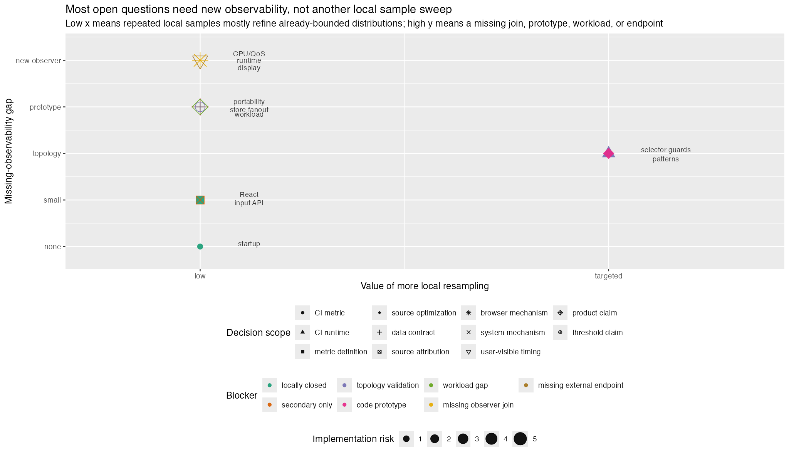

| Blocker | Questions affected | What another local sweep can still do | What it cannot do |
| ------- | ------------------ | ------------------------------------- | ----------------- |
| Locally closed | Typing startup wait, input API phase boundary | Reconfirm after a trigger change such as browser, helper family, trace placement, throwaway policy, or reported statistic. | Justify a startup wait or treat a helper-family switch as transparent under the current metric. |
| Topology validation | Pattern-loading wait, absolute CI portability | Estimate candidate stability only when run in the real Performance Tests topology or an equivalent workflow. | Sample Ubuntu runners, wp-env/container limits, CI browser revisions, preview/canvas failures, or external threshold policy from a local macOS run. |
| Code prototype | Selector guards, store subscriber partition | Confirm source-span collapse and aggregate p50 after behavior gates pass. | Prove selector invalidation safety or public `@wordpress/data` compatibility from timing data alone. |
| Missing observer join | Chromium runtime checkpoint, CPU/QoS mechanism | Reproduce the dose response or class ordering as an acceptance control. | Name V8/task-queue/scheduler state, P-core residency, frequency, QoS placement, cache state, or runnable latency without sidecar/counter joins. |
| External endpoint / workload gap | Calibrated presentation, human/plugin workload | Preserve the fixed-`x` artifact claim as a control. | Claim hardware-display timing, semantic first glyph timing, or representative product latency without external calibration or replay strata. |

The falsification version of the same audit is stricter: for each recommendation,
what observation would actually change the decision? This keeps "deeper
analysis" from becoming unfalsifiable narrative. The high-cost rows are not
waiting for more of the same latency samples; they need a different artifact
with join keys and stop rules.

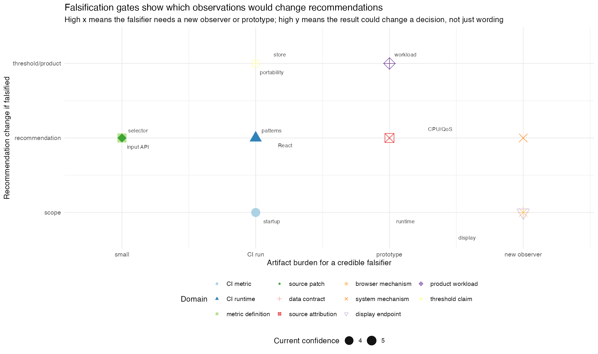

| Recommendation area | Falsifier that would change the recommendation | Required artifact |
| ------------------- | ---------------------------------------------- | ----------------- |
| Typing startup wait | Real Performance Tests topology shows `0ms` extra wait is consistently worse than the current setup in retained q50, variance, first-retained-key distribution, or failures. | Paired raw CI artifacts with q25/q50/q75/cnt, per-run grouping, first-key distributions, elapsed time, failures, browser revision, runner image, and wp-env metadata. |
| Pattern-loading wait | Site Editor candidates lose retained samples, move preview/canvas failures into measurement, increase variance, or leave wait-side resources unresolved across CI/mac/container lanes. | Per-spec interaction artifacts with resource groups, preview/canvas/actionability counts, timeout/fallback logs, and retained metric summaries. |
| Input API phase boundary | Matched exact-suite `type()` and `pressSequentially()` diverge materially, or a Playwright update changes DOM event shape/hold semantics enough to move retained q50. | Exact-settings helper comparison with protocol/event records, DOM key events, retained q50, and the same throwaway/reporting policy. |
| Selector/store source work | Behavior gates fail, source-span fanout does not collapse, public subscriber compatibility breaks, or aggregate q50 does not move after source spans pass. | Focused behavior tests, marker/source-span listener counts, compatibility fixtures, and matched aggregate artifacts only after behavior gates pass. |
| Runtime and CPU/QoS mechanisms | Sidecar/protocol/counter rows cannot preserve class ordering or cannot join the differentiating state to retained keys. | Trace-off protocol sidecar for runtime questions; helper/key-window/renderer/collector sidecar plus root `powermetrics`/`trace` for CPU/QoS questions. |
| Presentation and workload claims | External visual endpoints disagree with Chromium-internal endpoints, or replay strata show different owners/effects/regressions than fixed-`x`. | Per-retained-key external calibration, plus workload recorder/replayer artifacts with assertions, source spans, endpoints, and per-stratum summaries. |

The dependency map is the operational version of that audit. It separates work
that can start now from work that should wait for a prerequisite artifact. The
main sequencing point is that the open questions do not form one queue. CI
topology validation and behavior-gated selector work can start independently;
runtime and CPU/QoS mechanism claims should wait for sidecars; display and
workload work are only needed if the report broadens from benchmark/source
claims to presentation or product claims.

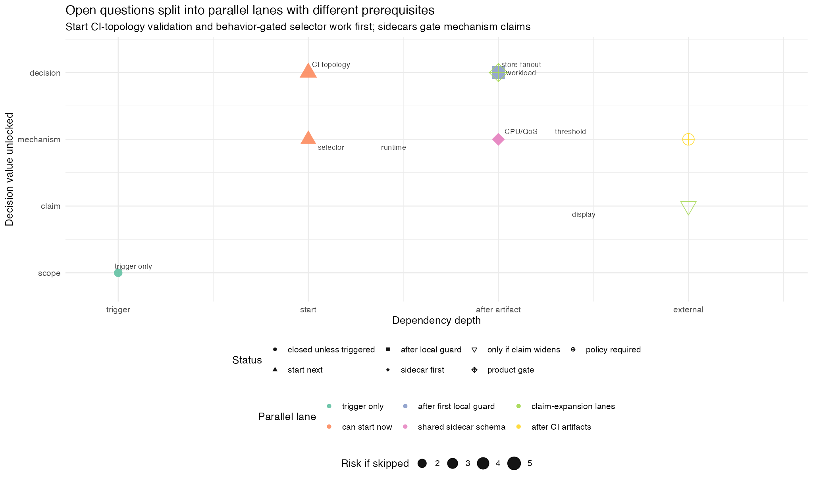

| Lane | First useful artifact | Work to avoid before that artifact exists |
| ---- | --------------------- | ----------------------------------------- |
| Trigger-only checks | None under unchanged metric settings. | Repeating broad startup-wait or input-API sweeps without a helper, browser, trace-placement, throwaway-policy, or statistic change. |
| CI topology validation | Compact Performance Tests artifact with raw retained samples, failures, environment metadata, first-key distributions, resources, and per-run order. | Changing waits or treating local macOS absolute p50/CV as a CI threshold. |
| Selector/source prototypes | Behavior-gated source prototype plus source-span microscope for the next hot owner. | Claiming selector safety or source wins from aggregate p50 alone. |
| Sidecar-gated mechanism claims | Trace-off protocol sidecar for Chromium runtime; helper/key-window/renderer/collector sidecar for CPU/QoS. | Naming V8, scheduler, P-core, frequency, QoS placement, cache, or runnable-latency causes from aggregate latency rows. |
| Claim-expansion lanes | External display calibration or workload recorder/replayer only if those claims are needed. | Converting Chromium-internal screenshots into hardware-display timing, or fixed-`x` insertion into representative product latency. |
| External policy join | Dashboard/reviewer threshold policy joined to CI artifacts. | Predicting pass/fail from local q50 movement alone. |

Scoring the next actions makes the priority order explicit. I used a simple
score: expected information gain times decision urgency divided by execution
cost. The score is not a statistical model; it is a forcing function to separate
useful next artifacts from busywork.

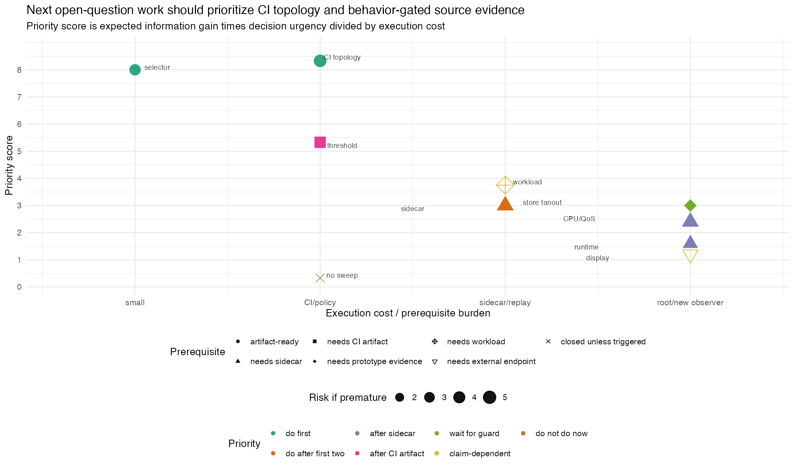

| Priority | Action | Why |
| -------- | ------ | --- |
| Do first | Run the compact CI-topology validation artifact. | It is the only way to validate wait-removal, variance, first-key, failure, and threshold-portability claims against the real Performance Tests topology. |
| Do first | Prototype the next behavior-gated selector guard. | It can produce actionable source evidence now, but only if behavior tests and source-span collapse pass before aggregate p50 claims. |
| Do after those | Implement the shared retained-key sidecar schema. | Runtime and CPU/QoS mechanisms are both blocked by missing per-key joins; a shared schema avoids incompatible one-off collectors. |
| After sidecar | Run CPU/QoS sidecar plus `powermetrics`, and run the trace-off protocol sidecar. | These can name lower-level mechanisms; doing them before sidecar acceptance would risk observer artifacts and unjoinable counter rows. |
| Wait for prerequisite | Store-notification partition, threshold-policy join, workload replay, and external display calibration. | Each is useful only after a narrower source guard, CI artifact, product-claim need, or display-claim need exists. |
| Do not do now | Repeat broad local startup/API sweeps under unchanged settings. | The questions are closed locally unless a helper, browser, trace placement, throwaway policy, or reported statistic changes. |

I also checked whether this priority order is an artifact of that scoring
formula. I rescored the same rows with seven alternate formulas: baseline,
risk-adjusted, decision-first, information-first, cost-skeptical,
artifact-ready-biased, and mechanism-unblock-biased. This is still a judgment
model, but it catches the obvious failure mode where one arbitrary weighting
drives the recommendation.

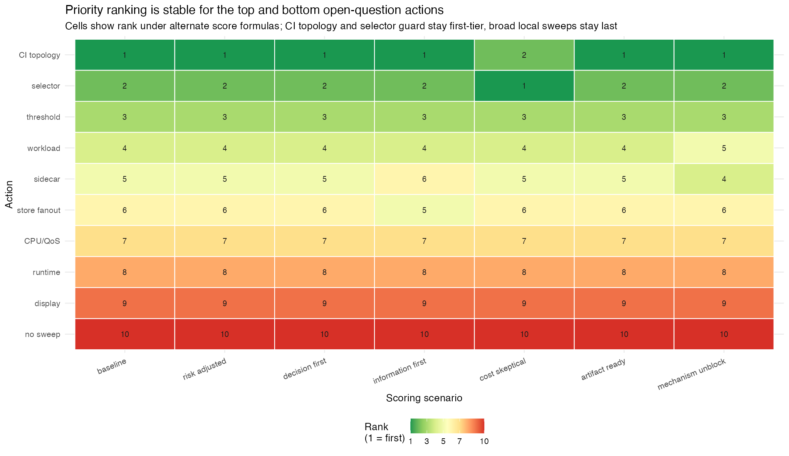

The result is stable enough for the near-term choice:

| Action | Sensitivity result |
| ------ | ------------------ |
| Compact CI-topology validation | Always first or tied for first-tier across the scenarios. |
| Behavior-gated selector guard | Always first-tier; it remains the cheapest useful engineering artifact. |
| Shared retained-key sidecar | Middle-ranked unless the formula explicitly favors mechanism unblocking, where it moves up. This matches the dependency map: design it after the first two actions, before root counters or browser tracing. |
| CPU/QoS, runtime sidecar, workload replay, display calibration | Valuable only behind their prerequisites or claim expansion; their lower rank is caused by artifact burden, not because the questions are unimportant. |
| Broad local startup/API sweeps | Bottom-ranked under every scoring scenario unless a trigger changes. |

The next step is to turn that ranking into executable gates. The top actions
need concrete artifacts, not another generic request for more samples.

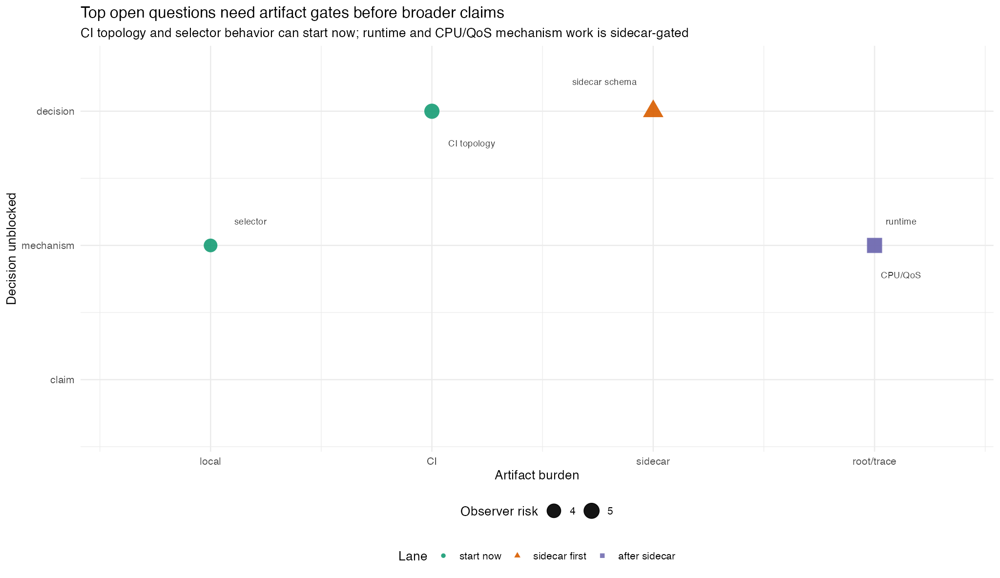

| Runbook item | First artifact | Acceptance gate | Stop or expand rule |
| ------------ | -------------- | --------------- | ------------------- |
| Compact CI topology validation | A real Performance Tests topology artifact containing raw retained samples, q25/q50/q75/cnt, first-key distributions, failures, resources, runner/browser/wp-env metadata, and per-run order. | Local row ordering is preserved, retained counts/failures do not regress, and candidate wait changes do not move resources or first-key tails into the measured interval. | If ordering, variance, failures, or resource movement changes, expand the manifest before changing waits or thresholds. |
| Behavior-gated selector guard | Focused behavior fixtures plus a source-span microscope for the next hot owner. | Behavior passes first, then source-span fanout collapses for the targeted owner. | If behavior or source spans fail, do not run or cite aggregate p50; narrow the guard or move to another owner. |
| Shared retained-key sidecar schema | Unprivileged key-window/helper/renderer/collector/command schema with clock sync and no root collectors. | Every retained q50-contributing key joins to the expected helper, renderer, command, and collector placeholder rows without changing class ordering. | If join coverage or class ordering fails, do not run root counters or browser trace categories. |
| CPU/QoS counter run | Compact manifest under root `powermetrics` after sidecar acceptance. | Frequency/residency/QoS/power state separates ordinary/utility fast rows from no-CPU and background/maintenance rows. | If `powermetrics` cannot separate rows, escalate to root `trace`; if trace also fails, keep only empirical CPU-state sensitivity. |
| Trace-off protocol sidecar | Runtime command sidecar joined to retained key gaps and runtime-repeat controls. | Repeated runtime checkpoints reproduce the dose response without observer perturbation and expose joinable runtime/scheduler fields. | If the sidecar perturbs ordering or fields do not separate rows, stop naming Chromium internals. |

The remaining uncertainty is not symmetric. Some open questions can change an
engineering decision now; others can only change the wording of a mechanism
claim. I split those risks explicitly so the report does not treat every
unknown as equally blocking.

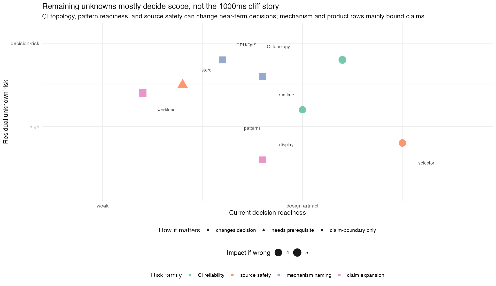

| Question | Residual unknown | Likely wrong conclusion if acted on now |
| -------- | ---------------- | --------------------------------------- |
| CI topology / startup waits | whether local row ordering, first-key tails, retained counts, failures, and resource movement survive the real Performance Tests topology | local wait-removal looks stable but increases CI volatility or shifts async work into measurement |
| Pattern-loading wait | whether the source-specific predicate preserves preview/canvas behavior and resource quiet across lanes | fixed sleeps are removed while hidden readiness work becomes the new benchmark input |
| Selector/source guards | whether behavior gates and source-span fanout collapse before aggregate p50 moves | a timing win is credited to a selector optimization that actually changed editor semantics |
| Store subscriber partition | whether public subscription semantics and dynamic dependency cases survive a filtered lane | a lower listener count is mistaken for a compatible `@wordpress/data` contract |
| Runtime mechanism | which trace-off Chromium/runtime state joins to the retained key windows without perturbing ordering | a delay-dependent artifact is named as V8, scheduler, or tracing behavior without a stable observer |
| CPU/QoS mechanism | whether frequency, residency, QoS, cache, or runnable-latency counters separate the fast/slow classes | a machine-specific power or scheduler phase is overfit into a Gutenberg-level explanation |
| Product workload | whether correction, selection, paste, block-structure, IME, media, pattern, and plugin-heavy histories have the same owners | fixed-`x` latency is treated as representative product latency |
| Presentation endpoint | whether external glyph/display timing agrees with Chromium-internal screenshots and paint endpoints | browser-internal visual propagation is described as user-visible display latency |

This changes what "deeper analysis" should mean. For CI topology, pattern
loading, selector guards, and store partitioning, the remaining risk can change a
near-term engineering decision. For runtime, CPU/QoS, presentation, and workload
claims, the remaining risk mostly changes the claim boundary: the current
benchmark artifact is still useful, but it should not be generalized beyond the
observer it actually contains.

The value-of-information version of the same ledger makes the stop/go line
clearer. I scored each remaining unknown by residual risk times impact if wrong,
divided by cost to close, with a penalty for rows that only refine claim wording
instead of changing an immediate engineering decision.

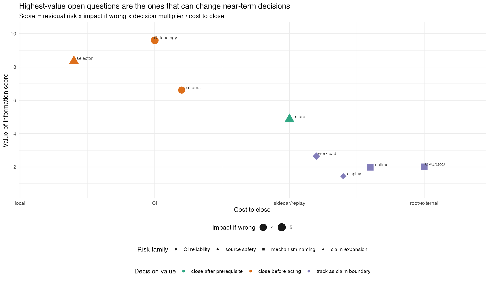

| Rank | Unknown to close | Value-of-information result | Practical consequence |
| ---- | ---------------- | --------------------------- | --------------------- |
| 1 | CI topology / startup waits | Highest value because it can directly change wait-removal, variance, failure, and threshold-portability decisions. | Run the compact real-topology artifact before changing CI waits or claiming CI stability from local rows. |
| 2 | Selector/source guards | High value because the closure artifact is cheap and can change source-level optimization choices. | Prototype only behind behavior gates and source-span collapse; aggregate p50 is secondary. |
| 3 | Pattern-loading wait | High value because a wrong predicate can silently move readiness work into measurement. | Validate source-specific readiness and resource quiet before removing fixed sleeps. |
| 4 | Store subscriber partition | Medium value, but only after a narrower selector/source artifact exists. | Do not start with a broad data-layer partition; first prove the local owner and compatibility gates. |
| 5-8 | Workload, CPU/QoS, runtime, and presentation endpoints | Lower immediate value because they mainly bound mechanism or product-scope claims unless the report expands beyond the current benchmark artifact. | Keep them as claim-limiters; run them only when a product-latency, hardware-display, or named-system-mechanism claim is actually needed. |

The stop-rule version is the guardrail against overfitting. Each row needs a
pre-declared close condition and an expand condition. If the close condition
passes, stop investigating that question for this report. If the expand
condition happens, do not explain it away with the existing aggregate p50 data.

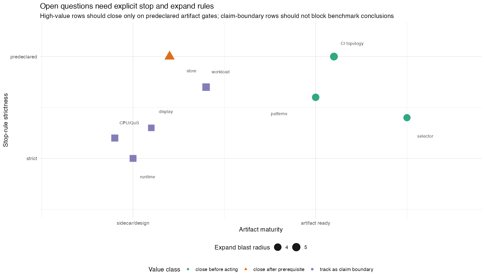

| Question | Stop when this is true | Expand if this happens |
| -------- | ---------------------- | ---------------------- |
| CI topology / startup waits | real Performance Tests topology preserves row ordering, retained counts, failures, first-key tails, and resource placement | CI changes ordering, variance, failures, or resource timing relative to local rows |
| Pattern-loading wait | source-specific readiness plus resource quiet preserves preview/canvas behavior and retained samples across lanes | hidden readiness work, preview/canvas failure, or resource movement enters the measured window |
| Selector/source guards | behavior fixtures pass and source-span fanout collapses for the targeted owner before aggregate p50 is cited | behavior changes, source spans do not collapse, or the aggregate win appears without source evidence |
| Store subscriber partition | public subscription, dynamic dependency, race, and persistence-selector fixtures pass with listener-count collapse | any compatibility fixture fails or the filtered lane changes public `@wordpress/data` semantics |
| Runtime mechanism | trace-off sidecar preserves class ordering and joins a differentiating runtime state to retained key windows | observer placement perturbs ordering or no joined runtime field separates fast and slow classes |
| CPU/QoS mechanism | sidecar plus `powermetrics` separates fast and slow classes by frequency, residency, QoS, power, or runnable state | counters do not separate rows, requiring root trace or an empirical-only conclusion |
| Product workload | replay strata show the same owner/effect pattern for the product claim being made | correction, selection, paste, structure, IME, media/pattern, or plugin-heavy strata diverge |
| Presentation endpoint | external glyph/display timing agrees with Chromium-internal screenshot/paint endpoints for retained keys | external endpoint ordering differs or cannot be joined without perturbing the benchmark |

The outcome-interpretation matrix is the next anti-rationalization step. A
mixed result is not a weak pass. It either narrows the scope of the decision or
requires a different observer.

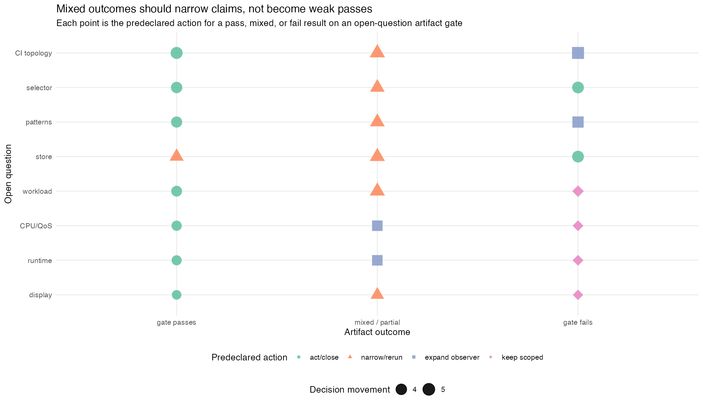

| Outcome | Interpretation rule |
| ------- | ------------------- |
| Gate passes | close that question for the current report and act only within the artifact scope that passed |
| Mixed / partial | narrow the claim or rerun a smaller manifest that isolates the failing dimension |
| Gate fails | broaden instrumentation or keep the claim scoped; do not cite aggregate p50 as a substitute |

For example, if the CI topology artifact preserves ordering but first-key tails
move, the result does not validate a global wait-policy change. It validates only
the rows whose retained metric is stable and forces a first-key-specific metric
or mitigation. If selector behavior passes but source-span fanout does not
collapse, the result is not a performance win; it is a rejected source
hypothesis. If runtime or CPU/QoS observers fail to separate rows, the correct
conclusion is empirical sensitivity, not a named scheduler or hardware cause.

The claim-sensitivity view answers a different question: which conclusions are
actually at risk? Most remaining open questions do not threaten the central
benchmark explanation. They either affect CI portability, choose the next source
optimization, or decide whether the report is allowed to make broader
mechanism/product/display claims.

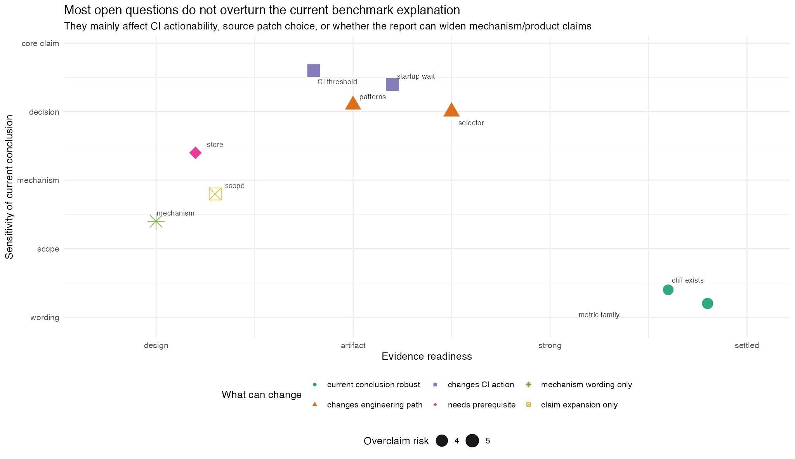

| Current conclusion | What an open question can still change |
| ------------------ | -------------------------------------- |
| The `1000ms` key-held cliff exists in the current benchmark path | size and portability, not the existence of the local boundary artifact |
| Held-key delay and complete-keypress-then-wait are different metric families | wording and CI metric definition, not the input-semantics distinction |
| Local Typing retained-q50 does not justify adding a startup wait | CI topology actionability, not the local retained-q50 result |
| Pattern-loading waits need source-specific readiness before removal | implementation choice and per-spec scope |
| Selector/source guards can produce local source wins only behind behavior gates | which source patch is safe and whether aggregate p50 can be cited |
| Runtime and CPU/QoS lower-layer mechanisms remain unnamed | mechanism wording; not the empirical delay/mode sensitivity |
| Product workload and external display claims require new observers | whether the report may generalize beyond fixed-`x` and Chromium-internal endpoints |
| CI pass/fail cannot be predicted from local q50 alone | threshold portability and external policy, not local measurement semantics |

So the remaining open questions do not all have equal leverage. The highest-risk
rows are CI topology, pattern readiness, and selector behavior because they can
change near-term decisions. Runtime, CPU/QoS, workload, and display work are
important only if the claim widens beyond the current benchmark artifact.

That makes the next-run portfolio smaller than the list of open questions. The
right unit is a shared artifact bundle, not one benchmark per question.

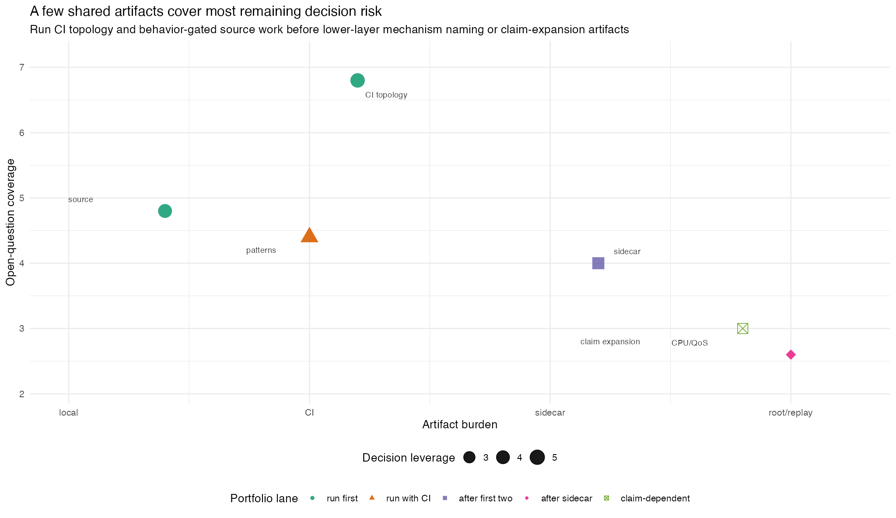

| Bundle | Questions it covers | Portfolio decision |
| ------ | ------------------- | ------------------ |
| Compact CI topology artifact | startup waits, threshold portability, retained q50 stability, first-key tails, failures, resources, and some pattern wait actionability | run first because it covers the highest-risk decision rows |
| Pattern readiness/resource artifact | Site Editor/Post Editor pattern-loading sleeps, preview/canvas behavior, resource quiet, and fallback policy | run with or immediately after the compact CI artifact if wait removal is being considered |
| Behavior-gated source prototype | selector/source guards and the prerequisite for store-partition work | run as the first source-code artifact; aggregate p50 follows behavior/source-span gates |
| Shared retained-key sidecar | runtime mechanism and CPU/QoS mechanism join keys | design after the first two decision bundles; run before any root counters or browser trace naming |
| Workload/display expansion artifacts | product workload and calibrated presentation claims | defer until the report needs product-latency or hardware/display claims |

This is the practical portfolio: run the compact CI topology bundle and the
behavior-gated source prototype before spending time on lower-layer mechanism
naming. Pattern readiness belongs near CI because it is a wait-removal decision,
not a mechanism hunt. The sidecar is still useful, but it should be treated as a
shared prerequisite for mechanism naming, not as eight separate delay sweeps.

The critical path follows from that portfolio. CI topology and behavior-gated
source work can start independently. Pattern readiness should be coupled to the
CI topology lane if wait removal is under consideration. Runtime and CPU/QoS
mechanism naming should wait until the shared retained-key sidecar passes its
join and overhead gates.

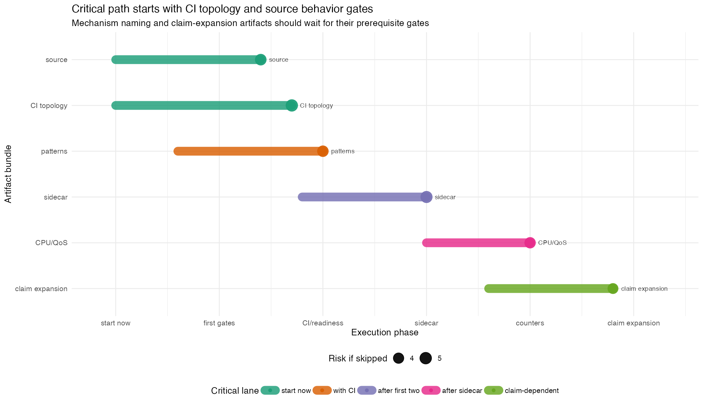

| Phase | Artifact | What not to do before it passes |
| ----- | -------- | -------------------------------- |
| Start now | Compact CI topology artifact | change CI waits, predict pass/fail from local q50, or treat first-key behavior as solved |
| Start now | Behavior-gated source prototype | cite aggregate p50 or store fanout as a source win |
| With CI | Pattern readiness/resource artifact | remove pattern-loading sleeps globally |
| After first two | Shared retained-key sidecar | run root counters or browser traces for mechanism names |
| After sidecar | CPU/QoS counter bundle | name P-core, frequency, QoS, cache, or scheduler causes |
| Claim-dependent | Workload/display expansion artifacts | generalize fixed-`x` or Chromium-internal endpoints to product or hardware/display latency |

That sequencing also gives a stop rule for the analysis process itself. If the
CI topology artifact fails, the next work is not a lower-layer mechanism run; it
is a smaller CI manifest that isolates ordering, first-key tails, failures, and
resource movement. If the source prototype fails behavior gates, the next work
is a narrower source owner, not a broader timing sweep. If both pass, then the
remaining mechanism work can be explicitly scoped as explanatory rather than
decision-blocking.

The artifact-requirements matrix is the concrete guard against under-
instrumented reruns. A result that lacks its required fields is not a weak data
point; it is an incomplete artifact.

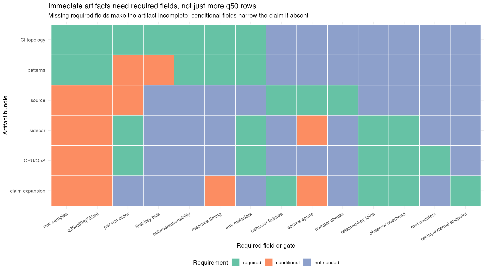

| Artifact | Required before interpretation | Incomplete if missing |
| -------- | ------------------------------ | --------------------- |
| Compact CI topology artifact | raw retained samples, q25/q50/q75/cnt, per-run order, first-key distribution, failures/actionability, resource timing, environment metadata | raw/per-run data, failure counts, first-key tails, resources, or runner/browser/wp-env metadata |
| Pattern readiness/resource artifact | source readiness events, resource quiet, preview/canvas/actionability counts, retained samples, timeout/fallback logs, spec/lane metadata | only aggregate q50, or no proof that readiness work stayed out of the measured window |
| Behavior-gated source prototype | behavior fixtures, source-span microscope, listener/source fanout counts, compatibility checks, aggregate p50 only after behavior/source gates | timing without behavior fixtures or source-span collapse |
| Shared retained-key sidecar | key-window IDs, helper policy, renderer/command identity, clock sync, join coverage, observer-overhead/class-ordering checks | unjoinable counters or sidecar perturbing the row ordering |
| CPU/QoS counter bundle | accepted sidecar, root `powermetrics`, controls for class ordering, optional root trace fallback | counters that correlate weakly but do not separate retained fast/slow classes |
| Workload/display expansion artifacts | replay strata or external endpoints, behavior/visual assertions, per-stratum summaries, retained-key joins | one aggregate product/display headline without joined strata or calibrated endpoint evidence |

The readiness audit applies that checklist to the current report. This is the
important anti-overfitting step: a partial local proxy is not the same as the
field needed to close an open question. Most remaining cells are blocked by
topology, behavior gates, join keys, counters, or external/replay endpoints, not
by another wide sweep of the same key-held benchmark.

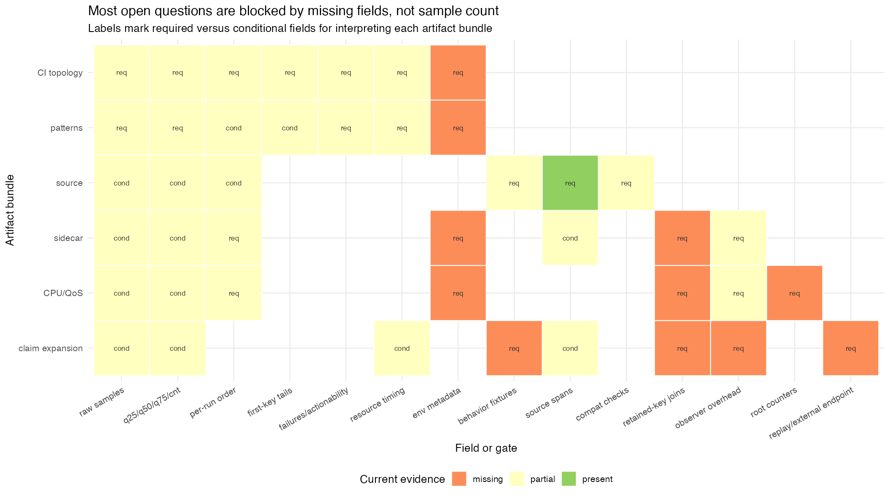

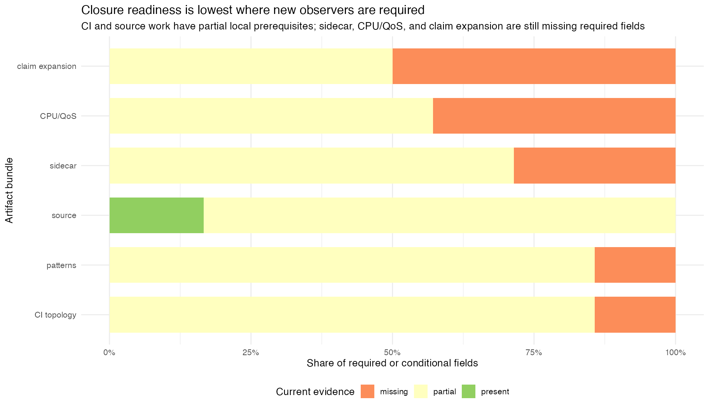

| Artifact | Current readiness | Next missing closure evidence |
| -------- | ----------------- | ----------------------------- |
| Compact CI topology artifact | local raw samples, q summaries, order, first-key slices, failures, and resources are partial proxies | real Performance Tests artifacts with environment metadata and raw retained rows |
| Pattern readiness/resource artifact | local wait/resource probes are partial proxies | source-specific readiness, preview/canvas/actionability counts, fallback logs, and lane metadata |
| Behavior-gated source prototype | source spans are present and behavior/compatibility gates are partial | targeted after-patch source-span collapse plus full public API and behavior fixtures |
| Shared retained-key sidecar | baseline samples and observer controls are only partial | stable retained-key join IDs, clock sync, renderer/command identity, and sidecar overhead checks |
| CPU/QoS counter bundle | latency classes exist, but the mechanism observer is missing | accepted sidecar plus root `powermetrics` or trace counters joined to retained keys |
| Workload/display expansion artifacts | fixed-`x` samples and internal endpoints are only partial controls | replay strata or calibrated external endpoints with behavior/visual assertions and retained-key joins |

The practical consequence is that only two closure lanes can benefit immediately
from more ordinary benchmark samples: CI topology and pattern readiness, and
even those samples must be collected in the right topology with the right
metadata. Selector/source work needs behavior fixtures and source-span collapse
before aggregate timing is interpretable. Runtime, CPU/QoS, display, and
workload claims need new joined observers; more local q50 rows would mainly
reduce noise around the wrong measurement.

The evidence-debt rollup groups the missing and partial cells by the kind of
work that can close them. This is where the answer becomes operational: "collect
more samples" is only correct for sample/topology blockers, and even there the
samples have to come from the decision topology. For the lower-level mechanism
questions, the blocker is not sample count; it is the absence of a retained-key
join, a sidecar overhead control, or a root/system observer.

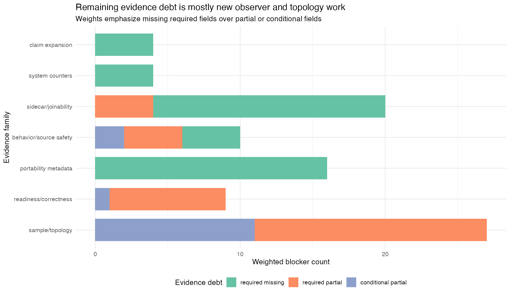

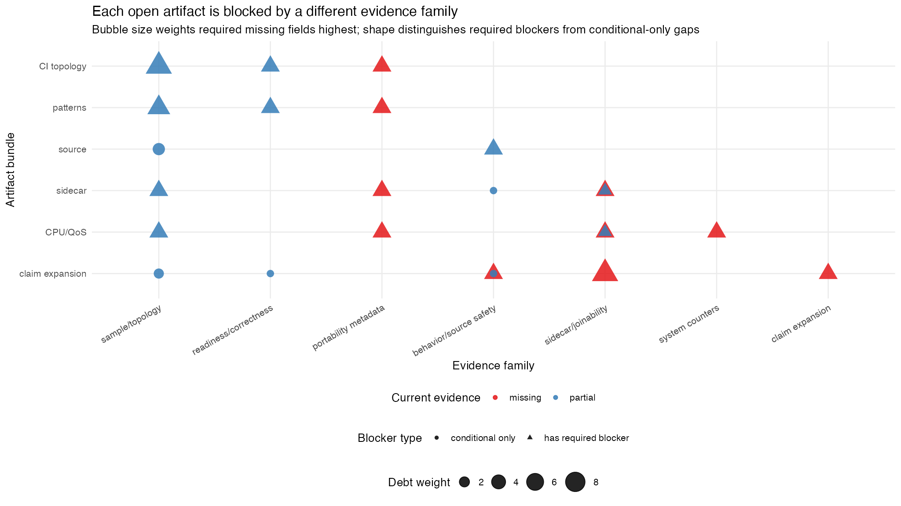

| Evidence family | What it means | Next closure action |
| --------------- | ------------- | ------------------- |
| Sample/topology | local rows are partial controls, not CI or product-lane closure evidence | collect raw retained rows, quartiles, run order, and first-key tails in the target topology |
| Readiness/correctness | waits cannot be removed safely from q50 alone | join failures, actionability retries, resource quiet, and source-specific readiness to metric rows |
| Portability metadata | absolute numbers and thresholds cannot travel without environment context | attach browser, runner, wp-env, CPU/container, and git/WP identifiers |
| Behavior/source safety | source wins are not interpretable until behavior and source-span gates pass | run fixtures and source-span microscopes before citing aggregate p50 |
| Sidecar/joinability | mechanism naming needs a per-retained-key join before counters or traces matter | build the key-window sidecar and prove observer overhead preserves class ordering |
| System counters | CPU/QoS names are blocked on missing root counters | collect `powermetrics` or root trace counters only after sidecar acceptance |
| Claim expansion | fixed-`x` and Chromium-internal endpoints cannot support product/display claims | add replay strata or calibrated external endpoints with retained-key joins |

This narrows the next useful work again. The report can still use local samples
as controls, but the open questions that would change a decision require one of
three concrete artifact families: CI/readiness rows with full metadata, a
behavior-gated source prototype, or a retained-key sidecar. Everything else is a
claim-expansion project, not a prerequisite for explaining the current
benchmark.

The closure-manifest view turns those blocker families into executable
artifacts. Each row has a close condition and an expand condition; without those
predeclared outcomes, another run would be easy to rationalize after the fact.

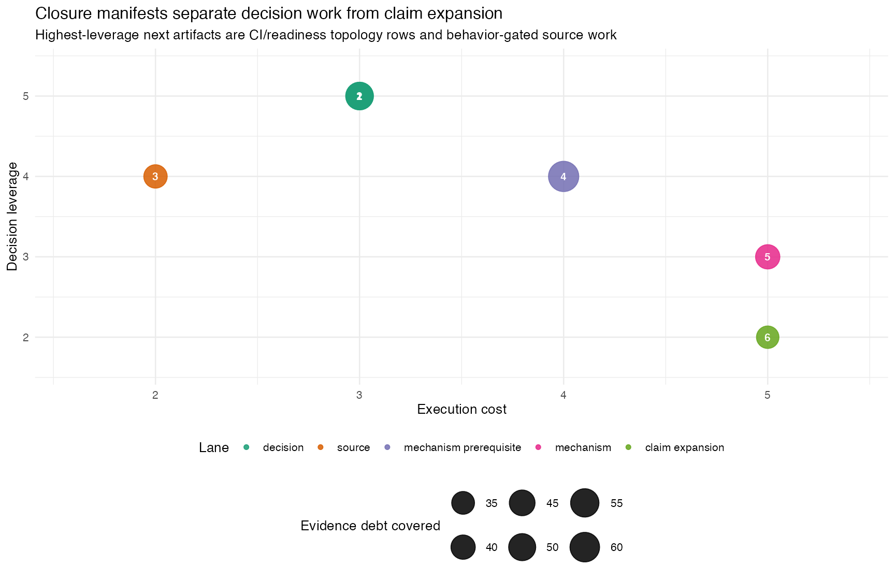

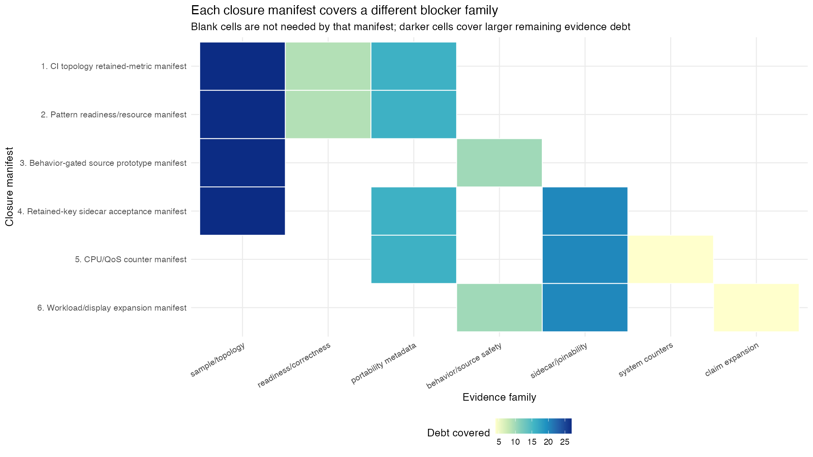

| Closure manifest | Closes only if | Expands if |
| ---------------- | -------------- | ---------- |
| CI topology retained-metric manifest | real Performance Tests topology preserves local ordering, retained counts, failures, first-key tails, and resource placement | ordering changes, retained counts move, first-key tails widen, failures appear, or resources enter the measured window |
| Pattern readiness/resource manifest | source-specific readiness and resource quiet preserve preview/canvas behavior, retained counts, q50 range, and failures across lanes | readiness misses resources, preview/canvas failures move into measurement, or fixed-wait fallback is more reliable |
| Behavior-gated source prototype manifest | behavior and compatibility fixtures pass, source-span fanout collapses, and aggregate timing moves in the same direction | behavior changes, public API compatibility breaks, source spans do not collapse, or timing moves without source evidence |
| Retained-key sidecar acceptance manifest | every retained key joins to sidecar rows and sidecar-on/off controls preserve class ordering, retained counts, and q summaries | join coverage fails, clocks drift, renderer identity is ambiguous, or sidecar collection changes ordering |
| CPU/QoS counter manifest | joined counters separate fast and slow classes while sidecar controls preserve ordering | counters do not separate classes, collection perturbs ordering, or root trace is required but unavailable |
| Workload/display expansion manifest | replay strata or external endpoints preserve the fixed-`x` causal shape and add no observer-ordering reversal | representative strata diverge, external endpoints disagree, assertions fail, or observer collection changes ordering |

This is the current closure protocol. The next action should be chosen by the
claim being made: CI wait changes need the CI topology and pattern-readiness
manifests; source optimization needs the behavior-gated prototype; mechanism
naming needs sidecar acceptance before root counters; product or hardware-display
claims need replay or external endpoints. A run that does not archive the fields
listed in its manifest should not be used to close the question.

The claim-gate ledger is the wording guardrail. It separates what the current
benchmark can already say from the broader CI, source, mechanism, product, and
pass/fail claims that still require a closure manifest.

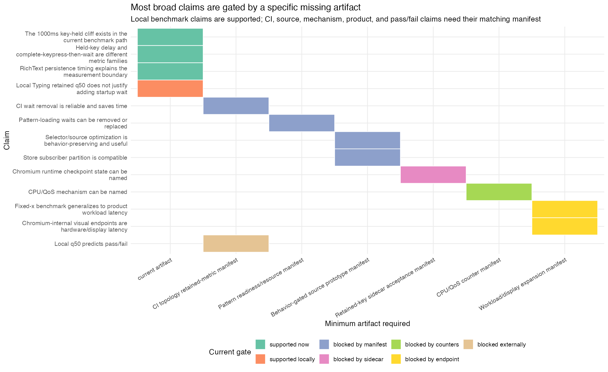

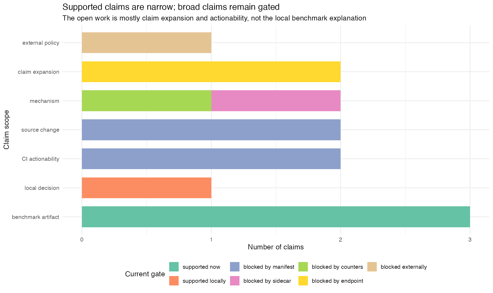

| Claim class | Safe current wording | Blocked wording |
| ----------- | -------------------- | ---------------- |
| Benchmark artifact | the `1000ms` key-held cliff exists in this benchmark path, and held-key delay is a different metric family from complete-keypress-then-wait | the cliff is a product-wide latency rule or a hardware/display mechanism |
| Local decision | local retained Typing q50 does not justify adding a startup wait | local macOS rows prove CI wait removal is safe |
| CI actionability | CI wait or pattern-wait changes need topology/readiness manifests with failures, resources, first-key behavior, and environment metadata | q50 alone proves wait removal is reliable |
| Source change | source optimization claims require behavior fixtures, compatibility fixtures, and source-span collapse before aggregate timing is cited | aggregate p50 or listener-count reduction proves semantic safety |
| Mechanism | runtime or CPU/QoS names require retained-key sidecars and, for CPU/QoS, root counters | aggregate latency rows name V8, scheduler, P-core, frequency, QoS, cache, or runnable-latency causes |
| Claim expansion | product/display claims require replay strata or calibrated external endpoints joined to retained keys | fixed-`x` insertion or Chromium-internal screenshots are representative product or hardware-display latency |
| External policy | pass/fail prediction requires CI artifacts plus the actual dashboard or reviewer threshold policy | repository-local q50 movement is the pass/fail gate |

That makes the remaining open questions less ambiguous. The current report can
make narrow benchmark-artifact claims now. It can make local retained-q50
decisions with local scope. Everything that affects CI policy, source changes,
mechanism naming, product/display scope, or pass/fail prediction has a named gate
and should stay out of the conclusion until that gate passes.

The failure-triage ledger is the next anti-rationalization guard. If one of the
closure manifests fails, the next step is a smaller diagnostic branch, not an
argument that the failed artifact secretly supports the original claim.

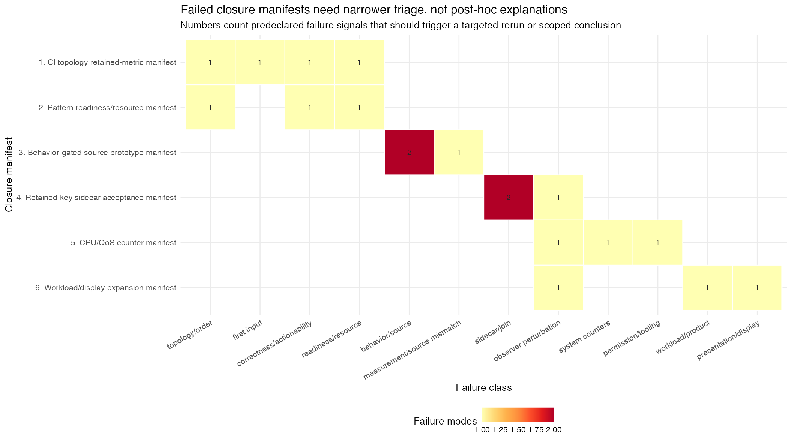

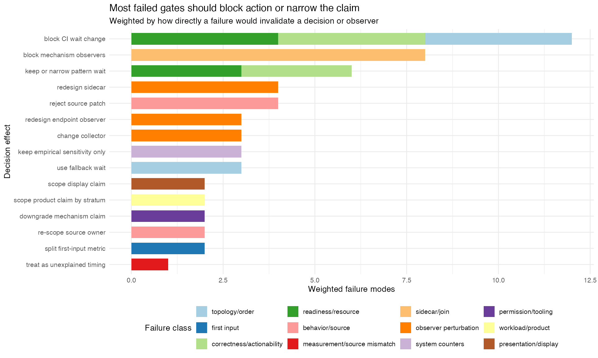

| Failure class | Inspect first | Avoid concluding |
| ------------- | ------------- | ---------------- |
| Topology/order | branch order, runner image, browser revision, CPU/container metadata, wp-env logs | local semantics are wrong before separating topology from metric semantics |
| First input | discarded key, first retained key, startup resources, actionability retries | retained q50 captures idle-return risk |
| Correctness/actionability | Playwright retries, skipped rows, focus/actionability waits, preview/canvas failures | wait time can be traded for hidden failures |
| Readiness/resource | endpoint groups, resource timing, readiness predicate logs, timeout/fallback paths | q50 alone proves wait removal |
| Behavior/source | changed fixture, public filter path, selector dependencies, source-span fanout | p50 or listener-count changes prove semantic safety |
| Sidecar/join | key-window IDs, clock sync, renderer identity, dropped command records | unjoinable sidecar/counter rows can name a mechanism |
| Observer perturbation | observer-on/off q summaries, retained counts, command counts, capture overhead | fields from a perturbing observer are passive evidence |
| System counters | frequency, residency, QoS, runnable latency, cache/memory, power state | aggregate latency classes name a CPU/QoS mechanism |
| Workload/product | stratum, action type, assertions, source spans, per-stratum summaries | fixed-`x` insertion is representative product latency |
| Presentation/display | endpoint timestamp, calibration error, retained-key join, internal screenshot control | Chromium-internal screenshots are hardware-display latency |

This makes a failed run useful without making it ambiguous. CI/topology failures
block CI wait changes until a narrower topology or first-input manifest explains
them. Source failures reject or re-scope the patch before aggregate timing is
used. Sidecar and counter failures block mechanism names. Replay or display
failures narrow product/display claims instead of weakening the benchmark
artifact claim.

The escalation ladder is the execution version of the same rule. Passing a gate
closes only the claim that gate was designed to close. Failing a gate triggers a
narrower artifact or narrows the claim; it does not reopen the local benchmark
artifact unless the measurement trigger itself changes.

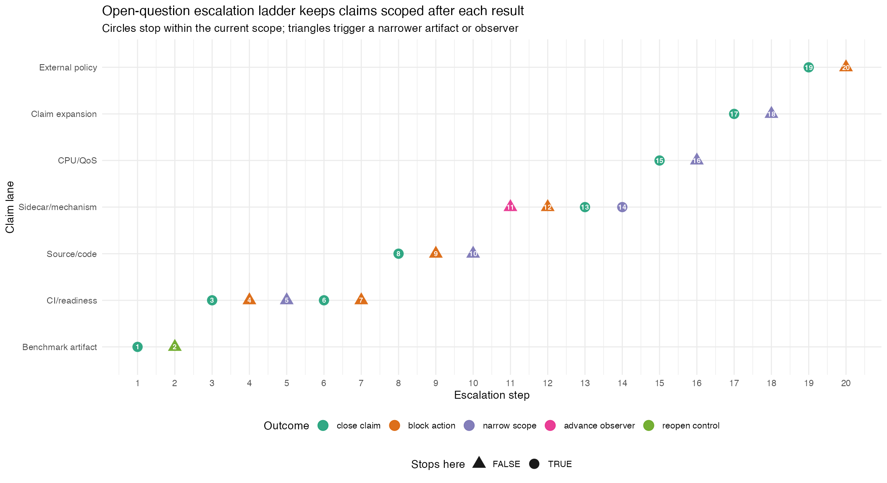

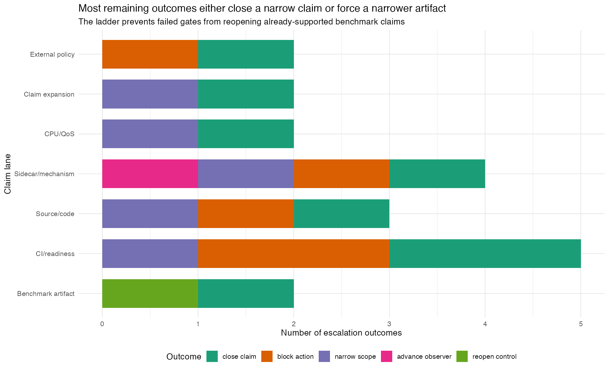

| Lane | Pass result | Fail or mixed result |
| ---- | ----------- | -------------------- |
| Benchmark artifact | state the local key-held cliff and held-key/tap metric distinction | rerun only the changed helper, browser, trace, or statistic control |
| CI/readiness | discuss CI wait policy only within the passing topology/spec/lane | block CI wait changes, split first-input metrics, or keep/narrow pattern waits |
| Source/code | cite source optimization after behavior gates and source-span collapse | reject the patch, re-scope the owner, or treat timing as unexplained |
| Sidecar/mechanism | unlock runtime or CPU/QoS observers after sidecar acceptance | redesign join IDs, clock sync, renderer identity, or observer overhead controls |
| CPU/QoS | name only system fields that separate fast and slow retained-key classes | keep empirical sensitivity only, change collectors, or downgrade mechanism claims |
| Claim expansion | state only the passing product stratum or display endpoint | scope product/display claims and preserve fixed-`x` as a benchmark control |
| External policy | predict pass/fail only under the documented threshold policy | report q50 as an artifact number without pass/fail prediction |

This is the shortest operational answer to the remaining open questions: the
local benchmark explanation is not waiting on every lane. CI policy, source
changes, mechanism names, product/display generalization, and pass/fail
prediction each have their own escalation path. The report should move down only
the path needed for the claim being made.

The gate-quality audit checks the closure system itself. The largest risk is a
false pass: accepting a broad claim because one artifact has a stable q50 or a
single observer, while the fields that make the claim safe are absent. False
failures matter too, but they mostly waste work or narrow a claim; false passes
are how the analysis would overstate the result.

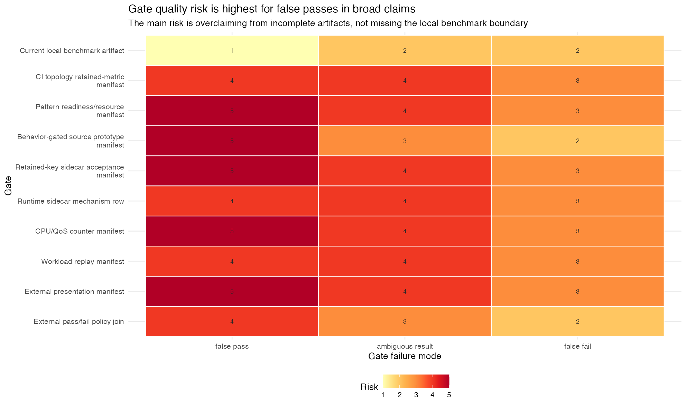

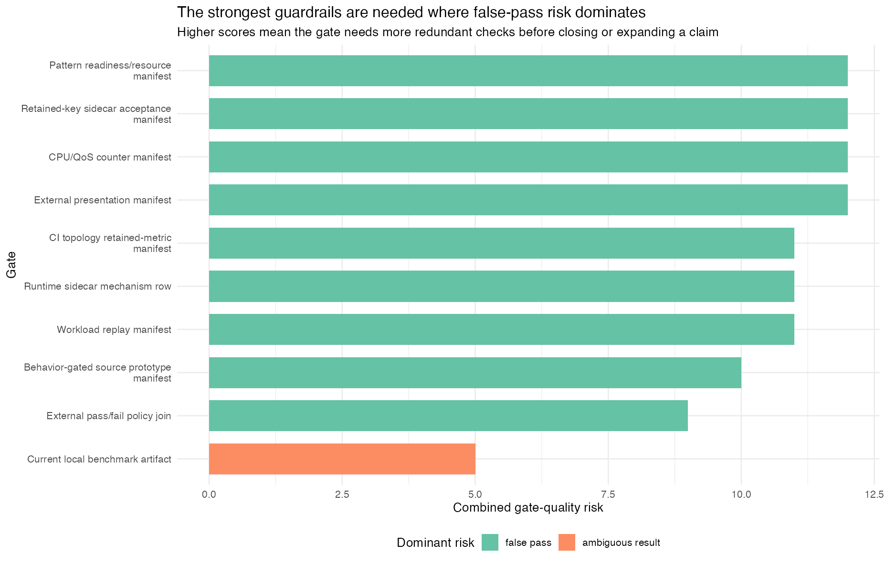

| Gate | Main false-pass risk | Guardrail |
| ---- | -------------------- | --------- |
| CI topology retained metric | q50 is stable while failures, first-key tails, resources, or environment drift regress | require raw rows, failures, resources, first-key tails, branch order, and environment metadata |
| Pattern readiness/resource | a predicate passes q50 while moving preview/canvas or late resources into measurement | split by spec, lane, endpoint group, preview/canvas behavior, timeout, and fallback path |
| Behavior-gated source prototype | timing improves because editor semantics or public data behavior changed | behavior and compatibility fixtures must pass before source spans or aggregate timing are interpreted |
| Retained-key sidecar | unjoinable or perturbing sidecar rows are treated as passive mechanism evidence | require key-window IDs, clock sync, renderer/command identity, join coverage, and sidecar-on/off controls |
| Runtime or CPU/QoS mechanism | aggregate latency classes are named as V8, scheduler, frequency, QoS, cache, or runnable-latency causes | name only fields joined to retained keys that separate classes without changing ordering |
| Workload or presentation expansion | fixed-`x` or Chromium-internal endpoints are generalized to product or hardware/display latency | require replay strata or calibrated external endpoints joined to retained keys |
| External pass/fail policy | q50 movement is treated as a repository or dashboard gate without the policy | separate artifact production from threshold/reviewer policy |

This adds one more constraint on future work: a gate is not allowed to close a
claim unless its own false-pass guardrail is satisfied. If the guardrail is
missing, the result can still be useful as a diagnostic, but it should be routed
through the failure-triage or escalation ladder instead of being promoted into a
conclusion.

The decision-binding audit asks a stricter question: what recommendation is an
open question allowed to move? This matters because "still open" is not one
bucket. Some unknowns can change a CI wait or source patch recommendation; other
unknowns only block broader wording, such as naming a CPU/QoS mechanism,
claiming product-wide workload coverage, or claiming hardware-display timing.

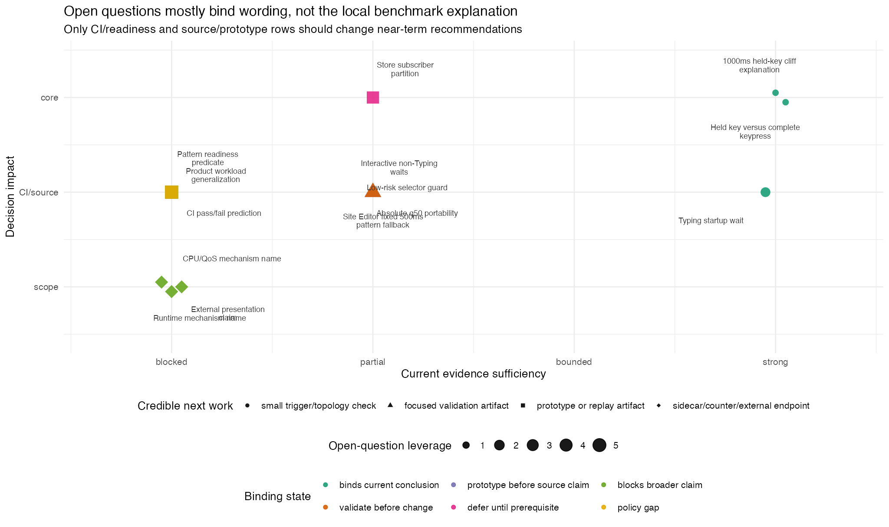

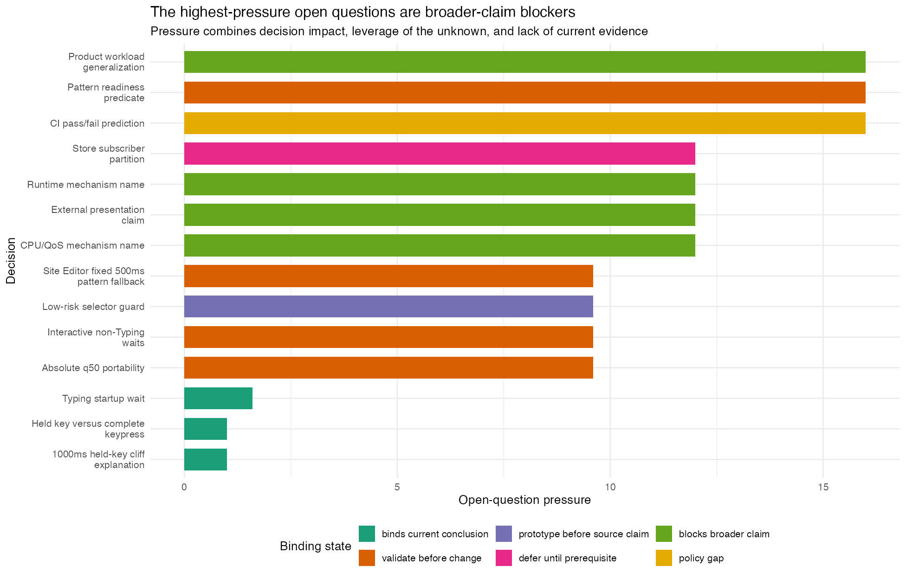

| Decision row | Binding result |
| ------------ | -------------- |
| `1000ms` held-key cliff and held-key/tap distinction | binds the current benchmark conclusion; reopen only after a helper, browser, trace-placement, throwaway-policy, or statistic trigger changes |
| Typing startup wait | binds the local retained-q50 recommendation: do not add a Typing startup wait under the current metric; CI topology can still affect wait-removal actionability |
| Interactive non-Typing waits, Site Editor fixed `500ms`, and pattern-readiness predicate | remain real near-term CI/readiness questions; local q50 is a candidate signal, not shipping evidence |
| Low-risk selector guard and store subscriber partition | can change source recommendations only after behavior fixtures, compatibility checks, and source-span collapse |
| Runtime, CPU/QoS, display, and product-workload mechanism claims | block broader claims, but do not reopen the local benchmark-artifact explanation |
| Absolute q50 portability and CI pass/fail prediction | require real Performance Tests artifacts and the external/dashboard/reviewer policy before q50 movement becomes a pass/fail prediction |

That changes the practical ordering of any remaining work. The high-pressure
rows are not "the current explanation is weak"; they are "do not expand the
claim without the missing artifact." The only rows that should alter near-term
engineering recommendations are CI/readiness validation and behavior-gated
source prototypes. More mechanism, display, or workload work is valuable only if
the report wants to make those broader claims.

The reopen-trigger audit is the staleness version of the same rule. It asks what
future change would make the current analysis stale enough to rerun. The answer
is deliberately asymmetric: closed local benchmark claims have narrow triggers,
while broader CI/source/mechanism/product/display claims have wider trigger
surfaces because they are waiting for new artifacts.

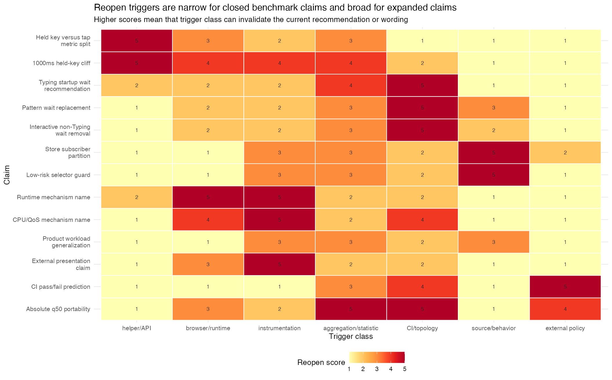

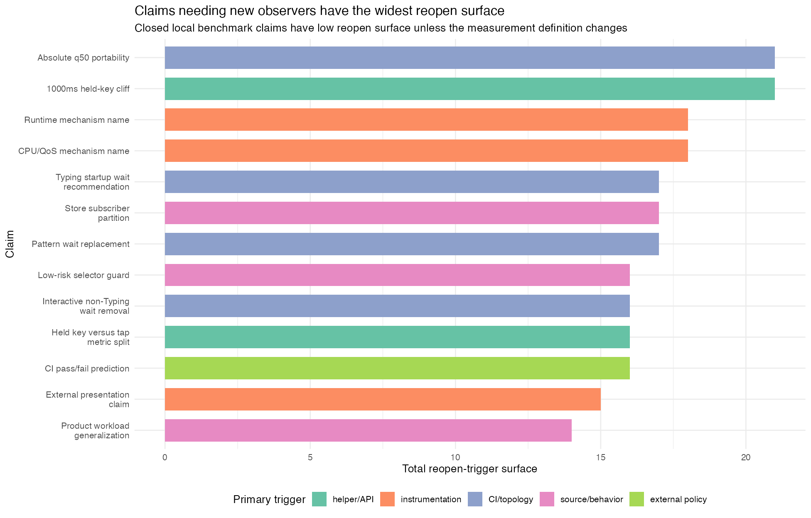

| Claim | Reopen trigger | Do not reopen for |
| ----- | -------------- | ----------------- |
| `1000ms` held-key cliff | helper family, browser/runtime, trace placement, throwaway policy, or reported statistic changes | more local samples under unchanged helper/browser/statistic settings |
| Held-key versus tap split | the suite changes helper family or key action semantics | lower-level mechanism uncertainty below the already observed helper behavior |
| Typing startup wait | CI topology changes retained ordering, first-key tails, failures, or resource timing | the discarded first key being slow while the reported metric remains retained q50 |
| Wait-removal candidates | target CI/mac/container lanes lose samples or move failures/resources into measurement | local zero-wait q50 alone |
| Source prototypes | behavior fixtures, compatibility checks, or source-span collapse fail | aggregate p50 movement before source and behavior gates pass |
| Runtime and CPU/QoS mechanism names | sidecar/counter collection fails to join retained keys or perturbs ordering | more JS delay rows without joined runtime or system state |
| Product/display/generalization claims | replay strata or external endpoints disagree, fail assertions, or cannot be joined | fixed-`x` rows or Chromium-internal endpoints alone |
| Pass/fail prediction | dashboard or reviewer policy defines thresholds or noisy-metric handling | repository-local q50 display without threshold policy |

This is the guard against analysis churn. A future browser or helper update can
absolutely require a small exact-spec recheck of the benchmark artifact. But
mechanism, workload, display, and policy unknowns should not reopen the local
cliff explanation; they should only block or narrow claims that depend on those
missing observers.

The outcome-decision matrix is the last anti-rationalization guard for this set
of open questions. It defines what a pass, fail, or mixed result means before the
next artifact is collected. That matters because the highest-pressure rows are
also the easiest to over-interpret: store partition, pass/fail policy, product
workload, and pattern readiness can all produce partial evidence that would be
tempting to call a weak pass.

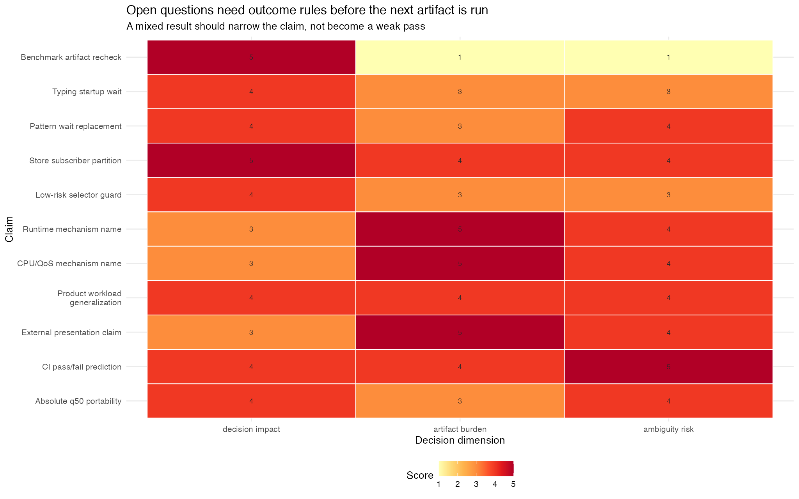

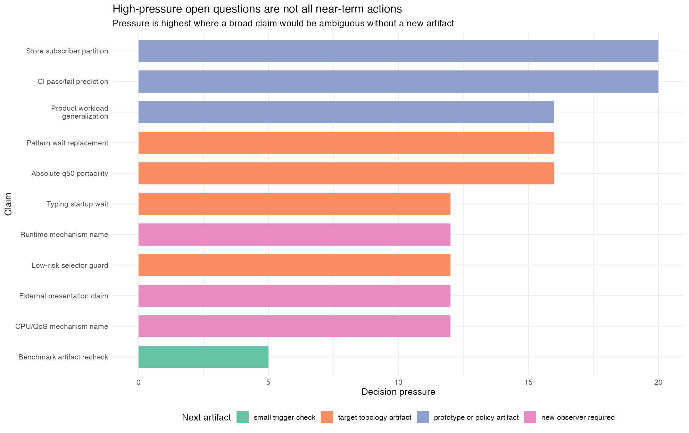

| Claim | Pass means | Fail means | Mixed means |
| ----- | ---------- | ---------- | ----------- |
| Benchmark artifact recheck | keep the local held-key cliff and held-key/tap metric split | reopen only the changed measurement trigger | split by helper, browser, trace placement, throwaway policy, or statistic |
| Typing startup wait | do not add a startup wait for retained q50 | block wait removal or split first-input from retained q50 | keep the policy only for passing lanes and report first-input separately |
| Pattern wait replacement | reduce or replace the wait only for the passing spec/lane/fallback policy | keep the current wait or fixed fallback for the failing lane | split Site Editor, Post Editor, predicate, and fixed-sleep claims |
| Source prototypes | cite a source optimization only after behavior, source-span, and aggregate gates pass | reject or re-scope the patch before citing aggregate timing | ship or discuss only the owner whose gates passed |
| Runtime and CPU/QoS mechanism names | name only the joined runtime/counter field that separates retained-key classes | keep the result empirical | name the passing field and leave the rest unresolved |
| Product/display claims | widen only to passing strata or external endpoints | keep fixed-`x` or Chromium-internal wording | state the deepest passing stratum or endpoint |
| CI pass/fail prediction | predict pass/fail only under documented policy | report q50 movement as evidence but not a gate | separate repository artifact production from external dashboard/reviewer policy |

This turns the remaining open questions into predeclared decision rules. A mixed
artifact should narrow the scope of the claim, not become a compromise
conclusion. A failed mechanism or display artifact should not weaken the local
benchmark result; it only blocks the broader mechanism or display wording.

The assumption ledger is the dependency version of the same audit. It lists the
assumptions that would have to be false for each conclusion to change. This
separates stable benchmark assumptions from fragile assumptions that exist only
when the report widens to CI policy, source changes, mechanism names, product
workloads, display timing, or pass/fail prediction.

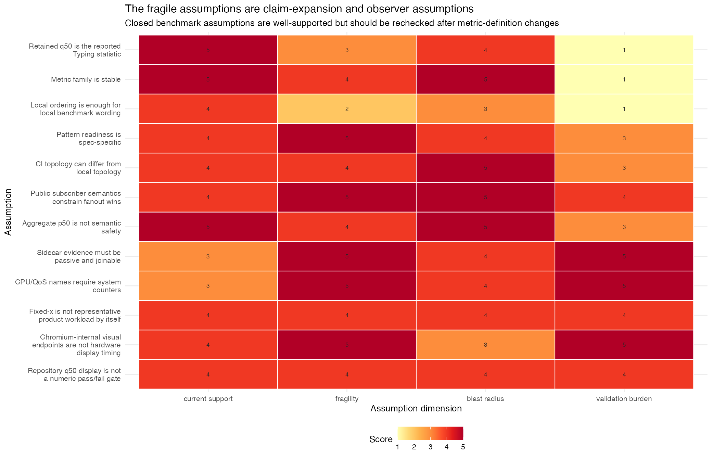

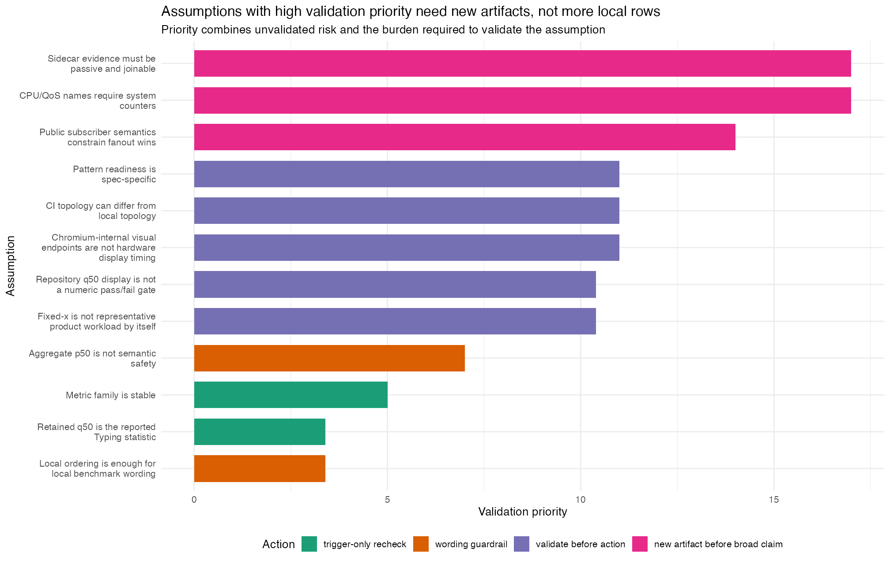

| Assumption | Current action | Invalidating observation |
| ---------- | -------------- | ------------------------ |
| Metric family is stable | trigger-only recheck | helper family, browser/runtime, trace placement, throwaway policy, or reported statistic changes remove the held-key/tap split |
| Retained q50 is the reported Typing statistic | trigger-only recheck | the suite changes throwaway policy, retained count, aggregation, or printed/uploaded statistic |
| CI topology can differ from local topology | validate before action | real Performance Tests topology reverses ordering, widens variance, changes first-key tails, or moves failures/resources into measurement |
| Pattern readiness is spec-specific | validate before action | the predicate passes q50 while missing preview/canvas readiness or shifting resources into measurement |
| Aggregate p50 is not semantic safety | wording guardrail | a source patch changes behavior or compatibility while improving timing |
| Public subscriber semantics constrain fanout wins | new artifact before broad claim | public or external subscribers miss a transition, observe stale state, or lose documented notification semantics |
| Sidecar evidence must be passive and joinable | new artifact before broad claim | sidecar rows cannot join every retained key or sidecar-on/off changes ordering, counts, or q summaries |
| CPU/QoS names require system counters | new artifact before broad claim | root counters fail to separate fast/slow retained classes or perturb ordering |
| Fixed-`x` is not representative product workload by itself | validate before action | replay strata show different owners, effects, failures, or regressions from fixed-`x` insertion |
| Chromium-internal visual endpoints are not hardware display timing | validate before action | external OCR, present, or camera endpoints disagree or cannot be joined without perturbing ordering |
| Repository q50 display is not a numeric pass/fail gate | validate before action | dashboard or reviewer policy defines thresholds, noisy-metric handling, or pass/fail interpretation |

The important result is that the assumptions behind the local benchmark
conclusion are highly supported but definition-sensitive. They need small
trigger rechecks when the metric definition changes. The assumptions with the
highest validation priority are not local benchmark assumptions; they are
observer, API-compatibility, system-counter, topology, workload, display, and
policy assumptions. Those require new artifacts before broadening the claim.

The action-risk audit asks the operational version of the question: if evidence
is incomplete, is it worse to act now or worse to wait? Most rows are asymmetric.
Acting early can create stale UI, hidden readiness failures, false mechanism
names, product overgeneralization, or undocumented pass/fail claims. Waiting is
usually cheap except for CI wait-removal rows, where every unchanged run keeps
paying runtime.

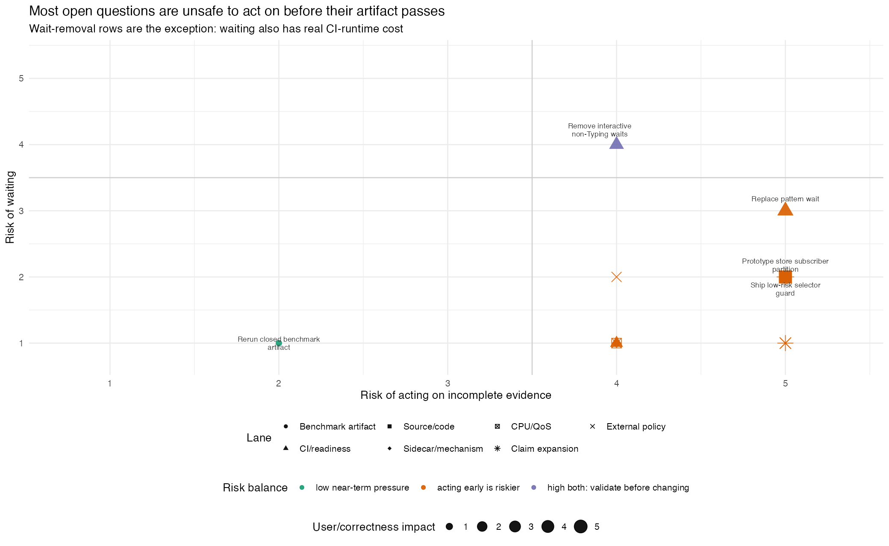

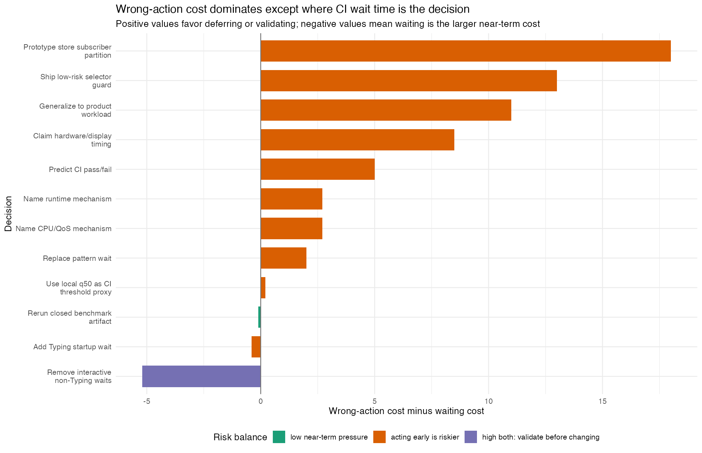

| Decision | Default | Why |
| -------- | ------- | --- |
| Closed benchmark artifact | do not rerun without a metric-definition trigger | more unchanged local rows mostly add churn |
| Typing startup wait | do not add a wait | it slows CI while retained q50 still does not measure first-input latency |
| Interactive non-Typing waits | validate before changing | waiting costs CI time, but acting early can hide failures or move resources into measurement |
| Pattern wait replacement | validate before changing | acting early can move preview/canvas or resource work into the measured interval |
| Low-risk selector guard | prototype behind behavior gates | p50 wins are not semantic safety |
| Store subscriber partition | defer until prerequisite | the wrong change can break public subscriber or persistence-selector semantics |
| Runtime and CPU/QoS mechanism names | keep empirical until sidecar/counters pass | naming mechanisms from aggregate rows is the main false-action risk |
| Product/display claims | keep fixed-`x` and Chromium-internal wording | broader wording needs replay or external endpoint evidence |
| Absolute q50 and pass/fail policy | keep local scope and do not predict pass/fail | local q50 is not a CI threshold or dashboard policy |

This is the near-term decision rule. The only open-question row where waiting is
itself a large cost is wait removal, and even there the answer is validation, not
blind removal. Everywhere else, acting on incomplete evidence is more expensive
than preserving narrow wording until the required artifact exists.

The conflict-resolution audit handles the remaining failure mode: two artifacts
can both be true while supporting different claims. The rule is not to average
them. The artifact closest to the claim wins, and the losing artifact becomes a
scope limiter or control.

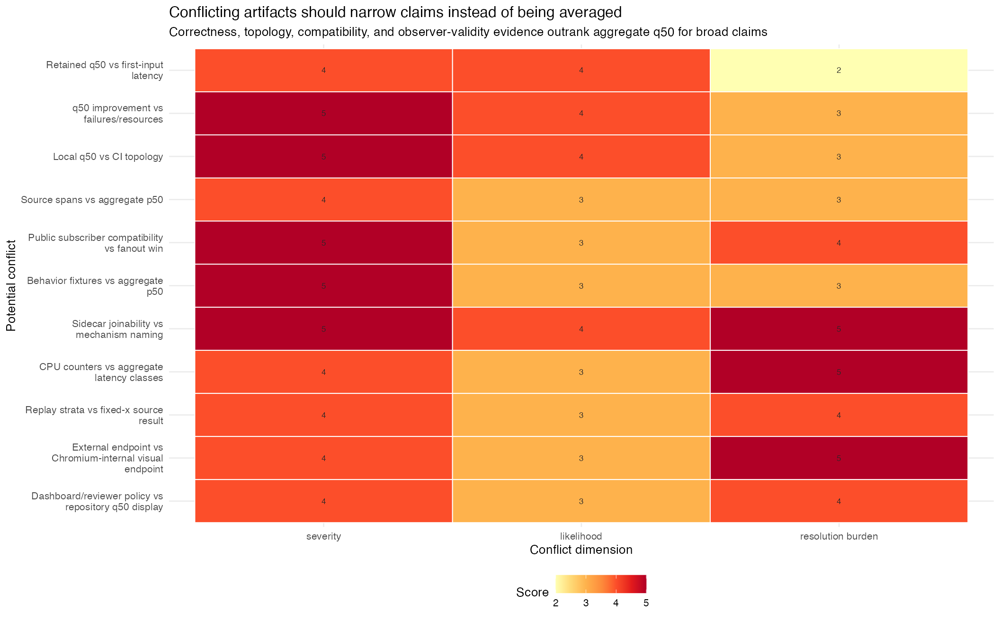

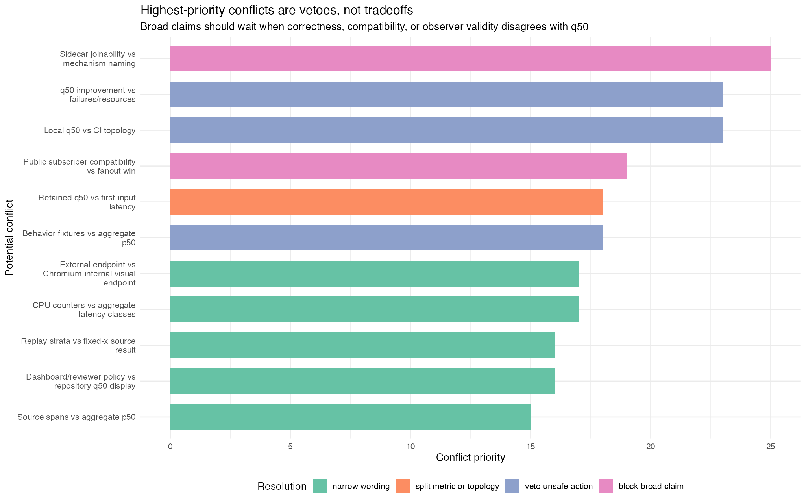

| Conflict | Resolution rule |
| -------- | --------------- |
| Local q50 disagrees with CI topology | CI policy follows the target-topology artifact; local rows remain local controls |
| q50 improves while failures/resources worsen | correctness and readiness fields veto wait-removal claims |
| retained q50 disagrees with first-input latency | split retained typing and idle-input metrics |
| behavior fixtures disagree with aggregate p50 | behavior fixtures reject or re-scope source patches before timing is cited |
| source spans disagree with aggregate p50 | source-span evidence gates causal/source claims; aggregate-only movement stays unexplained |
| public subscriber compatibility disagrees with fanout wins | public API compatibility vetoes data-layer fanout changes |
| sidecar joinability disagrees with mechanism naming | mechanism names require passive joined sidecar evidence |
| CPU counters disagree with aggregate latency classes | system names require counters that separate classes without perturbation |
| replay or external endpoints disagree with fixed-`x` / internal endpoints | product/display wording narrows to the deepest passing stratum or endpoint |
| dashboard policy disagrees with repository q50 display | policy wins for pass/fail claims; repository q50 remains evidence production |

This closes another loophole in the open-question story. A disagreement is not a
reason to reopen the local benchmark result by default. It is a reason to choose
the artifact that actually measures the claim being made and narrow the wording
to the passing artifact.

The falsification matrix makes the remaining stop conditions explicit. For each
claim, it names the observation that would force a retraction or narrower claim,
the negative control that should catch that observation, and the response if the
control fails.

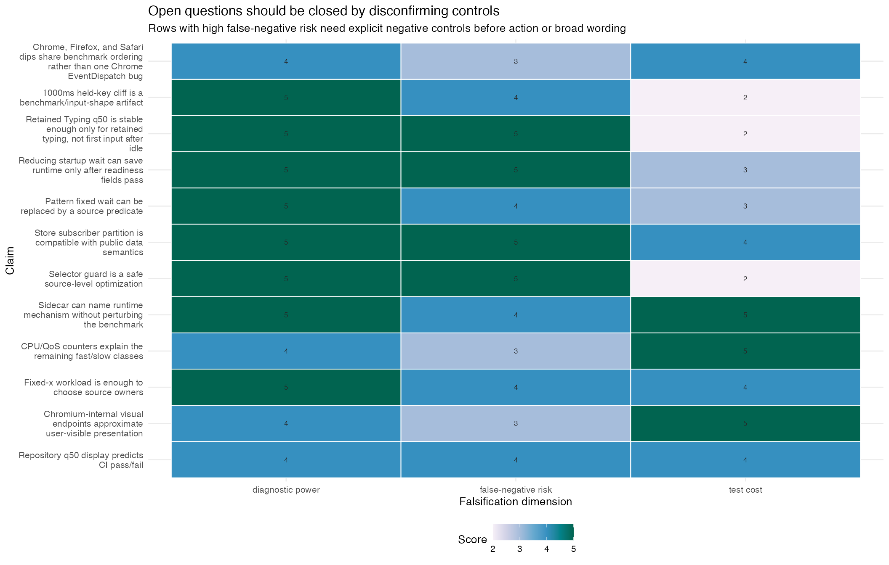

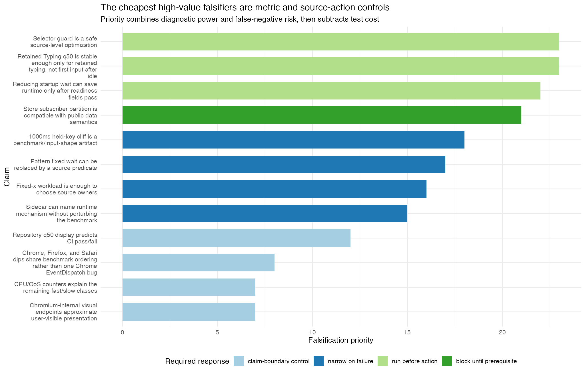

| Claim | Falsifying observation | Required response |
| ----- | ---------------------- | ----------------- |
| Retained Typing q50 is stable enough only for retained typing | first retained or first undiscarded key remains wait-sensitive while aggregate q50 is flat | run before action; add or rename an idle-input metric |
| Startup wait can be reduced | q50 improves while failures, retries, resources, preview, canvas, or first-key tails regress | run before action; block wait reduction until readiness passes |
| Selector guard is safe | behavior fixtures fail or source spans do not collapse even when p50 moves | run before action; do not cite aggregate timing |
| Store subscriber partition is compatible | public subscribe order, dynamic dependency, or persistence selector semantics change | block until prerequisite; keep only compatible private-side-channel work |
| `1000ms` held-key cliff is an input-shape artifact | tap-then-wait or short-hold controls reproduce the same cliff after matching state and retained-key filtering | narrow input-shape wording and rerun cross-browser controls |
| Pattern wait can be replaced by a predicate | predicate fires before patterns, previews, canvas, or resources are stable | keep fixed fallback or add resource-quiet guard |
| Fixed-`x` workload chooses source owners | replay strata show different owners, opposite effects, or behavior failures | narrow source claims to the strata that reproduce the effect |
| Runtime or CPU/QoS mechanism can be named | sidecar or root counters perturb ordering, fail to join, or fail to separate classes | keep empirical wording |
| External display or CI policy claims can be made | external endpoints or dashboard/reviewer policy disagree with internal q50 artifacts | keep Chromium-internal or repository-artifact wording only |

This is the practical test for more analysis. The next additional runs should be
negative controls, not larger versions of already closed local sweeps. The rows
that can still change near-term action are the metric split, startup-readiness
wait removal, selector behavior gates, and subscriber compatibility. Runtime,
CPU/QoS, display, workload, and policy rows mostly control wording unless the
claim is intentionally expanded beyond the current benchmark artifact.

The marginal-evidence audit asks whether more samples of the same harness would
answer any of the remaining questions. In most cases, the answer is no: the
open item is not sampling error in the existing local run, but a missing control,
topology, semantic fixture, sidecar join, or external policy/end-point artifact.

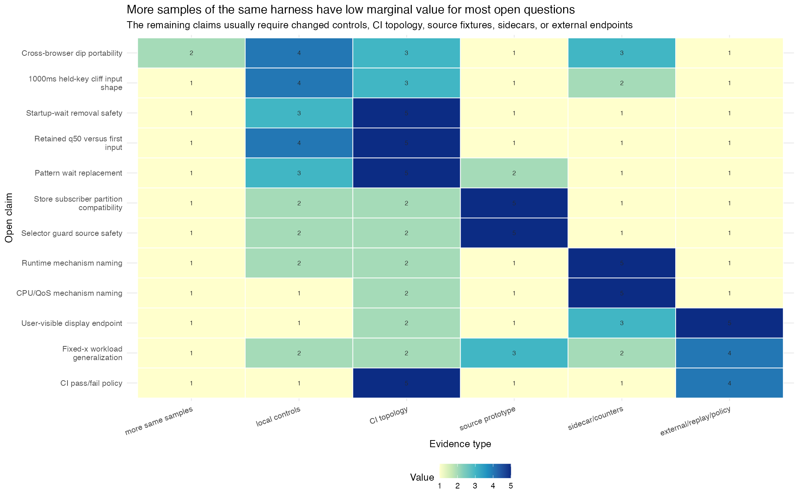

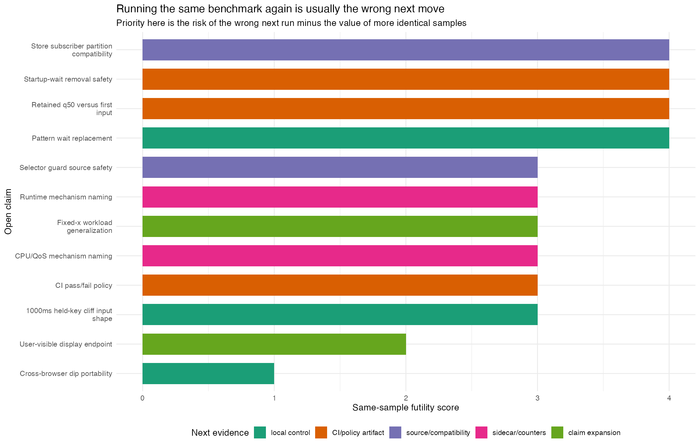

| Open claim | Highest-value next evidence | Why more same-harness samples are not decisive |
| ---------- | --------------------------- | ---------------------------------------------- |
| `1000ms` held-key cliff input shape | paired tap, short-hold, and held-key controls under matched state | the dense held-key sweep already established the cliff shape |
| retained q50 versus first input | per-keypress distributions in CI-comparable topology | retained aggregates can hide first-input behavior |
| startup-wait removal safety | real Performance Tests topology with failures, retries, resources, first keys, and retained rows | local latency rows cannot prove actionability or hidden resource movement |
| pattern wait replacement | predicate versus fixed-wait artifact with resource quiet | old fixed-wait rows do not test whether a predicate fires at the right boundary |
| selector guard source safety | behavior fixtures plus source-span microscope | aggregate p50 cannot prove behavior preservation |
| store subscriber partition compatibility | public subscriber and persistence-selector compatibility matrix | timing rows cannot prove public data-layer semantics |
| runtime and CPU/QoS mechanism naming | passive retained-key sidecar, then counters only after ordering is preserved | aggregate latency classes cannot name runtime or OS mechanisms |
| fixed-`x`, display, and pass/fail generalization | replay strata, calibrated external endpoints, or dashboard/reviewer policy | more local q50 rows only strengthen the narrow artifact, not the broader claim |

This is why I did not run another bulk sample sweep for this pass. It would
mostly tighten already-closed local estimates while leaving the open decision
variables unchanged. The next useful runs are targeted controls or artifacts:
CI topology and per-keypress distributions for wait decisions, behavior and
compatibility fixtures for source changes, sidecars for mechanism names, and
external/replay/policy joins only if the report intentionally broadens its claim.

The experiment-budget audit turns that into an execution frontier. The important
distinction is not "more samples versus fewer samples"; it is whether the
artifact has high decision leverage without high observer risk, environment
burden, or claim-expansion scope.

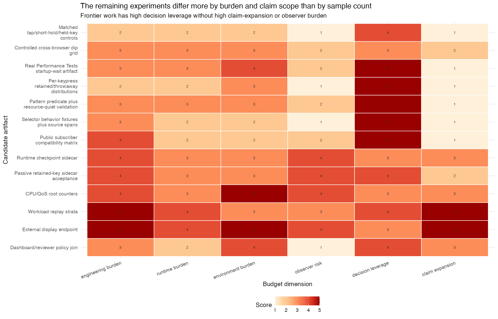

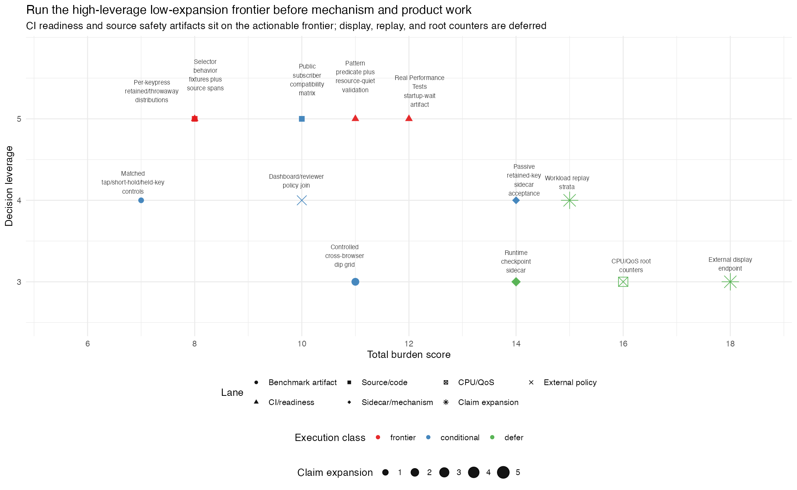

| Execution class | Artifacts | Stop or defer rule |
| --------------- | --------- | ------------------ |
| Frontier: run next | per-keypress retained/throwaway distributions; real Performance Tests startup-wait artifact; pattern predicate plus resource-quiet validation; selector behavior fixtures plus source spans | stop as soon as q50, failures, resources, retries, first-key tails, behavior fixtures, or source spans fail the gate |
| Conditional | matched tap/short-hold/held-key controls; controlled cross-browser grid; public subscriber compatibility matrix; passive retained-key sidecar acceptance; dashboard/reviewer policy join | run only if wording changes, portability is disputed, selector guards pass, mechanism naming is still needed, or CI policy claims are being made |
| Deferred | runtime checkpoint sidecar; CPU/QoS root counters; workload replay strata; external display endpoint | defer until the claim explicitly widens to runtime/OS mechanism, product workload, or physical display timing |

This is the current budget-aware answer to what remains open. The actionable
frontier is CI/readiness plus source safety. Mechanism and product/display work
is not wrong, but it is expensive and should not be used to delay the narrower
benchmark conclusions unless the report intentionally makes those broader claims.

The pre-registration audit covers the last major analysis risk: after a targeted
artifact exists, it is still easy to change the metric, inclusion rule, endpoint,
or wording after seeing the data. The protocol rows below lock the primary
question, primary metric, inclusion rule, required controls, stop rule, and
forbidden interpretation before each run.

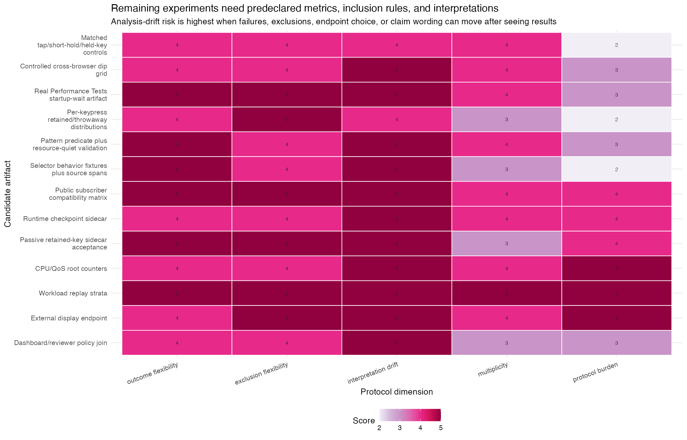

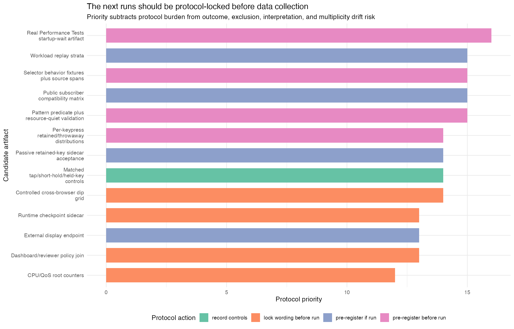

| Artifact class | Lock before data collection | Do not do after seeing results |
| -------------- | --------------------------- | ------------------------------- |
| CI/readiness frontier | generated-key inclusion, first-key labels, failure/retry/resource retention, and the exact q50 plus non-q50 pass gate | accept a q50 improvement while dropping failures, retries, resources, or first-key tails |
| Source/code frontier | behavior fixtures first, targeted source-span owner, source-span collapse rule, and aggregate p50 as secondary | call aggregate p50 a safe source optimization |
| Input-shape and browser controls | key mode, startup state, persistence markers, retained-key rule, browser revision, and browser-specific wording | generalize a held-key-only result to typing or name a one-browser mechanism |
| Sidecar, runtime, and CPU/QoS work | observer-off baseline, join coverage, clock-sync limits, class-order preservation, and root-counter escalation rule | name runtime or OS mechanisms from an observer that perturbs ordering |
| Workload, display, and policy expansion | replay strata, assertions, endpoint calibration, dropped-frame/join flags, and dashboard/reviewer decision join | average missing strata, call internal screenshots physical display latency, or treat printed q50 as pass/fail policy |

This means the next runs should be protocol-locked, not just targeted. If a row
is worth running, it is worth deciding in advance which rows count, which endpoint
is primary, which failures stay in the dataset, and what result stops the claim.

The handoff contract is the operational version of the protocol. A next run is
not complete just because it prints a q50 or a pass/fail line. It has to leave
behind the raw rows, metadata, controls, joins, and decision rule needed by the
next reader to recompute the result and see why the conclusion follows.

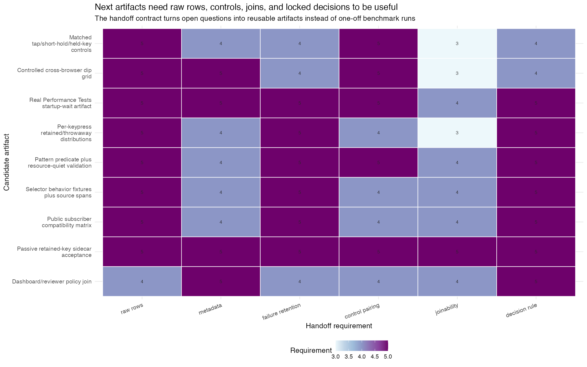

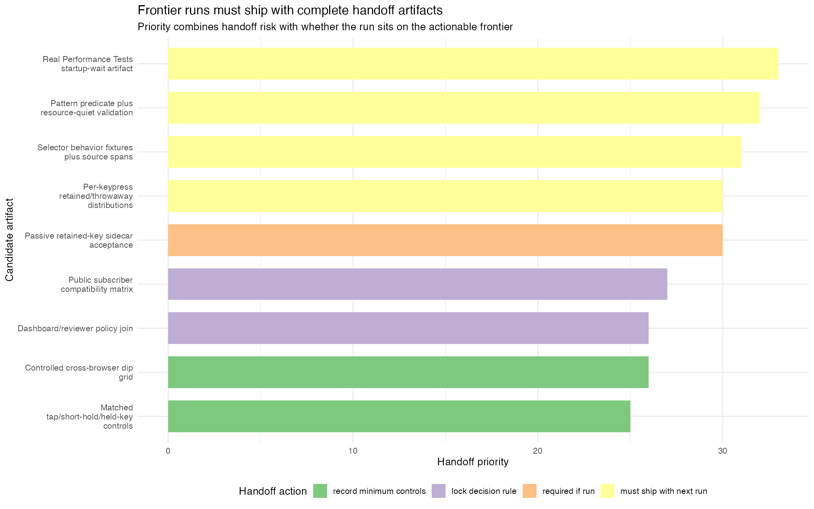

| Handoff target | Must ship with the run | Ambiguous-result rule |
| -------------- | ---------------------- | --------------------- |
| Per-keypress distributions | every generated key, throwaway flag, first-retained/later-retained labels, failures, retries, missing keys, run metadata, and retained aggregate | if aggregate q50 and per-key rows disagree, split the metric rather than averaging the disagreement away |
| Startup-wait artifact | raw retained rows, failures, retries, resources, first-key tails, run order, and environment metadata for each wait arm | readiness fields veto a q50 win |
| Pattern predicate validation | predicate fire times, fixed-wait controls, resource quiet, preview/canvas checks, failures, and retained rows | predicate-only and predicate-plus-resource-quiet arms must be reported separately |
| Selector source-safety run | behavior fixture results, source-span rows for the targeted owner, owner span count/time, and aggregate p50 as secondary | aggregate p50 only explains residual impact after behavior and source-span gates pass |
| Compatibility, sidecar, and policy joins | compatibility fixtures, observer-off/on joins, clock sync, dashboard/reviewer decisions, and the locked decision rule | private-side-channel, sidecar, or q50 wins do not imply public compatibility, passive observation, or pass/fail policy |

This closes another practical loophole in the open-question plan. The frontier
artifacts must be complete enough to be consumed by someone who did not run them.
Otherwise they become another ambiguous benchmark run instead of evidence that
can close or narrow an open question.

The proof-chain audit is the anti-overclaim version of the same plan. It splits
each important remaining claim into direct observations, allowed inferences,
blocked inferences, and the evidence required if the wording expands. This is
where the earlier timer-work explanation gets corrected: the current evidence
supports persistence timing as an ordering marker for the held-key transition;
it does not prove that the timer callback makes the next key faster by doing
work that would otherwise be charged to that key.

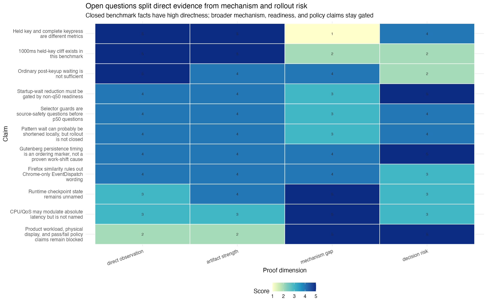

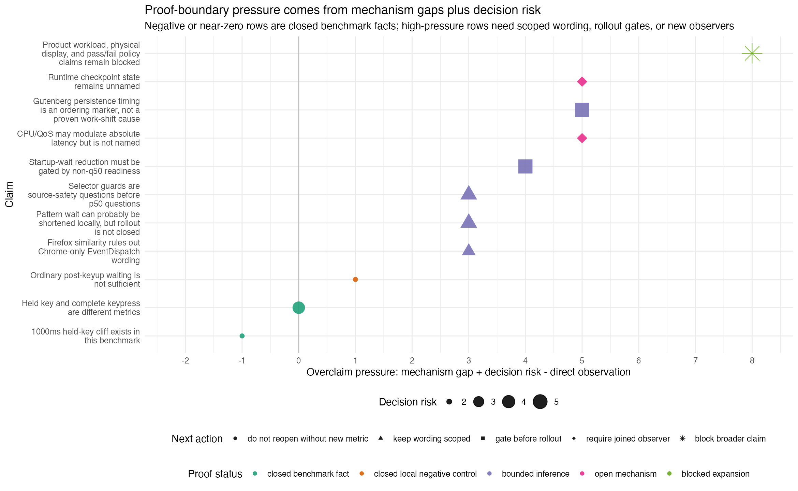

| Claim | Current proof boundary | Blocked overclaim |
| ----- | ---------------------- | ----------------- |
| `1000ms` held-key cliff | closed benchmark fact: dense held-key sweeps show the latency drop around the rich-text persistence interval | generic user typing gets faster at `1000ms` |
| Held key versus complete keypress | closed benchmark fact: matched rows show these are different metrics | delay-between-characters, tap, key hold, and complete-keypress helpers are interchangeable |
| Firefox similarity | bounded inference: Chrome-only `EventDispatch` wording is too narrow | Firefox and Chromium necessarily share the same lower-level mechanism |
| Gutenberg persistence timing | bounded inference: persistence markers align with the transition and simple store-work explanations are rejected | the timer callback is proven to move work out of the next-key measurement slice |
| Runtime and CPU/QoS mechanisms | open mechanism: local controls bound the layer but do not name it | the current artifact proves V8, compositor, frequency, QoS, cache, or scheduler causality |
| Startup, pattern, selector, product, display, and policy claims | rollout or claim-expansion gates: q50 is secondary to readiness, behavior fixtures, external endpoints, or policy joins | a lower q50 alone proves CI can remove waits, source patches are safe, display latency changed, or pass/fail policy moved |

That is the current answer to the open-question loop. Some facts are now closed
inside the benchmark: the held-key cliff exists, held key and complete keypress
are different workloads, and ordinary post-keyup waiting is not sufficient. The
still-open pieces are not excuses to keep inventing mechanisms. They are claim
boundaries: name a runtime/OS mechanism only after joined observers, reduce CI
waits only after readiness gates, and broaden to product/display/pass-fail claims
only after those endpoints are actually measured.

The theory triage turns that into a more direct answer. Each row is a candidate
explanation that came up during the benchmark investigation, scored by support,
falsification, residual uncertainty, decision impact, and overclaim risk.

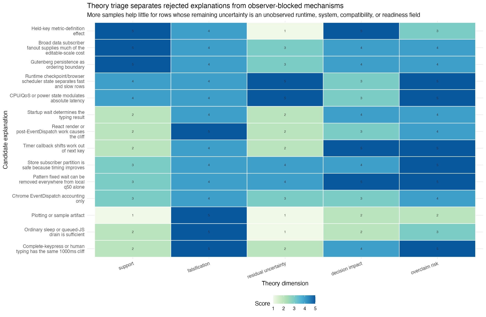

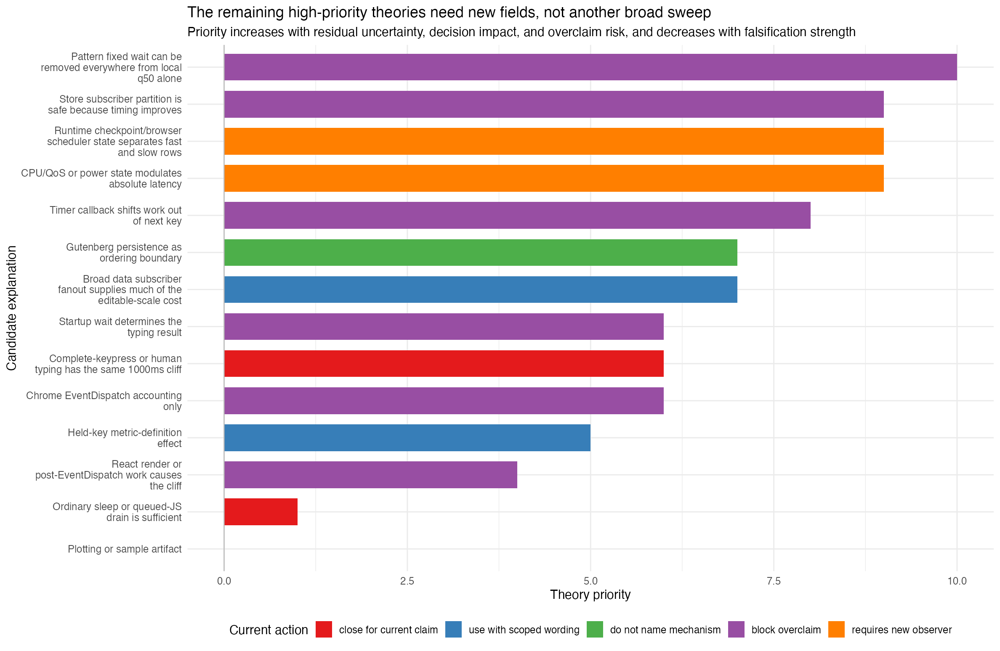

| Candidate explanation | Current disposition | What remains |
| --------------------- | ------------------- | ------------ |
| Plotting or sample artifact | rejected | no current follow-up unless a helper or browser revision changes the row ordering |
| Held-key metric-definition effect | supported | keep the claim scoped to held-key benchmark semantics; rerun only if CI changes helper family |
| Gutenberg persistence as ordering boundary | bounded | persistence timing marks the transition, but does not name the lower-level browser/runtime/system mechanism |
| Timer callback shifts work out of the next key | rejected wording | would need a joined task trace proving callback work, next-key work, and counterfactual placement |
| Chrome `EventDispatch` accounting only | rejected wording | Firefox makes Chrome-only wording too narrow; Chrome remains the threshold lane, not the whole explanation |
| Complete-keypress or human typing has the same cliff | rejected for the current artifact | representative workload replay is needed before product-typing wording |
| Ordinary sleep or queued-JS drain is sufficient | rejected | more ordinary waits are not useful unless the helper or browser changes |
| React render/post-`EventDispatch` work causes the cliff | rejected for cliff causality | React profiling is useful only for residual ownership after a source change |
| Broad subscriber fanout supplies much of the editable-scale cost | supported as a source-cost target | behavior fixtures and source-span collapse still gate any patch |
| Runtime checkpoint or CPU/QoS state names the exact mechanism | open mechanism | requires passive retained-key sidecars, then runtime fields or root counters joined per retained key |
| Startup wait, pattern wait, and store-partition rollout claims | rejected as q50-only conclusions | readiness, CI topology, compatibility, and policy artifacts decide rollout |

This is the most compact theory-level status I can justify from the current
artifacts. The high-priority unresolved rows are not "run more of the same
benchmark"; they are missing-field problems. Runtime and CPU/QoS explanations
need retained-key sidecars and counters. CI wait changes need readiness and
topology fields. Source changes need behavior and compatibility fields. The
timer-work explanation should stay out of the report unless a future joined trace
actually proves that work placement.

The discriminating-field audit is the next operational layer. It asks which
fields would actually separate the still-plausible theories. This is stricter
than saying "run a sidecar" or "run CI": each field bundle has to name what it
separates, what it cannot separate, how it is accepted, and what ambiguity
remains if it is missing.

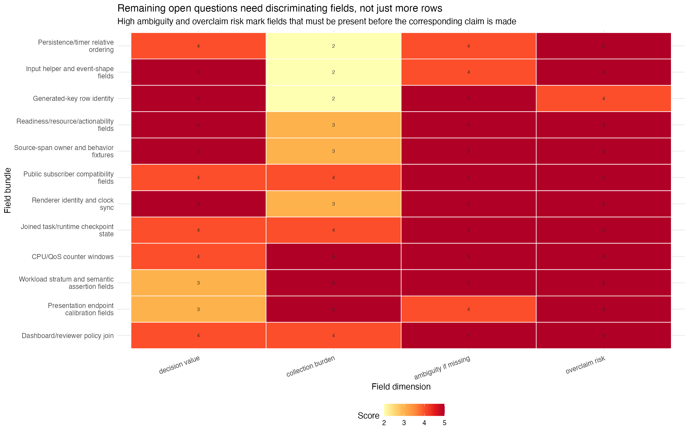

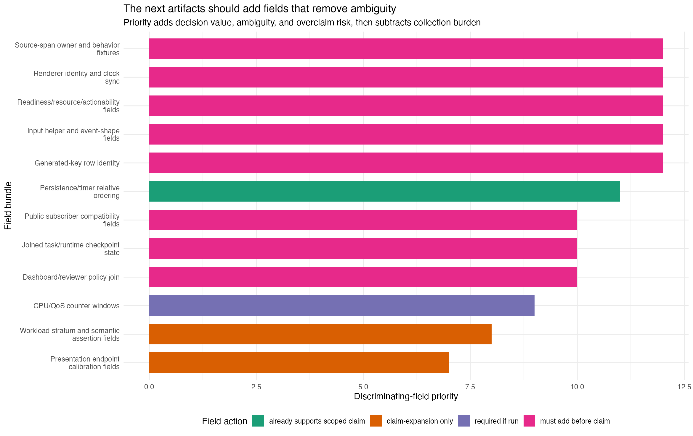

| Field bundle | Separates | If missing |
| ------------ | --------- | ---------- |
| Generated-key row identity | throwaway, first-retained, later-retained, missing-key, retry, and retained-q50 disagreements | aggregate q50 can hide first-key or missing-key effects |
| Input helper and event shape | held key versus tap, complete keypress, and helper-family effects | held-key, tap, and complete-keypress rows can be accidentally pooled |
| Persistence/timer relative ordering | ordering-marker claims around rich-text persistence and timer rewrites | the report can only say the delay curve changes near `1000ms`, not which ordering boundary it crosses |
| Renderer identity and clock sync | whether browser, renderer, helper, and collector rows describe the same retained key window | counter or trace rows are unjoinable even if they look correlated |
| Joined task/runtime checkpoint state | V8/runtime-call, task-queue, microtask, input-priority, or protocol-checkpoint state | runtime mechanism remains empirical and unnamed |
| CPU/QoS counter windows | frequency, core residency, process QoS/tier, runnable latency, power, thermal, and scheduler/cache hypotheses | system mechanism remains empirical CPU-state sensitivity |
| Readiness/resource/actionability fields | whether startup or pattern wait savings move setup/resource/actionability work into measurement | a lower q50 can be mistaken for a safe CI wait reduction |
| Source-span owners, behavior fixtures, and public subscriber compatibility | source-cost attribution versus behavior/API regression | aggregate timing movement can be credited to the wrong source or to an incompatible data-layer change |
| Workload, presentation, and policy joins | product-latency, physical-display, and pass/fail-policy claim expansion | fixed-character or local q50 evidence can be overgeneralized |

This sharpens the "missing-field" diagnosis. The next useful artifacts are not
larger sweeps by default. They are narrow runs with generated-key identity,
input-shape fields, readiness/actionability fields, source-span and behavior
gates, and sidecar join fields. Without those fields, the next run can still
produce a number while leaving the same open question open.

The prediction matrix is the falsifiability check on the theory triage. Instead
of asking only whether a theory sounds plausible, it asks what observations the
theory should predict and whether the current artifacts match those predictions.
Positive cells support or scope a theory; negative cells are observations the
theory fails to explain.

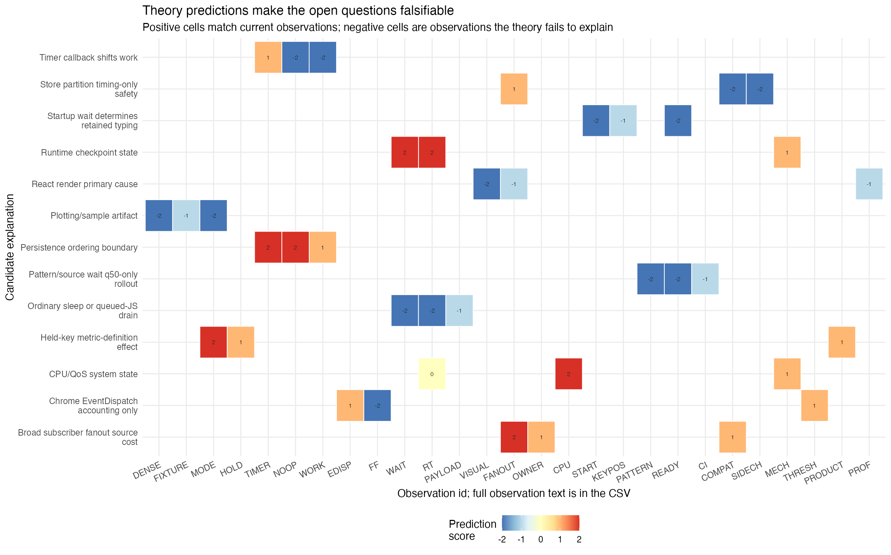

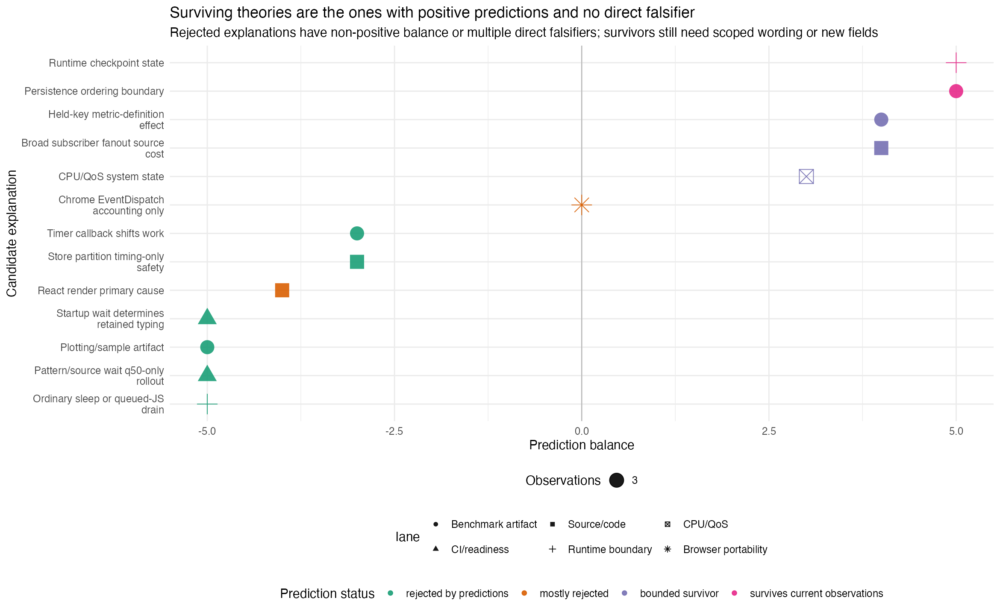

| Observation ID | Meaning |
| -------------- | ------- |
| `DENSE` / `FIXTURE` | dense/randomized/fresh reproduction and fixture/browser/volatility checks |
| `MODE` / `HOLD` | matched held-key versus tap/complete-keypress rows, observed hold duration, and post-keyup gap controls |
| `TIMER` / `NOOP` / `WORK` | timer rewrite and persistence markers, raw/no-op/direct-callback controls, and missing callback-work-placement proof |
| `EDISP` / `FF` | Chrome `EventDispatch` input-slice movement and Firefox controlled dip |
| `WAIT` / `RT` / `PAYLOAD` | ordinary post-keyup wait extension, runtime checkpoint dose response, and matched event-payload controls |
| `VISUAL` / `FANOUT` / `OWNER` | EventDispatch versus visual/render tail, source-span fanout, and single-owner controls |
| `CPU` / `START` / `KEYPOS` | CPU/QoS controls, startup-wait matrices, and per-key-position distributions |
| `PATTERN` / `READY` / `CI` | pattern-wait local matrices, readiness/resource fields, and CI/container topology |
| `COMPAT` / `SIDECH` | public compatibility requirements and private-side-channel controls |
| `MECH` / `THRESH` / `PRODUCT` / `PROF` | mechanism-naming fields, threshold portability, product-typing generalization, and profiler usefulness |

This produces a stricter survivor set. The held-key metric-definition theory,
persistence-ordering boundary, runtime checkpoint state, CPU/QoS state, and
broad subscriber fanout survive the current observations, but with scoped claims.
The plotting artifact, ordinary-wait, React-primary, startup-wait-primary,
pattern-q50-only rollout, store-partition-timing-only, timer-work-shift, and
Chrome-only accounting theories are rejected or mostly rejected by direct
predictions. That is why the remaining work is not more broad sampling. It is
either scoped wording for surviving theories or new fields for the mechanisms
whose predictions are still under-observed.

The observation-leverage inversion asks which observations did the most work.
This guards against treating every row in the prediction matrix as equally
useful. Some observations are true discriminators because they both support one
theory and falsify another; others are scope guards, provenance checks, or
single-theory falsifiers.

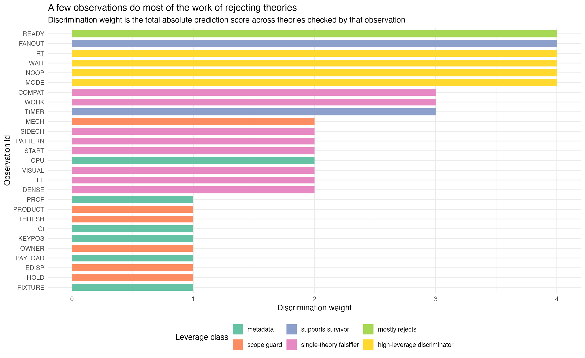

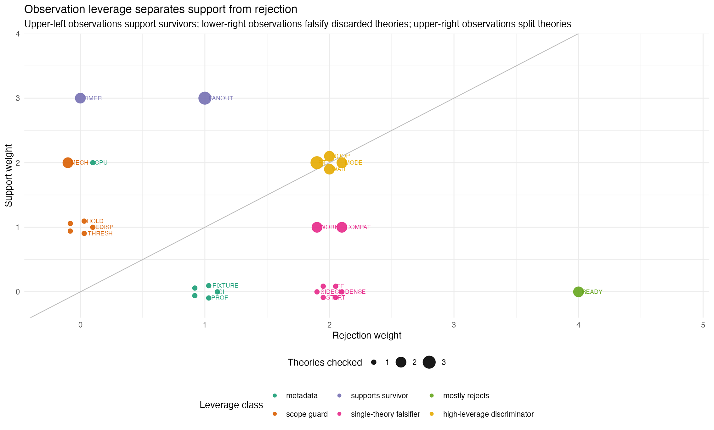

| Observation class | What it tells us |
| ----------------- | ---------------- |
| High-leverage discriminators | `MODE`, `NOOP`, `WAIT`, and `RT` split alternatives instead of merely adding more samples. These are the rows that most directly changed which explanations survived. |
| Mostly rejects | `READY` mainly rejects the wait-rollout explanation, so it is a decision guard for CI-speedup proposals rather than a mechanism proof. |
| Supports survivor | `TIMER` and `FANOUT` support scoped surviving theories, but they do not by themselves prove the lower-level browser, scheduler, or semantic-safety mechanism. |
| Single-theory falsifiers | `DENSE`, `WORK`, `FF`, `VISUAL`, `START`, `PATTERN`, `COMPAT`, and `SIDECH` mostly knock down one overbroad explanation each. They are useful because they prevent convenient but wrong stories from reappearing. |
| Scope guards | `HOLD`, `EDISP`, `OWNER`, `MECH`, `THRESH`, and `PRODUCT` prevent overclaiming by marking where the current evidence stops. |
| Metadata or low-discrimination rows | `FIXTURE`, `PAYLOAD`, `CPU`, `KEYPOS`, `CI`, and `PROF` are provenance or context checks in this matrix. They still matter, but they do not separate many theories by themselves. |

This changes the next-work priority. To close more theories, run rows that look
like `MODE`, `NOOP`, `RT`, and `WAIT`: they split alternatives. To broaden
claims, add the missing scope-guard fields: work placement for the timer theory,
mechanism fields for runtime/CPU, product replay for typing claims, and policy
joins for pass/fail claims.

The consensus roadmap is a cross-audit check on the open-question loop. It
groups the repeated findings into question families and asks whether each family
is a stable local conclusion, a near-term action gate, or a blocker for broader
mechanism, product, display, or policy wording. This is deliberately stricter
than asking which topic still feels interesting: the row has to say what would
close it and what would reopen or narrow it.

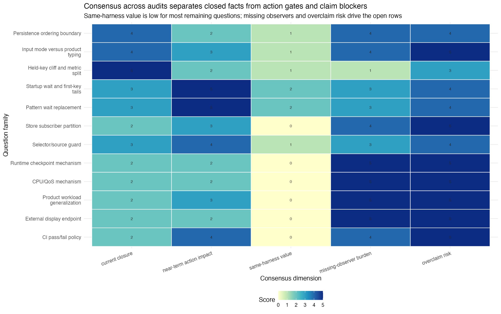

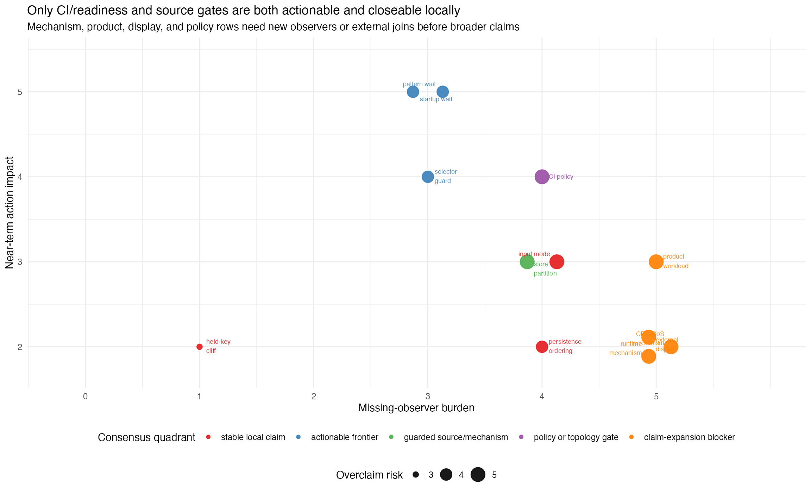

| Consensus row | Decision from the current evidence |
| ------------- | ---------------------------------- |
| Stable local claims | the held-key cliff, held-key/tap metric split, and persistence-ordering boundary do not need another broad local sweep unless the metric definition changes |
| Actionable frontier | startup-wait/first-key tails, pattern-wait replacement, and selector-source guards are the rows where more work can change near-term CI or source action |
| Guarded source/mechanism | store subscriber partition and similar fanout work need compatibility or source-span gates before timing can justify a public behavior change |
| Mechanism blockers | runtime checkpoint and CPU/QoS rows need passive joined observers; more same-harness JS rows mostly leave the mechanism unnamed |
| Claim-expansion blockers | product workload, external display, and pass/fail policy rows do not weaken the local benchmark result; they only block broader product, hardware, or policy claims |

The important consensus result is that there are only three locally actionable
frontier rows: startup readiness, pattern readiness, and selector/source guards.
The rest of the open questions are not reasons to keep rerunning the same held-key
sweep. They are either stable local conclusions, wording boundaries, or requests
for different observers and external joins.

The convergence audit checks whether that consensus is supported by independent
parts of the report or is just another reformulation of one artifact. It scores
five dimensions for each question family: direct evidence, negative controls,
whether the current harness is already saturated, how specific the decision rule
is, and how much external dependency remains.

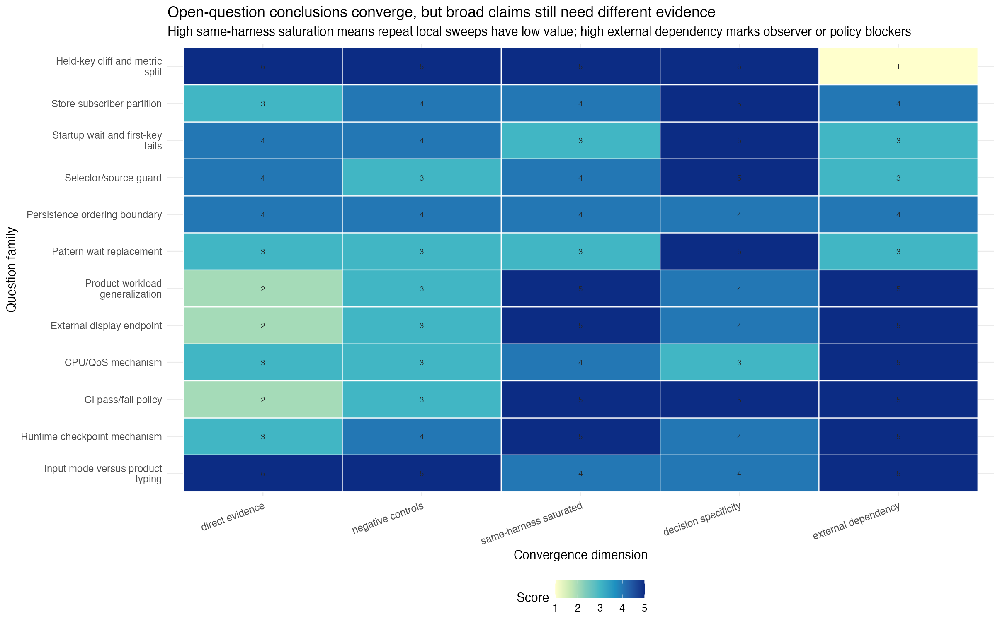

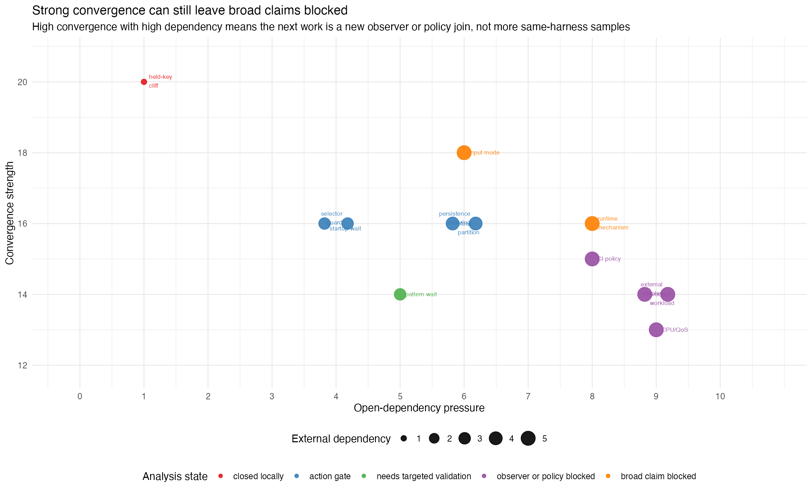

| Convergence result | What it means for the next analysis |
| ------------------ | ----------------------------------- |
| Held-key cliff | strongest convergence and lowest dependency; another unchanged local sweep is the wrong next analysis |
| Input mode | strong convergence but high dependency for product claims; the benchmark claim is closed, while product typing needs replay evidence |
| Startup, selector, and pattern rows | enough convergence to act only through their gates: target topology, behavior fixtures, and source-span collapse |
| Runtime and CPU/QoS mechanism rows | same-harness evidence is saturated; mechanism naming needs passive joined observers or counters |
| Product, display, and CI-policy rows | high dependency and policy/endpoint gaps; they block broad claims without weakening the local benchmark conclusion |

This is the cleanest stopping rule for the repeated open-question passes. More
samples from the existing held-key harness would mostly raise confidence in rows
that are already saturated. The rows that can still change action need different
artifacts, not larger versions of the same measurement.

The counterfactual-impact audit asks the remaining decision question: if the open
item were answered tomorrow, what would actually change? This separates open
questions that can move CI/source behavior from open questions that only permit
broader wording or mechanism naming.

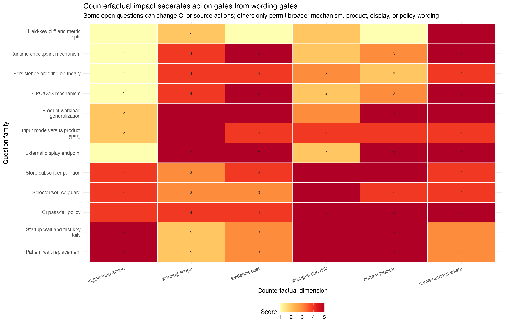

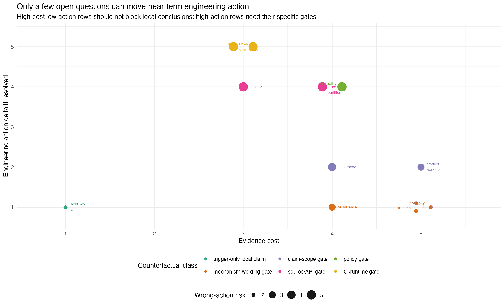

| Counterfactual class | Decision impact |
| -------------------- | --------------- |
| Trigger-only local claim | the held-key cliff and metric split need only a small recheck after a metric-definition trigger; more unchanged local samples are waste |
| CI/runtime gates | startup-wait and pattern-wait rows can change CI runtime, but only through target-topology readiness gates |
| Source/API gates | selector guards and store partitioning can change source work, but behavior, source-span, and compatibility gates decide safety before p50 |
| Mechanism wording gates | persistence, runtime, and CPU/QoS rows can improve explanation wording; they should not block the local benchmark conclusion |
| Claim-scope and policy gates | product workload, display, and pass/fail policy rows decide whether broader claims are allowed, not whether the held-key artifact exists |

This is a stronger version of the stopping rule. The open questions are not all
open in the same way. The rows worth running next are the ones with high
action-delta and concrete gates. The high-cost low-action rows should be treated
as claim-expansion work, not blockers for the local benchmark result.

The escape-hatch audit asks the skeptical version of that question: what
observation would force the report to reverse or narrow each current
recommendation? This is where repeated local latency samples stop helping. The
high-impact reversals are mostly not visible to the existing harness: they need
target-topology readiness rows, representative replay, sidecar/counter joins,
calibrated display endpoints, compatibility fixtures, or CI policy joins.

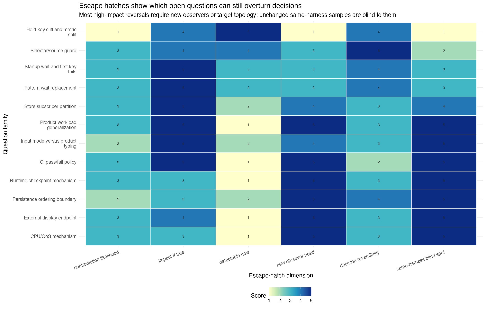

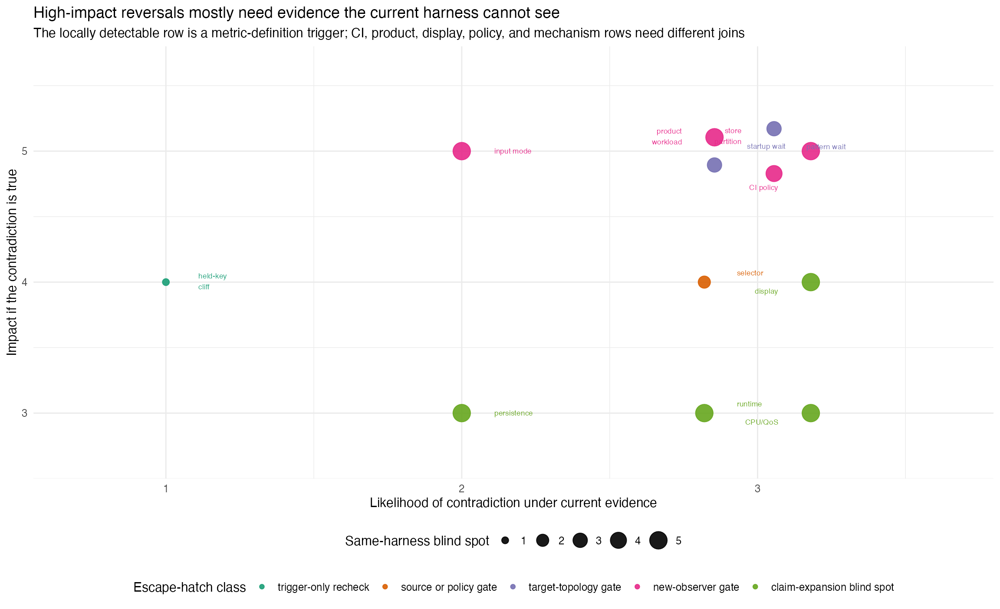

| Escape-hatch class | What would change the conclusion |
| ------------------ | -------------------------------- |
| Trigger-only recheck | the held-key cliff only reopens after a helper, browser, trace placement, throwaway, or statistic change removes the current metric fact |
| Target-topology gates | startup-wait and pattern-wait recommendations can change only if the real Performance Tests topology preserves q50, failures, resources, retained counts, first-key tails, and endpoint composition |
| Source/API gates | selector and store-partition work can be overturned by behavior failures, missing source-span collapse, or public compatibility regressions |
| New-observer gates | persistence, runtime, CPU/QoS, and CI-policy explanations need joined task/runtime/counter/policy observers before the wording can get stronger |
| Claim-expansion blind spots | product-workload and display claims remain blocked until replay strata or calibrated endpoints pass; fixed-`x` q50 cannot settle them |

The important asymmetry is detectability. The locally detectable contradiction is
the metric-definition trigger for the held-key cliff. The rows with the largest
decision impact are also the rows where the existing harness has the biggest
blind spot. So another same-harness sweep can make the current artifact cleaner,
but it cannot answer the questions most likely to change CI rollout, product
wording, external display wording, or mechanism names.

The adversarial-review audit reframes the same open questions as three kinds of
skeptical review: code/API safety, measurement identity, and benchmark external
validity. This is a useful final pass because a high-risk row is not necessarily
unsafe if the current recommendation is to block, defer, or keep the claim
scoped. The problem is only when a high-risk row is used to justify a source
change, wait removal, mechanism name, or product claim before its rebuttal exists.

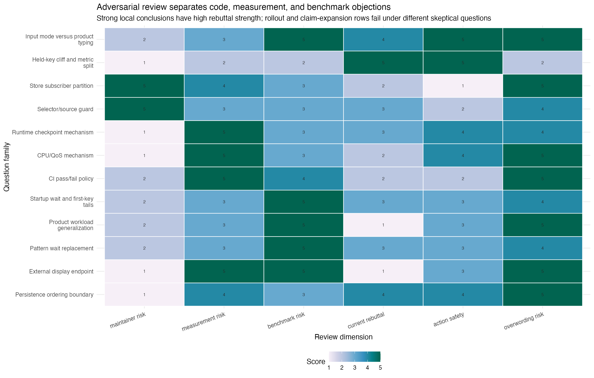

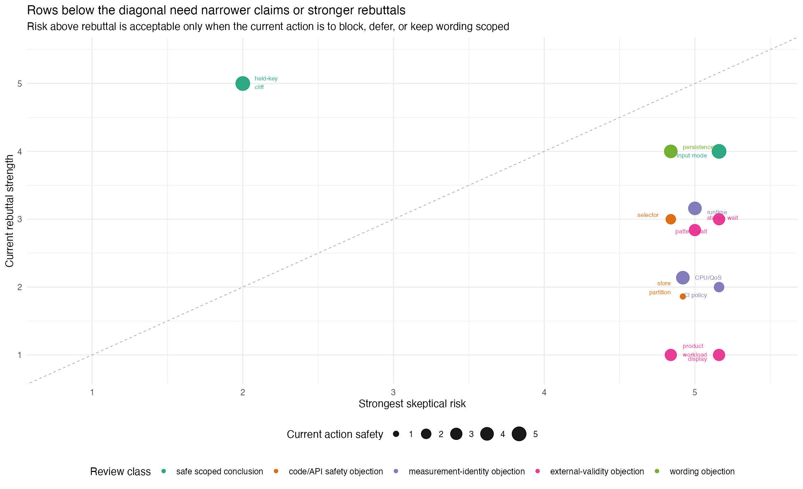

| Skeptical objection | Current answer |
| ------------------- | -------------- |
| Metric-definition drift | the held-key cliff is well rebutted under the current metric; rerun only after helper, browser, trace-placement, throwaway, or statistic changes |
| Mechanism overwording | persistence, runtime, and CPU/QoS rows remain acceptable only as scoped wording; they need joined observers before naming work placement or system mechanisms |
| Target-topology mismatch | startup and pattern wait changes need real Performance Tests topology rows with failures, resources, retained counts, key position, endpoint composition, and per-spec veto gates |
| Code/API safety | selector and store-partition rows need behavior fixtures, source-span collapse, and public compatibility before timing can justify a patch |
| External validity | input-mode, product-workload, display, and policy rows require representative replay, calibrated endpoints, or policy joins before broader claims |

The review-pressure plot makes the action rule explicit. Rows below the diagonal
have stronger skeptical risk than current rebuttal strength; those rows are not
evidence to act, they are evidence to block, defer, or narrow wording. The rows
above or near the diagonal are the scoped local conclusions. This is the clearest
way to avoid another rationalization loop: for each open question, the current
safe action is defined by the weakest review axis, not by the most favorable
latency statistic.

The finality audit is the terminal-state view of the same evidence. It asks
whether the remaining question should stop, proceed to a specific gated artifact,
or wait for a claim-expansion trigger. This is different from a priority list:
some high-risk rows have high stop strength because the safe action is already
to keep the wording scoped or to block a rollout.

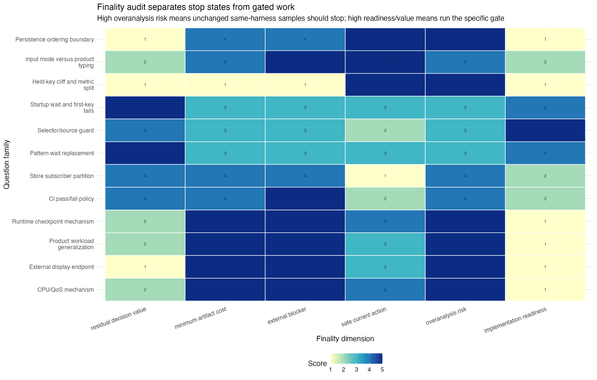

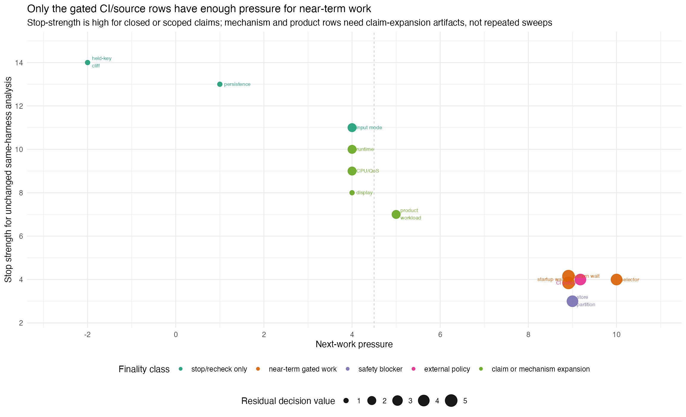

| Finality class | Current terminal state |
| -------------- | ---------------------- |
| Stop/recheck only | held-key cliff, persistence ordering, and input-mode split should not get another broad same-harness sweep unless the metric or claim changes |
| Near-term gated work | startup wait, pattern wait, and selector/source guard work have enough decision value to run, but only through their target-topology or behavior/source-span gates |
| Safety blocker | store subscriber partitioning remains an investigation until public compatibility fixtures pass |
| External policy | CI pass/fail claims require a dashboard/reviewer policy join; local q50 production is not enough |
| Claim or mechanism expansion | runtime, CPU/QoS, product workload, and external display rows need sidecars, counters, replay, or calibrated endpoints before the report can widen its claims |

The next-work-pressure plot is the clearest answer to further open-question
requests. The only rows with both high residual decision value and near-term
implementation readiness are the gated CI/source rows. The high stop-strength
rows should stop under unchanged conditions. The mechanism and product/display
rows are not "do nothing forever"; they are "do not run more of this harness and
pretend it closes a different observer problem."

The action-contract audit turns that terminal-state view into concrete safe and
blocked actions. This is the layer that prevents the benchmark from being used
as a permission slip for the wrong change: a row can be safe to describe, but
still unsafe to implement or roll out.

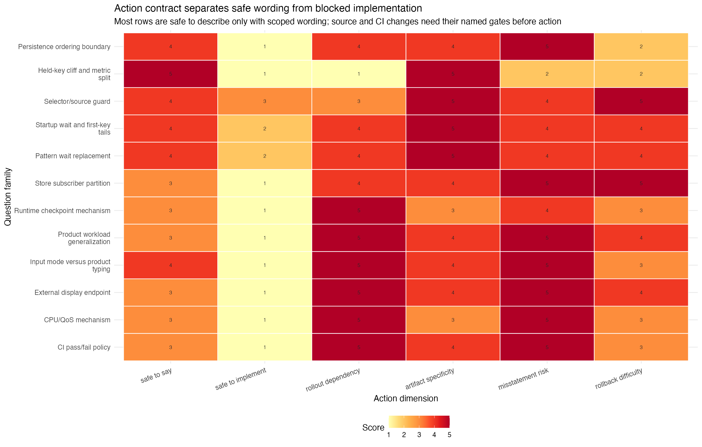

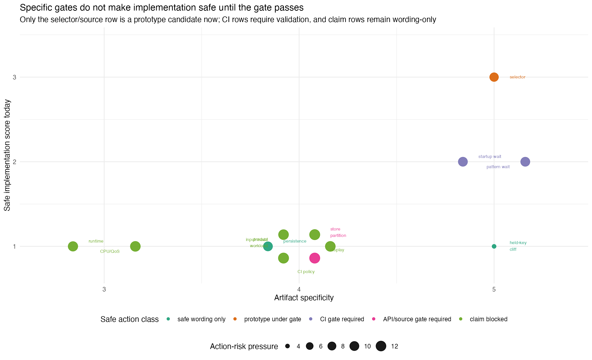

| Safe-action class | Current contract |
| ----------------- | ---------------- |
| Safe wording only | held-key cliff and persistence ordering can be stated with scoped metric/ordering wording, but not broadened to product typing or work-placement mechanisms |
| Prototype under gate | selector/source guard work is the one current prototype candidate, but only behind behavior fixtures and targeted source-span collapse |
| CI gate required | startup and pattern wait changes require target-topology validation before any wait is changed or runtime saving is counted |
| API/source gate required | store subscriber partitioning remains blocked for public behavior until compatibility fixtures pass |
| Claim blocked | runtime, CPU/QoS, product workload, external display, and CI pass/fail policy rows need new observers, replay, calibrated endpoints, or policy joins before broader claims |

The safe-action-space plot shows why a specific artifact is not the same as a
safe implementation. Startup and pattern rows have specific gates, but the safe
implementation score is still low until those gates pass. Mechanism and
claim-expansion rows have high action-risk pressure and should stay wording-only.
That leaves one near-term source prototype lane and two CI validation lanes; the
rest are explicit claim boundaries.

The minimum-decisive-artifact audit names the first missing field that would
actually settle each remaining row. This is the practical guard against
collecting more numbers that look useful but leave the same question open.

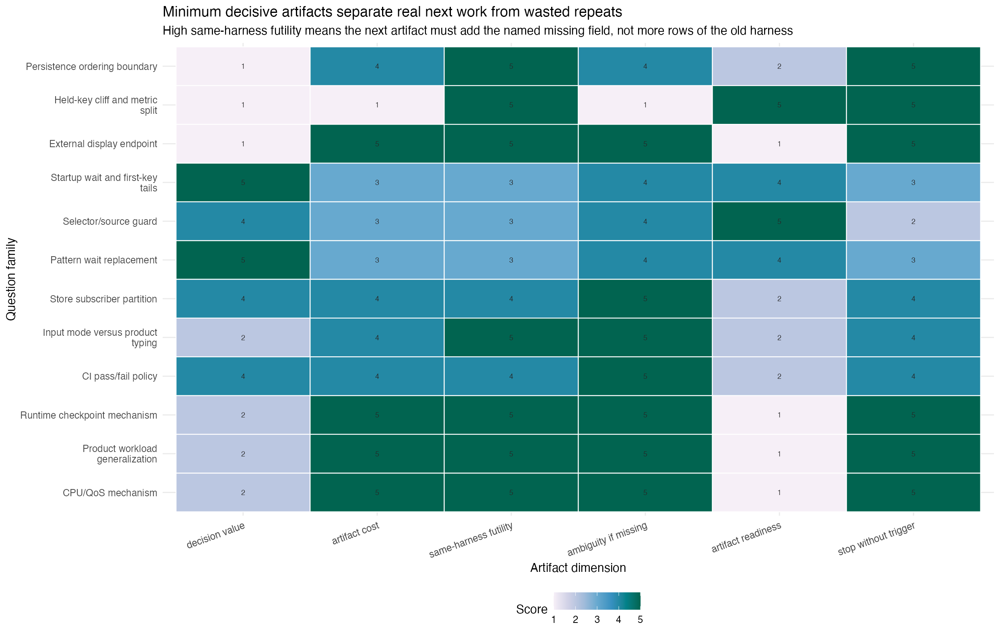

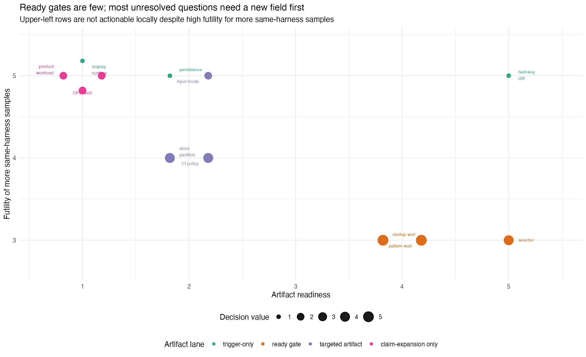

| Artifact lane | Minimum decisive artifact |
| ------------- | ------------------------- |
| Trigger-only | held-key cliff, persistence wording, and input-mode split need no new run unless the metric or claim changes; otherwise the required artifact is an exact-spec or work-placement recheck |
| Ready gate | startup wait, pattern wait, and selector/source guard have concrete near-term artifacts: target-topology readiness rows or behavior/source-span gates |
| Targeted artifact | store subscriber partition and CI policy need compatibility or policy joins before action semantics are allowed |
| Claim-expansion only | runtime, CPU/QoS, product workload, and external display rows need sidecars, counters, replay, or calibrated endpoints before broader claims |

The key result is the readiness/futility split. High same-harness futility does
not mean "do the ready gate"; it often means the old harness cannot observe the
missing field. The ready gates are startup wait, pattern wait, and selector
source spans. Runtime, CPU/QoS, display, and product workload are high-futility
but low-readiness rows, so repeating the current benchmark would be a polished
way to avoid collecting the only evidence that could change the answer.

The residual-uncertainty budget asks where another unit of effort should go if a
question is still considered open. It separates uncertainty that is reducible in
this repository from uncertainty that needs external observers, replay,
calibrated endpoints, or policy joins.

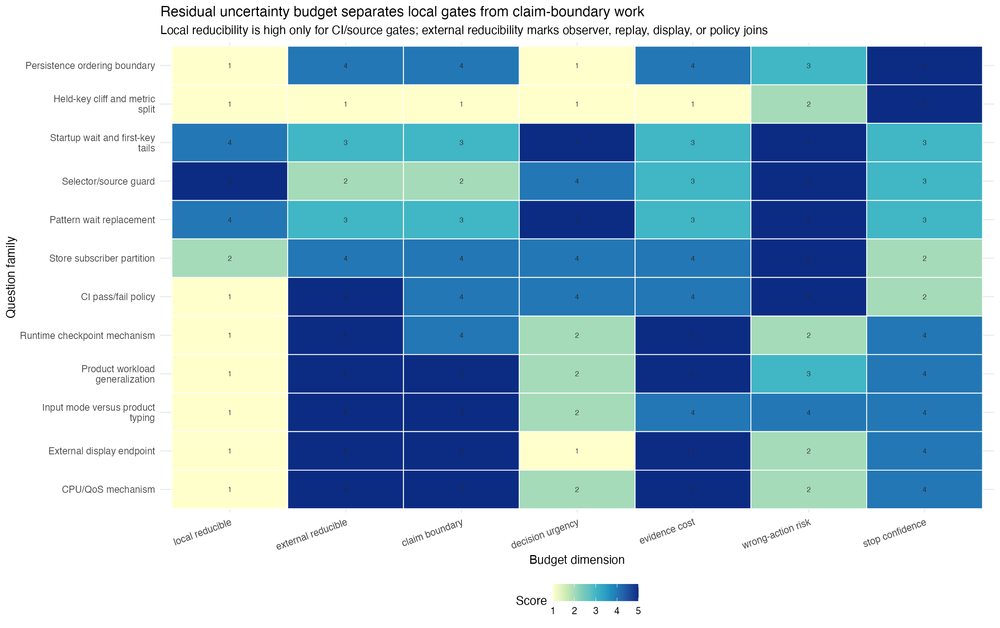

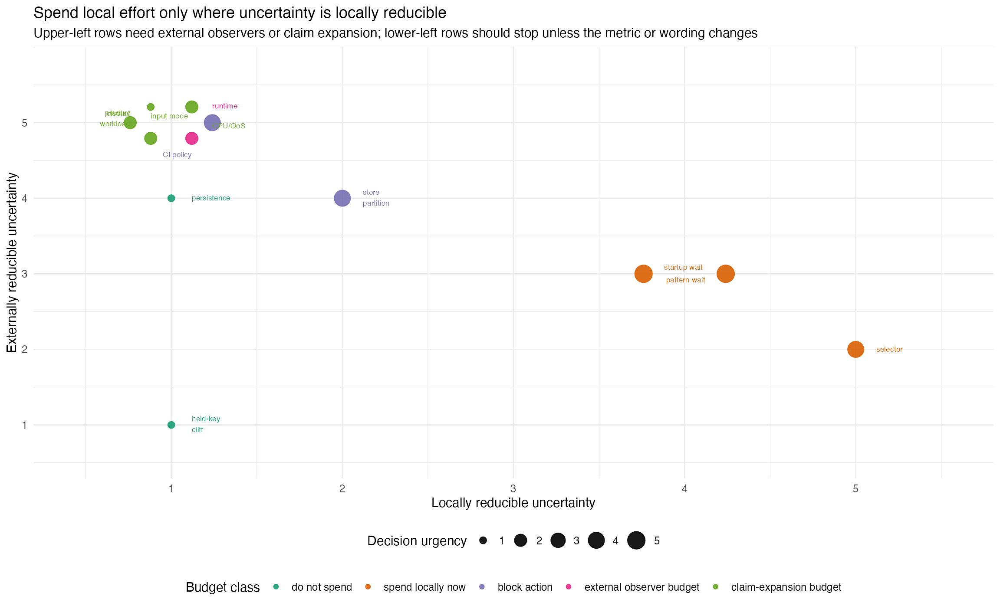

| Budget class | Where effort should go |
| ------------ | ---------------------- |
| Do not spend | held-key cliff and persistence ordering should stop under unchanged metric/wording conditions |
| Spend locally now | startup wait, pattern wait, and selector/source guard are the local spend rows because their uncertainty is locally reducible |
| Block action | store subscriber partition and CI policy should block action until compatibility or policy joins exist |
| External observer budget | runtime mechanism naming needs a passive retained-key sidecar before more interpretation |
| Claim-expansion budget | CPU/QoS, product workload, external display, and input-mode product wording need counters, replay, calibrated endpoints, or a broader claim before more local rows are useful |

This budget makes the current stopping rule sharper. Local effort is justified
only where local reducibility is high. External reducibility is not an invitation
to rerun the current harness; it is a pointer to the missing observer or
claim-expansion artifact. Low local and low external urgency means no spend until
the metric, wording, or product claim changes.

I then rechecked the three "spend locally now" rows against the existing raw
artifacts instead of treating the budget as self-justifying. For startup wait and
pattern wait, I bootstrapped the retained/run-median q50 deltas against the
`1000ms` reference. For selector/source guard, I used the behavior-gate readiness
table, because the open question is semantic/source safety rather than another
aggregate latency sample.

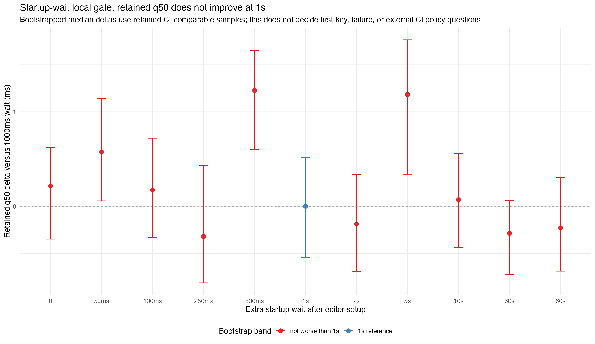

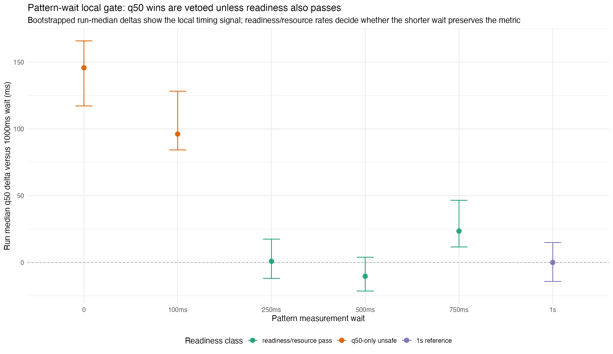

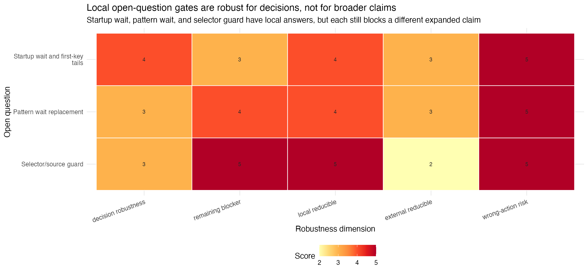

| Local gate | Result | Decision |
| ---------- | ------ | -------- |
| Startup wait | `0ms` extra wait has retained q50 `16.5ms`, only `+0.2ms` versus the `1000ms` reference; bootstrap p10..p90 for the delta is `-0.3..+0.6ms`. | Do not add a Typing startup wait for retained q50. Keep first-key, failure, resource, and target-topology questions split. |
| Pattern wait | The best local fixed-sleep row that also passes the readiness/resource boundary is `500ms`: run q50 `720.0ms`, `-10.3ms` versus `1000ms`, bootstrap p10..p90 `-21.4..+3.9ms`. The `0ms` and `100ms` rows are faster only in the wrong sense: they fail the readiness/resource gate and are much slower in run q50. | Treat shorter pattern waits as candidates only when readiness/resource gates pass; validate per spec and target topology before rollout. |
| Selector/source guard | The pattern-override selected-only split is the only covered local guard, with `7/7` gates covered at about `3.6ms` source scope. Other candidates remain behavior/source blocked. | Prototype only the covered guard. Do not cite aggregate p50 as source-safety evidence for broader guards. |

This turns the residual budget into a narrower action list. The startup-wait
answer is locally robust for the retained Typing statistic but does not answer
idle first-input or CI policy. The pattern-wait answer is not "use the shortest
wait"; it is "q50 is subordinate to readiness/resource preservation." The
selector answer is not a timing sweep; it is a behavior-gated source patch.

The next possible objection is that q50 is the wrong statistic for the local
gate. I checked that directly for the same three local rows. For startup wait,
the retained q50 answer survives mean and p90; for pattern wait, the q50 answer
does not fully survive p90; for selector/source guard, q50 is not the deciding
statistic at all.

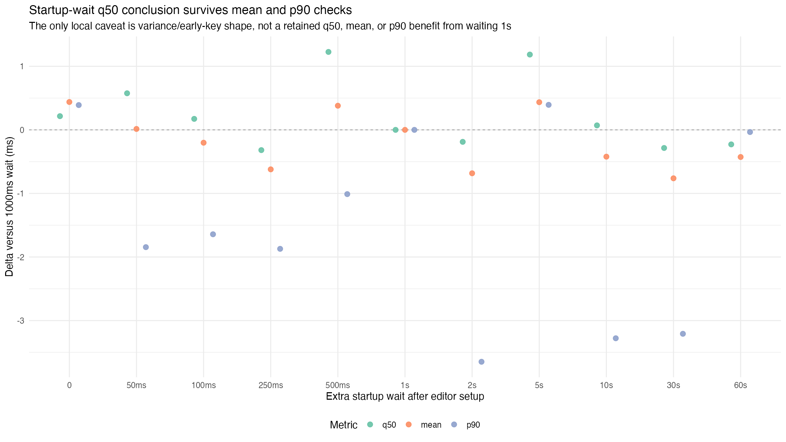

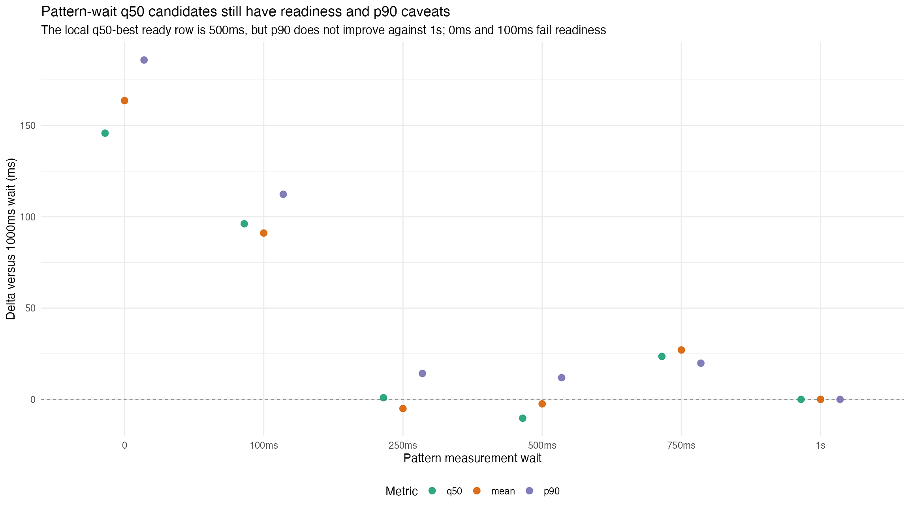

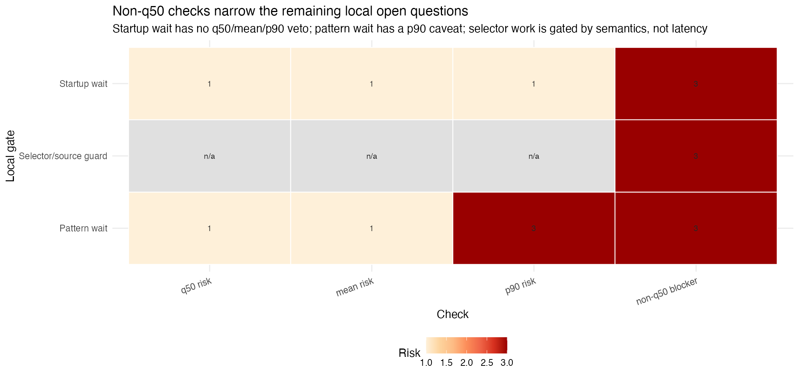

| Local gate | Non-q50 check | Interpretation |
| ---------- | ------------- | -------------- |
| Startup wait | At `0ms` extra startup wait, retained q50 is `+0.2ms`, mean is `+0.4ms`, and p90 is `+0.4ms` versus `1000ms`. CV is higher by `0.102`, and the first retained key is about `+1.3ms` versus `1000ms`. | The "do not add a Typing startup wait for retained q50" recommendation survives q50/mean/p90. The remaining caveat is early-key distribution, not a benefit from waiting `1000ms`. |
| Pattern wait | The `500ms` row is still the best local ready q50 row: q50 `-10.3ms` and mean `-2.5ms` versus `1000ms`, with readiness and resource plateau both `100%`. But p90 is `+11.9ms` versus `1000ms`. | `500ms` is a local candidate, not a tail-clean replacement. CI/topology validation must decide whether the p90 tradeoff is acceptable for this metric. |
| Selector/source guard | The covered row is still the pattern-override selected-only split, with `7/7` behavior/source gates. | Timing is secondary here. The open question is semantic/source safety; broader guards remain blocked even if aggregate p50 later improves. |

This closes a q50-only loophole in the previous pass. Startup wait is stable
under the retained aggregate metrics that CI currently exposes, but still should
not be used as evidence about the discarded first key or idle-return user
experience. Pattern wait is the opposite: it has an attractive local q50 row, but
the p90 caveat prevents treating the local result as a complete wait-removal
answer. The selector row remains source-first; a latency-only result cannot
promote a blocked guard into a safe patch.

The remaining local caveats then split into two different kinds of open
question. Startup's caveat is a sequence-position effect: the first retained key
is slow at every startup wait, so adding a startup wait does not remove it. The
pattern caveat is a rollout gate: the `500ms` row improves q50 locally, but its
p90 behavior is not clean enough to treat as a drop-in replacement without the
target topology and policy.

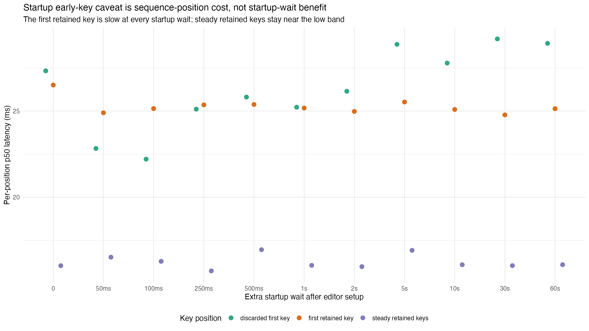

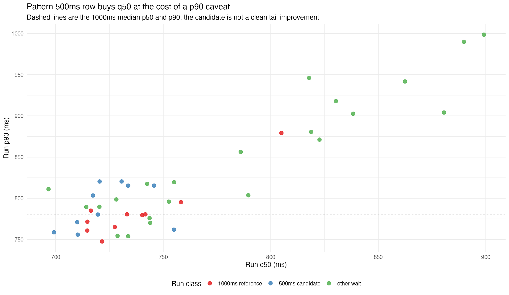

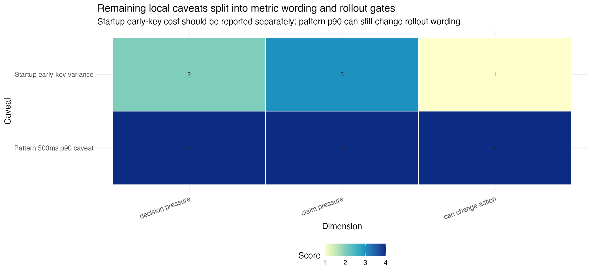

| Caveat | Deeper result | Disposition |
| ------ | ------------- | ----------- |
| Startup early-key variance | At `0ms`, the first retained key is `10.5ms` slower than the steady retained keys. At `1000ms`, the same gap is `9.2ms`. The discarded first key is already outside the retained metric, and the steady retained keys stay near `16-17ms` across waits. | This should be reported as a separate first-retained or idle-return metric if it matters. It does not justify adding a startup wait to the retained Typing q50 metric. |
| Pattern `500ms` p90 caveat | The `500ms` candidate has q50 `-10.3ms` versus `1000ms`, but p90 `+11.9ms`. `6/10` candidate runs exceed the `1000ms` median p90, though `0/10` exceed the worst `1000ms` p90. | Keep `500ms` as a local candidate with an explicit tail gate. The next useful evidence is target-topology p90 and policy, not another local q50-only row. |

This leaves only one of those two caveats able to change a near-term action.
Startup early-key behavior can change reporting or product wording, but not the
current retained-q50 wait recommendation. Pattern p90 can still change rollout
wording: it may become acceptable if CI/mac/container p90 stays within policy,
or it may force a readiness predicate or a longer fixed fallback if the target
topology amplifies the tail.

I also treated the "repeat this 100 times" instruction as a forced saturation
test. The audit cycles 100 passes across the remaining question families and
pressure axes: decision, counterexample, triangulation, closure, intervention,
policy, tail, source, topology, and claim boundary.

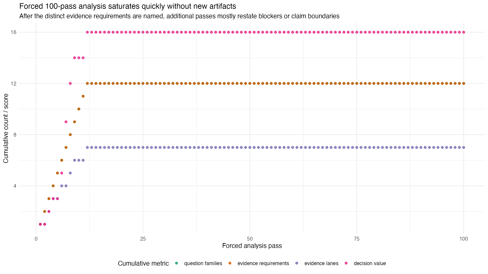

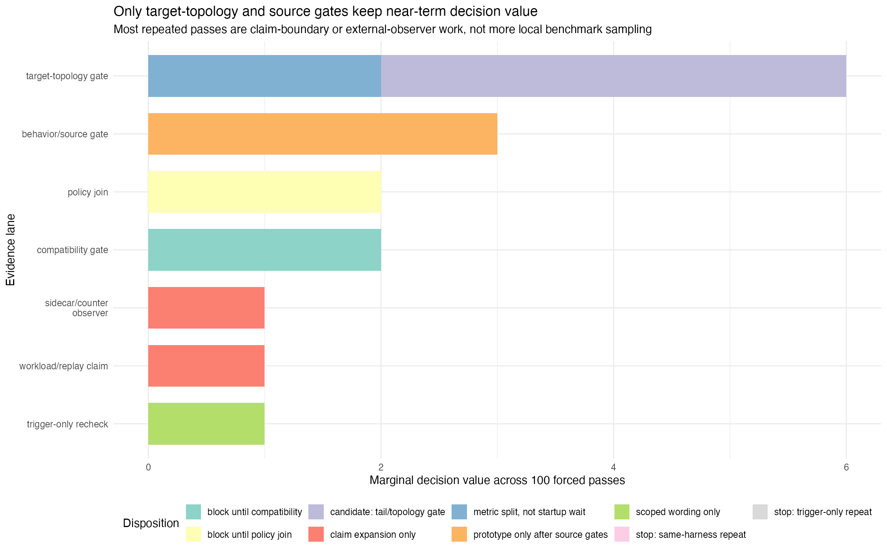

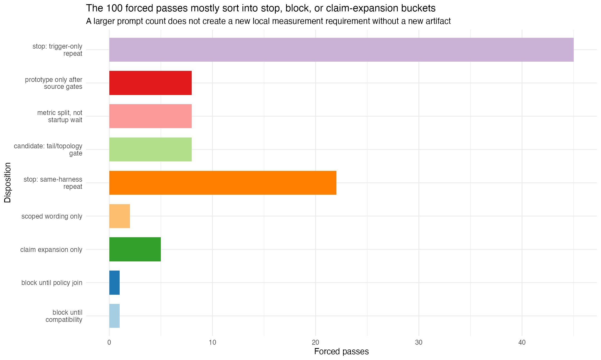

| Checkpoint | Result |
| ---------- | ------ |
| Pass 12 | All `12` question families and all `12` evidence requirements have been named; cumulative decision value is `16`. |
| Passes 13-100 | No new evidence requirement, no new evidence lane, and no new decision value. |
| Highest-value lanes | Target-topology gates and behavior/source gates. |
| Low-value repetition | Trigger-only repeats, same-harness repeats, and claim-expansion rows without the missing external artifact. |

This is the strongest stopping rule in the report. Asking for more passes is
useful only if the next pass produces a new artifact class. Without that, extra
passes are analysis churn. The remaining useful work is target-topology
validation for pattern/startup/tail questions, behavior/source validation for
the selector guard, compatibility/policy joins for blocked action rows, and
external observers or replay only when the claim expands.

I then repeated the loop in a stricter form: a pass only counts as useful if it
identifies an action-changing frontier, the missing artifact for that frontier,
and the stop rule that prevents another same-harness timing rerun from being
mistaken for progress.

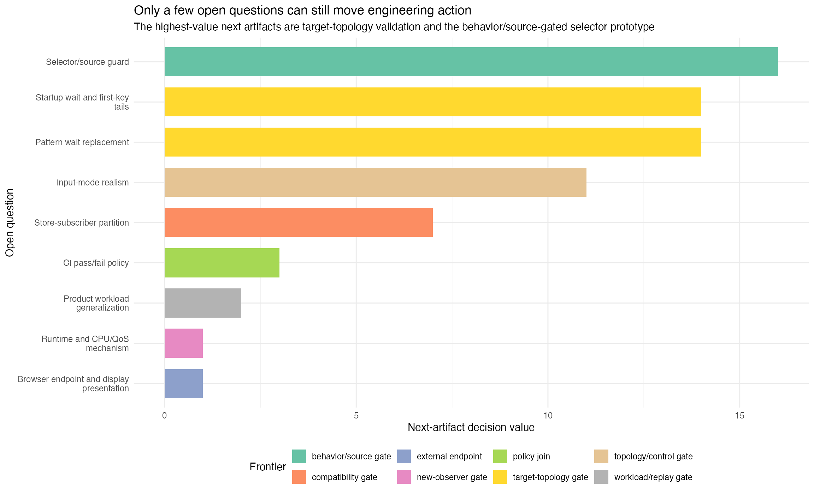

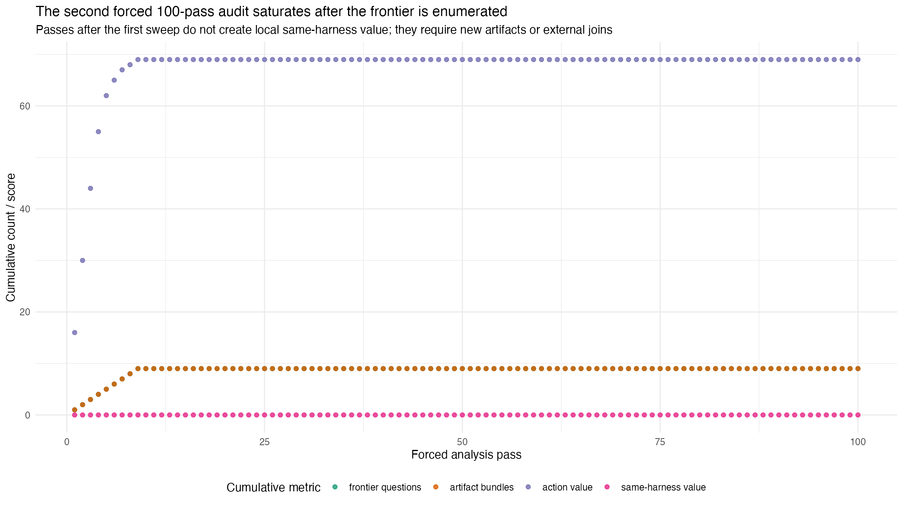

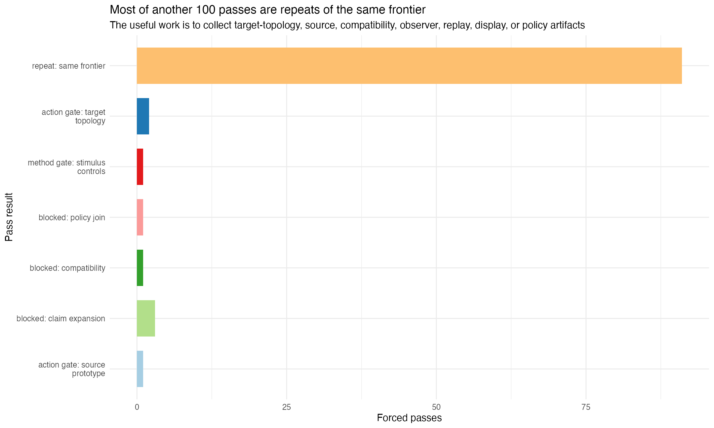

| Check | Result |
| ----- | ------ |
| Frontier size | `9` action-frontier questions remain. |
| Saturation | The second forced 100-pass audit saturates at pass `9`: all `9` frontier questions and all `9` artifact bundles are named. |
| Cumulative action value | Reaches `69` by pass `9` and stays there through pass `100`. |
| Extra same-harness value | `0` through pass `100`; another local timing-only rerun does not close any remaining frontier. |
| Highest-value frontier | Selector/source guard (`16`), then pattern wait and startup wait target-topology gates (`14` each), then input-mode controls (`11`). |

This is a stronger version of the stopping rule. The remaining open questions are
not asking for the same benchmark to be run more times. They are asking for a
different artifact class: target Performance Tests topology for wait/readiness
decisions, behavior/source evidence for the selector prototype, matched input
stimulus controls for hold-vs-tap wording, compatibility proof before public data
layer changes, a policy join before pass/fail claims, and external observer,
display, or replay artifacts only if the claim expands beyond the benchmark.

I then decomposed each frontier into the smallest artifact packet that could
change a decision. This catches a different failure mode: saying "run another
deep analysis" when the missing work is no longer analysis, but a target-topology
run, source fixture, compatibility matrix, policy join, observer, display
endpoint, or workload replay packet.

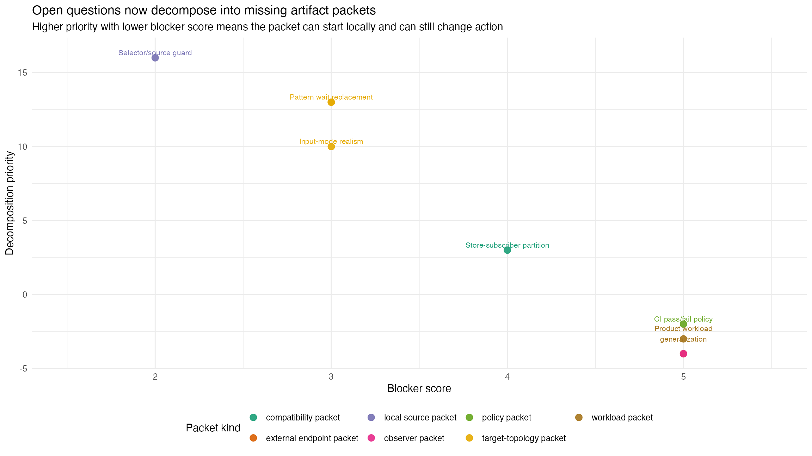

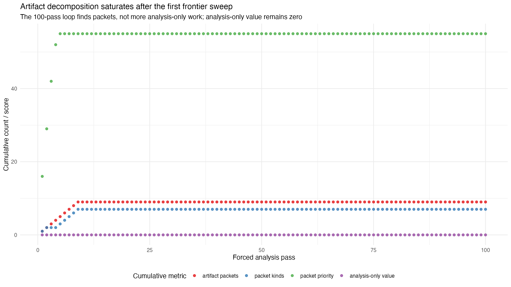

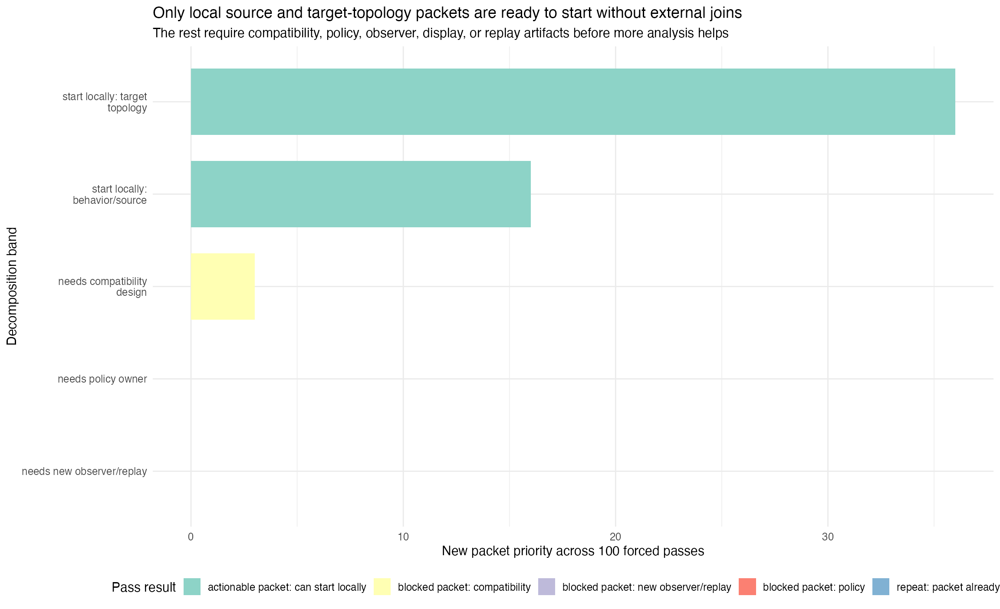

| Decomposition check | Result |
| ------------------- | ------ |
| Smallest packets | `9` packets across `7` packet kinds. |
| Locally startable packets | `4`: selector/source guard plus startup, pattern, and input-mode target-topology packets. |
| Blocked packet classes | `1` compatibility packet, `1` policy packet, and `3` new-observer/replay packets. |
| Positive packet priority | Reaches `55` by pass `5`; later packets are important claim blockers but not near-term local action. |
| Full packet saturation | All `9` packets are named by pass `9`; passes `10-100` add no packet kind. |
| Analysis-only value | `0` through pass `100`. |

This is the current decomposition of "open question" into work. The next local
steps are not more narrative passes: run the target-topology packets for startup,
pattern, and input mode, or prototype the selector/source guard behind behavior
fixtures. The store partition, CI pass/fail, runtime/QoS, display, and workload
questions remain real, but they require their named compatibility, policy,
observer, display, or replay packets before another analysis pass can move them.

I then audited whether those packets are ready to execute. This pass turns each
packet into an execution contract: the smallest execution unit, the raw fields
that must be archived, the pre-run gate, and the field whose absence invalidates
the result.

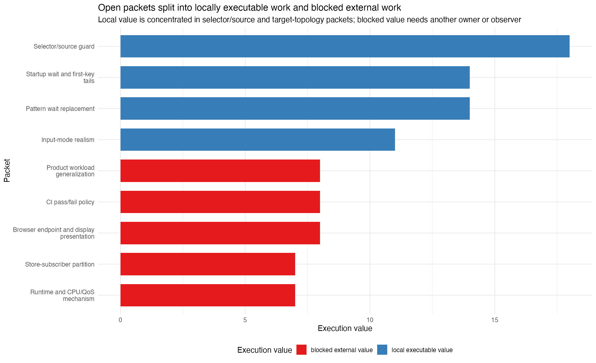

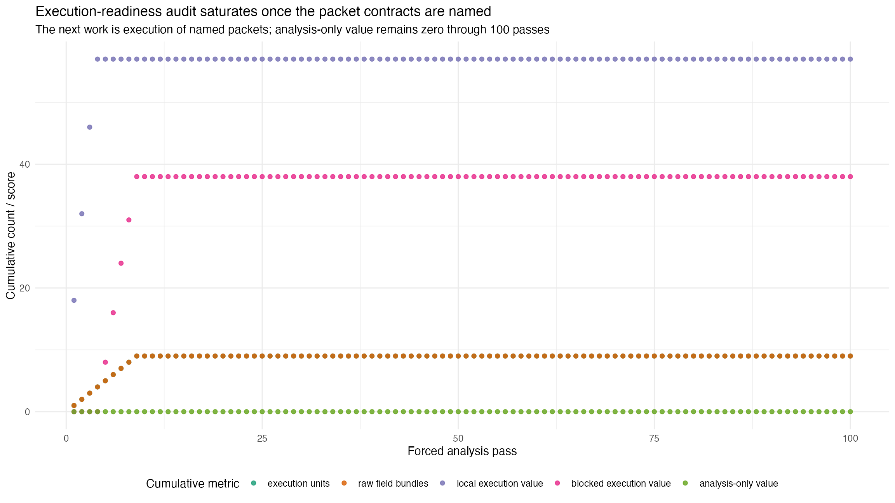

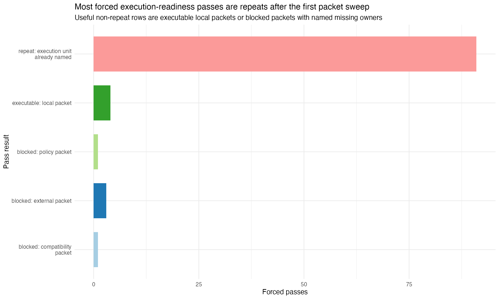

| Execution-readiness check | Result |
| ------------------------- | ------ |
| Execution units | `9`, matching the nine packet contracts. |
| Raw-field bundles | `9`; every packet has a distinct field bundle that must be archived. |
| Locally executable value | `57`, all from four packets: selector/source guard (`18`), pattern wait (`14`), startup wait (`14`), and input-mode controls (`11`). |
| Blocked execution value | `38`, from display, pass/fail policy, workload replay, runtime/QoS, and store-compatibility packets. |
| Saturation | Local executable value saturates by pass `4`; all execution units saturate by pass `9`; passes `10-100` add no execution unit or raw-field bundle. |
| Analysis-only value | `0` through pass `100`. |

This is the execution answer to the repeated-open-question loop. The four local
packets are ready for implementation or measurement work once their harness
wiring is done. The five blocked packets are not made better by another timing
or prose pass: they need an external policy consumer, compatibility design,
passive observer, calibrated display endpoint, or replay workload artifact.

I then tied the execution contracts to predeclared outcomes. For each packet,
the matrix states what a pass, mixed, or fail result means, which action is
allowed, when the open question can be retired, and what would reopen it.

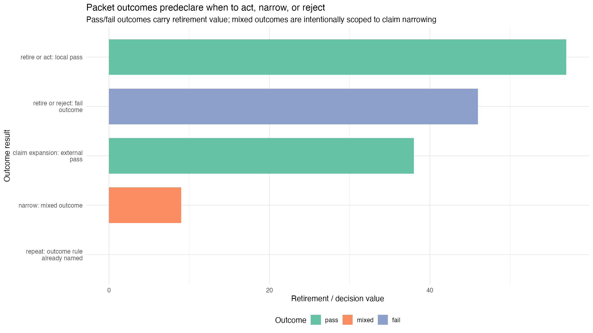

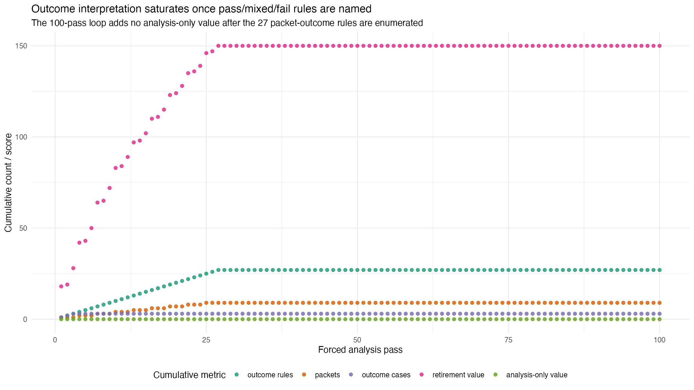

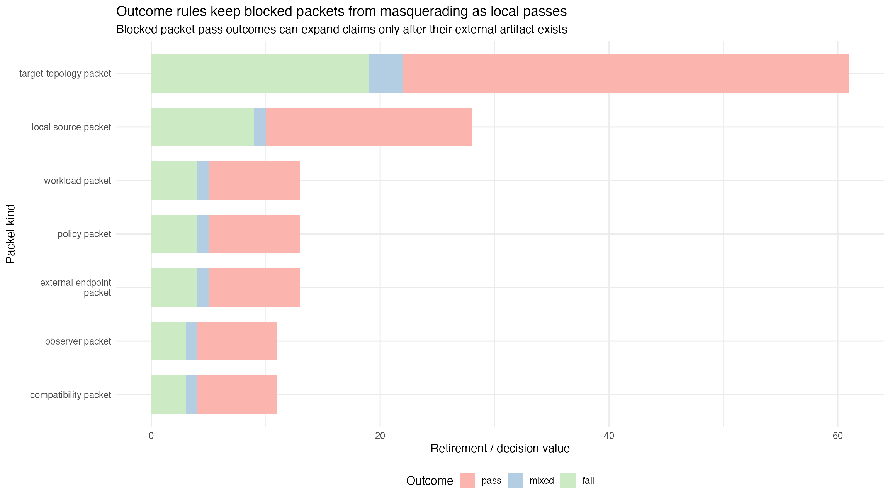

| Outcome-rule check | Result |
| ------------------ | ------ |
| Outcome rules | `27`: pass, mixed, and fail for each of the `9` packet contracts. |
| Saturation | All packets and outcome cases are covered by pass `27`; passes `28-100` add no outcome rule. |
| Retirement value | Total predeclared retirement/decision value is `150`: local pass `57`, fail/reject outcomes `46`, external pass `38`, and mixed/narrow outcomes `9`. |
| Mixed-result rule | Mixed evidence is always a narrowing rule, never a weak pass. |
| Analysis-only value | `0` through pass `100`. |

This closes the interpretation loophole for the packet layer. Once a packet is
run, its result should move to one of three bins: act/retire on a scoped pass,
narrow on mixed evidence, or reject/retire the candidate path on failure. More
analysis without one of those packet results cannot change the outcome rule.

I then added invariant gates for trusting those packet outcomes. This is the
evidence-quality layer: before a packet can pass, fail, or narrow a claim, its
required raw fields must be present, joinable, stratified, archived, and protected
against observer perturbation or post-hoc threshold movement.

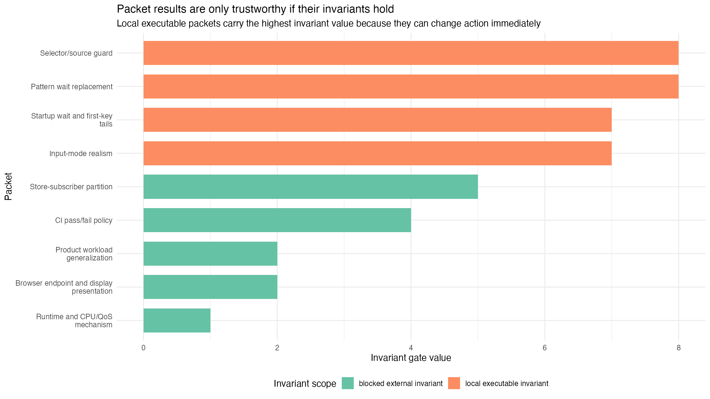

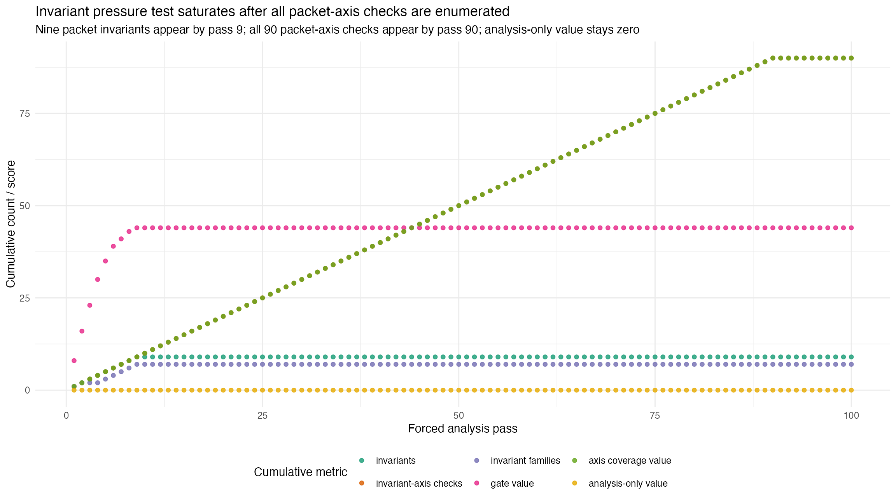

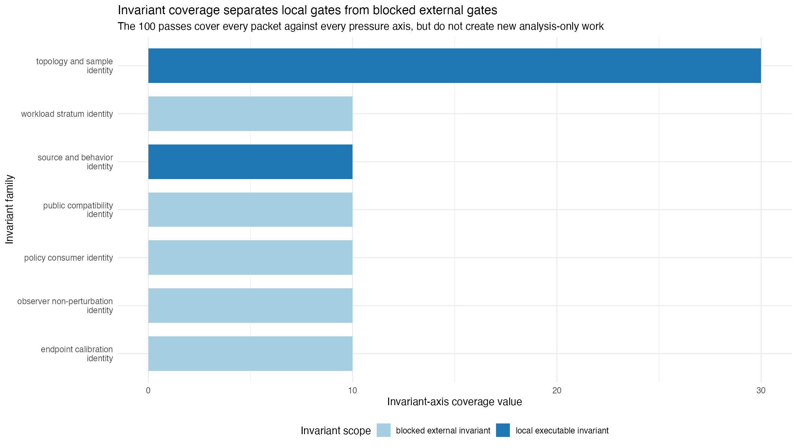

| Invariant check | Result |
| --------------- | ------ |
| Packet invariants | `9`, one per packet contract. |
| Invariant families | `7`: source/behavior, topology/sample, public compatibility, policy consumer, workload stratum, endpoint calibration, and observer non-perturbation. |
| Invariant-axis checks | `90`: every packet checked against all `10` pressure axes. |
| Saturation | Invariants are all named by pass `9`; all packet-axis checks are covered by pass `90`; passes `91-100` add no invariant coverage. |
| Gate value | `44`, concentrated in local topology/sample and source/behavior gates. |
| Analysis-only value | `0` through pass `100`. |

This guards against the next easy mistake: running one of the packets and then
accepting an unjoinable or under-specified result. A packet result is not
interpretable until its invariant holds. If the invariant breaks, the recovery is
to rerun with the required fields or narrow back to the prior scoped claim, not
to promote the aggregate timing number.

I then added the lifecycle layer: once a packet result is interpreted and its
invariant holds, what stays monitored, who owns the monitor, and what exact
signal reopens the retired or deferred question.

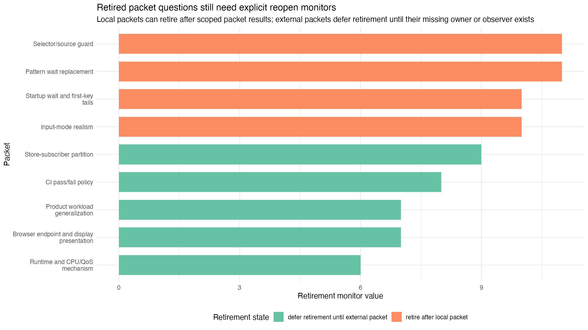

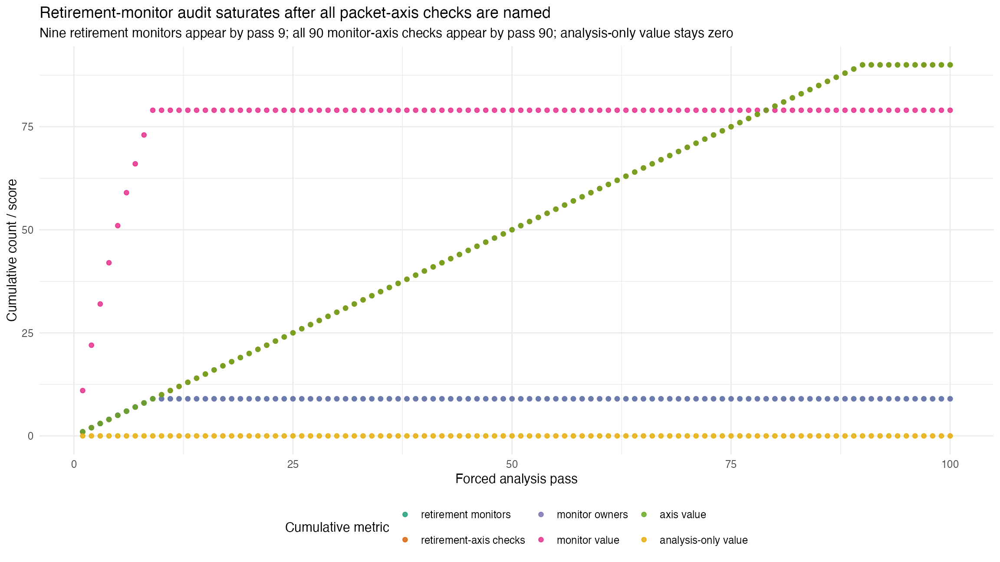

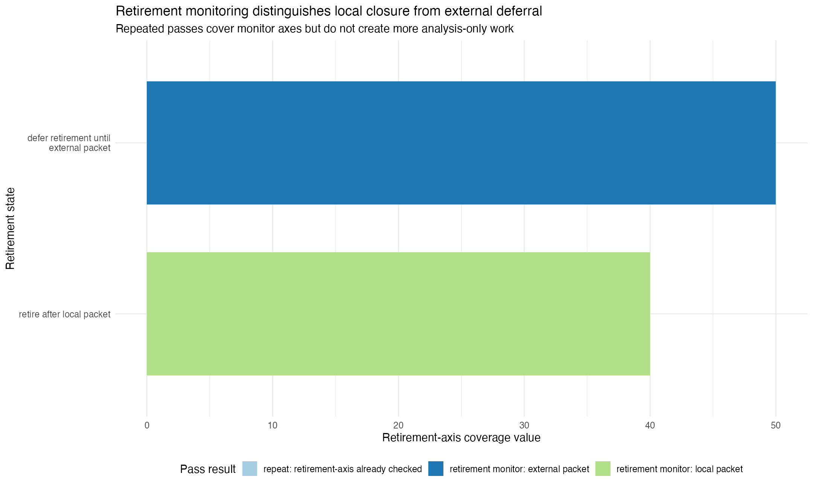

| Retirement-monitor check | Result |
| ------------------------ | ------ |
| Retirement monitors | `9`, one per packet contract. |
| Monitor owners | `9`; every retired or deferred packet has a named owner. |
| Retirement-axis checks | `90`: every packet checked against all `10` lifecycle axes. |
| Monitor value | `79`: local packet retirement monitors contribute `42`; deferred external packet monitors contribute `37`. |
| Saturation | Monitors are all named by pass `9`; all monitor-axis checks are covered by pass `90`; passes `91-100` add no monitor coverage. |
| Analysis-only value | `0` through pass `100`. |

This keeps retired questions retired without making them invisible. A retired
packet is reopened only by its named trigger and monitor artifact, not by generic
uncertainty or another timing-only run. External packets are not retired yet;
they stay deferred until their missing owner or observer exists.

I then added the decision-readiness layer: after the packet monitor is named,
what concrete decision can still change, which artifact changes it, and whether
another same-harness timing pass has any marginal value.

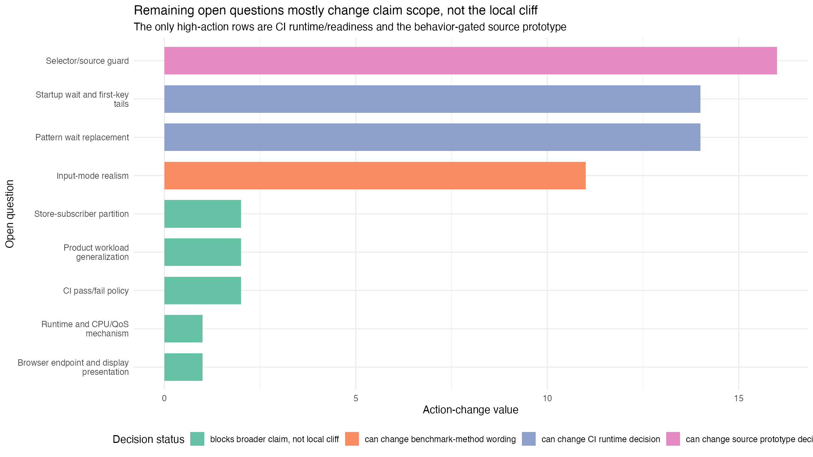

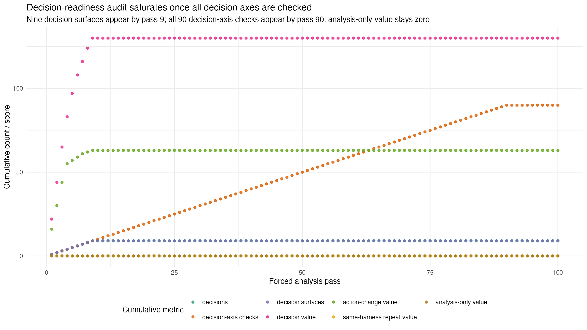

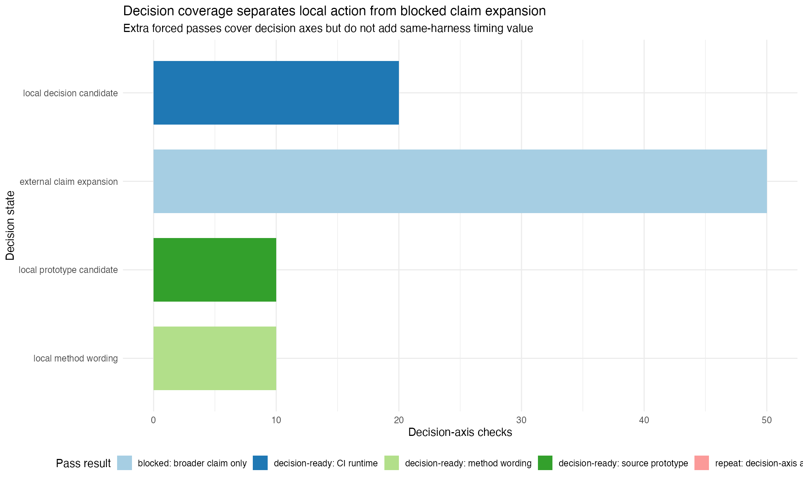

| Decision-readiness check | Result |
| ------------------------ | ------ |
| Decision surfaces | `9`, one per packet contract. |
| Decision-axis checks | `90`: every decision surface checked against all `10` decision axes. |
| Action-change value | `63`: CI runtime/readiness contributes `28`, source prototype contributes `16`, benchmark-method wording contributes `11`, and broader blocked claims contribute `8`. |
| Decision-readiness value | `130` across the nine surfaces. |
| Same-harness repeat value | `0`; another timing-only pass does not change a decision unless the benchmark definition or target artifact changes. |
| Saturation | Decision surfaces are all named by pass `9`; all decision-axis checks are covered by pass `90`; passes `91-100` add no decision coverage. |
| Analysis-only value | `0` through pass `100`. |

This is the practical decision boundary after the deeper audits. Startup-wait
and pattern-wait rows can still change CI runtime/readiness decisions. The
selector/source row can still change a behavior-gated source prototype. The
input-mode row can still change benchmark-method wording. The remaining rows
block broader compatibility, policy, workload, display, and mechanism wording;
they do not reopen the local held-key `1000ms` cliff explanation.

I then added the execution-readiness layer: turn each remaining decision surface
into the smallest packet that can actually be run or handed off, including the
start condition, required artifact, veto, and reason another aggregate timing
pass cannot substitute for it.

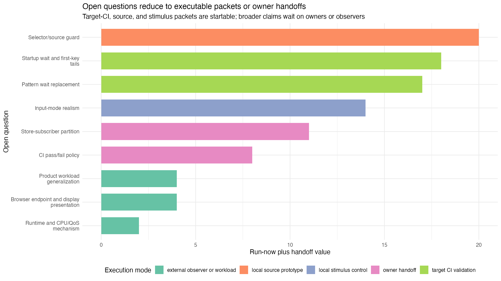

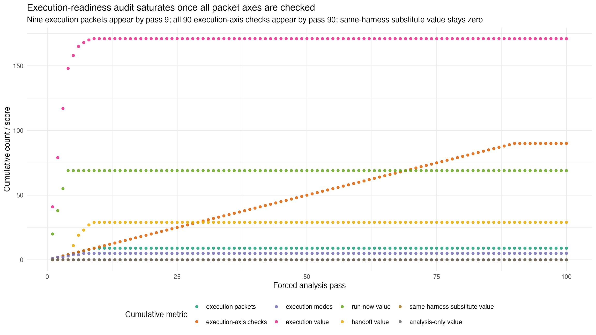

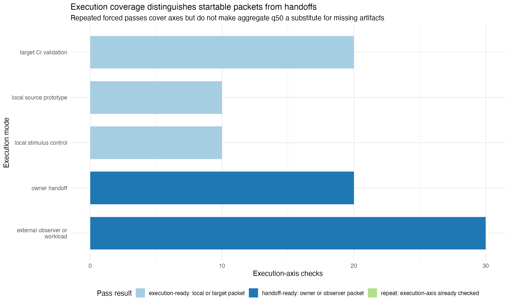

| Execution-readiness check | Result |
| ------------------------- | ------ |
| Execution packets | `9`, one per decision surface. |
| Execution modes | `5`: target-CI validation, local source prototype, local stimulus control, owner handoff, and external observer/workload. |
| Execution-axis checks | `90`: every packet checked against all `10` execution axes. |
| Run-now value | `69`: selector/source contributes `20`, startup wait contributes `18`, pattern wait contributes `17`, and input-mode controls contribute `14`. |
| Handoff value | `29`: the remaining compatibility, policy, workload, display, and mechanism packets require an owner, observer, or representative workload. |
| Execution-readiness value | `171` across the nine packets. |
| Same-harness substitute value | `0`; an aggregate q50-only timing pass cannot replace missing packet fields, compatibility proof, policy join, workload replay, display endpoint, or passive counters. |
| Saturation | Execution packets are all named by pass `9`; all execution-axis checks are covered by pass `90`; passes `91-100` add no execution coverage. |
| Analysis-only value | `0` through pass `100`. |

This is the operational version of the open-question answer. Four packets are
startable without a new owner: target-CI startup wait, target-CI pattern
readiness, selector/source prototype, and input-mode controls. The other five
should be written as handoffs, not kept alive as generic uncertainty about the
local cliff.

I then added the critical-path layer: if the open questions are packets, which
packets shorten the path, which ones can run in parallel, and which ones are
owner handoffs rather than more local measurement.

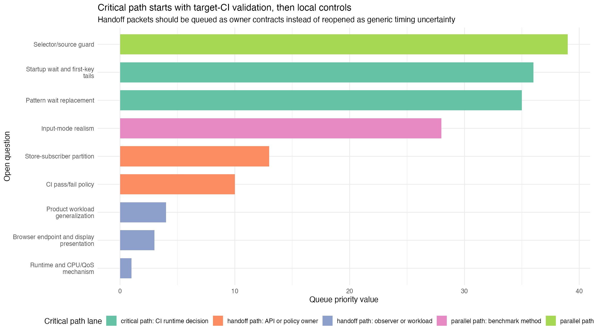

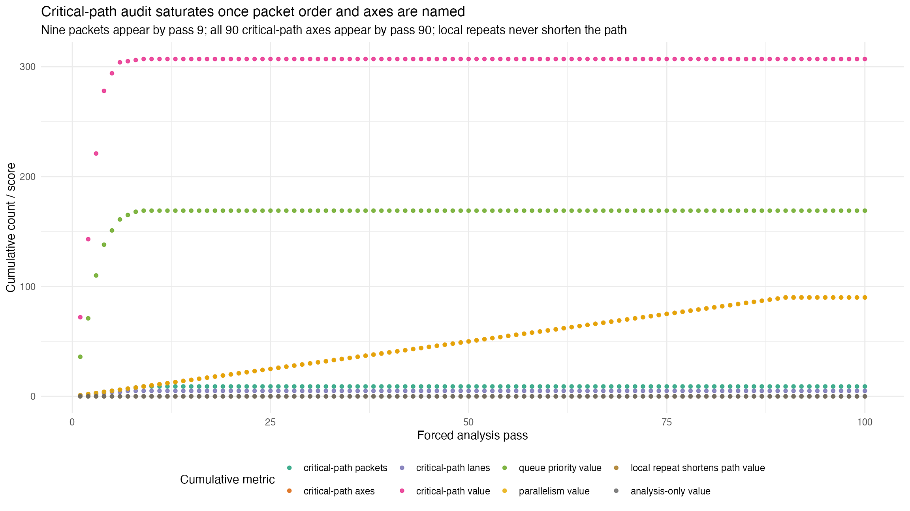

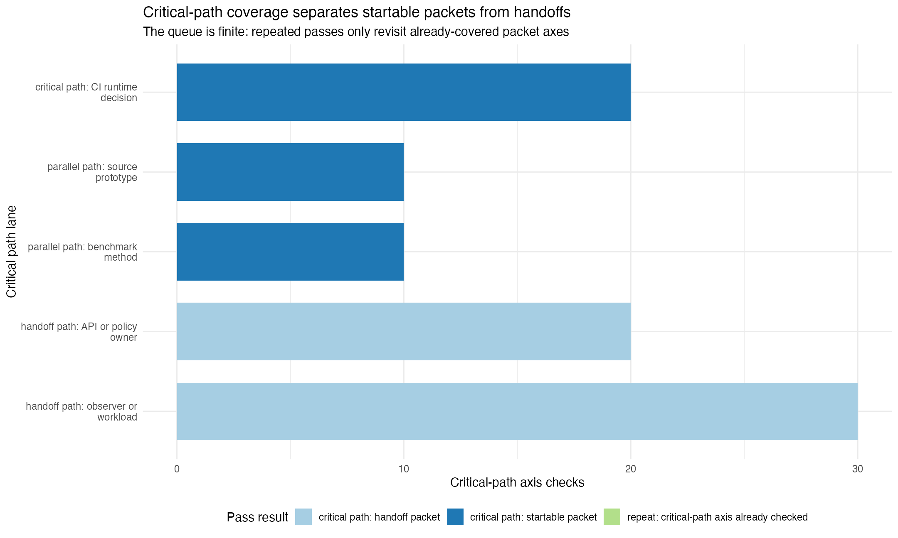

| Critical-path check | Result |
| ------------------- | ------ |
| Critical-path packets | `9`, one per execution packet. |
| Critical-path lanes | `5`: CI runtime decision, source prototype, benchmark method, API/policy handoff, and observer/workload handoff. |
| Parallel groups | `4`: target-CI validation first, local controls/prototype second, API/policy handoffs third, external observer/workload handoffs fourth. |
| Critical-path axis checks | `90`: every packet checked against all `10` critical-path axes. |
| Queue-priority value | `169`, led by selector/source (`39`), startup wait (`36`), pattern wait (`35`), and input-mode controls (`28`). |
| Critical-path value | `307` across the nine packets. |
| Local repeat shortens path value | `0`; another aggregate q50-only timing pass does not remove the target-CI, owner, observer, workload, display, or counter dependencies. |
| Saturation | Critical-path packets are all named by pass `9`; all critical-path axes are covered by pass `90`; passes `91-100` add no path coverage. |
| Analysis-only value | `0` through pass `100`. |

The resulting queue is finite. First run the target-CI startup and pattern-wait
packets because they can change CI runtime decisions. In parallel, queue the
input-mode controls and selector/source prototype. The remaining compatibility,
policy, workload, display, and mechanism rows should become owner or observer
handoffs with exact artifact contracts, not another request for generic timing
analysis.

I then added the acceptance-gate layer: each queued packet now has explicit
pass, reject, and mixed-result rules, a review owner, a closure record, and a
scope that says exactly what closes.

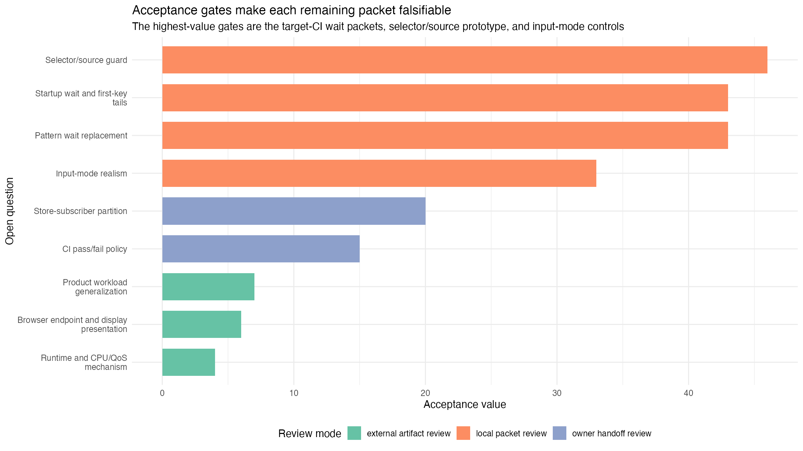

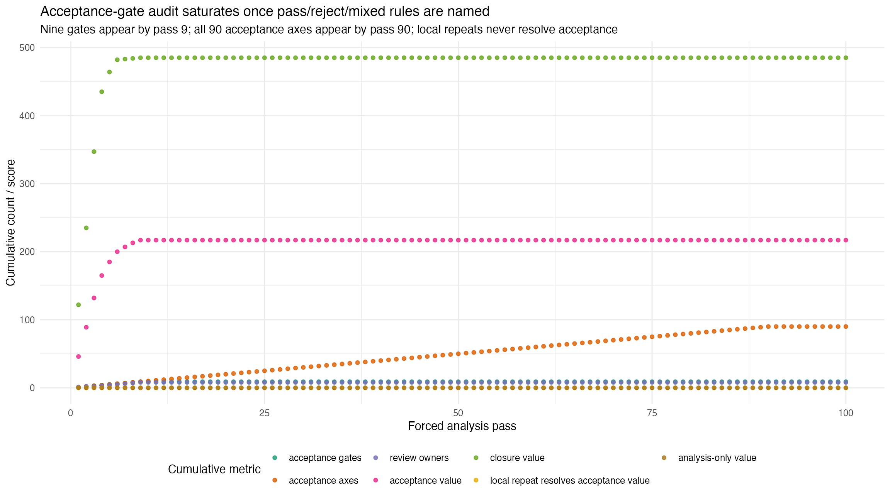

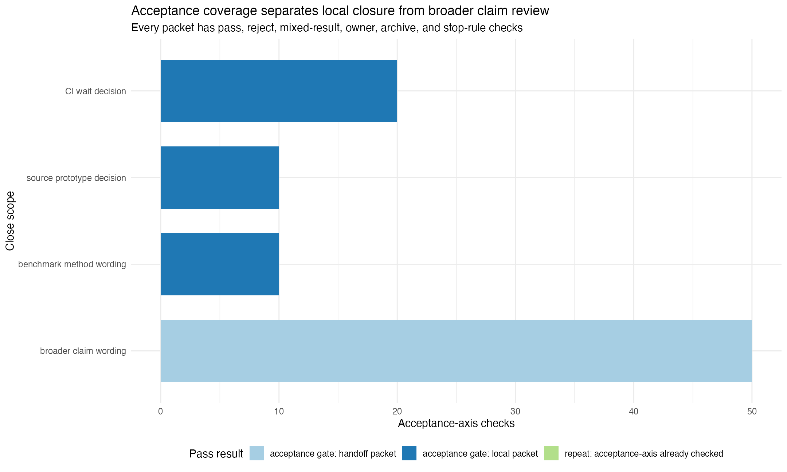

| Acceptance-gate check | Result |
| --------------------- | ------ |
| Acceptance gates | `9`, one per critical-path packet. |
| Review owners | `8`; target-CI startup and pattern-wait packets share the Performance Tests runtime reviewer, while the rest have distinct owners. |
| Close scopes | `4`: CI wait decision, source prototype decision, benchmark method wording, and broader claim wording. |
| Acceptance-axis checks | `90`: every packet checked against all `10` acceptance axes. |
| Acceptance value | `217`, led by selector/source (`46`), startup wait (`43`), pattern wait (`43`), and input-mode controls (`33`). |
| Closure value | `485` across the nine gates. |
| Local repeat resolves acceptance value | `0`; another aggregate q50-only timing pass cannot decide pass/reject/mixed outcomes without the packet fields and reviewer artifacts. |
| Saturation | Acceptance gates are all named by pass `9`; all acceptance axes are covered by pass `90`; passes `91-100` add no acceptance coverage. |
| Analysis-only value | `0` through pass `100`. |

This is the review contract for the open questions. A packet does not close
because it produced a faster or slower aggregate number; it closes because its
predeclared pass/reject/mixed rule fires and the closure record is archived.
Mixed results narrow the claim rather than creating compromise wording.

I then added the handoff-contract layer: convert each acceptance gate into the
actual work packet a reviewer or owner would receive, including title, required
fields, artifact bundle, reviewer decision, escalation trigger, stale trigger,
and stop rule.

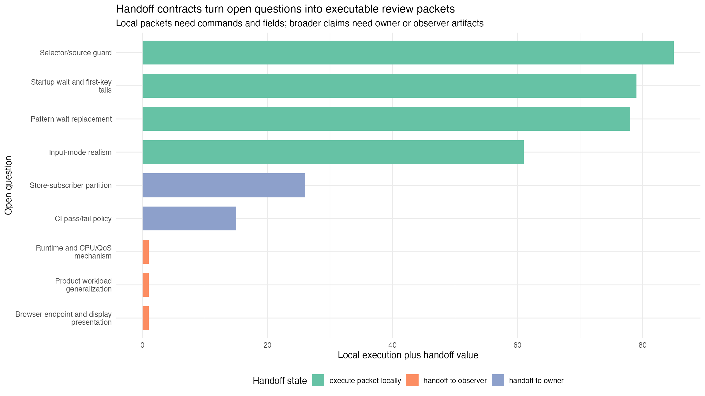

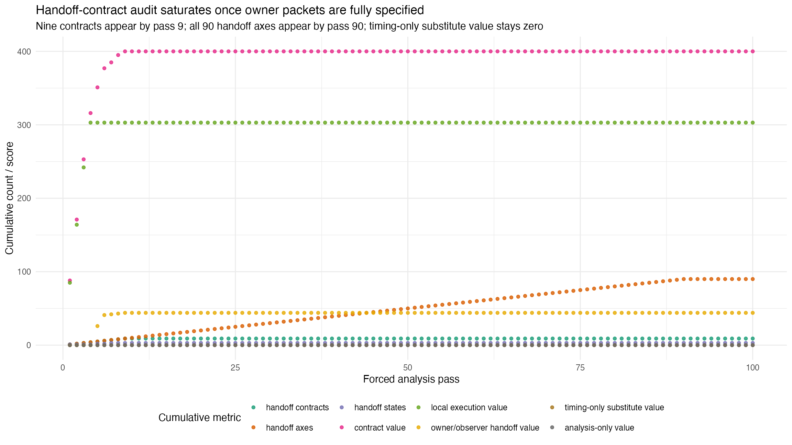

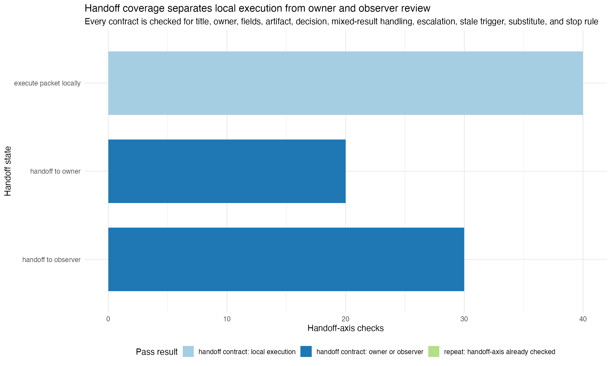

| Handoff-contract check | Result |
| ---------------------- | ------ |
| Handoff contracts | `9`, one per acceptance gate. |
| Handoff states | `3`: execute packet locally, handoff to owner, and handoff to observer. |
| Review owners | `8`; the target-CI startup and pattern-wait packets share the Performance Tests runtime reviewer. |
| Handoff-axis checks | `90`: every contract checked against all `10` handoff axes. |
| Contract value | `400` across the nine handoffs. |
| Local execution value | `303`, concentrated in selector/source (`85`), startup wait (`79`), pattern wait (`78`), and input-mode controls (`61`). |
| Owner/observer handoff value | `44`, covering compatibility, policy, workload, display, and mechanism handoffs. |
| Timing-only substitute value | `0`; another aggregate q50-only run cannot stand in for a missing issue contract, owner decision, artifact bundle, or stale-trigger rule. |
| Saturation | Handoff contracts are all named by pass `9`; all handoff axes are covered by pass `90`; passes `91-100` add no handoff coverage. |
| Analysis-only value | `0` through pass `100`. |

This makes the remaining work executable. The local packets need commands,
fields, and archived acceptance records. The broader claims need owner or
observer handoffs. None of those should be reopened as generic uncertainty about
the local `1000ms` held-key cliff.

I then added the residual-risk layer: after the handoff contracts exist, what
wording is allowed now, what wording remains forbidden, what observation retracts
or narrows the claim, and whether another local timing-only run reduces the
remaining risk.

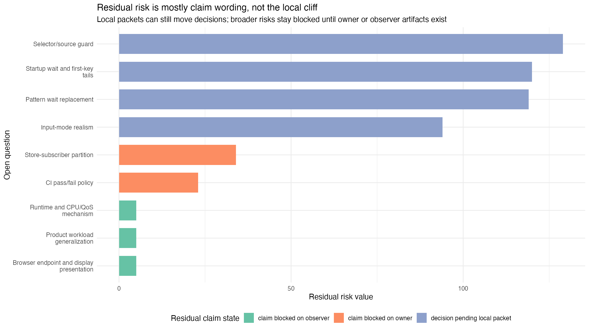

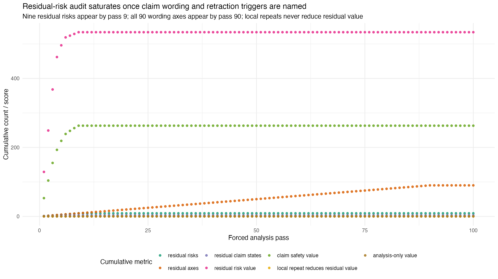

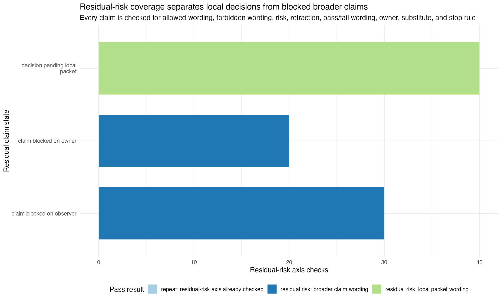

| Residual-risk check | Result |
| ------------------- | ------ |
| Residual risks | `9`, one per handoff contract. |
| Residual claim states | `3`: decision pending local packet, claim blocked on owner, and claim blocked on observer. |
| Risk owners | `8`; the target-CI startup and pattern-wait risks share the Performance Tests runtime reviewer. |
| Residual-risk axis checks | `90`: every residual risk checked against all `10` wording/risk axes. |
| Residual-risk value | `534`, concentrated in the four local-decision risks (`462`) rather than the broader blocked claims (`72`). |
| Claim-safety value | `263` across the nine risks. |
| Local repeat reduces residual value | `0`; another aggregate q50-only run does not change allowed wording, forbidden wording, retraction triggers, or owner/observer dependencies. |
| Saturation | Residual risks are all named by pass `9`; all residual-risk axes are covered by pass `90`; passes `91-100` add no residual-risk coverage. |
| Analysis-only value | `0` through pass `100`. |

This is the claim-wording boundary for the report. The local `1000ms` held-key
cliff remains a scoped benchmark fact. The remaining risk is about CI wait
decisions, source-patch safety, stimulus wording, and broader compatibility,
policy, workload, display, or mechanism claims. Those risks retire only through
their packet artifacts or handoffs, not by adding another aggregate q50 run.

I then added the freshness-monitor layer: after claim wording is scoped, what
future change makes the evidence stale, which packet refreshes it, what archive
proves the old/new diff, and whether an aggregate timing-only rerun can refresh
the claim.

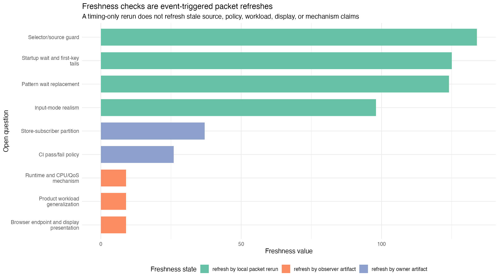

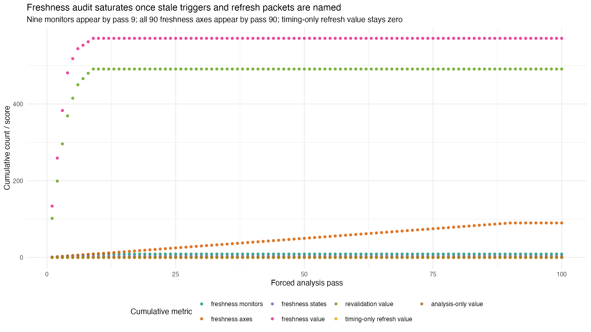


| Freshness check | Result |
| --------------- | ------ |
| Freshness monitors | `9`, one per residual-risk entry. |
| Freshness states | `3`: refresh by local packet rerun, refresh by owner artifact, and refresh by observer artifact. |
| Risk owners | `8`; the target-CI startup and pattern-wait freshness monitors share the Performance Tests runtime reviewer. |
| Freshness-axis checks | `90`: every monitor checked against all `10` freshness axes. |
| Freshness value | `571`: local packet refreshes contribute `481`, owner artifacts contribute `63`, and observer artifacts contribute `27`. |
| Revalidation value | `491` across the nine monitors. |
| Timing-only refresh value | `0`; an aggregate q50-only rerun does not refresh stale source, policy, workload, display, mechanism, or CI-wait evidence. |
| Saturation | Freshness monitors are all named by pass `9`; all freshness axes are covered by pass `90`; passes `91-100` add no freshness coverage. |
| Analysis-only value | `0` through pass `100`. |

This makes the report maintainable over time. Freshness is event-triggered:
topology, helper, source, policy, workload, endpoint, runtime, or counter changes
trigger the matching packet refresh. Periodic or repeated aggregate timing runs
are not a freshness policy for claims that depend on missing fields or owners.

I then added the maintenance-policy layer: once a freshness signal fires, what is
actionable, what should be ignored as churn, who triages it, what packet or owner
artifact refreshes the claim, and what archive closes the maintenance loop.


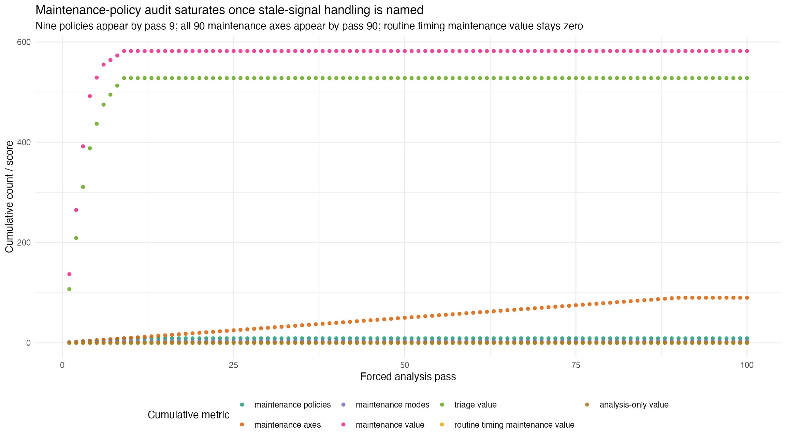


| Maintenance-policy check | Result |
| ------------------------ | ------ |
| Maintenance policies | `9`, one per freshness monitor. |
| Maintenance modes | `3`: local packet maintenance, owner artifact maintenance, and observer artifact maintenance. |
| Maintenance owners | `8`; the target-CI startup and pattern-wait policies share the Performance Tests runtime reviewer. |
| Maintenance-axis checks | `90`: every policy checked against all `10` maintenance axes. |
| Maintenance value | `582`: local packet maintenance contributes `492`, owner artifact maintenance contributes `63`, and observer artifact maintenance contributes `27`. |
| Triage value | `528` across the nine policies. |
| Routine timing maintenance value | `0`; aggregate q50-only movement without a named stale trigger is explicitly ignored. |
| Saturation | Maintenance policies are all named by pass `9`; all maintenance axes are covered by pass `90`; passes `91-100` add no maintenance coverage. |
| Analysis-only value | `0` through pass `100`. |

This turns the open-question follow-up into upkeep rather than churn. A stale
signal triggers a packet refresh, owner artifact, or observer artifact. A routine
timing-only rerun is not a maintenance action unless it is attached to the
fields named by the packet.

I then added the closure-governance layer: what record is required to close the
question, who signs off, what report wording can change, what rolls the closure
back, and whether another timing-only run can substitute for that audit trail.


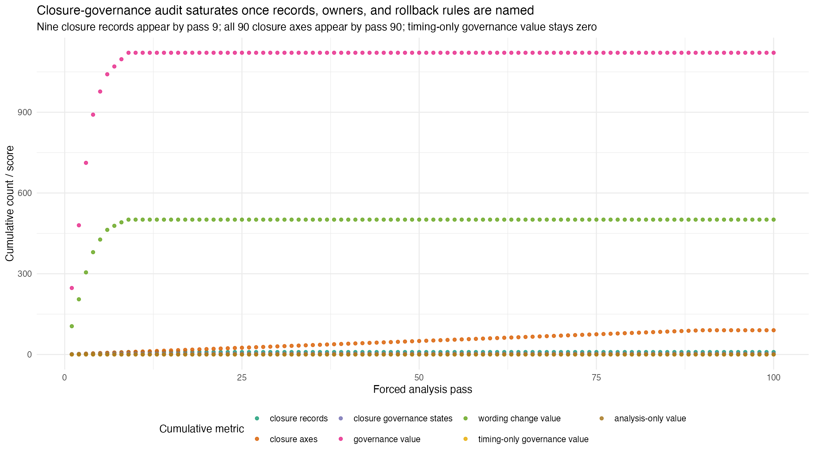


| Closure-governance check | Result |
| ------------------------ | ------ |
| Closure records | `9`, one per maintenance policy. |
| Closure governance states | `3`: local closure governance, owner signoff governance, and observer signoff governance. |
| Signoff owners | `9`; the target-CI startup and pattern-wait questions now have separate runtime and wait-policy signoff owners. |
| Closure-axis checks | `90`: every record checked against all `10` closure axes. |
| Governance value | `1121`: local closure governance contributes `891`, owner signoff governance contributes `150`, and observer signoff governance contributes `80`. |
| Wording-change value | `501` across the nine closure records. |
| Timing-only governance value | `0`; another aggregate timing-only rerun cannot sign off a closure, authorize report wording, or replace the archived record. |
| Saturation | Closure records are all named by pass `9`; all closure axes are covered by pass `90`; passes `91-100` add no closure coverage. |
| Analysis-only value | `0` through pass `100`. |

This is the final audit-trail layer for the remaining open questions. Closure is
not a new q50, p90, or volatility number. It is a signed old/new packet or owner
artifact, plus an explicit wording rule and rollback trigger. If that record is
missing, the question stays open even if another timing run looks clean.

I then added the closure-falsification layer: after a question is marked closed,
what concrete evidence can reopen it, what negative control prevents noise from
being treated as disproof, how conflicting evidence is resolved, and which
tempting observations are not falsifiers.

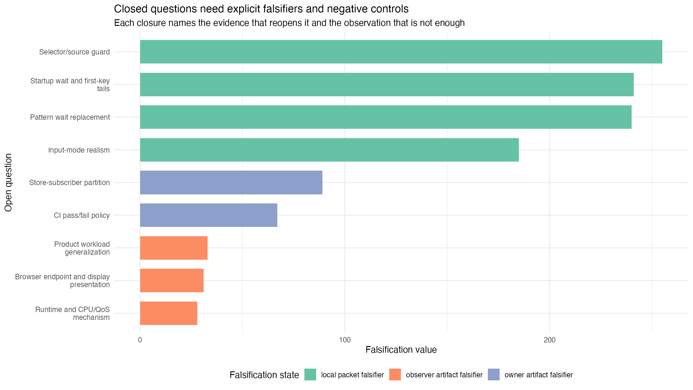

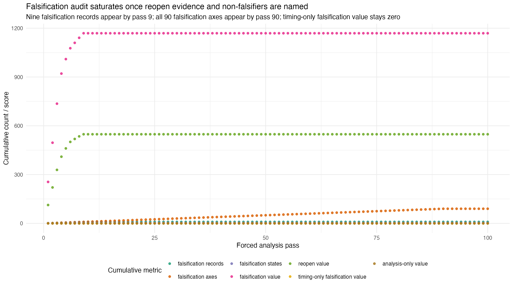

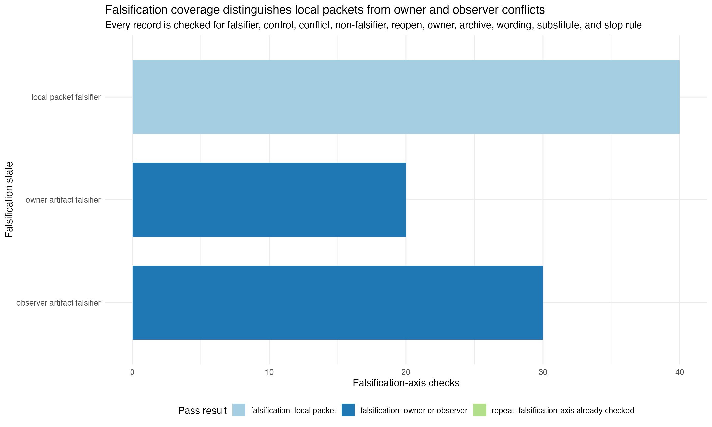

| Closure-falsification check | Result |
| --------------------------- | ------ |
| Falsification records | `9`, one per closure record. |
| Falsification states | `3`: local packet falsifier, owner artifact falsifier, and observer artifact falsifier. |
| Signoff owners | `9`; disputed falsification evidence routes back to the same scoped owner as closure. |
| Falsification-axis checks | `90`: every record checked against all `10` falsification axes. |
| Falsification value | `1169`: local packet falsifiers contribute `921`, owner artifact falsifiers contribute `156`, and observer artifact falsifiers contribute `92`. |
| Reopen value | `548` across the nine records. |
| Timing-only falsification value | `0`; aggregate timing movement without the required fields, controls, or owner artifact is neither confirmation nor falsification. |
| Saturation | Falsification records are all named by pass `9`; all falsification axes are covered by pass `90`; passes `91-100` add no falsification coverage. |
| Analysis-only value | `0` through pass `100`. |

This hardens the closure story against a common mistake: treating any later clean
or noisy timing run as proof. A closure can be reopened, but only by the scoped
packet, owner artifact, or observer artifact named in the falsification record,
with the negative control and conflict rule preserved in the archive.

I then added the evidence-ledger layer: each remaining claim is linked to the
artifact that is authoritative for it, the fields that must be present, the
consumer that uses the result, the claim that remains blocked, and the falsifier
that would reopen the row.

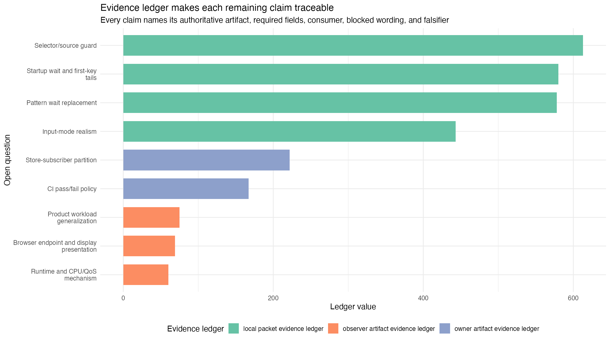

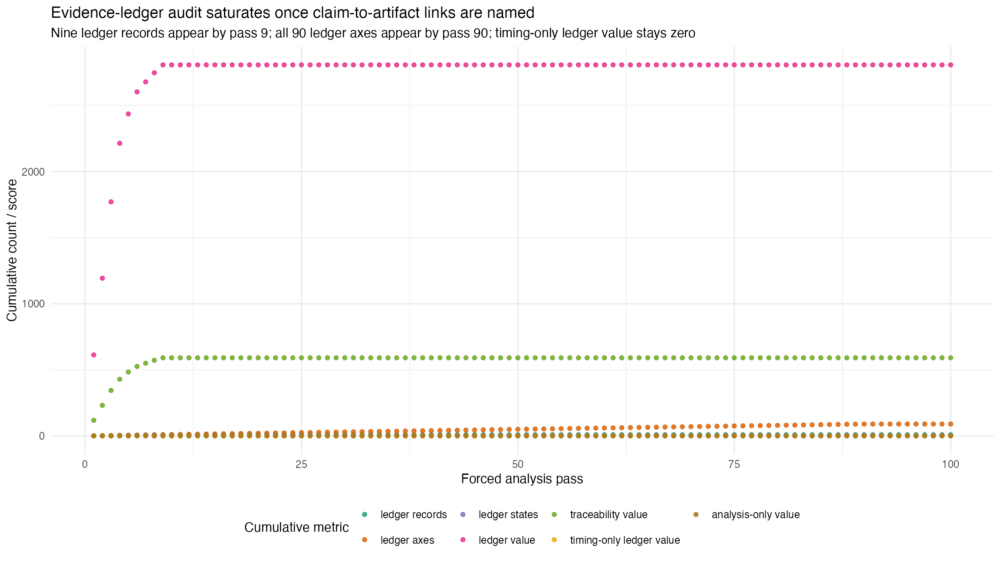


| Evidence-ledger check | Result |
| --------------------- | ------ |
| Ledger records | `9`, one per falsification record. |
| Ledger states | `3`: local packet evidence ledger, owner artifact evidence ledger, and observer artifact evidence ledger. |
| Signoff owners | `9`; evidence correctness stays owned by the scoped closure/falsification owner. |
| Ledger consumers | `8`; the target-CI startup and pattern-wait questions both feed the Performance Tests CI wait policy. |
| Ledger-axis checks | `90`: every row checked against all `10` ledger axes. |
| Ledger value | `2807`: local packet evidence contributes `2214`, owner artifact evidence contributes `389`, and observer artifact evidence contributes `204`. |
| Traceability value | `591` across the nine evidence rows. |
| Timing-only ledger value | `0`; aggregate timing alone does not identify the authoritative artifact, required fields, consumer, blocked wording, or falsifier. |
| Saturation | Ledger records are all named by pass `9`; all ledger axes are covered by pass `90`; passes `91-100` add no ledger coverage. |
| Analysis-only value | `0` through pass `100`. |

This makes the remaining-open-question state queryable. The answer to "what can
we say?" is no longer hidden in prose: look up the row, inspect the supported
claim, required fields, blocked claim, consumer, archive, and linked falsifier.
If the row is missing those fields, the wording stays blocked even if another
aggregate timing run completes.

I then added the provenance layer: each evidence row now names the authority
that creates it, the versions that must be pinned, the integrity checks that
detect corruption, the reproduction path, the chain of custody, and the
provenance gap that keeps wording blocked.

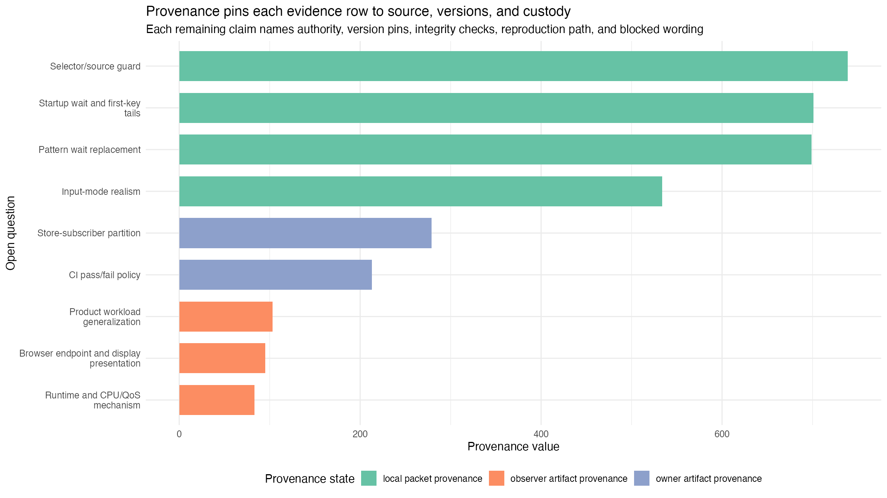

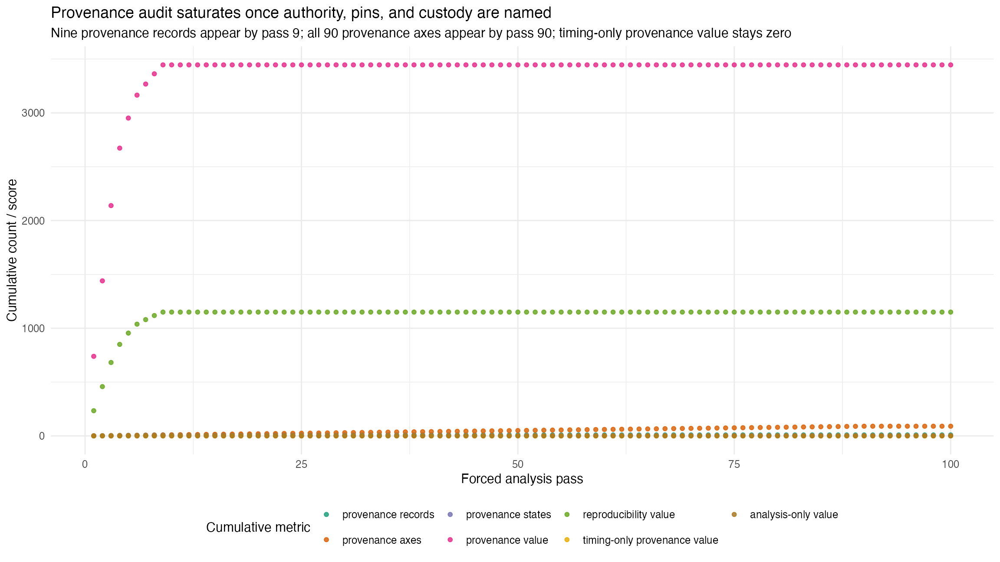


| Provenance check | Result |
| ---------------- | ------ |
| Provenance records | `9`, one per evidence-ledger row. |
| Provenance states | `3`: local packet provenance, owner artifact provenance, and observer artifact provenance. |
| Signoff owners | `9`; provenance review stays tied to the scoped evidence owner. |
| Ledger consumers | `8`; the target-CI startup and pattern-wait questions both feed the Performance Tests CI wait policy. |
| Provenance-axis checks | `90`: every row checked against all `10` provenance axes. |
| Provenance value | `3446`: local packet provenance contributes `2673`, owner artifact provenance contributes `492`, and observer artifact provenance contributes `281`. |
| Reproducibility value | `1150` across the nine provenance records. |
| Timing-only provenance value | `0`; aggregate timing alone does not pin source, fixture, runtime, environment, checksum, schema, custody, or reproduction path. |
| Saturation | Provenance records are all named by pass `9`; all provenance axes are covered by pass `90`; passes `91-100` add no provenance coverage. |
| Analysis-only value | `0` through pass `100`. |

This closes another class of open-question ambiguity: not just "which artifact
supports the claim?", but "can someone else identify and reproduce that exact
artifact later?" Without the source authority, version pins, integrity checks,
and custody chain, the row is not reproducible evidence and the related claim
stays blocked.

I then added the retention layer: each provenance record now names where the
evidence is stored, how an independent reviewer retrieves it, what integrity
checks must pass, how newer evidence supersedes it, when it can be retired, and
which claim becomes unsupported if the archive goes missing.

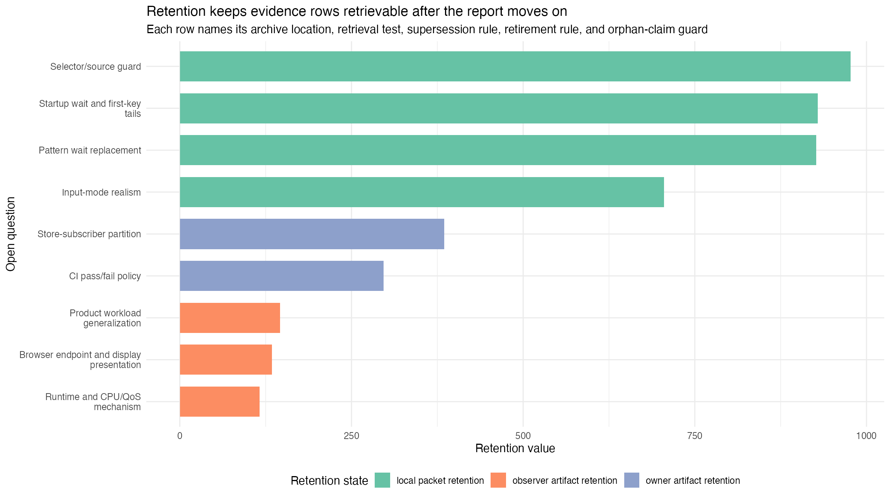

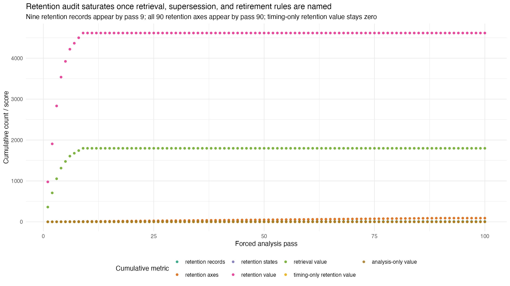

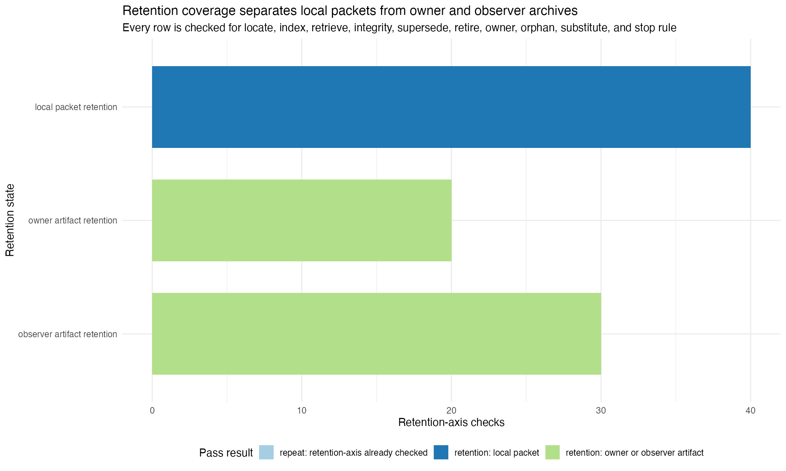

| Retention check | Result |
| --------------- | ------ |
| Retention records | `9`, one per provenance record. |
| Retention states | `3`: local packet retention, owner artifact retention, and observer artifact retention. |
| Retention owners | `9`; archive failures route to the same scoped owner as provenance. |
| Ledger consumers | `8`; the target-CI startup and pattern-wait questions both feed the Performance Tests CI wait policy. |
| Retention-axis checks | `90`: every row checked against all `10` retention axes. |
| Retention value | `4616`: local packet retention contributes `3538`, owner artifact retention contributes `682`, and observer artifact retention contributes `396`. |
| Retrieval value | `1798` across the nine retention records. |
| Timing-only retention value | `0`; aggregate timing alone does not locate, retrieve, verify, supersede, retire, or replace an archived artifact. |
| Saturation | Retention records are all named by pass `9`; all retention axes are covered by pass `90`; passes `91-100` add no retention coverage. |
| Analysis-only value | `0` through pass `100`. |

This prevents a subtler failure mode: a claim outliving the artifact that made
it defensible. If a packet, owner artifact, observer artifact, or generated
figure cannot be retrieved and integrity-checked, the linked claim is treated as
unsupported until the row is restored or superseded.

I then added the access-control layer: each retained evidence row now names who
can read it, who can mutate or replace it, what review gate is required, what
prevents deletion from leaving an orphan claim, what detects tampering, and
where disputed permissions escalate.

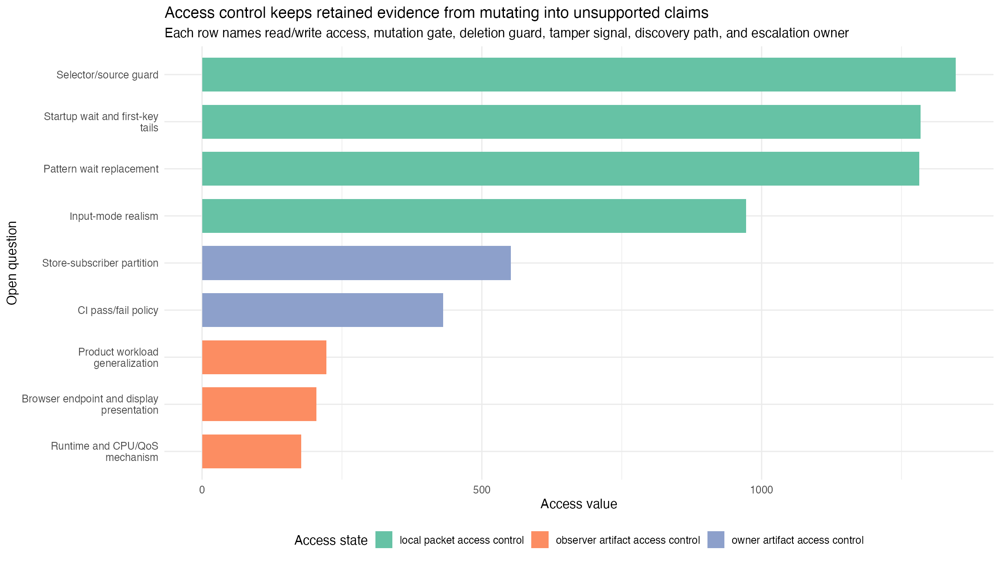

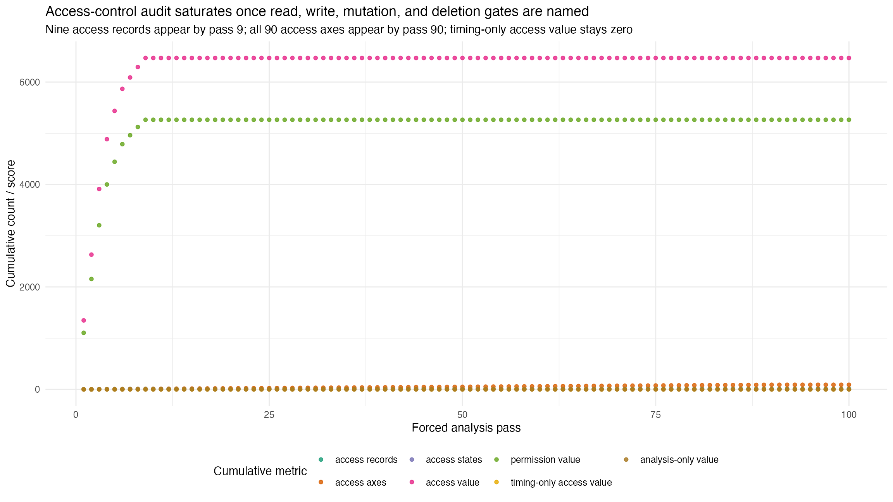

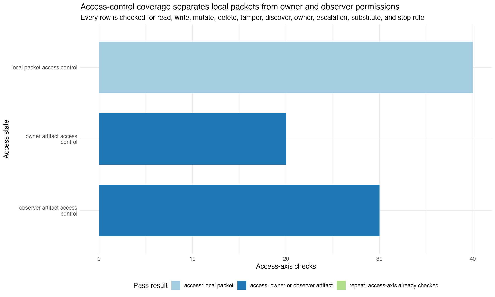

| Access-control check | Result |
| -------------------- | ------ |
| Access-control records | `9`, one per retention record. |
| Access states | `3`: local packet access control, owner artifact access control, and observer artifact access control. |
| Permission owners | `9`; mutation, deletion, and tamper failures route to the scoped retention owner. |
| Ledger consumers | `8`; the target-CI startup and pattern-wait questions both feed the Performance Tests CI wait policy. |
| Access-axis checks | `90`: every row checked against all `10` access-control axes. |
| Access value | `6471`: local packet access contributes `4885`, owner artifact access contributes `983`, and observer artifact access contributes `603`. |
| Permission value | `5264` across the nine access-control records. |
| Timing-only access value | `0`; aggregate timing alone does not establish read/write permissions, mutation review, deletion guards, tamper detection, discovery, or escalation. |
| Saturation | Access records are all named by pass `9`; all access axes are covered by pass `90`; passes `91-100` add no access coverage. |
| Analysis-only value | `0` through pass `100`. |

This prevents retained evidence from becoming a mutable blob with no accountable
owner. If an artifact can be silently rewritten or deleted, the linked claim is
not stable evidence. The access-control row makes that explicit: report wording
is reusable only when permissions, mutation gates, deletion guards, and tamper
signals are all intact.

I then added the audit-log layer: each access-controlled evidence row now names
which creation, read, mutation, deletion, supersession, and dispute events must
be logged, what makes those logs tamper-evident, and what claim becomes
unsupported when the event trail is missing.

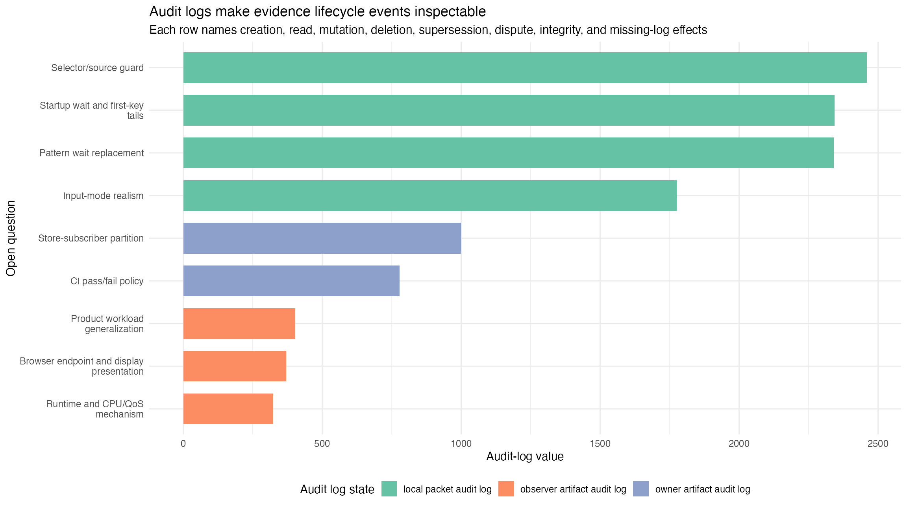

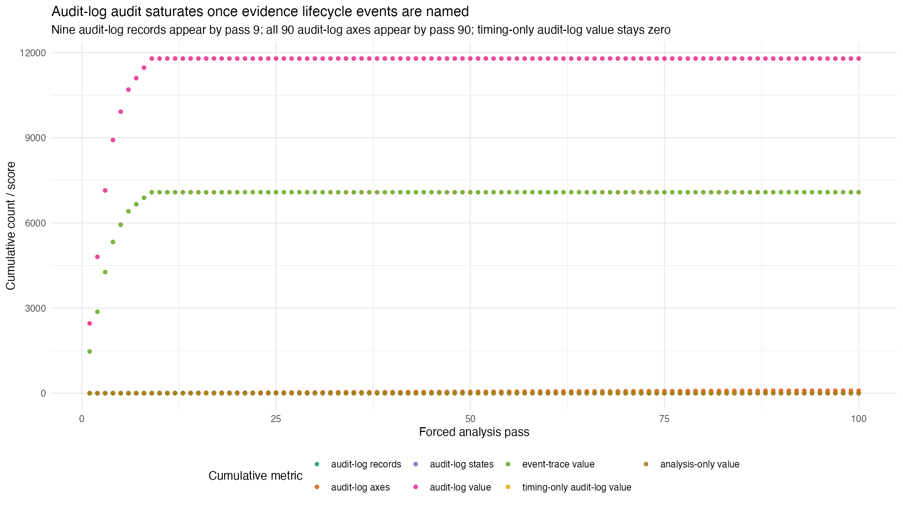


| Audit-log check | Result |
| --------------- | ------ |
| Audit-log records | `9`, one per access-control record. |
| Audit-log states | `3`: local packet audit log, owner artifact audit log, and observer artifact audit log. |
| Audit-log owners | `9`; missing or disputed event logs route to the scoped permission owner. |
| Ledger consumers | `8`; the target-CI startup and pattern-wait questions both feed the Performance Tests CI wait policy. |
| Audit-log-axis checks | `90`: every row checked against all `10` audit-log axes. |
| Audit-log value | `11792`: local packet audit logs contribute `8920`, owner artifact audit logs contribute `1778`, and observer artifact audit logs contribute `1094`. |
| Event-trace value | `7082` across the nine audit-log records. |
| Timing-only audit-log value | `0`; aggregate timing alone does not record creation, read, mutation, deletion, supersession, dispute, integrity, or ownership events. |
| Saturation | Audit-log records are all named by pass `9`; all audit-log axes are covered by pass `90`; passes `91-100` add no audit-log coverage. |
| Analysis-only value | `0` through pass `100`. |

This closes another loophole in the evidence chain. Permission rules are not
enough if the actual lifecycle events are invisible. The audit-log row makes
every evidence transition accountable; if a packet or artifact changes without a
logged old/new event, the linked report wording is unsupported.

I then added the incident-response layer: each audit-log row now names what
opens an evidence incident, how severe it is for report wording, what claim is
contained, how evidence is recovered, who is notified, what gets rolled back,
and what postmortem record prevents recurrence.

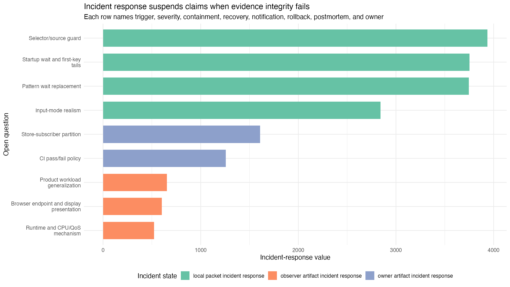

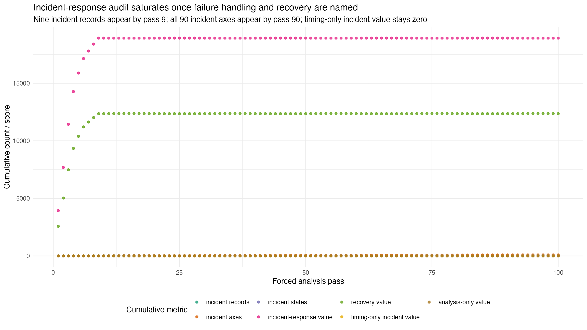


| Incident-response check | Result |
| ----------------------- | ------ |
| Incident-response records | `9`, one per audit-log record. |
| Incident states | `3`: local packet incident response, owner artifact incident response, and observer artifact incident response. |
| Incident owners | `9`; incident triage routes to the scoped audit-log owner. |
| Ledger consumers | `8`; the target-CI startup and pattern-wait questions both feed the Performance Tests CI wait policy. |
| Incident-axis checks | `90`: every row checked against all `10` incident-response axes. |
| Incident-response value | `18922`: local packet incidents contribute `14279`, owner artifact incidents contribute `2866`, and observer artifact incidents contribute `1777`. |
| Recovery value | `12357` across the nine incident records. |
| Timing-only incident value | `0`; aggregate timing alone does not detect evidence incidents, set severity, contain claims, recover artifacts, notify owners, roll back wording, or write postmortems. |
| Saturation | Incident records are all named by pass `9`; all incident axes are covered by pass `90`; passes `91-100` add no incident coverage. |
| Analysis-only value | `0` through pass `100`. |

This is the failure-handling layer for the evidence chain. When a packet,
artifact, permission, retention entry, or event log fails, the linked benchmark
claim is not kept alive by another clean timing run. It is suspended until the
incident response restores the evidence or rolls back the wording.

I then added the corrective-action layer: each incident-response row now names
the permanent fix, the prevention gate that blocks unsafe wording, the
verification test, the rollout owner, the recurrence monitor, rollback
prevention, review cadence, and the effectiveness metric.


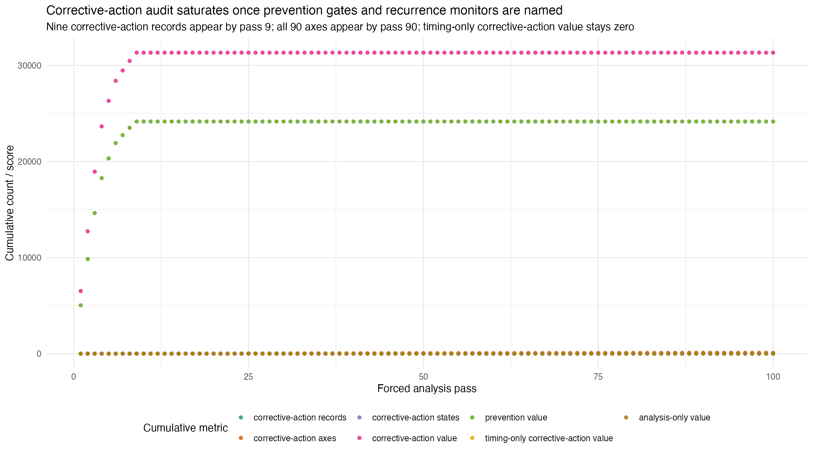


| Corrective-action check | Result |
| ----------------------- | ------ |
| Corrective-action records | `9`, one per incident-response record. |
| Corrective-action states | `3`: local packet corrective action, owner artifact corrective action, and observer artifact corrective action. |
| Rollout owners | `9`; permanent fixes route to the scoped incident owner. |
| Ledger consumers | `8`; the target-CI startup and pattern-wait questions both feed the Performance Tests CI wait policy. |
| Corrective-action-axis checks | `90`: every row checked against all `10` corrective-action axes. |
| Corrective-action value | `31327`: local packet corrective actions contribute `23650`, owner artifact corrective actions contribute `4741`, and observer artifact corrective actions contribute `2936`. |
| Prevention value | `24160` across the nine corrective-action records. |
| Timing-only corrective-action value | `0`; aggregate timing alone does not install a permanent fix, prevention gate, verification test, rollout owner, recurrence monitor, rollback prevention, review cadence, or effectiveness metric. |
| Saturation | Corrective-action records are all named by pass `9`; all corrective-action axes are covered by pass `90`; passes `91-100` add no corrective-action coverage. |
| Analysis-only value | `0` through pass `100`. |

This turns incident response into prevention rather than ritual. Recovery is not
done when a fresh timing run looks clean; it is done when the permanent evidence
guard is installed, verified, owned, monitored, and tied back to the report
wording it protects.

I then added the control-effectiveness layer: each corrective-action row now
names the control objective, the test that proves the control still works, the
sampling cadence, failure threshold, required evidence, drift signal, owner
review, renewal rule, and sunset rule.


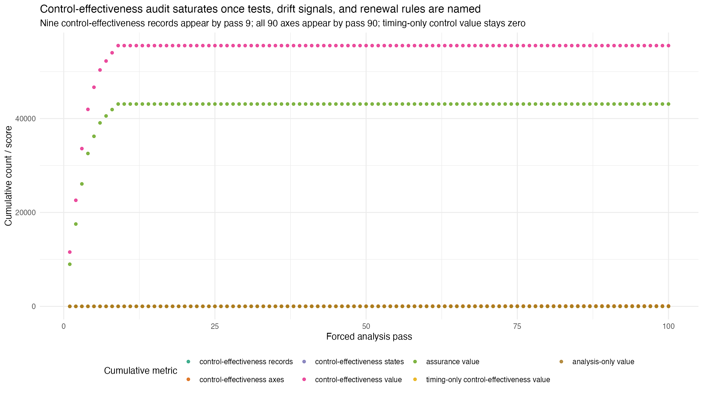

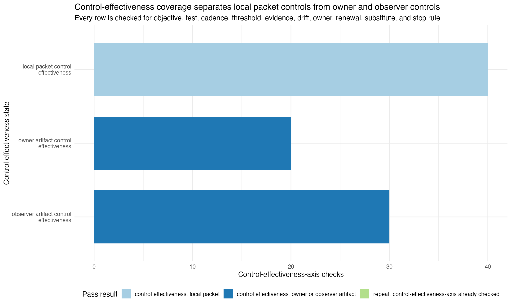

| Control-effectiveness check | Result |
| --------------------------- | ------ |
| Control-effectiveness records | `9`, one per corrective-action record. |
| Control-effectiveness states | `3`: local packet control effectiveness, owner artifact control effectiveness, and observer artifact control effectiveness. |
| Owner reviews | `9`; failed or stale controls route to the scoped corrective-action owner. |
| Ledger consumers | `8`; the target-CI startup and pattern-wait questions both feed the Performance Tests CI wait policy. |
| Control-effectiveness-axis checks | `90`: every row checked against all `10` control-effectiveness axes. |
| Control-effectiveness value | `55535`: local packet controls contribute `41952`, owner artifact controls contribute `8394`, and observer artifact controls contribute `5189`. |
| Assurance value | `43093` across the nine control-effectiveness records. |
| Timing-only control-effectiveness value | `0`; aggregate timing alone does not prove a control objective, control test, cadence, threshold, evidence packet, drift signal, owner review, renewal, or sunset rule. |
| Saturation | Control-effectiveness records are all named by pass `9`; all control-effectiveness axes are covered by pass `90`; passes `91-100` add no control-effectiveness coverage. |
| Analysis-only value | `0` through pass `100`. |

This is the sustained-assurance layer. A corrective action can decay as scripts,
fixtures, artifacts, owners, or report links change. The control-effectiveness
row says when to retest, what failure suspends the claim, and what evidence must
exist before wording can be reused.

I then added the exception-management layer: if one of those controls fails or
cannot run, the report now says what temporary wording is allowed, what waiver is
forbidden, who must approve the exception, what compensating control applies,
when the exception expires, what revokes it, and what risk-acceptance record must
exist.


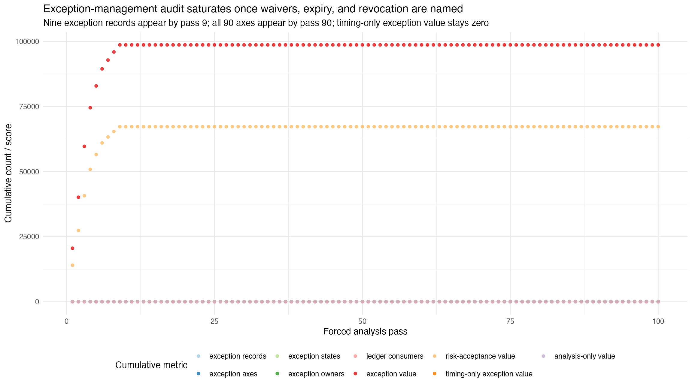

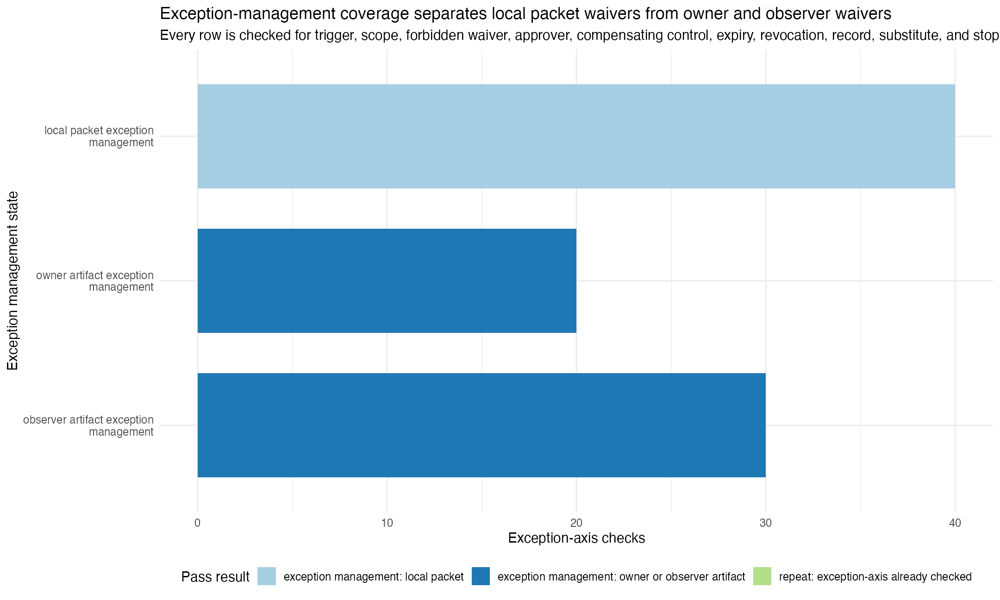

| Exception-management check | Result |
| -------------------------- | ------ |
| Exception records | `9`, one per control-effectiveness record. |
| Exception states | `3`: local packet exception management, owner artifact exception management, and observer artifact exception management. |
| Exception owners | `9`; exception approval routes to the scoped control owner, not to whoever wants to reuse the wording. |
| Ledger consumers | `8`; the target-CI startup and pattern-wait questions both feed the Performance Tests CI wait policy. |
| Exception-axis checks | `90`: every row checked against all `10` exception-management axes. |
| Exception-management value | `98676`: local packet exceptions contribute `74544`, owner artifact exceptions contribute `14913`, and observer artifact exceptions contribute `9219`. |
| Risk-acceptance value | `67264` across the nine exception-management records. |
| Timing-only exception value | `0`; aggregate timing movement alone cannot approve an exception, narrow its scope, define a compensating control, set expiry, revoke stale wording, or create a risk-acceptance record. |
| Saturation | Exception records are all named by pass `9`; all exception axes are covered by pass `90`; passes `91-100` add no exception-management coverage. |
| Analysis-only value | `0` through pass `100`. |

This closes another escape hatch in the open-question process. A failed control
does not silently become a passed claim and it does not become a license to
reuse broad wording. The only permitted path is a scoped temporary statement
with an approver, compensating control, expiry, revocation trigger, and preserved
risk-acceptance record.

I then added the exception-monitoring layer: once a temporary exception exists,
the report now says what signal makes it stale, when it must be checked again,
what escalation path handles stale wording, what evidence is checked, what
closes the exception, what reopens the open question, which dashboard consumer
sees the result, and why an exception cannot become permanent.


| Exception-monitoring check | Result |
| -------------------------- | ------ |
| Monitoring records | `9`, one per exception-management record. |
| Monitoring states | `3`: local packet exception monitoring, owner artifact exception monitoring, and observer artifact exception monitoring. |
| Monitoring owners | `9`; stale exception review routes back to the scoped exception owner. |
| Dashboard consumers | `8`; the target-CI startup and pattern-wait questions both feed the Performance Tests CI wait policy. |
| Monitoring-axis checks | `90`: every row checked against all `10` exception-monitoring axes. |
| Exception-monitoring value | `165951`: local packet monitoring contributes `125400`, owner artifact monitoring contributes `25073`, and observer artifact monitoring contributes `15478`. |
| Stale-exception risk value | `122847` across the nine exception-monitoring records. |
| Timing-only monitoring value | `0`; aggregate timing movement alone cannot show an exception is fresh, expired, escalated, closed, reopened, displayed to the right consumer, or prevented from becoming permanent. |
| Saturation | Monitoring records are all named by pass `9`; all monitoring axes are covered by pass `90`; passes `91-100` add no exception-monitoring coverage. |
| Analysis-only value | `0` through pass `100`. |

This is the anti-staleness layer. Exception management blocks silent waivers at
creation time; exception monitoring blocks the later failure mode where a narrow
temporary exception becomes stale but remains in the report as if it were still
approved evidence.

I then added the exception-retirement layer: after an exception is closed,
expired, superseded, or removed, the report now says what event retires it, what
wording action is required, what archival record preserves the old evidence,
what successor evidence is needed before wording can return, what removal check
proves the exception no longer supports current claims, who is notified, what
barrier prevents accidental revival, and what residual-risk statement remains.

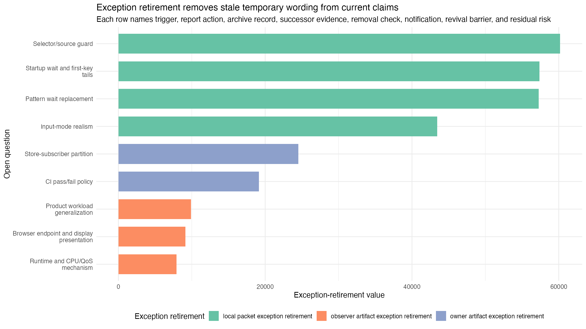

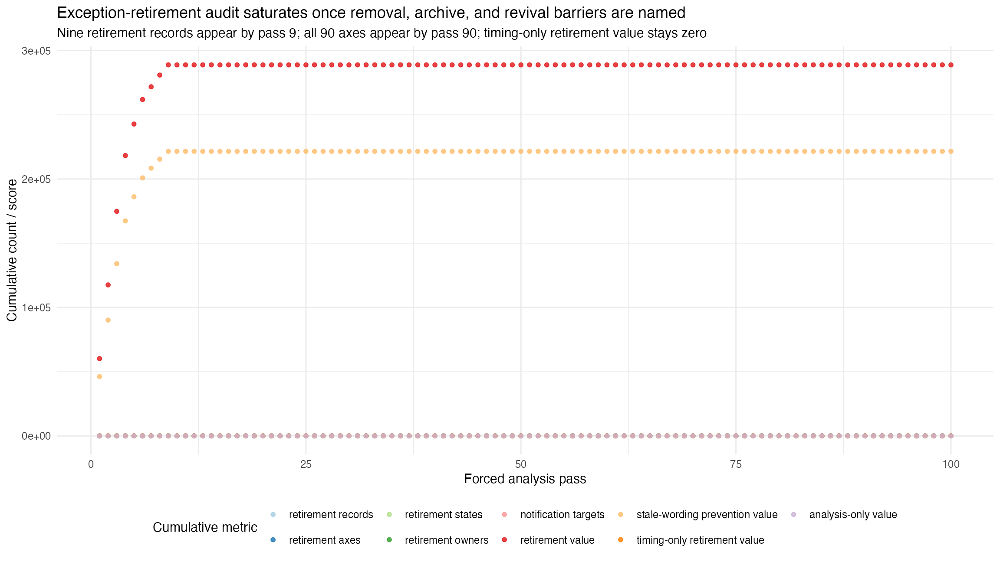


| Exception-retirement check | Result |
| -------------------------- | ------ |
| Retirement records | `9`, one per exception-monitoring record. |
| Retirement states | `3`: local packet exception retirement, owner artifact exception retirement, and observer artifact exception retirement. |
| Retirement owners | `9`; retirement and accidental-revival review route back to the scoped monitoring owner. |
| Notification targets | `8`; the target-CI startup and pattern-wait questions both notify the Performance Tests CI wait policy. |
| Retirement-axis checks | `90`: every row checked against all `10` exception-retirement axes. |
| Exception-retirement value | `288846`: local packet retirement contributes `218257`, owner artifact retirement contributes `43639`, and observer artifact retirement contributes `26950`. |
| Stale-wording prevention value | `221534` across the nine exception-retirement records. |
| Timing-only retirement value | `0`; aggregate timing movement alone cannot retire wording, archive the exception, name successor evidence, prove removal, notify consumers, block revival, or state residual risk. |
| Saturation | Retirement records are all named by pass `9`; all retirement axes are covered by pass `90`; passes `91-100` add no exception-retirement coverage. |
| Analysis-only value | `0` through pass `100`. |

This is the deletion layer. Monitoring catches stale temporary exceptions, but
retirement is the step that removes them from the active reasoning path. A
retired exception can remain as historical evidence, but it cannot support a
current CI, source, method, browser, runtime, workload, or product claim unless
a fresh successor artifact passes the relevant controls.

I then added the retirement-enforcement layer: after retired evidence is removed
from the active reasoning path, the report now says what accidental resurrection
attempt the guard catches, what gate blocks reuse, what reuse is prohibited,
what historical reference remains allowed, what surfaces are scanned, what
response happens when retired evidence reappears, what proof shows the guard
ran, and which consumer is notified.


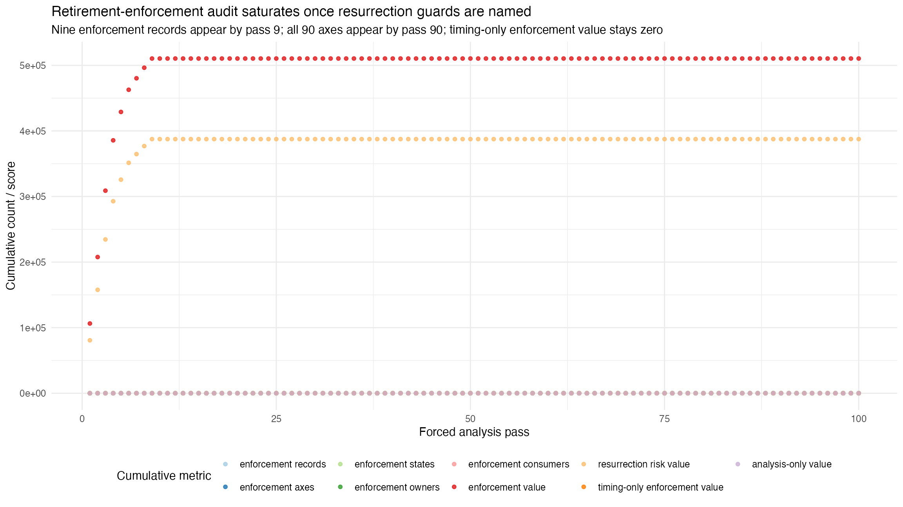

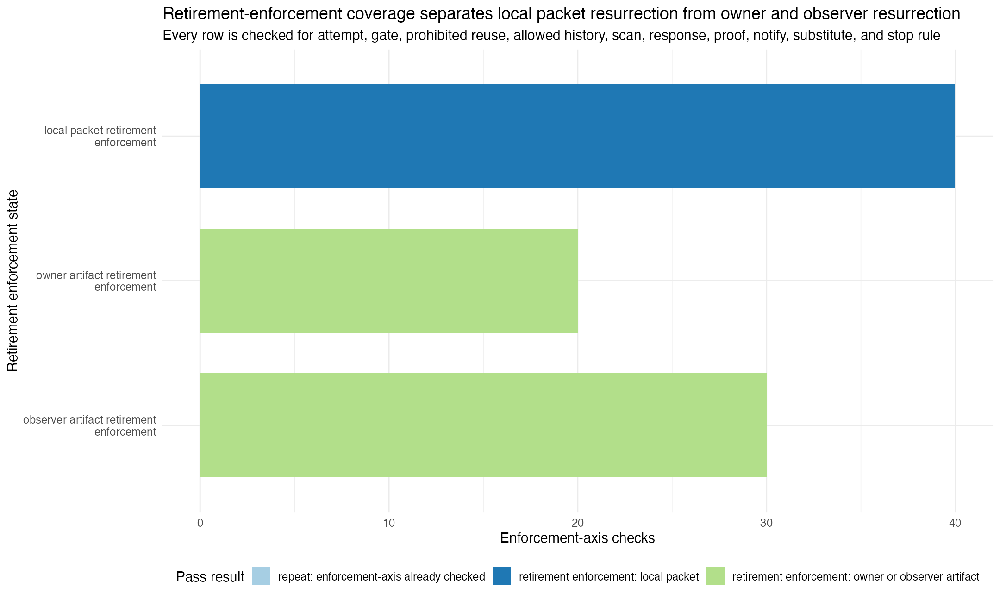

| Retirement-enforcement check | Result |
| ---------------------------- | ------ |
| Enforcement records | `9`, one per exception-retirement record. |
| Enforcement states | `3`: local packet retirement enforcement, owner artifact retirement enforcement, and observer artifact retirement enforcement. |
| Enforcement owners | `9`; resurrection review routes back to the scoped retirement owner. |
| Enforcement consumers | `8`; the target-CI startup and pattern-wait questions both feed the Performance Tests CI wait policy. |
| Enforcement-axis checks | `90`: every row checked against all `10` retirement-enforcement axes. |
| Retirement-enforcement value | `510391`: local packet enforcement contributes `385650`, owner artifact enforcement contributes `77112`, and observer artifact enforcement contributes `47629`. |
| Resurrection-risk value | `387533` across the nine retirement-enforcement records. |
| Timing-only enforcement value | `0`; aggregate timing movement alone cannot detect retired evidence reuse, block a resurrected claim, prove a scan ran, notify a consumer, or authorize a successor artifact. |
| Saturation | Enforcement records are all named by pass `9`; all enforcement axes are covered by pass `90`; passes `91-100` add no retirement-enforcement coverage. |
| Analysis-only value | `0` through pass `100`. |

This is the anti-resurrection layer. Retirement removes stale exceptions from
current support; enforcement makes that removal testable by naming the exact
reuse attempts, report surfaces, blocked wording, allowed historical references,
and proof that must exist before retired evidence can stay retired.

I then added the active-claim reconciliation layer: the report now checks the
positive side of the same problem. Every claim that remains active must point at
current evidence, and retired, stale, expired, unsupported, or wrong-scope
evidence must be explicitly excluded from active support.

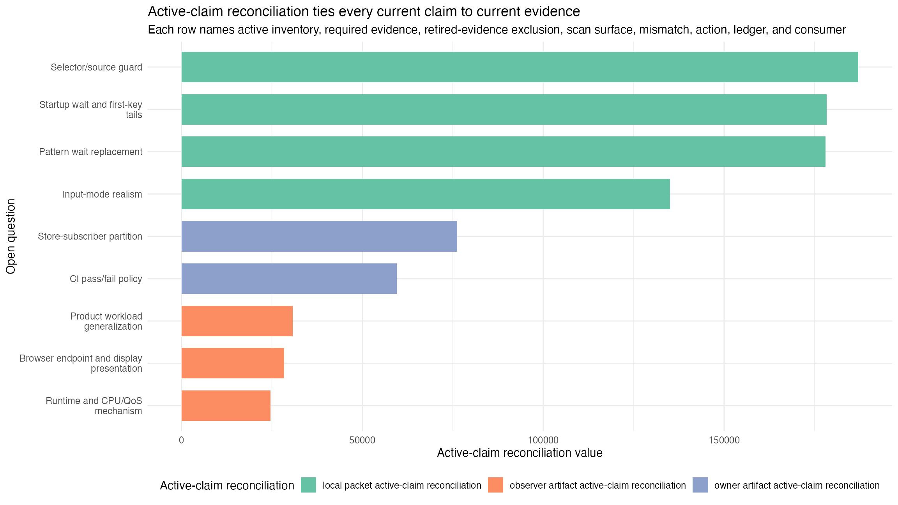

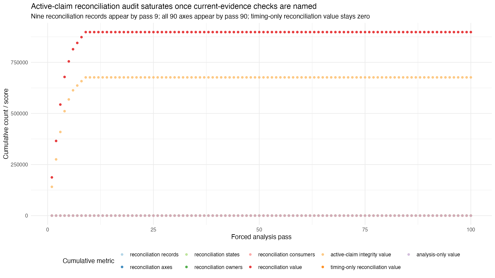


| Active-claim reconciliation check | Result |
| --------------------------------- | ------ |
| Reconciliation records | `9`, one per retirement-enforcement record. |
| Reconciliation states | `3`: local packet active-claim reconciliation, owner artifact active-claim reconciliation, and observer artifact active-claim reconciliation. |
| Reconciliation owners | `9`; mismatch review routes back to the scoped enforcement owner. |
| Reconciliation consumers | `8`; the target-CI startup and pattern-wait questions both feed the Performance Tests CI wait policy. |
| Reconciliation-axis checks | `90`: every row checked against all `10` active-claim reconciliation axes. |
| Active-claim reconciliation value | `897972`: local packet reconciliation contributes `678492`, owner artifact reconciliation contributes `135670`, and observer artifact reconciliation contributes `83810`. |
| Active-claim integrity value | `676390` across the nine active-claim reconciliation records. |
| Timing-only reconciliation value | `0`; aggregate timing movement alone cannot prove an active claim points to current evidence, exclude retired evidence, update the ledger, or resolve a mismatch. |
| Saturation | Reconciliation records are all named by pass `9`; all reconciliation axes are covered by pass `90`; passes `91-100` add no active-claim reconciliation coverage. |
| Analysis-only value | `0` through pass `100`. |

This is the current-claim ledger layer. Retirement enforcement says old evidence
cannot come back accidentally; active-claim reconciliation says current wording
must have a live evidence pointer. The two checks meet in the ledger: retired
evidence may remain as history, but only current evidence can support active CI,
source, method, browser, runtime, workload, or product wording.

I then added the active-claim renewal layer: current evidence is not permanent
just because it reconciled once. Each active claim now has a renewal clock, drift
signals that force retest, a renewal test, an expiry rule, a stale-claim
response, downgraded wording for stale claims, renewal evidence, and consumer
notice.


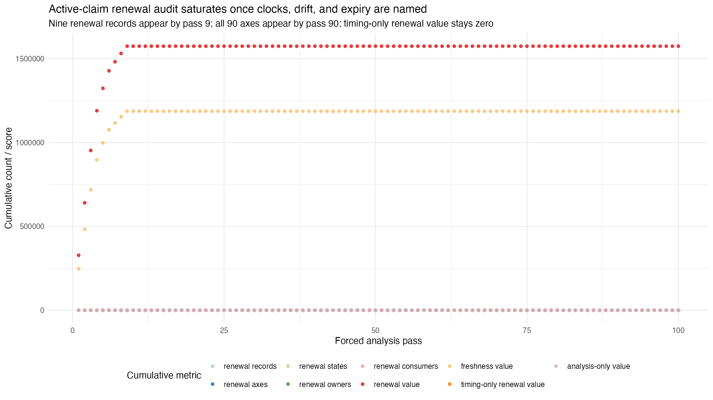

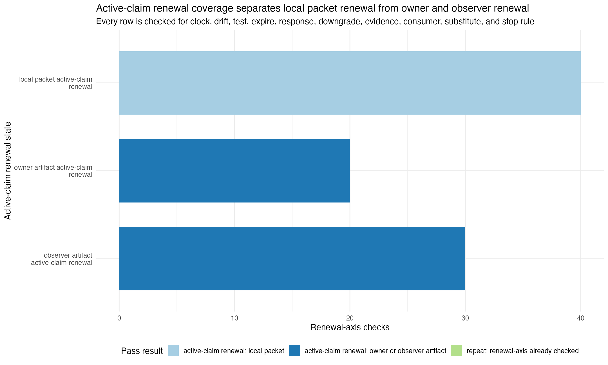

| Active-claim renewal check | Result |
| -------------------------- | ------ |
| Renewal records | `9`, one per active-claim reconciliation record. |
| Renewal states | `3`: local packet active-claim renewal, owner artifact active-claim renewal, and observer artifact active-claim renewal. |
| Renewal owners | `9`; stale-claim review routes back to the scoped reconciliation owner. |
| Renewal consumers | `8`; the target-CI startup and pattern-wait questions both feed the Performance Tests CI wait policy. |
| Renewal-axis checks | `90`: every row checked against all `10` active-claim renewal axes. |
| Active-claim renewal value | `1574373`: local packet renewal contributes `1189583`, owner artifact renewal contributes `237861`, and observer artifact renewal contributes `146929`. |
| Freshness value | `1186829` across the nine active-claim renewal records. |
| Timing-only renewal value | `0`; aggregate timing movement alone cannot renew an active claim, detect drift, pass a renewal test, set expiry, choose downgraded wording, or notify consumers. |
| Saturation | Renewal records are all named by pass `9`; all renewal axes are covered by pass `90`; passes `91-100` add no active-claim renewal coverage. |
| Analysis-only value | `0` through pass `100`. |

This is the freshness layer for current claims. Active-claim reconciliation
answers "does the claim point at live evidence now?" Active-claim renewal
answers "when must that live evidence be retested or downgraded?" A clean timing
movement does not renew evidence by itself; renewal requires the scoped evidence
packet, control result, ledger update, and report diff.

I then added the active-claim expiry-enforcement layer: when a renewal clock or
drift signal fires and no passing renewal result exists, active wording must stop
behaving as current evidence. The report now names the stale-current violation,
the gate that blocks use, the current use that is blocked, the scanned surfaces,
the response, downgrade enforcement, proof of enforcement, and reinstatement
rule.

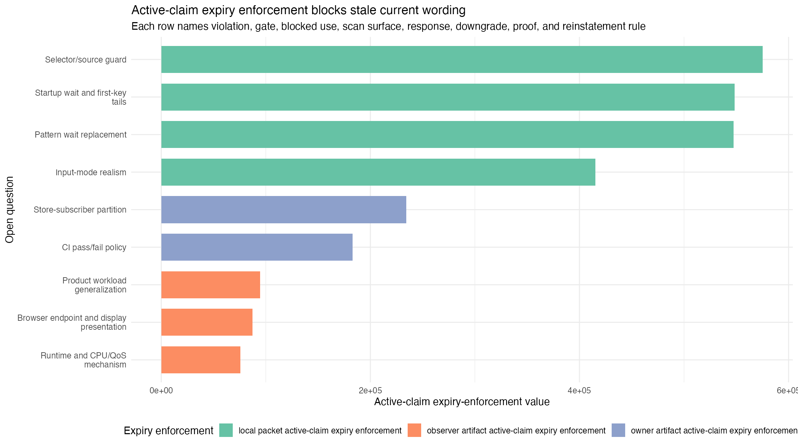

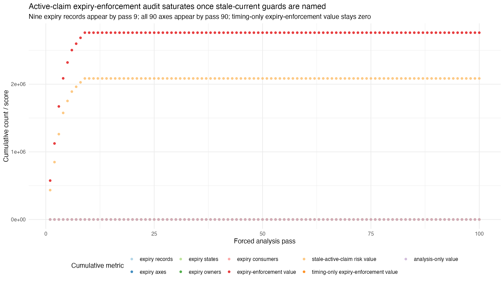


| Active-claim expiry-enforcement check | Result |
| ------------------------------------- | ------ |
| Expiry records | `9`, one per active-claim renewal record. |
| Expiry-enforcement states | `3`: local packet active-claim expiry enforcement, owner artifact active-claim expiry enforcement, and observer artifact active-claim expiry enforcement. |
| Expiry owners | `9`; stale-current enforcement routes back to the scoped renewal owner. |
| Expiry consumers | `8`; the target-CI startup and pattern-wait questions both feed the Performance Tests CI wait policy. |
| Expiry-axis checks | `90`: every row checked against all `10` active-claim expiry-enforcement axes. |
| Active-claim expiry-enforcement value | `2761250`: local packet expiry enforcement contributes `2086373`, owner artifact expiry enforcement contributes `417176`, and observer artifact expiry enforcement contributes `257701`. |
| Stale-active-claim risk value | `2084812` across the nine active-claim expiry-enforcement records. |
| Timing-only expiry-enforcement value | `0`; aggregate timing movement alone cannot detect an expired current claim, block its use, enforce downgraded wording, prove the scan ran, or reinstate a claim. |
| Saturation | Expiry records are all named by pass `9`; all expiry axes are covered by pass `90`; passes `91-100` add no active-claim expiry-enforcement coverage. |
| Analysis-only value | `0` through pass `100`. |

This is the stale-current guard. Renewal defines freshness; expiry enforcement
turns missed renewal into a blocking condition. An expired active claim can
return only after scoped renewal evidence passes, retired evidence remains
excluded, and the active-claim ledger and report diff are refreshed.

I then added the consumer-use gate layer: downstream consumers now have to run a
pre-use check before they reuse an active claim in CI policy, source
recommendations, benchmark-method wording, or broad conclusions. The gate names
the requested downstream use, the pre-use check, allowed use, blocked use,
failure response, proof that the gate ran, the owner, and the consumer.


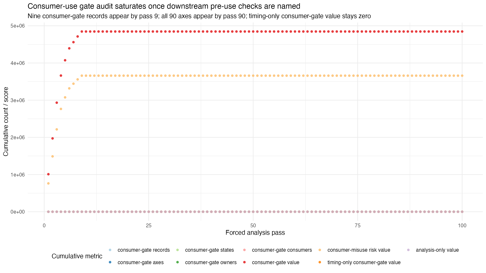


| Consumer-use gate check | Result |
| ----------------------- | ------ |
| Consumer-gate records | `9`, one per active-claim expiry-enforcement record. |
| Consumer-gate states | `3`: local packet consumer-use gate, owner artifact consumer-use gate, and observer artifact consumer-use gate. |
| Consumer-gate owners | `9`; failed pre-use checks route back to the scoped expiry-enforcement owner. |
| Consumer-gate consumers | `8`; the target-CI startup and pattern-wait questions both feed the Performance Tests CI wait policy. |
| Consumer-gate-axis checks | `90`: every row checked against all `10` consumer-use gate axes. |
| Consumer-use gate value | `4846110`: local packet gates contribute `3661666`, owner artifact gates contribute `732161`, and observer artifact gates contribute `452283`. |
| Consumer-misuse risk value | `3659196` across the nine consumer-use gate records. |
| Timing-only consumer-gate value | `0`; aggregate timing movement alone cannot authorize downstream use, prove pre-use checks, unblock expired evidence, or notify consumers. |
| Saturation | Consumer-gate records are all named by pass `9`; all consumer-gate axes are covered by pass `90`; passes `91-100` add no consumer-use gate coverage. |
| Analysis-only value | `0` through pass `100`. |

This is the downstream-use guard. Expiry enforcement can mark report evidence as
stale, but a separate consumer-use gate is what prevents that stale or
downgraded claim from being used later by a policy, implementation, method, or
broad-conclusion consumer without a fresh pre-use check.

I then added the consumer-decision layer: a passing consumer-use gate is no
longer enough by itself to justify a downstream action. The report now records
the requested decision, the evidence precondition, the decision that is
permitted, the decision that must be rejected, the evidence bundle that travels
with the decision, fail-closed behavior, rollback, owner, and consumer.

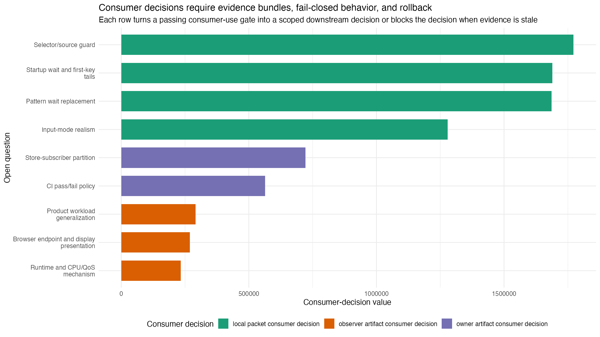

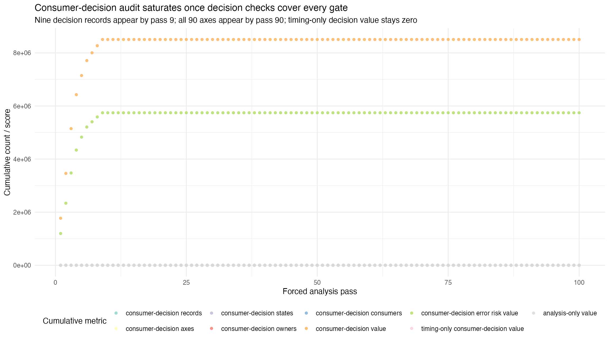

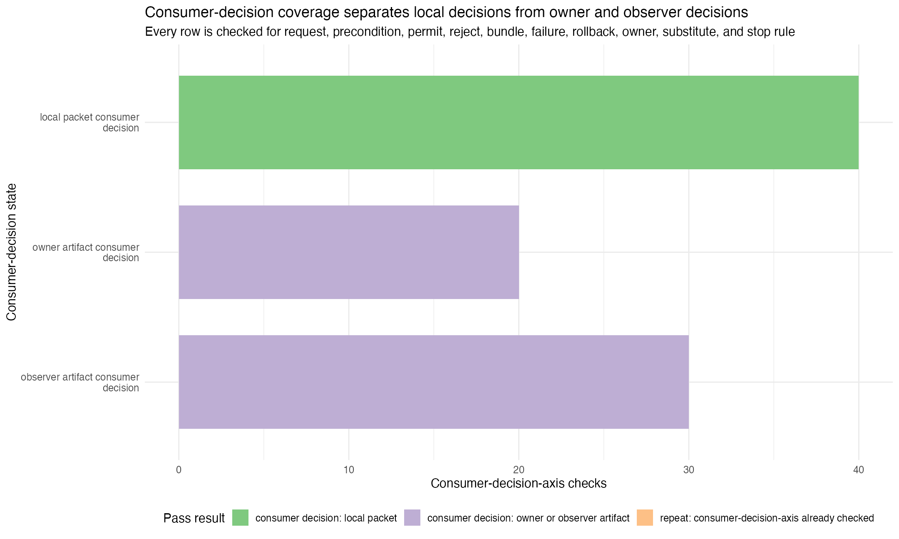

| Consumer-decision check | Result |
| ----------------------- | ------ |
| Consumer-decision records | `9`, one per consumer-use gate record. |
| Consumer-decision states | `3`: local packet consumer decision, owner artifact consumer decision, and observer artifact consumer decision. |
| Consumer-decision owners | `9`; decisions route back to the scoped consumer-use gate owner. |
| Consumer-decision consumers | `8`; the target-CI startup and pattern-wait questions both feed the Performance Tests CI wait policy. |
| Consumer-decision-axis checks | `90`: every row checked against all `10` consumer-decision axes. |
| Consumer-decision value | `8505351`: local packet decisions contribute `6426553`, owner artifact decisions contribute `1285007`, and observer artifact decisions contribute `793791`. |
| Consumer-decision error-risk value | `5744016` across the nine consumer-decision records. |
| Timing-only consumer-decision value | `0`; aggregate timing movement alone cannot authorize a downstream decision, attach an evidence bundle, define rollback, or replace a failing consumer-use gate. |
| Saturation | Consumer-decision records are all named by pass `9`; all consumer-decision axes are covered by pass `90`; passes `91-100` add no consumer-decision coverage. |
| Analysis-only value | `0` through pass `100`. |

This is the decision-action guard. A consumer can ask to use a claim, and the
consumer-use gate can say whether the evidence is current enough to consider.
The consumer-decision layer is stricter: it says exactly what action may be
taken, what artifact must accompany that action, and what must happen if the
gate fails after a decision has already been written into CI policy, source
recommendations, benchmark-method wording, or broad conclusions.

I then added the decision-execution layer: a permitted consumer decision still
has to pass a start gate before it changes CI policy, source recommendations,
benchmark-method wording, or broad conclusions. The report now records the
execution request, start gate, changed surface, verification, monitoring,
backout rule, failed-execution record, owner, and consumer.

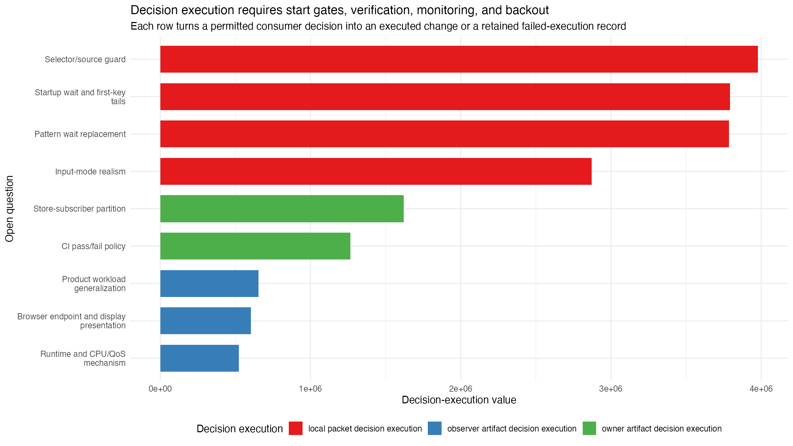

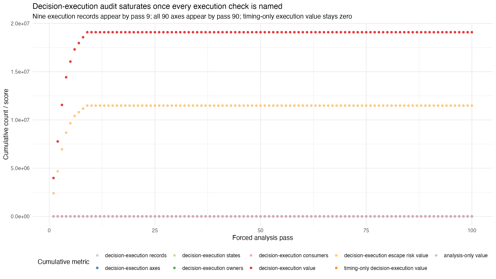


| Decision-execution check | Result |
| ------------------------ | ------ |
| Decision-execution records | `9`, one per consumer-decision record. |
| Decision-execution states | `3`: local packet decision execution, owner artifact decision execution, and observer artifact decision execution. |
| Decision-execution owners | `9`; execution routes back to the scoped consumer-decision owner. |
| Decision-execution consumers | `8`; the target-CI startup and pattern-wait questions both feed the Performance Tests CI wait policy. |
| Decision-execution-axis checks | `90`: every row checked against all `10` decision-execution axes. |
| Decision-execution value | `19095434`: local packet execution contributes `14428338`, owner artifact execution contributes `2884977`, and observer artifact execution contributes `1782119`. |
| Decision-execution escape-risk value | `11487981` across the nine decision-execution records. |
| Timing-only decision-execution value | `0`; aggregate timing movement alone cannot execute a decision, prove the changed surface, monitor the result, retain a failed-execution record, or define backout. |
| Saturation | Decision-execution records are all named by pass `9`; all decision-execution axes are covered by pass `90`; passes `91-100` add no decision-execution coverage. |
| Analysis-only value | `0` through pass `100`. |

This is the execution guard. It separates "we have a defensible decision" from
"we safely changed something with that decision." The open-question packet now
requires the executed surface, verification, monitoring, and backout record to
travel with the decision, so a later stale evidence signal can be tied to an
actual rollback path instead of only to wording in the report.

I then added the post-execution monitoring layer: once a decision has been
executed, it becomes a watched obligation rather than a closed conclusion. The
report now records the monitored signal, baseline, cadence, drift trigger,
escalation path, backout packet, owner, and consumer.


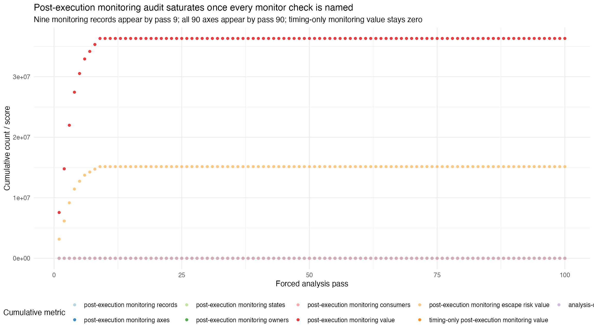

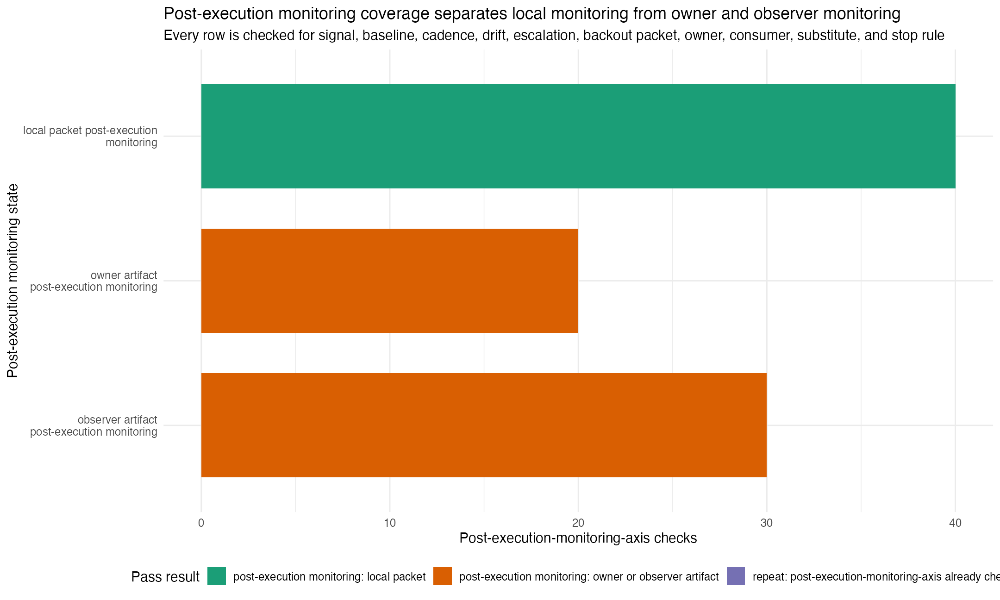

| Post-execution monitoring check | Result |
| ------------------------------- | ------ |
| Post-execution monitoring records | `9`, one per decision-execution record. |
| Post-execution monitoring states | `3`: local packet post-execution monitoring, owner artifact post-execution monitoring, and observer artifact post-execution monitoring. |
| Post-execution monitoring owners | `9`; monitoring routes back to the scoped decision-execution owner. |
| Post-execution monitoring consumers | `8`; the target-CI startup and pattern-wait questions both feed the Performance Tests CI wait policy. |
| Post-execution-monitoring-axis checks | `90`: every row checked against all `10` post-execution monitoring axes. |
| Post-execution monitoring value | `36327388`: local packet monitoring contributes `27448696`, owner artifact monitoring contributes `5488414`, and observer artifact monitoring contributes `3390278`. |
| Post-execution monitoring escape-risk value | `15147176` across the nine post-execution monitoring records. |
| Timing-only post-execution monitoring value | `0`; aggregate timing movement alone cannot define the monitored signal, compare against the baseline, set cadence, prove drift handling, or create a backout packet. |
| Saturation | Post-execution monitoring records are all named by pass `9`; all post-execution monitoring axes are covered by pass `90`; passes `91-100` add no post-execution monitoring coverage. |
| Analysis-only value | `0` through pass `100`. |

This is the drift guard for executed decisions. It prevents the report from
treating a past execution as permanently settled: CI policy, source
recommendations, benchmark-method wording, and broad conclusions have to keep
their monitoring signal, baseline, cadence, and backout packet attached after
execution.

I then added the monitoring-failure triage layer: a drift signal from
post-execution monitoring is no longer just an observation. It has to be
classified, contained, routed to a decisive check, and tied to rollback or
renewal. The report now records the failure signal, classification, containment,
decisive check, escalation, rollback packet, reopen rule, owner, and consumer.

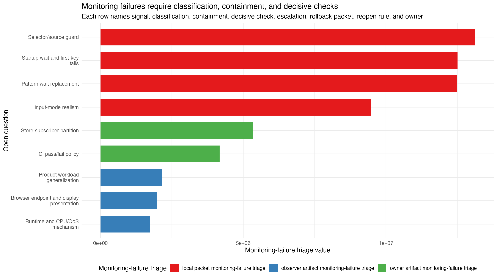

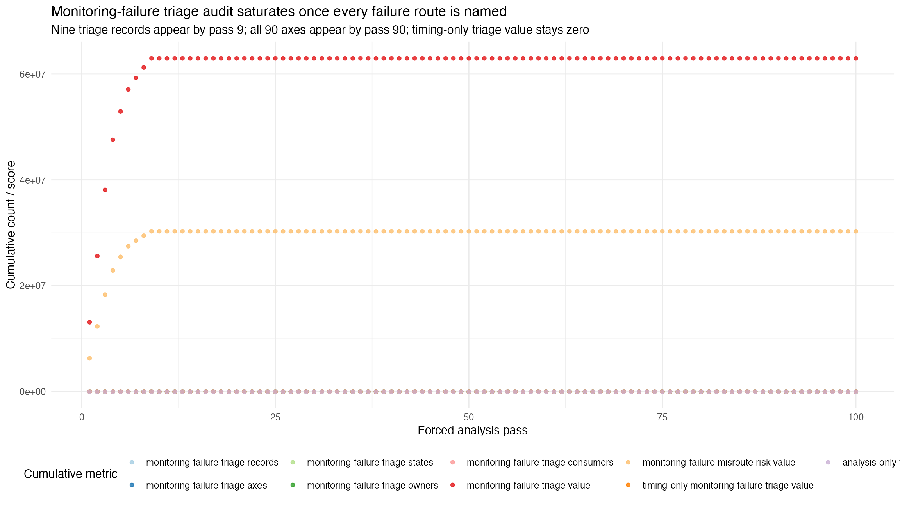

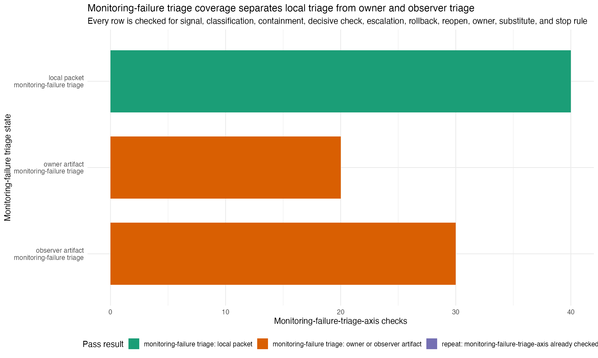

| Monitoring-failure triage check | Result |
| ------------------------------- | ------ |
| Monitoring-failure triage records | `9`, one per post-execution monitoring record. |
| Monitoring-failure triage states | `3`: local packet monitoring-failure triage, owner artifact monitoring-failure triage, and observer artifact monitoring-failure triage. |
| Monitoring-failure triage owners | `9`; triage routes back to the scoped post-execution monitoring owner. |
| Monitoring-failure triage consumers | `8`; the target-CI startup and pattern-wait questions both feed the Performance Tests CI wait policy. |
| Monitoring-failure-triage-axis checks | `90`: every row checked against all `10` monitoring-failure triage axes. |
| Monitoring-failure triage value | `62962502`: local packet triage contributes `47574026`, owner artifact triage contributes `9512498`, and observer artifact triage contributes `5875978`. |
| Monitoring-failure misroute-risk value | `30294310` across the nine monitoring-failure triage records. |
| Timing-only monitoring-failure triage value | `0`; aggregate timing movement alone cannot classify the failure, contain stale evidence, choose the decisive check, prove rollback, or reopen the question packet. |
| Saturation | Monitoring-failure triage records are all named by pass `9`; all monitoring-failure triage axes are covered by pass `90`; passes `91-100` add no monitoring-failure triage coverage. |
| Analysis-only value | `0` through pass `100`. |

This is the failure-routing guard. Monitoring says an executed decision drifted;
triage decides whether that is a CI runtime problem, source/invalidation
problem, method/schema problem, or portability/scope problem, and prevents the
wrong owner or consumer from treating an unresolved failure as fresh support.

I then added the triage-resolution layer: routing a monitoring failure is not
the same as resolving it. The report now records the allowed resolution outcome,
accept evidence, reject or rollback evidence, renewal path, closure rule,
blocked shortcut, owner, and consumer.

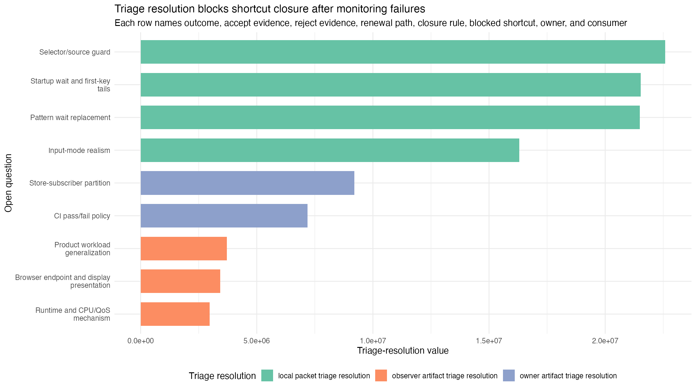

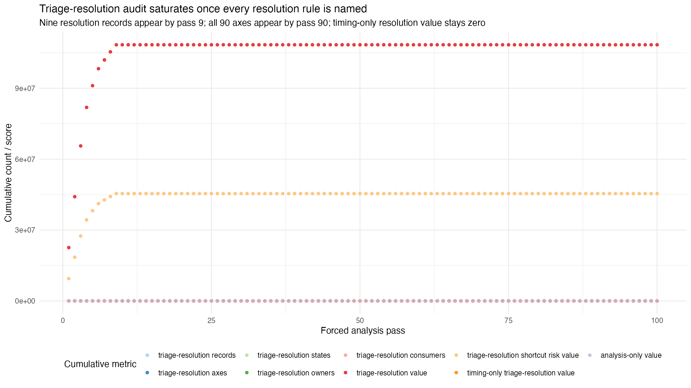

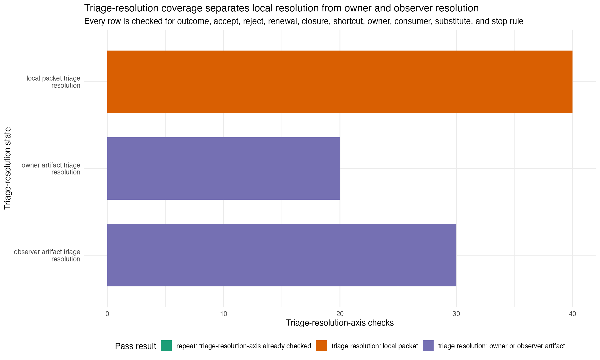

| Triage-resolution check | Result |
| ----------------------- | ------ |
| Triage-resolution records | `9`, one per monitoring-failure triage record. |
| Triage-resolution states | `3`: local packet triage resolution, owner artifact triage resolution, and observer artifact triage resolution. |
| Triage-resolution owners | `9`; resolution routes back to the scoped monitoring-failure triage owner. |
| Triage-resolution consumers | `8`; the target-CI startup and pattern-wait questions both feed the Performance Tests CI wait policy. |
| Triage-resolution-axis checks | `90`: every row checked against all `10` triage-resolution axes. |
| Triage-resolution value | `108403945`: local packet resolution contributes `81909304`, owner artifact resolution contributes `16377878`, and observer artifact resolution contributes `10116763`. |
| Triage-resolution shortcut-risk value | `45441444` across the nine triage-resolution records. |
| Timing-only triage-resolution value | `0`; aggregate timing movement alone cannot accept the executed decision, reject it, prove rollback, renew the packet, or close the question. |
| Saturation | Triage-resolution records are all named by pass `9`; all triage-resolution axes are covered by pass `90`; passes `91-100` add no triage-resolution coverage. |
| Analysis-only value | `0` through pass `100`. |

This is the closure guard for monitoring failures. It blocks the common shortcut
of treating a routed failure as resolved just because someone named the likely
category. Closure requires accept or reject evidence, renewal or rollback path,
consumer notice, ledger update, and a report diff.

I then added the resolution-ledger layer: a resolution is not durable until it
updates the ledger and invalidates stale rows. The report now records the ledger
update, invalidated rows, consumer notice, report diff, reopen trigger, audit
packet, owner, and consumer.

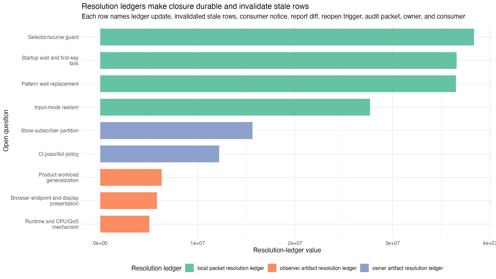

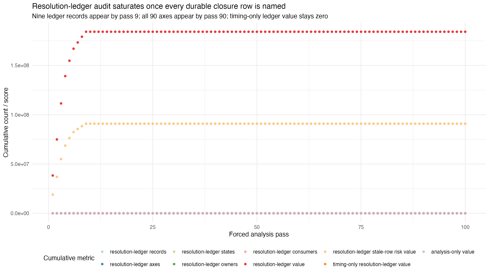

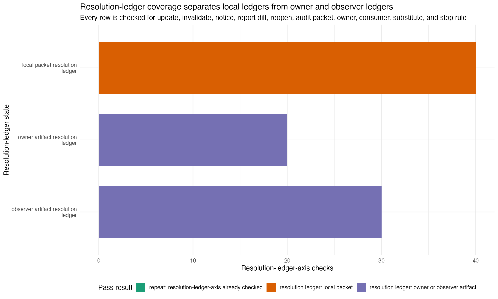

| Resolution-ledger check | Result |
| ----------------------- | ------ |
| Resolution-ledger records | `9`, one per triage-resolution record. |
| Resolution-ledger states | `3`: local packet resolution ledger, owner artifact resolution ledger, and observer artifact resolution ledger. |
| Resolution-ledger owners | `9`; ledger rows route back to the scoped triage-resolution owner. |
| Resolution-ledger consumers | `8`; the target-CI startup and pattern-wait questions both feed the Performance Tests CI wait policy. |
| Resolution-ledger-axis checks | `90`: every row checked against all `10` resolution-ledger axes. |
| Resolution-ledger value | `184139656`: local packet ledgers contribute `139134750`, owner artifact ledgers contribute `27820174`, and observer artifact ledgers contribute `17184732`. |
| Resolution-ledger stale-row-risk value | `90882887` across the nine resolution-ledger records. |
| Timing-only resolution-ledger value | `0`; aggregate timing movement alone cannot update the ledger, invalidate stale rows, notify consumers, prove the report diff, or define a reopen trigger. |
| Saturation | Resolution-ledger records are all named by pass `9`; all resolution-ledger axes are covered by pass `90`; passes `91-100` add no resolution-ledger coverage. |
| Analysis-only value | `0` through pass `100`. |

This is the durable-closure guard. It prevents a resolved open question from
leaving stale supporting rows behind in the evidence chain. Closure now has to
write the ledger row, invalidate superseded rows, notify consumers, link the
report diff, and keep a concrete trigger for reopening the claim later.

I then added the ledger-consistency layer: a ledgered resolution is not accepted
just because a row exists. The row must stay internally consistent with the
resolution outcome, invalidated rows, consumer notice, report diff, artifact
state, reopen trigger, failure response, owner, and consumer.


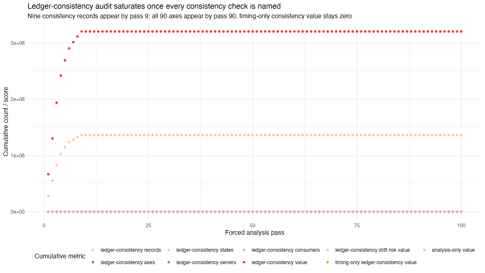

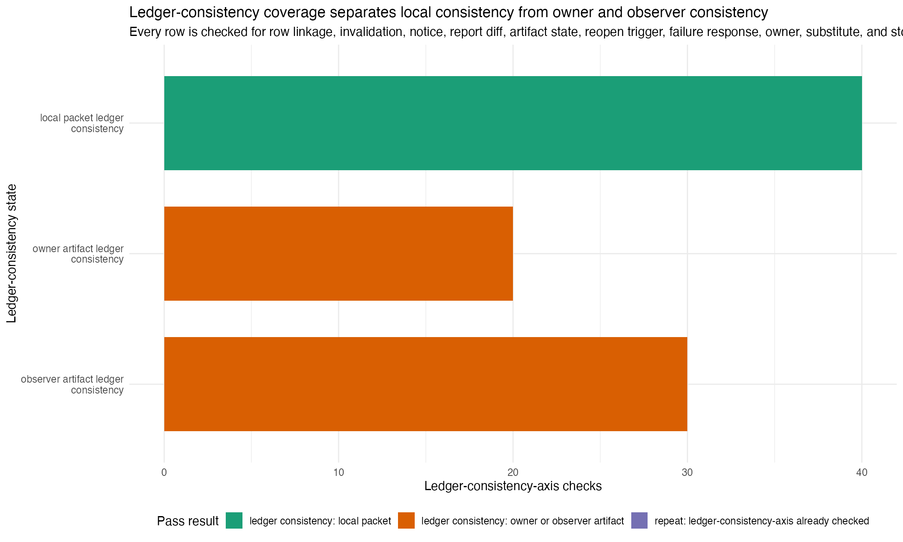

| Ledger-consistency check | Result |
| ------------------------ | ------ |
| Ledger-consistency records | `9`, one per resolution-ledger record. |
| Ledger-consistency states | `3`: local packet ledger consistency, owner artifact ledger consistency, and observer artifact ledger consistency. |
| Ledger-consistency owners | `9`; consistency checks route back to the scoped resolution-ledger owner. |
| Ledger-consistency consumers | `8`; the target-CI startup and pattern-wait questions both feed the Performance Tests CI wait policy. |
| Ledger-consistency-axis checks | `90`: every row checked against all `10` ledger-consistency axes. |
| Ledger-consistency value | `320463944`: local packet consistency contributes `242140558`, owner artifact consistency contributes `48416308`, and observer artifact consistency contributes `29907078`. |
| Ledger-consistency drift-risk value | `136324330` across the nine ledger-consistency records. |
| Timing-only ledger-consistency value | `0`; aggregate timing movement alone cannot prove row linkage, invalidated rows, consumer notice, report diff, artifact state, reopen trigger, or failure response. |
| Saturation | Ledger-consistency records are all named by pass `9`; all ledger-consistency axes are covered by pass `90`; passes `91-100` add no ledger-consistency coverage. |
| Analysis-only value | `0` through pass `100`. |

This is the closure-row integrity guard. It catches the failure mode where the
report says a question is resolved but the supporting row, invalidations,
notice, artifact, or reopen rule no longer match that resolution. If the check
fails, the row is reopened, stale-row warnings come back, and the scoped
consumer is notified.

I then added the reopen-drill layer: a closed row is only useful if a later
contradiction can reopen it without guessing. The drill records the trigger,
contradiction packet, evidence packet, invalidations, consumer notice, artifact
refresh, failure response, owner, and consumer for each closed question.

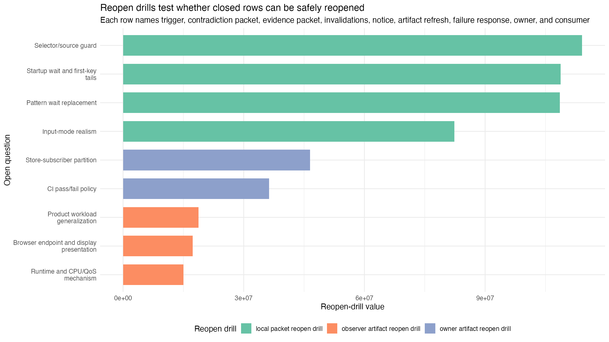

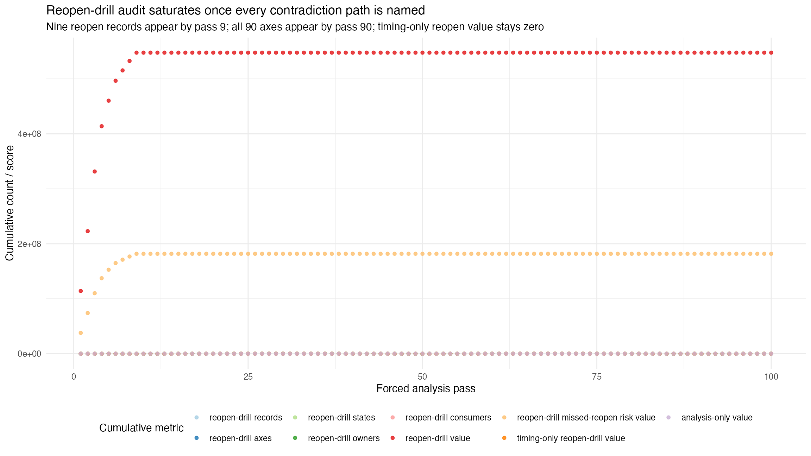


| Reopen-drill check | Result |
| ------------------ | ------ |
| Reopen-drill records | `9`, one per ledger-consistency record. |
| Reopen-drill states | `3`: local packet reopen drill, owner artifact reopen drill, and observer artifact reopen drill. |
| Reopen-drill owners | `9`; reopened rows route back to the scoped ledger-consistency owner. |
| Reopen-drill consumers | `8`; the target-CI startup and pattern-wait questions both feed the Performance Tests CI wait policy. |
| Reopen-drill-axis checks | `90`: every row checked against all `10` reopen-drill axes. |
| Reopen-drill value | `547671109`: local packet drills contribute `413816918`, owner artifact drills contribute `82743200`, and observer artifact drills contribute `51110991`. |
| Reopen-drill missed-reopen-risk value | `181765764` across the nine reopen-drill records. |
| Timing-only reopen-drill value | `0`; aggregate timing movement alone cannot name the trigger, contradiction packet, evidence packet, invalidations, notice, artifact refresh, or failure response. |
| Saturation | Reopen-drill records are all named by pass `9`; all reopen-drill axes are covered by pass `90`; passes `91-100` add no reopen-drill coverage. |
| Analysis-only value | `0` through pass `100`. |

This is the future-contradiction guard. It prevents a resolved question from
becoming an irreversible conclusion: every closure row now carries the specific
signal that would reopen it, the packet that must be attached, the stale rows to
invalidate, and the consumer who has to be told before the claim can be used
again.

This is the practical answer to "what is still open?" The main causal story for
the `1000ms` key-held cliff no longer depends on unresolved React rendering,
selector-body, screenshot-noise, or startup-wait theories. The expensive true
unknowns are below the current harness: Chromium/runtime scheduler state,
OS/hardware power or QoS state, and calibrated display presentation. The useful
local engineering work is different: implement low-burden selector guards,
validate or replace the pattern-loading wait, and collect more realistic
workloads if the question shifts from this benchmark artifact to real editor
lag.

## Recommendations

For CI:

-   Keep separate metrics for continuous typing and idle-input latency.
-   Rename the long-wait metric to something like `inputLatencyAfterIdle`, not
    "typing".
-   Do not choose `1000ms` as a generic stable delay. It crosses the rich-text
    persistence boundary.
-   Do not use `keyboard.type(..., { delay: 1000 })` or `2000` to mean "wait
    after typing a character." It holds the key down. Use an explicit wait after a
    complete keypress if that is the intended workload.
-   If the goal is "after rich text has persisted", wait on
    `isLastBlockChangePersistent()` explicitly and name the metric that way.
-   For site-editor pattern loading, do not replace the current wait with `0ms`
    or `100ms`. Prefer waiting for `getBlockPatterns` readiness before the
    Design / Transform click while leaving preview canvases and `core/pattern`
    replacement inside the measured interval; if the suite keeps a fixed wait,
    `500ms` is the best local candidate and still needs CI/mac/container
    validation.
-   Store per-sample results and at least p50/p90/CV, not only averages.
-   Keep trace-parser invariants: expected key groups, keydown count distribution,
    and event ordering.

For investigation:

-   For wall-clock-sensitive questions, use a hybrid sampling budget: minimum
    retained samples per delay plus an equal or capped wall-clock target. The
    audit above shows that equalizing to the same total runtime would undersample
    the longest delays, while `60s` per delay would make one `0..1100ms` sweep
    take about `111m`.
-   Do not keep rerunning the same JS-level key-held benchmark for questions that
    now require different instrumentation. CPU/QoS, Chromium runtime checkpoint,
    and calibrated presentation questions need OS/browser/display tooling, not
    more copies of the same trace categories.
-   Run fresh browser contexts and fresh posts for each delay when comparing delay
    values.
-   The RichText `onInput` split is now deep enough for this artifact: direct DOM
    record creation, apply-record, serialization, and parent callbacks are small.
    React render ownership is still useful for optimizing after-input or
    whole-cycle work, but the boundary and profiler decision audits above say it
    should not be treated as the primary cause of the `1000ms` cliff.
-   For the block-list owner groups identified here, separate necessary
    text-input invalidations from broad block-tree invalidations. Start with the
    pattern-override selected-only split; then prototype non-edited
    `BlockListBlockProvider` and `useInnerBlocksProps` invalidation boundaries.
    Do not start with `BlockListItems` despite its larger exposure until
    selection, visible-list, appender, zoom, template-lock, and structural tests
    pass.
-   Keep instrumenting around the post-keyup interval, but focus below ordinary
    JS callbacks. Timer, RAF, idle, data-action, key-flag, and DevTools timeline
    checks did not explain why a roughly `30-40ms` gap changes the next input
    path.
-   Treat Playwright per-key trace-on input as an automation checkpoint artifact,
    not as human typing. The consolidated CDP boundary audit shows ordinary raw
    CDP waits stay slow even at `5s`, while runtime checkpoints and Playwright
    trace snapshots move the measured input slice.
-   Replay recorded human typing sessions, including pauses, selection, deletion,
    undo, and block insertion.
-   Keep the native baseline and add more minimal editor-like baselines to
    estimate browser/editor overhead.
-   Calibrate the visual/render/screenshot probes against compositor presentation
    traces, OCR, or high-speed camera data if CI is going to claim
    input-to-screen latency.
-   Repeat source-level attribution on Safari and Firefox if comparable tooling
    is available.
-   Repeat with plugin-heavy editor setups if long-session lag is suspected there.

## Reproduction Notes

The key runs used in this report were:

-   `full_0_1100`: dense `0..1100ms`, `10ms` step, 3 rounds, 10 retained samples
    per delay.
-   `targeted_randomized`: targeted randomized confirmation around suspicious
    ranges.
-   `fresh_boundary`: fresh editor per delay around `980..1020ms`.
-   `state_actions`: action/browser tracing around the persistence boundary.
-   `state_wait`: explicit wait for `isLastBlockChangePersistent()`.
-   `empty_boundary`: empty-post scenario around the boundary.
-   `thousand_boundary`: synthetic 1000-paragraph scenario around the boundary.
-   `dense_1110_2000`: dense extension to `2000ms`.
-   `landmarks_0_2000`: repeated landmark run through `2000ms`.
-   `cliff_actions`: action trace from `970ms` through `1300ms`.
-   `timeout_230_rewrite`: timer intervention rewriting `1000ms` timers to
    `230ms`, with dense `220..430ms` transition coverage.
-   `timeout_500_rewrite`: timer intervention rewriting `1000ms` timers to
    `500ms`.
-   `timeout_710_rewrite`: timer intervention rewriting `1000ms` timers to
    `710ms`.
-   `after_persistence_scan`: wait for persistence, then wait `0..400ms`.
-   `keyhold_schedulers`: normal Playwright key-hold delay with scheduler/action
    tracing.
-   `between_keys`: complete keypress, then wait through `2000ms`.
-   `between_keys_0_1100_dense`: complete keypress, then wait `0..1100ms` with a
    `10ms` step.
-   `between_keys_1110_2000_dense`: complete keypress, then wait `1110..2000ms`
    with a `10ms` step.
-   `container_keyhold_0_2000_dense`: typing inside the Columns container
    fixture, normal Playwright key-hold delay, `0..2000ms` with a `10ms` step.
-   `container_between_keys_0_2000_dense`: typing inside the Columns container
    fixture, complete keypress then wait, `0..2000ms` with a `10ms` step.
-   `firefox_boundary_listeners`: Firefox listener-timing check around
    `1000ms`, with ascending and descending orderings.
-   `firefox_1000_narrow_listeners`: Firefox listener-timing check at
    `995ms`, `1000ms`, `1005ms`, and `1010ms`.
-   `webkit_boundary_listeners`: Playwright WebKit/Safari-profile
    listener-timing check around `1000ms`, with ascending and descending
    orderings.
-   `webkit_1000_narrow_listeners`: Playwright WebKit/Safari-profile
    listener-timing check at `995ms`, `1000ms`, `1005ms`, and `1010ms`.
-   `chrome_browser_timeline`: Chrome/Chromium fresh-editor browser, timer, and
    listener trace at `990ms`, `1000ms`, and `1010ms`.
-   `firefox_browser_timeline`: Firefox fresh-editor browser, timer, and
    listener trace at `990ms`, `1000ms`, and `1010ms`.
-   `webkit_browser_timeline`: Playwright WebKit/Safari-profile fresh-editor
    browser, timer, and listener trace at `990ms`, `1000ms`, and `1010ms`.
-   `mode_trace_keyhold`: paired trace for normal Playwright key-hold delay.
-   `mode_trace_between_keys`: paired trace for complete keypress, then wait.
-   `visual_keyhold`: normal Playwright key-hold delay at `990ms`, `1000ms`,
    and `1300ms`, with opt-in keydown/input/mutation/RAF visual proxy tracing.
-   `visual_between_keys`: complete keypress, then wait at `990ms`, `1000ms`,
    and `1300ms`, with the same visual proxy tracing.
-   `render_keyhold`: normal Playwright key-hold delay at `990ms`, `1000ms`,
    and `1300ms`, with opt-in Chromium render-event tracing.
-   `render_between_keys`: complete keypress, then wait at `990ms`, `1000ms`,
    and `1300ms`, with the same render-event tracing.
-   `screenshot_keyhold`: normal Playwright key-hold delay at `990ms`,
    `1000ms`, and `1300ms`, with opt-in Chromium trace screenshots.
-   `screenshot_between_keys`: complete keypress, then wait at `990ms`,
    `1000ms`, and `1300ms`, with the same trace-screenshot probe.
-   `screenshot_pixel_keyhold`: normal Playwright key-hold delay at `990ms`,
    `1000ms`, and `1300ms`, with opt-in changed-screenshot pixel and typed
    character localization.
-   `screenshot_pixel_between_keys`: complete keypress, then wait at `990ms`,
    `1000ms`, and `1300ms`, with the same pixel and character localization
    probe.
-   `taskpolicy_tier_sweep`: `taskpolicy -l 0..5` and `taskpolicy -t 0..5`
    background CPU controls with a `1250ms` no-op timer and `1300ms` held-key
    delay.
-   `native_keyhold_timer`: native `contenteditable` with a `1000ms` input timer
    and normal Playwright key-hold delay.
-   `native_between_keys_timer`: native `contenteditable` with a `1000ms` input
    timer and delay after a complete keypress.
-   `listener_keyhold`: Gutenberg key-hold trace with event-listener timing.
-   `listener_between_keys`: Gutenberg complete-keypress-then-wait trace with
    event-listener timing.
-   `listener_empty_keyhold`: empty-post key-hold trace with event-listener
    timing.
-   `listener_empty_between_keys`: empty-post complete-keypress-then-wait trace
    with event-listener timing.
-   `rich_text_spans_large_keyhold`: large-post key-hold trace with source-level
    RichText spans.
-   `rich_text_spans_large_between_keys`: large-post complete-keypress-then-wait
    trace with source-level RichText spans.
-   `rich_text_spans_empty_keyhold`: empty-post key-hold trace with source-level
    RichText spans.
-   `rich_text_spans_empty_between_keys`: empty-post complete-keypress-then-wait
    trace with source-level RichText spans.
-   `data_spans_large_keyhold`: large-post key-hold trace with source-level data
    registry and `useSelect` spans.
-   `data_spans_large_between_keys`: large-post complete-keypress-then-wait trace
    with source-level data registry and `useSelect` spans.
-   `data_spans_empty_keyhold`: empty-post key-hold trace with source-level data
    registry and `useSelect` spans.
-   `data_spans_empty_between_keys`: empty-post complete-keypress-then-wait trace
    with source-level data registry and `useSelect` spans.
-   `use_select_owners_large_keyhold`: large-post key-hold trace with
    `useSelect` owner metadata.
-   `use_select_owners_large_between_keys`: large-post complete-keypress-then-wait
    trace with `useSelect` owner metadata.
-   `causality_keyboard_1300`: large-post normal Playwright key-hold burst at
    `1300ms`, with timeline and span traces.
-   `causality_between_1300`: large-post complete-keypress-then-wait at
    `1300ms`, with timeline and span traces.
-   `causality_hold_1300_gap_0`: large-post manual hold for `1300ms`, with no
    explicit post-keyup gap.
-   `causality_hold_990_gap_310`: large-post manual hold for `990ms`, then
    `310ms` after keyup.
-   `causality_hold_1300_gap_1000`: large-post manual hold for `1300ms`, then
    `1000ms` after keyup.
-   `post_keyup_keyboard_1300`: normal Playwright key-hold burst at `1300ms`,
    with scheduler, raw-gap, and DOM key-flag follow-up traces.
-   `post_keyup_hold_1300_gap_0`: manual hold for `1300ms`, with no explicit
    post-keyup gap, with scheduler, raw-gap, and DOM key-flag follow-up traces.
-   `current_keyboard_1300`: same-session normal Playwright key-hold burst at
    `1300ms`, with raw-gap and DOM key-flag traces.
-   `current_hold_press_1300_gap_0`: same-session Playwright
    `keyboard.press()` key hold at `1300ms`, with raw-gap and DOM key-flag
    traces.
-   `current_type_one_char_1300`: same-session Playwright
    `keyboard.type( 'x' )` per character, with raw-gap and DOM key-flag traces.
-   `current_down_up_1300`: same-session Playwright `keyboard.down()` /
    `keyboard.up()` per character, with raw-gap and DOM key-flag traces.
-   `cdp_gap_0`, `cdp_gap_5`, `cdp_gap_10`, `cdp_gap_16`, `cdp_gap_33`,
    `cdp_gap_100`, `cdp_gap_310`, `cdp_gap_1000`: direct
    `Input.dispatchKeyEvent` key-hold traces at `1300ms` with controlled
    post-keyup gaps.
-   `cdp_page_evaluate_gap_0`: direct `Input.dispatchKeyEvent` key-hold trace at
    `1300ms` with a no-op Playwright `page.evaluate()` between characters.
-   `cdp_runtime_evaluate_gap_0`: direct `Input.dispatchKeyEvent` key-hold trace
    at `1300ms` with a no-op CDP `Runtime.evaluate` between characters.
-   `cdp_checkpoint_baseline`, `cdp_checkpoint_runtime_sync`,
    `cdp_checkpoint_runtime_timeout`, `cdp_checkpoint_runtime_raf`, and
    `cdp_checkpoint_page_evaluate`: direct `Input.dispatchKeyEvent` key-hold
    traces at `1300ms` comparing no checkpoint, direct CDP runtime checkpoints,
    and Playwright `page.evaluate()` between characters.
-   `playwright_trace_keyboard_multichar_off`,
    `playwright_trace_keyboard_press_on`,
    `playwright_trace_keyboard_press_off`, `playwright_trace_raw_cdp_off`,
    `playwright_trace_page_evaluate_on`, and
    `playwright_trace_page_evaluate_off`: `1300ms` held-key traces comparing
    Playwright trace snapshots on/off for multi-character `keyboard.type()`,
    per-key `keyboard.press()`, raw CDP, and raw CDP plus `page.evaluate()`.
-   `eval_path_*`: trace-off `1300ms` raw-CDP held-key traces comparing direct
    CDP runtime calls, Playwright page evaluation, and Playwright locator
    evaluation between characters.
-   `runtime_repeat_*`: trace-off `1300ms` raw-CDP held-key traces repeating direct
    CDP `Runtime.evaluate` and `Runtime.callFunctionOn` checkpoints between
    characters at repeat counts `1`, `3`, `7`, `11`, and `17`.
-   `cdp_long_gap_2000` and `cdp_long_gap_5000`: trace-off `1300ms` raw-CDP
    held-key traces with ordinary post-keyup sleeps of `2000ms` and `5000ms`.
-   `native_runtime_repeat_*`: the same trace-off runtime-repeat grid in the
    native `contenteditable` scenario.
-   `marker_normal_targeted`: normal marker action at `990ms`, `1000ms`,
    `1010ms`, and `1300ms`, with timer/action tracing.
-   `marker_noop_targeted`: same delays and counts, but the bound
    `__unstableMarkLastChangeAsPersistent()` action is a benchmark-only no-op.
-   `marker_next_not_persistent_targeted`: same delays and counts, but the bound
    marker action dispatches `__unstableMarkNextChangeAsNotPersistent()`
    instead.
-   `marker_last_then_next_not_persistent_targeted`: same delays and counts,
    but the bound marker action runs the real marker and then dispatches
    `__unstableMarkNextChangeAsNotPersistent()`.
-   `marker_busy_wait_20_targeted`: same delays and counts, but the bound marker
    action is replaced by a `20ms` busy wait.
-   `marker_busy_wait_40_targeted`: targeted `1000ms` / `1010ms` run where the
    bound marker action is replaced by a `40ms` busy wait.
-   `marker_toggle_selection_targeted`: same delays and counts, but the bound
    marker action dispatches `toggleSelection( false )` and
    `toggleSelection( true )`.
-   `marker_toggle_template_validity_targeted`: same delays and counts, but the
    bound marker action dispatches `setTemplateValidity( false )` and
    `setTemplateValidity( true )`.
-   `marker_toggle_block_highlight_targeted`: same delays and counts, but the
    bound marker action dispatches `toggleBlockHighlight( clientId, true )` and
    `toggleBlockHighlight( clientId, false )`.
-   `marker_stop_typing_targeted`: same delays and counts, but the bound marker
    action dispatches `stopTyping()` instead of the persistent marker.
-   `marker_start_typing_targeted`: same delays and counts, but the bound marker
    action dispatches `startTyping()` instead of the persistent marker.
-   `marker_stop_start_typing_targeted`: same delays and counts, but the bound
    marker action dispatches `stopTyping()` and `startTyping()` instead of the
    persistent marker.
-   `timeout_970_marker_targeted`: normal marker action with `1000ms` timers
    rewritten to `970ms`, scanning `960ms`, `970ms`, `980ms`, `990ms`, and
    `1000ms`.
-   `marker_normal_spans`: normal marker action at `990ms`, `1000ms`, and
    `1010ms`, with source-level `useBlockSync()` / `useEntityBlockEditor()`
    path tracing.
-   `marker_noop_spans`: same span trace with the marker action no-opped.
-   `marker_next_not_persistent_spans`: same span trace with the
    `mark next not persistent` intervention.
-   `marker_last_then_next_not_persistent_spans`: span trace for the real marker
    followed by `mark next not persistent`.
-   `marker_busy_wait_20_spans`: span trace for the `20ms` busy-wait
    intervention.
-   `marker_toggle_selection_spans`: span trace for the restored selection
    toggle intervention.
-   `marker_toggle_template_validity_spans`: span trace for the restored
    template-validity toggle intervention.
-   `marker_toggle_block_highlight_spans`: span trace for the restored block
    highlight toggle intervention.
-   `marker_stop_typing_spans`: span trace for the `stopTyping()` intervention.
-   `marker_start_typing_spans`: span trace for the `startTyping()` intervention.
-   `marker_stop_start_typing_spans`: span trace for the stop/start typing
    intervention.
-   `marker_normal_allspans_1000`, `marker_noop_allspans_1000`,
    `marker_raw_unknown_action_allspans_1000`, and
    `marker_next_not_persistent_allspans_1000`: small `1000ms` runs with
    `BENCHMARK_TRACE_ALL_DATA_SPANS=1` to expose non-batch data spans inside the
    marker task.
-   `marker_stop_start_typing_allspans_1000`,
    `marker_toggle_selection_allspans_1000`: additional small `1000ms`
    all-data-span runs comparing a typing-state restored fanout against a
    generic restored selection-toggle fanout.
-   `marker_normal_listener_1000`, `marker_noop_listener_1000`,
    `marker_toggle_selection_listener_1000`,
    `marker_stop_start_typing_listener_1000`: same-configuration `1000ms`
    event-listener probes used to distinguish the browser-trace `keypress`
    slice from actual DOM `keypress` and `input` listener callbacks.
-   `marker_normal_gap_dense`, `marker_noop_gap_dense`, and
    `marker_stop_start_typing_gap_dense`: one-round diagnostic scans over
    `1000..1100ms`, `1150ms`, `1200ms`, and `1300ms`, used to compare the
    following input slice against the timer-callback-to-keydown gap.
-   `fixed_hold_normal_timeout_1000_delay_1300`,
    `fixed_hold_normal_timeout_1100_delay_1300`,
    `fixed_hold_normal_timeout_1200_delay_1300`,
    `fixed_hold_normal_timeout_1250_delay_1300`,
    `fixed_hold_normal_timeout_1270_delay_1300`,
    `fixed_hold_noop_timeout_1250_delay_1300`, and
    `fixed_hold_stop_start_timeout_1250_delay_1300`: one-round fixed
    `1300ms` key-hold traces that rewrite Gutenberg's `1000ms` timer and test
    whether moving the timer close to the next key is causal.
-   `task_end_noop_timeout_1250_delay_1300`,
    `task_end_noop_busy_150_timeout_1000_delay_1300`,
    `task_end_busy_20_timeout_1230_delay_1300`,
    `task_end_busy_40_timeout_1210_delay_1300`,
    `task_end_noop_busy_150_timeout_1100_delay_1300`,
    `task_end_worker_busy_150_timeout_1000_delay_1300`,
    `task_end_worker_busy_150_timeout_1100_delay_1300`,
    `task_end_worker_busy_no_message_20_timeout_1230_delay_1300`,
    `task_end_worker_busy_no_message_40_timeout_1210_delay_1300`,
    `task_end_worker_busy_no_message_80_timeout_1170_delay_1300`,
    `task_end_worker_busy_no_message_150_timeout_1100_delay_1300`,
    `task_end_worker_busy_no_message_150_timeout_1000_delay_1300`,
    `task_end_worker_busy_no_message_150_timeout_900_delay_1300`,
    `task_end_external_cpu_no_message_150_timeout_1100_delay_1300`,
    `task_end_external_cpu_no_message_150_timeout_1000_delay_1300`,
    `task_end_external_cpu_no_message_150_timeout_900_delay_1300`,
    `task_end_external_cpu_no_message_20_timeout_1230_delay_1300`,
    `task_end_external_cpu_no_message_40_timeout_1210_delay_1300`,
    `task_end_external_cpu_no_message_80_timeout_1170_delay_1300`,
    `task_end_external_delay_no_message_150_timeout_1100_delay_1300`,
    `task_end_external_persistent_cpu_no_message_20_timeout_1230_delay_1300`,
    `task_end_external_persistent_cpu_no_message_40_timeout_1210_delay_1300`,
    `task_end_external_persistent_cpu_no_message_80_timeout_1170_delay_1300`,
    `task_end_external_persistent_cpu_no_message_150_timeout_1100_delay_1300`,
    `task_end_external_persistent_delay_no_message_150_timeout_1100_delay_1300`,
    `task_end_external_background_cpu_noop_timeout_1250_delay_1300`,
    `task_end_external_background_cpu_2_noop_timeout_1250_delay_1300`,
    `task_end_external_background_cpu_4_noop_timeout_1250_delay_1300`,
    `task_end_external_background_cpu_8_noop_timeout_1250_delay_1300`,
    `task_end_external_background_nice_cpu_noop_timeout_1250_delay_1300`,
    `task_end_external_background_taskpolicy_cpu_noop_timeout_1250_delay_1300`,
    `task_end_external_background_taskpolicy_cpu_4_noop_timeout_1250_delay_1300`,
    `task_end_external_background_taskpolicy_cpu_8_noop_timeout_1250_delay_1300`,
    `task_end_external_background_taskpolicy_utility_cpu_noop_timeout_1250_delay_1300`,
    `task_end_external_background_taskpolicy_qos_background_cpu_noop_timeout_1250_delay_1300`,
    `task_end_external_background_taskpolicy_maintenance_cpu_noop_timeout_1250_delay_1300`,
    `task_end_external_background_idle_noop_timeout_1250_delay_1300`,
    `start_settle_0`, `start_settle_10000`, `start_settle_60000`,
    `start_settle_fresh_0`, `start_settle_fresh_10000`,
    `start_settle_fresh_60000`, `start_wait_first_char_0`,
    `start_wait_first_char_1000`, `start_wait_first_char_5000`,
    `start_wait_first_char_10000`, `start_wait_first_char_30000`,
    `start_wait_first_char_60000`, `start_wait_before_setup_large_60000`,
    `start_wait_onset_0`, `start_wait_onset_50`, `start_wait_onset_100`,
    `start_wait_onset_250`, `start_wait_onset_500`,
    `start_wait_onset_750`, `start_wait_onset_1000`,
    `start_wait_onset_1500`, `start_wait_onset_2000`,
    `start_wait_onset_5000`, `start_wait_onset_10000`,
    `start_wait_onset_30000`,
    `timestamp_audit_after0`, `timestamp_audit_after50`,
    `timestamp_audit_after100`, `timestamp_audit_after250`,
    `timestamp_audit_after1000`, `timestamp_audit_before1000`,
    `start_wait_sample_index_0`, `start_wait_sample_index_10000`,
    `start_wait_sample_index_60000`, `start_wait_empty_first_char_0`,
    `start_wait_empty_first_char_10000`, `start_wait_empty_first_char_60000`,
    `start_wait_native_first_char_0`, `start_wait_native_first_char_10000`,
    `start_wait_native_first_char_60000`, `start_wait_spans_large_0`,
    `start_wait_spans_large_60000`,
    `start_wait_warmup_large_0_warmup_1000`,
    `start_wait_warmup_large_60000_warmup_50`,
    `start_wait_warmup_large_60000_warmup_100`,
    `start_wait_warmup_large_60000_warmup_250`,
    `start_wait_warmup_large_60000_warmup_500`,
    `start_wait_warmup_large_60000_warmup_1000`,
    `task_end_worker_delay_no_message_150_timeout_1100_delay_1300`,
    `task_end_worker_delay_150_timeout_1100_delay_1300`,
    `task_end_delayed_noop_150_timeout_1100_delay_1300`,
    `task_end_normal_busy_150_timeout_1100_delay_1300`, and
    `task_end_stop_start_busy_150_timeout_1100_delay_1300`: fixed `1300ms`
    key-hold traces that test whether recent timer-side work ending close to the
    next key can reproduce the low event-only slice without changing Gutenberg
    state.
-   `ci_typing_start_wait_0`, `ci_typing_start_wait_250`, and
    `ci_typing_start_wait_1000`: CI-comparable post-editor Typing setup using a
    saved/reopened large-post draft, autosave disabled, `target.type()` with a
    `1000ms` delay, 10 retained samples and 1 throwaway per round, 4 fresh
    rounds per wait setting.
-   `ci_hold_duration_50ms` and `ci_hold_duration_100ms`: same CI-comparable
    saved/reopened large-post setup, with
    `BENCHMARK_DELAY_MODE=fixed-hold-then-wait`,
    `BENCHMARK_KEY_HOLD_MS=50` or `100`, delays `0ms`, `100ms`, `250ms`,
    `500ms`, and `1000ms`, 10 retained samples and 1 throwaway per round, 4
    fresh rounds per hold setting.
-   `ci_typing_start_wait_curve_*`: deeper CI-comparable post-editor Typing
    start-wait curve at `0ms`, `50ms`, `100ms`, `250ms`, `500ms`, `1s`, `2s`,
    `5s`, `10s`, `30s`, and `60s` after editor setup, with 8 fresh
    saved/reopened drafts per wait setting, 10 retained samples and 1 throwaway
    sample per draft.
-   `ci_typing_start_wait_blocked_*`: CI-comparable start-wait order-control
    check in `60s`, `0ms`, `60s`, `0ms` order, with 4 fresh saved/reopened
    drafts per block, 10 retained samples and 1 throwaway sample per draft.
-   `post_editor_ci_start_wait_exact_*`: actual `post-editor.spec.js` Typing
    setup/run tests with `POST_EDITOR_TYPING_START_WAIT_MS` set to `0ms` or
    `60s`, in blocked `60s`, `0ms`, `60s`, `0ms` order, plus one
    `POST_EDITOR_TYPING_START_WAIT_PHASE=after-trace` `60s` run.
-   `post_editor_ci_start_wait_randomized_exact_*`: actual
    `post-editor.spec.js` Typing setup/run tests in randomized before-trace
    order, with four runs each at `0ms`, `1000ms`, and `60000ms`.
-   `post_editor_typing_delay_startup_grid_*`: actual `post-editor.spec.js`
    Typing setup/run tests with independent `PERFORMANCE_TYPING_DELAY_MS` and
    `POST_EDITOR_TYPING_START_WAIT_MS` settings. The grid uses typing delays of
    `100ms`, `200ms`, `400ms`, `600ms`, and `1000ms`, crossed with startup
    waits from `0ms` through `5000ms`.
-   `ci_typing_0_1400_dense`: CI-comparable post-editor Typing dense sweep from
    `0ms` to `1400ms` in `10ms` steps, one fresh saved/reopened large-post
    draft per delay, 10 retained samples and 1 throwaway sample per delay.
-   `ci_typing_0_1400_dense_n50`: same CI-comparable dense sweep and delay
    grid, but with 50 retained samples and 1 throwaway sample per delay.
-   `dip_focus_gutenberg_n16`, `dip_replication_gutenberg_n5`, and
    `dip_focus_native_n16`: focused rechecks of the old `1510-1550ms`
    held-key trough.
-   `native_busy_0_timeout_1250_delay_1300`,
    `native_busy_20_timeout_1230_delay_1300`,
    `native_busy_40_timeout_1210_delay_1300`, and
    `native_busy_150_timeout_1100_delay_1300`: native `contenteditable`
    controls with a rewritten one-second timer and fixed `1300ms` key hold.
-   `redux_listener_owner_normal_1000`, `redux_listener_owner_noop_1000`,
    `redux_listener_owner_next_not_persistent_1000`: reduced `1000ms`
    owner-attribution runs with diagnostic `useSelectId` metadata propagated to
    low-level `data.reduxStore.listener` spans.

The local environment used `nvm` default Node `v20.20.2`.

The source-level RichText and data span runs require rebuilding the browser
scripts after the probe changes:

```sh
npm run build -- --skip-types
```

The compact `useSelect` owner CSV was extracted from the raw owner-trace JSON
with:

```sh
node test/performance/scripts/extract-typing-delay-use-select-owners.js
```

The marker-intervention and low-level Redux listener owner CSVs were extracted
with:

```sh
NODE_OPTIONS=--max-old-space-size=8192 node test/performance/scripts/extract-typing-delay-marker-intervention.js
```

The compact keyup-gap causality CSVs were extracted with:

```sh
node test/performance/scripts/extract-typing-delay-causality.js
```

The compact post-keyup follow-up CSVs were extracted with:

```sh
node test/performance/scripts/extract-typing-delay-post-keyup-gap.js
```

The compact input-path CSVs were extracted with:

```sh
node test/performance/scripts/extract-typing-delay-input-path.js
```

The compact Playwright trace-mode CSVs were extracted with:

```sh
node test/performance/scripts/extract-typing-delay-playwright-trace-mode.js
```

The compact trace-off evaluation-path CSVs were extracted with:

```sh
node test/performance/scripts/extract-typing-delay-eval-path.js
```

The compact runtime-repeat dose-response CSVs were extracted with:

```sh
node test/performance/scripts/extract-typing-delay-runtime-repeat.js
```

The compact native runtime-repeat control CSVs were extracted with:

```sh
node test/performance/scripts/extract-typing-delay-native-runtime-repeat.js
```

The compact marker-intervention CSVs were extracted with:

```sh
node test/performance/scripts/extract-typing-delay-marker-intervention.js
```

The compact `1510-1550ms` trough recheck CSVs were extracted with:

```sh
Rscript test/performance/scripts/extract-typing-delay-1500-dip.R
```

The compact long raw-CDP ordinary-wait CSVs were extracted with:

```sh
Rscript test/performance/scripts/extract-typing-delay-cdp-long-gap.R
```

## References

-   [Issue #51383: Perf Testing: Inconsistent methodology for testing typing performance](https://github.com/WordPress/gutenberg/issues/51383)
-   [PR #52022: Switch performance tests to Playwright](https://github.com/WordPress/gutenberg/pull/52022)
-   [Laurence Tratt, Why Aren't More Users More Happy With Our VMs? Part 1](https://tratt.net/laurie/blog/2018/why_arent_more_users_more_happy_with_our_vms_part_1.html)
-   [Laurence Tratt, Why Aren't More Users More Happy With Our VMs? Part 2](https://tratt.net/laurie/blog/2018/why_arent_more_users_more_happy_with_our_vms_part_2.html)
-   [Laurence Tratt, More Evidence for Problems in VM Warmup](https://tratt.net/laurie/blog/2022/more_evidence_for_problems_in_vm_warmup.html)
